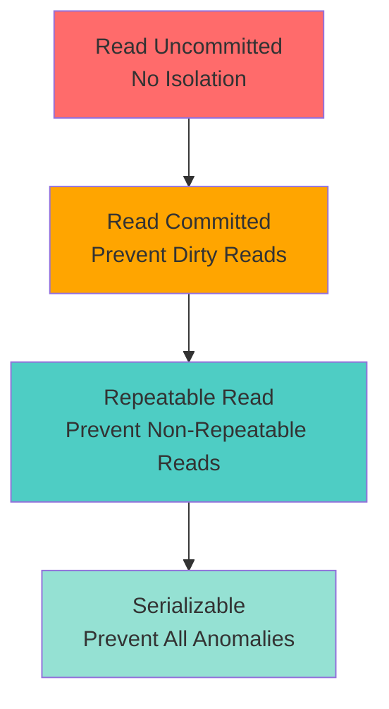
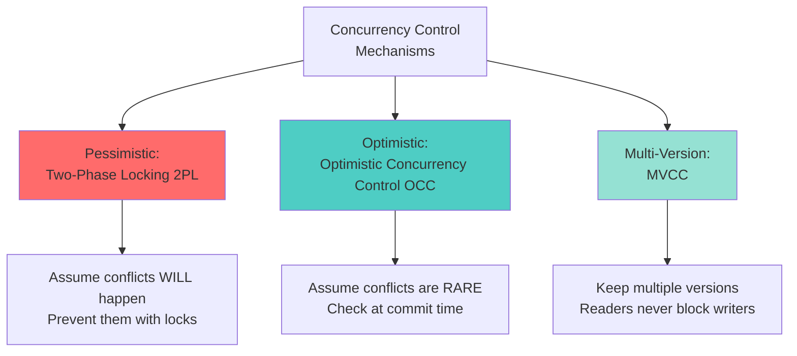
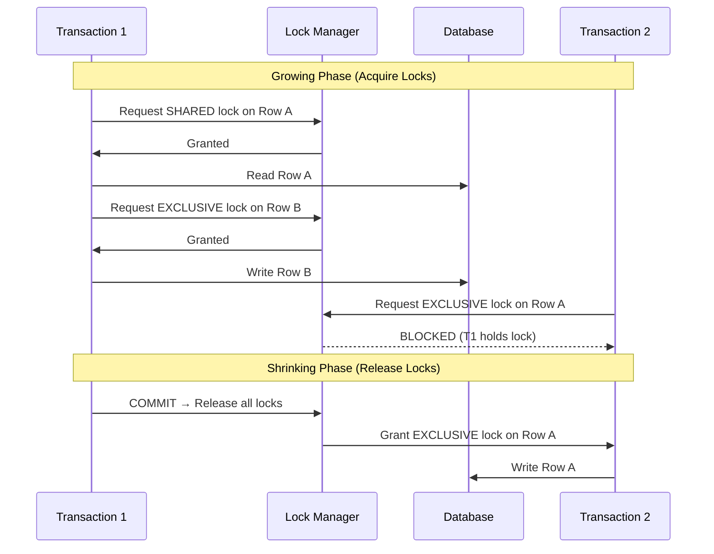
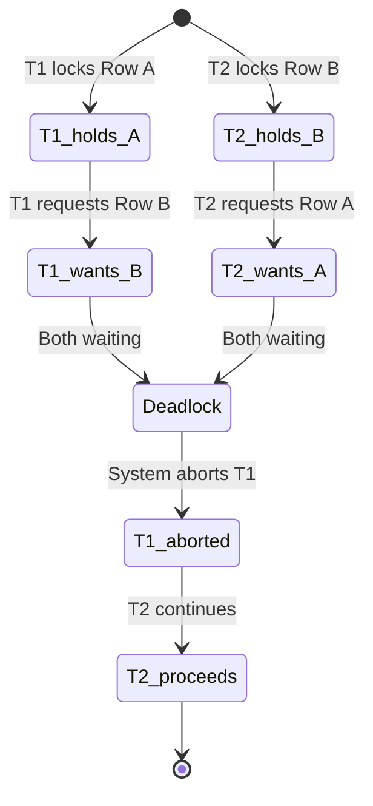
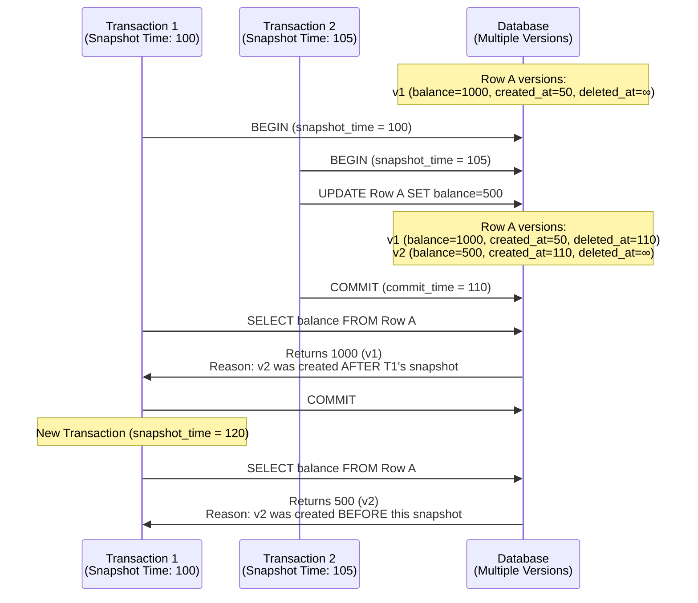
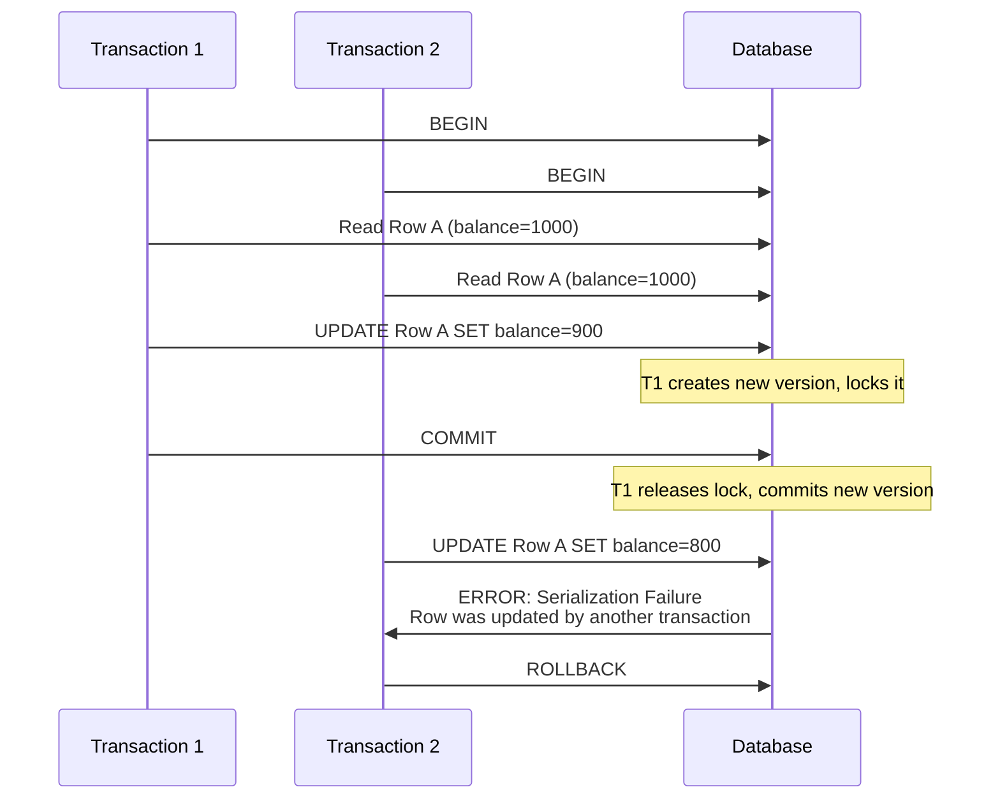
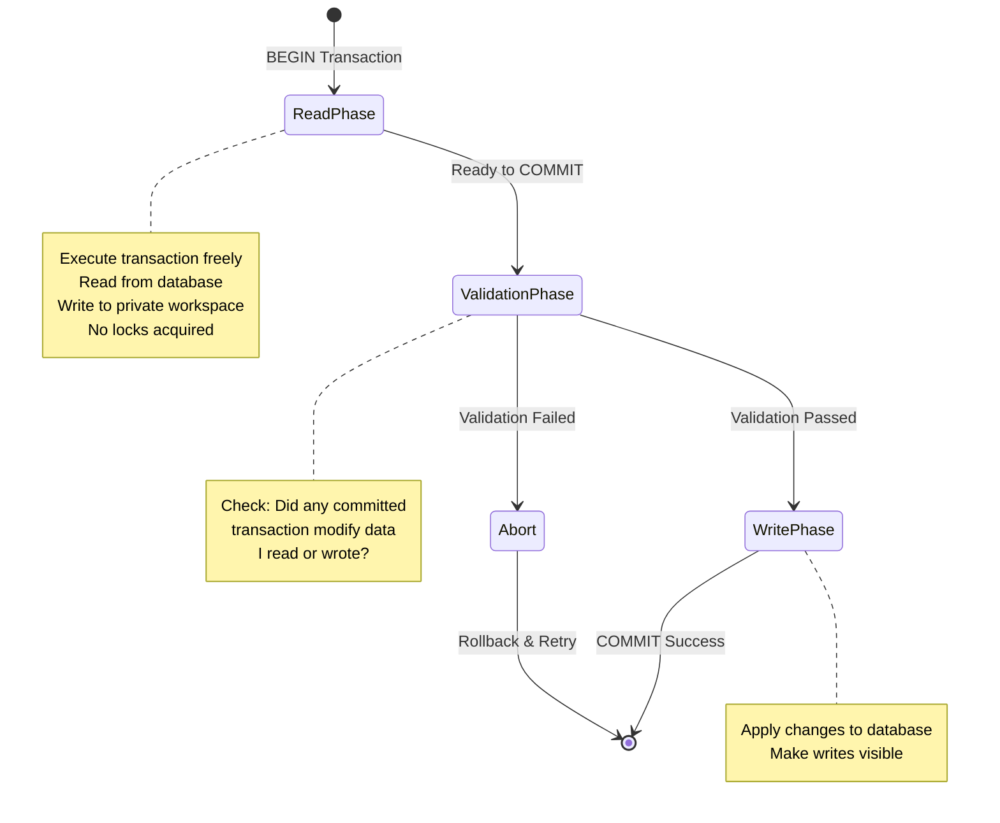
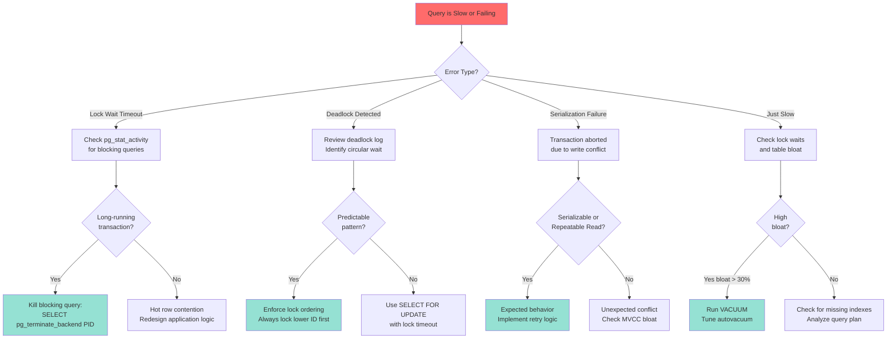

#system-design #database #concurrency #transactions

# Database Concurrency Control

---

## Intuition (30 sec)

Imagine 100 people trying to edit the same Google Doc simultaneously. Without rules, everyone would overwrite each other's changes and create chaos. Database concurrency control is the set of rules that allows multiple users to read and modify data at the same time without corrupting it—like Google Docs' automatic conflict resolution, but for database transactions.

---

## Failure-First Scenario

**The Double-Spending Bug:**

An e-commerce site processes two simultaneous refunds for the same $100 purchase:

```
Time 1: Transaction A reads balance: $500
Time 2: Transaction B reads balance: $500
Time 3: Transaction A adds $100 → balance = $600, commits
Time 4: Transaction B adds $100 → balance = $600, commits

Result: Balance is $600 instead of $700. Lost $100.
```

Without proper isolation levels and locking, the second transaction overwrote the first. The customer got one refund instead of two. This is a **lost update anomaly**—one of the core problems concurrency control prevents.

---

## Working Knowledge (5 min)

### Core Concept - Concurrency Control Defined

**Concurrency Control:**
- **Definition:** A mechanism that manages simultaneous access to database data by multiple transactions to ensure data consistency and integrity
- **Purpose:** Prevent anomalies (dirty reads, lost updates, phantom reads) that occur when transactions execute concurrently
- **How it works:** Uses locking, versioning, or validation to coordinate access to shared data, ensuring transactions appear to execute in isolation

**Key Terms:**
- **Transaction:** A sequence of database operations treated as a single unit (all succeed or all fail)
- **Isolation Level:** The degree to which a transaction is isolated from the effects of other concurrent transactions
- **Lock:** A mechanism that prevents other transactions from accessing data while one transaction is using it
- **MVCC (Multi-Version Concurrency Control):** A technique where each transaction sees a consistent snapshot of data by maintaining multiple versions

### Visual Model: The Four Isolation Levels



### Comparison Table: Isolation Levels

| Level | Dirty Read | Non-Repeatable Read | Phantom Read | Concurrency | Use Case |
|---|---|---|---|---|---|
| **Read Uncommitted** | ❌ Possible | ❌ Possible | ❌ Possible | ⭐⭐⭐⭐⭐ Highest | Logging, analytics (approximate data OK) |
| **Read Committed** | ✅ Prevented | ❌ Possible | ❌ Possible | ⭐⭐⭐⭐ High | Most web apps (default in PostgreSQL) |
| **Repeatable Read** | ✅ Prevented | ✅ Prevented | ❌ Possible* | ⭐⭐⭐ Moderate | Financial transactions, inventory |
| **Serializable** | ✅ Prevented | ✅ Prevented | ✅ Prevented | ⭐⭐ Lowest | Critical systems (banking, bookkeeping) |

*Note: PostgreSQL's Repeatable Read actually prevents phantom reads through MVCC, unlike the SQL standard

---

## Layer 1: Conceptual Precision (15 min)

### Transaction Anomalies - Deep Definitions

#### 1. Dirty Read

**Formal Definition:** A dirty read occurs when a transaction reads data written by another transaction that has not yet been committed, potentially reading data that will be rolled back.

**Simple Definition:** You read someone else's unfinished work. If they undo it, you based your decision on data that never existed.

**Analogy:** Reading a draft email from someone's screen before they hit send. They might delete it entirely, but you've already reacted to what you read.

**Example:**
```
T1: BEGIN
T1: UPDATE accounts SET balance = 1000 WHERE id = 1  (writes but doesn't commit)
T2: BEGIN
T2: SELECT balance FROM accounts WHERE id = 1  → reads 1000 (DIRTY READ)
T1: ROLLBACK  (undoes the change)

T2 read 1000, but the actual balance is the original value.
T2 made decisions based on phantom data.
```

**Why this matters:** If T2 approves a loan based on seeing balance = 1000, but T1 rolls back, the loan approval is based on incorrect information.

---

#### 2. Non-Repeatable Read

**Formal Definition:** A non-repeatable read occurs when a transaction reads the same row multiple times and gets different values because another transaction modified and committed the row between the reads.

**Simple Definition:** You read the same data twice within your transaction and get different answers because someone changed it in the middle.

**Analogy:** You check a product's price, add it to your cart, then check again—and the price has increased because someone changed it while you were shopping.

**Example:**
```
T1: BEGIN
T1: SELECT balance FROM accounts WHERE id = 1  → reads 1000
T2: BEGIN
T2: UPDATE accounts SET balance = 500 WHERE id = 1
T2: COMMIT
T1: SELECT balance FROM accounts WHERE id = 1  → reads 500 (DIFFERENT VALUE)
T1: COMMIT

T1 saw two different values for the same row within one transaction.
```

**Why this matters:** If T1 is generating a report, the same account balance appears with two different values in the same report, causing inconsistency.

---

#### 3. Phantom Read

**Formal Definition:** A phantom read occurs when a transaction re-executes a query with a WHERE condition and gets a different set of rows because another transaction inserted or deleted rows that match the condition.

**Simple Definition:** You run the same search query twice and get different results because new rows appeared or disappeared.

**Analogy:** You count cars in a parking lot, turn around for 5 seconds, count again, and there are more cars—they "appeared like phantoms."

**Example:**
```
T1: BEGIN
T1: SELECT COUNT(*) FROM orders WHERE status = 'pending'  → returns 5
T2: BEGIN
T2: INSERT INTO orders (status) VALUES ('pending')
T2: COMMIT
T1: SELECT COUNT(*) FROM orders WHERE status = 'pending'  → returns 6 (PHANTOM)
T1: COMMIT

A new row "appeared" that matched T1's query condition.
```

**Why this matters:** If T1 is computing aggregate statistics (average, sum, count), the results are inconsistent within the same transaction.

---

#### 4. Lost Update

**Formal Definition:** A lost update occurs when two transactions read the same data and then both update it based on the original value, causing one update to be overwritten by the other.

**Simple Definition:** Two people read the same value, both make changes based on what they read, and the first person's change gets erased.

**Analogy:** Two people see there are 3 apples left. Person A takes 1 apple and updates the count to 2. Person B takes 2 apples and updates the count to 1. Reality: 0 apples left, but the count says 1 because one update was lost.

**Example:**
```
T1: SELECT balance FROM accounts WHERE id = 1  → reads 1000
T2: SELECT balance FROM accounts WHERE id = 1  → reads 1000
T1: UPDATE accounts SET balance = 1000 - 100 WHERE id = 1  → balance = 900
T2: UPDATE accounts SET balance = 1000 - 200 WHERE id = 1  → balance = 800
T2: COMMIT (overwrites T1's update)

T1's deduction of $100 was lost. Balance should be $700, not $800.
```

**Why this matters:** Financial transactions can lose money. Inventory counts become inaccurate. Critical in any system that does read-modify-write operations.

---

### Concurrency Control Mechanisms



---

### 1. Two-Phase Locking (2PL) - Deep Dive

**Formal Definition:** Two-Phase Locking is a concurrency control protocol where each transaction acquires all required locks before releasing any (growing phase) and releases all locks after all operations complete (shrinking phase), ensuring serializability.

**Simple Definition:** Before you touch any data, you lock it. You never unlock anything until you're completely done. This prevents conflicts but can cause waiting.

**Analogy:** Library book system—you check out all books you need, do your research, then return them all at once. Nobody can check out your books while you have them.

---

#### How 2PL Works (Visual Flow)



**Step-by-step breakdown:**
1. **Growing Phase:** Transaction acquires shared locks (for reads) and exclusive locks (for writes) as needed. Never releases any lock during this phase.
2. **Lock Point:** The moment when the transaction has acquired all locks it will ever need. This is the transition between phases.
3. **Shrinking Phase:** Transaction releases all locks, typically at COMMIT or ROLLBACK. No new locks can be acquired.
	
**Why two phases?** This ensures serializability—transactions can be ordered by their lock points, guaranteeing the result is equivalent to some serial execution.

---

#### Lock Types

**Lock Compatibility Matrix:**

|  | Shared Lock (S) | Exclusive Lock (X) |
|---|---|---|
| **Shared Lock (S)** | ✅ Compatible | ❌ Conflicts |
| **Exclusive Lock (X)** | ❌ Conflicts | ❌ Conflicts |

**Definitions:**
- **Shared Lock (S-Lock):** Allows multiple transactions to read but not write. Multiple readers can hold shared locks simultaneously.
- **Exclusive Lock (X-Lock):** Grants exclusive access for writing. No other transaction can hold any lock (shared or exclusive) on the same data.
- **Lock Upgrade:** Converting a shared lock to an exclusive lock when a transaction needs to write data it previously read.

---

#### Deadlock in 2PL

**Definition:** A deadlock occurs when two or more transactions are waiting for each other to release locks, creating a circular dependency that prevents all of them from proceeding.



**Real Example:**
```sql
-- Transaction 1
BEGIN;
UPDATE accounts SET balance = balance - 100 WHERE id = 1;  -- Locks row 1
-- T1 now needs row 2...
UPDATE accounts SET balance = balance + 100 WHERE id = 2;  -- Waits for T2

-- Transaction 2 (running concurrently)
BEGIN;
UPDATE accounts SET balance = balance - 50 WHERE id = 2;   -- Locks row 2
-- T2 now needs row 1...
UPDATE accounts SET balance = balance + 50 WHERE id = 1;   -- Waits for T1

-- DEADLOCK! Both are waiting for each other.
-- Database detects this and aborts one transaction.
```

**Deadlock Detection:** Databases maintain a **wait-for graph** and detect cycles. When found, one transaction is chosen as a "victim" and aborted.

**Deadlock Prevention Strategies:**
- **Lock Timeout:** Abort transactions that wait too long
- **Lock Ordering:** Always acquire locks in the same order (e.g., always lock lower ID first)
- **Wait-Die/Wound-Wait:** Timestamp-based schemes where older transactions get priority

---

### 2. Multi-Version Concurrency Control (MVCC)

**Formal Definition:** MVCC is a concurrency control method where the database maintains multiple versions of each data item, allowing each transaction to read a consistent snapshot without blocking writers, achieving high concurrency.

**Simple Definition:** Instead of locking and blocking, create a new copy when someone writes. Each reader sees their own consistent snapshot of the data.

**Analogy:** Google Docs version history. When you edit, it creates a new version. Someone viewing an older version isn't blocked by your edits, and you aren't blocked by viewers.

**Related Terms:**
- **Snapshot Isolation:** Each transaction sees a consistent snapshot of the database as of its start time
- **Read View:** The set of active transactions when a transaction begins, determining which versions are visible

---

#### How MVCC Works (Visual Flow)



**Step-by-step breakdown:**
1. **Transaction Start:** Each transaction receives a unique timestamp (snapshot ID)
2. **Read Operation:** Transaction reads the latest version that was committed before its snapshot time
3. **Write Operation:** Creates a new version with the transaction's timestamp, keeping old version intact
4. **Version Visibility:** A version is visible if it was created before the transaction's snapshot and not deleted before the snapshot
5. **Garbage Collection:** Old versions that no active transaction can see are eventually removed (VACUUM in PostgreSQL)

---

#### MVCC Architecture Pattern

```
┌─────────────────────────────────────────────────────────┐
│                   Transaction T1                        │
│                   Snapshot ID: 100                      │
│                                                         │
│  Definition: Each transaction has a snapshot ID that    │
│  determines which data versions it can see              │
└────────────────────┬────────────────────────────────────┘
                     │
                     │ Reads Row A
                     │
                     ▼
┌─────────────────────────────────────────────────────────┐
│              Version Storage (Row A)                    │
├─────────────────────────────────────────────────────────┤
│  v1: balance=1000 | xmin=50 | xmax=∞                   │
│      ↑ Visible to T1 (created before snapshot 100)     │
│                                                         │
│  v2: balance=800  | xmin=110 | xmax=∞                  │
│      ↓ NOT visible to T1 (created after snapshot 100)  │
└─────────────────────────────────────────────────────────┘

Version Metadata:
- xmin: Transaction ID that created this version
- xmax: Transaction ID that deleted/updated this version (∞ if current)
- Transaction sees version IF: xmin < snapshot_id AND
                                (xmax = ∞ OR xmax > snapshot_id)
```

**Component Definitions:**
- **Snapshot ID (Transaction ID):** Monotonically increasing number assigned when transaction starts
- **xmin:** The transaction ID that created this row version
- **xmax:** The transaction ID that deleted or updated this row (infinity if still current)
- **Version Chain:** Linked list of all versions of the same logical row

---

#### Write Conflicts in MVCC

**First Committer Wins Rule:**



**Definition:** When two transactions try to modify the same row, the first one to commit wins. The second transaction receives a serialization error and must retry.

**Why this matters:** MVCC allows non-blocking reads but still prevents lost updates by detecting write conflicts at commit time.

---

### 3. Optimistic Concurrency Control (OCC)

**Formal Definition:** OCC is a concurrency control method that allows transactions to execute without acquiring locks, deferring conflict detection until commit time by validating that no conflicting transactions committed during execution.

**Simple Definition:** Assume no conflicts will happen. Do all your work freely. At the end, check if anyone else modified your data. If yes, retry.

**Analogy:** Shopping without reserving items. You add things to your cart, go to checkout, and only then discover if items are still available or if someone else bought them.

---

#### OCC Three-Phase Protocol



**Phase Definitions:**

1. **Read Phase:**
   - **Definition:** Transaction reads data from the database and performs all computations
   - **Mechanism:** Writes go to a private workspace (not visible to other transactions)
   - **No Blocking:** No locks are acquired; maximum concurrency

2. **Validation Phase:**
   - **Definition:** At commit time, check if any other transaction that committed during our execution modified data we accessed
   - **Validation Rules:**
     - Check if any committed transaction wrote to data we read
     - Check if any committed transaction wrote to data we wrote
     - If conflict detected: ABORT
     - If no conflict: proceed to write phase

3. **Write Phase:**
   - **Definition:** Apply all changes from private workspace to the actual database atomically
   - **Mechanism:** Make writes visible, release transaction, return success

---

#### OCC Example: Write Conflict

```sql
-- Both transactions want to update inventory

-- Transaction 1
BEGIN;
  SELECT quantity FROM inventory WHERE product_id = 100;  -- reads 10
  -- Business logic: reduce by 3
  -- Writes to private workspace: quantity = 7

-- Transaction 2 (overlapping)
BEGIN;
  SELECT quantity FROM inventory WHERE product_id = 100;  -- reads 10
  -- Business logic: reduce by 5
  -- Writes to private workspace: quantity = 5

-- T1 tries to commit first
COMMIT;  -- Validation passes, writes quantity=7 to database

-- T2 tries to commit
COMMIT;  -- Validation FAILS:
         -- "product_id=100 was modified by T1 after I read it"
         -- ERROR: could not serialize access due to concurrent update
ROLLBACK;
-- T2 must retry entire transaction with fresh data
```

**When OCC Works Well:**
- Low contention (users editing different records)
- Read-heavy workloads
- Short transactions

**When OCC Fails:**
- High contention (many users editing same records)
- Long transactions (higher probability of conflicts)
- Hot rows (e.g., incrementing a global counter)

---

### Isolation Levels - Implementation Details

```
┌─────────────────────────────────────────────────────────────────┐
│                    ISOLATION LEVEL SPECTRUM                      │
├─────────────────────────────────────────────────────────────────┤
│                                                                  │
│  Read Uncommitted          Read Committed                        │
│  ═══════════════           ═══════════════                       │
│  Implementation:           Implementation:                       │
│  • No read locks           • Statement-level snapshots           │
│  • Read dirty data         • Each statement sees committed data  │
│  • Fastest                 • Default in PostgreSQL/Oracle        │
│                                                                  │
│  Repeatable Read           Serializable                          │
│  ═══════════════           ════════════                          │
│  Implementation:           Implementation:                       │
│  • Transaction-level       • Serialization checks                │
│    snapshot                • Predicate locks or SSI              │
│  • Frozen view of data     • Slowest, strongest guarantee        │
│  • Default in MySQL        • Bank transactions                   │
│                                                                  │
└─────────────────────────────────────────────────────────────────┘
```

---

## Layer 2: Technology-Specific Examples (20 min)

### PostgreSQL Configuration for Concurrency Control

**PostgreSQL uses MVCC with Snapshot Isolation**

```conf
# postgresql.conf - Concurrency and MVCC Settings

# ═══════════════════════════════════════════════════════════
# DEFAULT ISOLATION LEVEL
# ═══════════════════════════════════════════════════════════
default_transaction_isolation = 'read committed'
# Options: 'read uncommitted', 'read committed', 'repeatable read', 'serializable'
# Definition: Sets the default isolation level for all transactions
# Impact: Higher levels = more consistency, lower concurrency

# ═══════════════════════════════════════════════════════════
# MVCC VACUUM SETTINGS
# ═══════════════════════════════════════════════════════════
# Definition: Old row versions accumulate and must be cleaned up

autovacuum = on
# Definition: Enables automatic cleanup of dead tuples (old versions)
# Why critical: Without vacuum, database grows unbounded and queries slow down

autovacuum_max_workers = 3
# Definition: Number of parallel vacuum processes
# Increase if: Tables are large and vacuum can't keep up

autovacuum_naptime = 1min
# Definition: How often autovacuum daemon wakes to check for work
# Decrease for high-write workloads with rapid version accumulation

autovacuum_vacuum_scale_factor = 0.2
# Definition: Vacuum when 20% of table rows are dead
# Formula: threshold = scale_factor × table_size + threshold
# Lower value = more aggressive vacuuming

# ═══════════════════════════════════════════════════════════
# LOCK SETTINGS
# ═══════════════════════════════════════════════════════════
max_locks_per_transaction = 64
# Definition: Maximum locks a single transaction can hold
# Increase if: You get "out of shared memory" errors
# Formula: total_locks = max_locks_per_transaction × max_connections

deadlock_timeout = 1s
# Definition: How long to wait before checking for deadlock
# Why wait? Checking is expensive; short waits often resolve naturally
# Increase if: False deadlock detections (aborted transactions that weren't deadlocked)

# ═══════════════════════════════════════════════════════════
# PERFORMANCE VS SAFETY
# ═══════════════════════════════════════════════════════════
synchronous_commit = on
# Definition: Wait for WAL to be written to disk before returning success
# off = faster commits but risk losing last few transactions on crash
# Options: off, local, remote_write, on, remote_apply

# ═══════════════════════════════════════════════════════════
# MONITORING
# ═══════════════════════════════════════════════════════════
log_lock_waits = on
# Definition: Log when a query waits longer than deadlock_timeout for a lock
# Use for: Identifying lock contention issues

track_activities = on
track_counts = on
# Definition: Enables statistics collection for pg_stat_activity
# Required for: Monitoring active transactions and locks
```

---

### Setting Isolation Levels in PostgreSQL

```sql
-- ═══════════════════════════════════════════════════════════
-- SESSION LEVEL
-- ═══════════════════════════════════════════════════════════
-- Applies to all transactions in this connection

SET SESSION CHARACTERISTICS AS TRANSACTION ISOLATION LEVEL READ COMMITTED;
SET SESSION CHARACTERISTICS AS TRANSACTION ISOLATION LEVEL REPEATABLE READ;
SET SESSION CHARACTERISTICS AS TRANSACTION ISOLATION LEVEL SERIALIZABLE;

-- ═══════════════════════════════════════════════════════════
-- TRANSACTION LEVEL
-- ═══════════════════════════════════════════════════════════
-- Applies only to this specific transaction

BEGIN TRANSACTION ISOLATION LEVEL READ COMMITTED;
  -- your queries here
COMMIT;

BEGIN TRANSACTION ISOLATION LEVEL REPEATABLE READ;
  -- your queries here
COMMIT;

BEGIN TRANSACTION ISOLATION LEVEL SERIALIZABLE;
  -- your queries here
COMMIT;

-- ═══════════════════════════════════════════════════════════
-- REAL EXAMPLE: Financial Transfer
-- ═══════════════════════════════════════════════════════════

-- Transfer $100 from Account A to Account B
BEGIN TRANSACTION ISOLATION LEVEL SERIALIZABLE;

  -- Check sufficient funds
  SELECT balance FROM accounts WHERE id = 'A' FOR UPDATE;
  -- FOR UPDATE acquires exclusive lock, preventing lost updates

  -- Perform transfer
  UPDATE accounts SET balance = balance - 100 WHERE id = 'A';
  UPDATE accounts SET balance = balance + 100 WHERE id = 'B';

  -- Verify total is conserved
  SELECT SUM(balance) FROM accounts WHERE id IN ('A', 'B');

COMMIT;
-- Serializable ensures no other transaction can interfere
-- System may abort if conflict detected
```

---

### Explicit Locking in PostgreSQL

```sql
-- ═══════════════════════════════════════════════════════════
-- SELECT FOR UPDATE
-- ═══════════════════════════════════════════════════════════
-- Definition: Acquires exclusive row-level locks for selected rows
-- Purpose: Prevent other transactions from modifying rows until you commit

BEGIN;
  SELECT * FROM inventory
  WHERE product_id = 100
  FOR UPDATE;
  -- Row is now locked; other transactions will wait

  -- Safe to read and modify
  UPDATE inventory SET quantity = quantity - 1
  WHERE product_id = 100;
COMMIT;

-- ═══════════════════════════════════════════════════════════
-- SELECT FOR SHARE
-- ═══════════════════════════════════════════════════════════
-- Definition: Acquires shared row-level locks for selected rows
-- Purpose: Prevent modifications but allow other readers

BEGIN;
  SELECT * FROM inventory
  WHERE product_id = 100
  FOR SHARE;
  -- Others can read but not write

  -- Use for: Ensuring data doesn't change during multi-statement reads
COMMIT;

-- ═══════════════════════════════════════════════════════════
-- NOWAIT and SKIP LOCKED
-- ═══════════════════════════════════════════════════════════

-- NOWAIT: Don't wait if row is locked; fail immediately
BEGIN;
  SELECT * FROM inventory
  WHERE product_id = 100
  FOR UPDATE NOWAIT;
  -- Raises error immediately if locked
  -- Use for: User interfaces (don't make users wait)
COMMIT;

-- SKIP LOCKED: Skip rows that are locked
SELECT * FROM queue
WHERE status = 'pending'
ORDER BY created_at
LIMIT 10
FOR UPDATE SKIP LOCKED;
-- Returns only unlocked rows
-- Use for: Job queues (multiple workers processing different tasks)

-- ═══════════════════════════════════════════════════════════
-- TABLE-LEVEL LOCKS
-- ═══════════════════════════════════════════════════════════

-- LOCK TABLE: Explicit table-level lock
BEGIN;
  LOCK TABLE inventory IN EXCLUSIVE MODE;
  -- No other transaction can read or write entire table

  -- Bulk operations
  UPDATE inventory SET quantity = 0 WHERE expiry_date < NOW();
COMMIT;

-- Lock Modes (from weakest to strongest):
-- ACCESS SHARE       (concurrent reads)
-- ROW SHARE          (SELECT FOR UPDATE)
-- ROW EXCLUSIVE      (INSERT, UPDATE, DELETE)
-- SHARE UPDATE EXCLUSIVE (VACUUM, CREATE INDEX CONCURRENTLY)
-- SHARE              (protects against writes)
-- SHARE ROW EXCLUSIVE
-- EXCLUSIVE          (blocks all concurrent access except ACCESS SHARE)
-- ACCESS EXCLUSIVE   (blocks everything - used by DROP, TRUNCATE)
```

---

### MySQL/InnoDB Configuration

**InnoDB uses MVCC with Repeatable Read as default**

```ini
# my.cnf - InnoDB Concurrency Settings

# ═══════════════════════════════════════════════════════════
# DEFAULT ISOLATION LEVEL
# ═══════════════════════════════════════════════════════════
transaction-isolation = REPEATABLE-READ
# MySQL's default; prevents non-repeatable reads and phantoms (via gap locks)

# ═══════════════════════════════════════════════════════════
# INNODB LOCKING
# ═══════════════════════════════════════════════════════════
innodb_lock_wait_timeout = 50
# Definition: Seconds to wait for row lock before timing out
# Default: 50s
# Decrease for web apps to fail fast

innodb_deadlock_detect = ON
# Definition: Enable automatic deadlock detection
# When detected, InnoDB aborts the transaction with fewest locks

innodb_print_all_deadlocks = ON
# Definition: Log all deadlocks to error log
# Use for: Debugging deadlock issues in production

# ═══════════════════════════════════════════════════════════
# MVCC SETTINGS
# ═══════════════════════════════════════════════════════════
innodb_undo_log_truncate = ON
# Definition: Automatically truncate undo logs
# Undo logs store old row versions for MVCC

innodb_max_undo_log_size = 1G
# Definition: Maximum size of undo tablespace before truncation
# Increase for: Long-running transactions with many updates

# ═══════════════════════════════════════════════════════════
# CONCURRENCY
# ═══════════════════════════════════════════════════════════
innodb_thread_concurrency = 0
# Definition: Limit number of threads inside InnoDB kernel
# 0 = no limit (recommended for modern systems)
# Set to ~2× CPU cores if high contention

innodb_concurrency_tickets = 5000
# Definition: How many times a thread can enter/exit InnoDB freely
# After tickets exhausted, thread must wait for ticket
```

---

## Layer 3: Production-Ready Details (30 min)

### Production Monitoring Dashboard

```
┌────────────────────────────────────────────────────────────────────┐
│                  CONCURRENCY CONTROL MONITORING                    │
│                    Real-Time Database Metrics                      │
├────────────────────────────────────────────────────────────────────┤
│                                                                    │
│ ┌──────────────────────────────────────────────────────────────┐ │
│ │  ACTIVE TRANSACTIONS                                         │ │
│ │  ════════════════════                                        │ │
│ │  Count: 47 active                                            │ │
│ │  Definition: Transactions that have started but not committed│ │
│ │  Alert when: > 100 (may indicate stuck transactions)        │ │
│ │                                                              │ │
│ │  Longest Running: 3m 42s                                     │ │
│ │  Definition: Time since oldest transaction began             │ │
│ │  Alert when: > 5 minutes (blocks VACUUM, causes bloat)      │ │
│ └──────────────────────────────────────────────────────────────┘ │
│                                                                    │
│ ┌──────────────────────────────────────────────────────────────┐ │
│ │  LOCK CONTENTION                                             │ │
│ │  ═══════════════                                             │ │
│ │  Blocked Queries: 3                                          │ │
│ │  Definition: Queries waiting to acquire locks                │ │
│ │  Why bad: Indicates hot rows/tables causing serialization   │ │
│ │                                                              │ │
│ │  Deadlocks/hour: 12                                          │ │
│ │  Definition: Transactions aborted due to circular lock wait  │ │
│ │  Alert when: > 10/hour (review transaction patterns)        │ │
│ │                                                              │ │
│ │  Avg Lock Wait Time: 234ms                                   │ │
│ │  Definition: Average time queries spend waiting for locks    │ │
│ │  Target: < 100ms for responsive systems                     │ │
│ └──────────────────────────────────────────────────────────────┘ │
│                                                                    │
│ ┌──────────────────────────────────────────────────────────────┐ │
│ │  MVCC HEALTH (PostgreSQL)                                    │ │
│ │  ════════════════════                                        │ │
│ │  Dead Tuples: 45,293                                         │ │
│ │  Definition: Old row versions not yet vacuumed               │ │
│ │  Formula: dead_tuples = updates + deletes - vacuumed         │ │
│ │  Alert when: > 10% of total rows                            │ │
│ │                                                              │ │
│ │  Table Bloat: 23%                                            │ │
│ │  Definition: Percentage of table space wasted on dead tuples │ │
│ │  Fix: Manual VACUUM or tune autovacuum                      │ │
│ │  Alert when: > 30%                                          │ │
│ │                                                              │ │
│ │  Last Vacuum: 8 minutes ago                                  │ │
│ │  Definition: Time since last autovacuum/manual vacuum        │ │
│ │  Alert when: > 1 hour on high-write tables                  │ │
│ └──────────────────────────────────────────────────────────────┘ │
│                                                                    │
│ ┌──────────────────────────────────────────────────────────────┐ │
│ │  ISOLATION LEVEL STATS                                       │ │
│ │  ═════════════════════                                       │ │
│ │  Read Committed:     87%                                     │ │
│ │  Repeatable Read:    12%                                     │ │
│ │  Serializable:        1%                                     │ │
│ │                                                              │ │
│ │  Serialization Failures: 5 in last hour                      │ │
│ │  Definition: Transactions aborted due to isolation conflicts │ │
│ │  Why happens: SERIALIZABLE or REPEATABLE READ detected write│ │
│ │               conflicts at commit time                       │ │
│ │  Alert when: > 5% of commits fail (too much contention)     │ │
│ └──────────────────────────────────────────────────────────────┘ │
│                                                                    │
│ ┌──────────────────────────────────────────────────────────────┐ │
│ │  TRANSACTION THROUGHPUT                                      │ │
│ │  ══════════════════════                                      │ │
│ │  Commits/sec:     324                                        │ │
│ │  Rollbacks/sec:   12                                         │ │
│ │  Rollback Rate:   3.6%                                       │ │
│ │  Definition: Percentage of transactions that abort           │ │
│ │  Alert when: > 10% (application logic or concurrency issues) │ │
│ └──────────────────────────────────────────────────────────────┘ │
└────────────────────────────────────────────────────────────────────┘
```

---

### Monitoring Queries (PostgreSQL)

```sql
-- ═══════════════════════════════════════════════════════════
-- 1. VIEW ACTIVE TRANSACTIONS
-- ═══════════════════════════════════════════════════════════
SELECT
    pid,                            -- Process ID
    usename,                        -- User name
    application_name,
    state,                          -- idle, active, idle in transaction
    NOW() - xact_start AS duration, -- How long transaction has been running
    query                           -- Current query
FROM pg_stat_activity
WHERE state != 'idle'
  AND xact_start IS NOT NULL        -- Only transactions
ORDER BY xact_start;

-- Alert: Transactions running > 5 minutes may block VACUUM

-- ═══════════════════════════════════════════════════════════
-- 2. IDENTIFY BLOCKING QUERIES
-- ═══════════════════════════════════════════════════════════
SELECT
    blocked_locks.pid AS blocked_pid,
    blocked_activity.usename AS blocked_user,
    blocking_locks.pid AS blocking_pid,
    blocking_activity.usename AS blocking_user,
    blocked_activity.query AS blocked_statement,
    blocking_activity.query AS blocking_statement
FROM pg_catalog.pg_locks blocked_locks
JOIN pg_catalog.pg_stat_activity blocked_activity
    ON blocked_activity.pid = blocked_locks.pid
JOIN pg_catalog.pg_locks blocking_locks
    ON blocking_locks.locktype = blocked_locks.locktype
    AND blocking_locks.database IS NOT DISTINCT FROM blocked_locks.database
    AND blocking_locks.relation IS NOT DISTINCT FROM blocked_locks.relation
    AND blocking_locks.page IS NOT DISTINCT FROM blocked_locks.page
    AND blocking_locks.tuple IS NOT DISTINCT FROM blocked_locks.tuple
    AND blocking_locks.virtualxid IS NOT DISTINCT FROM blocked_locks.virtualxid
    AND blocking_locks.transactionid IS NOT DISTINCT FROM blocked_locks.transactionid
    AND blocking_locks.classid IS NOT DISTINCT FROM blocked_locks.classid
    AND blocking_locks.objid IS NOT DISTINCT FROM blocked_locks.objid
    AND blocking_locks.objsubid IS NOT DISTINCT FROM blocked_locks.objsubid
    AND blocking_locks.pid != blocked_locks.pid
JOIN pg_catalog.pg_stat_activity blocking_activity
    ON blocking_activity.pid = blocking_locks.pid
WHERE NOT blocked_locks.granted;

-- Returns: Which queries are blocking other queries
-- Action: Investigate blocking_statement for optimization

-- ═══════════════════════════════════════════════════════════
-- 3. DETECT DEADLOCKS (from logs)
-- ═══════════════════════════════════════════════════════════
-- Must enable: log_lock_waits = on

-- Check recent deadlocks in logs:
-- grep "deadlock detected" /var/log/postgresql/postgresql.log

-- Programmatic detection:
SELECT
    NOW() AS current_time,
    COUNT(*) AS deadlock_count
FROM pg_stat_database
WHERE deadlocks > 0;

-- Track deadlocks per table:
SELECT
    schemaname,
    relname AS table_name,
    n_tup_ins AS inserts,
    n_tup_upd AS updates,
    n_tup_del AS deletes,
    n_tup_hot_upd AS hot_updates,
    n_dead_tup AS dead_tuples
FROM pg_stat_user_tables
ORDER BY n_dead_tup DESC;

-- ═══════════════════════════════════════════════════════════
-- 4. CHECK MVCC BLOAT
-- ═══════════════════════════════════════════════════════════
SELECT
    schemaname,
    tablename,
    n_dead_tup AS dead_tuples,
    n_live_tup AS live_tuples,
    ROUND(100.0 * n_dead_tup / NULLIF(n_live_tup + n_dead_tup, 0), 2) AS bloat_percent,
    last_vacuum,
    last_autovacuum
FROM pg_stat_user_tables
WHERE n_live_tup > 0
ORDER BY bloat_percent DESC NULLS LAST;

-- Alert when: bloat_percent > 30%
-- Fix: VACUUM table_name;

-- ═══════════════════════════════════════════════════════════
-- 5. LOCK MODES PER TABLE
-- ═══════════════════════════════════════════════════════════
SELECT
    l.locktype,
    l.database,
    l.relation::regclass AS table_name,
    l.mode,
    l.granted,
    a.query,
    a.state
FROM pg_locks l
LEFT JOIN pg_stat_activity a ON l.pid = a.pid
WHERE l.relation IS NOT NULL
ORDER BY l.relation, l.mode;

-- Shows: Which locks are held, granted vs waiting

-- ═══════════════════════════════════════════════════════════
-- 6. TRANSACTION ISOLATION LEVEL USAGE
-- ═══════════════════════════════════════════════════════════
-- Note: PostgreSQL doesn't directly track this in stats
-- Check current session:
SHOW default_transaction_isolation;

-- For active connections:
SELECT
    pid,
    usename,
    application_name,
    current_setting('transaction_isolation') AS isolation_level
FROM pg_stat_activity
WHERE state = 'active';
```

---

### Troubleshooting Decision Tree



---

### Common Concurrency Issues and Solutions

#### Issue 1: Deadlocks

**Symptom:**
```
ERROR:  deadlock detected
DETAIL:  Process 1234 waits for ShareLock on transaction 5678;
         blocked by process 5678.
         Process 5678 waits for ShareLock on transaction 1234;
         blocked by process 1234.
```

**Root Cause:** Two transactions acquire locks in opposite order, creating a circular wait.

**Example:**
```sql
-- Transaction 1
BEGIN;
UPDATE accounts SET balance = balance - 100 WHERE id = 1;  -- Locks row 1
UPDATE accounts SET balance = balance + 100 WHERE id = 2;  -- Wants row 2

-- Transaction 2 (concurrent)
BEGIN;
UPDATE accounts SET balance = balance - 50 WHERE id = 2;   -- Locks row 2
UPDATE accounts SET balance = balance + 50 WHERE id = 1;   -- Wants row 1 → DEADLOCK
```

**Solutions:**

1. **Enforce Lock Ordering:**
```sql
-- Always lock rows in ascending ID order
BEGIN;
-- Lock both rows in order
SELECT * FROM accounts WHERE id IN (1, 2) ORDER BY id FOR UPDATE;
-- Now perform updates
UPDATE accounts SET balance = balance - 100 WHERE id = 1;
UPDATE accounts SET balance = balance + 100 WHERE id = 2;
COMMIT;
```

2. **Use Lock Timeout:**
```sql
-- Fail fast instead of waiting indefinitely
SET LOCAL lock_timeout = '5s';
BEGIN;
  -- Your transaction
COMMIT;
```

3. **Reduce Transaction Scope:**
```sql
-- Instead of updating in one transaction, use application-level coordination
-- Or use a queue to serialize conflicting operations
```

4. **Retry Logic:**
```python
# Application code
max_retries = 3
for attempt in range(max_retries):
    try:
        with db.begin():
            # Perform transfer
            break
    except DeadlockDetected:
        if attempt == max_retries - 1:
            raise
        time.sleep(0.1 * (2 ** attempt))  # Exponential backoff
```

---

#### Issue 2: Long-Running Transactions Blocking VACUUM

**Symptom:**
- Database size grows rapidly
- Query performance degrades
- VACUUM never completes

**Root Cause:** A transaction started hours ago is still open (even if idle), preventing VACUUM from removing dead tuples visible to that transaction's snapshot.

**Detection:**
```sql
-- Find long-running transactions
SELECT
    pid,
    NOW() - xact_start AS duration,
    state,
    query
FROM pg_stat_activity
WHERE xact_start IS NOT NULL
  AND NOW() - xact_start > INTERVAL '5 minutes'
ORDER BY xact_start;
```

**Solutions:**

1. **Kill the Transaction:**
```sql
-- Terminate the blocking process
SELECT pg_terminate_backend(12345);  -- Replace with actual PID
```

2. **Application Fix:**
```python
# BAD: Connection pool keeps transactions open
connection = pool.get_connection()
connection.execute("BEGIN")
# ... does work ...
# NEVER COMMITS - connection returned to pool with open transaction

# GOOD: Use context managers
with db.begin() as transaction:
    # Automatically commits/rolls back
    pass
```

3. **Set Statement Timeout:**
```sql
-- Prevent queries from running forever
SET statement_timeout = '30s';
```

4. **Connection Pool Configuration:**
```python
# Configure pool to close idle connections with open transactions
pool = ConnectionPool(
    max_lifetime=300,  # 5 minutes
    idle_timeout=60    # Close idle connections after 1 minute
)
```

---

#### Issue 3: High Lock Contention on Hot Rows

**Symptom:**
- Many queries waiting for locks
- Slow updates on specific rows
- High `lock_wait_time`

**Example: Global counter**
```sql
-- 1000 concurrent requests all trying to increment the same counter
UPDATE counters SET value = value + 1 WHERE name = 'page_views';
-- Each request waits for the previous one to commit
-- Throughput: ~200 updates/sec (limited by lock serialization)
```

**Solutions:**

1. **Use Sharding:**
```sql
-- Instead of one counter, use 10 sharded counters
CREATE TABLE counters (
    shard_id INT,
    name TEXT,
    value BIGINT
);

-- Insert to random shard
UPDATE counters
SET value = value + 1
WHERE name = 'page_views'
  AND shard_id = (random() * 10)::INT;

-- Read total
SELECT name, SUM(value)
FROM counters
WHERE name = 'page_views'
GROUP BY name;
```

2. **Use Application-Level Buffering:**
```python
# Buffer increments in Redis, flush to DB periodically
redis.incr('page_views')

# Background job (every 10 seconds)
def flush_counters():
    count = redis.get('page_views')
    db.execute("UPDATE counters SET value = value + %s", count)
    redis.delete('page_views')
```

3. **Use Database-Specific Features:**
```sql
-- PostgreSQL: INSERT ... ON CONFLICT
INSERT INTO counters (name, value) VALUES ('page_views', 1)
ON CONFLICT (name) DO UPDATE SET value = counters.value + 1;

-- MySQL: INSERT ... ON DUPLICATE KEY UPDATE
INSERT INTO counters (name, value) VALUES ('page_views', 1)
ON DUPLICATE KEY UPDATE value = value + 1;
```

4. **Skip Locked for Queue Processing:**
```sql
-- Multiple workers processing jobs without contention
SELECT id, payload
FROM job_queue
WHERE status = 'pending'
ORDER BY created_at
LIMIT 1
FOR UPDATE SKIP LOCKED;

-- Each worker gets a different job; no waiting
```

---

#### Issue 4: Serialization Failures in Repeatable Read / Serializable

**Symptom:**
```
ERROR:  could not serialize access due to concurrent update
```

**Root Cause:** MVCC detected a write conflict at commit time.

**Example:**
```sql
-- Transaction 1
BEGIN ISOLATION LEVEL REPEATABLE READ;
SELECT stock FROM inventory WHERE product_id = 100;  -- Reads 10
-- Business logic determines we can sell 5
UPDATE inventory SET stock = 5 WHERE product_id = 100;

-- Transaction 2 (concurrent)
BEGIN ISOLATION LEVEL REPEATABLE READ;
SELECT stock FROM inventory WHERE product_id = 100;  -- Reads 10
-- Business logic determines we can sell 3
UPDATE inventory SET stock = 7 WHERE product_id = 100;

-- T1 commits first → Success
-- T2 commits → FAILURE (T1 modified the row T2 read)
```

**Solutions:**

1. **Retry Logic (Expected Behavior):**
```python
# This is the CORRECT solution for SERIALIZABLE
@retry(on=SerializationFailure, max_attempts=5)
def transfer_money(from_id, to_id, amount):
    with db.begin(isolation_level='SERIALIZABLE'):
        # Perform transfer
        pass
```

2. **Lower Isolation Level:**
```sql
-- If serializable isn't required, use READ COMMITTED
BEGIN TRANSACTION ISOLATION LEVEL READ COMMITTED;
  -- Locks acquired, no serialization errors
  SELECT * FROM inventory WHERE product_id = 100 FOR UPDATE;
  UPDATE inventory SET stock = stock - 5 WHERE product_id = 100;
COMMIT;
```

3. **Pessimistic Locking:**
```sql
-- Acquire locks upfront to prevent conflicts
BEGIN;
  SELECT * FROM inventory WHERE product_id = 100 FOR UPDATE;
  -- Row is now locked; safe to read and modify
  UPDATE inventory SET stock = stock - 5 WHERE product_id = 100;
COMMIT;
```

---

### Production Architecture with Concurrency in Mind

```
                          ┌──────────────────────────────┐
                          │     Application Layer        │
                          │                              │
                          │  • Connection pooling        │
                          │  • Transaction retry logic   │
                          │  • Query timeout settings    │
                          └──────────┬───────────────────┘
                                     │
                    ┌────────────────┼────────────────┐
                    │                │                │
          ┌─────────▼─────┐   ┌─────▼──────┐   ┌────▼──────┐
          │  Write Leader  │   │  Read Rep1 │   │ Read Rep2 │
          │                │   │            │   │           │
          │  • Serializable│   │  • READ    │   │  • READ   │
          │    for critical│   │    COMMITTED│  │    COMMITTED│
          │    transactions│   │  • Low lock│   │  • Serve  │
          │  • MVCC + WAL  │   │    contention│  │    reports│
          │  • Autovacuum  │   │            │   │           │
          │    aggressive  │   │            │   │           │
          └────────┬───────┘   └────────────┘   └───────────┘
                   │
                   │  Streaming Replication
                   │  (WAL logs)
                   │
          ┌────────▼────────────────────────────┐
          │       Monitoring System             │
          │                                     │
          │  • Track active transactions        │
          │  • Alert on deadlocks               │
          │  • Monitor lock wait time           │
          │  • Check MVCC bloat                 │
          │  • Serialization failure rate       │
          └─────────────────────────────────────┘

Design Principles:
═══════════════════
1. Route critical writes to primary with SERIALIZABLE
2. Route reads to replicas with READ COMMITTED
3. Use connection pooling with transaction timeout
4. Monitor long-running transactions
5. Implement exponential backoff retry for serialization failures
```

**Component Definitions:**
- **Write Leader:** Primary database handling all writes with strong consistency guarantees
- **Read Replicas:** Secondary databases serving read-only queries, reducing load on primary
- **Connection Pooling:** Reusing database connections to reduce overhead and control concurrency
- **Streaming Replication:** Real-time copying of WAL logs from primary to replicas

---

## Real-World Examples

### Example 1: Uber - Handling Payment Conflicts

**Problem Definition:**
When a ride ends, multiple events can trigger simultaneously: driver confirms completion, rider rates the trip, and auto-payment processes. Without proper isolation, the account could be charged twice or not at all.

**Technical Challenge:**
- Payment processing requires ACID guarantees
- High throughput (millions of trips/day)
- Cannot block riders or drivers waiting for locks

**Solution Definition:**
Uber uses PostgreSQL with a combination of SERIALIZABLE isolation for payment transactions and optimistic locking for non-critical operations.

**Technical Terms Used:**
- **Idempotency Key:** A unique token passed with each payment request to prevent duplicate charges
- **SERIALIZABLE Isolation:** Ensures payment transactions are equivalent to serial execution
- **Retry Logic:** Exponential backoff when serialization failures occur

**Implementation:**
```sql
-- Payment transaction (simplified)
BEGIN TRANSACTION ISOLATION LEVEL SERIALIZABLE;

  -- Check idempotency key (prevent duplicate payments)
  SELECT * FROM processed_payments
  WHERE idempotency_key = 'ride_12345_payment'
  FOR UPDATE;

  -- If exists, return previous result (idempotent)
  IF FOUND THEN
    ROLLBACK;
    RETURN previous_result;
  END IF;

  -- Process payment
  UPDATE user_balance SET amount = amount - 25.00 WHERE user_id = 123;
  UPDATE driver_balance SET amount = amount + 20.00 WHERE driver_id = 456;
  INSERT INTO trips (id, amount, status) VALUES (12345, 25.00, 'paid');

  -- Record idempotency key
  INSERT INTO processed_payments (idempotency_key, result)
  VALUES ('ride_12345_payment', 'success');

COMMIT;
```

**Results:**
- **Payment Success Rate:** 99.99% (0.01% serialization failures, auto-retry successful)
- **Average Transaction Time:** 45ms (including retries)
- **Deadlocks:** < 0.001% due to enforced lock ordering

---

### Example 2: GitHub - Repository Star Counts

**Problem Definition:**
GitHub's "star" feature (like a bookmark) has millions of concurrent operations. Incrementing a counter for each star creates a hot row with massive lock contention.

**Solution Definition:**
Sharded counters with eventual consistency and periodic aggregation.

**Before (Naive Approach):**
```sql
-- Every star increments the same row
UPDATE repositories
SET star_count = star_count + 1
WHERE repo_id = 12345;

-- Problem: 1000 concurrent stars = 1000 sequential lock waits
-- Throughput: ~200 updates/sec (single row bottleneck)
```

**After (Sharded Counters):**
```sql
-- Shard stars across 100 counter rows
CREATE TABLE repo_star_counts (
    repo_id BIGINT,
    shard INT,
    count BIGINT,
    PRIMARY KEY (repo_id, shard)
);

-- Increment random shard
INSERT INTO repo_star_counts (repo_id, shard, count)
VALUES (12345, (random() * 100)::INT, 1)
ON CONFLICT (repo_id, shard)
DO UPDATE SET count = repo_star_counts.count + 1;

-- Materialized view (refreshed every 10 seconds)
CREATE MATERIALIZED VIEW repository_stars AS
SELECT
    repo_id,
    SUM(count) AS total_stars
FROM repo_star_counts
GROUP BY repo_id;

-- Background job refreshes the view
REFRESH MATERIALIZED VIEW CONCURRENTLY repository_stars;
```

**Technical Terms Used:**
- **Sharding:** Distributing contention across multiple rows to increase parallelism
- **Materialized View:** Pre-computed aggregate stored as a table, refreshed periodically
- **Eventual Consistency:** The displayed star count may lag reality by up to 10 seconds (acceptable trade-off)

**Results:**
- **Throughput:** 20,000+ stars/sec (100× improvement)
- **Lock Contention:** Eliminated (concurrent updates hit different shards)
- **Accuracy:** 100% (eventual consistency acceptable for display purposes)

---

### Example 3: Stripe - Preventing Double Charges

**Problem Definition:**
Network retries and client-side errors can cause duplicate payment requests. Without proper concurrency control, a customer could be charged multiple times for the same purchase.

**Solution Definition:**
Idempotency keys combined with SERIALIZABLE transactions to ensure exactly-once processing.

**Technical Terms Used:**
- **Idempotency:** Property where applying an operation multiple times has the same effect as applying it once
- **Idempotency Key:** Unique identifier provided by the client to detect duplicate requests
- **SERIALIZABLE Isolation:** Prevents race conditions when checking if a key has been used

**Implementation:**
```sql
-- Client sends idempotency key with every payment
-- POST /charges
-- Headers: Idempotency-Key: cust_12345_purchase_67890

BEGIN TRANSACTION ISOLATION LEVEL SERIALIZABLE;

  -- Check if this exact request was already processed
  SELECT charge_id, status, amount
  FROM processed_charges
  WHERE idempotency_key = 'cust_12345_purchase_67890'
  FOR UPDATE;

  IF FOUND THEN
    -- Return cached result (don't charge again)
    ROLLBACK;
    RETURN cached_charge_result;
  END IF;

  -- Process new charge
  INSERT INTO charges (customer_id, amount, status)
  VALUES (12345, 100.00, 'succeeded')
  RETURNING id;

  -- Deduct from customer balance
  UPDATE customer_balances
  SET available = available - 100.00
  WHERE customer_id = 12345;

  -- Record idempotency key
  INSERT INTO processed_charges
    (idempotency_key, charge_id, status, amount, created_at)
  VALUES
    ('cust_12345_purchase_67890', NEW.id, 'succeeded', 100.00, NOW());

COMMIT;
```

**Key Insight:**
- **Serialization failures are EXPECTED:** If two requests with the same idempotency key arrive simultaneously, one will succeed and the other will fail with a serialization error. The failed one retries and sees the cached result.
- **FOR UPDATE is critical:** Without it, two transactions could both see "key not found" and both process the charge.

**Results:**
- **Duplicate Charges:** 0% (idempotency guarantees exactly-once processing)
- **Retry Success Rate:** 100% (cached responses returned instantly)
- **Transaction Latency:** P99 < 100ms (fast lookups via indexed idempotency key)

---

## Interview Preparation

### Concept Glossary

Quick reference definitions for interviews:

- **Concurrency Control:** Mechanism to manage simultaneous database access by multiple transactions
- **Transaction:** A unit of work that executes atomically (all or nothing)
- **Isolation Level:** Degree to which transactions are isolated from each other's changes
- **Dirty Read:** Reading uncommitted data from another transaction
- **Non-Repeatable Read:** Reading the same row twice and getting different values
- **Phantom Read:** Running the same query twice and getting different result sets
- **Lost Update:** Two transactions overwrite each other's changes
- **Two-Phase Locking (2PL):** Acquire all locks before releasing any (pessimistic approach)
- **MVCC:** Multi-Version Concurrency Control - maintain multiple versions for snapshot isolation
- **Optimistic Concurrency Control (OCC):** Assume no conflicts; validate at commit time
- **Deadlock:** Circular wait where transactions block each other indefinitely
- **Serializable:** Strongest isolation level; equivalent to serial execution
- **Snapshot Isolation:** Each transaction sees a consistent snapshot of the database
- **Lock:** Mechanism preventing concurrent access to data

---

### Question Templates

#### Q1: "What is database concurrency control and why do we need it?"

**Answer Structure:**

1. **Define (5-10 sec):**
   "Concurrency control is the mechanism that coordinates simultaneous access to database data by multiple transactions to maintain consistency and prevent anomalies."

2. **Explain Why (15-20 sec):**
   "Without it, you get lost updates, dirty reads, and inconsistent data. For example, two people withdrawing from the same account simultaneously could both read balance=$100, both withdraw $50, and both update to $50—losing one withdrawal. You'd expect $0 but have $50."

3. **State Approaches (10 sec):**
   "Main approaches are pessimistic (lock upfront with 2PL), optimistic (check at commit), and multi-version (MVCC—give each transaction its own snapshot)."

4. **Mention Trade-off (10 sec):**
   "Pro: Prevents data corruption. Con: Adds overhead—locks can block, serialization can abort transactions."

---

#### Q2: "Explain the difference between isolation levels."

**Answer Structure:**

1. **Define (5-10 sec):**
   "Isolation levels define how much a transaction is protected from other concurrent transactions' effects."

2. **Explain Spectrum (15-20 sec):**
   "There are four levels: Read Uncommitted (no protection), Read Committed (prevent dirty reads), Repeatable Read (consistent reads), and Serializable (full isolation). Each prevents more anomalies but reduces concurrency."

   Visual aid:
   ```
   Read Uncommitted → Read Committed → Repeatable Read → Serializable
   More Concurrency ←                                  → More Consistency
   ```

3. **State When (10 sec):**
   "Use Read Committed for most web apps (default in PostgreSQL), Repeatable Read for financial transactions, Serializable for critical systems like banking."

4. **Mention Trade-off (10 sec):**
   "Higher isolation = stronger guarantees but slower performance and potential serialization failures requiring retries."

---

#### Q3: "What is MVCC and how does it work?"

**Answer Structure:**

1. **Define (5-10 sec):**
   "MVCC is Multi-Version Concurrency Control—a technique where writes create new versions instead of overwriting, allowing readers and writers to work simultaneously without blocking."

2. **Explain How (20-30 sec):**
   "Each transaction gets a snapshot timestamp. When you write, the database keeps the old version and adds a new one. Readers see whichever version existed at their snapshot time. For example, T1 starts at time 100, T2 updates a row at time 110, T1 still sees the old version because it's reading from its snapshot."

   Visual:
   ```
   Row versions: [v1: balance=1000, created=50] [v2: balance=500, created=110]
   T1 (snapshot=100) sees v1 (balance=1000)
   T2 (snapshot=120) sees v2 (balance=500)
   ```

3. **State When (10 sec):**
   "Used by PostgreSQL, MySQL InnoDB, Oracle—most modern databases. Great for read-heavy workloads where blocking would be problematic."

4. **Mention Trade-off (10 sec):**
   "Pro: Readers never block writers. Con: Old versions accumulate (needs VACUUM), and write conflicts still cause aborts."

---

#### Q4: "How would you handle deadlocks in a production database?"

**Answer Structure:**

1. **Define (5-10 sec):**
   "A deadlock occurs when two transactions are waiting for each other to release locks, creating a circular dependency that prevents progress."

2. **Explain Detection (15-20 sec):**
   "Databases detect deadlocks automatically using a wait-for graph. When a cycle is found, the system aborts one transaction (usually the one with fewer locks) and returns an error."

3. **State Solutions (20-30 sec):**
   Three approaches:
   - **Lock ordering:** Always acquire locks in the same order (e.g., sort IDs ascending)
   - **Lock timeout:** Use `SET lock_timeout = '5s'` to fail fast instead of waiting indefinitely
   - **Retry logic:** Implement exponential backoff in application code to automatically retry aborted transactions

4. **Mention Trade-off (10 sec):**
   "Prevention (lock ordering) is best but requires coordination. Detection + retry is simpler but wastes work when aborts happen."

---

#### Q5: "How do you design a high-throughput system with concurrent writes?"

**Answer Structure:**

1. **Define Challenge (5-10 sec):**
   "High concurrency on hot rows creates lock contention, where many transactions wait serially for the same lock."

2. **Explain Solutions (30-40 sec):**
   - **Sharding:** Split hot rows (e.g., global counter → 100 sharded counters)
   - **Optimistic locking:** Use version numbers or timestamps, retry on conflict
   - **Buffering:** Aggregate writes in Redis, flush periodically
   - **Skip Locked:** For job queues, use `FOR UPDATE SKIP LOCKED` so workers grab different jobs

   Example:
   ```sql
   -- Instead of one counter
   UPDATE counters SET value = value + 1 WHERE name = 'views';

   -- Use sharded counters
   UPDATE counters SET value = value + 1
   WHERE name = 'views' AND shard = (random() * 10)::INT;
   ```

3. **State When (10 sec):**
   "Use sharding for high-traffic counters (likes, views). Use optimistic locking for inventory. Use buffering for analytics."

4. **Mention Trade-off (10 sec):**
   "Pro: Massive parallelism. Con: Sharding adds complexity; buffering introduces eventual consistency."

---

## Quick Reference

### Decision Cheat Sheet

```
┌─────────────────────────────────────────────────────────────────┐
│              ISOLATION LEVEL DECISION TREE                      │
└─────────────────────────────────────────────────────────────────┘

IF user-facing web app with typical reads/writes
  THEN use READ COMMITTED (PostgreSQL/Oracle default)
  REASON: Good balance of consistency and performance

IF financial transaction requiring consistent reads throughout
  THEN use REPEATABLE READ
  REASON: Prevents non-repeatable reads, suitable for reports

IF critical banking operation requiring absolute consistency
  THEN use SERIALIZABLE + retry logic
  REASON: Prevents all anomalies, equivalent to serial execution

IF analytics/logging where approximate data is acceptable
  THEN use READ UNCOMMITTED (if available)
  REASON: Maximum performance, minimal blocking

┌─────────────────────────────────────────────────────────────────┐
│           CONCURRENCY CONTROL MECHANISM SELECTION                │
└─────────────────────────────────────────────────────────────────┘

IF write conflicts are rare (< 1%)
  THEN use MVCC with Optimistic Concurrency
  REASON: No blocking, high throughput

IF write conflicts are common (> 10%)
  THEN use Pessimistic Locking (SELECT FOR UPDATE)
  REASON: Avoid wasted work from aborted transactions

IF read-heavy workload (90%+ reads)
  THEN use MVCC (PostgreSQL, MySQL InnoDB)
  REASON: Readers never block, excellent read scalability

IF single hot row with many concurrent writes
  THEN use Sharding or Application-Level Buffering
  REASON: Distribute contention across multiple rows

┌─────────────────────────────────────────────────────────────────┐
│                 TROUBLESHOOTING CHEAT SHEET                     │
└─────────────────────────────────────────────────────────────────┘

IF deadlocks are frequent (> 10/hour)
  THEN enforce lock ordering (acquire locks by ID ascending)
  REASON: Prevents circular wait conditions

IF queries are slow due to lock waits
  THEN identify blocking queries with pg_stat_activity
  ACTION: Optimize or kill long-running transactions

IF database size is growing rapidly
  THEN check MVCC bloat with pg_stat_user_tables
  ACTION: Run VACUUM, tune autovacuum more aggressively

IF serialization failures are high (> 5% of commits)
  THEN reduce transaction duration or lower isolation level
  REASON: Long transactions increase conflict probability

IF autovacuum can't keep up
  THEN increase autovacuum_max_workers and lower naptime
  REASON: More aggressive cleanup prevents bloat buildup
```

---

### Glossary Table

| Term | Definition | When You'll See It |
|------|------------|-------------------|
| **ACID** | Atomicity, Consistency, Isolation, Durability—properties of reliable transactions | Database design discussions |
| **2PL** | Two-Phase Locking—acquire all locks, then release all | Explaining pessimistic concurrency |
| **MVCC** | Multi-Version Concurrency Control—maintain multiple row versions | PostgreSQL, MySQL InnoDB internals |
| **Snapshot Isolation** | Each transaction sees a consistent snapshot of the database | MVCC implementations |
| **Dirty Read** | Reading uncommitted data from another transaction | Isolation level discussions |
| **Phantom Read** | Same query returns different rows due to concurrent inserts/deletes | Explaining Serializable isolation |
| **Lost Update** | Two transactions overwrite each other's changes | Concurrency bug examples |
| **Deadlock** | Circular wait where transactions block each other | Lock contention troubleshooting |
| **Lock Timeout** | Max time to wait for a lock before aborting | Configuring database timeouts |
| **Serialization Failure** | Transaction aborted due to isolation conflict | REPEATABLE READ or SERIALIZABLE errors |
| **Dead Tuples** | Old row versions in MVCC not yet garbage collected | PostgreSQL bloat monitoring |
| **VACUUM** | Process that removes dead tuples in PostgreSQL | Database maintenance |
| **WAL** | Write-Ahead Log—sequential log of all changes | Durability and replication |
| **Idempotency** | Operation that can be applied multiple times safely | Payment processing, API design |
| **Sharding** | Distributing data/load across multiple partitions | Scaling hot rows |

---

## Links

- [[ACID Properties]] — Foundation for understanding transactions
- [[Database Indexing]] — Indexes can prevent lock escalation
- [[Distributed Transactions]] — Concurrency control across multiple databases
- [[CAP Theorem]] — Trade-offs in distributed concurrency
- [[PostgreSQL Performance Tuning]] — Optimizing for concurrent workloads

---

## Summary

**Core Concepts:**
1. **Isolation Levels:** Read Uncommitted → Read Committed → Repeatable Read → Serializable (increasing consistency, decreasing concurrency)
2. **Anomalies:** Dirty reads, non-repeatable reads, phantom reads, lost updates
3. **Mechanisms:**
   - **2PL (Pessimistic):** Lock upfront, block on conflicts
   - **MVCC:** Multiple versions, snapshot isolation, readers never block writers
   - **OCC (Optimistic):** Validate at commit, retry on conflict

**Production Best Practices:**
- Use READ COMMITTED for most web apps
- Use REPEATABLE READ or SERIALIZABLE for financial transactions
- Implement retry logic with exponential backoff for serialization failures
- Monitor deadlocks, lock waits, and MVCC bloat
- Enforce lock ordering to prevent deadlocks
- Shard hot rows to distribute contention
- Use `FOR UPDATE SKIP LOCKED` for job queues

**Key Insight:**
Concurrency control is a spectrum—more isolation means more correctness but less parallelism. Choose the weakest isolation level that satisfies your consistency requirements to maximize throughput.
