```table-of-contents
title:
style: nestedList # TOC style (nestedList|nestedOrderedList|inlineFirstLevel)
minLevel: 0 # Include headings from the specified level
maxLevel: 0 # Include headings up to the specified level
include:
exclude:
includeLinks: true # Make headings clickable
hideWhenEmpty: false # Hide TOC if no headings are found
debugInConsole: false # Print debug info in Obsidian console
```
# SOLID Principles

#system-design #fundamentals #oop #design-patterns

---

## Intuition (30 sec)

Think of building with LEGO blocks. Each block has a specific shape and purpose. You can combine them in countless ways without breaking the blocks themselves. You can remove one block and replace it with another of the same shape. The blocks connect through standard interfaces (studs and holes), not glue.

SOLID principles teach you how to write code that's like LEGO: modular, replaceable, extendable, and maintainable.

---

## Failure-First Scenario

Your startup launches an e-commerce platform. The `Order` class handles everything: payment processing, inventory updates, email notifications, PDF invoice generation, tax calculation, and database persistence.

**Month 1:** Payment provider changes from Stripe to PayPal. You modify `Order`. The change accidentally breaks tax calculation. Production deploys fail.

**Month 2:** Marketing wants order confirmation emails redesigned. You edit `Order` again. Now database saves are throwing errors. Nobody knows why.

**Month 3:** You need to write unit tests. But you can't test tax logic without a real database, real payment gateway, and real email server. Test environment setup takes 2 weeks.

**Month 4:** A competitor ships features in days. You take weeks because every change ripples through the monolithic `Order` class, breaking unrelated code.

Your team quits. The codebase becomes unmaintainable.

**The root cause:** Ignoring SOLID principles created a tangled, fragile system where every change was high-risk.

---

## Working Knowledge (5 min)

### Core Concept - Definition First

**SOLID:**
- **Definition:** SOLID is an acronym representing five object-oriented design principles that promote maintainable, flexible, and scalable software architecture.
- **Purpose:** Reduces code fragility, makes systems easier to understand, and enables change without breaking existing functionality.
- **How it works:** Each principle addresses a specific design flaw that makes codebases hard to maintain as they grow.

**Key Terms:**
- **Design Principle:** A guideline (not a rule) that helps avoid common architectural problems
- **Coupling:** The degree to which one class depends on another class's internal details
- **Cohesion:** How closely related and focused the responsibilities of a class are
- **Abstraction:** An interface or base class that hides implementation details
- **Polymorphism:** The ability to treat different types through a common interface

### The Five Principles

```mermaid
graph TD
    A[SOLID Principles] --> B[Single Responsibility]
    A --> C[Open/Closed]
    A --> D[Liskov Substitution]
    A --> E[Interface Segregation]
    A --> F[Dependency Inversion]

    B --> B1[One class, one reason to change]
    C --> C1[Extend behavior without modifying code]
    D --> D1[Subtypes must be substitutable]
    E --> E1[Small, focused interfaces]
    F --> F1[Depend on abstractions, not details]
</mermaid>

### Quick Comparison Table

| Principle | Focus | Main Benefit | Violation Indicator |
|-----------|-------|--------------|---------------------|
| **SRP** | Class responsibilities | Easier to understand and modify | Class described with "and" |
| **OCP** | Extension strategy | Add features without risk | Growing if-else chains |
| **LSP** | Inheritance correctness | Safe polymorphism | instanceof checks |
| **ISP** | Interface design | No forced dependencies | Empty method implementations |
| **DIP** | Dependency direction | Testable, flexible code | Hard-coded new statements |

**SOLID is a set of five design principles that help you write code that is easy to maintain, extend, and understand. Coined by Robert C. Martin (Uncle Bob). These aren't rules to follow blindly — they're guidelines that solve real problems you'll hit as your codebase grows.**

---

## Layer 1: Conceptual Precision (Deep Dive)

---

## 1. Single Responsibility Principle (SRP)

### Deep Definitions

**Single Responsibility Principle (SRP):**
- **Formal Definition:** A class should have one, and only one, reason to change - where a "reason to change" represents a single actor or stakeholder who might request modifications to the class.
- **Simple Definition:** Each class should do one job, and do it well. Everything in the class should be about that one job.
- **Analogy:** A restaurant has a chef who cooks, a server who serves, and a cashier who handles payments. You wouldn't want the chef also managing the cash register - if the payment system changes, the chef shouldn't need retraining.
- **Related Terms:**
  - **Cohesion:** How closely related a class's responsibilities are (SRP maximizes cohesion)
  - **Coupling:** How much classes depend on each other (SRP reduces coupling)
  - **Separation of Concerns:** Broader principle of organizing code by functionality

> **Core Statement:** A class should have only **one reason to change**.

This doesn't mean a class should have only one method. It means everything in the class should be related to **one concept**, **one actor**, or **one area of change**. If two different teams or two different business requirements can independently cause a class to change, that class has too many responsibilities.

**Why this matters:**
When a class has multiple responsibilities, changes to one responsibility can impair the class's ability to meet the others. This creates fragile designs that break in unexpected ways. SRP is about managing dependencies and making change less risky.

### Why it matters in real projects

Imagine you have a `User` class that handles data, saves to the database, and sends emails. One day the email provider changes. You modify the `User` class. Your change accidentally breaks the database logic. Tests fail. Deployment is delayed. All because unrelated concerns were tangled together.

### Bad — Multiple responsibilities in one class

```java
public class Invoice {
    private List<LineItem> items;

    public Invoice(List<LineItem> items) {
        this.items = items;
    }

    public double calculateTotal() {
        return items.stream()
            .mapToDouble(item -> item.getPrice() * item.getQuantity())
            .sum();
    }

    // knows about PDF formatting, fonts, layout
    public byte[] generatePdf() {
        PDFDocument pdf = new PDFDocument();
        pdf.addTitle("Invoice");
        for (LineItem item : items) {
            pdf.addLine(item.getName() + ": $" + item.getPrice() * item.getQuantity());
        }
        pdf.addLine("Total: $" + calculateTotal());
        return pdf.render();
    }

    // knows about SQL, database connections
    public void saveToDatabase() {
        Connection conn = DriverManager.getConnection("jdbc:mysql://localhost/shop");
        PreparedStatement stmt = conn.prepareStatement(
            "INSERT INTO invoices (items, total) VALUES (?, ?)"
        );
        stmt.setString(1, serialize(items));
        stmt.setDouble(2, calculateTotal());
        stmt.executeUpdate();
    }

    // knows about SMTP, email formatting
    public void sendToCustomer(String email) {
        byte[] pdf = generatePdf();
        SmtpClient smtp = new SmtpClient();
        smtp.send(email, "Your Invoice", pdf);
    }
}
```

This class changes when:
- Business rules change (tax calculation, discounts)
- PDF format changes (new layout, new library)
- Database schema changes (new column, new ORM)
- Email provider changes (SendGrid to SES)

Four unrelated reasons to touch the same file.

### Good — Each class owns one responsibility

```java
// Owns the business logic only
public class Invoice {
    private final List<LineItem> items;

    public Invoice(List<LineItem> items) {
        this.items = items;
    }

    public double calculateTotal() {
        return items.stream()
            .mapToDouble(item -> item.getPrice() * item.getQuantity())
            .sum();
    }

    public double calculateTax(double rate) {
        return calculateTotal() * rate;
    }

    public List<LineItem> getItems() {
        return Collections.unmodifiableList(items);
    }
}

// Owns the presentation logic only
public class InvoicePdfGenerator {
    public byte[] generate(Invoice invoice) {
        PDFDocument pdf = new PDFDocument();
        pdf.addTitle("Invoice");
        for (LineItem item : invoice.getItems()) {
            pdf.addLine(item.getName() + ": $" + item.getPrice() * item.getQuantity());
        }
        pdf.addLine("Total: $" + invoice.calculateTotal());
        return pdf.render();
    }
}

// Owns the persistence logic only
public class InvoiceRepository {
    private final DataSource dataSource;

    public InvoiceRepository(DataSource dataSource) {
        this.dataSource = dataSource;
    }

    public void save(Invoice invoice) {
        try (Connection conn = dataSource.getConnection()) {
            PreparedStatement stmt = conn.prepareStatement(
                "INSERT INTO invoices (items, total) VALUES (?, ?)"
            );
            stmt.setString(1, serialize(invoice.getItems()));
            stmt.setDouble(2, invoice.calculateTotal());
            stmt.executeUpdate();
        }
    }

    public Invoice findById(long invoiceId) {
        // query and return
    }
}

// Owns the delivery logic only
public class InvoiceEmailService {
    private final InvoicePdfGenerator pdfGenerator;
    private final SmtpClient smtp;

    public InvoiceEmailService(InvoicePdfGenerator pdfGenerator, SmtpClient smtp) {
        this.pdfGenerator = pdfGenerator;
        this.smtp = smtp;
    }

    public void send(Invoice invoice, String customerEmail) {
        byte[] pdf = pdfGenerator.generate(invoice);
        smtp.send(customerEmail, "Your Invoice", pdf);
    }
}
```

Now when the PDF library changes, you only touch `InvoicePdfGenerator`. When the database changes, you only touch `InvoiceRepository`. The `Invoice` class itself only changes when the business rules change.

### How to spot violations

- A class has methods that don't use the same fields. `generatePdf()` doesn't care about `DataSource`, and `saveToDatabase()` doesn't care about `PDFDocument`.
- You describe the class with "AND" — "this class calculates invoices **and** generates PDFs **and** sends emails."
- A change in one feature breaks tests for an unrelated feature.

### Visual Flow: Before vs After SRP

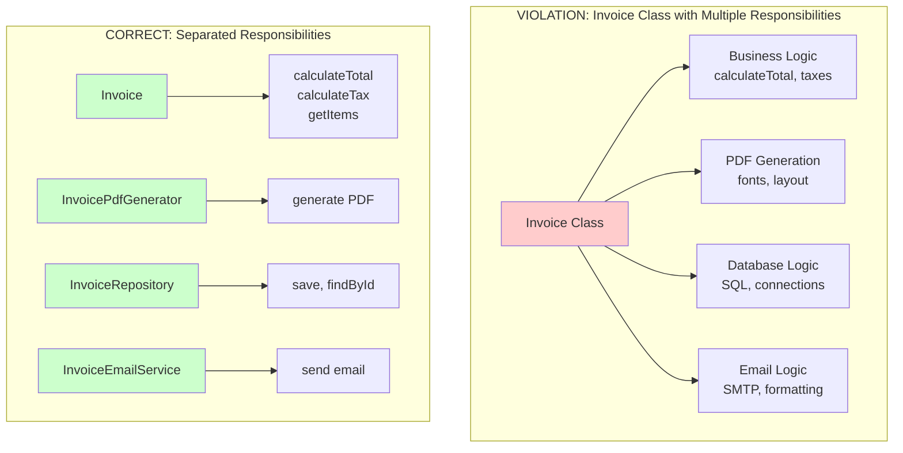

### Decision Tree: When to Split a Class

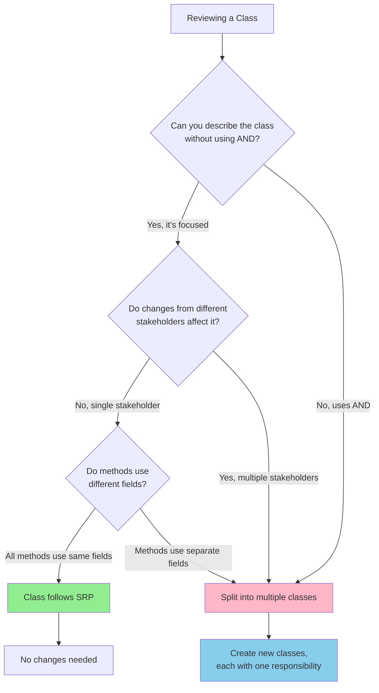

### Common Violations

| Violation Pattern | Example | Problem | Solution |
|-------------------|---------|---------|----------|
| **God Class** | `UserManager` handles auth, profile, notifications, billing | Changes in any area affect all areas | Split into `AuthService`, `ProfileService`, `NotificationService`, `BillingService` |
| **Utility Dumping Ground** | `Utils` with file I/O, string parsing, date formatting | Unrelated functions bundled | Create `FileUtils`, `StringUtils`, `DateUtils` |
| **Persistence in Domain** | `Customer` class with `save()`, `load()` methods | Business logic coupled to database | Move to `CustomerRepository` |
| **UI in Logic** | Business class with `renderHtml()` method | Presentation mixed with logic | Create separate view/presenter class |

### Real-life analogy — Hospital staff

A doctor diagnoses patients. A pharmacist dispenses medicine. A receptionist handles appointments. You wouldn't want the doctor also managing appointment scheduling — if the booking system changes, the doctor shouldn't need retraining. Each person has one clear responsibility, and changes in one department don't ripple into others.

### Real-World Example: Netflix

**Problem:** Early Netflix had monolithic classes handling video encoding, metadata, storage, and streaming.

**Solution:** Split into microservices:
- **Encoding Service:** Converts uploaded videos to different formats
- **Metadata Service:** Manages titles, descriptions, ratings
- **Storage Service:** Handles video file persistence
- **Streaming Service:** Delivers content to users

**Result:** Teams could deploy encoding improvements without touching streaming code. Changes became isolated and safe.

---

## 2. Open/Closed Principle (OCP)

### Deep Definitions

**Open/Closed Principle (OCP):**
- **Formal Definition:** Software entities (classes, modules, functions) should be open for extension but closed for modification - meaning you can add new functionality without changing existing code.
- **Simple Definition:** Write code that lets you add new features by writing new code, not by editing old code.
- **Analogy:** A power outlet is "closed" - you don't rewire it when you buy a new appliance. But it's "open" - any device following the plug standard works. The outlet design supports extension without modification.
- **Related Terms:**
  - **Polymorphism:** Mechanism that enables OCP through interfaces and inheritance
  - **Strategy Pattern:** Design pattern that implements OCP by encapsulating algorithms
  - **Extension Point:** A designed place where behavior can be added without modification

> **Core Statement:** A class should be **open for extension** but **closed for modification**.

You should be able to add new behavior to a system **without changing existing, tested code**. Every time you modify existing code, you risk breaking something that already works. Instead, design your code so new features are added by writing new code, not editing old code.

**Why this matters:**
Existing code is battle-tested. It has been through code reviews, testing, and production use. Every modification risks introducing new bugs into working functionality. OCP protects stable code from change while allowing the system to evolve.

### Why it matters in real projects

You build a payment system that handles credit cards. A month later, the business wants PayPal support. Then crypto. Then Apple Pay. If every new payment method requires modifying the core payment processing class, you're touching (and potentially breaking) battle-tested code every time. Eventually, the class becomes a 500-line mess of `if-else` branches.

### Bad — Modifying existing code for every new type

```java
public class PaymentProcessor {

    public void process(String paymentType, double amount) {
        if (paymentType.equals("credit_card")) {
            chargeCreditCard(amount);
        } else if (paymentType.equals("paypal")) {
            chargePayPal(amount);
        } else if (paymentType.equals("crypto")) {          // new — had to modify this class
            chargeCrypto(amount);
        } else if (paymentType.equals("apple_pay")) {       // new again — modified again
            chargeApplePay(amount);
        } else {
            throw new IllegalArgumentException("Unknown payment type: " + paymentType);
        }
    }

    private void chargeCreditCard(double amount) {
        Stripe.charge(amount);
    }

    private void chargePayPal(double amount) {
        PayPal.sendPayment(amount);
    }

    private void chargeCrypto(double amount) {
        CryptoGateway.transfer(amount);
    }

    private void chargeApplePay(double amount) {
        Apple.charge(amount);
    }
}
```

Every new payment method means editing `PaymentProcessor`. The class grows forever. A bug in the new crypto method could break the existing credit card logic if you accidentally touch shared state.

### Good — Extend with new classes, never touch existing ones

```java
public interface PaymentMethod {
    void charge(double amount);
    void refund(double amount);
}

public class CreditCardPayment implements PaymentMethod {
    private final String cardNumber;
    private final String cvv;

    public CreditCardPayment(String cardNumber, String cvv) {
        this.cardNumber = cardNumber;
        this.cvv = cvv;
    }

    @Override
    public void charge(double amount) {
        Stripe.charge(cardNumber, amount);
    }

    @Override
    public void refund(double amount) {
        Stripe.refund(cardNumber, amount);
    }
}

public class PayPalPayment implements PaymentMethod {
    private final String email;

    public PayPalPayment(String email) {
        this.email = email;
    }

    @Override
    public void charge(double amount) {
        PayPal.sendPayment(email, amount);
    }

    @Override
    public void refund(double amount) {
        PayPal.refund(email, amount);
    }
}

// Adding crypto — ZERO changes to existing classes
public class CryptoPayment implements PaymentMethod {
    private final String walletAddress;

    public CryptoPayment(String walletAddress) {
        this.walletAddress = walletAddress;
    }

    @Override
    public void charge(double amount) {
        CryptoGateway.transfer(walletAddress, amount);
    }

    @Override
    public void refund(double amount) {
        CryptoGateway.reverse(walletAddress, amount);
    }
}

// This class NEVER changes regardless of how many payment types exist
public class PaymentProcessor {
    public void process(PaymentMethod method, double amount) {
        method.charge(amount);
        Logger.info("Charged " + amount + " via " + method.getClass().getSimpleName());
    }

    public void processRefund(PaymentMethod method, double amount) {
        method.refund(amount);
        Logger.info("Refunded " + amount + " via " + method.getClass().getSimpleName());
    }
}
```

Adding Apple Pay next week? Create `ApplePayPayment implements PaymentMethod`. Done. `PaymentProcessor` is untouched.

### How to spot violations

- A growing chain of `if/else if` or `switch/case` that checks a type or category.
- You add a new feature and find yourself editing 3 files that were already working fine.
- A class has a `type` field that controls which branch of logic runs.

### Visual Flow: Extension Architecture

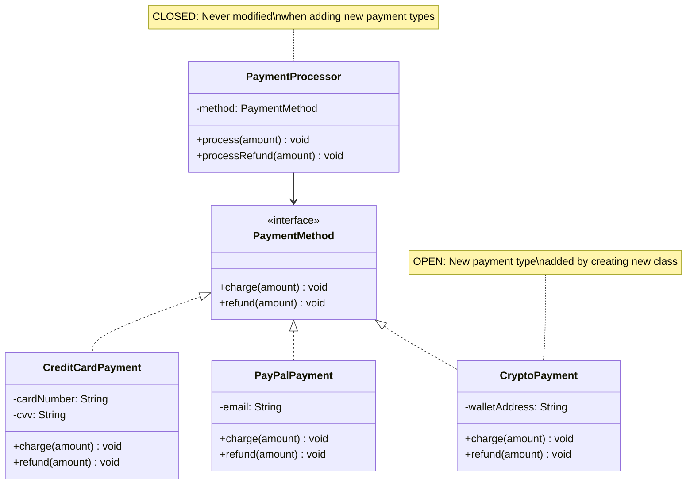

### Decision Tree: When to Apply OCP

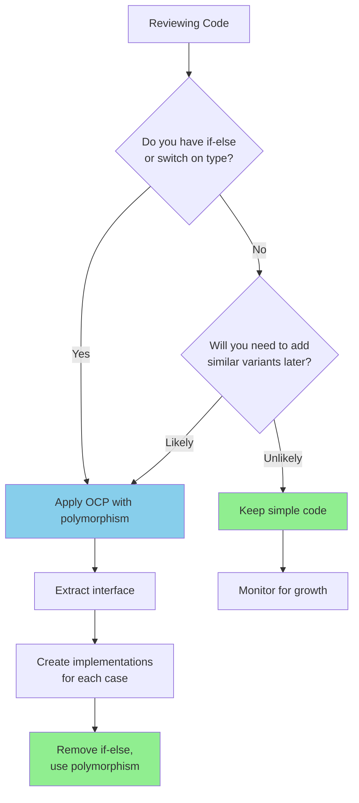

### Common Violations

| Violation Pattern | Example | Problem | Solution |
|-------------------|---------|---------|----------|
| **Type Checking** | `if (type.equals("A"))` chains | Every new type requires editing | Create interface, use polymorphism |
| **Switch on Enum** | `switch(status) { case PENDING:... }` | Adding status requires touching switch | Replace with State pattern |
| **Flag Parameters** | `process(data, isSpecial=true)` | Boolean flags control behavior | Create separate methods or strategies |
| **instanceof Chains** | `if (obj instanceof TypeA)` | Violates polymorphism | Use polymorphic method calls |

### The Strategy Pattern (OCP in Action)

```java
// BEFORE: Violation - must modify for new strategies
public class PriceCalculator {
    public double calculate(double price, String discountType) {
        if (discountType.equals("SEASONAL")) {
            return price * 0.9;
        } else if (discountType.equals("LOYALTY")) {
            return price * 0.85;
        } else if (discountType.equals("BULK")) {
            return price * 0.8;
        }
        return price;
    }
}

// AFTER: OCP-compliant - extend by adding new classes
public interface DiscountStrategy {
    double apply(double price);
}

public class SeasonalDiscount implements DiscountStrategy {
    public double apply(double price) {
        return price * 0.9;
    }
}

public class LoyaltyDiscount implements DiscountStrategy {
    public double apply(double price) {
        return price * 0.85;
    }
}

public class PriceCalculator {
    public double calculate(double price, DiscountStrategy strategy) {
        return strategy.apply(price);  // CLOSED - never changes
    }
}

// Adding new discount? Create new class, zero edits to PriceCalculator
public class StudentDiscount implements DiscountStrategy {
    public double apply(double price) {
        return price * 0.75;
    }
}
```

### Real-life analogy — USB ports

A USB port on your laptop is **closed for modification** — nobody is rewiring the port. But it's **open for extension** — you can plug in a keyboard, mouse, camera, hard drive, or any device that follows the USB interface. The laptop manufacturer didn't anticipate every device you'd ever plug in, but the USB standard means new devices work without changing the laptop.

### Real-World Example: Stripe Payment Integrations

**Problem:** Stripe needed to support hundreds of payment methods across different countries (cards, wallets, bank transfers, buy-now-pay-later).

**Solution:** Created a plugin architecture:
- **Core Processor:** Closed for modification, handles common payment flow
- **Payment Method Plugins:** Each new method (Alipay, iDEAL, ACH) is a new plugin implementing the `PaymentMethod` interface
- **Adding New Methods:** Stripe engineers write new plugins without touching core payment processing code

**Result:** Stripe supports 100+ payment methods. Core payment engine hasn't been modified in years. Each country integration is isolated.

---

## 3. Liskov Substitution Principle (LSP)

### Deep Definitions

**Liskov Substitution Principle (LSP):**
- **Formal Definition:** Objects of a superclass should be replaceable with objects of a subclass without breaking the application - subclasses must honor the contract established by the parent class.
- **Simple Definition:** If code works with a parent class, it must work with any of its children classes without surprises.
- **Analogy:** If you rent a "car," whether you get a sedan, SUV, or minivan, all should accelerate when you press gas and brake when you press brake. A vehicle that accelerates when you press brake violates your expectations - that's an LSP violation.
- **Related Terms:**
  - **Behavioral Subtyping:** LSP ensures subclasses preserve the behavior expected from the parent
  - **Contract:** The set of guarantees a class makes about what methods do
  - **Design by Contract:** Formal method where LSP prevents contract violations
  - **Preconditions:** What must be true before calling a method (subclass cannot strengthen)
  - **Postconditions:** What must be true after calling a method (subclass cannot weaken)

> **Core Statement:** Subclasses should be **substitutable** for their parent class without breaking the program.

If your code works with a parent class, it must work with **any** of its subclasses without knowing the difference. A subclass must honor every promise the parent makes — same method signatures, same expected behavior, no surprising exceptions, no weakened guarantees.

**Why this matters:**
LSP is the foundation of polymorphism. When violated, you lose the ability to treat related objects uniformly. Code becomes littered with type checks and special cases, destroying the benefits of inheritance and making the system fragile.

### Why it matters in real projects

You build a system around a `Shape` base class. Everything calls `shape.area()`. One day someone adds `Line` as a subclass of `Shape`. But a line has no area, so `area()` throws an exception. Now every piece of code that loops through shapes and calls `.area()` needs a try/catch or `instanceof` check. The whole point of polymorphism — treating all shapes the same — is destroyed.

### Bad — Subclass breaks the parent's contract

```java
public class Rectangle {
    protected int width;
    protected int height;

    public Rectangle(int width, int height) {
        this.width = width;
        this.height = height;
    }

    public void setWidth(int width) {
        this.width = width;
    }

    public void setHeight(int height) {
        this.height = height;
    }

    public int area() {
        return width * height;
    }
}

// A square IS a rectangle... right?
public class Square extends Rectangle {

    public Square(int side) {
        super(side, side);
    }

    @Override
    public void setWidth(int width) {
        this.width = width;
        this.height = width;    // surprise! setting width also changes height
    }

    @Override
    public void setHeight(int height) {
        this.width = height;    // surprise! setting height also changes width
        this.height = height;
    }
}
```

This looks correct mathematically — a square is a rectangle. But it breaks in code:

```java
public void resizeAndCheck(Rectangle rect) {
    rect.setWidth(5);
    rect.setHeight(10);
    assert rect.area() == 50;   // width(5) * height(10) = 50
}

resizeAndCheck(new Rectangle(2, 3));  // passes — area is 50
resizeAndCheck(new Square(2));        // FAILS — area is 100 (both are 10)
```

The caller expected that setting width and height independently would work. Square silently broke that assumption.

### Good — Subtypes honor the contract

```java
public interface Shape {
    double area();
}

public class Rectangle implements Shape {
    private final int width;
    private final int height;

    public Rectangle(int width, int height) {
        this.width = width;
        this.height = height;
    }

    @Override
    public double area() {
        return width * height;
    }
}

public class Square implements Shape {
    private final int side;

    public Square(int side) {
        this.side = side;
    }

    @Override
    public double area() {
        return side * side;
    }
}

public class Circle implements Shape {
    private final double radius;

    public Circle(double radius) {
        this.radius = radius;
    }

    @Override
    public double area() {
        return Math.PI * radius * radius;
    }
}

// works with ANY shape — no surprises
public void printAreas(List<Shape> shapes) {
    for (Shape shape : shapes) {
        System.out.println(shape.getClass().getSimpleName() + ": " + shape.area());
    }
}
```

`Square` is no longer a subclass of `Rectangle`. It's a sibling — both implement `Shape`. No method has hidden side effects. Every shape can be used wherever a `Shape` is expected.

### How to spot violations

- A subclass overrides a method to throw `UnsupportedOperationException` or return `null` for something the parent promises to do.
- You see `instanceof` checks scattered through the code — "if it's a Square, do this differently."
- A subclass silently changes behavior in a way the caller doesn't expect (like Square changing both dimensions).

### Visual Flow: LSP Contract

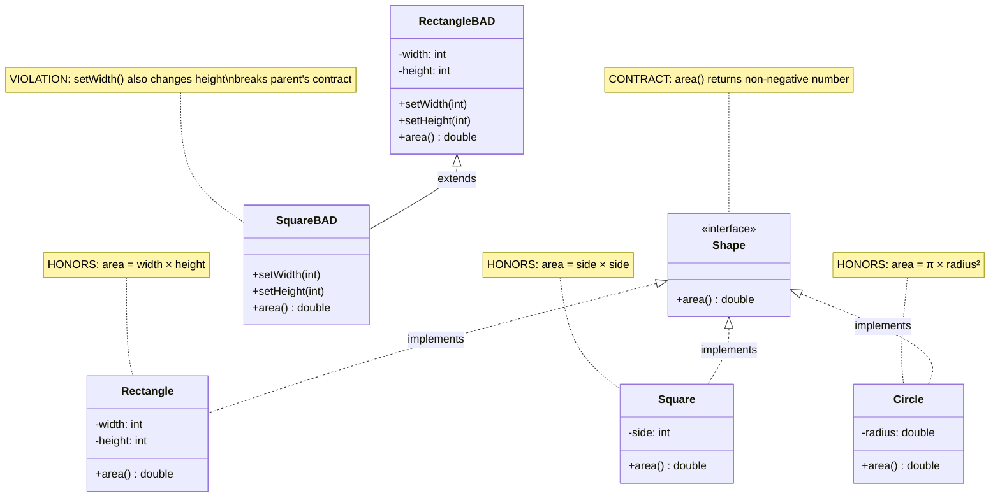

### Decision Tree: Is Your Inheritance Valid?

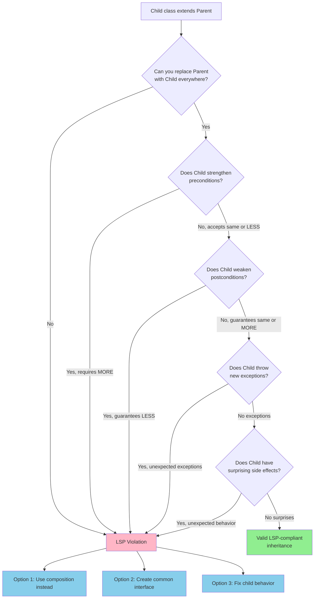

### Common Violations

| Violation Pattern | Example | Why It Breaks | Solution |
|-------------------|---------|---------------|----------|
| **Strengthened Precondition** | Parent: `process(any int)`, Child: `process(positive int only)` | Child is more restrictive | Make child accept same range as parent |
| **Weakened Postcondition** | Parent: `returns non-null`, Child: `returns null` | Child guarantees less | Ensure child maintains parent's guarantees |
| **Exception Addition** | Child throws `IOException` when parent doesn't | Callers not prepared for exception | Use same exceptions as parent |
| **Side Effects** | Parent: `setValue()` sets value, Child: `setValue()` sets value AND logs AND sends email | Unexpected behavior | Remove surprising side effects |
| **Type Refinement** | Parent: `setSize(int)`, Child Square: `setWidth(int)` changes both dimensions | Silent behavior change | Use separate types, not inheritance |

### The Rectangle-Square Problem Explained

**The Mathematical Truth:**
- In math: A square IS-A rectangle (special case with equal sides)

**The Programming Truth:**
- In code: A square BEHAVES differently than a rectangle

```java
// The Contract: Rectangle
// - setWidth() changes width only
// - setHeight() changes height only
// - width and height are independent

public void testRectangle(Rectangle r) {
    r.setWidth(5);
    r.setHeight(10);
    assert r.getWidth() == 5;   // expects width unchanged
    assert r.getHeight() == 10;  // expects height set
    assert r.area() == 50;       // expects 5 × 10
}

// Square violates this contract
// When you setWidth(5), it also changes height to 5
// When you setHeight(10), it also changes width to 10
testRectangle(new Square());  // FAILS - area is 100, not 50
```

**The Fix: Composition Over Inheritance**

```java
public interface Shape {
    double area();
}

public class Rectangle implements Shape {
    private final int width;
    private final int height;
    // width and height are independent - contract maintained
}

public class Square implements Shape {
    private final int side;
    // no setWidth/setHeight - no contract to violate
}
```

### Real-life analogy — Rental car (extended)

You rent a "car" from Hertz. The contract says: it has a steering wheel, it accelerates when you press the gas, it brakes when you press the brake. They might give you a sedan, SUV, or minivan — all subtypes of "car."

Now imagine they give you a vehicle where pressing the brake accelerates. It's technically still a "vehicle," but it **violates the contract** you expected. You'd crash. That's an LSP violation — the subtype looks right but behaves in a way that breaks the caller's assumptions.

### Real-World Example: Java Collections Framework

**LSP Success:**
```java
List<String> list = new ArrayList<>();  // works
list = new LinkedList<>();              // also works
list = new Vector<>();                  // also works

// All List implementations are substitutable
// Code works with any List implementation
```

**LSP Violation (Fixed in Java):**
- Early Java: `Stack` extended `Vector`
- Problem: Stack should only allow `push/pop` (LIFO), but inherited `add(index, element)` from `Vector` which broke stack semantics
- Modern design: `Deque` interface defines behavior, implementations honor it

---

## 4. Interface Segregation Principle (ISP)

### Deep Definitions

**Interface Segregation Principle (ISP):**
- **Formal Definition:** No client should be forced to depend on methods it does not use - interfaces should be split into smaller, more specific ones so clients only need to know about methods relevant to them.
- **Simple Definition:** Many small, specific interfaces are better than one large, general-purpose interface.
- **Analogy:** A restaurant menu doesn't show you every ingredient in the kitchen. You see only the dishes you can order. You don't need to know about the 50 spices in the pantry - only the menu items matter to you.
- **Related Terms:**
  - **Fat Interface:** An interface with too many methods, forcing implementations to provide methods they don't need
  - **Interface Pollution:** When irrelevant methods clutter an interface
  - **Role Interface:** Small interface representing one role or capability
  - **Client-Specific Interface:** Interface designed around what specific clients need

> **Core Statement:** Clients should not be forced to depend on **interfaces they don't use**.

Don't create one giant interface with 15 methods that every implementor must provide. Classes end up with dummy implementations for methods that are meaningless to them. Instead, split into small, focused interfaces so each class only implements what it actually needs.

**Why this matters:**
Fat interfaces create unnecessary coupling. When an interface changes, all implementors must change, even those that don't care about the new method. Clients depend on more than they need, making the system rigid and hard to maintain.

### Why it matters in real projects

You define an `Animal` interface with `fly()`, `swim()`, `walk()`, `climb()`. Now every animal class must implement all four, even if a fish can't fly or walk. You end up with dozens of empty or `throw new UnsupportedOperationException()` implementations. When you add a new method to the interface (say `burrow()`), every single animal class needs updating — even ones that will never burrow.

### Bad — Fat interface forces irrelevant implementations

```java
public interface MultiFunctionDevice {
    void printDocument(String doc);
    String scanDocument();
    void faxDocument(String doc, String number);
    void staplePages(String doc);
}

public class HighEndPrinter implements MultiFunctionDevice {
    @Override
    public void printDocument(String doc) {
        System.out.println("Printing: " + doc);
    }

    @Override
    public String scanDocument() {
        return "Scanned image data";
    }

    @Override
    public void faxDocument(String doc, String number) {
        System.out.println("Faxing " + doc + " to " + number);
    }

    @Override
    public void staplePages(String doc) {
        System.out.println("Stapling " + doc);
    }
}

public class BasicPrinter implements MultiFunctionDevice {
    @Override
    public void printDocument(String doc) {
        System.out.println("Printing: " + doc);
    }

    @Override
    public String scanDocument() {
        // can't scan — but FORCED to implement
        throw new UnsupportedOperationException("BasicPrinter cannot scan");
    }

    @Override
    public void faxDocument(String doc, String number) {
        // can't fax — but FORCED to implement
        throw new UnsupportedOperationException("BasicPrinter cannot fax");
    }

    @Override
    public void staplePages(String doc) {
        // can't staple — but FORCED to implement
        throw new UnsupportedOperationException("BasicPrinter cannot staple");
    }
}
```

`BasicPrinter` has three useless methods. If someone calls `basicPrinter.faxDocument(doc, "555-1234")`, it blows up at runtime. That's a bug waiting to happen.

### Good — Small, focused interfaces

```java
public interface Printable {
    void printDocument(String doc);
}

public interface Scannable {
    String scanDocument();
}

public interface Faxable {
    void faxDocument(String doc, String number);
}

public interface Stapleable {
    void staplePages(String doc);
}

public class HighEndPrinter implements Printable, Scannable, Faxable, Stapleable {
    @Override
    public void printDocument(String doc) {
        System.out.println("Printing: " + doc);
    }

    @Override
    public String scanDocument() {
        return "Scanned image data";
    }

    @Override
    public void faxDocument(String doc, String number) {
        System.out.println("Faxing " + doc + " to " + number);
    }

    @Override
    public void staplePages(String doc) {
        System.out.println("Stapling " + doc);
    }
}

public class BasicPrinter implements Printable {
    @Override
    public void printDocument(String doc) {
        System.out.println("Printing: " + doc);
    }
    // no scan, no fax, no staple — doesn't claim to do what it can't
}

public class Scanner implements Scannable {
    @Override
    public String scanDocument() {
        return "Scanned image data";
    }
}
```

Now methods declare exactly what they need:

```java
// only requires Printable — works with BasicPrinter AND HighEndPrinter
public void printReport(Printable printer) {
    printer.printDocument("Q4 Report");
}

// requires both Scannable and Faxable — only HighEndPrinter qualifies
public <T extends Scannable & Faxable> void scanAndFax(T device, String number) {
    String doc = device.scanDocument();
    device.faxDocument(doc, number);
}
```

### How to spot violations

- Classes with methods that are empty, return `null`, throw `UnsupportedOperationException`, or have comments like `// not applicable`.
- An interface change (adding a method) forces you to update 10 classes, 8 of which don't care about the new method.
- Methods receive a large object but only use 1-2 of its methods.

### Visual Flow: Interface Segregation

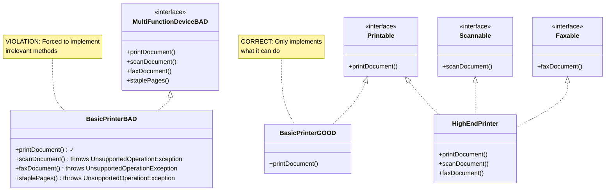

### Decision Tree: When to Split Interfaces

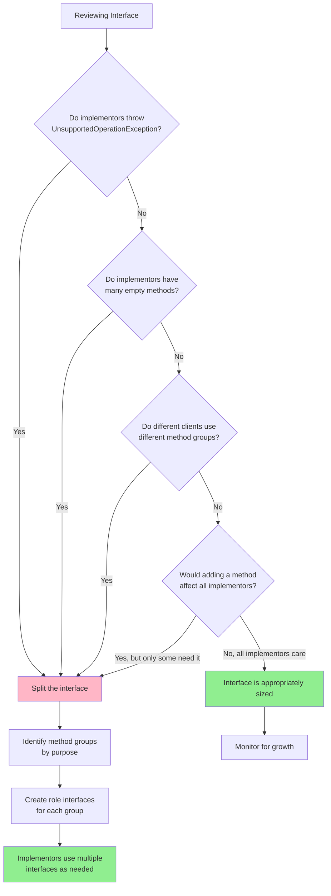

### Common Violations

| Violation Pattern | Example | Problem | Solution |
|-------------------|---------|---------|----------|
| **God Interface** | `IEmployee` with 30+ methods for every employee operation | Forces all clients to depend on everything | Split into `IEmployeeData`, `IEmployeePayroll`, `IEmployeeLeave` |
| **Marker Pollution** | Adding `notifyChange()` to unrelated interfaces | Not all implementors need notifications | Create separate `INotifiable` interface |
| **Framework Bloat** | `IComponent` requiring `init()`, `render()`, `destroy()`, `serialize()`, `log()` | Simple components forced to implement complex lifecycle | Use composition, multiple small interfaces |
| **Empty Implementations** | Methods returning `null` or doing nothing | Clear sign of interface mismatch | Extract those methods to separate interface |

### Interface Composition Pattern

```java
// Small, focused interfaces
public interface Readable {
    byte[] read();
}

public interface Writable {
    void write(byte[] data);
}

public interface Closeable {
    void close();
}

// Compose interfaces based on needs
public class FileStream implements Readable, Writable, Closeable {
    public byte[] read() { /* implementation */ }
    public void write(byte[] data) { /* implementation */ }
    public void close() { /* implementation */ }
}

// Read-only file
public class ReadOnlyFile implements Readable, Closeable {
    public byte[] read() { /* implementation */ }
    public void close() { /* implementation */ }
    // No write() - doesn't claim to be Writable
}

// Network socket
public class NetworkSocket implements Readable, Writable {
    public byte[] read() { /* implementation */ }
    public void write(byte[] data) { /* implementation */ }
    // No close() in this example - or add Closeable if needed
}

// Methods require only what they use
public void processData(Readable source, Writable destination) {
    byte[] data = source.read();
    destination.write(transform(data));
    // doesn't require close() - caller handles that
}
```

### Real-life analogy — Swiss Army knife vs dedicated tools

A Swiss Army knife has a blade, screwdriver, bottle opener, corkscrew, scissors, and toothpick. If you just need to cut something, you're forced to carry all that extra weight.

A professional kitchen doesn't give chefs a Swiss Army knife. It gives them a chef's knife for cutting, a peeler for peeling, a thermometer for temperature. Each tool does one thing. The chef picks only the tools needed for the task at hand.

### Real-World Example: Java's Stream API

**ISP Success:**
```java
// Java Stream API uses many small interfaces
Stream<String> stream = list.stream()
    .filter(...)       // uses Predicate interface (1 method)
    .map(...)          // uses Function interface (1 method)
    .forEach(...);     // uses Consumer interface (1 method)

// Each operation takes a focused interface
// You only implement what you need for that operation
```

**Before ISP (hypothetical):**
```java
// Imagine if Java had one fat interface
interface StreamOperation<T> {
    boolean test(T value);        // for filter
    T apply(T value);             // for map
    void accept(T value);         // for forEach
    int compare(T a, T b);        // for sort
    T reduce(T a, T b);           // for reduce
}

// You'd have to implement ALL methods even if you only need one
```

**Result:** Clean, focused lambda expressions. Each lambda implements exactly one relevant method.

---

## 5. Dependency Inversion Principle (DIP)

### Deep Definitions

**Dependency Inversion Principle (DIP):**
- **Formal Definition:** High-level modules should not depend on low-level modules; both should depend on abstractions. Additionally, abstractions should not depend on details; details should depend on abstractions.
- **Simple Definition:** Your important business logic shouldn't directly use specific implementations. Instead, both should use interfaces. This makes everything swappable and testable.
- **Analogy:** You don't hire a contractor and specify which brand of hammer they must use. You specify "I need this wall built," and they bring their tools. You depend on the contract (build wall), not the tools (specific hammer brand).
- **Related Terms:**
  - **Dependency Injection (DI):** The technique of passing dependencies to a class rather than having it create them
  - **Inversion of Control (IoC):** A broader principle where the framework controls the flow, calling your code
  - **High-level Module:** Contains business logic and policies
  - **Low-level Module:** Contains implementation details (database, file I/O, network)
  - **Abstraction:** Interface or abstract class that hides implementation

> **Core Statement:** High-level modules should not depend on low-level modules. Both should depend on **abstractions**.

Your business logic (the important stuff) should not directly import or instantiate specific implementations (the details). Instead, define interfaces that describe what you need, and let the implementations be injected from outside. This way, swapping one implementation for another (e.g., switching databases, changing email providers) doesn't touch your business logic at all.

**Why this matters:**
When high-level code directly creates low-level dependencies, they become tightly coupled. You can't test the high-level logic without the real database, real network, real file system. Dependency inversion makes code testable, flexible, and maintainable by inverting the usual dependency direction.

### Why it matters in real projects

Your `OrderService` directly creates `MySQLDatabase` and `StripePayment`. Now you want to:
- Write unit tests? You can't — tests would need a real MySQL instance and a real Stripe account.
- Switch to PostgreSQL? You rewrite `OrderService`.
- Add a test payment gateway for staging? You add `if (env.equals("staging"))` hacks everywhere.

All because your business logic is **glued** to specific implementations.

### Bad — High-level module depends on low-level details

```java
public class OrderService {
    private final Connection db;

    public OrderService() {
        // directly creates specific implementations
        this.db = DriverManager.getConnection("jdbc:mysql://localhost/shop");
        Stripe.apiKey = "sk_live_xxx";
    }

    public long placeOrder(long userId, List<Item> items) {
        double total = items.stream().mapToDouble(Item::getPrice).sum();

        // directly uses MySQL
        PreparedStatement stmt = db.prepareStatement(
            "INSERT INTO orders (user_id, total) VALUES (?, ?)",
            Statement.RETURN_GENERATED_KEYS
        );
        stmt.setLong(1, userId);
        stmt.setDouble(2, total);
        stmt.executeUpdate();
        ResultSet rs = stmt.getGeneratedKeys();
        rs.next();
        long orderId = rs.getLong(1);

        // directly uses Stripe
        Stripe.Charge.create(Map.of(
            "amount", (int) (total * 100),
            "currency", "usd"
        ));

        return orderId;
    }
}
```

`OrderService` is welded to MySQL and Stripe. You cannot test it without real external services. You cannot reuse it with a different database or payment provider.

### Good — Both layers depend on abstractions

```java
// --- Abstractions (interfaces) ---

public interface OrderRepository {
    long save(long userId, double total);
}

public interface PaymentGateway {
    boolean charge(double amount);
}


// --- Low-level implementations ---

public class MySqlOrderRepository implements OrderRepository {
    private final DataSource dataSource;

    public MySqlOrderRepository(DataSource dataSource) {
        this.dataSource = dataSource;
    }

    @Override
    public long save(long userId, double total) {
        try (Connection conn = dataSource.getConnection()) {
            PreparedStatement stmt = conn.prepareStatement(
                "INSERT INTO orders (user_id, total) VALUES (?, ?)",
                Statement.RETURN_GENERATED_KEYS
            );
            stmt.setLong(1, userId);
            stmt.setDouble(2, total);
            stmt.executeUpdate();
            ResultSet rs = stmt.getGeneratedKeys();
            rs.next();
            return rs.getLong(1);
        }
    }
}

public class PostgresOrderRepository implements OrderRepository {
    private final DataSource dataSource;

    public PostgresOrderRepository(DataSource dataSource) {
        this.dataSource = dataSource;
    }

    @Override
    public long save(long userId, double total) {
        // PostgreSQL-specific implementation
    }
}

public class StripePaymentGateway implements PaymentGateway {
    private final String apiKey;

    public StripePaymentGateway(String apiKey) {
        this.apiKey = apiKey;
    }

    @Override
    public boolean charge(double amount) {
        Stripe.apiKey = this.apiKey;
        Charge result = Stripe.Charge.create(Map.of(
            "amount", (int) (amount * 100),
            "currency", "usd"
        ));
        return "succeeded".equals(result.getStatus());
    }
}

public class FakePaymentGateway implements PaymentGateway {
    @Override
    public boolean charge(double amount) {
        System.out.println("[FAKE] Charged $" + amount);
        return true;
    }
}


// --- High-level business logic ---

public class OrderService {
    private final OrderRepository repo;      // doesn't know if it's MySQL or PostgreSQL
    private final PaymentGateway payment;    // doesn't know if it's Stripe or fake

    public OrderService(OrderRepository repo, PaymentGateway payment) {
        this.repo = repo;
        this.payment = payment;
    }

    public long placeOrder(long userId, List<Item> items) {
        double total = items.stream().mapToDouble(Item::getPrice).sum();

        if (!payment.charge(total)) {
            throw new RuntimeException("Payment failed");
        }

        return repo.save(userId, total);
    }
}
```

Now wiring it up is done at the **entry point** of your application:

```java
// Production
OrderService service = new OrderService(
    new MySqlOrderRepository(productionDataSource),
    new StripePaymentGateway("sk_live_xxx")
);

// Testing
OrderService testService = new OrderService(
    new InMemoryOrderRepository(),
    new FakePaymentGateway()
);

// Staging with PostgreSQL and test Stripe
OrderService stagingService = new OrderService(
    new PostgresOrderRepository(stagingDataSource),
    new StripePaymentGateway("sk_test_xxx")
);
```

`OrderService` is identical in all three cases. Zero code changes. Just different wiring. This is exactly what Spring's `@Autowired` and dependency injection frameworks do for you automatically.

### How to spot violations

- Classes that directly instantiate their dependencies with `new` (e.g., `this.db = new MySQLDatabase()`).
- You can't write a unit test without spinning up a real database, API, or external service.
- Changing an infrastructure detail (database, cache, email provider) requires modifying your business logic files.
- Constructor creates its own dependencies instead of receiving them as parameters.

### Visual Flow: Dependency Direction

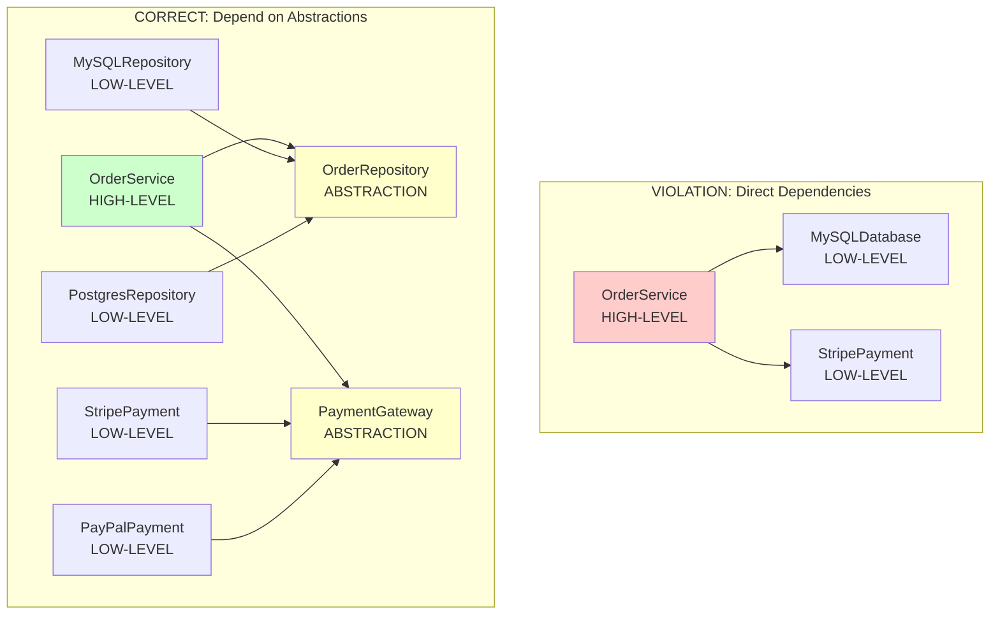

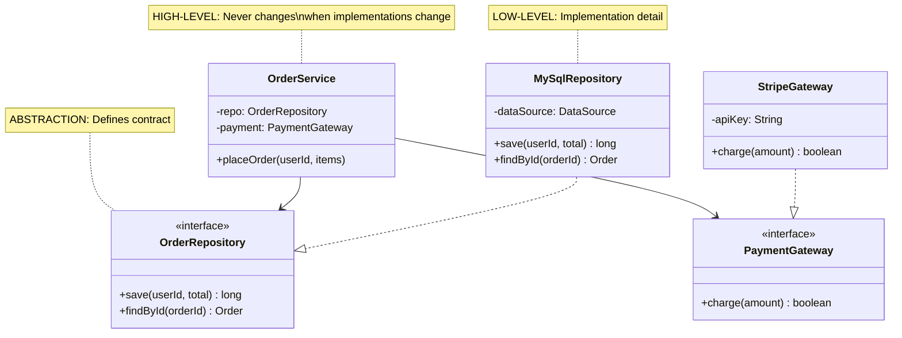

### Decision Tree: Is DIP Violated?

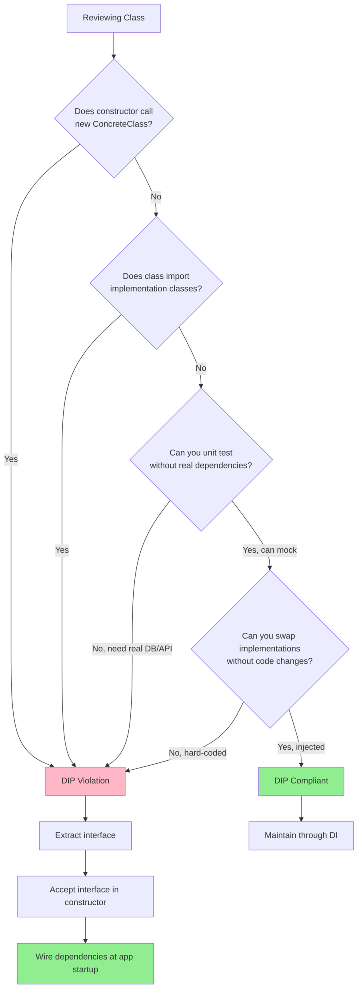

### Common Violations

| Violation Pattern | Example | Problem | Solution |
|-------------------|---------|---------|----------|
| **new in Constructor** | `this.db = new MySQLDatabase()` | Hard-coded to specific implementation | Accept interface in constructor |
| **Static Method Calls** | `Logger.getInstance().log()` | Coupled to global state | Inject `ILogger` interface |
| **Service Locator** | `ServiceLocator.get(Database.class)` | Hidden dependencies | Explicit dependency injection |
| **Factory Inside Class** | `this.cache = CacheFactory.create()` | Class controls its dependencies | Inject cache, move factory to composition root |

### The Three Layers Pattern

```
┌─────────────────────────────────────────┐
│        APPLICATION LAYER                │
│     (Composition Root / Main)           │
│                                         │
│  ┌───────────────────────────────┐     │
│  │ Wires everything together:    │     │
│  │                               │     │
│  │ repo = new MySqlRepository()  │     │
│  │ payment = new StripeGateway() │     │
│  │ service = new OrderService(   │     │
│  │     repo, payment)            │     │
│  └───────────────────────────────┘     │
└────────────┬────────────────────────────┘
             │
    ┌────────▼───────────┐
    │                    │
┌───▼────────┐    ┌──────▼──────┐
│ HIGH-LEVEL │    │ ABSTRACTIONS│
│  MODULES   │───>│ (Interfaces)│
│            │    │             │
│ Business   │    │ Repository  │
│ Logic      │    │ Gateway     │
│            │    │ Service     │
└────────────┘    └──────┬──────┘
                         │
                    ┌────▼─────┐
                    │          │
           ┌────────▼──┐  ┌───▼────────┐
           │ LOW-LEVEL │  │ LOW-LEVEL  │
           │  MODULES  │  │  MODULES   │
           │           │  │            │
           │ MySQL     │  │ Stripe     │
           │ Postgres  │  │ PayPal     │
           │ Redis     │  │ Crypto     │
           └───────────┘  └────────────┘

KEY INSIGHT: Dependencies point UPWARD
- Low-level modules implement abstractions
- High-level modules use abstractions
- No downward dependencies to concrete classes
```

### Dependency Injection Patterns

#### Constructor Injection (Recommended)
```java
public class OrderService {
    private final OrderRepository repo;
    private final PaymentGateway payment;

    // Dependencies injected via constructor
    public OrderService(OrderRepository repo, PaymentGateway payment) {
        this.repo = repo;
        this.payment = payment;
    }

    public long placeOrder(long userId, List<Item> items) {
        double total = items.stream().mapToDouble(Item::getPrice).sum();
        if (!payment.charge(total)) {
            throw new RuntimeException("Payment failed");
        }
        return repo.save(userId, total);
    }
}

// Benefits:
// - Dependencies are explicit
// - Class is immutable (final fields)
// - Cannot create invalid object
// - Easy to test with mocks
```

#### Setter Injection (Avoid)
```java
public class OrderService {
    private OrderRepository repo;
    private PaymentGateway payment;

    // Dependencies injected via setters
    public void setRepo(OrderRepository repo) { this.repo = repo; }
    public void setPayment(PaymentGateway payment) { this.payment = payment; }

    // Problem: Can call placeOrder() before dependencies are set
    public long placeOrder(long userId, List<Item> items) {
        // What if repo or payment is null?
    }
}
```

#### Method Injection (Special Cases)
```java
public class ReportGenerator {
    // Inject per-method if dependency varies per call
    public Report generate(DataSource dataSource, ReportFormat format) {
        // Different data source and format each time
    }
}
```

### Testing Benefits

```java
// BEFORE DIP: Untestable
public class OrderService {
    public OrderService() {
        this.db = new MySQLDatabase("production-host");
        this.stripe = new StripeAPI("live-key");
    }
    // Cannot test without hitting real production systems
}

// AFTER DIP: Fully testable
public class OrderService {
    public OrderService(OrderRepository repo, PaymentGateway payment) {
        this.repo = repo;
        this.payment = payment;
    }
}

// Test with fakes
@Test
public void testPlaceOrder() {
    // Create fakes in memory - no real database or payment API
    OrderRepository fakeRepo = new InMemoryRepository();
    PaymentGateway fakePayment = new FakePaymentGateway();

    OrderService service = new OrderService(fakeRepo, fakePayment);

    long orderId = service.placeOrder(123, items);

    assertTrue(orderId > 0);
    assertTrue(fakePayment.wasCharged(total));
}
```

### Real-life analogy — Hiring a contractor

**Bad (tight coupling):** You need a wall painted. You personally go buy paint from a specific store, get specific brushes, and hand them to the painter. If the store closes, you have to rewrite your process.

**Good (dependency inversion):** You tell the painter "I need this wall painted blue." The painter brings their own tools and paint. You depend on the **contract** ("paint this wall blue"), not the **details** (which brand of paint, which store, which brushes). You can hire a different painter next time — same contract, different implementation.

### Real-World Example: Spring Framework

**How Spring Implements DIP:**

```java
// 1. Define abstractions
public interface UserRepository {
    User findById(long id);
    void save(User user);
}

// 2. Create implementation
@Repository
public class JpaUserRepository implements UserRepository {
    @PersistenceContext
    private EntityManager em;

    public User findById(long id) {
        return em.find(User.class, id);
    }

    public void save(User user) {
        em.persist(user);
    }
}

// 3. High-level service depends on abstraction
@Service
public class UserService {
    private final UserRepository repo;

    // Spring injects implementation automatically
    @Autowired
    public UserService(UserRepository repo) {
        this.repo = repo;
    }

    public User getUser(long id) {
        return repo.findById(id);
    }
}

// 4. Testing: Swap implementation
@Test
public void testUserService() {
    UserRepository mockRepo = mock(UserRepository.class);
    when(mockRepo.findById(1L)).thenReturn(testUser);

    UserService service = new UserService(mockRepo);
    User user = service.getUser(1L);

    assertEquals("John", user.getName());
}
```

**Result:** Spring applications swap databases (H2 → MySQL → Postgres) by changing configuration files, zero code changes. Tests run with in-memory fakes, no real database needed.

---

---

## Layer 2: Production-Ready Details

### How SOLID Principles Work Together

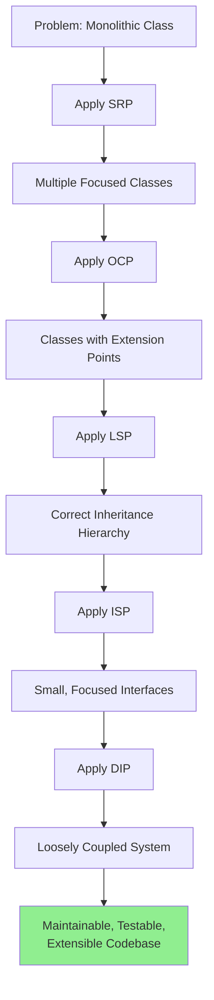

### The SOLID Workflow

```
1. SRP: Identify Responsibilities
   └─> "This class does X AND Y" → Split into ClassX and ClassY

2. OCP: Plan for Extension
   └─> "We'll need variants" → Extract interface, use polymorphism

3. LSP: Validate Substitutability
   └─> "Can I replace parent with child?" → Fix contract violations

4. ISP: Refine Interfaces
   └─> "Do all implementors need all methods?" → Split interfaces

5. DIP: Invert Dependencies
   └─> "Does high-level depend on low-level?" → Inject abstractions
```

### SOLID in Different Contexts

#### Microservices Architecture
```
SRP → Each service has one business capability
OCP → New services don't modify existing ones
LSP → Services implement standard protocols (REST, gRPC)
ISP → APIs expose only relevant endpoints per client
DIP → Services depend on message contracts, not implementations
```

#### Frontend Development
```
SRP → Components have single UI responsibility
OCP → Extend with new components, not modifying existing
LSP → Props contracts must be honored by all variants
ISP → Props interfaces specific to component needs
DIP → Components receive dependencies (state, callbacks)
```

#### Database Design
```
SRP → Tables represent single entities
OCP → Add tables, not alter existing schemas
LSP → Views can substitute base tables
ISP → Stored procedures take only needed parameters
DIP → App layer depends on repository interface, not SQL
```

### When NOT to Apply SOLID

**Early Prototyping:**
- Premature abstraction wastes time
- Wait until patterns emerge
- Extract SOLID designs during refactoring

**Simple Scripts:**
- 50-line utility script doesn't need DIP
- Don't over-engineer throwaway code
- Apply when code will be maintained

**Performance-Critical Code:**
- Virtual method calls add overhead
- Inline implementations where microseconds matter
- Measure first, optimize if needed

**Clear, Stable Requirements:**
- If only one payment method will ever exist, don't create `PaymentGateway` interface
- Don't add complexity for hypothetical future needs
- Apply OCP when extension is likely, not possible

---

## Interview Preparation

### Concept Glossary

Quick reference definitions for interview:

- **SOLID:** Five object-oriented design principles for maintainable software
- **SRP (Single Responsibility):** One class, one reason to change
- **OCP (Open/Closed):** Open for extension, closed for modification
- **LSP (Liskov Substitution):** Subtypes must be substitutable for parent types
- **ISP (Interface Segregation):** Many small interfaces better than one large interface
- **DIP (Dependency Inversion):** Depend on abstractions, not concrete implementations
- **Coupling:** Degree of interdependence between classes (minimize)
- **Cohesion:** Degree of relatedness within a class (maximize)
- **Abstraction:** Interface or base class hiding implementation details
- **Dependency Injection:** Passing dependencies to a class rather than creating them internally

### Common Interview Questions

#### Q1: "Explain SOLID principles"

**Answer Structure (30 seconds):**

"SOLID is five design principles for object-oriented code:

1. **Single Responsibility** - Each class has one job
2. **Open/Closed** - Extend with new code, don't modify existing
3. **Liskov Substitution** - Child classes must work wherever parent works
4. **Interface Segregation** - Many small interfaces, not one large
5. **Dependency Inversion** - Depend on interfaces, not implementations

Together they make code maintainable, testable, and flexible. For example, dependency inversion lets you swap databases without touching business logic."

---

#### Q2: "What's the difference between SRP and ISP?"

**Answer:**

"**SRP** is about classes - a class should have one reason to change.

**ISP** is about interfaces - clients shouldn't depend on methods they don't use.

**Example:**
- SRP violation: `Invoice` class that calculates totals AND generates PDFs AND saves to database
- ISP violation: `IAnimal` interface with `fly()`, `swim()`, `walk()` - fish can't fly

SRP → Split class responsibilities
ISP → Split interface methods"

---

#### Q3: "Why is the Square-Rectangle problem an LSP violation?"

**Answer:**

"A Square that extends Rectangle violates LSP because:

1. **Rectangle contract:** `setWidth(5)` changes only width, `setHeight(10)` changes only height
2. **Square breaks this:** `setWidth(5)` must also change height to keep sides equal
3. **Result:** Code expecting Rectangle behavior breaks when given Square

```java
void test(Rectangle r) {
    r.setWidth(5);
    r.setHeight(10);
    assert r.area() == 50;  // expects 5 × 10
}
test(new Square());  // FAILS - area is 100
```

**Solution:** Don't use inheritance. Make both implement `Shape` interface."

---

#### Q4: "Give an example of Open/Closed Principle"

**Answer:**

"Payment processing system:

**Bad (violates OCP):**
```java
if (type.equals("credit")) { chargeCreditCard(); }
else if (type.equals("paypal")) { chargePayPal(); }
// Adding crypto → must MODIFY this code
```

**Good (follows OCP):**
```java
interface PaymentMethod {
    void charge(double amount);
}

class CreditCard implements PaymentMethod { ... }
class PayPal implements PaymentMethod { ... }
class Crypto implements PaymentMethod { ... }  // NEW class, zero modifications

processor.process(paymentMethod);  // Works with any implementation
```

System is **closed** - `processor.process()` never changes
System is **open** - add new payment types by creating new classes"

---

#### Q5: "How does Dependency Inversion help with testing?"

**Answer:**

"**Without DIP:**
```java
class OrderService {
    OrderService() {
        this.db = new MySQLDatabase();  // Hard-coded
    }
}
// Can't test without real MySQL running
```

**With DIP:**
```java
class OrderService {
    OrderService(OrderRepository repo) {  // Injected interface
        this.repo = repo;
    }
}

// Test with fake
@Test
void test() {
    OrderRepository fake = new InMemoryRepo();
    OrderService service = new OrderService(fake);
    // Test runs in milliseconds, no database needed
}
```

DIP lets you inject test doubles (mocks, fakes) instead of real implementations."

---

#### Q6: "What's the cost of applying SOLID?"

**Answer:**

"**Costs:**
- More files/classes (might seem like over-engineering)
- More abstractions to understand
- Slight performance overhead (virtual method calls)
- Initial time investment

**Benefits:**
- Changes are localized and safe
- Easy to test with mocks
- New features don't break existing code
- Multiple people can work in parallel
- Technical debt reduces over time

**Trade-off:** Small upfront cost for massive long-term maintainability gains. Worth it for any codebase that will be maintained beyond a few months."

---

## Quick Reference

### Summary Table

| Principle | One-liner | Violation smell | Fix |
|---|---|---|---|
| **SRP** | One class, one job | Class described with "and" | Split into focused classes |
| **OCP** | Extend, don't modify | Growing `if-else` for new types | Use polymorphism and interfaces |
| **LSP** | Subtypes must be substitutable | `instanceof` checks or surprise exceptions | Fix the hierarchy or separate types |
| **ISP** | Small, focused interfaces | Empty/`UnsupportedOperationException` methods | Split fat interfaces into small ones |
| **DIP** | Depend on abstractions | Hard-coded `new` of implementations | Inject dependencies via constructor |

### How They Connect

```
SRP → Split responsibilities into separate classes
 ↓
OCP → New behavior = new class, not editing old ones
 ↓
LSP → New classes (subtypes) are safe drop-in replacements
 ↓
ISP → Interfaces between classes are small and relevant
 ↓
DIP → Classes are wired together through abstractions, not hard-coded
```

Together, they produce code where **changes are local** — adding or modifying a feature touches the fewest possible files and breaks nothing else. The codebase grows by **adding new files**, not by **editing existing ones**.

### Decision Cheat Sheet

```
IF class described with "AND"
  THEN apply SRP - split responsibilities

IF adding feature requires editing existing class
  THEN apply OCP - use polymorphism

IF replacing parent with child breaks code
  THEN apply LSP - fix contract or don't use inheritance

IF implementors have empty methods
  THEN apply ISP - split interface

IF class calls "new ConcreteClass()"
  THEN apply DIP - inject abstraction
```

### SOLID Anti-Pattern Detector

| Code Smell | Violated Principle | Fix |
|------------|-------------------|-----|
| Class with 1000+ lines | SRP | Extract classes by responsibility |
| Method with switch on type | OCP | Replace with polymorphism |
| Code checks `instanceof` | LSP | Fix hierarchy or use composition |
| `throw UnsupportedOperationException()` | ISP | Remove method from interface |
| `new` in constructor | DIP | Accept interface parameter |
| Class changes for unrelated reasons | SRP | Separate concerns |
| Can't test without real database | DIP | Inject repository interface |
| Subclass overrides method to do nothing | LSP | Remove from hierarchy |

---

## Links

- [[Design Patterns]] — How SOLID principles apply to common patterns
- [[Clean Code]] — Related principles for writing maintainable code
- [[Dependency Injection Frameworks]] — Spring, Guice, Dagger implementations
- [[Test-Driven Development]] — How TDD encourages SOLID design
- [[Refactoring Techniques]] — Practical steps to apply SOLID to existing code
- [[Microservices Architecture]] — SOLID at service level
- [[Domain-Driven Design]] — SOLID within bounded contexts
