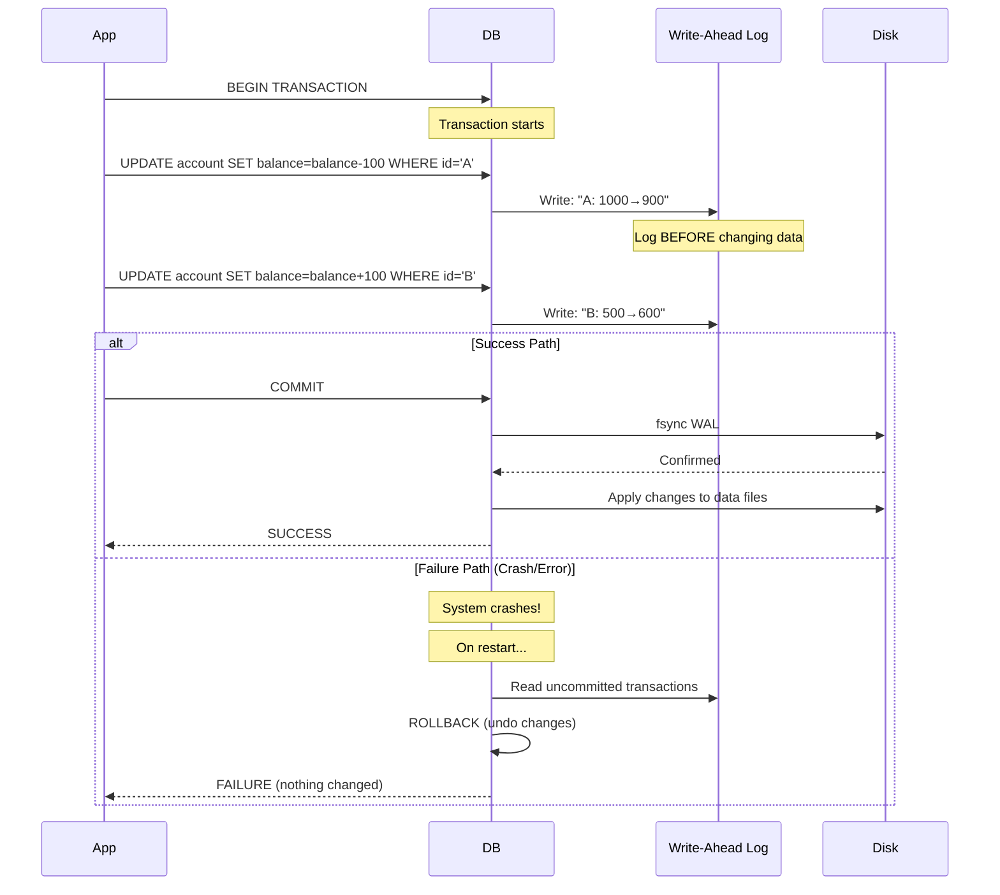
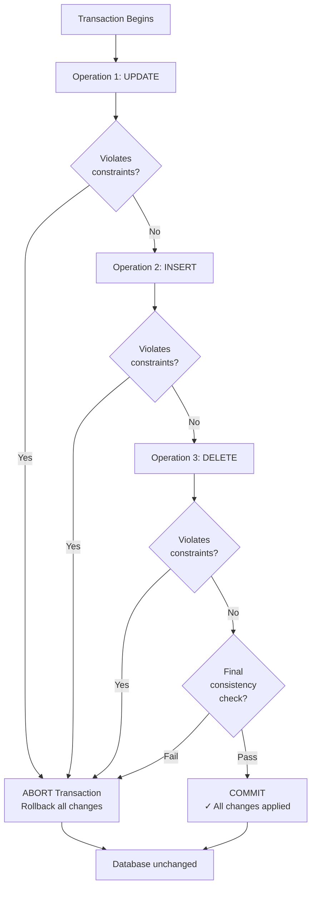
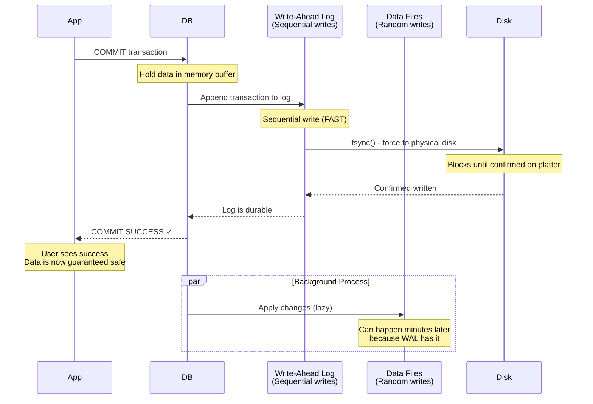
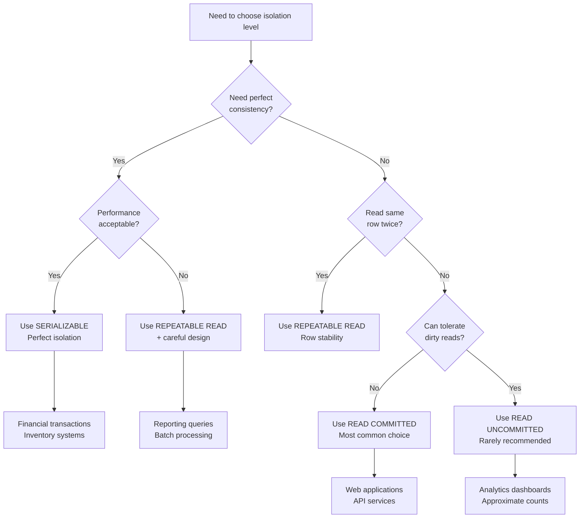
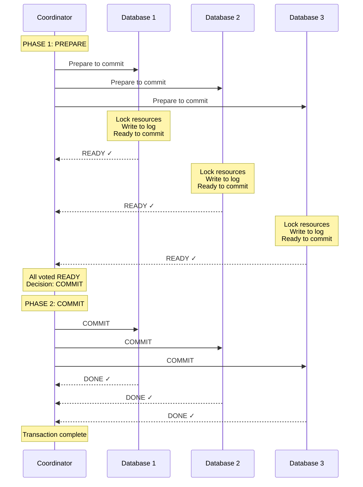
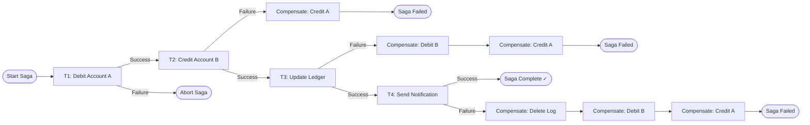
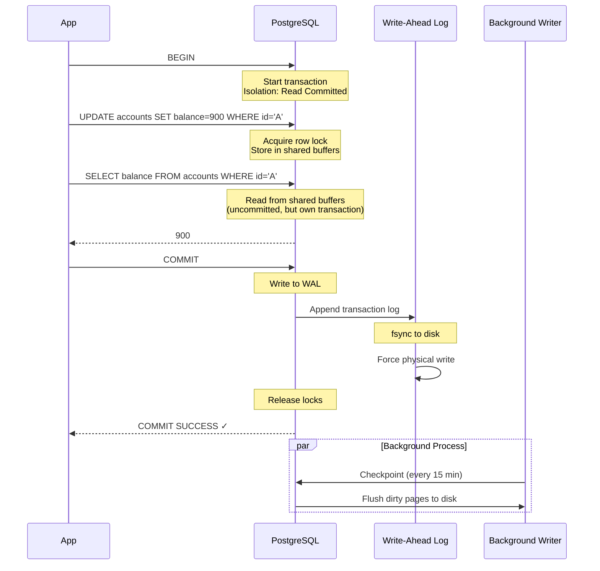
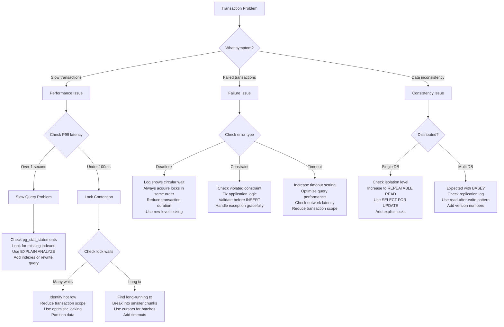

#system-design #fundamentals #databases #transactions

```table-of-contents
title:
style: nestedList # TOC style (nestedList|nestedOrderedList|inlineFirstLevel)
minLevel: 0 # Include headings from the specified level
maxLevel: 0 # Include headings up to the specified level
include:
exclude:
includeLinks: true # Make headings clickable
hideWhenEmpty: false # Hide TOC if no headings are found
debugInConsole: false # Print debug info in Obsidian console
```

# ACID vs BASE

## Intuition (30 sec)

**ACID** is like a bank transfer: either the money moves completely or not at all — no half-states. **BASE** is like posting on social media: your post might take a few seconds to appear for all your followers, but eventually everyone sees it. One guarantees correctness; the other guarantees availability.

## Failure-First Scenario

> You're building a payment system. User A sends $100 to User B. The system deducts from A, then crashes before crediting B. $100 vanishes. Without ACID transactions, you just lost real money. But if you enforce ACID on everything, your social media feed becomes painfully slow. You need to know when each model applies.

---

## Working Knowledge (5 min)

### Core Definitions

**Transaction:**
- **Definition:** A sequence of database operations treated as a single, indivisible unit of work
- **Purpose:** Groups multiple operations so they either all succeed together or all fail together
- **How it works:** Database temporarily holds changes in memory, then commits all at once or rolls back everything
- **Analogy:** Like a shopping cart - you add items, but nothing is final until you checkout

**Database Consistency Model:**
- **Definition:** The rules and guarantees a database provides about data correctness and availability
- **Two main approaches:** ACID (strong consistency) vs BASE (eventual consistency)
- **Trade-off:** Correctness vs Availability vs Performance

### ACID Properties (Strong Guarantees)

**ACID:**
- **Definition:** A set of properties that guarantee database transactions are processed reliably
- **Acronym:** Atomicity, Consistency, Isolation, Durability
- **Used by:** PostgreSQL, MySQL, Oracle, SQL Server — relational databases
- **Priority:** Correctness over availability

**Key Terms:**

- **Atomicity:** All operations in a transaction complete successfully, or none do (all-or-nothing)
  - **Definition:** Transaction is treated as a single indivisible unit
  - **Mechanism:** Write-Ahead Logging (WAL) tracks changes for rollback
  - **Example:** Transfer money: debit AND credit happen, or neither

- **Consistency:** Database moves from one valid state to another, respecting all constraints
  - **Definition:** All database rules (constraints, triggers, cascades) are enforced
  - **Types:** Schema constraints, foreign keys, unique constraints, check constraints
  - **Example:** Balance can't go negative if constraint exists

- **Isolation:** Concurrent transactions don't interfere with each other
  - **Definition:** Transactions execute as if they run serially, even when parallel
  - **Mechanism:** Locks, MVCC (Multi-Version Concurrency Control), or timestamps
  - **Example:** Two simultaneous transfers don't corrupt balance

- **Durability:** Committed data survives system failures
  - **Definition:** Once committed, data persists even through crashes
  - **Mechanism:** fsync to disk, Write-Ahead Log, replication
  - **Example:** After "transfer complete," data persists even if server dies

### BASE Properties (Flexible Guarantees)

**BASE:**
- **Definition:** A consistency model prioritizing availability over immediate consistency
- **Acronym:** Basically Available, Soft state, Eventually consistent
- **Used by:** Cassandra, DynamoDB, MongoDB (in some modes), CouchDB
- **Priority:** Availability over correctness

**Key Terms:**

- **Basically Available:** System guarantees availability even during failures
  - **Definition:** System responds to every request, possibly with stale data
  - **Mechanism:** Replication, no global coordination required
  - **Example:** Read returns data from nearest replica, even if slightly outdated

- **Soft State:** System state may change without new input
  - **Definition:** Data can change due to background synchronization processes
  - **Mechanism:** Anti-entropy, read repair, hinted handoff
  - **Example:** Replica updates itself after being offline, without user action

- **Eventually Consistent:** All replicas converge to same value given enough time
  - **Definition:** If no new writes occur, all replicas will eventually agree
  - **Mechanism:** Conflict resolution (Last-Write-Wins, vector clocks, CRDTs)
  - **Example:** Like count differs across regions briefly, then synchronizes

### Visual Comparison

```
ACID Guarantee Model
════════════════════════════════════════
                Transaction Boundary
                ┌──────────────────┐
    START ──────┤ Debit  $100      │
                │ Credit $100      │──── ALL SUCCESS ✓
                │ Update timestamp │       or
                └──────────────────┘    ALL ROLLBACK ✗

Properties:
• Immediate consistency
• Strong guarantees
• Slower (coordination overhead)
• Harder to scale horizontally


BASE Guarantee Model
════════════════════════════════════════
                     Time ──────────▶
    Write ─┐
           ├─▶ Node A: ✓ (immediate)
           ├─▶ Node B: ⏳ (syncing...)
           └─▶ Node C: ⏳ (syncing...)
                  │
                  ▼ (after 100ms-5s)
           All nodes: ✓ (eventually consistent)

Properties:
• Eventual consistency
• Flexible guarantees
• Faster (no coordination)
• Easier to scale horizontally
```

### Side by Side Comparison

| Aspect | ACID | BASE |
|--------|------|------|
| **Priority** | Correctness | Availability |
| **Consistency** | Immediate (strong) | Eventual (weak) |
| **Coordination** | Required (locks, 2PC) | Not required |
| **Scaling** | Harder (distributed transactions expensive) | Easier (independent nodes) |
| **Performance** | Slower (locking, waiting) | Faster (no blocking) |
| **Latency** | Higher during writes | Lower overall |
| **Use when** | Money, inventory, bookings | Social feeds, analytics, caching |
| **Failure mode** | Reject requests (unavailable) | Serve stale data (available) |

---

## Layer 1: Conceptual Precision (15 min)

### ACID Deep Dive

#### Atomicity - The All-or-Nothing Guarantee

**Formal Definition:** A transaction's operations are indivisible; either all operations complete successfully and are committed, or all are aborted and the database is left unchanged.

**Simple Definition:** Like a light switch - it's either ON or OFF, never stuck in between.

**How It Works Internally:**



**Mechanisms:**
- **Write-Ahead Log (WAL):** Records intended changes before modifying actual data
- **Undo Log:** Stores original values to rollback if needed
- **Redo Log:** Stores new values to replay committed transactions after crash
- **Two-Phase Commit:** For distributed transactions (prepare, then commit)

**Example Timeline:**

```
Transaction: Transfer $100 from A to B

t=0ms:   BEGIN TRANSACTION
t=1ms:   ┌─ Write to WAL: "A: 1000→900"
t=2ms:   ├─ Update memory: A.balance = 900
t=3ms:   ├─ Write to WAL: "B: 500→600"
t=4ms:   └─ Update memory: B.balance = 600
t=5ms:   COMMIT requested
t=6ms:   fsync WAL to disk (guaranteed durable)
t=10ms:  COMMIT confirmed ✓

If crash happens at t=3ms:
  - WAL has partial transaction
  - On restart: Read WAL, see incomplete transaction
  - Rollback: Restore A to 1000
  - Result: Transaction never happened (atomic!)
```

**Without Atomicity - The Nightmare Scenario:**

```
No transaction protection:

Step 1: balance[A] = balance[A] - 100  ✓ (A now has $900)
Step 2: 💥 CRASH
Step 3: balance[B] = balance[B] + 100  ✗ (never executed)

Result: $100 disappeared from the system!
         A lost money, B never received it.
         Database is in invalid state.
```

#### Consistency - Enforcing Database Rules

**Formal Definition:** A transaction brings the database from one valid state to another, preserving all database invariants (constraints, cascades, triggers).

**Simple Definition:** The database's rules are never broken, even temporarily.

**Important Distinction:**
- **ACID Consistency** = Database-level consistency (constraints are enforced)
- **CAP Consistency** = Distributed systems consistency (replicas agree)
- These are different concepts!

**Types of Constraints:**

```
┌─────────────────────────────────────────────────┐
│          DATABASE CONSTRAINTS                   │
├─────────────────────────────────────────────────┤
│                                                 │
│ 1. Data Type Constraints                        │
│    age INTEGER  -- Must be a number             │
│    email VARCHAR(255)  -- Max length            │
│                                                 │
│ 2. NOT NULL Constraints                         │
│    username VARCHAR NOT NULL                    │
│    -- Cannot be empty                           │
│                                                 │
│ 3. UNIQUE Constraints                           │
│    email VARCHAR UNIQUE                         │
│    -- No duplicate emails                       │
│                                                 │
│ 4. CHECK Constraints                            │
│    CHECK (balance >= 0)                         │
│    CHECK (age BETWEEN 0 AND 150)                │
│    -- Custom business rules                     │
│                                                 │
│ 5. Foreign Key Constraints                      │
│    FOREIGN KEY (user_id) REFERENCES users(id)   │
│    -- Referenced row must exist                 │
│                                                 │
│ 6. Primary Key Constraints                      │
│    PRIMARY KEY (id)                             │
│    -- Unique + NOT NULL                         │
│                                                 │
│ 7. Triggers                                     │
│    CREATE TRIGGER update_timestamp              │
│    -- Custom code executed on events            │
│                                                 │
└─────────────────────────────────────────────────┘
```

**Consistency in Action:**



**Example:**

```sql
-- Account table with constraint
CREATE TABLE accounts (
    id VARCHAR PRIMARY KEY,
    balance DECIMAL CHECK (balance >= 0),  -- Never negative!
    owner VARCHAR NOT NULL
);

-- This transaction will FAIL
BEGIN TRANSACTION;
    UPDATE accounts SET balance = balance - 500 WHERE id = 'A';
    -- If A only has $300, balance would go to -$200
    -- Violates CHECK constraint!
    -- Database REJECTS this, rolls back entire transaction
COMMIT;  -- Never reached

-- Result: Database remains consistent ✓
--         Account A still has $300
```

#### Isolation - Concurrent Transaction Control

**Formal Definition:** The execution of concurrent transactions leaves the database in the same state as if transactions were executed serially (one after another).

**Simple Definition:** Transactions don't step on each other's toes.

**Why This is Hard:** Modern databases run hundreds of transactions simultaneously for performance. Making them behave as if they ran one-at-a-time is complex.

**The Isolation Levels Hierarchy:**

```
Strictest (Slowest, Safest)
         ▲
         │
    SERIALIZABLE
         │
    • No anomalies at all
    • Transactions appear serial
    • Heaviest locking/conflict detection
         │
         │
  REPEATABLE READ
         │
    • Prevents dirty & non-repeatable reads
    • Phantom reads possible
    • Row-level consistency
         │
         │
   READ COMMITTED
         │
    • Prevents dirty reads only
    • Most common default
    • Good balance
         │
         │
  READ UNCOMMITTED
         │
    • No protection
    • Can see uncommitted data
    • Almost never used
         ▼
Weakest (Fastest, Riskiest)
```

**The Three Anomalies:**

1. **Dirty Read** - Reading uncommitted data

```
Timeline:
t=0  Transaction A: UPDATE balance = 0 WHERE id='X'  (not committed)
t=1  Transaction B: SELECT balance WHERE id='X'  → reads 0
t=2  Transaction A: ROLLBACK  (reverts change)

Result: Transaction B read garbage data!
        X's balance was never actually 0.

┌─────────────┐         ┌─────────────┐
│Transaction A│         │Transaction B│
├─────────────┤         ├─────────────┤
│ balance=0   │ ─────▶  │ Read: 0     │ ✗ DIRTY READ
│ (uncommitted)         │             │
│             │         │             │
│ ROLLBACK    │         │ Used bad    │
│             │         │ data!       │
└─────────────┘         └─────────────┘

Prevention: Read Committed or higher
```

2. **Non-Repeatable Read** - Same query, different results

```
Timeline:
t=0  Transaction A: SELECT balance WHERE id='X'  → 1000
t=1  Transaction B: UPDATE balance=500 WHERE id='X'; COMMIT
t=2  Transaction A: SELECT balance WHERE id='X'  → 500 (different!)

Result: Transaction A got inconsistent data within same transaction!

┌──────────────────────────────────┐
│      Transaction A's View        │
├──────────────────────────────────┤
│ Read 1:  balance = 1000          │
│    ↓                             │
│ [Time passes, B updates & commits]
│    ↓                             │
│ Read 2:  balance = 500  ← CHANGED│
│                                  │
│ Inconsistent within transaction! │
└──────────────────────────────────┘

Prevention: Repeatable Read or higher
```

3. **Phantom Read** - Different rows appear/disappear

```
Timeline:
t=0  Transaction A: SELECT COUNT(*) FROM orders WHERE amount>100  → 5 rows
t=1  Transaction B: INSERT INTO orders (amount) VALUES (200); COMMIT
t=2  Transaction A: SELECT COUNT(*) FROM orders WHERE amount>100  → 6 rows

Result: A phantom row appeared!

┌──────────────────────────────────┐
│      Transaction A's View        │
├──────────────────────────────────┤
│ Query 1: 5 rows                  │
│   • Order 1: $150                │
│   • Order 2: $200                │
│   • Order 3: $300                │
│   • Order 4: $120                │
│   • Order 5: $500                │
│                                  │
│ [B inserts new order: $200]      │
│                                  │
│ Query 2: 6 rows  ← PHANTOM!      │
│   • All previous + new one       │
└──────────────────────────────────┘

Prevention: Serializable only
```

**Isolation Level Summary Table:**

| Level | Dirty Read | Non-Repeatable | Phantom | Default In | Performance |
|-------|------------|----------------|---------|-----------|-------------|
| **Serializable** | ✗ Prevented | ✗ Prevented | ✗ Prevented | - | ⭐ (slowest) |
| **Repeatable Read** | ✗ Prevented | ✗ Prevented | ✓ Possible | MySQL | ⭐⭐ |
| **Read Committed** | ✗ Prevented | ✓ Possible | ✓ Possible | PostgreSQL | ⭐⭐⭐ |
| **Read Uncommitted** | ✓ Possible | ✓ Possible | ✓ Possible | - | ⭐⭐⭐⭐ (fastest) |

**Implementation Mechanisms:**

```
Two-Phase Locking (2PL):
═══════════════════════════════════
Transaction acquires locks, holds until commit/abort
share lock for read and exclusive lock for write
    ┌───────────────────────────┐
    │ Growing Phase             │
    │ (acquire locks)           │
    │  lock(A) ──▶ read(A)      │
    │  lock(B) ──▶ write(B)     │
    │  lock(C) ──▶ read(C)      │
    └───────────┬───────────────┘
                │
    ┌───────────▼───────────────┐
    │ Shrinking Phase           │
    │ (release all locks)       │
    │  unlock(A)                │
    │  unlock(B)                │
    │  unlock(C)                │
    └───────────────────────────┘

Problem: Deadlocks possible!
Solution: Deadlock detection + abort


MVCC (Multi-Version Concurrency Control):
═══════════════════════════════════════════
Each write creates new version, readers see snapshot

Row 'X' timeline:
  v1: balance=1000  (created by T1 at t=0)
  v2: balance=900   (created by T2 at t=5)
  v3: balance=850   (created by T3 at t=10)

Transaction T4 starts at t=7:
  Reads version v2 (balance=900)
  Even if T3 commits v3, T4 keeps seeing v2
  Consistent snapshot throughout transaction!

Used by: PostgreSQL, MySQL InnoDB, Oracle

Advantage: Readers don't block writers
           Writers don't block readers
```

#### Durability - Surviving Failures

**Formal Definition:** Once a transaction commits, its changes are permanent and will survive any subsequent system failures (crashes, power loss, hardware failures).

**Simple Definition:** Committed = guaranteed saved forever.

**The Durability Challenge:**

```
The Problem:
┌────────────────────────────────────────┐
│  Writing to disk is SLOW               │
│  (1000x slower than memory)            │
│                                        │
│  If we wait for disk on every write:  │
│  • 10,000 writes/sec → 10 writes/sec  │
│  • Unacceptable performance loss      │
└────────────────────────────────────────┘

The Solution: Write-Ahead Log (WAL)
┌────────────────────────────────────────┐
│  1. Write changes to sequential log    │
│     (fast - no random disk seeks)      │
│  2. fsync log to disk                  │
│  3. Return "committed" to user         │
│  4. Later: apply changes to data files │
│     (batched, optimized)               │
└────────────────────────────────────────┘
```

**Durability Mechanisms:**



**Write-Ahead Log Flow:**

```
Step-by-Step Durability:

┌──────────────────────────────────────┐
│ 1. Transaction executes              │
│    UPDATE accounts SET balance=900   │
│    (changes in memory only)          │
└──────────┬───────────────────────────┘
           ▼
┌──────────────────────────────────────┐
│ 2. User requests COMMIT              │
└──────────┬───────────────────────────┘
           ▼
┌──────────────────────────────────────┐
│ 3. Write to WAL                      │
│    WAL entry: "accounts[A]=900"      │
│    (still in OS buffer, not on disk!)│
└──────────┬───────────────────────────┘
           ▼
┌──────────────────────────────────────┐
│ 4. fsync WAL                         │
│    Force OS to flush to disk         │
│    ⏱️ This is the slow part (5-10ms) │
└──────────┬───────────────────────────┘
           ▼
┌──────────────────────────────────────┐
│ 5. Return SUCCESS to user            │
│    ✓ Data is now DURABLE             │
└──────────┬───────────────────────────┘
           ▼
┌──────────────────────────────────────┐
│ 6. Later: Checkpoint                 │
│    Write memory buffers to data files│
│    (happens asynchronously)          │
└──────────────────────────────────────┘
```

**The Cost of Durability:**

```
Latency Impact:

Without fsync (NOT durable):
  ├─ Write to WAL: 0.01ms
  ├─ Return success: 0.01ms
  └─ Total: 0.02ms
  ✗ Data might be lost on crash!

With fsync (Durable):
  ├─ Write to WAL: 0.01ms
  ├─ fsync to disk: 5-10ms  ← EXPENSIVE
  └─ Total: 5-10ms
  ✓ Data guaranteed safe

Solution: Group Commit
  ├─ Batch multiple transactions
  ├─ One fsync for entire batch
  └─ Amortize cost across all

Example:
  100 transactions arrive in 10ms
  Do 1 fsync for all 100
  Cost per transaction: 10ms / 100 = 0.1ms
  ✓ Durable + Fast!
```

**Durability in Distributed Systems:**

```
Single Server:
  Durable = written to disk

Distributed System:
  Durable = written to N replicas

┌─────────────────────────────────────────┐
│  PostgreSQL Synchronous Replication     │
├─────────────────────────────────────────┤
│                                         │
│  Primary                                │
│     ├─ Writes to local WAL + fsync     │
│     ├─ Sends to Replica 1              │
│     ├─ Waits for Replica 1 confirm     │
│     └─ Returns SUCCESS to client       │
│                                         │
│  Now durable on 2 machines ✓           │
│  Can survive 1 server failure           │
└─────────────────────────────────────────┘

Trade-off:
  More replicas = more durability
  More replicas = higher latency
```

### Transaction Isolation Levels (Visual Deep Dive)

**Default Isolation Levels by Database:**

```
┌────────────────────────────────────────┐
│         DATABASE DEFAULTS              │
├────────────────────────────────────────┤
│ PostgreSQL    → Read Committed         │
│ MySQL InnoDB  → Repeatable Read        │
│ Oracle        → Read Committed         │
│ SQL Server    → Read Committed         │
│ SQLite        → Serializable           │
└────────────────────────────────────────┘
```

**Choosing the Right Level:**



### Distributed Transactions (The Hard Problem)

**The Challenge:**

```
Single Database Transaction:
┌───────────────┐
│   Database    │
│ ┌───────────┐ │
│ │Transaction│ │  Simple: All data in one place
│ └───────────┘ │         Atomic by default
└───────────────┘


Distributed Transaction:
┌──────────┐         ┌──────────┐        ┌──────────┐
│  DB 1    │         │  DB 2    │        │  DB 3    │
│ ┌──────┐ │         │ ┌──────┐ │        │ ┌──────┐ │
│ │Part A│ │────┐    │ │Part B│ │    ┌───│ │Part C│ │
│ └──────┘ │    │    │ └──────┘ │    │   │ └──────┘ │
└──────────┘    │    └──────────┘    │   └──────────┘
                │                    │
                └────▶ ??? ◀─────────┘
                How to make atomic across all 3?
```

**Two-Phase Commit (2PC) - The Traditional Solution:**



**2PC Problems:**

```
Problem 1: Coordinator is Single Point of Failure
┌────────────────────────────────────────┐
│        Coordinator                     │
│        💥 CRASHES                      │
└────┬───────────────────┬───────────────┘
     │                   │
┌────▼───────┐    ┌──────▼────────┐
│ Database 1 │    │ Database 2    │
│ LOCKED     │    │ LOCKED        │
│ WAITING... │    │ WAITING...    │
└────────────┘    └───────────────┘
     ↓                   ↓
All databases stuck holding locks!
Cannot commit, cannot abort.
Waiting indefinitely for coordinator.


Problem 2: Holding Locks During Network Delay
Timeline:
t=0    Prepare phase starts
t=10   All DBs locked and ready
t=11   Coordinator sends COMMIT
t=500  💥 Network slow/partition
t=510  COMMIT finally reaches DBs

Result: 500ms with locks held
        Blocks all other transactions
        Terrible for throughput


Problem 3: Cannot Handle Network Partitions
┌───────────┐     ❌ Network    ┌──────────┐
│Coordinator│     Partition     │Database 3│
│    +      │───────X───────────│  Ready   │
│  DB1+DB2  │                   │  Waiting │
└───────────┘                   └──────────┘
     │
   Decision?
   - Commit without DB3? (violates atomicity)
   - Wait forever? (unavailable)
   - Abort? (DB3 wasted work)
```

**Better Alternative: Saga Pattern:**

```
Saga Pattern: Break into local transactions + compensations

Traditional 2PC:
┌─────────────────────────────────────────┐
│     Single Distributed Transaction      │
│  ┌────────┬────────┬────────┬────────┐ │
│  │Debit A │Credit B│Update  │Send    │ │
│  │        │        │ledger  │notif   │ │
│  └────────┴────────┴────────┴────────┘ │
│  All or nothing across all systems     │
└─────────────────────────────────────────┘


Saga Pattern:
┌─────────────────────────────────────────┐
│        Sequence of Local Transactions   │
├─────────────────────────────────────────┤
│ T1: Debit A    │ Compensation: Credit A │
│ T2: Credit B   │ Compensation: Debit B  │
│ T3: Update log │ Compensation: Delete   │
│ T4: Send notif │ Compensation: (none)   │
└─────────────────────────────────────────┘

If T3 fails:
  Run compensation for T2 (debit B)
  Run compensation for T1 (credit A)
  Result: Rolled back without holding locks!
```

**Saga Flow Diagram:**



### BASE Deep Dive

#### Basically Available - Prioritizing Uptime

**Formal Definition:** The system prioritizes availability by ensuring it responds to all requests, even during partial failures, though responses may include stale or incomplete data.

**How It's Achieved:**

```
Replication Strategy:

        ┌─────────────┐
        │   Client    │
        └──────┬──────┘
               │
        ┌──────▼──────┐
        │Load Balancer│
        └──┬───┬───┬──┘
           │   │   │
    ┌──────▼┐ ┌▼──────┐ ┌▼──────┐
    │Node A │ │Node B │ │Node C │
    │ LIVE  │ │ LIVE  │ │ DOWN  │
    └───────┘ └───────┘ └───────┘

    Write Request:
    ├─ Send to all 3 nodes
    ├─ A responds: ✓
    ├─ B responds: ✓
    ├─ C timeout: ✗
    └─ 2 out of 3 = SUCCESS (Basically Available!)

    Even with 1 node down, system is available.
```

**Consistency Levels (Tunable):**

```
DynamoDB/Cassandra Consistency Levels:

┌─────────────────────────────────────────┐
│  Write Consistency                      │
├─────────────────────────────────────────┤
│  ONE      Wait for 1 node     (fastest) │
│  QUORUM   Wait for N/2 + 1    (balanced)│
│  ALL      Wait for all nodes  (slowest) │
└─────────────────────────────────────────┘

┌─────────────────────────────────────────┐
│  Read Consistency                       │
├─────────────────────────────────────────┤
│  ONE      Read from 1 node    (fastest) │
│  QUORUM   Read from N/2 + 1   (balanced)│
│  ALL      Read from all nodes (slowest) │
└─────────────────────────────────────────┘

Example: 3-node cluster
  Write: QUORUM (2 nodes)
  Read: QUORUM (2 nodes)
  → Guarantees you read your own writes!
    (overlap ensures at least 1 node has latest)
```

**Availability Trade-offs:**

```
HIGH Availability Setup:
═══════════════════════════════════
    Write to 3 nodes
    Success if ANY 1 responds

    Availability: 99.99%
    Consistency: Weak (might read stale)
    Use case: Social media likes


BALANCED Setup:
═══════════════════════════════════
    Write to 3 nodes
    Success if QUORUM (2) respond

    Availability: 99.9%
    Consistency: Medium (usually fresh)
    Use case: User profiles


LOW Availability (Strong Consistency):
═══════════════════════════════════
    Write to 3 nodes
    Success if ALL respond

    Availability: 99% (lower)
    Consistency: Strong (always fresh)
    Use case: Critical configuration
```

#### Soft State - Background Synchronization

**Formal Definition:** The state of the system may change over time, even without new input, due to eventual consistency mechanisms working in the background.

**Mechanisms:**

```
1. Anti-Entropy (Merkle Trees):
═══════════════════════════════════════

Node A:               Node B:
┌─────────────┐       ┌─────────────┐
│ user:1 = v1 │       │ user:1 = v1 │
│ user:2 = v3 │       │ user:2 = v2 │ ← Different!
│ user:3 = v5 │       │ user:3 = v5 │
└─────────────┘       └─────────────┘

Periodically (e.g., every 10 min):
1. Build Merkle tree of data
2. Compare tree hashes
3. Detect: user:2 differs
4. Sync only that row

Result: Eventually both have v3


2. Read Repair:
═══════════════════════════════════════

Client requests data:
├─ Query 3 replicas
├─ Node A: balance = 1000 (ts: 100)
├─ Node B: balance = 1000 (ts: 100)
└─ Node C: balance = 900  (ts: 90) ← Stale!

Database detects mismatch:
├─ Return latest (1000) to client
└─ Background: Update Node C to 1000

Result: Read fixes staleness


3. Hinted Handoff:
═══════════════════════════════════════

t=0  Write request arrives
     Node A: ✓ (written)
     Node B: ✓ (written)
     Node C: ✗ (down)

t=1  Node A stores "hint":
     "When C comes back, give it this write"

t=100 Node C returns

t=101 Node A: "Hey C, here's what you missed"
      C: "Thanks!" (applies write)

Result: Node C eventually catches up
```

**Example Timeline:**

```
Soft State in Action:

t=0    Write: balance=500
       ├─ Node A: ✓ 500
       ├─ Node B: ✓ 500
       └─ Node C: 💤 offline (still has 1000)

t=5    Read from Node C
       └─ Returns: 1000 (STALE)

t=10   Node C comes online
       └─ State: 1000 (unchanged by user)

t=15   Anti-entropy runs
       └─ Detects: C is stale

t=16   Background sync
       └─ Node C: 1000 → 500

t=17   Read from Node C
       └─ Returns: 500 (FRESH)

Notice: Between t=10 and t=16,
        Node C changed WITHOUT any write!
        This is "soft state"
```

#### Eventually Consistent - Conflict Resolution

**Formal Definition:** If no new updates are made to a data item, eventually all accesses to that item will return the last updated value.

**The Consistency Spectrum:**

```
Strong ◀────────────────────────────────▶ Weak

Linearizable     Sequential      Causal      Eventual
    │                │             │            │
    │                │             │            │
    ▼                ▼             ▼            ▼
All nodes         Total order   Respects      No order
see same         across all    cause-effect  guarantees
value at         operations    relationships  (eventually)
same time                                     consistent

Example          Example        Example       Example
databases:       databases:     databases:    databases:
Spanner          ZooKeeper      MongoDB       Cassandra
etcd (Raft)      (distributed   DynamoDB
                 consensus)
```

**Conflict Resolution Strategies:**

```
1. Last-Write-Wins (LWW):
═══════════════════════════════════════

t=0  Node A: balance = 900 (timestamp: 100)
t=1  Node B: balance = 800 (timestamp: 105)

Resolution: Choose timestamp 105 → 800

Problems:
✗ Loses data (900 is discarded)
✗ Depends on clock sync
✓ Simple to implement


2. Vector Clocks:
═══════════════════════════════════════

Track causality per node:

Write 1 from Node A:
  Value: 900
  Vector: {A:1, B:0, C:0}

Write 2 from Node B (knows about Write 1):
  Value: 800
  Vector: {A:1, B:1, C:0}

Write 3 from Node C (parallel to Write 2):
  Value: 850
  Vector: {A:1, B:0, C:1}

Comparison:
  Write 2 vs Write 3:
  {A:1, B:1, C:0} vs {A:1, B:0, C:1}
  → Neither dominates → CONFLICT!
  → Application must resolve


3. CRDTs (Conflict-Free Replicated Data Types):
═══════════════════════════════════════

Mathematically guaranteed to converge!

Example: Counter CRDT
  Node A: increment by 5
  Node B: increment by 3

  Later merge:
  Result = 5 + 3 = 8 (commutative!)

Example: Set CRDT
  Node A: add {item1, item2}
  Node B: add {item2, item3}

  Later merge:
  Result = {item1, item2, item3} (union!)

✓ No conflicts possible
✓ Always converges
✗ Limited operations


4. Application-Level Merge:
═══════════════════════════════════════

Amazon Shopping Cart:
  Conflict: Item was deleted on one node,
            but present on another

  Resolution: KEEP both versions
              Show user all items
              Never lose an "add to cart"

  Philosophy: Better to show deleted item
              than lose a real purchase intent
```

**Eventual Consistency Timeline:**

```
Write Propagation Example:

t=0    User writes: balance=500 (US-East)
       ┌────────────────────────────────┐
       │ US-East:  500 ✓                │
       │ US-West:  1000 (stale)         │
       │ EU:       1000 (stale)         │
       │ Asia:     1000 (stale)         │
       └────────────────────────────────┘

t=50ms Replication to US-West
       ┌────────────────────────────────┐
       │ US-East:  500 ✓                │
       │ US-West:  500 ✓                │
       │ EU:       1000 (stale)         │
       │ Asia:     1000 (stale)         │
       └────────────────────────────────┘

t=150ms Replication to EU
       ┌────────────────────────────────┐
       │ US-East:  500 ✓                │
       │ US-West:  500 ✓                │
       │ EU:       500 ✓                │
       │ Asia:     1000 (stale)         │
       └────────────────────────────────┘

t=300ms Replication to Asia
       ┌────────────────────────────────┐
       │ US-East:  500 ✓                │
       │ US-West:  500 ✓                │
       │ EU:       500 ✓                │
       │ Asia:     500 ✓                │
       └────────────────────────────────┘

t=300ms: Eventually consistent! ✓

During t=0 to t=300ms:
  Different users saw different values
  This is "eventual" consistency
```

---

## Layer 2: Technology-Specific Examples (20 min)

### PostgreSQL (ACID Configuration)

```yaml
# postgresql.conf (Annotated for ACID Guarantees)

# ═══════════════════════════════════════════
# DURABILITY SETTINGS
# ═══════════════════════════════════════════

fsync = on
# Definition: Force writes to physical disk before COMMIT returns
# Purpose: Guarantees durability (data survives crashes)
# Impact: Adds 5-10ms latency per commit
# Never disable in production!

synchronous_commit = on
# Definition: Wait for WAL write to disk before COMMIT returns
# Options:
#   on        - Wait for fsync (full durability)
#   remote_apply - Wait for replica to apply changes
#   remote_write - Wait for replica to write to WAL
#   local     - Wait for local WAL write only
#   off       - Don't wait (FAST but loses recent commits on crash)
# Default: on

wal_level = replica
# Definition: How much information to write to WAL
# Options:
#   minimal  - Minimal logging (fast, no replication)
#   replica  - Enough for replicas (standard)
#   logical  - Support logical replication
# For production: Use 'replica' or 'logical'

# ═══════════════════════════════════════════
# ISOLATION SETTINGS
# ═══════════════════════════════════════════

default_transaction_isolation = 'read committed'
# Definition: Default isolation level for transactions
# PostgreSQL default: read committed (prevents dirty reads)
# Options:
#   read uncommitted  - (treated as read committed in PG)
#   read committed    - Most common, good balance
#   repeatable read   - Consistent snapshot
#   serializable      - Full isolation

max_connections = 200
# Definition: Maximum simultaneous client connections
# Purpose: Limits concurrent transaction load
# Too high: Wastes memory (each connection ~10MB)
# Too low: Clients get "connection refused"
# Rule of thumb: (Available RAM - shared_buffers) / 10MB

# ═══════════════════════════════════════════
# PERFORMANCE TUNING (ACID Trade-offs)
# ═══════════════════════════════════════════

shared_buffers = 4GB
# Definition: Memory for caching data pages
# Purpose: Reduces disk I/O
# Recommendation: 25% of system RAM
# Example: 16GB RAM → 4GB shared_buffers

effective_cache_size = 12GB
# Definition: Hint for query planner about OS cache size
# Purpose: Helps planner decide between index vs seq scan
# Recommendation: 50-75% of system RAM
# Does NOT allocate memory, just informs planner

wal_buffers = 16MB
# Definition: Memory for WAL before writing to disk
# Purpose: Batch WAL writes for efficiency
# Recommendation: -1 (auto-tune to 1/32 of shared_buffers)

checkpoint_timeout = 15min
# Definition: Time between automatic checkpoints
# Purpose: Balance between crash recovery time and I/O load
# Shorter: Faster recovery, more I/O overhead
# Longer: Slower recovery, less I/O overhead

# ═══════════════════════════════════════════
# MONITORING
# ═══════════════════════════════════════════

log_min_duration_statement = 1000
# Definition: Log queries slower than N milliseconds
# Purpose: Identify slow queries for optimization
# Value: 1000ms (1 second)
# Set to 0 to log all queries (expensive!)

log_lock_waits = on
# Definition: Log when transaction waits for lock
# Purpose: Detect lock contention issues
# Helps diagnose: Deadlocks, long-running transactions
```

**PostgreSQL Transaction Flow:**



### MongoDB (BASE Configuration)

```yaml
# mongod.conf (Annotated for BASE Behavior)

storage:
  # ═══════════════════════════════════════════
  # STORAGE ENGINE
  # ═══════════════════════════════════════════

  engine: wiredTiger
  # Definition: Underlying storage engine
  # WiredTiger: Modern engine with compression, concurrency
  # Supports: Document-level locking (not collection-level)

  wiredTiger:
    engineConfig:
      cacheSizeGB: 4
      # Definition: In-memory cache for documents
      # Purpose: Reduces disk reads
      # Recommendation: 50% of (RAM - 1GB)
      # Example: 8GB RAM → 3-4GB cache

replication:
  # ═══════════════════════════════════════════
  # REPLICATION (For Availability)
  # ═══════════════════════════════════════════

  replSetName: "rs0"
  # Definition: Name of replica set
  # Purpose: High availability, read scaling
  # Typical setup: 3 nodes (1 primary + 2 secondary)

# Write Concern (Consistency vs Availability Trade-off):
# ═══════════════════════════════════════════

# Example write concerns (set per operation):

# w: 1 (fastest, least durable)
# Definition: Acknowledge after writing to primary only
# Availability: High (even if secondaries are down)
# Durability: Low (data lost if primary crashes before replicating)
# Use case: Logging, metrics, non-critical data

# w: "majority" (balanced)
# Definition: Acknowledge after majority of replicas confirm
# Availability: Medium (requires majority of nodes up)
# Durability: High (data survives minority of node failures)
# Use case: User data, application state (most common)

# w: "all" (strongest, slowest)
# Definition: Acknowledge after ALL replicas confirm
# Availability: Low (any node down = writes fail)
# Durability: Highest (survives all but complete cluster failure)
# Use case: Critical configuration, financial data

# Read Concern (Consistency Trade-off):
# ═══════════════════════════════════════════

# local (fastest)
# Definition: Read from local node without checking staleness
# Consistency: Weak (might read rolled-back data)
# Use case: Analytics, caches

# majority (balanced)
# Definition: Read data acknowledged by majority
# Consistency: Strong (won't read rolled-back data)
# Use case: Standard application reads

# linearizable (strongest)
# Definition: Reads reflect all prior majority writes
# Consistency: Strongest (real-time guarantee)
# Use case: Read-your-own-writes scenarios

# ═══════════════════════════════════════════
# JOURNALING (Durability)
# ═══════════════════════════════════════════

storage:
  journal:
    enabled: true
    # Definition: Write-ahead log for crash recovery
    # Purpose: Recover uncommitted data after crash
    # Similar to PostgreSQL WAL

    commitIntervalMs: 100
    # Definition: How often to fsync journal to disk
    # Trade-off:
    #   50ms  → More durable, more I/O overhead
    #   100ms → Less durable, better performance
    #   300ms → Fast but risky (up to 300ms data loss)

# ═══════════════════════════════════════════
# SHARDING (Horizontal Scaling)
# ═══════════════════════════════════════════

sharding:
  clusterRole: shardsvr
  # Definition: This node is part of a sharded cluster
  # Purpose: Distribute data across multiple servers
  # Trade-off: Complexity vs Scale

  # Sharding splits collection across multiple shards:
  # Shard 1: users with _id 0-1000
  # Shard 2: users with _id 1001-2000
  # Shard 3: users with _id 2001-3000
  #
  # Each shard is a replica set (for availability)
  # Router (mongos) directs queries to correct shard
```

**MongoDB Consistency Levels Comparison:**

```
Write Concern Comparison:

w: 1
════════════════════════════════════
    Primary
    ┌──────┐
    │  ✓   │───── ACK immediately
    └──────┘
       │ async
       ├──▶ Secondary 1 (⏳ syncing)
       └──▶ Secondary 2 (⏳ syncing)

Latency: ~5ms
Durability: Low (primary crash = data loss)


w: "majority"
════════════════════════════════════
    Primary
    ┌──────┐
    │  ✓   │─────┐
    └──────┘     │
       │         │
       ├──▶ Secondary 1 ✓
       │                │
       └──▶ Secondary 2 ✓
                        │
                        └─── ACK after 2/3 confirm

Latency: ~20ms
Durability: High (survives 1 node failure)


w: "all"
════════════════════════════════════
    Primary
    ┌──────┐
    │  ✓   │─────┐
    └──────┘     │
       │         │
       ├──▶ Secondary 1 ✓
       │                │
       └──▶ Secondary 2 ✓
                        │
                        └─── ACK after all confirm

Latency: ~30ms
Durability: Highest
Availability: Lowest (any node down = fail)
```

### Technology Comparison Matrix

```
┌────────────────────────────────────────────────────────────────┐
│              ACID vs BASE Databases                            │
├────────────────┬───────────────────────┬───────────────────────┤
│                │ PostgreSQL (ACID)     │ Cassandra (BASE)      │
├────────────────┼───────────────────────┼───────────────────────┤
│ Consistency    │ Strong                │ Eventual (tunable)    │
│ Model          │ Immediate             │ Configurable          │
├────────────────┼───────────────────────┼───────────────────────┤
│ Transactions   │ Full ACID             │ Lightweight (LWT only)│
│                │ Multi-row, multi-table│ Single partition      │
├────────────────┼───────────────────────┼───────────────────────┤
│ Isolation      │ Read Committed        │ None (eventual)       │
│ Default        │ (prevents dirty reads)│ Read latest available │
├────────────────┼───────────────────────┼───────────────────────┤
│ Durability     │ fsync to disk         │ Replication + hints   │
│                │ WAL + replicas        │ Eventually durable    │
├────────────────┼───────────────────────┼───────────────────────┤
│ Scaling        │ Vertical              │ Horizontal            │
│                │ + Read replicas       │ Add nodes linearly    │
│                │ Sharding complex      │ Sharding native       │
├────────────────┼───────────────────────┼───────────────────────┤
│ Availability   │ Primary failure =     │ No single point       │
│                │ brief downtime        │ Always available      │
│                │ (promote replica)     │ (degraded OK)         │
├────────────────┼───────────────────────┼───────────────────────┤
│ Performance    │ ⭐⭐⭐ (3/5)          │ ⭐⭐⭐⭐⭐ (5/5)        │
│ Writes         │ Slower (ACID overhead)│ Very fast (no coord)  │
├────────────────┼───────────────────────┼───────────────────────┤
│ Performance    │ ⭐⭐⭐⭐ (4/5)         │ ⭐⭐⭐⭐⭐ (5/5)        │
│ Reads          │ Fast with indexes     │ Very fast (partitions)│
├────────────────┼───────────────────────┼───────────────────────┤
│ Query          │ SQL                   │ CQL (SQL-like)        │
│ Language       │ Full joins, complex   │ No joins, simple      │
├────────────────┼───────────────────────┼───────────────────────┤
│ Use Cases      │ • Financial systems   │ • Time-series data    │
│                │ • E-commerce orders   │ • IoT sensor data     │
│                │ • User accounts       │ • Messaging apps      │
│                │ • Inventory           │ • Activity feeds      │
│                │ • Any "must be right" │ • Analytics           │
├────────────────┼───────────────────────┼───────────────────────┤
│ Anti-Patterns  │ • Massive scale       │ • Financial ledger    │
│                │ • Extreme write load  │ • Inventory tracking  │
│                │ • Cross-region writes │ • Require consistency │
└────────────────┴───────────────────────┴───────────────────────┘
```

### Real-World Hybrid Architecture

```
E-Commerce Platform (Mixed ACID + BASE):

                    ┌──────────────┐
                    │  API Gateway │
                    └───────┬──────┘
                            │
          ┌─────────────────┼─────────────────┐
          │                 │                 │
     ┌────▼─────┐     ┌─────▼────┐     ┌─────▼─────┐
     │ Orders   │     │ Catalog  │     │ Analytics │
     │ Service  │     │ Service  │     │ Service   │
     └────┬─────┘     └─────┬────┘     └─────┬─────┘
          │                 │                 │
  ┌───────▼────────┐  ┌─────▼──────┐   ┌─────▼─────┐
  │  PostgreSQL    │  │Elasticsearch│   │ Cassandra │
  │  (ACID)        │  │  (Search)   │   │  (BASE)   │
  ├────────────────┤  ├─────────────┤   ├───────────┤
  │• Order state   │  │• Product    │   │• Page     │
  │• Payments      │  │  search     │   │  views    │
  │• Inventory     │  │• Fuzzy      │   │• Click    │
  │• User accounts │  │  matching   │   │  events   │
  │                │  │• Facets     │   │• User     │
  │Why ACID:       │  │             │   │  activity │
  │Money & stock   │  │Why eventual:│   │           │
  │must be correct │  │Search can   │   │Why eventual:│
  │                │  │lag slightly │   │High volume │
  │                │  │             │   │Approximate │
  │                │  │             │   │counts OK   │
  └────────────────┘  └─────────────┘   └───────────┘

Decision Matrix:
─────────────────────────────────────────────────────
If wrong data causes:        Then use:
• Financial loss             → ACID (PostgreSQL)
• Legal issues               → ACID (PostgreSQL)
• Customer complaint         → ACID (PostgreSQL)
• Slight inconvenience       → BASE (Cassandra)
• No real impact             → BASE (Cassandra)
```

---

## Layer 3: Production-Ready Details (30 min)

### Transaction Monitoring Metrics

```
╔═══════════════════════════════════════════════════════╗
║           TRANSACTION HEALTH DASHBOARD                ║
╠═══════════════════════════════════════════════════════╣
║                                                       ║
║  🟢 Transaction Rate                                  ║
║  ▰▰▰▰▰▰▰▰▰▰▰▰▰▰▰▰▰▰▰▰▰▰▰▰▰▰▰▰▰▰▰▰▰▰▰▰▰              ║
║  1,247 TPS (transactions per second)                  ║
║  Definition: Number of COMMIT operations per second   ║
║  Target: Depends on workload                          ║
║  Alert if: Sudden drop (possible failure)             ║
║                                                       ║
║  🟡 Transaction Latency (P99)                         ║
║  ▰▰▰▰▰▰▰▰▰▰▰▰▰▰▰▰▰▰▰▰░░░░░░░░░░░░░░░                ║
║  45ms                                                 ║
║  Definition: 99% of transactions complete within N ms ║
║  Target: < 100ms for OLTP workloads                   ║
║  Alert if: > 200ms (investigate slow queries)         ║
║                                                       ║
║  🔴 Transaction Abort Rate                            ║
║  ▰▰▰░░░░░░░░░░░░░░░░░░░░░░░░░░░░░░░░░░                ║
║  2.3% (29 aborts/sec)                                 ║
║  Definition: % of transactions that ROLLBACK          ║
║  Reasons: Deadlocks, constraint violations, timeouts  ║
║  Target: < 1%                                         ║
║  Alert if: > 5% (indicates contention or bugs)        ║
║                                                       ║
║  🟣 Lock Wait Time                                    ║
║  ▰▰▰▰▰░░░░░░░░░░░░░░░░░░░░░░░░░░░░░░░░░               ║
║  12ms average                                         ║
║  Definition: Time transactions spend waiting for locks║
║  Target: < 10ms average                               ║
║  Alert if: > 50ms (hot rows causing contention)       ║
║                                                       ║
║  ⚪ Long-Running Transactions                         ║
║  ▰▰░░░░░░░░░░░░░░░░░░░░░░░░░░░░░░░░░░░                ║
║  3 transactions > 5 seconds                           ║
║  Definition: Transactions open longer than threshold  ║
║  Problem: Hold locks, prevent vacuum, cause bloat     ║
║  Alert if: > 30 seconds (investigate + kill if needed)║
║                                                       ║
║  🟤 Deadlock Rate                                     ║
║  ▰░░░░░░░░░░░░░░░░░░░░░░░░░░░░░░░░░░░░                ║
║  0.1% (1.2 deadlocks/sec)                             ║
║  Definition: Transactions aborted due to deadlock     ║
║  Cause: Circular lock dependency (T1 waits T2, T2    ║
║         waits T1)                                     ║
║  Target: < 0.1%                                       ║
║  Alert if: > 1% (redesign transaction order)          ║
║                                                       ║
╠═══════════════════════════════════════════════════════╣
║  Key Metrics Definitions:                             ║
║  • TPS: Transactions (commits) per second             ║
║  • P99 Latency: 99th percentile response time         ║
║  • Abort Rate: Failed / Total transactions            ║
║  • Lock Wait: Time blocked waiting for locks          ║
║  • Deadlock: Circular lock dependency                 ║
╚═══════════════════════════════════════════════════════╝
```

**Monitoring Queries:**

```sql
-- PostgreSQL: Find long-running transactions
SELECT
    pid,
    now() - xact_start AS duration,
    state,
    query
FROM pg_stat_activity
WHERE (now() - xact_start) > interval '5 seconds'
  AND state != 'idle'
ORDER BY duration DESC;

-- Definition:
-- pid: Process ID of the connection
-- duration: How long transaction has been running
-- state: active (executing), idle in transaction (holding locks!)
-- query: The SQL being executed


-- PostgreSQL: Find lock contention
SELECT
    blocked_locks.pid AS blocked_pid,
    blocking_locks.pid AS blocking_pid,
    blocked_activity.query AS blocked_query,
    blocking_activity.query AS blocking_query
FROM pg_catalog.pg_locks blocked_locks
JOIN pg_catalog.pg_stat_activity blocked_activity
    ON blocked_activity.pid = blocked_locks.pid
JOIN pg_catalog.pg_locks blocking_locks
    ON blocking_locks.locktype = blocked_locks.locktype
    AND blocking_locks.granted
WHERE NOT blocked_locks.granted;

-- Shows which transactions are blocking others


-- PostgreSQL: Deadlock detection
-- Check PostgreSQL logs for:
-- "ERROR: deadlock detected"
-- "DETAIL: Process X waits for ShareLock on transaction Y..."
--
-- Enable: log_lock_waits = on in postgresql.conf
```

### Troubleshooting Decision Trees



### Capacity Planning for Transactions

```
Transaction Capacity Planning:

Given Requirements:
┌─────────────────────────────────────┐
│ • 1 million daily active users      │
│ • Each user: 20 transactions/day    │
│ • Peak traffic: 3x average          │
│ • Transaction latency target: 50ms  │
│ • Acceptable failure rate: 0.1%     │
└─────────────────────────────────────┘

Step 1: Calculate Daily Transaction Volume
┏━━━━━━━━━━━━━━━━━━━━━━━━━━━━━━━━━━━┓
┃ 1M users × 20 tx = 20M tx/day     ┃
┗━━━━━━━━━━━━━━━━━━━━━━━━━━━━━━━━━━━┛

Step 2: Calculate Average TPS
┏━━━━━━━━━━━━━━━━━━━━━━━━━━━━━━━━━━━┓
┃ 20M tx ÷ 86,400 sec = 231 TPS    ┃
┗━━━━━━━━━━━━━━━━━━━━━━━━━━━━━━━━━━━┛

Step 3: Calculate Peak TPS
┏━━━━━━━━━━━━━━━━━━━━━━━━━━━━━━━━━━━┓
┃ Peak = 231 × 3 = 693 TPS          ┃
┗━━━━━━━━━━━━━━━━━━━━━━━━━━━━━━━━━━━┛

Step 4: Determine Database Capacity
┏━━━━━━━━━━━━━━━━━━━━━━━━━━━━━━━━━━━┓
┃ PostgreSQL on m5.2xlarge:         ┃
┃ • 8 vCPUs, 32GB RAM                ┃
┃ • Tested capacity: ~1000 TPS      ┃
┃   (with proper indexes)            ┃
┃                                    ┃
┃ Required: 693 TPS peak             ┃
┃ Single server sufficient ✓         ┃
┗━━━━━━━━━━━━━━━━━━━━━━━━━━━━━━━━━━━┛

Step 5: Add High Availability
┏━━━━━━━━━━━━━━━━━━━━━━━━━━━━━━━━━━━┓
┃ Setup:                             ┃
┃ • 1 Primary (writes)               ┃
┃ • 2 Read Replicas (reads)          ┃
┃ • Auto-failover with Patroni       ┃
┃                                    ┃
┃ Split: 30% writes, 70% reads       ┃
┃ • Primary: 208 TPS                 ┃
┃ • Replicas: 243 TPS each           ┃
┗━━━━━━━━━━━━━━━━━━━━━━━━━━━━━━━━━━━┛

Step 6: Plan for Growth
┏━━━━━━━━━━━━━━━━━━━━━━━━━━━━━━━━━━━┓
┃ If users 10x → 6,930 TPS peak     ┃
┃                                    ┃
┃ Options:                           ┃
┃ 1. Vertical scale to m5.16xlarge  ┃
┃    (~5,000 TPS capacity)           ┃
┃                                    ┃
┃ 2. Horizontal shard by user_id    ┃
┃    8 shards × 1,000 TPS = 8,000   ┃
┃                                    ┃
┃ 3. Move to NewSQL (CockroachDB)   ┃
┃    Horizontal ACID-compliant       ┃
┗━━━━━━━━━━━━━━━━━━━━━━━━━━━━━━━━━━━┛

Final Architecture:
        ┌─────────────┐
        │Load Balancer│
        └──┬───────┬──┘
           │       │
    ┌──────▼──┐ ┌──▼─────────┐
    │ Primary │ │  Replica 1  │
    │ (Write) │ │  (Read)     │
    │ 208 TPS │ │  243 TPS    │
    └────┬────┘ └─────────────┘
         │
         │ replication
         ▼
    ┌─────────────┐
    │  Replica 2  │
    │  (Read)     │
    │  243 TPS    │
    └─────────────┘

Cost (AWS):
• Primary: m5.2xlarge = $280/month
• Replica 1: m5.2xlarge = $280/month
• Replica 2: m5.2xlarge = $280/month
• Load Balancer: $25/month
• Total: $865/month
```

### Production Transaction Patterns

**Pattern 1: Optimistic Locking (For Low Contention)**

```sql
-- Optimistic Locking Pattern
-- Definition: Assume no conflicts, check at commit time
-- Use when: Low contention, conflicts are rare

-- Step 1: Read with version number
SELECT id, balance, version
FROM accounts
WHERE id = 'A';
-- Returns: id='A', balance=1000, version=5

-- Step 2: Application logic
new_balance = 1000 - 100  -- Calculate new value

-- Step 3: Update only if version unchanged
UPDATE accounts
SET balance = 900, version = 6
WHERE id = 'A' AND version = 5;  -- Version check!

-- If 0 rows updated: conflict detected
-- Another transaction modified this row
-- Retry the operation

-- Advantages:
-- ✓ No locks held during computation
-- ✓ High concurrency
-- ✓ Good for read-heavy workloads

-- Disadvantages:
-- ✗ Retry logic required
-- ✗ Wasted work on conflicts
```

**Pattern 2: Pessimistic Locking (For High Contention)**

```sql
-- Pessimistic Locking Pattern
-- Definition: Acquire lock upfront, prevent conflicts
-- Use when: High contention, conflicts are common

BEGIN TRANSACTION;

-- Step 1: Lock the row immediately
SELECT id, balance
FROM accounts
WHERE id = 'A'
FOR UPDATE;  -- Locks row until COMMIT
-- Other transactions WAIT here

-- Step 2: Application logic
-- (while holding lock, no other tx can modify)

-- Step 3: Update
UPDATE accounts
SET balance = balance - 100
WHERE id = 'A';

COMMIT;  -- Release lock

-- Advantages:
-- ✓ No retries needed
-- ✓ Guaranteed no conflicts
-- ✓ Simple logic

-- Disadvantages:
-- ✗ Lower concurrency (blocking)
-- ✗ Risk of deadlocks
-- ✗ Long transactions hurt throughput
```

**Pattern 3: Saga Pattern (For Distributed Transactions)**

```
Saga Pattern Implementation:

Scenario: Book hotel + flight
  Cannot use single ACID transaction (different systems)

Step-by-step:
┌─────────────────────────────────────────┐
│ 1. Book Hotel (Local Transaction)      │
│    Result: Hotel booking ID = H123      │
│    Compensation: Cancel H123            │
└────────────┬────────────────────────────┘
             │ Success
             ▼
┌─────────────────────────────────────────┐
│ 2. Book Flight (Local Transaction)     │
│    Result: Flight booking ID = F456     │
│    Compensation: Cancel F456            │
└────────────┬────────────────────────────┘
             │ Success
             ▼
┌─────────────────────────────────────────┐
│ 3. Charge Payment (Local Transaction)  │
│    Result: Charge ID = P789             │
│    Compensation: Refund P789            │
└────────────┬────────────────────────────┘
             │ Success
             ▼
        Saga Complete ✓


If Step 3 fails:
┌─────────────────────────────────────────┐
│ 3. Charge Payment FAILS                 │
└────────────┬────────────────────────────┘
             │ Failure
             ▼
┌─────────────────────────────────────────┐
│ Compensate 2: Cancel flight F456        │
└────────────┬────────────────────────────┘
             │
             ▼
┌─────────────────────────────────────────┐
│ Compensate 1: Cancel hotel H123         │
└────────────┬────────────────────────────┘
             │
             ▼
        Saga Rolled Back


Implementation (Event-Driven):
  1. Coordinator sends events to queue
  2. Each service subscribes and processes
  3. On failure, coordinator triggers compensations
  4. Each compensation is idempotent (safe to retry)

Key Points:
• No distributed locks
• Each step is local ACID transaction
• Eventually consistent
• Requires compensation logic
```

### Replication Lag Monitoring (BASE Systems)

```
╔═══════════════════════════════════════════════════════╗
║         REPLICATION LAG DASHBOARD (BASE)              ║
╠═══════════════════════════════════════════════════════╣
║                                                       ║
║  Replica Lag (Time-based):                            ║
║  ─────────────────────────────────────────────────    ║
║                                                       ║
║  Primary ──▶ Replica 1:  50ms  ✓                     ║
║           ──▶ Replica 2:  120ms ⚠                     ║
║           ──▶ Replica 3:  5000ms ✗ (ALERT!)          ║
║                                                       ║
║  Definition: How far behind replicas are from primary ║
║  Measured by: Timestamp difference                    ║
║  Target: < 100ms for sync, < 1s for async             ║
║                                                       ║
║  Replica Lag (Bytes-based):                           ║
║  ─────────────────────────────────────────────────    ║
║                                                       ║
║  Replica 1:  5 MB behind                              ║
║  Replica 2:  12 MB behind                             ║
║  Replica 3:  500 MB behind ✗ (ALERT!)                ║
║                                                       ║
║  Definition: How many bytes of WAL not yet applied    ║
║  Problem: Large lag = long failover time              ║
║                                                       ║
║  Consistency Violations Detected:                     ║
║  ─────────────────────────────────────────────────    ║
║                                                       ║
║  t=12:34:56  Read-after-write violation               ║
║    User wrote to primary, read from replica           ║
║    Replica didn't have new data yet                   ║
║    Solution: Sticky sessions or version numbers       ║
║                                                       ║
║  t=12:35:10  Stale read                               ║
║    Replica returned data from 2 seconds ago           ║
║    Acceptable for analytics, NOT for user profile     ║
║                                                       ║
╚═══════════════════════════════════════════════════════╝

Monitoring Queries:

-- PostgreSQL: Check replication lag
SELECT
    client_addr,
    state,
    sync_state,
    replay_lag,
    write_lag,
    flush_lag
FROM pg_stat_replication;

-- Definition:
-- replay_lag: Time difference for replaying WAL
-- write_lag: Time to write WAL to replica
-- flush_lag: Time to flush WAL to replica disk


-- MongoDB: Check replication lag
rs.printReplicationInfo()

-- Shows:
-- configured oplog size
-- log length start to end
-- oplog first event time
-- oplog last event time


-- Cassandra: Check hints
nodetool statusgossip
nodetool netstats

-- Shows:
-- Hinted handoff pending
-- Dropped messages (indicates overload)
```

---

## Real-World Examples

### Example 1: Stripe - ACID for Payment Processing

**The Problem:**
```
Payment processing requires perfect consistency:
• User's card is charged
• Merchant receives credit
• Transaction is recorded

Any partial state = money lost or duplicated
```

**The Solution:**
```
Stripe Architecture (ACID-focused):

        ┌──────────────┐
        │   API Call   │
        │ (Charge $50) │
        └──────┬───────┘
               │
        ┌──────▼───────────────────────────┐
        │  PostgreSQL Transaction          │
        ├──────────────────────────────────┤
        │ BEGIN;                           │
        │                                  │
        │ 1. Debit customer                │
        │    INSERT INTO charges           │
        │    (id, amount, customer_id)     │
        │    VALUES ('ch_123', 5000, ...); │
        │                                  │
        │ 2. Credit merchant               │
        │    UPDATE balances               │
        │    SET amount = amount + 5000    │
        │    WHERE merchant_id = ...;      │
        │                                  │
        │ 3. Record in ledger              │
        │    INSERT INTO ledger_entries    │
        │    (...);                        │
        │                                  │
        │ 4. Update idempotency key        │
        │    INSERT INTO idempotency_keys  │
        │    (key, status)                 │
        │    VALUES (...);                 │
        │                                  │
        │ COMMIT;                          │
        └──────────────────────────────────┘
               │
        All or nothing ✓

If crash at step 3:
  PostgreSQL rolls back entire transaction
  Customer NOT charged
  Merchant NOT credited
  Retry is safe (idempotency key prevents duplicates)
```

**Technical Details:**
- **Database:** PostgreSQL with SERIALIZABLE isolation
- **Durability:** synchronous_commit = on (full fsync)
- **Replication:** Synchronous replication to 2+ replicas
- **Latency:** ~50ms (acceptable for payment)
- **Scale:** Handles millions of transactions/day

**Key Decision:**
```
Why ACID?
───────────────────────────────────────
Financial transactions CANNOT be:
• Partially applied (atomicity)
• Inconsistent across tables (consistency)
• Interfered with by concurrent tx (isolation)
• Lost on crash (durability)

Cost of ACID: Higher latency (~50ms)
Cost of BASE: Lost money, legal issues
→ ACID is non-negotiable
```

### Example 2: Instagram - BASE for Feed Delivery

**The Problem:**
```
Instagram feed requirements:
• 1 billion daily active users
• Each user follows 100-500 accounts
• Millions of posts per minute
• Feed must load in < 1 second

ACID approach would require:
• Locking all followed accounts on post
• Coordinating across thousands of shards
• Result: Unacceptably slow
```

**The Solution:**
```
Instagram Architecture (BASE-focused):

┌─────────────────────────────────────────┐
│  1. User Posts Photo                    │
│     Write to Cassandra (ANY node)       │
│     Consistency: ONE (fastest)          │
│     Latency: 5ms                        │
└────────────┬────────────────────────────┘
             │
             ▼
┌─────────────────────────────────────────┐
│  2. Fanout to Followers (Async)         │
│     Queue: Kafka                        │
│     Workers: Process in background      │
│     Each follower's feed updated        │
│     No blocking on post!                │
└────────────┬────────────────────────────┘
             │
             ▼ (100-500ms later)
┌─────────────────────────────────────────┐
│  3. Followers See Post                  │
│     Read from Cassandra                 │
│     Consistency: ONE (nearest node)     │
│     May have 100-500ms delay            │
│     Users don't notice ✓                │
└─────────────────────────────────────────┘

Timeline:
t=0    User posts → Write succeeds
t=50   50% of followers' feeds updated
t=100  80% of followers' feeds updated
t=500  99% of followers' feeds updated
t=1000 99.9% of followers' feeds updated

Eventually consistent ✓
```

**Technical Details:**
- **Database:** Cassandra (tunable consistency)
- **Write:** Consistency = ONE (any node)
- **Read:** Consistency = ONE (nearest node)
- **Fanout:** Asynchronous via Kafka queues
- **Latency:** 5ms to post, 100-500ms to propagate
- **Scale:** Handles billions of reads/day

**Key Decision:**
```
Why BASE?
───────────────────────────────────────
Instagram feed requirements:
• Extreme scale (billions of operations)
• Stale data is acceptable (500ms delay OK)
• Availability is critical (always let users post)

Cost of BASE: Eventual consistency
Cost of ACID: Cannot scale to this load
→ BASE is necessary for scale
```

### Example 3: Uber - Hybrid ACID + BASE

**The Problem:**
```
Uber has different consistency needs:
• Ride matching: Must be correct (no double-booking)
• Driver location: Can be slightly stale
• Pricing: Must be accurate
• ETA: Approximate is fine
```

**The Solution:**
```
Uber Architecture (Hybrid):

┌──────────────────────────────────────────┐
│  ACID: PostgreSQL (Critical Path)       │
├──────────────────────────────────────────┤
│ • Ride state machine                     │
│ • Payment processing                     │
│ • Trip history                           │
│ • Driver-rider matching                  │
│                                          │
│ Why ACID:                                │
│ Cannot double-book driver                │
│ Cannot lose payment                      │
│ Must have accurate trip record           │
└──────────────────────────────────────────┘

┌──────────────────────────────────────────┐
│  BASE: Redis + Cassandra (Hot Path)     │
├──────────────────────────────────────────┤
│ • Driver GPS coordinates (Redis)         │
│ • Real-time ETA (Redis)                  │
│ • Historical trip data (Cassandra)       │
│ • Analytics (Cassandra)                  │
│                                          │
│ Why BASE:                                │
│ High write volume (millions/sec)         │
│ Stale location by 1-2 sec is OK          │
│ Historical data can lag                  │
└──────────────────────────────────────────┘

Ride Request Flow:
1. Find nearby drivers (Redis - BASE)
   → Fast, approximate distance OK

2. Match driver to rider (PostgreSQL - ACID)
   → Transactional, ensures one driver per ride

3. Update driver location (Redis - BASE)
   → High frequency, eventual consistency OK

4. Complete payment (PostgreSQL - ACID)
   → Financial transaction, must be correct

5. Store trip analytics (Cassandra - BASE)
   → Batch write, eventual consistency OK
```

**Technical Details:**
- **ACID:** PostgreSQL for ride state, payments
- **BASE:** Redis (location cache), Cassandra (analytics)
- **Consistency:** ACID for money, BASE for metrics
- **Scaling:** 15 million trips/day globally

**Key Decision:**
```
Hybrid Approach Decision Matrix:
─────────────────────────────────────────
Operation         Type    Reason
─────────────────────────────────────────
Book ride         ACID    Cannot double-book
Process payment   ACID    Money must be exact
Update location   BASE    High volume, stale OK
Calculate ETA     BASE    Approximate is fine
Store analytics   BASE    Batch, eventual OK
Driver rating     ACID    Must be accurate
Trip history      ACID    Legal requirement
Notification      BASE    Delayed delivery OK
```

---

## Interview Preparation

### Concept Glossary

Quick reference definitions for interviews:

- **Transaction:** Sequence of operations treated as single atomic unit
- **Atomicity:** All operations succeed or all fail (no partial state)
- **Consistency:** Database rules (constraints) are never violated
- **Isolation:** Concurrent transactions don't interfere with each other
- **Durability:** Committed data survives crashes
- **BASE:** Basically Available, Soft state, Eventually consistent
- **Eventually Consistent:** All replicas converge to same value given time
- **Write-Ahead Log (WAL):** Log changes before applying them (enables atomicity)
- **Two-Phase Commit (2PC):** Protocol for distributed transactions (prepare, commit)
- **Saga:** Pattern for distributed transactions using compensating actions
- **Replication Lag:** Time difference between primary and replica
- **Quorum:** Majority of nodes (N/2 + 1) agreeing on operation
- **Dirty Read:** Reading uncommitted data from another transaction
- **Phantom Read:** New rows appearing in repeated query
- **Serializable:** Strongest isolation level (transactions appear serial)

### Common Interview Questions

**Q1: Explain ACID properties**

**Answer Structure:**

1. **Define (10 sec):**
   "ACID is a set of properties guaranteeing reliable database transactions: Atomicity, Consistency, Isolation, Durability."

2. **Explain Each (30 sec):**
   ```
   Atomicity = All or nothing
   Example: Bank transfer - both debit and credit happen, or neither

   Consistency = Rules never broken
   Example: Balance can't go negative if constraint exists

   Isolation = Transactions don't interfere
   Example: Two users buying last item - only one succeeds

   Durability = Survives crashes
   Example: After "payment complete", data persists forever
   ```

3. **State When (10 sec):**
   "Use ACID when correctness is critical: financial transactions, inventory, bookings."

4. **Mention Trade-off (10 sec):**
   "Pro: Guaranteed correctness. Con: Harder to scale, higher latency."

---

**Q2: When would you use BASE over ACID?**

**Answer Structure:**

1. **Define (10 sec):**
   "BASE prioritizes availability and scalability over immediate consistency."

2. **Explain Trade-off (20 sec):**
   ```
   ACID: Strong consistency, lower availability
   BASE: High availability, eventual consistency

   Example: Social media feed
   - Post appears for some users immediately
   - Others see it 100-500ms later
   - Eventually everyone sees it
   ```

3. **State When (20 sec):**
   ```
   Use BASE when:
   • High scale required (millions of ops/sec)
   • Stale data is acceptable (analytics, feeds)
   • Availability > consistency (always let users act)

   Don't use BASE for:
   • Financial transactions
   • Inventory management
   • Anything where "wrong" is worse than "slow"
   ```

4. **Real Example (10 sec):**
   "Instagram uses BASE for feeds (eventual), but e-commerce uses ACID for orders (immediate)."

---

**Q3: Explain transaction isolation levels**

**Answer Structure:**

1. **Define (10 sec):**
   "Isolation levels control how concurrent transactions see each other's changes."

2. **The Four Levels (30 sec):**
   ```
   Serializable:      No anomalies, slowest
     ↓
   Repeatable Read:   Row-stable, phantoms possible
     ↓
   Read Committed:    See committed only (most common)
     ↓
   Read Uncommitted:  No guarantees, fastest
   ```

3. **Practical Advice (20 sec):**
   "Most databases default to Read Committed - good balance. Use Serializable only when critical (financial). Use Repeatable Read for reports needing consistency."

4. **Show Depth (10 sec):**
   "Implementation varies: PostgreSQL uses MVCC for isolation without blocking readers, MySQL InnoDB similar but different default level."

---

**Q4: Design a payment system - what database model?**

**Answer Structure:**

1. **Choose ACID (5 sec):**
   "Use ACID database like PostgreSQL."

2. **Explain Why (20 sec):**
   ```
   Payment requirements:
   • Atomicity: Charge and credit together
   • Consistency: Balance constraints enforced
   • Isolation: No concurrent double-charges
   • Durability: Cannot lose payment records

   BASE would risk:
   • Double charges (eventual consistency)
   • Lost payments (no durability guarantee)
   • Legal issues (no audit trail guarantee)
   ```

3. **Mention Scale (20 sec):**
   "For extreme scale like Stripe: Shard by customer ID, keep ACID per shard. Use idempotency keys to handle retries. Sacrifice some latency for correctness."

4. **Address Concerns (15 sec):**
   "Interviewer might ask about scale. Answer: ACID per shard works (Stripe does millions/day). Only read-heavy parts (analytics) use eventual consistency."

---

## Quick Reference

### Decision Cheat Sheet

```
┌─────────────────────────────────────────────────────┐
│          ACID vs BASE DECISION TREE                 │
└─────────────────────────────────────────────────────┘

IF dealing with money
  THEN use ACID (PostgreSQL, MySQL)
  REASON: Cannot tolerate inconsistency

IF dealing with inventory
  THEN use ACID
  REASON: Overselling causes customer issues

IF dealing with user authentication
  THEN use ACID
  REASON: Security cannot be eventually consistent

IF dealing with analytics/metrics
  THEN use BASE (Cassandra, Druid)
  REASON: Approximate counts acceptable

IF dealing with social feeds
  THEN use BASE
  REASON: 500ms lag is invisible to users

IF dealing with caching
  THEN use BASE (Redis, Memcached)
  REASON: Stale cache is better than no cache

IF dealing with IoT sensor data
  THEN use BASE
  REASON: High volume, approximate readings OK

IF dealing with audit logs
  THEN use ACID
  REASON: Legal requirement for accuracy

IF uncertain
  THEN start with ACID, relax later if needed
  REASON: Easier to relax than to add guarantees
```

### Comparison Matrix (One Glance)

```
┌────────────────┬──────────────┬──────────────┐
│                │     ACID     │     BASE     │
├────────────────┼──────────────┼──────────────┤
│ Consistency    │ Immediate    │ Eventual     │
│ Availability   │ Lower        │ Higher       │
│ Partition Tol  │ Lower        │ Higher       │
│ Latency        │ Higher       │ Lower        │
│ Throughput     │ Lower        │ Higher        │
│ Scaling        │ Vertical     │ Horizontal   │
│ Complexity     │ Simple (DB)  │ Complex (App)│
│ Use Case       │ Money        │ Feeds        │
└────────────────┴──────────────┴──────────────┘
```

---

## Links

- [[cap_theorem]] — ACID aligns with CP, BASE aligns with AP
- [[consistency_models]] — Deeper dive into consistency options
- [[03_design_patterns/saga_pattern]] — Alternative to distributed ACID
- [[02_building_blocks/databases_sql]] — ACID databases
- [[02_building_blocks/databases_nosql]] — Mostly BASE
- [[replication]] — How data is copied across nodes
- [[sharding]] — Partitioning data for scale
