#system-design #fundamentals #api
```table-of-contents
title:
style: nestedList # TOC style (nestedList|nestedOrderedList|inlineFirstLevel)
minLevel: 0 # Include headings from the specified level
maxLevel: 0 # Include headings up to the specified level
include:
exclude:
includeLinks: true # Make headings clickable
hideWhenEmpty: false # Hide TOC if no headings are found
debugInConsole: false # Print debug info in Obsidian console
```

# API Design

## Intuition (30 sec)

A restaurant menu: it lists what you can order (endpoints), how to order it (methods), and what you'll get back (responses). The kitchen doesn't expose how it cooks — just what it serves. That's an API.

---

## Failure-First Scenario

> Two teams need to integrate their services. Team A sends data in XML, Team B expects JSON. Team A uses verbs in URLs (/getUser), Team B uses nouns (/users). Neither documented their error responses. Integration takes 3 weeks instead of 3 days. You need API standards.

---

## Working Knowledge (5 min)

### Core Definitions

**API (Application Programming Interface):**
- **Definition:** A contract between two pieces of software defining how they communicate, specifying request formats, response structures, and expected behaviors
- **Purpose:** Enables different systems to interact without exposing internal implementation details
- **How it works:** Client sends a request following the API specification, server processes it and returns a standardized response

**Key Terms:**
- **Endpoint:** A specific URL path where an API can be accessed (e.g., `/users/123`)
- **Request:** Data sent from client to server, including method, headers, and optional body
- **Response:** Data returned from server to client, including status code, headers, and body
- **Status Code:** Three-digit HTTP code indicating request outcome (200 = success, 404 = not found, etc.)

### REST (Representational State Transfer)

**REST:**
- **Definition:** An architectural style for APIs that uses HTTP methods to operate on resources identified by URLs
- **Purpose:** Provides a standard, stateless way to build web services that are scalable and easy to understand
- **How it works:** Resources (nouns) are accessed via URLs, and HTTP methods (verbs) define operations

**Key REST Terms:**
- **Resource:** Any entity that can be identified by a URI (e.g., user, order, product)
- **Stateless:** Each request contains all information needed; server stores no client context between requests
- **Idempotent:** Operation that produces the same result regardless of how many times it's executed
- **HTTP Method:** Verb indicating the desired action (GET, POST, PUT, PATCH, DELETE)

The most common API style. Resources are nouns, HTTP methods are verbs.

```
GET    /users          → List users
GET    /users/123      → Get user 123
POST   /users          → Create user
PUT    /users/123      → Replace user 123
PATCH  /users/123      → Update user 123 partially
DELETE /users/123      → Delete user 123
```

**Key principles:**
- **Stateless:** Each request is self-contained, server stores no session state
- **Resource-oriented:** URLs represent things, not actions
- **HTTP methods as verbs:** Don't use `/deleteUser`, use `DELETE /users/123`
- **Idempotent:** GET, PUT, DELETE should give same result if repeated

### GraphQL

**GraphQL:**
- **Definition:** A query language for APIs where the client specifies exactly what data it needs in a single request
- **Purpose:** Solves over-fetching (getting too much data) and under-fetching (needing multiple requests)
- **How it works:** Client sends a query describing desired data structure, server returns only requested fields

Client asks for exactly what it needs. Solves over-fetching and under-fetching.

```graphql
query {
  user(id: 123) {
    name
    email
    posts(limit: 5) {
      title
    }
  }
}
```

| REST | GraphQL |
|------|---------|
| Multiple endpoints | Single endpoint (/graphql) |
| Server decides response shape | Client decides response shape |
| Over-fetching common | No over-fetching |
| Caching is easy (HTTP caching) | Caching is harder |
| Simple | More complex to implement |

### gRPC

**gRPC:**
- **Definition:** A high-performance RPC framework using HTTP/2 and Protocol Buffers for binary serialization
- **Purpose:** Provides fast, type-safe communication between services with built-in streaming support
- **How it works:** Services are defined in `.proto` files, compiled to code, and communicate using efficient binary format
  
Protocol Buffers = A way to convert data into tiny binary format (like compressing JSON into a smaller, faster format that computers can read super efficiently).

Binary protocol using Protocol Buffers. Fast, typed, great for service-to-service.

```protobuf
service UserService {
  rpc GetUser(UserRequest) returns (UserResponse);
  rpc ListUsers(ListRequest) returns (stream UserResponse);
}
```

| Feature | REST | GraphQL | gRPC |
|---------|------|---------|------|
| Protocol | HTTP/1.1+ | HTTP | HTTP/2 |
| Format | JSON (text) | JSON (text) | Protobuf (binary) |
| Speed | Good | Good | Fastest |
| Browser support | Native | Native | Needs proxy |
| Streaming | Limited | Subscriptions | Native bidirectional |
| Best for | Public APIs | Mobile/frontend | Microservices |

### Request/Response Flow Visual

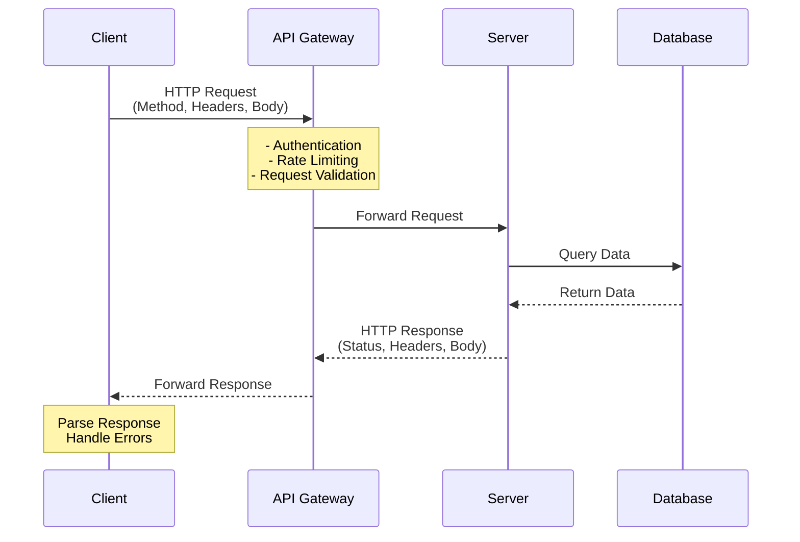

### WebSocket

**WebSocket:**
- **Definition:** A protocol providing full-duplex, persistent communication channel over a single TCP connection
- **Purpose:** Enables real-time, bidirectional communication without HTTP request/response overhead
- **How it works:** Connection starts with HTTP upgrade, then both client and server can push messages anytime

traditional HTTP request
```
CLIENT                           SERVER
  │                                │
  │  Request: "Any updates?"       │
  ├───────────────────────────────>│
  │                                │
  │  Response: "No"                │
  │<───────────────────────────────┤
  │                                │
  │  Wait 1 second...              │
  │                                │
  │  Request: "Any updates?"       │
  ├───────────────────────────────>│
  │                                │
  │  Response: "No"                │
  │<───────────────────────────────┤
  │                                │
  │  Wait 1 second...              │
  │                                │
  │  Request: "Any updates?"       │
  ├───────────────────────────────>│
  │                                │
  │  Response: "Yes! New message"  │
  │<───────────────────────────────┤
  │                                │

Problem: Wasteful polling, high latency, lots of overhead
```


Websocket solution
```
CLIENT                           SERVER
  │                                │
  │  WebSocket Handshake           │
  ├───────────────────────────────>│
  │                                │
  │  Connection Established        │
  │<───────────────────────────────┤
  │                                │
  │ ═══════════════════════════════│
  │  PERSISTENT CONNECTION OPEN    │
  │ ═══════════════════════════════│
  │                                │
  │         (3 seconds later)      │
  │  "New message!"                │
  │<───────────────────────────────┤
  │                                │
  │  "Got it, thanks!"             │
  ├───────────────────────────────>│
  │                                │
  │  "Another update"              │
  │<───────────────────────────────┤
  │                                │

Solution: Real-time, bidirectional, low overhead
```


#### WebSocket Handshake Process

##### Step 1: HTTP Upgrade Request
```
CLIENT → SERVER

GET /chat HTTP/1.1
Host: example.com
Upgrade: websocket
Connection: Upgrade
Sec-WebSocket-Key: dGhlIHNhbXBsZSBub25jZQ==
Sec-WebSocket-Version: 13
Origin: http://example.com
```

##### Step 2: Server Accepts
```
SERVER → CLIENT

HTTP/1.1 101 Switching Protocols
Upgrade: websocket
Connection: Upgrade
Sec-WebSocket-Accept: s3pPLMBiTxaQ9kYGzzhZRbK+xOo=
```

##### Complete Flow Diagram
```
┌──────────┐                                    ┌──────────┐
│  CLIENT  │                                    │  SERVER  │
└────┬─────┘                                    └────┬─────┘
     │                                               │
     │ 1. HTTP GET with Upgrade headers              │
     │   Upgrade: websocket                          │
     │   Connection: Upgrade                         │
     │   Sec-WebSocket-Key: [random base64]          │
     ├──────────────────────────────────────────────>│
     │                                               │
     │                      2. Server validates key  │
     │                         Computes SHA-1 hash   │
     │                                               │
     │ 3. HTTP 101 Switching Protocols               │
     │    Upgrade: websocket                         │
     │    Sec-WebSocket-Accept: [hash]               │
     │<──────────────────────────────────────────────┤
     │                                               │
     │ ╔══════════════════════════════════════════╗  │
     │ ║   WebSocket Connection Established       ║  │
     │ ║   (TCP connection remains open)          ║  │
     │ ╚══════════════════════════════════════════╝  │
     │                                               │
     │ 4. Message: "Hello Server!"                   │
     ├──────────────────────────────────────────────>│
     │                                               │
     │ 5. Message: "Hello Client!"                   │
     │<──────────────────────────────────────────────┤
     │                                               │
     │ 6. Message: "User123 joined"                  │
     │<──────────────────────────────────────────────┤
     │                                               │
     │ 7. Close Frame                                │
     ├──────────────────────────────────────────────>│
     │                                               │
     │ 8. Close Frame (acknowledgment)               │
     │<──────────────────────────────────────────────┤
     │                                               │
     │         Connection Closed                     │
     │                                               │
```


Full-duplex, persistent connection. Use for real-time features.

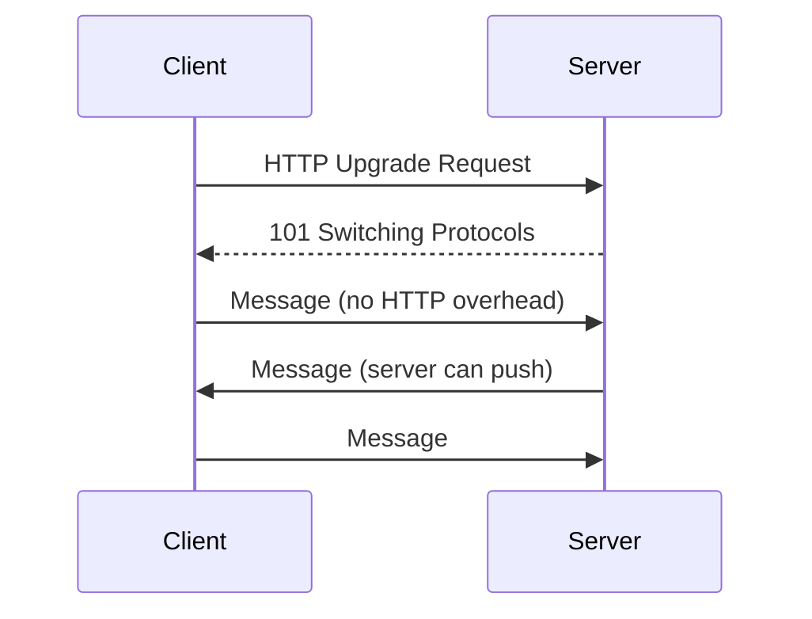

#### WebSocket API Variants

The browser provides multiple mechanisms for WebSocket connections, each with different trade-offs:

A datagram is a self-contained, independent packet of data sent over a network. Think of it as a "fire and forget" message - you send it and hope it arrives, but there's no guarantee.

Backpressure is a flow control mechanism that prevents a fast data producer from overwhelming a slow data consumer.
It's like a "slow down" signal sent from the receiver back to the sender.

HTTP overhead refers to all the extra data (headers, metadata, protocol information) transmitted along with your actual content. It's like the envelope and packaging around a letter - necessary, but not theactual message.


##### 1. WebSocket Interface (Standard)
```
┌─────────────────────────────────────────────────────┐
│  WebSocket Interface                                │
├─────────────────────────────────────────────────────┤
│  Status: ✅ Stable & widely supported               │
│                                                     │
│  Pros:                                              │
│  • Excellent browser and server support             │
│  • Battle-tested and stable                         │
│  • Simple API                                       │
│                                                     │
│  Cons:                                              │
│  • No backpressure support                          │
│  • Can fill device memory when messages arrive fast │
│  • May cause 100% CPU usage under heavy load        │
│                                                     │
│  Use when:                                          │
│  • You need wide browser compatibility              │
│  • Message rate is predictable/manageable           │
│  • Standard use cases (chat, notifications)         │
└─────────────────────────────────────────────────────┘
```

##### 2. WebSocketStream Interface (Experimental)
```
┌─────────────────────────────────────────────────────┐
│  WebSocketStream Interface                          │
├─────────────────────────────────────────────────────┤
│  Status: ⚠️  Non-standard, limited support          │
│                                                     │
│  Pros:                                              │
│  • Promise-based API                                │
│  • Built-in backpressure via Streams API            │
│  • Automatic flow control                           │
│  • Prevents memory overflow                         │
│                                                     │
│  Cons:                                              │
│  • Non-standard                                     │
│  • Only supported in Chromium-based browsers        │
│  • Not widely adopted                               │
│                                                     │
│  Use when:                                          │
│  • You need backpressure handling                   │
│  • Target environment is Chromium-only              │
│  • Dealing with high-volume message streams         │
└─────────────────────────────────────────────────────┘
```

##### 3. WebTransport API (Modern Alternative)
```
┌─────────────────────────────────────────────────────┐
│  WebTransport API                                   │
├─────────────────────────────────────────────────────┤
│  Status: 🚀 Modern, growing support                 │
│                                                     │
│  Pros:                                              │
│  • Built-in backpressure                            │
│  • Unidirectional streams                           │
│  • Out-of-order delivery                            │
│  • Unreliable data via datagrams                    │
│  • More sophisticated solutions possible            │
│                                                     │
│  Cons:                                              │
│  • More complex API                                 │
│  • Limited cross-browser support                    │
│  • Steeper learning curve                           │
│                                                     │
│  Use when:                                          │
│  • You need advanced features (streams, datagrams)  │
│  • Building sophisticated real-time applications    │
│  • Performance is critical                          │
│  • Can afford limited browser support               │
└─────────────────────────────────────────────────────┘
```

##### Comparison: Backpressure Problem

**Without Backpressure (Standard WebSocket):**
```
SERVER                                    CLIENT
  │                                         │
  │ Message 1 (1ms)                         │
  ├────────────────────────────────────────>│ Processing (50ms)
  │ Message 2 (1ms)                         │
  ├────────────────────────────────────────>│ Queued in memory
  │ Message 3 (1ms)                         │
  ├────────────────────────────────────────>│ Queued in memory
  │ Message 4 (1ms)                         │
  ├────────────────────────────────────────>│ Queued in memory
  │ ... (100 more messages)                 │
  ├────────────────────────────────────────>│ Memory overload!
  │                                         │ CPU at 100%

Problem: Messages arrive faster than client can process
Result: Memory fills up, browser becomes unresponsive
```

**With Backpressure (WebSocketStream/WebTransport):**
```
SERVER                                    CLIENT
  │                                         │
  │ Message 1 (1ms)                         │
  ├────────────────────────────────────────>│ Processing (50ms)
  │                                         │
  │ [Flow control: wait for client ready]   │
  │                                         │
  │                                         │ Finished, ready!
  │<────────────────────────────────────────┤
  │ Message 2 (1ms)                         │
  ├────────────────────────────────────────>│ Processing (50ms)
  │                                         │

Solution: Server automatically slows down to client's pace
Result: Stable memory usage, no CPU spikes
```

### Which API Should You Choose?

```
┌──────────────────────────────────────────────────────┐
│  DECISION TREE                                       │
├──────────────────────────────────────────────────────┤
│                                                      │
│  Need wide browser support?                         │
│  └─ YES → Use WebSocket Interface                   │
│                                                      │
│  High-volume messages + can't handle buffering?     │
│  └─ YES → Consider WebSocketStream (Chromium only)  │
│                                                      │
│  Need advanced features (streams, datagrams)?       │
│  └─ YES → Use WebTransport API                      │
│                                                      │
│  Building standard real-time app (chat, etc.)?      │
│  └─ YES → Stick with WebSocket Interface            │
│                                                      │
│  Need custom/sophisticated solution?                │
│  └─ YES → Evaluate WebTransport API                 │
│                                                      │
└──────────────────────────────────────────────────────┘
```

### Browser Support Summary

| API | Chrome | Firefox | Safari | Edge |
|-----|--------|---------|--------|------|
| **WebSocket** | ✅ Yes | ✅ Yes | ✅ Yes | ✅ Yes |
| **WebSocketStream** | ✅ Yes | ❌ No | ❌ No | ✅ Yes |
| **WebTransport** | ✅ Yes | ⚠️ Partial | ❌ No | ✅ Yes |

---

## Key Takeaways

1. **WebSocket = Persistent, bidirectional, real-time communication**
2. **Starts as HTTP, upgrades to WebSocket protocol**
3. **Perfect for chat, gaming, live updates**
4. **Use WSS (secure) in production**
5. **Lower overhead than HTTP polling** (2-14 bytes vs 800+ bytes)
6. **Not a replacement for HTTP** - use the right tool for the job


---

## Layer 1: Conceptual Precision (15 min)

### HTTP Methods - Deep Definitions

**HTTP Method:**
- **Formal Definition:** A verb in the HTTP protocol that indicates the desired action to be performed on a resource
- **Simple Definition:** The action you want to do (read, create, update, or delete something)
- **Analogy:** Like operations on a file: open (GET), create (POST), replace (PUT), delete (DELETE)

**Key HTTP Methods:**

**GET:**
- **Definition:** Retrieves data from a resource without modifying it
- **Properties:** Safe (no side effects), Idempotent (same result every time), Cacheable
- **When to use:** Reading data, searching, fetching lists

**POST:**
- **Definition:** Submits data to be processed, typically creating a new resource
- **Properties:** Not safe, Not idempotent (creates new resource each time), Not cacheable
- **When to use:** Creating resources, submitting forms, operations with side effects

**PUT:**
- **Definition:** Replaces the entire resource with the provided data
- **Properties:** Not safe, Idempotent (same result if called multiple times), Not cacheable
- **When to use:** Full replacement of a resource, uploading a file to a specific location

**PATCH:**
- **Definition:** Partially updates a resource with only the provided fields
- **Properties:** Not safe, Not idempotent (depends on implementation), Not cacheable
- **When to use:** Updating specific fields without replacing entire resource

**DELETE:**
- **Definition:** Removes a resource from the server
- **Properties:** Not safe, Idempotent (deleting twice = same result), Not cacheable
- **When to use:** Removing resources

### HTTP Status Codes - Complete Definitions

**HTTP Status Code:**
- **Definition:** A three-digit code in the HTTP response indicating the result of the request
- **Purpose:** Standardized way to communicate success, errors, or redirects
- **Structure:** First digit indicates category (2xx success, 4xx client error, 5xx server error)

**2xx Success:**
- **200 OK:** Standard response for successful HTTP requests; resource returned in body
- **201 Created:** Resource successfully created; includes `Location` header pointing to new resource
- **202 Accepted:** Request accepted for processing but not completed (async operation)
- **204 No Content:** Request succeeded but no content to return (common for DELETE)

**3xx Redirection:**
- **301 Moved Permanently:** Resource permanently moved to new URL; update bookmarks
- **302 Found:** Temporary redirect; original URL should be used for future requests
- **304 Not Modified:** Cached version is still valid; no need to re-download

**4xx Client Errors:**
- **400 Bad Request:** Malformed request syntax or invalid request data
- **401 Unauthorized:** Authentication required or credentials are missing/invalid
- **403 Forbidden:** Server understood request but refuses to authorize it
- **404 Not Found:** Requested resource does not exist
- **409 Conflict:** Request conflicts with current state (e.g., duplicate email)
- **422 Unprocessable Entity:** Request syntax is valid but semantically incorrect
- **429 Too Many Requests:** Rate limit exceeded; client should slow down

**5xx Server Errors:**
- **500 Internal Server Error:** Generic server error; something went wrong
- **502 Bad Gateway:** Server acting as gateway received invalid response from upstream
- **503 Service Unavailable:** Server temporarily unavailable (maintenance or overload)
- **504 Gateway Timeout:** Server acting as gateway didn't receive response in time

### Status Code Decision Flow

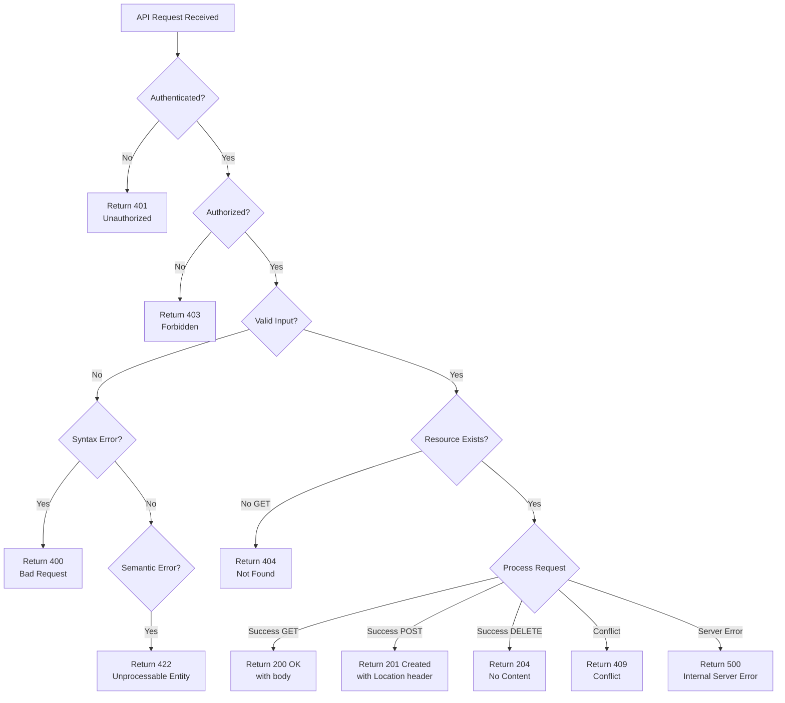

### Pagination - Deep Definitions

**Pagination:**
- **Definition:** A technique to divide large result sets into smaller, manageable chunks returned across multiple requests
- **Purpose:** Prevents memory overload, reduces response time, improves user experience
- **How it works:** Server returns subset of data plus metadata for retrieving additional pages

**Pagination Types:**

#### Offset-Based Pagination

**Definition:** Uses page number and page size to skip a fixed number of records

**How it works:**
```sql
-- Page 2, with 20 items per page
SELECT * FROM users
ORDER BY created_at DESC
LIMIT 20 OFFSET 20;
```

**Terms:**
- **Offset:** Number of records to skip before returning results
- **Limit:** Maximum number of records to return
- **Page:** Group of results (Page N = OFFSET (N-1) × Limit)

**Request Format:**
```
GET /users?page=2&limit=20
GET /users?offset=20&limit=20
```

**Response Format:**
```json
{
  "data": [...],
  "pagination": {
    "page": 2,
    "limit": 20,
    "total": 1543,
    "total_pages": 78,
    "has_next": true,
    "has_prev": true
  }
}
```

**Pros:**
- **Random Access:** Can jump to any page directly
- **Simple Implementation:** Easy to understand and implement
- **Shows Total Count:** Users know total number of pages

**Cons:**
- **Performance Degrades:** Slow on large offsets (database scans and discards rows)
- **Data Inconsistency:** Inserts/deletes during pagination cause skipped or duplicate items
- **Not Real-time Safe:** Doesn't work well with constantly changing data

#### Cursor-Based Pagination

**Definition:** Uses a unique identifier (cursor) marking position in the result set to fetch subsequent pages

**How it works:**
```sql
-- First page
SELECT * FROM users
WHERE id < 1000
ORDER BY id DESC
LIMIT 20;

-- Next page (using last ID as cursor)
SELECT * FROM users
WHERE id < 980
ORDER BY id DESC
LIMIT 20;
```

**Terms:**
- **Cursor:** Encoded pointer to position in dataset (typically last item's ID or timestamp)
- **After Cursor:** Fetch records after this position
- **Before Cursor:** Fetch records before this position (for backward pagination)

**Request Format:**
```
GET /users?cursor=abc123&limit=20
GET /users?after=eyJpZCI6OTgwfQ==&limit=20
```

**Response Format:**
```json
{
  "data": [...],
  "pagination": {
    "next_cursor": "eyJpZCI6OTYwfQ==",
    "prev_cursor": "eyJpZCI6OTgwfQ==",
    "has_more": true
  }
}
```

**Pros:**
- **Consistent Performance:** Speed doesn't degrade with deep pagination (uses indexes)
- **Real-time Safe:** Handles inserts/deletes gracefully, no duplicates
- **Scalable:** Works well with billions of records

**Cons:**
- **No Random Access:** Can't jump to arbitrary page
- **Complex Implementation:** Requires careful cursor encoding
- **No Total Count:** Can't show "Page X of Y"

### Pagination Comparison Visual

```mermaid
graph TB
    subgraph Offset["Offset-Based: Page 2 Request"]
        O1[Database Scans<br/>Records 1-20]
        O2[Skips Them<br/>OFFSET 20]
        O3[Returns<br/>Records 21-40]
        O1 --> O2 --> O3
    end

    subgraph Cursor["Cursor-Based: After ID 20"]
        C1[Database Uses Index<br/>on ID column]
        C2[Finds ID = 20<br/>O1 lookup]
        C3[Returns Next 20<br/>Records after ID 20]
        C1 --> C2 --> C3
    end

    subgraph Problem["The Shift Problem"]
        P1[User views Page 1<br/>Items: 1,2,3,4,5]
        P2[New item inserted<br/>at top]
        P3[User clicks Page 2<br/>OFFSET 5]
        P4[Item 5 appears again!<br/>was pushed to position 6]
        P1 --> P2 --> P3 --> P4
    end
```

### When to Use Which Pagination

| Use Case | Pagination Type | Why |
|----------|----------------|-----|
| Admin dashboards, data tables | Offset-based | Users need page numbers and total count |
| Infinite scroll feeds (social media) | Cursor-based | Real-time data, no need to jump to specific page |
| Large datasets (millions of rows) | Cursor-based | Performance doesn't degrade |
| Public APIs | Cursor-based | More robust to data changes |
| Search results | Offset-based | Users expect page numbers |
| Chat/messaging | Cursor-based | Real-time, chronological data |

### Authentication vs Authorization

**Authentication (AuthN):**
- **Definition:** The process of verifying the identity of a user or system
- **Question it answers:** "WHO are you?"
- **Example:** Login with username/password, presenting an API key, JWT verification

**Authorization (AuthZ):**
- **Definition:** The process of determining what actions an authenticated user is allowed to perform
- **Question it answers:** "WHAT can you do?"
- **Example:** Checking if user has "admin" role, verifying resource ownership

**Critical Distinction:**
- Authentication comes first (verify identity)
- Authorization comes second (verify permissions)
- You can be authenticated but not authorized (logged in but forbidden)

### Authentication Flow Visual

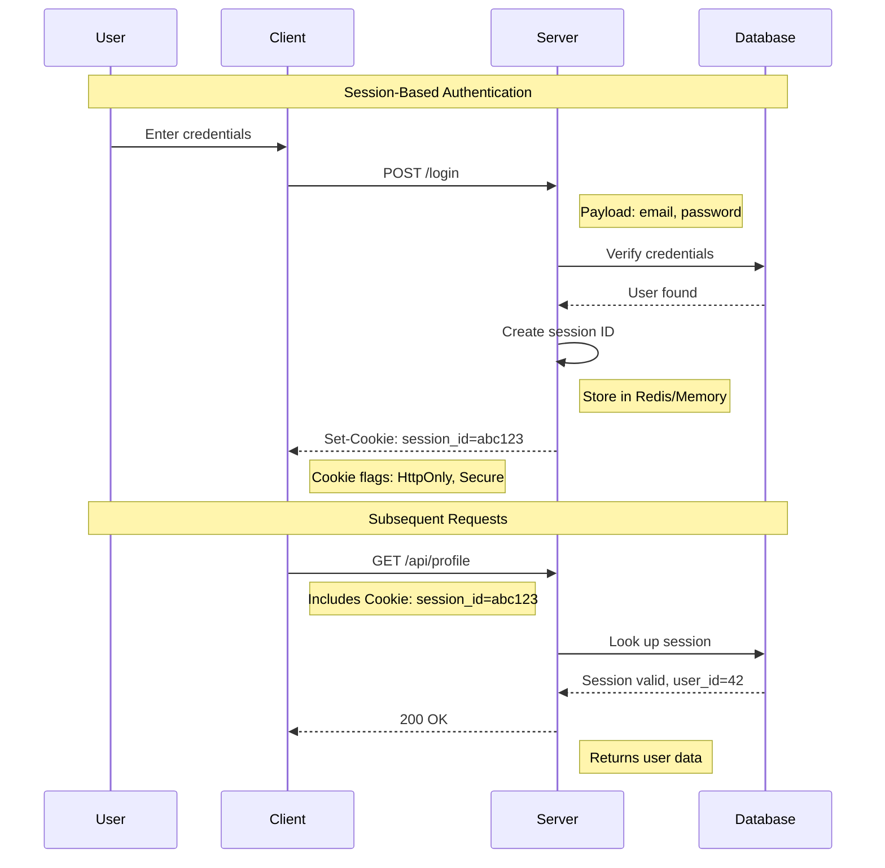

---


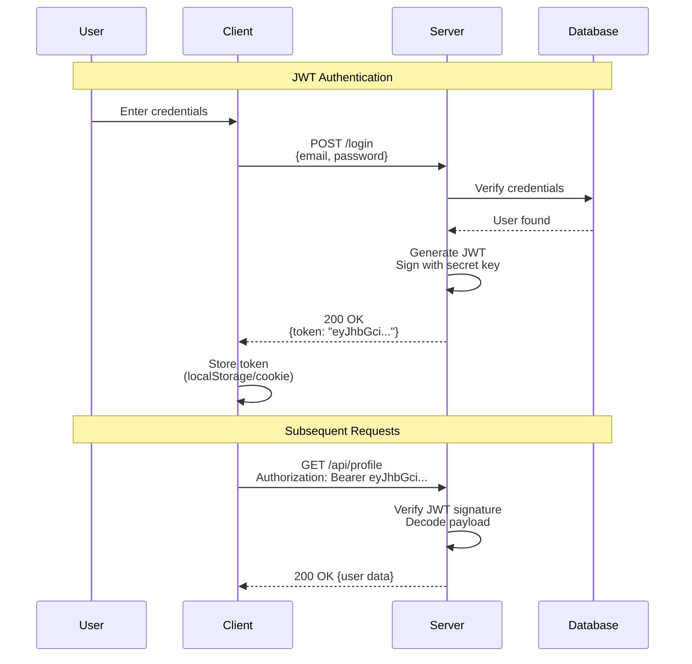

### OAuth 2.0 Flow Visual

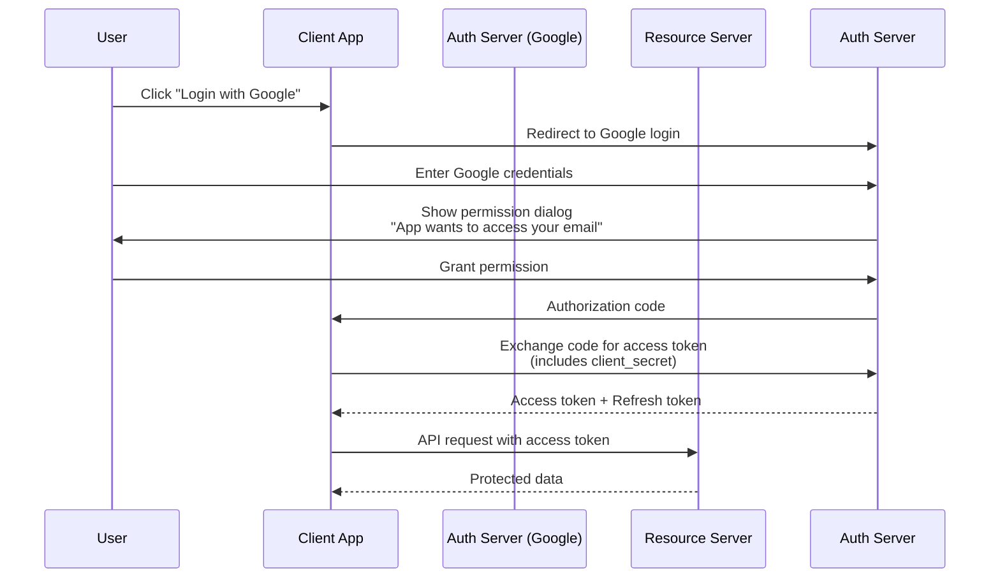

### Idempotency - Deep Explanation

**Idempotency:**
- **Formal Definition:** A property where an operation can be applied multiple times without changing the result beyond the initial application
- **Simple Definition:** Calling the operation once or multiple times produces the same end result
- **Analogy:** Like a light switch set to ON - flipping it to ON multiple times keeps it ON

**Mathematical Definition:**
```
f(f(x)) = f(x)

Example:
f(x) = absolute_value(x)
f(f(-5)) = f(5) = 5 = f(-5)
```

**Why Idempotency Matters in APIs:**

1. **Network Failures:** Requests may fail in transit, clients retry
2. **Timeouts:** Client may not receive response, retries the request
3. **Duplicate Requests:** Network issues may cause duplicate delivery

**The Payment Problem:**
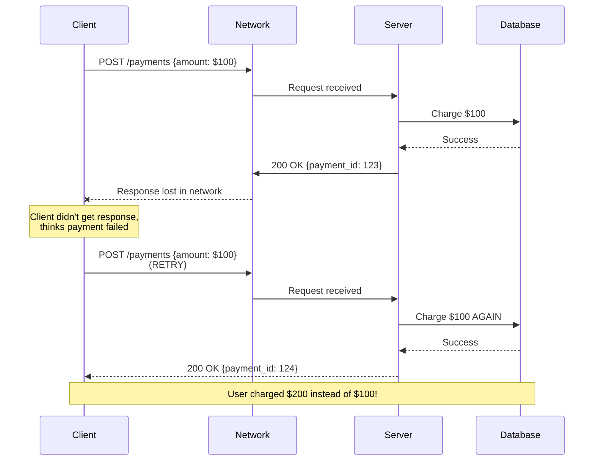

### Idempotency Key Pattern

**Idempotency Key:**
- **Definition:** A unique identifier sent by the client to ensure duplicate requests are processed only once
- **Purpose:** Makes non-idempotent operations (POST) idempotent
- **How it works:** Server stores request result keyed by idempotency key; subsequent requests with same key return stored result

**Implementation:**
```
POST /api/v1/payments
Idempotency-Key: 550e8400-e29b-41d4-a716-446655440000
Content-Type: application/json
Authorization: Bearer <token>

{
  "amount": 10000,
  "currency": "USD",
  "description": "Order #1234"
}
```

**Server-Side Logic:**
```
1. Receive request with Idempotency-Key header
2. Check: "Have I seen this key before?"

   IF key exists in cache/DB:
     - Return stored response (don't process again)
     - Same status code, headers, body

   ELSE:
     - Process payment
     - Store result with key (TTL: 24 hours)
     - Return response
```

### API Versioning - Deep Definitions

**API Versioning:**
- **Definition:** A strategy to manage changes to an API over time while maintaining backward compatibility
- **Purpose:** Allow API evolution without breaking existing clients
- **When needed:** For breaking changes (removing fields, changing types, removing endpoints)

**Breaking vs Non-Breaking Changes:**

**Breaking Changes (Require New Version):**
- Removing an endpoint
- Removing a field from response
- Renaming a field
- Changing a field's data type
- Making an optional parameter required
- Changing URL structure
- Changing authentication method

**Non-Breaking Changes (Same Version):**
- Adding a new endpoint
- Adding a new field to response
- Adding a new optional parameter
- Adding new enum values (if client ignores unknown values)
- Improving error messages
- Performance improvements

### API Versioning Decision Tree

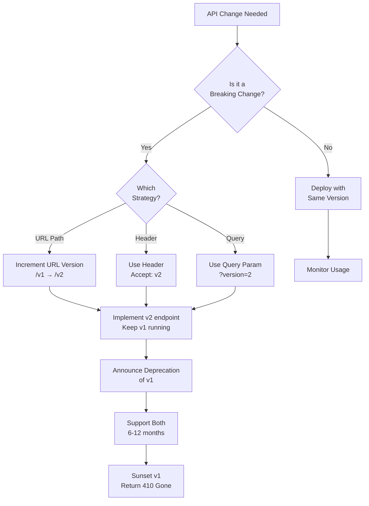

### API Versioning Strategies Comparison

| Strategy | Example | Pros | Cons | Use When |
|----------|---------|------|------|----------|
| **URL Path** | `/api/v1/users`<br/>`/api/v2/users` | Clear, explicit, easy to test | URLs change, "different" resources | Default choice, most common |
| **Header** | `Accept: application/vnd.api.v2+json` | Clean URLs, version is metadata | Hidden, harder to test in browser | Clean URL needed, many versions |
| **Query Param** | `/api/users?version=2` | Simple, easy to implement | Easy to forget, clutters params | Simple internal APIs |
| **Content Negotiation** | `Accept: application/json; version=2` | RESTful, uses HTTP standard | Complex to parse | REST purists |

**Recommended: URL Path Versioning**
- Used by: Stripe, Twitter, GitHub, Twilio, most major APIs
- Format: `/v1/`, `/v2/`, etc.
- Bump major version only for breaking changes

---

## Layer 2: Technology-Specific Examples (20 min)

### Spring Boot REST API Example

**Spring Boot:**
- **Definition:** An opinionated framework built on Spring that simplifies creating production-ready applications
- **Purpose:** Reduces boilerplate configuration, provides embedded server, auto-configuration
- **Best For:** Enterprise Java REST APIs, microservices

#### Minimal REST Controller

```java
// User.java - Data Model
@Entity
@Table(name = "users")
public class User {
    @Id
    @GeneratedValue(strategy = GenerationType.IDENTITY)
    private Long id;

    @Column(nullable = false)
    private String name;

    @Column(nullable = false, unique = true)
    private String email;

    // Constructors, getters, setters omitted for brevity
}

// UserRepository.java - Data Access Layer
@Repository
public interface UserRepository extends JpaRepository<User, Long> {
    // JpaRepository provides:
    // - save(), findById(), findAll(), deleteById()
    // - No implementation needed, Spring generates it

    Optional<User> findByEmail(String email);
}

// UserController.java - REST API Layer
@RestController
@RequestMapping("/api/v1/users")
public class UserController {

    @Autowired
    private UserRepository userRepository;

    // GET /api/v1/users - List all users
    @GetMapping
    public ResponseEntity<List<User>> getAllUsers() {
        List<User> users = userRepository.findAll();
        return ResponseEntity.ok(users);
    }

    // GET /api/v1/users/{id} - Get user by ID
    @GetMapping("/{id}")
    public ResponseEntity<User> getUserById(@PathVariable Long id) {
        return userRepository.findById(id)
            .map(ResponseEntity::ok)  // 200 OK if found
            .orElse(ResponseEntity.notFound().build());  // 404 if not found
    }

    // POST /api/v1/users - Create new user
    @PostMapping
    public ResponseEntity<User> createUser(@Valid @RequestBody User user) {
        User savedUser = userRepository.save(user);

        // 201 Created with Location header
        URI location = ServletUriComponentsBuilder
            .fromCurrentRequest()
            .path("/{id}")
            .buildAndExpand(savedUser.getId())
            .toUri();

        return ResponseEntity.created(location).body(savedUser);
    }

    // PUT /api/v1/users/{id} - Replace user
    @PutMapping("/{id}")
    public ResponseEntity<User> updateUser(
            @PathVariable Long id,
            @Valid @RequestBody User userDetails) {

        return userRepository.findById(id)
            .map(user -> {
                user.setName(userDetails.getName());
                user.setEmail(userDetails.getEmail());
                User updated = userRepository.save(user);
                return ResponseEntity.ok(updated);
            })
            .orElse(ResponseEntity.notFound().build());
    }

    // PATCH /api/v1/users/{id} - Partial update
    @PatchMapping("/{id}")
    public ResponseEntity<User> partialUpdateUser(
            @PathVariable Long id,
            @RequestBody Map<String, Object> updates) {

        return userRepository.findById(id)
            .map(user -> {
                // Update only provided fields
                if (updates.containsKey("name")) {
                    user.setName((String) updates.get("name"));
                }
                if (updates.containsKey("email")) {
                    user.setEmail((String) updates.get("email"));
                }
                User updated = userRepository.save(user);
                return ResponseEntity.ok(updated);
            })
            .orElse(ResponseEntity.notFound().build());
    }

    // DELETE /api/v1/users/{id} - Delete user
    @DeleteMapping("/{id}")
    public ResponseEntity<Void> deleteUser(@PathVariable Long id) {
        return userRepository.findById(id)
            .map(user -> {
                userRepository.delete(user);
                return ResponseEntity.noContent().<Void>build();  // 204 No Content
            })
            .orElse(ResponseEntity.notFound().build());
    }
}
```

**Key Annotations Explained:**

```java
@RestController
// Definition: Combines @Controller + @ResponseBody
// Purpose: Tells Spring this class handles REST requests
// Effect: Automatically serializes return values to JSON

@RequestMapping("/api/v1/users")
// Definition: Maps HTTP requests to handler methods
// Purpose: Sets base URL path for all methods in controller
// Effect: All endpoints in this controller start with /api/v1/users

@GetMapping, @PostMapping, @PutMapping, etc.
// Definition: Shortcuts for @RequestMapping(method = RequestMethod.GET)
// Purpose: Map HTTP methods to specific handler methods
// Effect: GET /api/v1/users calls method annotated with @GetMapping

@PathVariable
// Definition: Extracts value from URL path
// Purpose: Bind URL template variable to method parameter
// Example: In URL /users/{id}, extracts "123" from /users/123

@RequestBody
// Definition: Binds HTTP request body to method parameter
// Purpose: Deserialize JSON from request into Java object
// Example: JSON {"name": "John"} → User object

@Valid
// Definition: Triggers Bean Validation on parameter
// Purpose: Validates input before method executes
// Example: Checks @NotNull, @Email annotations on User fields

ResponseEntity<T>
// Definition: Represents entire HTTP response (status, headers, body)
// Purpose: Full control over HTTP response
// Example: ResponseEntity.ok(user) returns 200 with user in body
```

#### Pagination with Spring Boot

```java
// Offset-Based Pagination
@GetMapping
public ResponseEntity<Page<User>> getUsers(
        @RequestParam(defaultValue = "0") int page,
        @RequestParam(defaultValue = "20") int size,
        @RequestParam(defaultValue = "id,desc") String[] sort) {

    // Create Pageable object
    Pageable pageable = PageRequest.of(page, size, Sort.by(Sort.Order.desc(sort[0])));

    // Repository returns Page<User>
    Page<User> users = userRepository.findAll(pageable);

    return ResponseEntity.ok(users);
}

// Response includes:
// {
//   "content": [...],          // Array of users
//   "pageable": {
//     "pageNumber": 0,
//     "pageSize": 20
//   },
//   "totalElements": 1543,     // Total count
//   "totalPages": 78,
//   "last": false,
//   "first": true
// }
```

#### Error Handling

```java
// Global Exception Handler
@RestControllerAdvice
public class GlobalExceptionHandler {

    // Handle validation errors (400)
    @ExceptionHandler(MethodArgumentNotValidException.class)
    public ResponseEntity<ErrorResponse> handleValidationErrors(
            MethodArgumentNotValidException ex) {

        List<FieldError> errors = ex.getBindingResult().getFieldErrors()
            .stream()
            .map(error -> new FieldError(
                error.getField(),
                error.getDefaultMessage()))
            .collect(Collectors.toList());

        ErrorResponse response = new ErrorResponse(
            "VALIDATION_ERROR",
            "Invalid input data",
            errors
        );

        return ResponseEntity.status(HttpStatus.BAD_REQUEST).body(response);
    }

    // Handle resource not found (404)
    @ExceptionHandler(ResourceNotFoundException.class)
    public ResponseEntity<ErrorResponse> handleNotFound(
            ResourceNotFoundException ex) {

        ErrorResponse response = new ErrorResponse(
            "NOT_FOUND",
            ex.getMessage(),
            null
        );

        return ResponseEntity.status(HttpStatus.NOT_FOUND).body(response);
    }

    // Handle generic errors (500)
    @ExceptionHandler(Exception.class)
    public ResponseEntity<ErrorResponse> handleGenericError(Exception ex) {
        // Don't expose internal errors in production
        ErrorResponse response = new ErrorResponse(
            "INTERNAL_ERROR",
            "An unexpected error occurred",
            null
        );

        // Log the actual error for debugging
        log.error("Unhandled exception", ex);

        return ResponseEntity.status(HttpStatus.INTERNAL_SERVER_ERROR).body(response);
    }
}

// ErrorResponse DTO
@Data
@AllArgsConstructor
public class ErrorResponse {
    private String code;
    private String message;
    private List<FieldError> details;
}
```

### REST vs GraphQL vs gRPC - Decision Tree

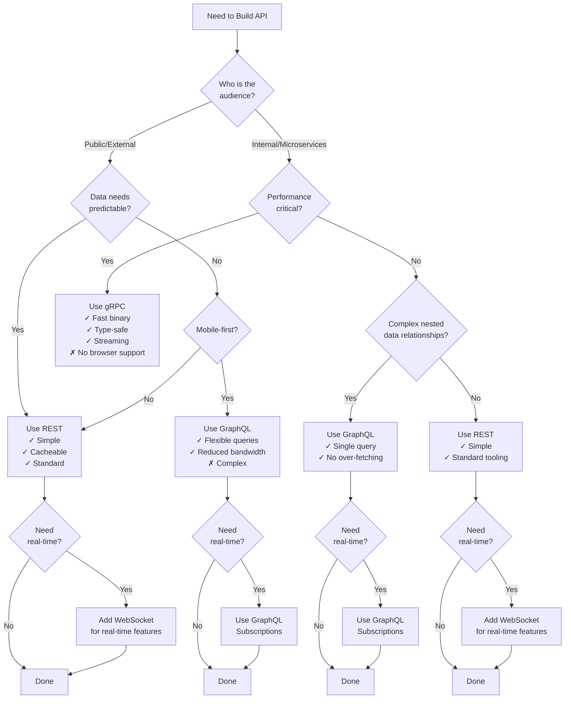

### Technology Comparison Matrix

| Factor | REST | GraphQL | gRPC | WebSocket |
|--------|------|---------|------|-----------|
| **Protocol** | HTTP/1.1+ | HTTP/1.1+ | HTTP/2 | TCP (after HTTP upgrade) |
| **Data Format** | JSON/XML | JSON | Protocol Buffers (binary) | Text or Binary |
| **Type Safety** | Manual (OpenAPI) | Strong (Schema) | Strong (Proto) | Manual |
| **Browser Support** | Full | Full | Limited (needs proxy) | Full |
| **Caching** | Easy (HTTP) | Hard (single endpoint) | Custom | N/A |
| **Learning Curve** | Low | Medium | Medium-High | Low |
| **Performance** | Good | Good | Excellent | Excellent |
| **Streaming** | SSE (one-way) | Subscriptions | Bidirectional | Bidirectional |
| **Best For** | Public APIs, CRUD | Complex clients, mobile | Microservices | Real-time apps |
| **Companies** | Stripe, Twitter | GitHub, Shopify | Google, Netflix | Slack, Trading apps |

---

## Layer 3: Production-Ready Details (30 min)

### Production API Gateway Architecture

```
                          INTERNET
                             │
                 ┌───────────▼───────────┐
                 │     CDN / CloudFlare  │
                 │  Definition: Content   │
                 │  Delivery Network      │
                 │  Purpose: Cache static │
                 │  content, DDoS protect │
                 └───────────┬───────────┘
                             │
                 ┌───────────▼───────────┐
                 │    API Gateway         │
                 │  Definition: Entry     │
                 │  point for all APIs    │
                 │                        │
                 │  Responsibilities:     │
                 │  ✓ Authentication      │
                 │  ✓ Rate Limiting       │
                 │  ✓ Request Routing     │
                 │  ✓ Response Caching    │
                 │  ✓ Monitoring/Logging  │
                 │  ✓ API Versioning      │
                 └───────────┬───────────┘
                             │
        ┌────────────────────┼────────────────────┐
        │                    │                    │
   ┌────▼────┐         ┌────▼────┐         ┌────▼────┐
   │ Service │         │ Service │         │ Service │
   │    A    │         │    B    │         │    C    │
   │ (Users) │         │(Orders) │         │(Payment)│
   │         │         │         │         │         │
   │ Role:   │         │ Role:   │         │ Role:   │
   │ Manages │         │ Manages │         │ Process │
   │ user    │         │ order   │         │ payments│
   │ data    │         │ workflow│         │         │
   └────┬────┘         └────┬────┘         └────┬────┘
        │                   │                    │
        └────────────┬──────┴────────────────────┘
                     │
              ┌──────▼──────┐
              │   Database  │
              │   Cluster   │
              │             │
              │ Role:       │
              │ Persistent  │
              │ data storage│
              └─────────────┘
```

**Component Definitions:**

**API Gateway:**
- **Definition:** A server that acts as a single entry point for all client requests, routing them to appropriate backend services
- **Purpose:** Centralized location for cross-cutting concerns (auth, rate limiting, logging)
- **Technologies:** Kong, AWS API Gateway, Azure API Management, Google Apigee, NGINX

**Key Gateway Features:**

1. **Authentication/Authorization**
   - Validates JWT tokens or API keys
   - Enriches requests with user context
   - Returns 401/403 before hitting backend

2. **Rate Limiting**
   - Tracks requests per user/IP
   - Returns 429 when limit exceeded
   - Protects backend from overload

3. **Request Routing**
   - Routes `/users/*` → User Service
   - Routes `/orders/*` → Order Service
   - Handles service discovery

4. **Response Caching**
   - Caches GET responses
   - Reduces backend load
   - Respects cache headers

5. **Monitoring/Logging**
   - Logs all requests
   - Tracks latency, errors
   - Distributed tracing (correlation IDs)

### Rate Limiting Visual Examples

#### Fixed Window Counter

```
Rate Limit: 10 requests per minute

Time:    00:00-01:00              01:00-02:00
         │ │││││││││               │
Requests │ │││││││││ (10)          │ (0 so far)
         │ │││││││││ LIMIT REACHED │
         └─────────────────────────┴─────────────>
           Window 1                 Window 2

Problem: Burst at window edges
  → 10 requests at 00:59
  → 10 requests at 01:01
  → 20 requests in 2 seconds!
```

**Fixed Window:**
- **Definition:** Count requests in fixed time intervals, reset counter at interval boundaries
- **How it works:** If limit is 10/minute, reset counter every minute on the minute (00:00, 01:00, etc.)
- **Pros:** Simple to implement, low memory
- **Cons:** Allows bursts at window boundaries

#### Sliding Window Counter

```
Rate Limit: 10 requests per minute

         <──── 60 seconds ────>
         │                     │
Current  │   ×   ××    ×××  ×  │  Now
Requests │                     │
         │                     │
         └─────────────────────┘

At any moment, count requests in past 60 seconds
  → If count < 10: Allow
  → If count ≥ 10: Reject

Smooth: No burst problem, true per-second limit
```

**Sliding Window:**
- **Definition:** Count requests in a rolling time window that moves with current time
- **How it works:** At any moment, count requests in past N seconds
- **Pros:** Smooth rate limiting, no burst problem
- **Cons:** More memory (must store timestamp of each request)

#### Token Bucket Algorithm

```
Bucket Capacity: 10 tokens
Refill Rate: 1 token/second

    ┌─────────────────┐
    │   Token Bucket  │   Tokens: ●●●●●●●●●● (10/10)
    │   Capacity: 10  │
    └────────┬────────┘
             │
    ┌────────▼─────────┐
    │ Request arrives  │
    │ Consumes 1 token │──> ●●●●●●●●● (9/10) → ALLOW
    └──────────────────┘

    Wait 1 second
    Bucket refills: ●●●●●●●●●● (10/10)

Burst allowed: Can use up to 10 tokens at once
Sustained rate: Limited to 1 request/second over time
```

**Token Bucket:**
- **Definition:** Tokens accumulate in a bucket at fixed rate; each request consumes a token
- **How it works:** Bucket refills at steady rate (e.g., 10 tokens/min), request consumes token(s)
- **Pros:** Allows controlled bursts, smooth rate limiting
- **Cons:** Slightly more complex implementation

#### Leaky Bucket Algorithm

```
Incoming requests → ┌──────────┐
                    │  BUCKET  │  Queue: 5 waiting
  Fast arrival      │ ╔══════╗ │
  ●●●●●●●●●         │ ║██████║ │
                    │ ║██████║ │
                    │ ╚══════╝ │
                    └────┬─────┘
                         │ Leak Rate: 1/second
                         ▼
              Process at constant rate
              ● → ● → ● → ●

Smooths traffic: Regardless of burst, output is constant
```

**Leaky Bucket:**
- **Definition:** Requests enter a queue and are processed at a constant rate, excess requests overflow
- **How it works:** Queue processes requests at fixed intervals, full queue rejects new requests
- **Pros:** Smooth, predictable output rate
- **Cons:** Delays requests during bursts, doesn't allow bursts

### Rate Limiting Response Headers

```http
HTTP/1.1 200 OK
X-RateLimit-Limit: 100
  Definition: Maximum requests allowed per window

X-RateLimit-Remaining: 67
  Definition: Requests left in current window

X-RateLimit-Reset: 1700000060
  Definition: Unix timestamp when window resets
  Human: 2023-11-14 15:01:00 UTC

HTTP/1.1 429 Too Many Requests
Retry-After: 30
  Definition: Seconds until client can retry

Content-Type: application/json

{
  "error": {
    "code": "RATE_LIMIT_EXCEEDED",
    "message": "Rate limit exceeded. Try again in 30 seconds."
  }
}
```

### API Monitoring Dashboard

```
┌─────────────────────────────────────────────────────────────┐
│  API METRICS DASHBOARD                    Last 5 minutes    │
├─────────────────────────────────────────────────────────────┤
│                                                               │
│  📊 Request Rate (QPS)                                       │
│  ▆▆▇██████▇▆▆▅▅▅▄▄▄▄▅▅▆▆▇▇██  1,247 req/sec                 │
│  Definition: Queries Per Second - incoming request rate      │
│  Why track: Indicates current load and traffic patterns      │
│                                                               │
│  📉 Error Rate                                               │
│  ▁▁▁▁▁▁▁▁▁▁▁▁▂▂▁▁▁▁▁▁▁▁▁▁  0.2%                              │
│  Definition: Percentage of failed requests (4xx + 5xx)       │
│  Alert when: > 1% (indicates production issues)              │
│  Status: ✅ Healthy                                          │
│                                                               │
│  ⏱️  Latency Percentiles                                     │
│  ▃▄▄▅▆▆▇▇██████▇▇▆▆▅▅▄▄▃▃                                    │
│  P50 (Median):  45ms   Definition: 50% of requests faster    │
│  P95:           120ms  Definition: 95% of requests faster    │
│  P99:           245ms  Definition: 99% of requests faster    │
│  Why P99: Shows worst-case user experience                   │
│  Target: < 200ms for good UX                                 │
│                                                               │
│  📈 Status Code Distribution                                 │
│  200 OK:          97.8% ███████████████████████░░            │
│  201 Created:      1.5% ███░░░░░░░░░░░░░░░░░░░░░            │
│  400 Bad Request:  0.4% █░░░░░░░░░░░░░░░░░░░░░░░            │
│  404 Not Found:    0.2% ░░░░░░░░░░░░░░░░░░░░░░░░            │
│  500 Server Error: 0.1% ░░░░░░░░░░░░░░░░░░░░░░░░            │
│                                                               │
│  🔥 Top Endpoints (by request count)                         │
│  1. GET  /api/v1/users         45.2%  564 req/s             │
│  2. POST /api/v1/orders        23.1%  288 req/s             │
│  3. GET  /api/v1/products      18.7%  233 req/s             │
│  4. GET  /api/v1/users/{id}    8.4%   105 req/s             │
│  5. PATCH /api/v1/users/{id}   4.6%    57 req/s             │
│                                                               │
│  ⚠️  Slowest Endpoints (by P99 latency)                      │
│  1. POST /api/v1/reports       P99: 1,245ms  ⚠️  Needs opt. │
│  2. GET  /api/v1/analytics     P99: 876ms    ⚠️  Needs cache│
│  3. POST /api/v1/exports       P99: 654ms    ⚠️  Use async  │
│                                                               │
│  📍 Geographic Distribution                                  │
│  US-East:    47%  ███████████████████░░░░░░░░░░░░░░░░░░░░░░│
│  EU-West:    31%  ████████████░░░░░░░░░░░░░░░░░░░░░░░░░░░░░│
│  Asia-Pac:   18%  ███████░░░░░░░░░░░░░░░░░░░░░░░░░░░░░░░░░░│
│  Others:      4%  █░░░░░░░░░░░░░░░░░░░░░░░░░░░░░░░░░░░░░░░░│
│                                                               │
│  🔐 Authentication Methods                                   │
│  JWT Token:    78.3%                                         │
│  API Key:      19.2%                                         │
│  OAuth:         2.5%                                         │
│                                                               │
│  💾 Cache Hit Rate                                           │
│  ████████████████████████████░░░░░░  89.7%                   │
│  Definition: Percentage of requests served from cache        │
│  Target: > 80% for cacheable endpoints                       │
│  Status: ✅ Excellent                                        │
└─────────────────────────────────────────────────────────────┘
```

**Key Metrics Explained:**

**Request Rate (QPS):**
- **Definition:** Queries Per Second - the rate of incoming requests
- **Why it matters:** Indicates load on system, helps with capacity planning
- **Alert on:** Sudden spikes (potential attack) or sustained high load

**Error Rate:**
- **Definition:** Percentage of requests that fail (return 4xx or 5xx status codes)
- **Formula:** `(4xx_count + 5xx_count) / total_requests × 100`
- **Target:** < 1% in production
- **Alert on:** > 1% error rate

**Latency Percentiles:**
- **P50 (Median):** 50% of requests complete faster than this time
- **P95:** 95% of requests complete faster than this time
- **P99:** 99% of requests complete faster than this time
- **Why P99 matters:** Shows worst-case user experience (1 in 100 users)
- **Targets:** P50 < 100ms, P95 < 200ms, P99 < 500ms (adjust based on SLA)

**Cache Hit Rate:**
- **Definition:** Percentage of requests served from cache without hitting backend
- **Formula:** `cache_hits / (cache_hits + cache_misses) × 100`
- **Target:** > 80% for cacheable endpoints
- **Impact:** Higher hit rate = lower latency, reduced backend load

### Security Checklist

```
✅ HTTPS everywhere (TLS 1.2+)
   Definition: Encrypted communication prevents man-in-the-middle attacks
   How: Use certificate from Let's Encrypt or cloud provider

✅ Authentication on all endpoints
   Definition: Verify identity before processing requests
   Implementation: JWT, API keys, OAuth 2.0

✅ Authorization checks
   Definition: Verify user has permission for requested action
   Implementation: Check user.id matches resource.owner_id

✅ Input validation
   Definition: Verify all input data meets expected format/constraints
   Implementation: Type checking, length limits, regex patterns

✅ Rate limiting
   Definition: Limit requests per user/IP per time window
   Implementation: Redis with sliding window or token bucket

✅ SQL injection prevention
   Definition: Prevent malicious SQL in user input
   Implementation: Use parameterized queries, ORMs

✅ XSS prevention
   Definition: Prevent executing malicious scripts in browser
   Implementation: Escape user input, Content-Security-Policy header

✅ CORS configuration
   Definition: Control which domains can call your API
   Implementation: Access-Control-Allow-Origin header

✅ Security headers
   Strict-Transport-Security: max-age=31536000
   X-Content-Type-Options: nosniff
   X-Frame-Options: DENY
   Content-Security-Policy: default-src 'self'

✅ Secrets management
   Definition: Never hardcode secrets in code
   Implementation: Environment variables, secret managers (AWS Secrets, Vault)

✅ Audit logging
   Definition: Log all access for forensics
   Implementation: Log who, what, when, from where for all requests
```

### BOLA/IDOR Prevention Pattern

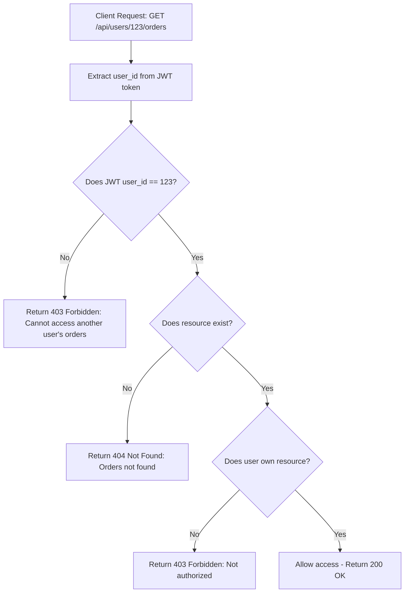

**BOLA (Broken Object Level Authorization):**
- **Definition:** Security vulnerability where users can access resources belonging to other users by changing IDs in URL
- **Also known as:** IDOR (Insecure Direct Object Reference)
- **Example:** User 42 accesses `/users/43/data` and sees user 43's private data
- **Impact:** #1 API security vulnerability, leads to data breaches

**Prevention Code Example:**

```java
@GetMapping("/api/users/{userId}/orders")
public ResponseEntity<List<Order>> getUserOrders(
        @PathVariable Long userId,
        @AuthenticationPrincipal UserDetails currentUser) {

    // Extract authenticated user ID from JWT
    Long authenticatedUserId = ((CustomUserDetails) currentUser).getUserId();

    // CRITICAL: Check if authenticated user matches requested user
    if (!authenticatedUserId.equals(userId)) {
        // Even if user 43 exists, user 42 can't access their data
        throw new ForbiddenException("Cannot access another user's orders");
    }

    // Now safe to fetch orders
    List<Order> orders = orderRepository.findByUserId(userId);
    return ResponseEntity.ok(orders);
}

// Alternative: Filter at database level
@GetMapping("/api/orders")
public ResponseEntity<List<Order>> getMyOrders(
        @AuthenticationPrincipal UserDetails currentUser) {

    Long userId = ((CustomUserDetails) currentUser).getUserId();

    // Only fetch orders belonging to authenticated user
    List<Order> orders = orderRepository.findByUserId(userId);
    return ResponseEntity.ok(orders);
}
```

---

## Real-World Examples

### Example 1: Stripe - Payment API Design

**Problem Definition:**
Payment APIs must handle network failures, retries, and prevent duplicate charges while maintaining high availability.

**Solution Definition:**
Stripe implements comprehensive idempotency using client-provided keys and stores request results for 24 hours.

**Technical Terms Used:**
- **Idempotency Key:** Unique identifier ensuring duplicate requests return same result
- **Exponential Backoff:** Retry strategy with increasing delays between attempts
- **Webhook:** Server-to-server notification when payment status changes

**API Design:**

```
POST https://api.stripe.com/v1/charges
Idempotency-Key: 550e8400-e29b-41d4-a716-446655440000
Authorization: Bearer sk_test_...
Content-Type: application/x-www-form-urlencoded

amount=2000&currency=usd&source=tok_visa

Response:
{
  "id": "ch_3MtwBwLkdIwHu7ix0Dj0PJlz",
  "amount": 2000,
  "status": "succeeded",
  ...
}
```

**Key Features:**
- URL path versioning (`/v1/`)
- Idempotency keys prevent duplicate charges
- Comprehensive error codes (card_declined, insufficient_funds, etc.)
- Webhooks for async notifications
- API keys for authentication

**Results:**
- Handles billions of API requests per month
- 99.99% uptime SLA
- Prevents duplicate charges even with retries

### Example 2: GitHub - REST API with Cursor Pagination

**Problem Definition:**
GitHub needs to serve repository data to millions of developers with varying data needs while maintaining performance.

**Solution Definition:**
Uses cursor-based pagination with link headers and provides both REST and GraphQL APIs.

**Before:**
```
Offset pagination:
GET /repos/facebook/react/issues?page=500

Problem: Slow for deep pages, breaks when issues added/deleted
```

**After:**
```
Cursor pagination:
GET /repos/facebook/react/issues?per_page=30

Response Headers:
Link: <https://api.github.com/repos/facebook/react/issues?per_page=30&cursor=Y3Vyc29yOnYyOpK5>; rel="next",
      <https://api.github.com/repos/facebook/react/issues?per_page=30&cursor=Y3Vyc29yOnYyOpK1>; rel="prev"

Client follows Link header to get next page
```

**Results:**
- Consistent performance regardless of page depth
- No skipped/duplicate items when data changes
- Serves 4+ billion API requests per day

---

## Interview Preparation

### Concept Glossary

Quick reference definitions for interview:

- **API:** Contract between software systems defining communication format
- **REST:** Architectural style using HTTP methods on resources identified by URLs
- **Endpoint:** Specific URL path where API can be accessed
- **Idempotent:** Operation producing same result regardless of execution count
- **Stateless:** Server stores no client context between requests
- **Status Code:** Three-digit HTTP code indicating request outcome
- **Pagination:** Dividing large result sets into pages
- **Rate Limiting:** Restricting number of requests per time window
- **Authentication:** Verifying identity (who are you?)
- **Authorization:** Verifying permissions (what can you do?)
- **JWT:** JSON Web Token - self-contained token for stateless authentication
- **OAuth:** Protocol for delegated authorization (login with Google)
- **GraphQL:** Query language where client specifies exact data needs
- **gRPC:** High-performance RPC framework using Protocol Buffers
- **BOLA:** Broken Object Level Authorization - accessing other users' data
- **Idempotency Key:** Unique identifier preventing duplicate processing

### Question Templates

**Q: What is REST and how does it work?**

**Answer Structure:**

1. **Define (5-10 sec):**
   "REST is an architectural style for building APIs that uses HTTP methods to perform operations on resources identified by URLs."

2. **Explain How (15-20 sec):**
   "Resources like 'users' or 'orders' are represented by URLs. HTTP methods act as verbs: GET to read, POST to create, PUT to replace, DELETE to remove. Each request is stateless, meaning the server doesn't remember previous requests."

3. **Give Example (10 sec):**
   "`GET /users/42` retrieves user 42. `POST /users` creates a new user. `DELETE /users/42` removes user 42."

4. **State Key Principle (5 sec):**
   "The key is stateless communication and using standard HTTP features like status codes and methods."

---

**Q: How would you design pagination for a large dataset?**

**Answer Structure:**

1. **Define (5 sec):**
   "Pagination divides large result sets into manageable pages to prevent memory overload and improve response time."

2. **Present Options (20 sec):**
   "Two main approaches: offset-based using page numbers (`?page=2&limit=20`), and cursor-based using a pointer to last item (`?cursor=abc&limit=20`). Offset is simpler but slow on large offsets. Cursor is faster and handles data changes better."

3. **State When (10 sec):**
   "Use offset for admin dashboards where users need page numbers. Use cursor for infinite scroll feeds and large datasets."

4. **Mention Trade-off (5 sec):**
   "Cursor-based is more robust but you can't jump to arbitrary pages."

---

**Q: Explain idempotency and why it matters.**

**Answer Structure:**

1. **Define (5 sec):**
   "Idempotency means calling an operation multiple times produces the same result as calling it once."

2. **Explain Why (15 sec):**
   "Network failures cause clients to retry requests. Without idempotency, a retried payment POST could charge the customer twice. GET, PUT, DELETE are naturally idempotent, but POST is not."

3. **State Solution (10 sec):**
   "Use idempotency keys - a unique ID sent by the client. Server stores the result and returns it for duplicate requests instead of processing again."

4. **Give Example (10 sec):**
   "Stripe requires `Idempotency-Key` header on payment requests. Same key = same result, preventing duplicate charges."

---

**Q: REST vs GraphQL - when would you use each?**

**Answer Structure:**

1. **Define Both (10 sec):**
   "REST uses multiple endpoints where server decides response shape. GraphQL uses one endpoint where client queries exactly what it needs."

2. **REST Use Cases (10 sec):**
   "Use REST for simple CRUD APIs, public APIs, when caching is important, or for small teams. It's the default choice."

3. **GraphQL Use Cases (10 sec):**
   "Use GraphQL when you have multiple client platforms (web, mobile, TV) needing different data, or deeply nested relationships that would require multiple REST calls."

4. **Mention Trade-off (10 sec):**
   "GraphQL adds complexity - schema management, N+1 query problems, harder caching. Only worth it at scale."

---

**Q: How do you prevent BOLA/IDOR vulnerabilities?**

**Answer Structure:**

1. **Define (5 sec):**
   "BOLA is when users can access other users' data by changing IDs in the URL, like accessing `/users/43/data` when you're user 42."

2. **Explain Impact (5 sec):**
   "It's the #1 API vulnerability and leads to data breaches."

3. **State Solution (15 sec):**
   "Always check authorization at the resource level. Extract user ID from authentication token and verify it matches the requested resource owner. Don't just check if the user is authenticated - verify they own the resource."

4. **Give Code Example (15 sec):**
   "In the handler for `GET /users/{id}/orders`, extract `userId` from JWT, compare with path parameter `{id}`. If they don't match, return 403 Forbidden. Never trust the URL parameter alone."

---

## Quick Reference

### Glossary

| Term | Definition | When You'll See It |
|------|------------|-------------------|
| **Endpoint** | Specific URL path for API access | `/api/v1/users/123` |
| **Idempotent** | Same result regardless of call count | GET, PUT, DELETE (not POST) |
| **Stateless** | No client context stored on server | Every REST request |
| **Rate Limit** | Max requests per time window | 100 requests/minute |
| **Status Code** | 3-digit response result indicator | 200, 404, 500 |
| **Pagination** | Dividing large datasets into pages | Offset vs Cursor |
| **Authentication** | Verifying identity | Login, JWT verification |
| **Authorization** | Verifying permissions | Resource ownership check |
| **BOLA/IDOR** | Accessing other users' resources | Security vulnerability |
| **Idempotency Key** | Unique ID preventing duplicate processing | Payment APIs |
| **JWT** | JSON Web Token | Stateless authentication |
| **CORS** | Cross-Origin Resource Sharing | Browser security policy |

### Decision Cheat Sheet

```
IF building public/external API
  THEN use REST with URL path versioning (/v1/)

IF multiple client platforms need different data
  THEN consider GraphQL

IF internal microservice communication
  THEN use gRPC for performance

IF need real-time bidirectional communication
  THEN use WebSocket

IF pagination for infinite scroll or large dataset
  THEN use cursor-based pagination

IF pagination for admin tables with page numbers
  THEN use offset-based pagination

IF operation must not be duplicated (payments, orders)
  THEN require idempotency keys

IF rate limiting auth endpoints
  THEN limit by IP (5 requests/minute for /login)

IF rate limiting general API
  THEN limit by user/token (100 requests/minute)

IF versioning API
  THEN use URL path versioning (/v1/, /v2/)

IF error response
  THEN include code, message, and details fields
```

---

## The "Why" Chain

- **Why API design matters?** → APIs are contracts. Bad APIs cause bugs, slow development, and frustrated consumers.
- **What's the alternative?** → Direct database access (terrible for security/coupling), file-based exchange (slow)
- **What breaks without good APIs?** → Tight coupling, breaking changes cascade, impossible to scale teams independently
- **Why idempotency?** → Network failures cause retries. Without idempotency, duplicate charges/orders/emails occur.
- **Why pagination?** → Returning millions of records crashes clients and servers. Must divide into manageable chunks.
- **Why rate limiting?** → Prevents abuse (brute force, scraping) and protects server resources from overload.
- **Why versioning?** → APIs must evolve without breaking existing clients. Version allows graceful migration.

---

## Links

- [[client_server_architecture]] — APIs define client-server communication
- [[networking_basics]] — Protocols APIs run on
- [[02_building_blocks/api_gateway]] — Centralized API management
- [[02_building_blocks/rate_limiter]] — Protecting APIs from abuse
- [[load_balancing]] — Distributing API requests across servers
- [[caching]] — Reducing API load with caching strategies
- [[authentication_authorization]] — Securing API endpoints

---

## Notes on API Design Best Practices

**How to design good REST APIs:**

1. **Use nouns, not verbs:** "X is a resource identified by a noun"
   - Good: `GET /users`, `POST /orders`
   - Bad: `GET /getUsers`, `POST /createOrder`

2. **Use HTTP methods correctly:**
   - GET: Read (safe, idempotent)
   - POST: Create (not idempotent)
   - PUT: Replace (idempotent)
   - PATCH: Partial update
   - DELETE: Remove (idempotent)

3. **Return appropriate status codes:**
   - 200: Success with body
   - 201: Created (POST success)
   - 204: Success without body (DELETE)
   - 400: Client error (bad input)
   - 404: Not found
   - 500: Server error

4. **Version from day one:**
   - Start with `/v1/` in URL path
   - Only bump for breaking changes
   - Support multiple versions during migration

5. **Paginate large responses:**
   - Default to cursor-based for scalability
   - Include metadata (has_more, next_cursor)
   - Never return all records at once

6. **Implement idempotency for critical operations:**
   - Require idempotency keys for payments, orders
   - Store results for 24 hours
   - Return stored result for duplicate keys

7. **Rate limit all endpoints:**
   - Return 429 with Retry-After header
   - Include rate limit headers in all responses
   - Limit by IP (unauthenticated) or user (authenticated)

8. **Secure everything:**
   - HTTPS everywhere
   - Authenticate every request
   - Authorize at resource level (check ownership)
   - Validate all input
   - Never expose sensitive data or stack traces
