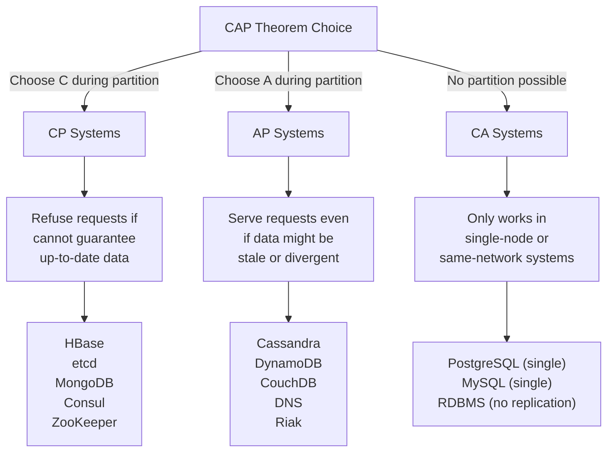
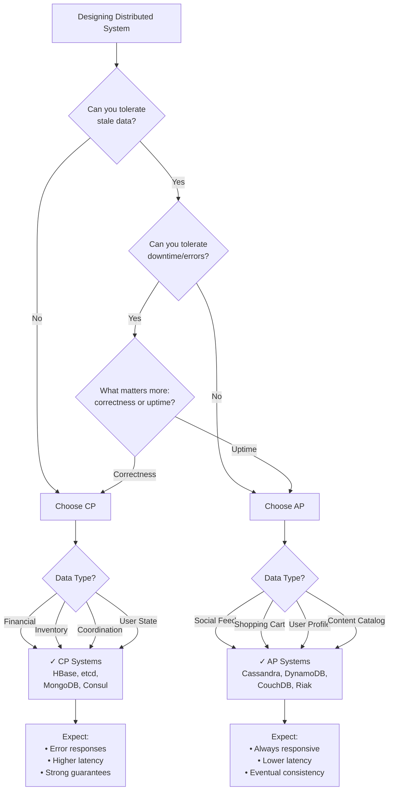
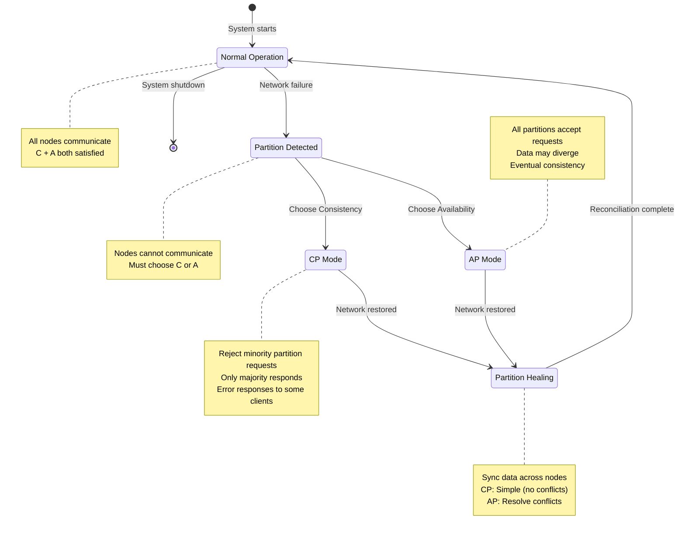

#system-design #fundamentals #distributed-systems #trade-off

# CAP Theorem

## Intuition (30 sec)

Three librarians in different cities maintain identical catalogs. When someone adds a book, do you: **(A)** wait for ALL librarians to update before confirming (consistent but slow/unavailable if one is unreachable), or **(B)** confirm immediately and sync later (available but temporarily inconsistent)? You can't have both when the phone line between libraries is down (partition).

## Failure-First Scenario

> Your app uses a distributed database across 3 data centers. A network cable is cut between DC1 and DC2. Users hitting DC1 see different data than users hitting DC2. Do you serve stale data (available but inconsistent) or refuse to serve (consistent but unavailable)? There is no third option. This is CAP.

---

## Working Knowledge (5 min)

### CAP Theorem - Core Definition

**CAP Theorem (Eric Brewer, 2000):**
- **Definition:** A fundamental principle stating that a distributed data store can guarantee at most two of three properties simultaneously: Consistency, Availability, and Partition Tolerance
- **Purpose:** Provides a framework for understanding trade-offs in distributed systems design
- **Key Insight:** Since network partitions are inevitable in distributed systems, the real choice is between Consistency and Availability during partition events

**Key Terms:**

- **Consistency (C):** Every read receives the most recent write or an error. All nodes see the same data at the same time.
- **Availability (A):** Every request receives a non-error response, without guarantee that it contains the most recent write. The system remains operational even if some nodes fail.
- **Partition Tolerance (P):** The system continues to operate despite arbitrary message loss or failure of part of the system due to network partitions.
- **Network Partition:** A communication breakdown between nodes in a distributed system, where some nodes cannot communicate with others, effectively splitting the system into isolated groups.

### The CAP Triangle (Visual)

```
                    Consistency (C)
                         ▲
                         │
                         │
                   Every read gets
                   latest write
                         │
                         │
            CP           │           CA
      (HBase, etcd)      │      (Single-node DB)
                         │
                         │
    ◄────────────────────┼────────────────────►
    │                    │                    │
    │                    │                    │
    │                    │                    │
    │         CAP Theorem Triangle            │
    │     "Choose at most 2 of 3"             │
    │                    │                    │
    │                    │                    │
    │                    ▼                    │
    │            Partition Tolerance          │
    │            (Always required in          │
    │           distributed systems)          │
    │                                         │
    ▼                                         ▼
Availability (A)                    Reality: Pick C or A
System always                       during partitions
responds

AP Systems                          The Truth:
(Cassandra, DynamoDB)               P is mandatory
                                    Real choice: C vs A
```

### The Real Trade-off

**Critical Understanding:** Network partitions WILL happen in any distributed system (hardware fails, cables break, switches crash). Therefore, Partition Tolerance (P) is not optional - it's required.

```
The False Choice:              The Real Choice:
┌───────────────┐             ┌───────────────────────┐
│ Pick 2 of 3:  │             │ When partition occurs: │
│ • C           │    ❌       │                        │
│ • A           │             │   Consistency (C)      │
│ • P           │             │         OR             │
└───────────────┘             │   Availability (A)     │
                              │                        │
                              │ P is assumed/required  │
                              └───────────────────────┘
```

### System Classification



---

## Layer 1: Conceptual Precision (15 min)

### Deep Definitions

**Consistency (C) - Formal Definition:**
- **Formal Definition:** Linearizability - all operations appear to execute atomically in some sequential order that respects the real-time ordering of operations
- **Simple Definition:** If you write a value and then read it, you always get what you just wrote (or a newer value), never an older value
- **Analogy:** Like a single shared whiteboard - everyone sees the same thing at the same time
- **Related Terms:**
  - **Strong Consistency:** Same as linearizability, the strictest form
  - **Sequential Consistency:** Operations execute in some order, but not necessarily real-time order
  - **Eventual Consistency:** Weaker guarantee where all replicas converge to the same value eventually

**Availability (A) - Formal Definition:**
- **Formal Definition:** Every request received by a non-failing node must result in a response (success or failure indication), regardless of what's happening elsewhere in the system
- **Simple Definition:** The system always responds to requests, even if it can't guarantee the data is the most recent
- **Analogy:** Like having multiple copies of a book - you can always read one, even if some copies might not have the latest errata updates
- **Related Terms:**
  - **High Availability (HA):** System design focused on maximizing uptime (99.9%+)
  - **Fault Tolerance:** Ability to continue operating despite component failures
  - **Degraded Mode:** System continues serving requests with reduced functionality

**Partition Tolerance (P) - Formal Definition:**
- **Formal Definition:** The system continues to operate correctly despite arbitrary loss of messages between nodes or node failures that divide the system into multiple partitions
- **Simple Definition:** The system works even when the network between servers is broken or slow
- **Analogy:** Like cities that can function independently when phone lines are down, then sync up when connections restore
- **Related Terms:**
  - **Split-Brain:** Partition where both sides believe they are authoritative
  - **Quorum:** Minimum number of nodes required to make decisions (prevents split-brain)
  - **Network Partition:** Communication failure that divides system into isolated groups

**Network Partition - Deep Dive:**
- **Definition:** A failure condition where the network segments into two or more groups of nodes that cannot communicate with each other, but each group's internal communication works fine
- **Causes:**
  - Router/switch failures
  - Network cable cuts
  - Firewall misconfigurations
  - Network congestion causing timeouts
  - Data center connectivity issues
- **Duration:** Can last milliseconds to hours
- **Detection:** Nodes cannot distinguish between a dead node and a network partition without additional mechanisms (heartbeats, quorum systems)

### Partition Scenarios (Visual)

```
Normal Operation (No Partition):
════════════════════════════════════════════════

    User ────▶ [Node A] ◄────▶ [Node B] ◄────▶ [Node C]
                  ↓               ↓               ↓
               DB Replica      DB Replica      DB Replica

    All nodes communicate freely
    Consistency AND Availability ✓


Partition Occurs (Network Split):
════════════════════════════════════════════════

    User ────▶ [Node A] ◄────X Network Break X────▶ [Node B] ◄────▶ [Node C]
    Write        ↓                                      ↓               ↓
    X=10      Partition 1                            Partition 2    Partition 2
              (Isolated)                             (Connected)

    Now you must choose:


    CP Choice (Consistency Priority):
    ═════════════════════════════════

    [Node A]                        [Node B] ◄────▶ [Node C]
       │                               │               │
       │ Lost quorum                   │ Has quorum    │
       │ Cannot confirm                │ Can accept    │
       │ data is latest                │ writes        │
       ▼                               ▼               ▼
    Returns ERROR ❌                 Returns SUCCESS ✓
    "Service unavailable"            (consistent data)

    ✓ Consistency maintained (no stale data)
    ✗ Availability lost (Node A rejects requests)


    AP Choice (Availability Priority):
    ═════════════════════════════════

    [Node A]                        [Node B] ◄────▶ [Node C]
       │                               │               │
       │ Continues serving             │ Continues     │
       │ Uses local data               │ serving       │
       │ (might be stale)              │               │
       ▼                               ▼               ▼
    Returns SUCCESS ✓               Returns SUCCESS ✓
    (might be old data)             (might diverge)

    ✓ Availability maintained (all nodes respond)
    ✗ Consistency lost (data divergence possible)

    When partition heals:
    Need conflict resolution strategy!


Partition Healing:
════════════════════════════════════════════════

    [Node A] ◄─────▶ [Node B] ◄─────▶ [Node C]
       │                │                │
       │                │                │
       ▼                ▼                ▼
    Version 1        Version 2        Version 2
    X=10             X=15             X=15

    Conflict! What is the true value?

    Resolution Strategies:
    • Last-Write-Wins (timestamp-based)
    • Vector Clocks (causal ordering)
    • Manual Resolution (application-level)
    • CRDTs (Conflict-free Replicated Data Types)
```

### CP vs AP Decision Tree



### PACELC Theorem (The Complete Picture)

**PACELC Extension:**
- **Definition:** If there's a Partition, choose between Availability and Consistency; Else (normal operation), choose between Latency and Consistency
- **Why it matters:** CAP only describes partition behavior, but systems operate normally (no partition) 99%+ of the time
- **Real-world impact:** Normal-operation trade-offs often matter more than partition behavior

```
PACELC Formula:
═══════════════════════════════════════════════════════════

IF Partition occurs:
    Choose: Availability (A) or Consistency (C)
ELSE (normal operation):
    Choose: Latency (L) or Consistency (C)


System Behavior Matrix:
┌─────────────┬──────────────────┬─────────────────────┐
│   System    │ During Partition │ Normal Operation    │
│             │     (PA/PC)      │      (EL/EC)        │
├─────────────┼──────────────────┼─────────────────────┤
│             │                  │                     │
│ Cassandra   │ PA (available)   │ EL (low latency)    │
│             │ Serve stale data │ Async replication   │
│             │                  │                     │
│ DynamoDB    │ PA (available)   │ EL (low latency)    │
│             │ Accept writes    │ Eventual consistent │
│             │                  │                     │
│ MongoDB     │ PC (consistent)  │ EC (consistent)     │
│             │ Reject if no     │ Wait for write      │
│             │ quorum           │ acknowledgment      │
│             │                  │                     │
│ HBase       │ PC (consistent)  │ EC (consistent)     │
│             │ Return errors    │ Sync replication    │
│             │                  │                     │
│ PostgreSQL  │ PC (consistent)  │ EC (consistent)     │
│ (replicated)│ Primary only     │ Sync to replicas    │
│             │                  │                     │
└─────────────┴──────────────────┴─────────────────────┘

Insight: Most of the time you're choosing L vs C, not A vs C!
```

### State Transitions During Partition



---

## Layer 2: Technology-Specific Examples (20 min)

### CP Systems - Deep Dive

#### HBase (CP System Example)

**HBase:**
- **Definition:** Distributed, column-oriented database built on HDFS, modeled after Google's Bigtable
- **CAP Position:** CP (Consistency + Partition Tolerance)
- **How it achieves C:** Single master (HMaster) controls region assignments; writes go through single RegionServer per row
- **Availability trade-off:** During master failover or region reassignment, affected regions are unavailable

```
HBase Architecture During Partition:
═══════════════════════════════════════════════════════

Normal Operation:
    Client ──▶ [HMaster] ──▶ [ZooKeeper]
                   │
         ┌─────────┼─────────┐
         ▼         ▼         ▼
    [RegionServer1] [RegionServer2] [RegionServer3]
         │              │              │
      Region A       Region B       Region C

    ✓ All writes go to correct RegionServer
    ✓ Consistency guaranteed


Partition Scenario:
    Client ──▶ [HMaster] ──X PARTITION X── [RegionServer3]
                   │                            │
         ┌─────────┼─────────┐               Region C
         ▼         ▼         ▼               (isolated)
    [RegionServer1] [RegionServer2]
         │              │
      Region A       Region B

    Behavior:
    • RegionServer3 isolated from HMaster
    • HMaster detects failure via ZooKeeper
    • Region C marked unavailable
    • Clients get IOException: "Region not available"
    • RegionServer3 eventually commits suicide
    • HMaster reassigns Region C to another server

    Result: Consistency ✓, Availability ✗ (for Region C)
```

**Configuration Example:**

```yaml
# hbase-site.xml (CP configuration)

hbase.rootdir: hdfs://namenode:9000/hbase
  # Definition: HDFS location for HBase data
  # Purpose: Single source of truth for all data

hbase.zookeeper.quorum: zk1,zk2,zk3
  # Definition: ZooKeeper ensemble for coordination
  # Purpose: Ensures consistent metadata and leader election

hbase.regionserver.handler.count: 30
  # Definition: Number of RPC handler threads
  # Trade-off: More handlers = higher concurrency but more memory

hbase.hregion.memstore.flush.size: 134217728  # 128MB
  # Definition: When memstore reaches this size, flush to disk
  # Why: Ensures durability (consistency) before acknowledging

hbase.regionserver.global.memstore.size: 0.4
  # Definition: 40% of heap for all memstores
  # Trade-off: Higher = more write buffering, but longer recovery
```

**When Partition Occurs:**
1. ZooKeeper detects RegionServer timeout (default 90 seconds)
2. HMaster marks regions as offline
3. Client requests to those regions return errors
4. HMaster reassigns regions to healthy servers
5. Recovery time: 30-120 seconds (downtime for affected regions)

#### etcd (CP System Example)

**etcd:**
- **Definition:** Distributed key-value store using Raft consensus algorithm for strong consistency
- **CAP Position:** CP (Consistency + Partition Tolerance)
- **How it achieves C:** Raft consensus requires majority (quorum) agreement for every write
- **Availability trade-off:** Minority partition cannot serve reads or writes

```
etcd Raft Consensus During Partition:
═══════════════════════════════════════════════════════

Normal Operation (5-node cluster):
    Client ──▶ [Leader] ◄──▶ [Follower1] ◄──▶ [Follower2]
                   ▲            ▲               ▲
                   │            │               │
                   └─────┬──────┴───────────────┘
                         │
                   [Follower3] ◄──▶ [Follower4]

    Write flow:
    1. Client sends write to Leader
    2. Leader replicates to all followers
    3. Leader waits for majority (3/5) to acknowledge
    4. Leader commits and responds to client

    Quorum = 3 nodes (majority of 5)


Partition Scenario (2 vs 3 split):

    Partition A (Minority - 2 nodes):
    ──────────────────────────────────
    [Node1] ◄──▶ [Node2]
        │            │
        └─────┬──────┘
              │
         Lost quorum!
         Cannot elect leader
              ▼
    Client requests → ERROR
    "etcdserver: no leader"


    Partition B (Majority - 3 nodes):
    ──────────────────────────────────
    [Node3] ◄──▶ [Node4] ◄──▶ [Node5]
       │            │            │
       └─────┬──────┴────────────┘
             │
        Has quorum ✓
        Can elect leader
             ▼
    Client requests → SUCCESS
    (consistent data)


Result: Consistency ✓, Availability ✗ (for minority partition)
```

**Raft Consensus Properties:**
- **Strong Leader:** All writes go through elected leader
- **Leader Election:** Requires majority vote
- **Log Replication:** Leader replicates to followers
- **Safety:** Never returns uncommitted data

### AP Systems - Deep Dive

#### Cassandra (AP System Example)

**Cassandra:**
- **Definition:** Distributed NoSQL database using consistent hashing and tunable consistency levels
- **CAP Position:** AP (Availability + Partition Tolerance)
- **How it achieves A:** Leaderless architecture; any node can accept reads/writes
- **Consistency trade-off:** Eventual consistency; reads may return stale data during partition

```
Cassandra Architecture During Partition:
═══════════════════════════════════════════════════════

Normal Operation (Replication Factor = 3):
    Client ──▶ [Node A] ◄──▶ [Node B] ◄──▶ [Node C]
                  │             │             │
              Data X=10     Data X=10     Data X=10

    Write flow (Consistency Level = QUORUM):
    1. Client writes X=20 to Node A (coordinator)
    2. Node A replicates to Node B and Node C
    3. Node A waits for 2/3 nodes to acknowledge
    4. Node A responds success to client

    All nodes eventually have X=20


Partition Scenario:

    Partition 1:                    Partition 2:
    [Node A]                       [Node B] ◄──▶ [Node C]
        │                              │             │
    Data X=10                      Data X=10     Data X=10

        ▲                              ▲             ▲
        │                              │             │
    User 1 writes X=20             User 2 writes X=30


    What happens:

    Partition 1 (Node A):
    ─────────────────────
    • Accepts write X=20
    • Cannot replicate to Node B or C
    • Uses "hinted handoff" - stores hint for later
    • Returns success to client immediately ✓
    • Data X=20 stored locally


    Partition 2 (Node B & C):
    ─────────────────────────
    • Accepts write X=30
    • Replicates between Node B and Node C
    • Returns success to client ✓
    • Data X=30 stored on both nodes


    Result: CONFLICT! X=20 vs X=30


Partition Heals - Conflict Resolution:
═══════════════════════════════════════

    [Node A] ◄──▶ [Node B] ◄──▶ [Node C]
       │             │             │
    X=20          X=30          X=30
    timestamp:    timestamp:    timestamp:
    12:01:00      12:01:05      12:01:05

    Resolution Strategy: Last-Write-Wins (LWW)
    • Compare timestamps
    • X=30 has later timestamp (12:01:05)
    • Node A updates to X=30
    • Final state: All nodes X=30

    Note: X=20 write is lost!
    This is the AP trade-off.
```

**Consistency Levels (Tunable):**

```
┌─────────────────────────────────────────────┐
│      Cassandra Consistency Levels           │
├─────────────────────────────────────────────┤
│                                             │
│ Write CL:                  Read CL:         │
│                                             │
│ ONE   ─ 1 node acknowledges                 │
│       ─ Fastest ⚡                          │
│       ─ Least durable                       │
│                                             │
│ QUORUM ─ Majority acknowledges              │
│        ─ Balanced ⚖                        │
│        ─ (N/2 + 1) nodes                    │
│                                             │
│ ALL   ─ All replicas acknowledge            │
│       ─ Slowest/Most durable                │
│       ─ Unavailable if any node down        │
│                                             │
│ EACH_QUORUM ─ Quorum in each datacenter     │
│             ─ Multi-DC consistency          │
│                                             │
└─────────────────────────────────────────────┘

Formula: If Write_CL + Read_CL > Replication_Factor
         Then: Strong consistency guaranteed

Example: RF=3, Write_CL=QUORUM(2), Read_CL=QUORUM(2)
         2 + 2 = 4 > 3 ✓
         Reads always see latest writes
```

#### DynamoDB (AP System Example)

**DynamoDB:**
- **Definition:** Fully-managed NoSQL database by AWS, designed for high availability and low latency
- **CAP Position:** AP (Availability + Partition Tolerance), with optional eventual consistency
- **How it achieves A:** Multi-region replication, leaderless within region
- **Consistency trade-off:** Eventually consistent reads by default; strongly consistent reads available but cost more

```
DynamoDB Consistency Models:
═══════════════════════════════════════════════════════

Eventually Consistent Read (Default):
    Client ──▶ [DynamoDB]
                   │
         ┌─────────┼─────────┐
         ▼         ▼         ▼
    [Replica 1] [Replica 2] [Replica 3]
         │           │           │
      Data X=10   Data X=15   Data X=15
      (stale)     (latest)    (latest)
         ▲
         │
    Client read → Might get X=10 or X=15

    • Reads from any replica (lowest latency)
    • 50% cost of strongly consistent read
    • May return stale data
    • Data typically consistent within 1 second


Strongly Consistent Read (Optional):
    Client ──▶ [DynamoDB]
                   │
         ┌─────────┼─────────┐
         ▼         ▼         ▼
    [Replica 1] [Replica 2] [Replica 3]
         │           │           │
         └───────────┴───────────┘
                     ▼
              Coordinate read
              Return latest value

    Client read → Always gets X=15

    • Coordinates across replicas
    • 2x cost of eventually consistent read
    • Higher latency
    • Always returns latest data


Global Tables (Multi-Region):

    [US-East]                [EU-West]
       │                         │
    Write X=20               Write Y=30
    timestamp: 100           timestamp: 101
       │                         │
       └──────── Sync ───────────┘
              (eventual)

    Both regions eventually converge
    Last-Write-Wins based on timestamp

    Availability: ✓✓✓ (survives region failure)
    Consistency: Eventual (seconds to minutes)
```

### CA Systems (Not Truly Distributed)

**PostgreSQL (Single Node or Same-Network):**
- **Definition:** Relational database that provides ACID guarantees
- **CAP Position:** CA (Consistency + Availability) ONLY when not distributed
- **Key Insight:** CA is only possible without network partitions
- **In reality:** Single-node deployment or within same datacenter with reliable network

```
PostgreSQL - CA Scenario:
═══════════════════════════════════════════════════════

Single Node (True CA):
    Client ──▶ [PostgreSQL Single Node]
                        │
                        ▼
                   [Local Disk]

    • No network partitions possible
    • Always consistent ✓
    • Always available ✓ (unless node fails)
    • Not distributed (single point of failure)


PostgreSQL with Replication (Becomes CP):
    Client ──▶ [Primary] ──sync──▶ [Replica 1]
                   │                    │
                   └──────sync──────▶ [Replica 2]

    Synchronous replication:
    • Primary waits for replica acknowledgment
    • If replica unreachable → write blocks/fails
    • Consistency ✓, Availability ✗ during partition
    • Becomes CP system!


PostgreSQL in Same Datacenter (Pseudo-CA):
    Client ──▶ [Primary] ◄──▶ [Replica]
                   │             │
             (1ms network)

    • Network partitions extremely rare
    • Behaves like CA 99.9% of time
    • But technically CP (chooses C during rare partition)
    • Common real-world architecture
```

---

## Layer 3: Production-Ready Details (30 min)

### Production Architecture Examples

```
Hybrid Architecture (Using Both CP and AP):
═══════════════════════════════════════════════════════════

                     [Load Balancer]
                           │
          ┌────────────────┼────────────────┐
          ▼                ▼                ▼
    [App Server 1]  [App Server 2]  [App Server 3]
          │                │                │
          └────────────────┼────────────────┘
                           │
         ┌─────────────────┼─────────────────┐
         ▼                 ▼                 ▼

    CP Systems               AP Systems
    (Critical data)          (Flexible data)
         │                       │
         ▼                       ▼

┌──────────────────┐    ┌──────────────────┐
│   PostgreSQL     │    │   Cassandra      │
│   (Primary)      │    │   (Cluster)      │
│                  │    │                  │
│ Use for:         │    │ Use for:         │
│ • Transactions   │    │ • User profiles  │
│ • Inventory      │    │ • Activity logs  │
│ • Orders         │    │ • Session data   │
│ • Payments       │    │ • Analytics      │
│                  │    │ • Time-series    │
│ CP = Correctness │    │ AP = Performance │
└──────┬───────────┘    └──────┬───────────┘
       │                       │
       ▼                       ▼
┌──────────────┐        ┌──────────────┐
│ PostgreSQL   │        │ Cassandra    │
│ Replicas     │        │ Multi-DC     │
│ (Read-only)  │        │ Replication  │
└──────────────┘        └──────────────┘


Coordination Layer (CP):
────────────────────────
┌──────────────────┐
│   etcd/ZooKeeper │
│                  │
│ Use for:         │
│ • Leader election│
│ • Config mgmt    │
│ • Service        │
│   discovery      │
│ • Distributed    │
│   locks          │
└──────────────────┘

Key Insight: Use CP where correctness matters,
             AP where availability matters
```

### Monitoring Partition Events

**Detecting Network Partitions:**

```
╔═══════════════════════════════════════════════════════╗
║        PARTITION DETECTION DASHBOARD                  ║
╠═══════════════════════════════════════════════════════╣
║                                                       ║
║ 🔴 ALERT: Potential Partition Detected               ║
║    Time: 2026-02-14 10:32:15 UTC                     ║
║                                                       ║
║ ┌───────────────────────────────────────┐            ║
║ │ Heartbeat Failures                    │            ║
║ │ ▰▰▰▰▰▰▰▰▰▰▰▰▰▰▰▰▰▰▰▰▰▰▰▰▰▰▰▰▰▰▰▰     │            ║
║ │ Node3 → Node1: 45 consecutive misses  │            ║
║ │ Node3 → Node2: 45 consecutive misses  │            ║
║ │ Threshold: 30 misses → PARTITION      │            ║
║ └───────────────────────────────────────┘            ║
║                                                       ║
║ ┌───────────────────────────────────────┐            ║
║ │ Network Latency Spike                 │            ║
║ │ ▬▬▬▬▬▬▬▬▬▬▬▬▬▬▬▬▬▬▰▰▰▰▰▰▰▰▰▰▰▰▰▰▰▰   │            ║
║ │ Node1↔Node3: 5ms → TIMEOUT            │            ║
║ │ Node2↔Node3: 5ms → TIMEOUT            │            ║
║ │ Node1↔Node2: 5ms (normal)             │            ║
║ └───────────────────────────────────────┘            ║
║                                                       ║
║ ┌───────────────────────────────────────┐            ║
║ │ Cluster View Divergence               │            ║
║ │                                       │            ║
║ │ Partition A (Node1, Node2):           │            ║
║ │   Sees: {Node1, Node2}                │            ║
║ │   Missing: Node3                      │            ║
║ │                                       │            ║
║ │ Partition B (Node3):                  │            ║
║ │   Sees: {Node3}                       │            ║
║ │   Missing: Node1, Node2               │            ║
║ │                                       │            ║
║ │ ⚠ SPLIT-BRAIN RISK                    │            ║
║ └───────────────────────────────────────┘            ║
║                                                       ║
║ ┌───────────────────────────────────────┐            ║
║ │ Quorum Status                         │            ║
║ │                                       │            ║
║ │ Total Nodes: 5                        │            ║
║ │ Quorum Required: 3                    │            ║
║ │                                       │            ║
║ │ Partition A: 2 nodes ✗ (no quorum)   │            ║
║ │ Partition B: 3 nodes ✓ (has quorum)  │            ║
║ │                                       │            ║
║ │ Status: Partition B is authoritative  │            ║
║ └───────────────────────────────────────┘            ║
║                                                       ║
║ ┌───────────────────────────────────────┐            ║
║ │ Write Rejection Rate                  │            ║
║ │ ▰▰▰▰▰▰▰▰▰▰░░░░░░░░░░░░░░░░░░░░░░     │            ║
║ │ Partition A: 100% rejected (no quorum)│            ║
║ │ Partition B: 0% rejected (operating)  │            ║
║ └───────────────────────────────────────┘            ║
║                                                       ║
╚═══════════════════════════════════════════════════════╝
```

**Key Metrics to Monitor:**

| Metric | Definition | Alert Threshold | Indicates |
|--------|-----------|----------------|-----------|
| **Heartbeat Miss Rate** | Percentage of heartbeat messages not acknowledged | > 50% for 30s | Possible partition or node failure |
| **Request Timeout Rate** | Percentage of inter-node requests timing out | > 10% | Network degradation or partition |
| **Quorum Achievement** | Can system form majority quorum | No quorum for 10s | Partition affecting availability |
| **Data Lag (Replication)** | Time delay between primary and replica writes | > 10 seconds | Partition or overwhelmed replica |
| **Consistency Violations** | Read-your-own-write failures detected | > 0.1% | Consistency issues from partition |
| **Split-Brain Events** | Multiple nodes believe they are leader | > 0 (critical) | Partition with quorum failure |

### Real-World Outage Analysis

#### Case Study 1: GitHub Outage (October 2018)

**The Incident:**
- **Duration:** 24 hours 11 minutes of degraded service
- **Root Cause:** Network partition between US East Coast data centers
- **System:** MySQL with orchestrator for HA

```
GitHub MySQL Architecture:
═══════════════════════════════════════════════════════

Normal State:
    [East Coast DC1]              [East Coast DC2]
         │                              │
    [MySQL Primary] ────sync────▶ [MySQL Replica]
         │                              │
    All writes                     Read-only


What Happened:
    [East Coast DC1]     ╳╳╳PARTITION╳╳╳     [East Coast DC2]
         │                                        │
    [MySQL Primary]                         [MySQL Replica]
    (isolated for 43s)                      (promoted to Primary!)
         │                                        │
    Topology:                               Topology:
    "I am primary"                          "I am primary"

    SPLIT-BRAIN! Two primaries writing simultaneously


The CAP Choice Made:
    System designed as CP, but partition detection failed

    What should have happened (CP):
    • Detect partition immediately
    • Stop accepting writes in minority
    • Wait for quorum before promoting replica

    What actually happened:
    • Orchestrator promoted replica after 43s timeout
    • Both primaries accepted writes
    • 5 hours of divergent data
    • Required manual reconciliation
```

**Resolution:**
1. Detected split-brain after 7 minutes
2. Stopped writes to both primaries
3. Chose DC2 as authoritative (had more recent data)
4. Manually reconciled conflicting writes
5. Total time: 24 hours (majority spent on reconciliation)

**Lessons:**
- **Quorum is Critical:** Never promote replica without quorum
- **Partition Detection:** Must detect partitions faster than failover timeout
- **Fencing:** Old primary must be prevented from accepting writes
- **Trade-off:** 43-second outage (if waited for partition to heal) vs 24-hour outage (from split-brain)

#### Case Study 2: Amazon DynamoDB (September 2015)

**The Incident:**
- **Duration:** 5 hours of elevated error rates
- **Root Cause:** Metadata service partition affecting request routing
- **System:** DynamoDB (designed as AP)

```
DynamoDB Request Routing:
═══════════════════════════════════════════════════════

Normal Operation:
    Client Request
         │
         ▼
    [API Frontend] ──lookup──▶ [Metadata Service]
         │                          │
         │ ◄────returns─────────────┘
         │ (partition key → Node3)
         ▼
    [Storage Node 3] ──replicate──▶ [Node 4] ──▶ [Node 5]
         │
         ▼
    Success response


During Partition:
    Client Request
         │
         ▼
    [API Frontend] ──lookup──▶ ╳╳╳TIMEOUT╳╳╳
         │                      Metadata Service
         │                      (partitioned)
         │
         └──fallback──▶ [Cached Metadata]
                             │
                             ▼
                        Stale routing!
                        Sends to wrong node
                             │
                             ▼
                        [Storage Node 1] → ERROR
                        "I don't own that key"
```

**The CAP Trade-off:**
- **Design:** AP system (availability prioritized)
- **During incident:** Availability maintained but with elevated errors
- **Error rate:** 0.1% → 5% (most requests still succeeded)
- **Why not worse:** Metadata eventually consistent; cached values mostly correct

**Resolution:**
1. Partition healed automatically
2. Metadata service caught up
3. Error rate returned to normal
4. No data loss (AP design prevented that)

**Lessons:**
- **AP Works:** System stayed available despite partition
- **Graceful Degradation:** 95% success rate during partition
- **Caching Trade-off:** Stale cache better than complete outage
- **Eventual Consistency:** All data consistent after partition healed

#### Case Study 3: Cloudflare Outage (July 2019)

**The Incident:**
- **Duration:** 27 minutes of global outage
- **Root Cause:** Bad regex in WAF rules, NOT a partition (but relevant to CAP)
- **Relevant aspect:** How a CP vs AP choice would have changed impact

```
Cloudflare Architecture (Simplified):
═══════════════════════════════════════════════════════

Actual Architecture (All-or-Nothing):

    Global Config Push:
    [Central Config] ──push──▶ [All Edge Servers]
         │                         Worldwide
         │
         └──bad regex──▶ CPU spike on all servers
                              │
                              ▼
                         Global outage

    CAP Perspective: This is a CP-style deployment
    • Consistency: All edges get same config
    • Availability: When config is bad, all fail


Alternative AP-style Approach:

    [Central Config] ──push──▶ [Edge Cluster 1] ✓ works
         │                           │
         ├────push──▶ [Edge Cluster 2] ✓ works
         │                           │
         └────push──▶ [Edge Cluster 3] ✗ fails
                                      │
                                      ▼
                           Only 33% affected
                           Other regions work

    Trade-off:
    • Less consistency (config divergence)
    • Better availability (partial failure)
```

**CAP Lesson:**
- **CP Approach:** Consistent config everywhere, but single bad config = total outage
- **AP Approach:** Gradual rollout, some inconsistency, but isolated failures
- **Cloudflare's Fix:** Added gradual rollout + canary testing (moving toward AP)

### Configuration Patterns for CP vs AP

#### CP System Configuration (etcd Example)

```yaml
# etcd.conf - CP configuration

name: 'etcd-node-1'
  # Definition: Unique identifier for this node

data-dir: '/var/lib/etcd'
  # Definition: Where to store data and logs
  # Purpose: Durable storage for committed log entries

listen-peer-urls: 'http://10.0.1.1:2380'
  # Definition: URL for peer-to-peer Raft communication
  # Purpose: Raft consensus messages between nodes

listen-client-urls: 'http://10.0.1.1:2379'
  # Definition: URL for client requests
  # Purpose: Client read/write operations

initial-cluster: 'etcd-node-1=http://10.0.1.1:2380,etcd-node-2=http://10.0.1.2:2380,etcd-node-3=http://10.0.1.3:2380'
  # Definition: Initial cluster membership
  # Purpose: Bootstrap quorum (3 nodes → quorum = 2)

initial-cluster-state: 'new'
  # Definition: Whether this is a new cluster or existing
  # Options: 'new' or 'existing'

# CP-specific settings:

election-timeout: 1000
  # Definition: Milliseconds before starting new election
  # Trade-off: Lower = faster failover, but more frequent elections
  # Typical: 1000-5000ms

heartbeat-interval: 100
  # Definition: Milliseconds between leader heartbeats
  # Purpose: Detect leader failure (should be << election-timeout)
  # Rule of thumb: election-timeout / 10

snapshot-count: 10000
  # Definition: Number of committed entries before taking snapshot
  # Purpose: Reduce log size, faster recovery
  # Trade-off: More frequent = slower writes, less frequent = longer recovery

# Consistency guarantees:

max-request-bytes: 1572864  # 1.5 MB
  # Definition: Maximum client request size
  # Purpose: Prevent large requests from blocking consensus

quota-backend-bytes: 2147483648  # 2 GB
  # Definition: Maximum database size
  # Purpose: Prevent unbounded growth
  # When hit: Cluster enters maintenance mode (read-only)

# What this achieves:
# ✓ Strong consistency (Raft guarantees)
# ✓ Survives minority failure (2/3 can fail)
# ✗ Unavailable when quorum lost
# ✗ Higher latency (consensus overhead)
```

#### AP System Configuration (Cassandra Example)

```yaml
# cassandra.yaml - AP configuration

cluster_name: 'production_cluster'
  # Definition: Logical name for cluster

num_tokens: 256
  # Definition: Number of virtual nodes per physical node
  # Purpose: Better data distribution, easier scaling
  # More tokens = more balanced load

seeds: "10.0.1.1,10.0.1.2,10.0.1.3"
  # Definition: Seed nodes for gossip protocol
  # Purpose: New nodes learn cluster topology
  # Not leaders! Just entry points

listen_address: 10.0.1.1
  # Definition: IP this node listens on for cluster communication

rpc_address: 10.0.1.1
  # Definition: IP for client connections (CQL)

# Replication settings:

endpoint_snitch: GossipingPropertyFileSnitch
  # Definition: How to determine datacenter/rack topology
  # Purpose: Multi-DC replication awareness

# AP-specific settings:

hinted_handoff_enabled: true
  # Definition: Store hints when replica is down
  # Purpose: Achieve eventual consistency after partition
  # How: Coordinator stores missed writes, replays when node returns

hinted_handoff_throttle_in_kb: 1024
  # Definition: Max speed for replaying hints (KB/sec)
  # Trade-off: Higher = faster repair, but more load

max_hint_window_in_ms: 10800000  # 3 hours
  # Definition: How long to store hints before giving up
  # Purpose: Don't store hints forever (bounded staleness)

read_repair_chance: 0.1
  # Definition: Probability of read repair on each read
  # Purpose: Gradually fix inconsistencies
  # 0.1 = 10% of reads trigger repair

# Consistency settings (tunable!):

# These are DEFAULT consistency levels
# Clients can override per-query

write_request_timeout_in_ms: 2000
  # Definition: How long to wait for write ack
  # AP choice: Return success even if timeout (best effort)

read_request_timeout_in_ms: 5000
  # Definition: How long to wait for read response
  # AP choice: Return partial results if timeout

# Anti-entropy (background repair):

compaction_throughput_mb_per_sec: 16
  # Definition: Max speed for background compaction
  # Purpose: Merge SSTables, discard tombstones

# What this achieves:
# ✓ Always available (accept reads/writes)
# ✓ Low latency (no coordination required)
# ✓ Tunable consistency (per query)
# ✗ Eventual consistency
# ✗ Possible conflicts (need resolution)
```

### Capacity Planning for CAP Choices

```
CP System Capacity Planning:
═══════════════════════════════════════════════════════

Goal: Maintain quorum under worst-case failures

Given:
• Expected traffic: 10,000 writes/sec
• Latency requirement: < 50ms p99
• Required availability: 99.9%

Step 1: Determine Quorum Size
┌────────────────────────────────────┐
│ Nodes │ Quorum │ Can Tolerate      │
├────────────────────────────────────┤
│   3   │   2    │ 1 failure         │
│   5   │   3    │ 2 failures ✓      │
│   7   │   4    │ 3 failures        │
└────────────────────────────────────┘

Choose 5 nodes (tolerate 2 failures = 99.9% availability)

Step 2: Calculate Per-Node Load
• Total: 10,000 writes/sec
• Replicated to 3 nodes (RF=3)
• Each node handles: 10,000 × 3 = 30,000 ops/sec
• 5 nodes share load: 30,000 ÷ 5 = 6,000 ops/sec per node

Step 3: Account for Consensus Overhead
• Raft/Paxos adds 2-3x latency overhead
• Each write requires: 1 RTT (50ms) + processing (10ms)
• Concurrent requests: 6,000 × 0.06 = 360 concurrent/node
• Need: 400 threads per node (with buffer)

Step 4: Hardware Requirements per Node
• CPU: 8 cores (handle 400 concurrent)
• Memory: 32 GB (log buffer + cache)
• Disk: SSD (need low latency for consensus)
• Network: 10 Gbps (high replication traffic)

Total Cost: 5 nodes × $500/mo = $2,500/mo


AP System Capacity Planning:
═══════════════════════════════════════════════════════

Goal: Handle peak traffic with eventual consistency

Given:
• Expected traffic: 10,000 writes/sec
• Latency requirement: < 10ms p99
• Replication factor: 3
• Expected peak: 3x average = 30,000 writes/sec

Step 1: Calculate Replication Load
• Total writes: 30,000/sec
• Replicated to 3 nodes
• Total operations: 30,000 × 3 = 90,000 ops/sec

Step 2: Determine Node Count
• Each node capacity: 10,000 ops/sec (no consensus overhead)
• Required nodes: 90,000 ÷ 10,000 = 9 nodes
• Add N+1 redundancy: 10 nodes

Step 3: Calculate Concurrent Requests
• Per node: 9,000 ops/sec
• Latency: 10ms (no coordination)
• Concurrent: 9,000 × 0.01 = 90 concurrent/node
• Need: 100 threads per node

Step 4: Hardware Requirements per Node
• CPU: 4 cores (lower concurrency)
• Memory: 16 GB (no consensus state)
• Disk: SSD (but less critical)
• Network: 1 Gbps (less replication traffic)

Total Cost: 10 nodes × $200/mo = $2,000/mo

Comparison:
┌──────────────┬─────────┬─────────┐
│              │   CP    │   AP    │
├──────────────┼─────────┼─────────┤
│ Nodes        │    5    │   10    │
│ Latency      │  50ms   │  10ms   │
│ Consistency  │ Strong  │ Eventual│
│ Node Cost    │ $500/mo │ $200/mo │
│ Total Cost   │$2,500/mo│$2,000/mo│
│ Complexity   │  High   │ Medium  │
└──────────────┴─────────┴─────────┘

Key Insight: AP needs more nodes but cheaper nodes
             CP needs fewer but more powerful nodes
```

---

## Real-World Examples

### Example 1: Netflix - AP Choice (Cassandra)

**Problem Definition:**
Netflix needed a database to handle:
- 11 million writes/sec
- 45 million reads/sec
- Global distribution across 3 regions
- Must survive datacenter failure
- Latency requirement: < 20ms p99

**Solution Definition:**
Chose Cassandra (AP system) with multi-region replication

**Technical Implementation:**

```
Netflix Cassandra Architecture:
═══════════════════════════════════════════════════════

    [US-East Region]       [US-West Region]       [EU Region]
         │                       │                     │
    Cassandra Ring         Cassandra Ring        Cassandra Ring
    (100+ nodes)          (100+ nodes)          (100+ nodes)
         │                       │                     │
         └───async replication───┴─────async repl─────┘
              (eventual consistency)


Write Flow:
    User (US) ──▶ [US-East Coordinator]
                        │
                        ├──▶ [US-East Node 1] ✓
                        ├──▶ [US-East Node 2] ✓
                        └──▶ [US-East Node 3] ✓
                             (CL: LOCAL_QUORUM)
                        │
                        ▼
                    SUCCESS (5ms)
                        │
                        ▼
            [Async replication to US-West, EU]
            (happens in background)


Why AP over CP:
────────────────
✓ Can lose entire datacenter, still operational
✓ 5ms write latency (vs 50ms for cross-region consensus)
✓ Linearly scalable (add nodes, add capacity)
✗ Brief inconsistency (acceptable for user preferences)
✗ Need conflict resolution (last-write-wins)
```

**Results:**
- **Availability:** 99.99% (4 nines)
- **Latency:** p99 < 10ms
- **Cost:** $200K/month (vs $500K+ for CP system with same scale)
- **Incidents:** Zero data loss during multiple datacenter failures
- **Trade-off Accepted:** Occasional stale reads (< 1 second) - acceptable for viewing preferences

**Key Decisions:**
- **Data Type:** User viewing history, preferences (eventual consistency OK)
- **Not Used For:** Payments, subscriptions (use CP database for that)
- **Consistency Level:** LOCAL_QUORUM (within region) for balance

### Example 2: Uber - CP Choice (Schemaless + MySQL)

**Problem Definition:**
Uber needed to handle:
- Trip state management (critical correctness)
- Millions of concurrent rides
- Cannot lose trip assignments
- Cannot have duplicate assignments
- Global operations across 100+ cities

**Solution Definition:**
Built Schemaless (CP system) on top of MySQL with consistent hashing

**Technical Implementation:**

```
Uber Schemaless Architecture:
═══════════════════════════════════════════════════════

    [Application Layer]
           │
           ▼
    [Schemaless Router] ──▶ Consistent hashing
           │                determines shard
           │
    ┌──────┼──────┬──────────┬──────────┐
    ▼      ▼      ▼          ▼          ▼
[Shard 1] [Shard 2] ... [Shard N]
    │         │                 │
    ▼         ▼                 ▼
[MySQL    [MySQL           [MySQL
 Primary]  Primary]        Primary]
    │         │                 │
    ├──sync───┤                 │
    ▼         ▼                 ▼
[Replica] [Replica]        [Replica]


Trip Assignment Flow (CP requirement):
    Driver available ──▶ [Schemaless]
                              │
                              ▼
                         Check trip state
                         (in shard X)
                              │
                              ├──▶ Trip unassigned? ✓
                              │
                              ▼
                         UPDATE trip
                         SET driver_id = 123
                         WHERE trip_id = 456
                         AND driver_id IS NULL
                              │
                              ▼
                         MySQL transaction
                         (ACID guarantees)
                              │
                              ▼
                         SUCCESS or CONFLICT

    If conflict → Try different trip
    (Another driver already assigned)


Why CP over AP:
────────────────
✓ Cannot have two drivers for one trip (correctness)
✓ Cannot lose trip assignments (money/safety)
✓ MySQL transactions prevent race conditions
✗ Higher latency (50-100ms vs 10ms)
✗ Unavailable during datacenter failover (30-60s)
    BUT: Acceptable trade-off for correctness
```

**Results:**
- **Consistency:** 100% (no duplicate assignments)
- **Availability:** 99.95% (acceptable brief downtime during failover)
- **Latency:** p99 50ms (acceptable for trip assignment)
- **Scale:** Handles 15+ million trips/day
- **Incidents:** Zero incidents of duplicate trip assignments (would be catastrophic)

**Key Decisions:**
- **Data Type:** Trip state, driver assignments (strong consistency required)
- **Not Used For:** Driver location updates (use AP system for high-frequency updates)
- **Trade-off:** Slight latency increase worth it for correctness

### Example 3: Discord - Hybrid Approach

**Problem Definition:**
Discord needed to handle:
- Millions of concurrent users
- Real-time messaging
- Some data needs consistency (roles, permissions)
- Other data needs availability (message delivery)

**Solution Definition:**
Use different systems for different data types

**Technical Architecture:**

```
Discord Hybrid CAP Architecture:
═══════════════════════════════════════════════════════

User Request ──▶ [API Gateway]
                      │
         ┌────────────┼────────────┐
         ▼            ▼            ▼

CP System (etcd)         AP System (Cassandra)
────────────────         ─────────────────────
Use for:                 Use for:
• User permissions       • Message history
• Channel settings       • User presence
• Role assignments       • Read receipts
• Server ownership       • Typing indicators
                        • Voice state

    │                          │
    ▼                          ▼
Strong consistency        Eventual consistency
50ms latency              5ms latency
99.9% availability        99.99% availability


Message Flow Example:
═════════════════════════════════════════

User sends message:

1. Check Permissions (CP - etcd):
   User ──▶ "Can user123 post in channel456?"
        ──▶ etcd lookup
        ──▶ "Yes, user has write permission" ✓
        (Must be correct! Can't allow unauthorized posts)

2. Store Message (AP - Cassandra):
   Message ──▶ "Store: 'Hello world' in channel456"
           ──▶ Cassandra write (async replication)
           ──▶ Success (5ms)
           (OK if brief replication delay)

3. Deliver to Recipients:
   ──▶ Push to WebSocket connections
   ──▶ Best effort delivery
   ──▶ Clients can query message history if missed


Permission Update Example:
═════════════════════════════════════════

Admin updates role:

1. Update Role Definition (CP - etcd):
   Admin ──▶ "Moderators can now delete messages"
         ──▶ etcd write (consensus required)
         ──▶ Success (50ms)
         ──▶ All servers see update within 100ms
         (Must be consistent! Security-critical)

2. Apply Retroactively:
   Check etcd for every delete action
   (Worth the latency for security)
```

**Results:**
- **Best of Both Worlds:**
  - Critical data (permissions): CP system (etcd) - correct but slower
  - High-volume data (messages): AP system (Cassandra) - fast but eventual
- **Availability:** 99.95% overall
- **Latency:**
  - Permission checks: 50ms p99 (acceptable, infrequent)
  - Message delivery: 5ms p99 (critical path)
- **Cost Optimization:** Expensive CP system only for small, critical data

**Key Insight:**
- **Don't pick one CAP choice for everything**
- **Analyze each data type:**
  - Correctness critical? → CP
  - Availability critical? → AP
- **Hybrid architectures are common in production**

---

## Interview Preparation

### Concept Glossary

Quick reference definitions for interviews:

- **CAP Theorem:** A distributed system can guarantee at most two of Consistency, Availability, and Partition Tolerance
- **Consistency:** Every read receives the most recent write or an error
- **Availability:** Every request receives a non-error response
- **Partition Tolerance:** System operates despite network partitions (required in distributed systems)
- **Network Partition:** Communication breakdown dividing system into isolated groups
- **CP System:** Prioritizes consistency over availability during partitions (HBase, etcd, MongoDB)
- **AP System:** Prioritizes availability over consistency during partitions (Cassandra, DynamoDB)
- **Quorum:** Majority of nodes required for decisions (prevents split-brain)
- **Split-Brain:** Partition where multiple nodes believe they are authoritative
- **Eventual Consistency:** All replicas converge to same value eventually
- **Strong Consistency:** Every read sees latest write (linearizability)
- **PACELC:** Extension of CAP: if Partition choose A/C, else choose Latency/Consistency

### Common Interview Questions

**Q1: Explain CAP Theorem**

**Answer Structure:**

```
1. DEFINE (10 sec):
   "CAP Theorem states that a distributed system can
   guarantee at most two of three properties:
   Consistency, Availability, and Partition Tolerance."

2. KEY INSIGHT (10 sec):
   "Since network partitions are inevitable in distributed
   systems, P is required. The real choice is between
   Consistency and Availability during partitions."

3. VISUAL (20 sec):
   Draw triangle:
         C
        / \
       /   \
      /  P  \
     /       \
    A ────── Reality: Choose C or A when partition occurs

4. EXAMPLES (20 sec):
   "CP: Banks use HBase - better to show error than wrong balance
    AP: Netflix uses Cassandra - better to show stale suggestions than error"
```

**Q2: When would you choose a CP system vs AP system?**

**Answer Structure:**

```
Decision Framework:

Choose CP when:
├─ Correctness > Availability
├─ Financial transactions
├─ Inventory management
├─ Leader election
└─ Example: "For a payment system, I'd choose CP
    because showing the wrong balance or allowing
    duplicate charges is unacceptable. Brief
    unavailability is preferable to incorrect data."

Choose AP when:
├─ Availability > Correctness
├─ Social media feeds
├─ Product catalogs
├─ User profiles
└─ Example: "For a social feed, I'd choose AP
    because users expect always-on service.
    Seeing a post 1 second late is acceptable,
    but an error page is not."

Trade-off Analysis:
• CP: Higher latency, possible downtime, but guaranteed correctness
• AP: Lower latency, always available, but eventual consistency
```

**Q3: How does a system like Cassandra handle network partitions?**

**Answer Structure:**

```
1. ARCHITECTURE (15 sec):
   "Cassandra is leaderless with consistent hashing.
   Any node can accept reads/writes."

2. DURING PARTITION (30 sec):
   "When partition occurs:
    • All partitions continue accepting writes
    • Each partition stores data locally
    • Uses 'hinted handoff' to track missed updates
    • Clients can still reach at least one partition
    Result: Available but potentially inconsistent"

3. AFTER PARTITION (20 sec):
   "When partition heals:
    • Hinted handoff replays missed writes
    • Read repair fixes inconsistencies during reads
    • Anti-entropy runs background repairs
    • Conflicts resolved by last-write-wins (timestamp)"

4. TRADE-OFF (10 sec):
   "Pro: Always available
    Con: Possible write conflicts requiring resolution"
```

**Q4: What is PACELC and why is it important?**

**Answer Structure:**

```
1. DEFINE (15 sec):
   "PACELC extends CAP to cover normal operation:
    IF Partition → choose A or C
    ELSE (no partition) → choose Latency or C"

2. WHY IT MATTERS (20 sec):
   "Partitions are rare (< 1% of time). The
    Latency vs Consistency trade-off during normal
    operation often matters more for real-world
    performance."

3. EXAMPLES (25 sec):
   System      | Partition | Normal
   ──────────────────────────────────
   Cassandra   | PA        | EL (fast, eventual)
   MongoDB     | PC        | EC (slower, consistent)
   DynamoDB    | PA        | EL (fast, eventual)

   "This explains why Cassandra feels faster than
    MongoDB even when no partition exists."
```

**Q5: Design a system that needs both strong consistency and high availability**

**Answer Structure:**

```
1. ACKNOWLEDGE CONSTRAINT (10 sec):
   "CAP Theorem tells us we can't have both during
    partitions. But we can minimize unavailability."

2. STRATEGIES (40 sec):

   Strategy 1: Minimize Partition Probability
   • Deploy in same datacenter
   • Use redundant network paths
   • High-quality infrastructure
   Result: Behaves like CA 99.9% of time

   Strategy 2: Hybrid Architecture
   • CP for critical data (payments)
   • AP for flexible data (product catalog)
   • Cache layer for read availability
   Result: Different guarantees for different data

   Strategy 3: Quick Failover (Google Spanner approach)
   • Use consensus but optimize it
   • GPS + atomic clocks for global ordering
   • Automatic failover < 5 seconds
   Result: Appears highly available in practice

3. RECOMMENDATION (10 sec):
   "I'd use Strategy 2 (hybrid) for most applications.
    It's pragmatic and maps to actual business needs."
```

---

## Quick Reference

### Decision Cheat Sheet

```
╔═══════════════════════════════════════════════════════╗
║           CAP DECISION FLOWCHART                      ║
╠═══════════════════════════════════════════════════════╣
║                                                       ║
║ IF data_type == financial:                            ║
║     THEN use CP system (HBase, PostgreSQL)            ║
║     REASON: Correctness > availability                ║
║                                                       ║
║ IF data_type == inventory:                            ║
║     THEN use CP system                                ║
║     REASON: Overselling costs money                   ║
║                                                       ║
║ IF data_type == user_profile:                         ║
║     THEN use AP system (Cassandra, DynamoDB)          ║
║     REASON: Stale profile pic acceptable              ║
║                                                       ║
║ IF data_type == social_feed:                          ║
║     THEN use AP system                                ║
║     REASON: Missing post briefly OK, errors not       ║
║                                                       ║
║ IF data_type == coordination (locks, leader):         ║
║     THEN use CP system (etcd, ZooKeeper)              ║
║     REASON: Split-brain = data corruption             ║
║                                                       ║
║ IF data_type == analytics:                            ║
║     THEN use AP system                                ║
║     REASON: Approximate results acceptable            ║
║                                                       ║
║ IF needs_both:                                        ║
║     THEN use hybrid (different systems per type)      ║
║     EXAMPLE: Discord (etcd + Cassandra)               ║
║                                                       ║
╚═══════════════════════════════════════════════════════╝
```

### System Classification Table

| System | CAP Category | Partition Behavior | Normal Operation | Best For |
|--------|--------------|-------------------|------------------|----------|
| **HBase** | CP | Reject minority requests | Consistent, higher latency | Large-scale structured data, time-series |
| **etcd** | CP | Require quorum | Consistent, consensus overhead | Configuration, coordination, locks |
| **ZooKeeper** | CP | Require quorum | Consistent, consensus overhead | Distributed coordination, service discovery |
| **MongoDB** | CP | Primary-only writes | Consistent, sync replication | Document storage, ACID transactions |
| **Cassandra** | AP | All partitions accept writes | Low latency, eventual consistency | High-volume writes, time-series |
| **DynamoDB** | AP | All partitions accept writes | Low latency, eventual consistency | Key-value storage, serverless apps |
| **Riak** | AP | All nodes serve requests | Low latency, tunable consistency | Distributed key-value, high availability |
| **CouchDB** | AP | All nodes accept writes | Eventual consistency, multi-master | Mobile sync, offline-first apps |
| **PostgreSQL** | CA (single) / CP (replicated) | Primary-only (replicated mode) | ACID, synchronous replication | Traditional OLTP, strong consistency |
| **MySQL** | CA (single) / CP (replicated) | Primary-only (replicated mode) | ACID, synchronous replication | Traditional OLTP, relational data |

### Monitoring Checklist

```
CAP-Related Metrics to Monitor:
═══════════════════════════════════════════════════════

For CP Systems:
┌─────────────────────────────────────────────────┐
│ ☐ Quorum status (do we have majority?)         │
│ ☐ Leader election frequency (instability?)     │
│ ☐ Write rejection rate (partition impact)      │
│ ☐ Replication lag (should be near zero)        │
│ ☐ Consensus latency (Raft/Paxos round-trips)   │
│ ☐ Split-brain events (critical alert!)         │
└─────────────────────────────────────────────────┘

For AP Systems:
┌─────────────────────────────────────────────────┐
│ ☐ Replication lag (how far behind?)            │
│ ☐ Hinted handoff queue size (partition damage) │
│ ☐ Read repair rate (consistency fixes)         │
│ ☐ Conflict resolution frequency (divergence)   │
│ ☐ Stale read rate (eventual consistency cost)  │
│ ☐ Write collision rate (concurrent updates)    │
└─────────────────────────────────────────────────┘

For Both:
┌─────────────────────────────────────────────────┐
│ ☐ Heartbeat miss rate (partition detection)    │
│ ☐ Network latency between nodes                │
│ ☐ Node failure rate                            │
│ ☐ Request timeout rate                         │
│ ☐ Data divergence metrics                      │
└─────────────────────────────────────────────────┘
```

---

## The "Why" Chain

- **Why CAP matters?** → Every distributed database makes this trade-off. Understanding it means you choose the right database for your use case and set correct expectations.

- **What's the alternative?** → No alternative. It's a proven mathematical theorem about distributed systems (proven by Seth Gilbert and Nancy Lynch in 2002). You cannot circumvent it.

- **What breaks without understanding?** → You pick Cassandra for banking (AP for financial data = disaster with wrong balances) or MongoDB for a social feed (CP adds unnecessary latency and downtime for data that doesn't need strong consistency).

- **How does this affect real systems?** → Major outages often trace back to CAP misunderstandings: GitHub's 24-hour outage (split-brain), AWS outages (partition handling), etc.

- **Why do people say "pick 2 of 3"?** → It's a simplification that's misleading. Partition Tolerance isn't optional in distributed systems. The real choice is C vs A during the inevitable partitions.

---

## Key Trade-offs

- **Consistency vs Availability** — The core CAP trade-off. During partition: serve stale data (AP) or return errors (CP)? [[06_trade_offs/consistency_vs_availability]]

- **Latency vs Consistency** — PACELC's normal-operation trade-off. Even without partition: fast responses (eventual consistency) or wait for sync (strong consistency)?

- **ACID vs BASE** — Transaction models follow from CAP. ACID (CP) vs BASE (AP). [[acid_vs_base]]

- **Single-Leader vs Multi-Leader** — Replication architectures embody CAP. Single-leader (CP) vs multi-leader (AP). [[replication_patterns]]

- **Consistency Models Spectrum** — Not binary! Many levels between strong and eventual. [[consistency_models]]

---

## Links

- [[consistency_models]] — Deep dive into consistency spectrum (linearizable, sequential, causal, eventual)
- [[acid_vs_base]] — Transaction models: ACID (CP) vs BASE (AP)
- [[06_trade_offs/consistency_vs_availability]] — The core CAP trade-off explored in depth
- [[replication_patterns]] — How different replication strategies map to CAP choices
- [[02_building_blocks/databases_sql]] — Traditional SQL databases (typically CP)
- [[02_building_blocks/databases_nosql]] — NoSQL databases with various CAP positions
- [[distributed_consensus]] — Raft, Paxos algorithms that enable CP systems
- [[02_building_blocks/message_queues]] — Async systems that help achieve AP
