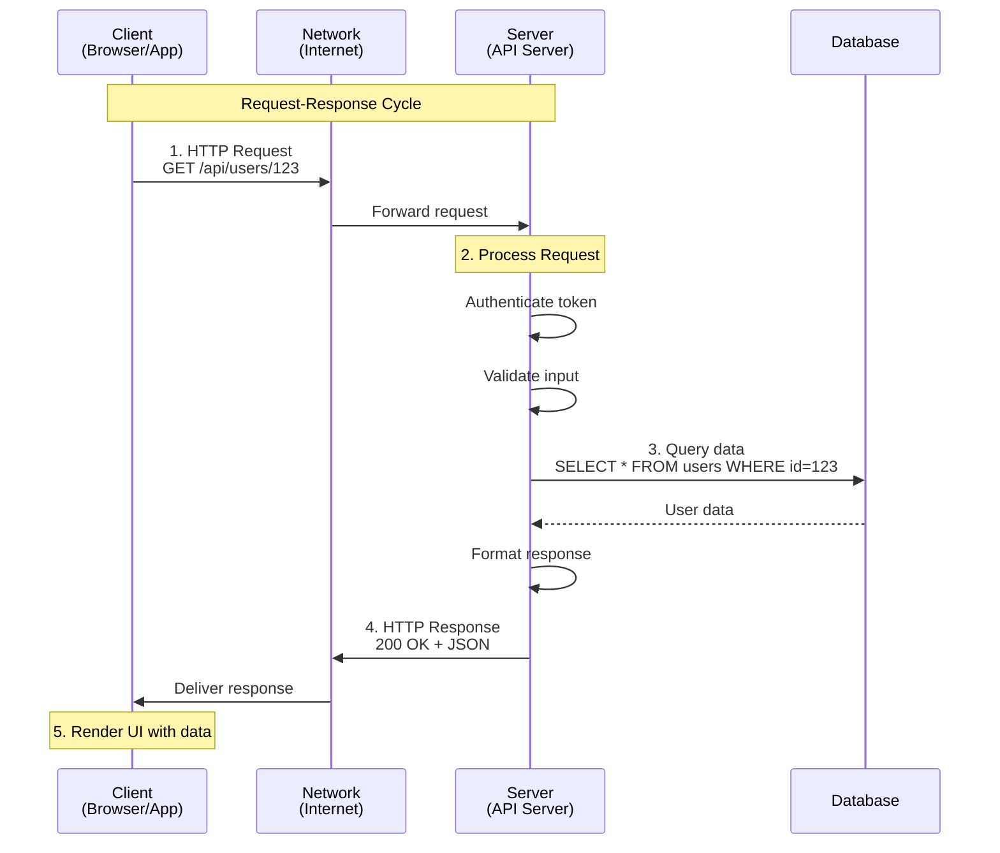
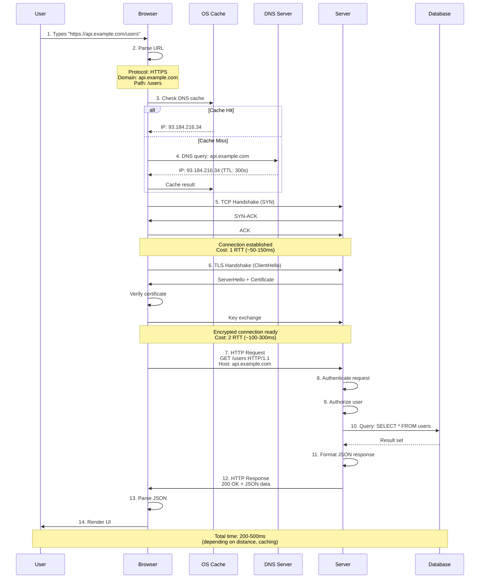
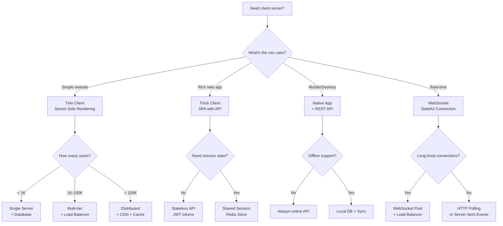
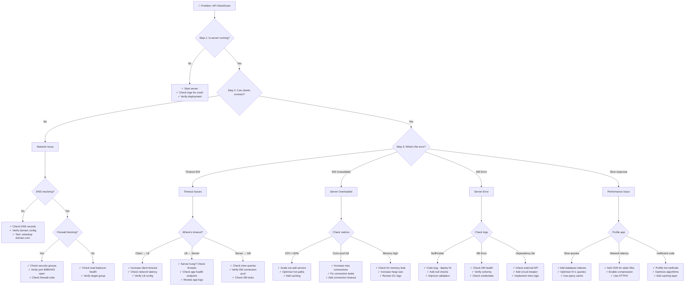

#system-design #fundamentals #architecture

# Client-Server Architecture

## Intuition (30 sec)

A restaurant: **you (client)** sit at a table and ask for food. The **kitchen (server)** prepares it and sends it back. You don't need to know how to cook — you just need to know how to order. That's client-server. The waiter is the protocol (HTTP), and the menu is the API.

## Failure-First Scenario

> You built a peer-to-peer app where every user stores their own data and talks directly to other users. Works for 10 users. At 10,000 users, nobody can find anyone, data is inconsistent, and there's no way to enforce rules. Authentication is impossible because there's no central authority. You need a centralized server to coordinate, enforce policies, and maintain a single source of truth.

---

## Working Knowledge (5 min)

### Core Concept - Definitions First

**Client-Server Architecture:**
- **Definition:** A distributed computing model where specialized programs (clients) request services or resources from centralized programs (servers) over a network
- **Purpose:** Separates concerns between presentation (client) and data/business logic (server), enabling centralized control, consistent data, and easier maintenance
- **How it works:** Clients initiate communication by sending requests; servers listen continuously, process requests, and send responses back

**Key Terms:**

- **Client:** A process or application that initiates requests to a server (e.g., web browser, mobile app, CLI tool, IoT device)
- **Server:** A process that listens on a network address, receives requests, processes them, and returns responses
- **Request-Response Cycle:** The fundamental interaction pattern where the client sends a request and waits for the server's response
- **Protocol:** A set of rules defining how messages are formatted and exchanged (e.g., HTTP, WebSocket, gRPC)
- **Endpoint:** A specific URL or address on the server that handles particular requests (e.g., `/api/users`, `/checkout`)
- **Port:** A numerical identifier (0-65535) that allows multiple services to run on the same server

### Visual Model

```
Client-Server Communication Flow:

┌──────────────────┐                    ┌──────────────────┐
│     CLIENT       │                    │      SERVER      │
│                  │                    │                  │
│  • Web Browser   │                    │  • Always Running│
│  • Mobile App    │                    │  • Listens on    │
│  • Desktop App   │                    │    Port (e.g.,   │
│  • CLI Tool      │                    │    80, 443, 8080)│
│                  │                    │  • Processes     │
│  Initiates       │                    │    Requests      │
│  Requests        │                    │  • Manages Data  │
└────────┬─────────┘                    └────────▲─────────┘
         │                                       │
         │    1. Request (HTTP GET /users)       │
         │─────────────────────────────────────▶│
         │                                       │
         │                                       │
         │    2. Process Request                 │
         │       • Authenticate                  │
         │       • Validate Input                │
         │       • Query Database                │
         │       • Apply Business Logic          │
         │                                       │
         │    3. Response (200 OK + JSON Data)   │
         │◀─────────────────────────────────────│
         │                                       │
         ▼                                       │
    Render/Display                               │
    Result                                       │

Key Characteristics:
• Client: Initiates communication, waits for response
• Server: Passive until request arrives, then responds
• Network: Communication medium (LAN, Internet, etc.)
• Asynchronous: Client can timeout if server doesn't respond
```



### Request-Response Cycle (Detailed)

**The Fundamental Pattern:**

```
Step 1: Client Initiates Connection
├─ DNS Resolution: example.com → 93.184.216.34
├─ TCP Handshake: 3-way (SYN, SYN-ACK, ACK)
└─ TLS Handshake: If HTTPS (certificate exchange)

Step 2: Client Sends Request
HTTP Request Structure:
┌─────────────────────────────────────┐
│ Request Line                        │
│   GET /api/users/123 HTTP/1.1       │
├─────────────────────────────────────┤
│ Headers (Metadata)                  │
│   Host: api.example.com             │
│   Authorization: Bearer xyz123...   │
│   Content-Type: application/json    │
│   User-Agent: Mozilla/5.0...        │
├─────────────────────────────────────┤
│ Body (Optional, for POST/PUT)       │
│   { "name": "John", "age": 30 }     │
└─────────────────────────────────────┘

Step 3: Server Processes Request
├─ Parse request (method, path, headers, body)
├─ Authenticate (verify token, session, credentials)
├─ Authorize (check permissions)
├─ Validate input (check required fields, types)
├─ Execute business logic
├─ Query database or external services
├─ Format response
└─ Send response back

Step 4: Server Sends Response
HTTP Response Structure:
┌─────────────────────────────────────┐
│ Status Line                         │
│   HTTP/1.1 200 OK                   │
├─────────────────────────────────────┤
│ Headers                             │
│   Content-Type: application/json    │
│   Content-Length: 156               │
│   Cache-Control: max-age=3600       │
│   Set-Cookie: session=abc123        │
├─────────────────────────────────────┤
│ Body                                │
│   { "id": 123, "name": "John" }     │
└─────────────────────────────────────┘

Step 5: Connection Management
├─ HTTP/1.0: Close connection after response
├─ HTTP/1.1: Keep-Alive (reuse connection)
└─ HTTP/2+: Multiplexed (multiple requests on same connection)
```

### Stateless vs Stateful (Critical Distinction)

**Stateless:**
- **Definition:** Each request is independent and self-contained; the server retains no information about previous requests from the same client
- **How it works:** Client includes all necessary information in each request (auth token, context, etc.)
- **Scaling advantage:** Any server instance can handle any request (no affinity needed)

**Stateful:**
- **Definition:** Server maintains session state between requests; subsequent requests depend on previous interactions
- **How it works:** Server stores session data in memory or shared storage (Redis)
- **Scaling challenge:** Requires sticky sessions (routing same client to same server) or shared session storage

```
┌────────────────────────────────────────────────────┐
│                STATELESS                           │
├────────────────────────────────────────────────────┤
│                                                    │
│  Request 1: GET /cart (token=xyz)                 │
│  ─────────▶ Any Server                            │
│            (looks up cart using token)            │
│            Server doesn't remember you            │
│                                                    │
│  Request 2: POST /cart/add (token=xyz, item=...)  │
│  ─────────▶ Different Server (OK!)                │
│            (looks up cart again using token)      │
│            Each request has full context          │
│                                                    │
│  ✓ Easy to scale (add more servers)               │
│  ✓ No server affinity required                    │
│  ✓ Server crashes don't lose state                │
│  ✗ Larger request size (send token each time)     │
│                                                    │
│  Examples: REST APIs, HTTP, Microservices         │
└────────────────────────────────────────────────────┘

┌────────────────────────────────────────────────────┐
│                STATEFUL                            │
├────────────────────────────────────────────────────┤
│                                                    │
│  Request 1: GET /cart                             │
│  ─────────▶ Server A                              │
│            Server A stores: session123 = {...}    │
│            Server remembers you                   │
│                                                    │
│  Request 2: POST /cart/add (item=...)             │
│  ─────────▶ Must go to Server A                   │
│            (uses in-memory session data)          │
│            Different server won't have state!     │
│                                                    │
│  ✓ Smaller requests (no need to send full state)  │
│  ✓ Can optimize for repeated access               │
│  ✗ Requires sticky sessions or shared store       │
│  ✗ Server crash loses state                       │
│  ✗ Harder to scale (can't freely distribute)      │
│                                                    │
│  Examples: WebSocket, FTP, Gaming servers,        │
│            Traditional web apps with sessions     │
└────────────────────────────────────────────────────┘
```

### Comparison Table

| Aspect | Stateless Server | Stateful Server |
|--------|------------------|-----------------|
| **State Storage** | Client or external DB | Server memory |
| **Request Content** | Full context in each request | Minimal, relies on session |
| **Scaling** | Easy (any server handles request) | Hard (needs sticky sessions) |
| **Reliability** | High (server crash = no data loss) | Low (crash loses sessions) |
| **Load Balancing** | Simple round-robin | Requires session affinity |
| **Request Size** | Larger (includes token/context) | Smaller (just session ID) |
| **Examples** | REST APIs, AWS Lambda | WebSocket servers, FTP |
| **Use When** | Scalability is critical | Real-time, continuous connections |

---

## Layer 1: Conceptual Precision (15 min)

### Complete Request Journey (What Happens When You Type a URL)

**Detailed Breakdown:**



**Time Breakdown (NYC to San Francisco):**

```
Step                          Time      Cumulative
──────────────────────────────────────────────────
1. Parse URL                  <1ms      <1ms
2. DNS Lookup (cached)        0ms       <1ms
   DNS Lookup (uncached)      30ms      30ms
3. TCP Handshake (1 RTT)      60ms      90ms
4. TLS Handshake (2 RTT)      120ms     210ms
5. HTTP Request sent          30ms      240ms
6. Server processing          50ms      290ms
7. Response received          30ms      320ms
8. Browser parsing/render     30ms      350ms
──────────────────────────────────────────────────
Total:                        350ms
```

### Architectural Patterns (With Definitions)

#### 1. Thin Client vs Thick Client

**Thin Client:**
- **Definition:** A client that performs minimal processing; most computation happens on the server
- **Server responsibility:** Business logic, rendering, data processing
- **Client responsibility:** Display rendered content, capture user input
- **How it works:** Server generates complete HTML pages; client just displays them

```
Thin Client Architecture:
┌─────────────────────────────────────────┐
│  CLIENT (Thin)                          │
│  • Minimal JavaScript                   │
│  • Display HTML sent by server          │
│  • Capture form input                   │
│  • Send requests on user actions        │
└────────────┬────────────────────────────┘
             │ Request: "Show page 2"
             ▼
┌─────────────────────────────────────────┐
│  SERVER (Heavy)                         │
│  • Render full HTML pages               │
│  • Execute all business logic           │
│  • Query database                       │
│  • Apply styling, templating            │
│  • Send complete HTML response          │
└─────────────────────────────────────────┘

Pros:
✓ Works on low-powered devices
✓ Better security (logic hidden on server)
✓ Easy to update (just deploy server)
✓ Works without JavaScript

Cons:
✗ Full page reloads (slower UX)
✗ Higher server load (rendering for each request)
✗ More bandwidth (full HTML each time)
✗ Poor offline support

Examples:
• Traditional PHP/Ruby/Python web apps
• Server-side rendered (SSR) frameworks
• Legacy enterprise applications
```

**Thick/Fat Client:**
- **Definition:** A client that performs substantial processing and business logic locally
- **Server responsibility:** API endpoints, data storage, authentication
- **Client responsibility:** UI rendering, state management, validation, routing
- **How it works:** Server sends raw data (JSON); client renders UI dynamically

```
Thick Client Architecture:
┌─────────────────────────────────────────┐
│  CLIENT (Heavy)                         │
│  • React, Angular, Vue app              │
│  • Renders entire UI                    │
│  • Client-side routing                  │
│  • Form validation                      │
│  • State management (Redux, etc.)       │
│  • Makes API calls for data only        │
└────────────┬────────────────────────────┘
             │ Request: "GET /api/users"
             ▼
┌─────────────────────────────────────────┐
│  SERVER (Light - API Only)              │
│  • Expose REST/GraphQL APIs             │
│  • Return JSON data                     │
│  • Business logic + DB queries          │
│  • Authentication                       │
└─────────────────────────────────────────┘

Pros:
✓ Rich, responsive UI (no page reloads)
✓ Better UX (instant feedback)
✓ Lower server load (just data)
✓ Can work offline (with caching)

Cons:
✗ Requires powerful client device
✗ Larger initial download (JS bundle)
✗ SEO challenges (without SSR)
✗ More complex client code

Examples:
• Single Page Applications (SPAs)
• Gmail, Google Maps, Figma
• Mobile apps (iOS, Android)
• Desktop apps (Electron)
```

#### 2. Multi-Tier Architecture

**Definition:** An architecture pattern that separates an application into multiple logical layers, each with specific responsibilities

**Why tiers?** Separation of concerns allows:
- Independent scaling of each tier
- Easier maintenance (change one layer without affecting others)
- Team specialization (frontend vs backend)
- Better security (restrict access per tier)

```
┌──────────────────────────────────────────────────────┐
│                  PRESENTATION TIER                   │
│  Definition: User interface layer                    │
│  Technology: React, Angular, Mobile app, CLI         │
│  Responsibility:                                     │
│    • Display data to user                           │
│    • Capture user input                             │
│    • Client-side validation                         │
│    • Routing and navigation                         │
└────────────────────┬─────────────────────────────────┘
                     │ HTTP/HTTPS (REST, GraphQL)
                     ▼
┌──────────────────────────────────────────────────────┐
│                  APPLICATION TIER                    │
│  Definition: Business logic layer                    │
│  Technology: Node.js, Java, Python, Go               │
│  Responsibility:                                     │
│    • Authentication & Authorization                  │
│    • Input validation & sanitization                │
│    • Business rules enforcement                     │
│    • Data transformation                            │
│    • Coordination between services                  │
└────────────────────┬─────────────────────────────────┘
                     │ Database protocol (SQL, etc.)
                     ▼
┌──────────────────────────────────────────────────────┐
│                    DATA TIER                         │
│  Definition: Data persistence layer                  │
│  Technology: PostgreSQL, MongoDB, Redis, S3          │
│  Responsibility:                                     │
│    • Store and retrieve data                        │
│    • Data integrity (constraints, transactions)     │
│    • Query optimization                             │
│    • Backups and replication                        │
└──────────────────────────────────────────────────────┘
```

**3-Tier Example: E-commerce System**

```
User clicks "Add to Cart"
         │
         ▼
┌─────────────────────────────┐
│   TIER 1: PRESENTATION      │
│   React Frontend            │
│   ──────────────────────    │
│   • User clicks button      │
│   • Send POST /cart/add     │
│   • Show loading spinner    │
│   • Update cart count       │
└──────────┬──────────────────┘
           │ HTTPS POST /api/cart/add
           │ { productId: 123, quantity: 2 }
           ▼
┌─────────────────────────────┐
│   TIER 2: APPLICATION       │
│   Spring Boot API           │
│   ──────────────────────    │
│   • Verify user auth        │
│   • Check product exists    │
│   • Verify inventory > 2    │
│   • Calculate price         │
│   • Update cart in DB       │
└──────────┬──────────────────┘
           │ SQL: INSERT INTO cart_items...
           ▼
┌─────────────────────────────┐
│   TIER 3: DATA              │
│   PostgreSQL                │
│   ──────────────────────    │
│   • Store cart item record  │
│   • Update inventory count  │
│   • Return success          │
└─────────────────────────────┘
```

**Scaling Each Tier Independently:**

```
BEFORE: Single Server (struggles at 1000 req/sec)
┌────────────────┐
│  All-in-one    │
│  • Frontend    │─── 1000 req/sec → 💥 Overloaded
│  • Backend     │
│  • Database    │
└────────────────┘

AFTER: Multi-Tier (handles 10,000 req/sec)
              Load Balancer
                    │
     ┌──────────────┼──────────────┐
     │              │              │
┌────▼────┐   ┌────▼────┐   ┌────▼────┐
│Frontend │   │Frontend │   │Frontend │  ← Scale to 3 servers
│ Server  │   │ Server  │   │ Server  │
└────┬────┘   └────┬────┘   └────┬────┘
     └──────────────┼──────────────┘
                    │
              Load Balancer
                    │
     ┌──────────────┼──────────────────────────┐
     │              │              │           │
┌────▼────┐   ┌────▼────┐   ┌────▼────┐  [...10]
│Backend  │   │Backend  │   │Backend  │   ← Scale to 10 servers
│ Server  │   │ Server  │   │ Server  │
└────┬────┘   └────┬────┘   └────┬────┘
     └──────────────┼──────────────┘
                    │
              ┌─────▼─────┐
              │PostgreSQL │
              │  Primary  │          ← Scale database separately
              └─────┬─────┘
                    │
         ┌──────────┼──────────┐
    ┌────▼────┐ ┌──▼──────┐ ┌─▼────────┐
    │Replica 1│ │Replica 2│ │Replica 3│  ← Read replicas
    └─────────┘ └─────────┘ └─────────┘
```

### Scaling Implications

**Stateless Servers (Easy to Scale):**

```
Load Balancer (Round-Robin)
      │
   ┌──┼────┬────┐
   │  │    │    │
  ┌▼─┐│  ┌▼┐  ┌▼┐
  │S1││  │S2│  │S3│  ← Any server can handle any request
  └──┘│  └─┘  └─┘
      │
Request A → S1  ✓
Request B → S3  ✓  (doesn't need to go to S1)
Request C → S2  ✓

Why it works:
• Each request contains full context (JWT token)
• No server-side session state
• Add/remove servers freely
```

**Stateful Servers (Hard to Scale):**

```
Load Balancer (Sticky Sessions)
      │
   ┌──┼────┬────┐
   │  │    │    │
  ┌▼─┐│  ┌▼┐  ┌▼┐
  │S1││  │S2│  │S3│  ← Session data in memory
  └──┘│  └─┘  └─┘
  Session123
  {user: "john"}

Request A (session=123) → S1 ✓
Request B (session=123) → S1 ✓ (must go to same server!)
Request C (session=123) → S2 ✗ (doesn't have session data)

Problems:
• Load balancer must track which session → which server
• Can't freely add/remove servers (disrupts sessions)
• Server crash = lost sessions

Solution: Shared Session Store
┌──┐  ┌──┐  ┌──┐
│S1│  │S2│  │S3│  ← All servers share session data
└─┬┘  └─┬┘  └─┬┘
  └─────┼────┘
     ┌──▼──┐
     │Redis│  ← Centralized session storage
     └─────┘

Now any server can handle any request by looking up session in Redis
```


---

## Layer 2: Technology-Specific Examples (20 min)

### Java HTTP Client-Server Implementation

**Complete Working Example:**

```java
// ============================================
// SERVER SIDE (Spring Boot)
// ============================================

package com.example.server;

import org.springframework.boot.SpringApplication;
import org.springframework.boot.autoconfigure.SpringBootApplication;
import org.springframework.web.bind.annotation.*;
import org.springframework.http.ResponseEntity;
import org.springframework.http.HttpStatus;
import java.util.*;
import java.util.concurrent.ConcurrentHashMap;

@SpringBootApplication
public class ServerApplication {
    public static void main(String[] args) {
        SpringApplication.run(ServerApplication.class, args);
        System.out.println("Server listening on http://localhost:8080");
    }
}

// REST Controller - Handles HTTP requests
@RestController
@RequestMapping("/api")
public class UserController {

    // In-memory data store (simulates database)
    private final Map<Long, User> users = new ConcurrentHashMap<>();
    private long idCounter = 1;

    public UserController() {
        // Seed data
        users.put(1L, new User(1L, "Alice", "alice@example.com"));
        users.put(2L, new User(2L, "Bob", "bob@example.com"));
        idCounter = 3;
    }

    // GET /api/users - Retrieve all users
    @GetMapping("/users")
    public ResponseEntity<List<User>> getAllUsers() {
        System.out.println("Received GET /api/users");
        return ResponseEntity.ok(new ArrayList<>(users.values()));
    }

    // GET /api/users/{id} - Retrieve specific user
    @GetMapping("/users/{id}")
    public ResponseEntity<User> getUser(@PathVariable Long id) {
        System.out.println("Received GET /api/users/" + id);

        User user = users.get(id);
        if (user == null) {
            return ResponseEntity.status(HttpStatus.NOT_FOUND).build();
        }
        return ResponseEntity.ok(user);
    }

    // POST /api/users - Create new user
    @PostMapping("/users")
    public ResponseEntity<User> createUser(@RequestBody User newUser) {
        System.out.println("Received POST /api/users: " + newUser);

        // Validate input
        if (newUser.getName() == null || newUser.getEmail() == null) {
            return ResponseEntity.status(HttpStatus.BAD_REQUEST).build();
        }

        // Business logic: Assign ID, save user
        newUser.setId(idCounter++);
        users.put(newUser.getId(), newUser);

        // Return 201 Created with the new resource
        return ResponseEntity.status(HttpStatus.CREATED).body(newUser);
    }

    // PUT /api/users/{id} - Update user
    @PutMapping("/users/{id}")
    public ResponseEntity<User> updateUser(
            @PathVariable Long id,
            @RequestBody User updatedUser) {

        System.out.println("Received PUT /api/users/" + id);

        if (!users.containsKey(id)) {
            return ResponseEntity.status(HttpStatus.NOT_FOUND).build();
        }

        updatedUser.setId(id);
        users.put(id, updatedUser);
        return ResponseEntity.ok(updatedUser);
    }

    // DELETE /api/users/{id} - Delete user
    @DeleteMapping("/users/{id}")
    public ResponseEntity<Void> deleteUser(@PathVariable Long id) {
        System.out.println("Received DELETE /api/users/" + id);

        if (!users.containsKey(id)) {
            return ResponseEntity.status(HttpStatus.NOT_FOUND).build();
        }

        users.remove(id);
        return ResponseEntity.status(HttpStatus.NO_CONTENT).build();
    }
}

// User model class
class User {
    private Long id;
    private String name;
    private String email;

    // Constructors
    public User() {}

    public User(Long id, String name, String email) {
        this.id = id;
        this.name = name;
        this.email = email;
    }

    // Getters and setters
    public Long getId() { return id; }
    public void setId(Long id) { this.id = id; }

    public String getName() { return name; }
    public void setName(String name) { this.name = name; }

    public String getEmail() { return email; }
    public void setEmail(String email) { this.email = email; }

    @Override
    public String toString() {
        return "User{id=" + id + ", name='" + name + "', email='" + email + "'}";
    }
}

// ============================================
// CLIENT SIDE (Java 11+ HttpClient)
// ============================================

package com.example.client;

import java.net.URI;
import java.net.http.HttpClient;
import java.net.http.HttpRequest;
import java.net.http.HttpResponse;
import java.time.Duration;

public class ClientApplication {

    private static final String BASE_URL = "http://localhost:8080/api";

    // Create reusable HttpClient (thread-safe, reuses connections)
    private static final HttpClient httpClient = HttpClient.newBuilder()
            .connectTimeout(Duration.ofSeconds(10))  // Connection timeout
            .build();

    public static void main(String[] args) throws Exception {

        System.out.println("=== Client-Server Demo ===\n");

        // 1. GET all users
        System.out.println("1. Fetching all users...");
        getAllUsers();

        // 2. GET specific user
        System.out.println("\n2. Fetching user with ID=1...");
        getUser(1L);

        // 3. POST - Create new user
        System.out.println("\n3. Creating new user...");
        createUser("Charlie", "charlie@example.com");

        // 4. PUT - Update user
        System.out.println("\n4. Updating user ID=3...");
        updateUser(3L, "Charles", "charles@example.com");

        // 5. DELETE user
        System.out.println("\n5. Deleting user ID=3...");
        deleteUser(3L);

        System.out.println("\n=== Demo Complete ===");
    }

    // GET request - Fetch all users
    private static void getAllUsers() throws Exception {
        HttpRequest request = HttpRequest.newBuilder()
                .uri(URI.create(BASE_URL + "/users"))
                .GET()
                .header("Accept", "application/json")
                .build();

        HttpResponse<String> response = httpClient.send(
                request,
                HttpResponse.BodyHandlers.ofString()
        );

        System.out.println("Status: " + response.statusCode());
        System.out.println("Response: " + response.body());
    }

    // GET request - Fetch specific user
    private static void getUser(Long id) throws Exception {
        HttpRequest request = HttpRequest.newBuilder()
                .uri(URI.create(BASE_URL + "/users/" + id))
                .GET()
                .header("Accept", "application/json")
                .build();

        HttpResponse<String> response = httpClient.send(
                request,
                HttpResponse.BodyHandlers.ofString()
        );

        System.out.println("Status: " + response.statusCode());
        System.out.println("Response: " + response.body());
    }

    // POST request - Create user
    private static void createUser(String name, String email) throws Exception {
        String jsonBody = String.format(
                "{\"name\":\"%s\",\"email\":\"%s\"}",
                name, email
        );

        HttpRequest request = HttpRequest.newBuilder()
                .uri(URI.create(BASE_URL + "/users"))
                .POST(HttpRequest.BodyPublishers.ofString(jsonBody))
                .header("Content-Type", "application/json")
                .header("Accept", "application/json")
                .build();

        HttpResponse<String> response = httpClient.send(
                request,
                HttpResponse.BodyHandlers.ofString()
        );

        System.out.println("Status: " + response.statusCode());
        System.out.println("Response: " + response.body());
    }

    // PUT request - Update user
    private static void updateUser(Long id, String name, String email)
            throws Exception {
        String jsonBody = String.format(
                "{\"name\":\"%s\",\"email\":\"%s\"}",
                name, email
        );

        HttpRequest request = HttpRequest.newBuilder()
                .uri(URI.create(BASE_URL + "/users/" + id))
                .PUT(HttpRequest.BodyPublishers.ofString(jsonBody))
                .header("Content-Type", "application/json")
                .header("Accept", "application/json")
                .build();

        HttpResponse<String> response = httpClient.send(
                request,
                HttpResponse.BodyHandlers.ofString()
        );

        System.out.println("Status: " + response.statusCode());
        System.out.println("Response: " + response.body());
    }

    // DELETE request - Delete user
    private static void deleteUser(Long id) throws Exception {
        HttpRequest request = HttpRequest.newBuilder()
                .uri(URI.create(BASE_URL + "/users/" + id))
                .DELETE()
                .build();

        HttpResponse<String> response = httpClient.send(
                request,
                HttpResponse.BodyHandlers.ofString()
        );

        System.out.println("Status: " + response.statusCode());
    }
}
```

**Configuration (application.properties):**

```properties
# Server configuration
server.port=8080
server.tomcat.max-threads=200              # Max concurrent requests
server.tomcat.max-connections=10000        # Max TCP connections
server.connection-timeout=30000            # 30 seconds

# HTTP/2 support (better performance)
server.http2.enabled=true

# Compression (reduce bandwidth)
server.compression.enabled=true
server.compression.mime-types=application/json,text/html

# Logging
logging.level.org.springframework.web=INFO
```

**Output Example:**

```
Server Console:
───────────────
Server listening on http://localhost:8080
Received GET /api/users
Received GET /api/users/1
Received POST /api/users: User{id=null, name='Charlie', email='charlie@example.com'}
Received PUT /api/users/3
Received DELETE /api/users/3

Client Console:
───────────────
=== Client-Server Demo ===

1. Fetching all users...
Status: 200
Response: [{"id":1,"name":"Alice","email":"alice@example.com"},{"id":2,"name":"Bob","email":"bob@example.com"}]

2. Fetching user with ID=1...
Status: 200
Response: {"id":1,"name":"Alice","email":"alice@example.com"}

3. Creating new user...
Status: 201
Response: {"id":3,"name":"Charlie","email":"charlie@example.com"}

4. Updating user ID=3...
Status: 200
Response: {"id":3,"name":"Charles","email":"charles@example.com"}

5. Deleting user ID=3...
Status: 204

=== Demo Complete ===
```

### Connection Pool Pattern

**Why Connection Pools?**

```
WITHOUT Connection Pool (Slow):
════════════════════════════════
Request 1: Open connection → Use → Close    (200ms)
Request 2: Open connection → Use → Close    (200ms)
Request 3: Open connection → Use → Close    (200ms)

Each request pays connection overhead!
Total: 600ms for 3 requests

WITH Connection Pool (Fast):
═══════════════════════════════
Initialize: Pre-create 10 connections
Request 1: Borrow connection → Use → Return (5ms)
Request 2: Borrow connection → Use → Return (5ms)
Request 3: Borrow connection → Use → Return (5ms)

Connections reused!
Total: 15ms for 3 requests (40x faster!)
```

**Java Connection Pool Configuration:**

```java
import com.zaxxer.hikari.HikariConfig;
import com.zaxxer.hikari.HikariDataSource;

public class ConnectionPoolConfig {

    public HikariDataSource createDataSource() {
        HikariConfig config = new HikariConfig();

        // Database connection
        config.setJdbcUrl("jdbc:postgresql://localhost:5432/mydb");
        config.setUsername("user");
        config.setPassword("password");

        // Pool sizing
        config.setMaximumPoolSize(20);          // Max 20 connections
        config.setMinimumIdle(5);               // Always keep 5 ready

        // Connection lifecycle
        config.setConnectionTimeout(30000);      // 30s wait for connection
        config.setIdleTimeout(600000);          // 10m before idle connection closes
        config.setMaxLifetime(1800000);         // 30m max connection age

        // Connection testing
        config.setConnectionTestQuery("SELECT 1");  // Health check query

        return new HikariDataSource(config);
    }
}

/*
Pool Sizing Formula:
connections = ((core_count * 2) + effective_spindle_count)

For a 4-core CPU with SSD:
connections = (4 * 2) + 1 = 9 → round to 10

Add buffer for spikes: 10 * 1.5 = 15
Set max = 20 (allow headroom)
*/
```

### Decision Tree: When to Use What Pattern



---

## Layer 3: Production-Ready Details (30 min)

### Production Architecture (Full Stack)

```
                        🌍 Internet
                             │
                    ┌────────▼────────┐
                    │   DNS Provider   │
                    │  (Route53/CF)    │
                    │  TTL: 300s       │
                    └────────┬────────┘
                             │
                    ┌────────▼────────┐
                    │   CDN/WAF        │
                    │  (CloudFlare)    │
                    │  • Cache static  │
                    │  • DDoS protect  │
                    │  • SSL/TLS       │
                    └────────┬────────┘
                             │
              ┌──────────────┼──────────────┐
              │              │              │
         ┌────▼────┐   ┌────▼────┐   ┌────▼────┐
         │Region   │   │Region   │   │Region   │
         │US-East  │   │US-West  │   │  EU     │
         └────┬────┘   └────┬────┘   └────┬────┘
              │             │             │
    ┌─────────▼─────────────▼─────────────▼─────────┐
    │      Application Load Balancer (ALB)          │
    │      • Layer 7 (HTTP/HTTPS)                   │
    │      • Health checks every 10s                │
    │      • Route by URL path: /api/* → App       │
    │      • Auto-scale based on CPU/traffic        │
    └─────────┬────┬────┬────┬────┬────┬────┬──────┘
              │    │    │    │    │    │    │
         ┌────▼┐ ┌─▼─┐ ┌▼─┐ ┌▼─┐ ┌▼─┐ ┌▼─┐ ┌▼─┐
         │App1│ │A2 │ │A3│ │A4│ │A5│ │..│ │A10│
         │8080│ │8080│ │..│ │..│ │..│ │  │ │8080│
         └──┬─┘ └─┬─┘ └┬─┘ └┬─┘ └┬─┘ └──┘ └─┬─┘
            │     │    │    │    │           │
            └─────┴────┴────┴────┴───────────┘
                         │
         ┌───────────────┼────────────────┐
         │               │                │
    ┌────▼─────┐   ┌─────▼──────┐  ┌─────▼─────┐
    │  Redis   │   │ PostgreSQL │  │  Kafka    │
    │  Cluster │   │  Primary   │  │  Cluster  │
    │  (Cache) │   │  (Write)   │  │  (Queue)  │
    │  6379    │   │  5432      │  │  9092     │
    └──────────┘   └─────┬──────┘  └───────────┘
                         │
                ┌────────┼────────┐
                │        │        │
          ┌─────▼──┐ ┌───▼────┐ ┌▼────────┐
          │PG Rep1 │ │PG Rep2 │ │PG Rep3  │
          │(Read)  │ │(Read)  │ │(Read)   │
          └────────┘ └────────┘ └─────────┘

Component Definitions:

• CDN/WAF: Content Delivery Network + Web Application Firewall
  - Caches static content close to users
  - Blocks malicious traffic (DDoS, SQL injection)
  - Handles SSL/TLS termination

• Application Load Balancer (ALB):
  - Distributes traffic across app servers
  - Layer 7 (can route based on URL, headers)
  - Performs health checks, removes unhealthy servers
  - Auto-scales based on metrics

• App Servers (10 instances):
  - Run business logic (Spring Boot, Node.js, etc.)
  - Stateless (no session data stored locally)
  - Horizontally scalable (add more as needed)

• Redis Cluster:
  - In-memory cache for fast reads
  - Stores sessions, rate limits, temporary data
  - Reduces database load by 80-90%

• PostgreSQL Primary:
  - Handles all writes (INSERT, UPDATE, DELETE)
  - Single source of truth
  - Replicated to read replicas

• PostgreSQL Replicas:
  - Handle read queries (SELECT)
  - Async replication from primary
  - Scale read capacity independently

• Kafka:
  - Asynchronous event processing
  - Decouples services
  - Handles background jobs, notifications
```

### Monitoring Dashboard

```
╔════════════════════════════════════════════════════════════════╗
║            CLIENT-SERVER HEALTH DASHBOARD                      ║
╠════════════════════════════════════════════════════════════════╣
║                                                                ║
║  🔵 Request Rate (QPS)                                         ║
║  ▬▬▬▬▬▬▬▬▬▬▬▬▬▬▬▬▬▬▬▬▬▬▬▬▬▬▬▬▬▬▬▬▬▬▬▬▬                        ║
║  Current: 2,547 req/sec  ▲ 15% from last hour                 ║
║  Peak today: 3,200 req/sec at 14:00                           ║
║  Definition: Queries Per Second - rate of incoming requests   ║
║                                                                ║
║  🟢 Success Rate: 99.7%                                        ║
║  ▰▰▰▰▰▰▰▰▰▰▰▰▰▰▰▰▰▰▰▰▰▰▰▰▰▰▰▰▰▰▰▰▰▰▰▰▰▰▰▱                     ║
║  Definition: % of requests with 2xx or 3xx status codes       ║
║  Target: > 99.5% ✓                                             ║
║                                                                ║
║  🟡 Latency P50: 45ms  |  P95: 120ms  |  P99: 180ms           ║
║  ▬▬▬▬▬▬▬▬▬▬░░░░░░░░░░░░░░░░░░░░░░░░░░░                       ║
║  Definition:                                                   ║
║    P50: 50% of requests faster than this (median)             ║
║    P95: 95% of requests faster than this                      ║
║    P99: 99% of requests faster than this                      ║
║  Target: P99 < 200ms ✓                                         ║
║                                                                ║
║  🔴 Error Breakdown:                                           ║
║  ┌──────────────────────────────────────────┐                 ║
║  │ 4xx (Client Errors):   0.2%  (5 req/sec) │                 ║
║  │   400 Bad Request:     0.05%             │                 ║
║  │   401 Unauthorized:    0.10%             │                 ║
║  │   404 Not Found:       0.05%             │                 ║
║  │                                          │                 ║
║  │ 5xx (Server Errors):   0.1%  (2 req/sec) │                 ║
║  │   500 Internal Error:  0.05%             │                 ║
║  │   503 Unavailable:     0.03%             │                 ║
║  │   504 Timeout:         0.02%             │                 ║
║  └──────────────────────────────────────────┘                 ║
║                                                                ║
║  📊 Connection Pool Status:                                    ║
║  ┌──────────────────────────────────────────┐                 ║
║  │ Active:     47/200   [▰▰▰▰▰░░░░░░░░░░]  │                 ║
║  │ Idle:       153      [▰▰▰▰▰▰▰▰▰▰▰░░░░]  │                 ║
║  │ Waiting:    0        [░░░░░░░░░░░░░░░░]  │                 ║
║  │ Total Opens: 12,345  (since startup)     │                 ║
║  │ Avg Wait:   0ms                          │                 ║
║  └──────────────────────────────────────────┘                 ║
║  Definition:                                                   ║
║    Active:  Connections currently executing queries           ║
║    Idle:    Connections available for reuse                   ║
║    Waiting: Requests waiting for available connection         ║
║                                                                ║
║  ⚡ Throughput:                                                ║
║  ┌──────────────────────────────────────────┐                 ║
║  │ Data In:   125 MB/sec                    │                 ║
║  │ Data Out:  450 MB/sec                    │                 ║
║  │ Total:     575 MB/sec (4.6 Gbps)         │                 ║
║  └──────────────────────────────────────────┘                 ║
║                                                                ║
╠════════════════════════════════════════════════════════════════╣
║  Recent Alerts (Last 5 minutes):                               ║
║  15:42:10  ⚠ High latency on app-server-03 (P99: 450ms)       ║
║  15:43:25  ⚠ Connection pool near capacity (185/200)          ║
║  15:44:01  ✓ Alert resolved: Latency back to normal           ║
╚════════════════════════════════════════════════════════════════╝

Metrics Explained:

QPS (Queries Per Second):
  What: Number of requests hitting your API per second
  Why track: Indicates load, helps with capacity planning
  Alert when: Sudden spike (> 2x normal) or drop (< 0.5x)

Success Rate:
  What: Percentage of requests with successful status (2xx, 3xx)
  Why track: Overall health of system
  Alert when: < 99.5% (indicates problems)

Latency Percentiles:
  P50 (Median): Half of users experience this or better
  P95: 95% of users experience this or better
  P99: 99% of users - the "worst" normal experience
  Why P99?: Catches tail latency that affects real users

Connection Pool:
  What: Reusable database connections
  Why track: Prevents connection exhaustion
  Alert when: Waiting > 0 (users experiencing delays)
```

### Troubleshooting Decision Tree



### Capacity Planning (Real Example)

```
Scenario: E-commerce platform planning for Black Friday

Current Metrics (Normal Day):
├─ Daily Active Users: 100,000
├─ Requests per user: 20
├─ Total daily requests: 2,000,000
├─ Average request latency: 100ms
└─ Current servers: 5

Step 1: Calculate Current Load
═══════════════════════════════
Daily requests: 2,000,000
Seconds per day: 86,400
Average QPS = 2,000,000 ÷ 86,400 = 23 QPS

Peak traffic (assume 3x average): 23 × 3 = 69 QPS

Concurrent requests = QPS × latency (in seconds)
                    = 69 × 0.1
                    = 7 concurrent requests

With 5 servers:
  Load per server = 7 ÷ 5 = 1.4 concurrent/server ✓ (healthy)

Step 2: Project Black Friday Load
══════════════════════════════════
Expected increase: 10x traffic
Expected users: 1,000,000
Daily requests: 20,000,000
Average QPS = 20,000,000 ÷ 86,400 = 231 QPS

Peak traffic (5x average on Black Friday): 231 × 5 = 1,155 QPS

Concurrent requests = 1,155 × 0.1 = 116 concurrent

Step 3: Calculate Required Servers
═══════════════════════════════════
Assume each server handles 25 concurrent requests safely

Servers needed = 116 ÷ 25 = 4.6 → round up to 5 servers

Add redundancy (N+2 for failover): 5 + 2 = 7 servers
Add extra buffer (20%): 7 × 1.2 = 8.4 → 9 servers

Recommendation: Scale to 10 servers for Black Friday

Step 4: Database Capacity
═════════════════════════
Current DB connections: 100
Load per connection = 116 ÷ 100 = 1.16 ✓ (OK)

But check query performance:
  If queries slow down under load → add read replicas
  Recommendation: Add 2 read replicas (total 3)

Step 5: Cache Layer
═══════════════════
Cache hit rate target: 80%
Requests hitting cache: 1,155 × 0.8 = 924 QPS
Requests hitting DB: 1,155 × 0.2 = 231 QPS

Redis capacity:
  Memory needed = data size × replication
  Assume 10GB active data × 2 (primary + replica) = 20GB
  Recommendation: 2 Redis nodes with 16GB each

Step 6: Cost Estimation
════════════════════════
Normal day (5 servers):
  • App servers: 5 × $100/mo = $500
  • Database (1 primary + 1 replica): $400
  • Redis (1 node): $150
  • Load balancer: $50
  • Total: $1,100/month

Black Friday week (10 servers):
  • App servers: 10 × $100/mo = $1,000 (prorated for 1 week = $250)
  • Database (1 primary + 3 replicas): $800 (prorated = $200)
  • Redis (2 nodes): $300 (prorated = $75)
  • Load balancer: $50 (no change)
  • Total extra cost for Black Friday: $500

Annual cost:
  • Normal operation: $1,100 × 12 = $13,200
  • Black Friday spike: $500
  • Total: $13,700/year

Final Architecture for Black Friday:
                 ┌───────────┐
                 │    ALB    │
                 └─────┬─────┘
                       │
        ┌──────────────┼──────────────┐
        │              │              │
   [10 App Servers @ peak]
        │              │              │
        └──────────────┼──────────────┘
                       │
         ┌─────────────┼──────────────┐
         │             │              │
    ┌────▼───┐   ┌────▼────┐   ┌─────▼─────┐
    │ Redis  │   │  PG     │   │   PG      │
    │Primary │   │ Primary │   │ Replicas  │
    │        │   │ (Write) │   │ (Read×3)  │
    └────────┘   └─────────┘   └───────────┘
```

### The "Why" Chain

```
Why client-server architecture?
└─> Centralized control and consistent data
    │
    ├─> Single source of truth (database)
    │   └─> No data conflicts (vs peer-to-peer)
    │
    ├─> Easier security and authentication
    │   └─> Central authority to verify users
    │
    ├─> Consistent business rules enforcement
    │   └─> Server validates all operations
    │
    └─> Independent scaling of tiers
        └─> Add more servers without client changes

What's the alternative?
├─> Peer-to-Peer (P2P):
│   • BitTorrent, blockchain
│   • No central server (decentralized)
│   • Each node is both client and server
│   • Hard to enforce rules, no auth authority
│
├─> Serverless/Edge Computing:
│   • AWS Lambda, Cloudflare Workers
│   • No persistent server process
│   • Functions execute on-demand
│   • Good for stateless, event-driven tasks
│
└─> Monolithic (no separation):
    • All code in one process
    • Client + server tightly coupled
    • Hard to scale, maintain

What breaks without client-server?
├─> No single source of truth
│   → Data inconsistency, conflicts
│
├─> No authentication authority
│   → Can't verify user identity securely
│
├─> No consistent business rules
│   → Clients can bypass validation
│
└─> Can't scale tiers independently
    → Waste resources or hit bottlenecks
```

### Key Trade-offs

```
┌──────────────────────────────────────────────────────┐
│           CLIENT-SERVER TRADE-OFFS                   │
├──────────────────────────────────────────────────────┤
│                                                      │
│  Centralization                                      │
│  ════════════════════════════════════════════        │
│  ✓ Pros:                                             │
│    • Single source of truth                          │
│    • Easier data consistency                         │
│    • Centralized security/auth                       │
│    • Simpler client code                             │
│                                                      │
│  ✗ Cons:                                             │
│    • Single point of failure                         │
│       Solution: Redundant servers + load balancer    │
│    • Server becomes bottleneck                       │
│       Solution: Horizontal scaling, caching          │
│    • Geographic latency                              │
│       Solution: CDN, multi-region deployment         │
│                                                      │
├──────────────────────────────────────────────────────┤
│                                                      │
│  Network Dependency                                  │
│  ════════════════════════════════════════════        │
│  ✓ Pros:                                             │
│    • Always up-to-date data                          │
│    • No client-side storage needed                   │
│                                                      │
│  ✗ Cons:                                             │
│    • Requires network connectivity                   │
│       Solution: Offline-first architecture           │
│    • Latency affects UX                              │
│       Solution: Caching, optimistic UI updates       │
│    • Bandwidth costs                                 │
│       Solution: Compression, efficient protocols     │
│                                                      │
├──────────────────────────────────────────────────────┤
│                                                      │
│  Stateless vs Stateful                               │
│  ════════════════════════════════════════════        │
│  Stateless (REST APIs):                              │
│    ✓ Easy to scale (any server handles request)     │
│    ✓ Simple load balancing                           │
│    ✗ Larger requests (must include context)          │
│    ✗ More server work (lookup state each time)      │
│                                                      │
│  Stateful (WebSocket, sessions):                     │
│    ✓ Smaller requests (server remembers)            │
│    ✓ Better for real-time apps                      │
│    ✗ Hard to scale (sticky sessions needed)         │
│    ✗ Server failure loses state                     │
│                                                      │
├──────────────────────────────────────────────────────┤
│                                                      │
│  Thin Client vs Thick Client                         │
│  ════════════════════════════════════════════        │
│  Thin Client (Server renders):                       │
│    ✓ Works on low-power devices                     │
│    ✓ Better initial load time                       │
│    ✗ Full page reloads (worse UX)                   │
│    ✗ Higher server CPU usage                        │
│                                                      │
│  Thick Client (Client renders):                      │
│    ✓ Rich, responsive UI                            │
│    ✓ Lower server load                              │
│    ✗ Larger initial download                        │
│    ✗ Requires powerful client                       │
│                                                      │
└──────────────────────────────────────────────────────┘
```

| Trade-off | Impact | Mitigation Strategy |
|-----------|--------|---------------------|
| **Centralized = Single Point of Failure** | Server down = entire system unavailable | • Multiple servers behind [[02_building_blocks/load_balancers|load balancer]]<br/>• Auto-failover to standby<br/>• Multi-region deployment |
| **Server = Bottleneck** | Limited throughput, latency under load | • [[scalability]] - horizontal scaling<br/>• [[02_building_blocks/caching]] - reduce DB load<br/>• Async processing (queues) |
| **Network Dependency** | Unusable without connectivity | • Offline-first architecture<br/>• Client-side caching<br/>• Progressive Web Apps (PWAs) |
| **Stateful = Hard to Scale** | Can't freely distribute requests | • Use stateless APIs (JWT tokens)<br/>• Shared session store (Redis)<br/>• Sticky sessions at load balancer |

---

## Real-World Examples

### Example 1: Netflix - Global Streaming Platform

**Problem:**
```
Scale: 230M+ subscribers worldwide
Traffic: Billions of requests/day
Challenge: Low latency video delivery globally
```

**Architecture Evolution:**

```
Phase 1: Monolithic (Early Days)
═══════════════════════════════════
┌────────────────┐
│  Single Server │
│  • Web UI      │─── Worked for 1000 users
│  • API         │    Failed at 1M users
│  • Database    │
└────────────────┘

Phase 2: Client-Server (Growth)
═══════════════════════════════════
┌─────────────┐       ┌─────────────┐
│  Browser    │       │  API Server │
│  (Client)   │──────▶│  (Backend)  │
└─────────────┘       └──────┬──────┘
                             │
                       ┌─────▼──────┐
                       │  Database  │
                       └────────────┘

Phase 3: Current (Microservices + CDN)
═══════════════════════════════════════
┌─────────────┐
│ Client App  │
│ (Smart TV,  │
│  Browser,   │
│  Mobile)    │
└──────┬──────┘
       │
       ├──────────────────┬────────────────────┐
       │                  │                    │
┌──────▼────────┐  ┌──────▼─────────┐  ┌──────▼───────┐
│   CDN (Video) │  │  API Gateway   │  │  Metadata    │
│   Open Connect│  │  (Zuul)        │  │  Service     │
│   (Netflix's  │  │                │  │  (Movie info)│
│   own CDN)    │  └───────┬────────┘  └──────────────┘
└───────────────┘          │
                           │
                ┌──────────┼──────────┐
                │          │          │
         ┌──────▼─────┐ ┌─▼────────┐ ┌▼──────────┐
         │Recommendation│ │Billing  │ │User Profile│
         │Service      │ │Service  │ │Service     │
         └─────────────┘ └─────────┘ └────────────┘
```

**Key Client-Server Decisions:**

1. **Thick Client Strategy:**
   - Client downloads video manifest, chooses quality
   - Adaptive bitrate streaming (client decides quality based on bandwidth)
   - Benefits: Lower server load, better user experience

2. **Stateless APIs:**
   - Every request includes auth token (JWT)
   - Enables horizontal scaling (100,000+ servers)
   - Any API server can handle any request

3. **Content Delivery:**
   - Video content cached at edge (Open Connect CDN)
   - 95% of traffic served from edge servers (not origin)
   - Reduces latency: 200ms → 20ms

4. **Microservices Architecture:**
   - 700+ microservices
   - Each service is independently scalable
   - Failures isolated (circuit breakers)

**Results:**
- Handles 230M+ concurrent users
- 99.99% availability
- Serves 15% of global internet traffic
- Average streaming startup time: < 3 seconds

---

### Example 2: WhatsApp - Real-Time Messaging

**Problem:**
```
Scale: 2B+ users
Requirements:
  • Real-time messaging (instant delivery)
  • Persistent connections
  • Minimal latency (< 100ms)
  • High availability (99.99%)
```

**Challenge: Stateful at Massive Scale**

```
Traditional Approach (Doesn't Work):
════════════════════════════════════
2B users × 1 connection each = 2B simultaneous connections
Java/Node: ~10K connections per server = 200,000 servers needed!
Cost: Prohibitive

WhatsApp's Approach:
═══════════════════════
Erlang/OTP: 2M connections per server = 1,000 servers needed
Cost: 100x reduction!
```

**Architecture:**

```
┌──────────────────────────────────────────────┐
│           MILLIONS OF CLIENTS                │
│  Mobile Apps (iOS, Android, Web)             │
│  • Maintain WebSocket connection             │
│  • Send/receive messages in real-time        │
└────────┬────────────────────────┬────────────┘
         │                        │
         ▼                        ▼
┌─────────────────┐       ┌─────────────────┐
│  Chat Servers   │       │  Chat Servers   │
│  (Erlang)       │       │  (Erlang)       │
│                 │       │                 │
│  • Handles 2M   │       │  • Handles 2M   │
│    connections  │       │    connections  │
│  • Stateful     │       │  • Stateful     │
│    (knows which │       │    (session     │
│    users are    │       │    affinity)    │
│    online)      │       │                 │
└────────┬────────┘       └────────┬────────┘
         │                         │
         └────────────┬────────────┘
                      │
         ┌────────────▼────────────┐
         │   Message Queue         │
         │   (Async delivery)      │
         └────────────┬────────────┘
                      │
         ┌────────────▼────────────┐
         │   Database (Cassandra)  │
         │   • Message history     │
         │   • User data           │
         └─────────────────────────┘
```

**Key Technical Decisions:**

1. **Stateful Connections (WebSocket):**
   - Persistent connection per user
   - Instant message delivery (no polling)
   - Challenge: Server must remember which users are connected

2. **Erlang/OTP:**
   - Designed for concurrent connections
   - Lightweight processes (1KB per connection)
   - Fault-tolerant (process crashes don't affect others)

3. **Minimalist Protocol:**
   - Messages only 30 bytes on average
   - Reduces bandwidth by 95% vs HTTP
   - Enables operation on slow networks

4. **Message Queue:**
   - Decouples sender and receiver
   - Handles offline users (stores messages)
   - Async processing reduces latency

**Comparison:**

```
HTTP Polling (Traditional):
═══════════════════════════
Client: "Any new messages?" ──▶ Server
Server: "No" ──────────────────▶ Client
(Wait 5 seconds)
Client: "Any new messages?" ──▶ Server
Server: "No" ──────────────────▶ Client
(Wait 5 seconds)
Client: "Any new messages?" ──▶ Server
Server: "Yes! Here's 1" ───────▶ Client

Result: High latency (0-5 sec delay), wasteful

WebSocket (WhatsApp):
══════════════════════
Client ═══════════════════════▶ Server (persistent connection)
     (connection stays open)
Server: "New message!" ─────────▶ Client (instant!)

Result: < 100ms latency, efficient
```

**Results:**
- 2 billion users with 50 engineers
- 2 million connections per server
- 100 billion messages/day
- 99.99% uptime
- Acquired for $19B (validated architecture)

---

### Example 3: Google Search - Stateless at Scale

**Problem:**
```
Scale: 8.5B searches/day (100,000 searches/second)
Requirement: < 200ms response time
Challenge: Index of trillions of web pages
```

**Why Stateless?**

```
Stateful would require:
• Remembering each user's search session
• Routing user to same server for next search
• Complex load balancing with sticky sessions

Stateless approach:
✓ Each search is independent
✓ Any server can handle any request
✓ Easy to scale (just add more servers)
```

**Architecture:**

```
User types: "best restaurants NYC"
         │
         ▼
┌─────────────────┐
│  Browser (UI)   │
│  • Autocomplete │  ← Thick client (fast feedback)
│  • Result render│
└────────┬────────┘
         │ HTTPS GET /search?q=best+restaurants+NYC
         ▼
┌─────────────────────────────────────────┐
│          Load Balancer (GFE)            │
│  Google Frontend - Global distribution  │
└────────┬────────────────────────────────┘
         │
     ┌───┴────────────────┬────────────┐
     │                    │            │
┌────▼────┐         ┌────▼────┐  ┌────▼────┐
│Web Srv 1│         │Web Srv 2│  │Web Srv 3│
│         │  ...    │         │  │   ...   │
│ (C++)   │         │ (C++)   │  │ 100,000+│
└────┬────┘         └────┬────┘  └────┬────┘
     │                   │            │
     └───────────────────┼────────────┘
                         │
          ┌──────────────┼───────────────┐
          │              │               │
     ┌────▼─────┐  ┌────▼────┐  ┌──────▼──────┐
     │ Index    │  │ Ranking │  │  Ad System  │
     │ Servers  │  │ System  │  │             │
     │ (Retrieve│  │(PageRank│  │  (Auction)  │
     │  matches)│  │ algo)   │  │             │
     └──────────┘  └─────────┘  └─────────────┘
```

**Request Flow:**

```
Step 1: Parse query
  "best restaurants NYC"
  → Extract: intent=search, location=NYC, category=restaurants

Step 2: Query index (distributed across 1000s of servers)
  Index Shard 1: Returns 100 results
  Index Shard 2: Returns 100 results
  Index Shard 3: Returns 100 results
  (All in parallel, < 20ms)

Step 3: Rank results
  Apply PageRank algorithm
  Factor in: relevance, freshness, location, personalization
  (< 50ms)

Step 4: Add ads
  Run ad auction in parallel
  Insert sponsored results
  (< 30ms)

Step 5: Format response
  Generate HTML + JSON
  Send to client
  (< 10ms)

Total: < 200ms (target achieved!)
```

**Key Stateless Characteristics:**

1. **No Session State:**
   - Each search is completely independent
   - User's search history stored in client (cookies)
   - Server doesn't remember previous searches

2. **Horizontal Scalability:**
   ```
   Traffic doubles?
   ┌────┐ ┌────┐          ┌────┐ ┌────┐ ┌────┐ ┌────┐
   │Srv1│ │Srv2│    →     │Srv1│ │Srv2│ │Srv3│ │Srv4│
   └────┘ └────┘          └────┘ └────┘ └────┘ └────┘
   Just add more servers! No coordination needed.
   ```

3. **Fault Tolerance:**
   - Server crash? Route to another server instantly
   - No lost data (nothing stored on server)
   - User experience: seamless

**Results:**
- 100,000 searches/second
- < 200ms average response time
- 99.99% availability
- Scales linearly (double servers = double capacity)

---

## Interview Preparation

### Concept Glossary (Quick Reference)

```
╔════════════════════════════════════════════════════════════╗
║         MUST-KNOW DEFINITIONS FOR INTERVIEWS               ║
╠════════════════════════════════════════════════════════════╣
║                                                            ║
║  Client-Server Architecture:                               ║
║    "A model where clients request services from           ║
║     centralized servers over a network"                   ║
║                                                            ║
║  Stateless:                                                ║
║    "Each request is independent; server doesn't           ║
║     remember previous requests. Easy to scale."           ║
║    Example: REST APIs, HTTP                               ║
║                                                            ║
║  Stateful:                                                 ║
║    "Server maintains session state between requests.      ║
║     Requires sticky sessions or shared store."            ║
║    Example: WebSocket, traditional web sessions           ║
║                                                            ║
║  Thin Client:                                              ║
║    "Client does minimal processing; server handles        ║
║     rendering and business logic"                         ║
║    Example: Server-side rendered websites                 ║
║                                                            ║
║  Thick/Fat Client:                                         ║
║    "Client handles significant processing, UI rendering,  ║
║     and validation; server provides data APIs"            ║
║    Example: SPAs (React, Angular), mobile apps            ║
║                                                            ║
║  3-Tier Architecture:                                      ║
║    "Separation into Presentation, Application, and        ║
║     Data tiers for modularity and scalability"            ║
║                                                            ║
║  Request-Response Cycle:                                   ║
║    "Client sends request → Server processes →             ║
║     Server sends response → Client renders"               ║
║                                                            ║
║  Load Balancer:                                            ║
║    "Distributes incoming requests across multiple         ║
║     servers to prevent overload"                          ║
║                                                            ║
║  Horizontal Scaling:                                       ║
║    "Adding more servers (scale out) vs increasing         ║
║     power of one server (scale up)"                       ║
║                                                            ║
║  API (Application Programming Interface):                  ║
║    "Defines how clients communicate with server           ║
║     (REST, GraphQL, gRPC)"                                ║
║                                                            ║
╚════════════════════════════════════════════════════════════╝
```

### Common Interview Questions

**Q1: Explain client-server architecture**

**Answer Structure (45 seconds):**

```
1. DEFINE (10 sec):
   "Client-server is a distributed computing model where
    specialized clients request services from centralized
    servers over a network."

2. COMPONENTS (15 sec):
   [Draw diagram]
   Client ──request──▶ Server
         ◀─response──

   • Client initiates (browser, app, CLI)
   • Server listens, processes, responds
   • Communication via protocols (HTTP, WebSocket)

3. KEY INSIGHT (10 sec):
   "The critical distinction is stateless vs stateful.
    Stateless (like REST) scales easily because any
    server can handle any request. Stateful (like WebSocket)
    requires session affinity."

4. EXAMPLE (10 sec):
   "Netflix uses thick client (React app) calling
    stateless APIs - easy to scale to 230M users."
```

**Q2: Design a URL shortener - client-server perspective**

**Answer Structure:**

```
Step 1: Clarify client type (5 sec)
"Is this a web app (browser) or API for developers?"
→ Assume: Web app + REST API

Step 2: Choose pattern (10 sec)
"I'll use thick client (SPA) with stateless API backend
 for easy scaling."

Step 3: Define request-response (30 sec)

CREATE SHORT URL:
Client → POST /api/shorten
        { "url": "https://example.com/very/long/url" }
Server → 201 Created
        { "short": "abc123" }

USE SHORT URL:
Client → GET /abc123
Server → 302 Redirect
        Location: https://example.com/very/long/url

Step 4: Architecture (30 sec)
[Draw]
┌──────────┐       ┌──────────────┐
│  Browser │       │  API Servers │  ← Stateless!
│  (React) │──────▶│  (Multiple)  │     Any server can
└──────────┘       └──────┬───────┘     handle any request
                          │
                   ┌──────▼───────┐
                   │   Database   │
                   │  (URL store) │
                   └──────────────┘

Step 5: Justify choices (15 sec)
"Stateless because:
 • Each request is independent (just lookup by ID)
 • Easy to add more API servers behind load balancer
 • No session state to manage
 • Can handle millions of redirects/second"
```

**Q3: When would you use stateful vs stateless?**

**Answer Table:**

```
╔══════════════════════════════════════════════════════╗
║  Stateless                  │  Stateful              ║
╠══════════════════════════════════════════════════════╣
║                                                      ║
║  REST APIs         ✓        │  WebSocket servers     ║
║  Microservices              │  Gaming servers        ║
║  URL shorteners             │  Chat applications     ║
║  CRUD applications          │  Streaming services    ║
║  Search engines             │  Video conferencing    ║
║                                                      ║
║  When to use:               │  When to use:          ║
║  • Scalability critical     │  • Real-time required  ║
║  • Simple load balancing    │  • Persistent conn     ║
║  • High availability        │  • Continuous updates  ║
║                                                      ║
║  Trade-off:                 │  Trade-off:            ║
║  ✓ Easy to scale            │  ✓ Lower latency       ║
║  ✗ Larger request size      │  ✗ Hard to scale       ║
║                                                      ║
╚══════════════════════════════════════════════════════╝
```

### Interview Tips

```
┌──────────────────────────────────────────────────────┐
│             INTERVIEW STRATEGY                       │
├──────────────────────────────────────────────────────┤
│                                                      │
│  1. ALWAYS Start with Client-Server Clarification   │
│     "Let me first clarify the client type..."       │
│     • Web browser? Mobile app? API for developers?  │
│     • Thin or thick client?                         │
│     • Stateless or stateful?                        │
│                                                      │
│  2. MENTION Stateless Early                          │
│     "I'll use stateless APIs because..."            │
│     → Shows you understand scaling!                 │
│                                                      │
│  3. DRAW the Architecture                            │
│     Always draw client-server diagram:              │
│     Client ──▶ LB ──▶ Servers ──▶ DB               │
│     Visual communication is powerful                │
│                                                      │
│  4. JUSTIFY Your Choices                             │
│     Don't just say "use load balancer"              │
│     Say "use load balancer for redundancy and       │
│          horizontal scaling of stateless servers"   │
│                                                      │
│  5. ANTICIPATE Scale Questions                       │
│     After initial design, interviewer will ask:     │
│     "What if traffic increases 100x?"               │
│     Be ready with: caching, read replicas,          │
│     sharding, CDN                                   │
│                                                      │
│  6. USE Real Examples                                │
│     "Similar to how Netflix uses stateless APIs     │
│      with thick clients to scale to 230M users"     │
│     → Shows you know real systems                   │
│                                                      │
│  7. CONNECT to Other Topics                          │
│     "This ties into [[load_balancers]] for          │
│      distributing requests..."                      │
│     "We'll need [[caching]] to reduce DB load..."   │
│     → Shows breadth of knowledge                    │
│                                                      │
└──────────────────────────────────────────────────────┘
```

**Common Mistakes to Avoid:**

```
✗ "Just use a server" (too vague)
✓ "Use stateless API servers behind a load balancer"

✗ "Client talks to server" (oversimplified)
✓ "React SPA makes REST API calls; each request includes
   JWT token for authentication"

✗ "Add more servers" (incomplete)
✓ "Since our API is stateless, we can horizontally scale
   by adding servers behind the load balancer. Each server
   can handle any request, no session affinity needed."

✗ Ignoring client type
✓ "First, I need to clarify: is this a browser-based app
   or a mobile app? That affects our architecture..."
```

---

## Quick Reference

### Decision Cheat Sheet

```
╔════════════════════════════════════════════════════════╗
║           CLIENT-SERVER DECISION TREE                  ║
╠════════════════════════════════════════════════════════╣
║                                                        ║
║  IF building a simple CRUD app                         ║
║    THEN use: Thin client + stateless API              ║
║    Why: Simple, works on all devices                  ║
║                                                        ║
║  IF building rich interactive UI                       ║
║    THEN use: Thick client (SPA) + stateless API       ║
║    Why: Better UX, responsive                         ║
║                                                        ║
║  IF need real-time updates (< 100ms)                   ║
║    THEN use: WebSocket (stateful)                     ║
║    Why: Persistent connection, instant delivery       ║
║    Note: Harder to scale, plan for sticky sessions    ║
║                                                        ║
║  IF need to scale to millions of users                 ║
║    THEN use: Stateless API + load balancer            ║
║    Why: Horizontal scaling, no server affinity        ║
║                                                        ║
║  IF processing takes > 5 seconds                       ║
║    THEN use: Async processing (queue)                 ║
║    Why: Don't block client, better UX                 ║
║                                                        ║
║  IF serving static content (images, videos)            ║
║    THEN use: CDN + object storage                     ║
║    Why: Lower latency, reduced server load            ║
║                                                        ║
║  IF need offline support                               ║
║    THEN use: Thick client + local storage + sync      ║
║    Why: Works without network                         ║
║                                                        ║
╚════════════════════════════════════════════════════════╝
```

### Scaling Checklist

```
Traffic Growing? Follow This Sequence:
═══════════════════════════════════════

1. ✓ Single server (handles 100-1K users)
   └─ Cost: $50/month, Simple

      ↓ Traffic increases

2. ✓ Add database (separate concerns)
   └─ App + DB on different servers
      Cost: $150/month

      ↓ More traffic

3. ✓ Add load balancer + multiple app servers
   └─ Horizontal scaling begins
      Cost: $300/month

      ↓ Database slow

4. ✓ Add caching layer (Redis)
   └─ Reduce DB load by 80%
      Cost: $450/month

      ↓ Read-heavy workload

5. ✓ Add read replicas
   └─ Scale reads independently
      Cost: $700/month

      ↓ Global users

6. ✓ Add CDN for static content
   └─ Lower latency worldwide
      Cost: $900/month

      ↓ Massive scale

7. ✓ Multi-region deployment
   └─ Low latency everywhere
      Cost: $5,000+/month
```

---

## Links

- [[networking_basics]] — The protocols that make client-server work (TCP, HTTP, DNS)
- [[api_design]] — How clients and servers communicate (REST, GraphQL, gRPC)
- [[scalability]] — Strategies when one server isn't enough (horizontal/vertical scaling)
- [[02_building_blocks/load_balancers]] — Distributing client requests across servers
- [[02_building_blocks/caching]] — Reducing server load and improving response time
- [[databases_sql]] — Data tier in client-server architecture
- [[databases_nosql]] — Alternative data storage patterns
- [[microservices]] — Evolution of client-server into distributed services

---

## Appendix: Additional Patterns

### REST API Conventions (Quick Reference)

```
HTTP Method │ Operation     │ Endpoint          │ Body
────────────┼───────────────┼───────────────────┼─────────────
GET         │ Retrieve all  │ GET /users        │ None
GET         │ Retrieve one  │ GET /users/123    │ None
POST        │ Create        │ POST /users       │ { "name": "John" }
PUT         │ Update (full) │ PUT /users/123    │ { "name": "John", "email": "..." }
PATCH       │ Update (part) │ PATCH /users/123  │ { "name": "John" }
DELETE      │ Delete        │ DELETE /users/123 │ None

Response Codes:
200 OK          - Success (GET, PUT, PATCH)
201 Created     - Success (POST) - resource created
204 No Content  - Success (DELETE) - no body returned
400 Bad Request - Invalid input
401 Unauthorized- Authentication required
403 Forbidden   - Authenticated but no permission
404 Not Found   - Resource doesn't exist
500 Server Error- Internal server problem
503 Unavailable - Server overloaded or down
```

### WebSocket vs HTTP Comparison

```
┌─────────────────────────────────────────────────────┐
│                HTTP (Stateless)                     │
├─────────────────────────────────────────────────────┤
│                                                     │
│  Request 1: Client ─────▶ Server                   │
│            Client ◀───── Server (response)         │
│                                                     │
│  Request 2: Client ─────▶ Server                   │
│            Client ◀───── Server (response)         │
│                                                     │
│  Each request opens new connection (or reuses)     │
│  Server cannot initiate communication              │
│  Good for: CRUD operations, stateless APIs         │
└─────────────────────────────────────────────────────┘

┌─────────────────────────────────────────────────────┐
│              WebSocket (Stateful)                   │
├─────────────────────────────────────────────────────┤
│                                                     │
│  Handshake: Client ═══════▶ Server (upgrade to WS) │
│                                                     │
│  Connection stays open:                             │
│  Client ◀══════════════════▶ Server                │
│    (bidirectional, full-duplex)                    │
│                                                     │
│  Either side can send at any time:                  │
│  Client ────msg───▶ Server                         │
│  Server ────msg───▶ Client (server push!)          │
│  Client ────msg───▶ Server                         │
│                                                     │
│  Good for: Chat, gaming, real-time dashboards      │
└─────────────────────────────────────────────────────┘
```
