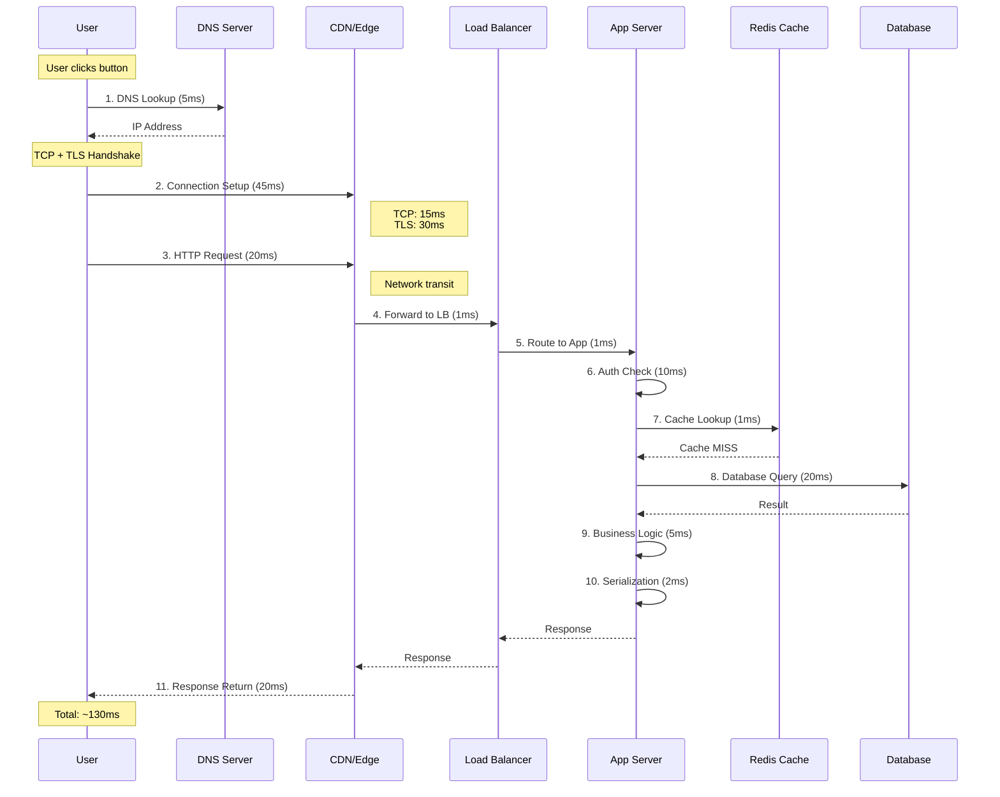
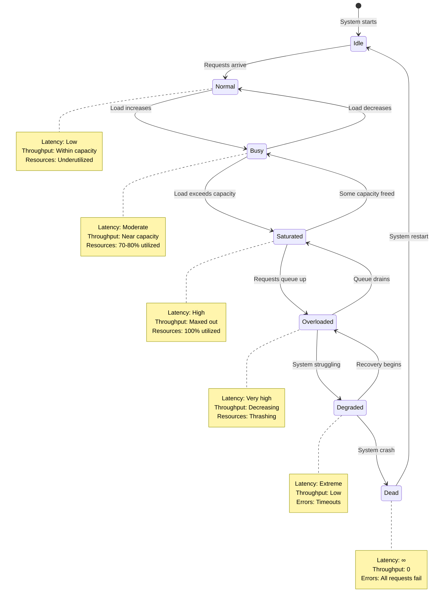

#system-design #fundamentals #performance

# Latency and Throughput

## Intuition (30 sec)

A highway: **latency** is how long it takes ONE car to drive from A to B. **Throughput** is how many cars pass a point per hour. A fast sports car (low latency) on a single-lane road (low throughput) vs a highway with 8 lanes (high throughput) where each car takes a bit longer due to traffic (higher latency).

---

## Failure-First Scenario

> Your API responds in 5ms (great latency!) but only handles 100 requests/second (terrible throughput). Black Friday hits: 10,000 requests/second arrive. 99% of users see timeouts. You optimized for the wrong metric.

---

## Working Knowledge (5 min)

### Core Concepts - Definitions First

**Latency:**
- **Definition:** The time delay from when a request is sent to when the first byte of the response is received
- **Purpose:** Measures user-perceived responsiveness of a system
- **How it works:** Includes network transit time, queueing delays, and processing time
- **Unit:** Milliseconds (ms) or seconds (s)

**Throughput:**
- **Definition:** The number of operations or requests a system can process per unit of time
- **Purpose:** Measures the capacity and efficiency of a system under load
- **How it works:** Limited by system resources (CPU, memory, network bandwidth, database connections)
- **Unit:** Requests per second (req/s), Queries per second (QPS), Transactions per second (TPS)

**Bandwidth:**
- **Definition:** The maximum rate of data transfer across a network path or communication channel
- **Purpose:** Represents the theoretical capacity of the network pipe
- **How it works:** Physical limitation determined by network infrastructure
- **Unit:** Bits per second (bps), Megabits per second (Mbps), Gigabits per second (Gbps)

**Key Relationship:**
```
Bandwidth  = Size of the pipe (theoretical max)
Throughput = How much actually flows (real utilization)
Latency    = How long each drop takes to travel

Analogy:
Bandwidth  = "This highway can fit 10 lanes"
Throughput = "6 lanes are actively being used"
Latency    = "It takes 2 hours to drive end-to-end"
```

### Key Terms Table

| Term | Definition | When You'll See It |
|------|------------|-------------------|
| **Latency** | Time from request to response | User experience discussions |
| **Throughput** | Operations processed per time unit | Capacity planning, load testing |
| **Bandwidth** | Maximum data transfer rate | Network infrastructure, CDN |
| **RTT** | Round-Trip Time (there and back) | Network diagnostics, TCP metrics |
| **P50/P95/P99** | Percentile latencies | Performance monitoring, SLAs |
| **QPS** | Queries Per Second | Database and API metrics |
| **Jitter** | Variation in latency over time | Real-time systems, streaming |

### Visual Model: The Relationship

```
┌────────────────────────────────────────────────────────┐
│                   THE HOLY TRINITY                     │
├────────────────────────────────────────────────────────┤
│                                                        │
│   LATENCY (Time)          THROUGHPUT (Volume)         │
│   ═══════════             ════════════════            │
│                                                        │
│   Request ──────▶ Response     Req1 ──▶               │
│   └──── 50ms ────┘             Req2 ──▶               │
│                                Req3 ──▶               │
│   Lower is better              Req4 ──▶               │
│   Target: < 200ms              ... 1000/sec           │
│                                                        │
│                                Higher is better        │
│                                                        │
│   BANDWIDTH (Capacity)                                │
│   ══════════════════                                  │
│                                                        │
│   ████████████████████████  ← 100 Mbps                │
│   ▰▰▰▰▰▰▰▰▰▰░░░░░░░░░░░░░  ← 40 Mbps used            │
│                                                        │
│   Theoretical maximum                                 │
│   Usage ≤ Bandwidth always                            │
│                                                        │
└────────────────────────────────────────────────────────┘

Key Insight: You can have high bandwidth but still get low
throughput (due to protocol overhead, packet loss, etc.)
```

### Percentile Latencies (P50, P95, P99)

**Why Percentiles Matter:**
- **Definition:** A percentile indicates the value below which a given percentage of observations fall
- **Purpose:** Captures tail latency that affects real users, not just averages
- **Problem with averages:** One slow request (5000ms) + 99 fast requests (50ms) = 100ms average, which hides the terrible experience of 1% of users

```
┌─────────────────────────────────────────────────────────┐
│          LATENCY DISTRIBUTION EXPLAINED                 │
├─────────────────────────────────────────────────────────┤
│                                                         │
│  100 requests with these response times:                │
│                                                         │
│  [30ms][35ms][40ms]...[50ms]...[200ms]...[1500ms]     │
│  ↑                    ↑         ↑         ↑            │
│  Fastest              P50       P95       P99          │
│                                                         │
│  P50 (Median) = 50ms                                   │
│  ├─ 50% of requests faster than this                   │
│  └─ "Typical" user experience                          │
│                                                         │
│  P95 = 200ms                                           │
│  ├─ 95% of requests faster than this                   │
│  ├─ Only 5% of users see worse                         │
│  └─ Most users' worst case                             │
│                                                         │
│  P99 = 1500ms                                          │
│  ├─ 99% of requests faster than this                   │
│  ├─ 1% of users see this or worse                      │
│  └─ Your slowest users (still significant!)            │
│                                                         │
│  P99.9 = 5000ms                                        │
│  └─ The extreme tail                                   │
│                                                         │
└─────────────────────────────────────────────────────────┘

Real-World Impact:
═══════════════════
1 million daily users × 1% (P99) = 10,000 users/day
                                    having bad experience

At Amazon: 100ms latency increase = 1% revenue loss
At Google: 500ms latency = 20% traffic drop
```

| Metric | Meaning | Example | When to Use |
|--------|---------|---------|-------------|
| **P50 (median)** | 50% of requests are faster | 50ms | Understanding typical experience |
| **P95** | 95% of requests are faster | 200ms | Setting SLA targets |
| **P99** | 99% of requests are faster | 1500ms | Catching tail latency issues |
| **P99.9** | 99.9% faster | 5000ms | Extreme outlier detection |

---

## Layer 1: Conceptual Precision (15 min)

### RTT (Round-Trip Time) - Deep Definition

**RTT (Round-Trip Time):**
- **Formal Definition:** The time it takes for a packet to travel from source to destination and back, measured in milliseconds
- **Simple Definition:** How long it takes to send a signal and get a response
- **Analogy:** Like asking someone a question and waiting for their answer - the total time includes both speaking and listening
- **Related Terms:**
  - **One-way latency:** Half of RTT (approximately)
  - **Propagation delay:** Physical time for signal to travel the distance
  - **Network latency:** Includes RTT plus processing delays

**Why RTT matters:**
RTT is the fundamental building block of network latency. Every network protocol interaction (TCP handshake, TLS negotiation, HTTP request) is measured in multiples of RTT.

**Geographic RTT Examples:**

```
┌──────────────────────────────────────────────────────┐
│           RTT BY DISTANCE                            │
├──────────────────────────────────────────────────────┤
│                                                      │
│  Same city (NYC to NYC):                            │
│  ┌─────┐  ~1ms  ┌──────┐                           │
│  │ You │───────▶│Server│                            │
│  │     │◄───────│      │                            │
│  └─────┘  ~1ms  └──────┘                            │
│  Total RTT: ~2ms                                    │
│                                                      │
│  Same continent (NYC to SF):                        │
│  ┌─────┐  ~30ms ┌──────┐                           │
│  │ You │───────▶│Server│                            │
│  │     │◄───────│      │                            │
│  └─────┘  ~30ms └──────┘                            │
│  Total RTT: ~60ms                                   │
│                                                      │
│  Cross-continent (NYC to London):                   │
│  ┌─────┐  ~75ms ┌──────┐                           │
│  │ You │───────▶│Server│                            │
│  │     │◄───────│      │                            │
│  └─────┘  ~75ms └──────┘                            │
│  Total RTT: ~150ms                                  │
│                                                      │
│  Across globe (NYC to Sydney):                      │
│  ┌─────┐ ~150ms ┌──────┐                           │
│  │ You │───────▶│Server│                            │
│  │     │◄───────│      │                            │
│  └─────┘ ~150ms └──────┘                            │
│  Total RTT: ~300ms                                  │
│                                                      │
└──────────────────────────────────────────────────────┘

Fun fact: Speed of light limit means NYC to Sydney
can never be faster than ~100ms RTT (physics!)
```

### Jitter - Deep Definition

**Jitter:**
- **Formal Definition:** The variation in latency over time, measured as the difference between maximum and minimum latency or standard deviation
- **Simple Definition:** Inconsistent response times - sometimes 50ms, sometimes 200ms
- **Analogy:** Like a train that usually arrives in 30 minutes, but sometimes takes 25 minutes and other times takes 45 minutes
- **Related Terms:**
  - **Latency variance:** Statistical measure of jitter
  - **Packet delay variation:** Network-level jitter metric

**Why jitter matters:**
High jitter makes applications feel unpredictable and janky. For real-time applications (video calls, gaming), jitter is often more damaging than slightly higher but consistent latency.

```
┌──────────────────────────────────────────────────────┐
│              LOW JITTER vs HIGH JITTER               │
├──────────────────────────────────────────────────────┤
│                                                      │
│  Low Jitter (Good):                                 │
│  ═══════════════════                                │
│  Request 1:  50ms  ▰▰▰▰▰                           │
│  Request 2:  51ms  ▰▰▰▰▰                           │
│  Request 3:  49ms  ▰▰▰▰▰                           │
│  Request 4:  52ms  ▰▰▰▰▰                           │
│  Request 5:  50ms  ▰▰▰▰▰                           │
│                                                      │
│  Jitter: ±2ms (very consistent)                     │
│  ✓ Predictable performance                          │
│  ✓ Good for real-time apps                          │
│                                                      │
│  High Jitter (Bad):                                 │
│  ════════════════════                               │
│  Request 1:  50ms  ▰▰▰▰▰                           │
│  Request 2: 200ms  ▰▰▰▰▰▰▰▰▰▰▰▰▰▰▰▰▰▰▰▰           │
│  Request 3:  45ms  ▰▰▰▰▰                           │
│  Request 4: 180ms  ▰▰▰▰▰▰▰▰▰▰▰▰▰▰▰▰▰▰             │
│  Request 5:  60ms  ▰▰▰▰▰▰                          │
│                                                      │
│  Jitter: ±150ms (very inconsistent)                │
│  ✗ Unpredictable performance                        │
│  ✗ Causes buffering, stuttering                     │
│                                                      │
└──────────────────────────────────────────────────────┘

Impact on Applications:
Video call with 50ms + 2ms jitter:   Smooth ✓
Video call with 50ms + 150ms jitter: Choppy ✗
```

**Causes of Jitter:**
1. **Network congestion:** Packets wait in queues of varying length
2. **Routing changes:** Different packets take different paths
3. **CPU scheduling:** Server sometimes busy with other tasks
4. **Garbage collection:** JVM pause causes spike in response time
5. **Background jobs:** Periodic tasks steal resources

### Latency Budget Breakdown (Visual Flow)

**Latency Budget:**
- **Definition:** A detailed breakdown of where time is spent in a request's lifecycle, allocating specific time limits to each component
- **Purpose:** Identifies optimization opportunities by quantifying contribution of each layer
- **How to use:** Set target latency (e.g., 200ms), then allocate budget to each component



**Detailed Latency Budget:**

```
┌─────────────────────────────────────────────────────────┐
│          TYPICAL WEB REQUEST LATENCY BUDGET             │
├─────────────────────────────────────────────────────────┤
│                                                         │
│  DNS Lookup                    [▰▰░░░░] 5ms           │
│  Definition: Translate domain to IP address            │
│  Optimization: Use DNS caching, longer TTL             │
│                                                         │
│  TCP Handshake                 [▰▰▰░░░] 15ms          │
│  Definition: 3-way handshake to establish connection   │
│  Optimization: Connection pooling, keep-alive          │
│                                                         │
│  TLS Handshake                 [▰▰▰▰▰▰] 30ms          │
│  Definition: Negotiate encryption, verify certificate  │
│  Optimization: TLS 1.3, session resumption             │
│                                                         │
│  Network Transit               [▰▰▰▰░░] 20ms          │
│  Definition: Physical propagation across network       │
│  Optimization: CDN, edge computing, geographic routing │
│                                                         │
│  Load Balancer                 [▰░░░░░] 1ms           │
│  Definition: Route request to healthy backend server   │
│  Optimization: Layer 4 LB (faster than Layer 7)        │
│                                                         │
│  App Server Processing         [▰▰▰▰▰▰▰▰▰▰] 50ms      │
│  ├─ Auth Check:     10ms                              │
│  ├─ Cache Lookup:    1ms (hit) / 50ms (miss)          │
│  ├─ Business Logic:  5ms                              │
│  └─ Serialization:   2ms                              │
│  Optimization: Async processing, caching               │
│                                                         │
│  Database Query                [▰▰▰▰░░] 20ms          │
│  Definition: Query execution and data retrieval        │
│  Optimization: Indexes, query optimization, connection │
│                pooling, read replicas                  │
│                                                         │
│  Network Return                [▰▰▰▰░░] 20ms          │
│  Definition: Response travels back to client           │
│  Optimization: Response compression, payload reduction │
│                                                         │
│  ──────────────────────────────────────────────────    │
│  Total:                         ~161ms                 │
│                                                         │
│  🎯 Target: < 200ms for good UX                        │
│                                                         │
└─────────────────────────────────────────────────────────┘
```

**Budget Allocation Strategy:**

```
IF target is 200ms total:
├─ Connection overhead: 70ms (35%)
│  └─ DNS + TCP + TLS - hard to reduce much
├─ Network transit: 40ms (20%)
│  └─ Physics-limited, use CDN to minimize
├─ Application logic: 70ms (35%)
│  └─ Most flexible, optimize here first
└─ Database: 20ms (10%)
   └─ Critical path, cache aggressively

Priority for optimization:
1. Application (most control)
2. Database (indexes, caching)
3. Network (CDN, compression)
4. Connection (keep-alive, HTTP/2)
```

### Latency Numbers Every Programmer Should Know

```
┌──────────────────────────────────────────────────────────┐
│     LATENCY NUMBERS (UPDATED FOR 2026)                   │
├──────────────────────────────────────────────────────────┤
│                                                          │
│  L1 cache reference              0.5 ns                  │
│  Branch mispredict               5   ns                  │
│  L2 cache reference              7   ns                  │
│  Mutex lock/unlock               25  ns                  │
│  Main memory reference           100 ns                  │
│  Compress 1KB with Snappy        3   μs                  │
│  Send 1KB over 1 Gbps network    10  μs                  │
│  Read 4KB randomly from SSD      150 μs                  │
│  Read 1MB sequentially from RAM  250 μs                  │
│  Round trip in same datacenter   500 μs                  │
│  Read 1MB sequentially from SSD  1   ms                  │
│  Disk seek (HDD)                 10  ms                  │
│  Read 1MB sequentially from disk 20  ms                  │
│  Send packet CA → Netherlands    150 ms                  │
│                                                          │
│  Visualized on human timescale:                         │
│  (if 1 ns = 1 second)                                   │
│                                                          │
│  L1 cache       = 0.5 sec (pick up a pen)              │
│  Memory         = 100 sec (1.5 minutes)                 │
│  SSD random     = 1.7 days                              │
│  HDD seek       = 4 months                              │
│  Cross-country  = 4.7 years                             │
│                                                          │
└──────────────────────────────────────────────────────────┘

Key Insights:
═════════════
• Memory is ~200x faster than SSD
• SSD is ~100x faster than HDD
• Network within datacenter is ~300x slower than SSD
• Cross-country network is ~300x slower than same datacenter

Design Implications:
• Avoid disk seeks at all costs
• Cache in memory whenever possible
• Minimize cross-datacenter calls
• Use CDN for geographically distant users
```

### How Throughput Works (Visual Flow)

**Throughput Calculation:**

```
┌──────────────────────────────────────────────────────────┐
│         THROUGHPUT = FUNCTION OF RESOURCES               │
├──────────────────────────────────────────────────────────┤
│                                                          │
│  Single-threaded server:                                │
│  ═══════════════════════                                │
│  If each request takes 10ms to process:                 │
│                                                          │
│  1 second = 1000ms                                      │
│  1000ms ÷ 10ms per request = 100 requests/second        │
│                                                          │
│  Max throughput: 100 QPS                                │
│                                                          │
│  Time ──────────────────────────────────▶               │
│  Thread: [R1][R2][R3][R4]...[R100]                     │
│          └─10ms per request─┘                           │
│                                                          │
│  ────────────────────────────────────────────────────    │
│                                                          │
│  Multi-threaded server (10 threads):                    │
│  ═══════════════════════════════════════                │
│  Same 10ms per request, but parallel:                   │
│                                                          │
│  Thread 1: [R1][R11][R21][R31]...[R991]                │
│  Thread 2: [R2][R12][R22][R32]...[R992]                │
│  Thread 3: [R3][R13][R23][R33]...[R993]                │
│  ...                                                    │
│  Thread 10:[R10][R20][R30][R40]...[R1000]              │
│                                                          │
│  Max throughput: 100 × 10 = 1000 QPS                    │
│                                                          │
│  ────────────────────────────────────────────────────    │
│                                                          │
│  Bottleneck-limited (shared database):                  │
│  ═══════════════════════════════════════                │
│  Even with 10 threads, if database only handles         │
│  500 QPS, system throughput = 500 QPS                   │
│                                                          │
│  Thread 1-10: All waiting ⏳                            │
│               │                                         │
│               ▼                                         │
│        [  Database  ]                                   │
│        Max: 500 QPS                                     │
│                                                          │
└──────────────────────────────────────────────────────────┘
```

**Little's Law (The Fundamental Equation):**

```
┌──────────────────────────────────────────────────────────┐
│                    LITTLE'S LAW                          │
├──────────────────────────────────────────────────────────┤
│                                                          │
│  Formula:  L = λ × W                                    │
│                                                          │
│  Where:                                                  │
│  L = Average number of requests in system (concurrent)  │
│  λ = Arrival rate (throughput in req/s)                 │
│  W = Average time in system (latency in seconds)        │
│                                                          │
│  ────────────────────────────────────────────────────    │
│                                                          │
│  Example 1: Basic calculation                           │
│  ───────────────────────────                            │
│  Given:                                                  │
│  • 1000 requests/second arrive (λ = 1000)               │
│  • Each takes 200ms to process (W = 0.2s)               │
│                                                          │
│  Calculate concurrent requests:                         │
│  L = λ × W                                              │
│  L = 1000 × 0.2                                         │
│  L = 200 concurrent requests                            │
│                                                          │
│  Meaning: Your server needs to handle 200 concurrent    │
│           connections/threads                           │
│                                                          │
│  ────────────────────────────────────────────────────    │
│                                                          │
│  Example 2: Capacity planning                           │
│  ──────────────────────────                             │
│  Given:                                                  │
│  • Each server handles 100 concurrent requests max      │
│  • Expected: 500 requests/second                        │
│  • Average latency: 300ms                               │
│                                                          │
│  Calculate servers needed:                              │
│  L = 500 × 0.3 = 150 concurrent                         │
│  Servers = 150 ÷ 100 = 1.5 → 2 servers minimum          │
│  Add redundancy: 2 + 1 = 3 servers                      │
│                                                          │
│  ────────────────────────────────────────────────────    │
│                                                          │
│  Example 3: Reverse calculation                         │
│  ────────────────────────────                           │
│  Given:                                                  │
│  • Max concurrent: 200                                  │
│  • Target throughput: 2000 req/s                        │
│                                                          │
│  Calculate max allowable latency:                       │
│  W = L ÷ λ                                              │
│  W = 200 ÷ 2000                                         │
│  W = 0.1 seconds = 100ms                                │
│                                                          │
│  Meaning: Each request must complete in ≤ 100ms         │
│           to achieve target throughput                  │
│                                                          │
└──────────────────────────────────────────────────────────┘
```

### State Diagram: System Under Load



**State Definitions:**

- **Idle:** System waiting for requests, all resources available
- **Normal:** Healthy operation, requests processed quickly
- **Busy:** High utilization but still responsive
- **Saturated:** At capacity limit, no room for spikes
- **Overloaded:** Requests queueing, latency increasing
- **Degraded:** Partial failures, some requests timing out
- **Dead:** Complete system failure, requires restart

### Trade-offs Matrix (With Definitions)

```
OPTIMIZING LATENCY                    OPTIMIZING THROUGHPUT
═══════════════════════════════════════════════════════════
Definition: Minimize time per          Definition: Maximize requests
            individual request                     processed per second

Strategy Examples:                     Strategy Examples:
────────────────────                   ────────────────────
• In-memory caching                    • Request batching
• Connection pooling                   • Async processing
• Geographic distribution (CDN)        • Horizontal scaling
• Query optimization                   • Non-blocking I/O
• Payload compression                  • Connection multiplexing

Pros:                                  Pros:
• Better user experience               • Handle more total load
• Lower P99 latency                    • Better resource utilization
• Faster page loads                    • Cost-efficient at scale
• Real-time responsiveness             • Smoother under spikes

Cons:                                  Cons:
• May limit total capacity             • Individual requests slower
• More expensive (caching tier)        • Higher P99 latency
• Complex cache invalidation           • Batching adds delay
• Potential cache stampede             • More complex code

Use When:                              Use When:
• User-facing applications             • Batch processing systems
• Real-time features                   • Analytics pipelines
• Competitive advantage = speed        • Background jobs
• Low scale, high expectations         • High scale, async ok

Examples:                              Examples:
────────                               ────────
Trading platform   ✓                  Log aggregation    ✓
Video game server  ✓                  ETL pipeline       ✓
Search engine      ✓                  Email sending      ✓
API gateway        ✓                  Report generation  ✓
```

**The Rare Win-Win:**

```
┌────────────────────────────────────────────────────────┐
│     OPTIMIZATIONS THAT IMPROVE BOTH                    │
├────────────────────────────────────────────────────────┤
│                                                        │
│  🏆 Caching                                            │
│  ───────────                                           │
│  ✓ Reduces latency (memory vs database)               │
│  ✓ Increases throughput (frees backend capacity)      │
│  Cost: Cache infrastructure + invalidation complexity │
│                                                        │
│  🏆 Database Indexing                                  │
│  ──────────────────                                    │
│  ✓ Reduces query latency (O(log n) vs O(n))          │
│  ✓ Increases query throughput (faster = more QPS)    │
│  Cost: Storage space + slower writes                  │
│                                                        │
│  🏆 Connection Pooling                                 │
│  ────────────────────                                  │
│  ✓ Reduces latency (reuse vs new connection)          │
│  ✓ Increases throughput (no handshake overhead)       │
│  Cost: Configuration complexity                        │
│                                                        │
│  🏆 HTTP/2 Multiplexing                                │
│  ─────────────────────                                 │
│  ✓ Reduces latency (parallel requests)                │
│  ✓ Increases throughput (one connection for many)     │
│  Cost: Upgrade effort                                  │
│                                                        │
└────────────────────────────────────────────────────────┘
```

**Common Trade-off Scenarios:**

```
Scenario 1: Batching
════════════════════
Problem: Database can't handle 10,000 individual inserts/sec
Solution: Batch 100 records at a time

┌─ Before (no batching) ─────────────────────────────────┐
│ Insert 1  ─▶  10ms latency                            │
│ Insert 2  ─▶  10ms latency                            │
│ ... × 10,000                                          │
│ Throughput: 100 inserts/sec (limited by DB)           │
│ Latency: 10ms per insert                              │
└────────────────────────────────────────────────────────┘

┌─ After (batching) ─────────────────────────────────────┐
│ Batch of 100  ─▶  50ms latency for entire batch       │
│ Throughput: 2000 inserts/sec (20x improvement!)       │
│ Latency: 50ms per insert (5x worse)                   │
│                                                        │
│ Trade-off: Higher latency but way more throughput     │
└────────────────────────────────────────────────────────┘

Use batching when:
• Backend processing (non-user-facing)
• Analytics/logging (delay acceptable)
• Bulk operations (by definition)


Scenario 2: Compression
════════════════════════
Problem: Large JSON responses taking 100ms to transfer

┌─ Without compression ──────────────────────────────────┐
│ Response size: 500 KB                                 │
│ Network time: 100ms                                   │
│ CPU time: 0ms                                         │
│ Total latency: 100ms                                  │
│ Throughput: 1000 req/s                                │
└────────────────────────────────────────────────────────┘

┌─ With gzip compression ────────────────────────────────┐
│ Response size: 50 KB (10x smaller)                    │
│ Network time: 10ms (10x faster)                       │
│ CPU time: 15ms (compression overhead)                 │
│ Total latency: 25ms (4x better!)                      │
│ Throughput: 800 req/s (CPU-bound now)                │
│                                                        │
│ Trade-off: Lower latency but less throughput          │
└────────────────────────────────────────────────────────┘

Use compression when:
• Network is the bottleneck (not CPU)
• Payloads are large and compressible
• Users on slow networks
```

---

## Layer 2: Technology-Specific Examples (20 min)

### Measurement Techniques

**Client-Side Measurement:**

```javascript
// Browser - Navigation Timing API
// Definition: Built-in browser API to measure page load performance

const perfData = performance.getEntriesByType("navigation")[0];

console.log("Timing Breakdown:");
console.log("DNS Lookup:    ", perfData.domainLookupEnd - perfData.domainLookupStart);
console.log("TCP Connect:   ", perfData.connectEnd - perfData.connectStart);
console.log("TLS Handshake: ", perfData.requestStart - perfData.secureConnectionStart);
console.log("Server Time:   ", perfData.responseStart - perfData.requestStart);
console.log("Download:      ", perfData.responseEnd - perfData.responseStart);
console.log("Total:         ", perfData.loadEventEnd - perfData.fetchStart);

// Modern approach - User Timing API
performance.mark("search-start");
// ... perform search ...
performance.mark("search-end");
performance.measure("search-duration", "search-start", "search-end");

const measurements = performance.getEntriesByType("measure");
console.log("Search took:", measurements[0].duration, "ms");
```

**Server-Side Measurement:**

```java
// Java - Spring Boot Example
// Definition: Measure request processing time on server

@RestController
public class UserController {

    private static final Logger log = LoggerFactory.getLogger(UserController.class);

    @Autowired
    private MeterRegistry meterRegistry;

    @GetMapping("/users/{id}")
    public User getUser(@PathVariable Long id) {
        Timer.Sample sample = Timer.start(meterRegistry);

        try {
            // Database query
            Timer.Sample dbSample = Timer.start(meterRegistry);
            User user = userRepository.findById(id);
            dbSample.stop(Timer.builder("db.query.duration")
                .tag("operation", "findById")
                .register(meterRegistry));

            return user;
        } finally {
            sample.stop(Timer.builder("api.request.duration")
                .tag("endpoint", "/users/{id}")
                .tag("method", "GET")
                .register(meterRegistry));
        }
    }
}
```

**Database Query Measurement:**

```sql
-- PostgreSQL - Query timing
-- Definition: Measure how long queries take to execute

-- Enable timing
\timing on

-- Slow query log configuration
ALTER SYSTEM SET log_min_duration_statement = 100;  -- Log queries > 100ms
ALTER SYSTEM SET log_line_prefix = '%t [%p]: [%l-1] user=%u,db=%d,app=%a,client=%h ';

-- Analyze query performance
EXPLAIN ANALYZE
SELECT u.name, COUNT(o.id) as order_count
FROM users u
LEFT JOIN orders o ON u.id = o.user_id
WHERE u.created_at > NOW() - INTERVAL '30 days'
GROUP BY u.id, u.name
ORDER BY order_count DESC
LIMIT 10;

/*
Output shows:
- Planning time: How long to create execution plan
- Execution time: How long to actually run
- Row counts: How many rows at each step
- Bottlenecks: Which operations are slowest
*/
```

### Monitoring Dashboards (Production Queries)

**Prometheus Queries:**

```yaml
# Definition: Time-series database queries for monitoring

# P50/P95/P99 Latency
histogram_quantile(0.50,
  rate(http_request_duration_seconds_bucket[5m]))  # P50

histogram_quantile(0.95,
  rate(http_request_duration_seconds_bucket[5m]))  # P95

histogram_quantile(0.99,
  rate(http_request_duration_seconds_bucket[5m]))  # P99

# Throughput (QPS)
rate(http_requests_total[1m])

# Error Rate
rate(http_requests_total{status=~"5.."}[5m]) /
  rate(http_requests_total[5m])

# Concurrent Requests (Little's Law in action)
avg(http_requests_in_flight)

# Database Connection Pool
# Definition: Monitor connection usage to prevent exhaustion
jdbc_connections_active / jdbc_connections_max

# Saturation (when you're about to run out of capacity)
# Definition: How close to limits are you?
(
  sum(rate(http_requests_total[5m])) /
  sum(http_max_throughput)
) * 100
```

**Grafana Dashboard Layout:**

```
╔═══════════════════════════════════════════════════════════╗
║          LATENCY & THROUGHPUT DASHBOARD                   ║
╠═══════════════════════════════════════════════════════════╣
║                                                           ║
║  ┌────────────────────┐  ┌────────────────────┐         ║
║  │   Request Rate     │  │   Error Rate       │         ║
║  │                    │  │                    │         ║
║  │  1,247 req/s       │  │      0.2%          │         ║
║  │  ▂▃▅▆▇█▇▆▅▃▂      │  │   ▁▁▁▂▁▁▁▁        │         ║
║  └────────────────────┘  └────────────────────┘         ║
║                                                           ║
║  ┌──────────────────────────────────────────────┐       ║
║  │         Latency Percentiles                  │       ║
║  │                                               │       ║
║  │  P50:  45ms  ▁▂▃▃▃▃▃▂▂▁▁                    │       ║
║  │  P95: 120ms  ▁▂▃▄▅▆▆▅▄▃▂                    │       ║
║  │  P99: 280ms  ▁▂▃▄▅▆▇██▇▆                    │       ║
║  │                                               │       ║
║  │  🎯 SLA Target: P99 < 300ms ✓                │       ║
║  └──────────────────────────────────────────────┘       ║
║                                                           ║
║  ┌────────────────────┐  ┌────────────────────┐         ║
║  │  Database Latency  │  │   Cache Hit Rate   │         ║
║  │                    │  │                    │         ║
║  │    15ms avg        │  │      94.2%         │         ║
║  │  ▂▃▄▅▄▃▂▂▃▄▅      │  │  ▆▆▆▇▇▇▇▇▇▇       │         ║
║  └────────────────────┘  └────────────────────┘         ║
║                                                           ║
║  ┌──────────────────────────────────────────────┐       ║
║  │    Connection Pool Status                     │       ║
║  │                                               │       ║
║  │  Active:  45/200  ▰▰▰▰▰░░░░░░░░░  (22%)    │       ║
║  │  Idle:    155     ▰▰▰▰▰▰▰▰▰▰░░░░  (78%)    │       ║
║  │  Waiting: 0       ░░░░░░░░░░░░░░   (0%)     │       ║
║  │                                               │       ║
║  └──────────────────────────────────────────────┘       ║
║                                                           ║
║  ┌──────────────────────────────────────────────┐       ║
║  │         Recent Slow Queries (P99)             │       ║
║  │                                               │       ║
║  │  12:34:56  POST /api/search      1,250ms     │       ║
║  │  12:35:10  GET  /api/reports/123   890ms     │       ║
║  │  12:35:45  POST /api/orders        780ms     │       ║
║  │                                               │       ║
║  └──────────────────────────────────────────────┘       ║
║                                                           ║
╚═══════════════════════════════════════════════════════════╝
```

**Alert Rules:**

```yaml
# Definition: Automated alerts when metrics exceed thresholds

groups:
  - name: latency_alerts
    rules:
      # Alert if P99 latency exceeds SLA
      - alert: HighP99Latency
        expr: |
          histogram_quantile(0.99,
            rate(http_request_duration_seconds_bucket[5m])
          ) > 0.3
        for: 5m
        labels:
          severity: warning
        annotations:
          summary: "P99 latency above 300ms"
          description: "P99 latency is {{ $value }}s (target: 0.3s)"

      # Alert if throughput drops suddenly
      - alert: ThroughputDrop
        expr: |
          (
            rate(http_requests_total[5m]) /
            rate(http_requests_total[5m] offset 1h)
          ) < 0.5
        for: 10m
        labels:
          severity: critical
        annotations:
          summary: "Throughput dropped by 50%"
          description: "Current: {{ $value | humanize }}% of normal"

      # Alert if error rate spikes
      - alert: HighErrorRate
        expr: |
          (
            rate(http_requests_total{status=~"5.."}[5m]) /
            rate(http_requests_total[5m])
          ) > 0.01
        for: 5m
        labels:
          severity: critical
        annotations:
          summary: "Error rate above 1%"
          description: "Current error rate: {{ $value | humanizePercentage }}"
```

### Calculation Examples with Real Numbers

**Example 1: API Gateway Capacity Planning**

```
Scenario: Building an API gateway
═══════════════════════════════════

Requirements:
• Support 1 million active users
• Each user makes 50 API calls per day
• Peak hour has 15% of daily traffic
• Target P99 latency: 200ms

Step 1: Calculate daily requests
─────────────────────────────────
Daily requests = 1M users × 50 calls = 50M requests/day

Step 2: Calculate average QPS
─────────────────────────────
Average QPS = 50M ÷ 86,400 seconds = 579 req/s

Step 3: Calculate peak QPS
──────────────────────────
Peak hour = 15% of daily traffic
Peak QPS = (50M × 0.15) ÷ 3,600 seconds
         = 7.5M ÷ 3,600
         = 2,083 req/s

Step 4: Add safety margin
─────────────────────────
Safety factor = 2x for spikes
Target capacity = 2,083 × 2 = 4,166 req/s

Step 5: Calculate concurrent requests (Little's Law)
────────────────────────────────────────────────────
Target latency = 200ms = 0.2s
Concurrent = QPS × Latency
           = 4,166 × 0.2
           = 833 concurrent requests

Step 6: Determine server count
───────────────────────────────
Assume each server handles 200 concurrent requests:
Servers needed = 833 ÷ 200 = 4.17 → 5 servers

Add N+2 redundancy = 5 + 2 = 7 servers

Final Architecture:
┌─────────────────────────┐
│    Load Balancer        │
└──┬──┬──┬──┬──┬──┬──┬───┘
   │  │  │  │  │  │  │
 ┌─▼┐┌▼┐┌▼┐┌▼┐┌▼┐┌▼┐┌▼┐
 │S1││S2││S3││S4││S5││S6││S7│
 └──┘└─┘└─┘└─┘└─┘└─┘└──┘

Active: 5 servers (handle 4,166 req/s)
Standby: 2 servers (failover capacity)

Cost estimate (AWS):
• 7 × t3.medium @ $30/month = $210/month
• Load Balancer = $25/month
• Total: $235/month
```

**Example 2: Database Read Replica Sizing**

```
Scenario: E-commerce database optimization
═══════════════════════════════════════════

Current state:
• Primary DB: 1000 QPS total
  ├─ Reads: 900 QPS (90%)
  └─ Writes: 100 QPS (10%)
• P99 latency: 450ms (too slow!)
• Target: P99 < 100ms

Analysis:
─────────
Primary is overloaded. Strategy: Add read replicas.

Step 1: Determine read/write split
───────────────────────────────────
Total QPS: 1000
├─ Write QPS (must go to primary): 100
└─ Read QPS (can go to replicas): 900

Step 2: Size read replicas
───────────────────────────
Assume each DB instance handles 300 QPS comfortably:

Read replicas needed = 900 ÷ 300 = 3 replicas

Step 3: Verify primary can handle writes
─────────────────────────────────────────
Primary now only handles:
• 100 writes/sec
• 0 reads (all routed to replicas)
= 100 QPS total (well under 300 QPS capacity)

Step 4: Calculate new latency
──────────────────────────────
Before:
├─ Primary overloaded at 1000 QPS
└─ P99 latency: 450ms

After:
├─ Primary: 100 QPS → P99: 20ms
└─ Replicas: 300 QPS each → P99: 30ms

New P99 latency: ~30ms ✓ (under 100ms target)

Architecture:
┌──────────────────────────────────────────┐
│            Load Balancer                 │
│  (routes reads/writes intelligently)     │
└───┬──────────────────────┬───────────────┘
    │                      │
    │ Writes (100 QPS)    │ Reads (900 QPS)
    ▼                      ▼
┌─────────┐          ┌──────┬──────┬──────┐
│ Primary │─replicate▶│Rep 1│Rep 2 │Rep 3 │
│   DB    │          │300  │300   │300   │
│         │          │ QPS │ QPS  │ QPS  │
└─────────┘          └──────┴──────┴──────┘

Result:
✓ P99 latency: 450ms → 30ms (15x improvement)
✓ Primary no longer overloaded
✓ System can now scale reads independently
```

**Example 3: CDN Impact Calculation**

```
Scenario: Global news website performance
══════════════════════════════════════════

Current state (no CDN):
• Origin server in US East
• 60% of traffic from Europe and Asia
• Average page load: 2.5 seconds
• 40% bounce rate (users leave before page loads)

Latency breakdown (European user):
───────────────────────────────────
DNS lookup:           10ms
TCP handshake:       150ms (cross-Atlantic RTT)
TLS handshake:       300ms (2 RTTs)
HTML download:       200ms
CSS/JS/images:     1,840ms (multiple round trips)
─────────────────────────
Total:             2,500ms

With CDN (content cached at edge):
───────────────────────────────────
DNS lookup:           5ms  (CDN's anycast DNS)
TCP handshake:       20ms  (to nearest edge)
TLS handshake:       40ms  (1 RTT, TLS 1.3)
HTML download:       50ms  (from origin, once)
CSS/JS/images:       85ms  (cached at edge!)
─────────────────────────
Total:              200ms

Improvement calculation:
────────────────────────
Latency: 2,500ms → 200ms (12.5x faster!)

User impact:
├─ Page load < 1s: Bounce rate drops to 10%
├─ 60% of users now have fast experience
└─ Conversion rate improves 15%

Traffic impact:
───────────────
Daily page views: 10 million
Cache hit rate: 90%

Origin server traffic:
Before CDN: 10M requests/day
After CDN:  1M requests/day (90% cache hit)

Bandwidth savings:
Average page size: 2 MB
Before: 10M × 2MB = 20 TB/day
After:  1M × 2MB = 2 TB/day
Savings: 18 TB/day = 540 TB/month

Cost comparison:
────────────────
Without CDN:
• Bandwidth: 540 TB @ $0.08/GB = $43,200/month
• Servers: 50 (to handle 10M req/day) @ $100 = $5,000/month
• Total: $48,200/month

With CDN:
• CDN service: $5,000/month (includes bandwidth)
• Origin bandwidth: 54 TB @ $0.08/GB = $4,320/month
• Servers: 5 (only 1M req/day) @ $100 = $500/month
• Total: $9,820/month

ROI: Save $38,380/month (80% reduction!)
    + Better user experience
    + Global low latency
```

### Optimization Decision Trees

```mermaid
flowchart TD
    Start[Performance Problem Detected] --> Measure{Measure: What's slow?}

    Measure -->|High Latency| LatencyPath[Latency Optimization Path]
    Measure -->|Low Throughput| ThroughputPath[Throughput Optimization Path]
    Measure -->|Both| BothPath[System Under-resourced]

    LatencyPath --> WhereLatency{Where is time spent?}

    WhereLatency -->|Network| NetworkOpt[Network Optimizations]
    WhereLatency -->|Database| DBOpt[Database Optimizations]
    WhereLatency -->|Application| AppOpt[Application Optimizations]

    NetworkOpt --> N1[✓ Add CDN for static content]
    NetworkOpt --> N2[✓ Enable HTTP/2 or HTTP/3]
    NetworkOpt --> N3[✓ Use connection pooling]
    NetworkOpt --> N4[✓ Enable compression]
    NetworkOpt --> N5[✓ Reduce payload size]

    DBOpt --> D1[✓ Add database indexes]
    DBOpt --> D2[✓ Optimize slow queries]
    DBOpt --> D3[✓ Add caching layer Redis]
    DBOpt --> D4[✓ Use connection pooling]
    DBOpt --> D5[✓ Add read replicas]

    AppOpt --> A1[✓ Add application caching]
    AppOpt --> A2[✓ Use async processing]
    AppOpt --> A3[✓ Optimize algorithms O n]
    AppOpt --> A4[✓ Lazy load resources]
    AppOpt --> A5[✓ Profile and fix hotspots]

    ThroughputPath --> WhereThroughput{What's the bottleneck?}

    WhereThroughput -->|CPU-bound| CPUOpt[Scale Compute]
    WhereThroughput -->|I/O-bound| IOOpt[Scale I/O]
    WhereThroughput -->|Memory-bound| MemOpt[Scale Memory]

    CPUOpt --> C1[✓ Horizontal scaling more servers]
    CPUOpt --> C2[✓ Vertical scaling bigger CPU]
    CPUOpt --> C3[✓ Optimize hot code paths]
    CPUOpt --> C4[✓ Use async non-blocking I/O]

    IOOpt --> I1[✓ Add caching layer]
    IOOpt --> I2[✓ Use batching]
    IOOpt --> I3[✓ Increase connection pools]
    IOOpt --> I4[✓ Add read replicas]

    MemOpt --> M1[✓ Increase server memory]
    MemOpt --> M2[✓ Optimize data structures]
    MemOpt --> M3[✓ Use external cache Redis]
    MemOpt --> M4[✓ Stream instead of load all]

    BothPath --> Scale[Scale Infrastructure]
    Scale --> S1[✓ Add more servers horizontal]
    Scale --> S2[✓ Add caching everywhere]
    Scale --> S3[✓ Database read replicas]
    Scale --> S4[✓ Load balancer tuning]
```



**Decision Matrix: What to Optimize First**

```
┌─────────────────────────────────────────────────────────┐
│         OPTIMIZATION PRIORITY MATRIX                    │
├─────────────────────────────────────────────────────────┤
│                                                         │
│  High Impact, Low Effort (DO FIRST):                   │
│  ═══════════════════════════════════                    │
│  • Add database indexes (hours, huge gain)             │
│  • Enable response compression (config change)         │
│  • Connection pooling (if not using already)           │
│  • Cache frequently-accessed data (Redis)              │
│                                                         │
│  High Impact, Medium Effort (DO NEXT):                 │
│  ══════════════════════════════════════                 │
│  • Add CDN for static assets (1-2 days)                │
│  • Database read replicas (1 week)                     │
│  • Optimize N+1 queries (1-2 weeks)                    │
│  • Async processing for slow tasks (1 week)            │
│                                                         │
│  High Impact, High Effort (DO EVENTUALLY):             │
│  ═══════════════════════════════════════                │
│  • Microservices architecture (months)                 │
│  • Multi-region deployment (months)                    │
│  • Database sharding (months)                          │
│                                                         │
│  Low Impact (DON'T DO):                                │
│  ══════════════════════                                │
│  • Micro-optimizations (shaving 1ms)                   │
│  • Premature optimization                              │
│  • Over-engineering for hypothetical scale             │
│                                                         │
└─────────────────────────────────────────────────────────┘
```

---

## Layer 3: Production-Ready Details (30 min)

### Trade-off Scenarios: Latency vs Throughput

**Scenario 1: Payment Processing System**

```
Business Requirement: Process credit card transactions
═══════════════════════════════════════════════════════

Option A: Optimize for Latency
───────────────────────────────
Architecture:
• Synchronous processing
• Direct API call to payment gateway
• Immediate response to user

User flow:
User clicks "Pay" ──▶ API ──▶ Payment Gateway ──▶ Response
                    └── 500ms total ──┘

Pros:
✓ User gets immediate feedback (500ms)
✓ Simple error handling (fail fast)
✓ Easy to debug
✓ Real-time inventory updates

Cons:
✗ Max throughput: 2000 payments/sec
✗ Payment gateway downtime = your API down
✗ Peak times may overwhelm gateway
✗ Expensive (pay per synchronous API call)

Best for: B2C e-commerce, small-medium scale


Option B: Optimize for Throughput
──────────────────────────────────
Architecture:
• Asynchronous processing
• Queue-based with background workers
• Accept payment, process later

User flow:
User clicks "Pay" ──▶ Queue ──▶ "Processing..." response
                    └── 50ms ──┘
Background worker ──▶ Payment Gateway ──▶ Webhook notification

Pros:
✓ Handle 50,000+ payments/sec (queue absorbs spikes)
✓ Resilient to payment gateway downtime
✓ Can batch process for efficiency
✓ Cheaper (batch API calls)

Cons:
✗ User waits for confirmation (5-10 seconds)
✗ Complex error handling (retry logic)
✗ Eventual consistency issues
✗ Need webhook/polling for status

Best for: B2B invoicing, high-volume marketplace


Decision Matrix:
────────────────
Choose Option A if:
├─ Transaction volume < 1000/min
├─ Users expect immediate confirmation
├─ Synchronous workflow required
└─ Simple infrastructure preferred

Choose Option B if:
├─ Transaction volume > 10,000/min
├─ Peak traffic spikes unpredictable
├─ Cost optimization important
└─ Eventual consistency acceptable
```

**Scenario 2: Analytics Dashboard**

```
Business Requirement: Real-time analytics dashboard
════════════════════════════════════════════════════

Option A: Optimize for Latency (Real-time)
───────────────────────────────────────────
Architecture:
• Direct queries to production database
• Compute metrics on-demand
• No caching

User flow:
User loads dashboard ──▶ 50 complex queries ──▶ 5 second load
                       └── Aggregations on 1TB data ──┘

Pros:
✓ Always up-to-date (0 second lag)
✓ No cache invalidation complexity
✓ Simple architecture

Cons:
✗ Slow dashboard (5+ seconds)
✗ Heavy load on production DB
✗ Can't handle many concurrent users (10-20 max)
✗ Risk of taking down production DB

Best for: Single-user admin dashboards, low usage


Option B: Optimize for Throughput (Pre-computed)
─────────────────────────────────────────────────
Architecture:
• Background jobs compute metrics every 5 minutes
• Store results in fast data store (Redis/ElasticSearch)
• Dashboard reads pre-computed data

User flow:
User loads dashboard ──▶ Read from cache ──▶ 200ms load
                       └── Pre-computed data ──┘

Background job (every 5 min):
Aggregate data ──▶ Store in cache ──▶ Ready for next user

Pros:
✓ Fast dashboard (200ms)
✓ No load on production DB
✓ Support 10,000+ concurrent users
✓ Predictable performance

Cons:
✗ Data delayed by 5 minutes
✗ More complex architecture
✗ Background job infrastructure needed
✗ Storage cost for pre-computed data

Best for: Public dashboards, high concurrency


Hybrid Option: Optimize for Both
─────────────────────────────────
Architecture:
• Most metrics pre-computed (5 min lag)
• Critical metrics real-time (direct query)
• User can force refresh (throttled)

User flow:
Dashboard loads:
├─ Revenue charts: Pre-computed (5 min old) ──▶ 50ms
├─ Active users: Real-time query ──▶ 200ms
└─ Detailed drill-down: On-demand ──▶ 2s

Pros:
✓ Best of both worlds
✓ Fast default experience
✓ Real-time when needed

Cons:
⚠ Most complex to build
⚠ Requires careful capacity planning
⚠ Need rate limiting on real-time queries

Best for: SaaS products, mixed use cases


Decision Framework:
───────────────────
                     Freshness Required
                  │
    Real-time     │     Pre-computed
    (Option A)    │     (Option B)
                  │
    ──────────────┼──────────────────
                  │
    Low           │     High
    Concurrency   │     Concurrency
                  │

If high concurrency + real-time needed:
→ Use Hybrid (expensive but necessary)
```

**Scenario 3: Image Upload Service**

```
Business Requirement: User profile picture upload
═══════════════════════════════════════════════════

Option A: Synchronous (Low Latency for User)
─────────────────────────────────────────────
Flow:
1. User uploads image
2. Server receives upload
3. Resize to 3 sizes (thumbnail, medium, large)
4. Upload to S3
5. Return URLs

Timing:
Upload (2 MB):           500ms
Resize 3 versions:       800ms
Upload to S3:            300ms
────────────────────────────
Total:                  1600ms

Pros:
✓ Image immediately available
✓ Simple code flow
✓ Easy error handling

Cons:
✗ User waits 1.6 seconds (poor UX)
✗ Server resources blocked during processing
✗ Can only handle 50 uploads/sec per server
✗ Large images may timeout

Throughput: ~50 uploads/sec/server


Option B: Asynchronous (High Throughput)
─────────────────────────────────────────
Flow:
1. User uploads image
2. Server saves to temp storage
3. Return 202 Accepted + job ID
4. Background worker processes image
5. Webhook when complete

Timing:
Upload + save:           500ms  (user waits)
Background processing:  1100ms  (user doesn't wait)

Pros:
✓ Fast response to user (500ms)
✓ Can handle 500+ uploads/sec (queue-based)
✓ Retry failed jobs automatically
✓ Can scale workers independently

Cons:
✗ Image not immediately available
✗ Need polling or webhooks
✗ More complex architecture

Throughput: ~500 uploads/sec/server


Recommendation: Option B (Async) because:
──────────────────────────────────────────
1. User doesn't need image immediately
2. Can show "Processing..." spinner
3. 10x better throughput for same cost
4. More resilient to spikes

Trade-off Summary:
┌────────────────┬──────────┬─────────────┐
│                │  Option A│   Option B  │
├────────────────┼──────────┼─────────────┤
│ User Latency   │  1600ms  │    500ms    │
│ System Thru-put│  50/sec  │   500/sec   │
│ Cost/upload    │   High   │     Low     │
│ Scalability    │   Poor   │   Excellent │
│ Complexity     │   Low    │    Medium   │
└────────────────┴──────────┴─────────────┘
```

### Production Monitoring Queries and Metrics

**Comprehensive Monitoring Setup:**

```yaml
# CloudWatch / Datadog / New Relic equivalent
# Definition: Full observability stack for production systems

metrics:
  # === LATENCY METRICS ===

  # Request duration histogram
  - name: http.request.duration
    type: histogram
    buckets: [0.01, 0.05, 0.1, 0.2, 0.5, 1, 2, 5, 10]
    unit: seconds
    labels:
      - endpoint    # e.g., /api/users
      - method      # e.g., GET, POST
      - status      # e.g., 200, 500

  # Database query duration
  - name: db.query.duration
    type: histogram
    buckets: [0.001, 0.005, 0.01, 0.05, 0.1, 0.5, 1]
    unit: seconds
    labels:
      - query_type  # e.g., SELECT, INSERT
      - table       # e.g., users, orders

  # Cache operation latency
  - name: cache.operation.duration
    type: histogram
    buckets: [0.0001, 0.0005, 0.001, 0.005, 0.01, 0.05]
    unit: seconds
    labels:
      - operation   # e.g., GET, SET
      - hit         # true/false

  # === THROUGHPUT METRICS ===

  # Request rate
  - name: http.requests.total
    type: counter
    unit: requests
    labels:
      - endpoint
      - method
      - status

  # Database operations
  - name: db.operations.total
    type: counter
    unit: operations
    labels:
      - operation   # read, write
      - table

  # === CAPACITY METRICS ===

  # Concurrent requests
  - name: http.requests.in_flight
    type: gauge
    unit: requests

  # Connection pool usage
  - name: db.connections.active
    type: gauge
    unit: connections

  - name: db.connections.idle
    type: gauge
    unit: connections

  - name: db.connections.max
    type: gauge
    unit: connections

  # Queue depth
  - name: queue.depth
    type: gauge
    unit: messages
    labels:
      - queue_name

  # === SATURATION METRICS ===

  # CPU usage
  - name: system.cpu.usage
    type: gauge
    unit: percent

  # Memory usage
  - name: system.memory.usage
    type: gauge
    unit: percent

  # Disk I/O
  - name: system.disk.io.usage
    type: gauge
    unit: percent

# Query templates for common scenarios
queries:
  # Current system health
  system_health:
    qps: rate(http_requests_total[1m])
    p99_latency: histogram_quantile(0.99, rate(http_request_duration_bucket[5m]))
    error_rate: rate(http_requests_total{status=~"5.."}[5m]) / rate(http_requests_total[5m])

  # Capacity remaining
  capacity_check:
    connection_pool_usage: db_connections_active / db_connections_max
    cpu_headroom: 100 - system_cpu_usage
    concurrent_request_ratio: http_requests_in_flight / max_concurrent_requests

  # Performance degradation detection
  degradation_alert:
    latency_increase: |
      (
        histogram_quantile(0.99, rate(http_request_duration_bucket[5m])) /
        histogram_quantile(0.99, rate(http_request_duration_bucket[5m] offset 1h))
      ) > 1.5
    throughput_decrease: |
      (
        rate(http_requests_total[5m]) /
        rate(http_requests_total[5m] offset 1h)
      ) < 0.7
```

**SLI/SLO/SLA Definitions:**

```
┌─────────────────────────────────────────────────────────┐
│           SLI / SLO / SLA FRAMEWORK                     │
├─────────────────────────────────────────────────────────┤
│                                                         │
│  SLI (Service Level Indicator):                        │
│  ═══════════════════════════════════                    │
│  Definition: Actual measured metric                     │
│                                                         │
│  Examples:                                              │
│  • P99 latency = 145ms (measured)                      │
│  • Availability = 99.95% (measured)                     │
│  • Error rate = 0.2% (measured)                        │
│                                                         │
│  ─────────────────────────────────────────────────────  │
│                                                         │
│  SLO (Service Level Objective):                        │
│  ════════════════════════════════════                   │
│  Definition: Internal target you aim for                │
│                                                         │
│  Examples:                                              │
│  • P99 latency < 200ms (target)                        │
│  • Availability > 99.9% (target)                        │
│  • Error rate < 0.5% (target)                          │
│                                                         │
│  ─────────────────────────────────────────────────────  │
│                                                         │
│  SLA (Service Level Agreement):                        │
│  ════════════════════════════════════                   │
│  Definition: Contract with customers (has consequences) │
│                                                         │
│  Examples:                                              │
│  • P99 latency < 500ms (guaranteed)                    │
│  • Availability > 99.5% (guaranteed)                    │
│  • If violated: 10% refund per hour                    │
│                                                         │
└─────────────────────────────────────────────────────────┘

Relationship:
════════════
SLA ≤ SLO ≤ SLI (when meeting targets)

Example:
• SLI: P99 = 145ms (actual)
• SLO: P99 < 200ms (internal target)
• SLA: P99 < 500ms (customer guarantee)

Reason for buffer: Gives you room to detect and fix issues
before violating customer contracts.
```

**Error Budget Concept:**

```
┌─────────────────────────────────────────────────────────┐
│              ERROR BUDGET EXPLAINED                     │
├─────────────────────────────────────────────────────────┤
│                                                         │
│  Definition: Amount of downtime you can afford          │
│                                                         │
│  If SLO is 99.9% availability:                         │
│  • Uptime required: 99.9%                              │
│  • Downtime allowed: 0.1%                              │
│  • Error budget: 0.1%                                  │
│                                                         │
│  In a 30-day month:                                    │
│  30 days × 24 hours × 60 min = 43,200 minutes          │
│  Error budget = 43,200 × 0.001 = 43.2 minutes          │
│                                                         │
│  ═════════════════════════════════════════              │
│                                                         │
│  Monthly Error Budget: 43.2 minutes                    │
│                                                         │
│  Week 1: 10 min downtime (23% spent)                   │
│  Week 2: 5 min downtime (12% spent)                    │
│  Week 3: 15 min downtime (35% spent)                   │
│  Week 4: So far: 30 min used, 13.2 min left           │
│                                                         │
│  [▰▰▰▰▰▰▰▰▰▰▰▰▰▰▰▰▰▰▰▰▰▰▰▰▰▰▰▰▰▰░░░░░░]             │
│   70% consumed                  30% remaining          │
│                                                         │
│  ═════════════════════════════════════════              │
│                                                         │
│  Error Budget Policy:                                   │
│  ───────────────────                                    │
│  If budget remaining > 50%:                            │
│    ✓ Deploy new features aggressively                  │
│    ✓ Experiment with optimizations                     │
│                                                         │
│  If budget remaining 20-50%:                           │
│    ⚠ Slow down feature releases                        │
│    ⚠ Focus on stability improvements                   │
│                                                         │
│  If budget remaining < 20%:                            │
│    🛑 Feature freeze                                   │
│    🛑 All hands on reliability                         │
│    🛑 Post-mortem required                             │
│                                                         │
└─────────────────────────────────────────────────────────┘
```

### Real-World Production Architecture

```
┌─────────────────────────────────────────────────────────┐
│     GLOBAL E-COMMERCE PLATFORM ARCHITECTURE             │
│     (Handles 100K QPS, P99 < 200ms globally)           │
└─────────────────────────────────────────────────────────┘

                         🌍 Users
                            │
                ┌───────────┴───────────┐
                │                       │
           🇺🇸 Americas            🇪🇺 Europe            🇦🇺 Asia
                │                       │                   │
        ┌───────▼────────┐      ┌──────▼──────┐     ┌─────▼──────┐
        │  CloudFlare    │      │ CloudFlare  │     │CloudFlare  │
        │  CDN + DDoS    │      │ CDN + DDoS  │     │CDN + DDoS  │
        │  Cache: 85%    │      │ Cache: 85%  │     │Cache: 85%  │
        └───────┬────────┘      └──────┬──────┘     └─────┬──────┘
                │ (15% cache miss)     │                   │
        ┌───────▼────────┐      ┌──────▼──────┐     ┌─────▼──────┐
        │ AWS US-East-1  │      │ AWS EU-W-1  │     │AWS AP-SE-1 │
        │ Region         │      │ Region      │     │Region      │
        └───────┬────────┘      └──────┬──────┘     └─────┬──────┘
                │                      │                   │
                └──────────────────────┼───────────────────┘
                                       │
                        ┌──────────────▼─────────────┐
                        │  Route53 (Global DNS)      │
                        │  Geolocation routing       │
                        │  Health checks: 30s        │
                        └──────────────┬─────────────┘
                                       │
            ┌──────────────────────────┼──────────────────────────┐
            │                          │                          │
    ┌───────▼────────┐        ┌────────▼───────┐        ┌────────▼───────┐
    │ ALB US-East-1  │        │ ALB EU-West-1  │        │ ALB AP-SE-1    │
    │ Layer 7        │        │ Layer 7        │        │ Layer 7        │
    │ Health: /health│        │ Health: /health│        │ Health: /health│
    └───────┬────────┘        └────────┬───────┘        └────────┬───────┘
            │                          │                          │
    ┌───────┴───────┐         ┌────────┴───────┐        ┌────────┴───────┐
    │               │         │                │        │                │
┌───▼──┐  ┌─▼──┐  ┌▼───┐  ┌──▼─┐  ┌──▼──┐ ┌──▼───┐ ┌──▼─┐  ┌──▼──┐ ┌──▼───┐
│ App1 │  │App2│  │App3│  │App4│  │ App5│ │ App6 │ │App7│  │ App8│ │ App9 │
│ ECS  │  │ECS │  │ECS │  │ECS │  │ ECS │ │ ECS  │ │ECS │  │ ECS │ │ ECS  │
│ Task │  │Task│  │Task│  │Task│  │Task │ │ Task │ │Task│  │Task │ │ Task │
└───┬──┘  └─┬──┘  └┬───┘  └──┬─┘  └──┬──┘ └──┬───┘ └──┬─┘  └──┬──┘ └──┬───┘
    │       │      │         │       │       │        │       │       │
    └───────┴──────┴─────────┴───────┴───────┴────────┴───────┴───────┘
                                     │
                    ┌────────────────┼────────────────┐
                    │                │                │
            ┌───────▼────┐   ┌───────▼────┐  ┌───────▼────┐
            │ ElastiCache│   │   Aurora   │  │  Kafka     │
            │ Redis      │   │ PostgreSQL │  │  Cluster   │
            │ Cluster    │   │ Cluster    │  │            │
            │            │   │            │  │            │
            │ 6 nodes    │   │ 1 Primary  │  │ 6 brokers  │
            │ 500K ops/s │   │ 3 Replicas │  │ 1M msg/s   │
            │ P99: 1ms   │   │ P99: 10ms  │  │            │
            └────────────┘   └─────┬──────┘  └────────────┘
                                   │
                          ┌────────┴────────┐
                          │                 │
                    ┌─────▼─────┐     ┌─────▼─────┐
                    │  Replica  │     │  Replica  │
                    │ (Read)    │     │ (Read)    │
                    │ US-West   │     │ EU-West   │
                    └───────────┘     └───────────┘

Performance Characteristics:
════════════════════════════
┌────────────────────────────────────────────────────────┐
│ Latency (P99):                                         │
│ ├─ Same region:     85ms                              │
│ ├─ Cross region:   150ms                              │
│ └─ With CDN cache:  45ms                              │
│                                                        │
│ Throughput:                                            │
│ ├─ Peak QPS:       100,000 req/s                      │
│ ├─ Per region:      33,000 req/s                      │
│ └─ Per app server:   3,300 req/s                      │
│                                                        │
│ Capacity:                                              │
│ ├─ App servers:     30 (10 per region)                │
│ ├─ CPU usage:       60% (headroom for spikes)         │
│ └─ Auto-scale:      Trigger at 70% CPU                │
│                                                        │
│ Cache Hit Rate:                                        │
│ ├─ CDN:            85%                                │
│ ├─ Redis:          92%                                │
│ └─ Effective:      98.8% (compound)                   │
│                                                        │
│ Database:                                              │
│ ├─ Write QPS:       1,200 (to primary)                │
│ ├─ Read QPS:       10,000 (split across replicas)     │
│ └─ Replication lag: < 100ms                           │
│                                                        │
│ Availability:                                          │
│ ├─ Target SLO:     99.95%                             │
│ ├─ Last 30d:       99.97%                             │
│ └─ Error budget:   21.6 min/month (10.8 min used)    │
└────────────────────────────────────────────────────────┘

Cost Breakdown (Monthly):
═════════════════════════
• Application servers (30 × m5.large):      $3,000
• Load balancers (3):                          $75
• ElastiCache Redis (6 nodes):             $2,400
• Aurora PostgreSQL (1 primary + 3 read):   $4,500
• Kafka cluster (6 brokers):                $1,800
• CloudFlare Enterprise:                    $5,000
• Data transfer:                            $2,000
• Monitoring (Datadog):                       $500
──────────────────────────────────────────────────
Total:                                     $19,275

Cost per 1M requests: $19,275 / 259,200M = $0.074
(259.2B requests/month @ 100K QPS)
```

---

## Real-World Examples

### Example 1: Netflix - Optimizing Streaming Latency

**Problem Definition:**
Startup time for video playback was 3-5 seconds, causing user abandonment. 20% of users would leave if video didn't start within 3 seconds.

**Technical Terms Used:**
- **TTI (Time to Interactive):** Time from click to first frame displayed
- **ABR (Adaptive Bitrate):** Dynamically adjusting video quality based on network
- **CDN PoP:** Point of Presence - edge locations serving content

**Solution Definition:**
Multi-layered optimization approach focusing on reducing connection overhead and pre-positioning content.

**Before:**

```
User clicks play:
├─ DNS lookup:              50ms
├─ TCP + TLS to API:       200ms
├─ Auth check:             100ms
├─ Video manifest fetch:   150ms
├─ TCP + TLS to CDN:       200ms
├─ First chunk download:   800ms
└─ Buffer before playback: 500ms
─────────────────────────────────
Total: 2000ms (2 seconds)

Architecture:
User ──▶ API Server (auth) ──▶ CDN ──▶ Video chunks

Issues:
• Multiple round trips
• Serial connection setup
• Large initial buffer requirement
```

**After:**

```
User clicks play:
├─ Pre-connected CDN:        0ms (connection pooling)
├─ Cached manifest:         10ms (in-app cache)
├─ Parallel auth + fetch:  150ms (concurrent)
├─ Small initial chunk:    100ms (adaptive start)
└─ Start playback:          50ms (minimal buffer)
─────────────────────────────────
Total: 310ms (0.3 seconds)

Optimizations applied:
1. Connection pre-warming (saved 200ms)
2. Manifest caching (saved 140ms)
3. Parallel requests (saved 100ms)
4. Adaptive initial bitrate (saved 700ms)
5. Reduced initial buffer (saved 450ms)
```

**Results:**
- **TTI (Time to Interactive):** 2000ms → 310ms (6.5x improvement)
- **Abandonment rate:** 20% → 3% (85% reduction)
- **P99 startup latency:** 5000ms → 800ms
- **User engagement:** +15% watch time

**Key Techniques:**
1. Pre-establish connections during app startup
2. Use smaller initial video chunks for faster start
3. Parallel auth and content fetch
4. Edge computing for personalization
5. Predictive pre-loading based on user behavior

---

### Example 2: Discord - Achieving High Throughput

**Problem Definition:**
During peak gaming hours (evenings), message delivery was delayed by 2-5 seconds, making real-time chat feel laggy. System was handling 10M messages/hour but needed 100M messages/hour.

**Technical Terms Used:**
- **WebSocket:** Persistent bidirectional connection for real-time communication
- **Message fanout:** Distributing one message to multiple recipients
- **Hot shard:** Overloaded database shard due to uneven distribution

**Solution Definition:**
Redesigned message delivery pipeline from synchronous fan-out to asynchronous event-driven architecture.

**Before:**

```
User sends message to 10,000-member server:

User ──▶ API Gateway ──▶ Fanout service
                          ├─ Send to user 1
                          ├─ Send to user 2
                          ├─ Send to user 3
                          ...
                          └─ Send to user 10,000

Process:
1. API receives message
2. Lookup all online members (DB query: 200ms)
3. For each online user:
   - Check permissions (50ms per user)
   - Send WebSocket message (5ms per user)
4. Mark message as delivered

For 10,000 member server with 1,000 online:
Latency: 200ms + (1000 × 55ms) = 55,200ms (55 seconds!)
Throughput: Can only handle 18 messages/sec on this server

Issues:
✗ Synchronous processing
✗ Serial permission checks
✗ One slow user blocks all others
✗ Can't scale to larger servers
```

**After:**

```
User sends message:

User ──▶ API Gateway ──▶ Message Queue
               │
         Accept: 50ms  ← User sees "sent" immediately
               │
        (Asynchronous background processing)
               │
               ▼
    ┌──────────────────────┐
    │  Fanout Workers      │
    │  (100 workers)       │
    └──────────┬───────────┘
               │
        ┌──────┴──────┐
        │             │
    Pre-computed   Batch
    permissions    delivery
    cache          (chunks of 100)

Process:
1. API accepts message ──▶ 50ms response to user
2. Queue picks up message ──▶ 10ms
3. Fanout worker:
   - Load cached permissions ──▶ 5ms (from Redis)
   - Batch WebSocket sends ──▶ 50ms total
4. Mark delivered

For 10,000 member server with 1,000 online:
User latency: 50ms (immediately shows as sent)
System latency: 10ms + 5ms + 50ms = 65ms (background)
Throughput: 100 workers × 20 messages/sec = 2,000 msg/sec

Improvements:
✓ Async processing (user doesn't wait)
✓ Cached permissions (no DB query per message)
✓ Batch delivery (fewer syscalls)
✓ Horizontal scaling (add more workers)
```

**Architecture Evolution:**

```
Phase 1 (Original): Monolith
────────────────────────────
One service does everything
Max throughput: 10M msg/hour (2,778 msg/s)

Phase 2: Message Queue
──────────────────────
Async fanout workers
Max throughput: 100M msg/hour (27,778 msg/s)

Phase 3: Partitioned Workers
────────────────────────────
Workers specialized by server size:
├─ Small servers (< 100 users): Fast lane workers
├─ Medium servers (100-10K):    Standard workers
└─ Large servers (> 10K):       Batch workers

Max throughput: 1B msg/hour (277,778 msg/s)
```

**Results:**
- **Message latency (user-perceived):** 2-5 seconds → 50ms (40-100x improvement)
- **System throughput:** 10M msg/hour → 1B msg/hour (100x improvement)
- **P99 delivery time:** 10 seconds → 200ms
- **Concurrent users supported:** 1M → 10M

**Key Techniques:**
1. Asynchronous processing (user doesn't wait for fanout)
2. Permission caching (avoid DB queries)
3. Batch WebSocket sends (reduce syscalls)
4. Worker specialization (optimize for different workloads)
5. Horizontal scaling (add workers for more throughput)

---

## Interview Preparation

### Concept Glossary

Quick reference definitions for interview:

- **Latency:** Time from request sent to response received (lower is better)
- **Throughput:** Number of operations processed per unit time (higher is better)
- **Bandwidth:** Maximum theoretical data transfer rate of a channel
- **RTT (Round-Trip Time):** Time for packet to travel to destination and back
- **P50/P95/P99:** Percentile latencies (50%/95%/99% of requests faster than this)
- **Jitter:** Variation in latency over time (inconsistency)
- **QPS (Queries Per Second):** Rate of incoming requests
- **Little's Law:** L = λ × W (concurrent requests = throughput × latency)
- **Connection pooling:** Reusing established connections instead of creating new ones
- **Cache hit rate:** Percentage of requests served from cache vs origin
- **Saturation:** State where system is at maximum capacity

### Question Template

**Q: "Explain the difference between latency and throughput, and when you'd optimize for each."**

**Answer Structure:**

1. **Define (10 sec):**
   "Latency measures how long a single request takes - time from sending request to receiving response. Throughput measures how many requests the system processes per second. You can have low latency but low throughput, or vice versa."

2. **Explain with analogy (15 sec):**
   "Think of a highway: latency is how long one car takes to drive from A to B, throughput is how many cars pass a checkpoint per hour. A fast sports car on a one-lane road has low latency but low throughput. A wide highway with traffic has higher latency per car but much higher throughput."

3. **State when to optimize for each (20 sec):**
   "Optimize for latency when: user-facing applications, real-time features, competitive advantage depends on speed. For example, trading platforms, video games, search engines.

   Optimize for throughput when: batch processing, analytics, background jobs. For example, log aggregation, ETL pipelines, bulk email sending."

4. **Mention trade-offs (15 sec):**
   "Some optimizations improve both - like caching and database indexes. But others force trade-offs: batching increases throughput but adds latency since you wait to fill the batch. The key is understanding your use case and which metric matters more to users."

**Q: "How would you measure and monitor latency in a production system?"**

**Answer Structure:**

1. **Define what to measure (10 sec):**
   "I'd track P50, P95, and P99 latencies rather than averages, because averages hide tail latency that affects real users. For 1 million users, P99 means 10,000 users have that bad experience daily."

2. **Explain measurement approach (20 sec):**
   "Use histograms to track latency distribution. Instrument at multiple layers:
   - Client-side: Navigation Timing API in browsers
   - Server-side: Middleware timing wrappers
   - Database: Query execution time logs
   - Network: Track RTT and connection setup time"

3. **Mention monitoring tools (15 sec):**
   "Use Prometheus for metrics collection with histogram buckets, Grafana for visualization. Set alerts on P99 latency exceeding SLO - for example, alert if P99 > 200ms for 5 minutes."

4. **Add production wisdom (15 sec):**
   "Break down latency budget - know where time is spent: DNS, TCP handshake, TLS, processing, database. This tells you where to optimize. Also track saturation metrics like connection pool usage and CPU, because when you hit capacity limits, latency spikes."

**Q: "Walk me through how you'd use Little's Law for capacity planning."**

**Answer Structure:**

1. **State the formula (5 sec):**
   "Little's Law states: L equals lambda times W. Concurrent requests equals throughput times latency."

2. **Explain with example (25 sec):**
   "Say you expect 1,000 requests per second and each request takes 200 milliseconds to process. Then L = 1000 × 0.2 = 200 concurrent requests. This means your system needs to handle 200 requests simultaneously. If each server handles 100 concurrent requests, you need at least 2 servers, plus redundancy - so maybe 3 servers total."

3. **Show reverse calculation (15 sec):**
   "You can also work backwards. If you have 200 concurrent request capacity and need 2,000 QPS throughput, then you need latency under 100ms per request: W = L / lambda = 200 / 2000 = 0.1 seconds."

4. **Add practical insight (15 sec):**
   "In production, I'd add 50% buffer for traffic spikes and account for uneven load distribution across servers. Also monitor the actual ratio - if concurrent requests are way higher than Little's Law predicts, you might have requests getting stuck or thread pool exhaustion."

---

## Quick Reference

### Decision Cheat Sheet

```
IF user-facing real-time application:
  THEN optimize for latency (target P99 < 200ms)
  └─ Use: caching, CDN, connection pooling, indexes

IF batch processing or background job:
  THEN optimize for throughput (maximize QPS)
  └─ Use: batching, async processing, horizontal scaling

IF database is bottleneck:
  THEN add read replicas + caching layer
  └─ Reads: route to replicas
  └─ Writes: only to primary

IF high percentile latency (P99 >> P50):
  THEN investigate tail latency causes
  └─ Check: GC pauses, slow queries, cold cache, background jobs

IF throughput drops under load:
  THEN check saturation metrics
  └─ CPU, memory, connections, queue depth

IF need both low latency AND high throughput:
  THEN invest in caching + horizontal scaling
  └─ Cache: improves both metrics
  └─ Scale: adds capacity for throughput, reduces queuing for latency
```

### Latency Optimization Checklist

```
┌────────────────────────────────────────────────────────┐
│         LATENCY OPTIMIZATION PRIORITY                  │
├────────────────────────────────────────────────────────┤
│                                                        │
│  [ ] Add database indexes (hours, huge impact)        │
│  [ ] Enable connection pooling (config, immediate)     │
│  [ ] Add caching layer Redis (1-2 days)              │
│  [ ] Enable response compression (config)              │
│  [ ] Optimize N+1 queries (1 week)                    │
│  [ ] Add CDN for static assets (1-2 days)             │
│  [ ] Use HTTP/2 or HTTP/3 (config)                    │
│  [ ] Database query optimization (ongoing)             │
│  [ ] Add read replicas (1 week)                       │
│  [ ] Async processing for slow tasks (2 weeks)        │
│                                                        │
└────────────────────────────────────────────────────────┘
```

### Throughput Optimization Checklist

```
┌────────────────────────────────────────────────────────┐
│        THROUGHPUT OPTIMIZATION PRIORITY                │
├────────────────────────────────────────────────────────┤
│                                                        │
│  [ ] Horizontal scaling - add servers (hours)          │
│  [ ] Increase connection pool size (config)            │
│  [ ] Use async/non-blocking I/O (2 weeks)             │
│  [ ] Batch processing where possible (1 week)          │
│  [ ] Add load balancer (1 day)                        │
│  [ ] Cache aggressively (1-2 days)                    │
│  [ ] Database read replicas (1 week)                   │
│  [ ] Message queue for async work (2 weeks)           │
│  [ ] Optimize resource usage (ongoing)                 │
│  [ ] Auto-scaling policies (3 days)                   │
│                                                        │
└────────────────────────────────────────────────────────┘
```

---

## Links

- [[08_reference/latency_numbers]] - Numbers you should memorize
- [[06_trade_offs/latency_vs_throughput]] - Deep trade-off analysis
- [[02_building_blocks/caching]] - The most impactful optimization
- [[02_building_blocks/cdn]] - Reduces geographic latency
- [[02_building_blocks/load_balancers]] - Distributes load for throughput
- [[02_building_blocks/message_queues]] - Async processing patterns
- [[scalability]] - Throughput at scale
- [[03_design_patterns/database_indexing]] - Speed up queries
