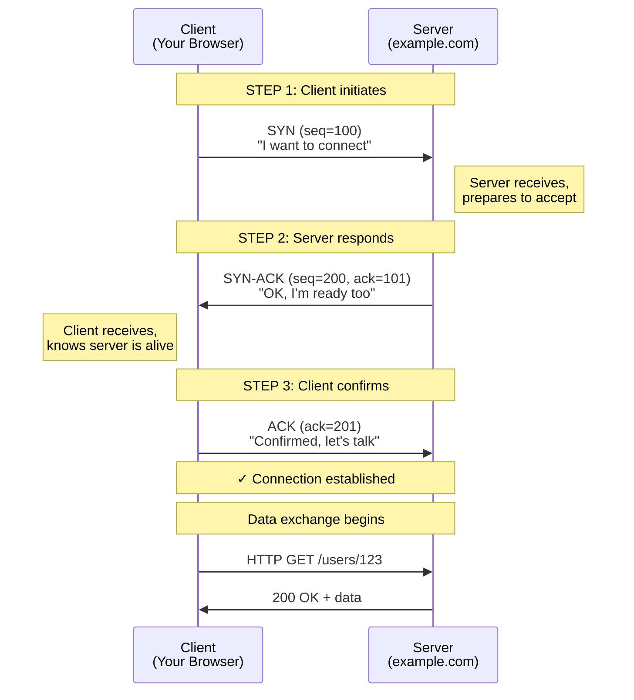
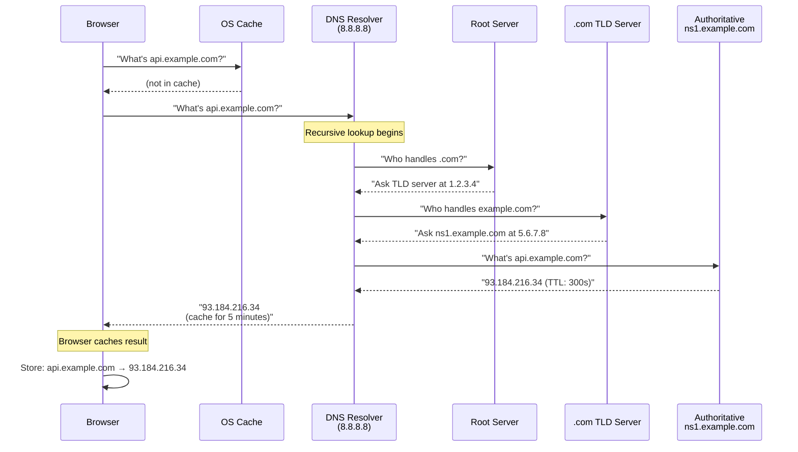
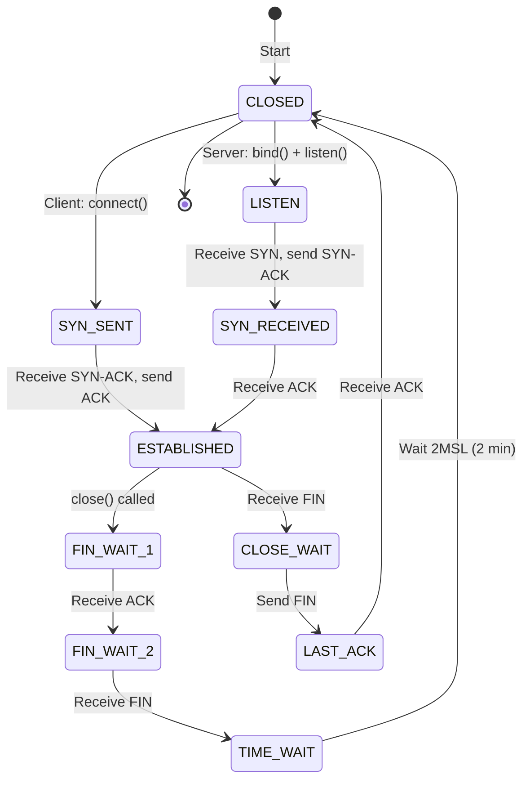
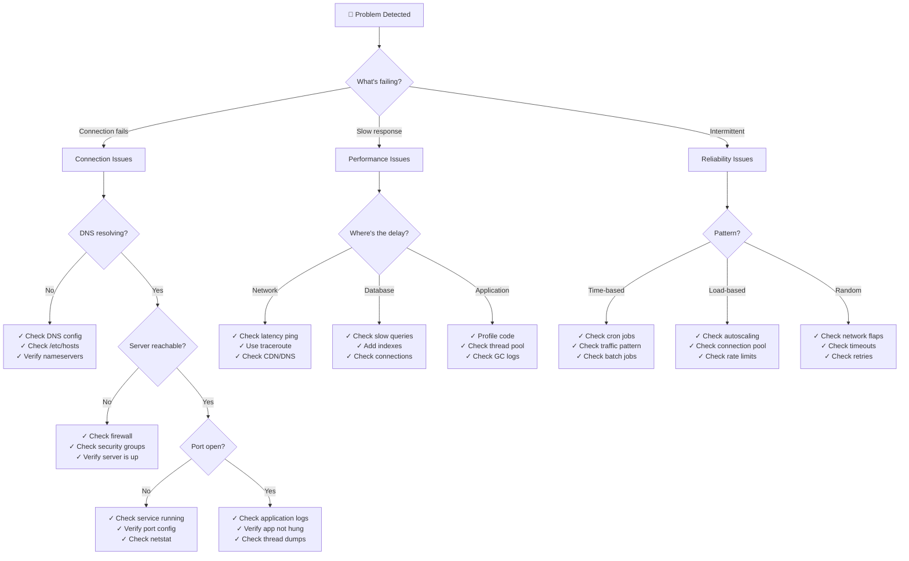

#system-design #fundamentals #networking

```table-of-contents
title: 
style: nestedList # TOC style (nestedList|nestedOrderedList|inlineFirstLevel)
minLevel: 0 # Include headings from the specified level
maxLevel: 0 # Include headings up to the specified level
include: 
exclude: 
includeLinks: true # Make headings clickable
hideWhenEmpty: false # Hide TOC if no headings are found
debugInConsole: false # Print debug info in Obsidian console
```
# Networking Basics (Visual Edition)

## Intuition (30 sec)

Sending a letter through the postal system: you write the letter (data), put it in an envelope (packet), write the address (IP), choose regular mail or express (TCP vs UDP), and the postal system routes it through sorting centers (routers) to the destination.

## Failure-First Scenario

> Your app works perfectly on localhost. You deploy it, and nothing works. Users can't connect. The error: "Connection timeout." You check - server is running, code is fine. The problem? Port 8080 is blocked by firewall, DNS isn't resolving your domain, and the load balancer isn't configured. **You need to understand the full network path.**

---

## Working Knowledge (5 min)

### The Network Stack (Layer Cake)

**Definition:** The network stack is a layered architecture where each layer provides specific services to the layer above it, abstracting away complexity. Based on the OSI (Open Systems Interconnection) model.

**Why layers?** Each layer solves one specific problem, making the system modular and maintainable.

```
┌─────────────────────────────────────────┐
│     Layer 7: Application                │  ← Your code lives here
│  (HTTP, WebSocket, gRPC, DNS)           │  ← "Get me /users/123"
├─────────────────────────────────────────┤
│     Layer 4: Transport                  │  ← Reliability layer
│  (TCP: reliable | UDP: fast)            │  ← "Guarantee delivery"
├─────────────────────────────────────────┤
│     Layer 3: Network                    │  ← Routing layer
│  (IP addressing & routing)              │  ← "Send to 93.184.216.34"
├─────────────────────────────────────────┤
│     Layer 2: Data Link                  │  ← Physical layer
│  (Ethernet, WiFi)                       │  ← "Transmit bits"
└─────────────────────────────────────────┘

Detailed definitions:

Layer 7 (Application):
  Definition: The layer where applications communicate
  Purpose: Defines protocols for specific applications
  Examples: HTTP (web), SMTP (email), DNS (naming)

Layer 4 (Transport):
  Definition: End-to-end communication between applications
  Purpose: Ensures data delivery between processes
  Examples: TCP (reliable), UDP (fast)

Layer 3 (Network):
  Definition: Routing and forwarding across networks
  Purpose: Gets packets from source to destination
  Examples: IP (Internet Protocol)

Layer 2 (Data Link):
  Definition: Direct communication between network nodes
  Purpose: Physical transmission of bits
  Examples: Ethernet, WiFi

Analogy:
Layer 7 = Content of your letter ("Dear John...")
Layer 4 = Postal service (regular vs express mail)
Layer 3 = Address on envelope (123 Main St)
Layer 2 = Delivery truck carrying your letter
```

### TCP vs UDP (The Fundamental Choice)

**TCP (Transmission Control Protocol):**
- **Definition:** A connection-oriented protocol that guarantees reliable, ordered delivery of data between applications
- **How it works:** Establishes a connection first (handshake), then sends data with acknowledgments
- **Key guarantee:** If you send packets 1, 2, 3 - they arrive in order, or you get an error

**UDP (User Datagram Protocol):**
- **Definition:** A connectionless protocol that sends data without guarantees of delivery or order
- **How it works:** Just sends packets without waiting for acknowledgment (fire and forget)
- **Key characteristic:** Minimal overhead, maximum speed, no reliability guarantees

```
TCP (Transmission Control Protocol)
═══════════════════════════════════════════
        Reliable but Slower

┌─────┐         handshake        ┌─────┐
│     │────────────────────────▶ │     │
│     │◄───────────────────────  │     │  "I got it!"
│ You │────────────────────────▶ │Server
│     │  Data with confirmation  │     │
│     │◄───────────────────────  │     │  "Confirmed"
└─────┘                          └─────┘

✓ Guarantees delivery
✓ Guarantees order
✓ Error checking
✗ Slower (overhead)

Use for: HTTP, databases, file transfers, APIs


UDP (User Datagram Protocol)
═══════════════════════════════════════════
        Fast but No Guarantees

┌─────┐                          ┌─────┐
│     │─────────────────────────▶│     │
│     │  Just send, no waiting   │     │
│ You │─────────────────────────▶│ Server
│     │  (might get lost)        │     │
│     │─────────────────────────▶│     │
└─────┘                          └─────┘

✓ Very fast
✓ Low overhead
✗ No guarantee of delivery
✗ No guarantee of order

Use for: Video streaming, gaming, VoIP, DNS
```

### HTTP Status Codes (Visual Guide)

```
┌──────────────────────────────────────────┐
│          HTTP Status Codes               │
└──────────────────────────────────────────┘

2xx = SUCCESS ✓
┌────────────────────────────────────────┐
│ 200 OK         │ Request succeeded     │
│ 201 Created    │ Resource created      │
│ 204 No Content │ Deleted successfully  │
└────────────────────────────────────────┘

3xx = REDIRECT ↻
┌────────────────────────────────────────┐
│ 301 Moved      │ Permanent redirect    │
│ 302 Found      │ Temporary redirect    │
│ 304 Not Mod    │ Use cached version    │
└────────────────────────────────────────┘

4xx = CLIENT ERROR ✗ (Your fault)
┌────────────────────────────────────────┐
│ 400 Bad Req    │ Invalid input         │
│ 401 Unauth     │ Login required        │
│ 403 Forbidden  │ No permission         │
│ 404 Not Found  │ Resource missing      │
│ 429 Too Many   │ Rate limit hit        │
└────────────────────────────────────────┘

5xx = SERVER ERROR ☠ (Their fault)
┌────────────────────────────────────────┐
│ 500 Internal   │ Server crashed        │
│ 502 Bad Gateway│ Upstream failed       │
│ 503 Unavailable│ Overloaded/maintenance│
│ 504 Timeout    │ Upstream didn't reply │
└────────────────────────────────────────┘
```

---

## Layer 1: Conceptual Precision (15 min)

### TCP Three-Way Handshake (The Ritual)

**Definition:** The process TCP uses to establish a connection between client and server before exchanging data. Called "three-way" because it involves three packets: SYN, SYN-ACK, ACK.

**Purpose:** Synchronizes sequence numbers between both parties so they can track packets and detect loss or reordering.

**Key Terms:**
- **SYN (Synchronize):** Initial packet requesting connection, includes starting sequence number
- **ACK (Acknowledge):** Confirms receipt of a packet
- **Sequence Number:** A unique number for tracking packets (prevents duplicates, detects missing packets)
- **RTT (Round-Trip Time):** Time for a packet to go from sender to receiver and back



**Why 3 steps? Why not 2?**

```
2-Way Handshake Problem:
Client: "I want to connect" ────▶ Server
Server: "OK" ────▶ (gets lost in network) ────X

Client thinks: Connection failed ✗
Server thinks: Connection established ✓
→ Inconsistent state! Server wastes resources.

3-Way Handshake Solution:
Client: "I want to connect (seq=100)" ────▶ Server
Server: "OK (ack your 100, my seq=200)" ───▶ Client
Client: "Got it (ack your 200)" ────▶ Server

Both sides agree: Connection established ✓
```

**Time Cost:**

```
Latency breakdown for different distances:

Same city (NYC to NYC):
  TCP Handshake: ~2ms (1 RTT)
  ┌─────┐  1ms  ┌──────┐
  │ You │──────▶│Server│
  │     │◄──────│      │
  └─────┘  1ms  └──────┘

Same continent (NYC to SF):
  TCP Handshake: ~60ms (1 RTT)
  ┌─────┐  30ms ┌──────┐
  │ You │──────▶│Server│
  │     │◄──────│      │
  └─────┘  30ms └──────┘

Cross-continent (NYC to London):
  TCP Handshake: ~150ms (1 RTT)
  ┌─────┐  75ms ┌──────┐
  │ You │──────▶│Server│
  │     │◄──────│      │
  └─────┘  75ms └──────┘

RTT = Round-Trip Time (there and back)
```

### DNS Resolution (The Address Lookup)

**DNS (Domain Name System):**
- **Definition:** A hierarchical, distributed database that translates human-readable domain names (like example.com) into IP addresses (like 93.184.216.34) that computers use to communicate
- **Why it exists:** Humans can't remember IP addresses, but computers need them to route traffic
- **Analogy:** DNS is like a phone book - you look up a name (domain) to get a number (IP address)

**Key Terms:**
- **Domain Name:** Human-readable address (api.example.com)
- **IP Address:** Numerical address computers use (93.184.216.34)
- **DNS Resolver:** Server that performs DNS lookups on your behalf (like 8.8.8.8 - Google's DNS)
- **Authoritative Server:** The "source of truth" for a domain's DNS records
- **TTL (Time To Live):** How long to cache a DNS result before re-checking (in seconds)
- **DNS Record:** An entry in DNS mapping a name to a value (IP, alias, etc.)



**DNS Record Types (Complete Definitions):**

Each DNS record type serves a specific purpose:

- **A Record (Address):** Maps a domain to an IPv4 address
  - Example: example.com → 93.184.216.34
  - Use: Most common, directs traffic to a server

- **AAAA Record (Quad-A):** Maps a domain to an IPv6 address
  - Example: example.com → 2606:2800:220:1:248:1893:25c8:1946
  - Use: IPv6 version of A record (newer, larger address space)

- **CNAME Record (Canonical Name):** Creates an alias pointing to another domain
  - Example: www.example.com → example.com
  - Use: Point multiple names to same destination
  - Limitation: Cannot coexist with other records at same name

- **MX Record (Mail Exchange):** Specifies mail servers for a domain
  - Example: example.com → mail.example.com (priority 10)
  - Use: Email routing
  - Has priority number (lower = higher priority)

- **TXT Record (Text):** Stores arbitrary text, often for verification
  - Example: "v=spf1 include:_spf.google.com" (email authentication)
  - Use: Domain ownership verification, security policies

- **NS Record (Name Server):** Delegates a subdomain to specific nameservers
  - Example: example.com → ns1.example.com, ns2.example.com
  - Use: Specifies which servers are authoritative for this domain

**DNS Record Types (Visual Reference):**

```
Record Type Hierarchy:

example.com
├─ A Record
│  └─ IPv4 Address: 93.184.216.34
│
├─ AAAA Record
│  └─ IPv6 Address: 2606:2800:220:1:248:1893:25c8:1946
│
├─ CNAME Record (alias)
│  └─ www.example.com → example.com
│  └─ blog.example.com → example.com
│
├─ MX Record (mail)
│  ├─ Priority 10: mail1.example.com
│  └─ Priority 20: mail2.example.com (backup)
│
├─ TXT Record (metadata)
│  ├─ "v=spf1 include:_spf.google.com" (email auth)
│  └─ "google-site-verification=abc123..." (ownership)
│
└─ NS Record (nameservers)
   ├─ ns1.example.com
   └─ ns2.example.com
```

**TTL (Time To Live) Trade-off:**

```
Short TTL (60 seconds):
┌──────────────────────────────────┐
│ Every minute, clients re-check   │
│ DNS for updated IP address       │
│                                  │
│ ✓ Changes propagate FAST         │
│ ✗ High DNS server load           │
│ ✗ More latency (frequent lookup) │
│                                  │
│ Use when: Frequent IP changes    │
└──────────────────────────────────┘

Long TTL (86400 seconds = 1 day):
┌──────────────────────────────────┐
│ Clients cache IP for 24 hours   │
│ Only query DNS once per day      │
│                                  │
│ ✓ Low DNS server load            │
│ ✓ Faster (no repeated lookups)   │
│ ✗ Changes take 24h to propagate  │
│                                  │
│ Use when: Stable infrastructure  │
└──────────────────────────────────┘

Typical values:
  CDN endpoints: 300s (5 min)
  API endpoints: 3600s (1 hour)
  Static sites: 86400s (1 day)
```

### HTTPS/TLS Handshake (The Security Dance)

**HTTPS (HTTP Secure):**
- **Definition:** HTTP protocol encrypted using TLS/SSL to protect data in transit
- **Purpose:** Prevents eavesdropping, tampering, and impersonation
- **How it works:** Wraps HTTP traffic in an encrypted tunnel

**TLS (Transport Layer Security):**
- **Definition:** Cryptographic protocol that provides secure communication over a network
- **Formerly called:** SSL (Secure Sockets Layer) - TLS is the modern version
- **What it provides:**
  1. **Encryption:** Data is scrambled so only intended recipient can read it
  2. **Authentication:** Proves the server is who it claims to be (via certificates)
  3. **Integrity:** Detects if data was tampered with in transit

**Key Terms:**
- **Certificate:** Digital document proving a server's identity, issued by a Certificate Authority (CA)
- **Certificate Authority (CA):** Trusted organization that issues certificates (like Let's Encrypt, DigiCert)
- **Public Key:** Shared openly, used to encrypt data
- **Private Key:** Kept secret, used to decrypt data
- **Cipher Suite:** Set of algorithms for encryption (e.g., AES-256, RSA)
- **Handshake:** Initial negotiation to establish secure connection before data flows

```
CLIENT                                                SERVER
  |                                                      |
  |  1. ClientHello                                      |
  |  - TLS version supported                             |
  |  - Cipher suites supported                           |
  |  - Random number (Client Random)                     |
  |----------------------------------------------------->|
  |                                                      |
  |                      2. ServerHello                  |
  |                      - Chosen TLS version            |
  |                      - Chosen cipher suite           |
  |                      - Random number (Server Random) |
  |<-----------------------------------------------------|
  |                                                      |
  |                      3. Certificate                  |
  |                      - Server's SSL certificate      |
  |                      - Public key inside             |
  |<-----------------------------------------------------|
  |                                                      |
  |                      4. ServerHelloDone              |
  |<-----------------------------------------------------|
  |                                                      |
  | [Client verifies certificate with CA]                |
  |                                                      |
  |  5. ClientKeyExchange                                |
  |  - Pre-master secret (encrypted with server's        |
  |    public key from certificate)                      |
  |----------------------------------------------------->|
  |                                                      |
  | [Both generate Master Secret from:                   |
  |  Client Random + Server Random + Pre-master Secret]  |
  |                                                      |
  |  6. ChangeCipherSpec                                 |
  |  - Switch to encrypted communication                 |
  |----------------------------------------------------->|
  |                                                      |
  |  7. Finished (encrypted)                             |
  |  - Hash of handshake messages                        |
  |----------------------------------------------------->|
  |                                                      |
  |                      8. ChangeCipherSpec             |
  |<-----------------------------------------------------|
  |                                                      |
  |                      9. Finished (encrypted)         |
  |<-----------------------------------------------------|
  |                                                      |
  | ============ SECURE CONNECTION ESTABLISHED ========= |
  |                                                      |
  |  Application Data (encrypted)                        |
  |<---------------------------------------------------->|
  |                                                      |
```


2. TLS 1.3 Handshake (Faster - Only 1 Round Trip)

```
CLIENT                                                SERVER
  |                                                      |
  |  1. ClientHello                                      |
  |  - Supported versions & cipher suites                |
  |  - Key share (public key for key exchange)          |
  |----------------------------------------------------->|
  |                                                      |
  |                      2. ServerHello                  |
  |                      - Selected parameters           |
  |                      - Key share                     |
  |                      - Certificate                   |
  |                      - Finished                      |
  |<-----------------------------------------------------|
  |                                                      |
  |  3. Finished                                         |
  |----------------------------------------------------->|
  |                                                      |
  | ============ SECURE CONNECTION ESTABLISHED ========= |
  |  (Only 1 round trip vs 2 in TLS 1.2!)               |
  |                                                      |
```

---

3. Certificate Chain Verification

```
┌─────────────────────────────────────────────────┐
│  ROOT CA (Certificate Authority)                │
│  - Trusted by browser/OS                        │
│  - Self-signed                                  │
└──────────────────┬──────────────────────────────┘
                   │ Signs
                   ▼
┌─────────────────────────────────────────────────┐
│  INTERMEDIATE CA                                │
│  - Signed by Root CA                            │
└──────────────────┬──────────────────────────────┘
                   │ Signs
                   ▼
┌─────────────────────────────────────────────────┐
│  SERVER CERTIFICATE (example.com)               │
│  - Signed by Intermediate CA                    │
│  - Contains public key                          │
│  - Domain name verification                     │
└─────────────────────────────────────────────────┘

Client verifies chain: Server → Intermediate → Root
```

---

4. Symmetric vs Asymmetric Encryption in TLS

```
┌────────────────────────────────────────────────────────┐
│  HANDSHAKE PHASE                                       │
│  Uses: ASYMMETRIC encryption (RSA/ECDHE)              │
│                                                        │
│  Server Public Key ──────┐                            │
│                           │                            │
│  Client encrypts      ┌───▼────┐                      │
│  pre-master secret ──>│ENCRYPT │                      │
│                       └───┬────┘                      │
│                           │                            │
│                           └──────> Server Private Key  │
│                                    (can decrypt)       │
│                                                        │
│  Problem: Asymmetric is SLOW                          │
└────────────────────────────────────────────────────────┘

┌────────────────────────────────────────────────────────┐
│  DATA TRANSFER PHASE                                   │
│  Uses: SYMMETRIC encryption (AES)                      │
│                                                        │
│  Both parties have same "Session Key"                  │
│                                                        │
│  Encrypt with key ──> [DATA] ──> Decrypt with key     │
│                                                        │
│  Benefit: FAST encryption/decryption                   │
└────────────────────────────────────────────────────────┘
```

---

5. Complete Data Flow

```
┌─────────────┐                              ┌─────────────┐
│   BROWSER   │                              │   SERVER    │
└──────┬──────┘                              └──────┬──────┘
       │                                            │
       │  1. User enters https://example.com       │
       │─────────────────────────────────────────> │
       │                                            │
       │  2. TLS Handshake (exchange keys)         │
       │ <─────────────────────────────────────────│
       │                                            │
       │  3. Server Certificate                     │
       │ <─────────────────────────────────────────│
       │                                            │
       │  [Verify certificate with trusted CA]     │
       │                                            │
       │  4. Generate session keys                 │
       │ <────────────────────────────────────────>│
       │                                            │
       │  ╔══════════════════════════════════╗     │
       │  ║  ENCRYPTED TUNNEL ESTABLISHED    ║     │
       │  ╚══════════════════════════════════╝     │
       │                                            │
       │  5. HTTP GET /index.html (encrypted)      │
       │──────────────────────────────────────────>│
       │                                            │
       │  6. HTTP 200 + HTML content (encrypted)   │
       │<──────────────────────────────────────────│
       │                                            │
       │  [Decrypt with session key]               │
       │  [Display webpage]                        │
       │                                            │
```

---

6. What Gets Protected

### WITHOUT TLS (HTTP):
```
┌────────────────────────────────────────────────┐
│  Attacker on network can see:                  │
│  ✗ Username: alice@example.com                 │
│  ✗ Password: mypassword123                     │
│  ✗ Credit card: 4532-1234-5678-9010           │
│  ✗ All webpage content                         │
│  ✗ URLs visited                                │
└────────────────────────────────────────────────┘
```

### WITH TLS (HTTPS):
```
┌────────────────────────────────────────────────┐
│  Attacker on network can ONLY see:             │
│  ✓ example.com (domain - from DNS/SNI)        │
│  ✓ Amount of data transferred                  │
│  ✓ Timing of requests                          │
│                                                │
│  CANNOT see:                                   │
│  ✓ Actual URLs (path)                         │
│  ✓ POST data                                   │
│  ✓ Passwords                                   │
│  ✓ Any content                                 │
└────────────────────────────────────────────────┘
```


  Key Takeaways

  7. TLS uses asymmetric encryption (slow but secure) during handshake to exchange keys
  8. Then switches to symmetric encryption (fast) for actual data transfer
  9. Certificates prove identity - signed by trusted Certificate Authorities
  10. Perfect Forward Secrecy - Each session uses unique keys
  11. TLS 1.3 is faster - Reduced handshake from 2 round trips to 1

  The genius of TLS is combining the security of asymmetric encryption with the speed of symmetric encryption!

### HTTP Evolution (The Speed Quest)

**HTTP (HyperText Transfer Protocol):**
- **Definition:** Application-level protocol for transferring data between clients (browsers) and servers on the web
- **Purpose:** Defines how requests and responses are formatted and transmitted
- **Based on:** Request-response model (client asks, server answers)

**Key HTTP Concepts:**
- **Stateless:** Each request is independent; server doesn't remember previous requests
- **Request Methods:** GET (read), POST (create), PUT (update), DELETE (remove)
- **Status Codes:** 3-digit codes indicating result (200 = success, 404 = not found, etc.)
- **Headers:** Metadata about the request/response (content type, encoding, authentication)

**Evolution Drivers:** Each version solved specific performance problems

```
HTTP/1.0 (1996): One request per connection
═══════════════════════════════════════════

Request 1: ┌────┐ open ┌────┐ close
           │    │──────│    │──X
           └────┘      └────┘

Request 2: ┌────┐ open ┌────┐ close
           │    │──────│    │──X
           └────┘      └────┘

Problem: Each request pays TCP handshake cost
         10 resources = 10 × 3 RTTs = 30 RTTs!


HTTP/1.1 (1997): Keep-Alive (reuse connection)
═══════════════════════════════════════════════

           ┌────┐  keep  ┌────┐
Request 1: │    │────────│    │
Request 2: │    │────────│    │ (same connection)
Request 3: │    │────────│    │
           └────┘  alive └────┘

Better! But still has Head-of-Line Blocking:

Time ──▶
Request 1 (big image): ████████████████████
Request 2 (small JSON):                     ██  (blocked!)
Request 3 (small CSS):                       ██  (blocked!)


HTTP/2 (2015): Multiplexing (parallel streams)
═══════════════════════════════════════════════

Time ──▶
Stream 1 (image): ████  ████  ████  ████
Stream 2 (JSON):   ██  ██  ██  ██  ██
Stream 3 (CSS):      ██  ██  ██  ██

All over ONE TCP connection!
No head-of-line blocking at HTTP level ✓

Also adds:
• Header compression (HPACK)
• Server push (send before asked)
• Stream prioritization


HTTP/3 (2020): QUIC (UDP-based, even faster)
═══════════════════════════════════════════════

Replaces TCP with QUIC (built on UDP):
• 0-RTT connection resumption
• No head-of-line blocking at TCP level too
• Better loss recovery
• Faster connection migration (WiFi ↔ cellular)

Time to first byte:
HTTP/1.1:  ~150ms
HTTP/2:    ~120ms
HTTP/3:    ~50ms  (on repeat visits)
```

### Port Numbers (The Apartment System)

**Port:**
- **Definition:** A 16-bit number (0-65535) that identifies a specific process or service on a computer
- **Purpose:** Allows one computer to run multiple network services simultaneously
- **How it works:** When data arrives at an IP address, the port number tells the operating system which application should receive it

**Why ports exist:**
Without ports, a server could only run one service. With ports, one server can handle:
- Web server on port 80
- Database on port 5432
- SSH on port 22
- All at the same time!

**Key Terms:**
- **Socket:** Combination of IP address + port (e.g., 192.168.1.1:8080)
- **Listening Port:** Port a server is waiting on for incoming connections
- **Ephemeral Port:** Temporary port (49152-65535) used by client for outgoing connections
- **Well-Known Ports:** Standard ports (0-1023) reserved for common services

```
IP Address + Port = Complete Address

┌─────────────────────────────────────┐
│   93.184.216.34:443                 │
│   └─────┬──────┘ └┬┘                │
│      Building    Apt                │
│      (Server)    (Service)          │
└─────────────────────────────────────┘

Analogy:
IP   = 123 Main Street (building address)
Port = Apartment 443 (which service?)

One building (server) can have many apartments (services):
  :80   → HTTP service
  :443  → HTTPS service
  :22   → SSH service
  :3306 → MySQL service
```

**Port Number Ranges:**

```
┌─────────────────────────────────────┐
│  PORT RANGES (0 - 65535)            │
├─────────────────────────────────────┤
│                                     │
│  0 - 1023: Well-Known Ports         │
│  ═══════════════════════════════    │
│  Reserved, need admin/root          │
│  Examples: 80 (HTTP), 443 (HTTPS)   │
│                                     │
├─────────────────────────────────────┤
│                                     │
│  1024 - 49151: Registered Ports     │
│  ═══════════════════════════════    │
│  Common applications                │
│  Examples: 3306 (MySQL), 5432 (PG)  │
│                                     │
├─────────────────────────────────────┤
│                                     │
│  49152 - 65535: Dynamic Ports       │
│  ═══════════════════════════════    │
│  Client-side, temporary             │
│  Your browser uses these            │
│                                     │
└─────────────────────────────────────┘
```

**Essential Ports Reference:**

```
┌──────────────────────────────────────┐
│       COMMON PORTS CHEAT SHEET       │
├──────────────────────────────────────┤
│ Web & APIs:                          │
│   80     HTTP (unencrypted)          │
│   443    HTTPS (encrypted) ⭐         │
│   8080   HTTP (alternate)            │
│                                      │
│ Databases:                           │
│   3306   MySQL                       │
│   5432   PostgreSQL ⭐                │
│   27017  MongoDB                     │
│   6379   Redis                       │
│                                      │
│ Admin & DevOps:                      │
│   22     SSH (remote terminal) ⭐     │
│   3389   RDP (Windows remote)        │
│                                      │
│ Email:                               │
│   25     SMTP (sending)              │
│   110    POP3 (receiving old)        │
│   143    IMAP (receiving modern)     │
│   587    SMTP (secure)               │
│                                      │
│ Other:                               │
│   53     DNS ⭐                        │
│   21     FTP                         │
│   20     FTP (data)                  │
└──────────────────────────────────────┘
```

---

## Layer 2: Technology-Specific Examples (20 min)

### Java HTTP Request Flow (Conceptual)

```
Your Java Application Makes HTTP Request:

┌─────────────────────────────────────────┐
│  Your Code                              │
│  ───────────                            │
│  HttpClient client = ...                │
│  client.send(request)                   │
└─────┬───────────────────────────────────┘
      │
      ▼
┌─────────────────────────────────────────┐
│  Java HTTP Client (built-in)            │
│  ────────────────────────────           │
│  • Builds HTTP headers                  │
│  • Handles connection pooling           │
│  • Manages timeouts                     │
└─────┬───────────────────────────────────┘
      │
      ▼
┌─────────────────────────────────────────┐
│  Operating System Network Stack         │
│  ───────────────────────────────────    │
│  • DNS resolution                       │
│  • TCP connection                       │
│  • TLS handshake                        │
└─────┬───────────────────────────────────┘
      │
      ▼
┌─────────────────────────────────────────┐
│  Network Infrastructure                 │
│  ─────────────────────────              │
│  Router → Internet → Server             │
└─────────────────────────────────────────┘
```

### TCP Socket Connection States



**What You See in Practice:**

```bash
# Check connection states
$ netstat -an | grep :8080

LISTEN       → Server waiting for connections
ESTABLISHED  → Active connection (most common)
TIME_WAIT    → Connection closed, waiting cleanup
CLOSE_WAIT   → App should close but hasn't yet
FIN_WAIT_1/2 → Closing handshake in progress

Too many TIME_WAIT? Normal after high traffic.
Too many CLOSE_WAIT? Your app has connection leak!
```

### Configuration Patterns (Visual)

```yaml
# application.yml (Spring Boot example)

server:
  port: 8080                    # Which port to listen on

  # Connection limits
  tomcat:
    max-connections: 10000       # Max concurrent connections
    connection-timeout: 30s      # How long to wait for client

    threads:
      max: 200                  # Worker threads
      min-spare: 10             # Always keep ready

  # HTTP/2 (faster!)
  http2:
    enabled: true               # Use HTTP/2 if client supports

  # Compression (reduce bandwidth)
  compression:
    enabled: true
    mime-types: application/json,text/html
```

**Configuration Decision Flow:**

```
How many threads do I need?

Step 1: Estimate concurrent requests
├─ Expected QPS: 1000
├─ Average response time: 100ms
└─ Concurrent = QPS × latency = 1000 × 0.1 = 100

Step 2: Add buffer for spikes
└─ Threads = concurrent × 1.5 = 100 × 1.5 = 150

Step 3: Account for resources
├─ Each thread needs ~1MB memory
├─ 200 threads = 200MB
└─ Fits in 4GB server? ✓ Yes

Result: Set max threads = 200
```

### Network Debugging Visual Flow

```
Problem: "API not responding"

Step 1: Is DNS resolving?
┌────────────────────────┐
│ $ nslookup api.example.com │
├────────────────────────┤
│ ✓ Returns IP? Continue │
│ ✗ No IP? DNS problem   │
└────────────────────────┘
        │
        ▼
Step 2: Can you reach the server?
┌────────────────────────┐
│ $ ping api.example.com │
├────────────────────────┤
│ ✓ Replies? Continue    │
│ ✗ Timeout? Firewall or │
│   server down          │
└────────────────────────┘
        │
        ▼
Step 3: Is the port open?
┌────────────────────────┐
│ $ telnet api.example.com 443 │
├────────────────────────┤
│ ✓ Connected? Continue  │
│ ✗ Refused? Service not │
│   running on that port │
└────────────────────────┘
        │
        ▼
Step 4: Is the service responding?
┌────────────────────────┐
│ $ curl -v https://api.example.com/health │
├────────────────────────┤
│ ✓ 200 OK? App working  │
│ ✗ Timeout? App hung    │
│ ✗ 500? App error       │
└────────────────────────┘
```

---

## Layer 3: Production-Ready Details (30 min)

### Production Architecture (Full Stack)

```
                    🌍 Internet
                       │
              ┌────────▼────────┐
              │   DNS (Route53)  │
              │  TTL: 300s       │
              └────────┬────────┘
                       │
              ┌────────▼────────┐
              │   CDN (CloudFlare)
              │  • Cache static  │
              │  • DDoS protection│
              └────────┬────────┘
                       │
         ┌─────────────┼─────────────┐
         │             │             │
    ┌────▼───┐    ┌────▼───┐    ┌────▼───┐
    │Region  │    │Region  │    │Region  │
    │US-East │    │US-West │    │  EU    │
    └────┬───┘    └────┬───┘    └────┬───┘
         │             │             │
    ┌────▼────────────────────────────▼────┐
    │      Load Balancer (Layer 7)         │
    │      • Health checks every 10s       │
    │      • Route by /api/* paths         │
    └────┬─────┬─────┬─────┬─────┬─────┬──┘
         │     │     │     │     │     │
    ┌────▼┐ ┌─▼──┐ ┌▼───┐ ┌──▼┐ ┌▼───┐│
    │App1 │ │App2│ │App3│ │..10│ │Appp││
    │8080 │ │8080│ │8080│ │... │ │8080││
    └──┬──┘ └──┬─┘ └┬───┘ └────┘ └────┘│
       │       │    │                    │
       └───────┴────┴────────┬───────────┘
                             │
         ┌───────────────────┼────────────┐
         │                   │            │
    ┌────▼────┐       ┌──────▼─────┐  ┌──▼───────┐
    │ Redis   │       │ PostgreSQL │  │  Kafka   │
    │ Cache   │       │  Primary   │  │  Queue   │
    │ 6379    │       │  5432      │  │  9092    │
    └─────────┘       └─────┬──────┘  └──────────┘
                            │
                   ┌────────┴─────────┐
                   │                  │
              ┌────▼────┐       ┌─────▼────┐
              │PostgreSQL│       │PostgreSQL│
              │  Replica │       │  Replica │
              │  (Read)  │       │  (Read)  │
              └──────────┘       └──────────┘
```

### Monitoring Dashboard (Visual Metrics)

```
╔═══════════════════════════════════════════════════════╗
║              NETWORK HEALTH DASHBOARD                 ║
╠═══════════════════════════════════════════════════════╣
║                                                       ║
║  🔵 Request Rate                                      ║
║  ▬▬▬▬▬▬▬▬▬▬▬▬▬▬▬▬▬▬▬▬▬▬▬▬▬▬▬▬▬▬▬▬▬▬▬▬▬▬             ║
║  1,247 req/sec  ▲ 12% from last hour                 ║
║                                                       ║
║  🟢 Success Rate: 99.8%                               ║
║  ▰▰▰▰▰▰▰▰▰▰▰▰▰▰▰▰▰▰▰▰▰▰▰▰▰▰▰▰▰▰▰▰▰▰▰▰▰▰▰▱           ║
║                                                       ║
║  🟡 Latency P99: 145ms                                ║
║  ▬▬▬▬▬▬▬▬▬▬▬▬▬▬▬▬▬▬▬▬▬▬▬▬▬▬░░░░░░░░░               ║
║  Target: < 200ms ✓                                    ║
║                                                       ║
║  🔴 Error Rate: 0.2%                                  ║
║  ▬░░░░░░░░░░░░░░░░░░░░░░░░░░░░░░░░░░░░               ║
║  3 errors/sec                                         ║
║                                                       ║
║  Connection Pool:                                     ║
║  ┌─────────────────────────────────┐                 ║
║  │ Active:   45/200  [▰▰▰▰▰░░░░░] │                 ║
║  │ Idle:     155     [▰▰▰▰▰▰▰▰░░] │                 ║
║  │ Waiting:  0       [░░░░░░░░░░] │                 ║
║  └─────────────────────────────────┘                 ║
║                                                       ║
╠═══════════════════════════════════════════════════════╣
║  Recent Errors:                                       ║
║  12:34:56  Connection timeout to db-replica-2         ║
║  12:35:10  503 Service Unavailable (payment-service)  ║
║  12:35:45  Connection refused on port 6379 (redis)    ║
╚═══════════════════════════════════════════════════════╝
```

### Troubleshooting Decision Tree



### Capacity Planning (Visual Math)

```
Given Requirements:
┌─────────────────────────────────────┐
│ • 1 million users                   │
│ • Each user makes 10 API calls/day  │
│ • Peak traffic is 3x average        │
│ • Each request = 500ms average      │
└─────────────────────────────────────┘

Step 1: Calculate Daily Requests
┏━━━━━━━━━━━━━━━━━━━━━━━━━━━━━━━━━━━┓
┃ 1M users × 10 requests = 10M/day  ┃
┗━━━━━━━━━━━━━━━━━━━━━━━━━━━━━━━━━━━┛

	Step 2: Calculate Average QPS (Queries per second)
┏━━━━━━━━━━━━━━━━━━━━━━━━━━━━━━━━━━━┓
┃ 10M requests ÷ 86,400 sec = 116   ┃
┃ Average: 116 QPS                  ┃
┗━━━━━━━━━━━━━━━━━━━━━━━━━━━━━━━━━━━┛

Step 3: Calculate Peak QPS
┏━━━━━━━━━━━━━━━━━━━━━━━━━━━━━━━━━━━┓
┃ Peak = 116 × 3 = 348 QPS          ┃
┗━━━━━━━━━━━━━━━━━━━━━━━━━━━━━━━━━━━┛

Step 4: Calculate Concurrent Requests
┏━━━━━━━━━━━━━━━━━━━━━━━━━━━━━━━━━━━┓
┃ Concurrent = QPS × latency        ┃
┃            = 348 × 0.5sec         ┃
┃            = 174 concurrent       ┃
┗━━━━━━━━━━━━━━━━━━━━━━━━━━━━━━━━━━━┛

Step 5: Determine Server Count
┏━━━━━━━━━━━━━━━━━━━━━━━━━━━━━━━━━━━┓
┃ If 1 server handles 100 concurrent:┃
┃ Servers = 174 ÷ 100 = 1.74        ┃
┃ Round up: 2 servers                ┃
┃ Add redundancy (N+1): 3 servers    ┃
┗━━━━━━━━━━━━━━━━━━━━━━━━━━━━━━━━━━━┛

Final Architecture:
        ┌─────────────┐
        │Load Balancer│
        └──┬───┬───┬──┘
    ┌──────┼───┼───┼──────┐
    │      │   │   │      │
┌───▼──┐ ┌▼───┐ ┌─▼───┐  │
│App 1 │ │App 2│ │App 3│  │
│(hot) │ │(hot)│ │(cold)│  │← Standby
└──────┘ └─────┘ └─────┘  │

Cost estimate:
• 3 × $100/mo = $300/mo
• + Load balancer: $50/mo
• Total: $350/mo
```

### Scaling Evolution (Timeline)

```
Phase 1: MVP (0-1K users)
═══════════════════════════
     ┌──────────┐
     │Single Box│
     │  All-in-1│
     └──────────┘

Cost: $50/month
Latency: ~30ms
Complexity: ⭐

Problems:
✗ No redundancy
✗ Can't scale
✗ Single point of failure

        │ User growth
        ▼

Phase 2: Basic Scale (1K-10K users)
═══════════════════════════════════
    ┌───────────┐
    │    LB     │
    └─┬───────┬─┘
  ┌───▼───┐ ┌─▼─────┐
  │ App 1 │ │ App 2 │
  └───┬───┘ └───┬───┘
      └─────┬───┘
        ┌───▼───┐
        │  DB   │
        └───────┘

Cost: $200/month
Latency: ~50ms
Complexity: ⭐⭐

Improvements:
✓ Redundant apps
✓ Can add more app servers
Still problems:
✗ DB is bottleneck
✗ DB is single point of failure

        │ More growth
        ▼

Phase 3: Optimized (10K-100K users)
════════════════════════════════════
        ┌───────────┐
        │    LB     │
        └─┬─────┬─┬─┘
      ┌───▼──┐┌─▼─▼──┐
      │App 1 ││App 2 │
      └───┬──┘└───┬──┘
          │   ┌───▼───────┐
          │   │Redis Cache│
          │   └───────────┘
       ┌──▼────┐  ┌────────┐
       │DB     │  │DB Read │
       │Primary│──│Replica │
       └───────┘  └────────┘

Cost: $1,000/month
Latency: ~20ms (with cache)
Complexity: ⭐⭐⭐

Improvements:
✓ Cache reduces DB load
✓ Read replicas scale reads
✓ Much faster
Still problems:
✗ Write bottleneck on primary DB
✗ Single region (latency for distant users)

        │ Global scale
        ▼

Phase 4: Global (100K+ users)
══════════════════════════════

    🌍 Global CDN
        │
  ┌─────┼─────┐
  │     │     │
┌─▼─┐ ┌─▼─┐ ┌─▼─┐
│US │ │EU │ │AS │
└─┬─┘ └─┬─┘ └─┬─┘
  │     │     │
[Full stack in each region]

Cost: $10,000+/month
Latency: ~10ms globally
Complexity: ⭐⭐⭐⭐⭐

Improvements:
✓ Low latency everywhere
✓ High availability
✓ Handles massive scale
Challenges:
⚠ Complex deployment
⚠ Data consistency across regions
⚠ Higher operational cost
```

---

## Real-World Examples

### Example 1: Cloudflare (DNS & CDN)

**The Problem:**
```
Traditional DNS resolution:
    Your app ──100ms──▶ DNS ──▶ Authoritative
        ↓
    Slow initial load
    Vulnerable to DDoS
```

**The Solution:**
```
Cloudflare's Approach:

    ┌─────────────────────────────────┐
    │  Edge Servers (200+ locations)  │
    │  • Cache DNS responses          │
    │  • DDoS protection              │
    │  • Anycast routing              │
    └─────────────────────────────────┘

    User ──5ms──▶ Nearest Edge ──▶ Origin
```

**Results:**
- DNS resolution: 10ms → 5ms (50% faster)
- Blocks 72 billion threats/day
- Serves 46 million requests/second

### Example 2: WhatsApp (WebSocket Connections)

**The Challenge:**
```
2 billion users × persistent connections
= 2 billion simultaneous connections!

Traditional approach would need:
100,000+ servers just for connections
```

**The Solution:**
```
Erlang-based server:
• 2 million connections per server
• Only 1,000 servers needed
• Each connection uses 1KB memory

Architecture:
┌──────────┐
│ Millions │
│  of      │──▶  Load Balancer
│ Users    │        │
└──────────┘        ▼
           ┌────────────────┐
           │ WebSocket Cluster│
           │ (Erlang servers) │
           └────────┬─────────┘
                    ▼
              Message Queue
```

**Key Decisions:**
- WebSocket (not HTTP polling) → 95% less bandwidth
- Erlang (not Java) → handle 2M connections/server
- Minimalist protocol → each message only 30 bytes

---

## Interview Preparation

### Must-Know Concept Map

```
               NETWORKING BASICS
                      │
    ┌─────────────────┼─────────────────┐
    │                 │                 │
 TCP vs UDP     DNS Resolution     HTTP Evolution
    │                 │                 │
    ├─ When to use    ├─ Record types   ├─ HTTP/1.1
    ├─ 3-way shake    ├─ TTL            ├─ HTTP/2
    └─ Trade-offs     └─ Caching        └─ HTTP/3

    ┌─────────────────┴─────────────────┐
    │                                   │
 Ports & IPs                    TLS/HTTPS
    │                                   │
    ├─ Common ports                     ├─ Handshake
    ├─ IPv4 vs IPv6                     ├─ Certificate
    └─ Port ranges                      └─ Latency cost
```

### Common Interview Questions (Visual Answers)

**Q: Explain TCP three-way handshake**

**Answer Template:**
```
1. DEFINE (5 sec):
   "TCP establishes reliable connections
   using a 3-packet exchange"

2. HOW (15 sec):
   Client ──SYN──▶ Server
   Client ◄─SYN-ACK─ Server
   Client ──ACK──▶ Server

   Both sides synchronize sequence numbers
   Takes 1 RTT (50-150ms depending on distance)

3. WHY 3 STEPS? (10 sec):
   Prevents half-open connections
   Confirms both sides are ready

4. TRADE-OFF (10 sec):
   Cost: Adds latency before data flows
   Benefit: Guarantees reliable communication
```

---

## Quick Reference

### Network Debugging Cheat Sheet

```
╔═══════════════════════════════════════╗
║      QUICK DIAGNOSTIC FLOW            ║
╠═══════════════════════════════════════╣
║                                       ║
║ 1. DNS Working?                       ║
║    nslookup example.com               ║
║    ✓ Gets IP → Continue               ║
║    ✗ No IP → Check DNS config         ║
║                                       ║
║ 2. Server Reachable?                  ║
║    ping example.com                   ║
║    ✓ Replies → Continue               ║
║    ✗ Timeout → Firewall/routing issue ║
║                                       ║
║ 3. Port Open?                         ║
║    telnet example.com 443             ║
║    ✓ Connected → Continue             ║
║    ✗ Refused → Service not running    ║
║                                       ║
║ 4. Service Responding?                ║
║    curl -v https://example.com/health ║
║    ✓ 200 OK → Service healthy         ║
║    ✗ Error → Check application logs   ║
║                                       ║
╚═══════════════════════════════════════╝
```

### Latency Budget

```
┌────────────────────────────────────────┐
│   WEB REQUEST LATENCY BREAKDOWN        │
├────────────────────────────────────────┤
│                                        │
│ DNS Lookup        [▰▰░░░░░░] 10-50ms  │
│ TCP Handshake     [▰▰▰▰░░░░] 20-100ms │
│ TLS Handshake     [▰▰▰▰▰░░░] 40-200ms │
│ Server Processing [▰▰░░░░░░] 10-500ms │
│ Data Transfer     [▰▰░░░░░░] 10-100ms │
│                                        │
│ ─────────────────────────────────────  │
│ Total:            90-950ms             │
│                                        │
│ 🎯 Target: < 200ms for good UX        │
└────────────────────────────────────────┘

Optimization Strategy:
1. Cache DNS (saves 10-50ms)
2. Use HTTP/2+ (saves 20-100ms)
3. Add CDN (saves 50-200ms)
4. Optimize queries (saves 100-400ms)
```
