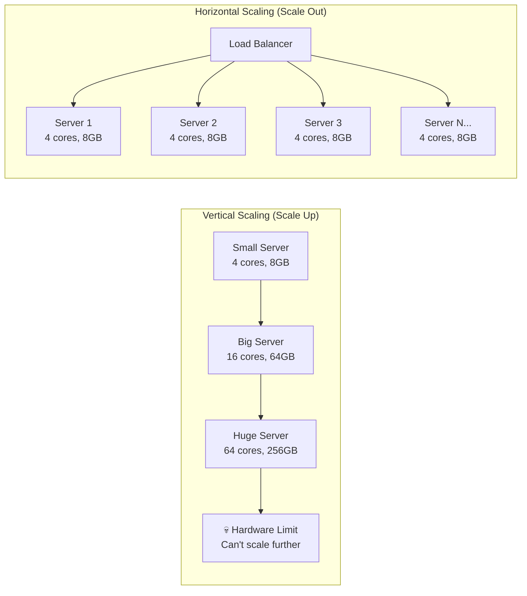
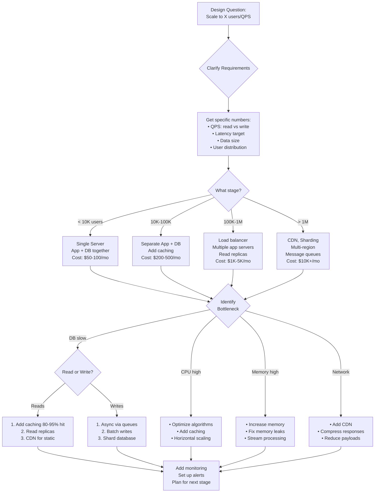

#system-design #fundamentals #scalability #performance

```table-of-contents
title: 
style: nestedList # TOC style (nestedList|nestedOrderedList|inlineFirstLevel)
minLevel: 0 # Include headings from the specified level
maxLevel: 0 # Include headings up to the specified level
include: 
exclude: 
includeLinks: true # Make headings clickable
hideWhenEmpty: false # Hide TOC if no headings are found
debugInConsole: false # Print debug info in Obsidian console
```
# Scalability

	## Intuition (30 sec)

A highway: **vertical scaling** means widening the lanes (bigger machine). **Horizontal scaling** means building parallel highways (more machines). At some point, one highway can never be wide enough — you need more highways.

## Failure-First Scenario

> Your app launches. Day 1: 100 users, works great. Day 30: featured on Product Hunt, 50,000 users hit your single server. CPU at 100%, response times spike from 200ms to 15 seconds, database connections exhausted. Site goes down. You needed a scaling strategy.

---

## Working Knowledge (5 min)

### Core Concepts - Definitions

**Scalability:**
- **Definition:** The ability of a system to handle increasing amounts of work by adding resources (machines, CPU, memory), while maintaining acceptable performance
- **Purpose:** Ensures your application can grow to meet demand without collapsing or requiring complete rewrites
- **How it works:** Either by making individual components more powerful (vertical) or by distributing work across multiple components (horizontal)

**Key Terms:**
- **Vertical Scaling (Scale Up):** Adding more power to a single machine (more CPU, RAM, faster disk)
- **Horizontal Scaling (Scale Out):** Adding more machines and distributing the load across them
- **Elasticity:** The ability to automatically add or remove resources based on current demand
- **Throughput:** The amount of work a system can handle per unit time (requests/second, transactions/second)
- **Capacity Planning:** The process of determining infrastructure requirements needed to meet performance targets
- **Load:** The amount of work (requests, data, computation) the system is currently handling
- **Bottleneck:** The component limiting overall system performance

### Vertical Scaling (Scale Up)

**Definition:** Increasing the capacity of a single machine by adding more powerful hardware resources.

**How it works:** Replace a 4-core, 8GB RAM server with a 16-core, 64GB RAM server. Your application code stays the same.

**Pros:**
- Simple, no code changes
- No distributed systems complexity
- Lower latency (no network hops between components)

**Cons:**
- Hardware limits (you can't buy a server with 10TB RAM)
- Single point of failure
- Expensive at the top end (diminishing returns)
- Downtime required to upgrade

### Horizontal Scaling (Scale Out)

**Definition:** Increasing capacity by adding more machines and distributing the workload across them.

**How it works:** Run your application on 10 smaller servers instead of 1 large server, with a load balancer distributing requests.

**Pros:**
- Virtually unlimited scaling
- Better fault tolerance (one machine fails, others continue)
- Uses commodity hardware (cheaper)
- No downtime for upgrades (rolling deployments)

**Cons:**
- Distributed systems complexity
- Data consistency challenges
- Needs [[02_building_blocks/load_balancers]]
- Network latency between components

### Visual Comparison

```
Vertical Scaling (Scale Up)
═══════════════════════════════════════════
        Make the machine BIGGER

    ┌──────────┐      ┌──────────┐      ┌──────────┐
    │ 4 cores  │      │ 8 cores  │      │ 16 cores │
    │ 8GB RAM  │  →   │ 32GB RAM │  →   │ 128GB RAM│
    │          │      │          │      │          │
    └──────────┘      └──────────┘      └──────────┘
       $100/mo          $400/mo          $2000/mo

    ✓ Simple                      ✗ Hardware ceiling
    ✓ No code changes             ✗ Single point of failure
    ✓ Low latency                 ✗ Expensive at scale


Horizontal Scaling (Scale Out)
═══════════════════════════════════════════
        Add MORE machines

             ┌────────────────┐
             │ Load Balancer  │
             └────┬───┬───┬───┘
                  │   │   │
       ┌──────────┼───┼───┼──────────┐
       │          │   │   │          │
    ┌──▼──┐    ┌─▼──┐ ┌──▼─┐    ┌───▼──┐
    │Srv 1│    │Srv2│ │Srv3│... │Srv N │
    │4 CPU│    │4CPU│ │4CPU│    │4 CPU │
    │8GB  │    │8GB │ │8GB │    │8GB   │
    └─────┘    └────┘ └────┘    └──────┘
     $100       $100   $100      $100

    ✓ Unlimited growth            ✗ More complex
    ✓ Fault tolerant              ✗ Data consistency
    ✓ Cheap commodity hardware    ✗ Network overhead
```



### What Gets Scaled?

Different components require different scaling strategies:

| Component | How to Scale | Difficulty | Why This Approach |
|-----------|-------------|-----------|-------------------|
| **Web servers** | Horizontal + load balancer | ⭐ Easy | Stateless, identical copies |
| **Application servers** | Horizontal if stateless | ⭐⭐ Medium | Need session management |
| **Static content** | [[02_building_blocks/cdn]] | ⭐ Easy | Cache at edge locations |
| **Database reads** | Read replicas ([[03_design_patterns/replication]]) | ⭐⭐⭐ Medium | Eventual consistency OK |
| **Database writes** | [[03_design_patterns/sharding]] | ⭐⭐⭐⭐⭐ Hard | Need to partition data |
| **Background jobs** | Worker pools + [[02_building_blocks/message_queues]] | ⭐⭐ Medium | Queue distributes work |
| **Cache layer** | Horizontal (sharded/consistent hashing) | ⭐⭐⭐ Medium | Partition key space |

**Scaling Difficulty Factors:**
- **Stateless components:** Easiest to scale (web servers, API gateways)
- **Stateful components:** Harder to scale (databases, sessions)
- **Read-heavy:** Easier than write-heavy (caching helps)
- **Write-heavy:** Requires careful partitioning

### The Golden Rule: Stateless Services

**Stateless Service:**
- **Definition:** A service that doesn't store any client session information locally. Each request contains all information needed to process it.
- **Why it matters:** Any server can handle any request, enabling trivial horizontal scaling
- **Example:** RESTful APIs where authentication is handled via tokens in each request

**Stateful Service:**
- **Definition:** A service that maintains client session information in memory or local storage
- **Challenge:** Requests from the same client must go to the same server (sticky sessions)
- **Example:** Traditional web apps with server-side sessions

```
Stateful Architecture (Hard to Scale)
══════════════════════════════════════════

Request 1: User A ─────▶ Server 1 (stores session)
Request 2: User A ─────▶ Server 1 (must use same!)
Request 3: User A ─────▶ Server 2 ✗ (session not here!)

Problems:
• Can't add servers freely
• Uneven load distribution
• Server failure = lost sessions


Stateless Architecture (Easy to Scale)
══════════════════════════════════════════

             ┌──────────────┐
             │ Load Balancer│
             └──┬────┬────┬──┘
                │    │    │
    ┌───────────┼────┼────┼───────────┐
    │           │    │    │           │
Request 1: ────▶ Srv1 │    │           │
Request 2: ─────────▶ Srv2 │           │
Request 3: ──────────────▶ Srv3        │
    │           │    │    │           │
    └───────────┴────┴────┴───────────┘
                │
           ┌────▼────┐
           │  Redis  │ ← Session stored here
           │ (shared)│    (accessible by all)
           └─────────┘

Benefits:
✓ Any server handles any request
✓ Easy to add/remove servers
✓ Automatic failover
✓ Even load distribution
```

**How to make services stateless:**
1. Store session in external cache (Redis, Memcached)
2. Use JWT tokens (session encoded in token)
3. Store session in client (encrypted cookies)
4. Store session in database (slower but works)

---

## Layer 1: Conceptual Precision (15 min)

### Elasticity (Auto-Scaling)

**Elasticity:**
- **Definition:** The ability of a system to automatically provision and deprovision resources in response to changing load patterns
- **Purpose:** Maintains performance during traffic spikes while minimizing costs during low traffic
- **How it works:** Monitors metrics (CPU, memory, queue depth) and triggers scaling actions when thresholds are crossed

**Key Terms:**
- **Auto-Scaling:** Automated process of adding/removing resources based on rules
- **Scale-Out Event:** Trigger that adds more instances (CPU > 70% for 5 minutes)
- **Scale-In Event:** Trigger that removes instances (CPU < 30% for 15 minutes)
- **Cooldown Period:** Wait time after scaling event before next scaling action (prevents flapping)
- **Target Tracking:** Maintains a specific metric at target value (e.g., 50% CPU utilization)

```
Elasticity in Action
════════════════════════════════════════════

Traffic Pattern (Daily):
Load
 ▲
 │     ┌─────┐
 │    ╱       ╲                     ← Peak hours
 │   ╱         ╲
 │  ╱           ╲
 │ ╱             ╲              ← Normal hours
 ├────────────────────▶ Time
 0   6   12  18  24


Without Elasticity (Over-provisioned):
Servers: ████████████████████  (10 servers always)
Cost:    $10,000/month
Waste:   ~60% unused capacity during off-peak


With Elasticity (Dynamic):
         ┌─────┐
Servers: ██ ████████ ██        (2-8 servers)
Cost:    $4,500/month
Savings: $5,500/month (55% cost reduction!)


Scaling Events Timeline:
──────────────────────────────────────────
06:00  │ CPU: 60% → Scale out (2 → 4 servers)
12:00  │ CPU: 80% → Scale out (4 → 8 servers)
18:00  │ CPU: 85% → Scale out (8 → 10 servers)
22:00  │ CPU: 40% → Scale in (10 → 6 servers)
02:00  │ CPU: 25% → Scale in (6 → 2 servers)
```

### Scaling Reads vs Writes

Different workload patterns require different scaling approaches:

**Read-Heavy Workload (90%+ of applications):**
- **Definition:** Systems where read operations vastly outnumber write operations (10:1 or higher ratio)
- **Characteristics:** Social media feeds, news sites, e-commerce product catalogs
- **Why easier to scale:** Reads can be cached, data can be stale, easy to replicate

```
Read-Heavy Scaling Strategy
════════════════════════════════════════════

         ┌────────────┐
         │Load Balancer│
         └─────┬──────┘
               │
    ┌──────────┼──────────┐
    │          │          │
┌───▼───┐  ┌───▼───┐  ┌───▼───┐
│ App 1 │  │ App 2 │  │ App 3 │
└───┬───┘  └───┬───┘  └───┬───┘
    │          │          │
    │     ┌────▼─────┐    │
    │     │  Redis   │    │ ← Cache (90% hits)
    │     │  Cache   │    │    10ms response
    │     └────┬─────┘    │
    │          │          │
    └──────────┼──────────┘
               │
    ┌──────────▼──────────┐
    │  Database Cluster   │
    │                     │
    │  ┌──────────┐       │
    │  │ Primary  │       │ ← Writes go here
    │  │ (Write)  │       │
    │  └────┬─────┘       │
    │       │             │
    │  ┌────┴─────────┐   │
    │  │              │   │
    │  ▼              ▼   │
    │┌────────┐  ┌────────┐│
    ││Replica1│  │Replica2││ ← Reads from here
    ││ (Read) │  │ (Read) ││    50ms response
    │└────────┘  └────────┘│
    └─────────────────────┘

Read Path:
1. Check cache (90% hit rate) → 10ms
2. Cache miss → Query replica → 50ms
3. Cache result for next time

Write Path:
1. Write to primary → replicate → 20ms
2. Invalidate cache
```

**Scaling Strategy for Reads:**
1. Add caching ([[02_building_blocks/caching]]) → 80-95% of requests never hit DB
2. Add CDN for static content → offload 50-70% of traffic
3. Add read replicas ([[03_design_patterns/replication]]) → distribute remaining reads
4. Eventual consistency acceptable → easier replication

**Write-Heavy Workload (Rare, challenging):**
- **Definition:** Systems where write operations approach or exceed read operations
- **Characteristics:** Financial transactions, IoT sensor data, logging systems
- **Why harder to scale:** Writes require consistency, can't be cached, must modify authoritative data

```
Write-Heavy Scaling Strategy
════════════════════════════════════════════

         ┌────────────┐
         │Load Balancer│
         └─────┬──────┘
               │
    ┌──────────┼──────────┐
    │          │          │
┌───▼───┐  ┌───▼───┐  ┌───▼───┐
│ App 1 │  │ App 2 │  │ App 3 │
└───┬───┘  └───┬───┘  └───┬───┘
    │          │          │
    │     ┌────▼─────┐    │
    │     │  Kafka   │    │ ← Async write buffer
    │     │  Queue   │    │    (100K writes/sec)
    │     └────┬─────┘    │
    │          │          │
    └──────────┼──────────┘
               │
    ┌──────────▼──────────────────┐
    │  Sharded Database Cluster   │
    │                             │
    │  ┌─────┐  ┌─────┐  ┌─────┐ │
    │  │Shard│  │Shard│  │Shard│ │
    │  │  1  │  │  2  │  │  3  │ │
    │  │A-H  │  │I-P  │  │Q-Z  │ │
    │  └─────┘  └─────┘  └─────┘ │
    │                             │
    │  Each shard handles 1/3     │
    │  of total writes            │
    └─────────────────────────────┘

Write Path:
1. App → Kafka queue → immediate ack (5ms)
2. Workers consume → route to shard (50ms)
3. Parallel writes across shards
```

**Scaling Strategy for Writes:**
1. Use message queues ([[02_building_blocks/message_queues]]) → async, buffer spikes
2. [[03_design_patterns/sharding]] → partition data across databases
3. CQRS ([[03_design_patterns/cqrs]]) → separate read/write paths
4. Batch writes → reduce round trips
5. Optimize indexes → faster writes

### Bottleneck Identification

**Bottleneck:**
- **Definition:** The resource or component that limits the overall throughput and performance of the system
- **Why it matters:** Scaling the wrong component wastes money without improving performance
- **How to identify:** Monitor resource utilization, find the constraint at 100% while others are underutilized

```
Bottleneck Decision Tree
════════════════════════════════════════════

Start: System is slow
      │
      ▼
 Monitor All Resources
 ├─ CPU utilization
 ├─ Memory usage
 ├─ Disk I/O
 ├─ Network bandwidth
 └─ Database queries
      │
      ▼
┌─────┴─────┐
│ What's at │
│   100%?   │
└─────┬─────┘
      │
      ├─────────────────────────────────────────┐
      │                                         │
      ▼                                         ▼
┌───────────┐                           ┌──────────┐
│CPU at 100%│                           │Memory at │
│           │                           │  100%    │
└─────┬─────┘                           └────┬─────┘
      │                                      │
      ▼                                      ▼
CPU-Bound                               Memory-Bound
                                             │
Symptoms:                               Symptoms:
• High CPU usage                        • Frequent GC pauses
• Slow computations                     • OOM errors
• Complex algorithms                    • Swapping to disk
                                       • High heap usage
Solutions:                                   │
1. Optimize algorithms                 Solutions:
   O(n²) → O(n log n)                 1. Increase heap size
2. Add caching                         2. Fix memory leaks
3. Scale horizontally                  3. Add caching
4. Use faster CPUs                     4. Stream processing
                                       5. Reduce object size


      ├─────────────────────────────────────────┐
      │                                         │
      ▼                                         ▼
┌───────────┐                           ┌──────────┐
│Disk I/O at│                           │Network at│
│   100%    │                           │  100%    │
└─────┬─────┘                           └────┬─────┘
      │                                      │
      ▼                                      ▼
I/O-Bound                               Network-Bound
      │                                      │
Symptoms:                               Symptoms:
• Slow queries                          • High bandwidth usage
• Disk queue depth                      • Slow responses
• High iowait                           • Connection timeouts
• Slow file operations                  • Packet loss
      │                                      │
Solutions:                              Solutions:
1. Upgrade to SSD/NVMe                 1. Add CDN
2. Add caching layer                   2. Compress responses
3. Add indexes                         3. Reduce payload size
4. Use async I/O                       4. Use HTTP/2
5. Optimize queries                    5. Add load balancer


      │
      ▼
┌──────────────┐
│Database slow │
│but resources │
│    OK?       │
└──────┬───────┘
       │
       ▼
Query-Bound

Symptoms:
• Long query times
• Lock contention
• Table scans
• Missing indexes

Solutions:
1. Add indexes
2. Optimize queries
3. Add read replicas
4. Partition/shard data
5. Add caching layer
```

**Common Bottlenecks & Solutions:**

| Bottleneck | Symptoms | Quick Diagnosis | Solution |
|-----------|----------|----------------|----------|
| **CPU-bound** | CPU > 80%, slow processing | `top`, `htop` | Optimize code, cache results, add servers |
| **Memory-bound** | High GC pauses, OOM errors | Heap dumps, GC logs | Increase memory, fix leaks, optimize objects |
| **I/O-bound** | High disk wait, slow queries | `iostat`, query logs | Use SSD, add cache, optimize queries |
| **Network-bound** | High bandwidth, slow transfer | `iftop`, `nethogs` | Add CDN, compress, reduce payload |
| **Database-bound** | Slow queries, lock timeouts | Query profiler, explain plans | Index, optimize, replicate, cache |
| **Connection pool** | Connection timeouts, exhaustion | Pool metrics, thread dumps | Increase pool size, fix connection leaks |

### Scaling Strategies at Different Stages

**Progressive scaling approach:** Start simple, add complexity only when needed.

```
Scaling Evolution Timeline
════════════════════════════════════════════════════════════════

Stage 1: MVP (0 - 1,000 users)
──────────────────────────────
Don't over-engineer!

     ┌─────────────────┐
     │  Single Server  │
     │  ┌──────────┐   │
     │  │    App   │   │
     │  └────┬─────┘   │
     │       │         │
     │  ┌────▼─────┐   │
     │  │    DB    │   │
     │  └──────────┘   │
     └─────────────────┘

Cost: $50/month
Latency: 20-50ms
Complexity: ⭐

What works:
✓ Single box (app + DB)
✓ No caching yet
✓ Monolithic app

Pain points:
✗ No redundancy
✗ Can't handle spikes
✗ Single point of failure

When to move on: Response time > 500ms, CPU > 70%


Stage 2: Separation (1K - 10K users)
────────────────────────────────────

     ┌──────────┐      ┌──────────┐
     │   App    │      │   App    │
     │  Server  │      │  Server  │
     └────┬─────┘      └────┬─────┘
          │                 │
          └────────┬────────┘
                   │
            ┌──────▼──────┐
            │ PostgreSQL  │
            │   Primary   │
            └─────────────┘

Cost: $200/month
Latency: 30-100ms
Complexity: ⭐⭐

What's new:
✓ Separate app and DB servers
✓ Vertical scaling of DB
✓ Simple monitoring

Still missing:
✗ Caching (hitting DB on every request)
✗ Load balancing
✗ No read scaling

When to move on: DB CPU > 60%, response time > 200ms


Stage 3: Caching Layer (10K - 50K users)
─────────────────────────────────────────

          ┌──────────┐
          │Load Bal. │
          └────┬─────┘
               │
    ┌──────────┼──────────┐
    │          │          │
┌───▼───┐  ┌───▼───┐  ┌───▼───┐
│ App 1 │  │ App 2 │  │ App 3 │
└───┬───┘  └───┬───┘  └───┬───┘
    │          │          │
    │     ┌────▼─────┐    │
    │     │  Redis   │    │ ← 80% cache hit rate
    │     └────┬─────┘    │
    │          │          │
    └──────────┼──────────┘
               │
         ┌─────▼─────┐
         │PostgreSQL │
         └───────────┘

Cost: $500/month
Latency: 10-50ms
Complexity: ⭐⭐⭐

What's new:
✓ Redis caching (80-95% hit rate)
✓ Horizontal app scaling
✓ Load balancer

Impact:
• Response time: 100ms → 20ms (5x faster!)
• DB load: Reduced by 80%
• Can handle 10x traffic

When to move on: Cache misses slow, DB writes backing up


Stage 4: Read Scaling (50K - 200K users)
─────────────────────────────────────────

          ┌──────────┐
          │Load Bal. │
          └────┬─────┘
               │
    ┌──────────┼──────────┐
    │          │          │
┌───▼───┐  ┌───▼───┐  ┌───▼───┐
│ App 1 │  │ App 2 │  │ App 3 │
└───┬───┘  └───┬───┘  └───┬───┘
    │          │          │
    │     ┌────▼─────┐    │
    │     │  Redis   │    │
    │     └────┬─────┘    │
    │          │          │
    └──────────┼──────────┘
               │
         ┌─────▼──────┐
         │PostgreSQL  │
         │  Primary   │
         │  (writes)  │
         └─────┬──────┘
               │
         ┌─────┴──────────┐
         │                │
    ┌────▼────┐     ┌─────▼────┐
    │Replica 1│     │Replica 2 │
    │ (reads) │     │ (reads)  │
    └─────────┘     └──────────┘

Cost: $1,500/month
Latency: 10-30ms
Complexity: ⭐⭐⭐⭐

What's new:
✓ Read replicas (distribute reads)
✓ Primary for writes only
✓ Replication lag monitoring

Read path: App → Cache (miss) → Replica
Write path: App → Primary → Replicate

Handles:
• 200K QPS reads
• 2K QPS writes

When to move on: Write bottleneck, need multi-region


Stage 5: Write Scaling (200K - 1M users)
─────────────────────────────────────────

          ┌──────────┐
          │   CDN    │ ← Static content
          └────┬─────┘
               │
          ┌────▼─────┐
          │Load Bal. │
          └────┬─────┘
               │
    ┌──────────┼──────────┐
    │          │          │
┌───▼───┐  ┌───▼───┐  ┌───▼───┐
│ App 1 │  │ App 2 │  │ App 3 │
└───┬───┘  └───┬───┘  └───┬───┘
    │          │          │
    │     ┌────▼─────┐    │
    │     │  Kafka   │    │ ← Async writes
    │     └────┬─────┘    │
    │          │          │
    │     ┌────▼─────┐    │
    │     │  Redis   │    │
    │     └────┬─────┘    │
    │          │          │
    └──────────┼──────────┘
               │
    ┌──────────▼───────────────┐
    │   Sharded PostgreSQL     │
    │                          │
    │  ┌──────┐  ┌──────┐     │
    │  │Shard │  │Shard │ ... │
    │  │  1   │  │  2   │     │
    │  └──┬───┘  └──┬───┘     │
    │     │         │         │
    │  ┌──▼───┐  ┌─▼────┐     │
    │  │Repl 1│  │Repl 2│     │
    │  └──────┘  └──────┘     │
    └──────────────────────────┘

Cost: $5,000/month
Latency: 5-20ms
Complexity: ⭐⭐⭐⭐⭐

What's new:
✓ CDN for static content (50-70% offload)
✓ Message queue (Kafka) for async writes
✓ Database sharding (partition by user_id)
✓ Each shard has replicas

Handles:
• 1M QPS reads
• 50K QPS writes

Key challenges:
• Cross-shard queries
• Data consistency
• Operational complexity


Stage 6: Global Scale (1M+ users)
──────────────────────────────────

     🌍 Global DNS (Route53)
            │
    ┌───────┼────────┐
    │       │        │
  ┌─▼──┐  ┌▼───┐  ┌─▼──┐
  │US  │  │EU  │  │Asia│
  │West│  │    │  │    │
  └─┬──┘  └┬───┘  └─┬──┘
    │      │        │
  [Complete stack in each region]
    │      │        │
    └──────┼────────┘
           │
    ┌──────▼───────┐
    │Global Database│
    │  (CockroachDB,│
    │   Spanner)    │
    └───────────────┘

Cost: $50,000+/month
Latency: 5-15ms (anywhere)
Complexity: ⭐⭐⭐⭐⭐

What's new:
✓ Multi-region deployment
✓ GeoDNS routing
✓ Distributed database
✓ Cross-region replication
✓ Microservices architecture

Handles:
• 10M+ QPS
• Global < 20ms latency

Ultimate challenges:
• CAP theorem trade-offs
• Cross-region consistency
• Data residency laws
• Complex monitoring
```

See [[04_system_evolutions/scaling_a_web_app]] for detailed evolution story.

### Amdahl's Law (The Scaling Limit)

**Amdahl's Law:**
- **Definition:** A formula that predicts the theoretical maximum speedup from parallelization, limited by the serial (non-parallelizable) portion of the workload
- **Formula:** `Speedup = 1 / ((1 - P) + P/N)` where P = parallelizable portion, N = number of processors
- **Key insight:** Even small serial portions dramatically limit maximum speedup

**Why this matters:** You can't scale infinitely by just adding servers. Some work must happen sequentially.

```
Amdahl's Law Visualization
═══════════════════════════════════════════════════════

Scenario: Your workload is 95% parallelizable, 5% serial

Serial Portion (5%):    ████
Parallel Portion (95%): ████████████████████████████████████


With 1 server:
Serial:    ████
Parallel:  ████████████████████████████████████
Total time: 100 units


With 2 servers:
Serial:    ████ (can't split this!)
Parallel:  ████████████████ (split in half)
           ████████████████
Total time: 4 + 47.5 = 51.5 units
Speedup: 1.94x


With 10 servers:
Serial:    ████ (still can't split!)
Parallel:  ███ ███ ███ ███ ███  (split 10 ways)
           ███ ███ ███ ███ ███
Total time: 4 + 9.5 = 13.5 units
Speedup: 7.4x


With 100 servers:
Serial:    ████ (STILL can't split!)
Parallel:  █ █ █ █ █ ... (split 100 ways)
Total time: 4 + 0.95 = 4.95 units
Speedup: 20.2x  ← Approaching limit!


With 1000 servers:
Serial:    ████
Parallel:  (nearly instant)
Total time: 4 + 0.095 = 4.095 units
Speedup: 24.4x  ← Still limited by serial work!


Maximum Theoretical Speedup: 1 / 0.05 = 20x
(No matter how many servers you add!)
```

**Speedup vs Server Count:**

```
Speedup
   20x ┤                            ────────────
       │                      ──────
       │               ───────
   15x ┤          ─────                ← Diminishing returns
       │     ─────
   10x ┤ ────                           ← Most gains early
       │─
    5x ┤
       │
    1x └───────────────────────────────────────▶
         1    10    100   1000  10000  Servers


% of workload parallelizable vs Max speedup:
50% parallel  → Max 2x speedup
75% parallel  → Max 4x speedup
90% parallel  → Max 10x speedup
95% parallel  → Max 20x speedup
99% parallel  → Max 100x speedup
```

**Real-world implications:**

```
Example: Processing 1 million user records

Step 1: Load config file (serial)      → 10 seconds
Step 2: Process each user (parallel)   → 1000 seconds
Step 3: Write summary report (serial)  → 10 seconds

Total: 1020 seconds

With 100 servers:
Step 1: Load config (serial)           → 10 seconds
Step 2: Process users (parallel 100x)  → 10 seconds
Step 3: Write report (serial)          → 10 seconds

Total: 30 seconds
Speedup: 34x (NOT 100x!)

The serial portions (20 seconds) prevent 100x speedup.
```

**Practical advice:**
1. **Identify serial bottlenecks first** - These cap your maximum scale
2. **Optimize serial code** - 10% reduction in serial work = much better scaling
3. **Don't over-provision** - Adding servers beyond the limit wastes money
4. **Measure your P value** - What percentage is actually parallelizable?

**Common serial bottlenecks:**
- Database transactions (writes must be ordered)
- Leader election
- Global locks
- Sequential file I/O
- Single-threaded code sections

---

## Layer 2: Production Implementation (20 min)

### Capacity Planning (Visual Math)

**Capacity Planning:**
- **Definition:** The process of determining the computing resources (servers, memory, storage, bandwidth) required to meet performance targets under expected load
- **Purpose:** Right-size infrastructure (not too much waste, not too little capacity) and prevent outages
- **Key principle:** Plan for peak load plus buffer, not average load

**Key Metrics for Capacity Planning:**

| Metric | Definition | Why It Matters |
|--------|-----------|---------------|
| **QPS** | Queries/Requests Per Second | Measures incoming load rate |
| **Latency** | Time to process one request | Affects concurrent request count |
| **Concurrent Requests** | Requests being processed simultaneously | Determines server count needed |
| **Throughput** | Maximum QPS one server can handle | Server capacity limit |
| **Peak Factor** | Peak traffic ÷ Average traffic | Traffic spike multiplier (usually 2-5x) |

**Formula:** `Concurrent Requests = QPS × Latency (in seconds)`

```
Capacity Planning Example: E-commerce Site
═══════════════════════════════════════════════════════

Given Requirements:
┏━━━━━━━━━━━━━━━━━━━━━━━━━━━━━━━━━━━━━┓
┃ • 2 million daily active users       ┃
┃ • Each user makes 20 requests/day    ┃
┃ • Average response time: 200ms       ┃
┃ • Peak traffic: 3x average           ┃
┃ • Target: < 500ms response time      ┃
┗━━━━━━━━━━━━━━━━━━━━━━━━━━━━━━━━━━━━━┛


Step 1: Calculate Daily Requests
┌─────────────────────────────────────┐
│ 2M users × 20 requests = 40M/day    │
└─────────────────────────────────────┘


Step 2: Calculate Average QPS
┌─────────────────────────────────────┐
│ 40M requests ÷ 86,400 seconds       │
│ = 463 QPS average                   │
└─────────────────────────────────────┘


Step 3: Calculate Peak QPS
┌─────────────────────────────────────┐
│ Peak = Average × Peak Factor        │
│ Peak = 463 × 3 = 1,389 QPS          │
└─────────────────────────────────────┘
         ▲
         │ This is what we design for!


Step 4: Calculate Concurrent Requests
┌─────────────────────────────────────┐
│ Concurrent = QPS × Latency          │
│            = 1,389 × 0.2 seconds    │
│            = 278 concurrent         │
└─────────────────────────────────────┘


Step 5: Determine Server Capacity
┌─────────────────────────────────────┐
│ Assume 1 server handles:            │
│ • 200 concurrent requests           │
│ • 1000 QPS throughput               │
│                                     │
│ Servers needed = 278 ÷ 200 = 1.4   │
│ Round up: 2 servers                 │
└─────────────────────────────────────┘


Step 6: Add Redundancy (N+1 or N+2)
┌─────────────────────────────────────┐
│ N+1: Add 1 for failover = 3 servers │
│ N+2: Add 2 for safety = 4 servers   │
│                                     │
│ Choose N+2 for production           │
│ → 4 servers total                   │
└─────────────────────────────────────┘


Step 7: Add Growth Buffer (20-50%)
┌─────────────────────────────────────┐
│ Current need: 4 servers             │
│ Growth buffer: 4 × 1.3 = 5.2        │
│ Round up: 6 servers                 │
└─────────────────────────────────────┘


Final Architecture:
        ┌─────────────┐
        │Load Balancer│
        └──┬──┬──┬──┬─┘
    ┌──────┼──┼──┼──┼──────┐
    │      │  │  │  │      │
┌───▼──┐ ┌▼──┐ ▼  ▼  ┌──▼──┐
│Srv 1 │ │Srv2│ 3  4  │Srv 6│
│(hot) │ │(hot)│ ...  │(cold)│
└──────┘ └────┘       └─────┘
  ▲        ▲            ▲
  │        │            │
Active   Active      Standby


Capacity Summary:
┌─────────────────────────────────────┐
│ Design Capacity:                    │
│ • 6 servers × 1000 QPS = 6000 QPS  │
│ • Current peak: 1389 QPS            │
│ • Headroom: 4611 QPS (332%)         │
│                                     │
│ Cost: 6 × $200/mo = $1200/month     │
│ Cost per user: $0.0006/month        │
└─────────────────────────────────────┘


Load Distribution at Peak:
    Server 1: ████████░░ 70%
    Server 2: ████████░░ 70%
    Server 3: ████████░░ 70%
    Server 4: ████████░░ 70%
    Server 5: ███░░░░░░░ 30%  ← Light load
    Server 6: ░░░░░░░░░░  0%  ← Standby
```

**Capacity Planning for Different Components:**

```
┌──────────────────────────────────────────────────┐
│             Component Sizing                     │
├──────────────────────────────────────────────────┤
│                                                  │
│ Application Servers:                             │
│   Formula: (Peak QPS × Latency) ÷ Server Cap    │
│   Example: (1000 × 0.1) ÷ 100 = 1 server       │
│   Add N+2: 3 servers                            │
│                                                  │
│ Database:                                        │
│   Reads: QPS × (1 - cache hit rate)             │
│   Example: 1000 × (1 - 0.9) = 100 QPS to DB    │
│   Writes: Write QPS × avg write time            │
│   Example: 50 × 0.05 = 2.5 concurrent           │
│                                                  │
│ Cache (Redis):                                   │
│   Memory = (Avg object size × Objects cached)   │
│   Example: (10KB × 1M objects) = 10GB           │
│   Add overhead (30%): 13GB                      │
│   Result: 1 × 16GB instance                     │
│                                                  │
│ Load Balancer:                                   │
│   Bandwidth: Peak QPS × Avg response size       │
│   Example: 1000 × 50KB = 50MB/sec               │
│   Choose: 100Mbps+ connection                   │
│                                                  │
│ Message Queue:                                   │
│   Queue depth: Producer rate × Consumer lag     │
│   Example: 500 msg/sec × 10 sec lag = 5000     │
│   Size: 5000 × 1KB = 5MB buffer                 │
│                                                  │
└──────────────────────────────────────────────────┘
```

### Monitoring Metrics (Visual Dashboard)

**Key Scalability Metrics:**

```
╔═══════════════════════════════════════════════════════╗
║          SCALABILITY HEALTH DASHBOARD                 ║
╠═══════════════════════════════════════════════════════╣
║                                                       ║
║  🔵 Request Rate (QPS)                                ║
║  ▬▬▬▬▬▬▬▬▬▬▬▬▬▬▬▬▬▬▬▬▬▬▬▬▬▬▬▬▬▬▬▬▬▬▬▬▬              ║
║  1,247 req/sec  ▲ 12% from last hour                 ║
║  Definition: Number of requests per second            ║
║  Why track: Indicates load on system                  ║
║  Alert when: > 80% of capacity (sustained)            ║
║                                                       ║
║  🟢 Response Time P99: 145ms                          ║
║  ▬▬▬▬▬▬▬▬▬▬▬▬▬▬▬▬▬▬▬▬▬▬▬▬▬▬▬▬░░░░░░░░░              ║
║  Target: < 200ms ✓                                    ║
║  Definition: 99% of requests complete within this time║
║  Why P99 not average: Captures worst-case UX          ║
║                                                       ║
║  🟡 CPU Utilization: 62%                              ║
║  ▬▬▬▬▬▬▬▬▬▬▬▬▬▬▬▬▬▬▬▬▬▬▬▬▬░░░░░░░░░░░░              ║
║  Definition: Percentage of CPU in use                 ║
║  Sweet spot: 50-70% (room for spikes)                 ║
║  Alert when: > 80% for 5+ minutes                     ║
║                                                       ║
║  🟢 Memory Usage: 58%                                 ║
║  ▬▬▬▬▬▬▬▬▬▬▬▬▬▬▬▬▬▬▬▬▬▬▬░░░░░░░░░░░░░░              ║
║  7.2GB / 12.5GB used                                  ║
║  Alert when: > 85% (risk of OOM)                      ║
║                                                       ║
║  🟢 Error Rate: 0.18%                                 ║
║  ▬░░░░░░░░░░░░░░░░░░░░░░░░░░░░░░░░░░░░░              ║
║  2.2 errors/sec                                       ║
║  Target: < 0.5% ✓                                     ║
║  Definition: % of requests that fail (5xx)            ║
║                                                       ║
║  Server Health:                                       ║
║  ┌─────────────────────────────────┐                 ║
║  │ Server 1:  ✓ Healthy [▰▰▰▰▰▰░░] 65% CPU          ║
║  │ Server 2:  ✓ Healthy [▰▰▰▰▰▰░░] 61% CPU          ║
║  │ Server 3:  ✓ Healthy [▰▰▰▰▰▰░░] 68% CPU          ║
║  │ Server 4:  ✓ Healthy [▰▰▰▰▰░░░] 55% CPU          ║
║  │ Server 5:  ⚠ Degraded [▰▰▰▰▰▰▰▰▰] 92% CPU ⚠      ║
║  │ Server 6:  ✓ Standby [▰░░░░░░░] 10% CPU          ║
║  └─────────────────────────────────┘                 ║
║                                                       ║
║  Database Metrics:                                    ║
║  ┌─────────────────────────────────┐                 ║
║  │ Primary (writes):                                 ║
║  │   QPS: 247      CPU: 45%  ✓                       ║
║  │   Connections: 45/200                             ║
║  │                                                   ║
║  │ Replica 1 (reads):                                ║
║  │   QPS: 892      CPU: 67%  ✓                       ║
║  │   Replication lag: 0.3s                           ║
║  │                                                   ║
║  │ Replica 2 (reads):                                ║
║  │   QPS: 934      CPU: 71%  ✓                       ║
║  │   Replication lag: 0.5s                           ║
║  └─────────────────────────────────┘                 ║
║                                                       ║
║  Cache Performance:                                   ║
║  ┌─────────────────────────────────┐                 ║
║  │ Redis:                                            ║
║  │   Hit Rate: 94.2%  ✓ [▰▰▰▰▰▰▰▰▰▰]                ║
║  │   Memory: 8.2GB / 12GB (68%)                      ║
║  │   Evictions: 12/min (low)                         ║
║  │   Latency: 2ms avg                                ║
║  └─────────────────────────────────┘                 ║
║                                                       ║
╠═══════════════════════════════════════════════════════╣
║  Scaling Status:                                      ║
║  ✓ Current capacity: 6000 QPS                         ║
║  ✓ Current load: 1247 QPS (21%)                       ║
║  ✓ Headroom: 4753 QPS (381%)                          ║
║  ✓ No scaling action needed                           ║
╚═══════════════════════════════════════════════════════╝
```

**Alerting Thresholds:**

```
┌────────────────────────────────────────────────────┐
│               ALERT SEVERITY LEVELS                │
├────────────────────────────────────────────────────┤
│                                                    │
│ 🟢 INFO - Informational                            │
│    • CPU 50-70% (normal range)                     │
│    • Response time < target                        │
│    • Error rate < 0.1%                             │
│    Action: None                                    │
│                                                    │
│ 🟡 WARNING - Attention needed                      │
│    • CPU 70-80% for 10+ minutes                    │
│    • Response time 1.5x target                     │
│    • Error rate 0.1-1%                             │
│    • Cache hit rate < 80%                          │
│    Action: Investigate, prepare to scale           │
│                                                    │
│ 🟠 CRITICAL - Action required                      │
│    • CPU > 80% for 5+ minutes                      │
│    • Response time 2x target                       │
│    • Error rate 1-5%                               │
│    • Memory > 90%                                  │
│    Action: Scale immediately, investigate          │
│                                                    │
│ 🔴 EMERGENCY - Immediate action                    │
│    • CPU > 95%                                     │
│    • Response time 5x+ target                      │
│    • Error rate > 5%                               │
│    • Service unavailable                           │
│    Action: Emergency scale, page on-call           │
│                                                    │
└────────────────────────────────────────────────────┘
```

## The "Why" Chain

- **Why scalability?** → Your system will grow. Either you plan for it or you rewrite under pressure.
- **What's the alternative?** → Rewrite everything when you hit limits (painful, expensive)
- **What breaks without it?** → Downtime, lost revenue, lost users. Twitter Fail Whale (2008-2010), Amazon Prime Day crashes

---

## Real-World Examples

### Example 1: Twitter - Scaling the Timeline

**The Problem (2008-2010):**
```
Original Architecture (Read-Time Fanout):

User requests timeline:
  1. Find all followed users (100 users)
  2. Query tweets from each user
  3. Merge and sort 100 queries
  4. Return top 20 tweets

Result: Multiple DB queries per timeline load
        → Slow (500-1000ms)
        → Frequent "Fail Whale" during peaks
```

**Problem Definition:**
- **Challenge:** 300M users, 500M tweets/day, timeline must load in < 200ms
- **Bottleneck:** Read-time merge of 100+ queries per timeline request
- **Impact:** Site frequently overwhelmed during peak events (sports, news)

**The Solution (Write-Time Fanout):**
```
New Architecture (2010-2016):

When user tweets:
  1. Push tweet to all followers' timelines (precomputed)
  2. Store in Redis (fan-out on write)
  3. Timeline is pre-built, ready to read

User requests timeline:
  1. Read pre-built timeline from Redis
  2. Return immediately (5-10ms)

     ┌──────────┐
     │User posts│
     │ tweet    │
     └────┬─────┘
          │
    ┌─────▼──────┐
    │  Fanout    │
    │  Service   │ ← Async write to followers
    └─────┬──────┘
          │
    ┌─────┴──────────────────┐
    │                        │
    ▼                        ▼
┌────────┐              ┌────────┐
│ Redis  │              │ Redis  │
│Timeline│              │Timeline│
│User 1  │              │User 2  │
└────────┘              └────────┘
    ▲                        ▲
    │                        │
    │  Fast read (5ms)       │
    │                        │
```

**Hybrid Approach (2016+):**
```
Problem with write-time fanout:
  Celebrity with 50M followers
  → 1 tweet = 50M writes
  → Takes minutes to complete

Solution: Hybrid
  ┌────────────────────────┐
  │ Regular users (< 10K)  │ → Write-time fanout
  │                        │   (pre-build timeline)
  ├────────────────────────┤
  │ Power users (10K-1M)   │ → Mixed approach
  │                        │
  ├────────────────────────┤
  │ Celebrities (> 1M)     │ → Read-time merge
  │                        │   (query when needed)
  └────────────────────────┘
```

**Results:**
- Timeline load time: 1000ms → 10ms (100x faster)
- Database load: Reduced by 95%
- Handles 400M tweets/day
- Fail Whale eliminated

**Key Lessons:**
1. Pre-compute expensive operations (trade write cost for read speed)
2. Different users require different strategies (one size doesn't fit all)
3. Caching at right layer (Redis for timelines) is critical

### Example 2: Netflix - Scaling Video Streaming

**The Challenge:**
```
Scale: 200M+ subscribers, 1B+ hours watched/month
       Petabytes of video data
       Global audience (190+ countries)
       Peak traffic: 8pm local time in each timezone

Requirements:
  • < 2 second video start time
  • No buffering during playback
  • Adapt to network conditions
  • 4K/HDR support
```

**Multi-Layer Scaling Strategy:**

```
Netflix Scaling Architecture
═══════════════════════════════════════════════════════

Layer 1: Content Delivery (CDN)
────────────────────────────────
Problem: Streaming from central datacenter → slow, expensive

Solution: Open Connect CDN
  • 17,000+ servers in 1000+ locations
  • Videos cached at ISP level
  • 95% of traffic served from edge (< 50ms away)

┌──────────────────────────────────────┐
│   User (Los Angeles)                 │
└────────┬─────────────────────────────┘
         │
         │ < 10ms
         ▼
┌──────────────────────────────────────┐
│   ISP Edge Server (LA)               │
│   • Stores popular content           │
│   • 100TB+ storage per box           │
└────────┬─────────────────────────────┘
         │
         │ Rarely needed
         ▼
┌──────────────────────────────────────┐
│   Netflix Origin (AWS)               │
│   • Stores all content               │
│   • Fills edge caches                │
└──────────────────────────────────────┘


Layer 2: Adaptive Bitrate Streaming
────────────────────────────────────────
Problem: Network speeds vary (4G vs Fiber)

Solution: Multiple quality levels
  • Encode each video in 120+ versions
  • Different resolutions: 240p → 4K
  • Different codecs: H.264, VP9, AV1
  • Client switches dynamically

Network Speed → Quality:
  25 Mbps+ → 4K HDR
  5-25 Mbps → 1080p
  1-5 Mbps → 720p
  < 1 Mbps → 480p


Layer 3: Microservices (API Backend)
─────────────────────────────────────
Problem: Monolith can't scale independently

Solution: 700+ microservices
  • Each service scales independently
  • User service: 1000 instances
  • Recommendations: 500 instances
  • Billing: 50 instances

     ┌──────────────┐
     │API Gateway   │
     └───┬──┬──┬────┘
         │  │  │
    ┌────┼──┼──┼──────────┐
    │    │  │  │          │
    ▼    ▼  ▼  ▼          ▼
┌──────┐ ┌──────┐  ┌──────────┐
│User  │ │Recs  │  │Streaming │
│Svc   │ │Svc   │  │  Svc     │
│x1000 │ │x500  │  │  x800    │
└──────┘ └──────┘  └──────────┘


Layer 4: Chaos Engineering
───────────────────────────
Problem: How to ensure reliability at scale?

Solution: Netflix Chaos Monkey
  • Randomly kills production servers
  • Tests auto-recovery
  • Improves resilience
```

**Key Decisions:**

| Decision | Trade-off | Result |
|----------|-----------|--------|
| **Own CDN vs 3rd party** | Build cost vs control | Built own (Open Connect) for better performance and cost |
| **Store 120+ versions** | Storage cost vs UX | Worth it - ensures smooth playback globally |
| **Microservices** | Complexity vs scalability | Each service scales independently, worth the complexity |
| **Chaos Monkey** | Risk vs reliability | Improves resilience by forcing fault tolerance |

**Results:**
- 99.99% uptime
- Video start time: < 2 seconds globally
- Bandwidth cost: 50% reduction vs 3rd party CDN
- Handles 1B+ hours streamed/month

### Example 3: Instagram - Scaling Image Storage

**The Problem (2012):**
```
Growth: 0 → 30M users in 1 year
        100M photos uploaded
        Serving 1B+ photo views/day

Bottleneck: PostgreSQL storage + serving
           → Disk I/O bottleneck
           → Slow image loads
```

**The Solution - Progressive Scaling:**

```
Phase 1: Vertical Scaling (Month 1-6)
───────────────────────────────────────
PostgreSQL: 8GB → 64GB RAM
            HDD → SSD
Result: Bought time, but hitting limits


Phase 2: Horizontal Scaling (Month 6-12)
─────────────────────────────────────────
Move images to S3 (object storage)
  • PostgreSQL: Only metadata
  • S3: All image data

┌──────────┐     ┌──────────────┐
│PostgreSQL│     │   Amazon S3  │
│          │     │  (images)    │
│ Metadata:│     │              │
│  user_id │────▶│  img_123.jpg │
│  img_url │     │  img_456.jpg │
│  created │     │  (billions)  │
└──────────┘     └──────────────┘


Phase 3: CDN Layer (Month 12+)
───────────────────────────────
Add CloudFront CDN
  • 90% of image views from CDN
  • S3 only for cache misses

User ──▶ CDN (10ms) ──▶ S3 (200ms)
         90% hits       10% miss


Phase 4: Sharding Database (2014)
──────────────────────────────────
PostgreSQL sharded by user_id
  • 4000+ database shards
  • Each shard: subset of users

user_id → shard_id = user_id % 4000

┌──────┐  ┌──────┐       ┌──────┐
│Shard │  │Shard │  ...  │Shard │
│  0   │  │  1   │       │ 3999 │
│Users │  │Users │       │Users │
│0,4000│  │1,4001│       │3999  │
└──────┘  └──────┘       └──────┘
```

**Results:**
- Scaled from 30M → 1B+ users
- Image load time: 500ms → 50ms (10x faster)
- Database writes: 50K → 5M/sec (100x)
- Cost per user: 50% reduction

**Key Lessons:**
1. Start simple (single DB), scale progressively
2. Offload heavy data to object storage (S3)
3. CDN is critical for global read-heavy workloads
4. Shard when single DB can't handle write load

## Key Trade-offs

- [[06_trade_offs/simplicity_vs_scalability]] — Don't over-engineer early (start simple, scale progressively)
- [[06_trade_offs/cost_vs_performance]] — Scaling costs money (balance resource usage with growth)
- [[06_trade_offs/consistency_vs_availability]] — Distributed systems force this choice (eventual consistency often acceptable)

---

## Interview Preparation

### Scaling Decision Tree

Use this during system design interviews to systematically approach scaling questions:



### Common Interview Questions

**Q1: How would you scale a web application from 1K to 1M users?**

**Answer Framework:**

```
1. DEFINE CURRENT STATE (15 sec):
   "Starting with 1K users, likely on a single server
   running both app and database together."

2. IDENTIFY STAGES (30 sec):

   1K → 10K users:
   • Separate app and DB servers
   • Add vertical scaling (bigger machines)
   • Simple monitoring

   10K → 100K users:
   • Add load balancer
   • Horizontal scaling (multiple app servers)
   • Add Redis caching (80-90% hit rate)
   • Database read replicas

   100K → 1M users:
   • Add CDN for static content (50-70% offload)
   • Database sharding (partition by user_id)
   • Message queues for async processing
   • Multi-region if global users

3. EXPLAIN BOTTLENECKS (20 sec):
   "At each stage, we're solving a specific bottleneck:
   • Early: Single server CPU/memory limit
   • Middle: Database becomes bottleneck
   • Later: Need to distribute writes"

4. GIVE NUMBERS (15 sec):
   "With caching: 1K QPS → 10K QPS capability
   With read replicas: Can handle 50K+ reads/sec
   With sharding: Nearly unlimited writes"

5. MENTION TRADE-OFFS (10 sec):
   "Trade-off is complexity: each stage adds
   operational overhead. Only scale when metrics
   show you're hitting limits."
```

**Q2: When do you use vertical vs horizontal scaling?**

**Answer Template:**

```
1. DEFINE BOTH (10 sec):
   "Vertical = bigger machine. Horizontal = more machines."

2. WHEN TO USE VERTICAL (15 sec):
   • Early stage (< 10K users)
   • Quickest solution (no code changes)
   • When you haven't hit hardware limits
   • Single-instance databases

   Example: "PostgreSQL running at 70% CPU →
            upgrade from 4 to 8 cores"

3. WHEN TO USE HORIZONTAL (15 sec):
   • Hit hardware limits (can't buy bigger)
   • Need redundancy/fault tolerance
   • Stateless services (web servers, APIs)
   • When cost-effective (10 × $100 vs 1 × $2000)

4. REAL EXAMPLE (10 sec):
   "Twitter: Vertical for DB (up to 512GB RAM),
            Horizontal for API servers (1000s of instances)"

5. KEY INSIGHT (10 sec):
   "Start vertical for simplicity, go horizontal
   when you need fault tolerance or unlimited scale."
```

**Q3: How do you scale database reads vs writes?**

**Visual Answer:**

```
┌────────────────────────────────────────────┐
│ Scaling Reads (Easier, 90% of problems)    │
├────────────────────────────────────────────┤
│                                            │
│ Step 1: Add Caching (biggest win)         │
│   Redis/Memcached                          │
│   Impact: 80-95% requests never hit DB    │
│   Cost: Low ($50-200/mo)                   │
│                                            │
│ Step 2: Add Read Replicas                 │
│   1 Primary → 2-5 Replicas                 │
│   Impact: 5-10x read capacity              │
│   Cost: Medium ($500-2K/mo)                │
│                                            │
│ Step 3: CDN for Static                     │
│   Images, JS, CSS at edge                  │
│   Impact: 50-70% traffic offloaded         │
│   Cost: Low ($100-500/mo)                  │
│                                            │
│ Can easily scale to 100K+ QPS              │
└────────────────────────────────────────────┘

┌────────────────────────────────────────────┐
│ Scaling Writes (Harder, 10% of problems)   │
├────────────────────────────────────────────┤
│                                            │
│ Step 1: Optimize & Index                  │
│   Add indexes, optimize queries            │
│   Impact: 2-5x write capacity              │
│   Cost: Free (but needs DB expertise)      │
│                                            │
│ Step 2: Async Writes via Queue            │
│   Kafka/RabbitMQ buffer                    │
│   Impact: Handle spikes, smooth load       │
│   Cost: Medium ($500-1K/mo)                │
│                                            │
│ Step 3: Database Sharding                 │
│   Partition data across DBs               │
│   Impact: Near-linear write scaling        │
│   Cost: High ($5K+/mo + complexity)        │
│                                            │
│ Can scale to 50K+ writes/sec               │
└────────────────────────────────────────────┘
```

### Concept Glossary (Quick Reference)

Essential terms to know for interviews:

| Term | One-Line Definition | When You Use It |
|------|-------------------|----------------|
| **Scalability** | Ability to handle increased load by adding resources | Foundational concept in all system design |
| **Vertical Scaling** | Adding more power to a single machine (scale up) | Early stage, quick wins, stateful services |
| **Horizontal Scaling** | Adding more machines (scale out) | When need fault tolerance or unlimited growth |
| **Elasticity** | Automatically adding/removing resources based on load | Cloud environments, variable traffic |
| **Throughput** | Amount of work completed per unit time (QPS, TPS) | Measuring system capacity |
| **Latency** | Time to complete a single request (ms) | Performance requirements |
| **QPS** | Queries/requests per second | Load measurement |
| **Bottleneck** | Resource limiting overall system performance | Identifying what to scale |
| **Sharding** | Partitioning data across multiple databases | Scaling database writes |
| **Replication** | Copying data to multiple servers | Scaling database reads |
| **Caching** | Storing frequently accessed data in fast storage | Reducing DB load (80-95% hit rate) |
| **Load Balancer** | Distributes requests across multiple servers | Entry point for horizontal scaling |
| **Stateless** | Services that don't store session data locally | Enables easy horizontal scaling |
| **Capacity Planning** | Calculating resources needed for expected load | Right-sizing infrastructure |
| **Peak Factor** | Ratio of peak traffic to average (typically 2-5x) | Planning for traffic spikes |

### Interview Tips

**Do's:**
- ✓ Always start simple and scale incrementally — interviewers want to see you evolve a design, not dump a complex architecture
- ✓ Mention specific numbers: "At 10K QPS we'd need to add caching with 90% hit rate"
- ✓ Know the scaling order: optimize queries → add caching → add replicas → shard
- ✓ Ask clarifying questions: read vs write ratio, latency requirements, growth projections
- ✓ Saying "it depends on the bottleneck" is better than prescribing a solution blindly
- ✓ Draw diagrams as you scale: show evolution from simple to complex
- ✓ Call out trade-offs: "Sharding gives us unlimited writes but adds complexity and makes cross-shard queries hard"

**Don'ts:**
- ✗ Don't start with microservices and Kubernetes for a 1K user system
- ✗ Don't scale prematurely: "We'll add caching when we see DB load > 60%"
- ✗ Don't ignore the CAP theorem when discussing distributed databases
- ✗ Don't forget to mention monitoring and alerting
- ✗ Don't assume unlimited budget: mention cost implications

**Common Pitfalls:**
1. **Over-engineering early:** "We'll use Kafka, Kubernetes, multi-region from day 1" (No! Start simple)
2. **Forgetting state:** "We'll just add more servers" (What about sessions? Data consistency?)
3. **Ignoring bottlenecks:** Scaling the wrong component wastes money
4. **No numbers:** Vague answers like "add caching" vs "Add Redis, expect 90% hit rate, reduces DB load by 10x"

---

## Quick Reference

### Scaling Cheat Sheet

```
┌──────────────────────────────────────────────────────┐
│           WHEN TO SCALE WHAT                         │
├──────────────────────────────────────────────────────┤
│                                                      │
│ IF response time > target                            │
│   THEN check: CPU, memory, DB queries                │
│   ACTION: Find bottleneck first                      │
│                                                      │
│ IF CPU > 70% sustained                               │
│   THEN add horizontal scaling (more servers)         │
│   OR optimize code, add caching                      │
│                                                      │
│ IF database reads slow                               │
│   THEN 1. Add caching (Redis) → 80-95% hit rate     │
│        2. Add read replicas → 5-10x capacity         │
│        3. Add CDN for static → 50-70% offload        │
│                                                      │
│ IF database writes slow                              │
│   THEN 1. Add indexes, optimize queries              │
│        2. Async via message queue                    │
│        3. Shard database (last resort)               │
│                                                      │
│ IF memory > 85%                                      │
│   THEN check for memory leaks                        │
│   OR increase heap size, add caching                 │
│                                                      │
│ IF traffic spikes unpredictably                      │
│   THEN enable auto-scaling (elasticity)              │
│   SET thresholds: CPU 70% = scale out               │
│                                                      │
│ IF global users with high latency                    │
│   THEN add CDN, consider multi-region                │
│                                                      │
│ IF single point of failure                           │
│   THEN add redundancy (N+1 or N+2)                   │
│                                                      │
└──────────────────────────────────────────────────────┘
```

### Scaling Cost-Benefit Matrix

```
┌─────────────────────────────────────────────────────────┐
│        Action         │ Cost │ Impact │ Complexity │When│
├───────────────────────┼──────┼────────┼────────────┼────┤
│ Add caching (Redis)   │  $   │  ⭐⭐⭐⭐⭐  │    ⭐⭐     │ 1st│
│ Optimize queries      │ Free │  ⭐⭐⭐⭐   │    ⭐⭐⭐    │ 1st│
│ Vertical scaling      │  $$  │  ⭐⭐⭐    │    ⭐       │ 2nd│
│ Horizontal scaling    │  $$  │  ⭐⭐⭐⭐   │    ⭐⭐⭐    │ 3rd│
│ Add CDN               │  $   │  ⭐⭐⭐⭐   │    ⭐⭐     │ 3rd│
│ Read replicas         │ $$$  │  ⭐⭐⭐⭐   │    ⭐⭐⭐    │ 4th│
│ Message queues        │  $$  │  ⭐⭐⭐    │    ⭐⭐⭐    │ 5th│
│ Database sharding     │ $$$$ │  ⭐⭐⭐⭐⭐  │    ⭐⭐⭐⭐⭐  │Last│
│ Microservices         │ $$$$ │  ⭐⭐⭐⭐   │    ⭐⭐⭐⭐⭐  │Last│
│ Multi-region          │ $$$$│  ⭐⭐⭐⭐⭐  │    ⭐⭐⭐⭐⭐  │Last│
└─────────────────────────────────────────────────────────┘

Cost:  $ = < $500/mo   $$ = $500-2K   $$$ = $2K-10K   $$$$ = $10K+
Impact: ⭐ = minor improvement  ⭐⭐⭐⭐⭐ = game changer
Complexity: ⭐ = simple  ⭐⭐⭐⭐⭐ = expert level
```

### Traffic Pattern Sizing

```
Users → Daily Requests → QPS → Servers Needed
═══════════════════════════════════════════════

1K users
  × 10 req/day = 10K/day
  ÷ 86400 sec = 0.12 QPS
  → 1 server (single box)
  → Cost: $50/month

10K users
  × 20 req/day = 200K/day
  ÷ 86400 sec = 2.3 QPS
  × 3 (peak factor) = 7 QPS peak
  → 1-2 servers (with caching)
  → Cost: $200/month

100K users
  × 20 req/day = 2M/day
  ÷ 86400 sec = 23 QPS
  × 3 (peak factor) = 70 QPS peak
  → 3-5 servers (load balanced)
  → Cost: $1K/month

1M users
  × 20 req/day = 20M/day
  ÷ 86400 sec = 231 QPS
  × 3 (peak factor) = 700 QPS peak
  → 10-15 servers (+ caching, CDN, replicas)
  → Cost: $5K/month

10M users
  × 20 req/day = 200M/day
  ÷ 86400 sec = 2315 QPS
  × 3 (peak factor) = 7000 QPS peak
  → 50-100 servers (+ sharding, multi-region)
  → Cost: $50K/month
```

### Capacity Planning Formula Sheet

```
Essential Formulas:
═══════════════════════════════════════════════

QPS (Queries Per Second):
  QPS = Total Daily Requests ÷ 86,400

Peak QPS:
  Peak QPS = Average QPS × Peak Factor
  (Peak Factor typically 2-5x)

Concurrent Requests:
  Concurrent = QPS × Latency (in seconds)
  Example: 1000 QPS × 0.1s = 100 concurrent

Server Count:
  Servers = Concurrent Requests ÷ Server Capacity
  Add N+1 or N+2 for redundancy

Cache Memory:
  Memory = Objects Cached × Avg Object Size × 1.3
  (1.3 = 30% overhead for fragmentation)

Database Connections:
  Connections = Concurrent Queries × 1.5
  (1.5 = buffer for spikes)

Bandwidth:
  Bandwidth = QPS × Avg Response Size
  Example: 1000 QPS × 50KB = 50MB/sec

Storage Growth:
  Daily Growth = Users × Actions/User × Data/Action
  Example: 1M × 10 × 1KB = 10GB/day = 3.6TB/year
```

---

## Links

- [[04_system_evolutions/scaling_a_web_app]] — Full evolution story from 0 to 10M users
- [[02_building_blocks/load_balancers]] — First step in horizontal scaling, distributes traffic
- [[02_building_blocks/caching]] — Usually the biggest performance win (80-95% hit rate)
- [[02_building_blocks/cdn]] — Offload static content, reduce latency globally
- [[02_building_blocks/message_queues]] — Async processing, buffer for write spikes
- [[03_design_patterns/sharding]] — Scaling database writes by partitioning data
- [[03_design_patterns/replication]] — Scaling database reads with replicas
- [[03_design_patterns/cqrs]] — Separate read and write paths for optimization
- [[06_trade_offs/consistency_vs_availability]] — CAP theorem implications
- [[06_trade_offs/simplicity_vs_scalability]] — When to scale, when to stay simple
