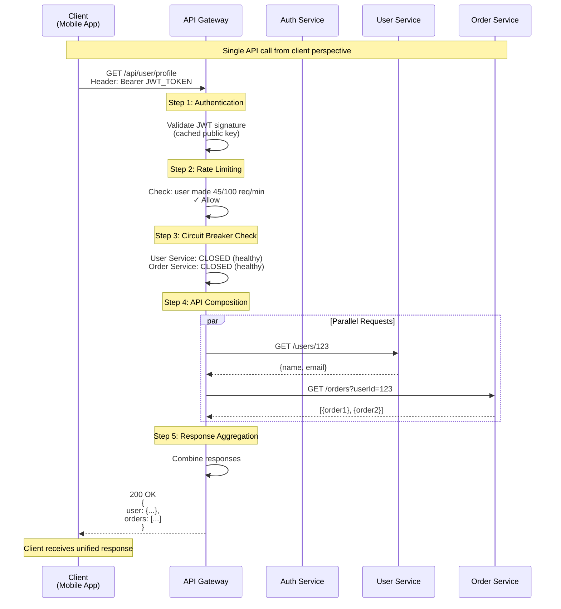
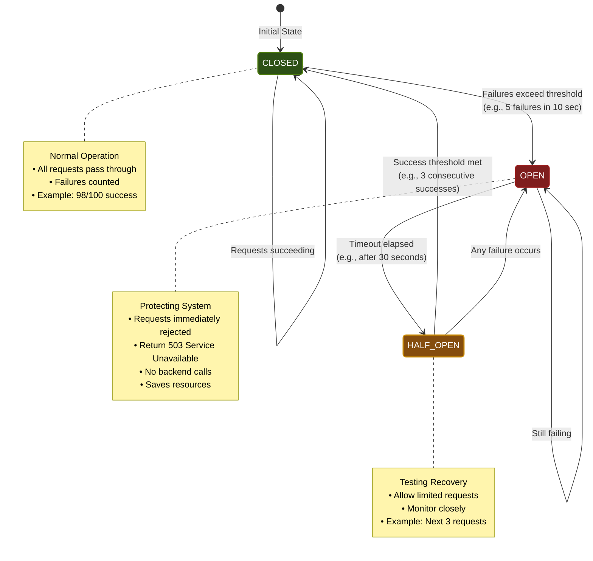
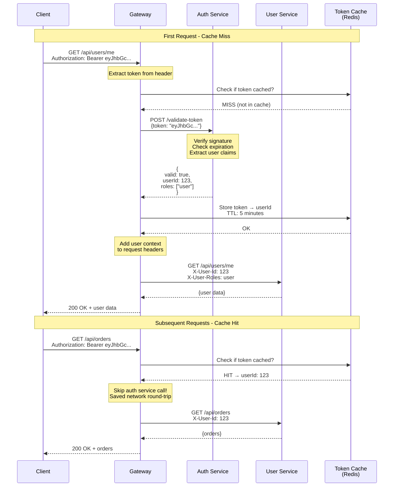
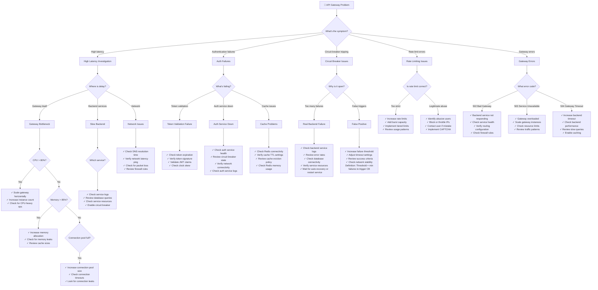

#system-design #building-block #networking #microservices

```table-of-contents
title: 
style: nestedList # TOC style (nestedList|nestedOrderedList|inlineFirstLevel)
minLevel: 0 # Include headings from the specified level
maxLevel: 0 # Include headings up to the specified level
include: 
exclude: 
includeLinks: true # Make headings clickable
hideWhenEmpty: false # Hide TOC if no headings are found
debugInConsole: false # Print debug info in Obsidian console
```
# API Gateway

## Intuition (30 sec)

A hotel concierge: guests (clients) don't wander through the hotel looking for housekeeping, room service, and the spa separately. They tell the concierge what they need, and the concierge routes the request to the right department. One point of contact for everything.

## Failure-First Scenario

> You have 15 microservices. Your mobile app makes 8 API calls per screen load, each to a different service URL. The app needs to know every service address, handle authentication separately per call, and deal with different response formats. One service moves to a new URL and the app breaks. You need a single entry point.

---

## Working Knowledge (5 min)

### Core Concept - Definition First

**API Gateway:**
- **Definition:** A server that acts as a single entry point for all client requests to backend microservices, handling routing, authentication, rate limiting, and request aggregation
- **Purpose:** Simplifies client communication by providing one address instead of requiring clients to know about and interact with multiple backend services
- **How it works:** Receives client requests at the edge, applies cross-cutting concerns (auth, rate limiting), routes to appropriate backend services, aggregates responses if needed, and returns results to the client

**Reverse Proxy:**
- **Definition:** A server that sits in front of backend servers and forwards client requests to the appropriate backend server
- **Purpose:** Hides backend server details from clients and provides a stable external interface
- **How it differs from API Gateway:** Reverse proxy focuses on basic forwarding and load balancing, while API Gateway adds application-level intelligence (authentication, transformation, aggregation)

##### Reverse Proxy

A **reverse proxy** sits between clients and backend servers, forwarding client requests to the appropriate server.

**Core Functions:**
- **Load balancing** - distributes traffic across multiple servers
- **SSL/TLS termination** - handles HTTPS encryption/decryption
- **Caching** - stores responses to reduce backend load
- **Compression** - reduces response sizes
- **Static content serving** - serves files directly without hitting backend

**Example flow:**
```
Client → Reverse Proxy → Backend Server(s)
                ↓
         (handles routing, SSL, caching)
```

**Popular tools:** Nginx, HAProxy, Apache, Traefik, Envoy

##### API Gateway

An **API gateway** is a specialized reverse proxy focused on API management with additional features.

**Everything a reverse proxy does, PLUS:**
- **Authentication/Authorization** - validates JWT tokens, OAuth, API keys
- **Rate limiting** - prevents abuse, throttles requests per user/IP
- **Request/response transformation** - modifies headers, bodies, formats
- **API versioning** - routes to different API versions
- **Analytics & monitoring** - tracks API usage, performance metrics
- **Protocol translation** - REST → GraphQL, HTTP → gRPC
- **Service discovery** - automatically finds backend services
- **Circuit breaking** - prevents cascading failures

**Example flow:**
```
Client → API Gateway → Microservices
            ↓
    (auth, rate limit, transform, route)
```

**Popular tools:** Kong, AWS API Gateway, Azure API Management, Apigee, Tyk

## Key Differences

| Feature | Reverse Proxy | API Gateway |
|---------|--------------|-------------|
| **Primary use** | General web traffic | API-specific traffic |
| **Authentication** | Basic (optional) | Advanced (JWT, OAuth, API keys) |
| **Rate limiting** | Basic | Per-user, per-endpoint, quotas |
| **Transformation** | Minimal | Extensive (headers, body, protocols) |
| **Analytics** | Basic logs | Detailed API metrics, usage tracking |
| **Complexity** | Simpler | More complex |
| **Best for** | Websites, simple APIs | Microservices, complex API ecosystems |

##### When to Use Each

**Use a Reverse Proxy when:**
- Serving websites or simple applications
- Need load balancing and SSL termination
- Want caching for performance
- Architecture is straightforward

**Use an API Gateway when:**
- Building microservices architecture
- Need sophisticated auth (API keys, OAuth, JWT)
- Require rate limiting per user/tenant
- Need request/response transformation
- Want detailed API analytics
- Managing multiple API versions

##### Real-World Example

**E-commerce site:**
```
                    ┌─── Web App (port 3000)
                    │
Internet → Nginx ───┼─── API Server (port 8080)
                    │
                    └─── Static CDN
```
→ Use **Nginx** (reverse proxy) for simplicity

**Microservices platform:**
```
                        ┌─── User Service
                        │
Mobile App ───┐         ├─── Order Service
              │         │
Web App ──────┤─ Kong ──┼─── Payment Service
              │         │
Partners ─────┘         ├─── Inventory Service
                        │
                        └─── Analytics Service
```
→ Use **Kong** (API gateway) for advanced features

##### Can You Use Both?

Yes! Common pattern:
```
Client → CDN → Reverse Proxy (SSL/Load Balance) → API Gateway (Auth/Rate Limit) → Services
```


**Key Terms:**
- **Request Routing:** Directing incoming requests to the correct backend service based on URL path, headers, or other criteria
- **Load Balancing:** Distributing requests across multiple instances of a service to prevent overload
- **Authentication:** Verifying the identity of the requester before allowing access to backend services
- **Rate Limiting:** Restricting the number of requests a client can make within a time window to prevent abuse
- **Circuit Breaker:** Automatically stopping requests to a failing service to prevent cascading failures
- **API Composition:** Combining responses from multiple backend services into a single response for the client

### Visual Model - Gateway Architecture

```
┌─────────────────────────────────────────────────────────────┐
│                     CLIENT LAYER                            │
│  ┌─────────────┐   ┌─────────────┐   ┌─────────────┐        │
│  │   Mobile    │   │  Web App    │   │  3rd Party  │        │
│  │     App     │   │             │   │    Client   │        │
│  └──────┬──────┘   └──────┬──────┘   └──────┬──────┘        │
└─────────┼─────────────────┼─────────────────┼───────────────┘
          │                 │                 │
          └─────────────────┼─────────────────┘
                            │
                   ┌────────▼────────┐
                   │   API GATEWAY   │
                   │  (Single Entry) │
                   └────────┬────────┘
                            │
          ┌─────────────────┼─────────────────┐
          │   Gateway Middleware Pipeline     │
          │                                   │
          │   1. Authentication & JWT Verify  │
          │   2. Rate Limiting Check          │
          │   3. Request Validation           │
          │   4. Routing Decision             │
          │   5. Load Balancing               │
          │   6. Circuit Breaker Check        │
          │   7. Request Transformation       │
          │                                   │
          └─────────────────┬─────────────────┘
                            │
          ┌─────────────────┼─────────────────┬──────────────┐
          │                 │                 │              │
     ┌────▼────┐      ┌─────▼─────┐    ┌─────▼──────┐  ┌───▼────┐
     │  Auth   │      │   User    │    │   Order    │  │Product │
     │ Service │      │  Service  │    │  Service   │  │Service │
     │  :8081  │      │   :8082   │    │   :8083    │  │ :8084  │
     └─────────┘      └───────────┘    └────────────┘  └────────┘
          │                 │                 │              │
          └─────────────────┼─────────────────┴──────────────┘
                            │
                      ┌─────▼──────┐
                      │  Database  │
                      │   Layer    │
                      └────────────┘
```

**Component Definitions:**
- **API Gateway:** Central routing server that receives all external requests
- **Middleware Pipeline:** Series of processing steps applied to each request in order
- **Backend Services:** Individual microservices that handle specific business capabilities
- **Authentication:** First line of defense - validates tokens and API keys
- **Circuit Breaker:** Protects system by stopping requests to failing services

### Request Flow Visualization



### Comparison Table - Gateway Features

| Feature | What It Does | When You Need It | Performance Impact |
|---------|-------------|------------------|-------------------|
| **Request Routing** | Maps URL paths to backend services | Always (core feature) | Minimal (~1ms) |
| **Load Balancing** | Distributes load across service instances | Multiple instances | Minimal (~0.5ms) |
| **Authentication** | Validates tokens/API keys | External clients | Low (~5-10ms with cache) |
| **Rate Limiting** | Prevents abuse with request quotas | Public APIs | Minimal (~1ms with Redis) |
| **Circuit Breaker** | Stops requests to failing services | Unreliable services | None (prevents waste) |
| **API Composition** | Combines multiple service calls | Mobile/complex UIs | Saves network RTTs |
| **Caching** | Stores frequently accessed responses | Read-heavy APIs | Saves backend load |
| **Request/Response Transform** | Converts formats (REST↔gRPC) | Protocol translation | Low (~5-20ms) |

---

## Layer 1: Conceptual Precision (15 min)

### Request Routing - Deep Definitions

**Request Routing:**
- **Formal Definition:** The process of examining an incoming HTTP request (URL path, headers, query parameters) and forwarding it to the appropriate backend service based on predefined rules
- **Simple Definition:** Looking at where a request wants to go and sending it to the right service
- **Analogy:** Like a mail sorter at the post office - reads the address and puts each letter in the correct bin
- **Related Terms:** Path-based routing (uses URL), header-based routing (uses HTTP headers), host-based routing (uses domain name)

**Why this matters:**
Routing is the fundamental job of an API Gateway. Without it, clients would need to know the address of every backend service. With routing, you can move, split, or merge services without changing client code. Routes can be updated in minutes, while updating mobile apps takes weeks.

### Circuit Breaker Pattern (Visual Flow)

**Circuit Breaker:**
- **Definition:** A design pattern that prevents an application from repeatedly trying to execute an operation that's likely to fail, allowing it to continue without waiting for the fault to be fixed
- **Purpose:** Protects your system from cascading failures and wasted resources on requests that will fail anyway
- **How it works:** Monitors failure rates and automatically "opens" (blocks requests) when failures exceed a threshold, then periodically checks if the service has recovered

**Key Terms:**
- **Closed State:** Normal operation - requests pass through, failures are counted
- **Open State:** Service is failing - requests are immediately rejected without trying
- **Half-Open State:** Testing if service recovered - allows limited requests through
- **Failure Threshold:** Number or percentage of failures that trigger the circuit to open
- **Timeout Window:** How long to wait before testing if service recovered
- **Success Threshold:** Number of successful requests needed to fully close the circuit



**State Definitions:**
- **CLOSED:** The circuit is closed (electricity flows) - normal operation where all requests go through to the backend service. Failures are counted but requests still attempt.
- **OPEN:** The circuit is open (electricity stops) - the service is considered down. All requests are immediately failed without calling the backend. Returns cached response or error.
- **HALF-OPEN:** Testing phase - allows a few requests through to check if the service has recovered. If they succeed, close the circuit. If they fail, open it again.

**Circuit Breaker Timeline Example:**

```
Time    │ Circuit State │ Event                        │ Action
────────┼───────────────┼──────────────────────────────┼─────────────────────
10:00   │ CLOSED        │ Normal operation             │ All requests pass
10:01   │ CLOSED        │ Database starts timing out   │ Count failures: 1, 2, 3...
10:02   │ CLOSED → OPEN │ 5th failure in 10 seconds   │ Circuit OPENS
        │               │ Threshold exceeded           │
10:02   │ OPEN          │ New request arrives          │ ✗ Immediately reject
        │               │                              │ Return: 503 Service Unavailable
10:02   │ OPEN          │ 100 more requests come       │ ✗ All rejected instantly
        │               │                              │ (Saved 100 failed calls!)
10:32   │ OPEN → HALF   │ 30 seconds elapsed          │ Time to test recovery
        │ HALF-OPEN     │                              │
10:32   │ HALF-OPEN     │ Allow 1 test request         │ Try backend...
        │               │ Request succeeds ✓           │ Success count: 1
10:32   │ HALF-OPEN     │ Allow 2nd test request       │ Try backend...
        │               │ Request succeeds ✓           │ Success count: 2
10:32   │ HALF-OPEN     │ Allow 3rd test request       │ Try backend...
        │               │ Request succeeds ✓           │ Success count: 3
10:32   │ HALF → CLOSED │ 3 successes reached          │ Circuit CLOSES
10:33   │ CLOSED        │ Normal operation resumed     │ All requests pass again
```

### Authentication Flow - Deep Definitions

**Authentication at Gateway:**
- **Definition:** The process of verifying the identity of a client (user or application) before allowing access to backend services
- **Purpose:** Centralize security checks so backend services don't need to implement authentication logic individually
- **How it works:** Gateway validates tokens (JWT, OAuth, API keys) on every request, rejecting invalid requests before they reach backend services

**Key Terms:**
- **JWT (JSON Web Token):** A compact, URL-safe token format containing encoded user information and a signature
- **Bearer Token:** An access token sent in the HTTP Authorization header (`Authorization: Bearer <token>`)
- **Token Validation:** Checking that a token is properly signed, not expired, and contains required claims
- **API Key:** A simple secret string that identifies an application
- **OAuth 2.0:** An authorization framework that issues time-limited tokens after user login



**Authentication Performance Trade-offs:**

```
Option 1: Validate Every Request with Auth Service
═══════════════════════════════════════════════════
Gateway → Auth Service → Response
  ├─ Latency: +20-50ms per request
  ├─ Load: High on auth service
  └─ Freshness: Immediate revocation possible

✓ Pros: Can revoke tokens instantly
✗ Cons: High latency, auth service bottleneck


Option 2: Cache Valid Tokens (Recommended)
═══════════════════════════════════════════
First request: Gateway → Auth Service → Cache
Later requests: Gateway → Cache (instant)
  ├─ Latency: +1-2ms per request
  ├─ Load: Minimal on auth service
  └─ Freshness: Delayed revocation (TTL window)

✓ Pros: Fast, scalable, low load
✗ Cons: Can't revoke immediately (5-15 min delay)


Option 3: JWT Self-Validation (No Auth Service)
═══════════════════════════════════════════════
Gateway validates JWT signature locally
  ├─ Latency: +0.5ms per request
  ├─ Load: Zero on auth service
  └─ Freshness: Cannot revoke until token expires

✓ Pros: Fastest, fully independent
✗ Cons: Cannot revoke tokens early


Recommended Hybrid: Cache (Option 2) + Local JWT validation
• Validate JWT signature locally (catch tampering)
• Cache userId mapping (avoid auth service calls)
• Use short token TTLs (5-15 minutes)
• Force re-authentication for sensitive operations
```

### Rate Limiting - Deep Definitions

**Rate Limiting:**
- **Formal Definition:** A technique that controls the rate at which users or applications can make requests to an API by setting quotas based on time windows (e.g., 100 requests per minute)
- **Simple Definition:** Putting a speed limit on how fast clients can make requests
- **Analogy:** Like a parking meter - you get a certain amount of time (requests), and when it runs out, you need to wait or pay more
- **Related Terms:** Throttling (gradually slowing down), quota enforcement, backpressure

**Why this matters:**
Without rate limiting, a single misbehaving client (malicious or buggy) can overwhelm your backend services, causing slow responses or crashes for all users. Rate limiting protects your infrastructure and ensures fair resource allocation.

**Rate Limiting Algorithms (Visual Comparison):**

```
1. Fixed Window
═════════════════════════════════════════
Time:   |---- Minute 1 ----|---- Minute 2 ----|
Limit:        100 requests       100 requests
Requests: ████████████████    ███

Problem: Burst at window boundary
   :59 sec → 100 requests ✓
   :01 sec → 100 requests ✓
   Total: 200 requests in 2 seconds!

Pros: Simple, low memory
Cons: Boundary burst allowed


2. Sliding Window Log
═════════════════════════════════════════
Time:   |←---- Last 60 seconds ----|
Track:  [t1, t2, t3, ..., t100]

Count requests with timestamp in last 60 sec
Remove old timestamps

Pros: Precise, no boundary issue
Cons: High memory (store all timestamps)


3. Sliding Window Counter (Recommended)
═════════════════════════════════════════
Time:   |-- Previous --|-- Current --|
        |    minute    |   minute    |
        |────────────────────────────|
                └─ Sliding 60s ─┘

Formula:
Rate = (Prev × overlap%) + Current

Example at :30 seconds:
  Previous minute: 80 requests
  Current minute: 40 requests
  Rate = (80 × 50%) + 40 = 80 requests

Pros: Accurate, low memory
Cons: Slightly complex calculation


4. Token Bucket (Best for Bursts)
═════════════════════════════════════════
Bucket capacity: 100 tokens
Refill rate: 10 tokens/second

    ┌─────────────┐
    │ 🪙🪙🪙🪙🪙  │  ← Bucket (current: 5 tokens)
    │ 🪙🪙🪙      │
    └─────────────┘
         ↑
    +10 tokens/sec

Request: Remove 1 token
No tokens? Request denied
Tokens refill constantly

Pros: Allows controlled bursts
Cons: More complex to implement
```

**Rate Limiting Configuration Example:**

```
┌─────────────────────────────────────────┐
│     RATE LIMIT TIERS                    │
├─────────────────────────────────────────┤
│                                         │
│ Anonymous:                              │
│   10 requests/minute                    │
│   100 requests/hour                     │
│   Use case: Unauthenticated users       │
│                                         │
│ Basic (Free tier):                      │
│   100 requests/minute                   │
│   10,000 requests/day                   │
│   Use case: Registered users            │
│                                         │
│ Premium:                                │
│   1,000 requests/minute                 │
│   100,000 requests/day                  │
│   Burst: 2,000/min for 10 seconds       │
│   Use case: Paid customers              │
│                                         │
│ Enterprise:                             │
│   10,000 requests/minute                │
│   Unlimited daily                       │
│   Burst: No limit                       │
│   Use case: Large partners              │
│                                         │
└─────────────────────────────────────────┘

Response when rate limited:
HTTP/1.1 429 Too Many Requests
X-RateLimit-Limit: 100
X-RateLimit-Remaining: 0
X-RateLimit-Reset: 1640000000
Retry-After: 42

{
  "error": "Rate limit exceeded",
  "message": "You have exceeded 100 requests per minute",
  "retryAfter": 42
}
```

### API Composition - Deep Definitions

**API Composition (Aggregation):**
- **Definition:** The pattern where an API Gateway makes multiple backend service calls in parallel or sequence, then combines the results into a single unified response for the client
- **Purpose:** Reduces the number of round trips between client and server, especially important for mobile apps on slow networks
- **How it works:** Gateway receives one request from client, makes N internal requests to different services, waits for all responses, merges them, and returns one response

**Problem Without Composition:**

```
Mobile app needs to display user profile screen:

Without Gateway Composition:
═══════════════════════════════════════════════════
Mobile         Network          Services
  │                                │
  ├──── Request 1: User info ─────▶ User Service
  │     (Latency: 100ms)           │
  ◄──── Response 1 ────────────────┤
  │                                │
  ├──── Request 2: Orders ─────────▶ Order Service
  │     (Latency: 100ms)           │
  ◄──── Response 2 ────────────────┤
  │                                │
  ├──── Request 3: Preferences ────▶ Settings Service
  │     (Latency: 100ms)           │
  ◄──── Response 3 ────────────────┤
  │                                │
  ├──── Request 4: Recommendations ▶ Recommendation
  │     (Latency: 100ms)           │
  ◄──── Response 4 ────────────────┤
  │
  └─ Total: 400ms + network overhead

Problems:
✗ 4 network round trips
✗ High latency on slow networks (4G: 50-200ms RTT)
✗ 4 separate TCP/TLS handshakes
✗ Client complexity (handle 4 async calls)
✗ Cannot start rendering until all 4 complete


With Gateway Composition:
═══════════════════════════════════════════════════
Mobile         Gateway          Services
  │               │                │
  ├─── One ──────▶│                │
  │   request     │                │
  │  (100ms)      ├─ User info ───▶ User Service
  │               ├─ Orders ───────▶ Order Service
  │               ├─ Preferences ──▶ Settings Service
  │               ├─ Recommend ────▶ Recommendation
  │               │                │
  │               │ (Parallel! Internal network is fast)
  │               │                │
  │               ◄─ All responses ┤
  │               │                │
  │               │ Combine        │
  │               │ responses      │
  │               │                │
  ◄─── One ───────┤                │
     response     │                │
  (120ms total)   │                │

Benefits:
✓ 1 network round trip (from client perspective)
✓ 70% latency reduction (400ms → 120ms)
✓ 1 TCP/TLS handshake
✓ Client simplicity (one call, one response)
✓ Can start rendering immediately
```

**API Composition Strategies:**

```
Strategy 1: Sequential Composition
═══════════════════════════════════
Request 1 → Response 1 (need this first)
              ↓
         Request 2 → Response 2 (depends on 1)
                       ↓
                  Request 3 → Response 3

Example: Get user → Get user's team → Get team's projects

Pros: Simple, handles dependencies
Cons: Slowest (latencies add up)


Strategy 2: Parallel Composition (Recommended)
═══════════════════════════════════
     ┌→ Request 1 → Response 1
     ├→ Request 2 → Response 2
     ├→ Request 3 → Response 3
     └→ Request 4 → Response 4
           ↓
    Combine all responses

Example: Get user, orders, recommendations (independent)

Pros: Fastest, maximum throughput
Cons: Cannot handle dependencies


Strategy 3: Hybrid (Parallel + Sequential)
═══════════════════════════════════
Phase 1 (Parallel):
  ┌→ Request A → Response A
  └→ Request B → Response B
        ↓
Phase 2 (use results from phase 1):
  ┌→ Request C (needs A) → Response C
  └→ Request D (needs B) → Response D

Example:
  Phase 1: Get user + Get catalog
  Phase 2: Get user's orders + Get personalized recommendations

Pros: Balance speed and dependencies
Cons: More complex implementation
```

### Backend for Frontend (BFF) Pattern

**BFF (Backend for Frontend):**
- **Definition:** A design pattern where you create separate API gateways optimized for each client type (mobile, web, admin) rather than one gateway serving all clients
- **Purpose:** Different clients have different needs - mobile needs small payloads, web can handle more data, admin needs all fields
- **How it works:** Each BFF gateway knows its client's constraints and requirements, making tailored API calls and returning optimized responses

```
Traditional Single Gateway (One Size Fits All):
═══════════════════════════════════════════════════

┌──────────┐      ┌──────────┐      ┌──────────┐
│  Mobile  │      │   Web    │      │  Admin   │
│   App    │      │   App    │      │ Console  │
└────┬─────┘      └────┬─────┘      └────┬─────┘
     │                 │                  │
     └─────────────────┼──────────────────┘
                       │
             ┌─────────▼─────────┐
             │   API GATEWAY     │
             │ (Generic for all) │
             └─────────┬─────────┘
                       │
          ┌────────────┼────────────┐
          ▼            ▼            ▼
     Services      Services     Services

Problems:
✗ Mobile gets too much data (wastes bandwidth)
✗ Web doesn't get enough data (needs extra calls)
✗ Admin needs special permissions (complex logic)
✗ Gateway code becomes complex with if/else for each client


BFF Pattern (Optimized for Each Client):
═══════════════════════════════════════════════════

┌──────────┐      ┌──────────┐      ┌──────────┐
│  Mobile  │      │   Web    │      │  Admin   │
│   App    │      │   App    │      │ Console  │
└────┬─────┘      └────┬─────┘      └────┬─────┘
     │                 │                  │
     ▼                 ▼                  ▼
┌─────────┐       ┌─────────┐       ┌─────────┐
│ Mobile  │       │   Web   │       │  Admin  │
│   BFF   │       │   BFF   │       │   BFF   │
└────┬────┘       └────┬────┘       └────┬────┘
     │                 │                  │
     └─────────────────┼──────────────────┘
                       │
          ┌────────────┼────────────┐
          ▼            ▼            ▼
     Services      Services     Services


Mobile BFF:
  • Returns minimal data (save bandwidth)
  • Aggressive response compression
  • Image URLs in low-res format
  • Fields: [id, name, thumbnail]

Web BFF:
  • Returns richer data
  • Multiple image resolutions
  • Includes metadata for SEO
  • Fields: [id, name, images[], description, metadata]

Admin BFF:
  • Returns ALL data including internal fields
  • Includes audit logs
  • Admin-only operations (delete, ban)
  • Fields: [all fields + createdAt, updatedAt, createdBy]
```

**BFF Example Response Differences:**

```json
// Mobile BFF - Minimal payload (32 KB)
{
  "id": 123,
  "name": "Product Name",
  "price": 29.99,
  "image": "https://cdn.example.com/thumb_100x100.jpg",
  "available": true
}

// Web BFF - Rich payload (128 KB)
{
  "id": 123,
  "name": "Product Name",
  "description": "Long description with HTML...",
  "price": 29.99,
  "comparePrice": 39.99,
  "images": [
    "https://cdn.example.com/1024x1024.jpg",
    "https://cdn.example.com/512x512.jpg"
  ],
  "available": true,
  "stock": 42,
  "reviews": {
    "average": 4.5,
    "count": 128
  },
  "metadata": {
    "title": "Product Name - Buy Now",
    "description": "SEO description...",
    "ogImage": "https://cdn.example.com/og.jpg"
  }
}

// Admin BFF - Complete payload (256 KB)
{
  "id": 123,
  "name": "Product Name",
  "description": "Long description...",
  "price": 29.99,
  "costPrice": 15.00,
  "margin": 14.99,
  "available": true,
  "stock": 42,
  "warehouse": "US-EAST-1",
  "supplierId": 456,
  "sku": "PROD-123-ABC",
  "barcode": "123456789012",
  "weight": 1.5,
  "dimensions": {"l": 10, "w": 8, "h": 3},
  "createdAt": "2025-01-01T00:00:00Z",
  "updatedAt": "2025-02-01T12:34:56Z",
  "createdBy": "admin@example.com",
  "tags": ["electronics", "featured"],
  "internalNotes": "Handle with care",
  "auditLog": [...]
}
```

---

## Layer 2: Technology-Specific Examples (20 min)

### Technology Comparison

**Tool Category:** API Gateway Solutions

| Spring Cloud Gateway | Kong | AWS API Gateway |
|---------------------|------|-----------------|
| **Definition:** Java-based gateway built on Spring WebFlux reactive framework | **Definition:** Open-source gateway built on Nginx and Lua, with plugin architecture | **Definition:** Fully managed AWS service for creating and managing APIs |
| **Best For:** Spring Boot microservices | **Best For:** Polyglot services, large plugin ecosystem | **Best For:** Serverless architectures, AWS Lambda |
| ⭐⭐⭐⭐ Java Integration | ⭐⭐⭐⭐⭐ Plugin Ecosystem | ⭐⭐⭐⭐⭐ Managed Service |
| ⭐⭐⭐ Performance | ⭐⭐⭐⭐⭐ Performance | ⭐⭐⭐⭐ Performance |
| ⭐⭐⭐⭐⭐ Spring Ecosystem | ⭐⭐⭐⭐ Language Agnostic | ⭐⭐⭐⭐⭐ AWS Integration |
| Self-hosted | Self-hosted or managed | Fully managed |
| Free (open source) | Free + Enterprise | Pay per request |

### Spring Cloud Gateway Configuration (Annotated)

```yaml
# application.yml - Complete Spring Cloud Gateway Setup

spring:
  cloud:
    gateway:
      # Global CORS configuration
      globalcors:
        corsConfigurations:
          '[/**]':                      # Apply to all routes
            allowedOrigins:
              - "https://example.com"   # Allowed domains
              - "https://app.example.com"
            allowedMethods:             # Allowed HTTP methods
              - GET
              - POST
              - PUT
              - DELETE
            allowedHeaders: "*"         # Allowed request headers
            maxAge: 3600                # Cache preflight for 1 hour

      # Route definitions
      routes:
        # Route 1: User Service
        - id: user-service              # Unique route identifier
          uri: lb://USER-SERVICE        # Load balance to USER-SERVICE instances
                                        # lb:// = use Spring Cloud LoadBalancer
          predicates:                   # Conditions for this route
            - Path=/api/users/**        # Match URL pattern
            - Method=GET,POST           # Only these HTTP methods
          filters:                      # Transformations applied to requests
            - StripPrefix=1             # Remove /api from path
                                        # /api/users/123 → /users/123
            - name: CircuitBreaker      # Enable circuit breaker
              args:
                name: userServiceCB     # Circuit breaker name
                fallbackUri: forward:/fallback/users  # Fallback endpoint
            - name: RequestRateLimiter  # Enable rate limiting
              args:
                redis-rate-limiter.replenishRate: 100  # Tokens per second
                redis-rate-limiter.burstCapacity: 200  # Max burst size
                key-resolver: "#{@userKeyResolver}"    # How to identify users
            - name: Retry               # Auto-retry failed requests
              args:
                retries: 3              # Max retry attempts
                statuses: BAD_GATEWAY   # Retry on 502 errors
                backoff:                # Exponential backoff
                  firstBackoff: 50ms    # Wait 50ms, then 100ms, then 200ms
                  maxBackoff: 500ms
                  factor: 2

        # Route 2: Order Service
        - id: order-service
          uri: lb://ORDER-SERVICE
          predicates:
            - Path=/api/orders/**
            - Header=Authorization, Bearer.*  # Require Authorization header
          filters:
            - StripPrefix=1
            - name: AddRequestHeader
              args:
                name: X-Gateway          # Add custom header
                value: Spring-Cloud-Gateway
            - name: CircuitBreaker
              args:
                name: orderServiceCB
                fallbackUri: forward:/fallback/orders
            - name: RequestRateLimiter
              args:
                redis-rate-limiter.replenishRate: 50   # Lower limit for orders
                redis-rate-limiter.burstCapacity: 100

        # Route 3: Product Service (Public - No Auth)
        - id: product-service
          uri: lb://PRODUCT-SERVICE
          predicates:
            - Path=/api/products/**
          filters:
            - StripPrefix=1
            - name: CacheRequestBody     # Cache for read operations
              args:
                ttl: 60                  # Cache for 60 seconds

      # Default filters (applied to ALL routes)
      default-filters:
        - name: AddResponseHeader
          args:
            name: X-Response-Time
            value: "#{T(System).currentTimeMillis()}"  # Add timestamp
        - name: SecureHeaders          # Add security headers
        - name: RemoveRequestHeader
          args:
            name: Cookie               # Don't forward cookies to services

# Redis configuration (for rate limiting)
redis:
  host: localhost
  port: 6379
  database: 0
  timeout: 2000ms                      # Connection timeout

# Resilience4j Circuit Breaker configuration
resilience4j:
  circuitbreaker:
    instances:
      userServiceCB:
        registerHealthIndicator: true   # Expose CB state in health endpoint
        slidingWindowSize: 10          # Last 10 requests considered
        minimumNumberOfCalls: 5        # Min calls before CB can open
        failureRateThreshold: 50       # Open if 50% fail
        waitDurationInOpenState: 30s   # Wait 30s before half-open
        permittedNumberOfCallsInHalfOpenState: 3  # Test with 3 requests
        automaticTransitionFromOpenToHalfOpenEnabled: true

      orderServiceCB:
        slidingWindowSize: 10
        minimumNumberOfCalls: 5
        failureRateThreshold: 50
        waitDurationInOpenState: 30s
        permittedNumberOfCallsInHalfOpenState: 3

# Monitoring and actuator
management:
  endpoints:
    web:
      exposure:
        include: health,metrics,gateway  # Expose endpoints
  endpoint:
    health:
      show-details: always             # Show detailed health info
    gateway:
      enabled: true                    # Enable gateway actuator

# Logging
logging:
  level:
    org.springframework.cloud.gateway: DEBUG  # Debug gateway routing
    reactor.netty: INFO                # Netty (reactive) logs
```

**Key Configuration Concepts:**

- **Predicates:** Conditions that must be true for a route to match (Path, Method, Header, Query parameters)
- **Filters:** Transformations applied to requests/responses (Add/Remove headers, Rate limit, Retry, Circuit breaker)
- **Load Balancer (lb://):** Automatically distributes requests across multiple service instances
- **StripPrefix:** Removes N segments from URL path before forwarding (allows different external/internal paths)
- **Circuit Breaker:** Protects against cascading failures by stopping requests to failing services
- **Rate Limiter:** Prevents abuse by limiting requests per user per time window

### Kong Configuration (Annotated)

```yaml
# kong.yml - Declarative Configuration

_format_version: "3.0"

# Services: Backend APIs you want to expose
services:
  # User Service
  - name: user-service              # Service name
    url: http://user-service:8080   # Backend URL
    retries: 3                      # Retry failed requests 3 times
    connect_timeout: 5000           # 5 second connection timeout
    write_timeout: 60000            # 60 second write timeout
    read_timeout: 60000             # 60 second read timeout

    routes:                         # Routes that point to this service
      - name: user-routes
        paths:
          - /api/users              # URL path prefix
        methods:
          - GET
          - POST
          - PUT
          - DELETE
        strip_path: true            # Remove /api/users before forwarding

    plugins:                        # Plugins applied to this service
      # Authentication
      - name: jwt                   # JWT authentication plugin
        config:
          key_claim_name: kid       # JWT key ID claim
          secret_is_base64: false

      # Rate limiting
      - name: rate-limiting
        config:
          minute: 100               # 100 requests per minute
          hour: 5000                # 5000 requests per hour
          policy: redis             # Store counters in Redis
          redis_host: redis
          redis_port: 6379
          redis_database: 0
          fault_tolerant: true      # Don't fail if Redis is down

      # Circuit breaker
      - name: proxy-cache           # Cache responses
        config:
          strategy: memory          # Cache in memory
          content_type:             # Cache these content types
            - application/json
          cache_ttl: 60             # Cache for 60 seconds
          cache_control: false      # Ignore Cache-Control headers

      # Logging
      - name: file-log              # Log to file
        config:
          path: /var/log/kong/user-service.log
          reopen: true

  # Order Service
  - name: order-service
    url: http://order-service:8080
    retries: 3

    routes:
      - name: order-routes
        paths:
          - /api/orders
        strip_path: true

    plugins:
      - name: jwt
      - name: rate-limiting
        config:
          minute: 50                # Lower limit for orders
          hour: 2000
          policy: redis
          redis_host: redis
          redis_port: 6379

      # Request transformation
      - name: request-transformer
        config:
          add:
            headers:
              - X-Service:order-service     # Add custom header
            querystring: []
          remove:
            headers:
              - X-Internal                  # Remove internal headers

  # Public Product Service (No Auth)
  - name: product-service
    url: http://product-service:8080

    routes:
      - name: product-routes
        paths:
          - /api/products
        strip_path: true

    plugins:
      # CORS
      - name: cors
        config:
          origins:
            - https://example.com
            - https://app.example.com
          methods:
            - GET
            - POST
          headers:
            - Accept
            - Content-Type
            - Authorization
          exposed_headers:
            - X-RateLimit-Limit
            - X-RateLimit-Remaining
          credentials: true
          max_age: 3600

      # Higher rate limit for public API
      - name: rate-limiting
        config:
          minute: 1000
          hour: 50000
          policy: redis
          redis_host: redis
          redis_port: 6379

# Global plugins (applied to ALL routes)
plugins:
  # Request ID for tracing
  - name: correlation-id
    config:
      header_name: X-Request-ID         # Add unique ID to each request
      generator: uuid                   # Use UUID generator
      echo_downstream: true             # Include in response

  # Security headers
  - name: response-transformer
    config:
      add:
        headers:
          - X-Frame-Options:DENY            # Prevent clickjacking
          - X-Content-Type-Options:nosniff  # Prevent MIME sniffing
          - Strict-Transport-Security:max-age=31536000  # Force HTTPS

  # IP restriction (optional)
  # - name: ip-restriction
  #   config:
  #     allow:
  #       - 10.0.0.0/8      # Allow internal network
  #       - 172.16.0.0/12

# Upstreams: Load balancing configuration
upstreams:
  - name: user-service-upstream
    algorithm: round-robin              # Load balancing algorithm
    hash_on: none
    hash_fallback: none
    healthchecks:                       # Health check configuration
      active:
        healthy:
          interval: 10                  # Check every 10 seconds
          successes: 2                  # 2 successes = healthy
        unhealthy:
          interval: 10
          tcp_failures: 3               # 3 failures = unhealthy
          timeouts: 3
          http_failures: 3
        type: http
        http_path: /actuator/health     # Health check endpoint
    targets:                            # Backend instances
      - target: user-service-1:8080
        weight: 100
      - target: user-service-2:8080
        weight: 100
      - target: user-service-3:8080
        weight: 50                      # Lower weight = less traffic
```

**Key Kong Concepts:**

- **Services:** Backend APIs you're exposing through Kong
- **Routes:** URL paths and methods that map to services
- **Plugins:** Modular functionality (auth, rate limiting, caching, logging)
- **Upstreams:** Load balancer configuration with multiple backend targets
- **Health Checks:** Automatic detection of unhealthy backend instances
- **Global Plugins:** Applied to all routes automatically

**Popular Kong Plugins:**

```
Authentication:
├─ jwt: JWT token validation
├─ key-auth: API key authentication
├─ oauth2: OAuth 2.0 provider
├─ basic-auth: Basic HTTP authentication
└─ ldap-auth: LDAP authentication

Traffic Control:
├─ rate-limiting: Request rate limits
├─ request-size-limiting: Max request body size
├─ response-ratelimiting: Response-based limits
└─ acl: Access control lists

Analytics & Monitoring:
├─ prometheus: Prometheus metrics
├─ datadog: DataDog integration
├─ file-log: Log to file
└─ http-log: Log to HTTP endpoint

Transformations:
├─ request-transformer: Modify requests
├─ response-transformer: Modify responses
├─ correlation-id: Add request IDs
└─ request-termination: Return custom responses

Security:
├─ ip-restriction: Whitelist/blacklist IPs
├─ bot-detection: Block bots
├─ cors: CORS headers
└─ hmac-auth: HMAC signature validation
```

### API Gateway Setup Flow

```
Phase 1: Install & Bootstrap
┌─────────────────────────────┐
│ Install Gateway             │
│ • Spring: Add dependencies  │
│ • Kong: Docker/K8s          │
│ • AWS: Create in console    │
└──────────┬──────────────────┘
           │
           ▼
Phase 2: Configure Routes
┌─────────────────────────────┐
│ Define URL routing          │
│ • /api/users → User Service │
│ • /api/orders → Order Svc   │
│ • Load balancing enabled    │
└──────────┬──────────────────┘
           │
           ▼
Phase 3: Add Security
┌─────────────────────────────┐
│ Enable authentication       │
│ • JWT validation            │
│ • API key checking          │
│ • Token caching in Redis    │
└──────────┬──────────────────┘
           │
           ▼
Phase 4: Enable Protection
┌─────────────────────────────┐
│ Add rate limiting           │
│ Add circuit breakers        │
│ Configure timeouts          │
│ Set retry policies          │
└──────────┬──────────────────┘
           │
           ▼
Phase 5: Observability
┌─────────────────────────────┐
│ Configure logging           │
│ Enable metrics (Prometheus) │
│ Add distributed tracing     │
│ Set up health checks        │
└──────────┬──────────────────┘
           │
           ▼
Phase 6: Test & Deploy
┌─────────────────────────────┐
│ Load test the gateway       │
│ Test failover scenarios     │
│ Deploy with redundancy      │
│ Monitor in production       │
└─────────────────────────────┘
```

---

## Layer 3: Production-Ready Details (30 min)

### Production Architecture (Fully Annotated)

```
                        🌍 Internet
                            │
                   DNS: api.example.com
                            │
               ┌────────────▼────────────┐
               │     CDN (CloudFlare)    │
               │                         │
               │ Purpose: Cache static   │
               │          DDoS protection│
               │          SSL termination│
               └────────────┬────────────┘
                            │
               ┌────────────▼────────────┐
               │  Global Load Balancer   │
               │  (Route53 / CloudFlare) │
               │                         │
               │ Purpose: Geographic     │
               │          routing        │
               │ Method: Latency-based   │
               └────────────┬────────────┘
                            │
          ┌─────────────────┼─────────────────┐
          │                 │                 │
    ┌─────▼──────┐    ┌─────▼──────┐   ┌─────▼──────┐
    │  Region    │    │  Region    │   │  Region    │
    │  US-EAST   │    │  US-WEST   │   │  EU-WEST   │
    └─────┬──────┘    └─────┬──────┘   └─────┬──────┘
          │                 │                 │
          │   Each region has identical stack:
          │
    ┌─────▼──────────────────────────┐
    │   Layer 7 Load Balancer        │
    │   (ALB / HAProxy)              │
    │                                │
    │ • Health checks: /health       │
    │ • Interval: 10 seconds         │
    │ • Path-based routing           │
    │ • SSL termination              │
    │ • Sticky sessions enabled      │
    └─────┬──────────────────────────┘
          │
    ┌─────┴────────────────────────────────────┐
    │      API Gateway Cluster (Auto-scaling)  │
    │                                          │
    │  ┌──────────┐ ┌──────────┐ ┌──────────┐│
    │  │Gateway 1 │ │Gateway 2 │ │Gateway N ││
    │  │ :8080    │ │ :8080    │ │ :8080    ││
    │  │          │ │          │ │          ││
    │  │ Features:│ │ Features:│ │ Features:││
    │  │ • Auth   │ │ • Auth   │ │ • Auth   ││
    │  │ • Rate   │ │ • Rate   │ │ • Rate   ││
    │  │   limit  │ │   limit  │ │   limit  ││
    │  │ • Circuit│ │ • Circuit│ │ • Circuit││
    │  │   breaker│ │   breaker│ │   breaker││
    │  │ • Routing│ │ • Routing│ │ • Routing││
    │  └────┬─────┘ └────┬─────┘ └────┬─────┘│
    └───────┼────────────┼────────────┼───────┘
            │            │            │
            └────────────┼────────────┘
                         │
       ┌─────────────────┼─────────────────┬──────────────┐
       │                 │                 │              │
  ┌────▼─────┐     ┌─────▼──────┐   ┌─────▼──────┐  ┌───▼────────┐
  │  Auth    │     │   User     │   │   Order    │  │  Product   │
  │ Service  │     │  Service   │   │  Service   │  │  Service   │
  │  :8081   │     │   :8082    │   │   :8083    │  │   :8084    │
  │          │     │            │   │            │  │            │
  │ 3 inst.  │     │ 5 inst.    │   │ 4 inst.    │  │ 3 inst.    │
  └────┬─────┘     └─────┬──────┘   └─────┬──────┘  └────┬───────┘
       │                 │                 │              │
       └─────────────────┼─────────────────┴──────────────┘
                         │
       ┌─────────────────┼──────────────────┬─────────────┐
       │                 │                  │             │
  ┌────▼──────┐    ┌─────▼──────┐    ┌─────▼──────┐  ┌──▼────────┐
  │  Redis    │    │PostgreSQL  │    │PostgreSQL  │  │  Kafka    │
  │  Cluster  │    │  Primary   │    │  Replica 1 │  │  Cluster  │
  │           │    │            │    │  (read)    │  │           │
  │ Purpose:  │    │ Purpose:   │    │            │  │ Purpose:  │
  │ • Cache   │    │ • Write ops│    │ Purpose:   │  │ • Async   │
  │ • Rate    │    │ • Master DB│    │ • Read ops │  │   events  │
  │   limit   │    │            │    │ • Reporting│  │ • Message │
  │   counter │    │            │    │            │  │   queue   │
  │ • Session │    │            │    │            │  │           │
  │   store   │    │            │    │            │  │           │
  │           │    │            │    └─────┬──────┘  │           │
  │ 3 nodes   │    │            │          │         │ 3 brokers │
  │ Sentinel  │    │            │    ┌─────▼──────┐ │           │
  └───────────┘    │            │    │PostgreSQL  │ └───────────┘
                   │            │    │  Replica 2 │
                   │            │    │  (read)    │
                   │            │    └────────────┘
                   │            │
                   │ Replication│
                   └────────────┘

┌─────────────────────────────────────────────────────┐
│             MONITORING & OBSERVABILITY              │
├─────────────────────────────────────────────────────┤
│                                                     │
│  Prometheus                 Grafana                 │
│  • Scrape metrics          • Dashboards             │
│    every 15s               • Alerts                 │
│  • Gateway metrics         • Visualization          │
│  • Service metrics                                  │
│  • Infrastructure                                   │
│                                                     │
│  Jaeger / Zipkin            ELK Stack               │
│  • Distributed tracing     • Centralized logs       │
│  • Request flow            • Log aggregation        │
│  • Latency breakdown       • Search & analysis      │
└─────────────────────────────────────────────────────┘
```

**Architecture Component Definitions:**

- **CDN (Content Delivery Network):** Caches static content at edge locations worldwide, reducing latency and protecting origin servers from traffic spikes
- **Global Load Balancer:** Routes users to the nearest geographic region based on latency or health checks
- **Regional Load Balancer:** Distributes traffic among gateway instances within a region, removes unhealthy instances
- **API Gateway Cluster:** Horizontally scaled gateway instances that handle all client requests, apply security and routing logic
- **Service Mesh:** Internal service-to-service communication layer (not shown but often used alongside gateway)
- **Redis Cluster:** In-memory data store for caching, rate limit counters, and session storage
- **PostgreSQL Primary:** Main database for write operations, source of truth for all data
- **PostgreSQL Replicas:** Read-only database copies for scaling read operations and reporting
- **Kafka Cluster:** Distributed event streaming platform for asynchronous communication between services

### Monitoring Dashboard (Visual Metrics)

```
╔═══════════════════════════════════════════════════════════════╗
║              API GATEWAY MONITORING DASHBOARD                 ║
╠═══════════════════════════════════════════════════════════════╣
║                                                               ║
║  🔵 Request Rate (QPS)                                        ║
║  ▬▬▬▬▬▬▬▬▬▬▬▬▬▬▬▬▬▬▬▬▬▬▬▬▬▬▬▬▬▬▬▬▬▬▬▬▬▬▬▬▬▬▬▬              ║
║  Current: 12,847 req/sec    ▲ 8% from last hour              ║
║  Peak today: 15,234 req/sec at 14:23                         ║
║                                                               ║
║  Definition: Number of requests per second hitting gateway   ║
║  Why track: Indicates load, helps capacity planning          ║
║  Alert when: > 20,000 req/sec (80% capacity)                 ║
║                                                               ║
╠═══════════════════════════════════════════════════════════════╣
║                                                               ║
║  🟢 Success Rate                                              ║
║  ▰▰▰▰▰▰▰▰▰▰▰▰▰▰▰▰▰▰▰▰▰▰▰▰▰▰▰▰▰▰▰▰▰▰▰▰▰▰▰▱                  ║
║  99.82% (12,824 success / 12,847 total)                      ║
║  2xx: 99.82%  │  4xx: 0.15%  │  5xx: 0.03%                   ║
║                                                               ║
║  Definition: Percentage of requests returning 2xx status     ║
║  Why track: Overall system health indicator                  ║
║  Alert when: < 99.5% (indicates problems)                    ║
║                                                               ║
╠═══════════════════════════════════════════════════════════════╣
║                                                               ║
║  🟡 Latency Distribution                                      ║
║  ▬▬▬▬▬▬▬▬▬▬▬▬▬▬▬▬▬▬▬▬▬▬▬▬▬▬▬▬░░░░░░░░░░░░░                ║
║  P50: 45ms   │  P90: 98ms   │  P95: 142ms  │  P99: 285ms   ║
║                                                               ║
║  Definition: Request latency percentiles                     ║
║  P50: 50% of requests faster than this                       ║
║  P99: 99% of requests faster than this                       ║
║  Why track: User experience indicator                        ║
║  Alert when: P99 > 500ms                                     ║
║                                                               ║
╠═══════════════════════════════════════════════════════════════╣
║                                                               ║
║  🟠 Circuit Breaker States                                    ║
║  ┌──────────────────┬──────────┬──────────┬──────────┐      ║
║  │ Service          │ State    │ Failures │ Last Try │      ║
║  ├──────────────────┼──────────┼──────────┼──────────┤      ║
║  │ user-service     │ 🟢 CLOSED│    0     │    -     │      ║
║  │ order-service    │ 🟢 CLOSED│    2     │    -     │      ║
║  │ payment-service  │ 🟡 HALF  │    -     │  12s ago │      ║
║  │ inventory-svc    │ 🔴 OPEN  │   15     │  45s ago │      ║
║  │ recommend-svc    │ 🟢 CLOSED│    1     │    -     │      ║
║  └──────────────────┴──────────┴──────────┴──────────┘      ║
║                                                               ║
║  Definition: Circuit breaker protects against failing svcs   ║
║  CLOSED: Normal (requests pass through)                      ║
║  OPEN: Service failing (requests blocked)                    ║
║  HALF-OPEN: Testing recovery (limited requests)              ║
║  Why track: Prevents cascading failures                      ║
║                                                               ║
╠═══════════════════════════════════════════════════════════════╣
║                                                               ║
║  🔴 Error Rate by Status Code                                 ║
║  ▬░░░░░░░░░░░░░░░░░░░░░░░░░░░░░░░░░░░░░░░░░░░░              ║
║  Total errors: 23 errors/sec (0.18% error rate)              ║
║                                                               ║
║  400 Bad Request:        8/sec  (Invalid input)              ║
║  401 Unauthorized:       5/sec  (Missing/invalid token)      ║
║  403 Forbidden:          3/sec  (Insufficient permissions)   ║
║  404 Not Found:          2/sec  (Resource missing)           ║
║  429 Too Many Requests:  1/sec  (Rate limit hit)             ║
║  500 Internal Error:     3/sec  (Backend crash) ⚠️           ║
║  502 Bad Gateway:        1/sec  (Backend timeout) ⚠️         ║
║                                                               ║
║  Definition: Breakdown of error responses by status code     ║
║  Why track: Identify error patterns and root causes          ║
║  Alert when: 5xx errors > 10/sec (backend problems)          ║
║                                                               ║
╠═══════════════════════════════════════════════════════════════╣
║                                                               ║
║  🟣 Rate Limiting Status                                      ║
║  ┌──────────────────────────────────────────────────┐        ║
║  │ Active rate limits: 1,247 users                  │        ║
║  │ Rate limited (last minute): 23 requests          │        ║
║  │ Top offenders:                                   │        ║
║  │   • user_id:8472  →  152/100 req/min  (blocked) │        ║
║  │   • api_key:abc   →  128/100 req/min  (blocked) │        ║
║  │   • IP:1.2.3.4    →  115/100 req/min  (blocked) │        ║
║  └──────────────────────────────────────────────────┘        ║
║                                                               ║
║  Definition: Rate limiting enforcement statistics            ║
║  Why track: Identify abuse and adjust limits                 ║
║  Alert when: > 1000 blocked requests/min (DDoS?)             ║
║                                                               ║
╠═══════════════════════════════════════════════════════════════╣
║                                                               ║
║  🟤 Gateway Resource Usage                                    ║
║  ┌─────────────────────────────────────┐                     ║
║  │ CPU:        [▰▰▰▰▰▰▰░░░] 72%        │                     ║
║  │ Memory:     [▰▰▰▰▰▰░░░░] 58%        │                     ║
║  │ Network In:  2.4 Gbps               │                     ║
║  │ Network Out: 1.8 Gbps               │                     ║
║  │ Connections: 8,429 / 10,000         │                     ║
║  └─────────────────────────────────────┘                     ║
║                                                               ║
║  Definition: Gateway server resource utilization             ║
║  Why track: Capacity planning and autoscaling triggers       ║
║  Alert when: CPU > 80% or Memory > 85%                       ║
║                                                               ║
╠═══════════════════════════════════════════════════════════════╣
║                                                               ║
║  🟢 Cache Hit Rate                                            ║
║  ▰▰▰▰▰▰▰▰▰▰▰▰▰▰▰▰▰▰▰▰▰▰▰▰▰▰▰▰▰▰▰▰░░░░░                     ║
║  Hit rate: 87.3%  (11,214 hits / 12,847 requests)            ║
║  Miss rate: 12.7%  (1,633 misses)                            ║
║                                                               ║
║  Top cached endpoints:                                       ║
║    • GET /api/products      →  95% hit rate                  ║
║    • GET /api/categories    →  92% hit rate                  ║
║    • GET /api/users/profile →  78% hit rate                  ║
║                                                               ║
║  Definition: Percentage of requests served from cache        ║
║  Why track: Cache effectiveness, reduce backend load         ║
║  Alert when: < 70% hit rate (cache not effective)            ║
║                                                               ║
╠═══════════════════════════════════════════════════════════════╣
║                                                               ║
║  Recent Critical Events (Last 5 minutes):                    ║
║  • 14:28:42  Circuit breaker OPENED: inventory-service       ║
║  • 14:27:15  High latency detected: P99 = 847ms              ║
║  • 14:26:03  Rate limit exceeded by user_id:8472             ║
║  • 14:24:30  5xx error spike: payment-service (12/sec)       ║
║                                                               ║
╚═══════════════════════════════════════════════════════════════╝
```

**Metric Definitions:**

- **QPS (Queries Per Second):** Rate of incoming requests - the rate of traffic hitting the gateway
- **Success Rate:** Percentage of requests that return 2xx status codes (successful responses)
- **Latency Percentiles:** Distribution of response times - P99 means 99% of requests are faster than this value
- **Circuit Breaker State:** Current protection status for each backend service
- **Error Rate:** Percentage of requests that fail (4xx or 5xx responses)
- **Rate Limit Enforcement:** Number of requests blocked due to exceeding quotas
- **Cache Hit Rate:** Percentage of requests served from cache without hitting backend

### Troubleshooting Decision Tree



### Common Troubleshooting Scenarios

**Scenario 1: Gateway Bottleneck**

```
Problem:
Gateway response times increasing, all backends healthy

Symptoms:
• Gateway CPU: 95%
• Request queue growing
• P99 latency: 2 seconds (was 200ms)

Root Cause:
Gateway instances undersized for traffic volume

Solution:
┌────────────────────────────────────┐
│ Before: 2 gateway instances        │
│ Load: 12,000 QPS                   │
│ Per instance: 6,000 QPS            │
│ Result: CPU 95%, latency 2s        │
└────────────────────────────────────┘
           │
           ▼  Scale horizontally
┌────────────────────────────────────┐
│ After: 6 gateway instances         │
│ Load: 12,000 QPS                   │
│ Per instance: 2,000 QPS            │
│ Result: CPU 45%, latency 180ms     │
└────────────────────────────────────┘

Commands:
# Check current load
$ kubectl get hpa api-gateway
# Scale up
$ kubectl scale deployment api-gateway --replicas=6
# Monitor
$ watch kubectl top pods -l app=api-gateway
```

**Scenario 2: Auth Failures After Redis Restart**

```
Problem:
Authentication failing for valid tokens after Redis restart

Symptoms:
• 401 Unauthorized errors: 50% of requests
• Auth service healthy
• Tokens are valid

Root Cause:
Gateway caching tokens in Redis, cache cleared on restart

Timeline:
10:00 - Redis restarted for maintenance
10:01 - All cached tokens gone
10:01 - Gateway tries to validate every token with auth service
10:02 - Auth service overwhelmed (1000 req/sec → 10,000 req/sec)
10:03 - Auth service starts timing out
10:04 - Tokens fail validation → 401 errors

Solution:
Option 1: Implement local JWT validation
• Gateway validates JWT signature locally
• No dependency on Redis or auth service
• Immediate fix

Option 2: Graceful cache warming
• Before Redis restart, set TTL to 0 (don't cache)
• Let cache naturally expire
• Restart Redis
• Re-enable caching with TTL

Option 3: Auth service rate limiting
• Protect auth service with circuit breaker
• Fallback to local JWT validation if auth service slow
```

**Scenario 3: Circuit Breaker False Triggers**

```
Problem:
Circuit breaker opening for healthy services

Symptoms:
• Circuit breaker: OPEN for payment-service
• Payment service health: 200 OK
• Payment service logs: No errors
• Gateway logs: "5 consecutive failures"

Root Cause:
Timeout too aggressive (500ms), payment takes 600ms

Timeline:
14:00 - Payment processing takes 600ms (normal)
14:00 - Gateway timeout: 500ms
14:00 - Gateway counts as "failure"
14:01 - 5 requests timeout in 10 seconds
14:01 - Circuit breaker threshold exceeded (5 failures)
14:01 - Circuit opens, all requests rejected
14:01 - Real users cannot complete purchases!

Solution:
Adjust circuit breaker configuration:

Before:
circuitbreaker:
  timeout: 500ms              # Too aggressive
  failureThreshold: 5         # Too sensitive
  slidingWindowSize: 10

After:
circuitbreaker:
  timeout: 2000ms             # Allow slow operations
  failureThreshold: 50%       # Percentage instead of count
  slidingWindowSize: 20       # Larger sample size
  minimumNumberOfCalls: 10    # Need 10 calls before decision

Result:
• Occasional slow requests don't trigger CB
• Only real failures (errors, not timeouts) count
• More stable, fewer false positives
```

### Decision Tree - When Gateway Is Needed

```
Do you need an API Gateway?

Start: How many services do you have?
│
├─ 1 service (Monolith)
│  └─ Answer: NO, gateway not needed
│     Just expose service directly
│     Add reverse proxy (Nginx) if you need SSL/caching
│
├─ 2-3 services (Small microservices)
│  └─ Do clients need to talk to multiple services?
│     │
│     ├─ No (each client uses one service)
│     │  └─ Answer: MAYBE, simple reverse proxy sufficient
│     │     Use Nginx with basic routing
│     │
│     └─ Yes (clients aggregate data)
│        └─ Answer: YES, gateway provides value
│           Start with lightweight (Nginx + Lua, Traefik)
│
└─ 4+ services (Microservices architecture)
   └─ Answer: YES, gateway is essential
      Choose based on needs:

What features do you need to enable?

1. Authentication/Authorization?
   ├─ YES → Enable JWT/API key validation
   │        Cache tokens in Redis
   │        Add /auth route to auth service
   └─ NO  → Skip, but add later when public

2. Rate Limiting?
   ├─ YES → Choose algorithm:
   │        • Sliding window counter (recommended)
   │        • Token bucket (if need bursts)
   │        Store counters in Redis
   │        Define tiers (free, premium, enterprise)
   └─ NO  → Skip if internal-only APIs

3. Circuit Breaker?
   ├─ YES → Configure per service:
   │        • Failure threshold: 50%
   │        • Timeout: 2-5 seconds
   │        • Test interval: 30 seconds
   │        • Fallback responses ready
   └─ NO  → Risk: cascading failures

4. API Composition (Aggregation)?
   ├─ YES → Define aggregate endpoints:
   │        • Mobile: /api/mobile/home
   │        • Web: /api/web/dashboard
   │        Consider BFF pattern
   └─ NO  → Clients make multiple calls
   │        Higher latency on mobile

5. Request/Response Transformation?
   ├─ YES → Define transformations:
   │        • REST ↔ gRPC
   │        • JSON ↔ XML
   │        • Header manipulation
   └─ NO  → Clients and services use same format

6. Caching?
   ├─ YES → Choose what to cache:
   │        • Static data (products, categories)
   │        • User profiles (with short TTL)
   │        • Search results
   │        Store in Redis or gateway memory
   └─ NO  → Higher backend load

7. Monitoring/Logging?
   ├─ YES → Always enable:
   │        • Request/response logging
   │        • Metrics (Prometheus)
   │        • Distributed tracing (Jaeger)
   │        • Health checks
   └─ NO  → Cannot troubleshoot issues!


Final Recommendation:

MVP (1-3 services):
├─ Use: Nginx or Traefik
├─ Enable: Basic routing, SSL, caching
└─ Cost: $0-50/month

Growing (4-10 services):
├─ Use: Kong or Spring Cloud Gateway
├─ Enable: Auth, rate limiting, routing, monitoring
└─ Cost: $200-500/month

Enterprise (10+ services):
├─ Use: Kong Enterprise or AWS API Gateway
├─ Enable: Everything (auth, rate limit, CB, caching, BFF)
└─ Cost: $1,000-5,000+/month
```

### Production Patterns

**Pattern 1: Gateway Aggregation (Backend for Frontend)**

```
Problem:
Mobile app displays user dashboard that needs:
• User profile
• Recent orders
• Recommendations
• Notifications
Total: 4 API calls from mobile

Solution: BFF aggregation endpoint

Mobile BFF Gateway:
┌─────────────────────────────────────┐
│ GET /api/mobile/dashboard           │
│                                     │
│ Request: user_id                    │
│                                     │
│ Internal calls (parallel):          │
│ ├─ GET /users/:id                   │
│ ├─ GET /orders?userId=:id&limit=5   │
│ ├─ GET /recommendations/:id         │
│ └─ GET /notifications/:id?unread=1  │
│                                     │
│ Response transformation:            │
│ {                                   │
│   "user": {...},                    │
│   "recentOrders": [...],            │
│   "recommendations": [...],         │
│   "unreadNotifications": 3          │
│ }                                   │
└─────────────────────────────────────┘

Benefits:
✓ 1 client request instead of 4
✓ Reduced mobile latency (1 RTT vs 4 RTTs)
✓ Optimized payload for mobile (only needed fields)
✓ Backend complexity hidden from client

Metrics:
Before aggregation:
  • Latency: 4 × 150ms = 600ms
  • Bandwidth: 4 × 8KB = 32KB

After aggregation:
  • Latency: 200ms (parallel backend calls)
  • Bandwidth: 12KB (optimized response)
  • Improvement: 70% faster, 62% less bandwidth
```

**Pattern 2: Gateway with Service Mesh**

```
Architecture: Gateway for external + Service Mesh for internal

┌──────────────────────────────────────────────────┐
│              EXTERNAL CLIENTS                     │
│   (Mobile, Web, 3rd party)                       │
└─────────────────┬────────────────────────────────┘
                  │
        ┌─────────▼──────────┐
        │   API GATEWAY      │
        │                    │
        │ Handles:           │
        │ • Authentication   │
        │ • Rate limiting    │
        │ • External routing │
        │ • API composition  │
        └─────────┬──────────┘
                  │
    ┌─────────────┼─────────────┐
    │             │             │
    │    INTERNAL SERVICES      │
    │    (with Service Mesh)    │
    │                           │
    │   ┌──────┐    ┌──────┐   │
    │   │Svc A │────│Svc B │   │
    │   └───┬──┘    └──┬───┘   │
    │       │          │        │
    │     ┌─▼──────────▼─┐     │
    │     │   Svc C      │     │
    │     └──────────────┘     │
    │                           │
    │   Service Mesh handles:   │
    │   • mTLS encryption       │
    │   • Retry logic           │
    │   • Circuit breaking      │
    │   • Load balancing        │
    │   • Service discovery     │
    │   • Observability         │
    └───────────────────────────┘

Responsibilities Split:

API Gateway (Edge):
├─ Client-facing concerns
├─ External authentication (JWT, API keys)
├─ Rate limiting per client
├─ Request aggregation for clients
├─ Public API versioning
└─ CORS handling

Service Mesh (Internal):
├─ Service-to-service concerns
├─ Mutual TLS (mTLS) between services
├─ Automatic retries on failures
├─ Circuit breaking between services
├─ Traffic splitting (canary, blue/green)
└─ Service discovery

Why both?
• Gateway: Optimized for external traffic patterns
• Service Mesh: Optimized for internal service communication
• Separation of concerns: Don't mix external and internal logic
```

**Pattern 3: Multi-Region Gateway**

```
Global Architecture:

                      🌍 Users Worldwide
                            │
                   ┌────────▼────────┐
                   │  Global DNS     │
                   │  (GeoDNS)       │
                   └────────┬────────┘
                            │
         ┌──────────────────┼──────────────────┐
         │                  │                  │
    ┌────▼─────┐       ┌────▼─────┐      ┌────▼─────┐
    │ US-EAST  │       │ EU-WEST  │      │ AP-SOUTH │
    │ Gateway  │       │ Gateway  │      │ Gateway  │
    └────┬─────┘       └────┬─────┘      └────┬─────┘
         │                  │                  │
    [Services]         [Services]         [Services]

Configuration: Multi-region routing

Option 1: Latency-Based Routing
═══════════════════════════════════
Route user to region with lowest latency

Example:
  User in NYC → US-EAST (10ms)
  User in London → EU-WEST (8ms)
  User in Mumbai → AP-SOUTH (12ms)

Pros: Best user experience
Cons: Uneven load distribution


Option 2: Geographic Routing
═══════════════════════════════════
Route user based on physical location

Example:
  User in USA → US-EAST
  User in Europe → EU-WEST
  User in Asia → AP-SOUTH

Pros: Predictable load distribution
Cons: Not always lowest latency


Option 3: Weighted Routing
═══════════════════════════════════
Distribute traffic by percentage

Example:
  US-EAST: 50% of traffic
  EU-WEST: 30% of traffic
  AP-SOUTH: 20% of traffic

Pros: Control load distribution
Cons: Ignores user location


Recommended: Hybrid Approach
═══════════════════════════════════
1. Geographic routing (primary)
2. Latency-based (if region down)
3. Weighted routing (for new regions)

Data Consistency Considerations:

Write Pattern: Primary region only
┌─────────────────────────────────┐
│ All writes → US-EAST (primary)  │
│ Async replication to other regions│
│                                 │
│ US-EAST → EU-WEST (50ms lag)    │
│ US-EAST → AP-SOUTH (100ms lag)  │
└─────────────────────────────────┘

Read Pattern: Local region first
┌─────────────────────────────────┐
│ Reads from local region         │
│ (might be slightly stale)       │
│                                 │
│ Critical reads → Primary region │
│ (always fresh)                  │
└─────────────────────────────────┘
```

### Capacity Planning

**Capacity Planning for API Gateway:**

```
Given Requirements:
┌─────────────────────────────────────┐
│ • Expected users: 1 million         │
│ • Each user: 20 API calls/day       │
│ • Peak traffic: 5x average          │
│ • Average response time: 100ms      │
│ • Target availability: 99.9%        │
└─────────────────────────────────────┘

Step 1: Calculate Daily Requests
┏━━━━━━━━━━━━━━━━━━━━━━━━━━━━━━━━━━━┓
┃ 1M users × 20 calls = 20M/day     ┃
┗━━━━━━━━━━━━━━━━━━━━━━━━━━━━━━━━━━━┛

Step 2: Calculate Average QPS
┏━━━━━━━━━━━━━━━━━━━━━━━━━━━━━━━━━━━┓
┃ 20M requests ÷ 86,400 sec = 231   ┃
┃ Average: 231 QPS                  ┃
┗━━━━━━━━━━━━━━━━━━━━━━━━━━━━━━━━━━━┛

Step 3: Calculate Peak QPS
┏━━━━━━━━━━━━━━━━━━━━━━━━━━━━━━━━━━━┓
┃ Peak = 231 × 5 = 1,155 QPS        ┃
┗━━━━━━━━━━━━━━━━━━━━━━━━━━━━━━━━━━━┛

Step 4: Calculate Concurrent Requests
┏━━━━━━━━━━━━━━━━━━━━━━━━━━━━━━━━━━━┓
┃ Concurrent = QPS × latency        ┃
┃            = 1,155 × 0.1sec       ┃
┃            = 115.5 concurrent     ┃
┗━━━━━━━━━━━━━━━━━━━━━━━━━━━━━━━━━━━┛

Step 5: Determine Gateway Capacity
┏━━━━━━━━━━━━━━━━━━━━━━━━━━━━━━━━━━━┓
┃ Benchmark: 1 gateway instance     ┃
┃ • CPU: 4 cores                    ┃
┃ • Memory: 8GB                     ┃
┃ • Capacity: 5,000 QPS             ┃
┃ • Concurrent: 500 connections     ┃
┃                                   ┃
┃ Required instances:               ┃
┃ 1,155 ÷ 5,000 = 0.23 instances   ┃
┃ Round up: 1 instance              ┃
┗━━━━━━━━━━━━━━━━━━━━━━━━━━━━━━━━━━━┛

Step 6: Add Redundancy (N+1 or N+2)
┏━━━━━━━━━━━━━━━━━━━━━━━━━━━━━━━━━━━┓
┃ For 99.9% availability:           ┃
┃ • Minimum: 2 instances (N+1)      ┃
┃ • Recommended: 3 instances (N+2)  ┃
┃                                   ┃
┃ Reason: Survive instance failures ┃
┃ If 1 instance dies, others handle ┃
┃ 1,155 QPS ÷ 2 = 578 QPS/instance ┃
┃ Still under 5,000 QPS capacity ✓  ┃
┗━━━━━━━━━━━━━━━━━━━━━━━━━━━━━━━━━━━┛

Step 7: Auto-Scaling Configuration
┏━━━━━━━━━━━━━━━━━━━━━━━━━━━━━━━━━━━┓
┃ Min instances: 3                  ┃
┃ Max instances: 10                 ┃
┃                                   ┃
┃ Scale up trigger:                 ┃
┃ • CPU > 70% for 2 minutes         ┃
┃ • OR connections > 400            ┃
┃                                   ┃
┃ Scale down trigger:               ┃
┃ • CPU < 30% for 10 minutes        ┃
┃ • AND connections < 100           ┃
┗━━━━━━━━━━━━━━━━━━━━━━━━━━━━━━━━━━━┛

Step 8: Supporting Infrastructure
┏━━━━━━━━━━━━━━━━━━━━━━━━━━━━━━━━━━━┓
┃ Redis (for rate limiting, cache): ┃
┃ • 3-node cluster                  ┃
┃ • 16GB memory per node            ┃
┃ • 10,000 operations/sec capacity  ┃
┃                                   ┃
┃ Load Balancer:                    ┃
┃ • Layer 7 (ALB/HAProxy)           ┃
┃ • Capacity: 10,000 QPS            ┃
┃ • Health checks every 10 seconds  ┃
┗━━━━━━━━━━━━━━━━━━━━━━━━━━━━━━━━━━━┛

Final Architecture:
        ┌────────────────┐
        │ Load Balancer  │
        │  (10K QPS)     │
        └────────┬───────┘
                 │
    ┌────────────┼────────────┐
    │            │            │
┌───▼───┐   ┌───▼───┐   ┌───▼───┐
│ GW 1  │   │ GW 2  │   │ GW 3  │
│5K QPS │   │5K QPS │   │5K QPS │
│4c/8GB │   │4c/8GB │   │4c/8GB │
└───┬───┘   └───┬───┘   └───┬───┘
    └───────────┼───────────┘
                │
         ┌──────▼──────┐
         │Redis Cluster│
         │  3 nodes    │
         └─────────────┘

Cost Estimate:
┌─────────────────────────────────┐
│ API Gateway instances:          │
│   3 × $150/month = $450         │
│                                 │
│ Load Balancer:                  │
│   1 × $50/month = $50           │
│                                 │
│ Redis Cluster:                  │
│   3 × $100/month = $300         │
│                                 │
│ Total: $800/month               │
└─────────────────────────────────┘

Growth Plan:
Phase 1 (Current): 1M users, 1K peak QPS
  → 3 gateway instances ($800/month)

Phase 2 (5M users): 5K peak QPS
  → 5 gateway instances ($1,200/month)

Phase 3 (10M users): 10K peak QPS
  → 8 gateway instances ($1,800/month)

Phase 4 (50M users): 50K peak QPS
  → Multi-region deployment
  → 3 regions × 10 instances = 30 total
  → $5,000/month per region
  → Total: $15,000/month
```

---

## Real-World Examples

### Example 1: Netflix - Zuul API Gateway

**Problem Definition:**
Netflix operates hundreds of microservices serving billions of requests daily. Without a gateway, each client (TV, mobile, browser) would need to know about all services, handle authentication separately, and deal with service failures individually. This created massive client complexity and poor user experience during service outages.

**Solution Definition:**
Netflix built Zuul, an edge service that acts as the front door to their entire backend. Zuul handles authentication, dynamic routing, stress testing, canary deployments, and provides insights into the production system.

**Technical Terms Used:**
- **Zuul:** Netflix's API Gateway built on Java servlets, providing dynamic routing, monitoring, resiliency, and security
- **Dynamic Routing:** Routes can be changed at runtime without redeploying the gateway
- **Zuul Filters:** Pre, Route, Post, and Error filters that execute at different stages of request processing
- **Hystrix Integration:** Circuit breaker pattern implementation that prevents cascading failures
- **Turbine:** Real-time stream aggregation of Hystrix metrics for monitoring
- **Chaos Engineering:** Intentionally injecting failures to test system resilience

**Before:**

```
                 Clients (many types)
                         │
        ┌────────────────┼────────────────┐
        │                │                │
   ┌────▼────┐      ┌────▼────┐     ┌────▼────┐
   │ iOS App │      │  Web    │     │ Android │
   └────┬────┘      └────┬────┘     └────┬────┘
        │                │                │
        │  Each client knows about all services
        │  Each client handles auth separately
        │  Each client implements retry logic
        │
   ┌────┼────────────────┼────────────────┼───┐
   │    │                │                │   │
   │ ┌──▼──┐  ┌──▼──┐ ┌──▼──┐  ┌──▼──┐ ┌▼─┐ │
   │ │Svc1 │  │Svc2 │ │Svc3 │  │Svc4 │ │..│ │
   │ └─────┘  └─────┘ └─────┘  └─────┘ └──┘ │
   │          100+ microservices              │
   └──────────────────────────────────────────┘

Problems:
✗ Client complexity (each knows 100+ service URLs)
✗ No centralized monitoring
✗ Difficult to roll out changes
✗ Service failures impact all clients immediately
✗ No request throttling or rate limiting
```

**After:**

```
                 Clients (many types)
                         │
        ┌────────────────┼────────────────┐
        │                │                │
   ┌────▼────┐      ┌────▼────┐     ┌────▼────┐
   │ iOS App │      │  Web    │     │ Android │
   └────┬────┘      └────┬────┘     └────┬────┘
        │                │                │
        └────────────────┼────────────────┘
                         │
                 ┌───────▼────────┐
                 │  ZUUL GATEWAY  │
                 │                │
                 │ Filter Chain:  │
                 │ 1. Pre-routing │
                 │    • Auth      │
                 │    • Logging   │
                 │ 2. Routing     │
                 │    • Dynamic   │
                 │ 3. Post-routing│
                 │    • Metrics   │
                 │ 4. Error       │
                 │    • Fallback  │
                 └───────┬────────┘
                         │
                   [Hystrix]
                Circuit Breakers
                         │
   ┌─────────────────────┼─────────────────┐
   │                     │                 │
   │ ┌──▼──┐  ┌──▼──┐ ┌──▼──┐  ┌──▼──┐   │
   │ │Svc1 │  │Svc2 │ │Svc3 │  │Svc4 │   │
   │ └─────┘  └─────┘ └─────┘  └─────┘   │
   │          100+ microservices          │
   └──────────────────────────────────────┘

Architecture Components:

Zuul Pre-Filters:
├─ Authentication: Verify user tokens
├─ Rate Limiting: Enforce quotas
├─ Logging: Request tracking
└─ Region Selection: Route to nearest data center

Zuul Route Filters:
├─ Dynamic Routing: Route based on config
├─ Load Balancing: Ribbon integration
├─ Circuit Breaker: Hystrix integration
└─ Canary Testing: Route % to new version

Zuul Post-Filters:
├─ Metrics Collection: Request statistics
├─ Response Manipulation: Add headers
├─ Logging: Response tracking
└─ Error Handling: Custom error responses
```

**Key Implementation Details:**

```java
// Example: Netflix Zuul Custom Filter

@Component
public class AuthenticationFilter extends ZuulFilter {

    @Override
    public String filterType() {
        return "pre";  // Execute before routing
    }

    @Override
    public int filterOrder() {
        return 1;  // Run first in pre-filter chain
    }

    @Override
    public boolean shouldFilter() {
        return true;  // Always execute
    }

    @Override
    public Object run() {
        RequestContext ctx = RequestContext.getCurrentContext();
        HttpServletRequest request = ctx.getRequest();

        // Extract authorization header
        String authHeader = request.getHeader("Authorization");

        if (authHeader == null || !authHeader.startsWith("Bearer ")) {
            // Reject request
            ctx.setSendZuulResponse(false);
            ctx.setResponseStatusCode(401);
            ctx.setResponseBody("{\"error\":\"Unauthorized\"}");
            return null;
        }

        // Validate token (cached in Redis)
        String token = authHeader.substring(7);
        UserContext user = tokenValidator.validate(token);

        if (user == null) {
            ctx.setSendZuulResponse(false);
            ctx.setResponseStatusCode(401);
            return null;
        }

        // Add user context to request for downstream services
        ctx.addZuulRequestHeader("X-User-Id", user.getId());
        ctx.addZuulRequestHeader("X-User-Roles", user.getRoles());

        return null;
    }
}
```

**Results:**
- **Request Volume:** 2+ billion requests per day through Zuul
- **Latency:** Added only 1-2ms overhead per request
- **Reliability:** Prevented cascading failures with circuit breakers
- **Flexibility:** Can update routing rules without redeploying clients
- **Observability:** Centralized monitoring of all API traffic
- **Cost Savings:** Reduced client development time by 40% (no need to handle retries, fallbacks in each client)

**Netflix's Zuul Best Practices:**

```
1. Filter Design:
   • Keep filters small and focused (single responsibility)
   • Pre-filters: < 5ms execution time
   • Avoid blocking operations in filters
   • Use async operations when possible

2. Circuit Breaker Configuration:
   • Failure threshold: 50% over 10 seconds
   • Timeout: 1 second for most services, 5s for slow operations
   • Fallback: Return cached data or degraded response

3. Monitoring:
   • Track latency at P50, P90, P99, P99.9
   • Alert on P99 > 500ms or error rate > 1%
   • Dashboard showing circuit breaker states

4. Capacity Planning:
   • Gateway instances auto-scale at 60% CPU
   • Maintain N+2 redundancy (survive 2 failures)
   • Load test with 2x expected peak traffic

5. Deployment:
   • Canary deployment (5% → 25% → 50% → 100%)
   • Monitor metrics at each stage
   • Automatic rollback if error rate increases
```

### Example 2: Amazon API Gateway (Serverless Architecture)

**Problem Definition:**
Traditional API gateways require managing servers, scaling, patching, and monitoring infrastructure. For serverless applications using AWS Lambda, teams needed a fully managed gateway that could scale automatically, integrate deeply with AWS services, and charge only for actual usage.

**Solution Definition:**
AWS created API Gateway as a fully managed service that handles all API management tasks including traffic management, authorization, monitoring, and API version management, with native integration to Lambda functions and other AWS services.

**Technical Terms Used:**
- **API Gateway:** AWS managed service for creating, publishing, and managing REST and WebSocket APIs
- **Lambda Integration:** Direct invocation of AWS Lambda functions without provisioning servers
- **API Stage:** Named reference to a deployment (dev, staging, prod)
- **Usage Plans:** Define throttling and quota limits for API keys
- **Lambda Authorizer:** Custom authorization logic using Lambda functions
- **VPC Link:** Private integration with resources in Amazon VPC

**Architecture:**

```
Client Request Flow:

┌──────────────────────────────────────────────────────┐
│                  Internet                            │
└───────────────────┬──────────────────────────────────┘
                    │
          ┌─────────▼─────────┐
          │  CloudFront CDN   │
          │  (Optional)       │
          │  • Caching        │
          │  • DDoS protect   │
          └─────────┬─────────┘
                    │
          ┌─────────▼──────────────┐
          │   API GATEWAY          │
          │   (Managed Service)    │
          │                        │
          │  Stage: Production     │
          │  Endpoint: REST API    │
          │                        │
          │  Features:             │
          │  ├─ Authentication     │
          │  ├─ Rate Limiting      │
          │  ├─ Request Validation │
          │  ├─ Response Transform │
          │  └─ CloudWatch Logs    │
          └─────────┬──────────────┘
                    │
      ┌─────────────┼─────────────┐
      │             │             │
┌─────▼─────┐ ┌─────▼─────┐ ┌────▼──────┐
│  Lambda   │ │  Lambda   │ │   DynamoDB│
│ Function  │ │ Function  │ │   Direct  │
│  (Auth)   │ │ (Business)│ │ Integration│
└───────────┘ └───────────┘ └───────────┘

API Gateway Configuration:

Resources:
  /users
    GET    → Lambda: getUserList
    POST   → Lambda: createUser
    /{id}
      GET  → Lambda: getUser
      PUT  → Lambda: updateUser
      DELETE → Lambda: deleteUser

  /orders
    GET    → Lambda: getOrders
    POST   → Lambda: createOrder

Authorizer: Custom Lambda
Rate Limit: 1000 req/sec per API key
Quota: 1M requests/month per API key
```

**API Gateway Configuration (CloudFormation):**

```yaml
AWSTemplateFormatVersion: '2010-09-09'
Description: API Gateway with Lambda Integration

Resources:
  # API Gateway REST API
  ApiGateway:
    Type: AWS::ApiGateway::RestApi
    Properties:
      Name: MyServerlessAPI
      Description: Serverless API with Lambda backend
      EndpointConfiguration:
        Types:
          - REGIONAL          # Regional endpoint (not edge-optimized)

  # Lambda Authorizer
  ApiAuthorizer:
    Type: AWS::ApiGateway::Authorizer
    Properties:
      Name: LambdaAuthorizer
      Type: TOKEN                           # Token-based auth
      AuthorizerUri: !Sub
        - arn:aws:apigateway:${AWS::Region}:lambda:path/2015-03-31/functions/${AuthLambdaArn}/invocations
        - AuthLambdaArn: !GetAtt AuthFunction.Arn
      AuthorizerResultTtlInSeconds: 300     # Cache auth results for 5 minutes
      IdentitySource: method.request.header.Authorization

  # /users resource
  UsersResource:
    Type: AWS::ApiGateway::Resource
    Properties:
      RestApiId: !Ref ApiGateway
      ParentId: !GetAtt ApiGateway.RootResourceId
      PathPart: users

  # GET /users method
  GetUsersMethod:
    Type: AWS::ApiGateway::Method
    Properties:
      RestApiId: !Ref ApiGateway
      ResourceId: !Ref UsersResource
      HttpMethod: GET
      AuthorizationType: CUSTOM             # Use custom authorizer
      AuthorizerId: !Ref ApiAuthorizer
      RequestValidatorId: !Ref RequestValidator
      Integration:
        Type: AWS_PROXY                     # Lambda proxy integration
        IntegrationHttpMethod: POST         # Lambda always invoked via POST
        Uri: !Sub
          - arn:aws:apigateway:${AWS::Region}:lambda:path/2015-03-31/functions/${LambdaArn}/invocations
          - LambdaArn: !GetAtt GetUsersFunction.Arn
        IntegrationResponses:
          - StatusCode: 200
      MethodResponses:
        - StatusCode: 200
          ResponseModels:
            application/json: !Ref UserListModel
        - StatusCode: 400
        - StatusCode: 500

  # Request Validator
  RequestValidator:
    Type: AWS::ApiGateway::RequestValidator
    Properties:
      RestApiId: !Ref ApiGateway
      Name: RequestValidator
      ValidateRequestBody: true             # Validate request body
      ValidateRequestParameters: true       # Validate query/path params

  # API Model (schema)
  UserListModel:
    Type: AWS::ApiGateway::Model
    Properties:
      RestApiId: !Ref ApiGateway
      ContentType: application/json
      Name: UserListModel
      Schema:
        $schema: 'http://json-schema.org/draft-04/schema#'
        type: object
        properties:
          users:
            type: array
            items:
              type: object
              properties:
                id:
                  type: string
                name:
                  type: string
                email:
                  type: string

  # API Deployment
  ApiDeployment:
    Type: AWS::ApiGateway::Deployment
    DependsOn:
      - GetUsersMethod
    Properties:
      RestApiId: !Ref ApiGateway

  # API Stage (prod)
  ApiStage:
    Type: AWS::ApiGateway::Stage
    Properties:
      RestApiId: !Ref ApiGateway
      DeploymentId: !Ref ApiDeployment
      StageName: prod
      Description: Production stage
      MethodSettings:
        - ResourcePath: /*
          HttpMethod: '*'
          LoggingLevel: INFO               # Log all requests
          DataTraceEnabled: true           # Log request/response data
          MetricsEnabled: true             # Enable CloudWatch metrics
          ThrottlingBurstLimit: 5000       # Burst: 5000 requests
          ThrottlingRateLimit: 1000        # Sustained: 1000 req/sec
      Variables:
        lambdaAlias: prod                  # Stage variables

  # Usage Plan (Rate Limiting & Quotas)
  UsagePlan:
    Type: AWS::ApiGateway::UsagePlan
    DependsOn:
      - ApiStage
    Properties:
      UsagePlanName: BasicPlan
      Description: Basic usage plan with rate limiting
      ApiStages:
        - ApiId: !Ref ApiGateway
          Stage: !Ref ApiStage
      Throttle:
        BurstLimit: 2000                   # Max burst
        RateLimit: 1000                    # Requests per second
      Quota:
        Limit: 1000000                     # 1M requests
        Period: MONTH                      # per month

  # API Key
  ApiKey:
    Type: AWS::ApiGateway::ApiKey
    Properties:
      Name: CustomerAPIKey
      Enabled: true

  # Associate API Key with Usage Plan
  UsagePlanKey:
    Type: AWS::ApiGateway::UsagePlanKey
    Properties:
      KeyId: !Ref ApiKey
      KeyType: API_KEY
      UsagePlanId: !Ref UsagePlan

  # Lambda Function
  GetUsersFunction:
    Type: AWS::Lambda::Function
    Properties:
      FunctionName: GetUsers
      Runtime: nodejs18.x
      Handler: index.handler
      Role: !GetAtt LambdaExecutionRole.Arn
      Code:
        ZipFile: |
          exports.handler = async (event) => {
            // API Gateway passes request in event object
            console.log('Event:', JSON.stringify(event));

            // Extract query parameters
            const params = event.queryStringParameters || {};

            // Business logic here
            const users = [
              {id: '1', name: 'Alice', email: 'alice@example.com'},
              {id: '2', name: 'Bob', email: 'bob@example.com'}
            ];

            // Return API Gateway response format
            return {
              statusCode: 200,
              headers: {
                'Content-Type': 'application/json',
                'Access-Control-Allow-Origin': '*'
              },
              body: JSON.stringify({users})
            };
          };

  # Lambda Execution Role
  LambdaExecutionRole:
    Type: AWS::IAM::Role
    Properties:
      AssumeRolePolicyDocument:
        Version: '2012-10-17'
        Statement:
          - Effect: Allow
            Principal:
              Service: lambda.amazonaws.com
            Action: sts:AssumeRole
      ManagedPolicyArns:
        - arn:aws:iam::aws:policy/service-role/AWSLambdaBasicExecutionRole

  # Lambda Permission (allow API Gateway to invoke)
  LambdaInvokePermission:
    Type: AWS::Lambda::Permission
    Properties:
      FunctionName: !GetAtt GetUsersFunction.Arn
      Action: lambda:InvokeFunction
      Principal: apigateway.amazonaws.com
      SourceArn: !Sub arn:aws:execute-api:${AWS::Region}:${AWS::Account Id}:${ApiGateway}/*/*/*

Outputs:
  ApiUrl:
    Description: API Gateway URL
    Value: !Sub https://${ApiGateway}.execute-api.${AWS::Region}.amazonaws.com/prod
```

**Results:**
- **Scaling:** Automatic scaling from 0 to millions of requests with no configuration
- **Cost:** Pay only for API calls ($3.50 per million requests + data transfer)
- **Latency:** < 10ms gateway overhead
- **Availability:** 99.95% SLA from AWS
- **Management:** Zero server management, patching, or monitoring infrastructure
- **Integration:** Native integration with 15+ AWS services

**Cost Comparison (1M requests/month):**

```
Traditional Self-Hosted Gateway:
├─ 2 EC2 instances (t3.medium): $60/month
├─ Load Balancer: $20/month
├─ Redis (cache): $30/month
├─ Monitoring: $10/month
├─ Operations time: $500/month (estimated)
└─ Total: ~$620/month

AWS API Gateway (Managed):
├─ 1M API calls: $3.50
├─ Data transfer (1GB out): $0.09
├─ CloudWatch logs: $5
├─ Operations time: $0 (fully managed)
└─ Total: ~$8.59/month

Savings: 98% cost reduction for low-volume APIs
Break-even: ~10M requests/month
```

**When to Use AWS API Gateway:**

```
✓ Use AWS API Gateway when:
  • Serverless architecture (Lambda functions)
  • Low to medium traffic (< 10M requests/month)
  • Need managed service (no ops overhead)
  • AWS ecosystem (DynamoDB, S3, etc.)
  • Variable traffic (auto-scaling needed)

✗ Don't use AWS API Gateway when:
  • Very high traffic (> 100M requests/month) - cost prohibitive
  • Need advanced routing (use Kong, Spring Cloud Gateway)
  • On-premises deployment required
  • Need full control over gateway behavior
  • Complex request transformations
```

---

## Interview Preparation

### Concept Glossary

Quick reference definitions for interview:

- **API Gateway:** Single entry point that routes client requests to appropriate backend microservices while handling cross-cutting concerns
- **Reverse Proxy:** Server that forwards client requests to backend servers, hiding backend topology
- **Request Routing:** Directing requests to correct service based on URL path, headers, or other criteria
- **Load Balancing:** Distributing requests across multiple service instances to prevent overload
- **Authentication:** Verifying the identity of a requester before allowing access
- **Rate Limiting:** Restricting request count per client per time window to prevent abuse
- **Circuit Breaker:** Automatically stopping requests to failing services to prevent cascading failures
- **API Composition:** Combining multiple service responses into single unified response for client
- **BFF (Backend for Frontend):** Separate gateway for each client type with tailored responses
- **Service Mesh:** Infrastructure layer for service-to-service communication (internal traffic)

### Question Template

**Q: What is an API Gateway and when would you use it?**

**Answer Structure:**

1. **Define (5-10 sec):**
   "An API Gateway is a server that acts as a single entry point for all client requests to backend microservices, handling routing, authentication, rate limiting, and request aggregation."

2. **Explain How (15-20 sec):**
   "Clients send requests to one gateway URL. The gateway validates auth tokens, checks rate limits, routes to the correct backend service, and can aggregate multiple service responses into one. Think of it like a hotel concierge - one point of contact that directs you to the right department."

3. **State When (10 sec):**
   "Use when you have 4+ microservices. Without it, clients need to know every service URL, handle auth separately, and manage failures individually. Gateway centralizes these concerns."

4. **Mention Trade-off (10 sec):**
   "Pro: Simplifies clients, centralizes security. Con: Single point of failure, can become bottleneck - mitigate with horizontal scaling."

**Q: Explain the Circuit Breaker pattern in API Gateway**

**Answer Structure:**

1. **Define (5-10 sec):**
   "Circuit Breaker prevents cascading failures by automatically stopping requests to a failing service and returning fallback responses."

2. **Explain How (15-20 sec):**
   "It has three states: CLOSED (normal), OPEN (service failing, block requests), HALF-OPEN (testing recovery). When failures exceed threshold (e.g., 50% fail rate), circuit opens. After timeout (e.g., 30 seconds), it enters half-open to test a few requests. If they succeed, circuit closes."

3. **State When (10 sec):**
   "Essential when backend services can be unreliable or slow. Protects your system from wasting resources on requests that will fail anyway."

4. **Mention Trade-off (10 sec):**
   "Pro: Prevents cascading failures, saves resources. Con: False positives if threshold too sensitive - tune based on service characteristics."

**Q: What's the difference between API Gateway and Service Mesh?**

**Answer Structure:**

1. **Define (10 sec):**
   "API Gateway handles external client traffic (edge). Service Mesh handles internal service-to-service traffic."

2. **Explain Difference (20 sec):**
   ```
   API Gateway (External):
   • Client authentication
   • Rate limiting per user
   • Request aggregation for clients
   • Public API management

   Service Mesh (Internal):
   • mTLS between services
   • Service-to-service retries
   • Traffic splitting (canary)
   • Service discovery
   ```

3. **State When (10 sec):**
   "Use both in production - Gateway for external concerns, Service Mesh for internal reliability. They complement each other."

**Q: How would you design an API Gateway for a mobile app with 1M users?**

**Answer Structure:**

1. **Requirements (10 sec):**
   "1M users, 20 calls/day each = 20M daily requests. Peak 5x average = 1,155 QPS. Need auth, rate limiting, API aggregation for mobile."

2. **Architecture (20 sec):**
   ```
   Load Balancer
        │
   ┌────┼────┐
   GW  GW  GW  (3 instances, N+2 redundancy)
        │
   Redis (cache tokens, rate limits)
        │
   Backend Services
   ```

3. **Features (15 sec):**
   "- JWT authentication cached in Redis (5 min TTL)
    - Rate limiting: 100 req/min per user
    - Circuit breakers on all backend services
    - BFF endpoint: /mobile/home (aggregates user + orders + recommendations)"

4. **Scaling (10 sec):**
   "Each gateway handles 5K QPS. Current need: 1.2K peak QPS = 1 instance. Deploy 3 for redundancy. Auto-scale at 70% CPU. Cost: ~$800/month."

---

## Quick Reference

### Glossary

| Term | Definition | When You'll See It |
|------|------------|-------------------|
| **API Gateway** | Single entry point routing client requests to microservices | Microservices architecture design |
| **Reverse Proxy** | Server forwarding requests to backend servers | Infrastructure discussions |
| **Request Routing** | Directing requests to correct service by path/headers | Gateway configuration |
| **Load Balancing** | Distributing load across service instances | High availability design |
| **Authentication** | Verifying requester identity (JWT, API key) | Security discussions |
| **Rate Limiting** | Restricting requests per time window | API protection, SLA discussions |
| **Circuit Breaker** | Auto-stopping requests to failing services | Resilience patterns |
| **API Composition** | Combining multiple service calls into one response | Mobile optimization |
| **BFF Pattern** | Separate gateway per client type | Multi-client architecture |
| **Service Mesh** | Internal service-to-service communication layer | Advanced microservices |
| **CLOSED State** | Circuit breaker normal operation (requests pass) | Circuit breaker monitoring |
| **OPEN State** | Circuit breaker blocking all requests (service down) | Incident response |
| **HALF-OPEN State** | Circuit breaker testing recovery | Recovery monitoring |
| **QPS** | Queries Per Second - request rate | Capacity planning |
| **P99 Latency** | 99% of requests faster than this | Performance monitoring |

### Decision Cheat Sheet

```
IF you have 1 service (monolith)
  THEN no gateway needed, just reverse proxy (Nginx)

IF you have 2-3 services AND clients use one service each
  THEN simple reverse proxy sufficient

IF you have 4+ services OR clients aggregate data from multiple services
  THEN implement API Gateway with routing + auth

IF you need to protect against abuse
  THEN enable rate limiting (sliding window counter algorithm)

IF backend services can be unreliable
  THEN enable circuit breakers (50% failure threshold, 30s timeout)

IF mobile clients on slow networks
  THEN implement API composition / BFF pattern

IF you have multiple client types (mobile, web, admin)
  THEN consider BFF pattern (separate gateway per client)

IF you need full control and flexibility
  THEN use Kong or Spring Cloud Gateway (self-hosted)

IF you want zero ops overhead and AWS-only
  THEN use AWS API Gateway (managed, serverless)

IF you have internal service-to-service communication needs
  THEN add Service Mesh alongside gateway (not instead of)

IF traffic > 100M requests/month
  THEN self-hosted gateway more cost-effective than managed

IF traffic < 10M requests/month
  THEN managed gateway (AWS) more cost-effective
```

---

## Links

- [[load_balancers]] — Gateway includes load balancing functionality
- [[rate_limiter]] — Rate limiting implemented at gateway layer
- [[circuit_breaker]] — Resilience pattern for gateway
- [[microservices_patterns]] — Gateway is essential component in microservices
- [[service_mesh]] — Complements gateway for internal traffic
- [[authentication_deep_dive]] — Gateway handles auth verification
- [[caching]] — Gateway-level caching reduces backend load
- [[monitoring_and_logging]] — Gateway metrics and tracing

---

## Notes on Implementation

**How to choose the right API Gateway:**

1. **Start with your architecture:**
   - Monolith → No gateway (just reverse proxy)
   - Small microservices (2-5) → Lightweight (Traefik, Nginx)
   - Large microservices (5+) → Full gateway (Kong, Spring Cloud Gateway)
   - Serverless → Managed gateway (AWS API Gateway)

2. **Consider your requirements:**
   - Need advanced routing → Kong, Spring Cloud Gateway
   - Want managed service → AWS API Gateway, Kong Konnect
   - Already using Spring Boot → Spring Cloud Gateway
   - Need extensive plugins → Kong
   - Want service mesh integration → Envoy, Istio Gateway

3. **Evaluate cost:**
   - Low traffic (< 10M req/month) → Managed (AWS) cheaper
   - High traffic (> 100M req/month) → Self-hosted cheaper
   - Consider operational cost (time) vs infrastructure cost ($$$)

4. **Plan for scale:**
   - Start simple (basic routing + auth)
   - Add features as needed (rate limiting, circuit breakers)
   - Don't over-engineer early (YAGNI principle)
   - But design for horizontal scaling from day one
