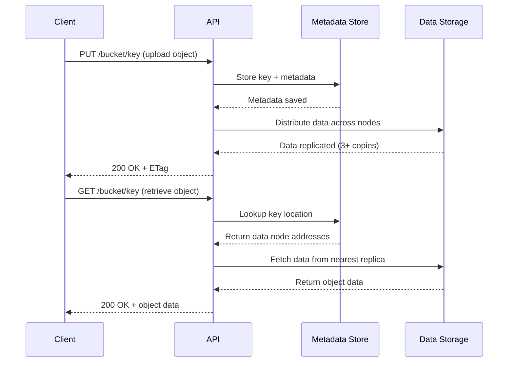
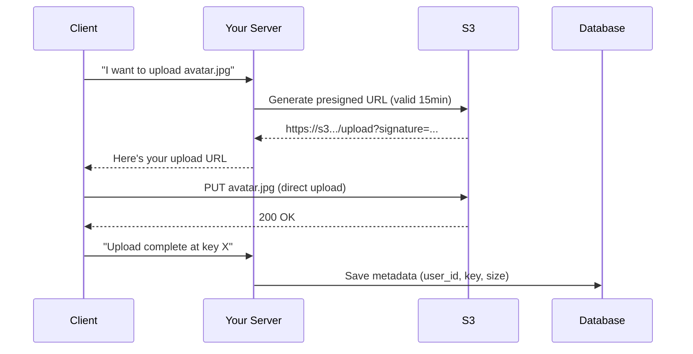
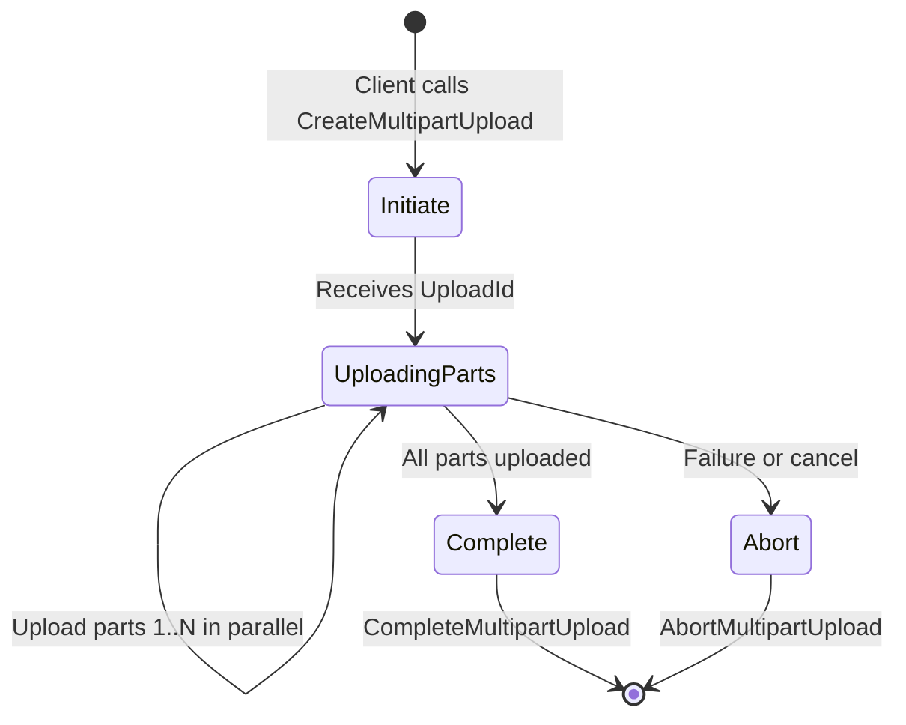
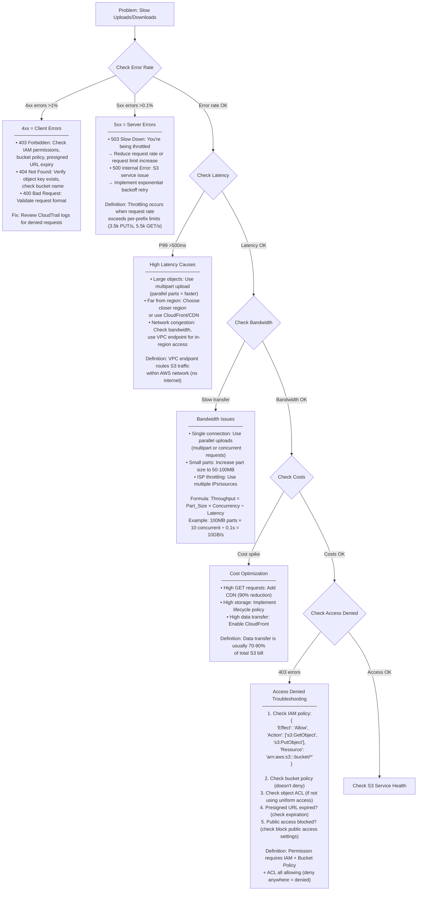

#system-design #building-block #storage

```table-of-contents
title: 
style: nestedList # TOC style (nestedList|nestedOrderedList|inlineFirstLevel)
minLevel: 0 # Include headings from the specified level
maxLevel: 0 # Include headings up to the specified level
include: 
exclude: 
includeLinks: true # Make headings clickable
hideWhenEmpty: false # Hide TOC if no headings are found
debugInConsole: false # Print debug info in Obsidian console
```
# Blob Storage (Object Storage)

## Intuition (30 sec)

A warehouse with numbered lockers. You give it a file (blob), it gives you a locker number (key/URL). You retrieve files by number. You don't organize them in folders — they're flat, identified by unique keys. Designed to store billions of files cheaply.

---

## Failure-First Scenario

> You store user-uploaded images in your PostgreSQL database as BLOBs. At 1M images, your database is 500GB, queries are slow, and backups take 6 hours. Images don't need joins or transactions — they need cheap, durable, fast storage. You need object storage.

---

## Working Knowledge (5 min)

### Blob Storage - Definition First

**Blob Storage (Object Storage):**
- **Definition:** A distributed storage system that stores unstructured data as objects, each identified by a unique key and accessed via HTTP APIs
- **Purpose:** Provides infinitely scalable, cost-effective storage for files (images, videos, backups) without the overhead of file system hierarchies or database constraints
- **How it works:** Clients send HTTP requests (PUT/GET/DELETE) with a key to store or retrieve objects; the system handles distribution, replication, and durability across multiple servers

**Key Terms:**
- **Bucket:** A top-level container/namespace that holds objects (like a database or root folder)
- **Object:** The actual data (file) plus metadata stored in the system
- **Key:** A unique string identifier for an object within a bucket (e.g., "users/123/avatar.jpg")
- **Metadata:** Key-value pairs attached to objects (content-type, custom headers, timestamps)
- **Durability:** The probability that data will not be lost (S3: 99.999999999% = 11 nines)
- **Availability:** The percentage of time the service is accessible (S3 Standard: 99.99%)
- **Eventual Consistency:** Writes are asynchronously replicated; reads may temporarily return old data
- **Immutability:** Objects cannot be partially modified; you must replace the entire object

### Object Storage vs File Storage vs Block Storage

| Type | Model | Examples | Use Case |
|------|-------|----------|----------|
| **Object** | Key → blob + metadata | S3, GCS, Azure Blob | Images, videos, backups, data lakes |
| **File** | Hierarchical directories | EFS, NFS, Google Filestore | Shared file systems, legacy apps |
| **Block** | Raw disk blocks | EBS, Azure Disk | Databases, OS boot drives |

**Comparison Definitions:**
- **Object Storage:** Best for unstructured data that doesn't require modification; accessed via HTTP/REST APIs
- **File Storage:** Best for shared access patterns with traditional file system semantics (POSIX)
- **Block Storage:** Best for applications requiring low-latency random access (databases, VMs)

### How Object Storage Works (Visual Flow)



**Step-by-step breakdown:**
1. **PUT Request:** Client sends object data with key; system generates ETag (content hash) and stores metadata
2. **Data Distribution:** System splits data into chunks, replicates across multiple availability zones/racks
3. **GET Request:** Client requests by key; system looks up metadata, fetches data from closest replica
4. **DELETE Request:** Marks object as deleted; eventually garbage collected from all replicas

### Storage Classes (S3 Example)

| Class | Access Pattern | Cost ($/GB/mo) | Retrieval | Durability | Availability |
|-------|---------------|----------------|-----------|------------|--------------|
| **Standard** | Frequent access | $0.023 | Instant | 11 nines | 99.99% |
| **Intelligent-Tiering** | Unknown/changing | $0.023 + monitoring | Instant | 11 nines | 99.9% |
| **Standard-IA** | Infrequent access | $0.0125 | Instant + retrieval fee | 11 nines | 99.9% |
| **One Zone-IA** | Infrequent, reproducible | $0.01 | Instant + retrieval fee | 99.999999999% (1 AZ) | 99.5% |
| **Glacier Instant** | Archive (rarely accessed) | $0.004 | Instant + retrieval fee | 11 nines | 99.9% |
| **Glacier Flexible** | Archive (minutes-hours) | $0.0036 | 1-5 minutes or 3-5 hours | 11 nines | 99.99% |
| **Glacier Deep Archive** | Long-term archive | $0.00099 | 12+ hours | 11 nines | 99.99% |

**Storage Class Definitions:**
- **Standard:** Default class; optimized for frequently accessed data with millisecond latency
- **Intelligent-Tiering:** Automatically moves objects between access tiers based on usage patterns
- **Infrequent Access (IA):** Lower storage cost but charges per retrieval; for data accessed monthly
- **Glacier:** Archive storage for compliance/backup; cheaper but requires restoration before access
- **Deep Archive:** Cheapest option for data accessed once or twice per year (e.g., regulatory archives)

### Presigned URLs

**Presigned URL:**
- **Definition:** A time-limited URL containing cryptographic signature that grants temporary access to a private object without exposing credentials
- **Purpose:** Enables clients to upload/download directly to object storage, bypassing application servers
- **How it works:** Server generates URL with signature using secret key; URL expires after configured time (e.g., 15 minutes)



**Benefits:**
- Reduces bandwidth costs on application servers
- Faster uploads/downloads (direct to storage)
- Scales to millions of concurrent users without server bottlenecks

---

## Layer 1: Conceptual Precision (15 min)

### Multipart Upload - Deep Definitions

**Multipart Upload:**
- **Formal Definition:** A protocol for uploading large objects in separate parts (chunks), enabling parallel transfer, pause/resume, and recovery from network failures
- **Simple Definition:** Breaking a large file into pieces, uploading them separately, then telling S3 to glue them back together
- **Analogy:** Like shipping a disassembled IKEA furniture set in multiple boxes, then assembling at destination
- **Related Terms:** Chunking (generic), Resumable Upload (similar concept in other systems)

**Why this matters:**
- Files >100MB uploaded as single request risk timeout/failure
- Parallel upload of parts can saturate network bandwidth (10x faster)
- Can retry failed parts without re-uploading entire file
- Required for files >5GB on S3

**Multipart Upload Flow:**



**State Definitions:**
- **Initiate:** System allocates resources and returns unique upload ID for tracking
- **UploadingParts:** Client uploads parts (5MB-5GB each) with part numbers; each returns ETag
- **Complete:** Client sends list of part numbers + ETags; system validates and assembles object
- **Abort:** Cleans up incomplete upload; parts are deleted after 7 days if not completed/aborted

**Configuration Example:**

```bash
# AWS CLI example
# Part 1: Initiate
aws s3api create-multipart-upload \
  --bucket my-bucket \
  --key large-video.mp4 \
  --metadata "uploader=user123"
# Returns: {"UploadId": "abc123"}

# Part 2: Upload parts (typically automated in SDK)
aws s3api upload-part \
  --bucket my-bucket \
  --key large-video.mp4 \
  --part-number 1 \
  --body part1.bin \
  --upload-id abc123
# Returns: {"ETag": "etag1"}

# Part 3: Complete
aws s3api complete-multipart-upload \
  --bucket my-bucket \
  --key large-video.mp4 \
  --upload-id abc123 \
  --multipart-upload '{"Parts":[{"PartNumber":1,"ETag":"etag1"}]}'
```

**Best Practices:**
- Use part size 50-100MB for optimal throughput
- Upload at least 3-4 parts in parallel (based on network bandwidth)
- Store upload ID and part ETags for resume capability
- Set lifecycle policy to auto-abort incomplete uploads after 7 days

### Lifecycle Policies - Deep Definitions

**Lifecycle Policy:**
- **Formal Definition:** A set of rules that automatically transition objects between storage classes or delete them based on age, prefix, or tags
- **Simple Definition:** Automatic rules that move old data to cheaper storage or delete it after a certain time
- **Analogy:** Like a filing system where documents move from your desk to filing cabinet to warehouse to shredder based on age
- **Related Terms:** TTL (Time To Live), Data Retention Policy, Object Expiration

**Why this matters:**
- Manual data management is impossible at petabyte scale
- Storage costs can be reduced 90%+ by moving cold data to archive tiers
- Compliance requirements (e.g., delete after 7 years) automated
- Frees team from manual cleanup tasks

**Lifecycle Transition Flow:**

```
┌─────────────────────────────────────────────────────────────────┐
│                     Object Lifecycle                             │
├─────────────────────────────────────────────────────────────────┤
│                                                                  │
│  Day 0        Day 30       Day 90        Day 365     Day 2555   │
│    │           │            │              │             │      │
│    ▼           ▼            ▼              ▼             ▼      │
│  Upload    Standard-IA   Glacier      Deep Archive   Delete    │
│  Standard                 Flexible                              │
│                                                                  │
│  Cost: $$$      $$           $            ¢             $0      │
│  Access: ms     ms      1-5 minutes    12 hours         N/A    │
│                                                                  │
└─────────────────────────────────────────────────────────────────┘
```

**Example Lifecycle Policy (S3):**

```json
{
  "Rules": [
    {
      "Id": "Move old logs to archive",
      "Status": "Enabled",
      "Prefix": "logs/",  // Definition: Apply to objects starting with "logs/"
      "Transitions": [
        {
          "Days": 30,  // Definition: 30 days after creation
          "StorageClass": "STANDARD_IA"  // Definition: Infrequent Access tier
        },
        {
          "Days": 90,  // Definition: 90 days after creation
          "StorageClass": "GLACIER_FLEXIBLE_RETRIEVAL"
        }
      ],
      "Expiration": {
        "Days": 2555  // Definition: Delete after 7 years (compliance requirement)
      }
    },
    {
      "Id": "Delete incomplete multipart uploads",
      "Status": "Enabled",
      "AbortIncompleteMultipartUpload": {
        "DaysAfterInitiation": 7  // Definition: Clean up failed uploads
      }
    }
  ]
}
```

**Policy Components:**
- **Prefix:** Filter objects by key prefix (e.g., "logs/" matches "logs/2026/01/app.log")
- **Tags:** Filter by object tags (e.g., {"Type": "backup"})
- **Transitions:** Move to cheaper storage class after X days
- **Expiration:** Permanently delete after X days
- **NoncurrentVersionExpiration:** Delete old versions in versioned buckets

### Data Lake Pattern - Deep Definitions

**Data Lake:**
- **Formal Definition:** A centralized repository that stores all structured and unstructured data at any scale, in native format, enabling diverse analytics and ML workloads
- **Simple Definition:** Store all raw data cheaply in object storage, then query/process it when needed without moving data
- **Analogy:** A massive parking lot where you dump all raw materials; factory machines come to the lot to process what they need
- **Differs from Data Warehouse:** Data warehouse requires pre-defined schema and ETL; data lake stores raw data without transformation

**Why this matters:**
- Traditional approach: ETL data before storage (expensive, slow, data loss)
- Data lake approach: Store everything, transform on-read (cheap, fast, no data loss)
- Enables exploratory analytics on data you didn't know you'd need
- Foundation for machine learning (requires massive raw datasets)

**Data Lake Architecture:**

```
┌──────────────────────────────────────────────────────────────────┐
│                         Data Sources                              │
├────────┬──────────┬────────────┬──────────┬─────────────────────┤
│ Web    │ Mobile   │  IoT       │ Database │  Third-party APIs   │
│ Logs   │  Events  │  Sensors   │  Dumps   │  (Twitter, etc.)    │
└────┬───┴────┬─────┴─────┬──────┴────┬─────┴──────────┬──────────┘
     │        │           │           │                │
     └────────┴───────────┴───────────┴────────────────┘
                          │
                          ▼
     ┌──────────────────────────────────────────────────┐
     │         Object Storage (S3/GCS)                   │
     │                                                   │
     │  • Raw logs: JSON, CSV, Parquet                  │
     │  • Images/videos: JPEG, MP4                      │
     │  • Database exports: Avro, Parquet               │
     │                                                   │
     │  Cost: ~$0.023/GB/month                          │
     │  Scale: Petabytes (unlimited)                    │
     └──┬────────────────────┬──────────────────────┬───┘
        │                    │                      │
        ▼                    ▼                      ▼
   ┌─────────┐          ┌────────┐           ┌──────────┐
   │ Athena  │          │  Spark │           │  Redshift│
   │         │          │        │           │ Spectrum │
   │ SQL on  │          │Batch   │           │          │
   │ S3 data │          │Processing│         │Analytics │
   └────┬────┘          └───┬────┘           └────┬─────┘
        │                   │                     │
        └───────────────────┴─────────────────────┘
                            │
                            ▼
                   ┌─────────────────┐
                   │   Dashboards    │
                   │   ML Models     │
                   │   Reports       │
                   └─────────────────┘
```

**Component Definitions:**
- **Object Storage:** Cheap, scalable storage layer; stores raw data without schema enforcement
- **Athena/Presto:** Serverless query engines that run SQL directly on files in S3
- **Spark:** Distributed processing framework for transforming and analyzing large datasets
- **Redshift Spectrum:** Extends data warehouse to query cold data in S3 without loading it

**Example Data Lake Workflow:**

```python
# 1. Ingest raw data to S3
# Definition: Stream logs to object storage in original format
import boto3
s3 = boto3.client('s3')

# Upload raw JSON logs (no transformation)
s3.put_object(
    Bucket='data-lake',
    Key='raw/logs/2026/02/15/app.log.json',  # Partition by date
    Body=json_logs
)

# 2. Query with Athena (SQL on S3)
# Definition: Run SQL queries without moving data out of S3
CREATE EXTERNAL TABLE logs (
    timestamp STRING,
    user_id INT,
    action STRING
)
PARTITIONED BY (date STRING)
STORED AS JSON
LOCATION 's3://data-lake/raw/logs/';

SELECT action, COUNT(*)
FROM logs
WHERE date = '2026-02-15'
GROUP BY action;
-- Athena scans only the files in 2026/02/15 partition

# 3. Process with Spark
# Definition: Transform raw data for ML or analytics
from pyspark.sql import SparkSession
spark = SparkSession.builder.appName("DataLake").getOrCreate()

df = spark.read.json("s3://data-lake/raw/logs/2026/02/15/")
df.filter(df.action == "purchase").write.parquet("s3://data-lake/processed/purchases/")
```

**Data Lake Best Practices:**
- **Partitioning:** Organize by date/category (e.g., `year=2026/month=02/day=15/`) to avoid scanning entire dataset
- **File Format:** Use columnar formats (Parquet, ORC) for analytics; compress with Snappy/GZIP
- **Metadata Catalog:** Use AWS Glue or Hive Metastore to track table schemas
- **Data Governance:** Tag sensitive data (PII), enforce access policies, audit queries

### Durability & Availability - Deep Definitions

**Durability:**
- **Formal Definition:** The probability that data will remain intact and not be lost over time, typically measured as "nines" (e.g., 99.999999999% = 11 nines)
- **Simple Definition:** The chance your data won't disappear; 11 nines means if you store 10 million objects, you'd lose 1 object every 10,000 years
- **How S3 achieves it:** Replicates data across minimum 3 availability zones, uses checksums to detect corruption, automatic repair

**Availability:**
- **Formal Definition:** The percentage of time the service is operational and accessible for requests, measured as uptime percentage (e.g., 99.99% = 52 minutes downtime per year)
- **Simple Definition:** How often you can access your data when you try
- **Differs from Durability:** Availability is about access; durability is about data loss

**The Math:**

```
Durability: 99.999999999% (11 nines)

Probability of loss = 1 - 0.99999999999 = 0.00000000001
Expected objects lost per year = Total objects × Loss probability

Example:
  10,000,000 objects stored
  × 0.00000000001
  = 0.0001 objects lost per year
  = 1 object lost every 10,000 years

Availability: 99.99% (4 nines)

Downtime per year = 365 days × 24 hours × 60 min × (1 - 0.9999)
                  = 525,600 minutes × 0.0001
                  = 52.56 minutes per year
```

**How S3 Achieves 11 Nines Durability:**

```
┌──────────────────────────────────────────────────────────────┐
│                    Region (e.g., us-east-1)                   │
├──────────────────┬───────────────────┬──────────────────────┤
│   AZ-1           │      AZ-2         │       AZ-3           │
│                  │                   │                      │
│  ┌──────────┐   │   ┌──────────┐   │    ┌──────────┐     │
│  │ Copy 1   │   │   │ Copy 2   │   │    │ Copy 3   │     │
│  │          │   │   │          │   │    │          │     │
│  │ object.jpg│  │   │object.jpg│   │    │object.jpg│     │
│  │          │   │   │          │   │    │          │     │
│  │ ETag: abc│   │   │ETag: abc │   │    │ETag: abc │     │
│  │ Checksum │   │   │Checksum  │   │    │Checksum  │     │
│  └──────────┘   │   └──────────┘   │    └──────────┘     │
│                  │                   │                      │
│  Separate power, │  Separate power,  │   Separate power,   │
│  network, cooling│  network, cooling │   network, cooling  │
└──────────────────┴───────────────────┴──────────────────────┘

• Each AZ is a separate data center facility
• Object replicated to 3+ AZs before PUT returns success
• Checksums verified on every read; corrupted copies auto-repaired
• Background scanner continuously validates all data
```

**Durability vs Availability Trade-offs:**

```
Storage Class              Durability           Availability    Cost
═══════════════════════════════════════════════════════════════════
S3 Standard                11 nines (3+ AZ)     99.99%          $$$
S3 One Zone-IA            11 nines (1 AZ)      99.5%           $$
S3 Glacier                11 nines (3+ AZ)     99.99%          $

Key insight:
• Durability remains high across all classes (11 nines)
• Availability varies: One Zone-IA has lower availability (single AZ failure = downtime)
• Use One Zone-IA for reproducible data (can regenerate if lost)
```

---

## Layer 2: Technology-Specific Examples (20 min)

### AWS S3 Configuration (Annotated)

**Bucket Configuration:**

```json
// S3 Bucket Configuration Example
{
  "Bucket": "my-app-media-prod",  // Definition: Globally unique bucket name

  "Versioning": {
    "Status": "Enabled"  // Definition: Keep all versions of objects for recovery
                         // Use case: Accidental deletions, ransomware protection
                         // Cost: Stores every version until deleted
  },

  "ServerSideEncryptionConfiguration": {
    "Rules": [
      {
        "ApplyServerSideEncryptionByDefault": {
          "SSEAlgorithm": "AES256"  // Definition: Encrypt objects at rest with S3-managed keys
                                     // Alternative: "aws:kms" for customer-managed keys
                                     // Why: Compliance, security (no plaintext on disk)
        },
        "BucketKeyEnabled": true  // Definition: Reduces KMS API calls by 99%
                                  // How: Uses bucket-level key for object encryption
                                  // Cost: Lower KMS charges ($0.03 per 10k requests)
      }
    ]
  },

  "PublicAccessBlockConfiguration": {
    "BlockPublicAcls": true,       // Definition: Prevent new public ACLs on bucket/objects
    "IgnorePublicAcls": true,      // Definition: Ignore existing public ACLs
    "BlockPublicPolicy": true,     // Definition: Reject public bucket policies
    "RestrictPublicBuckets": true  // Definition: Deny cross-account access if bucket is public

    // Why all true: Prevents accidental data exposure (most common security breach)
  },

  "LifecycleConfiguration": {
    "Rules": [
      {
        "Id": "transition-to-ia",
        "Status": "Enabled",
        "Transitions": [
          {
            "Days": 30,  // Definition: Move to IA after 30 days of creation
            "StorageClass": "STANDARD_IA"  // Saves 45% on storage costs
          },
          {
            "Days": 90,
            "StorageClass": "GLACIER_FLEXIBLE_RETRIEVAL"  // Saves 85% on storage
          }
        ],
        "NoncurrentVersionExpiration": {
          "NoncurrentDays": 30  // Definition: Delete old versions after 30 days
                                // Prevents versioning from exploding costs
        }
      }
    ]
  },

  "ReplicationConfiguration": {
    "Role": "arn:aws:iam::123456789012:role/s3-replication",
    "Rules": [
      {
        "Status": "Enabled",
        "Priority": 1,
        "Destination": {
          "Bucket": "arn:aws:s3:::my-app-media-dr",  // Disaster recovery bucket
          "ReplicationTime": {
            "Status": "Enabled",
            "Time": {
              "Minutes": 15  // Definition: Replicate to DR region within 15 minutes
                             // Use case: Disaster recovery, geographic redundancy
            }
          }
        }
      }
    ]
  },

  "CorsConfiguration": {
    "CorsRules": [
      {
        "AllowedOrigins": ["https://myapp.com"],  // Definition: Domains allowed to fetch objects
        "AllowedMethods": ["GET", "PUT"],  // Definition: HTTP methods permitted
        "AllowedHeaders": ["*"],  // Definition: Headers client can send (e.g., Content-Type)
        "MaxAgeSeconds": 3000  // Definition: Browser caches preflight response for 50 minutes

        // Why needed: Browser security blocks cross-origin requests without CORS
      }
    ]
  },

  "NotificationConfiguration": {
    "EventNotifications": [
      {
        "Event": "s3:ObjectCreated:*",  // Definition: Trigger on any object creation
        "Destination": {
          "LambdaFunctionArn": "arn:aws:lambda:us-east-1:123:function:ProcessImage"

          // Use case: Auto-generate thumbnails, run virus scan, update database
        }
      }
    ]
  }
}
```

**S3 Access Patterns Configuration:**

```python
import boto3
from botocore.config import Config

# Definition: Configure S3 client for optimal performance
config = Config(
    region_name='us-east-1',
    signature_version='s3v4',  # Definition: Use SigV4 for authentication
    retries={
        'max_attempts': 3,  # Definition: Retry failed requests up to 3 times
        'mode': 'adaptive'  # Definition: Adaptive throttling (backs off on 503 errors)
    },
    max_pool_connections=50  # Definition: Connection pool size for parallel uploads
                             # Why 50: Allows 50 concurrent multipart upload parts
)

s3 = boto3.client('s3', config=config)

# Best practice: Use presigned URLs for client uploads
presigned_url = s3.generate_presigned_url(
    'put_object',
    Params={
        'Bucket': 'my-app-media-prod',
        'Key': f'uploads/{user_id}/{filename}',
        'ContentType': 'image/jpeg'  # Definition: Enforce content type
    },
    ExpiresIn=900,  # Definition: URL expires in 15 minutes (security)
    HttpMethod='PUT'
)
```

### Google Cloud Storage Configuration (Annotated)

**Bucket Configuration (gsutil):**

```bash
# Create bucket with configuration
gsutil mb \
  -c STANDARD \          # Definition: Storage class (STANDARD, NEARLINE, COLDLINE, ARCHIVE)
  -l US-EAST1 \          # Definition: Region/multi-region location
  -b on \                # Definition: Enable uniform bucket-level access (no object ACLs)
  gs://my-app-media-gcs

# Enable versioning
# Definition: Keep history of object modifications and deletions
gsutil versioning set on gs://my-app-media-gcs

# Set lifecycle policy
cat > lifecycle.json << 'EOF'
{
  "lifecycle": {
    "rule": [
      {
        "action": {
          "type": "SetStorageClass",  # Definition: Change storage class
          "storageClass": "NEARLINE"  # Definition: Infrequent access tier (monthly access)
        },
        "condition": {
          "age": 30,  # Definition: Days since object creation
          "matchesPrefix": ["user-uploads/"]  # Definition: Only apply to this prefix
        }
      },
      {
        "action": {
          "type": "Delete"  # Definition: Permanently delete object
        },
        "condition": {
          "age": 365,
          "matchesPrefix": ["logs/"]
        }
      },
      {
        "action": {
          "type": "Delete"
        },
        "condition": {
          "numNewerVersions": 3  # Definition: Keep only 3 most recent versions
        }
      }
    ]
  }
}
EOF

gsutil lifecycle set lifecycle.json gs://my-app-media-gcs

# Set CORS for browser uploads
cat > cors.json << 'EOF'
[
  {
    "origin": ["https://myapp.com"],  # Definition: Allowed origin domains
    "method": ["GET", "PUT", "POST"],  # Definition: Permitted HTTP methods
    "responseHeader": ["Content-Type", "ETag"],  # Definition: Headers exposed to browser
    "maxAgeSeconds": 3600  # Definition: Cache preflight response for 1 hour
  }
]
EOF

gsutil cors set cors.json gs://my-app-media-gcs
```

**GCS Python SDK Configuration:**

```python
from google.cloud import storage
from google.auth import default
from datetime import timedelta

# Definition: Initialize client with application default credentials
credentials, project = default()
client = storage.Client(credentials=credentials, project=project)

bucket = client.bucket('my-app-media-gcs')

# Generate signed URL (equivalent to S3 presigned URL)
# Definition: Time-limited URL for uploading without service account credentials
blob = bucket.blob(f'uploads/{user_id}/{filename}')
signed_url = blob.generate_signed_url(
    version='v4',  # Definition: Use v4 signing (latest, most secure)
    expiration=timedelta(minutes=15),  # Definition: URL valid for 15 minutes
    method='PUT',  # Definition: HTTP method (PUT for upload, GET for download)
    content_type='image/jpeg'  # Definition: Enforce content type
)

# Resumable upload for large files
# Definition: Upload that can be paused and resumed (similar to multipart)
blob.chunk_size = 5 * 1024 * 1024  # 5MB chunks
blob.upload_from_filename(
    local_file,
    checksum='md5'  # Definition: Verify integrity with MD5 hash
)

# Configure object metadata
blob.metadata = {
    'uploader-id': str(user_id),  # Definition: Custom key-value metadata
    'uploaded-at': '2026-02-15T10:00:00Z'
}
blob.content_type = 'image/jpeg'  # Definition: MIME type
blob.cache_control = 'public, max-age=86400'  # Definition: CDN/browser caching (1 day)
blob.patch()  # Definition: Update metadata without re-uploading object
```

**GCS Storage Classes Comparison:**

| Class | Access Pattern | Cost ($/GB/mo) | Retrieval | Minimum Storage Duration |
|-------|---------------|----------------|-----------|------------------------|
| **Standard** | Frequent access | $0.020 | Instant | None |
| **Nearline** | Once per month | $0.010 | Instant + $0.01/GB | 30 days |
| **Coldline** | Once per 90 days | $0.004 | Instant + $0.02/GB | 90 days |
| **Archive** | Once per year | $0.0012 | Instant + $0.05/GB | 365 days |

**Key Definitions:**
- **Minimum Storage Duration:** If you delete before this period, you're charged for the full duration
- **Retrieval Cost:** Per-GB fee charged when accessing data (in addition to storage cost)
- **Example:** Store 1TB in Nearline for 15 days then delete → charged for 30 days ($10) + retrieval when accessed

### Technology Comparison Table

**Cloud Object Storage Providers:**

| Feature | AWS S3 | Google Cloud Storage | Azure Blob Storage |
|---------|--------|---------------------|-------------------|
| **Definition** | First major cloud object storage (2006) | Google's object storage with tight BigQuery integration | Microsoft's blob storage with Azure ecosystem integration |
| **Durability** | 99.999999999% (11 nines) | 99.999999999% (11 nines) | 99.999999999% (11 nines) |
| **Storage Classes** | 7 classes (Standard, IA, Glacier, etc.) | 4 classes (Standard, Nearline, Coldline, Archive) | 4 tiers (Hot, Cool, Cold, Archive) |
| **Max Object Size** | 5TB | 5TB | 4.77TB |
| **Consistency** | Strong read-after-write | Strong read-after-write | Strong read-after-write |
| **Best For** | Mature ecosystem, most integrations | Analytics workloads (Athena-like BigQuery) | Windows/Microsoft stack integration |
| **Unique Feature** | S3 Select (query inside objects), largest ecosystem | Composite objects (parallel upload without multipart) | Blob versioning snapshots |
| **Pricing (Standard)** | $0.023/GB | $0.020/GB | $0.018/GB (varies by region) |

---

## Layer 3: Production-Ready Details (30 min)

### Production Architecture (Fully Annotated)

```
                           Internet / CDN
                                 │
                                 │ Definition: CDN caches frequently accessed objects
                                 │ Why: Reduces latency (edge locations) and S3 costs (fewer requests)
                                 │
                ┌────────────────┴─────────────────┐
                │                                  │
           ┌────▼─────┐                      ┌────▼─────┐
           │  Client  │                      │  Client  │
           │  (Web)   │                      │ (Mobile) │
           └────┬─────┘                      └────┬─────┘
                │                                  │
                │ 1. Request presigned URL         │
                │                                  │
                └──────────────┬───────────────────┘
                               │
                    ┌──────────▼──────────┐
                    │  Application        │
                    │  Server (API)       │
                    │                     │
                    │ Definition: Generates│
                    │ presigned URLs,     │
                    │ validates uploads,  │
                    │ stores metadata     │
                    └──────┬──────────────┘
                           │
              2. Generate presigned URL
                           │
            ┌──────────────┼──────────────┐
            │              │              │
     ┌──────▼──────┐  ┌───▼────┐  ┌──────▼───────┐
     │  S3/GCS     │  │Database│  │  S3 Events   │
     │  Bucket     │  │        │  │  (Lambda)    │
     │             │  │Metadata│  │              │
     │ Definition: │  │Store   │  │ Definition:  │
     │ Actual blob │  │        │  │ Async post-  │
     │ storage     │  │user_id │  │ processing   │
     │             │  │object  │  │ (thumbnails, │
     │ Replication │  │key,size│  │ virus scan)  │
     │ across 3+   │  │        │  │              │
     │ zones       │  └────────┘  └──────────────┘
     └─────────────┘
            │
    3. Client uploads directly
       (bypasses app server)
```

**Architecture Definitions:**
- **CDN Layer:** Edge caching network (CloudFront/Cloud CDN) that serves objects from locations near users
- **Application Server:** Orchestrates uploads (generates presigned URLs), stores metadata in database, enforces business logic
- **Object Storage:** Durable storage layer; handles replication, encryption, lifecycle management
- **Event Processing:** Asynchronous Lambda/Cloud Function triggered on object creation for post-processing
- **Metadata Database:** Relational DB storing object references (keys), ownership, permissions

**Flow Explanation:**
1. Client requests upload permission from API
2. API validates user, generates presigned URL (15-min expiry), returns to client
3. Client uploads directly to S3/GCS using presigned URL (no app server involvement)
4. S3/GCS triggers event → Lambda runs (generate thumbnail, scan virus)
5. Client notifies API of completion → API stores metadata in database

### Monitoring Metrics Dashboard

```
┌─────────────────────────────────────────────────────────────────────┐
│                   BLOB STORAGE MONITORING DASHBOARD                  │
├─────────────────────────────────────────────────────────────────────┤
│                                                                      │
│ ╔═══════════════════════════════════════════════════════════════╗  │
│ ║ STORAGE METRICS                                                ║  │
│ ╠═══════════════════════════════════════════════════════════════╣  │
│ ║                                                                ║  │
│ ║ Total Storage: 127.4 TB                                       ║  │
│ ║ Definition: Total bytes stored across all storage classes     ║  │
│ ║ Why track: Cost planning, capacity forecasting                ║  │
│ ║                                                                ║  │
│ ║ Object Count: 2.3 billion                                     ║  │
│ ║ Definition: Number of objects (files) in bucket               ║  │
│ ║ Why track: List operations scale with object count            ║  │
│ ║                                                                ║  │
│ ║ Storage by Class:                                             ║  │
│ ║   Standard:         45 TB  (35%) - $1,035/month               ║  │
│ ║   Standard-IA:      30 TB  (24%) - $375/month                 ║  │
│ ║   Glacier Flexible: 40 TB  (31%) - $144/month                 ║  │
│ ║   Deep Archive:     12.4 TB (10%) - $12/month                 ║  │
│ ║                                                                ║  │
│ ║ Total Storage Cost: $1,566/month                              ║  │
│ ║ Definition: Monthly storage cost across all classes           ║  │
│ ║ Trend: -23% from last month (lifecycle working)               ║  │
│ ╚═══════════════════════════════════════════════════════════════╝  │
│                                                                      │
│ ╔═══════════════════════════════════════════════════════════════╗  │
│ ║ REQUEST METRICS                                                ║  │
│ ╠═══════════════════════════════════════════════════════════════╣  │
│ ║                                                                ║  │
│ ║ GET Requests: 47,234/sec                                      ║  │
│ ║ Definition: Number of object download requests per second     ║  │
│ ║ Cost: $0.0004 per 1K requests = $1,630/month                  ║  │
│ ║ Why track: High GET rate → consider CDN caching               ║  │
│ ║                                                                ║  │
│ ║ PUT Requests: 1,247/sec                                       ║  │
│ ║ Definition: Number of object upload requests per second       ║  │
│ ║ Cost: $0.005 per 1K requests = $162/month                     ║  │
│ ║                                                                ║  │
│ ║ LIST Requests: 23/sec                                         ║  │
│ ║ Definition: Bucket list operations (expensive, avoid in app)  ║  │
│ ║ Alert: Lists should be rare; consider if >100/sec             ║  │
│ ║                                                                ║  │
│ ║ 4xx Error Rate: 0.02%                                         ║  │
│ ║ Definition: Client errors (403 Forbidden, 404 Not Found)      ║  │
│ ║ Why track: High 404s may indicate client bugs                 ║  │
│ ║                                                                ║  │
│ ║ 5xx Error Rate: 0.001%                                        ║  │
│ ║ Definition: Server errors (503 Slow Down, 500 Internal)       ║  │
│ ║ Alert when: >0.1% (indicates S3 issues or throttling)         ║  │
│ ╚═══════════════════════════════════════════════════════════════╝  │
│                                                                      │
│ ╔═══════════════════════════════════════════════════════════════╗  │
│ ║ PERFORMANCE METRICS                                            ║  │
│ ╠═══════════════════════════════════════════════════════════════╣  │
│ ║                                                                ║  │
│ ║ Latency - First Byte:                                         ║  │
│ ║   P50: 15ms    P95: 45ms    P99: 89ms                         ║  │
│ ║ Definition: Time from request to first byte of response       ║  │
│ ║ Target: P99 <100ms for good UX                                ║  │
│ ║                                                                ║  │
│ ║ Latency - Total Request:                                      ║  │
│ ║   P50: 120ms   P95: 340ms   P99: 890ms                        ║  │
│ ║ Definition: End-to-end request time (includes data transfer)  ║  │
│ ║ Note: Depends on object size; track per size bucket           ║  │
│ ║                                                                ║  │
│ ║ Bandwidth - Download: 15.3 GB/sec                             ║  │
│ ║ Definition: Outbound data transfer rate                       ║  │
│ ║ Cost: $0.09/GB (first 10TB) = $40,000/month                   ║  │
│ ║ Optimization: CDN can reduce this by 70-90%                   ║  │
│ ║                                                                ║  │
│ ║ Bandwidth - Upload: 2.1 GB/sec                                ║  │
│ ║ Definition: Inbound data transfer (free on S3/GCS)            ║  │
│ ╚═══════════════════════════════════════════════════════════════╝  │
│                                                                      │
│ ╔═══════════════════════════════════════════════════════════════╗  │
│ ║ DATA TRANSFER METRICS                                          ║  │
│ ╠═══════════════════════════════════════════════════════════════╣  │
│ ║                                                                ║  │
│ ║ Egress (Outbound): 40.3 TB/day                                ║  │
│ ║ Definition: Data transferred out of S3 to internet/clients    ║  │
│ ║ Cost: $3,627/day without CDN                                  ║  │
│ ║ Cost: $544/day with 85% CDN cache hit rate                    ║  │
│ ║ Recommendation: Enable CloudFront caching                     ║  │
│ ║                                                                ║  │
│ ║ Replication Lag: 1.2 minutes (avg)                            ║  │
│ ║ Definition: Time for object to replicate to DR region         ║  │
│ ║ Target: <15 minutes (SLA requirement)                         ║  │
│ ╚═══════════════════════════════════════════════════════════════╝  │
│                                                                      │
│ ╔═══════════════════════════════════════════════════════════════╗  │
│ ║ COST BREAKDOWN (MONTHLY)                                       ║  │
│ ╠═══════════════════════════════════════════════════════════════╣  │
│ ║                                                                ║  │
│ ║ Storage:             $1,566  (3%)                             ║  │
│ ║ GET Requests:        $1,630  (3%)                             ║  │
│ ║ PUT Requests:        $162    (<1%)                            ║  │
│ ║ Data Transfer:       $40,000 (94%) ← BIGGEST COST             ║  │
│ ║ ─────────────────────────────────────────────────────          ║  │
│ ║ Total:               $43,358/month                            ║  │
│ ║                                                                ║  │
│ ║ Optimization Potential:                                       ║  │
│ ║ • Add CDN → Save $35,000/month (88% reduction)                ║  │
│ ║ • Lifecycle old data → Save $300/month                        ║  │
│ ╚═══════════════════════════════════════════════════════════════╝  │
└─────────────────────────────────────────────────────────────────────┘
```

**Metric Definitions:**
- **Storage Metrics:** Track total capacity, growth rate, cost per class
- **Request Metrics:** QPS for each operation type, error rates, throttling events
- **Performance Metrics:** Latency percentiles, bandwidth utilization
- **Cost Metrics:** Breakdown by storage, requests, data transfer

**Alerting Thresholds:**
```
CRITICAL:
• 5xx error rate >0.5% for 5 minutes → S3 service issues
• Replication lag >30 minutes → DR at risk
• Storage growth >20% per day → Unexpected usage spike

WARNING:
• 4xx error rate >1% → Potential client configuration issues
• Data transfer cost spike >50% → Possible attack or misconfiguration
• LIST requests >100/sec → Application anti-pattern (expensive, slow)
```

### Capacity Planning (Definitions + Math)

**Capacity Planning for Blob Storage:**
- **Definition:** Process of estimating future storage needs, costs, and performance requirements based on growth trends
- **Goal:** Avoid surprise costs; ensure adequate performance; optimize storage class distribution

**Key Metrics:**
- **Storage Growth Rate:** Percentage increase in total storage per month
- **Upload Rate:** Objects uploaded per second
- **Access Pattern:** Frequency of reads per object over time (determines storage class)
- **Data Lifetime:** How long objects are retained before deletion

**Calculation Example:**

```
Given Current State:
• Total storage: 100 TB
• Monthly growth: 15 TB (15% growth rate)
• Monthly uploads: 50 million objects (avg 300 KB each)
• Access pattern: 90% of reads target objects <30 days old

Step 1: Project storage growth (12 months)
  Definition: Compound growth calculation
  Month 1: 100 TB × 1.15 = 115 TB
  Month 2: 115 TB × 1.15 = 132.25 TB
  ...
  Month 12: 100 TB × (1.15)^12 = 535 TB

  Cost projection (all in Standard class):
  535 TB × $0.023/GB = 535,000 × $0.023 = $12,305/month

Step 2: Optimize with lifecycle policy
  Definition: Move cold data to cheaper tiers

  Assumption: Objects >30 days old → 10% access rate (move to IA)
               Objects >90 days old → 1% access rate (move to Glacier)

  After 12 months:
    0-30 days:   45 TB (hot)  → Standard         → $1,035/month
    30-90 days:  100 TB       → Standard-IA      → $1,250/month
    90-365 days: 390 TB       → Glacier Flexible → $1,404/month

  Total: $3,689/month (70% savings vs all-Standard)

Step 3: Calculate request costs
  Definition: Cost of API operations

  Current GET rate: 50,000 requests/sec
  Monthly GETs: 50,000 × 86,400 sec/day × 30 days = 129.6 billion
  Cost: 129.6M (in thousands) × $0.0004 = $51,840/month

  With CDN (90% cache hit rate):
  Requests to S3: 12.96 billion
  Cost: $5,184/month (90% savings)

Step 4: Calculate data transfer costs
  Definition: Egress charges for downloads

  Average object size: 300 KB
  Monthly downloads: 129.6B requests × 300 KB = 38.88 TB/day
  Monthly transfer: 38.88 TB × 30 = 1,166 TB

  Cost without CDN: 1,166 TB × $0.09/GB = 1,166,000 × $0.09 = $104,940/month
  Cost with CDN: 1,166 TB × 0.10 × $0.09 = $10,494/month

  CDN own cost: ~$0.02/GB = $23,320/month
  Total with CDN: $33,814/month (68% savings)

Step 5: Total 12-month cost
  Without optimization:
    Storage: $12,305 + Requests: $51,840 + Transfer: $104,940 = $169,085/month

  With optimization (lifecycle + CDN):
    Storage: $3,689 + Requests: $5,184 + Transfer: $33,814 = $42,687/month

  Savings: $126,398/month (75% reduction)
```

**Capacity Planning Checklist:**

```
☐ Project storage growth for 12-24 months
  • Track monthly growth rate
  • Account for seasonal spikes (e.g., holiday uploads)
  • Add 20% buffer for unexpected growth

☐ Analyze access patterns
  • Run S3 Storage Lens or GCS insights
  • Identify % of objects not accessed in 30/90/365 days
  • Design lifecycle policy based on actual usage

☐ Calculate cost projections
  • Storage costs per class
  • Request costs (GET/PUT/LIST)
  • Data transfer costs (biggest expense!)
  • Compare with/without CDN

☐ Set up monitoring and alerts
  • Alert on storage growth >20%/day
  • Alert on unexpected cost spikes
  • Track storage class distribution

☐ Review quarterly
  • Adjust lifecycle policies based on usage
  • Evaluate new storage classes (e.g., S3 Glacier Instant)
  • Check for orphaned data (can delete)
```

### Decision Trees

**Storage Class Selection Decision Tree:**

```
                        Start: Upload Object
                                │
                                │
                    ┌───────────▼───────────┐
                    │ How often accessed?   │
                    └───┬───────────────┬───┘
                        │               │
              Multiple times/day      Rarely
                        │               │
                        │               │
              ┌─────────▼──────┐        │
              │ S3 STANDARD    │        │
              │ GCS STANDARD   │        │
              │                │        │
              │ $$$            │        │
              │ Instant access │        │
              └────────────────┘        │
                                        │
                        ┌───────────────▼───────────────┐
                        │ Access pattern predictable?   │
                        └───┬───────────────┬───────────┘
                            │               │
                          Yes            Unknown
                            │               │
                            │               │
                ┌───────────▼───────────┐   │
                │ How often accessed?   │   │
                └───┬───────────────┬───┘   │
                    │               │       │
          Once/month    Once/quarter│       │
                    │               │       │
         ┌──────────▼─────┐   ┌────▼────┐  │
         │ STANDARD-IA    │   │COLDLINE │  │
         │ NEARLINE       │   │COOL     │  │
         │ $$ + retrieval │   │$ + fee  │  │
         └────────────────┘   └─────────┘  │
                                            │
                              ┌─────────────▼────────────┐
                              │ INTELLIGENT-TIERING     │
                              │                          │
                              │ Auto-moves between tiers │
                              │ $$ + small monitoring fee│
                              └──────────────────────────┘
                                            │
                                            │
                        ┌───────────────────▼───────────────┐
                        │ Archive (yearly access or less)?  │
                        └───┬───────────────────────────┬───┘
                            │                           │
                    Need fast restore?           Can wait hours?
                            │                           │
                ┌───────────▼──────────┐   ┌────────────▼────────┐
                │ GLACIER INSTANT      │   │ GLACIER FLEXIBLE    │
                │ ARCHIVE              │   │ COLDLINE/ARCHIVE    │
                │                      │   │                     │
                │ $ + retrieval fee    │   │ ¢ + high retrieval  │
                │ Instant access       │   │ 1-5 min or 12 hrs   │
                └──────────────────────┘   └─────────────────────┘
```

**Decision Matrix:**

| If... | And... | Then Use | Why |
|-------|--------|----------|-----|
| Accessed daily | Performance critical | Standard | Lowest latency, no retrieval fees |
| Accessed weekly | Cost matters | Standard-IA / Nearline | 45% cheaper storage, instant access |
| Accessed monthly | Predictable pattern | Standard-IA / Nearline | Optimized for monthly access |
| Accessed unpredictably | Pattern unknown | Intelligent-Tiering | Auto-optimizes without manual policy |
| Accessed yearly | Compliance/backup | Glacier Flexible / Coldline | 85% cheaper, acceptable restore time |
| Accessed rarely | Long-term archive | Deep Archive / Archive | 95% cheaper, 12+ hour restore |
| Reproducible data | Single point of failure OK | One Zone-IA | 20% cheaper than Standard-IA |
| Critical data | Must survive regional outage | Standard (multi-AZ) | Replicated across 3+ zones |

### Troubleshooting Flow



**Common Issues and Solutions:**

| Issue | Symptom | Root Cause | Solution |
|-------|---------|------------|----------|
| **SlowDown error** | 503 responses | Request rate exceeds limits (3.5k PUT/s/prefix) | Add random prefix to keys, request limit increase |
| **High 404 rate** | Objects not found | Client using stale/incorrect keys | Implement eventual consistency handling, use versioning |
| **Expensive bills** | Data transfer costs | Direct S3 access without CDN | Enable CloudFront (85% cost reduction) |
| **Slow uploads** | Large file timeouts | Single-part upload of large files | Use multipart upload (parallel parts) |
| **Access denied** | 403 on presigned URL | URL expired or wrong permissions | Increase expiry, verify IAM role has permissions |
| **Incomplete uploads** | Abandoned multipart uploads | Client crashes without completing | Enable lifecycle policy to abort after 7 days |
| **Eventual consistency issues** | Reading old version after write | Rare in strongly consistent S3 | Add retry with exponential backoff |

---

## Real-World Examples

### Example 1: Instagram - 100+ Petabytes of Photos/Videos

**Problem Definition:**
Instagram stores user-uploaded photos and videos at massive scale. By 2023, they had over 2 billion users uploading 95+ million photos/videos per day. Serving this content with low latency worldwide while controlling costs was critical.

**Solution Definition:**
Multi-tier storage architecture using AWS S3 with aggressive CDN caching and storage class optimization.

**Technical Terms Used:**
- **Hot Storage:** Recently uploaded content (<30 days) in S3 Standard for instant access
- **Warm Storage:** Older content (30-365 days) transitioned to S3 Intelligent-Tiering
- **Cold Storage:** Archive content (>1 year, rarely viewed) in S3 Glacier
- **CDN (CloudFront):** 99%+ cache hit rate for popular content; only 1% of requests hit S3

**Architecture:**

```
Before (Early Instagram):
┌──────────┐
│  Users   │
└────┬─────┘
     │
     ▼
┌──────────────┐        ┌───────────────┐
│ Django App   │───────>│  PostgreSQL   │
│   Servers    │        │  (stores blob │
└──────────────┘        │   references) │
                        └───────────────┘

Issues:
• Database size exploded (petabytes)
• Slow queries due to large tables
• Expensive PostgreSQL storage
• No geographic distribution


After (Current Architecture):
┌──────────┐
│  Users   │ (worldwide)
└────┬─────┘
     │
     ▼
┌────────────────────────────────────────┐
│  CloudFront CDN (Edge Locations)       │
│  Cache-Control: max-age=31536000       │
│  Definition: Cache for 1 year          │
│  Hit Rate: 99.8%                       │
└────────────┬───────────────────────────┘
             │ (0.2% requests)
             ▼
┌────────────────────────────────────────┐
│  S3 Standard (Hot Data)                │
│  • Photos <30 days old                 │
│  • ~5 PB                               │
│  • Most frequently accessed            │
└────────────────────────────────────────┘
             │
             ▼
┌────────────────────────────────────────┐
│  S3 Intelligent-Tiering (Warm)         │
│  • Photos 30-365 days old              │
│  • ~30 PB                              │
│  • Auto-moves between access tiers     │
└────────────────────────────────────────┘
             │
             ▼
┌────────────────────────────────────────┐
│  S3 Glacier Flexible (Cold)            │
│  • Photos >1 year old, <10 views       │
│  • ~70 PB                              │
│  • Rarely accessed archive             │
└────────────────────────────────────────┘

Upload Flow:
User → Django API → Generate Presigned URL → User uploads directly to S3
     → Lambda triggered → Generate thumbnails → Store in S3
     → Update PostgreSQL with S3 key
```

**Results:**
- **Storage Scale:** 100+ PB stored in S3 (vs impossible in PostgreSQL)
- **Cost Optimization:** 80% of data in cheaper tiers → $1-2M/month savings
- **Performance:** P99 latency <50ms (CDN edge serving)
- **Availability:** 99.99% uptime (S3's durability guarantees)
- **Geographic Distribution:** Content served from 400+ CloudFront edge locations

**Key Lessons:**
- Never store blobs in relational databases at scale
- CDN is mandatory for media-heavy apps (99%+ cache hit rate = 99% cost reduction)
- Lifecycle policies automate cost optimization without manual intervention
- Presigned URLs eliminate bottleneck of proxying uploads through app servers

### Example 2: Netflix - Petabytes of Video Streaming

**Problem Definition:**
Netflix streams 250+ million hours of video per day to 230+ million subscribers worldwide. They store thousands of movies/shows, each with multiple bitrate versions, subtitle files, and thumbnails. Total storage exceeds 10 PB, with extreme requirements for durability (can't lose master files) and global access.

**Solution Definition:**
Multi-cloud object storage strategy using AWS S3 for primary storage, plus CDN-based edge caching. Heavy use of multipart uploads for large video files, lifecycle policies for old content, and S3 event-driven workflows for video transcoding.

**Technical Terms Used:**
- **Master Files:** Original high-quality video files uploaded by studios (stored in S3 Glacier)
- **Adaptive Bitrate (ABR) Streams:** Same video encoded at multiple qualities (720p, 1080p, 4K); stored in S3 Standard
- **Open Connect:** Netflix's custom CDN infrastructure with caching appliances in ISP networks
- **Transcoding Pipeline:** Automated workflow that converts master files to multiple formats/bitrates

**Architecture:**

```
Content Ingestion (Studio Upload):
┌─────────────┐
│ Studio      │
│ (uploads    │
│  master file│
│  100 GB+)   │
└──────┬──────┘
       │
       ▼
┌──────────────────────────────────┐
│ Netflix Ingestion API            │
│ • Generates presigned URL        │
│ • Validates content metadata     │
└──────────┬───────────────────────┘
           │
           ▼ (multipart upload, 50MB parts)
┌──────────────────────────────────────┐
│ S3 Bucket: netflix-masters           │
│ Storage Class: S3 Glacier Instant    │
│ Definition: Archive master files     │
│            (rarely accessed)         │
│ Versioning: Enabled (never lose)     │
└──────────┬───────────────────────────┘
           │
           │ S3 Event → Lambda
           ▼
┌──────────────────────────────────────┐
│ Transcoding Pipeline (AWS Batch)     │
│ • Reads master from S3               │
│ • Encodes to multiple bitrates:      │
│   - 720p @ 3 Mbps                    │
│   - 1080p @ 5 Mbps                   │
│   - 4K @ 15 Mbps                     │
│ • Generates thumbnails, subtitles    │
└──────────┬───────────────────────────┘
           │
           ▼
┌──────────────────────────────────────┐
│ S3 Bucket: netflix-video-assets      │
│ Storage Class: S3 Standard           │
│ • Transcoded video files (~2 PB)     │
│ • Accessed frequently by CDN         │
│ • Lifecycle: Move to IA after 180    │
│   days (for older/unpopular content) │
└──────────┬───────────────────────────┘
           │
           ▼
┌──────────────────────────────────────┐
│ Open Connect CDN                     │
│ • 17,000+ servers in ISP networks    │
│ • Cache popular content at edge      │
│ • Only 5% of traffic hits S3         │
│   (95% served from CDN cache)        │
└──────────┬───────────────────────────┘
           │
           ▼
┌──────────────────────────────────────┐
│ User Devices (TV, Phone, Browser)    │
│ • Streams video from nearest CDN     │
│ • Adaptive bitrate based on network  │
└──────────────────────────────────────┘


Storage Distribution:
┌────────────────────────────────────────────┐
│ S3 Bucket: netflix-masters                 │
│ • Master files: 10 PB                      │
│ • Storage Class: Glacier Instant           │
│ • Cost: ~$40,000/month                     │
└────────────────────────────────────────────┘

┌────────────────────────────────────────────┐
│ S3 Bucket: netflix-video-assets            │
│ • Transcoded videos: 2 PB (hot)            │
│ • Storage Class: Standard                  │
│ • Cost: ~$46,000/month                     │
│ • Older content: 1 PB in Standard-IA       │
│ • Cost: ~$12,500/month                     │
└────────────────────────────────────────────┘

Total Storage: 13 PB
Total Monthly Cost: ~$100,000 (storage + requests + transfer)
Note: CDN reduces data transfer costs by 95%
```

**Results:**
- **Scale:** 13+ PB stored across multiple S3 buckets
- **Durability:** Zero data loss due to S3's 11 nines durability + versioning
- **Performance:** P99 streaming start time <2 seconds (CDN cache hit)
- **Cost Efficiency:** 95% CDN cache hit rate → $500k/month saved on data transfer
- **Automation:** S3 events trigger transcoding pipeline → no manual processing

**Key Techniques:**
- **Multipart Upload:** Master files (100+ GB) uploaded in parallel 50MB parts → 10x faster
- **Lifecycle Automation:** Old/unpopular content auto-moved to Standard-IA → 45% storage savings
- **S3 Event-Driven:** Object creation triggers Lambda → automatic transcoding workflow
- **Versioning:** Master files versioned → can roll back if corruption or mistake

**Monitoring Metrics:**
```
Netflix S3 Metrics:
• GET Requests: 500k requests/sec (mostly CDN misses)
• Latency P99: 25ms (first byte)
• Error Rate: 0.001% (extremely reliable)
• Data Transfer: 50 TB/day from S3 to CDN (95% of traffic served by CDN)
```

### Example 3: Dropbox - Multi-Cloud Blob Storage Migration

**Problem Definition:**
Dropbox originally stored all user files on AWS S3 (500+ PB). In 2016, they decided to migrate to their own custom storage infrastructure ("Magic Pocket") to reduce costs and improve control. This required migrating 500+ PB of user data without downtime or data loss.

**Solution Definition:**
Built custom object storage system on bare-metal servers, gradually migrated data from S3 over 2.5 years using dual-write strategy. Maintained S3 as backup during migration.

**Technical Terms Used:**
- **Magic Pocket:** Dropbox's custom-built distributed object storage (replaced S3)
- **Dual-Write:** Write data to both S3 and Magic Pocket during migration
- **Reed-Solomon Erasure Coding:** Data redundancy technique (more efficient than replication)
- **Block-Level Deduplication:** Avoid storing duplicate file chunks

**Migration Architecture:**

```
Phase 1: Dual-Write (2016-2017)
┌──────────┐
│  Users   │
└────┬─────┘
     │
     ▼
┌────────────────────┐
│ Dropbox API        │
│ (Metadata Server)  │
└────┬───────────────┘
     │
     ├───────────┬──────────────┐
     │           │              │
     ▼           ▼              ▼
┌─────────┐  ┌─────────┐  ┌──────────────┐
│  S3     │  │ Magic   │  │  PostgreSQL  │
│ (Old)   │  │ Pocket  │  │  (metadata)  │
│ 500 PB  │  │ (New)   │  │              │
└─────────┘  └─────────┘  └──────────────┘

All new uploads: Write to BOTH
Reads: From S3 (until migration complete)


Phase 2: Gradual Migration (2017-2018)
┌─────────────────────────────────┐
│ Background Migration Jobs       │
│ • Read from S3                  │
│ • Write to Magic Pocket         │
│ • Verify checksums              │
│ • Update metadata pointer       │
│ • Delete from S3 after confirm  │
└─────────────────────────────────┘

Rate: ~1 PB/week migrated
Duration: 2.5 years total


Phase 3: Magic Pocket Primary (2018+)
┌──────────┐
│  Users   │
└────┬─────┘
     │
     ▼
┌────────────────────┐
│ Dropbox API        │
└────┬───────────────┘
     │
     ▼
┌──────────────────────────────────┐
│ Magic Pocket (Custom Storage)    │
│ • 500+ PB across 10+ datacenters │
│ • Reed-Solomon coding (1.4x vs 3x)│
│ • Block-level deduplication      │
│ • Cost: 50% less than S3         │
└──────────────────────────────────┘
```

**Results:**
- **Cost Savings:** $75 million/year saved by moving off S3
- **Storage Efficiency:** Erasure coding = 1.4x overhead (vs 3x for replication)
- **Deduplication:** 20% storage savings by detecting duplicate file blocks
- **Control:** Custom hardware/software optimized for Dropbox workload
- **Zero Downtime:** Dual-write strategy ensured continuous service during migration

**Key Lessons:**
- Object storage can be built in-house at massive scale (but requires significant investment)
- Dual-write pattern enables zero-downtime migration between storage systems
- For most companies, S3/GCS is better choice (managed, reliable, low ops burden)
- Dropbox scale (500+ PB, custom workload) justified custom solution

---

## Interview Preparation

### Concept Glossary

Quick reference definitions for interview:

- **Blob Storage / Object Storage:** Distributed storage system for unstructured data (files) accessed via HTTP APIs using unique keys
- **Bucket:** Top-level container/namespace that holds objects (like a database or root folder)
- **Object:** The actual file data plus metadata stored in the system
- **Key:** Unique string identifier for an object within a bucket
- **Durability:** Probability data won't be lost (S3: 99.999999999% = 11 nines)
- **Availability:** Percentage of time service is accessible (S3: 99.99% = 52 min downtime/year)
- **Presigned URL:** Time-limited cryptographically signed URL granting temporary access to private object
- **Multipart Upload:** Protocol for uploading large files in parallel chunks
- **Lifecycle Policy:** Rules that automatically transition objects between storage classes or delete them
- **Storage Class:** Tier of storage optimized for specific access patterns (Standard, IA, Glacier, etc.)
- **Eventual Consistency:** Writes are replicated asynchronously; reads may temporarily return old data (rare in modern S3)
- **Data Lake:** Centralized repository storing all raw data at scale for analytics/ML workloads
- **CDN Integration:** Caching layer in front of object storage to reduce latency and costs

### Question Template

**Q: "How would you design a system to handle user-uploaded images at scale?"**

**Answer Structure:**

1. **Define (5-10 sec):**
   "I'd use object storage like S3 or GCS. Object storage is a distributed system that stores files as objects identified by unique keys, accessed via HTTP APIs. It provides infinite scalability and high durability without the overhead of traditional file systems."

2. **Explain Architecture (30-40 sec):**
   ```
   "The flow would be:
   1. User requests upload → API generates presigned URL (15-min expiry)
   2. User uploads directly to S3 (bypasses app server)
   3. S3 triggers Lambda on upload → generate thumbnails
   4. API stores metadata (S3 key, user ID, size) in PostgreSQL
   5. Images served via CloudFront CDN with S3 as origin

   This architecture handles millions of uploads without bottlenecking app servers."
   ```

3. **Discuss Optimizations (20-30 sec):**
   ```
   "For cost optimization:
   • Implement lifecycle policy: Standard (0-30 days) → Standard-IA (30-90 days) → Glacier (>90 days)
   • Enable CDN caching (99% cache hit rate = 99% cost reduction on data transfer)
   • Use multipart upload for files >100MB (parallel parts = faster uploads)

   For scale:
   • S3 handles 5,500 GET requests/sec per prefix automatically
   • No capacity planning needed (infinite scale)
   • 11 nines durability guarantees no data loss"
   ```

4. **Mention Trade-offs (10 sec):**
   "Pro: Infinite scale, low cost, high durability. Con: Higher latency than local disk (mitigated by CDN), eventual consistency on rare occasions (modern S3 is strongly consistent)."

**Q: "Why not store images in the database?"**

**Answer:**
"Storing blobs in databases causes three major problems:
1. **Performance:** Database bloats with binary data; queries slow down; indexes grow large
2. **Cost:** Database storage is 10-20x more expensive than object storage ($100/TB vs $5-10/TB)
3. **Scalability:** Databases don't scale horizontally for blob storage; object storage does

Object storage is purpose-built for files: cheap, durable, scalable. Databases are for structured data with relationships. Use the right tool for each job."

**Q: "How do you handle a user uploading a 10GB video?"**

**Answer:**
"Use multipart upload:
1. Client calls CreateMultipartUpload → receives upload ID
2. Client splits file into 50-100MB parts
3. Upload parts in parallel (10 parts × 100MB = saturates bandwidth)
4. Each part upload returns ETag (content hash)
5. Call CompleteMultipartUpload with all part ETags → S3 assembles object

Benefits: Parallel upload (10x faster), resumable (retry failed parts), handles network interruptions. Required for files >5GB on S3."

---

## Quick Reference

### Glossary

| Term | Definition | When You'll See It |
|------|------------|-------------------|
| Object Storage | Distributed system storing files as key-value pairs via HTTP | Any system with user uploads (Instagram, Netflix) |
| Presigned URL | Time-limited signed URL for temp access | Uploading files without exposing credentials |
| Multipart Upload | Protocol for uploading large files in parts | Files >100MB (videos, backups) |
| Lifecycle Policy | Auto-transition objects between storage classes | Cost optimization, compliance |
| Storage Class | Tier optimized for access pattern (Standard, IA, Glacier) | Choosing between performance and cost |
| Durability | Probability data won't be lost (11 nines) | Discussing data safety, replication |
| CDN Integration | Cache layer in front of object storage | Serving media globally with low latency |
| Data Lake | Raw data repository for analytics | ML pipelines, big data analytics |
| ETag | Content hash (MD5) used to verify integrity | Multipart uploads, duplicate detection |
| Eventual Consistency | Async replication; reads may lag writes | Discussing consistency models (rare in modern S3) |

### Decision Cheat Sheet

```
IF storing user-uploaded media (images, videos, files)
  THEN use object storage (S3/GCS), not database or local disk
  WHY: Infinite scale, cheap, durable, purpose-built for files

IF file >100MB
  THEN use multipart upload (parallel parts)
  WHY: Faster uploads, resumable, handles network failures

IF high read volume (millions of requests/day)
  THEN add CDN in front of object storage
  WHY: 99% cache hit rate → 99% cost reduction + lower latency

IF access pattern predictable (e.g., old data rarely accessed)
  THEN implement lifecycle policy to cheaper tiers
  WHY: 70-90% storage cost savings

IF need temporary access for clients
  THEN use presigned URLs
  WHY: Secure, time-limited, bypasses app server bottleneck

IF object >5GB
  THEN must use multipart upload (S3 requirement)
  WHY: Single PUT request limited to 5GB

IF storing long-term archives (backups, compliance)
  THEN use Glacier / Deep Archive / Archive class
  WHY: 95% cheaper than Standard, acceptable restore time

IF data is reproducible (can regenerate)
  THEN consider One Zone-IA (single AZ)
  WHY: 20% cheaper than multi-AZ Standard-IA
```

---

## The "Why" Chain

- **Why blob storage?** → Infinitely scalable, cheap, durable, purpose-built for files/objects
- **What's the alternative?** → Store in DB (expensive, slow, doesn't scale), local disk (not scalable, not durable, single point of failure)
- **What breaks without it?** → DB bloated with binary data, can't serve media at scale, no cost optimization for cold data, no geographic distribution
- **Why not build your own?** → Unless you're Dropbox scale (500+ PB), managed services (S3/GCS) are cheaper and more reliable

---

## Links

- [[02_building_blocks/cdn]] — CDN in front of blob storage for caching
- [[02_building_blocks/databases_sql]] — Don't store blobs in SQL databases
- [[05_case_studies/design_video_streaming]] — Heavy use of blob storage (Netflix example)
- [[02_building_blocks/load_balancers]] — Load balancing for high-throughput uploads
- [[03_patterns/data_lake]] — Data lake pattern using object storage
