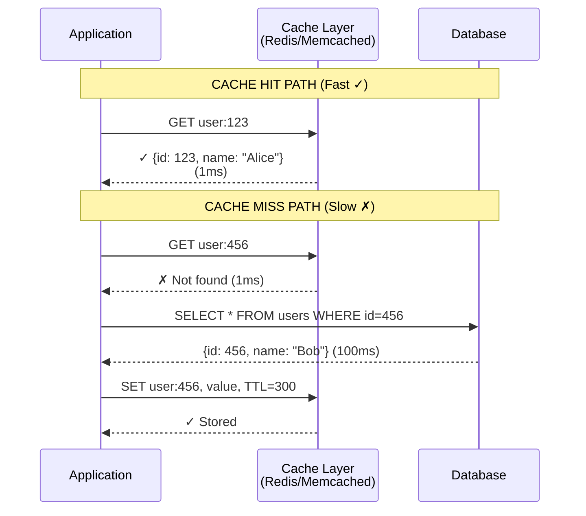
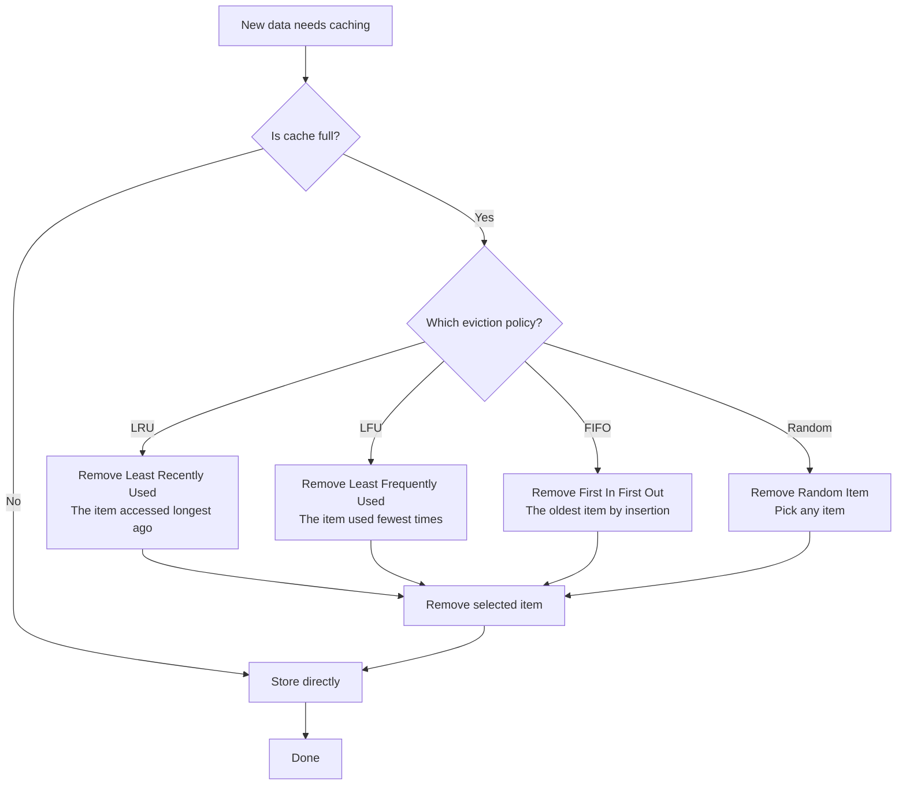
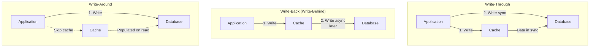
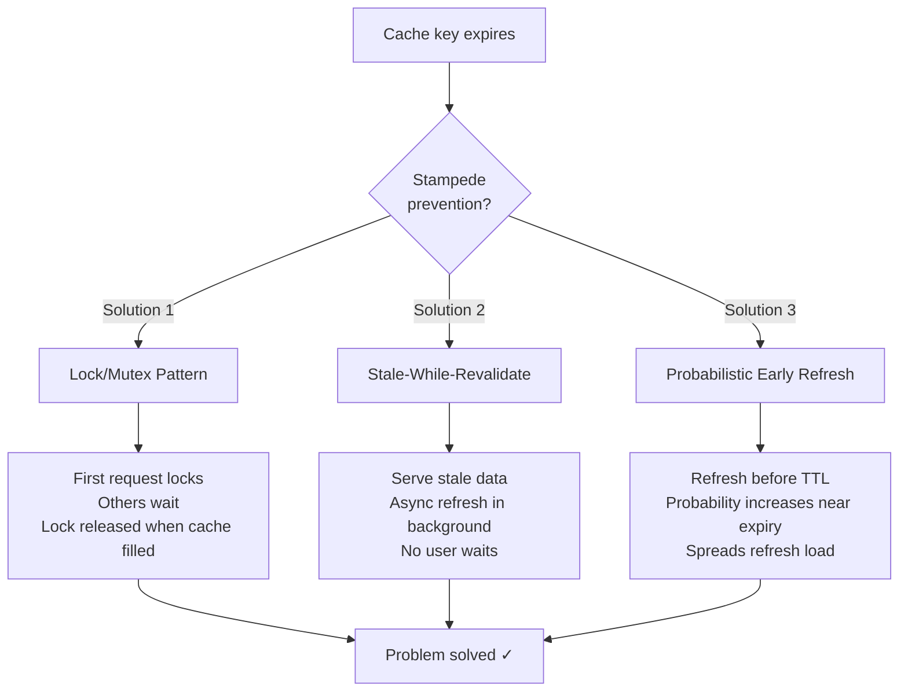
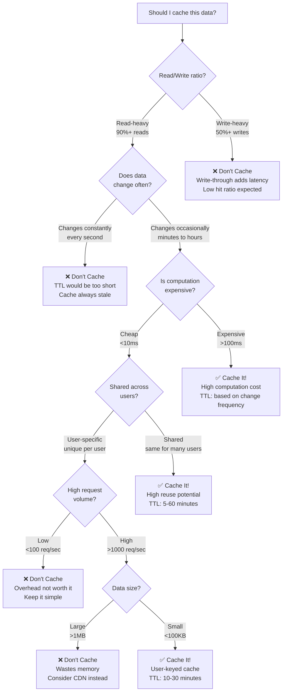
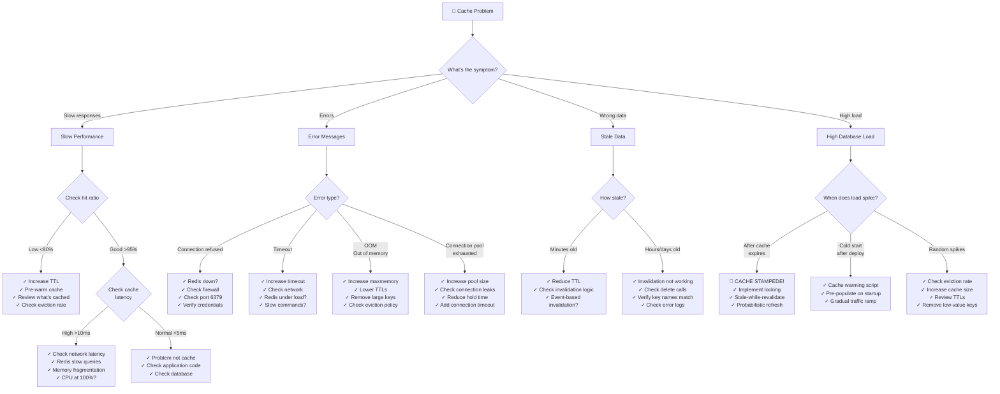

#system-design #building-block #storage #performance

```table-of-contents
title: 
style: nestedList # TOC style (nestedList|nestedOrderedList|inlineFirstLevel)
minLevel: 0 # Include headings from the specified level
maxLevel: 0 # Include headings up to the specified level
include: 
exclude: 
includeLinks: true # Make headings clickable
hideWhenEmpty: false # Hide TOC if no headings are found
debugInConsole: false # Print debug info in Obsidian console
```
# Caching

## Intuition (30 sec)

You look up a phone number in a phone book (slow). You write it on a sticky note on your desk (fast). Next time you need it, you check the sticky note first. That sticky note is a cache.

## Failure-First Scenario

> Your product page hits the database on every request: user info, product details, reviews, recommendations. Each page load = 8 DB queries = 400ms. You have 10,000 concurrent users = 80,000 queries/second. Your database melts. A cache would handle 95% of those reads from memory in <1ms.

---

## Working Knowledge (5 min)

### Core Concepts - Definitions First

**Cache:**
- **Definition:** A high-speed data storage layer that stores a subset of data, typically transient, so that future requests for that data are served faster
- **Purpose:** Reduces latency and load on slower backend systems (databases, APIs, disk)
- **How it works:** Sits between application and data source, serving frequently accessed data from fast memory (RAM)

**Key Terms:**
- **Cache Hit:** Request finds data in cache (fast path, ~1ms)
- **Cache Miss:** Request doesn't find data in cache, must fetch from origin (slow path, ~100ms+)
- **Hit Ratio:** Percentage of requests served from cache = Hits / (Hits + Misses)
- **TTL (Time To Live):** How long data stays in cache before expiring (in seconds)
- **Eviction:** Process of removing data from cache when it's full
- **Invalidation:** Explicitly removing or updating stale data in cache
- **Cold Cache:** Empty cache (after restart), all requests are misses
- **Warm Cache:** Cache with data, high hit ratio

### Visual Model - Cache in System

```
┌────────────────────────────────────────────┐
│           Application Request              │
└──────────────┬─────────────────────────────┘
               │
        ┌──────▼──────┐
        │Check Cache? │
        └──────┬──────┘
               │
       ┌───────┴────────┐
       │                │
   ┌───▼────┐      ┌────▼────┐
   │  HIT   │      │  MISS   │
   │  ~1ms  │      │ ~100ms+ │
   └───┬────┘      └────┬────┘
       │                │
       │           ┌────▼─────────┐
       │           │ Query Database│
       │           └────┬─────────┘
       │                │
       │           ┌────▼──────────┐
       │           │ Store in Cache│
       │           └────┬──────────┘
       │                │
       └────────┬───────┘
                │
        ┌───────▼────────┐
        │ Return to User │
        └────────────────┘

Performance Difference:
━━━━━━━━━━━━━━━━━━━━
Cache Hit:  ▰ 1ms
Cache Miss: ▰▰▰▰▰▰▰▰▰▰▰▰▰▰▰▰▰▰▰▰ 100ms
```

### Cache Strategies Comparison

| Strategy | How It Works | Pros | Cons | Use When |
|----------|-------------|------|------|----------|
| **Cache-Aside** | App checks cache → miss → reads DB → writes cache | Simple, only caches what's needed | First request always slow (cold start) | General purpose (most common) |
| **Write-Through** | App writes to cache AND DB synchronously | Cache always consistent | Higher write latency | Strong consistency needed |
| **Write-Back** | App writes to cache, cache writes to DB async | Fast writes | Risk of data loss if cache crashes | High write throughput |
| **Write-Around** | App writes to DB, cache populated on read | Prevents cache churn on writes | Reads after write are slow | Write-heavy with few re-reads |

**Most common:** Cache-aside (aka Lazy Loading). Simple, works for 90% of use cases.

---

## Layer 1: Conceptual Precision (15 min)

### Cache Hit vs Cache Miss - Deep Definition

**Cache Hit:**
- **Formal Definition:** A cache hit occurs when requested data is found in the cache, allowing the system to serve the request from fast memory without accessing the slower backing store
- **Simple Definition:** Data is already in cache, you get it fast
- **Performance Impact:** Typically 1-5ms for in-memory cache, 100x faster than database
- **Cost:** Minimal CPU, no network I/O, no database connection used

**Cache Miss:**
- **Formal Definition:** A cache miss occurs when requested data is not found in the cache, requiring the system to fetch from the origin (database, API, disk), then optionally store in cache
- **Simple Definition:** Data not in cache, must fetch from slow source
- **Performance Impact:** 50-500ms depending on backing store
- **Cost:** Database connection, network I/O, potential query execution time

**Types of Cache Misses:**
- **Cold Miss:** Cache is empty (after restart), first access always misses
- **Capacity Miss:** Cache is full, evicted data that's requested again
- **Conflict Miss:** Hash collision forces eviction of valid data



### Cache Hit Ratio - The Key Metric

**Definition:** Cache hit ratio is the percentage of requests successfully served from cache

**Formula:**
```
Hit Ratio = Cache Hits / (Cache Hits + Cache Misses)

Example:
1000 requests
  950 hits
   50 misses
Hit Ratio = 950 / 1000 = 95%
```

**What This Means:**
- **95%+ hit ratio:** Excellent, cache is effective
- **80-95% hit ratio:** Good, but room for improvement
- **<80% hit ratio:** Poor, investigate what's being cached

**Impact on Performance:**
```
Given: 1000 requests/second
       Cache hit = 1ms
       Cache miss = 100ms (DB query)

Scenario 1: 95% hit ratio
───────────────────────────
  950 hits  × 1ms   =   950ms
   50 misses × 100ms = 5,000ms
  Total: 5,950ms for 1000 requests
  Average: 5.95ms/request ✓

Scenario 2: 50% hit ratio (bad!)
────────────────────────────────
  500 hits  × 1ms   =   500ms
  500 misses × 100ms = 50,000ms
  Total: 50,500ms for 1000 requests
  Average: 50.5ms/request ✗

Impact: 8.5x slower with poor hit ratio!
```

### TTL (Time To Live) - Expiration Strategy

**TTL (Time To Live):**
- **Definition:** The duration (in seconds) that cached data is considered valid before it expires and must be refreshed
- **Purpose:** Balances data freshness with cache efficiency
- **How it works:** When TTL expires, next access treats it as a cache miss

**TTL Trade-offs:**

```
Short TTL (60 seconds)
═══════════════════════════════════════
┌───────────────────────────────────┐
│ Every minute, cache refreshes     │
│                                   │
│ ✓ Data stays fresh                │
│ ✓ Changes visible quickly         │
│                                   │
│ ✗ More cache misses               │
│ ✗ Higher database load            │
│ ✗ Lower hit ratio                 │
│                                   │
│ Use when:                         │
│ • Data changes frequently         │
│ • Staleness is unacceptable       │
│ • User profile, live scores       │
└───────────────────────────────────┘

Long TTL (3600 seconds = 1 hour)
═══════════════════════════════════════
┌───────────────────────────────────┐
│ Cache valid for an hour           │
│                                   │
│ ✓ High hit ratio                  │
│ ✓ Low database load               │
│ ✓ Excellent performance           │
│                                   │
│ ✗ Stale data for up to 1 hour    │
│ ✗ Changes not visible quickly     │
│                                   │
│ Use when:                         │
│ • Data rarely changes             │
│ • Staleness acceptable            │
│ • Product catalog, blog posts     │
└───────────────────────────────────┘

Infinite TTL (no expiration)
═══════════════════════════════════════
┌───────────────────────────────────┐
│ Cache never expires automatically │
│                                   │
│ ✓ Maximum performance             │
│ ✓ Predictable behavior            │
│                                   │
│ ✗ Must manually invalidate        │
│ ✗ Can serve stale data forever    │
│                                   │
│ Use when:                         │
│ • Immutable data                  │
│ • Event-based invalidation used   │
│ • Static assets, archived content │
└───────────────────────────────────┘

Typical TTL Values:
  Session data:        600s (10 min)
  User profile:        1800s (30 min)
  Product details:     3600s (1 hour)
  Static content:      86400s (24 hours)
  Immutable data:      ∞ (never expire)
```

### Eviction Policies - What to Remove

**Eviction Policy:**
- **Definition:** An algorithm that determines which cached item to remove when the cache is full and new data needs to be stored
- **Purpose:** Maximizes cache effectiveness by keeping most valuable data
- **When it runs:** When cache reaches capacity and new item needs space



**Eviction Policies (Detailed):**

**1. LRU (Least Recently Used)** - Most Common
```
Definition: Evicts the item that hasn't been accessed
           for the longest time

How it works:
  Every access updates "last used" timestamp
  On eviction: remove oldest timestamp

┌─────────────────────────────────────┐
│ Cache State (time →)                │
├─────────────────────────────────────┤
│ Key A: last used 60 sec ago   ←OLD │ Evict this!
│ Key B: last used 30 sec ago         │
│ Key C: last used 5 sec ago          │
│ Key D: just accessed          ←NEW  │
└─────────────────────────────────────┘

Pros:
✓ Good for temporal locality
✓ Recent data likely needed again
✓ Intuitive behavior

Cons:
✗ One-time scan can evict hot data
✗ Doesn't consider access frequency

Best for:
• General purpose caching
• Time-series data
• User sessions
```

**2. LFU (Least Frequently Used)**
```
Definition: Evicts the item accessed the fewest
           number of times

How it works:
  Counter increments on each access
  On eviction: remove lowest counter

┌─────────────────────────────────────┐
│ Cache State                         │
├─────────────────────────────────────┤
│ Key A: accessed 2 times      ←LOW  │ Evict this!
│ Key B: accessed 15 times            │
│ Key C: accessed 89 times            │
│ Key D: accessed 234 times    ←HIGH │
└─────────────────────────────────────┘

Pros:
✓ Keeps genuinely popular data
✓ Not fooled by recent one-time accesses

Cons:
✗ Old popular item stays even if no longer used
✗ New items hard to get cached
✗ More complex implementation

Best for:
• Content with stable popularity
• Recommendation systems
• Popular articles/videos
```

**3. FIFO (First In First Out)**
```
Definition: Evicts items in order they were added
           (oldest insertion time)

How it works:
  Queue of insertion times
  On eviction: remove head of queue

┌─────────────────────────────────────┐
│ Cache Queue (insertion order)       │
├─────────────────────────────────────┤
│ Key A: added 1st             ←OLD  │ Evict this!
│ Key B: added 2nd                    │
│ Key C: added 3rd                    │
│ Key D: added 4th (latest)    ←NEW  │
└─────────────────────────────────────┘

Pros:
✓ Simple to implement
✓ Predictable behavior
✓ Low overhead

Cons:
✗ Ignores usage patterns
✗ May evict frequently used data
✗ Not optimal for most workloads

Best for:
• When simplicity matters
• Circular buffers
• Testing/development
```

**4. Random Eviction**
```
Definition: Evicts a randomly selected item

How it works:
  Pick random key to evict

Pros:
✓ Extremely simple
✓ No metadata overhead
✓ Surprisingly effective in practice

Cons:
✗ May evict hot data by chance
✗ Unpredictable

Best for:
• When memory is extremely tight
• Prototyping
```

### Write Strategies - Visual Comparison

**Write Strategy:**
- **Definition:** A pattern that determines how writes flow through cache and database layers
- **Purpose:** Balances consistency, performance, and complexity



**Detailed Comparison:**

```
Write-Through Strategy
═══════════════════════════════════════════
Definition: Write to cache AND database
           synchronously (both must succeed)

Flow:
  1. App writes to cache
  2. App writes to database (waits)
  3. Both succeed → return success
  4. Either fails → return error

┌────────────────────────────────────────┐
│ Timeline:                              │
│ t=0ms    Write to cache      ✓         │
│ t=0ms    Write to DB starts            │
│ t=50ms   DB write completes  ✓         │
│ t=50ms   Return success to user        │
│                                        │
│ User waits: 50ms                       │
└────────────────────────────────────────┘

Pros:
✓ Cache always consistent with DB
✓ Simple to reason about
✓ Data durable immediately

Cons:
✗ Higher write latency (wait for DB)
✗ No write performance benefit
✗ Cache and DB both must be available

Best for:
• Financial transactions
• User authentication
• Critical data requiring consistency


Write-Back (Write-Behind) Strategy
═══════════════════════════════════════════
Definition: Write to cache only, async
           background process writes to DB

Flow:
  1. App writes to cache (fast)
  2. Return success immediately
  3. Background job writes to DB later
  4. DB write happens asynchronously

┌────────────────────────────────────────┐
│ Timeline:                              │
│ t=0ms    Write to cache      ✓         │
│ t=1ms    Return success to user   ←── │
│ t=5s     Background job writes to DB   │
│ t=5.05s  DB write completes  ✓         │
│                                        │
│ User waits: 1ms (50x faster!)          │
└────────────────────────────────────────┘

Pros:
✓ Very fast writes (cache speed)
✓ Batching possible (efficient DB writes)
✓ Smooths traffic spikes

Cons:
✗ Data loss risk if cache crashes
✗ Complex to implement correctly
✗ Temporary inconsistency

Best for:
• High write throughput systems
• Analytics, logs, metrics
• When eventual consistency acceptable


Write-Around Strategy
═══════════════════════════════════════════
Definition: Write to database only,
           bypass cache entirely

Flow:
  1. App writes to database directly
  2. Cache not updated
  3. On next read: cache miss → load from DB
  4. Future reads served from cache

┌────────────────────────────────────────┐
│ Write Operation:                       │
│ t=0ms    Write to DB         ✓         │
│ t=50ms   Complete                      │
│ Cache:   [not updated]                 │
│                                        │
│ Next Read:                             │
│ t=100ms  Read request                  │
│ t=101ms  Cache miss                    │
│ t=150ms  Load from DB → cache          │
│ t=151ms  Return data                   │
└────────────────────────────────────────┘

Pros:
✓ Prevents cache pollution from writes
✓ Simple implementation
✓ Good for write-once-read-many

Cons:
✗ First read after write is slow
✗ Read-after-write inconsistency
✗ Wasted cache space on unread writes

Best for:
• Infrequently read data
• Write-heavy workloads
• Append-only logs
```

### Cache Stampede (Thundering Herd) - The Crisis

**Cache Stampede:**
- **Definition:** A catastrophic scenario where a popular cache key expires, causing thousands of simultaneous requests to hit the database for the same data
- **Also called:** Thundering Herd, Dog-Piling
- **Why it happens:** Hot key expires → all requests miss → all query DB simultaneously

**The Problem Visualized:**

```
Normal Operation (Cache Valid)
═══════════════════════════════════
      1000 requests/sec
           │
      ┌────▼────┐
      │  Cache  │ ← All hits, 1ms each
      │ (hot!)  │
      └─────────┘

      Database: idle ✓


Stampede Event (Cache Expires at t=0)
═══════════════════════════════════════
      1000 requests/sec
      │ │ │ │ │ │ │ │
      │ │ │ │ │ │ │ │  All miss!
      └─┴─┴─┴─┴─┴─┴─┘
           │
      ┌────▼────┐
      │  Cache  │ ← Empty! All miss!
      │ (empty) │
      └────┬────┘
           │
           │ 1000 simultaneous queries!
           │ │ │ │ │ │ │ │
      ┌────▼─▼─▼─▼─▼─▼─▼─▼────┐
      │      Database          │
      │   OVERLOADED! ☠        │
      │                        │
      │ • Connection pool full │
      │ • Query queue backed up│
      │ • Server CPU at 100%   │
      │ • May crash completely │
      └────────────────────────┘

Result: Database meltdown, site down
```

**Solutions to Cache Stampede:**



**Solution 1: Lock/Mutex Pattern**
```
Definition: Only one request fetches data,
           others wait for cache to be populated

Implementation:
  1. Request checks cache → miss
  2. Request tries to acquire lock on key
  3. If acquired:
     - Fetch from database
     - Store in cache
     - Release lock
  4. If not acquired:
     - Wait for lock release
     - Check cache again (should be populated)

┌─────────────────────────────────────────┐
│ Timeline (1000 concurrent requests):    │
├─────────────────────────────────────────┤
│ t=0ms    1000 requests arrive           │
│                                         │
│ t=1ms    Request #1 acquires lock  ✓    │
│          Requests #2-1000 WAIT...       │
│                                         │
│ t=50ms   Request #1 fetches from DB     │
│                                         │
│ t=100ms  Request #1 stores in cache     │
│          Request #1 releases lock       │
│                                         │
│ t=101ms  Requests #2-1000 check cache   │
│          All get cached data ✓          │
│                                         │
│ Database queries: 1 (not 1000!)         │
└─────────────────────────────────────────┘

Pros:
✓ Prevents stampede completely
✓ Only 1 DB query
✓ Easy to understand

Cons:
✗ Requests must wait (bad UX)
✗ Lock holder failure = deadlock risk
✗ Requires distributed lock (Redis, ZK)


Solution 2: Stale-While-Revalidate
════════════════════════════════════════
Definition: Serve expired (stale) data while
           refreshing cache in background

Implementation:
  1. Request checks cache → expired but present
  2. Immediately return stale data to user
  3. Trigger background refresh
  4. Next requests get fresh data

┌─────────────────────────────────────────┐
│ Timeline:                               │
├─────────────────────────────────────────┤
│ t=0ms    Request arrives                │
│          Cache expired (but present)    │
│                                         │
│ t=1ms    Return stale data to user ✓    │
│          User happy (fast response!)    │
│                                         │
│ t=1ms    Background: fetch from DB      │
│                                         │
│ t=50ms   Background: update cache       │
│                                         │
│ t=51ms   Next requests get fresh data   │
└─────────────────────────────────────────┘

Pros:
✓ No user waits
✓ Graceful degradation
✓ Stampede prevented

Cons:
✗ Serves stale data temporarily
✗ More complex logic
✗ Need background job system


Solution 3: Probabilistic Early Expiration
═══════════════════════════════════════════
Definition: Randomly refresh before TTL expires,
           probability increases as expiry nears

Implementation:
  Formula:
    delta = TTL - age
    refresh_probability = 1 - (delta / TTL)

  1. On each access, check if should refresh
  2. Closer to expiry → higher probability
  3. Spreads refresh load over time

┌─────────────────────────────────────────┐
│ Example: TTL = 300 seconds              │
├─────────────────────────────────────────┤
│ Age 0s   (just cached)  0% chance       │
│ Age 150s (halfway)      50% chance      │
│ Age 270s (near expiry)  90% chance      │
│ Age 300s (expired)      100% (refresh)  │
│                                         │
│ Effect: Refreshes spread out           │
│         No simultaneous expiry          │
└─────────────────────────────────────────┘

Pros:
✓ No coordination needed
✓ Naturally prevents stampede
✓ Simple to implement

Cons:
✗ Unnecessary refreshes
✗ Still serves slightly stale data
✗ Probabilistic (not guaranteed)
```

### Cache Invalidation - "The Two Hard Things"

> "There are only two hard things in Computer Science: cache invalidation and naming things." — Phil Karlton

**Cache Invalidation:**
- **Definition:** The process of removing or updating cached data when the source data changes
- **Why it's hard:** Distributed system must stay consistent across cache and database
- **The challenge:** How do you know when cached data is stale?

**Invalidation Strategies:**

```
Strategy 1: TTL-Based (Time-Based)
═══════════════════════════════════════
Definition: Rely on expiration time,
           no explicit invalidation

How:
  SET user:123 {...} EX 300  (5 min TTL)
  After 5 minutes → cache miss → refresh

┌─────────────────────────────────────┐
│ Timeline:                           │
│ t=0s     User data cached           │
│ t=300s   TTL expires                │
│ t=301s   Next read → miss → refresh │
│          (even if data unchanged)   │
└─────────────────────────────────────┘

Pros:
✓ Simple, no coordination needed
✓ Guaranteed eventual consistency
✓ Works for distributed systems

Cons:
✗ Stale data for up to TTL duration
✗ May refresh unnecessarily
✗ Not suitable for real-time needs

Best for:
• Data that changes infrequently
• Acceptable staleness window
• Product catalogs, blog posts


Strategy 2: Event-Based (Explicit)
═══════════════════════════════════════
Definition: Explicitly delete/update cache
           when source data changes

How:
  1. Application updates database
  2. Application deletes cache entry
  3. Next read → miss → fresh data cached

┌─────────────────────────────────────┐
│ Write Flow:                         │
│ 1. UPDATE users SET name='Bob'      │
│    WHERE id=123                     │
│                                     │
│ 2. DELETE cache key user:123        │
│                                     │
│ Next Read:                          │
│ 3. Cache miss                       │
│ 4. Load fresh data from DB          │
│ 5. Cache new data                   │
└─────────────────────────────────────┘

Pros:
✓ Data always fresh after update
✓ No unnecessary refreshes
✓ Predictable behavior

Cons:
✗ Complex: must track all cache keys
✗ Race conditions possible
✗ What if delete fails?

Best for:
• Real-time requirements
• Critical data consistency
• User profiles, financial data


Strategy 3: Version-Based (Immutable)
═══════════════════════════════════════
Definition: Include version in cache key,
           new version = new key

How:
  Old: user:123 → {..., version: 1}
  New: user:123:v2 → {..., version: 2}

  Application always requests latest version

┌─────────────────────────────────────┐
│ Cache State:                        │
│                                     │
│ user:123:v1 → {name: "Alice"}       │
│ user:123:v2 → {name: "Bob"}   ←use │
│                                     │
│ No invalidation needed!             │
│ Old version naturally expires       │
└─────────────────────────────────────┘

Pros:
✓ No invalidation race conditions
✓ Easy rollback (use old version)
✓ Simple reasoning

Cons:
✗ Multiple versions in cache (space)
✗ Application must track versions
✗ Orphaned old versions

Best for:
• Immutable data patterns
• Versioned APIs
• Content addressed storage


Strategy 4: Write-Through (Always Sync)
═══════════════════════════════════════
Definition: Update cache and database
           simultaneously on write

How:
  1. Write to cache
  2. Write to database
  3. Cache always reflects DB

Pros:
✓ No staleness
✓ No invalidation logic needed
✓ Strong consistency

Cons:
✗ Slower writes
✗ Complex error handling

Best for:
• Strong consistency requirements
• Low write volume
```

**The Classic Invalidation Pattern (Delete, Don't Update):**

```
❌ WRONG: Update cache on write
═══════════════════════════════════════
Thread 1: Write A=1 to DB   ────────────────────────✓
Thread 2: Write A=2 to DB   ──────────✓
Thread 1: Update cache A=1  ──────────────────────────────✓
Thread 2: Update cache A=2  ────────────────✓

Final state: DB=1, Cache=2  ← INCONSISTENT!


✓ CORRECT: Delete cache on write
═══════════════════════════════════════
Thread 1: Write A=1 to DB   ────────────────────────✓
Thread 2: Write A=2 to DB   ──────────✓
Thread 1: Delete cache      ──────────────────────────────✓
Thread 2: Delete cache      ────────────────✓

Final state: DB=1, Cache=empty
Next read: miss → load from DB → cache=1  ← CONSISTENT!

Why delete instead of update?
• Avoids race conditions
• Simpler logic
• Next read ensures consistency
```

---

## Layer 2: Technology-Specific Examples (20 min)

### Redis vs Memcached - Tool Comparison

**Cache Technology:**
- **Definition:** In-memory data stores optimized for low-latency data access
- **Purpose:** Serve as application cache layer

| Feature | Redis | Memcached |
|---------|-------|-----------|
| **Definition** | In-memory data structure store with persistence and rich features | Simple, high-performance, distributed memory cache |
| **Data Types** | Strings, Lists, Sets, Hashes, Sorted Sets, Bitmaps, HyperLogLogs, Streams | Strings only (key-value) |
| **Persistence** | RDB snapshots, AOF logs (survives restart) | None (in-memory only) |
| **Replication** | Master-replica, Sentinel for HA | None (client handles) |
| **Clustering** | Built-in Redis Cluster | Client-side sharding |
| **Threading** | Single-threaded (with I/O threads in 6.0+) | Multi-threaded |
| **Max Value Size** | 512 MB | 1 MB |
| **Lua Scripting** | Yes (atomic operations) | No |
| **Pub/Sub** | Yes | No |
| **Transactions** | Yes (MULTI/EXEC) | No |
| **Use Case** | General cache, session store, leaderboards, queues | Pure cache, simple key-value |
| **Performance** | ⭐⭐⭐⭐⭐ (100K+ ops/sec) | ⭐⭐⭐⭐⭐ (1M+ ops/sec, slightly faster) |
| **Memory Efficiency** | ⭐⭐⭐⭐ (more overhead) | ⭐⭐⭐⭐⭐ (very efficient) |
| **Complexity** | ⭐⭐⭐⭐ (more features) | ⭐⭐ (simpler) |

**Decision Tree:**

```
Do you need persistence?
├─ Yes → Use Redis
│         (data survives restart)
│
└─ No → Do you need complex data types?
        ├─ Yes → Use Redis
        │         (lists, sets, sorted sets)
        │
        └─ No → Do you need pub/sub or Lua?
                ├─ Yes → Use Redis
                │
                └─ No → Either works!
                        Redis (more popular)
                        Memcached (slightly faster)

Reality: 90% of teams use Redis
         • More features
         • Better tooling
         • One tool for multiple uses
```

### Redis Configuration (Production-Ready)

```yaml
# redis.conf - Annotated for Production

# ═══════════════════════════════════════════════════
# NETWORK CONFIGURATION
# ═══════════════════════════════════════════════════

bind 0.0.0.0
# Definition: IP addresses Redis listens on
# 0.0.0.0 = all interfaces (needed for remote access)
# Security: Use firewall rules to restrict access

port 6379
# Definition: TCP port Redis listens on
# Default: 6379 (standard Redis port)

tcp-backlog 511
# Definition: Queue size for pending connections
# Higher value = handles more simultaneous connections
# Typical: 511 (default is good)

timeout 300
# Definition: Close idle client connections after N seconds
# 0 = never close
# Typical: 300 (5 minutes) to free resources

# ═══════════════════════════════════════════════════
# MEMORY MANAGEMENT
# ═══════════════════════════════════════════════════

maxmemory 2gb
# Definition: Maximum memory Redis can use
# CRITICAL: Set this! Prevents Redis from consuming all RAM
# Formula: Server RAM × 0.5 (leave room for OS)

maxmemory-policy allkeys-lru
# Definition: What to do when maxmemory is reached
# Options:
#   allkeys-lru → Evict least recently used (LRU) keys
#   allkeys-lfu → Evict least frequently used (LFU) keys
#   volatile-lru → Evict LRU keys with TTL set
#   volatile-ttl → Evict keys with soonest expiration
#   noeviction → Return errors, don't evict
# Recommendation: allkeys-lru (general purpose)

maxmemory-samples 5
# Definition: How many keys to sample for LRU/LFU
# Higher = more accurate but slower
# Default: 5 (good balance)

# ═══════════════════════════════════════════════════
# PERSISTENCE (Optional - for cache usually disabled)
# ═══════════════════════════════════════════════════

save ""
# Definition: Disable RDB snapshots for pure cache
# If enabled: "save 900 1" = save after 900s if 1 key changed
# For cache: Disable persistence (faster, not needed)

appendonly no
# Definition: Append-only file (AOF) for durability
# For cache: Keep 'no' (we can rebuild from database)
# For session store: Consider 'yes'

# ═══════════════════════════════════════════════════
# PERFORMANCE TUNING
# ═══════════════════════════════════════════════════

# Threading (Redis 6.0+)
io-threads 4
# Definition: Number of I/O threads for network operations
# Enables multi-threading for socket I/O
# Formula: Number of CPU cores / 2
# Example: 8-core machine = 4 I/O threads

io-threads-do-reads yes
# Definition: Use I/O threads for reads (not just writes)
# Improves throughput on multi-core systems

# Connection limits
maxclients 10000
# Definition: Maximum number of simultaneous clients
# Default: 10000
# Increase if "max number of clients reached" errors

# ═══════════════════════════════════════════════════
# SLOW LOG (Monitoring)
# ═══════════════════════════════════════════════════

slowlog-log-slower-than 10000
# Definition: Log queries slower than N microseconds
# 10000 μs = 10ms
# Use to identify slow operations

slowlog-max-len 128
# Definition: Keep last N slow queries
# Check with: SLOWLOG GET 10

# ═══════════════════════════════════════════════════
# SECURITY
# ═══════════════════════════════════════════════════

requirepass your-strong-password-here
# Definition: Password required for all commands
# CRITICAL: Always set in production!
# Generate: openssl rand -base64 32

rename-command FLUSHALL ""
rename-command FLUSHDB ""
rename-command CONFIG ""
# Definition: Disable dangerous commands
# Empty string = disable completely
# Prevents accidental data deletion
```

**Redis Client Configuration (Java - Spring Boot):**

```yaml
# application.yml

spring:
  redis:
    host: localhost          # Redis server hostname
    port: 6379              # Redis port
    password: ${REDIS_PASSWORD}  # From environment variable
    database: 0             # Redis database index (0-15)

    timeout: 2000ms         # Connection timeout
                           # Definition: Max time to wait for connection
                           # Typical: 2000ms (2 seconds)

    lettuce:               # Lettuce client (modern, async)
      pool:
        max-active: 20     # Max connections in pool
                          # Definition: Maximum concurrent Redis commands
                          # Formula: Expected concurrent requests / 10

        max-idle: 10       # Max idle connections to keep
                          # Definition: Connections kept ready
                          # Typical: max-active / 2

        min-idle: 5        # Min connections to maintain
                          # Definition: Always ready connections
                          # Typical: 5-10 for fast startup

        max-wait: 2000ms   # Max wait for connection from pool
                          # Definition: Time to wait if pool exhausted
                          # Typical: 2000ms, then fail fast

      shutdown-timeout: 100ms  # Graceful shutdown time

  cache:
    type: redis           # Use Redis as cache provider
    redis:
      time-to-live: 600000   # Default TTL: 600000ms = 10 minutes
                            # Can override per cache
      cache-null-values: false  # Don't cache null results
                               # Prevents cache pollution

      use-key-prefix: true  # Prefix cache names to keys
                           # Good for multi-tenant systems
```

### Multi-Level Caching Strategy

**Multi-Level Caching:**
- **Definition:** A hierarchical caching strategy where multiple cache layers work together, each with different characteristics
- **Purpose:** Optimize for both speed and hit ratio by caching at multiple levels

```
┌─────────────────────────────────────────────────────────┐
│              CACHE HIERARCHY (Front to Back)            │
└─────────────────────────────────────────────────────────┘

L1: Browser Cache (Client-Side)
════════════════════════════════════════════
Location: User's browser
Speed:    <1ms (instant)
Size:     ~100MB
TTL:      Long (hours to days)
Hit Ratio: ~30-50%

Best for: Static assets (JS, CSS, images)

    ↓ Miss ↓

L2: CDN Edge Cache
════════════════════════════════════════════
Location: CDN node (geographically close)
Speed:    10-50ms
Size:     ~100GB per node
TTL:      Medium (minutes to hours)
Hit Ratio: ~70-80% (of requests that reach here)

Best for: Public content, API responses

    ↓ Miss ↓

L3: Application In-Memory Cache
════════════════════════════════════════════
Location: Application server RAM (caffeine, guava)
Speed:    1ms
Size:     ~1GB per server
TTL:      Short (seconds to minutes)
Hit Ratio: ~80-90% (of requests that reach here)

Best for: User sessions, computed results

    ↓ Miss ↓

L4: Redis/Memcached (Distributed Cache)
════════════════════════════════════════════
Location: Dedicated cache server
Speed:    2-5ms (network hop)
Size:     ~100GB cluster
TTL:      Medium (minutes to hours)
Hit Ratio: ~95%+ (of requests that reach here)

Best for: Shared across all app servers

    ↓ Miss ↓

L5: Database Query Cache
════════════════════════════════════════════
Location: Database server RAM
Speed:    5-10ms
Size:     ~10GB
TTL:      Very short (invalidated on writes)
Hit Ratio: Varies widely

Best for: Identical repeated queries

    ↓ Miss ↓

L6: Database (Disk)
════════════════════════════════════════════
Location: SSD/HDD storage
Speed:    50-500ms
Size:     TBs
TTL:      N/A (source of truth)

This is the slowest layer (source of truth)
```

**Example: Product Page Request Flow**

```
User requests: GET /product/12345

Step 1: Browser Cache
┌─────────────────────────────────────┐
│ Check: product-page-12345           │
│ Result: MISS (first visit)          │
│ Time: 1ms                           │
└────────┬────────────────────────────┘
         ↓

Step 2: CDN Edge Cache
┌─────────────────────────────────────┐
│ Check: api.example.com/product/12345│
│ Result: MISS                        │
│ Time: 20ms                          │
└────────┬────────────────────────────┘
         ↓

Step 3: Application Server (in-memory)
┌─────────────────────────────────────┐
│ Check: Local cache                  │
│ Result: MISS                        │
│ Time: 1ms                           │
└────────┬────────────────────────────┘
         ↓

Step 4: Redis (distributed cache)
┌─────────────────────────────────────┐
│ Check: product:12345                │
│ Result: HIT! ✓                      │
│ Data: {name: "Widget", price: 29.99}│
│ Time: 3ms                           │
│                                     │
│ Total time: 25ms (excellent!)       │
└─────────────────────────────────────┘

Subsequent requests (same user):
Step 1: Browser Cache HIT → 1ms ✓

Benefits of multi-level:
• 95%+ overall hit ratio
• Most requests extremely fast
• Graceful degradation on failures
```

---

## Layer 3: Production-Ready Details (30 min)

### Production Architecture (Multi-Region Caching)

```
                    🌍 Internet
                       │
              ┌────────▼────────┐
              │   Route53 DNS    │
              │  Geo-routing     │
              └────────┬─────────┘
                       │
         ┌─────────────┼──────────────┐
         │             │              │
    ┌────▼────┐   ┌────▼────┐   ┌────▼────┐
    │CloudFront│   │CloudFront│   │CloudFront│
    │US-East   │   │US-West  │   │  EU      │
    │(CDN L2)  │   │(CDN L2) │   │(CDN L2)  │
    └────┬────┘   └────┬────┘   └────┬─────┘
         │             │              │
    ┌────▼──────────────────────────▼────────┐
    │         Application Load Balancer       │
    │         (Layer 7, SSL termination)      │
    └────┬─────┬─────┬─────┬─────┬─────┬────┘
         │     │     │     │     │     │
    ┌────▼┐ ┌─▼──┐ ┌▼───┐ ┌──▼┐ ┌▼───┐ │
    │App1 │ │App2│ │App3│ │App4│ │App5│ │
    │     │ │    │ │    │ │    │ │    │ │
    │ ┌───┴──┐  Each app has:               │
    │ │Caffeine│ • In-memory cache (L3)     │
    │ │ 1GB  │   • 1GB Caffeine cache       │
    │ └──────┘   • LRU eviction             │
    └──┬─────────┬─────────┬────────────────┘
       │         │         │
       │    ┌────▼─────────▼────┐
       │    │   Redis Cluster   │  ← L4 Cache
       │    │   (Distributed)    │
       │    ├───────────────────┤
       │    │ Master 1 (Primary)│
       │    │   Replica 1a      │
       │    │   Replica 1b      │
       │    ├───────────────────┤
       │    │ Master 2 (Primary)│
       │    │   Replica 2a      │
       │    │   Replica 2b      │
       │    ├───────────────────┤
       │    │ Master 3 (Primary)│
       │    │   Replica 3a      │
       │    │   Replica 3b      │
       │    └─────────┬─────────┘
       │              │
       └──────┬───────┘
              │
    ┌─────────▼──────────┐
    │  PostgreSQL Primary│  ← Source of truth
    │  (with query cache)│
    └─────────┬──────────┘
              │
    ┌─────────┴──────────┐
    │                    │
┌───▼────┐         ┌─────▼───┐
│Read    │         │Read     │
│Replica1│         │Replica2 │
└────────┘         └─────────┘


Component Definitions:
══════════════════════

CloudFront (CDN):
  • Content Delivery Network edge locations
  • Caches static content and API responses
  • 225+ edge locations worldwide
  • TTL: 5-60 minutes

Application Servers:
  • Spring Boot apps with embedded Caffeine cache
  • Each has independent 1GB in-memory cache
  • Fast: ~1ms access time
  • Shared across local requests only

Redis Cluster:
  • 3-node cluster (master + 2 replicas each)
  • Distributed hash slots (16384 slots)
  • Automatic failover with Redis Sentinel
  • Memory: 32GB per master node
  • Shared across all application servers

PostgreSQL:
  • Primary for writes
  • 2 read replicas for read scaling
  • Query result cache enabled
  • Connection pool: 100 connections
```

### Cache Hit Ratio Monitoring Dashboard

```
╔═══════════════════════════════════════════════════════════╗
║            CACHE PERFORMANCE DASHBOARD                    ║
║                 Last 24 Hours                             ║
╠═══════════════════════════════════════════════════════════╣
║                                                           ║
║  📊 Overall Hit Ratio: 96.3%  ✓ EXCELLENT                 ║
║  ════════════════════════════════════════════════         ║
║  ▰▰▰▰▰▰▰▰▰▰▰▰▰▰▰▰▰▰▰▰▰▰▰▰▰▰▰▰▰▰▰▰▰▰▰▰▰▰▰░               ║
║                                                           ║
║  Definition: Percentage of requests served from cache     ║
║  Target: >95%                                             ║
║  Current: 963,000 hits / 1,000,000 requests               ║
║                                                           ║
╠═══════════════════════════════════════════════════════════╣
║  🔵 Cache Operations Rate                                 ║
╠═══════════════════════════════════════════════════════════╣
║                                                           ║
║  Reads:   14,523/sec  ▰▰▰▰▰▰▰▰▰▰▰▰▰▰▰▰▰▰▰▰▰▰░░          ║
║  Writes:   1,847/sec  ▰▰▰░░░░░░░░░░░░░░░░░░░░            ║
║  Deletes:    124/sec  ▰░░░░░░░░░░░░░░░░░░░░░░            ║
║  Evictions:   23/sec  ░░░░░░░░░░░░░░░░░░░░░░░            ║
║                                                           ║
║  Definition:                                              ║
║    • Reads: GET operations (cache lookups)                ║
║    • Writes: SET operations (cache updates)               ║
║    • Deletes: Explicit invalidations                      ║
║    • Evictions: Automatic removals (memory full)          ║
║                                                           ║
╠═══════════════════════════════════════════════════════════╣
║  ⚡ Latency (P50 / P95 / P99)                              ║
╠═══════════════════════════════════════════════════════════╣
║                                                           ║
║  Cache Hit:   0.8ms / 1.2ms / 2.3ms   ✓                   ║
║  Cache Miss: 87ms / 145ms / 234ms     ✓                   ║
║                                                           ║
║  Definition:                                              ║
║    P50 (median): 50% of requests faster than this         ║
║    P95: 95% of requests faster than this                  ║
║    P99: 99% of requests faster than this                  ║
║                                                           ║
║  Analysis: 100x faster with cache!                        ║
║                                                           ║
╠═══════════════════════════════════════════════════════════╣
║  💾 Memory Usage                                           ║
╠═══════════════════════════════════════════════════════════╣
║                                                           ║
║  Used:     28.4 GB                                        ║
║  Max:      32.0 GB                                        ║
║  Utilization: 88.8%  ⚠ APPROACHING LIMIT                  ║
║  ▰▰▰▰▰▰▰▰▰▰▰▰▰▰▰▰▰▰▰▰▰▰▰▰▰▰▰▰▰▰▰▰▰▰▰▰░░░                ║
║                                                           ║
║  Keys:     12,456,789                                     ║
║  Avg Size: 2.4 KB                                         ║
║                                                           ║
║  Eviction Policy: allkeys-lru                             ║
║  Evictions/sec: 23  (normal at high utilization)          ║
║                                                           ║
║  ⚠ Recommendation: Consider increasing memory to 48GB     ║
║                                                           ║
╠═══════════════════════════════════════════════════════════╣
║  🔑 Top Cache Keys (by hit count)                          ║
╠═══════════════════════════════════════════════════════════╣
║                                                           ║
║  1. product:featured         245,678 hits  (hot!)         ║
║     TTL: 300s, Size: 145KB                                ║
║                                                           ║
║  2. user:session:*           189,234 hits                 ║
║     TTL: 1800s, Size: 2KB avg                             ║
║                                                           ║
║  3. api:recommendations      134,567 hits                 ║
║     TTL: 600s, Size: 89KB                                 ║
║                                                           ║
║  4. config:feature-flags     98,765 hits                  ║
║     TTL: 60s, Size: 3KB                                   ║
║                                                           ║
║  5. catalog:categories        87,654 hits                 ║
║     TTL: 3600s, Size: 234KB                               ║
║                                                           ║
╠═══════════════════════════════════════════════════════════╣
║  ⚠ Problem Keys (low hit ratio)                           ║
╠═══════════════════════════════════════════════════════════╣
║                                                           ║
║  user:temp:*        Hit ratio: 12%  ← Remove from cache   ║
║  Definition: Temporary data, accessed once then never     ║
║  Action: Don't cache or use very short TTL (10s)          ║
║                                                           ║
║  report:export:*    Hit ratio: 3%   ← Remove from cache   ║
║  Definition: One-time exports, never re-accessed          ║
║  Action: Don't cache these at all                         ║
║                                                           ║
╠═══════════════════════════════════════════════════════════╣
║  📈 Trend Analysis (24h)                                   ║
╠═══════════════════════════════════════════════════════════╣
║                                                           ║
║  Hit Ratio:     96.3% → 96.5%  ▲ +0.2%  ✓                 ║
║  Memory Usage:  28.1GB → 28.4GB  ▲ +1%                    ║
║  Evictions:     18/s → 23/s  ▲ +28%  ⚠ Monitor            ║
║  Latency P99:   2.1ms → 2.3ms  ▲ +9%  ⚠ Investigate       ║
║                                                           ║
╚═══════════════════════════════════════════════════════════╝
```

**Key Metrics Definitions:**

```
Critical Cache Metrics (SLIs)
═══════════════════════════════════════════

1. Hit Ratio
   Definition: Percentage of requests served from cache
   Formula: Hits / (Hits + Misses)
   Target: >95% for read-heavy workloads
   Alert: <90% (investigate caching strategy)

2. P99 Latency (Cache Hit)
   Definition: 99% of cache hits complete within this time
   Target: <5ms for Redis, <1ms for in-memory
   Alert: >10ms (network or Redis performance issue)

3. Memory Utilization
   Definition: Percentage of max memory in use
   Target: 70-85% (room for growth)
   Alert: >90% (risk of evictions and slowness)

4. Eviction Rate
   Definition: Number of items removed per second due to memory pressure
   Target: <1% of write rate (ideally near zero)
   Alert: >100/sec (cache too small or TTLs too long)

5. Connection Pool Utilization
   Definition: Active connections / Max connections
   Target: <80%
   Alert: >90% (risk of connection exhaustion)

6. Stampede Events
   Definition: Number of times many requests hit DB for same key
   Target: 0
   Alert: >1/hour (implement stampede protection)
```

### Decision Tree: When to Cache



**Examples with Decisions:**

```
✅ CACHE THESE:
═══════════════════════════════════════════

1. Product Catalog
   ├─ Read-heavy: 99% reads
   ├─ Changes: Few times per day
   ├─ Expensive: Joins multiple tables
   ├─ Shared: Same for all users
   └─ Decision: Cache, TTL: 1 hour

2. User Session Data
   ├─ Read-heavy: Every request reads it
   ├─ Changes: Login/logout only
   ├─ Cheap to fetch: Single query
   ├─ User-specific: Different per user
   ├─ High volume: Millions of requests
   └─ Decision: Cache, TTL: 30 minutes

3. API Rate Limit Counters
   ├─ Read-heavy: Check on every request
   ├─ Changes: Increments frequently
   ├─ Expensive: Atomic operations needed
   ├─ User-specific: Per API key
   └─ Decision: Cache (Redis), TTL: 1 minute

4. Homepage Featured Products
   ├─ Read-heavy: Every homepage visit
   ├─ Changes: Updated by admins hourly
   ├─ Expensive: Complex query + sorting
   ├─ Shared: Same for all users
   ├─ High traffic: Homepage is popular
   └─ Decision: Cache, TTL: 10 minutes

5. Computed Recommendations
   ├─ Read-heavy: Displayed on every page
   ├─ Changes: Recalculated daily
   ├─ Expensive: ML model inference
   ├─ User-specific: Personalized
   └─ Decision: Cache, TTL: 24 hours


❌ DON'T CACHE THESE:
═══════════════════════════════════════════

1. Real-Time Stock Prices
   ├─ Changes: Every second
   ├─ Staleness: Unacceptable
   └─ Decision: Don't cache (use WebSocket)

2. One-Time Report Exports
   ├─ Read once: Never accessed again
   ├─ Large size: Multi-MB files
   ├─ Unique: Different per request
   └─ Decision: Don't cache, waste of memory

3. Write-Heavy Audit Logs
   ├─ Write-heavy: 95% writes, 5% reads
   ├─ Reads: Rare, admin only
   └─ Decision: Don't cache, direct to DB

4. User Password Hashes
   ├─ Security: Sensitive data
   ├─ Reads: Only on login (rare)
   └─ Decision: Don't cache, security risk

5. Cheap Static Config (small)
   ├─ Read-heavy: Yes
   ├─ Cost: <1ms to fetch
   ├─ Size: <1KB
   └─ Decision: Don't cache, no benefit
              (or use in-memory if high QPS)
```

### Troubleshooting Decision Tree



### Capacity Planning (With Math)

**Scenario: E-commerce Product Catalog Cache**

```
Requirements:
══════════════════════════════════════════
• 1 million products in catalog
• Each product: JSON ~5KB
• 10 million users
• Each user views 20 products/day
• Peak traffic: 3x average

Step 1: Calculate Cache Size
┏━━━━━━━━━━━━━━━━━━━━━━━━━━━━━━━━━━━━━━┓
┃ Total data if caching ALL products:   ┃
┃ 1M products × 5KB = 5GB                ┃
┃                                        ┃
┃ But we don't cache everything!        ┃
┃ 80/20 rule: 20% of products are 80%   ┃
┃ of traffic (popular items)            ┃
┃                                        ┃
┃ Cache size = 20% × 5GB = 1GB           ┃
┃ Add 30% overhead = 1.3GB               ┃
┃                                        ┃
┃ Provision: 2GB Redis (headroom)       ┃
┗━━━━━━━━━━━━━━━━━━━━━━━━━━━━━━━━━━━━━━┛

Step 2: Calculate Request Rate
┏━━━━━━━━━━━━━━━━━━━━━━━━━━━━━━━━━━━━━━┓
┃ Daily requests:                        ┃
┃ 10M users × 20 products = 200M/day     ┃
┃                                        ┃
┃ Average QPS:                           ┃
┃ 200M ÷ 86,400 sec = 2,315 QPS          ┃
┃                                        ┃
┃ Peak QPS (3x average):                 ┃
┃ 2,315 × 3 = 6,945 QPS                  ┃
┃                                        ┃
┃ Round up: 7,000 QPS                    ┃
┗━━━━━━━━━━━━━━━━━━━━━━━━━━━━━━━━━━━━━━┛

Step 3: Redis Instance Sizing
┏━━━━━━━━━━━━━━━━━━━━━━━━━━━━━━━━━━━━━━┓
┃ Single Redis instance capacity:       ┃
┃ • Memory: 8GB typical                  ┃
┃ • QPS: ~100,000 (GET operations)       ┃
┃                                        ┃
┃ Our needs:                             ┃
┃ • Memory: 2GB ✓ (fits in one)         ┃
┃ • QPS: 7,000 ✓ (well under limit)     ┃
┃                                        ┃
┃ Decision: 1 Redis instance sufficient  ┃
┃ But add replica for HA → 2 instances   ┃
┃                                        ┃
┃ Final: 1 primary + 1 replica           ┃
┗━━━━━━━━━━━━━━━━━━━━━━━━━━━━━━━━━━━━━━┛

Step 4: Network Bandwidth
┏━━━━━━━━━━━━━━━━━━━━━━━━━━━━━━━━━━━━━━┓
┃ Per request: 5KB                       ┃
┃ Peak QPS: 7,000                        ┃
┃                                        ┃
┃ Bandwidth = 7,000 × 5KB = 35 MB/sec    ┃
┃           = 280 Mbps                   ┃
┃                                        ┃
┃ Network card: 1 Gbps ✓ (sufficient)   ┃
┗━━━━━━━━━━━━━━━━━━━━━━━━━━━━━━━━━━━━━━┛

Step 5: Connection Pool Size
┏━━━━━━━━━━━━━━━━━━━━━━━━━━━━━━━━━━━━━━┓
┃ Each Redis operation: ~2ms             ┃
┃ Peak QPS: 7,000                        ┃
┃                                        ┃
┃ Concurrent operations:                 ┃
┃ = QPS × latency                        ┃
┃ = 7,000 × 0.002 sec                    ┃
┃ = 14 concurrent operations             ┃
┃                                        ┃
┃ Pool size = concurrent × 2 (buffer)    ┃
┃           = 14 × 2 = 28                ┃
┃                                        ┃
┃ Set pool: 50 connections (headroom)    ┃
┗━━━━━━━━━━━━━━━━━━━━━━━━━━━━━━━━━━━━━━┛

Final Architecture:
════════════════════════════════════════════

    ┌────────────────────┐
    │  Application       │
    │  (10 servers)      │
    │  Each with:        │
    │  • Pool size: 5    │
    │  • Total: 50 conns │
    └──────────┬─────────┘
               │
    ┌──────────▼──────────┐
    │  Redis Primary      │
    │  • Memory: 8GB      │
    │  • Used: 2GB (25%)  │
    │  • QPS: 7K (7%)     │
    │  • Maxmemory: 4GB   │
    │  • Eviction: LRU    │
    └──────────┬──────────┘
               │
    ┌──────────▼──────────┐
    │  Redis Replica      │
    │  (Automatic failover)│
    └─────────────────────┘

Cost Estimate:
══════════════════════════════════════════
Redis Primary:   $150/month (8GB instance)
Redis Replica:   $150/month (8GB instance)
────────────────────────────────────
Total:           $300/month

Performance:
  Latency: 2-3ms P99
  Hit ratio: 95%+ (warm cache)
  Availability: 99.9% (with replica)

Growth plan:
  10x traffic (70K QPS) → Still fits 1 instance
  100x traffic (700K QPS) → Shard to 8 instances
```

### Production Patterns: Cache Warming

**Cache Warming:**
- **Definition:** Pre-populating cache with data before receiving user traffic
- **Purpose:** Avoid cold cache performance hit after deployment/restart
- **When to use:** After deploys, scheduled restarts, disaster recovery

**Cold vs Warm Cache Impact:**

```
Cold Cache (After Deploy)
════════════════════════════════════
First 100,000 requests:
  Hit ratio: 0% → gradually → 95%

Timeline:
t=0min    Hit ratio: 0%    (all miss DB)
t=5min    Hit ratio: 40%   (some cached)
t=15min   Hit ratio: 80%   (warming up)
t=30min   Hit ratio: 95%   (fully warm)

┌────────────────────────────────────┐
│ Database Load:                     │
│                                    │
│ 100% │████████                     │
│      │████████                     │
│  75% │████████                     │
│      │████████                     │
│  50% │████████████                 │
│      │████████████████             │
│  25% │████████████████             │
│      │████████████████████         │
│   0% └────────────────────────────│
│      0min   15min  30min  45min    │
│                                    │
│ Risk: DB overload, slow responses  │
└────────────────────────────────────┘


Warm Cache (Pre-populated)
════════════════════════════════════
First 100,000 requests:
  Hit ratio: 95% immediately ✓

Timeline:
t=0min    Hit ratio: 95%   (already warm!)

┌────────────────────────────────────┐
│ Database Load:                     │
│                                    │
│ 100% │                             │
│      │                             │
│  75% │                             │
│      │                             │
│  50% │                             │
│      │                             │
│  25% │                             │
│      │████████████████████████████│
│   0% └────────────────────────────│
│      0min   15min  30min  45min    │
│                                    │
│ Benefit: Smooth launch, happy DB   │
└────────────────────────────────────┘
```

**Cache Warming Strategies:**

```java
/**
 * Strategy 1: On-Demand Warming
 * Warm specific keys when needed
 */
public void warmCriticalData() {
    // Pre-load homepage data
    String featured = fetchFeaturedProducts();
    cache.set("homepage:featured", featured, 3600);

    // Pre-load top categories
    for (Category cat : getTopCategories()) {
        String data = fetchCategoryData(cat.getId());
        cache.set("category:" + cat.getId(), data, 3600);
    }

    log.info("Critical data warmed");
}

/**
 * Strategy 2: Replay Recent Access Patterns
 * Analyze logs, replay popular requests
 */
public void warmFromAccessLog() {
    // Get top 1000 cache keys from yesterday
    List<String> popularKeys =
        analyzeYesterdaysLogs(1000);

    // Pre-populate them
    for (String key : popularKeys) {
        if (!cache.exists(key)) {
            Object value = fetchFromDatabase(key);
            cache.set(key, value, getTTL(key));
        }
    }

    log.info("Warmed {} keys", popularKeys.size());
}

/**
 * Strategy 3: Gradual Traffic Ramp
 * Don't warm cache, just ramp traffic slowly
 */
public void gradualDeploy() {
    // Send 10% of traffic to new instance
    // Wait 5 minutes (cache warms naturally)
    // Increase to 25%, 50%, 100%

    // Cache warms organically with real traffic
    // No warming script needed
}
```

**Cache Warming Best Practices:**

```
✅ DO:
═══════════════════════════════════════════

1. Warm only hot data (80/20 rule)
   • Don't warm everything
   • Focus on homepage, featured items
   • Use access logs to identify hot keys

2. Warm asynchronously on startup
   • Don't block application startup
   • Background thread/job
   • Health check passes before warm completes

3. Set appropriate TTLs on warmed data
   • Same TTL as regular cache
   • Don't make warmed data "special"

4. Monitor warming progress
   • Log: "Warmed 1000/5000 keys"
   • Expose metrics: warm_progress_percent

5. Have timeout for warming
   • Max 5 minutes
   • If not done, start serving anyway
   • Partial warm better than blocking


❌ DON'T:
═══════════════════════════════════════════

1. Block startup waiting for warming
   • Application should start immediately
   • Warm in background

2. Warm entire dataset
   • Wastes time and memory
   • Evicts other useful data

3. Warm with infinite TTL
   • Data goes stale
   • Use normal TTL

4. Ignore warming failures
   • Log errors
   • Continue with partial warm

5. Warm on every request
   • Warming is one-time on startup
   • Not per-request
```

---

## Real-World Examples

### Example 1: Facebook TAO (Distributed Cache)

**The Problem:**
```
Facebook's social graph:
• 2+ billion users
• Each user: hundreds of friends
• Each page load: fetch friend data, photos, posts
• Database queries: 1 billion+ per second

Traditional approach:
  User page load → 100+ DB queries
  Result: Database overload, slow pages
```

**The Solution: TAO (The Associations and Objects)**
```
Definition: Facebook's distributed caching layer
           for social graph data

Architecture:

    ┌──────────────┐
    │  Web Server  │
    └──────┬───────┘
           │
    ┌──────▼───────┐
    │  TAO Cache   │  ← Caches associations
    │  (Memcached) │     (friendships, likes, etc.)
    └──────┬───────┘
           │ (cache miss)
    ┌──────▼───────┐
    │   MySQL      │  ← Source of truth
    │  (sharded)   │
    └──────────────┘

Key Innovations:
════════════════════════════════════════════

1. Write-Through Caching
   • Writes go to DB first
   • TAO automatically invalidates cache
   • Next read fetches fresh data

2. Hierarchical Cache
   • Leader cache (close to DB)
   • Follower caches (in each datacenter)
   • Multi-level reduces DB load

3. Async Replication
   • Leader → Followers async
   • Eventual consistency acceptable
   • Reduces cross-datacenter traffic

4. Association-Centric
   • Caches relationships, not objects
   • "Who are Alice's friends?"
   • "What photos is Bob tagged in?"
```

**Technical Details:**
```
Cache Key Structure:
  assoc:<object_id>:<assoc_type>
  Example: assoc:user123:friends

Hit Ratio: 99.8%+ (excellent!)

Performance:
  Cache hit: <1ms
  Cache miss: ~10ms (includes DB query)

Scale:
  Trillions of objects cached
  Billions of queries/second
  Multiple datacenters worldwide

Failure Handling:
  • Cache failure → fallback to DB
  • DB failure → serve stale cache
  • Cross-datacenter failover
```

**Results:**
```
Before TAO:
  Database: 1B queries/sec (struggling)
  Latency: 50-200ms per page
  Cost: Expensive DB scaling

After TAO:
  Cache hit ratio: 99.8%
  Database: 2M queries/sec (99.8% reduction!)
  Latency: 5-10ms per page
  Cost: Cheaper (cache is cheap)

Key Insight:
  Social graph reads are 99%+ of traffic
  Perfect for caching
  Write-through keeps consistency
```

### Example 2: Twitter Timeline Cache

**The Problem:**
```
Twitter timeline challenge:
• User follows 1000 people
• Each tweet: display immediately to followers
• Timeline: most recent 1000 tweets from followees

Naive approach:
  On timeline request:
  1. Find all followees (1000 people)
  2. Get recent tweets from each
  3. Merge and sort by time
  4. Return top 1000

  Result: Slow! Queries 1000+ tweet tables
```

**The Solution: Fan-Out On Write**
```
Definition: Pre-compute timelines when tweet is created,
           not when timeline is requested

Architecture:

Write Flow (Fan-Out):
═══════════════════════════════════════════

User posts tweet:
  ┌────────────┐
  │ New Tweet  │
  └─────┬──────┘
        │
        ▼
  ┌────────────────┐
  │ Store in DB    │
  └─────┬──────────┘
        │
        ▼
  ┌────────────────────────────┐
  │ Fanout Service             │
  │ • Lookup follower list     │
  │ • For each follower:       │
  │   - Push tweet to Redis    │
  │     timeline cache         │
  └────────────────────────────┘
        │
        │ (1 write becomes 1M writes!)
        │
        ▼
  ┌─────────────────────────────┐
  │  Redis Timeline Cache       │
  │  user:123:timeline → [tweets]│
  │  user:456:timeline → [tweets]│
  │  ... (1M cached timelines)  │
  └─────────────────────────────┘

Read Flow (Fast!):
═══════════════════════════════════════════

User requests timeline:
  ┌────────────┐
  │ User 123   │
  └─────┬──────┘
        │
        ▼
  ┌────────────────┐
  │ Redis GET      │
  │ user:123:timeline│
  └─────┬──────────┘
        │ (single cache lookup!)
        ▼
  ┌────────────────┐
  │ Return tweets  │
  │ < 5ms total!   │
  └────────────────┘
```

**Hybrid Approach (for celebrities):**
```
Problem: Celebrity with 100M followers
  1 tweet → fan-out to 100M timelines
  Takes too long!

Solution: Hybrid fan-out
═══════════════════════════════════════════

Regular users (<1M followers):
  • Fan-out on write
  • Pre-compute timelines
  • Fast reads

Celebrities (>1M followers):
  • NO fan-out on write
  • On timeline read:
    - Load from cache (regular followees)
    - Merge with celebrity tweets (DB query)
  • Slightly slower but acceptable

Decision:
  IF follower_count < 1M:
    fan_out_on_write()
  ELSE:
    fan_out_on_read()
```

**Technical Details:**
```
Cache Structure:
  Key: user:{user_id}:timeline
  Value: Sorted list of tweet IDs (most recent first)
  TTL: No expiry (invalidate on write)
  Max size: 1000 tweets per timeline

Write Amplification:
  1 tweet × 1000 followers = 1000 cache writes
  Acceptable: writes are async, fan-out in background

Read Performance:
  99%+ cache hit ratio
  Latency: <5ms (single Redis GET)

Scaling:
  Redis Cluster: 1000s of nodes
  Sharded by user_id
  Trillions of tweets cached
```

**Results:**
```
Timeline Load Time:
  Before: 500ms-2s (DB queries)
  After: <50ms (cache hit)

Database Load:
  Before: Billions of queries/day
  After: 95% reduction

Trade-offs:
  ✓ Extremely fast reads
  ✗ Write amplification (fan-out cost)
  ✗ More complex invalidation
  ✓ Acceptable for read-heavy workload
```

### Example 3: Redis at Stack Overflow

**Use Case: Vote Counting**

```
Problem:
  • Users vote on questions/answers
  • Vote counts displayed everywhere
  • Millions of votes per day
  • Can't query DB on every page load

Solution: Redis Counters
═══════════════════════════════════════════

Vote increment:
  INCR vote:question:12345
  INCR vote:user:789:total

  Definition: Redis INCR is atomic
            Thread-safe counter increment

  Performance: <1ms
  Consistency: Guaranteed atomic

Display vote count:
  GET vote:question:12345

  Performance: <1ms
  Always accurate (not stale)

Persistence:
  Background job (every 5 minutes):
  • Read counters from Redis
  • Batch update database
  • Keep Redis as source of truth for current counts
```

---

## Interview Preparation

### Concept Glossary

Quick reference definitions for interviews:

- **Cache:** High-speed data storage layer that stores subset of data in memory for fast access
- **Cache Hit:** Request finds data in cache (fast path, ~1ms)
- **Cache Miss:** Request doesn't find data in cache, must fetch from origin (slow path, ~100ms)
- **Hit Ratio:** Percentage of requests served from cache = Hits / (Hits + Misses)
- **TTL (Time To Live):** Duration in seconds that cached data is valid before expiring
- **Eviction Policy:** Algorithm determining which cached item to remove when cache is full
- **LRU (Least Recently Used):** Eviction policy that removes items accessed longest ago
- **LFU (Least Frequently Used):** Eviction policy that removes items accessed fewest times
- **Cache-Aside:** Pattern where app checks cache, on miss loads from DB and stores in cache
- **Write-Through:** Pattern where writes go to cache AND database synchronously
- **Write-Back:** Pattern where writes go to cache, later written to database asynchronously
- **Cache Stampede:** Crisis when popular cache key expires, causing simultaneous DB hits
- **Stale-While-Revalidate:** Serve expired data while refreshing in background
- **Cache Warming:** Pre-populating cache with data before receiving traffic
- **Redis:** In-memory data structure store with persistence and rich features
- **Memcached:** Simple, high-performance distributed memory cache

### Question Templates

**Q: Explain cache-aside pattern**

**Answer Structure:**

1. **Define (5-10 sec):**
   "Cache-aside is a pattern where the application checks cache first, on miss loads from database and stores in cache."

2. **Explain How (15-20 sec):**
   ```
   Flow:
   1. App checks cache → miss
   2. App queries database
   3. App stores result in cache with TTL
   4. Next request → cache hit (fast)

   It's 'lazy loading' - only cache what's actually requested.
   ```

3. **State When (10 sec):**
   "Use when: read-heavy workloads, general purpose caching, acceptable staleness"

4. **Mention Trade-off (10 sec):**
   "Pro: Simple, only caches needed data. Con: First request always slow (cold cache)"

---

**Q: How do you prevent cache stampede?**

**Answer Structure:**

1. **Define Problem (10 sec):**
   "Cache stampede occurs when popular cache key expires, causing thousands of simultaneous requests to hit database for same data, potentially causing overload."

2. **Solutions (30 sec):**
   ```
   Three approaches:

   1. Mutex/Lock: First request locks key,
      others wait for cache refill

   2. Stale-While-Revalidate: Serve expired
      data while refreshing in background

   3. Probabilistic Early Refresh: Randomly
      refresh before TTL expires
   ```

3. **Recommend (10 sec):**
   "I'd use stale-while-revalidate for user-facing services - no one waits, graceful degradation."

---

**Q: How do you decide what to cache?**

**Answer Structure:**

1. **Criteria (20 sec):**
   ```
   Cache when:
   ✓ Read-heavy (90%+ reads)
   ✓ Expensive to compute (>100ms)
   ✓ Shared across users
   ✓ Changes infrequently
   ✓ Small size (<1MB)

   Don't cache:
   ✗ Write-heavy workloads
   ✗ Constantly changing data
   ✗ User-specific low-volume
   ✗ Large objects
   ```

2. **Example (10 sec):**
   "Product catalog: read-heavy, expensive joins, shared, changes rarely - perfect for caching with 1-hour TTL."

---

## Quick Reference

### Decision Cheat Sheet

```
Cache Strategy Selection:
═══════════════════════════════════════════

IF read-heavy (>90% reads) AND changes infrequently
  THEN use Cache-Aside with TTL
  WHY: Simple, effective, most common pattern

IF need strong consistency
  THEN use Write-Through
  WHY: Cache always matches database

IF write-heavy AND eventual consistency OK
  THEN use Write-Back
  WHY: Fast writes, batching possible

IF data accessed once then never again
  THEN don't cache
  WHY: Wastes memory, low hit ratio

IF hot key with many concurrent reads
  THEN implement stampede protection (lock or stale-while-revalidate)
  WHY: Prevent database overload

Eviction Policy Selection:
═══════════════════════════════════════════

IF general purpose caching
  THEN use LRU (Least Recently Used)
  WHY: Best for temporal locality, most common

IF stable popularity patterns
  THEN use LFU (Least Frequently Used)
  WHY: Keeps genuinely popular data

IF simple cache with predictable behavior
  THEN use FIFO
  WHY: Simplest implementation

TTL Selection:
═══════════════════════════════════════════

IF data changes hourly
  THEN TTL = 300-600 sec (5-10 min)

IF data changes daily
  THEN TTL = 3600 sec (1 hour)

IF data rarely changes
  THEN TTL = 86400 sec (24 hours)

IF immutable data
  THEN TTL = infinite (explicit invalidation)
```

### Troubleshooting Checklist

```
☐ Low hit ratio (<80%)?
  → Check what's being cached
  → Increase TTL if staleness acceptable
  → Review eviction rate
  → Consider cache size increase

☐ High latency despite cache?
  → Check network latency to cache server
  → Review slow queries (Redis SLOWLOG)
  → Check memory fragmentation
  → Verify cache server CPU/memory

☐ Stale data issues?
  → Reduce TTL
  → Implement event-based invalidation
  → Use version-based keys
  → Check invalidation logic

☐ Cache stampede?
  → Implement locking
  → Use stale-while-revalidate
  → Add probabilistic early refresh

☐ Out of memory errors?
  → Increase maxmemory config
  → Reduce TTLs
  → Remove low-value keys
  → Check eviction policy enabled

☐ Connection pool exhausted?
  → Increase pool size
  → Check for connection leaks
  → Add connection timeout
  → Reduce connection hold time
```

---

## Links

- [[01_fundamentals/latency_and_throughput]] — Caching improves both
- [[02_building_blocks/cdn]] — Caching at the edge
- [[02_building_blocks/load_balancers]] — Session caching in load balancers
- [[02_building_blocks/databases_sql]] — Database query cache
- [[03_design_patterns/cqrs]] — Read model as a form of caching
- [[06_trade_offs/consistency_vs_availability]] — Caching trades consistency for speed
- [[02_building_blocks/databases_nosql]] — Redis as both cache and store
