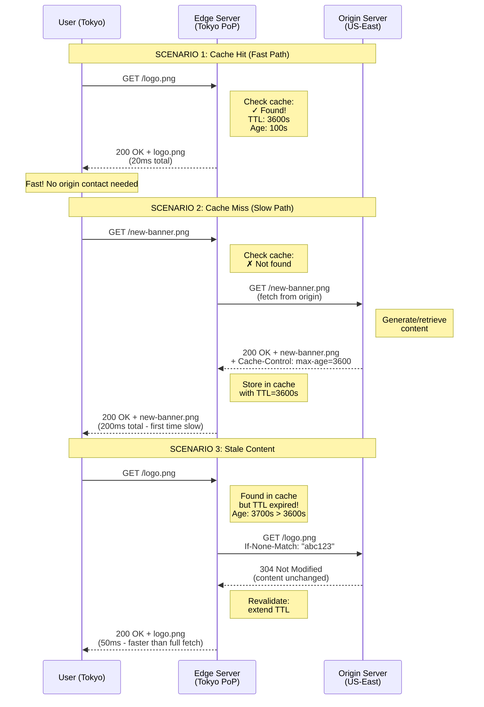
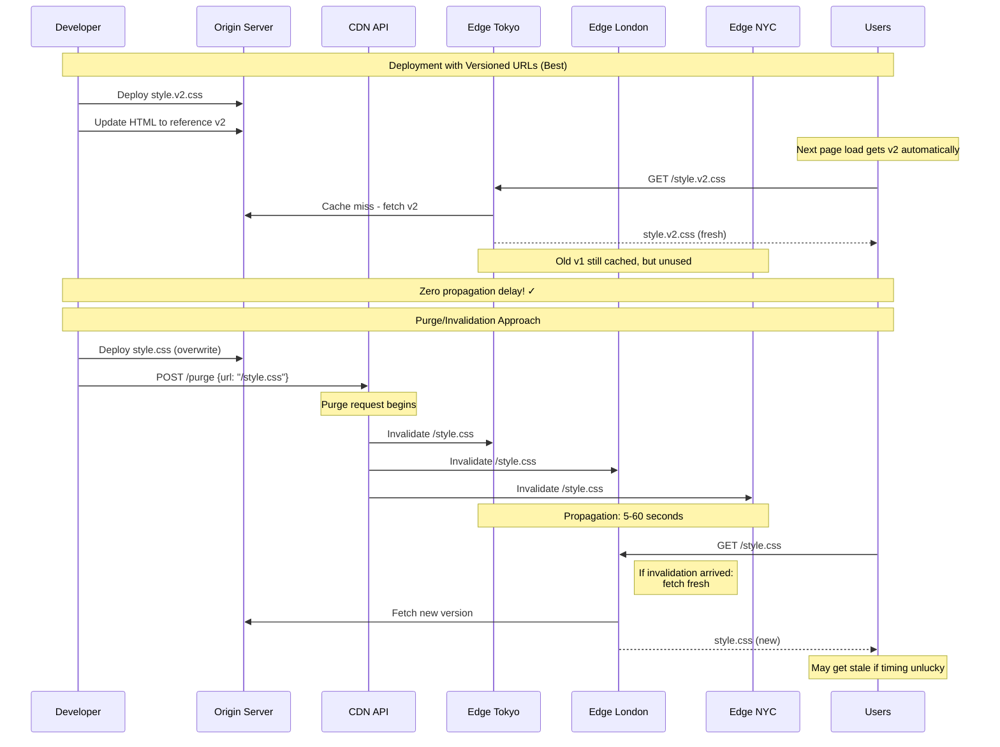
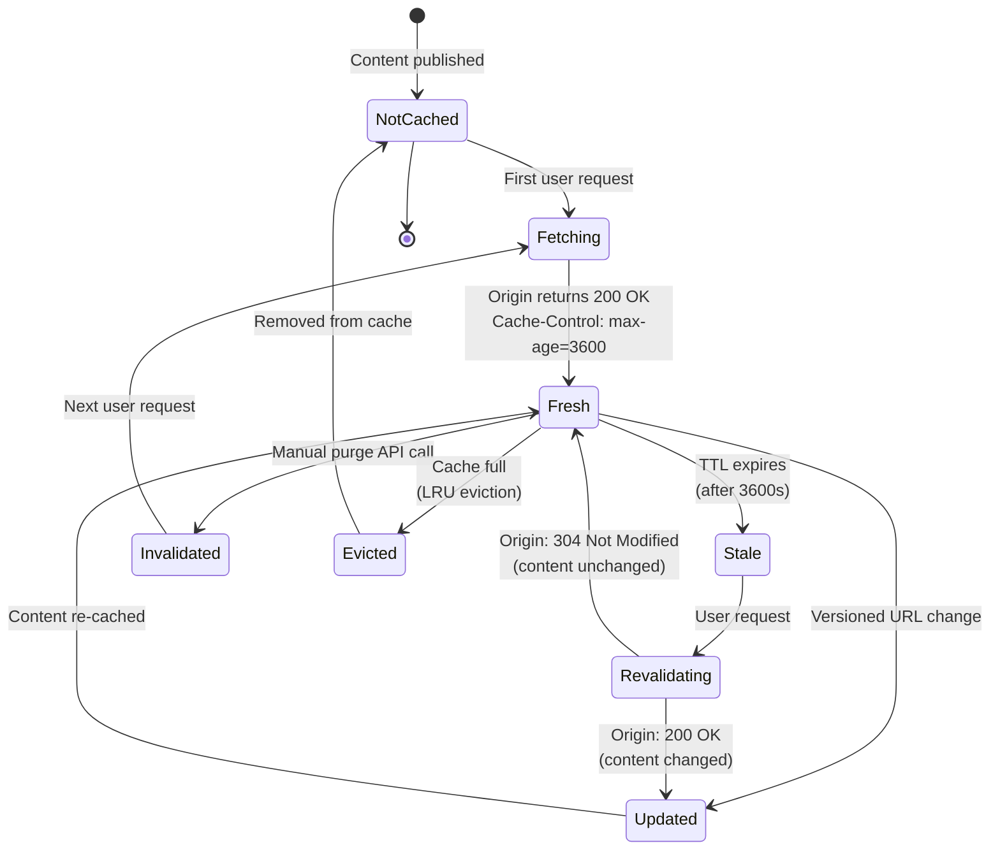
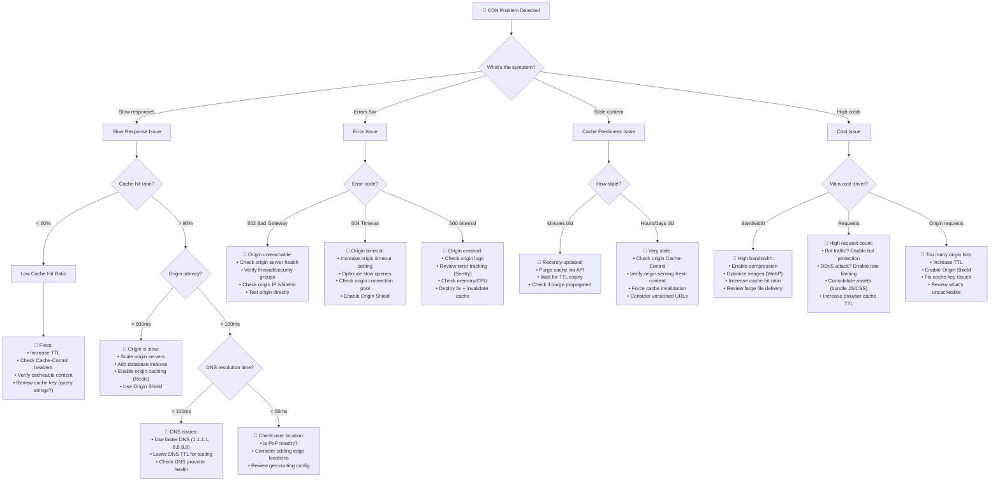

#system-design #building-block #networking #performance

# CDN (Content Delivery Network)

## Intuition (30 sec)

Instead of shipping every Amazon order from one warehouse in Seattle, Amazon builds warehouses near every major city. CDN does the same for web content: copies your files to servers around the world so users get them from the closest location.

## Failure-First Scenario

> Your app server is in US-East. A user in Tokyo requests your homepage: HTML + CSS + JS + images = 2MB. Round trip: 200ms per request. Page takes 4 seconds to load. 60% of your users are in Asia. A CDN would serve from Tokyo edge servers in 20ms.

---

## Working Knowledge (5 min)

### Core Concept - Definition First

**CDN (Content Delivery Network):**
- **Definition:** A geographically distributed network of proxy servers (edge servers) that cache and serve content from locations closer to end users, reducing latency and origin server load
- **Purpose:** Minimize the physical distance between users and content, improve website performance, reduce bandwidth costs, and provide redundancy
- **How it works:** Content is replicated to edge servers worldwide; when a user requests content, it's served from the nearest edge server instead of the origin server

**Key Terms:**
- **Edge Server:** A server located geographically close to users that caches and serves content on behalf of the origin server
- **Origin Server:** The primary server where original content is stored and served from; the source of truth for all content
- **Cache Hit:** When requested content is found in the CDN's cache and served directly without contacting the origin server
- **Cache Miss:** When requested content is not in the CDN's cache, requiring a fetch from the origin server
- **TTL (Time To Live):** Duration (in seconds) that content is cached before being considered stale and requiring revalidation
- **Purge:** Manually removing content from the CDN cache before its TTL expires
- **Invalidation:** Marking cached content as stale, forcing the CDN to fetch fresh content from origin on next request
- **PoP (Point of Presence):** A physical location where CDN edge servers are deployed, typically in data centers near major cities

### Visual Model - CDN Architecture

```
                    🌍 Internet Users
                           │
          ┌────────────────┼────────────────┐
          │                │                │
    🇯🇵 Tokyo User   🇬🇧 London User   🇺🇸 NYC User
          │                │                │
          ▼                ▼                ▼
    ┌──────────┐     ┌──────────┐     ┌──────────┐
    │   PoP    │     │   PoP    │     │   PoP    │
    │  Tokyo   │     │ London   │     │ New York │
    ├──────────┤     ├──────────┤     ├──────────┤
    │ Edge     │     │ Edge     │     │ Edge     │
    │ Servers  │     │ Servers  │     │ Servers  │
    │ (Cache)  │     │ (Cache)  │     │ (Cache)  │
    └────┬─────┘     └────┬─────┘     └────┬─────┘
         │                │                │
         └────────────────┼────────────────┘
                          │
                   (on cache miss)
                          │
                          ▼
                 ┌─────────────────┐
                 │  Origin Server  │
                 │   (US-East)     │
                 │                 │
                 │  Definition:    │
                 │  Source of      │
                 │  truth for all  │
                 │  content        │
                 └─────────────────┘

Latency Comparison:
  Without CDN (Tokyo → US):  200ms
  With CDN (Tokyo → Tokyo):   20ms
  ────────────────────────────────
  Improvement: 90% faster! ✓
```

### CDN Request Flow



### Push vs Pull CDN

**Pull CDN (Most Common):**
- **Definition:** CDN automatically fetches content from origin when requested, caching it for future requests
- **How it works:** First request triggers a fetch from origin; subsequent requests served from cache
- **Best for:** Websites with unpredictable traffic patterns, dynamic content, most web applications

**Push CDN:**
- **Definition:** Content is manually uploaded/pushed to CDN servers before users request it
- **How it works:** You proactively distribute content to edge locations before traffic arrives
- **Best for:** Large static files (videos, software downloads), content with predictable demand

```
Pull CDN (Lazy Loading):
═════════════════════════
┌──────────────────────────────┐
│ 1. User requests /video.mp4  │
│ 2. Edge: Not in cache        │
│ 3. Edge fetches from origin  │
│ 4. Edge caches + serves      │
│ 5. Next user: served from    │
│    cache instantly           │
└──────────────────────────────┘

✓ Simple setup (just point DNS)
✓ Automatic cache management
✓ Only caches what's used
✗ First request is slow

Use when:
• Dynamic traffic patterns
• Many assets, unsure which popular
• Standard websites/APIs


Push CDN (Proactive):
═══════════════════════
┌──────────────────────────────┐
│ 1. You upload video.mp4 to   │
│    all edge servers          │
│ 2. User requests /video.mp4  │
│ 3. Already cached! Instant   │
│    delivery                  │
│ 4. You control what's cached │
└──────────────────────────────┘

✓ First request is fast
✓ Control over cache contents
✓ Predictable performance
✗ Manual management overhead
✗ Pay for storage even if unused

Use when:
• Product launches (known traffic)
• Large file distribution
• Software releases
• Live event preparation
```

### Key HTTP Headers for CDN

```
┌─────────────────────────────────────────────────┐
│           CDN CACHING HEADERS                   │
├─────────────────────────────────────────────────┤
│                                                 │
│ Cache-Control: max-age=86400                    │
│ Definition: How long (seconds) to cache         │
│ Example: 86400 = 24 hours                       │
│ Use: Primary caching directive                  │
│                                                 │
│ Cache-Control: public                           │
│ Definition: Can be cached by any cache          │
│ Use: For public, non-sensitive content          │
│                                                 │
│ Cache-Control: private                          │
│ Definition: Only browser can cache (not CDN)    │
│ Use: User-specific data                         │
│                                                 │
│ Cache-Control: no-cache                         │
│ Definition: Must revalidate before using cache  │
│ Use: When freshness is critical                 │
│                                                 │
│ Cache-Control: no-store                         │
│ Definition: Don't cache at all                  │
│ Use: Sensitive data (passwords, etc.)           │
│                                                 │
│ ETag: "abc123def456"                            │
│ Definition: Content fingerprint/version         │
│ Use: Conditional requests (304 Not Modified)    │
│                                                 │
│ If-None-Match: "abc123def456"                   │
│ Definition: Request header for validation       │
│ Use: "Only send if ETag changed"                │
│                                                 │
│ Vary: Accept-Encoding                           │
│ Definition: Cache different versions            │
│ Use: Separate cache for gzip/brotli/plain      │
│                                                 │
│ CDN-Cache-Control: max-age=31536000             │
│ Definition: CDN-specific override               │
│ Use: Different TTL for CDN vs browser           │
│       (CloudFlare, Fastly support this)         │
└─────────────────────────────────────────────────┘

Example combinations:

Static assets (versioned):
  Cache-Control: public, max-age=31536000, immutable
  ↑ Cache for 1 year, never changes

API responses (frequently updated):
  Cache-Control: public, max-age=60
  ↑ Cache for 1 minute only

User-specific data:
  Cache-Control: private, max-age=300
  ↑ Browser caches 5 min, CDN doesn't cache

Dynamic HTML:
  Cache-Control: no-cache
  ETag: "abc123"
  ↑ Always revalidate, use ETag for efficiency
```

---

## Layer 1: Conceptual Precision (15 min)

### Cache Hit vs Cache Miss - Deep Definitions

**Cache Hit:**
- **Formal Definition:** A successful retrieval of requested content from the CDN's cache without needing to contact the origin server
- **Simple Definition:** The CDN already has the file you want, so it gives it to you immediately
- **Analogy:** Like finding a book on your own bookshelf instead of ordering it from the library
- **Related Terms:**
  - **Hot Cache:** Frequently accessed content that stays in cache
  - **Cache Hit Ratio:** Percentage of requests served from cache (higher is better)

**Cache Miss:**
- **Formal Definition:** When requested content is not found in the CDN cache, requiring a fetch from the origin server (called "origin fetch")
- **Simple Definition:** The CDN doesn't have the file, so it has to get it from the main server first
- **Analogy:** Like not having a book on your shelf, so you have to order it from the library (slower)
- **Types:**
  - **Cold Miss:** Content never cached before
  - **Expired Miss:** Content was cached but TTL expired
  - **Capacity Miss:** Content was evicted due to cache storage limits

**Why this matters:**
High cache hit ratios (90%+) mean your origin server handles only 10% of traffic, dramatically reducing load and costs. Every 1% increase in cache hit ratio can save thousands in infrastructure costs at scale.

### Geographic Routing (Visual Flow)

```
DNS-based Geo-Routing:

Step 1: User enters URL
┌────────────────────────┐
│ User in Tokyo types:   │
│ https://example.com    │
└───────┬────────────────┘
        │
        ▼
Step 2: DNS Resolution
┌──────────────────────────────┐
│ Browser: "What's example.com?"│
│ DNS: "Depends where you are" │
└───────┬──────────────────────┘
        │
        ▼
Step 3: GeoDNS Lookup
┌────────────────────────────────┐
│ DNS checks requester IP:       │
│ IP: 203.0.113.45               │
│ Location: Tokyo, Japan         │
│                                │
│ Decision: Return IP of nearest │
│           edge server          │
└───────┬────────────────────────┘
        │
        ▼
Step 4: Return Closest PoP
┌────────────────────────────────┐
│ DNS returns:                   │
│ tokyo-edge-01.cdn.example.com  │
│ IP: 192.0.2.10 (Tokyo PoP)     │
└───────┬────────────────────────┘
        │
        ▼
Step 5: Connect to Edge
┌────────────────────────────────┐
│ Browser connects to Tokyo PoP  │
│ Latency: 20ms (vs 200ms to US) │
│ 10x faster! ✓                  │
└────────────────────────────────┘


Anycast Routing (Alternative):
══════════════════════════════════

All edge servers share same IP address!

       203.0.2.1 (Anycast IP)
            │
    ┌───────┼───────┐
    │       │       │
┌───▼──┐ ┌──▼──┐ ┌─▼───┐
│Tokyo │ │London│ │ NYC │
│ PoP  │ │ PoP  │ │ PoP │
└──────┘ └──────┘ └─────┘

Internet routing automatically
sends packets to nearest location!

Pro: No DNS lookup needed
Pro: Automatic failover
Con: More complex to implement
```

### Cache Invalidation Strategies

```
┌──────────────────────────────────────────────────┐
│      CACHE INVALIDATION STRATEGIES               │
├──────────────────────────────────────────────────┤
│                                                  │
│ Strategy 1: TTL Expiry (Passive)                │
│ ════════════════════════════════                │
│                                                  │
│   Set Cache-Control: max-age=3600               │
│   Wait for natural expiration                   │
│                                                  │
│   ✓ Simplest approach                           │
│   ✓ No manual intervention                      │
│   ✗ Stale content for TTL duration              │
│   ✗ Can't update immediately                    │
│                                                  │
│   Use when: Content changes predictably         │
│   Example: News site (update hourly)            │
│                                                  │
├──────────────────────────────────────────────────┤
│                                                  │
│ Strategy 2: Purge/Invalidation (Active)         │
│ ════════════════════════════════════════════    │
│                                                  │
│   POST /api/purge {url: "/logo.png"}            │
│   CDN removes from all edge servers             │
│                                                  │
│   ✓ Immediate update                            │
│   ✓ On-demand control                           │
│   ✗ Requires API integration                    │
│   ✗ Propagation delay (seconds to minutes)      │
│                                                  │
│   Use when: Critical updates needed             │
│   Example: Security fix, legal requirement      │
│                                                  │
├──────────────────────────────────────────────────┤
│                                                  │
│ Strategy 3: Versioned URLs (Best Practice)      │
│ ═══════════════════════════════════════════     │
│                                                  │
│   Old: /static/style.css                        │
│   New: /static/style.v2.css                     │
│   Or:  /static/style.css?v=abc123               │
│                                                  │
│   ✓ Instant updates (new URL = cache miss)      │
│   ✓ No purge API needed                         │
│   ✓ Rollback easily (use old URL)               │
│   ✓ Cache old + new simultaneously              │
│   ✗ Requires build pipeline changes             │
│                                                  │
│   Use when: Best for all assets                 │
│   Example: All production sites (Netflix, etc)  │
│                                                  │
├──────────────────────────────────────────────────┤
│                                                  │
│ Strategy 4: Soft Purge (CloudFlare/Fastly)      │
│ ═══════════════════════════════════════════     │
│                                                  │
│   Mark content stale, but serve if origin down  │
│                                                  │
│   ✓ Revalidates content                         │
│   ✓ Graceful degradation                        │
│   ✓ Origin failure protection                   │
│   ✗ May serve stale briefly                     │
│                                                  │
│   Use when: Reliability over freshness          │
│   Example: API with scheduled updates           │
│                                                  │
└──────────────────────────────────────────────────┘
```

### Cache Invalidation Timeline



### State Diagram - Content Lifecycle



**State Definitions:**
- **NotCached:** Content exists on origin but not in CDN cache yet
- **Fetching:** CDN is actively retrieving content from origin server
- **Fresh:** Content is in cache and within TTL; can be served immediately
- **Stale:** Content's TTL expired but still in cache; needs revalidation before serving
- **Revalidating:** CDN checking with origin if stale content is still valid (using ETag/If-None-Match)
- **Invalidated:** Content marked as invalid via purge API; must be refetched
- **Updated:** New version of content has been cached
- **Evicted:** Content removed from cache due to storage limits (Least Recently Used policy)

### Architecture Pattern - CDN Integration

```
Production CDN Architecture:

┌─────────────────────────────────────────────────┐
│                   DNS Layer                     │
│  Definition: Routes users to nearest edge       │
│  Role: Geographic load distribution             │
│  Provider: Route53, CloudFlare DNS              │
└───────────────────┬─────────────────────────────┘
                    │
           ┌────────┼────────┐
           │        │        │
    ┌──────▼──┐ ┌───▼────┐ ┌▼────────┐
    │ PoP     │ │ PoP    │ │ PoP     │
    │ US-East │ │ EU     │ │ Asia    │
    └──────┬──┘ └───┬────┘ └┬────────┘
           │        │        │
           └────────┼────────┘
                    │
           ┌────────▼────────┐
           │   Shield Layer   │
           │  (Optional)      │
           │  Definition:     │
           │  Consolidates    │
           │  origin requests │
           │  from edges      │
           └────────┬─────────┘
                    │
           ┌────────▼────────┐
           │   Origin Pool   │
           │  (with LB)      │
           │                 │
           │  Definition:    │
           │  Source servers │
           │  behind load    │
           │  balancer       │
           └─────────────────┘


Request Flow with Shield:

User → Edge (cache miss) → Shield (cache miss) → Origin

Why Shield?
• 100 edge PoPs × 1 miss each = 100 origin requests
• With Shield: 100 edges → 1 Shield → 1 origin request
• Reduces origin load by 99%!
```

**Component Definitions:**
- **Edge Layer:** First contact point for users; caches content close to users
- **Shield Layer (Origin Shield):** Additional caching layer between edges and origin to reduce origin load
- **Origin Pool:** Actual application servers behind load balancer serving as source of truth
- **DNS Layer:** Directs users to optimal edge server based on geography and health

### The Math - Cache Hit Ratio Impact

**Formula:** `Cache Hit Ratio = (Cache Hits / Total Requests) × 100%`

**Term Definitions:**
- **Cache Hit Ratio:** Percentage of requests served directly from cache without origin contact
- **Origin Load:** Number of requests that reach your origin servers
- **Bandwidth Savings:** Reduction in data transfer from origin due to CDN caching

**Example calculation:**
```
Given:
  Total requests: 1,000,000/day
  Cache hit ratio: 95%
  Average response size: 500KB

Without CDN:
  Origin requests: 1,000,000
  Bandwidth from origin: 1M × 500KB = 500GB
  Origin server cost: $100/day

With CDN (95% hit ratio):
  Cache hits: 1,000,000 × 0.95 = 950,000 (served from edge)
  Cache misses: 1,000,000 × 0.05 = 50,000 (from origin)

  Origin requests: 50,000 (95% reduction!)
  Bandwidth from origin: 50,000 × 500KB = 25GB (95% reduction!)
  Origin server cost: $5/day (95% reduction!)
  CDN cost: $20/day

  Total cost: $25/day
  Savings: $75/day = $2,250/month

What this means:
  For every 1% increase in cache hit ratio,
  you save 1% of origin load and bandwidth costs.

  Going from 95% → 96% saves:
  10,000 fewer origin requests/day
  5GB less bandwidth/day
  ~$75/month in costs
```

### Trade-offs Matrix

```
CDN Enabled                      No CDN (Direct Origin)
══════════════════════════════════════════════════════════
Definition: Route traffic         Definition: Users connect
through distributed edge          directly to origin servers
servers worldwide

Pros:                            Pros:
• 90% lower latency globally     • Simpler architecture
  (20ms vs 200ms)                • No CDN cost ($0-$200/mo saved)
• 95%+ reduced origin load       • Immediate updates (no cache)
• DDoS protection included       • Easier debugging
• Better availability            • Full control over responses
  (edge redundancy)
• Lower bandwidth costs

Cons:                            Cons:
• Additional cost                • High latency for distant users
  ($50-$1000/mo)                  (200ms+ for global traffic)
• Cache invalidation complexity  • Origin handles all traffic
• Potential stale content        • Vulnerable to traffic spikes
• More moving parts to debug     • No DDoS protection
• Learning curve                 • Higher bandwidth costs
                                 • Single point of failure

Use When:                        Use When:
• Global user base               • Local/regional users only
• Static content (images, CSS)   • Highly dynamic content
• High traffic volume            • Low traffic (<1000 QPS)
• Need DDoS protection           • Frequently changing content
• Cost optimization matters      • Simple MVP stage
• Media/streaming delivery       • Testing/development
```

---

## Layer 2: Technology-Specific Examples (20 min)

### Technology Comparison

**Tool Category:** CDN Providers - Edge network platforms for content delivery

| CloudFlare | AWS CloudFront | Akamai |
|-----------|----------------|--------|
| **Definition:** Global CDN with 300+ PoPs and integrated security/edge compute | **Definition:** AWS-native CDN integrated with S3, Lambda@Edge | **Definition:** Enterprise CDN with largest edge network (4000+ PoPs) |
| **Best For:** Startups to mid-size, DDoS protection priority | **Best For:** AWS-heavy infrastructure, deep AWS integration | **Best For:** Enterprise, mission-critical, largest scale |
| ⭐⭐⭐⭐⭐ Ease of use | ⭐⭐⭐ Ease of use | ⭐⭐ Ease of use |
| ⭐⭐⭐⭐ Performance | ⭐⭐⭐⭐ Performance | ⭐⭐⭐⭐⭐ Performance |
| ⭐⭐⭐⭐⭐ Free tier | ⭐⭐ Free tier | ⭐ Free tier |
| ⭐⭐⭐⭐⭐ DDoS protection | ⭐⭐⭐ DDoS protection | ⭐⭐⭐⭐ DDoS protection |
| **Edge compute:** Workers (JavaScript) | **Edge compute:** Lambda@Edge (Node/Python) | **Edge compute:** EdgeWorkers |
| **Pricing:** $20-$200/mo typical | **Pricing:** $50-$500/mo typical | **Pricing:** $500-$5000/mo+ |
| **TTL control:** Second-level granularity | **TTL control:** Second-level granularity | **TTL control:** Second-level granularity |
| **Purge speed:** ~5 seconds global | **Purge speed:** 5-15 minutes | **Purge speed:** ~30 seconds |

| Fastly | Bunny CDN | Cloudinary |
|--------|-----------|------------|
| **Definition:** Developer-focused CDN with instant purge, edge compute (Wasm) | **Definition:** Budget CDN with good performance, simple pricing | **Definition:** Specialized media CDN with image/video optimization |
| **Best For:** Real-time apps, streaming, developer control | **Best For:** Cost-conscious projects, simple needs | **Best For:** Image-heavy sites, e-commerce, media |
| ⭐⭐⭐⭐ Ease of use | ⭐⭐⭐⭐⭐ Ease of use | ⭐⭐⭐⭐ Ease of use |
| ⭐⭐⭐⭐⭐ Performance | ⭐⭐⭐⭐ Performance | ⭐⭐⭐⭐ Performance (media) |
| ⭐⭐ Free tier | ⭐⭐⭐ Free tier | ⭐⭐⭐ Free tier |
| **Edge compute:** Compute@Edge (Wasm) | **Edge compute:** Limited | **Edge compute:** Image transforms |
| **Pricing:** $50-$500/mo | **Pricing:** $10-$100/mo | **Pricing:** $0-$100/mo (usage-based) |
| **Purge speed:** Instant (<1s) | **Purge speed:** ~30 seconds | **Purge speed:** Instant |
| **Special:** Real-time logging | **Special:** Cheapest bandwidth | **Special:** Auto image optimization |

### CloudFlare Configuration (Annotated)

```javascript
// cloudflare-worker.js
// Edge compute script running on CloudFlare's edge servers

addEventListener('fetch', event => {
  event.respondWith(handleRequest(event.request))
})

async function handleRequest(request) {
  const url = new URL(request.url)

  // ─────────────────────────────────────────────────
  // CACHING RULES
  // ─────────────────────────────────────────────────

  // Definition: Cache API endpoint responses
  // When to use: API responses that don't change often
  if (url.pathname.startsWith('/api/products')) {
    const cache = caches.default

    // Try cache first
    let response = await cache.match(request)

    if (!response) {
      // Cache miss - fetch from origin
      response = await fetch(request)

      // Clone because response body can only be read once
      const responseToCache = response.clone()

      // Cache for 5 minutes
      // Definition: Shorter TTL for dynamic content
      const headers = new Headers(responseToCache.headers)
      headers.set('Cache-Control', 'public, max-age=300')

      const cachedResponse = new Response(responseToCache.body, {
        status: responseToCache.status,
        statusText: responseToCache.statusText,
        headers: headers
      })

      // Store in edge cache
      event.waitUntil(cache.put(request, cachedResponse))
    }

    return response
  }

  // ─────────────────────────────────────────────────
  // IMAGE OPTIMIZATION
  // ─────────────────────────────────────────────────

  // Definition: Resize images at edge based on device
  // Why: Save bandwidth, improve performance
  if (url.pathname.match(/\.(jpg|png|webp)$/)) {
    // Check if client supports WebP (modern, smaller format)
    const acceptHeader = request.headers.get('Accept') || ''
    const supportsWebP = acceptHeader.includes('image/webp')

    // Mobile device? Serve smaller image
    const userAgent = request.headers.get('User-Agent') || ''
    const isMobile = /mobile/i.test(userAgent)

    // Fetch from origin with transformations
    return fetch(request, {
      cf: {
        // CloudFlare-specific image resizing
        image: {
          width: isMobile ? 800 : 1920,    // Smaller for mobile
          quality: 85,                      // Compress slightly
          format: supportsWebP ? 'webp' : 'auto'
        }
      }
    })
  }

  // ─────────────────────────────────────────────────
  // SECURITY HEADERS
  // ─────────────────────────────────────────────────

  // Fetch from origin
  const response = await fetch(request)

  // Add security headers at edge
  // Definition: HTTP headers that improve security
  const newHeaders = new Headers(response.headers)

  // Prevent XSS attacks
  newHeaders.set('X-Content-Type-Options', 'nosniff')

  // Prevent clickjacking
  newHeaders.set('X-Frame-Options', 'DENY')

  // HTTPS only
  newHeaders.set('Strict-Transport-Security',
                 'max-age=31536000; includeSubDomains')

  return new Response(response.body, {
    status: response.status,
    statusText: response.statusText,
    headers: newHeaders
  })
}
```

### AWS CloudFront Configuration (Terraform)

```hcl
# cloudfront.tf
# Infrastructure as Code for AWS CloudFront CDN

# ─────────────────────────────────────────────────
# ORIGIN - Where content comes from
# ─────────────────────────────────────────────────

# S3 bucket as origin for static assets
resource "aws_s3_bucket" "website_assets" {
  bucket = "myapp-static-assets"

  # Definition: S3 bucket stores original content
  # Role: Origin server for CDN
}

# CloudFront Origin Access Identity
# Definition: Allows CloudFront to access private S3 bucket
# Why: S3 bucket can be private, only CDN can access it
resource "aws_cloudfront_origin_access_identity" "oai" {
  comment = "OAI for myapp static assets"
}

# ─────────────────────────────────────────────────
# CDN DISTRIBUTION
# ─────────────────────────────────────────────────

resource "aws_cloudfront_distribution" "cdn" {
  enabled             = true
  is_ipv6_enabled     = true    # Support IPv6
  comment             = "MyApp CDN"
  default_root_object = "index.html"

  # Price class: where to deploy edge locations
  # Definition: Geographic coverage level
  # Options: PriceClass_All (expensive, global)
  #          PriceClass_200 (medium, major regions)
  #          PriceClass_100 (cheap, US/EU only)
  price_class = "PriceClass_200"

  # ─────────────────────────────────────────────────
  # ORIGIN CONFIGURATION
  # ─────────────────────────────────────────────────

  origin {
    domain_name = aws_s3_bucket.website_assets.bucket_regional_domain_name
    origin_id   = "S3-static-assets"

    # Security: Only CloudFront can access S3
    s3_origin_config {
      origin_access_identity = aws_cloudfront_origin_access_identity.oai.cloudfront_access_identity_path
    }

    # Custom headers sent to origin
    # Use case: Origin can verify request came from CDN
    custom_header {
      name  = "X-CDN-Secret"
      value = "secret-token-here"  # Rotate regularly!
    }
  }

  # API origin (separate from static assets)
  origin {
    domain_name = "api.myapp.com"
    origin_id   = "API-origin"

    custom_origin_config {
      http_port              = 80
      https_port             = 443
      origin_protocol_policy = "https-only"  # Always use HTTPS
      origin_ssl_protocols   = ["TLSv1.2"]   # Secure TLS version

      # Connection timeouts
      # Definition: How long to wait for origin
      origin_read_timeout      = 30  # Wait 30s for response
      origin_keepalive_timeout = 5   # Keep connection alive 5s
    }
  }

  # ─────────────────────────────────────────────────
  # CACHE BEHAVIORS (Most Important!)
  # ─────────────────────────────────────────────────

  # Default behavior for all paths
  default_cache_behavior {
    target_origin_id       = "S3-static-assets"
    viewer_protocol_policy = "redirect-to-https"  # Force HTTPS

    # Allowed HTTP methods
    allowed_methods = ["GET", "HEAD", "OPTIONS"]
    cached_methods  = ["GET", "HEAD"]  # Only cache these

    # Forward query strings, cookies, headers
    # Definition: What to include in cache key
    forwarded_values {
      query_string = false  # Don't include query params in cache key

      cookies {
        forward = "none"    # Don't forward cookies to origin
      }

      headers = []          # Don't vary cache by headers
    }

    # TTL settings (in seconds)
    # Definition: How long to cache before checking origin
    min_ttl     = 0         # Minimum: honor origin's Cache-Control
    default_ttl = 86400     # Default: 24 hours if origin doesn't specify
    max_ttl     = 31536000  # Maximum: 1 year

    # Compression
    # Definition: Gzip/Brotli compression at edge
    compress = true  # Automatically compress text files
  }

  # Behavior for versioned static assets
  # Path pattern: /static/v123/*
  ordered_cache_behavior {
    path_pattern     = "/static/v*/*"
    target_origin_id = "S3-static-assets"

    viewer_protocol_policy = "https-only"
    allowed_methods        = ["GET", "HEAD"]
    cached_methods         = ["GET", "HEAD"]

    forwarded_values {
      query_string = false
      cookies { forward = "none" }
    }

    # Aggressive caching for versioned assets
    # Definition: Long TTL because URL changes on update
    min_ttl     = 31536000   # 1 year
    default_ttl = 31536000   # 1 year
    max_ttl     = 31536000   # 1 year
    compress    = true
  }

  # Behavior for API endpoints
  # Path pattern: /api/*
  ordered_cache_behavior {
    path_pattern     = "/api/*"
    target_origin_id = "API-origin"

    viewer_protocol_policy = "https-only"
    allowed_methods        = ["GET", "HEAD", "OPTIONS", "PUT", "POST", "PATCH", "DELETE"]
    cached_methods         = ["GET", "HEAD"]  # Only cache reads

    forwarded_values {
      query_string = true  # Include query params (e.g., /api/users?page=2)

      cookies {
        forward = "all"    # Forward all cookies (for auth)
      }

      # Forward important headers to origin
      headers = [
        "Authorization",       # Auth tokens
        "CloudFront-Viewer-Country",  # User's country
        "User-Agent"          # Device type
      ]
    }

    # Short TTL for API responses
    # Definition: API data changes frequently
    min_ttl     = 0
    default_ttl = 60      # 1 minute
    max_ttl     = 3600    # 1 hour max
    compress    = true
  }

  # ─────────────────────────────────────────────────
  # GEOGRAPHIC RESTRICTIONS
  # ─────────────────────────────────────────────────

  restrictions {
    geo_restriction {
      restriction_type = "none"  # Allow all countries
      # Or: "whitelist" with locations = ["US", "CA", "GB"]
      # Or: "blacklist" with locations = ["CN", "RU"]
    }
  }

  # ─────────────────────────────────────────────────
  # SSL/TLS CERTIFICATE
  # ─────────────────────────────────────────────────

  viewer_certificate {
    acm_certificate_arn      = aws_acm_certificate.cert.arn
    ssl_support_method       = "sni-only"  # Modern browsers only
    minimum_protocol_version = "TLSv1.2_2021"  # Secure TLS version
  }

  # ─────────────────────────────────────────────────
  # CUSTOM DOMAIN
  # ─────────────────────────────────────────────────

  aliases = ["cdn.myapp.com", "static.myapp.com"]

  # ─────────────────────────────────────────────────
  # LOGGING
  # ─────────────────────────────────────────────────

  logging_config {
    include_cookies = false
    bucket          = "myapp-cdn-logs.s3.amazonaws.com"
    prefix          = "cloudfront/"
  }
}

# Output the CDN domain
output "cdn_domain" {
  value = aws_cloudfront_distribution.cdn.domain_name
  # Example: d1234abcd.cloudfront.net
}
```

### Cache Configuration Decision Flow

```
How long should I cache this content?

┌─────────────────────────────────────────┐
│ What type of content is it?             │
└───────┬─────────────────────────────────┘
        │
        ├─▶ Static versioned assets
        │   (CSS/JS with /v2/ in path)
        │   ┌─────────────────────────────┐
        │   │ TTL: 1 year (31536000s)     │
        │   │ Reason: URL changes on      │
        │   │         update, safe to     │
        │   │         cache forever       │
        │   │ Header: Cache-Control:      │
        │   │   max-age=31536000,         │
        │   │   immutable                 │
        │   └─────────────────────────────┘
        │
        ├─▶ Static non-versioned assets
        │   (logo.png, favicon.ico)
        │   ┌─────────────────────────────┐
        │   │ TTL: 1 day (86400s)         │
        │   │ Reason: Changes infrequent  │
        │   │         but possible        │
        │   │ Header: Cache-Control:      │
        │   │   max-age=86400             │
        │   └─────────────────────────────┘
        │
        ├─▶ HTML pages
        │   ┌─────────────────────────────┐
        │   │ TTL: 5 minutes (300s)       │
        │   │ Reason: Updates regularly,  │
        │   │         but can tolerate    │
        │   │         slight staleness    │
        │   │ Header: Cache-Control:      │
        │   │   max-age=300               │
        │   └─────────────────────────────┘
        │
        ├─▶ API responses (public data)
        │   (product catalog, blog posts)
        │   ┌─────────────────────────────┐
        │   │ TTL: 1 minute (60s)         │
        │   │ Reason: Balance freshness   │
        │   │         and performance     │
        │   │ Header: Cache-Control:      │
        │   │   public, max-age=60        │
        │   └─────────────────────────────┘
        │
        ├─▶ API responses (user-specific)
        │   (profile data, settings)
        │   ┌─────────────────────────────┐
        │   │ TTL: Don't cache in CDN     │
        │   │ Reason: Different per user  │
        │   │ Header: Cache-Control:      │
        │   │   private, max-age=0        │
        │   │ Note: Browser may cache     │
        │   └─────────────────────────────┘
        │
        └─▶ Sensitive data
            (auth endpoints, payments)
            ┌─────────────────────────────┐
            │ TTL: Never cache            │
            │ Reason: Security            │
            │ Header: Cache-Control:      │
            │   no-store, no-cache        │
            └─────────────────────────────┘
```

---

## Layer 3: Production-Ready Details (30 min)

### Production Architecture (Fully Annotated)

```
                    🌍 Internet Users
                           │
              ┌────────────┴────────────┐
              │                         │
         🇺🇸 Americas              🇪🇺 Europe / 🌏 Asia
              │                         │
              ▼                         ▼
    ┌──────────────────┐      ┌──────────────────┐
    │   Route53 DNS    │      │  CloudFlare DNS  │
    │  (Geo-routing)   │      │  (Anycast)       │
    │                  │      │                  │
    │ Definition:      │      │ Definition:      │
    │ AWS managed DNS  │      │ Global DNS with  │
    │ with health      │      │ DDoS protection  │
    │ checks           │      │                  │
    └─────────┬────────┘      └────────┬─────────┘
              │                        │
              └────────────┬───────────┘
                           │
          ┌────────────────┼────────────────┐
          │                │                │
    ┌─────▼─────┐    ┌─────▼─────┐   ┌─────▼─────┐
    │   PoP     │    │   PoP     │   │   PoP     │
    │  US-East  │    │  EU-West  │   │  AP-SE    │
    │  (50 edge)│    │  (40 edge)│   │  (30 edge)│
    ├───────────┤    ├───────────┤   ├───────────┤
    │ • Cache   │    │ • Cache   │   │ • Cache   │
    │ • WAF     │    │ • WAF     │   │ • WAF     │
    │ • Compress│    │ • Compress│   │ • Compress│
    └─────┬─────┘    └─────┬─────┘   └─────┬─────┘
          │                │                │
          └────────────────┼────────────────┘
                           │
                    (Cache Miss)
                           │
              ┌────────────▼────────────┐
              │   Origin Shield         │
              │   (Regional Cache)      │
              │                         │
              │   Definition:           │
              │   Intermediate cache    │
              │   between edges and     │
              │   origin. Reduces       │
              │   origin load by 95%+   │
              │                         │
              │   Purpose:              │
              │   • Cache consolidation │
              │   • Origin protection   │
              │   • Collapse requests   │
              │     (dedupe simultaneous│
              │      requests)          │
              └────────────┬────────────┘
                           │
                    (Shield Miss)
                           │
              ┌────────────▼────────────┐
              │  Application Load       │
              │  Balancer               │
              │                         │
              │  Definition:            │
              │  Distributes traffic    │
              │  across origin servers  │
              │                         │
              │  Features:              │
              │  • Health checks        │
              │  • SSL termination      │
              │  • Path-based routing   │
              └────────┬────┬───────────┘
                       │    │
          ┌────────────┼────┼────────────┐
          │            │    │            │
    ┌─────▼────┐ ┌────▼───┐ ┌──────▼─────┐
    │ Origin 1 │ │ Origin2│ │ Origin 3   │
    │ (App     │ │ (App   │ │ (App       │
    │  Server) │ │ Server)│ │  Server)   │
    │          │ │        │ │            │
    │ Role:    │ │ Role:  │ │ Role:      │
    │ Generate │ │Generate│ │ Generate   │
    │ dynamic  │ │dynamic │ │ dynamic    │
    │ content  │ │content │ │ content    │
    └─────┬────┘ └────┬───┘ └──────┬─────┘
          │           │            │
          └───────────┼────────────┘
                      │
         ┌────────────┼───────────────┐
         │            │               │
    ┌────▼────┐  ┌────▼────┐   ┌─────▼─────┐
    │ S3      │  │ RDS     │   │ ElastiCache│
    │ Storage │  │ Database│   │ (Redis)    │
    │         │  │         │   │            │
    │ Static  │  │ Dynamic │   │ Session    │
    │ assets  │  │ data    │   │ cache      │
    └─────────┘  └─────────┘   └────────────┘


Request Flow Example:

1. User in Tokyo requests /logo.png
2. DNS returns Tokyo PoP IP
3. Tokyo edge checks cache
   ├─▶ Hit? Serve immediately (20ms) ✓
   └─▶ Miss? Continue...
4. Edge contacts Origin Shield (US)
5. Shield checks its cache
   ├─▶ Hit? Return to edge (100ms)
   └─▶ Miss? Continue...
6. Shield contacts origin server
7. Origin serves from S3 (150ms)
8. Shield caches, returns to edge
9. Edge caches, serves to user (200ms first time)
10. Next Tokyo user: 20ms (cached!)


Traffic Percentages (typical):
┌────────────────────────────────┐
│ 95% → Served from edge PoP     │
│  4% → Served from shield       │
│  1% → Reaches origin servers   │
└────────────────────────────────┘

This means: For 1M requests, only 10K hit origin!
```

### Monitoring Dashboard (Visual Metrics)

```
╔═══════════════════════════════════════════════════════════════╗
║              CDN PERFORMANCE DASHBOARD                        ║
║              Real-time metrics (Last 1 hour)                  ║
╠═══════════════════════════════════════════════════════════════╣
║                                                               ║
║  🟢 Cache Hit Ratio: 96.4%                                    ║
║  ▰▰▰▰▰▰▰▰▰▰▰▰▰▰▰▰▰▰▰▰▰▰▰▰▰▰▰▰▰▰▰▰▰▰▰▰▰▰▰▱▱                  ║
║                                                               ║
║  Definition: Percentage of requests served from cache         ║
║  Target: > 90% (excellent), 80-90% (good), < 80% (poor)       ║
║  Impact: 96.4% means only 3.6% of requests hit origin         ║
║                                                               ║
║  Breakdown:                                                   ║
║    • Edge cache hits:   95.2%  (served from edge)            ║
║    • Shield cache hits:  1.2%  (served from shield)          ║
║    • Origin requests:    3.6%  (cache miss)                  ║
║                                                               ║
╟───────────────────────────────────────────────────────────────╢
║                                                               ║
║  💰 Bandwidth Savings: $1,847 / day                           ║
║  ▬▬▬▬▬▬▬▬▬▬▬▬▬▬▬▬▬▬▬▬▬▬▬▬▬▬▬▬▬▬▬▬▬▬▬▬▬▬▬▬▬                 ║
║                                                               ║
║  Definition: Cost savings from CDN vs serving from origin     ║
║  Calculation:                                                 ║
║    Total requests: 10M                                        ║
║    Avg response: 200KB                                        ║
║    Without CDN: 10M × 200KB = 2TB from origin                ║
║    With CDN: 360K × 200KB = 72GB from origin (3.6%)          ║
║    Savings: 2TB - 72GB = 1.93TB saved                        ║
║    At $0.09/GB: 1,930GB × $0.09 = $174/day bandwidth         ║
║    Plus origin server scaling avoided: ~$1,673/day           ║
║                                                               ║
╟───────────────────────────────────────────────────────────────╢
║                                                               ║
║  ⚡ P50 Latency: 24ms                                         ║
║  ▰▰▰▰▰░░░░░░░░░░░░░░░░░░░░░░░░░░░░░░░░░░░░░░                ║
║                                                               ║
║  Definition: 50% of requests complete within this time        ║
║  Meaning: Median response time (typical user experience)     ║
║                                                               ║
║  ⚡ P95 Latency: 89ms                                         ║
║  ▰▰▰▰▰▰▰▰▰▰▰▰▰░░░░░░░░░░░░░░░░░░░░░░░░░░░░░                 ║
║                                                               ║
║  Definition: 95% of requests complete within this time        ║
║  Target: < 200ms for good UX                                  ║
║  Status: ✓ Excellent                                          ║
║                                                               ║
║  ⚡ P99 Latency: 247ms                                        ║
║  ▰▰▰▰▰▰▰▰▰▰▰▰▰▰▰▰▰▰▰▰▰▰▰░░░░░░░░░░░░░░░░░░                  ║
║                                                               ║
║  Definition: 99% of requests complete within this time        ║
║  Why it matters: Shows worst-case experience                  ║
║  Note: 247ms likely includes cold cache scenarios            ║
║                                                               ║
╟───────────────────────────────────────────────────────────────╢
║                                                               ║
║  🌍 Latency by Region                                         ║
║                                                               ║
║  ┌─────────────────────────────────────────────────────────┐ ║
║  │ Region        P50    P95    PoP Distance   Cache Hit    │ ║
║  ├─────────────────────────────────────────────────────────┤ ║
║  │ US-East       18ms   45ms   < 50km          98%  ✓     │ ║
║  │ US-West       22ms   67ms   < 100km         97%  ✓     │ ║
║  │ Europe        25ms   82ms   < 150km         96%  ✓     │ ║
║  │ Asia-Pacific  31ms   124ms  < 200km         94%  ✓     │ ║
║  │ South America 47ms   189ms  < 300km         91%  ⚠     │ ║
║  │ Africa        89ms   312ms  < 500km         85%  ⚠     │ ║
║  └─────────────────────────────────────────────────────────┘ ║
║                                                               ║
║  ⚠ Action needed: Consider adding PoPs in Africa/SA          ║
║                                                               ║
╟───────────────────────────────────────────────────────────────╢
║                                                               ║
║  📊 Request Rate: 2,847 req/sec                               ║
║  ▬▬▬▬▬▬▬▬▬▬▬▬▬▬▬▬▬▬▬▬▬▬▬▬▬▬▬▬▬▬▬▬▬▬▬▬▬▬▬▬▬                 ║
║                                                               ║
║  Definition: Number of requests per second to CDN             ║
║  Breakdown:                                                   ║
║    • Static assets (images/CSS/JS): 2,145 req/s (75%)        ║
║    • API responses: 489 req/s (17%)                          ║
║    • HTML pages: 213 req/s (8%)                              ║
║                                                               ║
╟───────────────────────────────────────────────────────────────╢
║                                                               ║
║  🔴 Error Rate: 0.3%                                          ║
║  ▰░░░░░░░░░░░░░░░░░░░░░░░░░░░░░░░░░░░░░░░░░░                ║
║                                                               ║
║  Definition: Percentage of requests returning errors          ║
║  Total errors: ~8 errors/sec                                  ║
║                                                               ║
║  Error breakdown:                                             ║
║    • 502 Bad Gateway:  45% (origin timeout)                  ║
║    • 504 Gateway Timeout: 30% (origin slow)                  ║
║    • 500 Internal Error: 15% (origin crash)                  ║
║    • 404 Not Found: 10% (invalid URLs)                       ║
║                                                               ║
║  🚨 Alert: 502 errors spiked +20% in last 15 min             ║
║     → Check origin server health                              ║
║                                                               ║
╟───────────────────────────────────────────────────────────────╢
║                                                               ║
║  🔥 Top Cached Content (by request volume)                    ║
║                                                               ║
║  1. /static/app.v123.js        487K req  [▰▰▰▰▰▰▰▰▰▰] 99.9% │ ║
║  2. /static/style.v123.css     423K req  [▰▰▰▰▰▰▰▰▰] 99.8%  │ ║
║  3. /images/logo.png           234K req  [▰▰▰▰▰▰] 98.2%     │ ║
║  4. /api/products/list         89K req   [▰▰▰] 76.4%  ⚠     │ ║
║  5. /                          67K req   [▰▰] 67.3%    ⚠     │ ║
║                                                               ║
║  ⚠ Low cache hit on /api/products/list - investigate         ║
║                                                               ║
╟───────────────────────────────────────────────────────────────╢
║                                                               ║
║  🎯 Origin Health                                             ║
║                                                               ║
║  Origin Requests: 103 req/sec (3.6% of total)                ║
║  Origin Latency: 127ms avg (P95: 389ms)                      ║
║  Origin Errors: 2.4% (mostly timeouts)                       ║
║                                                               ║
║  Definition: Metrics for origin server performance            ║
║  Status: ⚠ Origin latency degraded (normal: ~80ms)           ║
║  Action: Scale origin or optimize slow endpoints              ║
║                                                               ║
╚═══════════════════════════════════════════════════════════════╝


Key Metrics Glossary:
═════════════════════
Cache Hit Ratio:  % of requests served without origin contact
Bandwidth Savings: Money saved by not serving from origin
P50/P95/P99:      Percentile latency (50th/95th/99th)
Request Rate:     Requests per second (QPS)
Error Rate:       % of failed requests
```

### Troubleshooting Decision Tree



### Capacity Planning (Visual Math)

```
Scenario: E-commerce site planning for Black Friday

Current State:
┌─────────────────────────────────────┐
│ • Normal traffic: 100K visits/day   │
│ • Avg page: 2MB (10 assets)         │
│ • Cache hit ratio: 95%               │
│ • Origin servers: 5 instances        │
└─────────────────────────────────────┘

Black Friday Projection:
┌─────────────────────────────────────┐
│ • Expected traffic: 2M visits/day   │
│ • Peak: 10x average = 230 req/sec   │
│ • Duration: 12 hours                │
└─────────────────────────────────────┘

Step 1: Calculate Request Load
┏━━━━━━━━━━━━━━━━━━━━━━━━━━━━━━━━━━━━┓
┃ Normal: 100K visits × 10 assets    ┃
┃       = 1M requests/day             ┃
┃       = 11.6 req/sec avg            ┃
┃                                     ┃
┃ Black Friday: 2M × 10 = 20M/day    ┃
┃       = 231 req/sec avg             ┃
┃       = 2,310 req/sec peak (10x)    ┃
┗━━━━━━━━━━━━━━━━━━━━━━━━━━━━━━━━━━━━┛

Step 2: Calculate Bandwidth
┏━━━━━━━━━━━━━━━━━━━━━━━━━━━━━━━━━━━━┓
┃ Total data: 20M requests × 2MB     ┃
┃           = 40TB per day            ┃
┃                                     ┃
┃ With 95% cache hit:                 ┃
┃   From CDN edge: 38TB (95%)        ┃
┃   From origin: 2TB (5%)            ┃
┗━━━━━━━━━━━━━━━━━━━━━━━━━━━━━━━━━━━━┛

Step 3: CDN Capacity Check
┏━━━━━━━━━━━━━━━━━━━━━━━━━━━━━━━━━━━━┓
┃ CDN can handle: Millions req/sec   ┃
┃ Our peak: 2,310 req/sec             ┃
┃ Status: ✓ CDN has plenty capacity  ┃
┃                                     ┃
┃ No action needed for CDN            ┃
┗━━━━━━━━━━━━━━━━━━━━━━━━━━━━━━━━━━━━┛

Step 4: Origin Capacity Check
┏━━━━━━━━━━━━━━━━━━━━━━━━━━━━━━━━━━━━┓
┃ Cache miss rate: 5%                 ┃
┃ Origin requests: 2,310 × 0.05       ┃
┃                = 115 req/sec        ┃
┃                                     ┃
┃ Current capacity: 5 servers         ┃
┃ Each handles: 50 req/sec            ┃
┃ Total: 250 req/sec                  ┃
┃                                     ┃
┃ Required: 115 req/sec               ┃
┃ Status: ✓ Sufficient (54% capacity)┃
┃                                     ┃
┃ Recommendation: Keep 5 servers      ┃
┃ (Already has 2.2x headroom)         ┃
┗━━━━━━━━━━━━━━━━━━━━━━━━━━━━━━━━━━━━┛

Step 5: Cost Projection
┏━━━━━━━━━━━━━━━━━━━━━━━━━━━━━━━━━━━━┓
┃ CDN Costs:                          ┃
┃   Bandwidth: 38TB × $0.085/GB       ┃
┃            = $3,230 for the day     ┃
┃   Request fees: 20M × $0.0075/10K   ┃
┃               = $15 for the day     ┃
┃   Total CDN: $3,245                 ┃
┃                                     ┃
┃ Origin Costs:                       ┃
┃   Bandwidth: 2TB × $0.09/GB         ┃
┃            = $180                   ┃
┃   Servers: 5 × $3/day = $15         ┃
┃   Total Origin: $195                ┃
┃                                     ┃
┃ Grand Total: $3,440 for Black Friday┃
┃                                     ┃
┃ Without CDN (40TB from origin):     ┃
┃   Bandwidth: 40TB × $0.09 = $3,600  ┃
┃   Servers: ~50 needed = $150        ┃
┃   Total: $3,750                     ┃
┃                                     ┃
┃ Savings: $310 + easier scaling! ✓   ┃
┗━━━━━━━━━━━━━━━━━━━━━━━━━━━━━━━━━━━━┛

Recommendations:
┌─────────────────────────────────────┐
│ ✓ Current CDN setup sufficient      │
│ ✓ Origin servers have headroom      │
│ ⚠ Enable Origin Shield to reduce    │
│   origin load further (95% → 98%)   │
│ ⚠ Set up alerts for:                │
│   • Cache hit ratio drop            │
│   • Origin 5xx errors               │
│   • Latency spikes                  │
│ ⚠ Test cache warming before event:  │
│   Preload popular products           │
└─────────────────────────────────────┘
```

### Production Patterns - Image Optimization

```
┌──────────────────────────────────────────────────┐
│      CDN IMAGE OPTIMIZATION STRATEGY             │
├──────────────────────────────────────────────────┤
│                                                  │
│ Pattern 1: Responsive Images (Device-Based)     │
│ ══════════════════════════════════════════      │
│                                                  │
│ User Request:                                    │
│   GET /images/hero.jpg                          │
│   User-Agent: Mobile Safari                     │
│   Viewport: 375px                               │
│                                                  │
│ CDN Edge Logic:                                  │
│   IF mobile THEN resize to 800px width          │
│   IF desktop THEN resize to 1920px width        │
│   IF retina display THEN serve 2x resolution    │
│                                                  │
│ Result:                                          │
│   Mobile:  200KB (800×450)                      │
│   Desktop: 800KB (1920×1080)                    │
│   Savings: 75% bandwidth on mobile!             │
│                                                  │
├──────────────────────────────────────────────────┤
│                                                  │
│ Pattern 2: Modern Format Selection              │
│ ══════════════════════════════════════════      │
│                                                  │
│ User Request:                                    │
│   GET /images/product.jpg                       │
│   Accept: image/webp,image/avif,image/*         │
│                                                  │
│ CDN Edge Logic:                                  │
│   1. Check Accept header                        │
│   2. Serve best format client supports          │
│                                                  │
│ Format Priority:                                 │
│   1. AVIF (best compression, newest)            │
│   2. WebP (great compression, wide support)     │
│   3. JPEG (fallback for old browsers)           │
│                                                  │
│ Result:                                          │
│   JPEG: 500KB (100% size)                       │
│   WebP: 200KB (60% smaller) ✓                   │
│   AVIF: 150KB (70% smaller) ✓✓                  │
│                                                  │
├──────────────────────────────────────────────────┤
│                                                  │
│ Pattern 3: Lazy Loading with CDN                │
│ ══════════════════════════════════════════      │
│                                                  │
│ HTML:                                            │
│                           │
│                                                  │
│ Behavior:                                        │
│   1. Page loads with tiny placeholder (2KB)     │
│   2. When user scrolls near image, load real    │
│   3. Real image comes from CDN (cached)         │
│                                                  │
│ Result:                                          │
│   Initial page: 50KB (only placeholders)        │
│   vs 5MB loading all images                     │
│   90% faster initial load!                      │
│                                                  │
├──────────────────────────────────────────────────┤
│                                                  │
│ Pattern 4: URL-Based Transformations            │
│ ══════════════════════════════════════════      │
│                                                  │
│ Concept: Encode transformations in URL          │
│                                                  │
│ Original:                                        │
│   https://cdn.example.com/images/hero.jpg       │
│                                                  │
│ Transformed URLs:                                │
│   /images/hero.jpg?w=800&q=85                   │
│   ↑ Width 800px, quality 85%                    │
│                                                  │
│   /images/hero.jpg?w=400&h=300&fit=cover        │
│   ↑ 400×300, crop to cover                      │
│                                                  │
│   /images/hero.jpg?fm=webp&blur=10              │
│   ↑ Convert to WebP, blur 10px                  │
│                                                  │
│ CDN processes on-the-fly, caches result         │
│                                                  │
│ Benefits:                                        │
│   ✓ No pre-processing needed                    │
│   ✓ One source image → many sizes               │
│   ✓ Each variant cached separately              │
│                                                  │
└──────────────────────────────────────────────────┘


Implementation Example (Cloudinary):

HTML:
  

  URL breakdown:
    w_800    = width 800px
    q_auto   = automatic quality optimization
    f_auto   = automatic format (WebP/AVIF if supported)

Result:
  • Chrome gets WebP at 180KB
  • Safari gets JPEG at 400KB
  • Old IE gets JPEG at 500KB
  • All from ONE source image!


Performance Impact:
┌────────────────────────────────────┐
│ Before Optimization:               │
│   10 product images × 800KB = 8MB  │
│   Page load: 6.2 seconds           │
│                                    │
│ After Optimization:                │
│   10 images × 150KB = 1.5MB        │
│   Page load: 1.8 seconds           │
│   ────────────────────────────     │
│   71% faster! ✓                    │
└────────────────────────────────────┘
```

### Cache Poisoning Prevention

```
┌──────────────────────────────────────────────────┐
│           CACHE POISONING THREATS                │
├──────────────────────────────────────────────────┤
│                                                  │
│ Threat 1: Header Injection                      │
│ ════════════════════════                        │
│                                                  │
│ Attack:                                          │
│   GET /api/user HTTP/1.1                        │
│   Host: example.com                             │
│   X-Forwarded-Host: evil.com                    │
│                                                  │
│ What happens:                                    │
│   1. Origin reflects header in response         │
│   2. CDN caches response with evil.com link     │
│   3. Other users get poisoned response!         │
│                                                  │
│ Defense:                                         │
│   ✓ Sanitize all headers at origin              │
│   ✓ Don't include user-controlled headers       │
│     in cache key                                │
│   ✓ Use CDN's "Vary" header carefully           │
│   ✓ Validate Host header strictly               │
│                                                  │
├──────────────────────────────────────────────────┤
│                                                  │
│ Threat 2: Query Parameter Poisoning             │
│ ═══════════════════════════════════════         │
│                                                  │
│ Attack:                                          │
│   GET /api/products?utm_source=<script>         │
│                                                  │
│ What happens:                                    │
│   1. Origin echoes query param in response      │
│   2. CDN caches XSS payload                     │
│   3. All users get malicious script!            │
│                                                  │
│ Defense:                                         │
│   ✓ Strip tracking parameters before caching   │
│   ✓ Never reflect query params without          │
│     sanitization                                │
│   ✓ Use allowlist for cache key parameters     │
│   ✓ Enable CDN query string normalization      │
│                                                  │
│ CloudFlare config:                               │
│   cache_key {                                   │
│     query_string {                              │
│       include = ["page", "sort"]  // allowlist  │
│       # Ignore utm_*, fbclid, etc               │
│     }                                           │
│   }                                             │
│                                                  │
├──────────────────────────────────────────────────┤
│                                                  │
│ Threat 3: Cookie-Based Cache Splitting          │
│ ══════════════════════════════════════════      │
│                                                  │
│ Attack:                                          │
│   Create many cache entries for same resource   │
│   by varying cookies, exhausting cache          │
│                                                  │
│ Defense:                                         │
│   ✓ Don't include cookies in cache key          │
│     unless necessary                            │
│   ✓ Use separate domain for static assets      │
│     (no cookies sent!)                          │
│   ✓ Set Cache-Control: public for non-auth     │
│     content                                     │
│                                                  │
│ Best practice:                                   │
│   static.example.com  → static assets (CDN)     │
│   api.example.com     → dynamic API (no CDN)    │
│   www.example.com     → HTML (short CDN TTL)    │
│                                                  │
├──────────────────────────────────────────────────┤
│                                                  │
│ Secure Configuration Checklist                  │
│ ══════════════════════════════════              │
│                                                  │
│ [ ] Validate all input at origin                │
│ [ ] Never cache user-specific data              │
│ [ ] Use Cache-Control: private for auth content │
│ [ ] Implement proper Vary headers               │
│ [ ] Sanitize query parameters                   │
│ [ ] Separate domains for static/dynamic         │
│ [ ] Monitor for unusual cache keys              │
│ [ ] Set up alerts for cache hit ratio drops     │
│ [ ] Regular security audits of cache config     │
│ [ ] Use CSP headers to prevent XSS              │
│                                                  │
└──────────────────────────────────────────────────┘
```

---

## Real-World Examples

### Example 1: Netflix - Open Connect CDN

**Problem Definition:**
Netflix streams 250+ million hours of video per day to 230+ million subscribers worldwide. Streaming from central data centers would cost billions in bandwidth and cause poor user experience (buffering, low quality).

**Solution Definition:**
Netflix built Open Connect, a custom CDN with servers placed inside ISP networks. Content is pre-positioned overnight when bandwidth is cheap, then served locally during peak hours.

**Technical Terms Used:**
- **Open Connect Appliance (OCA):** Custom hardware Netflix places in ISP data centers - essentially a server filled with hard drives caching popular content
- **Fill Server:** Netflix's central server that pushes content to OCAs during off-peak hours
- **Peering:** Direct network connection between Netflix and ISPs, bypassing public internet
- **Adaptive Bitrate Streaming:** Dynamically adjusting video quality based on user's bandwidth

**Architecture:**

**Before (Traditional CDN):**
```
Netflix Data Center (US)
         │
         ├─▶ CDN Provider Edge Servers
         │        │
         │        ▼
         └─▶ ISP Network
                  │
                  ▼
              User (buffering!)

Problems:
• High CDN costs ($100M+/year estimated)
• Depends on third-party
• Congestion at ISP interconnect
• No control over user experience
```

**After (Open Connect):**
```
Netflix Content Servers
         │
         │ (overnight, off-peak)
         ▼
┌────────────────────────┐
│    Open Connect        │
│    Appliances (OCAs)   │
│    INSIDE ISP          │
│                        │
│  ┌──────────────────┐  │
│  │ 100TB storage    │  │
│  │ (most popular    │  │
│  │  content cached) │  │
│  └──────────────────┘  │
└───────────┬────────────┘
            │ (LAN speed!)
            ▼
      User (no buffering!)


OCA Placement Strategy:
1. Tier 1: Large ISPs (Comcast, etc)
   → 1000+ OCAs
2. Tier 2: Regional ISPs
   → 100+ OCAs
3. Tier 3: IXPs (Internet Exchange Points)
   → Direct peering
```

**Technical Implementation:**

```
Content Distribution Flow:

1. Encode:
   Original film →
   Encoded in 2000+ variants:
   • 4K HDR (25 Mbps)
   • 1080p (5 Mbps)
   • 720p (3 Mbps)
   • 480p (1 Mbps)
   • Audio-only (128 kbps)

2. Predict:
   ML predicts what will be popular
   in each region

3. Pre-position:
   Overnight (2am-6am):
   Fill servers push predicted content
   to OCAs near users

4. Serve:
   User hits play →
   Device connects to nearest OCA →
   Streams from local ISP network →
   < 10ms latency! ✓

Cache Efficiency:
• 95% of plays served from OCA
• 5% long-tail content from origin
• OCAs auto-delete unpopular content
```

**Results:**
- **Latency:** Reduced from 100ms+ to < 10ms (10x improvement)
- **ISP Costs:** Reduced ISP bandwidth costs by ~80% (peering agreement)
- **Netflix Costs:** Eliminated $100M+/year in CDN fees
- **User Experience:** Buffer ratio < 0.1% (99.9% smooth playback)
- **Scale:** Serves 250M+ hours/day from 17,000+ servers in 1000+ locations

**Key Decisions:**
- Build vs buy: Built custom because no CDN could meet scale/cost requirements
- Hardware placement: Inside ISP networks (revolutionary at the time)
- Pre-positioning: Push content overnight vs pull on-demand (saves peak bandwidth)
- Open design: Published specs so ISPs can easily deploy OCAs

### Example 2: Spotify - Distributed CDN Architecture

**Problem Definition:**
Spotify streams 100+ billion songs per month to 500M+ users. Music files are smaller than video (3-5MB per song) but catalog is massive (100M+ tracks). Users expect instant playback, no buffering. Challenge: balance between cache hit ratio (popular songs) and long-tail content (obscure tracks).

**Solution Definition:**
Multi-tier CDN combining commercial CDNs (Fastly, CloudFlare) for edge caching with regional cache clusters for origin shielding. Predictive pre-caching based on user behavior and regional trends.

**Technical Terms Used:**
- **Chunk-based Streaming:** Songs divided into small chunks (10KB each) for progressive streaming
- **Prefetch Algorithm:** ML model predicting next song to preload based on playlist/history
- **Origin Shield:** Regional cache between edge and origin to reduce origin load
- **Cache Warming:** Proactively loading predicted popular content before requests arrive

**Architecture:**

**Before:**
```
Centralized Architecture (2010):

    Origin Servers (Sweden)
              │
              ├─▶ User (US) - 200ms latency
              ├─▶ User (Asia) - 300ms latency
              └─▶ User (EU) - 50ms latency

Problems:
• High latency for global users
• Origin servers overwhelmed
• Expensive bandwidth from origin
• Poor experience during traffic spikes
```

**After (Current):**
```
Multi-Tier CDN Architecture:

                  Origin (Google Cloud Storage)
                  100M+ tracks, 500PB total
                           │
                           │ (only cache misses)
                           │
         ┌─────────────────┼─────────────────┐
         │                 │                 │
    ┌────▼────┐      ┌─────▼────┐      ┌────▼────┐
    │ Shield  │      │ Shield   │      │ Shield  │
    │ US-East │      │ EU-West  │      │ AP-SE   │
    │ (50TB)  │      │ (50TB)   │      │ (50TB)  │
    └────┬────┘      └─────┬────┘      └────┬────┘
         │                 │                 │
    ┌────┼────┐       ┌────┼────┐       ┌───┼─────┐
    │    │    │       │    │    │       │   │     │
┌───▼┐ ┌▼──┐┌▼──┐ ┌──▼┐ ┌─▼─┐┌─▼─┐  ┌─▼┐┌──▼─┐┌──▼┐
│CDN1│ │CDN2│CDN3│ │CDN1││CDN2│CDN3│  │...│... ││... │
│Edge│ │Edge│Edge│ │Edge││Edge│Edge│  └──┘└────┘└───┘
└──┬─┘ └┬──┘└┬──┘ └──┬─┘└──┬─┘└──┬─┘
   │    │    │       │     │     │
  Users Users Users Users Users Users

Cache Strategy by Content Tier:

Tier 1: Viral/Popular (Top 1% of plays)
  → Cache at ALL edge locations
  → TTL: 7 days
  → 80% of total plays
  → Hit ratio: 99%

Tier 2: Regional Popular (Top 10%)
  → Cache at regional shields + local edges
  → TTL: 24 hours
  → 15% of plays
  → Hit ratio: 95%

Tier 3: Long Tail (Bottom 89%)
  → Cache at shield only, not edges
  → TTL: 1 hour
  → 5% of plays
  → Hit ratio: 70%

Tier 4: Ultra Long Tail (< 100 plays/month)
  → Serve directly from origin
  → No CDN caching
  → < 1% of plays
```

**Technical Implementation:**

```yaml
# Spotify CDN configuration (simplified)

content_routing:
  # Step 1: Client requests song
  # GET /track/spotify:track:3n3Ppam7vgaVa1iaRUc9Lp

  routing_logic:
    - check: "Is song in Tier 1? (top 10M plays)"
      action: "Route to nearest edge CDN"
      latency: "20ms"

    - check: "Is song in Tier 2? (1M-10M plays)"
      action: "Route to regional shield"
      latency: "50ms"

    - check: "Is song in Tier 3? (10K-1M plays)"
      action: "Route to origin via shield"
      latency: "100ms"

    - check: "Ultra long tail (< 10K plays)"
      action: "Serve from origin directly"
      latency: "150ms"

cache_warming:
  # Predictive pre-caching
  triggers:
    - "New album release by popular artist"
      action: "Push to all edge servers globally"
      example: "Taylor Swift album → pre-cached 2 hours before release"

    - "Song trending on social media"
      action: "Promote from Tier 2 → Tier 1"
      example: "TikTok viral song → cache everywhere"

    - "Regional holiday/event"
      action: "Pre-cache regional popular content"
      example: "Diwali in India → cache Bollywood hits"

prefetch_strategy:
  # While user listens to song N, prefetch song N+1
  prediction_model:
    - "If playlist: fetch next track"
    - "If album: fetch next song"
    - "If radio: ML predicts next based on history"

  chunk_prefetching:
    # Song is 3MB = 300 chunks of 10KB
    # Download schedule:
    - "Chunks 0-10: Immediately (playback starts)"
    - "Chunks 11-100: Progressive during playback"
    - "Chunks 101-300: Background if bandwidth available"
    # Result: instant play + smooth experience

cache_invalidation:
  # When content changes
  scenarios:
    - "Artist removes song: Purge from all CDNs in 30 seconds"
    - "Licensing expires: Hard delete globally"
    - "Updated album art: Versioned URL (no purge needed)"
```

**Results:**
- **Cache Hit Ratio:** 95% overall (99% for popular, 70% for long-tail)
- **Latency:** P95 playback start < 200ms globally
- **Cost Savings:** $150M+/year in bandwidth costs vs serving from origin
- **User Experience:** 99.9% of songs start instantly, < 0.5% buffer during playback
- **Scale:** Serves 100+ billion streams/month from hybrid CDN architecture

**Key Technical Decisions:**

```
┌──────────────────────────────────────────────────┐
│ Decision: Multi-CDN vs Single CDN                │
├──────────────────────────────────────────────────┤
│ Choice: Multi-CDN (Fastly + CloudFlare + custom) │
│                                                  │
│ Why:                                             │
│ • Redundancy: If one CDN fails, fallback to next│
│ • Cost optimization: Use cheapest in each region│
│ • Performance: Different CDNs better in regions │
│ • Leverage competition: Negotiate better prices │
│                                                  │
│ Trade-off:                                       │
│ • Complexity: Manage 3 CDN configurations       │
│ • Debugging: Harder to trace issues             │
│ • Worth it: Saved ~$50M/year in costs           │
└──────────────────────────────────────────────────┘

┌──────────────────────────────────────────────────┐
│ Decision: Cache Long Tail?                       │
├──────────────────────────────────────────────────┤
│ Choice: Selective caching (Tier 1-3 only)       │
│                                                  │
│ Math:                                            │
│ • 1% of songs = 80% of plays (cache everywhere) │
│ • 9% of songs = 15% of plays (cache regionally) │
│ • 90% of songs = 5% of plays (limited cache)    │
│                                                  │
│ Caching all 100M songs would require:           │
│ • 100M × 5MB = 500TB per edge location          │
│ • 1000 edge locations = 500PB total             │
│ • Cost: $50M/month just for storage!            │
│                                                  │
│ Selective caching:                               │
│ • Cache 10M songs = 50TB per edge               │
│ • Cost: $5M/month (90% savings)                 │
│ • Covers 95% of requests                        │
│ • Serves long tail from origin (acceptable)     │
└──────────────────────────────────────────────────┘
```

---

## Interview Preparation

### Concept Glossary

Quick reference definitions for interview:

- **CDN:** Geographically distributed network of servers that cache content closer to users
- **Edge Server:** Server in CDN network located close to users, serves cached content
- **Origin Server:** Primary server storing original content, source of truth
- **Cache Hit:** Request served from cache without contacting origin
- **Cache Miss:** Request not in cache, must fetch from origin
- **TTL:** Time To Live - duration (seconds) content is cached before expiring
- **PoP:** Point of Presence - physical location with CDN edge servers
- **Purge:** Manually remove cached content before TTL expires
- **Invalidation:** Mark cached content as stale, forcing fresh fetch
- **Origin Shield:** Cache layer between edge servers and origin, reduces origin load
- **Cache Hit Ratio:** Percentage of requests served from cache (higher is better)
- **Geo-Routing:** Directing users to nearest edge server based on location

### Question Template

**Q: When would you use a CDN and what are the trade-offs?**

**Answer Structure:**

1. **Define (5-10 sec):**
   "A CDN is a distributed network of edge servers that cache content geographically close to users, reducing latency and origin load."

2. **Explain How (15-20 sec):**
   "When a user requests content, DNS routes them to the nearest edge server. If the content is cached (cache hit), it's served instantly in 20-50ms. If not cached (cache miss), the edge fetches from origin, caches it, and serves it. Subsequent requests are served from cache."

3. **State When (10 sec):**
   "Use CDN when you have:
   - Global users (high geographic latency)
   - Static content (images, CSS, JS, videos)
   - High traffic volume (>1000 QPS)
   - Need for DDoS protection or high availability"

4. **Mention Trade-off (10 sec):**
   "Pro: 90% lower latency, 95% reduced origin load, lower costs at scale.
   Con: Additional complexity, potential stale content, cache invalidation challenges, extra cost for low-traffic sites."

**Q: How would you handle cache invalidation in production?**

**Answer Structure:**

1. **Define (5-10 sec):**
   "Cache invalidation is the process of removing or updating stale content in the CDN before its natural TTL expiration."

2. **Explain Approaches (20 sec):**
   "Three main strategies:
   1. Versioned URLs (best) - /style.v2.css changes URL on update, instant
   2. Purge API - manually invalidate via API call, 30s-5min propagation
   3. TTL expiry - wait for natural expiration, simplest but slowest"

3. **Production Pattern (15 sec):**
   "In production, use versioned URLs for all assets (CSS/JS/images). Build pipeline generates unique filenames or query strings. This avoids cache invalidation entirely and allows instant rollbacks by reverting HTML."

4. **Trade-off (10 sec):**
   "Versioned URLs require build tooling but eliminate cache invalidation timing issues. Worth the complexity for zero-downtime deployments."

**Q: Explain how CDN improves performance. Use numbers.**

**Answer:**

```
Without CDN:
  User in Tokyo → Origin in US-East
  Distance: ~11,000 km
  Latency: ~200ms round-trip
  For 10 assets: 2 seconds just for network

With CDN:
  User in Tokyo → Edge in Tokyo
  Distance: ~50 km
  Latency: ~20ms round-trip
  For 10 assets: 200ms for network

  Improvement: 10x faster (90% reduction)

Additionally:
  - Origin load: 100K requests → 5K requests (95% cached)
  - Bandwidth from origin: 100GB → 5GB (95% reduction)
  - Cost savings: ~$200/day at scale
```

---

## Quick Reference

### Glossary

| Term | Definition | When You'll See It |
|------|------------|-------------------|
| CDN | Distributed network of edge servers caching content globally | System design: serving static assets |
| Edge Server | Server close to users that caches content | CDN architecture discussions |
| Origin Server | Primary server with original content | When designing CDN integration |
| Cache Hit | Request served from cache | Performance metrics (want high %) |
| Cache Miss | Request not in cache, fetched from origin | Performance metrics (want low %) |
| TTL | How long content is cached (seconds) | Cache-Control header configuration |
| PoP | Physical location with edge servers | CDN provider pricing/coverage |
| Purge | Manual cache deletion | Emergency content updates |
| Invalidation | Marking cache as stale | Deployment strategies |
| Origin Shield | Cache between edge and origin | High-scale CDN optimization |
| Cache Hit Ratio | % of requests from cache | CDN performance KPI (target: >90%) |
| Geo-Routing | Route to nearest server by location | Global traffic distribution |
| Anycast | Same IP routes to nearest server | DNS/CDN routing strategy |
| ETag | Content fingerprint for validation | HTTP caching, 304 responses |
| 304 Not Modified | Content unchanged, use cache | HTTP response when ETag matches |

### Decision Cheat Sheet

```
Should I use a CDN?

IF global user base (>1 country)
  AND serving static content (images/CSS/JS/video)
  THEN use CDN (latency reduction: 80-90%)

IF traffic > 1000 QPS
  AND origin bandwidth costs > $500/month
  THEN use CDN (cost savings: 50-80%)

IF need DDoS protection
  OR need high availability (99.99%+)
  THEN use CDN (security + redundancy)

IF only local/regional users (<500km radius)
  AND low traffic (<100 QPS)
  THEN skip CDN (not worth complexity)


What TTL should I set?

IF versioned URL (/style.v2.css)
  THEN TTL = 1 year (immutable)

IF static non-versioned (logo.png)
  THEN TTL = 1 day (86400s)

IF HTML pages
  THEN TTL = 5 minutes (300s)

IF API responses (public data)
  THEN TTL = 1 minute (60s)

IF user-specific data
  THEN no CDN cache (Cache-Control: private)

IF sensitive data (auth, payment)
  THEN never cache (Cache-Control: no-store)


Which CDN provider?

IF startup/small business + need free tier
  THEN CloudFlare (generous free, easy setup)

IF already on AWS + deep AWS integration needed
  THEN CloudFront (Lambda@Edge, S3 integration)

IF enterprise + mission-critical + budget >$5K/mo
  THEN Akamai (largest network, best SLA)

IF need instant cache purge + real-time apps
  THEN Fastly (< 1 second purge globally)

IF budget-conscious + simple needs
  THEN Bunny CDN (cheapest, good performance)

IF image/video heavy site
  THEN Cloudinary (specialized media optimization)
```

---

## Links

- [[01_fundamentals/latency_and_throughput]] - CDN reduces geographic latency
- [[01_fundamentals/networking_basics]] - DNS-based routing, HTTP caching headers
- [[02_building_blocks/load_balancers]] - Works alongside CDN in architecture
- [[02_building_blocks/blob_storage]] - S3/blob storage as CDN origin
- [[02_building_blocks/caching]] - CDN is edge caching layer
- [[01_fundamentals/performance_optimization]] - CDN as performance strategy

---

## Common Pitfalls

- **Not versioning cached assets:** Users get stale CSS/JS after deployments (use /v2/ or ?v=abc123 in URLs)
- **Caching authenticated responses:** Users see each other's data (use Cache-Control: private for user-specific content)
- **Over-aggressive TTL:** Stale content persists for too long (balance between freshness and cache hit ratio)
- **Not using CDN for API responses:** Missing easy performance win (cache public API data with short TTL)
- **Ignoring cache-control headers:** CDN caches everything or nothing (explicitly set headers on all responses)
- **Single CDN dependency:** CDN outage = site down (consider multi-CDN or origin fallback)
- **Not monitoring cache hit ratio:** Low hit ratio = paying for CDN without benefits (target 90%+, monitor daily)
- **Cache poisoning vulnerability:** Attacker injects malicious content into cache (sanitize all inputs, validate headers)
- **Forgetting query string impact on cache:** ?utm_source=x creates separate cache entries (normalize query strings)
- **Not using Origin Shield at scale:** Edge servers overwhelm origin on cache miss (add shield for >1000 QPS)
