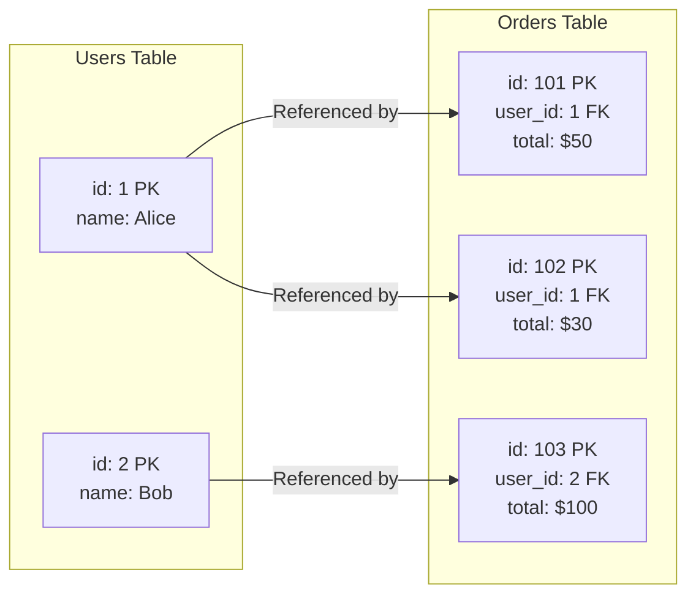
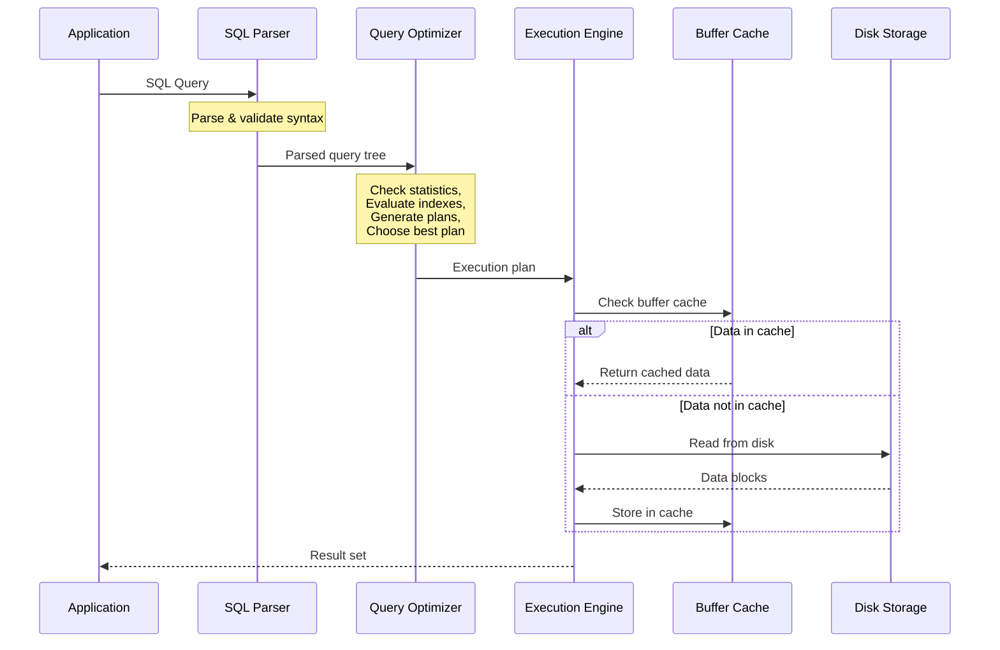
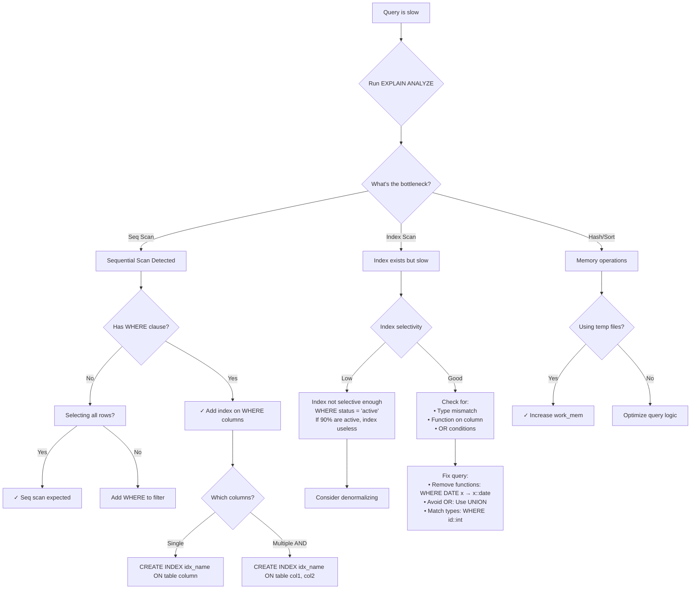
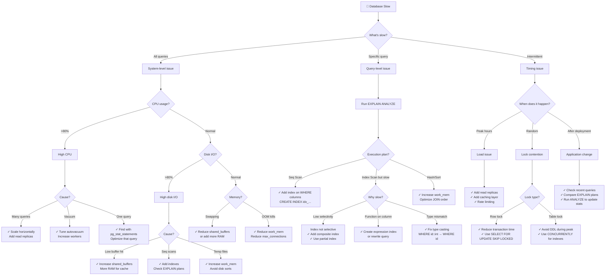

#system-design #building-block #storage #database

# SQL Databases (Visual Edition)

## Intuition (30 sec)

A spreadsheet with strict rules and superpowers: every row in the "Users" sheet MUST have a name and email. You can link sheets together (Users → Orders → Products). The spreadsheet enforces these rules, guarantees your data is always correct, and can instantly answer "show me all orders from California users who spent over $100 last month." That's a relational database.

## Failure-First Scenario

> You stored user data in JSON files. Works for 100 users. At 10,000 users, finding "all orders from last month for users in California" takes 30 seconds of scanning every file. Two users sign up with the same email. An order references a deleted user. One developer changes the JSON structure breaking everyone else's code. You need a SQL database with indexes, constraints, transactions, and a schema to prevent this chaos.

---

## Working Knowledge (5 min)

### Core Concept - SQL & Relational Databases

**SQL (Structured Query Language):**
- **Definition:** A standardized language for managing and querying relational databases, allowing you to read, write, update, and delete structured data
- **Purpose:** Provides a declarative way to interact with data - you describe what you want, not how to get it
- **How it works:** You write queries like `SELECT * FROM users WHERE age > 18` and the database figures out the most efficient way to retrieve that data

**Relational Database:**
- **Definition:** A database organized into tables with rows (records) and columns (fields), where tables can be related to each other through keys
- **Purpose:** Stores structured data with enforced relationships and integrity rules
- **How it works:** Data is normalized into separate tables, and joins combine related data when needed

**Key Terms:**

- **Table (Relation):** A collection of related data organized in rows and columns (like a spreadsheet)
- **Row (Tuple/Record):** A single entry in a table representing one entity (one user, one order)
- **Column (Attribute/Field):** A single property of an entity (user's email, order's total)
- **Schema:** The structure definition - what tables exist, what columns they have, what types they are
- **Primary Key:** A unique identifier for each row in a table (user_id, order_id)
- **Foreign Key:** A column that references a primary key in another table, creating relationships
- **Index:** A data structure that speeds up queries by creating a fast lookup path (like a book index)
- **Query:** A request for data from the database (SELECT, INSERT, UPDATE, DELETE)
- **Transaction:** A group of operations that all succeed together or all fail together (ACID guarantees)

### Visual Model - Table Relationships

```
┌─────────────────────────────────────────────────────────┐
│                  RELATIONAL MODEL                       │
└─────────────────────────────────────────────────────────┘

TABLE: users                    TABLE: orders
┌──────────┬──────────┬────────┐  ┌──────────┬─────────┬────────┬────────┐
│ id (PK)  │  name    │ email  │  │ id (PK)  │ user_id │ total  │  date  │
├──────────┼──────────┼────────┤  ├──────────┼─────────┼────────┼────────┤
│   1      │ Alice    │ a@...  │  │   101    │    1 ───┼──▶ $50 │ 1/1    │
│   2      │ Bob      │ b@...  │  │   102    │    1 ───┼──▶ $30 │ 1/5    │
│   3      │ Carol    │ c@...  │  │   103    │    2 ───┼──▶ $100│ 1/7    │
└──────────┴──────────┴────────┘  └──────────┴─────────┴────────┴────────┘
     ▲                                          │ (Foreign Key)
     │                                          │
     └──────────────────────────────────────────┘
        orders.user_id references users.id

Relationship Definition:
• One user can have many orders (one-to-many)
• Foreign key enforces referential integrity
• Can't create order with invalid user_id
• Can't delete user who has orders (or cascade delete)

Join Example:
SELECT users.name, orders.total
FROM users
JOIN orders ON users.id = orders.user_id

Result:
Alice  $50
Alice  $30
Bob    $100
```

### Popular SQL Databases

| Database | Definition | Best For | Used By |
|----------|-----------|----------|---------|
| **PostgreSQL** | Open-source ORDBMS (Object-Relational) with ACID compliance, advanced features (JSON, arrays, custom types) | Complex queries, data integrity, extensibility | Instagram, Stripe, Reddit, Uber |
| **MySQL** | Open-source RDBMS optimized for read-heavy workloads and web applications | Fast reads, replication, web apps | Facebook, Twitter, YouTube |
| **SQLite** | Embedded, serverless RDBMS stored as a single file | Mobile apps, small projects, local storage | Mobile apps, browsers, embedded systems |
| **SQL Server** | Microsoft's enterprise RDBMS with .NET integration | Enterprise apps, Windows ecosystem | Microsoft products, enterprise systems |

### Normalization vs Denormalization

```
NORMALIZED (Separate Tables)
═══════════════════════════════════════════════════════════
Definition: Data organized to minimize duplication by
            splitting into related tables

users table           orders table
┌────┬────────┐      ┌────┬─────────┬───────┐
│ id │ name   │      │ id │ user_id │ total │
├────┼────────┤      ├────┼─────────┼───────┤
│ 1  │ Alice  │◄─────│ 1  │    1    │  $50  │
└────┴────────┘      │ 2  │    1    │  $30  │
                     └────┴─────────┴───────┘

Query needs JOIN:
SELECT users.name, orders.total
FROM users JOIN orders ON users.id = orders.user_id

✓ No data duplication (Alice stored once)
✓ Easy to update (change name in one place)
✓ Strong consistency
✗ Slower reads (requires JOIN)
✗ More complex queries

Use when: Write-heavy, data integrity critical


DENORMALIZED (Combined Data)
═══════════════════════════════════════════════════════════
Definition: Data duplicated across tables for read performance

orders table (with user data embedded)
┌────┬───────────┬───────┬────────────┐
│ id │ user_name │ total │  user_email│
├────┼───────────┼───────┼────────────┤
│ 1  │ Alice     │  $50  │ alice@...  │
│ 2  │ Alice     │  $30  │ alice@...  │  ← Alice duplicated
└────┴───────────┴───────┴────────────┘

Query is simple:
SELECT user_name, total FROM orders

✓ Faster reads (no JOIN needed)
✓ Simpler queries
✗ Data duplication (Alice stored twice)
✗ Update complexity (change name in N places)
✗ Risk of inconsistency

Use when: Read-heavy, performance critical
```

---

## Layer 1: Conceptual Precision (15 min)

### Primary Keys & Foreign Keys - The Relationship Foundation

**Primary Key (PK):**
- **Formal Definition:** A column (or set of columns) that uniquely identifies each row in a table and cannot contain NULL values
- **Simple Definition:** The unique ID for a row - no two rows can have the same primary key
- **Analogy:** Like a Social Security Number - uniquely identifies a person, never changes, never reused
- **Related Terms:** Different from UNIQUE constraint (which allows NULL), different from index (PK automatically creates one)

**Foreign Key (FK):**
- **Formal Definition:** A column that contains values matching a primary key in another table, enforcing referential integrity
- **Simple Definition:** A pointer to a row in another table, creating a relationship
- **Analogy:** Like a library card number on a checkout record - it must match a real library card
- **Related Terms:** Creates parent-child relationship, CASCADE options control what happens when parent is deleted

**Why this matters:**
Foreign keys are the foundation of relational databases - they prevent orphaned data (orders with no user), enforce data integrity automatically, and enable powerful JOINs to combine related data.



**Referential Integrity Actions:**

```sql
-- Foreign Key with CASCADE
CREATE TABLE orders (
    id SERIAL PRIMARY KEY,
    user_id INTEGER REFERENCES users(id) ON DELETE CASCADE
);

Behavior:
┌────────────────────────────────────────────┐
│ DELETE FROM users WHERE id = 1             │
├────────────────────────────────────────────┤
│ CASCADE: Also deletes all orders for user 1│
│ RESTRICT: Error - orders exist, can't delete
│ SET NULL: Sets user_id to NULL in orders   │
│ NO ACTION: Error (similar to RESTRICT)    │
└────────────────────────────────────────────┘
```

### Indexes - The Performance Multiplier

**Index:**
- **Formal Definition:** An auxiliary data structure that maintains a sorted copy of selected columns with pointers to the actual table rows, enabling O(log n) lookups instead of O(n) table scans
- **Simple Definition:** Like a book's index - lets you jump directly to what you're looking for instead of reading every page
- **Analogy:** Phone book sorted by last name - find "Smith" instantly vs scanning every entry
- **Related Terms:** B-Tree (default), Hash (exact match), GiST (spatial), GIN (full-text)

**Why this matters:**
Without indexes, finding a single row in a million-row table requires scanning all million rows (table scan). With an index, it takes ~20 comparisons. This is the difference between a 5-second query and a 5-millisecond query.

### How Indexes Work (B-Tree Structure)

```
TABLE: users (1 million rows, unindexed)
┌────┬─────────┬──────────────────┐
│ id │  name   │      email       │
├────┼─────────┼──────────────────┤
│ 1  │ Alice   │ alice@example.com│  ← Check row 1
│ 2  │ Bob     │ bob@example.com  │  ← Check row 2
│ 3  │ Carol   │ carol@example.com│  ← Check row 3
│... │ ...     │ ...              │  ← Check rows 4-999,999
│1M  │ Zara    │ zara@example.com │  ← Check row 1,000,000

Query: SELECT * FROM users WHERE email = 'zara@example.com'
Without index: O(n) = 1,000,000 comparisons ≈ 5 seconds


B-TREE INDEX on email column:
════════════════════════════════════════════════

Level 1 (Root):          [m]
                     /        \
Level 2:        [d]              [s]
              /    \           /     \
Level 3:   [a-c]  [e-l]    [m-r]    [t-z]
            /  \    /  \     /  \     /  \
Level 4: [a] [c] [e] [l] [m] [r] [t] [z] ← Leaf nodes
         │   │   │   │   │   │   │   │
         ▼   ▼   ▼   ▼   ▼   ▼   ▼   ▼
      Pointers to actual table rows

Query: SELECT * FROM users WHERE email = 'zara@example.com'
With B-Tree index: O(log n) = log₂(1,000,000) ≈ 20 comparisons

Steps:
1. Start at root: 'z' > 'm' → go right
2. Next level: 'z' > 's' → go right
3. Next level: 'z' in 't-z' → go right
4. Leaf node: Found 'zara@example.com' → pointer to row
5. Follow pointer → retrieve row

Result: ~5 milliseconds (1000x faster!)
```

**Index Types:**

```
B-Tree Index (Default - 99% of cases)
═══════════════════════════════════════════
Definition: Balanced tree structure, keeps data sorted
Best for: Range queries, sorting, most WHERE clauses
Example: WHERE id > 100, WHERE name BETWEEN 'A' AND 'M'

CREATE INDEX idx_users_email ON users(email);


Hash Index (Exact matches only)
═══════════════════════════════════════════
Definition: Hash table lookup, O(1) for exact match
Best for: Equality checks only
Example: WHERE session_id = 'abc123'

CREATE INDEX idx_sessions_id ON sessions USING HASH(session_id);


GIN Index (Generalized Inverted Index)
═══════════════════════════════════════════
Definition: Inverted index for composite values
Best for: Full-text search, arrays, JSON
Example: WHERE tags @> ARRAY['sql', 'database']

CREATE INDEX idx_posts_tags ON posts USING GIN(tags);


GiST Index (Generalized Search Tree)
═══════════════════════════════════════════
Definition: Flexible tree structure for custom types
Best for: Geometric data, ranges, full-text
Example: WHERE location <-> POINT(0,0) < 100

CREATE INDEX idx_locations ON places USING GiST(location);
```

### Query Optimizer - The Smart Planner

**Query Optimizer:**
- **Formal Definition:** The database component that analyzes SQL queries and selects the most efficient execution plan from multiple possible strategies, considering indexes, statistics, and cost estimates
- **Simple Definition:** The database's brain that figures out the fastest way to get your data
- **Analogy:** Like GPS navigation - given a destination, it finds the fastest route considering traffic, roads, and distance
- **How it works:** Analyzes your query, looks at available indexes, estimates costs of different approaches, picks the best one

**Why this matters:**
The same query can execute in milliseconds or minutes depending on the plan. The optimizer's job is to use indexes wisely, choose join orders, and decide between sequential scans vs index lookups.

```
Query: SELECT * FROM users
       JOIN orders ON users.id = orders.user_id
       WHERE users.city = 'NYC'

┌──────────────────────────────────────────────┐
│         QUERY OPTIMIZER ANALYSIS             │
├──────────────────────────────────────────────┤
│                                              │
│ Step 1: Understand the query                │
│   • Need: users from NYC with their orders  │
│   • Tables: users, orders                   │
│   • Join condition: users.id = orders.user_id│
│   • Filter: users.city = 'NYC'              │
│                                              │
│ Step 2: Consider available indexes          │
│   ✓ Index on users.city exists              │
│   ✓ Index on orders.user_id exists          │
│                                              │
│ Step 3: Generate possible plans             │
│                                              │
│   Plan A (Bad):                              │
│   1. Scan all users (1M rows)               │
│   2. Filter by city (100K results)          │
│   3. Join with orders                       │
│   Cost: 1M + 100K lookups = HIGH            │
│                                              │
│   Plan B (Good):                             │
│   1. Use index on users.city (100K rows)    │
│   2. Use index on orders.user_id            │
│   3. Nested loop join                       │
│   Cost: 100K + 200K = MEDIUM                │
│                                              │
│   Plan C (Best):                             │
│   1. Index scan users.city (100K rows)      │
│   2. Hash join with orders                  │
│   Cost: 100K + 50K = LOW                    │
│                                              │
│ Step 4: Choose Plan C ✓                     │
│                                              │
└──────────────────────────────────────────────┘

You can see the chosen plan:
EXPLAIN ANALYZE SELECT ...
```

### Query Execution Flow (Visual)



**Execution Plan Steps:**

```
EXPLAIN (ANALYZE, BUFFERS)
SELECT users.name, COUNT(orders.id)
FROM users
JOIN orders ON users.id = orders.user_id
GROUP BY users.name;

Result:
─────────────────────────────────────────────────────────
 HashAggregate  (cost=450.00..455.00 rows=100 width=40)
   Group Key: users.name
   ->  Hash Join  (cost=180.00..425.00 rows=5000 width=36)
         Hash Cond: (orders.user_id = users.id)
         ->  Seq Scan on orders  (cost=0.00..155.00 rows=5000)
         ->  Hash  (cost=105.00..105.00 rows=100 width=36)
               ->  Index Scan on users  (cost=0.00..105.00 rows=100)
─────────────────────────────────────────────────────────

Reading the plan (bottom to top):
1. Index Scan on users (100 rows) → 105 cost units
2. Seq Scan on orders (5000 rows) → 155 cost units
3. Hash Join (combine results) → 425 cost units
4. HashAggregate (group by name) → 455 cost units

Total cost: 455 units ≈ 45ms execution time
```

### Connection Pool - Resource Management

**Connection Pool:**
- **Formal Definition:** A cache of database connections maintained by the application that can be reused for multiple requests, avoiding the overhead of creating new connections for each query
- **Simple Definition:** A set of pre-opened database connections ready to use, like a taxi stand with waiting cabs
- **Analogy:** Restaurant tables - it's faster to seat customers at existing tables than to build new tables for each customer
- **How it works:** App creates N connections at startup, borrows one per request, returns it when done

**Why this matters:**
Opening a new database connection takes 20-50ms (TCP handshake, authentication, session setup). For an API handling 100 req/sec, that's 5 seconds of wasted CPU time per second. Connection pooling makes each request instant.

```
WITHOUT Connection Pooling:
════════════════════════════════════════════════
Each request pays connection overhead

Request 1: ┌─────────────────────────┐
           │ 1. Open connection (50ms)│
           │ 2. Execute query (5ms)   │
           │ 3. Close connection      │
           └─────────────────────────┘
           Total: 55ms

Request 2: ┌─────────────────────────┐
           │ 1. Open connection (50ms)│  ← Waste!
           │ 2. Execute query (5ms)   │
           │ 3. Close connection      │
           └─────────────────────────┘
           Total: 55ms

Problem: 50ms overhead × 100 req/sec = 5000ms/sec wasted!


WITH Connection Pooling:
════════════════════════════════════════════════
Reuse existing connections

Startup: Create pool of 20 connections
┌────┐ ┌────┐ ┌────┐     ┌────┐
│Conn│ │Conn│ │Conn│ ... │Conn│
│ 1  │ │ 2  │ │ 3  │     │ 20 │
└────┘ └────┘ └────┘     └────┘
  │      │      │          │
  Ready  Ready  Ready     Ready

Request 1:
  1. Borrow connection #1 (0ms)
  2. Execute query (5ms)
  3. Return connection #1
  Total: 5ms ✓ (11x faster!)

Request 2:
  1. Borrow connection #2 (0ms)
  2. Execute query (5ms)
  3. Return connection #2
  Total: 5ms ✓

┌─────────────────────────────────────┐
│    CONNECTION POOL STATE            │
├─────────────────────────────────────┤
│  Active:   5/20  [▰▰░░░░░░░░]      │
│  Idle:     15/20 [▰▰▰▰▰▰▰▰░░]      │
│  Waiting:  0     [░░░░░░░░░░]      │
│                                     │
│  Peak usage: 18/20 (90%)            │
│  Avg wait time: 0ms                 │
└─────────────────────────────────────┘
```

**Connection Pool Configuration:**

```java
// HikariCP (fastest Java connection pool)
HikariConfig config = new HikariConfig();
config.setJdbcUrl("jdbc:postgresql://localhost:5432/mydb");

// Pool sizing
config.setMaximumPoolSize(20);      // Max connections
config.setMinimumIdle(5);            // Always keep 5 ready
config.setConnectionTimeout(30000);  // Wait 30s for connection

// Connection lifecycle
config.setIdleTimeout(600000);       // Close idle after 10min
config.setMaxLifetime(1800000);      // Retire after 30min

// Performance
config.setLeakDetectionThreshold(60000); // Warn if held >60s

Key Configuration Decisions:
═══════════════════════════════════════════════════════

Maximum Pool Size:
  Formula: connections = (core_count × 2) + effective_spindle_count
  Example: 4 cores, 1 disk = (4 × 2) + 1 = 9 connections

  Too small: Requests wait, throughput drops
  Too large: DB overwhelmed, context switching overhead

Minimum Idle:
  Set to average concurrent requests
  Avoids creation overhead during normal load

Connection Timeout:
  How long request waits for available connection
  Set based on acceptable latency (usually 30s)

Idle Timeout:
  Close unused connections to free resources
  Balance: too short = churn, too long = waste
```

### Replication - Scaling Reads

**Replication:**
- **Formal Definition:** The process of copying data from one database server (primary) to one or more other servers (replicas) to improve read scalability, availability, and disaster recovery
- **Simple Definition:** Keeping synchronized copies of your database on multiple servers
- **Analogy:** Like having photocopies of a document - multiple people can read simultaneously, but only one person has the original to write on
- **How it works:** Primary accepts writes, replicas receive changes and stay in sync

**Key Terms:**
- **Primary (Master):** The main database that accepts write operations
- **Replica (Slave/Standby):** A copy that receives changes from primary
- **Replication Lag:** Time delay between write on primary and appearance on replica
- **Asynchronous Replication:** Primary doesn't wait for replica confirmation (faster, but lag possible)
- **Synchronous Replication:** Primary waits for replica confirmation (slower, but guaranteed consistency)

**Why this matters:**
Read queries often outnumber writes 10:1 or more. One database can handle maybe 10K reads/sec. With 5 replicas, you can handle 50K reads/sec. Replication is the primary way to scale read-heavy workloads.

### Replication Topology (Visual)

```
PRIMARY-REPLICA ARCHITECTURE
═══════════════════════════════════════════════════════

                    Application Layer
                          │
                    ┌─────┴─────┐
                    │           │
                   Write       Read
                    │           │
                    ▼           ▼
    ┌──────────────────┐   ┌──────────────┐
    │     PRIMARY      │   │ Load Balancer│
    │   (PostgreSQL)   │   │  (PgBouncer) │
    │                  │   └──────┬───────┘
    │ • All writes     │          │
    │ • Some reads     │   ┌──────┼───────┬───────┐
    │ • Source of truth│   │      │       │       │
    └────────┬─────────┘   │      │       │       │
             │            ┌▼───┐ ┌▼───┐ ┌▼───┐ ┌▼───┐
             ├───────────▶│Rep1│ │Rep2│ │Rep3│ │Rep4│
             │            │    │ │    │ │    │ │    │
             │ Replication│Read│ │Read│ │Read│ │Read│
             │   Stream   │Only│ │Only│ │Only│ │Only│
             │            └────┘ └────┘ └────┘ └────┘
             │
             └─────────────────────────────────────────┐
                     (Binary replication log)          │
                                                        │
    Changes:                                            ▼
    1. INSERT INTO users ...         ┌──────────────────────────┐
    2. UPDATE orders SET ...         │ Replication guarantees:  │
    3. DELETE FROM sessions ...      │                          │
                                     │ • Eventually consistent  │
                                     │ • Lag: 10ms - 5 seconds  │
                                     │ • Read scaling: 5x       │
                                     └──────────────────────────┘

Read/Write Split Pattern:
─────────────────────────────────────────────────────

def create_user(data):
    # Writes always go to primary
    primary_db.execute("INSERT INTO users ...")

def get_user(user_id):
    # Reads go to random replica
    replica_db.execute("SELECT * FROM users WHERE id = ?", user_id)

def get_user_after_write(user_id):
    # Critical: Read from primary after write
    # (replica might not have new data yet)
    primary_db.execute("SELECT * FROM users WHERE id = ?", user_id)
```

**Replication Lag Problem:**

```
Time ───────────────────────────────────────▶

T0: User creates account
    ┌────────────────────────┐
    │ App → Primary DB       │
    │ INSERT user 'Alice'    │
    └────────────────────────┘

T1: Replication begins (10ms lag)
    ┌────────────────────────┐
    │ Primary → Replica      │
    │ Copying changes...     │
    └────────────────────────┘

T2: User redirected to dashboard (reads from replica)
    ┌────────────────────────┐
    │ App → Replica DB       │
    │ SELECT user 'Alice'    │
    │ Result: NOT FOUND ✗    │  ← User sees "error"!
    └────────────────────────┘

T3: Replication completes (10ms later)
    ┌────────────────────────┐
    │ Replica now has 'Alice'│
    │ But user already saw   │
    │ error message          │
    └────────────────────────┘

Solutions:
─────────────────────────────────────────────────
1. Read-your-writes: Read from primary after write
2. Session pinning: Route user to primary for 1 second
3. Replication lag monitoring: Alert if > 100ms
```

### Sharding - Scaling Writes

**Sharding:**
- **Formal Definition:** A database partitioning pattern that splits data across multiple independent database servers (shards) based on a partitioning key, distributing both storage and query load
- **Simple Definition:** Splitting one huge database into multiple smaller databases, each responsible for a subset of data
- **Analogy:** Like organizing a library into multiple buildings by subject - fiction in building A, science in building B, history in building C
- **How it works:** Pick a shard key (e.g., user_id), use hash or range to determine which shard holds that data

**Key Terms:**
- **Shard:** One of the independent database servers holding a portion of the data
- **Shard Key:** The column used to determine which shard holds a record (e.g., user_id, region)
- **Horizontal Partitioning:** Splitting rows across servers (sharding)
- **Vertical Partitioning:** Splitting columns across servers (different concept)
- **Resharding:** Moving data when adding/removing shards (very painful)

**Why this matters:**
One database can only handle so many writes per second (maybe 10K). When you need 100K writes/sec, you need to split the write load across multiple databases. Sharding is the last resort for write scaling - it's complex but powerful.

```
BEFORE SHARDING (Single Database)
═══════════════════════════════════════════════════════

                Application
                     │
                     ▼
        ┌────────────────────────┐
        │    Single Database     │
        │                        │
        │  10M users             │
        │  100M orders           │
        │                        │
        │  Writes: 8K/sec        │
        │  ⚠ Approaching limit!   │
        └────────────────────────┘

Problems:
• Single server CPU maxed out
• Disk I/O bottleneck
• Can't scale writes further
• Database size: 500GB (getting expensive)


AFTER SHARDING (By user_id hash)
═══════════════════════════════════════════════════════

                Application
              (Routing Logic)
                     │
      ┌──────────────┼──────────────┐
      │              │              │
      ▼              ▼              ▼
┌─────────┐    ┌─────────┐    ┌─────────┐    ┌─────────┐
│ Shard 0 │    │ Shard 1 │    │ Shard 2 │    │ Shard 3 │
│         │    │         │    │         │    │         │
│ user_id │    │ user_id │    │ user_id │    │ user_id │
│ % 4 = 0 │    │ % 4 = 1 │    │ % 4 = 2 │    │ % 4 = 3 │
│         │    │         │    │         │    │         │
│ 2.5M    │    │ 2.5M    │    │ 2.5M    │    │ 2.5M    │
│ users   │    │ users   │    │ users   │    │ users   │
│         │    │         │    │         │    │         │
│ Writes: │    │ Writes: │    │ Writes: │    │ Writes: │
│ 2K/sec  │    │ 2K/sec  │    │ 2K/sec  │    │ 2K/sec  │
└─────────┘    └─────────┘    └─────────┘    └─────────┘

Benefits:
✓ 4x write capacity (8K → 32K/sec potential)
✓ Smaller databases (500GB → 125GB each)
✓ Isolated failures (shard 0 down ≠ all users down)
✓ Can add more shards as you grow

Routing Logic:
─────────────────────────────────────────────────
def get_shard(user_id):
    shard_number = user_id % NUM_SHARDS
    return shards[shard_number]

# Example:
get_shard(12345)  # 12345 % 4 = 1 → Shard 1
get_shard(67890)  # 67890 % 4 = 2 → Shard 2
```

**Sharding Strategies:**

```
HASH-BASED SHARDING
═══════════════════════════════════════════════════════
Definition: Use hash function on shard key to distribute evenly

Shard = hash(user_id) % num_shards

Example:
user_id 1 → hash → % 4 → Shard 1
user_id 2 → hash → % 4 → Shard 2
user_id 3 → hash → % 4 → Shard 3
user_id 4 → hash → % 4 → Shard 0

✓ Even distribution
✓ Simple to implement
✗ Can't range scan (e.g., user_id 1-1000)
✗ Resharding is painful (changes all hashes)


RANGE-BASED SHARDING
═══════════════════════════════════════════════════════
Definition: Assign ranges of shard key to each shard

Shard 0: user_id 1 - 2,500,000
Shard 1: user_id 2,500,001 - 5,000,000
Shard 2: user_id 5,000,001 - 7,500,000
Shard 3: user_id 7,500,001 - 10,000,000

✓ Range queries possible
✓ Easier to rebalance (move ranges)
✗ Uneven distribution (new users → shard 3 hot)
✗ Need to track range mappings


GEOGRAPHIC SHARDING
═══════════════════════════════════════════════════════
Definition: Shard by geographic region

Shard US-East: users where region = 'us-east'
Shard US-West: users where region = 'us-west'
Shard EU: users where region = 'eu'
Shard Asia: users where region = 'asia'

✓ Low latency (data near users)
✓ Regulatory compliance (data residency)
✗ Uneven distribution (more users in US)
✗ What about multi-region users?
```

**Sharding Challenges:**

```
┌────────────────────────────────────────────┐
│      PROBLEMS WITH SHARDING                │
├────────────────────────────────────────────┤
│                                            │
│ 1. Cross-Shard Queries                    │
│    ─────────────────────────────────────   │
│    Query: "Get all orders for all users"  │
│                                            │
│    Must query ALL shards:                 │
│    Shard 0 → 1000 orders                  │
│    Shard 1 → 950 orders                   │
│    Shard 2 → 1100 orders                  │
│    Shard 3 → 900 orders                   │
│    App merges results → 3950 orders       │
│                                            │
│    Problem: Slow, complex, no JOIN support│
│                                            │
│ 2. Cross-Shard JOINs                      │
│    ─────────────────────────────────────   │
│    Query: "Get users with their orders"   │
│                                            │
│    CAN'T DO:                               │
│    SELECT users.name, orders.total        │
│    FROM users JOIN orders                 │
│      (users and orders on diff shards!)   │
│                                            │
│    MUST DO:                                │
│    1. Query all user shards               │
│    2. Query all order shards              │
│    3. JOIN in application code ← Slow!    │
│                                            │
│ 3. Resharding (Adding Shards)            │
│    ─────────────────────────────────────   │
│    Going from 4 → 8 shards:               │
│                                            │
│    user_id 5 was: 5 % 4 = 1 (Shard 1)    │
│    user_id 5 now: 5 % 8 = 5 (Shard 5)    │
│                                            │
│    Must move 50% of data!                 │
│    Downtime or complex dual-write         │
│                                            │
│ 4. Transactions Across Shards             │
│    ─────────────────────────────────────   │
│    Transfer money: user 1 → user 2        │
│                                            │
│    User 1 on Shard 1                      │
│    User 2 on Shard 2                      │
│                                            │
│    Can't use DB transactions!             │
│    Need distributed transactions (2PC)    │
│                                            │
└────────────────────────────────────────────┘

Rule of Thumb:
─────────────────────────────────────────────────
Avoid sharding until you've tried:
  1. Optimizing queries
  2. Adding indexes
  3. Vertical scaling (bigger machine)
  4. Read replicas
  5. Caching
  6. Archiving old data

Only shard when you have NO other option.
```

---

## Layer 2: Technology-Specific Examples (20 min)

### PostgreSQL - The Workhorse

**PostgreSQL:**
- **Definition:** An open-source object-relational database management system (ORDBMS) with ACID compliance, extensibility, and support for advanced data types (JSON, arrays, custom types)
- **Best For:** Complex queries, data integrity, JSONB for semi-structured data, geospatial with PostGIS
- **Used By:** Instagram (handling 1TB+ database), Uber (core trip data), Reddit (main data store), Stripe (financial transactions)

### PostgreSQL Production Configuration

```sql
-- postgresql.conf - Production Settings
-- File location: /etc/postgresql/14/main/postgresql.conf

-- CONNECTIONS
───────────────────────────────────────────────────────
max_connections = 200
# Definition: Maximum number of concurrent connections
# Calculation: (CPU cores × 2) + effective_spindle_count
# Too high: Context switching overhead, memory waste
# Too low: Connection refused errors
# Note: Use connection pooler (PgBouncer) for 1000+ clients

# MEMORY
───────────────────────────────────────────────────────
shared_buffers = 8GB
# Definition: Memory for caching data blocks
# Recommendation: 25% of total RAM (32GB RAM → 8GB)
# Purpose: Hot data stays in memory, reduces disk I/O
# Impact: 10-100x faster reads from buffer cache

effective_cache_size = 24GB
# Definition: Hint to planner about total cache available
# Recommendation: 75% of total RAM
# Does NOT allocate memory (just tells optimizer)
# Impact: Better query plans, more likely to use indexes

work_mem = 50MB
# Definition: Memory per operation (sort, hash, join)
# Calculation: (total RAM × 0.25) / max_connections
# Example: (32GB × 0.25) / 200 = 40MB
# Warning: Each query can use work_mem × N operations!
# Too high: OOM kills. Too low: Disk-based sorts (slow)

maintenance_work_mem = 2GB
# Definition: Memory for VACUUM, CREATE INDEX, ALTER TABLE
# Recommendation: 5-10% of RAM
# Impact: Faster index creation, faster VACUUM

# WRITE-AHEAD LOG (WAL)
───────────────────────────────────────────────────────
wal_level = replica
# Definition: How much info written to WAL
# Options: minimal, replica, logical
# replica: Needed for replication + point-in-time recovery
# logical: Needed for logical replication (selective sync)

wal_buffers = 16MB
# Definition: WAL buffer size in shared memory
# Auto-set to 3% of shared_buffers (usually good)
# Impact: Reduces disk writes for WAL

checkpoint_timeout = 15min
# Definition: Maximum time between checkpoints
# Checkpoint: Flush dirty buffers to disk
# Trade-off: Short = less recovery time, more I/O
#           Long = better performance, longer recovery

checkpoint_completion_target = 0.9
# Definition: Spread checkpoint I/O over this fraction
# 0.9 = spread writes over 90% of checkpoint_timeout
# Prevents I/O spikes, smoother performance

# QUERY PLANNER
───────────────────────────────────────────────────────
random_page_cost = 1.1
# Definition: Planner's cost estimate for random disk read
# Default: 4.0 (spinning disk)
# SSD: 1.1 (random reads fast on SSD)
# Impact: Planner more likely to choose index scans

effective_io_concurrency = 200
# Definition: Number of concurrent disk I/O operations
# HDD: 2-4. SSD: 200. NVMe: 500
# Impact: Better parallel query performance

# AUTOVACUUM (Garbage Collection)
───────────────────────────────────────────────────────
autovacuum = on
# Definition: Automatically VACUUM to reclaim space
# CRITICAL: Never turn off! DB will bloat and slow down

autovacuum_max_workers = 4
# Definition: Number of parallel vacuum processes
# Recommendation: Number of CPU cores / 4

autovacuum_naptime = 30s
# Definition: Time between autovacuum runs
# 30s = check every 30 seconds for tables needing VACUUM

# LOGGING (Essential for Troubleshooting)
───────────────────────────────────────────────────────
log_min_duration_statement = 1000
# Definition: Log queries slower than 1000ms
# Critical for finding slow queries
# Start high (1000ms), lower to 100ms if needed

log_line_prefix = '%t [%p]: [%l-1] user=%u,db=%d,app=%a,client=%h '
# Definition: Prefix for each log line
# %t=timestamp, %p=PID, %u=user, %d=database, %h=host
# Example: 2024-01-15 10:30:45 [1234]: [1-1] user=app,db=prod,client=10.0.1.5

log_lock_waits = on
# Definition: Log when query waits > deadlock_timeout for lock
# Essential for debugging lock contention

log_temp_files = 0
# Definition: Log temp files (disk-based sorts/hashes)
# 0 = log all temp files
# Indicates work_mem too small

# CONNECTIONS & STATEMENT TIMEOUT
───────────────────────────────────────────────────────
statement_timeout = 30000
# Definition: Cancel query after 30 seconds
# Prevents runaway queries from blocking system
# 0 = disabled (dangerous in production!)

idle_in_transaction_session_timeout = 60000
# Definition: Close idle transactions after 60 seconds
# Prevents "idle in transaction" holding locks

# REPLICATION (if using replicas)
───────────────────────────────────────────────────────
max_wal_senders = 5
# Definition: Number of replication connections
# Set to number of replicas + 1 backup

wal_keep_size = 1GB
# Definition: Keep at least 1GB of WAL for replicas
# Prevents replica falling too far behind

hot_standby = on
# Definition: Allow read queries on replicas
# Essential for read scaling
```

**Quick Configuration Examples:**

```sql
-- Small Server (2 CPU, 4GB RAM)
───────────────────────────────────────────────────────
max_connections = 50
shared_buffers = 1GB
effective_cache_size = 3GB
work_mem = 20MB
maintenance_work_mem = 256MB


-- Medium Server (8 CPU, 32GB RAM)
───────────────────────────────────────────────────────
max_connections = 200
shared_buffers = 8GB
effective_cache_size = 24GB
work_mem = 50MB
maintenance_work_mem = 2GB


-- Large Server (32 CPU, 128GB RAM)
───────────────────────────────────────────────────────
max_connections = 500
shared_buffers = 32GB
effective_cache_size = 96GB
work_mem = 100MB
maintenance_work_mem = 4GB
```

### Indexing Strategy Decision Tree



**Index Creation Examples:**

```sql
-- BASIC INDEX
───────────────────────────────────────────────────────
CREATE INDEX idx_users_email ON users(email);
-- Use when: WHERE email = 'alice@example.com'
-- Impact: O(n) → O(log n)


-- COMPOSITE INDEX (Order matters!)
───────────────────────────────────────────────────────
CREATE INDEX idx_orders_user_date ON orders(user_id, created_at);

-- Works for:
SELECT * FROM orders WHERE user_id = 123 AND created_at > '2024-01-01';
SELECT * FROM orders WHERE user_id = 123;  ← Uses only first column

-- Does NOT work for:
SELECT * FROM orders WHERE created_at > '2024-01-01';  ← Missing first column!

Rule: Leftmost prefix rule
  Index on (A, B, C) works for:
  • WHERE A
  • WHERE A AND B
  • WHERE A AND B AND C
  But NOT for: WHERE B, WHERE C, WHERE B AND C


-- PARTIAL INDEX (Smaller, faster)
───────────────────────────────────────────────────────
CREATE INDEX idx_orders_active ON orders(user_id)
WHERE status = 'active';

-- Only indexes active orders (10% of data)
-- 10x smaller index → faster, less memory
-- Use when: Most queries filter by status = 'active'


-- UNIQUE INDEX (Enforces constraint)
───────────────────────────────────────────────────────
CREATE UNIQUE INDEX idx_users_email_unique ON users(email);

-- Prevents duplicate emails
-- Faster than UNIQUE constraint (same thing under hood)


-- INDEX FOR SORTING
───────────────────────────────────────────────────────
CREATE INDEX idx_posts_created ON posts(created_at DESC);

-- Speeds up: ORDER BY created_at DESC
-- Index stores data pre-sorted!


-- COVERING INDEX (Include extra columns)
───────────────────────────────────────────────────────
CREATE INDEX idx_users_email_covering
ON users(email) INCLUDE (name, created_at);

-- Query: SELECT name, created_at FROM users WHERE email = 'alice@example.com'
-- Result: Index-only scan (no table access needed!)
-- Faster + less I/O


-- GIN INDEX (Full-text search, arrays, JSONB)
───────────────────────────────────────────────────────
CREATE INDEX idx_posts_tags ON posts USING GIN(tags);

-- Use when: tags is array or JSONB
-- Query: WHERE tags @> ARRAY['sql', 'database']
-- Or: WHERE tags ? 'sql'


-- EXPRESSION INDEX (Index on computed value)
───────────────────────────────────────────────────────
CREATE INDEX idx_users_lower_email ON users(LOWER(email));

-- Use when: WHERE LOWER(email) = 'alice@example.com'
-- Index on function result
-- Now case-insensitive search is fast!
```

**When NOT to index:**

```
❌ Don't index:
─────────────────────────────────────────────────
1. Small tables (< 1000 rows)
   • Seq scan faster than index lookup overhead

2. High-write, low-read columns
   • Index slows down INSERT/UPDATE/DELETE

3. Low selectivity columns
   • WHERE gender = 'M' (50% of rows)
   • Index won't be used, wastes space

4. Columns in frequent UPDATE statements
   • Every UPDATE must update index
   • Slows writes significantly

5. Too many indexes on one table
   • Each index slows writes
   • Diminishing returns after 5-7 indexes
   • Wastes storage (index can be larger than table!)
```

---

## Layer 3: Production-Ready Details (30 min)

### Production Architecture - Complete Stack

```
┌────────────────────────────────────────────────────────┐
│                 GLOBAL DNS (Route53)                   │
│  api.example.com → Geographic routing                  │
│  • US users → US-East region                           │
│  • EU users → EU region                                │
└───────────────────┬────────────────────────────────────┘
                    │
    ┌───────────────┼───────────────┐
    │               │               │
    ▼               ▼               ▼
┌─────────┐   ┌─────────┐   ┌─────────┐
│ US-East │   │ US-West │   │   EU    │
│ Region  │   │ Region  │   │ Region  │
└────┬────┘   └────┬────┘   └────┬────┘
     │             │             │
     ▼             ▼             ▼

EACH REGION:
═══════════════════════════════════════════════════════

        ┌────────────────────────────┐
        │  Application Load Balancer │
        │  • Health checks: /health  │
        │  • Timeout: 30s            │
        └─────┬──────────────────┬───┘
              │                  │
      ┌───────┴────┐      ┌──────┴──────┐
      │            │      │             │
 ┌────▼───┐  ┌────▼───┐ ┌▼─────┐ ┌────▼───┐
 │ App 1  │  │ App 2  │ │App 3 │ │ App N  │
 │ (Java) │  │ (Java) │ │(Java)│ │ (Java) │
 │ 8080   │  │ 8080   │ │ 8080 │ │ 8080   │
 └────┬───┘  └────┬───┘ └──┬───┘ └────┬───┘
      │           │        │          │
      └───────────┴────────┴──────────┘
                   │
        ┌──────────┼───────────┐
        │          │           │
   ┌────▼────┐    │      ┌────▼─────┐
   │ Redis   │    │      │ Kafka    │
   │ Cluster │    │      │ Cluster  │
   │ (Cache) │    │      │ (Queue)  │
   │ 6379    │    │      │ 9092     │
   └─────────┘    │      └──────────┘
                  │
         ┌────────▼─────────┐
         │  PgBouncer Pool  │
         │  Max: 200 conns  │
         └────────┬─────────┘
                  │
      ┌───────────┼────────────┐
      │           │            │
 ┌────▼────┐ ┌────▼────┐ ┌────▼────┐
 │PostgreSQL│PostgreSQL││PostgreSQL│
 │ PRIMARY │ │ Replica │││ Replica │
 │         │ │ (Read)  │││ (Read)  │
 │ Writes  ├─┤         │├┤         │
 │ + Reads │ │         │││         │
 │         │ │         │││         │
 │ 16 CPU  │ │ 8 CPU   │││ 8 CPU   │
 │ 64GB RAM│ │ 32GB RAM│││ 32GB RAM│
 │ 1TB SSD │ │ 512GB   │││ 512GB   │
 └─────┬───┘ └─────────┘└─────────┘
       │
       ▼
 ┌──────────────┐
 │   S3 Backup  │
 │  (Daily WAL) │
 │  Retention:  │
 │   30 days    │
 └──────────────┘

Component Definitions:
─────────────────────────────────────────────────
Load Balancer: Distributes traffic across app servers
               Health checks remove failed servers

PgBouncer: Connection pooler for PostgreSQL
           200 client connections → 20 DB connections
           Reduces connection overhead

Redis: In-memory cache for hot data
       Cache hit: 1ms, DB query: 50ms
       95% hit rate → 95% queries avoid DB

Kafka: Message queue for async processing
       Decouples services, ensures delivery

Primary DB: Source of truth, handles all writes
            Replicates to read replicas

Replicas: Handle read traffic (90% of queries)
          Eventually consistent (10-100ms lag)
```

### Monitoring Dashboard - Complete Metrics

```
╔═══════════════════════════════════════════════════════╗
║          POSTGRESQL HEALTH DASHBOARD                  ║
╠═══════════════════════════════════════════════════════╣
║                                                       ║
║  🔵 QUERY PERFORMANCE                                 ║
║  ═════════════════════════════════════════            ║
║                                                       ║
║  Queries Per Second (QPS):  1,247 req/sec            ║
║  ▬▬▬▬▬▬▬▬▬▬▬▬▬▬▬▬▬▬▬▬▬▬▬▬▬▬▬▬▬▬▬▬▬▬▬▬             ║
║  ▲ 12% from last hour                                 ║
║                                                       ║
║  Query Latency P50:  5ms   [▰▰░░░░░░░░] ✓            ║
║  Query Latency P95:  25ms  [▰▰▰▰▰░░░░░] ✓            ║
║  Query Latency P99:  100ms [▰▰▰▰▰▰▰░░░] ⚠            ║
║  Target P99: < 100ms                                  ║
║                                                       ║
║  Slow Queries (>1s):  3 queries/min                  ║
║  Last slow query: SELECT * FROM orders WHERE...      ║
║                                                       ║
║  ─────────────────────────────────────────            ║
║                                                       ║
║  🟢 CONNECTION POOL (PgBouncer)                       ║
║  ═════════════════════════════════════════            ║
║                                                       ║
║  Client Connections:   180/200  [▰▰▰▰▰▰▰▰▰░] 90%    ║
║  Server Connections:   18/20    [▰▰▰▰▰▰▰▰▰░] 90%    ║
║  Waiting Clients:      5        [▰░░░░░░░░░░]  ⚠     ║
║                                                       ║
║  Avg Wait Time:        50ms     (Target: < 10ms)     ║
║  Max Wait Time:        500ms    (⚠ Pool exhaustion)   ║
║                                                       ║
║  Recommendation: Increase pool size or optimize      ║
║                  long-running queries                ║
║                                                       ║
║  ─────────────────────────────────────────            ║
║                                                       ║
║  🟡 CACHE PERFORMANCE (Redis)                         ║
║  ═════════════════════════════════════════            ║
║                                                       ║
║  Hit Rate:      95.3%  [▰▰▰▰▰▰▰▰▰▰▰▰▰▰▰▰▰▰▰░] ✓      ║
║  Miss Rate:     4.7%   [▰░░░░░░░░░░░░░░░░░░░]        ║
║                                                       ║
║  Cache Hits:    1,188/sec                            ║
║  Cache Misses:  59/sec → Hit PostgreSQL              ║
║                                                       ║
║  Memory Used:   8.2GB / 16GB [▰▰▰▰▰▰▰▰░░]            ║
║  Eviction Rate: 10 keys/sec (LRU policy)             ║
║                                                       ║
║  ─────────────────────────────────────────            ║
║                                                       ║
║  🔴 REPLICATION LAG                                   ║
║  ═════════════════════════════════════════            ║
║                                                       ║
║  Replica 1:  45ms   [▰▰▰▰░░░░░░] ✓ Healthy           ║
║  Replica 2:  52ms   [▰▰▰▰▰░░░░░] ✓ Healthy           ║
║  Replica 3:  1,200ms [▰▰▰▰▰▰▰▰▰▰] ❌ LAGGING         ║
║                                                       ║
║  Alert: Replica 3 lag > 1 second!                    ║
║  Possible causes:                                    ║
║  • Network issues between primary and replica        ║
║  • Replica overloaded with read queries              ║
║  • Large transaction on primary                      ║
║                                                       ║
║  ─────────────────────────────────────────            ║
║                                                       ║
║  📊 DATABASE SIZE & GROWTH                            ║
║  ═════════════════════════════════════════            ║
║                                                       ║
║  Total Size:     487GB                               ║
║  Growth Rate:    5GB/day                             ║
║  Projection:     640GB in 30 days                    ║
║                                                       ║
║  Largest Tables:                                     ║
║    orders       245GB  (50%)                         ║
║    users        120GB  (25%)                         ║
║    events       98GB   (20%)                         ║
║                                                       ║
║  ─────────────────────────────────────────            ║
║                                                       ║
║  ⚡ TRANSACTIONS & WRITES                             ║
║  ═════════════════════════════════════════            ║
║                                                       ║
║  Commits:       850/sec                              ║
║  Rollbacks:     12/sec  (1.4% - normal)              ║
║                                                       ║
║  Locks Acquired: 1,450/sec                           ║
║  Deadlocks:     0/min   ✓                            ║
║  Lock Waits:    5/min   (⚠ Some contention)          ║
║                                                       ║
║  ─────────────────────────────────────────            ║
║                                                       ║
║  💾 BUFFER CACHE                                      ║
║  ═════════════════════════════════════════            ║
║                                                       ║
║  shared_buffers: 8GB                                 ║
║  Buffer Hit Rate: 99.2% [▰▰▰▰▰▰▰▰▰▰▰▰▰▰▰▰▰▰▰░] ✓     ║
║                                                       ║
║  Definition: % of reads served from memory           ║
║  Target: > 99% (< 99% = need more shared_buffers)    ║
║                                                       ║
║  Disk Reads:    10K/sec  (0.8% of total)             ║
║  Cache Reads:   1.24M/sec (99.2% of total)           ║
║                                                       ║
╠═══════════════════════════════════════════════════════╣
║  🚨 ACTIVE ALERTS                                     ║
╠═══════════════════════════════════════════════════════╣
║  • Replica 3 lag > 1 second (CRITICAL)               ║
║  • Connection pool at 90% capacity (WARNING)         ║
║  • P99 latency approaching 100ms (WARNING)           ║
╚═══════════════════════════════════════════════════════╝
```

**Metric Definitions:**

```
KEY METRICS EXPLAINED
═══════════════════════════════════════════════════════

QPS (Queries Per Second):
  Definition: Number of SQL queries executed per second
  Healthy range: Depends on hardware, 1K-10K typical
  Alert when: Sudden drop (service down) or spike (attack?)

Query Latency (P50, P95, P99):
  P50: 50% of queries faster than this (median)
  P95: 95% of queries faster than this
  P99: 99% of queries faster than this
  Why P99? Worst user experience for 1% of requests
  Target: P99 < 100ms for interactive apps

Replication Lag:
  Definition: Time delay between write on primary
              and appearance on replica
  Measured in: Milliseconds or bytes behind
  Healthy: < 100ms
  Warning: 100ms - 1s (might see stale data)
  Critical: > 1s (user-visible inconsistency)

Buffer Hit Rate:
  Definition: % of data reads served from RAM cache
  Formula: (cache hits / total reads) × 100
  Target: > 99%
  < 99%: Add more shared_buffers or queries inefficient

Connection Pool Utilization:
  Definition: % of available connections in use
  < 50%: Underutilized (can reduce pool)
  50-80%: Healthy
  > 90%: Approaching limit (scale up or optimize)
  100%: Clients waiting (bad user experience)
```

### Troubleshooting Decision Tree - Slow Queries



**Common Slow Query Patterns:**

```sql
-- PROBLEM 1: Missing Index
───────────────────────────────────────────────────────
SELECT * FROM orders WHERE user_id = 123;

EXPLAIN ANALYZE:
Seq Scan on orders  (cost=0..10000 rows=5 width=100)
                     (actual time=500..500 rows=5 loops=1)
  Filter: (user_id = 123)
  Rows Removed by Filter: 999995

Problem: Scanned 1M rows to find 5 rows
Solution: CREATE INDEX idx_orders_user_id ON orders(user_id);

After index:
Index Scan using idx_orders_user_id  (cost=0..8 rows=5 width=100)
                                      (actual time=0.1..0.1 rows=5 loops=1)
Result: 500ms → 0.1ms (5000x faster!)


-- PROBLEM 2: Function on Indexed Column
───────────────────────────────────────────────────────
CREATE INDEX idx_users_email ON users(email);

SELECT * FROM users WHERE LOWER(email) = 'alice@example.com';

EXPLAIN ANALYZE:
Seq Scan on users  (cost=0..1000 rows=1)
  Filter: (lower(email) = 'alice@example.com')

Problem: Index on 'email', but query uses LOWER(email)
         Index can't be used!

Solution 1: Expression index
CREATE INDEX idx_users_lower_email ON users(LOWER(email));

Solution 2: Case-insensitive collation (PostgreSQL 12+)
CREATE INDEX idx_users_email ON users(email text_pattern_ops);


-- PROBLEM 3: OR Condition (Can't Use Index Efficiently)
───────────────────────────────────────────────────────
SELECT * FROM users
WHERE email = 'alice@example.com'
   OR username = 'alice';

Problem: Needs to scan both indexes, then merge
         Often degrades to Seq Scan

Solution: Use UNION
SELECT * FROM users WHERE email = 'alice@example.com'
UNION
SELECT * FROM users WHERE username = 'alice';

Result: Two fast index scans instead of one slow Seq Scan


-- PROBLEM 4: SELECT * (Retrieving Unused Columns)
───────────────────────────────────────────────────────
SELECT * FROM users WHERE email = 'alice@example.com';

Problem: Fetches all 50 columns, including large TEXT fields
         Wastes bandwidth and memory

Solution: Select only needed columns
SELECT id, name, email FROM users WHERE email = 'alice@example.com';

Bonus: Can use covering index
CREATE INDEX idx_users_email_covering
ON users(email) INCLUDE (id, name);
-- Now it's an index-only scan (no table access!)


-- PROBLEM 5: N+1 Query Problem
───────────────────────────────────────────────────────
# Bad (N+1 queries)
users = db.query("SELECT * FROM users LIMIT 100")
for user in users:
    orders = db.query("SELECT * FROM orders WHERE user_id = ?", user.id)
    # 1 query for users + 100 queries for orders = 101 queries!

Problem: 101 queries instead of 2
         100 network round-trips

Solution: JOIN or batch query
# Good (2 queries)
query = """
    SELECT users.*, orders.*
    FROM users
    LEFT JOIN orders ON users.id = orders.user_id
    WHERE users.id IN (SELECT id FROM users LIMIT 100)
"""
results = db.query(query)


-- PROBLEM 6: Large OFFSET (Pagination)
───────────────────────────────────────────────────────
SELECT * FROM orders ORDER BY created_at DESC LIMIT 10 OFFSET 100000;

Problem: Database scans 100,010 rows, returns 10
         OFFSET 1,000,000 = scan 1M rows!

Solution: Keyset pagination (cursor-based)
SELECT * FROM orders
WHERE created_at < '2024-01-15 10:30:00'  -- Last seen timestamp
ORDER BY created_at DESC
LIMIT 10;

Result: Always fast, regardless of page depth
```

### Scaling Patterns - Evolution

```
STAGE 1: Single Database (0-10K users)
═══════════════════════════════════════════════════════
              ┌──────────┐
              │   App    │
              └─────┬────┘
                    │
              ┌─────▼────┐
              │PostgreSQL│
              │ Primary  │
              └──────────┘

Capacity:
  • Reads: 1K QPS
  • Writes: 500 QPS
  • Storage: 50GB

Cost: $100/month
Complexity: ⭐

Problems at scale:
  ✗ Single point of failure
  ✗ CPU maxed on read queries
  ✗ Can't scale further


STAGE 2: Primary + Read Replicas (10K-100K users)
═══════════════════════════════════════════════════════
              ┌──────────┐
              │   App    │
              └─┬──────┬─┘
               │      │
            Write    Read
               │      │
               ▼      ▼
        ┌──────────┐ ┌────────────┐
        │PostgreSQL│ │Read Router │
        │ Primary  ├─┤  (PgBouncer)│
        └──────────┘ └──┬──┬───┬──┘
                        │  │   │
              ┌─────────┴──┴───┴─────────┐
              ▼         ▼       ▼         ▼
          ┌──────┐ ┌──────┐ ┌──────┐ ┌──────┐
          │Replica│Replica││Replica││Replica│
          │  1   ││  2   ││  3   ││  4   │
          └──────┘ └──────┘ └──────┘ └──────┘

Capacity:
  • Reads: 5K QPS (5x scale)
  • Writes: 500 QPS (same)
  • Storage: 500GB

Cost: $500/month
Complexity: ⭐⭐

Benefits:
  ✓ 5x read capacity
  ✓ High availability (failover to replica)
  ✓ No code changes (read/write split)

Still a problem:
  ✗ Write bottleneck on primary
  ✗ Replication lag (eventual consistency)


STAGE 3: Caching Layer (100K-500K users)
═══════════════════════════════════════════════════════
              ┌──────────┐
              │   App    │
              └─┬──────┬─┘
               │      │
            Write    Read
               │      │
               │   ┌──▼───────┐
               │   │Try cache?│
               │   └──┬───┬───┘
               │     Hit│ Miss
               │      │  │
               ▼      ▼  ▼
        ┌──────────┐ ┌─────────┐ ┌──────────┐
        │PostgreSQL│ │  Redis  │ │PostgreSQL│
        │ Primary  │ │ Cluster │ │ Replicas │
        └──────────┘ └─────────┘ └──────────┘

Cache Strategy:
  • Hot user data: 5 min TTL
  • Session data: 1 hour TTL
  • Product catalog: 1 day TTL

Capacity:
  • Reads: 50K QPS (10x scale with cache)
  • Writes: 500 QPS
  • Cache hit rate: 95%
  • Only 5% queries hit DB

Cost: $800/month
Complexity: ⭐⭐⭐

Benefits:
  ✓ 10x read capacity
  ✓ Reduced DB load (95% cache hits)
  ✓ Sub-millisecond response time

Trade-offs:
  ⚠ Cache invalidation complexity
  ⚠ Eventual consistency (TTL lag)


STAGE 4: Vertical Partitioning (500K-1M users)
═══════════════════════════════════════════════════════
Split by service domain

              ┌──────────────┐
              │     App      │
              └─┬─────┬─────┬┘
                │     │     │
        ┌───────┴┐   ┌▼────┴────┐
        │        │   │          │
   ┌────▼───┐ ┌─▼──────┐ ┌──────▼──┐
   │ Users  │ │ Orders │ │ Products│
   │   DB   │ │   DB   │ │    DB   │
   └────────┘ └────────┘ └─────────┘

Capacity:
  • Each DB: 500 QPS writes
  • Total: 1,500 QPS writes

Cost: $1,500/month
Complexity: ⭐⭐⭐⭐

Benefits:
  ✓ Independent scaling per service
  ✓ Isolated failures
  ✓ Smaller databases (easier to manage)

Trade-offs:
  ⚠ No cross-database JOINs
  ⚠ Distributed transactions needed
  ⚠ Application complexity


STAGE 5: Sharding (1M+ users)
═══════════════════════════════════════════════════════
Split by user_id hash

              ┌──────────────┐
              │ App + Router │
              └──────┬───────┘
                     │
       ┌─────────────┼─────────────┐
       │             │             │
   user_id%4=0   user_id%4=1   user_id%4=2   user_id%4=3
       │             │             │             │
   ┌───▼────┐   ┌───▼────┐   ┌───▼────┐   ┌───▼────┐
   │Shard 0 │   │Shard 1 │   │Shard 2 │   │Shard 3 │
   │        │   │        │   │        │   │        │
   │250K    │   │250K    │   │250K    │   │250K    │
   │users   │   │users   │   │users   │   │users   │
   └────────┘   └────────┘   └────────┘   └────────┘

Capacity:
  • Writes: 2K QPS (4x scale)
  • Reads: 8K QPS (4x scale per shard)
  • Storage: 250GB per shard

Cost: $3,000/month
Complexity: ⭐⭐⭐⭐⭐

Benefits:
  ✓ Unlimited scaling potential
  ✓ Smaller databases
  ✓ Geographic distribution possible

Trade-offs:
  ⚠ No cross-shard JOINs
  ⚠ Resharding is extremely painful
  ⚠ Complex application logic
  ⚠ Distributed transactions

AVOID SHARDING UNTIL YOU MUST!
```

---

## Real-World Examples

### Example 1: Instagram - PostgreSQL at Scale

**The Problem:**
```
Instagram in 2012:
• 30M users → 400M users in 2 years
• Single PostgreSQL database
• Database growing 1TB/month
• Queries slowing down
• Single point of failure

Challenge: Scale PostgreSQL without rewriting entire app
```

**The Solution:**
```
Instagram's Multi-Phase Approach:

Phase 1: Vertical Scaling (2011-2012)
─────────────────────────────────────────────────
Upgraded hardware progressively:
  • 16GB RAM → 64GB RAM → 256GB RAM
  • SSD storage for faster I/O
  • Result: Bought 6 months

Phase 2: Read Replicas (2012)
─────────────────────────────────────────────────
                Primary
                   │
        ┌──────────┼──────────┐
        ▼          ▼          ▼
    Replica 1  Replica 2  Replica N

  • 12 read replicas
  • Read traffic: 90% → replicas
  • Write traffic: 10% → primary
  • Result: 10x read capacity

Phase 3: Connection Pooling (2012)
─────────────────────────────────────────────────
  • Deployed PgBouncer
  • 10,000 app connections → 100 DB connections
  • Result: Reduced connection overhead by 99%

Phase 4: Sharding (2012-2013)
─────────────────────────────────────────────────
Sharding strategy:
  • Shard key: user_id (hash-based)
  • 1 database → 100+ shards
  • Each shard: 1-2M users

Routing logic:
  def get_shard(user_id):
      return user_id % NUM_SHARDS

  # All user data colocated on same shard:
  # • user profile
  # • user's photos
  # • user's comments
  # • user's likes

  Result: Most queries single-shard (fast!)

Schema design:
  ┌───────────────────────────────────┐
  │ SHARD 42 (users 42, 142, 242...)  │
  ├───────────────────────────────────┤
  │  users (id, name, email, ...)     │
  │  photos (id, user_id, url, ...)   │
  │  comments (id, user_id, ...)      │
  │  likes (user_id, photo_id)        │
  └───────────────────────────────────┘

Cross-shard challenge:
  • "Show feed of users I follow"
  • Followers on different shards!

  Solution:
    1. Get user's follower list (single shard)
    2. Query each follower's shard for photos
    3. Merge results in app layer
    4. Cache aggressively (Redis)
```

**Technical Terms Used:**
- **Vertical Scaling:** Upgrading single machine (more CPU/RAM)
- **Read Replica:** Read-only copy for scaling read queries
- **Connection Pooling:** Reusing connections to reduce overhead
- **Sharding:** Splitting data across multiple databases
- **Colocated Data:** Related data on same shard to avoid cross-shard queries

**Results:**
- **Scale:** 1 database → 100+ shards
- **Users:** 30M → 400M users
- **Queries:** 10K QPS → 100K+ QPS
- **Latency:** Maintained < 100ms P99
- **Availability:** 99.99% uptime

**Key Lessons:**
- Shard by user_id: Most queries are user-specific
- Colocate related data: Avoid cross-shard queries
- Cache aggressively: 95% cache hit rate
- Monitor replication lag: Alert if > 1 second

---

### Example 2: Uber - PostgreSQL for Trip Data

**The Problem:**
```
Uber trip data requirements:
• 15M trips/day (2016)
• Strong consistency (money involved)
• Complex queries (driver matching, pricing)
• Geographic distribution (100+ cities)
• High write throughput (millions/hour)

Can't tolerate:
  ✗ Lost trips (financial impact)
  ✗ Duplicate charges
  ✗ Eventual consistency for billing
```

**The Solution:**
```
Uber's Database Architecture:

Level 1: PostgreSQL as Source of Truth
─────────────────────────────────────────────────
Primary use: Transactional trip data

Why PostgreSQL?
  ✓ ACID guarantees (critical for money)
  ✓ Complex queries (driver matching)
  ✓ Battle-tested reliability
  ✓ Rich ecosystem

Schema design:
CREATE TABLE trips (
    id BIGSERIAL PRIMARY KEY,
    user_id BIGINT NOT NULL,
    driver_id BIGINT NOT NULL,
    pickup_lat DECIMAL(10,8),
    pickup_lng DECIMAL(11,8),
    dropoff_lat DECIMAL(10,8),
    dropoff_lng DECIMAL(11,8),
    status VARCHAR(20),  -- requested, matched, in_progress, completed
    fare_cents INTEGER,
    created_at TIMESTAMP,
    completed_at TIMESTAMP
);

CREATE INDEX idx_trips_user_id ON trips(user_id);
CREATE INDEX idx_trips_driver_id ON trips(driver_id);
CREATE INDEX idx_trips_status ON trips(status)
  WHERE status IN ('requested', 'in_progress');
  -- Partial index: Only active trips

Level 2: Geographic Sharding
─────────────────────────────────────────────────
Shard by city/region:

        ┌─────────┐
        │ Routing │
        │ Service │
        └────┬────┘
             │
   ┌─────────┼─────────┬──────────┐
   │         │         │          │
┌──▼──┐  ┌───▼──┐  ┌───▼──┐  ┌───▼──┐
│ SF  │  │ NYC  │  │ LON  │  │ BLR  │
│ DB  │  │  DB  │  │  DB  │  │  DB  │
└─────┘  └──────┘  └──────┘  └──────┘

Benefits:
  • Low latency (data near users)
  • Regulatory compliance (EU data in EU)
  • Isolated failures (SF down ≠ NYC down)

Routing logic:
  def get_shard(trip):
      region = geocode_to_region(trip.pickup_lat, trip.pickup_lng)
      return region_shards[region]

Level 3: Read Replicas per Region
─────────────────────────────────────────────────
        SF Primary
            │
     ┌──────┼──────┬──────┐
     ▼      ▼      ▼      ▼
   Rep1   Rep2   Rep3   Rep4

  • Primary: All writes + critical reads
  • Replicas: Trip history, analytics, reporting
  • Lag tolerance: < 100ms (near real-time)

Level 4: Cache Layer (Redis)
─────────────────────────────────────────────────
Hot data in Redis:
  • Active trips (status = in_progress)
  • Driver locations (updated every 4s)
  • User sessions
  • Pricing cache

Pattern:
  def get_active_trip(user_id):
      # Try cache first
      trip = redis.get(f"trip:active:{user_id}")
      if trip:
          return trip

      # Cache miss → query DB
      trip = db.query("SELECT * FROM trips WHERE user_id = ? AND status = 'in_progress'", user_id)

      # Cache for 60 seconds
      redis.setex(f"trip:active:{user_id}", 60, trip)
      return trip

Level 5: Data Archival
─────────────────────────────────────────────────
Problem: Old trips bloat database
Solution: Move to data warehouse

  1. Trips > 90 days old → Hadoop/S3
  2. Keep summary in PostgreSQL
  3. Analytics queries → data warehouse

Result: PostgreSQL stays < 500GB per shard
```

**Scaling Timeline:**

```
2012: Single PostgreSQL
      ↓
2013: Primary + Read Replicas
      ↓
2014: Geographic Sharding (US, EU, Asia)
      ↓
2015: Redis Cache Layer
      ↓
2016: 10+ regions, 100+ database servers
      ↓
2024: 1000+ database servers globally
```

**Technical Decisions:**

```
Decision: Why PostgreSQL over NoSQL?
─────────────────────────────────────────────────
NoSQL Considered: Cassandra, MongoDB

Chose PostgreSQL because:
  ✓ ACID critical for financial transactions
  ✓ Complex queries (find nearby drivers)
  ✓ JOINs needed (trip → user → payment)
  ✓ Team expertise
  ✓ PostGIS extension for geospatial queries

Trade-off accepted:
  ⚠ More complex sharding than Cassandra
  ⚠ Lower write throughput per node
  But: Correctness > raw throughput for money
```

**Results:**
- **Scale:** 1 DB → 1000+ shards globally
- **Trips:** 15M/day → 100M+/day
- **Latency:** P99 < 100ms for trip queries
- **Availability:** 99.99% (4 nines)
- **Data Loss:** Zero trips lost

**Key Lessons:**
- Choose database for correctness first, scale second
- Geographic sharding reduces latency + regulatory win
- Cache hot data aggressively (active trips)
- Archive old data to keep DB lean
- Monitor replication lag religiously

---

## Interview Preparation

### Concept Glossary

Quick reference definitions for interviews:

- **SQL:** Standardized language for querying relational databases
- **Relational Database:** Tables with rows/columns linked by keys
- **Primary Key:** Unique identifier for a row
- **Foreign Key:** Reference to primary key in another table
- **Index:** Data structure for fast lookups (B-Tree usually)
- **B-Tree:** Balanced tree structure, O(log n) lookups
- **Query Optimizer:** Chooses fastest execution plan
- **Connection Pool:** Reusable connections to avoid overhead
- **Replication:** Copying data to multiple servers
- **Sharding:** Splitting data across multiple databases
- **ACID:** Atomicity, Consistency, Isolation, Durability
- **Transaction:** Group of operations that succeed/fail together
- **Normalization:** Splitting data to avoid duplication
- **Denormalization:** Duplicating data for read performance

### Question Template

**Q: Why use SQL databases instead of NoSQL?**

**Answer Structure:**

1. **Define (5-10 sec):**
   "SQL databases use structured tables with relationships enforced by the database itself through foreign keys and constraints."

2. **Explain When (15-20 sec):**
   "Use SQL when you have complex relationships between entities and need strong consistency. For example, e-commerce with users, orders, products, and payments - these need JOINs and transactions to ensure no money is lost."

3. **Compare Alternative (10 sec):**
   "NoSQL is better when you need massive write scale or schema flexibility, like storing analytics events or social media feeds."

4. **Mention Trade-off (10 sec):**
   "Pro: ACID guarantees, powerful queries. Con: Harder to scale writes, requires schema design upfront."

---

**Q: How do indexes work?**

**Answer Structure:**

1. **Define (5-10 sec):**
   "An index is a separate data structure, typically a B-Tree, that stores a sorted copy of specific columns with pointers to the actual rows."

2. **Explain How (15-20 sec):**
   "Without an index, finding a row requires scanning the entire table - O(n). With a B-Tree index, it's O(log n). For 1 million rows, that's 1 million comparisons vs 20."

3. **Visual (10 sec):**
   Draw B-Tree: "Root node branches to intermediate nodes, which point to leaf nodes containing pointers to actual data."

4. **Trade-off (10 sec):**
   "Pro: 100-1000x faster queries. Con: Slows down writes, uses disk space."

---

**Q: How would you scale a PostgreSQL database?**

**Answer Structure:**

1. **Define Progression (10 sec):**
   "There's a scaling ladder: optimize queries → vertical scaling → read replicas → caching → sharding."

2. **Explain Each (30 sec):**
   - "First: Add indexes, optimize queries - often 10x gains"
   - "Second: Bigger machine - simple, buys time"
   - "Third: Read replicas - handles 90% of queries"
   - "Fourth: Cache layer like Redis - 95% hit rate"
   - "Fifth: Sharding - only when write-bound"

3. **Real Example (15 sec):**
   "Instagram went from 1 database to 100+ shards, primarily using read replicas and caching before sharding."

4. **Trade-off (10 sec):**
   "Each step increases complexity. Sharding requires application-level routing and no cross-shard JOINs."

---

## Quick Reference

### Glossary

| Term | Definition | When You'll See It |
|------|------------|-------------------|
| **Primary Key** | Unique row identifier | Every table design |
| **Foreign Key** | Reference to another table's PK | Establishing relationships |
| **Index** | Fast lookup data structure | Optimizing queries |
| **B-Tree** | Balanced tree for indexes | Default index type |
| **Query Plan** | Execution strategy chosen by optimizer | EXPLAIN output |
| **Connection Pool** | Reusable connection cache | App configuration |
| **Replication** | Data copying to multiple servers | Read scaling |
| **Replication Lag** | Delay between primary and replica | Consistency concerns |
| **Sharding** | Splitting data across databases | Extreme scale |
| **ACID** | Transaction guarantees | Why use SQL |
| **Transaction** | Atomic group of operations | Financial operations |
| **Seq Scan** | Full table scan | Missing index problem |
| **Index Scan** | Using index for lookup | Optimized query |
| **Buffer Cache** | RAM for hot data | Performance tuning |

### Decision Cheat Sheet

```
IF queries slow
  RUN EXPLAIN ANALYZE
  IF Seq Scan detected
    THEN add index on WHERE columns
  IF Index Scan but still slow
    THEN check index selectivity or type mismatch

IF writes slow
  CHECK connection pool utilization
  IF > 90% utilized
    THEN increase pool size or optimize query duration
  IF disk I/O high
    THEN increase shared_buffers or upgrade to SSD

IF replication lag > 1 second
  CHECK network between primary and replica
  CHECK replica CPU/disk utilization
  CONSIDER adding more replicas to distribute read load

IF need to scale reads
  TRY read replicas first (easiest)
  THEN add cache layer (Redis)
  AVOID sharding until writes are the bottleneck

IF need to scale writes
  TRY optimizing queries and indexes first
  THEN vertical scaling (bigger machine)
  THEN partitioning (by time or range)
  LAST RESORT: Sharding (complex, painful)
```

---

## Links

- [[01_fundamentals/acid_vs_base]] — ACID guarantees in SQL databases
- [[databases_nosql]] — Alternative for different use cases
- [[03_design_patterns/database_indexing]] — Deep dive on indexes
- [[03_design_patterns/replication]] — Scaling reads with replicas
- [[03_design_patterns/sharding]] — Scaling writes with sharding
- [[04_system_evolutions/scaling_a_database]] — Complete scaling journey
- [[02_building_blocks/caching]] — Reducing database load
- [[01_fundamentals/cap_theorem]] — Trade-offs in distributed databases
