#system-design #building-block #compute #networking

# Load Balancers

## Intuition (30 sec)

A restaurant host seating guests at open tables. Instead of everyone crowding one table, the host distributes guests evenly across all available tables so everyone gets served quickly. The host also checks which tables are available and avoids seating guests at closed tables.

## Failure-First Scenario

> Your e-commerce app has 3 servers but all traffic goes to Server 1 (the one DNS points to). Black Friday hits. Server 1 is at 95% CPU while Servers 2 and 3 sit idle. Server 1 crashes under load. All 50,000 users see errors and abandoned carts cost you $2M. You needed a load balancer to distribute traffic, detect failures, and automatically route around dead servers.

## Visual Overview

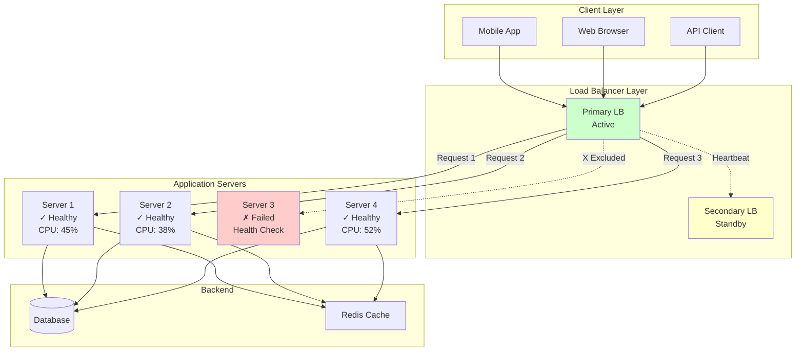

## Working Knowledge (5 min)

### Core Definition

A **load balancer** is a reverse proxy that distributes incoming network traffic across multiple backend servers to:
- **Prevent overload**: No single server bears too much demand
- **Increase reliability**: If one server fails, others continue serving
- **Enable scaling**: Add/remove servers without client configuration changes
- **Reduce latency**: Route requests to geographically closer or less-loaded servers

### L4 vs L7 Load Balancing

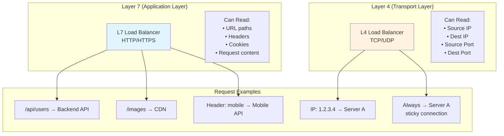

| Aspect | Layer 4 (Transport) | Layer 7 (Application) |
|--------|---------------------|----------------------|
| **Routing Decision** | IP address + port | HTTP headers, URL path, cookies, content |
| **Speed** | Faster (simple packet forwarding) | Slower (must parse application data) |
| **Protocol Awareness** | TCP/UDP only | HTTP, HTTPS, WebSocket, gRPC |
| **Use Cases** | Database connections, gaming, VoIP | Web apps, APIs, microservices |
| **SSL Termination** | Cannot terminate (pass-through) | Can terminate SSL at LB |
| **Content-Based Routing** | ❌ Not possible | ✅ /api → Backend, /static → CDN |
| **Examples** | AWS NLB, HAProxy TCP mode | AWS ALB, Nginx, HAProxy HTTP mode |
| **Throughput** | Millions of requests/sec | Hundreds of thousands/sec |
| **Cost** | Lower | Higher (more processing) |

**Decision Guide:**
- Use **L4** when: Maximum performance needed, simple TCP/UDP routing, handling non-HTTP protocols
- Use **L7** when: Need intelligent routing, SSL termination, content inspection, microservices architecture

### Load Balancing Algorithms

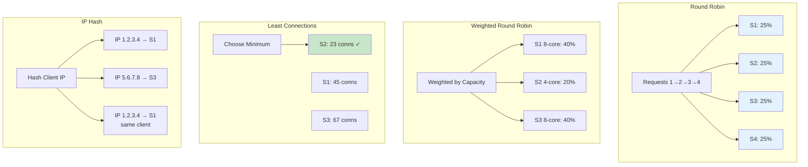

| Algorithm | How It Works | Best For | Downsides |
|-----------|-------------|----------|-----------|
| **Round Robin** | Cycles through servers: S1→S2→S3→S1 | Servers with equal capacity, stateless requests | Ignores server load and capacity differences |
| **Weighted Round Robin** | More requests to powerful servers (2:1:1 ratio) | Heterogeneous server fleet | Still ignores real-time load |
| **Least Connections** | Routes to server with fewest active connections | Long-lived connections, WebSockets, databases | Slight overhead tracking connections |
| **Least Response Time** | Routes to fastest-responding server | Servers with variable performance | Must measure and track latency |
| **IP Hash** | Hash(client IP) % server_count = server | Session affinity, cache locality | Uneven distribution with few clients |
| **Consistent Hashing** | Minimizes remapping when servers change | Caching layers, distributed systems | More complex implementation |
| **Random** | Randomly select server | Quick and simple load distribution | No intelligence, purely probabilistic |
| **URL Hash** | Hash(URL) → same server | Caching specific URLs | Cache invalidation when servers change |

**Algorithm Selection Flow:**

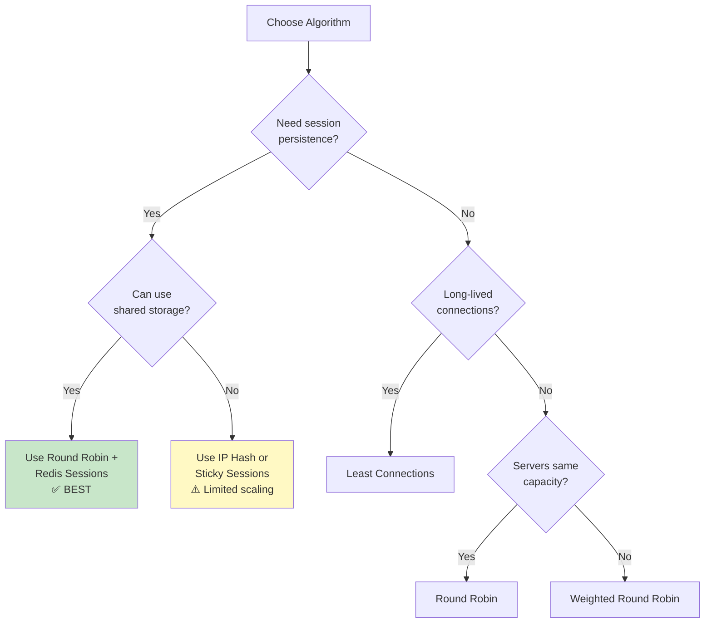

### Health Checks

Health checks ensure the load balancer only routes traffic to healthy servers.

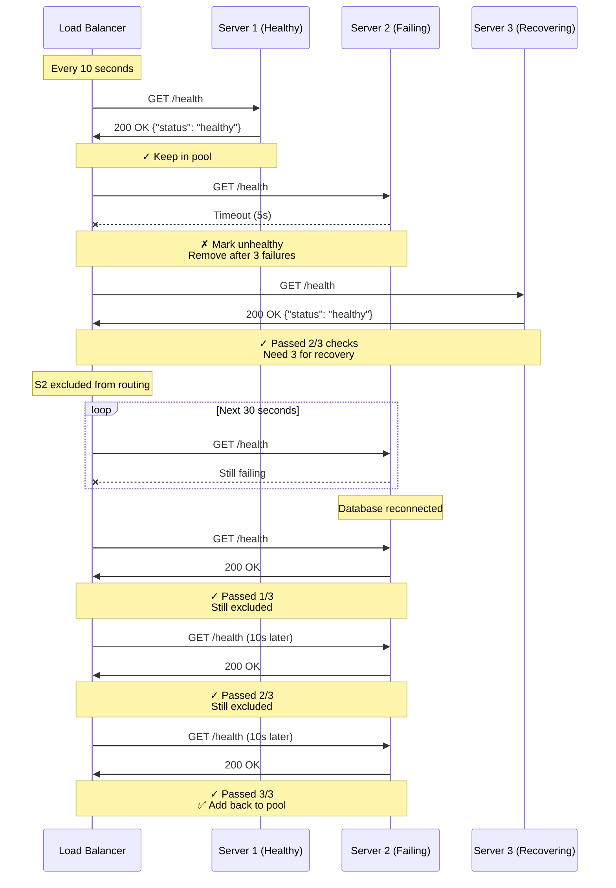

**Health Check Types:**

| Type | How It Works | Pros | Cons |
|------|-------------|------|------|
| **Active HTTP** | LB sends GET /health every N seconds | Proactive detection, configurable | Can't detect all failure modes |
| **Active TCP** | LB opens TCP connection to port | Fast, works for any TCP service | Doesn't check application health |
| **Passive** | LB detects failed requests (5xx errors) | No extra load, real failure detection | Slower detection, users see errors |
| **Deep Health** | Check dependencies (DB, cache, etc.) | Comprehensive validation | Can cause cascading failures |

**Best Practice Health Check Configuration:**
```
Interval: 10 seconds
Timeout: 5 seconds
Unhealthy Threshold: 3 consecutive failures
Healthy Threshold: 3 consecutive successes
Path: /health (lightweight endpoint)
Expected: 200 OK + {"status": "healthy"}
```

### Sticky Sessions (Session Affinity)

**The Problem:**
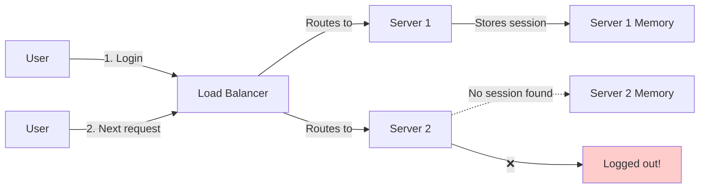

**Solutions:**

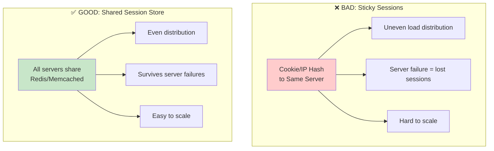

**When Sticky Sessions Are Acceptable:**
- WebSocket connections (inherently stateful)
- Legacy applications that can't be refactored
- Temporary solution during migration

## Deep Dive (30 min)

### Configuration Examples

#### HAProxy Configuration (L7 HTTP Load Balancer)

```haproxy
# /etc/haproxy/haproxy.cfg

global
    # Maximum connections HAProxy can handle
    maxconn 4096

    # Run as daemon
    daemon

    # Logging
    log /dev/log local0
    log /dev/log local1 notice

defaults
    # Use HTTP mode (Layer 7)
    mode http

    # Logging format
    log global
    option httplog
    option dontlognull

    # Timeouts
    timeout connect 5000ms    # Time to establish connection to backend
    timeout client 50000ms    # Client inactivity timeout
    timeout server 50000ms    # Server inactivity timeout

    # Health check settings
    timeout check 5000ms

# Frontend: Receives client connections
frontend web_frontend
    # Listen on port 80 (HTTP)
    bind *:80

    # Listen on port 443 (HTTPS) with SSL
    bind *:443 ssl crt /etc/ssl/certs/mysite.pem

    # Redirect HTTP to HTTPS
    redirect scheme https if !{ ssl_fc }

    # ACLs: Content-based routing rules
    acl is_api path_beg /api/              # API endpoints
    acl is_static path_beg /static/ /images/ /css/ /js/
    acl is_admin hdr(host) -i admin.example.com

    # Route based on ACLs
    use_backend api_servers if is_api
    use_backend static_servers if is_static
    use_backend admin_servers if is_admin
    default_backend web_servers

# Backend: Pool of API servers
backend api_servers
    # Load balancing algorithm
    balance leastconn    # Best for varied request durations

    # Health check configuration
    option httpchk GET /health    # HTTP health check
    http-check expect status 200  # Expect 200 OK

    # Server list (server name, IP:port, health check params)
    server api1 10.0.1.10:8080 check inter 10s fall 3 rise 3 weight 100
    server api2 10.0.1.11:8080 check inter 10s fall 3 rise 3 weight 100
    server api3 10.0.1.12:8080 check inter 10s fall 3 rise 3 weight 150
    # api3 has weight 150 = gets 50% more traffic (more powerful server)

    # Sticky sessions via cookie (if needed)
    cookie SERVERID insert indirect nocache

    # Connection limits per server
    maxconn 500

# Backend: Pool of web servers
backend web_servers
    balance roundrobin    # Simple round-robin for equal servers

    option httpchk GET /health
    http-check expect status 200

    server web1 10.0.2.10:8080 check inter 10s fall 3 rise 3
    server web2 10.0.2.11:8080 check inter 10s fall 3 rise 3
    server web3 10.0.2.12:8080 check inter 10s fall 3 rise 3
    server web4 10.0.2.13:8080 check inter 10s fall 3 rise 3

    # Enable HTTP keep-alive to backends
    option http-keep-alive

# Backend: Static content servers
backend static_servers
    balance roundrobin

    # Different health check for static servers
    option httpchk HEAD /health

    server static1 10.0.3.10:80 check
    server static2 10.0.3.11:80 check

# Backend: Admin servers (higher security)
backend admin_servers
    balance roundrobin

    # Require client SSL certificate
    bind *:443 ssl crt /etc/ssl/certs/mysite.pem verify required ca-file /etc/ssl/ca.pem

    option httpchk GET /admin/health

    server admin1 10.0.4.10:8080 check
    server admin2 10.0.4.11:8080 check

# Statistics page for monitoring
listen stats
    bind *:8404
    stats enable
    stats uri /stats
    stats refresh 30s
    stats show-legends
    stats show-node
```

**Key HAProxy Parameters Explained:**

| Parameter | Meaning | Example Values |
|-----------|---------|----------------|
| `check` | Enable health checks | Always include |
| `inter 10s` | Check interval: every 10 seconds | 5s, 10s, 30s |
| `fall 3` | Mark unhealthy after 3 failures | 2, 3, 5 |
| `rise 3` | Mark healthy after 3 successes | 2, 3, 5 |
| `weight 100` | Relative weight for weighted algorithms | 50, 100, 150 |
| `maxconn 500` | Max concurrent connections per server | 100-1000 |

#### Nginx Configuration (L7 HTTP Load Balancer)

```nginx
# /etc/nginx/nginx.conf

# Worker processes (usually = CPU cores)
worker_processes auto;

events {
    # Max connections per worker
    worker_connections 1024;
}

http {
    # Logging
    access_log /var/log/nginx/access.log;
    error_log /var/log/nginx/error.log;

    # Upstream: Define backend server pools
    upstream api_backend {
        # Load balancing method
        least_conn;    # Least connections algorithm

        # Backend servers
        server 10.0.1.10:8080 weight=1 max_fails=3 fail_timeout=30s;
        server 10.0.1.11:8080 weight=1 max_fails=3 fail_timeout=30s;
        server 10.0.1.12:8080 weight=2 max_fails=3 fail_timeout=30s;

        # Keep-alive connections to backends
        keepalive 32;
    }

    upstream web_backend {
        # IP hash for simple session affinity (use only if necessary)
        # ip_hash;

        # Better: Use round-robin with shared sessions
        server 10.0.2.10:8080 max_fails=3 fail_timeout=30s;
        server 10.0.2.11:8080 max_fails=3 fail_timeout=30s;
        server 10.0.2.12:8080 max_fails=3 fail_timeout=30s;
        server 10.0.2.13:8080 max_fails=3 fail_timeout=30s;

        keepalive 32;
    }

    upstream static_backend {
        server 10.0.3.10:80;
        server 10.0.3.11:80;

        keepalive 32;
    }

    # Rate limiting zone (DDoS protection)
    limit_req_zone $binary_remote_addr zone=api_limit:10m rate=10r/s;

    # HTTP Server (redirect to HTTPS)
    server {
        listen 80;
        server_name example.com www.example.com;

        # Redirect all HTTP to HTTPS
        return 301 https://$host$request_uri;
    }

    # HTTPS Server
    server {
        listen 443 ssl http2;
        server_name example.com www.example.com;

        # SSL Certificate
        ssl_certificate /etc/ssl/certs/example.com.crt;
        ssl_certificate_key /etc/ssl/private/example.com.key;

        # SSL Settings (modern security)
        ssl_protocols TLSv1.2 TLSv1.3;
        ssl_ciphers HIGH:!aNULL:!MD5;
        ssl_prefer_server_ciphers on;

        # SSL session cache (performance)
        ssl_session_cache shared:SSL:10m;
        ssl_session_timeout 10m;

        # Health check endpoint (doesn't proxy)
        location /health {
            access_log off;
            return 200 "healthy\n";
            add_header Content-Type text/plain;
        }

        # API routes
        location /api/ {
            # Rate limiting (max 10 req/sec per IP)
            limit_req zone=api_limit burst=20 nodelay;

            # Proxy to API backend
            proxy_pass http://api_backend;

            # Proxy headers
            proxy_set_header Host $host;
            proxy_set_header X-Real-IP $remote_addr;
            proxy_set_header X-Forwarded-For $proxy_add_x_forwarded_for;
            proxy_set_header X-Forwarded-Proto $scheme;

            # Timeouts
            proxy_connect_timeout 5s;
            proxy_send_timeout 60s;
            proxy_read_timeout 60s;

            # Keep-alive to backend
            proxy_http_version 1.1;
            proxy_set_header Connection "";

            # Response headers
            add_header X-Served-By $hostname;
        }

        # Static content routes
        location ~* ^/(static|images|css|js)/ {
            # Cache static content
            expires 7d;
            add_header Cache-Control "public, immutable";

            # Proxy to static backend (or serve locally)
            proxy_pass http://static_backend;

            proxy_set_header Host $host;
            proxy_http_version 1.1;
            proxy_set_header Connection "";
        }

        # Web application routes
        location / {
            proxy_pass http://web_backend;

            # Standard proxy headers
            proxy_set_header Host $host;
            proxy_set_header X-Real-IP $remote_addr;
            proxy_set_header X-Forwarded-For $proxy_add_x_forwarded_for;
            proxy_set_header X-Forwarded-Proto $scheme;

            # Timeouts
            proxy_connect_timeout 5s;
            proxy_send_timeout 60s;
            proxy_read_timeout 60s;

            # WebSocket support
            proxy_http_version 1.1;
            proxy_set_header Upgrade $http_upgrade;
            proxy_set_header Connection "upgrade";

            # Buffering
            proxy_buffering on;
            proxy_buffer_size 4k;
            proxy_buffers 8 4k;
        }

        # Monitoring endpoint
        location /nginx_status {
            stub_status on;
            access_log off;
            allow 10.0.0.0/8;    # Only allow internal IPs
            deny all;
        }
    }
}
```

**Nginx Health Check (Active Check with Commercial Nginx Plus):**
```nginx
upstream api_backend {
    zone api_backend 64k;

    server 10.0.1.10:8080 slow_start=30s;
    server 10.0.1.11:8080 slow_start=30s;

    # Active health checks (Nginx Plus only)
    health_check interval=10s fails=3 passes=3 uri=/health match=status_ok;
}

match status_ok {
    status 200;
    body ~ "healthy";
}
```

**For open-source Nginx, use external health check:**
```bash
# External script using nginx_upstream_check_module
# Or rely on passive health checks (max_fails, fail_timeout)
```

### Monitoring Dashboard Metrics

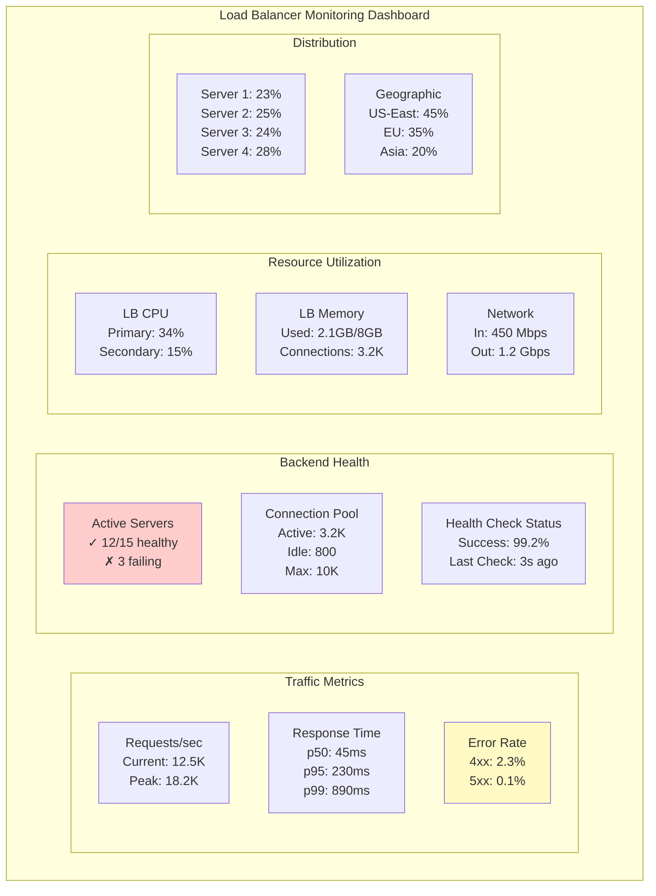

**Critical Metrics to Monitor:**

| Metric Category | Key Metrics | Alert Thresholds | Why It Matters |
|-----------------|-------------|------------------|----------------|
| **Traffic** | Requests/sec, Bandwidth | >80% capacity | Plan scaling before limit |
| **Latency** | p50, p95, p99 response time | p95 >500ms | User experience degradation |
| **Errors** | 4xx rate, 5xx rate, timeouts | 5xx >1% | Backend health issues |
| **Health** | % healthy servers, failed checks | <80% healthy | Capacity reduction |
| **Distribution** | Requests per server, imbalance % | >30% imbalance | Algorithm misconfiguration |
| **Connections** | Active connections, queue depth | >90% max | Connection exhaustion |
| **SSL/TLS** | Handshake time, cert expiry | Cert <30 days | Security and performance |

**Sample Prometheus Queries:**

```promql
# Request rate
rate(haproxy_frontend_http_requests_total[5m])

# Backend response time (95th percentile)
histogram_quantile(0.95, rate(haproxy_backend_response_time_seconds_bucket[5m]))

# Error rate (5xx)
rate(haproxy_frontend_http_responses_total{code="5xx"}[5m])

# Healthy backend servers
haproxy_backend_up

# Connection queue depth
haproxy_backend_current_queue
```

**Grafana Dashboard Visualization:**
```
+------------------------------------------+
|  Requests/sec [Line Chart]               |
|  ~~~^~~~^~~~^~~~                          |
+------------------------------------------+
|  Response Time Percentiles [Line]        |
|  p50 ____ p95 ____ p99 ____              |
+------------------------------------------+
|  Backend Health [Status Panel]           |
|  🟢 12 Healthy  🔴 3 Unhealthy           |
+------------------------------------------+
|  Traffic Distribution [Bar Chart]        |
|  S1 ███ S2 ████ S3 ███ S4 █████         |
+------------------------------------------+
```

### Troubleshooting Decision Tree

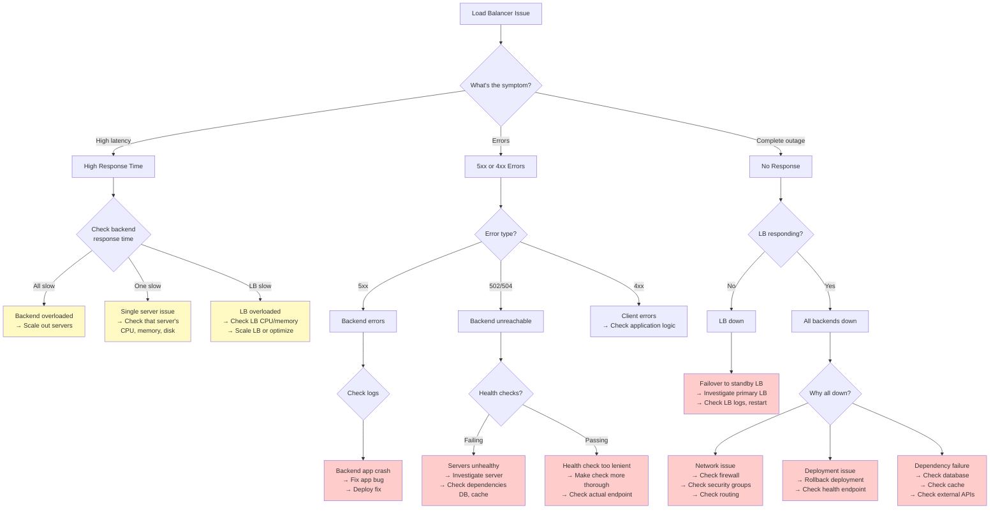

**Common Issues and Solutions:**

| Issue | Symptoms | Root Cause | Solution |
|-------|----------|------------|----------|
| **Uneven Distribution** | One server at 90% CPU, others at 20% | IP hash with few clients; sticky sessions; weights misconfigured | Switch to round-robin; use shared sessions; adjust weights |
| **Connection Exhaustion** | 502 errors; "no backend available" | All server connections saturated | Increase maxconn; add more servers; optimize app to release connections faster |
| **Health Check False Positives** | Healthy servers marked down | Check too strict; timeout too short; transient failures | Increase timeout; require multiple failures (fall 3); check endpoint simpler |
| **Health Check False Negatives** | Unhealthy servers still routing | Check too lenient; only checking port, not app | Deep health check (check dependencies); verify response body |
| **Session Loss** | Users logged out randomly | Using sticky sessions; server died | Migrate to shared session store (Redis) |
| **SSL Termination Overhead** | High LB CPU; slow handshakes | LB terminating SSL for all traffic | Use SSL session cache; enable TLS resumption; consider SSL offloading hardware |
| **Slow Failover** | 30-60 second outage after server failure | Health check interval too long | Reduce check interval to 5-10s; reduce failure threshold (fall 2) |

### Production Deployment Patterns

#### Active-Passive Load Balancer Pair

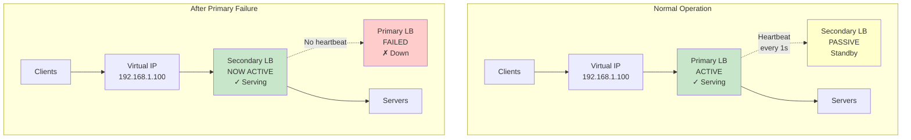

**How It Works:**
1. **Virtual IP (VIP)**: Both LBs share a floating IP address (192.168.1.100)
2. **Heartbeat**: Primary sends heartbeat to secondary every 1-2 seconds
3. **Failure Detection**: If secondary doesn't receive heartbeat for 3-5 seconds, assumes primary failed
4. **Failover**: Secondary takes over VIP via VRRP/Keepalived and starts serving
5. **Failback**: When primary recovers, it can take back VIP (or stay passive)

**Configuration (Keepalived):**

```bash
# Primary LB: /etc/keepalived/keepalived.conf
vrrp_instance VI_1 {
    state MASTER
    interface eth0
    virtual_router_id 51
    priority 150                # Higher = preferred master
    advert_int 1                # Heartbeat every 1 second

    authentication {
        auth_type PASS
        auth_pass secret123
    }

    virtual_ipaddress {
        192.168.1.100/24        # Floating VIP
    }

    # Health check: verify HAProxy is running
    track_script {
        check_haproxy
    }
}

vrrp_script check_haproxy {
    script "/usr/bin/killall -0 haproxy"
    interval 2                  # Check every 2 seconds
    weight -20                  # Reduce priority if check fails
    fall 2                      # Fail after 2 failures
}
```

```bash
# Secondary LB: /etc/keepalived/keepalived.conf
vrrp_instance VI_1 {
    state BACKUP                # Starts as backup
    interface eth0
    virtual_router_id 51
    priority 100                # Lower priority
    advert_int 1

    authentication {
        auth_type PASS
        auth_pass secret123
    }

    virtual_ipaddress {
        192.168.1.100/24
    }

    track_script {
        check_haproxy
    }
}

vrrp_script check_haproxy {
    script "/usr/bin/killall -0 haproxy"
    interval 2
    weight -20
    fall 2
}
```

**Pros and Cons:**

| Pros | Cons |
|------|------|
| Simple to configure | Passive LB wastes resources (50% utilization) |
| Fast failover (1-3 seconds) | Can't handle more traffic than single LB capacity |
| No split-brain issues | Doesn't scale horizontally |

#### Active-Active Load Balancer (DNS Round-Robin)

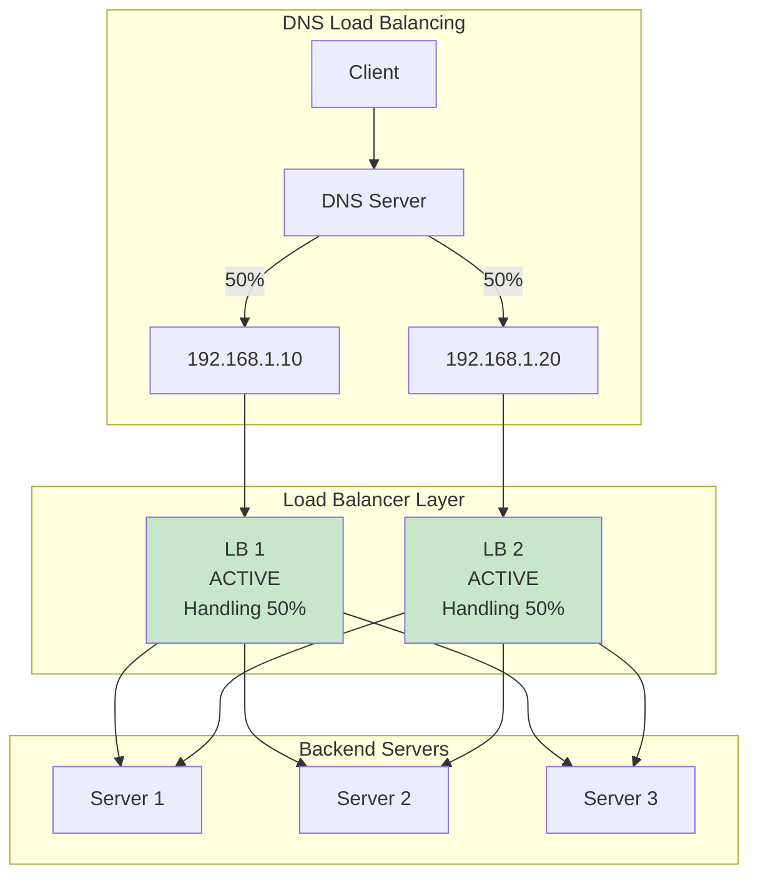

**How It Works:**
1. DNS returns multiple LB IP addresses
2. Client picks one (usually first, or random)
3. Both LBs actively serve traffic
4. Both LBs route to same backend pool

**DNS Configuration:**
```dns
; DNS Zone File
example.com.    IN  A   192.168.1.10    ; LB 1
example.com.    IN  A   192.168.1.20    ; LB 2
; TTL = 60 seconds (short for faster failover)
```

**Pros and Cons:**

| Pros | Cons |
|------|------|
| 100% utilization of both LBs | DNS caching delays failover (TTL minutes) |
| Scales horizontally (add more LBs) | No session affinity between LBs |
| No SPOF if DNS is distributed | Client may cache dead LB IP |

#### Active-Active with Global Server Load Balancing (GSLB)

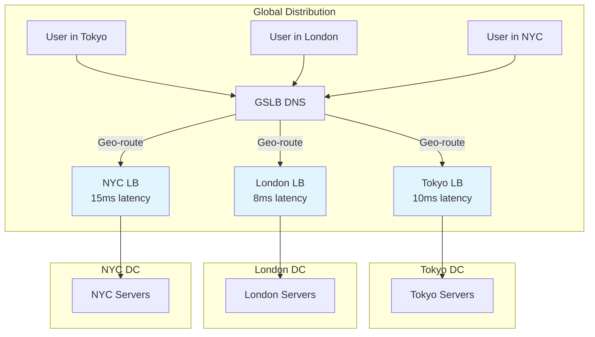

**AWS Route 53 GSLB Configuration:**
```json
{
  "Name": "example.com",
  "Type": "A",
  "SetIdentifier": "Tokyo-LB",
  "GeoLocation": {"ContinentCode": "AS"},
  "TTL": 60,
  "ResourceRecords": [{"Value": "52.68.1.100"}],
  "HealthCheckId": "abc123-tokyo"
}

{
  "Name": "example.com",
  "Type": "A",
  "SetIdentifier": "London-LB",
  "GeoLocation": {"ContinentCode": "EU"},
  "TTL": 60,
  "ResourceRecords": [{"Value": "35.177.1.100"}],
  "HealthCheckId": "def456-london"
}

{
  "Name": "example.com",
  "Type": "A",
  "SetIdentifier": "NYC-LB",
  "GeoLocation": {"ContinentCode": "NA"},
  "TTL": 60,
  "ResourceRecords": [{"Value": "54.91.1.100"}],
  "HealthCheckId": "ghi789-nyc"
}
```

### Capacity Planning with Calculations

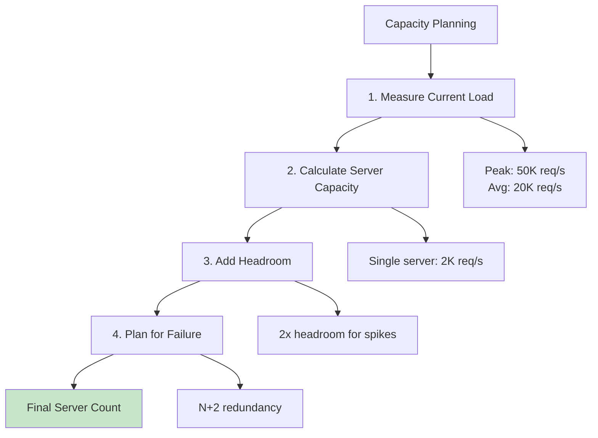

**Capacity Calculation Example:**

**Step 1: Measure Current Load**
- Peak traffic: 50,000 requests/sec
- Average traffic: 20,000 requests/sec
- Request duration: 50ms average
- Data transfer: 2 MB/sec per request

**Step 2: Benchmark Single Server**
```
Single server capacity:
- CPU: 8 cores @ 3.0 GHz
- Load test result: 2,000 req/s at 70% CPU
- Max theoretical: 2,857 req/s at 100% CPU (don't do this!)
- Safe capacity: 2,000 req/s at 70% CPU
```

**Step 3: Calculate Minimum Servers**
```
Servers needed = Peak Traffic / Server Capacity
                = 50,000 req/s / 2,000 req/s
                = 25 servers
```

**Step 4: Add Headroom (2x for traffic spikes)**
```
With headroom = 25 servers × 2
              = 50 servers
```

**Step 5: Add Redundancy (N+2 for failures)**
```
With redundancy = 50 + 2
                = 52 servers

If 2 servers fail: 50 servers handle 50K req/s = 1,000 req/s each (safe)
```

**Step 6: Calculate Load Balancer Capacity**
```
LB requirements:
- Must handle 50,000 req/s
- Connection rate: 50,000 / 50ms = 1,000,000 concurrent connections

If single LB capacity = 100,000 req/s:
- 1 LB is sufficient
- Use 2 LBs (active-passive) for redundancy
```

**Cost Calculation:**
```
Server cost: 52 servers × $100/month = $5,200/month
LB cost: 2 LBs × $300/month = $600/month
Total: $5,800/month

Cost per request = $5,800 / (20K req/s × 2.6M sec/month)
                 = $5,800 / 52 billion requests
                 = $0.00000011 per request
```

**Capacity Planning Spreadsheet:**

| Metric | Value | Calculation |
|--------|-------|-------------|
| Peak req/s | 50,000 | Measured from monitoring |
| Avg req/s | 20,000 | Measured from monitoring |
| Server capacity | 2,000 req/s | Load test |
| Min servers | 25 | 50,000 / 2,000 |
| With 2x headroom | 50 | 25 × 2 |
| With N+2 redundancy | 52 | 50 + 2 |
| LB capacity | 100,000 req/s | Vendor spec |
| LBs needed | 1 | 50,000 / 100,000 |
| LBs with HA | 2 | Active-passive |
| **Total servers** | **52** | Final count |
| **Total LBs** | **2** | Final count |

**Scaling Triggers (Auto-scaling Rules):**
```yaml
scale_out_rule:
  metric: avg_cpu_percent
  threshold: 70%
  duration: 5 minutes
  action: add 20% servers (round up)

scale_in_rule:
  metric: avg_cpu_percent
  threshold: 30%
  duration: 15 minutes
  action: remove 10% servers (round down)
  min_servers: 26  # Never go below 50% capacity
```

### Real-World Examples

#### Netflix Load Balancing

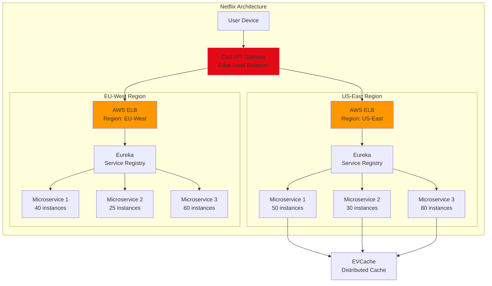

**Netflix's Load Balancing Strategy:**

1. **Zuul Edge Service**:
   - Custom L7 load balancer
   - Routes based on device type, user location, A/B tests
   - Handles 50+ billion requests/day
   - Written in Java, runs on AWS

2. **Multi-Region with Eureka**:
   - Service discovery instead of static IPs
   - Microservices register with Eureka
   - Client-side load balancing (Ribbon library)
   - Each instance decides which backend to call

3. **Chaos Engineering**:
   - Chaos Monkey randomly kills instances
   - Tests LB failover continuously
   - Ensures no single point of failure

4. **Key Metrics**:
   - 200+ million subscribers
   - 125 million+ hours watched/day
   - 50+ billion API requests/day
   - 800+ microservices
   - 99.99% uptime SLA

**Netflix Ribbon (Client-Side LB) Example:**
```java
// Client-side load balancing
@LoadBalanced
@Bean
public RestTemplate restTemplate() {
    return new RestTemplate();
}

// Automatically balances across registered instances
String response = restTemplate.getForObject(
    "http://video-service/api/videos/123",
    String.class
);
// Ribbon queries Eureka, gets list of video-service instances,
// picks one using round-robin or zone-aware algorithm
```

#### Cloudflare Load Balancing

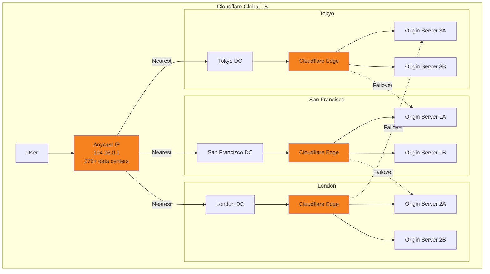

**Cloudflare's Load Balancing Features:**

1. **Anycast Network**:
   - Same IP address announced from 275+ locations
   - BGP routes users to nearest data center
   - Sub-20ms latency for 95% of global internet users

2. **Intelligent Failover**:
   - Active health checks every 60 seconds
   - Passive monitoring of actual requests
   - Instant failover (< 1 second)
   - Cross-region failover for disasters

3. **Load Balancing Algorithms**:
   - Random: Simple probabilistic distribution
   - Weighted: Based on server capacity
   - Least connections: Tracks active connections
   - Latency-based: Routes to fastest origin
   - Geo-steering: Routes by user location

4. **Key Features**:
   - DDoS protection (67 Tbps mitigation capacity)
   - SSL/TLS termination at edge
   - Caching at edge (reduced origin load)
   - Real-time analytics

**Cloudflare Load Balancer Configuration:**
```javascript
// Cloudflare Workers (edge load balancing logic)
addEventListener('fetch', event => {
  event.respondWith(handleRequest(event.request))
})

async function handleRequest(request) {
  const origins = [
    'https://origin1.example.com',
    'https://origin2.example.com',
    'https://origin3.example.com'
  ]

  // Health check cache
  const healthCheck = await caches.default.match('health-status')
  const healthData = healthCheck ? await healthCheck.json() : {}

  // Filter healthy origins
  const healthyOrigins = origins.filter(o => healthData[o] !== 'down')

  // Weighted random selection
  const selectedOrigin = healthyOrigins[
    Math.floor(Math.random() * healthyOrigins.length)
  ]

  // Proxy request to origin
  const originRequest = new Request(selectedOrigin + new URL(request.url).pathname, request)

  try {
    const response = await fetch(originRequest)
    return response
  } catch (error) {
    // Failover to next origin
    return fetch(healthyOrigins[1] + new URL(request.url).pathname)
  }
}
```

**Cloudflare's Scale:**
- 46+ million internet properties
- 275+ data center locations
- 28+ Tbps network capacity
- Handles >30 million HTTP req/sec globally
- 67 Tbps DDoS mitigation

#### Amazon AWS Load Balancing (Real Production Setup)

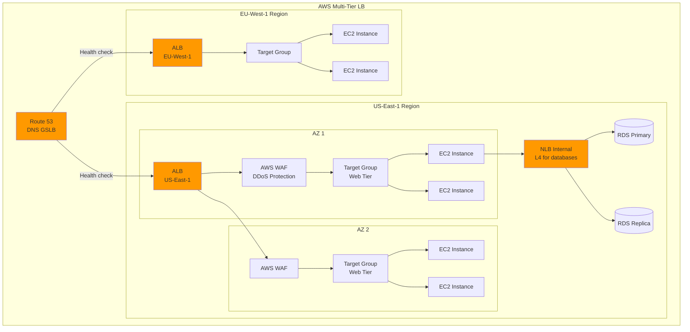

**AWS Load Balancer Types Comparison:**

| Feature | Application LB (ALB) | Network LB (NLB) | Classic LB (Legacy) |
|---------|---------------------|------------------|---------------------|
| **Layer** | L7 (HTTP/HTTPS) | L4 (TCP/UDP) | L4 + L7 (basic) |
| **Use Case** | Web apps, APIs | Low latency, high throughput | Don't use (deprecated) |
| **Throughput** | Moderate | Ultra-high (millions req/s) | Low |
| **Latency** | ~1-3ms | ~0.1ms | ~5ms |
| **IP Address** | Dynamic (DNS name) | Static IP + Elastic IP | Dynamic |
| **Content Routing** | ✅ URL, header, host-based | ❌ No | ❌ No |
| **SSL Termination** | ✅ Yes | ✅ Yes (TLS termination) | ✅ Yes |
| **WebSockets** | ✅ Yes | ✅ Yes | ✅ Yes |
| **Sticky Sessions** | ✅ Cookie-based | ✅ Source IP | ✅ Cookie-based |
| **Health Checks** | HTTP/HTTPS | TCP/HTTP/HTTPS | TCP/HTTP/HTTPS |
| **Target Types** | Instance, IP, Lambda | Instance, IP | Instance only |
| **Price** | $0.0225/hour + $0.008/LCU | $0.0225/hour + $0.006/NLCU | $0.025/hour |

**Production ALB Configuration (Terraform):**
```hcl
# Application Load Balancer
resource "aws_lb" "web" {
  name               = "web-alb"
  internal           = false
  load_balancer_type = "application"
  security_groups    = [aws_security_group.alb.id]
  subnets            = [
    aws_subnet.public_us_east_1a.id,
    aws_subnet.public_us_east_1b.id
  ]

  enable_deletion_protection = true
  enable_http2              = true
  enable_cross_zone_load_balancing = true

  tags = {
    Environment = "production"
  }
}

# Target Group (backend servers)
resource "aws_lb_target_group" "web" {
  name     = "web-tg"
  port     = 8080
  protocol = "HTTP"
  vpc_id   = aws_vpc.main.id

  health_check {
    enabled             = true
    path                = "/health"
    interval            = 30
    timeout             = 5
    healthy_threshold   = 3
    unhealthy_threshold = 3
    matcher             = "200"
  }

  stickiness {
    type            = "lb_cookie"
    cookie_duration = 86400  # 1 day
    enabled         = false  # Prefer stateless
  }

  deregistration_delay = 30  # Drain connections for 30s before removing
}

# Listener (HTTP → HTTPS redirect)
resource "aws_lb_listener" "http" {
  load_balancer_arn = aws_lb.web.arn
  port              = "80"
  protocol          = "HTTP"

  default_action {
    type = "redirect"
    redirect {
      port        = "443"
      protocol    = "HTTPS"
      status_code = "HTTP_301"
    }
  }
}

# Listener (HTTPS)
resource "aws_lb_listener" "https" {
  load_balancer_arn = aws_lb.web.arn
  port              = "443"
  protocol          = "HTTPS"
  ssl_policy        = "ELBSecurityPolicy-TLS-1-2-2017-01"
  certificate_arn   = aws_acm_certificate.web.arn

  default_action {
    type             = "forward"
    target_group_arn = aws_lb_target_group.web.arn
  }
}

# Listener Rule (path-based routing)
resource "aws_lb_listener_rule" "api" {
  listener_arn = aws_lb_listener.https.arn
  priority     = 100

  action {
    type             = "forward"
    target_group_arn = aws_lb_target_group.api.arn
  }

  condition {
    path_pattern {
      values = ["/api/*"]
    }
  }
}

# Auto-scaling with LB integration
resource "aws_autoscaling_group" "web" {
  name                = "web-asg"
  vpc_zone_identifier = [
    aws_subnet.private_us_east_1a.id,
    aws_subnet.private_us_east_1b.id
  ]
  target_group_arns   = [aws_lb_target_group.web.arn]
  health_check_type   = "ELB"
  health_check_grace_period = 300

  min_size         = 2
  max_size         = 20
  desired_capacity = 4

  launch_template {
    id      = aws_launch_template.web.id
    version = "$Latest"
  }
}

# CloudWatch Alarms for Auto-scaling
resource "aws_autoscaling_policy" "scale_out" {
  name                   = "scale-out"
  autoscaling_group_name = aws_autoscaling_group.web.name
  adjustment_type        = "ChangeInCapacity"
  scaling_adjustment     = 2
  cooldown               = 300
}

resource "aws_cloudwatch_metric_alarm" "high_cpu" {
  alarm_name          = "high-cpu"
  comparison_operator = "GreaterThanThreshold"
  evaluation_periods  = 2
  metric_name         = "CPUUtilization"
  namespace           = "AWS/EC2"
  period              = 120
  statistic           = "Average"
  threshold           = 70

  alarm_actions = [aws_autoscaling_policy.scale_out.arn]
}
```

## When to Use / When NOT to Use

| Use When | Don't Use When |
|----------|----------------|
| Multiple servers serving same content | Single server (just use DNS) |
| Need high availability (99.9%+ uptime) | Internal batch processing |
| Traffic is unpredictable or spiky | Development/staging environments |
| Need zero-downtime deployments | Extremely cost-sensitive (LB adds cost) |
| Want to scale horizontally | Fixed, known, low traffic (<100 req/s) |
| Need SSL termination in one place | |
| Implementing microservices | |

## Common Pitfalls

### 1. LB as Single Point of Failure
**Problem**: Load balancer itself can fail
**Solution**: Use active-passive LB pair with VRRP/Keepalived

### 2. Sticky Sessions Without Shared State
**Problem**: Limits scaling, causes session loss on server failure
**Solution**: Use Redis/Memcached for shared sessions, avoid sticky sessions

### 3. Weak Health Checks
**Problem**: LB routes to unhealthy servers that pass superficial checks
**Solution**: Health check should verify actual dependencies (DB, cache)

### 4. Wrong Algorithm for Workload
**Problem**: Round-robin with long-lived connections causes imbalance
**Solution**: Use least connections for long-lived; round-robin for short requests

### 5. No Connection Draining
**Problem**: Active connections dropped during deployments
**Solution**: Enable connection draining (30-60 second delay before removal)

### 6. Ignoring SSL/TLS Overhead
**Problem**: LB CPU spikes due to SSL handshakes
**Solution**: Enable SSL session cache, use TLS resumption, consider hardware offload

### 7. Not Monitoring LB Metrics
**Problem**: LB bottleneck not discovered until outage
**Solution**: Monitor LB CPU, connections, latency, errors continuously

### 8. Single Availability Zone
**Problem**: Data center outage takes down all LBs and servers
**Solution**: Deploy LBs and servers across multiple AZs/regions

## Interview Tips

### Always Mention
- **Add LB in front of web servers**: It's expected in any multi-server design
- **Active-passive LB pair**: Shows you understand LB is also a SPOF
- **L4 vs L7 distinction**: "We'd use L7 for content-based routing to microservices"
- **Health checks**: "Every 10 seconds with 3-failure threshold"
- **Shared sessions**: "Store sessions in Redis instead of sticky sessions"

### Deep Dive Topics to Prepare
- **Consistent hashing**: For cache servers behind LB
- **Global load balancing**: For multi-region designs
- **LB + Auto-scaling**: Powerful combination for elasticity
- **Connection pooling**: Reduce overhead between LB and backends

### Example Interview Answer
> "For this system handling 100K req/s, I'd put an L7 Application Load Balancer in front of the web tier. We'd use round-robin across 50 servers (2K req/s each). The ALB will do SSL termination and content-based routing: /api routes to backend services, /static routes to CDN. Health checks every 10 seconds to /health endpoint. For HA, we'd deploy the ALB across multiple availability zones. Sessions stored in Redis cluster so no sticky sessions needed. As traffic grows, we'd add auto-scaling to spawn more servers based on CPU >70%."

### Red Flags to Avoid
- Forgetting to add LB in multi-server design
- Using sticky sessions without explaining why
- Not addressing LB as SPOF
- Confusing L4 and L7 capabilities
- Ignoring health checks

## Links

- [[01_fundamentals/scalability]] — Load balancing enables horizontal scaling
- [[03_design_patterns/consistent_hashing]] — Advanced LB algorithm for distributed caches
- [[02_building_blocks/api_gateway]] — Often includes LB functionality
- [[02_building_blocks/cdn]] — Also distributes load, but for static content
- [[02_building_blocks/reverse_proxy]] — LB is a specialized reverse proxy
- [[01_fundamentals/availability]] — LB increases availability through redundancy
- [[02_building_blocks/auto_scaling]] — LB enables dynamic scaling

## References

- [HAProxy Documentation](https://www.haproxy.org/documentation/)
- [Nginx Load Balancing Guide](https://docs.nginx.com/nginx/admin-guide/load-balancer/)
- [AWS Elastic Load Balancing](https://aws.amazon.com/elasticloadbalancing/)
- [Netflix Zuul](https://github.com/Netflix/zuul)
- [Cloudflare Load Balancing](https://www.cloudflare.com/load-balancing/)
- [Google Cloud Load Balancing](https://cloud.google.com/load-balancing)
