#system-design #building-block #messaging #async

# Message Queues

## Intuition (30 sec)

A to-do list at a restaurant: the waiter writes orders (messages) on slips and puts them on a rail (queue). The kitchen (consumer) picks them up one at a time and cooks. If the kitchen is slow, orders pile up on the rail but no one is blocked — the waiter keeps taking new orders.

## Failure-First Scenario

> User uploads a video. Your API does: validate → upload to S3 → transcode to 5 formats → generate thumbnails → update DB → send notification. Total: 45 seconds. User stares at a spinner. If transcoding fails, the entire upload fails. You need to process these steps asynchronously.

## Core Definitions

### Message Queue
A buffer that temporarily stores messages between sender and receiver, enabling asynchronous communication. Messages are persisted until consumed and acknowledged.

### Producer
A service or component that creates and sends messages to a queue or topic. Producers don't need to know about consumers.

### Consumer
A service or component that reads and processes messages from a queue or topic. Consumers acknowledge messages after successful processing.

### Topic
A logical channel for organizing messages by category. Multiple producers can write to a topic, and multiple consumer groups can independently read from it.

### Partition
A physical subdivision of a topic that enables parallelism. Each partition maintains message order and is consumed by one consumer per consumer group.

### Consumer Group
A set of consumers that work together to process messages from a topic. Each partition is assigned to exactly one consumer within the group, enabling load balancing.

### Offset
A unique sequential ID for each message within a partition. Consumers track their current offset to know which messages they've processed.

### Delivery Guarantees

| Guarantee | Meaning | Implementation | Trade-off |
|-----------|---------|----------------|-----------|
| **At-most-once** | Message delivered 0 or 1 times. Fire and forget. | Auto-ack before processing | Fast, may lose messages |
| **At-least-once** | Message delivered 1+ times. Retries on failure. | Ack after processing + retries | No loss, but may duplicate |
| **Exactly-once** | Message delivered exactly 1 time. | Idempotent producers + transactional reads | Hardest to achieve, slowest |

**Industry Standard:** At-least-once delivery + idempotent consumers (processing same message twice is safe).

## Visual Diagrams

### Pub/Sub Flow

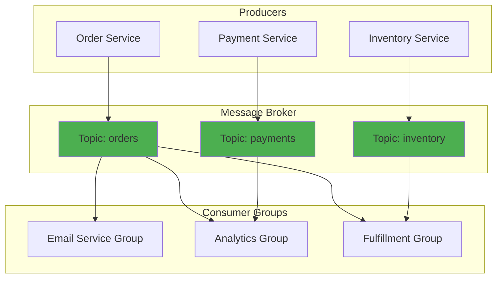

### Queue vs Topic Comparison

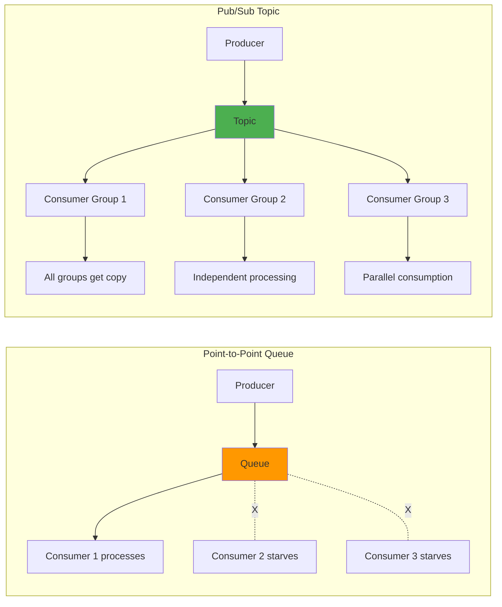

**Point-to-Point (Queue):**
- Message consumed by ONE consumer
- Competing consumers pattern
- Use for: Task distribution, load balancing
- Example: Job queue, order processing

**Pub/Sub (Topic):**
- Message consumed by ALL consumer groups
- Fan-out pattern
- Use for: Event broadcasting, notifications
- Example: User signup event → email service + analytics + CRM

### Consumer Group Behavior

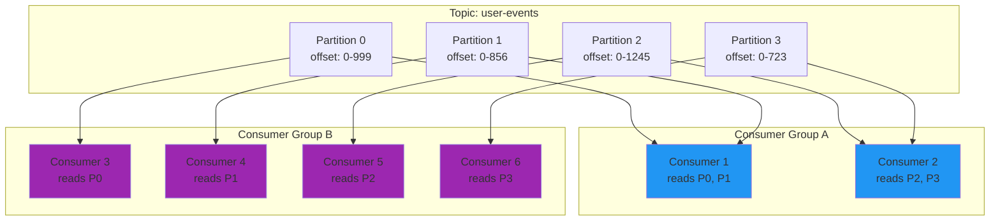

**Key Points:**
- Each partition assigned to ONE consumer per group
- Groups consume independently (different offsets)
- Adding consumers scales until consumers = partitions
- Rebalancing occurs when consumers join/leave

### Partition Distribution Strategy

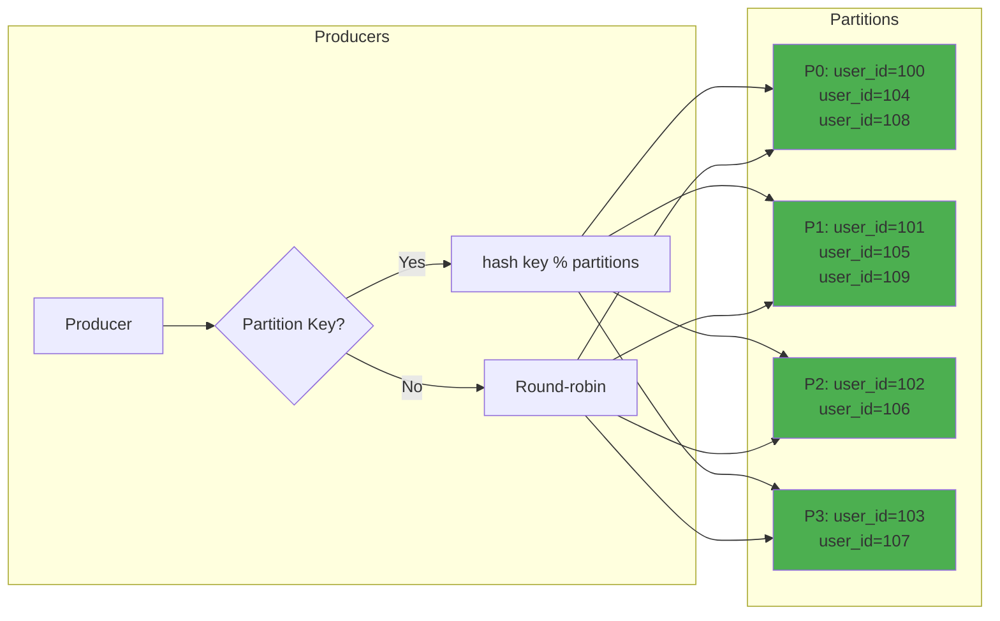

**Partition Key Strategy:**
- **With key (user_id):** All messages for same user → same partition → ordered
- **Without key:** Round-robin distribution → max throughput, no ordering
- **Hot partitions:** Popular keys can overload single partition

## Working Knowledge (5 min)

### Why Async Processing?

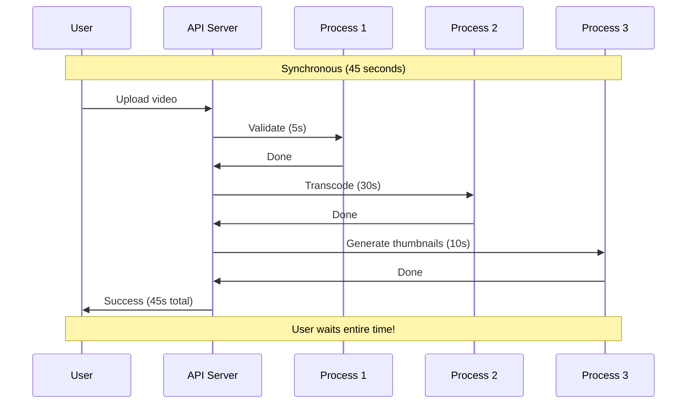

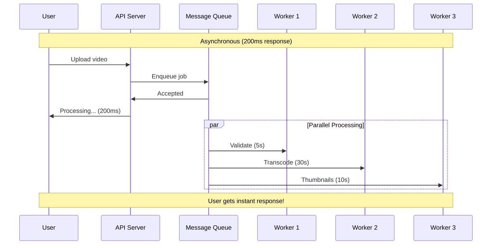

### Kafka vs RabbitMQ vs SQS

| | Kafka | RabbitMQ | AWS SQS |
|--|-------|----------|---------|
| **Model** | Distributed log | Message broker | Managed queue |
| **Throughput** | Millions/sec | Thousands/sec | Thousands/sec |
| **Ordering** | Per-partition | Per-queue | Best-effort (FIFO available) |
| **Retention** | Days/weeks (replayable) | Until consumed | 14 days max |
| **Message Replay** | Yes (seek to offset) | No | No |
| **Best for** | Event streaming, logs, high throughput | Task queues, complex routing | Simple async, no ops overhead |
| **Complexity** | High (ZooKeeper/KRaft) | Medium | Low (managed) |
| **Delivery** | At-least-once, exactly-once | At-most-once, at-least-once | At-least-once |
| **Pricing** | Self-hosted or MSK | Self-hosted | Pay-per-request |

## Configuration Examples

### Kafka Producer Configuration (Annotated)

```properties
# Connection
bootstrap.servers=kafka1:9092,kafka2:9092,kafka3:9092

# Serialization
key.serializer=org.apache.kafka.common.serialization.StringSerializer
value.serializer=org.apache.kafka.common.serialization.JsonSerializer

# Durability vs Performance
acks=all                     # all: wait for all replicas (safest, slowest)
                            # 1: wait for leader only (balanced)
                            # 0: fire-and-forget (fastest, may lose data)

# Retries and Idempotence
enable.idempotence=true      # Prevents duplicates during retries
retries=2147483647          # Infinite retries (safe with idempotence)
max.in.flight.requests.per.connection=5  # Pipelining for throughput

# Batching (higher = better throughput, higher latency)
batch.size=16384            # Batch size in bytes
linger.ms=10                # Wait up to 10ms to fill batch

# Compression (reduces network, increases CPU)
compression.type=snappy     # Options: none, gzip, snappy, lz4, zstd

# Timeouts
request.timeout.ms=30000    # Max time to wait for response
delivery.timeout.ms=120000  # Total time including retries

# Monitoring
client.id=payment-service-producer  # Identifier for debugging
```

### Kafka Consumer Configuration (Annotated)

```properties
# Connection
bootstrap.servers=kafka1:9092,kafka2:9092,kafka3:9092
group.id=email-service-group  # Consumer group ID

# Deserialization
key.deserializer=org.apache.kafka.common.serialization.StringDeserializer
value.deserializer=org.apache.kafka.common.serialization.JsonDeserializer

# Offset Management
enable.auto.commit=false     # Manual commit for exactly-once semantics
auto.offset.reset=earliest   # earliest: from beginning, latest: new messages only

# Fetch Configuration
fetch.min.bytes=1           # Minimum data to fetch (higher = fewer requests)
fetch.max.wait.ms=500       # Max wait time if min bytes not available
max.partition.fetch.bytes=1048576  # 1MB per partition

# Session Management
session.timeout.ms=10000     # Max time without heartbeat before rebalance
heartbeat.interval.ms=3000   # Heartbeat frequency
max.poll.interval.ms=300000  # Max time between poll() calls

# Consumer Behavior
max.poll.records=500         # Max records per poll() call
isolation.level=read_committed  # For transactional producers

# Monitoring
client.id=email-consumer-1   # Identifier for debugging
```

### RabbitMQ Producer (Python)

```python
import pika
import json

# Connection
connection = pika.BlockingConnection(
    pika.ConnectionParameters(
        host='rabbitmq.example.com',
        port=5672,
        credentials=pika.PlainCredentials('user', 'pass'),
        heartbeat=600,  # Heartbeat interval
        blocked_connection_timeout=300
    )
)
channel = connection.channel()

# Declare exchange and queue
channel.exchange_declare(
    exchange='orders',
    exchange_type='topic',  # fanout, direct, topic, headers
    durable=True           # Survive broker restart
)

channel.queue_declare(
    queue='order-processing',
    durable=True,          # Survive broker restart
    arguments={
        'x-message-ttl': 86400000,  # 24 hours
        'x-max-length': 10000,      # Max 10k messages
        'x-dead-letter-exchange': 'orders-dlx'  # Dead letter exchange
    }
)

channel.queue_bind(
    exchange='orders',
    queue='order-processing',
    routing_key='order.created'
)

# Publish message
message = {'order_id': 12345, 'amount': 99.99}
channel.basic_publish(
    exchange='orders',
    routing_key='order.created',
    body=json.dumps(message),
    properties=pika.BasicProperties(
        delivery_mode=2,   # Persistent message
        content_type='application/json',
        priority=5,        # Priority 0-9
        expiration='60000' # Message TTL (ms)
    )
)

connection.close()
```

### AWS SQS (Boto3)

```python
import boto3
import json

sqs = boto3.client('sqs', region_name='us-east-1')
queue_url = 'https://sqs.us-east-1.amazonaws.com/123456789/order-queue'

# Send message
response = sqs.send_message(
    QueueUrl=queue_url,
    MessageBody=json.dumps({
        'order_id': 12345,
        'amount': 99.99
    }),
    DelaySeconds=10,  # Delay delivery
    MessageAttributes={
        'Priority': {
            'StringValue': 'high',
            'DataType': 'String'
        },
        'OrderType': {
            'StringValue': 'standard',
            'DataType': 'String'
        }
    }
)

# Receive and process
messages = sqs.receive_message(
    QueueUrl=queue_url,
    MaxNumberOfMessages=10,     # Batch size (1-10)
    WaitTimeSeconds=20,         # Long polling
    VisibilityTimeout=30,       # Time to process before retry
    MessageAttributeNames=['All']
)

for message in messages.get('Messages', []):
    # Process message
    print(f"Processing: {message['Body']}")

    # Delete after successful processing
    sqs.delete_message(
        QueueUrl=queue_url,
        ReceiptHandle=message['ReceiptHandle']
    )
```

## Monitoring Dashboard

### Key Metrics to Track

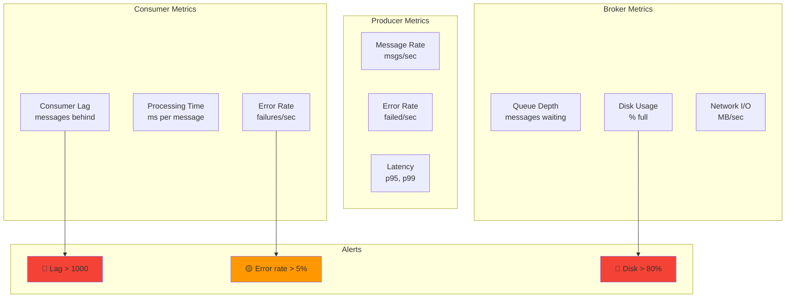

### Consumer Lag Monitoring

```
Topic: orders
Partition 0: Current Offset: 10,000 | Consumer Offset: 9,950 | Lag: 50
Partition 1: Current Offset: 12,500 | Consumer Offset: 11,200 | Lag: 1,300 ⚠️
Partition 2: Current Offset: 9,800  | Consumer Offset: 9,800  | Lag: 0
Partition 3: Current Offset: 15,000 | Consumer Offset: 12,000 | Lag: 3,000 🔴

Total Lag: 4,350 messages
Average Processing Rate: 500 msgs/sec
Time to Catch Up: ~9 seconds
```

### Throughput Dashboard

```
┌─────────────────────────────────────────────────────┐
│ Messages Produced (last hour)                       │
│ ▁▂▃▅▆█████▇▆▅▃▂▁                                   │
│ Peak: 50,000 msgs/sec at 14:23                      │
│ Average: 25,000 msgs/sec                            │
└─────────────────────────────────────────────────────┘

┌─────────────────────────────────────────────────────┐
│ Consumer Processing Rate                            │
│ █████████▇▆▅▄▃▂▁                                    │
│ Current: 15,000 msgs/sec                            │
│ ⚠️ Falling behind! Add 5 more consumers             │
└─────────────────────────────────────────────────────┘

┌─────────────────────────────────────────────────────┐
│ Consumer Health                                      │
│ Consumer 1: ✅ Healthy | Lag: 45                    │
│ Consumer 2: ✅ Healthy | Lag: 52                    │
│ Consumer 3: ⚠️ Slow | Lag: 1,200                    │
│ Consumer 4: 🔴 Down | Rebalancing...                │
└─────────────────────────────────────────────────────┘
```

## Decision Trees

### When to Use Queue vs Topic

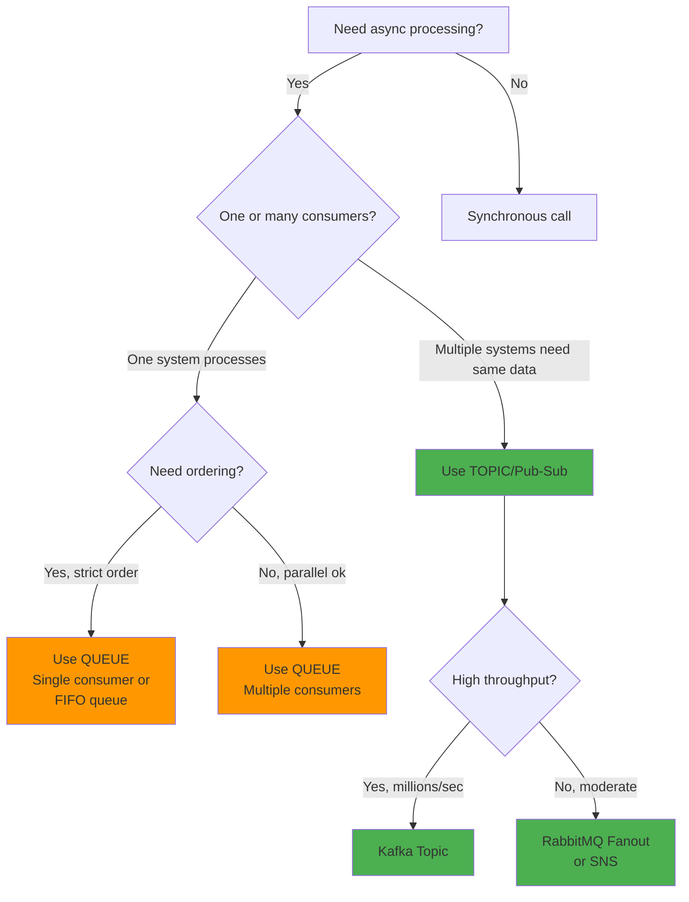

### Delivery Guarantee Selection

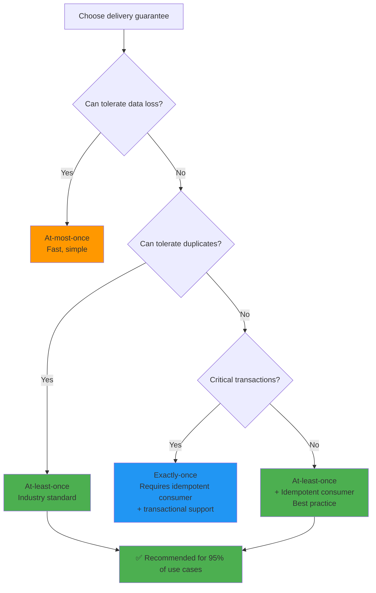

## Production Patterns

### Dead Letter Queue (DLQ)

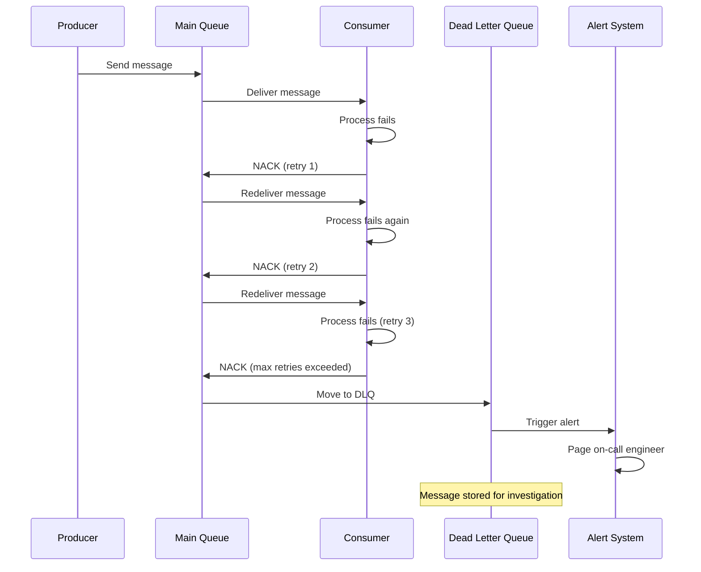

**DLQ Configuration:**

```python
# Kafka: Use separate topic as DLQ
def process_message(consumer, message):
    max_retries = 3
    retry_count = message.headers.get('retry_count', 0)

    try:
        # Process message
        process(message.value)
        consumer.commit()
    except Exception as e:
        if retry_count >= max_retries:
            # Send to DLQ
            producer.send(
                topic='orders-dlq',
                value=message.value,
                headers={
                    'original_topic': 'orders',
                    'error': str(e),
                    'retry_count': retry_count,
                    'timestamp': datetime.now().isoformat()
                }
            )
            consumer.commit()  # Commit to remove from main topic
        else:
            # Retry with backoff
            time.sleep(2 ** retry_count)  # Exponential backoff
            producer.send(
                topic='orders',
                value=message.value,
                headers={'retry_count': retry_count + 1}
            )
            consumer.commit()
```

### Retry Strategies

**1. Exponential Backoff**
```
Attempt 1: Wait 1 second
Attempt 2: Wait 2 seconds
Attempt 3: Wait 4 seconds
Attempt 4: Wait 8 seconds
Attempt 5: Move to DLQ
```

**2. Fixed Delay**
```
Attempt 1: Wait 5 seconds
Attempt 2: Wait 5 seconds
Attempt 3: Wait 5 seconds
Attempt 4: Move to DLQ
```

**3. Retry Topic Pattern (Kafka)**
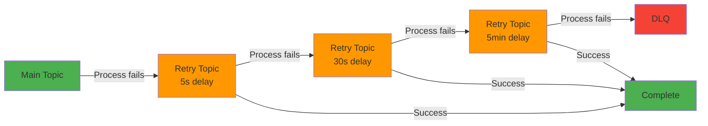

**Implementation:**

```python
def process_with_retry(message, attempt=1):
    max_attempts = 4
    backoff_ms = [1000, 5000, 30000, 300000]  # 1s, 5s, 30s, 5min

    try:
        process_message(message)
        return True
    except RetryableError as e:
        if attempt >= max_attempts:
            send_to_dlq(message, error=e)
            return False

        # Send to retry topic with delay
        retry_topic = f"orders-retry-{attempt}"
        producer.send(
            topic=retry_topic,
            value=message,
            headers={
                'attempt': attempt + 1,
                'original_timestamp': message.timestamp,
                'error': str(e)
            }
        )
        return False
    except FatalError as e:
        # No retry for fatal errors
        send_to_dlq(message, error=e)
        return False
```

### Poison Pill Handling

**Poison Pill:** A message that always fails processing and blocks the queue.

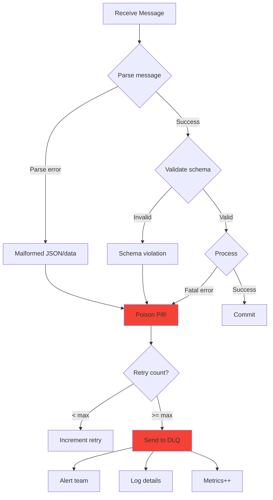

**Detection & Handling:**

```python
class PoisonPillDetector:
    def __init__(self):
        self.failure_counts = {}  # message_id -> count
        self.threshold = 3

    def is_poison_pill(self, message_id):
        count = self.failure_counts.get(message_id, 0)
        return count >= self.threshold

    def record_failure(self, message_id):
        self.failure_counts[message_id] = \
            self.failure_counts.get(message_id, 0) + 1

    def clear(self, message_id):
        self.failure_counts.pop(message_id, None)

# Usage
detector = PoisonPillDetector()

def process_with_poison_detection(message):
    message_id = message.headers.get('message_id')

    if detector.is_poison_pill(message_id):
        logger.error(f"Poison pill detected: {message_id}")
        send_to_dlq(message, reason="poison_pill")
        detector.clear(message_id)
        return

    try:
        process_message(message)
        detector.clear(message_id)
    except Exception as e:
        detector.record_failure(message_id)
        raise
```

### Idempotent Consumer Pattern

**Problem:** At-least-once delivery means duplicates. Processing same payment twice = double charge!

**Solution:** Make operations idempotent (safe to repeat).

```python
# ❌ Bad: Not idempotent
def process_payment(payment_msg):
    user = db.get_user(payment_msg.user_id)
    user.balance -= payment_msg.amount  # Duplicate = double deduction!
    db.save(user)

# ✅ Good: Idempotent with deduplication key
def process_payment_idempotent(payment_msg):
    # Use message ID or payment ID as deduplication key
    dedup_key = f"payment:{payment_msg.payment_id}"

    # Check if already processed
    if cache.exists(dedup_key):
        logger.info(f"Duplicate payment detected: {payment_msg.payment_id}")
        return  # Already processed, skip

    # Process with database transaction
    with db.transaction():
        # Check if payment already recorded
        if db.payment_exists(payment_msg.payment_id):
            return

        user = db.get_user(payment_msg.user_id)
        user.balance -= payment_msg.amount
        db.save(user)

        # Record payment
        db.insert_payment(payment_msg.payment_id, payment_msg.amount)

        # Mark as processed (TTL = message retention period)
        cache.set(dedup_key, "processed", ttl=86400)
```

**Strategies for Idempotency:**

1. **Deduplication Cache:** Store processed message IDs
2. **Database Constraints:** Unique constraint on message ID
3. **Versioning:** Only apply if version matches
4. **Natural Idempotency:** `SET status = 'completed'` is idempotent

## Troubleshooting Guide

### Consumer Lag

**Symptoms:**
- Messages piling up in queue
- Processing time increasing
- Stale data being processed

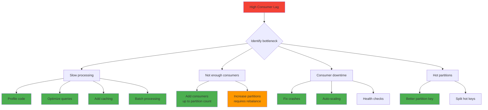

**Debug Commands:**

```bash
# Kafka: Check consumer lag
kafka-consumer-groups.sh --bootstrap-server localhost:9092 \
  --describe --group email-service-group

# Output:
# TOPIC     PARTITION  CURRENT-OFFSET  LOG-END-OFFSET  LAG
# orders    0          1000            1000            0
# orders    1          850             1200            350    ⚠️
# orders    2          1500            1500            0

# RabbitMQ: Check queue depth
rabbitmqctl list_queues name messages_ready messages_unacknowledged

# AWS SQS: Check queue attributes
aws sqs get-queue-attributes \
  --queue-url https://sqs.us-east-1.amazonaws.com/123/order-queue \
  --attribute-names ApproximateNumberOfMessages
```

### Message Loss

**Causes:**

1. **Producer not waiting for ack**
```python
# ❌ Fire and forget
producer.send(topic='orders', value=message)  # May lose if broker down

# ✅ Wait for ack
future = producer.send(topic='orders', value=message)
result = future.get(timeout=10)  # Block until confirmed
```

2. **Consumer auto-commit before processing**
```python
# ❌ Auto-commit (may lose on crash)
consumer = KafkaConsumer(
    'orders',
    enable_auto_commit=True  # Commits before processing!
)

# ✅ Manual commit after processing
consumer = KafkaConsumer(
    'orders',
    enable_auto_commit=False
)
for message in consumer:
    process(message)
    consumer.commit()  # Commit only after success
```

3. **Insufficient replication**
```properties
# ❌ No replication
replication.factor=1  # Data lost if broker dies

# ✅ Replicated
replication.factor=3
min.insync.replicas=2  # At least 2 replicas must ack
```

**Detection:**

```python
# Track expected vs received messages
class MessageTracker:
    def __init__(self):
        self.expected_sequence = 0
        self.missing_messages = []

    def check_sequence(self, message):
        sequence = message.headers.get('sequence')

        if sequence != self.expected_sequence:
            # Gap detected!
            missing = list(range(self.expected_sequence, sequence))
            self.missing_messages.extend(missing)
            logger.error(f"Message loss detected: {missing}")
            alert.send(f"Missing messages: {missing}")

        self.expected_sequence = sequence + 1
```

### Duplicate Messages

**Root Causes:**
- Network retry on timeout (message actually delivered)
- Consumer crash after processing but before commit
- Rebalancing during processing

**Prevention:**

```python
# Deduplication with distributed cache (Redis)
import redis
import hashlib

redis_client = redis.Redis(host='localhost', port=6379)

def process_with_dedup(message):
    # Generate message fingerprint
    message_id = message.headers.get('message_id') or \
                 hashlib.sha256(message.value.encode()).hexdigest()

    dedup_key = f"processed:{message_id}"

    # Try to set key (atomic operation)
    # NX = only set if not exists, EX = expiration
    if redis_client.set(dedup_key, '1', nx=True, ex=86400):
        # First time seeing this message
        try:
            process_message(message)
        except Exception as e:
            # Remove dedup key on failure to allow retry
            redis_client.delete(dedup_key)
            raise
    else:
        # Duplicate detected
        logger.info(f"Duplicate message skipped: {message_id}")
        metrics.increment('duplicates_skipped')
```

### Connection Issues

```python
# Robust connection with retry logic
from kafka import KafkaProducer
from kafka.errors import KafkaError
import time

def create_producer_with_retry(max_retries=5):
    for attempt in range(max_retries):
        try:
            producer = KafkaProducer(
                bootstrap_servers=['kafka1:9092', 'kafka2:9092', 'kafka3:9092'],
                acks='all',
                retries=3,
                # Connection timeouts
                request_timeout_ms=30000,
                connections_max_idle_ms=540000,
                # Reconnection backoff
                reconnect_backoff_ms=50,
                reconnect_backoff_max_ms=1000
            )
            logger.info("Kafka producer connected")
            return producer
        except KafkaError as e:
            logger.error(f"Connection attempt {attempt + 1} failed: {e}")
            if attempt < max_retries - 1:
                time.sleep(2 ** attempt)  # Exponential backoff
            else:
                raise
```

## Deep Dive (30 min)

### Kafka Architecture

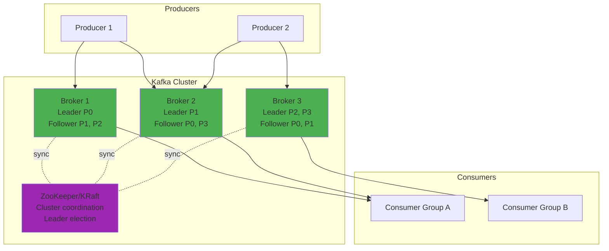

**Key Components:**
- **Broker:** Kafka server that stores and serves messages
- **ZooKeeper/KRaft:** Manages cluster metadata and leader election
- **Partition Leader:** Handles all reads/writes for a partition
- **Partition Follower:** Replicates leader data for fault tolerance

### Message Ordering Guarantees

**Kafka: Ordered within partition**

```
Topic: user-events (3 partitions)

Producer sends (with partition key = user_id):
Message 1: user_id=100 → hash(100) % 3 = 1 → Partition 1
Message 2: user_id=100 → hash(100) % 3 = 1 → Partition 1  ✅ Ordered!
Message 3: user_id=101 → hash(101) % 3 = 2 → Partition 2
Message 4: user_id=100 → hash(100) % 3 = 1 → Partition 1  ✅ Ordered!

Result:
Partition 1: [Msg1, Msg2, Msg4]  ← user_id=100 events in order
Partition 2: [Msg3]              ← user_id=101 events
```

**RabbitMQ: Ordered within queue**

```
Queue: orders (single consumer)
Message 1 → Message 2 → Message 3  ✅ Strictly ordered

Queue: orders (multiple consumers)
Message 1 → Consumer A
Message 2 → Consumer B  ⚠️ May process out of order!
Message 3 → Consumer A
```

**SQS Standard: Best-effort ordering**

```
Messages sent: [1, 2, 3, 4, 5]
Messages received: [1, 3, 2, 5, 4]  ⚠️ No guarantee!

Use SQS FIFO for ordering:
Messages sent: [1, 2, 3, 4, 5]
Messages received: [1, 2, 3, 4, 5]  ✅ Ordered
(But lower throughput: 300 msgs/sec vs 3000 msgs/sec)
```

### Backpressure Handling

When producers send faster than consumers can process:

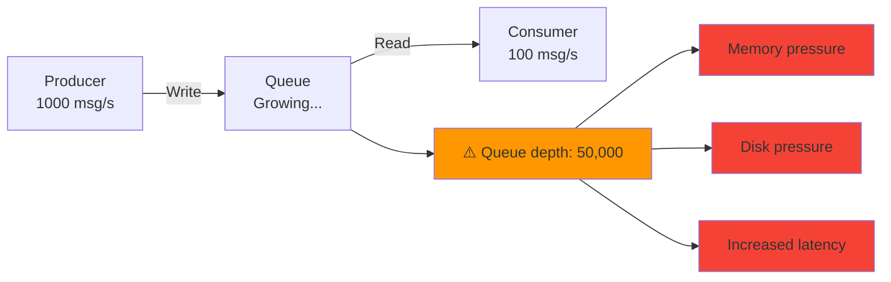

**Solutions:**

**1. Rate Limiting (Token Bucket)**
```python
import time
from threading import Lock

class TokenBucket:
    def __init__(self, rate, capacity):
        self.rate = rate          # tokens per second
        self.capacity = capacity  # max tokens
        self.tokens = capacity
        self.last_refill = time.time()
        self.lock = Lock()

    def consume(self, tokens=1):
        with self.lock:
            now = time.time()
            elapsed = now - self.last_refill

            # Refill tokens
            self.tokens = min(
                self.capacity,
                self.tokens + elapsed * self.rate
            )
            self.last_refill = now

            if self.tokens >= tokens:
                self.tokens -= tokens
                return True
            return False

# Usage
rate_limiter = TokenBucket(rate=100, capacity=100)  # 100 msg/s

def produce_message(message):
    while not rate_limiter.consume():
        time.sleep(0.01)  # Wait for token

    producer.send('orders', message)
```

**2. Dynamic Consumer Scaling**
```python
# Auto-scale based on lag
def scale_consumers(topic, consumer_group, target_lag=1000):
    lag = get_consumer_lag(topic, consumer_group)
    current_consumers = count_consumers(consumer_group)
    partition_count = get_partition_count(topic)

    if lag > target_lag * 2:
        # Scale up (but don't exceed partition count)
        desired = min(current_consumers + 2, partition_count)
        scale_to(consumer_group, desired)
    elif lag < target_lag / 2 and current_consumers > 1:
        # Scale down
        desired = max(current_consumers - 1, 1)
        scale_to(consumer_group, desired)
```

**3. Circuit Breaker**
```python
from enum import Enum
import time

class State(Enum):
    CLOSED = 1   # Normal operation
    OPEN = 2     # Blocking requests
    HALF_OPEN = 3  # Testing if recovered

class CircuitBreaker:
    def __init__(self, failure_threshold=5, timeout=60):
        self.failure_threshold = failure_threshold
        self.timeout = timeout
        self.failure_count = 0
        self.last_failure_time = None
        self.state = State.CLOSED

    def call(self, func, *args, **kwargs):
        if self.state == State.OPEN:
            if time.time() - self.last_failure_time > self.timeout:
                self.state = State.HALF_OPEN
            else:
                raise Exception("Circuit breaker is OPEN")

        try:
            result = func(*args, **kwargs)
            self.on_success()
            return result
        except Exception as e:
            self.on_failure()
            raise

    def on_success(self):
        self.failure_count = 0
        self.state = State.CLOSED

    def on_failure(self):
        self.failure_count += 1
        self.last_failure_time = time.time()

        if self.failure_count >= self.failure_threshold:
            self.state = State.OPEN

# Usage
breaker = CircuitBreaker(failure_threshold=5, timeout=60)

def send_to_queue(message):
    breaker.call(producer.send, 'orders', message)
```

### Common Patterns

**1. Task Queue:** Distribute work across workers
```
Web Server → [Task Queue] → Worker 1: Resize image
                         → Worker 2: Generate thumbnail
                         → Worker 3: Upload to CDN
```

**2. Event Sourcing:** Record all events, rebuild state
```
Event Stream:
1. OrderCreated(order_id=1, amount=100)
2. PaymentReceived(order_id=1, amount=100)
3. OrderShipped(order_id=1, tracking=ABC123)

Current State (replay events):
Order 1: {status: shipped, amount: 100, tracking: ABC123}
```

**3. CQRS:** Sync read models via events
```
Write DB → [Event Stream] → Read Model 1: User profile
                         → Read Model 2: Analytics
                         → Read Model 3: Search index
```

**4. Saga:** Coordinate distributed transactions
```
Order Service: Create order → [order.created]
Payment Service: Charge card → [payment.completed]
Inventory Service: Reserve items → [inventory.reserved]
Shipping Service: Ship order → [order.shipped]

If payment fails → Emit [payment.failed] → Rollback order
```

## Real-World Examples

### Uber: Kafka for Event Streaming

**Scale:**
- 4 trillion messages per day
- Petabytes of data
- 1000+ microservices

**Architecture:**

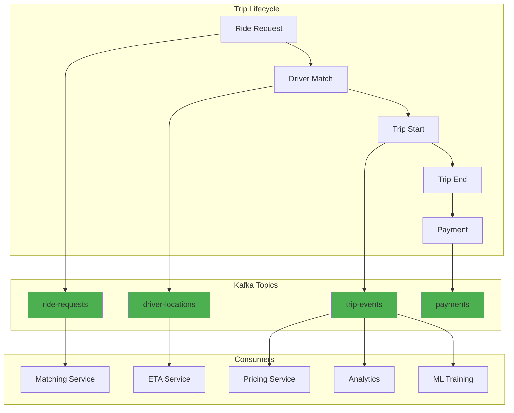

**Key Design Decisions:**

1. **Topic per event type:** Separate topics for ride requests, driver locations, trip events
2. **Partition by entity ID:** All events for same trip → same partition → ordering guaranteed
3. **Multiple consumer groups:** Same events feed real-time services, analytics, ML training
4. **Schema evolution:** Use Avro schemas with backward compatibility
5. **Multi-region replication:** Kafka MirrorMaker for disaster recovery

**Lessons Learned:**

- **Hot partitions:** Popular regions (airports) caused lag → used composite partition key (region + user_id)
- **Schema changes:** Breaking changes caused consumer failures → enforce backward compatibility
- **Monitoring:** Built custom tooling to track lag across 1000+ consumer groups
- **Cost:** Kafka retention = 7 days, older data archived to S3

### LinkedIn: Message Bus for Activity Streams

**Problem:** Feed every member's activity (posts, likes, shares) to their connections in real-time.

**Scale:**
- 800+ million members
- Billions of updates per day
- Sub-second latency

**Architecture:**

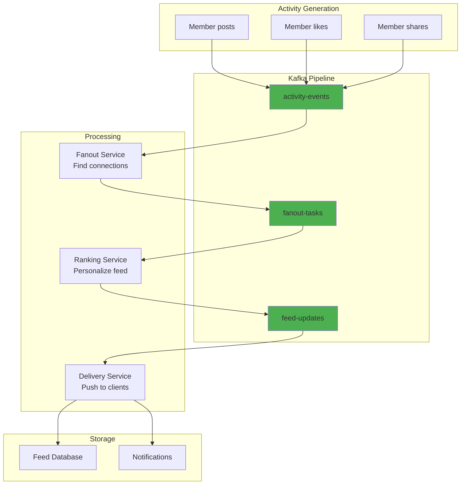

**Key Optimizations:**

1. **Batching:** Group updates for same user to reduce writes
2. **Sampling:** Influencers with 1M+ connections → sample subset
3. **Priority lanes:** Separate topics for high-priority (direct messages) vs low-priority (suggestions)
4. **Compression:** Snappy compression reduced bandwidth by 60%

**Configuration:**

```properties
# Producer: High throughput
batch.size=32768              # 32KB batches
linger.ms=100                 # Wait 100ms to fill batch
compression.type=snappy       # Fast compression
acks=1                        # Leader ack only (speed over durability)

# Consumer: Parallel processing
max.poll.records=1000         # Large batches
fetch.min.bytes=10240         # Wait for 10KB
max.partition.fetch.bytes=2097152  # 2MB per partition
```

**Results:**
- 99.9% of feed updates delivered within 500ms
- 50% cost reduction vs previous system
- Can replay activity history for debugging

### Netflix: SQS for Asynchronous Encoding

**Use Case:** When user uploads video, encode to multiple formats (4K, 1080p, 720p, 480p) + generate thumbnails.

**Why SQS:**
- Managed service (no ops overhead)
- Integrates with AWS Lambda
- Auto-scaling
- Good enough throughput (not millions/sec)

**Architecture:**

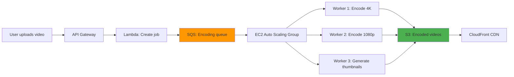

**SQS Configuration:**

```python
# Create queue with DLQ
import boto3

sqs = boto3.client('sqs')

# Dead letter queue
dlq = sqs.create_queue(
    QueueName='encoding-dlq',
    Attributes={
        'MessageRetentionPeriod': '1209600'  # 14 days
    }
)

# Main queue
queue = sqs.create_queue(
    QueueName='encoding-queue',
    Attributes={
        'VisibilityTimeout': '3600',  # 1 hour to encode
        'ReceiveMessageWaitTimeSeconds': '20',  # Long polling
        'RedrivePolicy': json.dumps({
            'deadLetterTargetArn': dlq['QueueArn'],
            'maxReceiveCount': '3'  # 3 attempts before DLQ
        })
    }
)
```

**Auto-scaling based on queue depth:**

```yaml
# CloudWatch Alarm
ScaleUpAlarm:
  Type: AWS::CloudWatch::Alarm
  Properties:
    MetricName: ApproximateNumberOfMessagesVisible
    Namespace: AWS/SQS
    Statistic: Average
    Period: 300  # 5 minutes
    EvaluationPeriods: 1
    Threshold: 100  # Messages in queue
    AlarmActions:
      - !Ref ScaleUpPolicy

# Auto Scaling Policy
ScaleUpPolicy:
  Type: AWS::AutoScaling::ScalingPolicy
  Properties:
    AdjustmentType: ChangeInCapacity
    AutoScalingGroupName: !Ref EncodingWorkers
    ScalingAdjustment: 5  # Add 5 workers
```

**Cost Optimization:**

```
Peak hours (8am-midnight): 50 workers
Off-peak (midnight-8am): 5 workers

SQS cost: $0.40 per million requests
Monthly messages: 100 million
Cost: $40/month

vs Kafka self-hosted: $5000/month (instances + ops)
```

## The "Why" Chain

- **Why message queues?** → Decouple services, handle traffic spikes, enable async processing, survive failures
- **What's the alternative?** → Synchronous calls (tight coupling, cascading failures), cron jobs (no real-time), database polling (inefficient)
- **What breaks without it?** → Services tightly coupled, one slow service blocks everything, traffic spikes cause cascading failures, no way to retry failed operations
- **Why not just HTTP calls?** → Caller blocks waiting, retries complicate code, no buffer for traffic spikes, failures propagate immediately

## Common Pitfalls

1. **Not handling duplicate messages:** Use idempotent consumers or deduplication
2. **Queue growing unbounded:** Monitor depth, set up alerts, implement backpressure
3. **Losing messages:** Configure persistence, acknowledgments, and replication
4. **Over-using queues:** Adds complexity and latency, use for truly async work
5. **Not setting up DLQ:** Failed messages disappear silently
6. **Ignoring consumer lag:** Lag indicates backpressure or slow consumers
7. **Wrong partition key:** Hot partitions cause uneven load
8. **No message ordering strategy:** Understand ordering guarantees per system
9. **Inadequate monitoring:** Track lag, throughput, error rate, queue depth
10. **Not testing failure scenarios:** Simulate broker down, consumer crash, network partition

## Interview Tips

- **Mention message queues whenever:** "Heavy processing", "can be done later", "traffic spikes", "decoupling"
- **Standard pattern:** "At-least-once delivery with idempotent consumers" — this is the industry standard
- **Know the comparison:** "Kafka for high-throughput event streaming, SQS for simple async tasks, RabbitMQ for complex routing"
- **Always mention DLQ:** Shows production experience
- **Discuss ordering:** "Kafka guarantees order within partition, we'll partition by user_id"
- **Talk about monitoring:** "Track consumer lag, set alerts at 1000 messages behind"
- **Mention backpressure:** "If consumers can't keep up, we'll add auto-scaling based on queue depth"
- **Know real examples:** Reference Uber's Kafka usage or Netflix's SQS implementation

## Common Interview Questions

**Q: When would you choose Kafka over RabbitMQ?**
A: Kafka for high-throughput event streaming (millions/sec), need for message replay, event sourcing. RabbitMQ for task queues with complex routing, lower throughput, traditional request-reply patterns.

**Q: How do you prevent duplicate message processing?**
A: Use idempotent operations or deduplication. Store processed message IDs in cache/DB, check before processing. Use unique constraints in database. Make operations naturally idempotent (SET status = X).

**Q: What happens if a consumer crashes while processing?**
A: With manual commit, message returns to queue after visibility timeout. Another consumer picks it up. With auto-commit, message may be lost. Always use manual commit after successful processing.

**Q: How do you handle message ordering?**
A: Kafka: Use partition key (e.g., user_id) to route related messages to same partition. RabbitMQ: Single consumer per queue. SQS: Use FIFO queues with message group ID.

**Q: Design a system to process 1 million images per day.**
A: Upload triggers Lambda → writes to SQS/Kafka → auto-scaled worker fleet processes → stores results in S3. Use DLQ for failures, CloudWatch for monitoring. Scale workers based on queue depth.

## Links

- [[03_design_patterns/pub_sub]] — The pub/sub pattern in depth
- [[03_design_patterns/event_sourcing]] — Events as the source of truth
- [[03_design_patterns/saga_pattern]] — Distributed transactions via queues
- [[back_pressure]] — Handling overload
- [[01_fundamentals/scalability]] — Queues enable scaling workers independently
- [[02_building_blocks/kafka]] — Deep dive into Kafka architecture
- [[03_design_patterns/cqrs]] — Command Query Responsibility Segregation
- [[04_case_studies/uber_architecture]] — How Uber uses Kafka
- [[04_case_studies/netflix_architecture]] — Netflix's async processing

## Further Reading

- **Books:**
  - "Kafka: The Definitive Guide" by Neha Narkhede
  - "Enterprise Integration Patterns" by Gregor Hohpe

- **Papers:**
  - "Kafka: a Distributed Messaging System for Log Processing" (LinkedIn, 2011)
  - "The Log: What every software engineer should know about real-time data" by Jay Kreps

- **Talks:**
  - "Building Scalable Stateful Services" by Caitie McCaffrey
  - "Distributed Sagas: A Protocol for Coordinating Microservices" by Caitie McCaffrey

- **Documentation:**
  - Apache Kafka Documentation: https://kafka.apache.org/documentation/
  - RabbitMQ Tutorials: https://www.rabbitmq.com/getstarted.html
  - AWS SQS Best Practices: https://docs.aws.amazon.com/AWSSimpleQueueService/latest/SQSDeveloperGuide/sqs-best-practices.html
