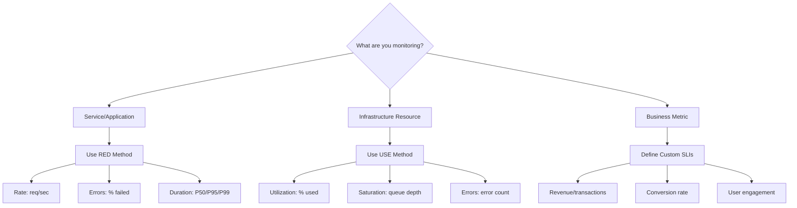
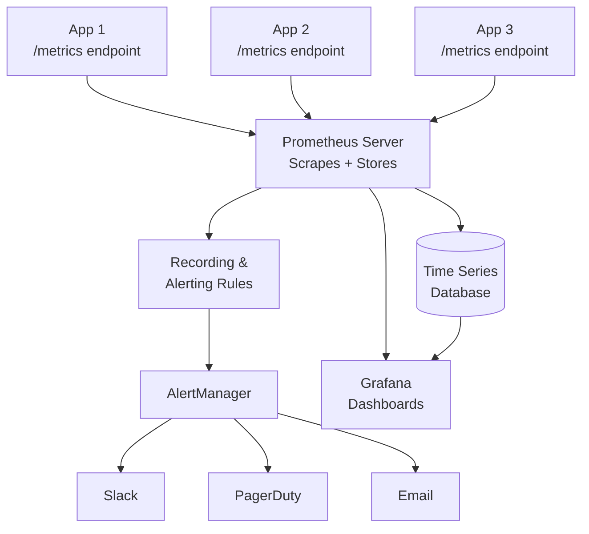
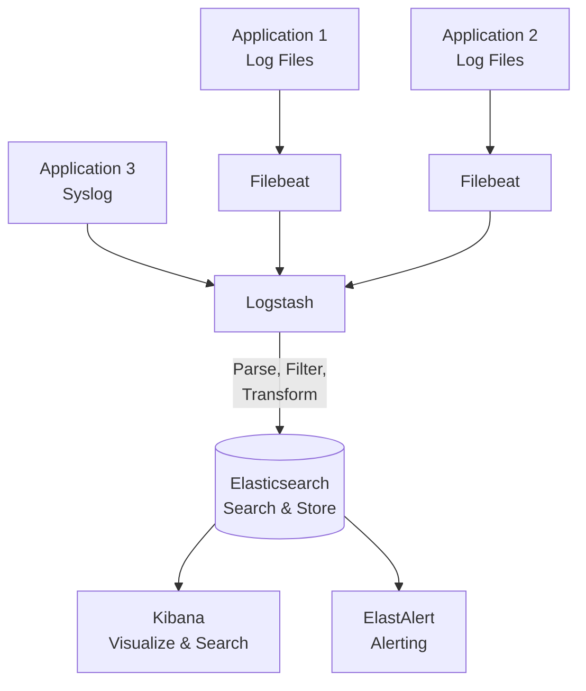
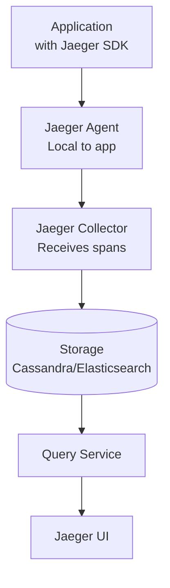
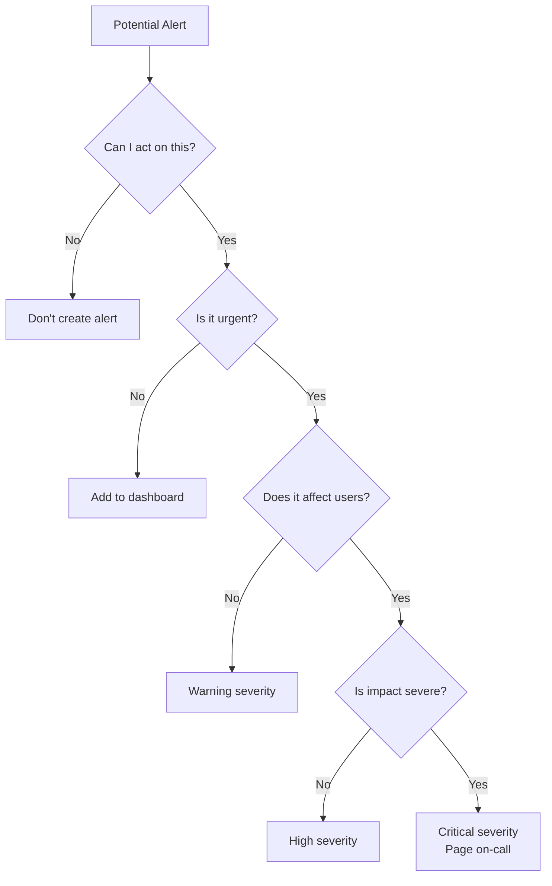
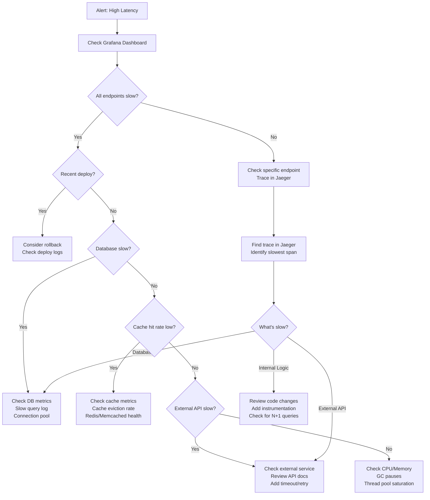
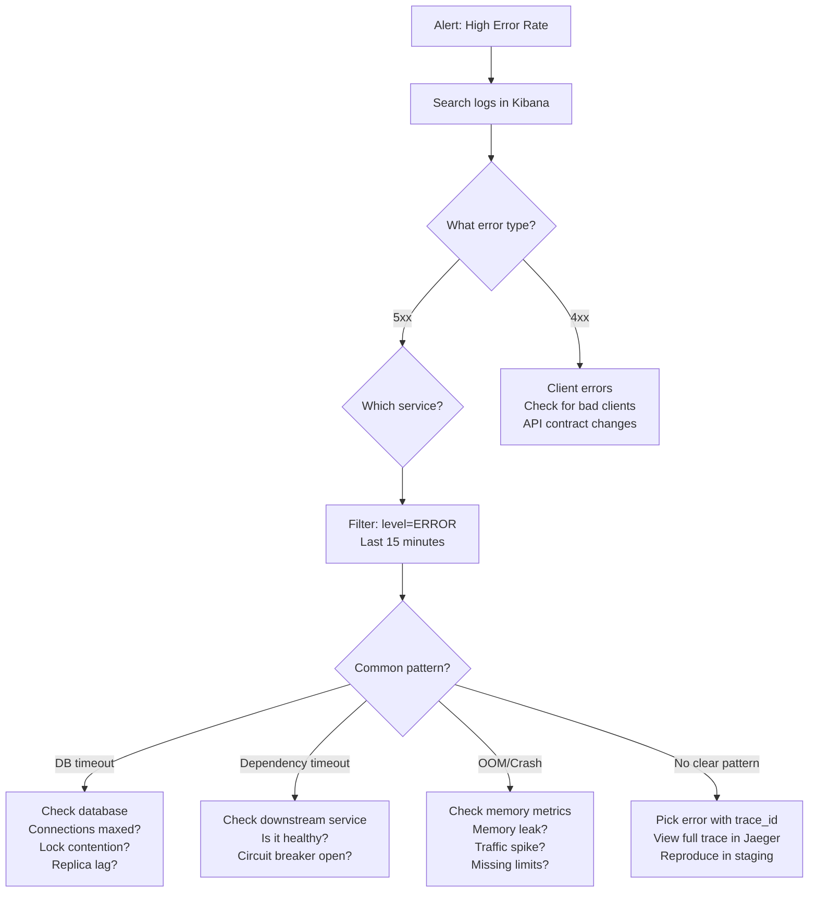

#system-design #building-block #observability #operations

# Monitoring and Logging

## Intuition (30 sec)

A car dashboard: speedometer (metrics), check engine light (alerts), black box recorder (logs), and GPS trail (traces). Without a dashboard, you're driving blind — you don't know something's wrong until you crash.

## Failure-First Scenario

> At 3 AM, users report errors. You SSH into servers, grep through log files, find nothing useful. You don't know which service is failing, how many users are affected, or when it started. You fix it after 4 hours. With proper observability, you'd have been alerted in 1 minute and found the root cause in 10.

## Working Knowledge (5 min)

### The Three Pillars of Observability

**Observability:**
- **Definition:** The ability to understand the internal state of a system by examining its external outputs (metrics, logs, traces)
- **Purpose:** Enable debugging, performance optimization, and proactive issue detection in production systems
- **How it works:** Instruments code to emit telemetry data, collect it centrally, and provide tools to query and visualize it

| Pillar | What | Example Tools |
|--------|------|---------------|
| **Metrics** | Numerical measurements over time | Prometheus, Datadog, CloudWatch |
| **Logs** | Timestamped event records | ELK Stack, Loki, CloudWatch Logs |
| **Traces** | Request journey across services | Jaeger, Zipkin, AWS X-Ray |

### Metrics (What's happening?)

**Metric:**
- **Definition:** A numerical measurement of a system property at a point in time, typically aggregated over intervals
- **Purpose:** Track system health, performance trends, and capacity utilization
- **Types:** Counter, Gauge, Histogram, Summary

```
http_requests_total{method="GET", status="200"} = 15234
http_request_duration_seconds{quantile="0.99"} = 0.45
cpu_usage_percent = 78
memory_used_bytes = 4294967296
```

**Metric Types:**
- **Counter:** Monotonically increasing value that only goes up (resets on restart). Used for cumulative values like total requests, errors, bytes sent
- **Gauge:** Point-in-time measurement that can go up or down. Used for current state like CPU usage, memory consumption, active connections, queue depth
- **Histogram:** Samples observations and counts them in configurable buckets. Used for latency percentiles, request sizes
- **Summary:** Similar to histogram but calculates quantiles on the client side. Used when you need pre-calculated percentiles

### Logs (What happened?)

**Log:**
- **Definition:** A timestamped record of a discrete event that occurred in a system
- **Purpose:** Provide detailed context for debugging, auditing, and post-mortem analysis
- **Format:** Structured (JSON) preferred over unstructured text for machine processing

```json
{
  "timestamp": "2024-01-15T10:23:45Z",
  "level": "ERROR",
  "service": "payment-service",
  "trace_id": "abc-123",
  "message": "Payment failed",
  "user_id": "user_456",
  "error": "insufficient_funds",
  "amount": 150.00,
  "currency": "USD"
}
```

**Log Levels:**
- **TRACE:** Very detailed information for diagnosing issues (performance impact)
- **DEBUG:** Detailed information useful during development
- **INFO:** General informational messages about system operation
- **WARN:** Warning messages about potentially harmful situations
- **ERROR:** Error events that might still allow the application to continue
- **FATAL/CRITICAL:** Severe errors that will lead to application termination

**Structured logging** (JSON) > unstructured text. Enables searching, filtering, aggregation, alerting on specific fields.

### Traces (How did it flow?)

**Distributed Trace:**
- **Definition:** A record of a single request's journey across multiple services, showing timing and dependencies
- **Purpose:** Debug latency issues, understand service dependencies, identify bottlenecks in microservices
- **How it works:** Each request gets a unique trace ID propagated across all services, with each service recording spans

```
[trace_id: abc-123]
├── API Gateway (2ms)
├── Auth Service (15ms)
├── Order Service (120ms)
│   ├── DB Query (45ms)  ← bottleneck!
│   └── Cache Lookup (1ms)
└── Payment Service (200ms) ← ERROR
```

**Key Terms:**
- **Trace:** Complete journey of a request across all services
- **Span:** Single unit of work within a trace (one service operation)
- **Trace ID:** Unique identifier for the entire request journey
- **Span ID:** Unique identifier for a specific operation within a trace

---

## Layer 1: Conceptual Precision (15 min)

### SLIs, SLOs, and SLAs - Deep Definitions

**SLI (Service Level Indicator):**
- **Formal Definition:** A quantitative measure of a specific aspect of the level of service provided to users
- **Simple Definition:** The actual number you measure (like request latency or error rate)
- **Analogy:** The speedometer reading in your car (actual speed)
- **Examples:** Request latency, error rate, availability, throughput, data durability

**SLO (Service Level Objective):**
- **Formal Definition:** A target value or range for a service level measured by an SLI, expressed as a percentage of time or requests
- **Simple Definition:** Your internal goal for how well the system should perform
- **Analogy:** Your personal speed limit you set when driving (I want to stay under 70 mph)
- **Examples:**
  - 99.9% of requests complete in < 200ms
  - Error rate < 0.1%
  - 99.95% availability per month
  - 99.999999999% (11 nines) data durability

**SLA (Service Level Agreement):**
- **Formal Definition:** A contractual agreement between service provider and customer defining expected service levels and consequences of not meeting them
- **Simple Definition:** Your promise to customers with financial penalties if broken
- **Analogy:** The speed limit law (break it and get a ticket)
- **Examples:** 99.95% uptime or 10% monthly credit

```
SLI (what you measure) → SLO (what you target) → SLA (what you promise)
        ↓                       ↓                         ↓
   Request latency         P99 < 200ms              99.9% < 200ms or credit
```

**Error Budget:**
- **Definition:** The amount of unreliability you're allowed before violating your SLO, calculated as (100% - SLO)
- **Purpose:** Balance velocity (shipping features) with reliability
- **Example:** 99.9% SLO = 0.1% error budget = 43 minutes downtime per month

```
If SLO = 99.9% availability:
- Allowed downtime = 0.1% of month
- 30 days × 24 hours × 60 min = 43,200 minutes
- Error budget = 43,200 × 0.001 = 43.2 minutes/month

If you've used 30 minutes downtime:
- Remaining budget = 13.2 minutes
- Should slow down releases until budget resets
```

### Monitoring Methodologies

**RED Method (for Services):**
- **Definition:** A monitoring methodology focused on request-driven services
- **Purpose:** Quickly assess service health from the user's perspective

| Metric | Definition | Example |
|--------|------------|---------|
| **Rate** | Number of requests per second handled by the service | 1,247 req/sec |
| **Errors** | Number or percentage of failed requests | 0.2% (2 errors per 1000 requests) |
| **Duration** | Time taken to process requests, typically as a distribution (P50, P95, P99) | P99 = 145ms |

**USE Method (for Resources):**
- **Definition:** A monitoring methodology focused on infrastructure resources (CPU, memory, disk, network)
- **Purpose:** Identify resource bottlenecks and capacity issues

| Metric | Definition | Example |
|--------|------------|---------|
| **Utilization** | Percentage of resource capacity being used | CPU at 78% |
| **Saturation** | Amount of work the resource cannot yet service (queued/waiting) | 15 requests in queue |
| **Errors** | Count of error events for the resource | 3 disk errors/hour |

**Four Golden Signals (Google SRE):**
1. **Latency:** Time to service a request (distinguish success vs error latency)
2. **Traffic:** Demand on your system (requests/sec, I/O rate)
3. **Errors:** Rate of requests that fail (explicit failures, wrong content, policy violations)
4. **Saturation:** How "full" your service is (resource utilization approaching limits)

### What to Monitor - Decision Tree



**What NOT to Monitor:**
- Don't alert on what you can't act on (avoid noise)
- Don't monitor causes when you can monitor symptoms (alert on "users seeing errors" not "CPU high")
- Don't create metrics for everything (cost and storage overhead)

---

## Layer 2: Technology-Specific Examples (20 min)

### Prometheus + Grafana Stack

**Prometheus:**
- **Definition:** An open-source monitoring system with a time-series database that pulls metrics from instrumented applications
- **Architecture Pattern:** Pull-based (Prometheus scrapes metrics from targets)
- **Data Model:** Multi-dimensional time series identified by metric name and key-value pairs (labels)



**Prometheus Configuration:**

```yaml
# prometheus.yml

global:
  scrape_interval: 15s        # How often to scrape targets (default 1m)
  evaluation_interval: 15s    # How often to evaluate alerting rules
  external_labels:            # Labels attached to time series or alerts
    cluster: 'production'
    region: 'us-east-1'

# Scrape configurations
scrape_configs:
  - job_name: 'api-service'
    # Definition: job_name groups related targets
    # Purpose: Logical grouping of instances to monitor
    static_configs:
      - targets: ['api-1:9090', 'api-2:9090', 'api-3:9090']
        labels:
          env: 'production'

  - job_name: 'database-exporters'
    static_configs:
      - targets: ['postgres-exporter:9187']
        labels:
          database: 'primary'

# Alerting configuration
alerting:
  alertmanagers:
    - static_configs:
        - targets: ['alertmanager:9093']

# Recording and alerting rules
rule_files:
  - 'alerts.yml'
  - 'recording_rules.yml'
```

**Prometheus Alerting Rules:**

```yaml
# alerts.yml

groups:
  - name: service_alerts
    interval: 30s
    rules:
      # Alert on high error rate
      - alert: HighErrorRate
        # Definition: PromQL expression that triggers alert when true
        expr: |
          (
            sum(rate(http_requests_total{status=~"5.."}[5m]))
            /
            sum(rate(http_requests_total[5m]))
          ) > 0.01
        for: 5m  # Must be true for 5 minutes before firing
        labels:
          severity: critical
          team: backend
        annotations:
          summary: "High error rate on {{ $labels.job }}"
          description: "Error rate is {{ $value | humanizePercentage }} (threshold: 1%)"
          runbook: "https://wiki.example.com/runbooks/high-error-rate"

      # Alert on high latency
      - alert: HighLatency
        expr: |
          histogram_quantile(0.99,
            sum(rate(http_request_duration_seconds_bucket[5m])) by (le, job)
          ) > 0.5
        for: 10m
        labels:
          severity: warning
          team: backend
        annotations:
          summary: "P99 latency is high on {{ $labels.job }}"
          description: "P99 latency is {{ $value }}s (threshold: 0.5s)"

      # Alert on service down
      - alert: ServiceDown
        expr: up{job="api-service"} == 0
        for: 1m
        labels:
          severity: critical
          team: sre
        annotations:
          summary: "Service {{ $labels.instance }} is down"
          description: "{{ $labels.job }} instance {{ $labels.instance }} has been down for more than 1 minute"
```

**Key PromQL Concepts:**

- **rate():** Calculates per-second rate of increase over a time window
  - `rate(http_requests_total[5m])` = requests per second over last 5 minutes
- **histogram_quantile():** Calculates percentiles from histogram metrics
  - `histogram_quantile(0.99, ...)` = 99th percentile (P99)
- **sum():** Aggregates values across dimensions
- **by (label):** Groups results by specific labels

**Instrumenting Your Application:**

```python
# Python example with prometheus_client

from prometheus_client import Counter, Histogram, Gauge, start_http_server
import time

# Define metrics
REQUEST_COUNT = Counter(
    'http_requests_total',
    'Total HTTP requests',
    ['method', 'endpoint', 'status']
)

REQUEST_LATENCY = Histogram(
    'http_request_duration_seconds',
    'HTTP request latency',
    ['method', 'endpoint']
)

ACTIVE_CONNECTIONS = Gauge(
    'active_connections',
    'Number of active connections'
)

# Use in your code
@app.route('/api/users')
def get_users():
    ACTIVE_CONNECTIONS.inc()  # Increment gauge

    start = time.time()
    try:
        result = fetch_users()
        REQUEST_COUNT.labels(method='GET', endpoint='/api/users', status='200').inc()
        return result
    except Exception as e:
        REQUEST_COUNT.labels(method='GET', endpoint='/api/users', status='500').inc()
        raise
    finally:
        REQUEST_LATENCY.labels(method='GET', endpoint='/api/users').observe(time.time() - start)
        ACTIVE_CONNECTIONS.dec()  # Decrement gauge

# Expose metrics endpoint
if __name__ == '__main__':
    start_http_server(8000)  # Metrics available at :8000/metrics
    app.run()
```

**Grafana Dashboard Configuration:**

```json
{
  "dashboard": {
    "title": "API Service Dashboard",
    "panels": [
      {
        "title": "Request Rate (QPS)",
        "type": "graph",
        "targets": [
          {
            "expr": "sum(rate(http_requests_total[5m])) by (job)",
            "legendFormat": "{{ job }}"
          }
        ],
        "yaxes": [
          {
            "label": "requests/sec",
            "format": "reqps"
          }
        ]
      },
      {
        "title": "Error Rate",
        "type": "graph",
        "targets": [
          {
            "expr": "sum(rate(http_requests_total{status=~\"5..\"}[5m])) / sum(rate(http_requests_total[5m]))",
            "legendFormat": "Error Rate"
          }
        ],
        "alert": {
          "conditions": [
            {
              "evaluator": {
                "params": [0.01],
                "type": "gt"
              }
            }
          ]
        }
      },
      {
        "title": "P50/P95/P99 Latency",
        "type": "graph",
        "targets": [
          {
            "expr": "histogram_quantile(0.50, sum(rate(http_request_duration_seconds_bucket[5m])) by (le))",
            "legendFormat": "P50"
          },
          {
            "expr": "histogram_quantile(0.95, sum(rate(http_request_duration_seconds_bucket[5m])) by (le))",
            "legendFormat": "P95"
          },
          {
            "expr": "histogram_quantile(0.99, sum(rate(http_request_duration_seconds_bucket[5m])) by (le))",
            "legendFormat": "P99"
          }
        ]
      }
    ]
  }
}
```

### ELK Stack (Elasticsearch, Logstash, Kibana)

**ELK Stack:**
- **Definition:** A collection of three open-source tools for searching, analyzing, and visualizing log data in real-time
- **Architecture:** Logs → Beats/Logstash → Elasticsearch → Kibana
- **Purpose:** Centralized logging, log analysis, troubleshooting, security monitoring



**Component Definitions:**

- **Elasticsearch:** Distributed search and analytics engine that stores, indexes, and searches log data
- **Logstash:** Data processing pipeline that ingests, transforms, and forwards logs to Elasticsearch
- **Kibana:** Visualization and exploration tool for data stored in Elasticsearch
- **Filebeat:** Lightweight log shipper that reads log files and forwards them to Logstash or Elasticsearch
- **Beats:** Family of lightweight data shippers (Filebeat for logs, Metricbeat for metrics, Packetbeat for network data)

**Filebeat Configuration:**

```yaml
# filebeat.yml

filebeat.inputs:
  - type: log
    # Definition: Reads log files line by line
    enabled: true
    paths:
      - /var/log/app/*.log
    fields:
      app: api-service
      env: production
    # Multiline configuration for stack traces
    multiline:
      pattern: '^[0-9]{4}-[0-9]{2}-[0-9]{2}'
      negate: true
      match: after

  - type: log
    enabled: true
    paths:
      - /var/log/nginx/access.log
    fields:
      app: nginx
      log_type: access

# Output to Logstash
output.logstash:
  hosts: ["logstash:5044"]

# Or output directly to Elasticsearch
# output.elasticsearch:
#   hosts: ["elasticsearch:9200"]
#   index: "filebeat-%{+yyyy.MM.dd}"

# Logging configuration
logging.level: info
logging.to_files: true
logging.files:
  path: /var/log/filebeat
  name: filebeat
  keepfiles: 7
```

**Logstash Pipeline Configuration:**

```ruby
# logstash.conf

input {
  beats {
    port => 5044
    # Definition: Receives data from Beats (Filebeat)
  }
}

filter {
  # Parse JSON logs
  if [app] == "api-service" {
    json {
      source => "message"
      # Definition: Parses JSON string into structured fields
    }

    # Parse timestamp
    date {
      match => ["timestamp", "ISO8601"]
      target => "@timestamp"
    }

    # Add GeoIP data for IP addresses
    if [client_ip] {
      geoip {
        source => "client_ip"
        target => "geoip"
      }
    }
  }

  # Parse nginx access logs
  if [app] == "nginx" {
    grok {
      # Definition: Uses regex patterns to extract structured fields
      match => {
        "message" => '%{IPORHOST:client_ip} - - \[%{HTTPDATE:timestamp}\] "%{WORD:method} %{URIPATHPARAM:request} HTTP/%{NUMBER:http_version}" %{NUMBER:status} %{NUMBER:bytes} "%{DATA:referrer}" "%{DATA:user_agent}"'
      }
    }
  }

  # Drop debug logs in production
  if [level] == "DEBUG" and [env] == "production" {
    drop { }
  }

  # Anonymize sensitive data
  mutate {
    gsub => [
      "message", "\b\d{3}-\d{2}-\d{4}\b", "XXX-XX-XXXX"  # SSN
    ]
  }
}

output {
  elasticsearch {
    hosts => ["elasticsearch:9200"]
    index => "%{[app]}-%{+YYYY.MM.dd}"
    # Definition: Creates daily indices per application
  }

  # Debug output
  # stdout { codec => rubydebug }
}
```

**Elasticsearch Index Template:**

```json
{
  "index_patterns": ["api-service-*"],
  "settings": {
    "number_of_shards": 3,
    "number_of_replicas": 1,
    "index.lifecycle.name": "logs-policy",
    "index.lifecycle.rollover_alias": "api-service"
  },
  "mappings": {
    "properties": {
      "@timestamp": {
        "type": "date"
      },
      "level": {
        "type": "keyword"
      },
      "service": {
        "type": "keyword"
      },
      "trace_id": {
        "type": "keyword"
      },
      "message": {
        "type": "text",
        "fields": {
          "keyword": {
            "type": "keyword",
            "ignore_above": 256
          }
        }
      },
      "user_id": {
        "type": "keyword"
      },
      "duration_ms": {
        "type": "long"
      },
      "status_code": {
        "type": "integer"
      }
    }
  }
}
```

**Kibana Query Examples:**

```
# Find all errors in last 15 minutes
level: "ERROR" AND @timestamp:[now-15m TO now]

# Find slow requests (> 1 second)
duration_ms: >1000 AND @timestamp:[now-1h TO now]

# Find errors for specific user
user_id: "user_456" AND level: "ERROR"

# Find all requests with specific trace ID
trace_id: "abc-123"

# Find 5xx errors in payment service
service: "payment-service" AND status_code: [500 TO 599]

# Complex query
service: "api-gateway" AND
(level: "ERROR" OR level: "FATAL") AND
NOT message: "expected error"
```

### Distributed Tracing with Jaeger

**Jaeger:**
- **Definition:** An open-source distributed tracing system for monitoring and troubleshooting microservices
- **Purpose:** Visualize request flows, identify bottlenecks, understand service dependencies
- **Components:** Client libraries, Agent, Collector, Query service, UI



**OpenTelemetry Instrumentation (Modern Standard):**

```python
# Python example with OpenTelemetry

from opentelemetry import trace
from opentelemetry.exporter.jaeger.thrift import JaegerExporter
from opentelemetry.sdk.resources import SERVICE_NAME, Resource
from opentelemetry.sdk.trace import TracerProvider
from opentelemetry.sdk.trace.export import BatchSpanProcessor
from opentelemetry.instrumentation.flask import FlaskInstrumentor
from opentelemetry.instrumentation.requests import RequestsInstrumentor

# Configure tracer
resource = Resource(attributes={
    SERVICE_NAME: "api-service"
})

jaeger_exporter = JaegerExporter(
    agent_host_name="jaeger-agent",
    agent_port=6831,
)

provider = TracerProvider(resource=resource)
processor = BatchSpanProcessor(jaeger_exporter)
provider.add_span_processor(processor)
trace.set_tracer_provider(provider)

# Auto-instrument frameworks
FlaskInstrumentor().instrument_app(app)
RequestsInstrumentor().instrument()

# Manual instrumentation
tracer = trace.get_tracer(__name__)

@app.route('/api/orders/<order_id>')
def get_order(order_id):
    with tracer.start_as_current_span("get_order") as span:
        # Add attributes to span
        span.set_attribute("order_id", order_id)
        span.set_attribute("user_id", get_current_user_id())

        # Call database
        with tracer.start_as_current_span("db.query.orders"):
            order = db.query(f"SELECT * FROM orders WHERE id = {order_id}")

        # Call external service
        with tracer.start_as_current_span("call.payment-service") as payment_span:
            payment_span.set_attribute("http.method", "GET")
            payment_span.set_attribute("http.url", f"http://payment-service/api/payment/{order.payment_id}")
            payment = requests.get(f"http://payment-service/api/payment/{order.payment_id}")
            payment_span.set_attribute("http.status_code", payment.status_code)

        # Add event to span
        span.add_event("order_retrieved", {
            "order.status": order.status,
            "order.total": order.total
        })

        return jsonify(order)
```

**Trace Context Propagation:**

```
Request comes in with headers:
traceparent: 00-4bf92f3577b34da6a3ce929d0e0e4736-00f067aa0ba902b7-01
            |  |                                |                  |
            |  Trace ID                        Parent Span ID     Flags
            Version

Your service:
1. Extracts trace context from headers
2. Creates new span with same Trace ID
3. Sets parent to received Span ID
4. Generates new Span ID for this operation
5. Propagates trace context to downstream services
```

---

## Layer 3: Production-Ready Details (30 min)

### Complete Observability Architecture

```
                          Internet
                             │
                    ┌────────▼────────┐
                    │  Load Balancer  │
                    │                 │
                    │ Logging: Access │
                    │ Metrics: Conn/s │
                    └────────┬────────┘
                             │
            ┌────────────────┼────────────────┐
            │                │                │
       ┌────▼──┐        ┌───▼───┐       ┌───▼───┐
       │ API 1 │        │ API 2 │       │ API 3 │
       │       │        │       │       │       │
       │ Logs: │        │ Logs: │       │ Logs: │
       │ JSON  │        │ JSON  │       │ JSON  │
       │       │        │       │       │       │
       │ Metrics:│      │Metrics:│      │Metrics:│
       │ /metrics│      │/metrics│      │/metrics│
       │       │        │       │       │       │
       │ Traces:│       │Traces: │      │Traces: │
       │ Jaeger │       │ Jaeger │      │ Jaeger │
       └───┬───┘        └───┬───┘       └───┬───┘
           │                │                │
           └────────────────┼────────────────┘
                            │
         ┌──────────────────┼──────────────────┐
         │                  │                  │
    ┌────▼────┐      ┌─────▼─────┐     ┌─────▼─────┐
    │Filebeat │      │Prometheus │     │  Jaeger   │
    │         │      │           │     │  Agent    │
    │Logs →   │      │Scrapes    │     │           │
    │Logstash │      │metrics    │     │Traces →   │
    └────┬────┘      │every 15s  │     │Collector  │
         │           └─────┬─────┘     └─────┬─────┘
         │                 │                 │
         │           ┌─────▼─────┐           │
         │           │AlertManager│          │
         │           │           │           │
         │           │Routes     │           │
         │           │alerts     │           │
         │           └─────┬─────┘           │
         │                 │                 │
         │                 ▼                 │
         │         ┌───────────────┐         │
         │         │  PagerDuty    │         │
         │         │  Slack        │         │
         │         │  Email        │         │
         │         └───────────────┘         │
         │                                   │
    ┌────▼────────────────────────────────┬──┘
    │                                     │
┌───▼──────┐  ┌────────────┐  ┌─────────▼────┐
│Elasticsearch│ │ Prometheus │  │    Jaeger    │
│            │ │  Storage   │  │   Storage    │
│ Log Store  │ │  (TSDB)    │  │ (Cassandra)  │
└───┬────────┘ └─────┬──────┘  └──────┬───────┘
    │                │                │
┌───▼──────┐  ┌──────▼──────┐  ┌──────▼───────┐
│  Kibana  │  │   Grafana   │  │  Jaeger UI   │
│          │  │             │  │              │
│ Search & │  │ Dashboards  │  │ Trace View   │
│ Visualize│  │  & Alerts   │  │              │
└──────────┘  └─────────────┘  └──────────────┘
```

### Sample Dashboard Design

```
┌───────────────────────────────────────────────────────────────┐
│  API SERVICE DASHBOARD                          Last 1 hour ▼ │
├───────────────────────────────────────────────────────────────┤
│                                                               │
│  ┌─────────────────┐  ┌─────────────────┐  ┌───────────────┐│
│  │ REQUEST RATE    │  │ ERROR RATE      │  │ P99 LATENCY   ││
│  │                 │  │                 │  │               ││
│  │   1,247/sec    │  │    0.12%       │  │    145ms     ││
│  │   ▲ +5%        │  │    ▼ -0.05%    │  │    ▼ -12ms   ││
│  │                 │  │                 │  │               ││
│  │     /\  /\      │  │                 │  │     /\        ││
│  │    /  \/  \     │  │  ▁▂▃▂▁         │  │    /  \       ││
│  │   /        \    │  │▁▂      ▂▁      │  │▁▁▁▁    \▁▁    ││
│  └─────────────────┘  └─────────────────┘  └───────────────┘│
│                                                               │
│  ┌───────────────────────────────────────────────────────────┐│
│  │ REQUEST RATE BY ENDPOINT (Last Hour)                     ││
│  │                                                           ││
│  │  /api/users     ████████████████████████████ 850/s       ││
│  │  /api/orders    ████████████████ 245/s                   ││
│  │  /api/products  ████████ 98/s                            ││
│  │  /api/search    █████ 54/s                               ││
│  └───────────────────────────────────────────────────────────┘│
│                                                               │
│  ┌─────────────────────────────────┐  ┌───────────────────┐ │
│  │ LATENCY DISTRIBUTION            │  │ ERROR BREAKDOWN   │ │
│  │                                 │  │                   │ │
│  │ P50:  67ms  ══════════════      │  │ 500: 45%         │ │
│  │ P75:  89ms  ══════════════════  │  │ 503: 30%         │ │
│  │ P90: 112ms  ════════════════════│  │ 429: 15%         │ │
│  │ P95: 128ms  ══════════════════  │  │ 502: 10%         │ │
│  │ P99: 145ms  ══════════          │  │                   │ │
│  └─────────────────────────────────┘  └───────────────────┘ │
│                                                               │
│  ┌───────────────────────────────────────────────────────────┐│
│  │ ACTIVE ALERTS                                            ││
│  │                                                           ││
│  │  CRITICAL  HighErrorRate on payment-service    2m ago   ││
│  │  WARNING   HighMemoryUsage on api-2            15m ago  ││
│  └───────────────────────────────────────────────────────────┘│
│                                                               │
│  ┌─────────────────────────────────┐  ┌───────────────────┐ │
│  │ CPU USAGE                       │  │ MEMORY USAGE      │ │
│  │ 100%│                           │  │ 16GB│             │ │
│  │  80%│     ___                   │  │ 12GB│      ___    │ │
│  │  60%│____/   \___               │  │  8GB│_____/   \___│ │
│  │  40%│            \_             │  │  4GB│             │ │
│  │  20%│              \___         │  │  0GB│             │ │
│  │   0%└─────────────────────────  │  │     └─────────────│ │
│  └─────────────────────────────────┘  └───────────────────┘ │
└───────────────────────────────────────────────────────────────┘
```

**Dashboard Panel Definitions:**

- **Request Rate:** QPS (queries per second) - total requests being handled
- **Error Rate:** Percentage of requests returning 4xx/5xx status codes
- **P99 Latency:** 99th percentile - 99% of requests complete faster than this
- **Active Alerts:** Current firing alerts requiring attention
- **CPU/Memory Usage:** Resource utilization showing capacity planning needs

### Alerting Strategy & Rules

**Alert Severity Levels:**

| Severity | Definition | Response Time | Examples | Action |
|----------|-----------|---------------|----------|---------|
| **Critical/P1** | System is down or severely degraded, users are impacted | Immediate (page on-call) | Site down, payments failing, data loss | Wake someone up |
| **High/P2** | Significant issue, partial user impact | 15 minutes | High error rate (>1%), API latency >5s | Notify on-call |
| **Warning/P3** | Potential issue, no current user impact | 1 hour | Disk 80% full, memory at 85% | Create ticket |
| **Info/P4** | Informational, for awareness | Next business day | Cache hit rate declining | Review in standup |

**Alert Design Principles:**



**Sample Alert Rules:**

```yaml
# Production-ready alert rules

groups:
  - name: user_facing_alerts
    interval: 30s
    rules:
      # Critical: Service is down
      - alert: ServiceDown
        expr: up{job="api-service"} == 0
        for: 2m
        labels:
          severity: critical
          team: sre
          component: api
        annotations:
          summary: "Service {{ $labels.instance }} is down"
          description: "{{ $labels.job }} on {{ $labels.instance }} has been down for more than 2 minutes"
          impact: "Users cannot access the API"
          runbook: "https://runbooks.company.com/service-down"
          dashboard: "https://grafana.company.com/d/api-service"

      # Critical: High error rate (symptom-based)
      - alert: HighErrorRate
        expr: |
          (
            sum(rate(http_requests_total{status=~"5.."}[5m])) by (job)
            /
            sum(rate(http_requests_total[5m])) by (job)
          ) > 0.01
        for: 5m
        labels:
          severity: critical
          team: backend
          slo: error-rate
        annotations:
          summary: "High error rate on {{ $labels.job }}"
          description: "{{ $labels.job }} error rate is {{ $value | humanizePercentage }} (threshold: 1%)"
          impact: "Users seeing errors when accessing service"
          action: "Check logs: kubectl logs -l app={{ $labels.job }} --tail=100"

      # Critical: SLO violation (latency)
      - alert: LatencySLOViolation
        expr: |
          histogram_quantile(0.99,
            sum(rate(http_request_duration_seconds_bucket[5m])) by (le, job)
          ) > 0.2
        for: 10m
        labels:
          severity: critical
          team: backend
          slo: latency
        annotations:
          summary: "P99 latency SLO violation on {{ $labels.job }}"
          description: "P99 latency is {{ $value }}s (SLO: 200ms)"

      # Warning: Error budget burn rate
      - alert: ErrorBudgetBurnRateHigh
        expr: |
          (
            1 - (
              sum(rate(http_requests_total{status!~"5.."}[1h]))
              /
              sum(rate(http_requests_total[1h]))
            )
          ) > (0.001 * 14.4)  # 14.4x normal burn rate
        for: 15m
        labels:
          severity: warning
          team: sre
          slo: availability
        annotations:
          summary: "High error budget burn rate"
          description: "Burning error budget 14.4x faster than sustainable rate"
          action: "Slow down releases until error rate decreases"

  - name: capacity_alerts
    interval: 1m
    rules:
      # Warning: High resource usage
      - alert: HighMemoryUsage
        expr: |
          (
            node_memory_MemTotal_bytes - node_memory_MemAvailable_bytes
          ) / node_memory_MemTotal_bytes > 0.85
        for: 10m
        labels:
          severity: warning
          team: sre
        annotations:
          summary: "High memory usage on {{ $labels.instance }}"
          description: "Memory usage is {{ $value | humanizePercentage }}"

      # Warning: Disk filling up
      - alert: DiskSpaceLow
        expr: |
          (
            node_filesystem_avail_bytes{mountpoint="/"}
            /
            node_filesystem_size_bytes{mountpoint="/"}
          ) < 0.15
        for: 5m
        labels:
          severity: warning
          team: sre
        annotations:
          summary: "Low disk space on {{ $labels.instance }}"
          description: "Only {{ $value | humanizePercentage }} disk space remaining"
          action: "Clean up old logs or expand disk"

  - name: dependency_alerts
    interval: 1m
    rules:
      # High: Database latency
      - alert: DatabaseSlowQueries
        expr: |
          histogram_quantile(0.99,
            sum(rate(mysql_query_duration_seconds_bucket[5m])) by (le)
          ) > 1.0
        for: 10m
        labels:
          severity: high
          team: database
        annotations:
          summary: "Slow database queries detected"
          description: "P99 query latency is {{ $value }}s"
          action: "Check slow query log, review recent schema changes"
```

### Troubleshooting Flowcharts

**Debugging High Latency:**



**Debugging High Error Rate:**



**Debugging Performance Degradation:**

```
Step 1: Gather Evidence
├─ What changed? (check deploy history)
├─ When did it start? (check metrics timeline)
├─ Who's affected? (all users or subset?)
└─ How bad? (quantify with P50/P95/P99)

Step 2: Form Hypothesis
├─ Recent code change?     → Check git log, code review
├─ Traffic increase?       → Check request rate metrics
├─ Downstream dependency?  → Check service dependencies
├─ Infrastructure issue?   → Check CPU, memory, disk, network
└─ Data growth?           → Check database size, query plans

Step 3: Test Hypothesis
├─ Correlate metrics (latency vs CPU, vs request rate)
├─ Check traces for affected requests
├─ Review logs for errors or warnings
└─ Compare before/after metrics

Step 4: Mitigate
├─ Rollback if recent deploy
├─ Scale up if resource constrained
├─ Enable circuit breaker if dependency issue
├─ Apply emergency config change
└─ Redirect traffic to healthy instances

Step 5: Permanent Fix
├─ Fix root cause
├─ Add tests to prevent regression
├─ Update monitoring/alerts
└─ Write post-mortem
```

---

## Real-World Examples

### Example 1: Google SRE - Error Budget and SLO Practices

**Problem Definition:**
Google needed a way to balance innovation velocity (shipping new features) with system reliability (not breaking things).

**Solution Definition:**
Implemented the error budget concept - the amount of unreliability you're allowed before violating your SLO.

**Technical Terms Used:**
- **SLI:** Availability measured as successful requests / total requests
- **SLO:** 99.99% availability per quarter (52.56 minutes downtime allowed)
- **Error Budget:** 100% - 99.99% = 0.01% = 52.56 minutes per quarter

**How It Works:**

```
Quarter starts: Error Budget = 52.56 minutes
├─ Week 1: Incident causes 10 min downtime
│  ├─ Remaining budget: 42.56 minutes
│  └─ Status: Green (can deploy)
├─ Week 2: Deploy causes 15 min downtime
│  ├─ Remaining budget: 27.56 minutes
│  └─ Status: Yellow (deploy carefully)
├─ Week 3: Incident causes 30 min downtime
│  ├─ Remaining budget: -2.44 minutes (EXHAUSTED)
│  └─ Status: Red (FREEZE DEPLOYS)
└─ Week 4-13:
   ├─ Focus only on reliability improvements
   ├─ No new features until budget resets
   └─ Conduct post-mortems
```

**Policy:**
- **Error budget remaining:** Continue normal development and deployments
- **Error budget exhausted:** Freeze feature launches, focus on reliability
- **Error budget healthy:** Can take more risks with experiments

**Results:**
- **Objective decision making:** No arguments about "should we deploy this?"
- **Balance:** Incentivizes both innovation and reliability
- **Team alignment:** Dev and SRE teams aligned on acceptable risk

### Example 2: Netflix - Observability at Scale

**Problem Definition:**
Netflix streams to 200M+ subscribers globally. Any latency spike or error affects millions. Needed observability for hundreds of microservices handling billions of requests/day.

**Solution Definition:**
Built comprehensive observability platform combining metrics (Atlas), logs (centralized logging), and traces (distributed tracing).

**Technical Stack:**
- **Atlas:** Custom time-series database for metrics (handles billions of metrics)
- **EVCache:** Distributed caching layer with detailed metrics
- **Mantis:** Real-time stream processing for log analysis
- **Distributed Tracing:** Custom implementation (later contributed to Zipkin)

**Key Metrics Tracked:**

```
User Experience SLIs:
├─ Play delay: Time from click to video start
│  ├─ SLO: P99 < 1 second
│  └─ Measures: Device buffering, CDN latency, API latency
├─ Rebuffer rate: How often playback stops to buffer
│  ├─ SLO: < 0.5% of viewing time
│  └─ Measures: Network quality, CDN health, bitrate selection
└─ Error rate: Failed play attempts
   ├─ SLO: < 0.1%
   └─ Measures: API errors, DRM failures, device issues

Platform SLIs:
├─ Service availability: 99.99% per service
├─ API latency: P99 < 100ms
└─ Data consistency: 100% for billing/account
```

**Architecture:**

```
┌──────────────────────────────────────────────────┐
│           Client Devices (200M users)            │
└───┬──────────────────────────────────────────┬───┘
    │                                          │
    │ Every request includes:                  │
    │ - Request ID (trace)                     │
    │ - Device info                            │
    │ - Session context                        │
    │                                          │
┌───▼──────────────────────────────────────────▼───┐
│              API Gateway (Zuul)                   │
│                                                   │
│ Logs: All requests, errors, latencies            │
│ Metrics: RPS, P99 latency per endpoint           │
│ Traces: Full request path                        │
└───┬───────────────────────────────────────┬──────┘
    │                                       │
    │    ┌──────────────────────────────────┤
    │    │                                  │
┌───▼────▼───┐  ┌─────────────┐  ┌────────▼─────┐
│  Service A │  │  Service B  │  │  Service C   │
│            │  │             │  │              │
│ Each service emits:          │  │              │
│ - RED metrics (Rate/Error/Duration)            │
│ - Structured logs with trace IDs               │
│ - Spans for distributed traces                 │
└───┬────────┘  └──────┬──────┘  └─────┬────────┘
    │                  │                │
    └──────────────────┼────────────────┘
                       │
        ┌──────────────┼──────────────┐
        │              │              │
  ┌─────▼────┐  ┌──────▼──────┐  ┌───▼──────┐
  │  Atlas   │  │   Mantis    │  │ Trace    │
  │          │  │             │  │ Storage  │
  │ Metrics  │  │ Log Stream  │  │          │
  │ Storage  │  │ Processing  │  │          │
  └─────┬────┘  └──────┬──────┘  └───┬──────┘
        │              │              │
        └──────────────┼──────────────┘
                       │
              ┌────────▼────────┐
              │   Alerting      │
              │   - PagerDuty   │
              │   - Slack       │
              └─────────────────┘
```

**Results:**
- **MTTR reduced:** Mean time to resolution dropped from hours to minutes
- **Proactive detection:** 90% of issues detected by monitoring before user reports
- **Scale:** Handles 2 billion metrics/day, 500 billion events/day

### Example 3: Uber - M3 Metrics Platform

**Problem Definition:**
Uber's growth (from 1 city to 600+ cities) meant metrics infrastructure couldn't keep up. Existing tools (Graphite) couldn't handle billions of time series.

**Solution Definition:**
Built M3, a distributed metrics platform that handles massive scale while providing fast queries.

**Technical Details:**

**Before (Graphite):**
- **Storage:** Single-node, couldn't scale horizontally
- **Cardinality:** Limited to millions of time series
- **Query speed:** Slow for large time ranges
- **Cost:** Very expensive at scale

**After (M3):**
- **Storage:** Distributed, horizontally scalable
- **Cardinality:** Billions of unique time series
- **Query speed:** Sub-second for large queries
- **Cost:** 10x cheaper at scale

**Architecture:**

```
Uber Services (1000s of microservices)
    │
    │ Each service exposes /metrics
    │
┌───▼────────────────────────────────┐
│    M3 Coordinator (Query Layer)    │
│                                    │
│  - Prometheus-compatible           │
│  - Aggregates across regions       │
│  - Smart query routing             │
└───┬────────────────────────────────┘
    │
    ├─────────────────┬─────────────────┬──────────
    │                 │                 │
┌───▼────┐      ┌─────▼────┐     ┌─────▼────┐
│ M3DB   │      │  M3DB    │     │  M3DB    │
│ Node 1 │      │  Node 2  │     │  Node 3  │
│        │      │          │     │          │
│ Shard  │      │  Shard   │     │  Shard   │
│ 1-100  │      │  101-200 │     │  201-300 │
└────────┘      └──────────┘     └──────────┘

Storage Strategy:
├─ Recent data (1 day): Full resolution (10s granularity)
├─ Medium data (7 days): Downsampled (1m granularity)
└─ Old data (1 year): Downsampled (5m granularity)
```

**Key Features:**

1. **High Cardinality Support:**
```
Can handle metrics like:
request_duration{
  city="san_francisco",
  driver_id="12345",
  request_type="pool",
  payment_method="credit_card",
  ...
}

Billions of unique combinations
```

2. **Query Optimization:**
```
Query: "Average request latency per city for last 24 hours"

Traditional approach:
- Load all raw data (billions of points)
- Aggregate in query time
- Response time: 30+ seconds

M3 approach:
- Use pre-aggregated data (per-city rollups)
- Query optimized shard
- Response time: <1 second
```

**Results:**
- **Scale:** 500M+ metrics/second ingested
- **Cost:** Reduced metrics infrastructure cost by 70%
- **Reliability:** 99.99% uptime for metrics platform
- **Query speed:** P99 query latency < 2 seconds (vs 30+ seconds before)

**Open Source:**
Uber open-sourced M3 in 2018, now used by many companies.

### Example 4: Slack - Incident Response with Observability

**Problem Definition:**
In 2020, Slack experienced a multi-hour outage. Post-mortem revealed that debugging was slow because logs, metrics, and traces were siloed.

**Solution Definition:**
Integrated observability stack where logs, metrics, and traces are correlated via trace IDs and timestamps.

**Implementation:**

```
Incident Timeline (Before Integration):
15:00 - Users report "messages not sending"
15:05 - On-call checks Grafana: Error rate spike confirmed
15:15 - Check logs in Kibana: Many timeout errors
15:30 - Find trace IDs in logs, search Jaeger manually
15:45 - Identify slow database queries
16:00 - Find problematic SQL query
16:30 - Apply fix
───────
Total: 90 minutes MTTR

Incident Timeline (After Integration):
15:00 - Users report "messages not sending"
15:02 - Alert fires: HighErrorRate
15:03 - Click alert → Opens Grafana dashboard
15:04 - Dashboard shows spike in db_query_duration_seconds
15:05 - Click "View Traces" → Filtered Jaeger view
15:06 - Click slowest trace → See full span breakdown
15:07 - See exact SQL query taking 10 seconds
15:10 - Apply fix
───────
Total: 10 minutes MTTR (9x faster)
```

**Integration Points:**

```yaml
# Structured log entry
{
  "timestamp": "2024-01-15T15:03:21Z",
  "level": "ERROR",
  "message": "Database query timeout",
  "trace_id": "abc-123",           # Links to trace
  "span_id": "def-456",            # Links to specific span
  "user_id": "U12345",
  "channel_id": "C67890",
  "query": "SELECT * FROM messages WHERE ...",
  "duration_ms": 10000,
  "error": "context deadline exceeded"
}

# Metric with same labels
db_query_duration_seconds{
  query_type="messages",
  status="error",
  trace_id="abc-123"              # Same trace_id!
}

# Trace span with same IDs
Span {
  trace_id: "abc-123",
  span_id: "def-456",
  operation: "db.query.messages",
  duration: 10000ms,
  logs: [
    {
      timestamp: "2024-01-15T15:03:21Z",
      message: "context deadline exceeded"
    }
  ]
}
```

**Unified View:**

```
Grafana Alert → Click → Dashboard
                        │
          ┌─────────────┼─────────────┐
          │             │             │
    Metric Graph    Related Logs   Recent Traces
          │             │             │
          └─────────────┼─────────────┘
                        │
                All linked by trace_id
                        │
                  Click any item
                        │
                 ┌──────▼──────┐
                 │  Full View  │
                 │             │
                 │ - Timeline  │
                 │ - All logs  │
                 │ - All spans │
                 │ - Context   │
                 └─────────────┘
```

---

## Interview Preparation

### Concept Glossary

Quick reference definitions for interviews:

**Observability Terms:**
- **Observability:** Ability to understand system internal state from external outputs
- **Metric:** Numerical measurement over time (counter, gauge, histogram)
- **Log:** Timestamped record of a discrete event
- **Trace:** Record of request journey across multiple services
- **Span:** Single unit of work within a trace

**Reliability Terms:**
- **SLI (Service Level Indicator):** Quantitative measure of service level (e.g., latency, error rate)
- **SLO (Service Level Objective):** Target value for an SLI (e.g., P99 < 200ms)
- **SLA (Service Level Agreement):** Contract with penalties for not meeting SLO
- **Error Budget:** Allowed unreliability (100% - SLO)
- **MTTR:** Mean Time To Resolution - average time to fix an incident
- **MTTD:** Mean Time To Detection - average time to detect an issue

**Metric Types:**
- **Counter:** Monotonically increasing value (total requests, errors)
- **Gauge:** Point-in-time value that can go up/down (CPU%, memory, connections)
- **Histogram:** Distribution of values in buckets (latency percentiles)
- **Summary:** Similar to histogram, pre-calculated quantiles

**Monitoring Methods:**
- **RED Method:** Rate, Errors, Duration (for services)
- **USE Method:** Utilization, Saturation, Errors (for resources)
- **Four Golden Signals:** Latency, Traffic, Errors, Saturation

### Question Template

**Q: How would you monitor a distributed system?**

**Answer Structure:**

1. **Define (5-10 sec):**
   "Monitoring a distributed system means instrumenting it with metrics, logs, and traces to understand its health and debug issues."

2. **Explain How (30-40 sec):**
   ```
   I'd implement the three pillars of observability:

   - Metrics: Use Prometheus to collect RED metrics (Rate, Errors, Duration)
     from all services. Set up Grafana dashboards showing request rates,
     error rates, and P99 latency. Define SLOs like "P99 < 200ms" and
     alert when violated.

   - Logs: Use structured logging (JSON) with trace IDs. Ship logs to
     Elasticsearch via Filebeat/Logstash. Use Kibana to search and
     correlate logs with traces.

   - Traces: Instrument services with OpenTelemetry to emit traces to
     Jaeger. This shows request flow across services and identifies
     bottlenecks.
   ```

3. **State When (10 sec):**
   "This is critical for microservices where requests span multiple services, making it impossible to debug by checking individual servers."

4. **Mention Trade-off (10 sec):**
   "Pro: Fast incident response, proactive issue detection. Con: Overhead (storage, processing, instrumentation cost)."

**Q: What's the difference between SLI, SLO, and SLA?**

**Answer:**
"SLI is what you measure (like request latency), SLO is your target for that SLI (like P99 < 200ms), and SLA is the contract with users including penalties if you miss the SLO (like 99.9% availability or we give credits). Think of it as: SLI = speedometer reading, SLO = speed limit you set, SLA = legal speed limit with fines."

**Q: How would you debug high latency in production?**

**Answer:**
```
1. Check Grafana dashboard to see if all endpoints are slow or just one
2. If all slow: Check for recent deploys, database issues, or resource exhaustion
3. If one endpoint: Find a trace ID from logs, look it up in Jaeger
4. Identify the slowest span in the trace (database query, external API call, etc.)
5. Check corresponding metrics and logs for that component
6. Common causes: slow database queries (missing index), external API timeouts,
   cache misses, resource exhaustion (CPU/memory)
```

**Q: What metrics would you track for an API service?**

**Answer:**
```
Using RED method:
- Rate: Requests per second (overall and per endpoint)
- Errors: Error rate (% of 5xx responses), broken down by status code
- Duration: Latency distribution (P50, P95, P99)

Plus:
- Saturation: CPU usage, memory usage, connection pool utilization
- Dependencies: Database query latency, cache hit rate, external API latency
- Business: Conversion rate, successful transactions, revenue impact
```

---

## Quick Reference

### Glossary

| Term | Definition | When You'll See It |
|------|------------|-------------------|
| **Observability** | Understanding internal state from external outputs | Architecture discussions |
| **SLI** | Metric you measure (latency, error rate) | Defining reliability |
| **SLO** | Target for SLI (P99 < 200ms) | Setting goals |
| **SLA** | Contract with penalties | Customer agreements |
| **Error Budget** | Allowed unreliability (100% - SLO) | Release decisions |
| **RED Method** | Rate, Errors, Duration | Monitoring services |
| **USE Method** | Utilization, Saturation, Errors | Monitoring resources |
| **Trace ID** | Unique ID for request across services | Distributed tracing |
| **Span** | Single operation within trace | Debugging latency |
| **P99** | 99th percentile latency | Performance discussions |
| **Counter** | Metric that only increases | Total requests, errors |
| **Gauge** | Metric that goes up/down | CPU%, memory, connections |
| **Histogram** | Distribution of values | Latency buckets |
| **MTTR** | Mean Time To Resolution | Incident response |
| **Cardinality** | Number of unique time series | Metrics cost/scaling |

### Decision Cheat Sheet

```
IF building new service
  THEN add /metrics endpoint (Prometheus format)
  THEN use structured logging (JSON with trace_id)
  THEN instrument with OpenTelemetry for tracing

IF error rate increases
  THEN check logs filtered by level=ERROR and recent timestamp
  THEN look for common patterns (same endpoint, same error message)
  THEN find trace_id and view full trace in Jaeger

IF latency increases
  THEN check if all endpoints slow or just one
  THEN view trace to identify bottleneck span
  THEN check corresponding resource metrics (DB, cache, external APIs)

IF getting too many alerts
  THEN review alert rules (are they actionable?)
  THEN increase thresholds or "for" duration
  THEN alert on symptoms (errors) not causes (CPU high)

IF metrics storage costs too high
  THEN reduce retention period (keep 15 days instead of 90)
  THEN use recording rules to pre-aggregate
  THEN reduce scrape frequency (30s instead of 15s)
  THEN drop high-cardinality labels

IF SLO is violated
  THEN check error budget (how much left?)
  THEN if budget exhausted, freeze feature releases
  THEN focus on reliability improvements
  THEN conduct post-mortem

IF setting up monitoring for new system
  THEN start with RED metrics (Rate, Errors, Duration)
  THEN define 1-2 SLOs based on user experience
  THEN set alerts at 90% of SLO threshold (early warning)
  THEN create dashboard with key metrics
  THEN test alert firing in staging
```

### Monitoring Checklist for System Design Interviews

```
When designing any system, mention:

☑ Metrics Collection
  - "We'd instrument services with Prometheus metrics"
  - "Track RED metrics: request rate, error rate, P99 latency"

☑ Logging
  - "Use structured logging with trace IDs"
  - "Ship logs to centralized system (ELK/Loki)"

☑ Tracing
  - "Add distributed tracing for requests across services"
  - "Use OpenTelemetry + Jaeger"

☑ Alerting
  - "Alert on SLO violations: error rate > 1%, P99 > 200ms"
  - "Page on-call for critical issues, create tickets for warnings"

☑ Dashboards
  - "Create Grafana dashboard showing health metrics"
  - "Include request rate, error rate, latency, and resource usage"

☑ SLOs
  - "Define SLOs like 99.9% availability, P99 < 200ms"
  - "Use error budget to balance velocity and reliability"
```

---

## Links

- [[search_systems]] - Elasticsearch used for log storage
- [[01_fundamentals/latency_and_throughput]] - Metrics to track
- [[04_system_evolutions/from_monolith_to_microservices]] - Tracing becomes critical
- [[09_real_outages/amazon_s3_outage_2017]] - What happens without proper monitoring
- [[load_balancing]] - Monitor health checks and connection distribution
- [[caching]] - Monitor cache hit rate and eviction rate
- [[databases]] - Monitor query latency and connection pool utilization
