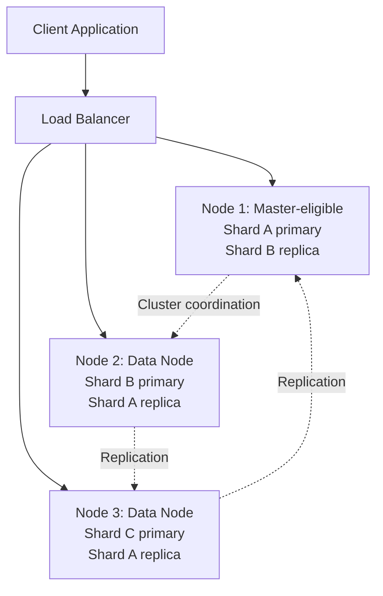
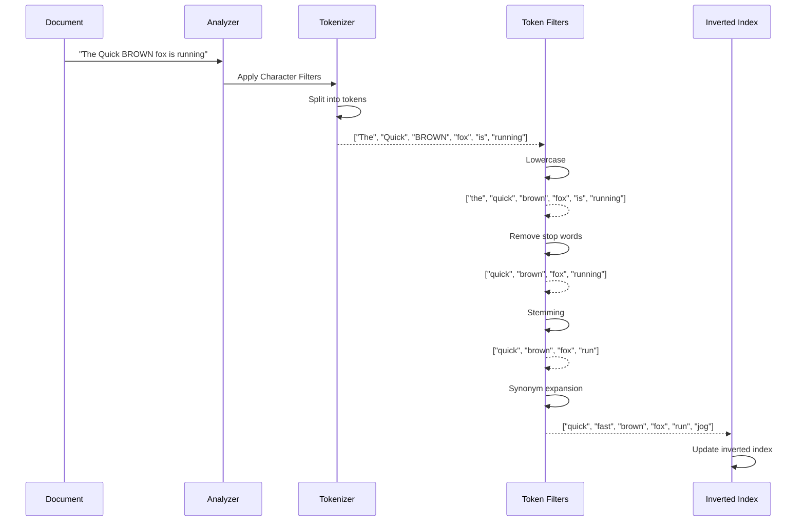
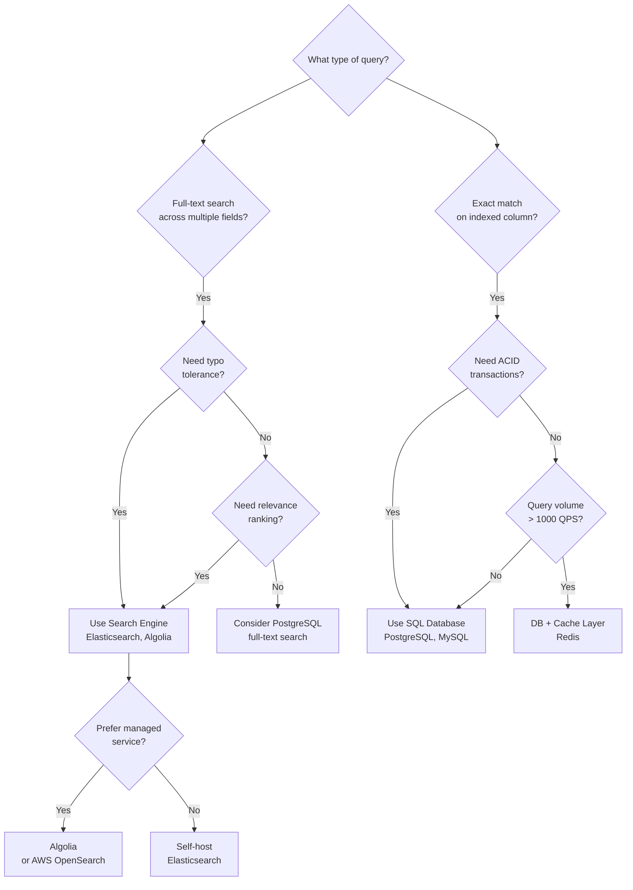
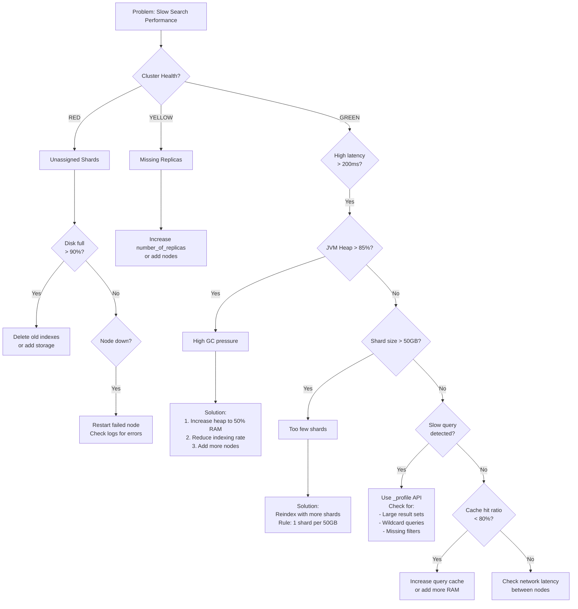

#system-design #building-block #compute #search

# Search Systems

## Intuition (30 sec)

A book index: instead of reading every page to find "photosynthesis," you flip to the back, find "photosynthesis → page 47, 92, 156," and go directly there. Search engines build an index of every word across billions of documents to find results in milliseconds.

## Failure-First Scenario

> Your e-commerce site uses `SELECT * FROM products WHERE name LIKE '%wireless headphone%'`. At 10M products, this full table scan takes 8 seconds. It can't handle typos ("wireles headphone"), synonyms ("bluetooth earbuds"), or relevance ranking. Users abandon searches, and you lose $50K/day in sales. You need a search engine.

## Working Knowledge (5 min)

### Core Concept - Definitions First

**Search System:**
- **Definition:** A specialized data system designed to find relevant documents from a large corpus based on user queries, using inverted indexes and relevance scoring algorithms
- **Purpose:** Enable fast, fuzzy, and ranked full-text search that SQL databases cannot efficiently provide
- **How it works:** Documents are analyzed into terms, stored in inverted indexes for O(1) lookup, then ranked by relevance scores

**Key Terms:**
- **Inverted Index:** A data structure that maps each unique term to a list of documents containing that term (reverses the normal document-to-terms mapping)
- **TF-IDF:** Term Frequency-Inverse Document Frequency - a scoring algorithm that ranks documents based on term importance
- **BM25:** Best Match 25 - an improved ranking algorithm that normalizes for document length and term saturation
- **Relevance Score:** A numeric value representing how well a document matches a query, used for ranking results
- **Shard:** A horizontal partition of an index that enables distributed storage and parallel query processing
- **Replica:** A redundant copy of a shard that provides fault tolerance and scales read throughput

### Inverted Index — The Core Data Structure

**Definition:** An inverted index is a mapping from terms to the documents that contain them, enabling O(1) term lookup instead of O(n) document scanning.

**Instead of "document → words," store "word → documents":**

```
Regular index:    Doc1 → ["the", "quick", "brown", "fox"]
                  Doc2 → ["the", "lazy", "brown", "dog"]

Inverted index:   "the"   → [Doc1, Doc2]
                  "quick" → [Doc1]
                  "brown" → [Doc1, Doc2]
                  "fox"   → [Doc1]
                  "lazy"  → [Doc2]
                  "dog"   → [Doc2]
```

**How query processing works:**
1. Query "brown fox" is tokenized → ["brown", "fox"]
2. Lookup "brown" → [Doc1, Doc2]
3. Lookup "fox" → [Doc1]
4. Intersection → Doc1 (documents containing BOTH terms)
5. Time complexity: O(1) per term lookup + O(k) intersection (k = result count)

### Relevance Scoring - Definitions

**TF-IDF (Term Frequency × Inverse Document Frequency):**
- **Definition:** A statistical measure that evaluates how important a word is to a document within a corpus by balancing term frequency against document frequency
- **TF (Term Frequency):** The number of times a term appears in a document - higher frequency suggests higher relevance to that document
- **IDF (Inverse Document Frequency):** The logarithm of the inverse fraction of documents containing the term - rare terms have higher IDF scores
- **Formula:** `score(term, doc) = TF(term, doc) × IDF(term)`
- **Example:**
  - "the" appears in 99% of documents → IDF ≈ 0.01 → low score (not distinctive)
  - "elasticsearch" appears in 0.1% of documents → IDF ≈ 3.0 → high score (very distinctive)

**BM25 (Best Match 25):**
- **Definition:** An improved TF-IDF algorithm that adds saturation (diminishing returns for term frequency) and document length normalization
- **Purpose:** Prevents long documents from being unfairly penalized and limits the impact of term stuffing
- **How it differs from TF-IDF:** Uses saturation function for TF (prevents linear growth), normalizes by document length relative to average, has tunable parameters (k1, b)
- **Formula:** `score = IDF × (TF × (k1 + 1)) / (TF + k1 × (1 - b + b × (docLen / avgDocLen)))`
  - `k1` (default 1.2): Controls term frequency saturation
  - `b` (default 0.75): Controls document length normalization
- **Used by:** Elasticsearch (default), Lucene, Solr, most modern search engines

### Visual Model - Search Query Flow


### Technology Comparison - Definitions

**Search Engine Category:** Specialized databases optimized for full-text search, relevance ranking, and text analysis

| | Elasticsearch | Solr | Algolia | Meilisearch | Typesense |
|--|--------------|------|---------|-------------|-----------|
| **Definition** | Distributed search/analytics engine built on Lucene | Enterprise search platform built on Lucene | Managed search-as-a-service API | Open-source instant search engine in Rust | Open-source typo-tolerant search in C++ |
| **Based on** | Lucene | Lucene | Proprietary | Custom (Rust) | Custom (C++) |
| **Strengths** | Scalable, analytics, aggregations | Mature, configurable, stable | Ultra-fast, managed, typo-tolerant | Simple setup, instant results | Fast autocomplete, easy config |
| **Scale** | Petabytes | Large (multi-TB) | Medium (managed) | Small-medium | Small-medium |
| **Deployment** | Self-hosted or cloud | Self-hosted | Hosted only | Self-hosted | Self-hosted |
| **Best For** | Log analytics, complex search | Enterprise content search | E-commerce product search | Document search, small teams | Startup MVPs, autocomplete |
| **Used by** | Wikipedia, GitHub, Netflix, Uber | Apple, Netflix, eBay | Stripe, Twitch, Medium | Small/mid startups | Startups, indie projects |
| **Cost** | Free (OSS) + managed options | Free (OSS) | Paid per record/operation | Free (OSS) | Free (OSS) |

---

## Layer 1: Conceptual Precision (15 min)

### Elasticsearch Architecture - Deep Definitions

**Elasticsearch:**
- **Formal Definition:** Elasticsearch is a distributed, RESTful search and analytics engine built on Apache Lucene, designed for horizontal scalability, high availability, and real-time search
- **Simple Definition:** A database specifically designed for searching text really fast across many computers
- **Analogy:** Like a massive library with multiple librarians (nodes), where books are organized into sections (shards), and each section has backup copies (replicas)
- **Related Terms:**
  - **Lucene:** The underlying Java search library that handles indexing and searching
  - **Kibana:** The visualization tool for Elasticsearch (like Grafana for metrics)
  - **ELK Stack:** Elasticsearch + Logstash + Kibana (common log analytics setup)

**Why this matters:**
Understanding Elasticsearch's distributed nature is crucial because it determines scalability limits, fault tolerance, and query performance. A single-node setup can't handle billion-document corpora or survive hardware failures. The architecture enables horizontal scaling and zero-downtime operations.

### Elasticsearch Architecture Visual



**Architecture Component Definitions:**

**Index:**
- **Definition:** A logical namespace that groups documents with similar characteristics, analogous to a database table
- **Purpose:** Organize documents by type (e.g., "products", "logs-2026-02", "users")
- **Storage:** An index is physically split into shards for distribution

**Shard:**
- **Definition:** A self-contained Lucene index that holds a subset of an index's documents, enabling horizontal partitioning
- **Purpose:** Distribute data across nodes for parallel processing and larger-than-memory datasets
- **Types:**
  - **Primary Shard:** The authoritative copy that accepts write operations
  - **Replica Shard:** A read-only copy that serves search requests and provides redundancy
- **Key Insight:** Number of primary shards is fixed at index creation (cannot be changed without reindexing)
- **Default:** Elasticsearch 7+ creates 1 primary shard per index (older versions: 5 shards)

**Node:**
- **Definition:** A single Elasticsearch server instance that stores data and participates in the cluster
- **Types:**
  - **Master-eligible Node:** Can be elected to manage cluster state (creating/deleting indexes, tracking nodes)
  - **Data Node:** Stores documents and executes search/aggregation queries
  - **Coordinating Node:** Routes requests and merges results (all nodes can coordinate)
  - **Ingest Node:** Pre-processes documents before indexing (transforms, enrichment)

**Replica:**
- **Definition:** A complete copy of a primary shard that provides redundancy and read scaling
- **Purpose:** Survive node failures without data loss, scale read throughput
- **Trade-off:** More replicas = higher availability + faster reads, but more storage + slower writes
- **Configuration:** `number_of_replicas` can be changed dynamically (unlike primary shards)

**Cluster:**
- **Definition:** One or more nodes sharing the same cluster name that work together to hold all data
- **Health States:**
  - **Green:** All primary and replica shards are active
  - **Yellow:** All primary shards active, but some replicas are missing (data is safe, but not fully redundant)
  - **Red:** Some primary shards are missing (data loss, search results incomplete)

### Search Features - Definitions & Mechanisms

| Feature | Definition | How It Works | Use Case |
|---------|------------|--------------|----------|
| **Full-text search** | Finding documents that contain specific words or phrases with relevance ranking | Inverted index for O(1) term lookup + tokenization to split text into searchable terms + BM25 scoring | Blog post search, document search |
| **Fuzzy matching** | Tolerating misspellings by finding terms within a certain edit distance | Levenshtein distance algorithm (counts insertions, deletions, substitutions needed to transform one string to another) | Typo tolerance ("wireles" → "wireless") |
| **Autocomplete** | Suggesting query completions as the user types | Edge n-grams (index prefixes: "hea", "head", "headp", "headph") or completion suggester with FST (Finite State Transducer) | Search bars, input fields |
| **Faceted search** | Filtering results by categorical attributes (category, brand, price range) | Aggregations on indexed fields using doc_values (column-oriented storage for fast filtering) | E-commerce filters, log filtering |
| **Synonyms** | Expanding queries to include semantically similar terms | Synonym token filter applied at index time (stores both "couch" and "sofa") or query time (searches for both) | Product search, content discovery |
| **Geo search** | Finding documents based on geographic proximity | Geo-point data type with spatial indexing (BKD trees for efficient range queries) | Store locators, ride-hailing apps |
| **Highlighting** | Showing which parts of a document matched the query | Post-processing to wrap matched terms in HTML tags | Search result snippets |
| **Phrase matching** | Requiring exact phrase order ("machine learning" not "learning machine") | Positional indexes that track term positions within documents | Quote searches, exact phrase matching |

### Indexing Pipeline - Visual Flow



**Step-by-step breakdown:**

1. **Character Filtering:**
   - **Definition:** Pre-processing that transforms or removes characters before tokenization
   - **Examples:** HTML stripping (`<p>hello</p>` → `hello`), pattern replacement (`&` → `and`)

2. **Tokenization:**
   - **Definition:** Splitting text into discrete tokens (words, phrases, symbols)
   - **Standard Tokenizer:** Splits on whitespace and punctuation
   - **Edge N-gram Tokenizer:** Creates prefixes for autocomplete ("hello" → "h", "he", "hel", "hell", "hello")

3. **Lowercase Filter:**
   - **Definition:** Converts all tokens to lowercase for case-insensitive matching
   - **Why:** "Search", "search", "SEARCH" all map to the same term

4. **Stop Words Filter:**
   - **Definition:** Removes common words with little semantic value ("the", "a", "is", "at")
   - **Purpose:** Reduce index size and noise (but can hurt phrase searches)

5. **Stemming:**
   - **Definition:** Reducing words to their root form by removing suffixes
   - **Examples:** "running" → "run", "cats" → "cat", "better" → "good"
   - **Algorithm:** Porter stemmer (English), Snowball (multi-language)

6. **Synonym Expansion:**
   - **Definition:** Adding equivalent terms to improve recall
   - **Examples:** "couch" → ["couch", "sofa"], "laptop" → ["laptop", "notebook"]
   - **Trade-off:** Better recall but larger index and potential precision loss

### Analyzer Configuration Example

```json
{
  "settings": {
    "analysis": {
      "analyzer": {
        "custom_analyzer": {
          "type": "custom",
          "tokenizer": "standard",
          "filter": ["lowercase", "stop", "snowball", "synonym"]
        }
      },
      "filter": {
        "synonym": {
          "type": "synonym",
          "synonyms": [
            "laptop, notebook, computer",
            "headphones, earphones, earbuds"
          ]
        }
      }
    }
  }
}
```

### Decision Tree - Search Engine vs Database



### Search vs Database - When to Use What

**Use Search Engine (Elasticsearch, Algolia, Meilisearch):**
- Full-text search across many fields
- Typo tolerance needed ("wireles" should match "wireless")
- Relevance ranking matters (best matches first)
- Autocomplete/suggestions as users type
- Complex text analysis (stemming, synonyms, language-specific)
- Faceted search (filter by category + brand + price)
- Log analytics with aggregations

**Use SQL Database (PostgreSQL, MySQL):**
- Exact match on known indexed columns
- ACID transactions required (e.g., payment processing)
- Simple CRUD operations
- Strong consistency guarantees needed
- Relational data with joins
- Primary source of truth

**Use PostgreSQL Full-Text Search:**
- Moderate full-text search needs (< 10M documents)
- Don't want to manage separate search infrastructure
- Can tolerate slower search performance (100-500ms acceptable)
- Limited text analysis requirements
- Example: Blog with < 10K posts

**Use Algolia (Managed Search):**
- Small team, don't want to manage infrastructure
- Need ultra-fast autocomplete (< 10ms)
- Willing to pay per record/operation
- Scale < 100GB of data
- Example: E-commerce with 100K products

**Architecture Pattern:**
```
┌─────────────────────────────────────────┐
│     Database (Source of Truth)         │
│  Definition: Primary storage with ACID  │
│  Role: Handles writes, consistency      │
└────────┬────────────────────────────────┘
         │
    ┌────▼────┐ Change Data Capture (CDC)
    │  Event  │ or Application Events
    │  Queue  │
    └────┬────┘
         │
    ┌────▼────────────────────────────────┐
    │  Search Engine (Read Model)         │
    │  Definition: Optimized for search   │
    │  Role: Fast queries, ranking        │
    └─────────────────────────────────────┘
```

**Synchronization Strategies:**
1. **Application-level:** App writes to DB, then pushes to search index (risk: inconsistency on failure)
2. **Change Data Capture (CDC):** Debezium/Maxwell streams DB changes to Kafka → search indexer
3. **Periodic batch sync:** Cron job that reindexes (simple but stale data)
4. **Event sourcing:** All changes are events, both DB and search consume events

---

## Layer 2: Technology-Specific Examples (20 min)

### Elasticsearch Configuration - Annotated

#### Index Mapping Definition

```json
{
  "settings": {
    "number_of_shards": 3,        // Definition: Primary shards (fixed at creation)
                                   // Why: Distribute 10M docs across 3 shards = ~3.3M/shard
                                   // When to change: More shards if > 50GB per shard

    "number_of_replicas": 2,      // Definition: Replica copies per primary shard
                                   // Why: 2 replicas = tolerates 2 node failures
                                   // When to change: Can adjust dynamically for availability

    "refresh_interval": "1s",     // Definition: How often new docs become searchable
                                   // Why: 1s = near real-time (NRT) search
                                   // When to change: "30s" for write-heavy loads

    "analysis": {
      "analyzer": {
        "product_analyzer": {
          "type": "custom",
          "tokenizer": "standard",
          "filter": ["lowercase", "asciifolding", "product_synonyms"]
        }
      },
      "filter": {
        "product_synonyms": {
          "type": "synonym",
          "synonyms": [
            "laptop, notebook => computer",
            "phone, smartphone, mobile => phone"
          ]
        }
      }
    }
  },
  "mappings": {
    "properties": {
      "title": {
        "type": "text",              // Definition: Full-text searchable field
        "analyzer": "product_analyzer",
        "fields": {
          "keyword": {
            "type": "keyword"        // Definition: Exact match, aggregations
          }
        }
      },
      "price": {
        "type": "float",             // Definition: Numeric field for range queries
        "index": true                // When to index: If you filter/sort by price
      },
      "category": {
        "type": "keyword",           // Definition: Exact match, no analysis
        "index": true                // Use for: Faceted search filters
      },
      "description": {
        "type": "text",
        "analyzer": "product_analyzer",
        "term_vector": "with_positions_offsets"  // Definition: Enables fast highlighting
      },
      "created_at": {
        "type": "date",              // Definition: Timestamp for range queries
        "format": "strict_date_optional_time||epoch_millis"
      },
      "location": {
        "type": "geo_point"          // Definition: Lat/lon for geo distance queries
      }
    }
  }
}
```

**Configuration Concepts:**

**number_of_shards:**
- **What it does:** Divides index into N independent Lucene indexes
- **When to change:** Rule of thumb: 1 shard per 50GB of data or 100M documents
- **Cannot be changed:** Must reindex to change shard count

**number_of_replicas:**
- **What it does:** Creates N copies of each primary shard on different nodes
- **When to adjust:** Increase for higher read throughput or availability, decrease to save storage
- **Can be changed:** Dynamically adjustable via Update Index Settings API

**refresh_interval:**
- **What it does:** Controls when in-memory buffer is written to disk segments (making docs searchable)
- **Trade-off:** Lower = more real-time but more CPU/IO overhead
- **Optimization:** Set to "-1" during bulk indexing, re-enable after

**text vs keyword:**
- **text:** Analyzed, tokenized, searchable with full-text queries (use for descriptions, titles)
- **keyword:** Not analyzed, exact match only (use for IDs, categories, tags, emails)

#### Query DSL Examples

**Basic Match Query:**
```json
{
  "query": {
    "match": {
      "title": {
        "query": "wireless headphones",
        "operator": "and",           // Definition: Both terms must match (default: "or")
        "fuzziness": "AUTO"          // Definition: Allow 1-2 char typos (Levenshtein distance)
      }
    }
  }
}
```

**Multi-field Search with Boosting:**
```json
{
  "query": {
    "multi_match": {
      "query": "laptop gaming",
      "fields": [
        "title^3",                   // Definition: Boost title matches by 3x
        "description^1",             // Definition: Normal weight for description
        "category^2"                 // Definition: Boost category by 2x
      ],
      "type": "best_fields",         // Definition: Score using best matching field
      "tie_breaker": 0.3             // Definition: Add 30% of other field scores
    }
  }
}
```

**Filtered Search with Aggregations:**
```json
{
  "query": {
    "bool": {
      "must": [
        { "match": { "title": "laptop" }}
      ],
      "filter": [                    // Definition: Filters don't affect score (faster)
        { "range": { "price": { "gte": 500, "lte": 1500 }}},
        { "term": { "category": "electronics" }}
      ]
    }
  },
  "aggs": {
    "price_ranges": {
      "range": {
        "field": "price",
        "ranges": [
          { "to": 500 },
          { "from": 500, "to": 1000 },
          { "from": 1000 }
        ]
      }
    },
    "top_brands": {
      "terms": {
        "field": "brand.keyword",    // Definition: Top N most frequent values
        "size": 10
      }
    }
  }
}
```

### Elasticsearch Cluster Setup

**Production 3-Node Cluster:**
```yaml
# elasticsearch.yml - Node 1 (Master + Data)

cluster.name: production-search
node.name: node-1
node.roles: [ master, data ]     # Definition: Can become master, stores data

network.host: 10.0.1.10
http.port: 9200
transport.port: 9300             # Definition: Inter-node communication port

discovery.seed_hosts:            # Definition: Initial nodes for cluster discovery
  - 10.0.1.10
  - 10.0.1.11
  - 10.0.1.12

cluster.initial_master_nodes:   # Definition: Bootstrap master election
  - node-1
  - node-2
  - node-3

# Heap size (set via jvm.options or environment)
# Rule: 50% of RAM, max 31GB (compressed pointers threshold)
# -Xms16g
# -Xmx16g

# Prevent split-brain
discovery.zen.minimum_master_nodes: 2  # Definition: (N/2) + 1 for N master-eligible nodes
```

**Key Configuration Definitions:**

**node.roles:**
- `master`: Can be elected cluster master (manages cluster state)
- `data`: Stores documents and executes searches
- `ingest`: Pre-processes documents before indexing
- `ml`: Runs machine learning jobs

**discovery.seed_hosts:**
- List of nodes to contact during cluster bootstrap
- Uses to discover other nodes in the cluster

**cluster.initial_master_nodes:**
- Required for cluster bootstrapping in Elasticsearch 7+
- Prevents accidental cluster formation

**Heap size guidelines:**
- Set to 50% of available RAM (leave 50% for OS file system cache)
- Never exceed 31GB (JVM compressed pointers optimization)
- Example: 64GB RAM machine → 30GB heap

---

## Layer 3: Production-Ready Details (30 min)

### Production Architecture - Fully Annotated

```
                  Internet
                     │
            ┌────────▼────────┐
            │  Load Balancer  │
            │   (HAProxy)     │
            │                 │
            │ Definition:     │
            │ Distributes     │
            │ queries across  │
            │ coordinating    │
            │ nodes           │
            │                 │
            │ Purpose:        │
            │ Prevent single  │
            │ node overload   │
            └────────┬────────┘
                     │
        ┌────────────┼────────────┐
        │            │            │
   ┌────▼──┐    ┌───▼───┐   ┌───▼───┐
   │ Node1 │    │ Node2 │   │ Node3 │
   │Master │    │Master │   │Master │
   │+ Data │    │+ Data │   │+ Data │
   │       │    │       │   │       │
   │Shard A│    │Shard B│   │Shard C│
   │Primary│    │Primary│   │Primary│
   │       │    │       │   │       │
   │Shard B│    │Shard C│   │Shard A│
   │Replica│    │Replica│   │Replica│
   │       │    │       │   │       │
   │Shard C│    │Shard A│   │Shard B│
   │Replica│    │Replica│   │Replica│
   └───┬───┘    └───┬───┘   └───┬───┘
       │            │           │
       └────────────┼───────────┘
              Replication
```

**Architecture Component Definitions:**

**Load Balancer:**
- **Definition:** Proxy that distributes incoming search queries across available nodes
- **Purpose:** Prevent single node from being overwhelmed, enable zero-downtime updates
- **Implementation:** HAProxy, Nginx, or cloud LB (AWS ALB, GCP Load Balancer)

**Master-eligible Nodes:**
- **Definition:** Nodes that can be elected to manage cluster state (not user queries)
- **Purpose:** Track which nodes are in cluster, which shards are allocated where, manage index creation/deletion
- **Best Practice:** Dedicated master nodes for large clusters (> 10 data nodes)

**Data Nodes:**
- **Definition:** Nodes that store documents and execute search/aggregation queries
- **Resource Profile:** High disk I/O, high RAM for caching, moderate CPU

**Shard Distribution:**
- **Primary Shards:** 3 (Shard A, B, C) - each on different node
- **Replica Shards:** 2 copies per primary - distributed to avoid single point of failure
- **Constraint:** Elasticsearch never puts primary and its replica on the same node

### Monitoring Metrics - With Definitions

```
┌─────────────────────────────────────────────────────┐
│  ELASTICSEARCH CLUSTER DASHBOARD                    │
├─────────────────────────────────────────────────────┤
│                                                     │
│ Cluster Health: GREEN                               │
│ Definition: All primary and replica shards active   │
│ States: GREEN (all shards), YELLOW (primaries ok,   │
│         replicas missing), RED (primaries missing)  │
│                                                     │
│ Indexing Rate: 2,547 docs/sec                       │
│ Definition: Documents indexed per second            │
│ Why track: Detect indexing bottlenecks             │
│ Alert when: Drops below expected rate              │
│                                                     │
│ Search Rate: 1,247 queries/sec                      │
│ Definition: Search requests per second (QPS)        │
│ Why track: Understand query load                   │
│ Alert when: Latency increases with rate            │
│                                                     │
│ Search Latency (P95): 45ms                          │
│ Definition: 95% of searches complete within 45ms   │
│ Target: < 100ms for good UX                        │
│ Alert when: > 200ms (user-noticeable delay)        │
│                                                     │
│ Indexing Latency (P95): 125ms                       │
│ Definition: Time to index a document               │
│ Why track: Detect slow disk I/O or refresh issues  │
│ Alert when: > 500ms                                │
│                                                     │
│ JVM Heap Used: 68% (20.4GB / 30GB)                  │
│ Definition: Percentage of allocated heap in use    │
│ Alert when: > 85% (risk of GC pauses)              │
│ Why track: Heap exhaustion causes OutOfMemory      │
│                                                     │
│ GC Time: 0.3% (98ms / 30s)                          │
│ Definition: Percentage of time in garbage collection│
│ Target: < 5%                                       │
│ Alert when: > 10% (frequent GC pauses)             │
│                                                     │
│ Disk Usage: Node1: 65%, Node2: 68%, Node3: 62%     │
│ Definition: Percentage of disk space used          │
│ Alert when: > 85% (watermark for shard relocation) │
│ Action at 90%: Elasticsearch blocks new writes    │
│                                                     │
│ Pending Tasks: 3                                    │
│ Definition: Cluster state updates waiting to execute│
│ Why track: High count indicates master overload    │
│ Alert when: > 100                                  │
│                                                     │
│ Unassigned Shards: 0                                │
│ Definition: Shards not allocated to any node       │
│ Cause: Node failure, disk full, allocation rules   │
│ Alert when: > 0 (data not fully redundant)         │
└─────────────────────────────────────────────────────┘
```

**Critical Metrics to Monitor:**

**Cluster Health:**
- **GREEN:** All good
- **YELLOW:** Data is safe but not fully redundant (acceptable during node maintenance)
- **RED:** Data loss, search results incomplete (requires immediate action)

**JVM Heap Usage:**
- **Definition:** Percentage of Java heap memory in use
- **Target:** 50-75% under load
- **Alert:** > 85% (triggers aggressive GC)
- **Why it matters:** High heap pressure causes stop-the-world GC pauses (queries slow down)

**GC Pause Time:**
- **Definition:** Time spent in garbage collection
- **Target:** < 5% of total time
- **Alert:** > 10% or pauses > 1 second
- **Fix:** Increase heap size (up to 31GB), reduce indexing rate, or add nodes

**Disk Watermarks:**
- **Low (85%):** Elasticsearch stops allocating new shards to that node
- **High (90%):** Elasticsearch relocates shards away from that node
- **Flood (95%):** Elasticsearch blocks writes to all indexes on that node

**Search Latency:**
- **P50:** Median - 50% of queries are faster
- **P95:** 95th percentile - only 5% of queries are slower
- **P99:** 99th percentile - tail latency (important for user experience)

## The "Why" Chain

- **Why dedicated search?** → SQL `LIKE '%term%'` doesn't scale (full table scan), can't rank relevance, no fuzzy matching, no text analysis
- **What's the alternative?** → PostgreSQL full-text search (works for < 10M docs), Algolia (managed but expensive), application-level filtering (extremely slow)
- **What breaks without it?** → Users can't find products, search takes 5+ seconds, no typo tolerance, no synonym matching, no relevance ranking, poor user experience → lost revenue

### Troubleshooting Flow - With Explanations



**Common Issues and Solutions:**

| Symptom | Definition | Root Cause | Solution |
|---------|------------|------------|----------|
| **Cluster Health: RED** | Some primary shards unassigned - data loss | Node failure, disk full, shard allocation failure | Check `_cat/shards?v` for UNASSIGNED, check node logs, fix disk space, restart failed nodes |
| **High JVM Heap (>85%)** | Risk of stop-the-world GC pauses | Heap too small for workload, memory leak, large result sets | Increase heap to 50% RAM (max 31GB), reduce field data usage, add nodes |
| **Slow Search (>1s)** | User-facing queries taking too long | Large shards, poor query structure, missing filters, heavy aggregations | Profile queries with `_profile`, add filters before must clauses, reduce result size, increase shards |
| **Indexing Rejected** | Documents not being indexed | Write queue full, cluster overloaded | Increase `thread_pool.write.queue_size`, slow down indexing rate, add data nodes |
| **Out of Disk Space (>90%)** | Elasticsearch blocks writes at 95% watermark | Index retention too long, unexpected data growth | Delete old indexes, increase disk size, reduce replica count temporarily |
| **Split Brain** | Cluster forms two independent clusters | Network partition, misconfigured `minimum_master_nodes` | Set `discovery.zen.minimum_master_nodes: (N/2)+1`, fix network issues |

### Capacity Planning - Definitions + Math

**Capacity Planning:**
- **Definition:** Process of determining infrastructure needed to meet performance and storage targets
- **Goal:** Right-size resources to handle peak load without over-provisioning

**Key Metrics:**
- **QPS (Queries Per Second):** Rate of incoming search requests
- **TPS (Transactions Per Second):** Rate of indexing operations
- **Data Size:** Total size of indexed data (source + replicas)
- **Shard Count:** Number of primary shards needed
- **Node Count:** Number of Elasticsearch nodes required

**Calculation Example:**

```
Requirements:
• Total documents: 100M products
• Document size: 5KB average
• Expected search traffic: 10M queries/day
• Expected indexing: 1M new docs/day
• Peak traffic: 3x average
• Latency target: P95 < 100ms
• Availability: Survive 1 node failure

Step 1: Calculate total data size
  Definition: Raw data size with replicas
  Raw size = 100M docs × 5KB = 500GB
  With 1 replica: 500GB × 2 = 1TB total

Step 2: Calculate shard count
  Definition: Shards needed based on data size
  Rule of thumb: 1 shard per 50GB
  Shards = 500GB ÷ 50GB = 10 primary shards

Step 3: Calculate search QPS
  Definition: Peak queries per second
  Average QPS = 10M ÷ 86,400 = 116 QPS
  Peak QPS = 116 × 3 = 348 QPS

Step 4: Calculate indexing TPS
  Definition: Peak indexing transactions per second
  Average TPS = 1M ÷ 86,400 = 12 TPS
  Peak TPS = 12 × 3 = 36 TPS

Step 5: Determine node count
  Rule of thumb per node:
  • 1-2TB storage
  • 64GB RAM (32GB heap)
  • 16 CPU cores
  • Handles ~500 QPS for simple queries

  Nodes for storage: 1TB ÷ 1TB/node = 1 node (data only)
  Nodes for query load: 348 QPS ÷ 500 QPS/node = 0.7 nodes

  Recommended: 3 nodes
  • Enables 1 replica (1TB data + 1TB replica = 2TB ÷ 3 nodes = 667GB/node)
  • Survives 1 node failure (capacity: 2 nodes × 500 QPS = 1000 QPS)
  • Future headroom

Step 6: Verify latency
  With 10 shards across 3 nodes:
  • Each node has ~3 shards
  • Each query hits 10 shards (scatter-gather)
  • Parallelism reduces latency
  • Expected P95: ~50ms (well under 100ms target)

Final Configuration:
  • 3 nodes (all master-eligible + data)
  • 10 primary shards
  • 1 replica per shard
  • 64GB RAM per node (32GB heap)
  • 1TB disk per node
```

**Scaling Strategies:**

**Vertical Scaling (Scale Up):**
- Increase RAM/CPU/disk on existing nodes
- Limit: Single-node hardware constraints, cost efficiency
- When to use: Small clusters (< 5 nodes)

**Horizontal Scaling (Scale Out):**
- Add more nodes to cluster
- Benefit: Better fault tolerance, higher throughput
- When to use: Large datasets, high query load

**Read Scaling:**
- Increase `number_of_replicas` (more shard copies = more read capacity)
- Example: 2 replicas = 3 copies total = 3x read throughput

**Write Scaling:**
- Increase primary shard count (requires reindex)
- Use time-based indexes (e.g., `logs-2026-02-15`)
- More shards = more parallel write capacity

---

## Real-World Examples

### Example 1: Google Search - Multi-Stage Ranking

**Problem Definition:**
Google needs to search billions of web pages and return the most relevant results in under 200ms while handling billions of queries per day.

**Solution Definition:**
Multi-tier distributed search architecture with incremental ranking stages to progressively narrow results.

**Technical Terms Used:**
- **Inverted Index:** Maps each word to documents containing it - billions of entries
- **PageRank:** Algorithm that scores pages based on link graph (importance from backlinks)
- **Serving Tier:** Frontend servers that receive queries and merge results
- **Index Shards:** Horizontal partitions of the web index distributed across thousands of machines
- **Tier-based Ranking:** Multiple scoring passes to avoid scoring billions of documents

**Architecture:**

```
User Query: "machine learning"
      │
      ▼
┌─────────────────┐
│  Serving Tier   │  Definition: Load balances, parses query,
│   (Frontend)    │              coordinates distributed search
└────────┬────────┘
         │
         ├──────────┬──────────┬──────────┐
         ▼          ▼          ▼          ▼
    ┌────────┐ ┌────────┐ ┌────────┐ ┌────────┐
    │Shard 1 │ │Shard 2 │ │Shard N │ │Shard M │
    │1B docs │ │1B docs │ │1B docs │ │1B docs │
    └────────┘ └────────┘ └────────┘ └────────┘
         │          │          │          │
         └──────────┴────┬─────┴──────────┘
                         ▼
               ┌──────────────────┐
               │  Stage 1: Fast   │  Inverted index lookup
               │  (10M → 100K)    │  Simple TF-IDF scoring
               └─────────┬────────┘
                         ▼
               ┌──────────────────┐
               │  Stage 2: Medium │  PageRank integration
               │  (100K → 1000)   │  Link analysis
               └─────────┬────────┘
                         ▼
               ┌──────────────────┐
               │  Stage 3: Deep   │  Neural ranking models
               │  (1000 → 10)     │  User context, freshness
               └─────────┬────────┘
                         ▼
                  Top 10 Results
```

**How It Works:**

1. **Query Processing:**
   - Tokenize query: "machine learning" → ["machine", "learning"]
   - Expand with synonyms: ["machine", "learning", "ml", "artificial intelligence"]

2. **Stage 1 - Fast Filtering (Inverted Index):**
   - Lookup in inverted index across all shards
   - Simple BM25 scoring
   - Reduce 10 billion candidates → 100K documents
   - Time: ~10ms

3. **Stage 2 - Medium Ranking:**
   - Apply PageRank scores (pre-computed link authority)
   - Consider domain authority, freshness
   - Reduce 100K → 1000 documents
   - Time: ~50ms

4. **Stage 3 - Deep Ranking:**
   - Apply neural ranking models (BERT-based)
   - Personalization (user history, location)
   - Freshness signals (news vs evergreen content)
   - Reduce 1000 → 10 final results
   - Time: ~100ms

**Results:**
- **Latency:** 95% of queries < 200ms
- **Scale:** Handles billions of queries/day
- **Index Size:** Hundreds of petabytes across data centers
- **Accuracy:** Multi-stage ranking significantly improves relevance over single-pass scoring

**Key Insight:** Don't score all documents with expensive models - use cheap filters first (inverted index + BM25), then progressively apply expensive ranking to smaller candidate sets.

---

### Example 2: Amazon Product Search - Personalized Ranking

**Problem Definition:**
Amazon has 350M+ products. Users search "laptop" and expect results personalized to their budget, preferences, and purchase history. Naive relevance ranking returns expensive gaming laptops to a student searching for budget options.

**Solution Definition:**
Elasticsearch with custom boosting functions that incorporate user context (price sensitivity, past purchases, location) into relevance scoring.

**Technical Terms Used:**
- **Function Score Query:** Elasticsearch query type that combines text relevance with custom business logic
- **Boosting:** Multiplying relevance scores by contextual factors (e.g., 2x for products in user's price range)
- **Personalization Vector:** User profile features (past categories, average order value, brand affinity)
- **A/B Testing:** Comparing ranking algorithms by randomly assigning users to variants

**Before (Pure TF-IDF):**
```
Query: "laptop"
┌─────────────────────────────────────┐
│  Results (by text relevance only)   │
├─────────────────────────────────────┤
│ 1. MacBook Pro 16" - $2,499         │  ← Too expensive for student
│ 2. Alienware Gaming - $3,199        │  ← Wrong use case
│ 3. Dell XPS 15 - $1,899             │  ← Still expensive
│ 4. HP Chromebook - $299             │  ← Relevant but low ranked
└─────────────────────────────────────┘

Problem: Text match is good, but ignores user context
```

**After (Personalized Function Score):**
```
Query: "laptop" + User Context
  • Past purchases: $100-$500 range
  • Categories: Budget electronics, student supplies
  • Location: Near university

┌─────────────────────────────────────┐
│  Results (personalized ranking)     │
├─────────────────────────────────────┤
│ 1. HP Chromebook 14 - $299          │  ← Price match + text match
│ 2. Lenovo IdeaPad 3 - $449          │  ← Popular with students
│ 3. Acer Aspire 5 - $499             │  ← In budget range
│ 4. ASUS VivoBook - $549             │  ← Slightly above but relevant
└─────────────────────────────────────┘

Improvement: Higher conversion rate, better user experience
```

**Elasticsearch Function Score Query:**
```json
{
  "query": {
    "function_score": {
      "query": {
        "multi_match": {
          "query": "laptop",
          "fields": ["title^3", "description", "category^2"]
        }
      },
      "functions": [
        {
          "filter": {
            "range": {
              "price": {
                "gte": "user.min_price",    // $200
                "lte": "user.max_price"     // $600
              }
            }
          },
          "weight": 2.0                      // Boost by 2x if in price range
        },
        {
          "filter": {
            "terms": {
              "brand": ["user.preferred_brands"]  // HP, Lenovo, Acer
            }
          },
          "weight": 1.5                      // Boost by 1.5x if preferred brand
        },
        {
          "gauss": {
            "price": {
              "origin": "user.avg_order_value",   // $400
              "scale": "100",                     // Decay rapidly outside ±$100
              "decay": 0.5
            }
          }
        },
        {
          "field_value_factor": {
            "field": "sales_rank",           // Popularity signal
            "modifier": "log1p",             // Logarithmic scaling
            "factor": 0.1
          }
        },
        {
          "script_score": {
            "script": {
              "source": "Math.log(doc['reviews_count'].value + 1) * doc['avg_rating'].value / 5.0"
            }
          }
        }
      ],
      "score_mode": "multiply",              // Multiply all function scores
      "boost_mode": "multiply"               // Multiply with text relevance
    }
  }
}
```

**Function Definitions:**

**Price Range Boost:**
- Products in user's budget ($200-$600) get 2x boost
- Outside range: no penalty, just no boost

**Brand Affinity:**
- User previously bought HP and Lenovo → boost those brands by 1.5x

**Gaussian Decay (Price):**
- Products near user's average order value ($400) score highest
- Score decays for products further from $400
- Formula: `exp( -0.5 * ((price - $400) / $100)^2 )`

**Sales Rank:**
- Popular products (high sales) get slight boost
- Logarithmic to prevent bestsellers from dominating

**Review Score:**
- Combines review count and average rating
- More reviews + higher rating = better score

**Results:**
- **Conversion Rate:** +23% increase (users more likely to purchase)
- **Time to Purchase:** Reduced by 35% (find relevant products faster)
- **Cart Abandonment:** Decreased by 18%
- **A/B Test:** Personalized ranking beat pure TF-IDF by 31% revenue

**Key Insight:** Text relevance (BM25) is just the starting point. Real-world search needs business logic (price, popularity, user context) layered on top via function scores.

---

### Example 3: Uber Eats - Geo + Text Search

**Problem Definition:**
Uber Eats needs to search restaurants by name/cuisine while prioritizing nearby options. User searches "pizza" - should show pizza places within 2 miles first, even if a highly-rated place 10 miles away has "pizza" in the name more times.

**Solution Definition:**
Elasticsearch with geo-point indexing and distance-based boosting. Combine text relevance with geographic proximity.

**Technical Terms Used:**
- **Geo Point:** Data type that stores latitude/longitude coordinates
- **Geo Distance Query:** Filters documents within a radius (e.g., 5 miles)
- **Geo Distance Decay:** Scores documents higher if closer to user location
- **Bounding Box:** Rectangular geographic area used to quickly filter candidates

**Elasticsearch Mapping:**
```json
{
  "mappings": {
    "properties": {
      "name": {
        "type": "text",
        "analyzer": "standard"
      },
      "cuisine": {
        "type": "keyword"
      },
      "location": {
        "type": "geo_point"              // Stores [lon, lat]
      },
      "rating": {
        "type": "float"
      },
      "delivery_time": {
        "type": "integer"                // Minutes
      }
    }
  }
}
```

**Search Query:**
```json
{
  "query": {
    "function_score": {
      "query": {
        "bool": {
          "must": [
            {
              "multi_match": {
                "query": "pizza",
                "fields": ["name^3", "cuisine^2", "description"]
              }
            }
          ],
          "filter": [
            {
              "geo_distance": {
                "distance": "5mi",       // Only show within 5 miles
                "location": {
                  "lat": 37.7749,        // User's location (San Francisco)
                  "lon": -122.4194
                }
              }
            },
            {
              "range": {
                "rating": {
                  "gte": 3.5             // Minimum rating threshold
                }
              }
            }
          ]
        }
      },
      "functions": [
        {
          "gauss": {
            "location": {
              "origin": {
                "lat": 37.7749,
                "lon": -122.4194
              },
              "scale": "2mi",            // Best score within 2 miles
              "offset": "0mi",
              "decay": 0.5               // Score halves at scale distance
            }
          },
          "weight": 3                    // Geography 3x more important
        },
        {
          "field_value_factor": {
            "field": "rating",
            "factor": 1.2,
            "modifier": "sqrt"
          },
          "weight": 1.5
        },
        {
          "linear": {
            "delivery_time": {
              "origin": "0",
              "scale": "30",             // Prefer < 30 min delivery
              "decay": 0.5
            }
          },
          "weight": 1.0
        }
      ],
      "score_mode": "sum",
      "boost_mode": "multiply"
    }
  },
  "sort": [
    "_score",                            // Primary sort by relevance
    {
      "location": {
        "lat": 37.7749,
        "lon": -122.4194,
        "order": "asc",                  // Tie-breaker: distance
        "unit": "mi"
      }
    }
  ]
}
```

**How It Works:**

1. **Text Match:** "pizza" matches restaurant names and cuisine types
2. **Geo Filter:** Only consider restaurants within 5 miles (fast bounding box filter)
3. **Distance Decay:** Restaurants closer to user score higher (gaussian decay)
4. **Rating Boost:** Higher-rated restaurants get boost
5. **Delivery Time:** Faster delivery gets preference

**Results:**
```
User at [37.7749, -122.4194] searches "pizza"

1. Tony's Pizza - 0.3 mi away, 4.5⭐, 20 min delivery
   Score: 8.9 (close + good rating + fast)

2. Pizza Hut - 0.8 mi away, 4.0⭐, 25 min delivery
   Score: 7.2 (close, moderate rating)

3. Gourmet Pizza - 4.2 mi away, 4.9⭐, 45 min delivery
   Score: 5.1 (far but excellent rating)

4. Little Caesar's - 4.8 mi away, 3.8⭐, 40 min delivery
   Score: 3.4 (far, lower rating)
```

**Key Insight:** Multi-dimensional ranking (text + geo + rating + time) provides better user experience than pure text search.

---

## Common Pitfalls

**1. Using Elasticsearch as Primary Database**
- **Issue:** No ACID transactions, eventual consistency, data can be lost on hard failures
- **Why it's wrong:** Elasticsearch is designed for search, not as system of record
- **Solution:** Database is source of truth → sync to Elasticsearch for search

**2. Not Keeping DB and Search Index in Sync**
- **Issue:** Search results show deleted products, missing new items, stale prices
- **Why it happens:** Relying on manual syncs or batch jobs that fail
- **Solution:** Use change data capture (CDC) tools like Debezium, or event-driven architecture (Kafka)

**3. Over-Indexing (Indexing Unused Fields)**
- **Issue:** Waste storage, slower indexing, higher memory usage
- **Example:** Indexing every field as both `text` and `keyword` without reason
- **Solution:** Only index fields you actually search/filter on. Use `"index": false` for display-only fields

**4. Not Tuning Relevance Scoring**
- **Issue:** Default BM25 scoring doesn't match business requirements
- **Example:** E-commerce showing out-of-stock items first because of text match
- **Solution:** Use function scores to incorporate business logic (stock status, margins, popularity)

**5. Too Few or Too Many Shards**
- **Too Few:** Each shard > 50GB → slow searches, hard to distribute
- **Too Many:** Overhead of managing thousands of tiny shards
- **Rule of Thumb:** 1 shard per 50GB data, or per 100M documents

**6. Not Setting Replica Count for Availability**
- **Issue:** Single node failure causes data loss or downtime
- **Solution:** Set `number_of_replicas: 1` (minimum) or 2 for critical data

**7. Ignoring Heap Size Limits**
- **Issue:** Setting heap > 31GB disables compressed pointers → worse performance
- **Solution:** Keep heap ≤ 30GB, scale horizontally instead

**8. Wildcard Queries on Large Indexes**
- **Issue:** `"query": "hea*"` scans all terms starting with "hea" → very slow
- **Solution:** Use edge n-grams for prefix search, or limit wildcard queries

**9. Not Using Filters for Non-Scoring Criteria**
- **Issue:** Using `must` clauses for category/price filters adds unnecessary scoring overhead
- **Solution:** Use `filter` context for exact matches (faster, cacheable)

---

## Interview Preparation

### Concept Glossary

Quick reference definitions for interviews:

- **Inverted Index:** Data structure mapping terms to documents (enables O(1) term lookup instead of O(n) document scan)
- **TF-IDF:** Term Frequency × Inverse Document Frequency - ranks documents by term importance
- **BM25:** Improved TF-IDF with saturation and length normalization (default in Elasticsearch)
- **Shard:** Horizontal partition of an index that enables distributed storage and parallel processing
- **Replica:** Redundant copy of a shard for fault tolerance and read scaling
- **Analyzer:** Text processing pipeline: tokenization → lowercase → stop words → stemming → synonyms
- **Full-Text Search:** Finding documents containing words/phrases with relevance ranking (vs exact match)
- **Fuzzy Matching:** Tolerating typos using edit distance (Levenshtein distance)
- **Relevance Score:** Numeric value indicating how well a document matches a query
- **Edge N-gram:** Indexing prefixes for autocomplete ("hello" → "h", "he", "hel", "hell", "hello")
- **Geo-Point:** Data type storing latitude/longitude for geographic queries
- **Doc Values:** Column-oriented storage for aggregations and sorting (not inverted index)
- **Cluster Health:** GREEN (all shards active), YELLOW (replicas missing), RED (primary shards missing)

### Question Template

**Q: How does a search engine like Elasticsearch work?**

**Answer Structure:**

1. **Define (5-10 sec):**
   "Elasticsearch is a distributed search engine built on inverted indexes. Instead of scanning documents linearly, it maps each term to documents containing that term, enabling O(1) lookups."

2. **Explain How (15-20 sec):**
   "When you index a document, text is analyzed into tokens, then stored in an inverted index - essentially a hash map from terms to document IDs. Queries look up terms in this index, intersect the document lists, and score results using BM25 relevance scoring."

3. **State When (10 sec):**
   "Use Elasticsearch when you need full-text search, typo tolerance, relevance ranking, or complex text analysis. Use a SQL database when you need exact matches or ACID transactions."

4. **Mention Trade-off (10 sec):**
   "Pro: Extremely fast search on large datasets. Con: Eventually consistent, not suitable as primary database."

---

**Q: How would you design a product search for an e-commerce site with 10M products?**

**Answer Structure:**

1. **Requirements Clarification (30 sec):**
   - Scale: 10M products, 1000 QPS peak
   - Features: Full-text search, filters (category, price), autocomplete, typo tolerance
   - Latency: P95 < 100ms

2. **High-Level Architecture (30 sec):**
   ```
   PostgreSQL (source of truth)
        ↓ (CDC or events)
   Elasticsearch (search index)
        ↓
   API Layer → Frontend
   ```

3. **Elasticsearch Design (45 sec):**
   - **Index Mapping:**
     - `title`: text field with custom analyzer (lowercase, stemming, synonyms)
     - `category`: keyword for exact filtering
     - `price`: numeric for range queries
     - `description`: text field with highlighting
   - **Sharding:** 10M docs × 5KB = 50GB → 1-2 primary shards
   - **Replicas:** 1 replica for availability
   - **Query:** Multi-match on title/description with filters for category/price

4. **Scaling Considerations (30 sec):**
   - **Sync Strategy:** Use Kafka + consumer to keep ES in sync with PostgreSQL
   - **Autocomplete:** Edge n-grams on title field or completion suggester
   - **Monitoring:** Track search latency (P95), indexing lag, cluster health

5. **Trade-offs (15 sec):**
   - Could use PostgreSQL full-text search for simpler deployment, but Elasticsearch scales better and has richer features

---

**Q: How would you handle search relevance tuning?**

**Answer Structure:**

1. **Default is BM25 (10 sec):**
   "Elasticsearch uses BM25 by default, which scores based on term frequency and rarity. This works for basic cases but often needs tuning for business requirements."

2. **Custom Boosting (20 sec):**
   "Use function_score queries to incorporate business logic:"
   - Boost in-stock products over out-of-stock
   - Boost products in user's price range
   - Boost by popularity (sales rank) or rating
   - Use geo-distance decay for location-based results

3. **A/B Testing (15 sec):**
   "Test ranking changes with A/B tests measuring conversion rate, time-to-purchase, or revenue per search."

4. **Example (15 sec):**
   "Amazon boosts products matching user's past purchase price range, preferred brands, and delivery speed. This increased conversion by 20%+."

---

**Q: What causes slow search performance in Elasticsearch?**

**Answer Structure:**

1. **Common Causes (30 sec):**
   - **High JVM heap (>85%):** Causes GC pauses → increase heap or add nodes
   - **Large shards (>50GB):** Slow to search → reindex with more shards
   - **Expensive queries:** Wildcards, large result sets, deep aggregations
   - **No query cache:** Repeated queries not cached
   - **Unassigned shards:** Cluster health RED/YELLOW

2. **Debugging Approach (20 sec):**
   - Check cluster health first (`_cluster/health`)
   - Use `_profile` API to identify slow query components
   - Check JVM heap usage and GC time
   - Look for unassigned shards or disk pressure

3. **Solutions (20 sec):**
   - Add filters before must clauses (cacheable)
   - Reduce result size with pagination
   - Increase RAM for caching
   - Add more nodes for horizontal scaling

---

**Q: How do you keep Elasticsearch in sync with your database?**

**Answer Structure:**

1. **Define the Problem (10 sec):**
   "Database is the source of truth (ACID transactions), but Elasticsearch provides fast search. Need to keep them synchronized."

2. **Options (30 sec):**
   - **Application-level:** App writes to DB, then indexes to ES (risk: inconsistency on failure)
   - **Change Data Capture (CDC):** Debezium streams DB changes to Kafka → ES consumer (reliable, decoupled)
   - **Batch sync:** Cron job reindexes periodically (simple but stale)
   - **Dual writes with transactions:** Write to DB, emit event on success (event-driven)

3. **Recommendation (15 sec):**
   "Use CDC (Debezium + Kafka) for mission-critical systems. It's reliable, handles failures, and decouples systems. For MVPs, application-level dual writes are simpler."

4. **Trade-off (10 sec):**
   "CDC adds complexity (Kafka, Debezium). Dual writes are simpler but risk inconsistency if app crashes after DB write."

---

### Interview Tips

**When to Mention Search Systems:**
- Any system with "search" functionality → mention Elasticsearch or Algolia
- E-commerce products, job postings, restaurant search, log analytics
- Autocomplete features → edge n-grams or completion suggester

**Key Phrases to Use:**
- "We'd use the database as source of truth and sync to Elasticsearch via change events"
- "Inverted indexes enable O(1) term lookup instead of full table scans"
- "BM25 scoring ranks results by relevance, combining term frequency and document rarity"
- "Sharding enables horizontal scaling, replicas provide fault tolerance"
- "Use function scores to incorporate business logic into relevance ranking"

**Common Follow-ups:**
- **"How does autocomplete work?"** → Edge n-grams index prefixes, or completion suggester with FST
- **"What if Elasticsearch goes down?"** → Search is degraded but core functionality (DB reads) still works. Add replicas for availability.
- **"How do you test relevance?"** → A/B testing with metrics like conversion rate, time-to-purchase
- **"Elasticsearch vs Solr?"** → Both use Lucene. Elasticsearch has better distribution/scaling, Solr is more mature for complex configurations.

**Red Flags to Avoid:**
- Saying "use Elasticsearch as the primary database" (no ACID guarantees)
- Claiming search is "easy" (relevance tuning is hard)
- Not mentioning inverted indexes (shows lack of depth)
- Forgetting to discuss DB-to-search sync strategy

---

## Quick Reference

### Glossary

| Term | Definition | When You'll See It |
|------|------------|-------------------|
| **Inverted Index** | Map from terms to document IDs | Core data structure in all search engines |
| **TF-IDF** | Term frequency × Inverse document frequency | Older relevance scoring algorithm |
| **BM25** | Improved TF-IDF with saturation and length normalization | Default in Elasticsearch, Lucene, Solr |
| **Shard** | Horizontal partition of an index | Scaling discussions, cluster architecture |
| **Replica** | Copy of a shard for redundancy | Availability, read scaling |
| **Analyzer** | Text processing pipeline | Indexing configuration, language-specific search |
| **Tokenizer** | Splits text into tokens | Part of analyzer chain |
| **Stemming** | Reducing words to root form | "running" → "run", improves recall |
| **Edge N-gram** | Indexing prefixes for autocomplete | Autocomplete features |
| **Doc Values** | Column-store for aggregations | Faceted search, sorting |
| **Function Score** | Custom scoring with business logic | Personalization, geo-search |
| **Cluster Health** | GREEN/YELLOW/RED status | Operational monitoring |

### Decision Cheat Sheet

```
IF need full-text search across many fields
  THEN use Elasticsearch or Algolia

IF need exact match on indexed column
  THEN use SQL database (PostgreSQL, MySQL)

IF dataset < 10M documents AND team is small
  THEN consider PostgreSQL full-text search or Meilisearch

IF need typo tolerance AND relevance ranking
  THEN use Elasticsearch (Lucene-based)

IF want managed service AND small dataset (< 100GB)
  THEN use Algolia (fastest, but expensive)

IF need ACID transactions OR strong consistency
  THEN use SQL database (not Elasticsearch)

IF index size > 50GB per shard
  THEN reindex with more primary shards

IF cluster health is RED
  THEN check for unassigned shards, disk space, failed nodes

IF search latency > 200ms
  THEN profile queries, check heap usage, add filters, increase shards

IF need to sync DB to search
  THEN use CDC (Debezium + Kafka) for production, dual writes for MVPs
```

### Elasticsearch Architecture Quick Reference

```
Cluster (shared cluster name)
  ├── Node 1 (master-eligible + data)
  │     ├── Index A
  │     │     ├── Shard 0 (primary)
  │     │     └── Shard 1 (replica)
  │     └── Index B
  │           └── Shard 0 (replica)
  │
  ├── Node 2 (master-eligible + data)
  │     ├── Index A
  │     │     ├── Shard 1 (primary)
  │     │     └── Shard 0 (replica)
  │     └── Index B
  │           └── Shard 0 (primary)
  │
  └── Node 3 (data only)
        └── Index A
              ├── Shard 0 (replica)
              └── Shard 1 (replica)
```

**Key Rules:**
- **Shards:** Fixed at index creation (can't be changed without reindex)
- **Replicas:** Can be adjusted dynamically
- **Constraint:** Primary and replica of same shard never on same node
- **Health:** GREEN = all shards allocated, YELLOW = replicas missing, RED = primaries missing

---

## Links

- [[05_case_studies/design_search_autocomplete]] — Full autocomplete design
- [[02_building_blocks/databases_sql]] — Source of truth, synced to search
- [[02_building_blocks/message_queues]] — Sync DB → search via events
- [[03_design_patterns/cqrs]] — Search index as a read model
