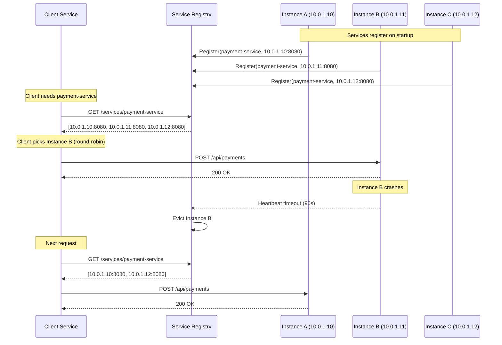
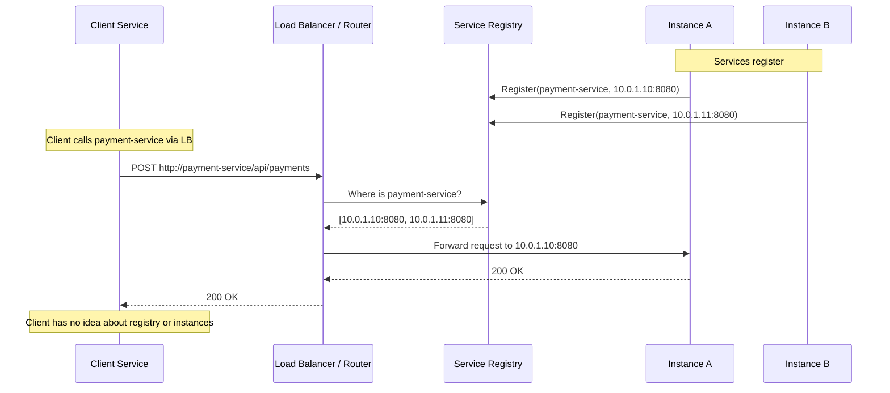
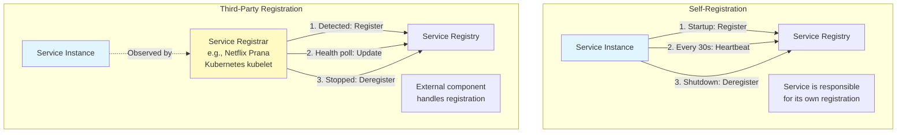
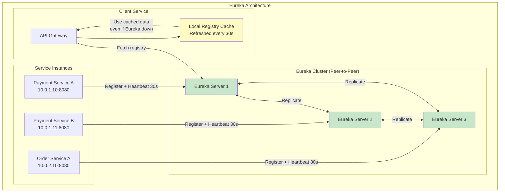
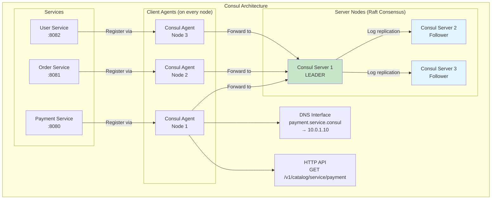
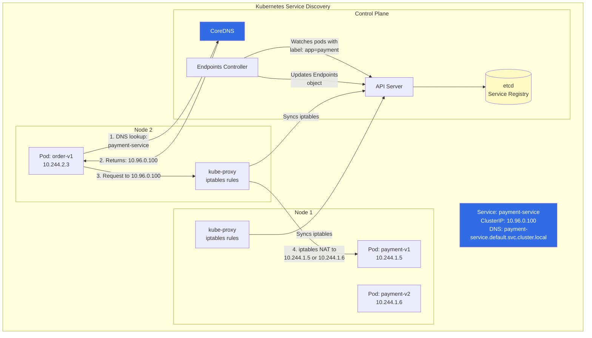
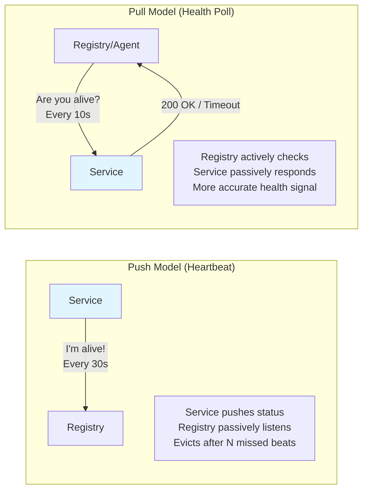
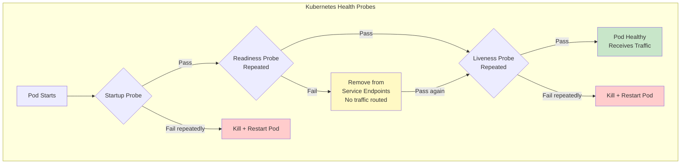
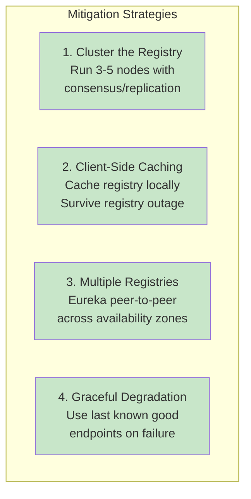

#system-design #building-block #distributed-systems #infrastructure

```table-of-contents
title:
style: nestedList # TOC style (nestedList|nestedOrderedList|inlineFirstLevel)
minLevel: 0 # Include headings from the specified level
maxLevel: 0 # Include headings up to the specified level
include:
exclude:
includeLinks: true # Make headings clickable
hideWhenEmpty: false # Hide TOC if no headings are found
debugInConsole: false # Print debug info in Obsidian console
```
# Service Discovery

## Intuition (30 sec)

A phone book for microservices. In a world where services constantly move across servers (auto-scaling, deployments, failures), you need a dynamic directory to find who is running where. Instead of hardcoding addresses, services register themselves and others look them up — like dialing 411 instead of memorizing every phone number.

## Failure-First Scenario

> You hardcode service IPs in config files across 20 microservices. Server hosting the payment service dies at 3 AM, a new instance spins up at a different IP. All services calling payment-service break instantly. On-call engineer spends 45 minutes updating configs and restarting services. With service discovery, callers always get current healthy endpoints automatically. The new payment-service instance registers itself, old entry is evicted, and callers route to the new instance within seconds — zero manual intervention.

---

## Working Knowledge (5 min)

### Core Concepts - Definitions First

**Service Discovery:**
- **Definition:** A mechanism for services to find the network location (IP:port) of other services dynamically, without hardcoded configuration
- **Purpose:** Enable reliable communication in environments where service instances are ephemeral — they come and go due to auto-scaling, deployments, failures, and container orchestration
- **How it works:** Services register their location on startup, send periodic heartbeats, and are removed when they stop. Callers query the registry to find current endpoints.

**Service Registry:**
- **Definition:** A database of available service instances and their network locations
- **Purpose:** Acts as the central source of truth for where services are running
- **Examples:** Netflix Eureka, HashiCorp Consul, Apache ZooKeeper, etcd

**Service Registration:**
- **Definition:** The process by which a service instance adds its network location to the registry on startup
- **Two patterns:** Self-registration (service registers itself) vs third-party registration (a separate registrar component registers on the service's behalf)

**Key Terms:**
- **Heartbeat** — periodic signal sent by a service to the registry to prove it is still alive
- **Health Check** — a probe (HTTP, TCP, script) that verifies a service instance is functional
- **Eviction** — removal of a service instance from the registry after missed heartbeats or failed health checks
- **Client-Side Discovery** — the client queries the registry directly and picks an instance
- **Server-Side Discovery** — the client calls a router/load balancer that queries the registry on its behalf
- **Self-Preservation** — a safety mode (Eureka) that stops evicting instances when too many miss heartbeats, assuming network partition rather than mass failure

### Two Discovery Patterns

#### 1. Client-Side Discovery

The client is responsible for querying the registry and selecting an instance.

```
┌─────────────┐     1. Query registry      ┌──────────────────┐
│             │ ──────────────────────────→ │                  │
│   Client    │     2. Get instance list    │  Service Registry │
│  (Caller)   │ ←────────────────────────── │   (Eureka/Consul) │
│             │                             │                  │
└──────┬──────┘                             └──────────────────┘
       │
       │ 3. Client picks instance
       │    (round-robin, random, etc.)
       │
       ├──────────────→ ┌────────────────────────┐
       │                │ Service Instance A      │
       │                │ 10.0.1.10:8080          │
       │                └────────────────────────┘
       │
       ├──────────────→ ┌────────────────────────┐
       │                │ Service Instance B      │
       │                │ 10.0.1.11:8080          │
       │                └────────────────────────┘
       │
       └──────────────→ ┌────────────────────────┐
                        │ Service Instance C      │
                        │ 10.0.1.12:8080          │
                        └────────────────────────┘
```



**Characteristics:**
- Client does the load balancing
- Client caches the registry locally (works even if registry is temporarily down)
- Requires client-side library (e.g., Netflix Ribbon)
- Used by: Netflix Eureka, Consul (with client library)

#### 2. Server-Side Discovery

A router or load balancer handles discovery on behalf of the client.

```
┌─────────────┐                     ┌──────────────────┐
│             │  1. Call service     │                  │
│   Client    │ ──────────────────→ │  Router / Load   │
│  (Caller)   │  4. Response        │    Balancer      │
│             │ ←────────────────── │                  │
└─────────────┘                     └────────┬─────────┘
                                             │
                                    2. Query  │  3. Forward
                                    registry  │  request
                                             │
                     ┌───────────────────────┼──────────────────┐
                     │                       │                  │
              ┌──────┴──────┐  ┌─────────────┴────┐  ┌─────────┴──────┐
              │  Service    │  │ Service Instance  │  │ Service        │
              │  Registry   │  │ A: 10.0.1.10     │  │ Instance       │
              │             │  │                   │  │ B: 10.0.1.11  │
              └─────────────┘  └───────────────────┘  └────────────────┘
```



**Characteristics:**
- Client does not need a discovery library — just calls a known endpoint
- Router/LB handles registry queries and load balancing
- Simpler client, more infrastructure complexity
- Used by: AWS ALB, Kubernetes (kube-proxy + CoreDNS), Nginx

### Pattern Comparison

| Aspect | Client-Side Discovery | Server-Side Discovery |
|--------|----------------------|----------------------|
| **Client complexity** | Higher (needs discovery library) | Lower (just calls an address) |
| **Infrastructure** | Simpler (no extra router) | Needs router/LB infrastructure |
| **Load balancing** | Client does it | Router/LB does it |
| **Language coupling** | Needs library per language | Language-agnostic |
| **Failure mode** | Client cache survives registry outage | Router failure = total outage |
| **Latency** | One less network hop | Extra hop through router |
| **Examples** | Netflix Eureka + Ribbon | Kubernetes, AWS ELB |
| **Best for** | Homogeneous tech stack (all Java) | Polyglot microservices |

### Registration Patterns



| Aspect | Self-Registration | Third-Party Registration |
|--------|------------------|-------------------------|
| **Coupling** | Service coupled to registry | Service decoupled from registry |
| **Library** | Needs registry client library | No library needed in service |
| **Language** | Library per language | Registrar is language-agnostic |
| **Examples** | Netflix Eureka client, Consul agent | Kubernetes kubelet, Registrator |
| **Failure mode** | Service forgets to deregister | Registrar itself is a dependency |

---

## Deep Dive

### Major Implementations

#### 1. Netflix Eureka (AP System)



**Key Design Decisions:**
- **Peer-to-peer replication, no leader** — any Eureka node can accept registrations and replicates to peers
- **AP over CP** — during network partition, Eureka nodes serve stale data rather than refusing requests
- **Self-preservation mode** — if more than 15% of instances miss heartbeats in a renewal period, Eureka assumes a network issue and stops evicting instances (prevents mass deregistration during network partitions)
- **Client-side caching** — clients fetch the full registry and cache it locally, refreshing every 30 seconds. Even if all Eureka servers go down, clients still work with cached data

**Timing Parameters:**
```
Registration:       On startup
Heartbeat interval: 30 seconds (configurable)
Eviction timeout:   90 seconds (3 missed heartbeats)
Registry fetch:     Every 30 seconds (full or delta)
Self-preservation:  Triggers when renewal rate < 85% of expected
```

**Self-Preservation Explained:**
```
Expected renewals per minute = Number of instances * 2
  (because heartbeat every 30s = 2 per minute per instance)

If 100 instances registered:
  Expected renewals = 100 * 2 = 200/minute
  Threshold = 200 * 0.85 = 170/minute

If actual renewals drop to 150/minute:
  150 < 170 → SELF-PRESERVATION ACTIVATED
  Eureka stops evicting instances
  Assumes network partition, not mass failure
```

**When Eureka Is a Good Choice:**
- Large-scale microservices (Netflix uses it for 800+ services)
- Java/Spring ecosystem
- Availability over consistency is acceptable
- You want clients to survive registry outages

#### 2. HashiCorp Consul (CP or AP, Tunable)



**Key Features:**
- **Raft consensus** for strong consistency among server nodes
- **Built-in health checks** — HTTP, TCP, script-based, gRPC, TTL
- **DNS interface** — services discoverable via standard DNS queries (`payment.service.consul`)
- **HTTP API** — programmatic discovery (`GET /v1/catalog/service/payment`)
- **Key-value store** — built-in configuration management
- **Multi-datacenter** — native support for cross-DC service discovery
- **Service mesh** — Consul Connect provides mTLS and authorization between services

**Health Check Types in Consul:**
```json
{
  "service": {
    "name": "payment-service",
    "port": 8080,
    "checks": [
      {
        "http": "http://localhost:8080/health",
        "interval": "10s",
        "timeout": "5s"
      },
      {
        "tcp": "localhost:8080",
        "interval": "15s"
      },
      {
        "script": "/usr/local/bin/check_payment_deps.sh",
        "interval": "30s"
      },
      {
        "grpc": "localhost:8080/grpc.health.v1.Health/Check",
        "interval": "10s"
      }
    ]
  }
}
```

**DNS-Based Discovery:**
```bash
# Standard DNS lookup
$ dig payment.service.consul

;; ANSWER SECTION:
payment.service.consul. 0 IN A 10.0.1.10
payment.service.consul. 0 IN A 10.0.1.11
payment.service.consul. 0 IN A 10.0.1.12

# SRV record (includes port)
$ dig payment.service.consul SRV

;; ANSWER SECTION:
payment.service.consul. 0 IN SRV 1 1 8080 10.0.1.10
payment.service.consul. 0 IN SRV 1 1 8080 10.0.1.11
```

**When Consul Is a Good Choice:**
- Polyglot environments (DNS works with any language)
- Need both service discovery and config management
- Multi-datacenter deployments
- Want built-in health checking without extra tooling

#### 3. Apache ZooKeeper (CP System)

```mermaid
graph TB
    subgraph "ZooKeeper Ensemble"
        ZK1[ZK Node 1<br/>LEADER]
        ZK2[ZK Node 2<br/>Follower]
        ZK3[ZK Node 3<br/>Follower]
        ZK1 -->|ZAB Protocol| ZK2
        ZK1 -->|ZAB Protocol| ZK3
    end

    subgraph "ZNode Tree (like filesystem)"
        Root[/]
        Services[/services]
        Payment[/services/payment]
        PI1[/services/payment/instance-001<br/>EPHEMERAL<br/>data: 10.0.1.10:8080]
        PI2[/services/payment/instance-002<br/>EPHEMERAL<br/>data: 10.0.1.11:8080]
        Order[/services/order]
        OI1[/services/order/instance-001<br/>EPHEMERAL<br/>data: 10.0.2.10:8080]

        Root --> Services
        Services --> Payment
        Services --> Order
        Payment --> PI1
        Payment --> PI2
        Order --> OI1
    end

    subgraph "Client (Watcher)"
        W1[Order Service<br/>watches /services/payment]
    end

    PI1 -.->|Session dies → node deleted| Payment
    W1 -->|Watch notification| Payment

    style PI1 fill:#fff9c4
    style PI2 fill:#fff9c4
    style OI1 fill:#fff9c4
    style ZK1 fill:#c8e6c9
```

**Key Design Decisions:**
- **Strong consistency** via ZAB (ZooKeeper Atomic Broadcast) protocol — all reads are linearizable
- **Ephemeral nodes** — ZNodes tied to a client session. When the session ends (service crashes, network timeout), the ZNode is automatically deleted, effectively deregistering the service
- **Watches** — clients set watches on ZNodes and get notified of changes (new instance, removed instance)
- **Sequential nodes** — used for leader election (e.g., `/services/payment/instance-00000001`)

**How Service Discovery Works with ZooKeeper:**
```
1. Service starts → creates ephemeral ZNode:
   /services/payment/instance-001 = {"host":"10.0.1.10","port":8080}

2. Client lists children of /services/payment:
   → [instance-001, instance-002]
   → Reads data from each child to get IP:port

3. Client sets a watch on /services/payment children

4. Service crashes → session expires → ephemeral node deleted

5. Watch fires → client re-reads children list
   → [instance-002]  (instance-001 gone)
```

**Limitations for Service Discovery:**
- Not designed for service discovery (designed for coordination)
- CP system: during leader election (seconds), writes blocked
- Watches are one-time triggers — must re-register after each notification
- No built-in health checks — relies on session timeout (30s default)
- Used by Kafka, HBase, Hadoop for coordination, not typically for HTTP service discovery

#### 4. Kubernetes Service Discovery



**How It Works Step by Step:**
```
1. Deploy pods with labels:
   metadata:
     labels:
       app: payment

2. Create a Service that selects those pods:
   spec:
     selector:
       app: payment
     ports:
       - port: 80
         targetPort: 8080

3. Kubernetes creates:
   - ClusterIP (virtual IP): 10.96.0.100
   - DNS entry: payment-service.default.svc.cluster.local
   - Endpoints object listing pod IPs

4. Other pods call: http://payment-service/api/payments
   - CoreDNS resolves to ClusterIP
   - kube-proxy iptables rules NAT to a real pod IP
   - Load balancing: random selection via iptables probability rules

5. Pod dies → Endpoints controller removes it
   kube-proxy updates iptables → no traffic to dead pod
```

**Kubernetes Service Types:**

| Type | Use Case | How It Works |
|------|----------|-------------|
| **ClusterIP** | Internal service-to-service | Virtual IP only accessible inside cluster |
| **NodePort** | External access (dev/test) | Opens a port (30000-32767) on every node |
| **LoadBalancer** | Production external access | Provisions cloud LB (AWS ALB, GCP LB) |
| **Headless** | Direct pod access (StatefulSets) | No ClusterIP, DNS returns pod IPs directly |

#### 5. etcd (CP System)

```
Used by: Kubernetes (as its backing store)
Consensus: Raft protocol
Consistency: Strong (linearizable reads)
Interface: HTTP/gRPC API, key-value store
Watch: Long-polling watches for changes

Key difference from ZooKeeper:
- Simpler API (flat key-value vs hierarchical)
- gRPC-based (better performance)
- Designed for cloud-native (Kubernetes chose it over ZK)
```

### Implementation Comparison Table

| Feature | Eureka | Consul | ZooKeeper | Kubernetes | etcd |
|---------|--------|--------|-----------|------------|------|
| **Consistency** | AP | CP (tunable) | CP | CP (etcd) | CP |
| **Consensus** | None (peer-to-peer) | Raft | ZAB | Raft (etcd) | Raft |
| **Health Checks** | Heartbeat only | HTTP, TCP, script, gRPC | Session timeout | Liveness + Readiness probes | TTL leases |
| **DNS Support** | No | Yes | No | Yes (CoreDNS) | No |
| **KV Store** | No | Yes | Yes | Yes (etcd) | Yes |
| **Multi-DC** | Yes (zone-aware) | Yes (native) | No | Federation | No |
| **Language** | Java (Spring) | Go (any via DNS/HTTP) | Java | Any (DNS/HTTP) | Go |
| **Scale** | 10K+ instances | 10K+ instances | ~5K instances | 100K+ pods | ~10K keys |
| **Best For** | Java microservices | Polyglot, multi-DC | Kafka, Hadoop coord | Container orchestration | Kubernetes backing |

### AP vs CP Trade-off for Service Discovery

This is one of the most critical design decisions in service discovery.

```mermaid
graph TB
    subgraph "AP System (Eureka)"
        AP1[Network Partition Occurs]
        AP2[Eureka nodes can't sync]
        AP3[Each node keeps serving<br/>stale but available data]
        AP4[Client gets list that<br/>might include dead instances]
        AP5[Client retries on<br/>another instance]
        AP6[Service stays AVAILABLE]

        AP1 --> AP2 --> AP3 --> AP4 --> AP5 --> AP6
    end

    subgraph "CP System (ZooKeeper)"
        CP1[Network Partition Occurs]
        CP2[Minority partition loses leader]
        CP3[Minority partition REFUSES<br/>reads and writes]
        CP4[Client gets ERROR:<br/>no data returned]
        CP5[Service UNAVAILABLE<br/>until partition heals]
        CP6[But data is always CONSISTENT]

        CP1 --> CP2 --> CP3 --> CP4 --> CP5 --> CP6
    end

    style AP6 fill:#c8e6c9
    style CP5 fill:#ffcccc
    style CP6 fill:#c8e6c9
```



**Netflix's Reasoning (Chose AP — Eureka):**
> "It is better to have stale data than no data at all. If a service instance is actually down, the client will get an error and retry on another instance. But if the registry is unavailable, ALL service communication stops."

**Kafka's Reasoning (Chose CP — ZooKeeper):**
> "Partition leadership must be consistent. If two brokers think they are the leader for the same partition, data corruption occurs. Temporary unavailability is better than inconsistent leadership."

| Scenario | Best Choice | Why |
|----------|-------------|-----|
| HTTP microservices | AP (Eureka) | Stale entry = one failed request + retry. Registry down = all services blind. |
| Database partition leader | CP (ZooKeeper) | Two leaders = split brain = data corruption. Brief unavailability is acceptable. |
| DNS-based discovery | AP | DNS is inherently eventually consistent (TTL caching). Clients already handle stale DNS. |
| Config management | CP (Consul, etcd) | Wrong config can cause bugs. Better to block than serve wrong config. |
| Service mesh (sidecar) | AP | Sidecar caches locally. Eventual consistency with retries is fine. |

### Health Check Mechanisms

#### Push vs Pull



| Aspect | Push (Heartbeat) | Pull (Health Poll) |
|--------|------------------|-------------------|
| **Direction** | Service → Registry | Registry → Service |
| **Load** | On the service (sends heartbeats) | On the registry (polls services) |
| **Detection speed** | Slow (wait for missed heartbeats, e.g., 90s) | Fast (detect on next poll, e.g., 10s) |
| **Network traffic** | Proportional to instance count | Proportional to instance count |
| **Accuracy** | Service might send heartbeat but be broken | Can check actual endpoint health |
| **Used by** | Eureka, ZooKeeper sessions | Consul, Kubernetes |

#### Kubernetes: Liveness vs Readiness vs Startup Probes



| Probe | Purpose | On Failure | Example |
|-------|---------|------------|---------|
| **Startup** | Wait for slow-starting apps | Restart pod | Java app loading Spring context (60s) |
| **Liveness** | Is the process alive and not deadlocked? | Restart pod | App is stuck in infinite loop |
| **Readiness** | Can this instance handle traffic? | Remove from load balancer | App is alive but DB connection pool exhausted |

```yaml
# Kubernetes pod spec with all three probes
spec:
  containers:
  - name: payment-service
    image: payment:v2.1
    ports:
    - containerPort: 8080

    startupProbe:
      httpGet:
        path: /health/startup
        port: 8080
      failureThreshold: 30
      periodSeconds: 10
      # Allows up to 300s (30 * 10) for startup

    livenessProbe:
      httpGet:
        path: /health/live
        port: 8080
      initialDelaySeconds: 0
      periodSeconds: 10
      failureThreshold: 3
      timeoutSeconds: 5

    readinessProbe:
      httpGet:
        path: /health/ready
        port: 8080
      initialDelaySeconds: 0
      periodSeconds: 5
      failureThreshold: 3
      timeoutSeconds: 3
```

#### Self-Preservation Mode (Eureka)

```
Normal Operation:
  100 instances registered
  Expected heartbeats: 200/min (1 per 30s per instance)
  All healthy → evict any instance that misses 3 beats

Network Partition Scenario:
  40 instances suddenly miss heartbeats
  Actual renewals: 120/min
  Threshold: 200 * 0.85 = 170/min
  120 < 170 → SELF-PRESERVATION ACTIVATED

Self-Preservation ON:
  - Eureka STOPS evicting instances
  - Registry may contain some dead entries
  - But won't accidentally remove 40% of services
  - Clients retry on failure → eventually reach live instance
  - Recovers automatically when heartbeats resume

Without Self-Preservation:
  - Eureka evicts 40 instances
  - Remaining 60 instances get 40% more traffic
  - Potential cascade failure from overload
  - Recovery requires all 40 services to re-register
```

### Implementation Examples

#### Spring Boot with Eureka (Client-Side Discovery)

**Eureka Server:**
```java
// build.gradle: spring-cloud-starter-netflix-eureka-server

@SpringBootApplication
@EnableEurekaServer
public class EurekaServerApplication {
    public static void main(String[] args) {
        SpringApplication.run(EurekaServerApplication.class, args);
    }
}
```

```yaml
# application.yml for Eureka Server
server:
  port: 8761

eureka:
  instance:
    hostname: eureka-server
  client:
    registerWithEureka: false    # Don't register itself
    fetchRegistry: false         # Don't fetch (it IS the registry)
  server:
    enableSelfPreservation: true
    renewalPercentThreshold: 0.85
    evictionIntervalTimerInMs: 60000
```

**Service Registration (Payment Service):**
```java
// build.gradle: spring-cloud-starter-netflix-eureka-client

@SpringBootApplication
@EnableDiscoveryClient
public class PaymentServiceApplication {
    public static void main(String[] args) {
        SpringApplication.run(PaymentServiceApplication.class, args);
    }
}
```

```yaml
# application.yml for Payment Service
spring:
  application:
    name: payment-service    # This is the service name in registry

server:
  port: 8080

eureka:
  client:
    serviceUrl:
      defaultZone: http://eureka-server:8761/eureka/
    registryFetchIntervalSeconds: 30
  instance:
    leaseRenewalIntervalInSeconds: 30    # Heartbeat every 30s
    leaseExpirationDurationInSeconds: 90  # Evict after 90s
    preferIpAddress: true
    instanceId: ${spring.application.name}:${server.port}
```

**Service Discovery (Order Service calling Payment Service):**
```java
@Configuration
public class RestConfig {
    @Bean
    @LoadBalanced    // Enables client-side load balancing via Ribbon
    public RestTemplate restTemplate() {
        return new RestTemplate();
    }
}

@Service
public class OrderService {
    @Autowired
    private RestTemplate restTemplate;

    public PaymentResponse processPayment(OrderRequest order) {
        // "payment-service" is resolved via Eureka registry
        // Ribbon picks an instance using round-robin
        return restTemplate.postForObject(
            "http://payment-service/api/payments",
            order.getPaymentDetails(),
            PaymentResponse.class
        );
    }
}
```

#### Consul with Go (DNS-Based Discovery)

```go
package main

import (
    "fmt"
    "log"
    "net"

    consulapi "github.com/hashicorp/consul/api"
)

// Register service with Consul
func registerService() {
    config := consulapi.DefaultConfig()
    client, err := consulapi.NewClient(config)
    if err != nil {
        log.Fatal(err)
    }

    registration := &consulapi.AgentServiceRegistration{
        ID:      "payment-service-1",
        Name:    "payment-service",
        Port:    8080,
        Address: "10.0.1.10",
        Check: &consulapi.AgentServiceCheck{
            HTTP:     "http://10.0.1.10:8080/health",
            Interval: "10s",
            Timeout:  "5s",
        },
        Tags: []string{"v2", "production"},
    }

    err = client.Agent().ServiceRegister(registration)
    if err != nil {
        log.Fatal(err)
    }
    fmt.Println("Service registered with Consul")
}

// Discover service via DNS
func discoverViaDNS() {
    // Standard DNS lookup — works with any language
    addrs, err := net.LookupHost("payment-service.service.consul")
    if err != nil {
        log.Fatal(err)
    }

    for _, addr := range addrs {
        fmt.Printf("Found payment-service at: %s\n", addr)
    }
}

// Discover service via HTTP API
func discoverViaHTTP() {
    config := consulapi.DefaultConfig()
    client, _ := consulapi.NewClient(config)

    services, _, err := client.Health().Service(
        "payment-service",   // service name
        "",                  // tag filter
        true,                // passing only (healthy)
        nil,                 // query options
    )
    if err != nil {
        log.Fatal(err)
    }

    for _, svc := range services {
        fmt.Printf("Found: %s:%d\n",
            svc.Service.Address,
            svc.Service.Port)
    }
}
```

---

## Production Considerations

### Registry as Single Point of Failure

The service registry is critical infrastructure. If it goes down, services cannot discover each other.



**Registry HA Architecture:**
```
Availability Zone A:        Availability Zone B:        Availability Zone C:
┌─────────────────┐        ┌─────────────────┐        ┌─────────────────┐
│  Eureka Node 1  │ ←───→  │  Eureka Node 2  │ ←───→  │  Eureka Node 3  │
│  (peer-to-peer) │        │  (peer-to-peer) │        │  (peer-to-peer) │
└─────────────────┘        └─────────────────┘        └─────────────────┘
        ↑                          ↑                          ↑
   Services in AZ-A          Services in AZ-B          Services in AZ-C
   (prefer local node)       (prefer local node)       (prefer local node)
```

### Stale Entries (Zombie Instances)

A zombie instance is registered in the registry but is actually dead or unresponsive.

**Causes:**
- Service crashed without deregistering (killed -9, OOM)
- Network partition between service and registry
- Health check endpoint returns 200 but service is actually broken (shallow health check)
- Self-preservation mode keeping dead entries

**Mitigation:**
```
1. Aggressive eviction timing (if not using self-preservation):
   Heartbeat: 10s
   Eviction:  30s (3 missed heartbeats)

2. Deep health checks:
   - Check database connectivity
   - Check downstream service reachability
   - Check thread pool utilization
   - Check memory / disk space

3. Client-side resilience:
   - Retry on different instance if request fails
   - Circuit breaker per instance
   - Remove instance from local cache on repeated failures

4. Graceful shutdown hooks:
   - Deregister from registry before stopping
   - Drain existing connections
   - Return 503 from health check during shutdown
```

### Network Partition Behavior

```
Scenario: Network splits between AZ-A and AZ-B

AP Registry (Eureka):
  AZ-A Eureka: serves AZ-A services + stale AZ-B entries
  AZ-B Eureka: serves AZ-B services + stale AZ-A entries
  Impact: Clients in AZ-A might try to call AZ-B services (fail + retry)
  Recovery: Registries sync when partition heals

CP Registry (ZooKeeper):
  Majority partition: continues serving (AZ with 2 of 3 nodes)
  Minority partition: STOPS serving entirely
  Impact: Services in minority partition cannot discover anything
  Recovery: Minority reconnects and catches up from leader
```

### Graceful Shutdown Pattern

```java
@Component
public class GracefulShutdown {
    @Autowired
    private EurekaClient eurekaClient;

    @PreDestroy
    public void onShutdown() {
        // 1. Mark as OUT_OF_SERVICE (stop receiving new requests)
        eurekaClient.getApplicationInfoManager()
            .setInstanceStatus(InstanceStatus.DOWN);

        // 2. Wait for in-flight requests to complete
        try {
            Thread.sleep(30000);  // 30 second drain period
        } catch (InterruptedException e) {
            Thread.currentThread().interrupt();
        }

        // 3. Deregister from Eureka
        eurekaClient.shutdown();
    }
}
```

---

## Monitoring

### Key Metrics to Track

| Metric Category | Specific Metrics | Alert Threshold | Why It Matters |
|-----------------|-----------------|-----------------|----------------|
| **Registry Health** | Registered instance count | Sudden drop >20% | Mass deregistration = network issue or deployment gone wrong |
| **Heartbeats** | Heartbeat miss rate | >15% of instances | Approaching self-preservation threshold |
| **Discovery** | Registry fetch latency | p99 >500ms | Clients slow to get updates |
| **Staleness** | Time since last registry refresh | >60s | Clients working with outdated data |
| **Availability** | Registry uptime | <99.9% | Discovery is critical path |
| **Replication** | Peer sync lag | >5s | Registries diverging |
| **Evictions** | Eviction rate per minute | Sudden spike | Mass failure or network partition |

**Prometheus Metrics (Eureka):**
```promql
# Registered instance count
eureka_server_registered_instances_total

# Heartbeat renewals per minute
rate(eureka_server_renewals_total[5m]) * 60

# Self-preservation status (1 = active)
eureka_server_self_preservation_mode

# Registry fetch latency
histogram_quantile(0.99, rate(eureka_client_registry_fetch_seconds_bucket[5m]))

# Evictions per minute
rate(eureka_server_evictions_total[5m]) * 60
```

**Dashboard Layout:**
```
+------------------------------------------+
|  Registered Instances [Line Chart]       |
|  payment: 12  order: 8  user: 15        |
+------------------------------------------+
|  Heartbeat Health [Gauge]                |
|  Renewal rate: 95% of expected           |
|  Self-preservation: OFF                  |
+------------------------------------------+
|  Discovery Latency [Line, Percentiles]   |
|  p50: 2ms  p95: 15ms  p99: 45ms         |
+------------------------------------------+
|  Evictions [Bar Chart]                   |
|  Last hour: 3 evictions                  |
+------------------------------------------+
```

---

## Interview Prep

### Core Questions and Answers

**Q: "How do services find each other in a microservices architecture?"**
> "Services register their network location with a service registry on startup and send periodic heartbeats. When service A needs to call service B, it queries the registry (directly in client-side discovery, or via a load balancer in server-side discovery) to get a list of healthy instances. The client then picks one — typically round-robin or least connections. If an instance goes down, it stops sending heartbeats and is evicted from the registry within 30-90 seconds. Kubernetes does this natively with CoreDNS and kube-proxy."

**Q: "Why not just use DNS?"**
> "Standard DNS has TTL caching, so changes propagate slowly (minutes to hours). Service discovery registries propagate changes in seconds. Also, DNS doesn't do health checking — it will happily return the IP of a dead server. Service registries integrate health checks to only return healthy instances. That said, Consul offers a DNS interface that combines the simplicity of DNS with real-time health checking."

**Q: "AP or CP for service discovery?"**
> "For HTTP microservice discovery, I'd choose AP (like Eureka). The reasoning: a stale registry entry means one failed request that gets retried on another instance. But a completely unavailable registry means no service can find any other service — total system failure. Netflix summarized it well: 'stale data is better than no data.' However, for coordination tasks like partition leadership in Kafka, you need CP (ZooKeeper) because inconsistent leadership causes data corruption."

**Q: "What happens when the service registry goes down?"**
> "With client-side discovery (Eureka), clients cache the registry locally. They continue working with the last known good data. Requests to dead instances fail and retry on other instances. The system degrades gracefully rather than failing completely. With server-side discovery (Kubernetes), etcd going down means the API server stops working, but kube-proxy's existing iptables rules continue to route traffic to the last known pod IPs. New pods cannot be discovered until etcd recovers."

### Key Decision Framework

```
Choosing a Service Discovery Solution:

Is your stack primarily Java/Spring?
  YES → Netflix Eureka (native integration)
  NO  → Continue

Do you need multi-datacenter support?
  YES → HashiCorp Consul
  NO  → Continue

Are you running Kubernetes?
  YES → Use built-in Kubernetes service discovery (CoreDNS + kube-proxy)
  NO  → Continue

Do you need strong consistency for coordination?
  YES → ZooKeeper or etcd
  NO  → Consul (DNS interface works with any language)
```

### Cross-References

- [[02_building_blocks/load_balancers]] — Load balancers often integrate with service discovery (server-side discovery pattern)
- [[03_design_patterns/leader_election]] — ZooKeeper and Consul are used for leader election in addition to discovery
- [[03_design_patterns/consistent_hashing]] — Used by some discovery-aware load balancers to route to specific instances
- [[02_building_blocks/api_gateway]] — API gateways query the service registry to route requests
- [[01_fundamentals/cap_theorem]] — AP vs CP trade-off is fundamental to choosing a registry
- [[02_building_blocks/caching]] — Client-side registry caching follows similar patterns to data caching

### Red Flags to Avoid in Interviews

- Hardcoding IPs or hostnames in microservice communication
- Forgetting to discuss what happens when the registry itself goes down
- Not mentioning health checks (the registry must know which instances are healthy)
- Confusing service discovery with load balancing (discovery finds instances, LB distributes traffic)
- Ignoring the AP vs CP trade-off when selecting a registry
- Not addressing stale entries and zombie instances

---

## Links

- [[01_fundamentals/cap_theorem]] — Service registries must choose between availability and consistency
- [[01_fundamentals/scalability]] — Service discovery enables dynamic scaling of services
- [[02_building_blocks/load_balancers]] — Server-side discovery uses load balancers as the discovery proxy
- [[02_building_blocks/api_gateway]] — Gateways depend on service discovery for routing
- [[03_design_patterns/leader_election]] — ZooKeeper and Consul provide both discovery and leader election
- [[03_design_patterns/consistent_hashing]] — Advanced routing within discovery-aware systems
- [[02_building_blocks/monitoring_and_logging]] — Monitoring registry health is critical

## References

- [Netflix Eureka Wiki](https://github.com/Netflix/eureka/wiki)
- [HashiCorp Consul Documentation](https://developer.hashicorp.com/consul/docs)
- [Apache ZooKeeper Documentation](https://zookeeper.apache.org/doc/current/)
- [Kubernetes Service Discovery](https://kubernetes.io/docs/concepts/services-networking/service/)
- [Spring Cloud Netflix](https://spring.io/projects/spring-cloud-netflix)
- [Microservices Patterns - Chris Richardson, Chapter 3](https://microservices.io/patterns/service-registry.html)
- [Netflix Tech Blog: Eureka at Scale](https://netflixtechblog.com/)
