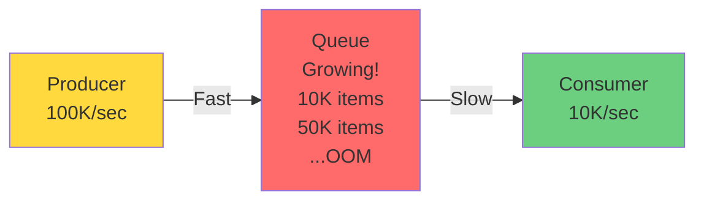
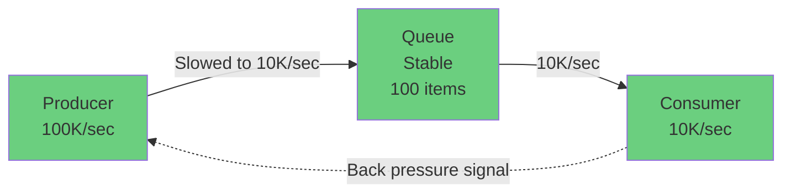
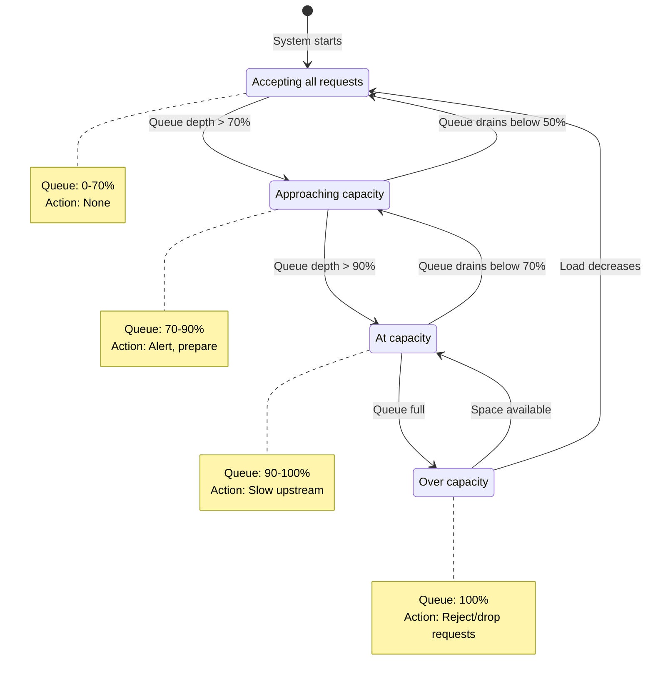
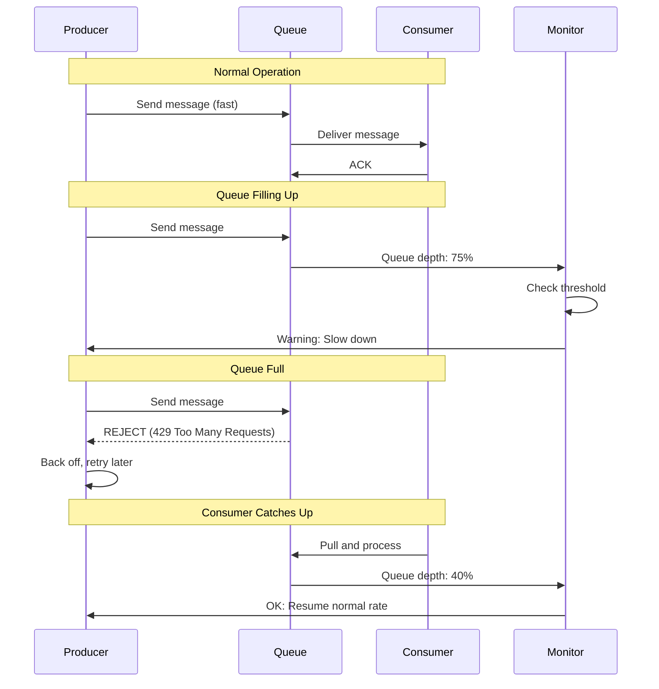
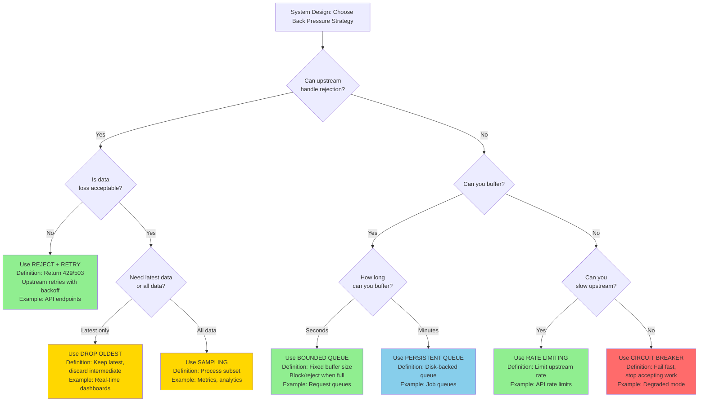
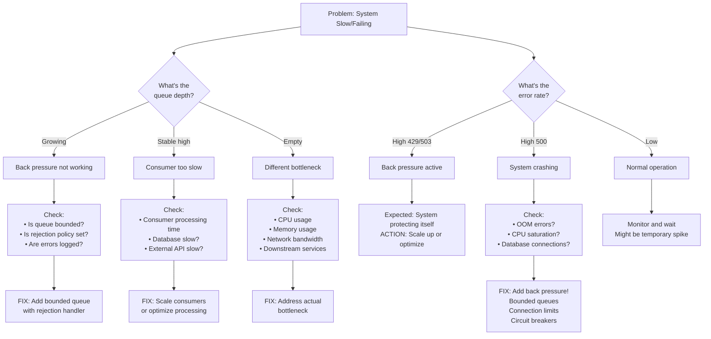

#system-design #pattern #reliability #performance

# Back Pressure

## Intuition (30 sec)

Rush hour traffic: if the highway is full, on-ramps have traffic lights (metering) to control how many cars enter. Without metering, the highway gridlocks and nobody moves. Back pressure means telling upstream "slow down" before the system is overwhelmed.

---

## Failure-First Scenario

> Your ingestion pipeline processes 10K events/sec. A traffic spike pushes 100K events/sec. The queue fills up, workers can't keep up, memory exhausts, and the entire pipeline crashes. All 100K events are lost. With back pressure, you'd reject or slow down incoming events gracefully.

---

## Working Knowledge (5 min)

### Core Concept - Definition First

**Back Pressure:**
- **Definition:** Back pressure is a flow control mechanism where a downstream component signals upstream producers to slow down or stop sending data when it cannot process incoming data at the rate it's being received.
- **Purpose:** Prevents system overload, memory exhaustion, and cascading failures by controlling the rate of data flow through a pipeline.
- **How it works:** When a consumer detects it's approaching capacity (queue full, CPU high, memory low), it sends signals upstream to reduce the incoming data rate.

**Key Terms:**
- **Flow Control:** The process of managing the rate of data transmission between systems to prevent overwhelming the receiver.
- **Bounded Queue:** A queue with a fixed maximum size that prevents unbounded memory growth by rejecting or blocking new items when full.
- **Load Shedding:** The practice of deliberately dropping low-priority work during overload to preserve system stability.
- **Pull-based vs Push-based:** Pull systems let consumers request data when ready (natural back pressure), while push systems force consumers to accept data as it arrives (requires explicit back pressure mechanisms).

### Visual Model - The Overload Problem



**Without Back Pressure:** Producer overwhelms queue → Memory exhaustion → System crash



**With Back Pressure:** Consumer signals producer → Producer slows down → System stable

### Back Pressure Strategies Comparison

| Strategy | How | Trade-off | When to Use |
|----------|-----|-----------|-------------|
| **Reject** | Return 429/503 when overloaded | Clients must retry, work is temporarily lost | API servers, when clients can retry |
| **Buffer** | Queue messages (bounded queue) | Increases latency, OOM risk if unbounded | Short bursts, when temporary buffering helps |
| **Load Shed** | Drop low-priority requests | Some work is permanently lost | Prioritized workloads, analytics vs core features |
| **Scale** | Auto-scale consumers | Takes time (minutes), costs money | Sustained increases in load |
| **Slow Upstream** | TCP flow control, rate limiting | Producers are slowed/blocked | Direct producer-consumer connections |
| **Circuit Break** | Stop accepting new work entirely | All new requests fail | Protect from cascading failures |

### Push vs Pull Models

```
Push Model (Requires Explicit Back Pressure):
┌──────────┐         ┌──────────┐         ┌──────────┐
│ Producer │ ──────> │  Queue   │ ──────> │ Consumer │
│          │ (fast)  │ (fills!) │ (slow)  │          │
└──────────┘         └──────────┘         └──────────┘
Producer controls pace → Consumer must signal when overwhelmed

Pull Model (Natural Back Pressure):
┌──────────┐         ┌──────────┐         ┌──────────┐
│ Producer │ <────── │  Queue   │ <────── │ Consumer │
│  (waits) │         │ (stable) │         │ (pulls)  │
└──────────┘         └──────────┘         └──────────┘
Consumer controls pace → Natural flow control
```

**Examples:**
- **Push:** HTTP POST requests, webhooks, event streams
- **Pull:** Kafka consumers, job queues, database cursors

---

## Layer 1: Conceptual Precision (15 min)

### Bounded vs Unbounded Queues - Deep Definitions

**Bounded Queue:**
- **Formal Definition:** A bounded queue is a data structure with a fixed maximum capacity that enforces an upper limit on the number of elements it can hold.
- **Simple Definition:** Like a parking lot with limited spaces - when full, new cars must wait or go elsewhere.
- **Analogy:** A restaurant with 50 seats. When full, new customers wait (block) or are turned away (reject).
- **Related Terms:**
  - Differs from **unbounded queue** which has no size limit
  - Implements **admission control** by limiting new entries
  - Provides **bounded memory guarantees**

**Unbounded Queue:**
- **Definition:** A queue with no maximum size limit that continues accepting elements until system memory is exhausted.
- **Why dangerous:** Appears to work under normal load, but catastrophically fails during traffic spikes when memory runs out, causing complete system crash and total data loss.
- **Production rule:** NEVER use unbounded queues in production systems.

**Why this matters:**
In production, the difference between bounded and unbounded queues is the difference between graceful degradation (some requests rejected, system stays up) and catastrophic failure (entire system crashes, all data lost). Bounded queues force you to explicitly handle overload scenarios instead of hoping they never happen.

### Flow Control State Diagram



**State Definitions:**
- **Normal:** System operating within capacity with headroom for bursts. Queue depth below 70%, all systems healthy.
- **Warning:** Approaching capacity limits. Begin alerting operators and preparing to activate back pressure mechanisms.
- **Overload:** At or near capacity. Actively applying back pressure signals to slow upstream producers.
- **Shedding:** Over capacity. Actively rejecting or dropping requests to protect system stability.

### Back Pressure Signaling Flow



**Step-by-step breakdown:**
1. **Normal Operation:** Producer sends at full rate, queue has capacity, consumer keeps up.
2. **Warning Threshold:** Monitor detects queue depth crossing 70-75%, sends warning signal to producer.
3. **Rejection:** Queue reaches capacity, explicitly rejects new messages with error codes (429, 503).
4. **Recovery:** Consumer processes backlog, queue depth decreases, monitor signals producer to resume.

### Load Shedding Architecture

```
┌─────────────────────────────────────────────────────┐
│               Load Shedding Decision Tree           │
│                                                      │
│  ┌──────────────┐         ┌──────────────┐         │
│  │   Request    │         │   Priority   │         │
│  │   Arrives    │────────>│  Classifier  │         │
│  └──────────────┘         └──────┬───────┘         │
│                                   │                 │
│                    ┌──────────────┼──────────────┐ │
│                    │              │              │ │
│            ┌───────▼────┐  ┌──────▼─────┐  ┌────▼──────┐
│            │ Priority 1  │  │ Priority 2 │  │Priority 3 │
│            │  Critical   │  │   Normal   │  │ Low/Async │
│            │  (Payment)  │  │  (User)    │  │(Analytics)│
│            └──────┬──────┘  └──────┬─────┘  └────┬──────┘
│                   │                │             │
│                   │                │             │
│            ┌──────▼────────────────▼─────────────▼──────┐
│            │        Current System Load Check           │
│            │        Queue Depth, CPU, Memory            │
│            └──────┬────────────────┬────────────────────┘
│                   │                │
│          Load < 80%           Load > 80%
│                   │                │
│            ┌──────▼──────┐  ┌──────▼──────┐
│            │   Process   │  │  Shed by    │
│            │   All       │  │  Priority   │
│            └─────────────┘  └──────┬──────┘
│                                    │
│                    ┌───────────────┼───────────────┐
│                    │               │               │
│              ┌─────▼────┐    ┌────▼─────┐   ┌────▼────┐
│              │  Keep P1  │    │ Keep P2  │   │ Drop P3 │
│              │  Always   │    │  If room │   │  First  │
│              └───────────┘    └──────────┘   └─────────┘
└─────────────────────────────────────────────────────────┘

Priority Definitions:
━━━━━━━━━━━━━━━━━━━
Priority 1 (Critical):
  Definition: Business-critical operations that must never be dropped
  Examples: Payment processing, authentication, critical transactions
  Action: Always process, even if slow

Priority 2 (Normal):
  Definition: Standard user-facing operations
  Examples: User queries, profile updates, content delivery
  Action: Process if capacity available, reject if overloaded

Priority 3 (Low):
  Definition: Non-critical, deferrable work
  Examples: Analytics events, metrics, background jobs
  Action: First to be dropped during overload
```

**Component Definitions:**
- **Priority Classifier:** Component that examines incoming requests and assigns priority levels based on request type, user tier, or business rules.
- **Load Check:** Monitoring component that measures current system utilization (queue depth, CPU, memory) against thresholds.
- **Shedding Logic:** Decision engine that drops lowest priority work first when system approaches capacity.

### The Math: Queue Capacity and Throughput

**Little's Law:** `L = λ × W`

**Term Definitions:**
- **L (Queue Length):** Average number of items in the system (queue depth)
- **λ (Arrival Rate):** Rate at which items arrive (requests/second)
- **W (Wait Time):** Average time an item spends in the system

**Example calculation:**
```
Scenario:
- Arrival Rate (λ): 1000 requests/sec
- Processing Time (W): 0.1 seconds (100ms)

Queue Length = 1000 × 0.1 = 100 concurrent requests

Bounded Queue Sizing:
- Minimum queue size: 100 (average load)
- Add buffer for bursts: 100 × 2 = 200
- Production recommendation: 200-300 items

What happens if traffic doubles?
- λ = 2000 requests/sec
- Queue Length = 2000 × 0.1 = 200 concurrent
- Queue fills to capacity → Back pressure activates
```

**Queue Depth Thresholds:**
```
Queue Capacity: 1000 items

     0 ──────────────────────────────────> 1000
     │                                       │
     │◄─── Normal ───►│◄─ Warning ─►│◄ Full►│
     0               700            900    1000

Green Zone  (0-700):   Accept all, normal operation
Yellow Zone (700-900): Start back pressure signaling
Red Zone    (900-1000): Aggressive rejection, load shedding
```

### Graceful Degradation Patterns

**Graceful Degradation:**
- **Definition:** A system's ability to maintain partial functionality when operating beyond normal capacity, rather than failing completely.
- **Purpose:** Preserve core business value while shedding non-essential features during overload.

```
Full Functionality (Normal Load):
┌────────────────────────────────┐
│ ✓ Product Search               │
│ ✓ Recommendations              │
│ ✓ Reviews                      │
│ ✓ Real-time Inventory          │
│ ✓ Related Products             │
│ ✓ Recently Viewed              │
│ ✓ Personalized Ads             │
└────────────────────────────────┘

Degraded Mode (80% Load):
┌────────────────────────────────┐
│ ✓ Product Search               │
│ ✗ Recommendations (disabled)   │
│ ✓ Reviews                      │
│ ✓ Real-time Inventory          │
│ ✗ Related Products (cached)    │
│ ✗ Recently Viewed (disabled)   │
│ ✗ Personalized Ads (generic)   │
└────────────────────────────────┘

Survival Mode (95% Load):
┌────────────────────────────────┐
│ ✓ Product Search (basic)       │
│ ✗ Recommendations              │
│ ✗ Reviews                      │
│ ✓ Real-time Inventory          │
│ ✗ Related Products             │
│ ✗ Recently Viewed              │
│ ✗ Personalized Ads             │
└────────────────────────────────┘

Core Only (System Crashing):
┌────────────────────────────────┐
│ ✓ Product Search (cached)      │
│ ✗ Everything else disabled     │
└────────────────────────────────┘
```

### Trade-offs Matrix

```
Bounded Queue                      Unbounded Queue
════════════════════════════════════════════════════════
Definition: Fixed maximum size     Definition: No size limit

Pros:                              Pros:
• Predictable memory usage         • Never rejects messages
• Prevents OOM crashes             • Simple to implement
• Forces explicit overload         • No configuration needed
  handling

Cons:                              Cons:
• Must configure queue size        • Unpredictable memory usage
• Rejects work when full           • OOM crash during spikes
• Requires retry logic             • Hides capacity problems
                                   • Total failure mode

Use When:                          Use When:
• Production systems (always)      • Never in production
• Memory is limited                • Local development only
• Need reliability guarantees      • Testing scenarios
• Must survive traffic spikes

═══════════════════════════════════════════════════════

Rate Limiting                      Back Pressure
════════════════════════════════════════════════════════
Definition: Limit requests         Definition: Signal upstream
per time window                    to slow down

Pros:                              Pros:
• Simple to implement              • Dynamic adaptation
• Protects against abuse           • Preserves resources
• Easy to reason about             • Prevents cascading failures

Cons:                              Cons:
• Static limits (not adaptive)     • Requires protocol support
• May be too strict or loose       • Complex to implement
• Doesn't account for              • Upstream must cooperate
  downstream capacity

Use When:                          Use When:
• API endpoints (external users)   • Internal services
• Known capacity limits            • High-throughput pipelines
• Abuse prevention needed          • Variable processing times
```

---

## Layer 2: Technology-Specific Examples (20 min)

### Java Reactive Streams - Back Pressure Implementation

**Reactive Streams:**
- **Definition:** A standard for asynchronous stream processing with non-blocking back pressure, allowing subscribers to control the rate of data flow from publishers.
- **Key Interfaces:** Publisher, Subscriber, Subscription, Processor
- **Back Pressure Mechanism:** Subscriber requests N items via `subscription.request(n)`, publisher sends only requested amount.

#### Example 1: Basic Reactive Streams with Back Pressure

```java
import java.util.concurrent.Flow.*;
import java.util.concurrent.SubmissionPublisher;

/**
 * Publisher: Produces data
 * Subscriber: Consumes data and controls rate via request()
 */
public class BackPressureExample {

    public static void main(String[] args) throws InterruptedException {
        // Publisher with bounded buffer (max 256 items)
        // Definition: SubmissionPublisher implements Flow.Publisher
        // with built-in buffering and back pressure support
        SubmissionPublisher<Integer> publisher =
            new SubmissionPublisher<>(
                Runnable::run,  // Executor
                256             // Max buffer size (bounded!)
            );

        // Subscriber with controlled consumption rate
        Flow.Subscriber<Integer> subscriber = new Flow.Subscriber<>() {
            private Subscription subscription;
            private int processed = 0;

            @Override
            public void onSubscribe(Subscription subscription) {
                this.subscription = subscription;
                // Request only 5 items initially (back pressure control)
                subscription.request(5);
            }

            @Override
            public void onNext(Integer item) {
                System.out.println("Processing: " + item);
                processed++;

                // Simulate slow processing (100ms per item)
                try {
                    Thread.sleep(100);
                } catch (InterruptedException e) {
                    Thread.currentThread().interrupt();
                }

                // Request next item only when ready (pull model)
                // This creates natural back pressure
                subscription.request(1);
            }

            @Override
            public void onError(Throwable throwable) {
                System.err.println("Error: " + throwable.getMessage());
            }

            @Override
            public void onComplete() {
                System.out.println("Completed processing " + processed + " items");
            }
        };

        // Subscribe (establishes back pressure channel)
        publisher.subscribe(subscriber);

        // Publisher produces items fast (but subscriber controls rate)
        for (int i = 1; i <= 100; i++) {
            int lag = publisher.offer(
                i,
                (sub, item) -> {
                    // Drop handler: called when buffer is full
                    System.err.println("DROPPED item " + item + " - back pressure!");
                    return false;  // Item was dropped
                }
            );

            if (lag < 0) {
                System.err.println("Subscriber cannot keep up!");
            }
        }

        publisher.close();
        Thread.sleep(15000); // Wait for processing
    }
}
```

**Key Concepts:**
- **`subscription.request(n)`:** Pull-based control - subscriber requests exactly n items
- **`offer()` with drop handler:** What happens when buffer is full (back pressure activated)
- **Bounded buffer (256):** Prevents unbounded memory growth
- **Slow consumer (100ms):** Creates back pressure naturally

#### Example 2: Project Reactor with Back Pressure Strategies

```java
import reactor.core.publisher.Flux;
import reactor.core.scheduler.Schedulers;
import java.time.Duration;

/**
 * Project Reactor: Production-ready reactive library
 * Demonstrates different back pressure strategies
 */
public class ReactorBackPressure {

    public static void main(String[] args) throws InterruptedException {

        // Strategy 1: BUFFER (bounded)
        // Definition: Queue up to N items, then fail
        System.out.println("=== Strategy 1: BUFFER ===");
        Flux.range(1, 1000)
            .onBackpressureBuffer(
                100,  // Buffer max 100 items (bounded!)
                i -> System.err.println("Buffer overflow! Dropped: " + i)
            )
            .delayElements(Duration.ofMillis(10))  // Slow consumer
            .subscribe(
                item -> System.out.println("Buffered: " + item),
                error -> System.err.println("Error: " + error)
            );

        Thread.sleep(2000);

        // Strategy 2: DROP
        // Definition: Drop newest items when consumer can't keep up
        System.out.println("\n=== Strategy 2: DROP ===");
        Flux.range(1, 1000)
            .onBackpressureDrop(
                item -> System.err.println("Dropped: " + item)
            )
            .delayElements(Duration.ofMillis(10))
            .subscribe(item -> System.out.println("Received: " + item));

        Thread.sleep(2000);

        // Strategy 3: LATEST
        // Definition: Keep only the latest item, drop everything in between
        System.out.println("\n=== Strategy 3: LATEST ===");
        Flux.range(1, 1000)
            .onBackpressureLatest()
            .delayElements(Duration.ofMillis(10))
            .subscribe(item -> System.out.println("Latest: " + item));

        Thread.sleep(2000);

        // Strategy 4: ERROR
        // Definition: Fail fast when back pressure detected
        System.out.println("\n=== Strategy 4: ERROR ===");
        Flux.range(1, 1000)
            .onBackpressureError()
            .delayElements(Duration.ofMillis(10))
            .subscribe(
                item -> System.out.println("Processed: " + item),
                error -> System.err.println("Back pressure error: " + error.getMessage())
            );

        Thread.sleep(5000);
    }
}
```

**Back Pressure Strategy Comparison:**

| Strategy | What Happens | Use Case | Data Loss |
|----------|-------------|----------|-----------|
| **BUFFER** | Queue up to N items, then error | Short bursts, important data | No (until buffer full) |
| **DROP** | Drop new items silently | Metrics, telemetry | Yes (newest) |
| **LATEST** | Keep only latest, drop intermediate | Real-time status updates | Yes (intermediate) |
| **ERROR** | Fail immediately | Strict processing guarantees | No (fails instead) |

#### Example 3: RxJava with Back Pressure

```java
import io.reactivex.rxjava3.core.Flowable;
import io.reactivex.rxjava3.schedulers.Schedulers;
import java.util.concurrent.TimeUnit;

/**
 * RxJava Flowable with back pressure support
 * Observable does NOT support back pressure (legacy)
 * Flowable supports back pressure (preferred)
 */
public class RxJavaBackPressure {

    public static void main(String[] args) throws InterruptedException {

        // Example: Fast producer, slow consumer
        Flowable.interval(1, TimeUnit.MILLISECONDS)  // Produces 1000 items/sec
            .onBackpressureBuffer(
                100,  // Bounded buffer: 100 items max
                () -> System.err.println("Buffer overflow!"),
                // Overflow strategy: Drop oldest
                io.reactivex.rxjava3.core.BackpressureOverflowStrategy.DROP_OLDEST
            )
            .observeOn(Schedulers.io())
            .subscribe(
                item -> {
                    // Slow consumer: 10 items/sec
                    Thread.sleep(100);
                    System.out.println("Processed: " + item);
                },
                error -> System.err.println("Error: " + error),
                () -> System.out.println("Completed")
            );

        Thread.sleep(5000);
    }
}
```

### Kafka Back Pressure Configuration

**Kafka Consumer Back Pressure:**
- **Definition:** Kafka uses pull-based consumption where consumers fetch records at their own pace, providing natural back pressure.
- **Key Mechanism:** Consumer controls fetch rate via `max.poll.records` and polling frequency.

```yaml
# Kafka Consumer Configuration with Back Pressure Controls

consumer:
  # Definition: Maximum records returned in a single poll
  # Back pressure: Limits batch size to prevent consumer overwhelm
  max.poll.records: 100

  # Definition: Maximum time between poll() calls
  # Back pressure: If consumer can't process within time, it's kicked out
  max.poll.interval.ms: 300000  # 5 minutes

  # Definition: Time to wait for data in fetch request
  # Back pressure: Consumer controls how eagerly it fetches
  fetch.min.bytes: 1024         # Wait until at least 1KB available
  fetch.max.wait.ms: 500        # Or wait max 500ms

  # Definition: Maximum memory for fetch requests
  # Back pressure: Bounds memory usage
  fetch.max.bytes: 52428800     # 50MB max

  # Definition: Maximum data per partition
  # Back pressure: Prevents single partition overwhelm
  max.partition.fetch.bytes: 1048576  # 1MB per partition

producer:
  # Definition: Producer-side back pressure via memory limits
  buffer.memory: 33554432       # 32MB buffer

  # Definition: Time to block when buffer is full
  # Back pressure: Producer waits instead of failing
  max.block.ms: 60000           # Block up to 60 seconds

  # Definition: Batching reduces load
  batch.size: 16384             # 16KB batches
  linger.ms: 10                 # Wait 10ms to batch messages
```

**Kafka Consumer Back Pressure Example:**

```java
import org.apache.kafka.clients.consumer.*;
import java.time.Duration;
import java.util.Properties;

public class KafkaBackPressureConsumer {

    public static void main(String[] args) {
        Properties props = new Properties();
        props.put(ConsumerConfig.BOOTSTRAP_SERVERS_CONFIG, "localhost:9092");
        props.put(ConsumerConfig.GROUP_ID_CONFIG, "back-pressure-demo");
        props.put(ConsumerConfig.KEY_DESERIALIZER_CLASS_CONFIG,
                  "org.apache.kafka.common.serialization.StringDeserializer");
        props.put(ConsumerConfig.VALUE_DESERIALIZER_CLASS_CONFIG,
                  "org.apache.kafka.common.serialization.StringDeserializer");

        // Back pressure control: Only fetch 10 records at a time
        props.put(ConsumerConfig.MAX_POLL_RECORDS_CONFIG, 10);

        // Back pressure: Must process within 5 minutes
        props.put(ConsumerConfig.MAX_POLL_INTERVAL_MS_CONFIG, 300000);

        // Back pressure: Manual commit allows processing control
        props.put(ConsumerConfig.ENABLE_AUTO_COMMIT_CONFIG, false);

        KafkaConsumer<String, String> consumer = new KafkaConsumer<>(props);
        consumer.subscribe(Collections.singletonList("events"));

        try {
            while (true) {
                // Pull model: Consumer controls rate by calling poll()
                ConsumerRecords<String, String> records =
                    consumer.poll(Duration.ofMillis(100));

                if (records.isEmpty()) {
                    continue;
                }

                // Check if we're overwhelmed before processing
                if (isOverwhelmed()) {
                    System.err.println("Consumer overwhelmed - pausing partitions");
                    // Back pressure: Pause consumption temporarily
                    consumer.pause(consumer.assignment());
                    Thread.sleep(5000);  // Back off
                    consumer.resume(consumer.assignment());
                    continue;
                }

                // Process records
                for (ConsumerRecord<String, String> record : records) {
                    processRecord(record);
                }

                // Manual commit only after successful processing
                // This is pull-based back pressure: we only advance offset
                // when we've successfully processed
                consumer.commitSync();
            }
        } catch (Exception e) {
            e.printStackTrace();
        } finally {
            consumer.close();
        }
    }

    private static boolean isOverwhelmed() {
        // Check system metrics: memory, CPU, queue depth
        long freeMemory = Runtime.getRuntime().freeMemory();
        long totalMemory = Runtime.getRuntime().totalMemory();
        double memoryUsage = 1.0 - ((double) freeMemory / totalMemory);
        return memoryUsage > 0.85;  // 85% memory usage threshold
    }

    private static void processRecord(ConsumerRecord<String, String> record) {
        // Simulate processing
        System.out.println("Processing: " + record.value());
    }
}
```

### Thread Pool with Back Pressure

```java
import java.util.concurrent.*;

/**
 * ThreadPoolExecutor with bounded queue and rejection policy
 * This is back pressure for thread-based systems
 */
public class ThreadPoolBackPressure {

    public static void main(String[] args) {
        // Definition: Bounded queue prevents unbounded task accumulation
        BlockingQueue<Runnable> workQueue = new ArrayBlockingQueue<>(100);

        // Definition: RejectedExecutionHandler is back pressure mechanism
        RejectedExecutionHandler rejectionPolicy =
            new ThreadPoolExecutor.CallerRunsPolicy();  // Slow down caller
            // Alternatives:
            // new ThreadPoolExecutor.AbortPolicy();      // Throw exception
            // new ThreadPoolExecutor.DiscardPolicy();    // Drop silently
            // new ThreadPoolExecutor.DiscardOldestPolicy();  // Drop oldest

        ThreadPoolExecutor executor = new ThreadPoolExecutor(
            5,              // Core pool size
            10,             // Max pool size
            60L,            // Keep-alive time
            TimeUnit.SECONDS,
            workQueue,      // Bounded queue (key for back pressure!)
            rejectionPolicy // What to do when overloaded
        );

        // Monitor queue depth for back pressure signals
        ScheduledExecutorService monitor = Executors.newScheduledThreadPool(1);
        monitor.scheduleAtFixedRate(() -> {
            int queueSize = workQueue.size();
            int activeThreads = executor.getActiveCount();
            System.out.printf("Queue: %d/100, Active: %d/10%n",
                              queueSize, activeThreads);

            // Back pressure warning
            if (queueSize > 70) {
                System.err.println("WARNING: Queue depth high - back pressure!");
            }
        }, 0, 1, TimeUnit.SECONDS);

        // Submit tasks (producer)
        for (int i = 0; i < 200; i++) {
            final int taskId = i;
            try {
                executor.submit(() -> {
                    System.out.println("Executing task " + taskId);
                    Thread.sleep(1000);  // Slow task
                    return null;
                });
            } catch (RejectedExecutionException e) {
                System.err.println("Task " + taskId + " rejected - back pressure!");
            }
        }

        executor.shutdown();
        monitor.shutdown();
    }
}
```

**Rejection Policies Explained:**

| Policy | Definition | Effect | Use Case |
|--------|-----------|--------|----------|
| **CallerRunsPolicy** | Execute task in caller's thread | Slows down producer (back pressure) | Producer can handle delay |
| **AbortPolicy** | Throw RejectedExecutionException | Explicit failure signal | Caller must handle retry |
| **DiscardPolicy** | Silently drop task | Data loss, no exception | Non-critical tasks |
| **DiscardOldestPolicy** | Drop oldest queued task | Favors recent work | Time-sensitive data |

---

## Layer 3: Production-Ready Details (30 min)

### Production Architecture with Back Pressure

```
                           Internet
                              │
                              │
                    ┌─────────▼────────┐
                    │  Load Balancer   │
                    │  (Nginx/ALB)     │
                    │                  │
                    │ Back Pressure:   │
                    │ • 503 when full  │
                    │ • Connection     │
                    │   limiting       │
                    └────────┬─────────┘
                             │
            ┌────────────────┼────────────────┐
            │                │                │
       ┌────▼────┐      ┌───▼───┐      ┌────▼────┐
       │ API     │      │ API   │      │ API     │
       │ Server1 │      │Server2│      │ Server3 │
       │         │      │       │      │         │
       │ Back    │      │ Back  │      │ Back    │
       │Pressure:│      │Press.:│      │Pressure:│
       │• Rate   │      │• Rate │      │• Rate   │
       │  limit  │      │  limit│      │  limit  │
       │• Queue  │      │• Queue│      │• Queue  │
       │  bound  │      │ bound │      │  bound  │
       └────┬────┘      └───┬───┘      └────┬────┘
            │               │               │
            └───────────────┼───────────────┘
                            │
                   ┌────────▼────────┐
                   │  Message Queue  │
                   │    (Kafka)      │
                   │                 │
                   │ Back Pressure:  │
                   │ • Pull-based    │
                   │ • Consumer      │
                   │   controls pace │
                   │ • Max poll size │
                   └────────┬────────┘
                            │
            ┌───────────────┼───────────────┐
            │               │               │
       ┌────▼────┐     ┌───▼───┐     ┌────▼────┐
       │Consumer1│     │Consumer     │Consumer3│
       │  Pool   │     │ Pool 2│     │  Pool   │
       │         │     │       │     │         │
       │ Back    │     │ Back  │     │ Back    │
       │Pressure:│     │Press.:│     │Pressure:│
       │• Pause  │     │• Pause│     │• Pause  │
       │  topics │     │ topics│     │  topics │
       │• Process│     │•Proces│     │• Process│
       │  control│     │control│     │  control│
       └────┬────┘     └───┬───┘     └────┬────┘
            │              │              │
            └──────────────┼──────────────┘
                           │
                   ┌───────▼────────┐
                   │    Database    │
                   │   (Postgres)   │
                   │                │
                   │ Back Pressure: │
                   │ • Connection   │
                   │   pool limit   │
                   │ • Query timeout│
                   │ • Statement    │
                   │   timeout      │
                   └────────────────┘
```

**Architecture Component Definitions:**
- **Load Balancer:** Entry point that distributes traffic and implements first level of back pressure via connection limits and 503 responses when backends are overwhelmed.
- **API Servers:** Application tier with bounded queues, rate limiting, and circuit breakers to handle and propagate back pressure signals.
- **Message Queue (Kafka):** Decoupling layer using pull-based consumption for natural back pressure - consumers control their own processing rate.
- **Consumer Pools:** Worker tier that can pause/resume consumption based on downstream capacity, implementing adaptive back pressure.
- **Database:** Final tier with connection pooling (bounded connections) and timeouts to prevent overwhelming the data layer.

### Production Queue Sizing Strategy

**Queue Sizing Formula:**

```
Queue Size = (Peak QPS × Avg Latency) × Safety Factor

Example:
• Peak QPS: 10,000 requests/second
• Avg Latency: 0.05 seconds (50ms)
• Safety Factor: 2x (for bursts)

Queue Size = 10,000 × 0.05 × 2 = 1,000 items

Interpretation:
- At peak load, 500 requests in-flight on average
- 2x buffer handles 2-second traffic bursts
- Queue full triggers back pressure (reject/slow)
```

**Size Recommendations by Pattern:**

```
Pattern              Queue Size         Reasoning
═════════════════════════════════════════════════════════
API Gateway          100-500           Fast processing, limit memory
Event Processing     1,000-10,000      Batch efficiency, burst handling
Background Jobs      10,000-100,000    Long processing, large batches
Real-time Stream     10-100            Low latency requirement
Metrics Collection   10,000+           Acceptable to drop, batch writes
```

### Monitoring Metrics with Thresholds

```
┌─────────────────────────────────────────────────────────────┐
│              BACK PRESSURE MONITORING DASHBOARD             │
├─────────────────────────────────────────────────────────────┤
│                                                              │
│ Queue Depth: 734 / 1000                    [████████░░]     │
│ Definition: Current items in queue vs max capacity          │
│ Status: ⚠️  WARNING (> 70%)                                  │
│ Why track: Primary back pressure indicator                  │
│ Alert: > 70% warning, > 90% critical                        │
│                                                              │
│ Consumer Lag: 12,450 messages                               │
│ Definition: How many messages behind consumers are          │
│ Status: ⚠️  WARNING (> 10,000)                               │
│ Why track: Shows if consumers keeping up with producers     │
│ Alert: > 10,000 lag indicates back pressure needed          │
│                                                              │
│ Processing Rate: 8,234 msg/sec                              │
│ Definition: Current throughput of consumers                 │
│ Status: ✅ NORMAL (target: 10,000 msg/sec)                  │
│ Why track: Capacity utilization                             │
│                                                              │
│ Rejection Rate: 42 req/sec (0.5%)                           │
│ Definition: Requests rejected due to overload               │
│ Status: ✅ NORMAL (< 1%)                                     │
│ Why track: Back pressure activation frequency               │
│ Alert: > 1% indicates sustained overload                    │
│                                                              │
│ Thread Pool Saturation: 15 / 20                             │
│ Definition: Active threads vs max pool size                 │
│ Status: ✅ NORMAL (75% utilization)                          │
│ Why track: Worker capacity                                  │
│ Alert: > 90% for > 5 minutes                                │
│                                                              │
│ Memory Usage: 6.4 GB / 8 GB (80%)                           │
│ Definition: Heap memory used vs max heap                    │
│ Status: ⚠️  WARNING (> 80%)                                  │
│ Why track: OOM risk indicator                               │
│ Alert: > 85% indicates memory pressure                      │
│                                                              │
│ Response Time P99: 245ms                                    │
│ Definition: 99% of requests complete within this time       │
│ Status: ⚠️  WARNING (target: < 200ms)                        │
│ Why track: User experience, capacity indicator              │
│ Alert: Increasing P99 = approaching capacity                │
│                                                              │
│ Circuit Breaker: CLOSED                                     │
│ Definition: Current state of downstream protection          │
│ Status: ✅ NORMAL (accepting requests)                       │
│ Why track: Indicates if back pressure triggered circuit     │
│                                                              │
└─────────────────────────────────────────────────────────────┘

KEY METRIC DEFINITIONS:
═══════════════════════

Queue Depth:
  Normal: 0-70% of capacity
  Warning: 70-90% of capacity
  Critical: 90-100% of capacity
  Action: Activate back pressure at 90%

Consumer Lag (Kafka):
  Normal: < 1,000 messages
  Warning: 1,000-10,000 messages
  Critical: > 10,000 messages
  Action: Scale consumers or slow producers

Rejection Rate:
  Normal: < 0.1% of requests
  Warning: 0.1-1% of requests
  Critical: > 1% of requests
  Action: Investigate capacity, scale up

P99 Latency:
  Normal: < 200ms
  Warning: 200-500ms
  Critical: > 500ms
  Action: Latency increase = approaching capacity
```

**Prometheus/Grafana Queries:**

```promql
# Queue depth percentage
(queue_size / queue_max_size) * 100

# Alert when queue > 90% for 5 minutes
alert: QueueBackPressure
expr: (queue_size / queue_max_size) > 0.9
for: 5m
annotations:
  summary: "Queue depth critical - back pressure active"

# Consumer lag growth rate
rate(kafka_consumer_lag[5m])

# Rejection rate
rate(http_requests_rejected_total[1m])

# Thread pool saturation
(threadpool_active_threads / threadpool_max_threads) > 0.9
```

### Decision Tree for Back Pressure Strategy



**Strategy Selection Guide:**

```
IF: External API with retry capability
  THEN: Use REJECT (429/503) + Bounded Queue
  REASON: Clients designed to handle retries

IF: Internal microservices, TCP connections
  THEN: Use SLOW UPSTREAM (TCP flow control)
  REASON: Direct connection, can propagate back pressure

IF: Analytics/Metrics pipeline
  THEN: Use DROP or SAMPLE
  REASON: Approximate data acceptable, avoid memory issues

IF: Financial transactions
  THEN: Use BOUNDED QUEUE + REJECT + RETRY + DLQ
  REASON: Zero data loss requirement

IF: Real-time dashboard updates
  THEN: Use DROP OLDEST or LATEST ONLY
  REASON: Stale data worthless, latest value matters

IF: Long-running batch jobs
  THEN: Use PERSISTENT QUEUE (disk-backed)
  REASON: Can buffer for hours, durable storage
```

### Troubleshooting Guide



**Common Issues and Fixes:**

```
SYMPTOM: Memory grows unbounded, eventual OOM crash
DIAGNOSIS: Unbounded queue, no back pressure
ROOT CAUSE: Queue has no size limit
FIX:
  1. Add bounded queue: new ArrayBlockingQueue<>(1000)
  2. Add rejection handler: CallerRunsPolicy or log drops
  3. Monitor queue depth
  4. Alert at 90% capacity

═══════════════════════════════════════════════════════

SYMPTOM: All requests getting 429/503, even at low load
DIAGNOSIS: Over-aggressive back pressure
ROOT CAUSE: Queue size too small, thresholds too low
FIX:
  1. Calculate proper queue size: QPS × latency × 2
  2. Adjust thresholds: 70% warning, 90% critical
  3. Review rejection policy: Too strict?
  4. Check if consumers need scaling

═══════════════════════════════════════════════════════

SYMPTOM: Queue depth stable at 100%, constant rejections
DIAGNOSIS: Consumer cannot keep up with producer rate
ROOT CAUSE: Sustained overload, need more capacity
FIX:
  1. Scale consumers horizontally (add more workers)
  2. Optimize consumer processing (faster code)
  3. Rate limit producers (if possible)
  4. Consider load shedding (drop low priority)

═══════════════════════════════════════════════════════

SYMPTOM: Cascading failures across services
DIAGNOSIS: No back pressure between services
ROOT CAUSE: Downstream failures overwhelming upstream
FIX:
  1. Add circuit breakers (fail fast)
  2. Implement timeouts (don't wait forever)
  3. Add retry with exponential backoff
  4. Use bulkheads (isolate failure domains)

═══════════════════════════════════════════════════════

SYMPTOM: Data loss during traffic spikes
DIAGNOSIS: Drop policy too aggressive
ROOT CAUSE: Using DROP instead of REJECT+RETRY
FIX:
  1. Use bounded queue with rejection (not drop)
  2. Return 503 to client for retry
  3. Add persistent queue (disk-backed) for durability
  4. Implement dead letter queue (DLQ)
```

---

## Real-World Examples

### Example 1: Netflix - API Gateway Back Pressure

**Problem Definition:**
Netflix's API gateway (Zuul) was experiencing cascading failures during traffic spikes. When downstream services slowed down, the gateway would accumulate requests in memory, leading to OOM crashes and total outages affecting all services.

**Solution Definition:**
Implemented multi-level back pressure using bounded queues, adaptive concurrency limits, and circuit breakers to protect both the gateway and downstream services.

**Technical Terms Used:**
- **Adaptive Concurrency Limit:** Algorithm that dynamically adjusts max concurrent requests based on observed latency and error rates
- **Circuit Breaker:** Pattern that stops sending requests to failing services after threshold is exceeded
- **Bulkhead:** Isolation pattern that limits resources (threads, connections) per downstream service

**Architecture:**

**Before:**
```
Client Requests (spiky traffic)
         │
         ▼
    ┌─────────┐
    │  Zuul   │  ← Unbounded queue
    │ Gateway │  ← OOM crash during spikes!
    └────┬────┘
         │
    ┌────┴────┐
    │         │
Service A   Service B
(slow)      (healthy)
    ↓          ↓
Both affected by gateway crash
```

**After:**
```
Client Requests (spiky traffic)
         │
         ▼
    ┌─────────────────────────────┐
    │  Zuul Gateway               │
    │  • Bounded thread pool      │  ← Back pressure level 1
    │  • Adaptive concurrency     │  ← Dynamic adjustment
    │  • Per-service limits       │  ← Bulkheads
    └────┬────────────────┬───────┘
         │                │
    ┌────▼────┐      ┌────▼────┐
    │Circuit  │      │Circuit  │  ← Back pressure level 2
    │Breaker  │      │Breaker  │
    │         │      │         │
    │Service A│      │Service B│
    │ (slow)  │      │(healthy)│
    │         │      │         │
    │ Status: │      │ Status: │
    │  OPEN   │      │ CLOSED  │
    │ (failing│      │(working)│
    │  fast)  │      │         │
    └─────────┘      └─────────┘

Service B continues working despite Service A failures
```

**Results:**
- **Gateway Stability:** 99.99% uptime (Definition: Percentage of time system available) - Improved from 99.5%
- **Reduced Memory:** 60% reduction in heap usage (Definition: Memory footprint) - Bounded queues prevented growth
- **Isolated Failures:** Slow services don't affect healthy services (Definition: Failure isolation) - Bulkheads worked
- **Graceful Degradation:** Partial functionality maintained during overload rather than total outage

**Key Configuration:**
```java
// Adaptive concurrency limit
ThreadPoolExecutor executor = new ThreadPoolExecutor(
    10,   // Core threads
    200,  // Max threads (bounded!)
    60, TimeUnit.SECONDS,
    new SynchronousQueue<>(),  // No queuing, immediate rejection
    new ThreadPoolExecutor.CallerRunsPolicy()  // Back pressure to caller
);

// Per-service bulkheads
HystrixThreadPoolProperties.Setter()
    .withCoreSize(10)
    .withMaxQueueSize(20)  // Bounded queue per service
    .withQueueSizeRejectionThreshold(15);  // Reject at 75%
```

### Example 2: Kafka at LinkedIn - Pull-based Back Pressure

**Problem Definition:**
LinkedIn's activity stream processing system needed to handle highly variable loads (10K-1M events/sec) without overwhelming consumers. Traditional push-based systems required complex back pressure signaling.

**Solution Definition:**
Used Kafka's pull-based consumption model where consumers control their own pace, providing natural back pressure without explicit signaling between producers and consumers.

**Technical Terms Used:**
- **Pull-based Consumption:** Consumer requests data when ready, rather than having data pushed to it
- **Consumer Group:** Set of consumers that coordinate to process partitions in parallel
- **Offset Management:** Consumer tracks which messages it has processed via offset commits
- **Partition:** Ordered log segment that allows parallel processing

**How Kafka Back Pressure Works:**

```
Traditional Push Model (requires complex back pressure):
┌──────────┐         ┌──────────┐         ┌──────────┐
│ Producer │ ──────> │  Queue   │ ──────> │ Consumer │
│ (fast)   │  push   │ (fills!) │  push   │  (slow)  │
└──────────┘         └──────────┘         └──────────┘
                          ↓
                      Need explicit back pressure signal
                      Consumer must tell producer to slow down


Kafka Pull Model (natural back pressure):
┌──────────┐         ┌──────────┐         ┌──────────┐
│ Producer │         │  Kafka   │         │ Consumer │
│ (fast)   │ ─────>  │  Broker  │  <────  │  (slow)  │
│          │  write  │  (log)   │  poll   │          │
└──────────┘         └──────────┘         └──────────┘
                          │
                      • Producer writes at any rate
                      • Consumer polls when ready
                      • No coordination needed!
                      • Broker stores durably on disk
```

**Consumer Pace Control:**

```java
Properties props = new Properties();
// Back pressure: Max records per poll
props.put(ConsumerConfig.MAX_POLL_RECORDS_CONFIG, "500");

// Back pressure: Must poll within interval
props.put(ConsumerConfig.MAX_POLL_INTERVAL_MS_CONFIG, "300000");

KafkaConsumer<String, String> consumer = new KafkaConsumer<>(props);

while (true) {
    // Consumer controls pace by calling poll
    ConsumerRecords<String, String> records =
        consumer.poll(Duration.ofMillis(100));

    if (shouldSlowDown()) {
        // Natural back pressure: Just poll less frequently
        Thread.sleep(1000);
    }

    for (ConsumerRecord<String, String> record : records) {
        process(record);
    }

    // Only commit when successfully processed
    // If consumer crashes, it resumes from last commit
    consumer.commitSync();
}
```

**Results:**
- **Throughput:** Handle 1M+ messages/sec with 1000+ consumers
- **Lag Tolerance:** Consumers can lag hours behind without affecting producers
- **No Coordination:** Producers and consumers completely decoupled
- **Linear Scalability:** Add consumers to increase throughput, natural load balancing

**Key Benefits of Pull-based Model:**
1. **Consumer controls pace** - Natural back pressure, no signaling needed
2. **Batching efficiency** - Consumer fetches optimal batch size for its capacity
3. **Independent scaling** - Add/remove consumers without affecting producers
4. **Replay capability** - Can reprocess old data by resetting offsets

### Example 3: AWS Lambda - Throttling and Concurrency Limits

**Problem Definition:**
AWS Lambda customers were experiencing cascading failures when functions invoked downstream services faster than they could handle, leading to database connection exhaustion and API rate limit violations.

**Solution Definition:**
Implemented reserved concurrency (bounded execution limit) and asynchronous invocation queues with exponential backoff to provide back pressure for serverless workloads.

**Technical Terms Used:**
- **Concurrency Limit:** Maximum number of function instances running simultaneously
- **Reserved Concurrency:** Dedicated concurrency allocation for a specific function
- **Asynchronous Queue:** Built-in queue for async invocations with automatic retry
- **Throttling:** Rejecting invocations with 429 TooManyRequestsException when over limit

**Architecture:**

```
Synchronous Invocation (API Gateway):
┌──────────────┐
│ API Request  │
└──────┬───────┘
       │
       ▼
┌──────────────────────────────┐
│ AWS Lambda                   │
│                              │
│ Reserved Concurrency: 100    │  ← Back pressure limit
│ Current: 95/100              │
└──────┬───────────────────────┘
       │
       ▼ (5 slots available)
┌──────────────┐
│ Function     │
│ Execution    │
└──────┬───────┘
       │
       ▼
If 101st request arrives → 429 ThrottleException


Asynchronous Invocation (Event-driven):
┌──────────────┐
│ S3 Event     │
└──────┬───────┘
       │
       ▼
┌──────────────────────────────┐
│ AWS Internal Queue           │  ← Built-in back pressure
│ (Bounded, auto-managed)      │
└──────┬───────────────────────┘
       │ (Rate limited by concurrency)
       ▼
┌──────────────────────────────┐
│ AWS Lambda                   │
│ Reserved Concurrency: 50     │
│ Current: 50/50 (saturated)   │
└──────┬───────────────────────┘
       │
       ▼
┌──────────────┐
│ Function     │
│ Executions   │
└──────────────┘

Queue provides natural buffering + back pressure
Automatic retry with exponential backoff
```

**Configuration Example:**

```yaml
# serverless.yml
functions:
  processor:
    handler: handler.process
    # Back pressure: Limit concurrent executions
    reservedConcurrency: 100

    # Back pressure: Dead letter queue for failures
    destinations:
      onFailure:
        type: sqs
        arn: arn:aws:sqs:region:account:dlq

    # Back pressure: Retry with backoff
    maximumRetryAttempts: 2
    maximumEventAge: 3600  # 1 hour max

    # Back pressure: Batch size for event sources
    events:
      - sqs:
          batchSize: 10  # Process 10 at a time
          maximumBatchingWindowInSeconds: 5
```

**Back Pressure Mechanisms:**

1. **Reserved Concurrency:**
```
Without Reserved Concurrency:
Function A, B, C share 1000 regional concurrency
If A gets traffic spike → uses 950 concurrent
B and C only get 25 each each → starved!

With Reserved Concurrency:
Function A: 300 reserved (can't exceed)
Function B: 200 reserved
Function C: 100 reserved
A's spike can't affect B or C → isolation
```

2. **Asynchronous Queue:**
```
Event arrives → Queue → Lambda polls when capacity available
                 ↓
         Automatic retry:
         • Attempt 1: immediate
         • Attempt 2: after 1 min
         • Attempt 3: after 2 min
         • Fail → DLQ
```

**Results:**
- **Downstream Protection:** Database connections stayed within limit (max 100 connections enforced)
- **Failure Isolation:** One function's spike doesn't affect others
- **Retry Success:** 95% of throttled invocations succeeded on retry
- **Cost Optimization:** Pay only for actual executions, not for queued requests

---

## Interview Preparation

### Concept Glossary

Quick reference definitions for interviews:

- **Back Pressure:** Flow control mechanism where downstream components signal upstream to slow down when overwhelmed
- **Bounded Queue:** Queue with fixed maximum size that prevents unbounded memory growth
- **Flow Control:** Managing data transmission rate to prevent receiver overwhelm
- **Load Shedding:** Deliberately dropping low-priority work during overload to preserve stability
- **Pull-based:** Consumer requests data when ready (natural back pressure)
- **Push-based:** Producer sends data as fast as it can (requires explicit back pressure)
- **Graceful Degradation:** Maintaining partial functionality under overload rather than complete failure
- **Circuit Breaker:** Stops sending requests to failing services after error threshold
- **Admission Control:** Limiting new work entering the system based on capacity
- **Reactive Streams:** Asynchronous stream processing standard with non-blocking back pressure

### Question Template

**Q: How would you handle a situation where your service is receiving 100K requests/sec but can only process 10K/sec?**

**Answer Structure:**

1. **Define (5-10 sec):**
   "This is a back pressure problem. Back pressure is when a downstream component signals upstream to slow down because it can't keep up with the incoming rate. Without it, the queue grows unbounded, leading to OOM crashes and total data loss."

2. **Explain How (15-20 sec):**
   "I'd implement multiple back pressure strategies:
   - Use bounded queues (not unbounded) to limit memory growth
   - Return 429/503 when queue is 90% full to signal overload
   - Implement load shedding to drop low-priority requests first
   - Add auto-scaling for the consumer tier to increase capacity
   - Use circuit breakers to prevent cascading failures"

3. **State When (10 sec):**
   "Use bounded queues for any production system. Use rejection (429) when clients can retry. Use load shedding for prioritized workloads. Use pull-based systems like Kafka when possible for natural back pressure."

4. **Mention Trade-off (10 sec):**
   "Pro: System stays up and handles 10K/sec reliably. Con: We're rejecting 90K requests/sec - they must retry. Alternative is crashing and losing all 100K requests."

**Q: Explain the difference between bounded and unbounded queues.**

**Answer:**
"A bounded queue has a fixed maximum size, like a parking lot with 100 spaces. When full, new items are rejected or blocked. An unbounded queue has no size limit and keeps accepting items until memory runs out. In production, always use bounded queues because unbounded queues appear to work under normal load but cause catastrophic OOM failures during spikes, losing all data. Bounded queues force you to handle overload explicitly - either reject (429), block (slow upstream), or drop (load shed) - which is much better than a total crash."

**Q: How does Kafka provide back pressure?**

**Answer:**
"Kafka uses a pull-based consumption model, which provides natural back pressure. Instead of pushing messages to consumers, consumers pull messages when they're ready. The consumer controls the pace by calling `poll()` and specifying how many records to fetch (`max.poll.records`). If a consumer is slow, it simply polls less frequently - the messages wait in Kafka's durable log. No explicit back pressure signaling is needed because the consumer is always in control. This is better than push-based systems where you need complex signaling to tell producers to slow down."

**Q: When would you use load shedding vs scaling?**

**Answer:**
"Load shedding is when you deliberately drop low-priority work to protect the system. Scaling is adding more capacity. Use load shedding for sudden spikes (seconds to minutes) when scaling would be too slow. For example, drop analytics events but keep processing payments. Use scaling for sustained increased load (minutes to hours) when you can wait for new instances to start. Ideally, use both: load shedding protects you immediately during a spike, while auto-scaling adds capacity to handle the sustained load. Load shedding is also cheaper - you don't pay for extra capacity you might not need."

---

## Quick Reference

### Glossary

| Term | Definition | When You'll See It |
|------|------------|-------------------|
| **Back Pressure** | Downstream signals upstream to slow down | High-throughput pipelines, streaming systems |
| **Bounded Queue** | Queue with max size limit | Thread pools, message queues, anywhere in production |
| **Unbounded Queue** | Queue with no size limit (dangerous!) | What NOT to use in production |
| **Flow Control** | Managing data rate between systems | TCP, reactive streams, Kafka consumers |
| **Load Shedding** | Dropping low-priority work during overload | Graceful degradation, prioritized systems |
| **Pull-based** | Consumer requests data when ready | Kafka, job queues, natural back pressure |
| **Push-based** | Producer sends data to consumer | HTTP APIs, webhooks, requires explicit back pressure |
| **429 Status** | Too Many Requests - rejection signal | API rate limiting, overload protection |
| **503 Status** | Service Unavailable - temporary overload | Server overload, maintenance mode |
| **Circuit Breaker** | Stop calling failing services | Microservices, prevent cascading failures |
| **Graceful Degradation** | Partial functionality under overload | Prioritized features, non-essential features disabled |
| **Little's Law** | L = λ × W (queue sizing formula) | Capacity planning, queue sizing |
| **Reactive Streams** | Async streams with non-blocking back pressure | Java, Kotlin, high-throughput systems |
| **Consumer Lag** | How far behind consumer is from producer | Kafka monitoring, stream processing |

### Decision Cheat Sheet

```
IF accepting external API requests
  THEN Use rate limiting + bounded queues + 429 rejections
  REASON External clients must handle retries anyway

IF internal service-to-service calls
  THEN Use circuit breakers + timeouts + bulkheads
  REASON Prevent cascading failures, isolate problems

IF high-throughput event processing
  THEN Use Kafka with pull-based consumers
  REASON Natural back pressure, durable storage, replay capability

IF thread pool for async tasks
  THEN Use bounded queue + CallerRunsPolicy
  REASON Slows down caller (back pressure), prevents OOM

IF real-time data (dashboard, metrics)
  THEN Use DROP_OLDEST or LATEST_ONLY strategy
  REASON Stale data worthless, prefer recent values

IF financial transactions (zero data loss)
  THEN Use bounded queue + rejection + retry + DLQ
  REASON Must preserve every transaction, explicit retry logic

IF sudden traffic spike (seconds)
  THEN Activate load shedding immediately
  REASON Scaling too slow, drop non-critical work now

IF sustained increased load (hours)
  THEN Auto-scale consumers/workers
  REASON Cost-effective for sustained traffic

IF debugging back pressure issues
  THEN Monitor: queue depth, consumer lag, rejection rate, P99 latency
  REASON These metrics directly indicate back pressure state
```

### Visual Decision Flow

```
New System Design Task
        ↓
What's the expected QPS?
        ↓
Calculate: Concurrent = QPS × Latency
        ↓
Queue Size = Concurrent × 2 (burst buffer)
        ↓
Implement bounded queue with size above
        ↓
Choose rejection strategy:
  • External API → 429 rejection
  • Internal → CallerRunsPolicy
  • Analytics → DROP
  • Critical → REJECT + DLQ
        ↓
Add monitoring:
  • Queue depth alert at 70%
  • Rejection rate alert at 1%
  • P99 latency alert when increasing
        ↓
Test with load spike (10x normal)
        ↓
Verify: System stays up, rejects gracefully
```

---

## The "Why" Chain

- **Why back pressure?** → Protect systems from cascading failure under load spikes by controlling data flow rates
- **What's the alternative?** → Infinite scaling (expensive, impossible), crashing (catastrophic total data loss), hoping spikes never happen (unrealistic)
- **What breaks without it?** → OOM crashes destroy entire system, cascading failures take down multiple services, total data loss during spikes, unpredictable behavior under load
- **Why bounded queues specifically?** → Predictable memory usage, forces explicit overload handling, prevents OOM, enables graceful degradation
- **Why not just scale infinitely?** → Expensive, takes time (minutes to start instances), databases have limits, eventually hit hard limits
- **How do you know it's working?** → System stays up during spikes, rejection rate increases (expected), queue depth stays under 100%, downstream protected

---

## Links

- [[02_building_blocks/rate_limiter]] — Rate limiting is a form of back pressure at the API level
- [[circuit_breaker]] — Stops sending to overloaded downstream services, works with back pressure
- [[02_building_blocks/message_queues]] — Queues as buffers need back pressure mechanisms
- [[02_building_blocks/monitoring_and_logging]] — Monitor queue depth and consumer lag for back pressure signals
- [[02_building_blocks/load_balancer]] — Load balancers implement back pressure via connection limits and 503 responses
- [[graceful_degradation]] — Back pressure enables graceful degradation by shedding low-priority work
- [[bulkhead]] — Isolation pattern that limits resources, works with back pressure to contain failures
