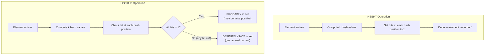
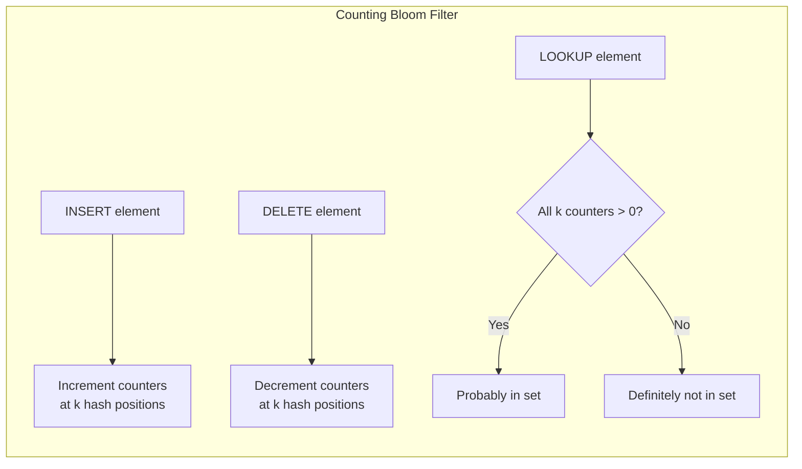
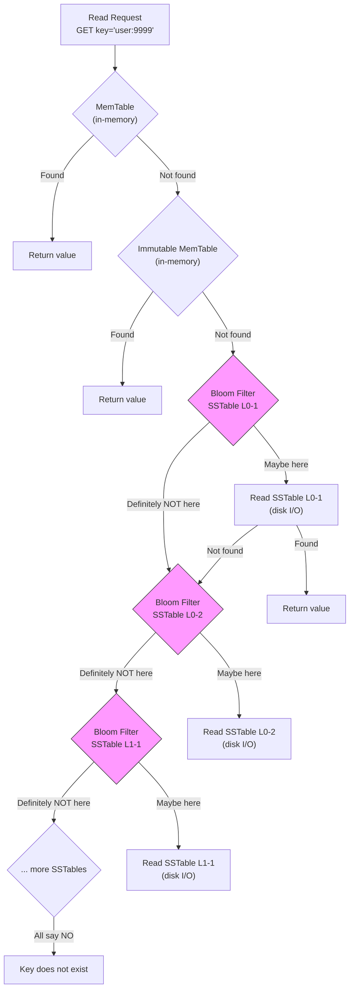

#system-design #pattern #data-structures #probabilistic

# Bloom Filters

## Intuition (30 sec)

Imagine a nightclub bouncer with a guest list, but the list is lossy. The bouncer can tell you with 100% certainty "you are NOT on the list" (definite no), but when he says "you might be on the list" he could be wrong (possible yes). He never accidentally turns away a real guest, but occasionally lets in someone who was never invited. That trade-off saves him from carrying a massive guest list — he only needs a tiny cheat sheet.

## Failure-First Scenario

> You have a Cassandra cluster with 1,000 SSTables per node. A read request arrives for key "user:9999". Without Bloom filters, Cassandra must open and search ALL 1,000 SSTables on disk to determine the key doesn't exist — that's 1,000 disk seeks. With a Bloom filter per SSTable, Cassandra checks each filter in memory: 997 say "definitely not here" (skip), 3 say "maybe here" (read only these). You went from 1,000 disk reads to 3. That's a 333x reduction for non-existent keys.

## Core Definitions

### Bloom Filter
A space-efficient probabilistic data structure that tests whether an element is a member of a set. It can tell you definitively that an element is NOT in the set, or that it PROBABLY is in the set. It never produces false negatives but may produce false positives.

### Bit Array
A fixed-size array of bits (0s and 1s) that forms the backbone of a Bloom filter. All bits start at 0. When elements are added, specific bits are set to 1 based on hash function outputs.

### Hash Functions
Deterministic functions (MurmurHash, FNV, CityHash) that map an input to a position in the bit array. A Bloom filter uses k independent hash functions, each mapping an element to one of m bit positions.

### False Positive
When the filter says "element might be in the set" but the element was never added. Occurs when all k bit positions happen to be set by other elements. Rate is controllable by tuning m and k.

### False Negative
When the filter says "element is not in the set" but it actually was added. This NEVER happens with a standard Bloom filter — if an element was inserted, all its bit positions are guaranteed to be set to 1.

### Fill Ratio
The proportion of bits set to 1 in the bit array. As more elements are added, the fill ratio increases and the false positive rate rises. When fill ratio approaches 50%, the filter becomes unreliable.

## Working Knowledge (5 min)

### How It Works — The Big Picture

```
Bloom Filter: a bit array of m bits + k hash functions

Empty filter (m=16 bits):
┌───┬───┬───┬───┬───┬───┬───┬───┬───┬───┬───┬───┬───┬───┬───┬───┐
│ 0 │ 0 │ 0 │ 0 │ 0 │ 0 │ 0 │ 0 │ 0 │ 0 │ 0 │ 0 │ 0 │ 0 │ 0 │ 0 │
└───┴───┴───┴───┴───┴───┴───┴───┴───┴───┴───┴───┴───┴───┴───┴───┘
  0   1   2   3   4   5   6   7   8   9  10  11  12  13  14  15

Properties:
• Can ADD elements       ✅
• Can CHECK membership   ✅
• Can DELETE elements     ❌ (standard Bloom filter)
• Can LIST elements       ❌
• Can COUNT elements      ❌ (exactly)

Guarantees:
• "Not in set"  → 100% certain  (no false negatives)
• "In set"      → maybe wrong   (possible false positives)
```

### How Insert Works (Step by Step)

```
INSERT "apple" using k=3 hash functions:

Step 1: Hash the element with each hash function
  h1("apple") = 2
  h2("apple") = 7
  h3("apple") = 13

Step 2: Set those bit positions to 1

Before:
┌───┬───┬───┬───┬───┬───┬───┬───┬───┬───┬───┬───┬───┬───┬───┬───┐
│ 0 │ 0 │ 0 │ 0 │ 0 │ 0 │ 0 │ 0 │ 0 │ 0 │ 0 │ 0 │ 0 │ 0 │ 0 │ 0 │
└───┴───┴───┴───┴───┴───┴───┴───┴───┴───┴───┴───┴───┴───┴───┴───┘
  0   1   2   3   4   5   6   7   8   9  10  11  12  13  14  15

After INSERT "apple":
┌───┬───┬───┬───┬───┬───┬───┬───┬───┬───┬───┬───┬───┬───┬───┬───┐
│ 0 │ 0 │ 1 │ 0 │ 0 │ 0 │ 0 │ 1 │ 0 │ 0 │ 0 │ 0 │ 0 │ 1 │ 0 │ 0 │
└───┴───┴───┴───┴───┴───┴───┴───┴───┴───┴───┴───┴───┴───┴───┴───┘
  0   1  [2]  3   4   5   6  [7]  8   9  10  11  12 [13] 14  15
          ↑                   ↑                       ↑
         h1                  h2                      h3


INSERT "banana":
  h1("banana") = 5
  h2("banana") = 7    ← already set by "apple" (collision, that's OK)
  h3("banana") = 11

After INSERT "banana":
┌───┬───┬───┬───┬───┬───┬───┬───┬───┬───┬───┬───┬───┬───┬───┬───┐
│ 0 │ 0 │ 1 │ 0 │ 0 │ 1 │ 0 │ 1 │ 0 │ 0 │ 0 │ 1 │ 0 │ 1 │ 0 │ 0 │
└───┴───┴───┴───┴───┴───┴───┴───┴───┴───┴───┴───┴───┴───┴───┴───┘
  0   1  [2]  3   4  [5]  6  [7]  8   9  10 [11] 12 [13] 14  15
```

### How Lookup Works (Step by Step)

```
LOOKUP "apple":
  h1("apple") = 2  → bit[2]  = 1 ✓
  h2("apple") = 7  → bit[7]  = 1 ✓
  h3("apple") = 13 → bit[13] = 1 ✓
  ALL bits are 1 → "PROBABLY IN SET" ✓ (correct, we did add "apple")


LOOKUP "cherry":
  h1("cherry") = 2  → bit[2]  = 1 ✓
  h2("cherry") = 9  → bit[9]  = 0 ✗
  h3("cherry") = 14 → bit[14] = 0 ✗
  At least one bit is 0 → "DEFINITELY NOT IN SET" ✓ (correct)


LOOKUP "grape" (FALSE POSITIVE example):
  h1("grape") = 5  → bit[5]  = 1 ✓  (set by "banana")
  h2("grape") = 7  → bit[7]  = 1 ✓  (set by "apple" and "banana")
  h3("grape") = 13 → bit[13] = 1 ✓  (set by "apple")
  ALL bits are 1 → "PROBABLY IN SET" ✗ (FALSE POSITIVE! "grape" was never added)
```

### Visual: Bloom Filter Lifecycle



### False Positive Probability

**Formula:**

```
FP Rate = (1 - e^(-kn/m))^k

Where:
  m = number of bits in the filter
  n = number of elements inserted
  k = number of hash functions
  e = Euler's number (2.71828...)
```

**Optimal number of hash functions:**

```
k_optimal = (m/n) * ln(2) ≈ 0.693 * (m/n)
```

**Optimal bits per element for a target FP rate:**

```
m/n = -1.44 * log2(FP rate)

Example: For 1% FP rate:
  m/n = -1.44 * log2(0.01) = -1.44 * (-6.64) ≈ 9.6 bits per element
```

### Parameter Selection Table

| Target FP Rate | Bits per Element (m/n) | Optimal k (hash functions) | Memory for 1M elements |
|----------------|----------------------|---------------------------|----------------------|
| 10% (1 in 10) | 4.8 | 3 | 0.6 MB |
| 5% (1 in 20) | 6.2 | 4 | 0.8 MB |
| 1% (1 in 100) | 9.6 | 7 | 1.2 MB |
| 0.1% (1 in 1,000) | 14.4 | 10 | 1.8 MB |
| 0.01% (1 in 10,000) | 19.2 | 13 | 2.4 MB |

**Key insight:** Memory grows linearly with number of elements, NOT with the size of the universe. Storing 1 billion elements with 1% FP rate needs only ~1.2 GB.

### Comparison: Bloom Filter vs. Alternatives

```
Storing 1 billion URLs (avg 100 bytes each):

HashSet:
  Memory: ~100 GB (actual strings + overhead)
  FP rate: 0%
  Lookup: O(1)

Bloom Filter (1% FP):
  Memory: ~1.2 GB (just bits)
  FP rate: 1%
  Lookup: O(k) where k ≈ 7

Bloom Filter (0.1% FP):
  Memory: ~1.8 GB (just bits)
  FP rate: 0.1%
  Lookup: O(k) where k ≈ 10

Savings: 50-80x memory reduction for 1% acceptable error
```

## Deep Dive

### Visual: Why False Negatives Are Impossible

```
Proof by contradiction:

Assume element X was inserted.
  → h1(X), h2(X), ..., hk(X) were all set to 1

Bits can ONLY go from 0 → 1, NEVER from 1 → 0.
  → Those bits are STILL 1

When we LOOKUP X:
  → ALL k positions are checked
  → ALL are still 1
  → Filter says "probably in set"

Therefore: if X was inserted, lookup ALWAYS says "probably in set"
           → false negatives are impossible ∎
```

### Visual: Why False Positives Happen

```
Scenario: m=16 bits, k=3, after inserting many elements

┌───┬───┬───┬───┬───┬───┬───┬───┬───┬───┬───┬───┬───┬───┬───┬───┐
│ 1 │ 0 │ 1 │ 1 │ 0 │ 1 │ 1 │ 1 │ 0 │ 1 │ 1 │ 1 │ 0 │ 1 │ 1 │ 0 │
└───┴───┴───┴───┴───┴───┴───┴───┴───┴───┴───┴───┴───┴───┴───┴───┘
  Fill ratio: 11/16 = 68.75% ← TOO HIGH

Element "never_added" hashes to positions 3, 6, 13:
  bit[3]  = 1 ✓ (set by some other element)
  bit[6]  = 1 ✓ (set by some other element)
  bit[13] = 1 ✓ (set by some other element)
  ALL bits happen to be 1 → FALSE POSITIVE

As fill ratio increases → false positives increase dramatically
Recommendation: Keep fill ratio below 50%
```

### Why You Cannot Delete from a Standard Bloom Filter

```
State after inserting "apple" and "banana":
┌───┬───┬───┬───┬───┬───┬───┬───┬───┬───┬───┬───┬───┬───┬───┬───┐
│ 0 │ 0 │ 1 │ 0 │ 0 │ 1 │ 0 │ 1 │ 0 │ 0 │ 0 │ 1 │ 0 │ 1 │ 0 │ 0 │
└───┴───┴───┴───┴───┴───┴───┴───┴───┴───┴───┴───┴───┴───┴───┴───┘

"apple":  h1=2, h2=7, h3=13
"banana": h1=5, h2=7, h3=11
                   ↑
            SHARED BIT (position 7)

If we DELETE "apple" by clearing bits 2, 7, 13:
  bit[7] goes from 1 → 0

Now LOOKUP "banana": h2=7 → bit[7] = 0 → "DEFINITELY NOT IN SET"
  ↑ FALSE NEGATIVE! "banana" IS in the set!

Clearing bits can destroy information about OTHER elements.
This is why standard Bloom filters don't support deletion.
```

### Variants

#### Counting Bloom Filter (Supports Deletion)

```
Instead of 1-bit per position, use N-bit counters (typically 4 bits):

Standard Bloom Filter (1 bit each):
┌───┬───┬───┬───┬───┬───┬───┬───┐
│ 0 │ 1 │ 1 │ 0 │ 1 │ 0 │ 1 │ 0 │
└───┴───┴───┴───┴───┴───┴───┴───┘

Counting Bloom Filter (4 bits each):
┌───┬───┬───┬───┬───┬───┬───┬───┐
│ 0 │ 2 │ 3 │ 0 │ 1 │ 0 │ 2 │ 0 │
└───┴───┴───┴───┴───┴───┴───┴───┘

INSERT: increment counters at hash positions
DELETE: decrement counters at hash positions
LOOKUP: check all counters > 0

Trade-off: 4x more memory (4 bits vs 1 bit per position)
Risk: Counter overflow if using too few bits
```



#### Scalable Bloom Filter (Grows Dynamically)

```
Problem: Standard Bloom filters have fixed size.
         If you underestimate n, FP rate blows up.

Solution: Chain of Bloom filters with tightening FP rates.

┌──────────────┐   ┌──────────────┐   ┌──────────────┐
│  BF_0        │   │  BF_1        │   │  BF_2        │
│  FP: 1%      │──→│  FP: 0.5%    │──→│  FP: 0.25%   │
│  Capacity: n │   │  Capacity: n │   │  Capacity: n │
│  (FULL)      │   │  (FULL)      │   │  (ACTIVE)    │
└──────────────┘   └──────────────┘   └──────────────┘

INSERT: Add to the ACTIVE (latest) filter
LOOKUP: Check ALL filters — if ANY says "probably yes", return "probably yes"

Combined FP rate converges to a bounded value.
Each new filter has a tighter FP rate (multiplied by ratio r < 1).

Total FP ≈ FP_0 * (1/(1-r))

For r=0.5, FP_0=0.5%: Total FP ≈ 0.5% * 2 = 1%
```

#### Cuckoo Filter (Better for Deletion + Lookup)

```
Cuckoo Filter vs Bloom Filter:

                    Bloom Filter    Cuckoo Filter
─────────────────────────────────────────────────
Insert              O(k)            O(1) amortized
Lookup              O(k)            O(1)
Delete              ❌               O(1)
Space efficiency    Good            Better (at FP < 3%)
False positive      Tunable         Tunable
False negative      Never           Never
Implementation      Simple          More complex

How Cuckoo Filter works:
1. Store fingerprints (partial hashes) in a cuckoo hash table
2. Each element has 2 possible bucket positions
3. INSERT: Place fingerprint in one of 2 buckets
   If both full → "kick out" existing item to its alternate bucket
4. LOOKUP: Check if fingerprint exists in either bucket
5. DELETE: Remove fingerprint from bucket

Best when:
• Need deletion support
• Target FP rate < 3%
• Want simpler lookups (check 2 locations vs k)
```

### Bloom Filter in the LSM Tree Read Path



```
Performance impact of Bloom filters on LSM tree reads:

Without Bloom Filters:
  Read "user:9999" → must check ALL SSTables
  100 SSTables × 1 disk seek each = 100 disk I/Os
  Latency: ~100ms

With Bloom Filters (1% FP rate):
  Read "user:9999" → check each Bloom filter first (in memory)
  99 filters say "not here" (skip)
  1 filter says "maybe here" (read SSTable)
  Disk I/Os: 1 (plus ~1 false positive on average)
  Latency: ~2ms

Result: 50x latency reduction for non-existent keys
```

### Real-World Usage

#### Google Bigtable / HBase

```
Problem: Bigtable stores data in SSTables (Sorted String Tables).
         A read must determine which SSTables contain the key.
         Without Bloom filters: scan all SSTables (slow).

Solution: Each SSTable has an associated Bloom filter.
         Before reading an SSTable from disk, check its Bloom filter.
         Skip SSTables that definitely don't contain the key.

Config in HBase:
  <property>
    <name>hfile.bloom.filter.type</name>
    <value>ROW</value>   <!-- ROW or ROWCOL -->
  </property>
  <property>
    <name>hfile.bloom.filter.error.rate</name>
    <value>0.01</value>  <!-- 1% false positive rate -->
  </property>
```

#### Apache Cassandra

```
Problem: Same as Bigtable — avoid unnecessary SSTable reads.

Solution: Bloom filter per SSTable, configurable FP rate.

cassandra.yaml:
  bloom_filter_fp_chance: 0.01   # Default: 1% FP rate
  # Lower = fewer false positives but more memory
  # 0.01 = ~10 bits per element
  # 0.001 = ~15 bits per element

Per-table override:
  CREATE TABLE users (
    id UUID PRIMARY KEY,
    name TEXT
  ) WITH bloom_filter_fp_chance = 0.001;  -- 0.1% for hot table

Monitoring (nodetool):
  $ nodetool cfstats users
  Bloom filter false positives: 1234
  Bloom filter false ratio: 0.00876
  Bloom filter space used: 2.4 MB
  Bloom filter off heap memory used: 2.4 MB
```

#### Google Chrome (Safe Browsing)

```
Problem: Check if a URL is malicious (phishing/malware).
         Google maintains a list of ~1M+ malicious URLs.
         Can't send every URL to Google (privacy concern).
         Can't store full list on device (too large).

Solution: Store Bloom filter of malicious URLs locally on device.

Flow:
  1. User visits URL
  2. Check local Bloom filter
  3. If "definitely not malicious" → allow (99% of cases)
  4. If "maybe malicious" → send hash prefix to Google for confirmation
  5. Google confirms or denies → show warning if confirmed

Memory: ~25 MB for millions of URLs (vs GBs for full list)
Privacy: Only sends queries for suspected URLs (1% of traffic)
```

#### Medium (Avoid Showing Already-Read Articles)

```
Problem: Don't recommend articles a user has already read.
         Storing full read history per user is expensive.
         100M users × 1000 articles each = 100B records.

Solution: Per-user Bloom filter of read article IDs.

  User reads article #4567:
    → Add "4567" to user's Bloom filter

  Recommendation engine generates candidates:
    → Check each candidate against user's Bloom filter
    → Skip "probably read" articles
    → Show "definitely not read" articles

  Memory per user: ~1.2 KB (for 1000 articles, 1% FP)
  Total for 100M users: ~120 GB (vs terabytes for full history)

  Acceptable trade-off: 1% chance of NOT showing an unread article
  (user never notices, way better than showing read articles)
```

#### Bitcoin (SPV Nodes)

```
Problem: Lightweight Bitcoin nodes (phones, IoT) can't store
         the full blockchain (~500 GB).
         They only care about transactions involving their addresses.

Solution: SPV (Simplified Payment Verification) uses Bloom filters.

  1. Lightweight node creates Bloom filter with its Bitcoin addresses
  2. Sends filter to full node
  3. Full node filters transactions through the Bloom filter
  4. Only matching transactions are sent to lightweight node

  Bandwidth savings: Receive ~0.1% of transactions instead of 100%
  Privacy: False positives provide plausible deniability
           (node receives some transactions it doesn't care about,
            so full node can't know exact addresses)
```

#### Cloudflare (Bot Detection / WAF)

```
Problem: Identify known malicious IPs and request patterns.
         Checking against a database for every request is too slow.
         Need sub-microsecond lookups at millions of RPS.

Solution: In-memory Bloom filter of known bad IPs/signatures.

  Request arrives:
    1. Check IP against Bloom filter of known bad IPs
    2. If "definitely not bad" → proceed (fast path)
    3. If "maybe bad" → check detailed database (slow path)

  At 10M RPS:
    Without Bloom filter: 10M database lookups/sec (expensive)
    With Bloom filter: ~100K database lookups/sec (1% FP)
    Savings: 99% fewer database queries
```

### Implementation (Java)

```java
import java.util.BitSet;
import java.nio.charset.StandardCharsets;
import java.security.MessageDigest;
import java.security.NoSuchAlgorithmException;

/**
 * Simple Bloom Filter implementation.
 *
 * Usage:
 *   BloomFilter bf = new BloomFilter(1_000_000, 0.01); // 1M elements, 1% FP
 *   bf.add("hello");
 *   bf.mightContain("hello");  // true
 *   bf.mightContain("world");  // false (probably)
 */
public class BloomFilter {

    private final BitSet bitSet;
    private final int bitSetSize;      // m: number of bits
    private final int numHashFunctions; // k: number of hash functions
    private int elementCount;           // n: elements inserted

    /**
     * Create a Bloom filter with optimal parameters.
     *
     * @param expectedElements  Expected number of elements (n)
     * @param falsePositiveRate Target false positive rate (e.g., 0.01 for 1%)
     */
    public BloomFilter(int expectedElements, double falsePositiveRate) {
        // Calculate optimal bit array size: m = -n * ln(p) / (ln(2))^2
        this.bitSetSize = optimalBitSize(expectedElements, falsePositiveRate);

        // Calculate optimal hash function count: k = (m/n) * ln(2)
        this.numHashFunctions = optimalHashCount(bitSetSize, expectedElements);

        this.bitSet = new BitSet(bitSetSize);
        this.elementCount = 0;
    }

    /**
     * Add an element to the filter.
     * Once added, the element can never be removed.
     */
    public void add(String element) {
        int[] hashes = getHashes(element);
        for (int hash : hashes) {
            bitSet.set(Math.abs(hash % bitSetSize));
        }
        elementCount++;
    }

    /**
     * Check if an element MIGHT be in the set.
     *
     * @return false = DEFINITELY not in set (guaranteed)
     *         true  = PROBABLY in set (may be false positive)
     */
    public boolean mightContain(String element) {
        int[] hashes = getHashes(element);
        for (int hash : hashes) {
            if (!bitSet.get(Math.abs(hash % bitSetSize))) {
                return false; // At least one bit is 0 → definitely not in set
            }
        }
        return true; // All bits are 1 → probably in set
    }

    /**
     * Get current fill ratio (proportion of bits set to 1).
     * When this exceeds 0.5, consider resizing.
     */
    public double getFillRatio() {
        return (double) bitSet.cardinality() / bitSetSize;
    }

    /**
     * Estimate current false positive rate based on fill ratio.
     */
    public double estimatedFalsePositiveRate() {
        double fillRatio = getFillRatio();
        return Math.pow(fillRatio, numHashFunctions);
    }

    /**
     * Generate k hash values for an element using double hashing.
     * Uses: h_i(x) = h1(x) + i * h2(x)
     * This produces k independent hashes from just 2 hash functions.
     */
    private int[] getHashes(String element) {
        int[] result = new int[numHashFunctions];
        try {
            byte[] bytes = element.getBytes(StandardCharsets.UTF_8);
            MessageDigest md5 = MessageDigest.getInstance("MD5");
            MessageDigest sha1 = MessageDigest.getInstance("SHA-1");

            byte[] md5Hash = md5.digest(bytes);
            byte[] sha1Hash = sha1.digest(bytes);

            int hash1 = bytesToInt(md5Hash);
            int hash2 = bytesToInt(sha1Hash);

            // Double hashing: h_i = hash1 + i * hash2
            for (int i = 0; i < numHashFunctions; i++) {
                result[i] = hash1 + (i * hash2);
            }
        } catch (NoSuchAlgorithmException e) {
            throw new RuntimeException("Hash algorithm not available", e);
        }
        return result;
    }

    private int bytesToInt(byte[] bytes) {
        return ((bytes[0] & 0xFF) << 24)
             | ((bytes[1] & 0xFF) << 16)
             | ((bytes[2] & 0xFF) << 8)
             | (bytes[3] & 0xFF);
    }

    /**
     * Optimal bit array size: m = -n * ln(p) / (ln(2))^2
     */
    private static int optimalBitSize(int n, double p) {
        return (int) Math.ceil(-n * Math.log(p) / (Math.log(2) * Math.log(2)));
    }

    /**
     * Optimal number of hash functions: k = (m/n) * ln(2)
     */
    private static int optimalHashCount(int m, int n) {
        return Math.max(1, (int) Math.round((double) m / n * Math.log(2)));
    }

    // --- Getters for monitoring ---

    public int getBitSetSize() { return bitSetSize; }
    public int getNumHashFunctions() { return numHashFunctions; }
    public int getElementCount() { return elementCount; }
}
```

**Usage Example:**

```java
public class BloomFilterDemo {
    public static void main(String[] args) {
        // Create filter for 1 million elements with 1% FP rate
        BloomFilter bf = new BloomFilter(1_000_000, 0.01);

        System.out.println("Bit array size: " + bf.getBitSetSize());       // ~9,585,059
        System.out.println("Hash functions: " + bf.getNumHashFunctions()); // 7

        // Insert elements
        for (int i = 0; i < 1_000_000; i++) {
            bf.add("element_" + i);
        }

        // Test membership (true positives)
        System.out.println(bf.mightContain("element_0"));       // true
        System.out.println(bf.mightContain("element_999999"));  // true

        // Test non-members (should mostly be false, ~1% false positives)
        int falsePositives = 0;
        int testCount = 100_000;
        for (int i = 0; i < testCount; i++) {
            if (bf.mightContain("not_in_set_" + i)) {
                falsePositives++;
            }
        }

        System.out.println("False positive rate: "
            + (100.0 * falsePositives / testCount) + "%");  // ~1%
        System.out.println("Fill ratio: " + bf.getFillRatio());  // ~0.5

        // Memory: ~1.2 MB for 1M elements (vs ~50 MB for HashSet<String>)
    }
}
```

### Implementation (Python)

```python
import math
import hashlib
from typing import List

class BloomFilter:
    """
    Space-efficient probabilistic set membership test.

    Guarantees:
        - mightContain returns False → element DEFINITELY not in set
        - mightContain returns True  → element PROBABLY in set (FP possible)
    """

    def __init__(self, expected_elements: int, fp_rate: float = 0.01):
        # Optimal bit array size: m = -n * ln(p) / (ln(2))^2
        self.size = self._optimal_size(expected_elements, fp_rate)

        # Optimal hash count: k = (m/n) * ln(2)
        self.hash_count = self._optimal_hash_count(
            self.size, expected_elements
        )

        self.bit_array = [False] * self.size
        self.count = 0

    def add(self, element: str) -> None:
        """Add element to the filter."""
        for i in range(self.hash_count):
            idx = self._hash(element, i) % self.size
            self.bit_array[idx] = True
        self.count += 1

    def might_contain(self, element: str) -> bool:
        """
        Check if element might be in the set.

        Returns:
            False → DEFINITELY not in set
            True  → PROBABLY in set
        """
        for i in range(self.hash_count):
            idx = self._hash(element, i) % self.size
            if not self.bit_array[idx]:
                return False  # Guaranteed not in set
        return True  # Might be in set

    def fill_ratio(self) -> float:
        """Proportion of bits set to 1."""
        return sum(self.bit_array) / self.size

    def estimated_fp_rate(self) -> float:
        """Current estimated false positive rate."""
        return (1 - math.exp(-self.hash_count * self.count / self.size)) \
               ** self.hash_count

    def _hash(self, element: str, seed: int) -> int:
        """Generate hash using double hashing technique."""
        h = hashlib.sha256(
            f"{element}:{seed}".encode()
        ).hexdigest()
        return int(h, 16)

    @staticmethod
    def _optimal_size(n: int, p: float) -> int:
        return int(-n * math.log(p) / (math.log(2) ** 2))

    @staticmethod
    def _optimal_hash_count(m: int, n: int) -> int:
        return max(1, int(round(m / n * math.log(2))))


# Usage
bf = BloomFilter(expected_elements=1_000_000, fp_rate=0.01)
print(f"Bits: {bf.size:,}")        # ~9,585,059
print(f"Hash functions: {bf.hash_count}")  # 7

bf.add("apple")
bf.add("banana")

print(bf.might_contain("apple"))   # True (correct)
print(bf.might_contain("cherry"))  # False (correct, probably)
```

## Production Considerations

### Memory Sizing Calculator

```
Given:
  n = expected number of elements
  p = desired false positive rate

Calculate:
  m (bits)  = -n * ln(p) / (ln(2))^2
  k (hashes) = (m/n) * ln(2)
  Memory     = m / 8 bytes

Examples:
┌──────────────┬─────────┬───────────┬────────┬──────────┐
│ Elements (n) │ FP Rate │ Bits (m)  │ k      │ Memory   │
├──────────────┼─────────┼───────────┼────────┼──────────┤
│ 100,000      │ 1%      │ 958,506   │ 7      │ 117 KB   │
│ 1,000,000    │ 1%      │ 9,585,059 │ 7      │ 1.14 MB  │
│ 10,000,000   │ 1%      │ 95.8M     │ 7      │ 11.4 MB  │
│ 100,000,000  │ 1%      │ 958M      │ 7      │ 114 MB   │
│ 1,000,000,000│ 1%      │ 9.58B     │ 7      │ 1.14 GB  │
│ 1,000,000    │ 0.1%    │ 14.3M     │ 10     │ 1.72 MB  │
│ 1,000,000    │ 0.01%   │ 19.2M     │ 13     │ 2.28 MB  │
└──────────────┴─────────┴───────────┴────────┴──────────┘

Rule of thumb:
  ~10 bits per element for 1% FP rate
  ~15 bits per element for 0.1% FP rate
  ~20 bits per element for 0.01% FP rate
```

### When to Use Bloom Filters

```
USE Bloom Filter when:
✅ You need to test set membership at massive scale
✅ False positives are acceptable (can be verified later)
✅ False negatives are NOT acceptable
✅ Memory is a constraint (can't store full set)
✅ Speed matters (need O(k) constant-time lookups)
✅ Data is write-once (no deletions needed) — or use Counting variant
✅ The "probably yes" case triggers a slower but definitive check

Examples:
  • "Does this SSTable contain this key?" → check Bloom filter, then disk
  • "Is this URL malicious?" → check Bloom filter, then server
  • "Has this user seen this article?" → check Bloom filter
  • "Is this username taken?" → check Bloom filter, then database
```

### When NOT to Use Bloom Filters

```
DO NOT use Bloom Filter when:
❌ False positives are unacceptable (financial transactions, auth)
❌ You need to enumerate set members
❌ You need exact counts
❌ You need deletion (use Counting Bloom Filter or Cuckoo Filter)
❌ The set is small enough to fit in a HashSet
❌ You need the actual stored values (Bloom filters store NO data)
❌ You need 100% accuracy in both directions

Anti-patterns:
  • "Is this credit card number valid?" → false positive = bad
  • "How many unique users visited?" → need HyperLogLog instead
  • "What items did the user view?" → need actual storage
  • "Remove user from blacklist" → standard BF can't delete
```

### Integration with Databases (LSM Tree Read Path)

```
How Bloom Filters Save Disk I/O in LSM-Tree Databases:

LSM Tree structure:
  ┌────────────────────────┐
  │  MemTable (RAM)        │  ← Writes go here first
  ├────────────────────────┤
  │  Immutable MemTable    │  ← Flushed to disk as SSTable
  ├────────────────────────┤
  │  Level 0: 4 SSTables   │  ← Each has a Bloom filter
  │  Level 1: 10 SSTables  │  ← Each has a Bloom filter
  │  Level 2: 100 SSTables │  ← Each has a Bloom filter
  │  Level 3: 1000 SSTables│  ← Each has a Bloom filter
  └────────────────────────┘

Read path without Bloom filters:
  GET "key" → check MemTable → check ALL SSTables
  1114 SSTables × 1 disk seek = 1114 disk I/Os (worst case)

Read path WITH Bloom filters:
  GET "key" → check MemTable → check Bloom filter for each SSTable
  Bloom filter is in memory → O(k) per check → nanoseconds
  Only read SSTables where Bloom filter says "maybe"
  At 1% FP: ~11 false positives + 1 true positive = ~12 disk I/Os

  Savings: 1114 → 12 disk I/Os = 93x reduction
```

## Monitoring

### Key Metrics to Track

```
┌─────────────────────────────────────────────────────────────┐
│  BLOOM FILTER HEALTH DASHBOARD                              │
├─────────────────────────────────────────────────────────────┤
│                                                             │
│ Fill Ratio: 47.3%                                          │
│ Definition: Proportion of bits set to 1                    │
│ Target: < 50% (above 50% → FP rate increases rapidly)     │
│ Alert: > 60% → consider resizing or creating new filter    │
│                                                             │
│ False Positive Rate (measured): 0.87%                      │
│ Definition: % of "maybe yes" that were actually "no"       │
│ Target: < configured FP rate (e.g., 1%)                    │
│ Alert: > 2x configured rate → filter is overloaded         │
│                                                             │
│ Elements Inserted: 847,293 / 1,000,000 capacity            │
│ Definition: Number of elements added to the filter          │
│ Target: < expected capacity                                 │
│ Alert: > 90% capacity → prepare replacement filter          │
│                                                             │
│ Memory Usage: 1.14 MB                                       │
│ Definition: RAM consumed by the bit array                   │
│ Baseline: m/8 bytes (should be constant after creation)    │
│                                                             │
│ Lookup Latency (p99): 0.8 microseconds                     │
│ Definition: Time to check membership                        │
│ Target: < 10 microseconds                                   │
│ Alert: > 100 microseconds → check memory pressure           │
│                                                             │
│ Lookups Saved: 93.2% (disk reads avoided)                  │
│ Definition: % of lookups where BF said "definitely not"    │
│ Purpose: Measures ROI of the Bloom filter                   │
│ Alert: < 50% → filter may not be providing value            │
│                                                             │
└─────────────────────────────────────────────────────────────┘
```

### Prometheus Metrics Example

```yaml
# Bloom filter metrics for monitoring
bloom_filter_fill_ratio:
  type: gauge
  help: "Proportion of bits set to 1 (0.0 to 1.0)"
  labels: [filter_name]

bloom_filter_false_positive_rate:
  type: gauge
  help: "Measured false positive rate"
  labels: [filter_name]

bloom_filter_lookups_total:
  type: counter
  help: "Total number of membership lookups"
  labels: [filter_name, result]  # result: "definitely_not", "probably_yes"

bloom_filter_elements_count:
  type: gauge
  help: "Number of elements inserted"
  labels: [filter_name]

# Alerting rules
groups:
  - name: bloom_filter_alerts
    rules:
      - alert: BloomFilterOverloaded
        expr: bloom_filter_fill_ratio > 0.6
        for: 5m
        labels:
          severity: warning
        annotations:
          summary: "Bloom filter fill ratio > 60%"
          description: "FP rate is increasing. Consider resizing."

      - alert: BloomFilterHighFPRate
        expr: >
          rate(bloom_filter_lookups_total{result="probably_yes"}[5m]) /
          rate(bloom_filter_lookups_total[5m]) > 0.05
        for: 10m
        labels:
          severity: critical
        annotations:
          summary: "Bloom filter FP rate > 5%"
          description: "Filter is degraded. Immediate resize needed."
```

## Interview Prep

### Concept Glossary

Quick reference definitions for interviews:

- **Bloom Filter:** Probabilistic data structure for set membership testing; no false negatives, possible false positives
- **Bit Array:** Fixed-size array of 0/1 bits forming the filter backbone
- **Hash Functions (k):** Independent functions mapping elements to bit positions
- **False Positive:** Filter says "maybe in set" but element was never added
- **False Negative:** Filter says "not in set" but element was added — NEVER HAPPENS
- **Fill Ratio:** Proportion of bits set to 1; higher = more false positives
- **Counting Bloom Filter:** Variant using counters instead of bits, supports deletion
- **Cuckoo Filter:** Alternative that supports deletion with better space efficiency at low FP rates
- **Scalable Bloom Filter:** Chain of filters that grows dynamically as elements are added

### Common Interview Questions

**Q: How do you efficiently check if an element exists in a very large set?**

**Answer Structure:**

1. **Define the problem (5-10 sec):**
   "If the set is too large to fit in memory as a HashSet, we need a space-efficient alternative. A Bloom filter can test membership using only ~10 bits per element."

2. **Explain how (15-20 sec):**
   "A Bloom filter uses a bit array of m bits and k hash functions. To add an element, we hash it k times and set those bit positions to 1. To check membership, we hash the element and verify all k positions are 1. If any bit is 0, the element is definitely not in the set. If all are 1, it's probably in the set."

3. **State the trade-off (10 sec):**
   "The trade-off is false positives: the filter might say 'probably yes' for elements not in the set. The rate is tunable — 1% FP rate costs ~10 bits per element. False negatives never occur."

4. **Give a real-world example (10 sec):**
   "Cassandra uses a Bloom filter per SSTable to avoid unnecessary disk reads. Chrome uses one to check URLs against a malicious URL list without sending every URL to Google."

---

**Q: How does a Bloom filter work in a database like Cassandra?**

**Answer Structure:**

1. **Context (10 sec):**
   "Cassandra uses LSM trees, which store data across multiple SSTables on disk. A read must find which SSTable contains a key."

2. **How it helps (15 sec):**
   "Each SSTable has an associated Bloom filter stored in memory. Before doing a disk read on an SSTable, Cassandra checks its Bloom filter. If the filter says 'definitely not here,' the SSTable is skipped entirely."

3. **Impact (10 sec):**
   "With 1,000 SSTables and a 1% FP rate, a lookup for a non-existent key checks ~10 SSTables instead of 1,000. That's a 100x reduction in disk I/O."

4. **Configuration (10 sec):**
   "The FP rate is configurable per table. Hot tables might use 0.01% (more memory, fewer false positives), cold tables might use 10% (less memory, more false positives). It's set via bloom_filter_fp_chance."

---

**Q: What are the limitations of Bloom filters?**

**Answer Structure:**

1. **False positives (10 sec):**
   "Bloom filters can report that an element is in the set when it isn't. This is tunable but never zero."

2. **No deletion (10 sec):**
   "Standard Bloom filters can't remove elements — clearing bits would break other elements that share those positions. Counting Bloom Filters solve this at 4x memory cost."

3. **No enumeration (5 sec):**
   "You can't list the elements in a Bloom filter or retrieve stored data. It only answers 'is this element possibly present?'"

4. **Fixed capacity (10 sec):**
   "Once the filter fills up, the FP rate degrades. Scalable Bloom Filters address this by chaining multiple filters with tightening error rates."

---

**Q: Bloom filter vs. Cuckoo filter — when to use which?**

**Answer Structure:**

1. **Bloom filter (10 sec):**
   "Simpler implementation. Better when FP rate > 3%. No deletion support in standard variant. Widely supported in databases like Cassandra and HBase."

2. **Cuckoo filter (10 sec):**
   "Supports deletion natively. Better space efficiency at FP rates below 3%. Constant-time lookups (check 2 buckets vs k hash positions). More complex implementation."

3. **Decision (10 sec):**
   "Use Bloom filter for read-only membership checks at scale — most database use cases. Use Cuckoo filter when you need deletion or when targeting very low FP rates."

### Interview Tips — Practical Advice

**Always Mention These:**
- "A Bloom filter never produces false negatives — if it says 'not in set,' that's guaranteed correct"
- "The FP rate is configurable: ~10 bits per element gives 1% false positives"
- "Databases like Cassandra and HBase use Bloom filters to avoid unnecessary disk reads"
- "It's a space-time trade-off: use 1% of the memory of a HashSet with 1% false positive rate"

**When to Bring Up Bloom Filters in an Interview:**
- When discussing LSM-tree databases (Cassandra, HBase, RocksDB, LevelDB)
- When the interviewer asks about checking membership in a very large set
- When designing a web crawler (avoid re-crawling visited URLs)
- When designing a cache system (quickly check if key might be cached)
- When discussing CDN or firewall systems (IP blacklist checking)
- When designing recommendation systems (avoid showing repeated content)

**Advanced Topics That Impress:**
- Counting Bloom Filters for deletion support
- Scalable Bloom Filters for dynamic sizing
- Cuckoo Filters as an alternative
- Integration with LSM tree read path
- Optimal parameter derivation (m, k formulas)
- Fill ratio monitoring and when to rebuild

## The "Why" Chain

- **Why Bloom filters?** → Test set membership in O(k) time using only ~10 bits per element instead of storing full elements
- **What's the alternative?** → HashSet (100% accurate but uses 50-80x more memory), sorted array with binary search (O(log n) but stores full elements)
- **What breaks without it?** → Cassandra/HBase reads become 100x slower for non-existent keys; Chrome can't check URLs locally; cache lookups hit disk unnecessarily
- **Why accept false positives?** → The "probably yes" case triggers a definitive check (disk read, server query); the "definitely no" case is the common fast path that avoids expensive operations
- **When does it fail?** → When the filter overflows (too many elements → high FP rate), when false positives are unacceptable, when you need deletion (use Counting BF)

## Quick Reference

| Aspect | Recommendation |
|--------|---------------|
| **Bits per element** | 10 for 1% FP, 15 for 0.1% FP, 20 for 0.01% FP |
| **Hash functions (k)** | 7 for 1% FP, 10 for 0.1% FP, 13 for 0.01% FP |
| **Hash algorithm** | MurmurHash3, FNV-1a, or double hashing (MD5 + SHA1) |
| **Fill ratio alert** | > 50% warning, > 60% critical |
| **FP rate alert** | > 2x configured rate |
| **Capacity planning** | Size for 1.5x expected elements to account for growth |
| **Deletion support** | Use Counting Bloom Filter (4x memory) or Cuckoo Filter |
| **Dynamic sizing** | Use Scalable Bloom Filter (chain of filters) |

## Links

- [[03_design_patterns/database_indexing]] — Bloom filters complement B-tree indexes in LSM tree databases
- [[02_building_blocks/databases_nosql]] — Cassandra, HBase, and other NoSQL databases use Bloom filters extensively
- [[03_design_patterns/write_ahead_log]] — WAL + LSM tree + Bloom filter form the core storage engine pattern
- [[03_design_patterns/consistent_hashing]] — Both are techniques for managing large-scale distributed data
- [[15_intermediate_topics/database_internals]] — LSM tree read path relies heavily on Bloom filters
