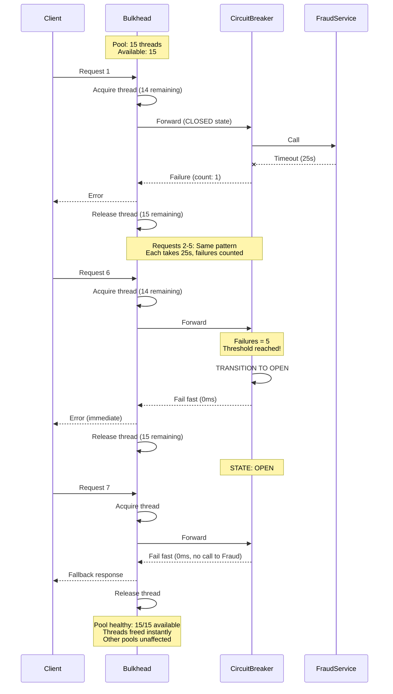

#system-design #pattern #reliability #resilience

# Bulkhead Pattern

## Intuition (30 sec)

A ship's hull is divided into watertight compartments called bulkheads. If one compartment is breached and floods, the others remain sealed, keeping the ship afloat. In software, the bulkhead pattern isolates components into separate resource pools so that a failure in one cannot drain all resources and sink the entire system.

---

## Failure-First Scenario

> Your Order Service calls 10 downstream dependencies (Payment, Inventory, Shipping, Recommendations, Reviews, Analytics, Pricing, Tax, Fraud, Notifications) using a single shared thread pool of 200 threads. The Fraud service deploys a bad release and starts responding in 25 seconds instead of 50ms. All 200 threads pile up waiting on Fraud. Now Payment calls timeout, Inventory calls timeout, Shipping calls timeout. Every endpoint in Order Service returns 503. A single slow dependency has taken down all 10 integrations and the entire Order Service is dead.

---

## Working Knowledge (5 min)

### Core Concepts - Definitions First

**Bulkhead:**
- **Definition:** Isolate elements of an application into separate resource pools so that if one fails, the others continue to function independently.
- **Purpose:** Prevent one slow or failing dependency from consuming all shared resources and cascading failure to unrelated parts of the system.
- **How it works:** Each downstream dependency (or workload category) gets its own dedicated pool of resources (threads, connections, memory). When one pool is exhausted, only calls to that specific dependency are affected.

**Key Terms:**
- **Thread Pool Isolation:** Dedicating a separate thread pool to each downstream service call, so exhaustion in one pool cannot starve others.
- **Semaphore Isolation:** Using a counting semaphore to limit concurrent access to a resource without the overhead of a dedicated thread pool.
- **Resource Pool:** A bounded set of reusable resources (threads, connections, sockets) allocated for a specific purpose.
- **Blast Radius:** The scope of impact when a failure occurs. Bulkheads reduce blast radius by containing failures within isolated compartments.

### Visual Model

```
WITHOUT Bulkhead (Shared Pool):
━━━━━━━━━━━━━━━━━━━━━━━━━━━━━━━━━━━━━━━━━━━━━━━━━━━━━━━━━━━━
┌──────────────────────────────────────────────────────────┐
│              Shared Thread Pool (200 threads)             │
│                                                          │
│  Fraud calls:       200 threads (all stuck, 25s each)    │  ← Slow dependency
│  Payment calls:       0 threads available                │     consumes EVERYTHING
│  Inventory calls:     0 threads available                │
│  Shipping calls:      0 threads available                │
│  All other calls:     0 threads available                │
│                                                          │
│  ENTIRE ORDER SERVICE IS FROZEN                          │
└──────────────────────────────────────────────────────────┘
```

```
WITH Bulkhead (Isolated Pools):
━━━━━━━━━━━━━━━━━━━━━━━━━━━━━━━━━━━━━━━━━━━━━━━━━━━━━━━━━━━━
┌──────────┐  ┌──────────┐  ┌──────────┐  ┌──────────┐
│  Payment │  │Inventory │  │ Shipping │  │  Fraud   │
│  Pool:20 │  │ Pool:20  │  │ Pool:15  │  │ Pool:15  │
│          │  │          │  │          │  │          │
│ Working  │  │ Working  │  │ Working  │  │ All 15   │
│  fine    │  │  fine    │  │  fine    │  │  stuck   │
│ 5/20     │  │ 3/20     │  │ 2/15     │  │ 15/15   │
│ active   │  │ active   │  │ active   │  │ FULL     │
└──────────┘  └──────────┘  └──────────┘  └──────────┘

┌──────────┐  ┌──────────┐  ┌──────────┐
│  Recs    │  │ Reviews  │  │Analytics │
│ Pool:10  │  │ Pool:10  │  │ Pool:10  │
│          │  │          │  │          │
│ Working  │  │ Working  │  │ Working  │
│  fine    │  │  fine    │  │  fine    │
│ 1/10     │  │ 2/10     │  │ 0/10    │
│ active   │  │ active   │  │ idle    │
└──────────┘  └──────────┘  └──────────┘

┌──────────────────────────────────────────────────────────┐
│  General Thread Pool (80 threads remaining)               │
│  Available for HTTP request handling and other work       │
└──────────────────────────────────────────────────────────┘

Result: 1 slow dependency → only Fraud calls fail → 9 other integrations healthy
        FAILURE ISOLATED - System remains operational
```

### Isolation Strategies

| Strategy | How It Works | Overhead | Use When |
|----------|-------------|----------|----------|
| **Thread Pool Isolation** | Dedicated thread pool per dependency. Calls execute on pool's threads, not caller's thread. | ~1-3ms per call (context switch) | Remote calls, untrusted dependencies, need timeout enforcement |
| **Semaphore Isolation** | Counting semaphore limits concurrent calls. Executes on caller's thread. | Near zero (~microseconds) | In-process calls, trusted dependencies, low-latency requirements |
| **Process Isolation** | Separate OS process per workload. Failures crash only that process. | High (memory, IPC overhead) | Untrusted code execution, different language runtimes, strict isolation |
| **Connection Pool Isolation** | Separate database/HTTP connection pools per service or tenant. | Medium (connection overhead) | Multi-tenant databases, multiple downstream APIs |

#### 1. Thread Pool Isolation (Hystrix-style)

```
┌─────────────────────────────────────────────────────┐
│                    Order Service                     │
│                                                     │
│  ┌──────────────────────┐   Request arrives on      │
│  │  Tomcat Thread Pool  │   Tomcat thread            │
│  │  (HTTP handling)     │                            │
│  └──────────┬───────────┘                            │
│             │                                        │
│             │  Hand off to dedicated pool             │
│             ▼                                        │
│  ┌────────────────┐  ┌────────────────┐             │
│  │ Payment Pool   │  │ Fraud Pool     │             │
│  │ Size: 20       │  │ Size: 15       │             │
│  │ Queue: 10      │  │ Queue: 5       │             │
│  │                │  │                │             │
│  │ Tomcat thread  │  │ Tomcat thread  │             │
│  │ is RELEASED    │  │ is RELEASED    │             │
│  │ while pool     │  │ while pool     │             │
│  │ thread does    │  │ thread does    │             │
│  │ the work       │  │ the work       │             │
│  └────────────────┘  └────────────────┘             │
│                                                     │
│  Benefit: Caller thread not blocked                  │
│  Cost: ~1-3ms overhead per call (thread switch)      │
└─────────────────────────────────────────────────────┘
```

**When to use:** Calling external services over the network, untrusted or flaky dependencies, when you need hard timeout enforcement independent of the client's thread.

#### 2. Semaphore Isolation

```
┌─────────────────────────────────────────────────────┐
│                    Order Service                     │
│                                                     │
│  ┌──────────────────────┐   Request arrives on      │
│  │  Tomcat Thread Pool  │   Tomcat thread            │
│  │  (HTTP handling)     │                            │
│  └──────────┬───────────┘                            │
│             │                                        │
│             │  Same thread, just check permit         │
│             ▼                                        │
│  ┌────────────────┐  ┌────────────────┐             │
│  │ Payment Sema   │  │ Fraud Sema     │             │
│  │ Permits: 20    │  │ Permits: 15    │             │
│  │ Used: 5        │  │ Used: 15       │             │
│  │                │  │                │             │
│  │ Tomcat thread  │  │ No permits!    │             │
│  │ CONTINUES to   │  │ Reject call    │             │
│  │ execute the    │  │ immediately    │             │
│  │ downstream     │  │                │             │
│  │ call itself    │  │                │             │
│  └────────────────┘  └────────────────┘             │
│                                                     │
│  Benefit: No thread switch overhead                  │
│  Cost: Caller thread IS blocked during call          │
└─────────────────────────────────────────────────────┘
```

**When to use:** In-memory or in-process calls, trusted dependencies with predictable latency, when ~1ms thread pool overhead is unacceptable.

#### 3. Process Isolation

Separate OS processes per workload. Each process has its own memory, threads, and heap. Communication via IPC (gRPC, HTTP, shared memory). Highest isolation, highest overhead.

**When to use:** Running untrusted third-party code, different language runtimes, strict memory/CPU isolation, Kubernetes pod-level separation.

#### 4. Connection Pool Isolation

Separate database or HTTP connection pools per service or tenant. If Tenant A runs expensive queries and exhausts its pool, Tenant B's pool is unaffected.

**When to use:** Multi-tenant SaaS applications, services connecting to multiple databases, separate read/write connection pools.

### Thread Pool Sizing Formula

```
threadPoolSize = peak_rps × p99_latency_sec × safety_multiplier

Example:
  peak_rps           = 50 requests/sec to this dependency
  p99_latency_sec    = 0.2 seconds (200ms)
  safety_multiplier  = 1.5 (handles small bursts)

  threadPoolSize = 50 × 0.2 × 1.5 = 15 threads

Interpretation:
  - At peak load, 10 requests are in-flight on average (50 × 0.2)
  - 1.5x buffer handles brief bursts above peak
  - If all 15 threads are busy, new requests are queued or rejected
  - Queue size: typically 5-10 (short buffer before rejection)
```

**Sizing Guidelines:**

```
Service Type           RPS   Latency    Multiplier   Pool Size
═══════════════════════════════════════════════════════════════
Fast (cache lookup)     200   10ms       1.2          ~3
Normal (DB query)        50   200ms      1.5          15
Slow (external API)      20   500ms      2.0          20
Very slow (batch)         5   2000ms     2.0          20

Rule of thumb:
  - Never less than 5 threads (too few = false rejections)
  - Never more than 50 per dependency (too many = wasted memory)
  - Queue size = 5-20% of pool size
  - Total threads across all pools < 70% of system thread capacity
```

---

## Deep Dive

### Bulkhead + Circuit Breaker (Always Paired)

**Why they are always paired:**
- **Bulkhead = Resource Isolation:** Prevents starvation by limiting how many threads/connections one dependency can consume. Answers: "How much damage can this dependency cause?"
- **Circuit Breaker = Failure Detection:** Detects sustained failure and stops calling the dead service entirely. Answers: "When should we stop trying?"
- **Together:** Bulkhead contains the blast radius while circuit breaker heals the wound.

```
Without Either:
  Slow dependency → consumes all threads → entire system dies

With Bulkhead Only:
  Slow dependency → consumes its 15 threads → other pools fine
  BUT: Those 15 threads keep trying a dead service for 25s each
       Callers to Fraud still wait 25s before timeout

With Circuit Breaker Only:
  Slow dependency → circuit opens after 5 failures → fail fast
  BUT: Before circuit opens, shared pool can be drained
       5 calls × 25s timeout = 125 seconds of thread starvation

With Both:
  Slow dependency → only 15 threads affected (bulkhead)
  → circuit opens after 5 failures (circuit breaker)
  → remaining 10 threads freed immediately (fail fast)
  → 0ms response time for Fraud calls (circuit open)
  → all other dependencies untouched
```



**Combined Flow Summary:**

```
Request arrives for Fraud service
        │
        ▼
┌─────────────────┐
│ Bulkhead Check   │  Step 1: Resource gate
│ Threads avail?  │
├─────────────────┤
│ YES → continue  │
│ NO  → REJECT    │  (BulkheadFullException)
│       immediately│  → return fallback
└────────┬────────┘
         │
         ▼
┌─────────────────┐
│ Circuit Breaker  │  Step 2: Health gate
│ Circuit open?   │
├─────────────────┤
│ CLOSED → call   │
│ OPEN   → REJECT │  (CircuitBreakerOpenException)
│          fast    │  → return fallback (0ms)
│ HALF   → test   │
└────────┬────────┘
         │
         ▼
┌─────────────────┐
│ Actual Call      │  Step 3: Execute
│ to Fraud Service│
├─────────────────┤
│ Success → return│
│ Failure → count │  → may trip circuit breaker
│ Timeout → count │  → may trip circuit breaker
└─────────────────┘
```

### Real-World Usage

#### Netflix Hystrix: Thread Pool per Dependency

**Problem Definition:**
Netflix's streaming platform had hundreds of microservices. A slow bookmark service caused thread exhaustion in the API gateway, which cascaded to bring down video playback, recommendations, and search. One non-critical service took down the entire platform.

**Solution Definition:**
Hystrix wrapped every external service call in a dedicated thread pool (bulkhead). Each downstream dependency got its own isolated pool of threads. When the bookmark service slowed, only its 10-thread pool was affected. The remaining 190 threads continued serving payments, recommendations, and playback.

**Results:**
- Bookmark outage isolated to 10 threads (5% of capacity)
- Video playback, search, recommendations continued working
- Platform availability improved from 99.5% to 99.99%
- 90% of functionality maintained during partial outages

#### AWS: Cell-Based Architecture as Macro-Level Bulkhead

**Problem Definition:**
AWS services like Route 53 needed to survive regional infrastructure failures without global impact. A single shared architecture meant one AZ failure could cascade to an entire region.

**Solution Definition:**
Cell-based architecture divides the system into independent cells, each handling a subset of customers. Each cell is a complete, self-contained deployment with its own resources. A failure in Cell A only affects customers in Cell A. This is the bulkhead pattern at infrastructure scale.

```
┌─────────────────────────────────────────────────────┐
│                 AWS Route 53 Example                  │
│                                                     │
│  ┌──────────┐  ┌──────────┐  ┌──────────┐          │
│  │  Cell 1  │  │  Cell 2  │  │  Cell 3  │          │
│  │          │  │          │  │          │          │
│  │Customers │  │Customers │  │Customers │          │
│  │  A-H     │  │  I-P     │  │  Q-Z     │          │
│  │          │  │          │  │          │          │
│  │ Own DB   │  │ Own DB   │  │ Own DB   │          │
│  │ Own cache│  │ Own cache│  │ Own cache│          │
│  │ Own queue│  │ Own queue│  │ Own queue│          │
│  │          │  │          │  │          │          │
│  │ If Cell 1│  │Cell 2    │  │Cell 3    │          │
│  │ fails →  │  │ healthy  │  │ healthy  │          │
│  │ only A-H │  │          │  │          │          │
│  │ affected │  │          │  │          │          │
│  └──────────┘  └──────────┘  └──────────┘          │
│                                                     │
│  Blast radius: 1/3 of customers, not 100%           │
└─────────────────────────────────────────────────────┘
```

**Key Principle:** Maximum blast radius = 1/N where N = number of cells.

#### Shopify: Pod Architecture Isolates Tenants

**Problem Definition:**
Shopify hosts millions of online stores on shared infrastructure. A viral flash sale on one store (e.g., Kylie Cosmetics) could consume all database connections and application server threads, taking down thousands of other stores.

**Solution Definition:**
Shopify uses "pods" - each pod is a complete, isolated stack (app servers, databases, caches) serving a subset of stores. A traffic spike on one pod cannot affect stores on other pods. This is tenant-level bulkhead isolation.

```
┌──────────┐  ┌──────────┐  ┌──────────┐
│  Pod 1   │  │  Pod 2   │  │  Pod 3   │
│          │  │          │  │          │
│ Store A  │  │ Store D  │  │ Store G  │
│ Store B  │  │ Store E  │  │ Store H  │
│ Store C  │  │ Store F  │  │ Store I  │
│          │  │          │  │          │
│ Own DB   │  │ Own DB   │  │ Own DB   │
│ Own Redis│  │ Own Redis│  │ Own Redis│
│ Own App  │  │ Own App  │  │ Own App  │
│ Servers  │  │ Servers  │  │ Servers  │
│          │  │          │  │          │
│ Flash    │  │ Normal   │  │ Normal   │
│ sale on  │  │ traffic  │  │ traffic  │
│ Store A  │  │          │  │          │
│ → Pod 1  │  │ Pod 2    │  │ Pod 3    │
│   under  │  │ fine     │  │ fine     │
│   load   │  │          │  │          │
└──────────┘  └──────────┘  └──────────┘
```

#### Kubernetes: Resource Limits as Container-Level Bulkheads

**Problem Definition:**
Multiple containers on a shared Kubernetes node compete for CPU and memory. One container with a memory leak or CPU-intensive workload can starve other containers on the same node.

**Solution Definition:**
Kubernetes resource requests and limits act as container-level bulkheads. Each container gets guaranteed resources (requests) and hard ceilings (limits). A runaway container hits its limit and is throttled or OOM-killed without affecting neighbors.

```yaml
# Kubernetes resource limits as bulkheads
apiVersion: apps/v1
kind: Deployment
metadata:
  name: payment-service
spec:
  template:
    spec:
      containers:
      - name: payment
        resources:
          requests:          # Guaranteed minimum (reservation)
            cpu: "500m"      # 0.5 CPU core reserved
            memory: "512Mi"  # 512MB memory reserved
          limits:            # Hard ceiling (bulkhead wall)
            cpu: "1000m"     # Cannot exceed 1 CPU core
            memory: "1Gi"    # Cannot exceed 1GB memory
            # If memory exceeds 1Gi → OOM killed (only this container)
            # If CPU exceeds 1000m → throttled (not killed)

      - name: fraud-service
        resources:
          requests:
            cpu: "250m"
            memory: "256Mi"
          limits:
            cpu: "500m"
            memory: "512Mi"
            # Fraud service memory leak → OOM kills fraud only
            # Payment service continues running on same node
```

### Implementation (Java with Resilience4j)

#### Thread Pool Bulkhead

```java
package com.example.order;

import io.github.resilience4j.bulkhead.annotation.Bulkhead;
import io.github.resilience4j.circuitbreaker.annotation.CircuitBreaker;
import org.springframework.stereotype.Service;
import org.springframework.web.client.RestTemplate;

/**
 * Order service with bulkhead isolation per dependency.
 *
 * Pattern: Bulkhead (Thread Pool) + Circuit Breaker
 * Purpose: Isolate each downstream call so one slow service
 *          cannot exhaust threads for other services.
 */
@Service
public class OrderService {

    private final RestTemplate restTemplate;

    public OrderService(RestTemplate restTemplate) {
        this.restTemplate = restTemplate;
    }

    /**
     * Payment call - isolated in its own thread pool
     *
     * @Bulkhead with THREADPOOL type:
     *   - Executes on a dedicated thread pool (not Tomcat thread)
     *   - Tomcat thread is released immediately
     *   - If pool is full, request is rejected (BulkheadFullException)
     *   - Returns CompletableFuture for async execution
     */
    @Bulkhead(
        name = "paymentBulkhead",
        type = Bulkhead.Type.THREADPOOL,
        fallbackMethod = "paymentFallback"
    )
    @CircuitBreaker(
        name = "paymentCircuitBreaker",
        fallbackMethod = "paymentFallback"
    )
    public CompletableFuture<PaymentResponse> processPayment(PaymentRequest request) {
        return CompletableFuture.supplyAsync(() ->
            restTemplate.postForObject(
                "https://payment-service/api/v1/charge",
                request,
                PaymentResponse.class
            )
        );
    }

    /**
     * Fraud check - isolated in its own thread pool
     * Separate pool from payment, so if fraud is slow,
     * payment calls are unaffected.
     */
    @Bulkhead(
        name = "fraudBulkhead",
        type = Bulkhead.Type.THREADPOOL,
        fallbackMethod = "fraudFallback"
    )
    @CircuitBreaker(
        name = "fraudCircuitBreaker",
        fallbackMethod = "fraudFallback"
    )
    public CompletableFuture<FraudResponse> checkFraud(FraudRequest request) {
        return CompletableFuture.supplyAsync(() ->
            restTemplate.postForObject(
                "https://fraud-service/api/v1/check",
                request,
                FraudResponse.class
            )
        );
    }

    // ── Fallback Methods ──────────────────────────────────────

    private CompletableFuture<PaymentResponse> paymentFallback(
            PaymentRequest request, Throwable t) {
        log.error("Payment bulkhead/circuit breaker triggered: {}",
                  t.getClass().getSimpleName());
        return CompletableFuture.completedFuture(
            PaymentResponse.builder()
                .status("QUEUED")
                .message("Payment queued for processing")
                .build()
        );
    }

    private CompletableFuture<FraudResponse> fraudFallback(
            FraudRequest request, Throwable t) {
        log.warn("Fraud check unavailable, allowing with flag: {}",
                 t.getClass().getSimpleName());
        return CompletableFuture.completedFuture(
            FraudResponse.builder()
                .status("REVIEW_LATER")
                .riskScore(-1)  // Sentinel: manual review needed
                .build()
        );
    }
}
```

#### Resilience4j Configuration (application.yml)

```yaml
# Resilience4j Bulkhead Configuration
resilience4j:
  thread-pool-bulkhead:
    instances:
      paymentBulkhead:
        # ──────────────────────────────────────────────
        # Thread Pool Sizing
        # ──────────────────────────────────────────────
        maxThreadPoolSize: 20
        # Definition: Maximum threads in this pool
        # Sizing: peak_rps × p99_latency × safety_factor
        #         50 × 0.2 × 2.0 = 20

        coreThreadPoolSize: 10
        # Definition: Threads kept alive even when idle
        # Purpose: Avoid cold start on first requests

        queueCapacity: 10
        # Definition: Waiting queue when all threads busy
        # Purpose: Buffer short bursts before rejection
        # When full: BulkheadFullException → fallback

        keepAliveDuration: 60s
        # Definition: How long idle threads above core stay alive
        # Purpose: Release resources during low traffic

      fraudBulkhead:
        maxThreadPoolSize: 15
        coreThreadPoolSize: 8
        queueCapacity: 5
        keepAliveDuration: 60s
        # Smaller pool: fraud service is less critical
        # Smaller queue: fail fast if fraud is slow

      inventoryBulkhead:
        maxThreadPoolSize: 20
        coreThreadPoolSize: 10
        queueCapacity: 10
        keepAliveDuration: 60s
```

#### Semaphore Bulkhead

```java
package com.example.order;

import io.github.resilience4j.bulkhead.annotation.Bulkhead;
import org.springframework.stereotype.Service;

/**
 * Semaphore-based bulkhead: lighter weight than thread pool.
 *
 * Key difference from thread pool:
 * - Runs on CALLER'S thread (no hand-off)
 * - Only limits concurrency (counting semaphore)
 * - No timeout enforcement (relies on HTTP client timeout)
 * - Near-zero overhead (~microseconds vs ~1-3ms)
 *
 * Use for: In-process calls, trusted dependencies, low-latency paths
 */
@Service
public class RecommendationService {

    /**
     * Semaphore bulkhead: limits concurrent calls to 25
     *
     * If 25 calls are in-flight and a 26th arrives:
     *   - If maxWaitDuration > 0: wait for a permit
     *   - If maxWaitDuration = 0: immediately reject
     *   - Rejected calls go to fallback method
     */
    @Bulkhead(
        name = "recommendationBulkhead",
        // Type defaults to SEMAPHORE (no need to specify)
        fallbackMethod = "recommendationFallback"
    )
    public List<Product> getRecommendations(String userId) {
        // This executes on the caller's thread
        // Semaphore just limits how many can run concurrently
        return recommendationClient.fetchRecommendations(userId);
    }

    private List<Product> recommendationFallback(String userId, Throwable t) {
        log.info("Recommendation bulkhead full, returning popular items: {}",
                 t.getClass().getSimpleName());
        // Return cached popular products instead
        return popularProductsCache.getTopProducts(10);
    }
}
```

```yaml
# Semaphore bulkhead configuration
resilience4j:
  bulkhead:
    instances:
      recommendationBulkhead:
        maxConcurrentCalls: 25
        # Definition: Maximum concurrent calls allowed
        # Equivalent to semaphore permit count
        # Sizing: same formula as thread pool

        maxWaitDuration: 0ms
        # Definition: Time to wait for a permit when all are taken
        # 0ms = reject immediately (fail fast)
        # >0ms = queue briefly before rejecting
        # Typical: 0-100ms
```

#### Thread Pool vs Semaphore Decision

```
START: Choosing isolation strategy
│
├─ Is the call going over the network?
│  ├─ YES → Thread Pool Isolation
│  │  REASON: Network calls can hang. Thread pool provides
│  │          hard timeout independent of caller. Caller's
│  │          thread is freed immediately.
│  │
│  └─ NO (in-process call) → Continue
│
├─ Is the dependency trusted and predictable?
│  ├─ YES → Semaphore Isolation
│  │  REASON: Low overhead, predictable latency means
│  │          caller thread won't be blocked long.
│  │
│  └─ NO → Thread Pool Isolation
│     REASON: Untrusted code might hang. Thread pool
│             prevents caller thread from blocking.
│
├─ Is latency critical (sub-millisecond)?
│  ├─ YES → Semaphore Isolation
│  │  REASON: Thread pool adds ~1-3ms context switch
│  │          overhead per call.
│  │
│  └─ NO → Either works, prefer Thread Pool for safety
│
└─ Summary:
   Thread Pool: Remote calls, untrusted deps, need timeout
   Semaphore: Local calls, trusted deps, low latency required
```

---

## Production Considerations

### Overhead of Thread Pool Isolation

```
Cost per call with Thread Pool Bulkhead:
━━━━━━━━━━━━━━━━━━━━━━━━━━━━━━━━━━━━━━
1. Thread context switch:     ~1-3ms
2. Queue insertion:           ~0.01ms
3. Future creation:           ~0.1ms
4. Memory per thread:         ~512KB - 1MB stack
5. Memory per pool (20 thds): ~10-20MB

Total per-call overhead: ~1-3ms
Total memory per pool:   ~10-20MB

For a service with 10 downstream dependencies:
  10 pools × 20 threads × 1MB = 200MB thread memory
  Overhead per call: ~2ms average

When this matters:
  - Internal P50 latency: 5ms → 2ms overhead = 40% increase (significant!)
  - External P50 latency: 200ms → 2ms overhead = 1% increase (negligible)

Rule: Use thread pool for calls with P50 > 50ms
      Use semaphore for calls with P50 < 50ms
```

### When to Use Semaphore vs Thread Pool

| Criteria | Thread Pool | Semaphore |
|----------|------------|-----------|
| **Call target** | Remote service (HTTP/gRPC) | Local/in-process call |
| **Typical latency** | > 50ms | < 50ms |
| **Timeout enforcement** | Built-in (pool controls) | Relies on HTTP client timeout |
| **Caller thread** | Released immediately | Blocked during call |
| **Overhead** | ~1-3ms per call | ~microseconds per call |
| **Memory** | ~1MB per thread | ~0 (just a counter) |
| **Async support** | Native (CompletableFuture) | Requires wrapping |
| **Best for** | Untrusted, slow, remote deps | Trusted, fast, local deps |

### Monitoring Pool Utilization

**Critical Metrics to Track:**

```
┌─────────────────────────────────────────────────────────────┐
│           BULKHEAD MONITORING DASHBOARD                      │
├─────────────────────────────────────────────────────────────┤
│                                                              │
│  Payment Bulkhead (Thread Pool)                              │
│  ─────────────────────────────                               │
│  Active Threads:  8 / 20       [████████░░░░░░░░░░░░] 40%   │
│  Queue Size:      2 / 10       [██░░░░░░░░] 20%             │
│  Rejected Calls:  0            (last 5 min)                  │
│  Status: NORMAL                                              │
│                                                              │
│  Fraud Bulkhead (Thread Pool)                                │
│  ─────────────────────────────                               │
│  Active Threads: 15 / 15       [██████████████████████] 100% │
│  Queue Size:      5 / 5        [██████████] 100%             │
│  Rejected Calls: 142           (last 5 min)                  │
│  Status: SATURATED — Circuit breaker: OPEN                   │
│                                                              │
│  Inventory Bulkhead (Thread Pool)                            │
│  ─────────────────────────────                               │
│  Active Threads:  5 / 20       [█████░░░░░░░░░░░░░░░] 25%   │
│  Queue Size:      0 / 10       [░░░░░░░░░░] 0%              │
│  Rejected Calls:  0            (last 5 min)                  │
│  Status: NORMAL                                              │
│                                                              │
│  Recommendation Bulkhead (Semaphore)                         │
│  ─────────────────────────────                               │
│  Concurrent Calls: 12 / 25     [████████████░░░░░░░░░] 48%  │
│  Rejected Calls:  3            (last 5 min)                  │
│  Status: NORMAL                                              │
│                                                              │
├─────────────────────────────────────────────────────────────┤
│  ALERTS                                                      │
│  ─────                                                       │
│  CRITICAL: Fraud bulkhead saturated (100%) for 2 min        │
│  CRITICAL: Fraud circuit breaker OPEN                        │
│  WARNING:  Fraud rejected 142 calls in last 5 min           │
│  INFO:     Payment, Inventory, Recommendation all healthy    │
└─────────────────────────────────────────────────────────────┘
```

#### Prometheus Metrics

```yaml
# Thread pool bulkhead metrics
resilience4j_bulkhead_thread_pool_thread_pool_size{name="paymentBulkhead"} 20
resilience4j_bulkhead_thread_pool_active_thread_count{name="paymentBulkhead"} 8
resilience4j_bulkhead_thread_pool_queue_depth{name="paymentBulkhead"} 2
resilience4j_bulkhead_thread_pool_queue_capacity{name="paymentBulkhead"} 10

# Semaphore bulkhead metrics
resilience4j_bulkhead_max_allowed_concurrent_calls{name="recommendationBulkhead"} 25
resilience4j_bulkhead_available_concurrent_calls{name="recommendationBulkhead"} 13

# Call outcome metrics (counters)
resilience4j_bulkhead_calls_total{name="paymentBulkhead",kind="successful"} 12450
resilience4j_bulkhead_calls_total{name="paymentBulkhead",kind="rejected"} 0
resilience4j_bulkhead_calls_total{name="fraudBulkhead",kind="rejected"} 142
```

#### Grafana Alert Rules

```promql
# Bulkhead pool saturation > 80% for 5 minutes
(resilience4j_bulkhead_thread_pool_active_thread_count
 / resilience4j_bulkhead_thread_pool_thread_pool_size) > 0.8

# Any rejections happening
rate(resilience4j_bulkhead_calls_total{kind="rejected"}[5m]) > 0

# Queue depth > 70% of capacity
(resilience4j_bulkhead_thread_pool_queue_depth
 / resilience4j_bulkhead_thread_pool_queue_capacity) > 0.7
```

---

## Monitoring

### Key Metrics Summary

| Metric | Definition | Alert Threshold | Action |
|--------|-----------|-----------------|--------|
| **Active Thread Count** | Threads currently executing calls in the pool | > 80% for 5 min | Scale pool or investigate dependency |
| **Queue Size** | Requests waiting for a thread | > 70% of capacity | Pool too small or dependency too slow |
| **Rejection Count** | Calls rejected (pool + queue full) | > 0 per minute | Immediate: check dependency health |
| **Pool Utilization %** | Active threads / max pool size | > 90% sustained | Increase pool size or add circuit breaker |
| **Available Permits** | Remaining semaphore permits (semaphore mode) | < 20% remaining | Check for slow calls consuming permits |
| **Thread Wait Time** | Time spent waiting in queue before execution | > 100ms average | Queue too deep or pool too small |

---

## Interview Prep

### Concept Glossary

Quick reference definitions for interviews:

- **Bulkhead Pattern:** Isolates system components into separate resource pools to prevent cascading failures from resource exhaustion.
- **Thread Pool Isolation:** Dedicated thread pool per dependency; caller thread released, work executes on pool thread. ~1-3ms overhead.
- **Semaphore Isolation:** Counting semaphore limits concurrency; work executes on caller thread. Near-zero overhead.
- **Blast Radius:** Scope of impact from a failure. Bulkheads minimize blast radius.
- **Resource Pool:** Bounded set of reusable resources (threads, connections) dedicated to a specific purpose.
- **Pool Saturation:** When all resources in a pool are in use. New requests must queue or be rejected.
- **BulkheadFullException:** Error thrown when both pool and queue are full. Signals back pressure to callers.

### Question Templates

**Q: What is the bulkhead pattern and why do you need it?**

**Answer Structure:**

1. **Define (5-10 sec):**
   "The bulkhead pattern isolates an application's components into separate resource pools so that a failure in one cannot exhaust shared resources and cascade to others. The name comes from ship hulls, where watertight compartments prevent one breach from sinking the entire vessel."

2. **Explain How (15-20 sec):**
   "Instead of sharing a single thread pool across all downstream calls, each dependency gets its own dedicated pool. If the Fraud service slows down, only its 15-thread pool is affected. The Payment service's 20-thread pool continues working normally. This limits the blast radius of any single dependency failure."

3. **Mention Pairing (10 sec):**
   "Bulkheads are almost always paired with circuit breakers. The bulkhead contains the damage (only N threads affected), and the circuit breaker heals the wound (stops calling the dead service after threshold failures, freeing those threads instantly)."

4. **Trade-off (10 sec):**
   "Pro: Failure isolation, prevents cascading failures, maintains partial availability. Con: Thread pool overhead (~1-3ms per call), increased memory usage (each pool consumes threads), and configuration complexity (sizing each pool correctly)."

**Q: Thread pool isolation vs semaphore isolation - when to use each?**

**Answer:**
"Thread pool isolation executes calls on a separate dedicated thread, freeing the caller's thread immediately. It adds about 1-3ms overhead but provides hard timeout enforcement and true isolation. Use it for remote network calls and untrusted dependencies. Semaphore isolation just limits concurrency with a counter - the call still runs on the caller's thread. It has near-zero overhead but the caller thread is blocked during the call. Use it for in-process calls, trusted dependencies, and paths where sub-millisecond latency matters."

**Q: How do you size a bulkhead thread pool?**

**Answer:**
"Use the formula: pool size equals peak requests per second to that dependency, multiplied by the P99 latency in seconds, multiplied by a safety factor of 1.5 to 2.0. For example, a dependency receiving 50 requests per second with P99 latency of 200 milliseconds needs 50 times 0.2 times 1.5 equals 15 threads. Add a small queue of 5-10 for brief bursts. Never go below 5 threads or above 50 per dependency. And ensure total threads across all pools stay under 70% of system capacity."

### Cross-Links

- Always mention alongside circuit breaker: [[03_design_patterns/circuit_breaker]]
- Back pressure is the upstream counterpart: [[03_design_patterns/back_pressure]]
- Rate limiting protects at the API boundary: [[02_building_blocks/rate_limiter]]
- Kubernetes resource limits are infrastructure-level bulkheads: [[15_intermediate_topics/docker_and_kubernetes]]
- Microservices patterns depend on bulkheads: [[10_hld/microservices_patterns]]

---

## The "Why" Chain

- **Why bulkheads?** → Prevent one failing dependency from consuming all shared resources and cascading to unrelated parts of the system
- **What's the alternative?** → Shared resource pools where any single dependency can exhaust everything (one bad apple spoils the whole barrel)
- **What breaks without it?** → Thread pool exhaustion, connection pool exhaustion, cascading failure across all integrations, complete system outage from one slow dependency
- **Why pair with circuit breaker?** → Bulkhead limits how many threads are stuck; circuit breaker stops them from being stuck at all (fail fast vs. wait for timeout)
- **Why not just use huge thread pools?** → Hides the problem temporarily, wastes memory, delays the inevitable. A 2000-thread pool still gets exhausted if a dependency is slow enough or traffic is high enough. Bulkheads enforce isolation as a design constraint.
- **How do you know it's working?** → During a dependency outage, only that dependency's calls fail. All other integrations continue normally. Rejection count goes up for the affected pool while other pools show zero rejections.

---

## Links

- [[03_design_patterns/circuit_breaker]] — Always paired with bulkhead: circuit breaker detects failure, bulkhead contains blast radius
- [[03_design_patterns/back_pressure]] — Upstream flow control complements bulkhead's resource isolation
- [[02_building_blocks/rate_limiter]] — Rate limiting at API boundary, bulkhead at dependency boundary
- [[10_hld/microservices_patterns]] — Bulkheads are fundamental to microservice resilience
- [[15_intermediate_topics/docker_and_kubernetes]] — Container resource limits as infrastructure-level bulkheads
- [[02_building_blocks/monitoring_and_logging]] — Essential for monitoring pool utilization and rejection rates
