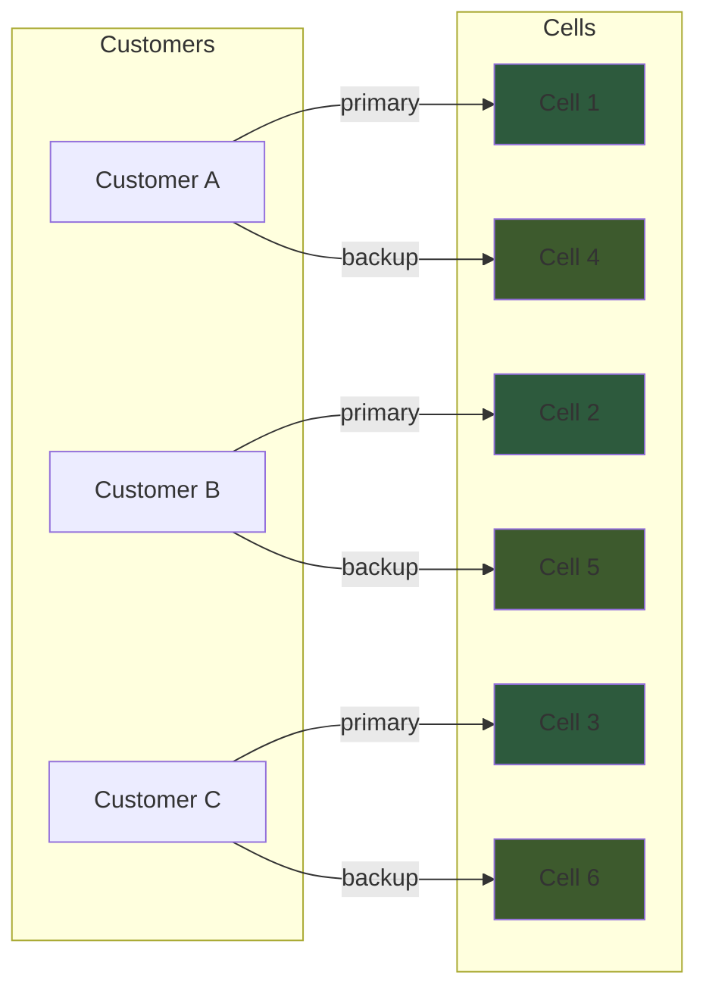
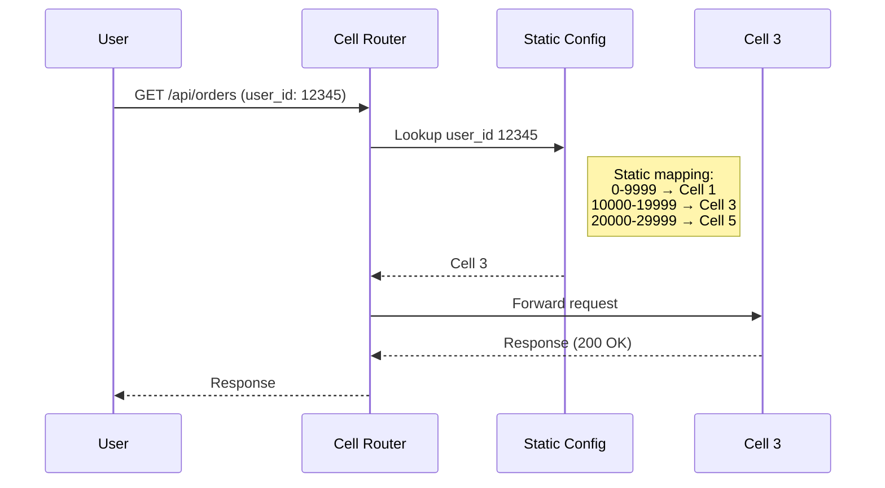

#system-design #pattern #reliability #infrastructure

# Cell-Based Architecture

## Intuition (30 sec)

A submarine has watertight compartments. If one compartment floods, seal it off — the sub keeps sailing. The flooding doesn't spread because each compartment is isolated. Cell-based architecture is the same idea: each cell is a self-contained copy of your entire service with its own data. One cell goes down, the rest keep running.

---

## Failure-First Scenario

> Your team pushes a bad deploy that corrupts data in the shared database. Every single user is affected — 100% blast radius. The entire platform is down while you frantically roll back and repair data. With cell-based architecture, that same bad deploy only goes to Cell 3 first. Only the 2% of users in Cell 3 are affected. The other 98% never notice. You fix Cell 3 while everyone else keeps working.

---

## Working Knowledge (5 min)

### Core Concept - Definition First

**Cell-Based Architecture:**
- **Definition:** A deployment pattern that creates multiple independent, isolated copies (cells) of your entire application stack, where each cell serves a distinct subset of users or tenants
- **Purpose:** Limit the blast radius of failures, bad deploys, data corruption, and performance degradation to a single cell rather than the entire system
- **How it works:** A cell router maps each user/tenant to a specific cell using a static mapping. Each cell contains a complete, independent copy of all services, databases, and caches — cells share nothing

**Key Terms:**

- **Cell:** A self-contained, independent copy of the entire application stack (services + database + cache + queues) that serves a subset of users
- **Blast Radius:** The percentage of users or traffic affected when a failure occurs. Cells minimize blast radius to 1/N where N is the number of cells
- **Cell Router:** The thin, reliable layer that maps incoming requests to the correct cell based on user ID, tenant ID, or other partitioning key
- **Shuffle Sharding:** A technique where each customer is assigned to a random subset of cells, reducing the probability that two customers share the exact same failure domain
- **Static Stability:** The property where cells continue operating correctly even when the cell router or control plane is unavailable
- **Cell Evacuation:** The process of draining all traffic from an unhealthy cell and redirecting it to healthy cells

### Visual Model - Cell Architecture Overview

```
┌──────────────────────────────────────────────────────────────────────┐
│                     CELL-BASED ARCHITECTURE                          │
└──────────────────────────────────────────────────────────────────────┘

                        All Incoming Traffic
                              │
                              ▼
                    ┌───────────────────┐
                    │    Cell Router    │
                    │                   │
                    │  user_id → cell   │
                    │  A-M  → Cell 1   │
                    │  N-Z  → Cell 2   │
                    └────────┬──────────┘
                             │
              ┌──────────────┴──────────────┐
              │                             │
              ▼                             ▼
┌──────────────────────────┐  ┌──────────────────────────┐
│         CELL 1           │  │         CELL 2           │
│  (Users A-M)             │  │  (Users N-Z)             │
│                          │  │                          │
│  ┌────────────────────┐  │  │  ┌────────────────────┐  │
│  │   API Servers      │  │  │  │   API Servers      │  │
│  │   (dedicated)      │  │  │  │   (dedicated)      │  │
│  └────────┬───────────┘  │  │  └────────┬───────────┘  │
│           │              │  │           │              │
│  ┌────────▼───────────┐  │  │  ┌────────▼───────────┐  │
│  │   App Services     │  │  │  │   App Services     │  │
│  │   (dedicated)      │  │  │  │   (dedicated)      │  │
│  └────────┬───────────┘  │  │  └────────┬───────────┘  │
│           │              │  │           │              │
│  ┌────────▼───────────┐  │  │  ┌────────▼───────────┐  │
│  │   Database         │  │  │  │   Database         │  │
│  │   (own instance)   │  │  │  │   (own instance)   │  │
│  └────────────────────┘  │  │  └────────────────────┘  │
│                          │  │                          │
│  ┌────────────────────┐  │  │  ┌────────────────────┐  │
│  │   Cache (Redis)    │  │  │  │   Cache (Redis)    │  │
│  │   (own instance)   │  │  │  │   (own instance)   │  │
│  └────────────────────┘  │  │  └────────────────────┘  │
│                          │  │                          │
│  ┌────────────────────┐  │  │  ┌────────────────────┐  │
│  │   Message Queue    │  │  │  │   Message Queue    │  │
│  │   (own instance)   │  │  │  │   (own instance)   │  │
│  └────────────────────┘  │  │  └────────────────────┘  │
└──────────────────────────┘  └──────────────────────────┘

Key Principle: Cells share NOTHING.
Cell 1 failure has ZERO impact on Cell 2.
```



```mermaid
graph TD
    subgraph Router["Cell Router (thin, reliable)"]
        R[Route: user_id → cell]
    end

    subgraph Cell1["Cell 1 — Users A-M"]
        API1[API Gateway]
        SVC1[Application Services]
        DB1[(Database)]
        CACHE1[(Redis Cache)]
        Q1[Message Queue]
        API1 --> SVC1
        SVC1 --> DB1
        SVC1 --> CACHE1
        SVC1 --> Q1
    end

    subgraph Cell2["Cell 2 — Users N-Z"]
        API2[API Gateway]
        SVC2[Application Services]
        DB2[(Database)]
        CACHE2[(Redis Cache)]
        Q2[Message Queue]
        API2 --> SVC2
        SVC2 --> DB2
        SVC2 --> CACHE2
        SVC2 --> Q2
    end

    R -->|Users A-M| API1
    R -->|Users N-Z| API2

    style Cell1 fill:#2d5a3d,stroke:#4a9
    style Cell2 fill:#2d3d5a,stroke:#49a
```

### How It Works

1. **Cell Router maps user/tenant to cell** — Static mapping using consistent hashing, directory lookup, or simple range partitioning. The mapping is deterministic: user_id 12345 always goes to Cell 3.
2. **Each cell is a complete, independent stack** — Every cell has its own API servers, application services, database, cache, and message queue. Nothing is shared between cells.
3. **Cells share NOTHING** — No shared database, no shared cache, no shared message queue. This is the critical difference from simple service replicas behind a load balancer.
4. **Failure in Cell 1 has zero impact on Cell 2** — A bad deploy, data corruption, resource exhaustion, or hardware failure in one cell cannot propagate to another cell.

**Step-by-step request flow:**
1. User makes HTTP request to the platform
2. Request hits the Cell Router (thin DNS/proxy layer)
3. Cell Router extracts user_id from request (cookie, JWT, API key)
4. Cell Router looks up static mapping: user_id 12345 → Cell 3
5. Request is forwarded to Cell 3's API gateway
6. Cell 3 processes the request entirely within its own stack
7. Response returns through Cell Router to user

### Cell vs Shard vs Region

| Concept | What's Partitioned | Scope | Typical Count | Example |
|---------|-------------------|-------|---------------|---------|
| **Shard** | Data only | Single database layer | 10-1000 | user_id % 16 → DB shard |
| **Cell** | Entire stack (services + data + cache + queues) | Full application | 10-100 | user_id → Cell 7 (own services, DB, cache) |
| **Region** | Geographic deployment | Data center level | 3-10 | US-East, EU-West, AP-Southeast |

**Key distinctions:**
- **Shard** partitions data only — all services still share the same application tier, same cache, same queues. A bug in the application layer affects all shards.
- **Cell** partitions the entire stack — each cell has independent services, database, cache, and queues. A bug in Cell 3's application layer only affects Cell 3.
- **Region** is geographic separation for latency and compliance — you can have 50 cells within a single region. Regions are coarse-grained, cells are fine-grained.

```
Shard (data only):
┌──────────────────────┐
│  Shared App Servers   │  ← Single point of failure
│  Shared Cache         │  ← Bug here hits ALL users
├──────┬───────┬───────┤
│ DB 1 │ DB 2  │ DB 3  │  ← Only data is split
└──────┴───────┴───────┘

Cell (entire stack):
┌────────┐  ┌────────┐  ┌────────┐
│ Cell 1 │  │ Cell 2 │  │ Cell 3 │
│ App    │  │ App    │  │ App    │  ← Each has own app
│ Cache  │  │ Cache  │  │ Cache  │  ← Each has own cache
│ DB     │  │ DB     │  │ DB     │  ← Each has own DB
└────────┘  └────────┘  └────────┘
  Bug in Cell 2 → only Cell 2 users affected
```

---

## Layer 1: Conceptual Precision (15 min)

### AWS Cell Architecture

**How AWS uses cells internally:**
- **S3:** Each partition prefix is essentially a cell. When a partition has issues, only keys in that prefix are affected.
- **GameDay:** AWS regularly practices cell evacuation — intentionally failing a cell and verifying traffic shifts cleanly to other cells.
- **Route 53:** Uses cell-based isolation for DNS resolution. Each cell handles a subset of DNS queries independently.

**Shuffle Sharding (AWS innovation):**
- **Definition:** Instead of assigning each customer to exactly one cell, assign each customer to N randomly chosen cells from the pool. This dramatically reduces the probability that two customers share the exact same failure domain.
- **Purpose:** Prevent a noisy neighbor in one cell from affecting the same set of customers repeatedly.

```
Standard Cell Assignment (no shuffle sharding):
═══════════════════════════════════════════════
Customer A → Cell 1
Customer B → Cell 1
Customer C → Cell 1
Customer D → Cell 2
Customer E → Cell 2

Problem: If Cell 1 fails, ALL of A, B, C are down together.


Shuffle Sharding (2 cells per customer from 8 total):
═══════════════════════════════════════════════
Customer A → Cell 1, Cell 5
Customer B → Cell 3, Cell 7
Customer C → Cell 2, Cell 6
Customer D → Cell 1, Cell 8
Customer E → Cell 4, Cell 5

If Cell 1 fails:
  Customer A → falls back to Cell 5 (still up)
  Customer D → falls back to Cell 8 (still up)
  Customers B, C, E → not affected at all

Probability two customers share BOTH cells:
  With 8 cells, choose 2: C(8,2) = 28 combinations
  Probability of exact overlap = 1/28 ≈ 3.6%
```



**Static Stability:**
- **Definition:** The property where each cell continues to function correctly even if the cell router or centralized control plane becomes unavailable.
- **How:** Cells cache their configuration locally. DNS TTLs ensure clients continue routing to the same cell. No cell depends on a centralized coordinator for ongoing operation.
- **Why it matters:** The cell router is the only shared component. If it goes down, cells must keep serving existing traffic. Static stability guarantees this.

### Shopify Pod Architecture

**Shopify's real-world cell implementation:**
- Each "pod" is a cell serving approximately 10,000 merchants
- Pod contains: own MySQL cluster (via Vitess), own Redis instances, own Memcached, own job queues
- Bad deploy to Pod 3 = only Pod 3's ~10K merchants experience issues
- Pod router maps `shop_id → pod` using a static lookup table

```
┌──────────────────────────────────────────────────────────┐
│                   SHOPIFY POD ARCHITECTURE                │
└──────────────────────────────────────────────────────────┘

                     Merchant Request
                          │
                          ▼
                 ┌──────────────────┐
                 │   Pod Router     │
                 │                  │
                 │ shop_id = 45678  │
                 │ lookup → Pod 3   │
                 └────────┬─────────┘
                          │
         ┌────────────────┼────────────────┐
         │                │                │
         ▼                ▼                ▼
┌──────────────┐ ┌──────────────┐ ┌──────────────┐
│    Pod 1     │ │    Pod 3     │ │    Pod 7     │
│  ~10K shops  │ │  ~10K shops  │ │  ~10K shops  │
│              │ │  ← shop      │ │              │
│ Rails App    │ │  45678 HERE  │ │ Rails App    │
│ Vitess/MySQL │ │              │ │ Vitess/MySQL │
│ Redis        │ │ Rails App    │ │ Redis        │
│ Memcached    │ │ Vitess/MySQL │ │ Memcached    │
│ Sidekiq      │ │ Redis        │ │ Sidekiq      │
│              │ │ Memcached    │ │              │
└──────────────┘ │ Sidekiq      │ └──────────────┘
                 └──────────────┘

Benefits:
- Bad deploy to Pod 3 → only 10K merchants affected (not 1M+)
- Can canary deploy to one pod first
- Database issues isolated per pod
- Can evacuate a pod by remapping shops to other pods
```

**Shopify's pod evolution:**
1. Started as a monolithic Rails app with one massive MySQL database
2. First split: sharded the database (data isolation, not full stack isolation)
3. Next evolution: full pod architecture (complete stack isolation per pod)
4. Result: blast radius went from 100% (all merchants) to ~1% (one pod's merchants)

### Slack's Approach

**Channel server partitioning:**
- Slack partitions channel servers using a consistent hash ring
- Each partition is effectively a cell for a subset of channels
- A channel's messages, presence data, and real-time events are all handled within one partition
- If a partition has issues, only channels in that partition experience degradation

```
┌──────────────────────────────────────────────────┐
│             SLACK PARTITION MODEL                  │
└──────────────────────────────────────────────────┘

           Consistent Hash Ring
              ┌─────────┐
         ┌────│ Node 0  │────┐
         │    └─────────┘    │
    ┌────┴────┐         ┌───┴─────┐
    │ Node 3  │         │ Node 1  │
    └────┬────┘         └───┬─────┘
         │    ┌─────────┐   │
         └────│ Node 2  │───┘
              └─────────┘

channel_id = "C12345"
hash("C12345") → lands between Node 1 and Node 2
→ Assigned to Node 2's partition

Node 2 handles:
  - All messages for channels in its range
  - Presence updates for those channels
  - Real-time WebSocket events
  - Channel metadata and history
```

### Cell Sizing

**The sizing trade-off:**

```
Too Few Cells (e.g., 2 cells):
════════════════════════════════
┌─────────────────┐ ┌─────────────────┐
│     Cell 1      │ │     Cell 2      │
│   50% users     │ │   50% users     │
│   (5M users)    │ │   (5M users)    │
└─────────────────┘ └─────────────────┘

Blast radius per cell: 50%
Problem: Losing one cell is catastrophic (half your users down)


Too Many Cells (e.g., 1000 cells):
════════════════════════════════
┌───┐┌───┐┌───┐┌───┐┌───┐┌───┐┌───┐  ... (1000 cells)
│ 1 ││ 2 ││ 3 ││ 4 ││ 5 ││ 6 ││ 7 │
└───┘└───┘└───┘└───┘└───┘└───┘└───┘

Blast radius per cell: 0.1%
Problem: 1000 independent stacks to monitor, deploy, patch
         Massive operational overhead
         Cross-cell operations become frequent


Sweet Spot (10-100 cells):
════════════════════════════════
┌──────┐┌──────┐┌──────┐    ┌──────┐
│Cell 1││Cell 2││Cell 3│ ...│Cell 50│
│ 2%   ││ 2%   ││ 2%   │    │ 2%   │
└──────┘└──────┘└──────┘    └──────┘

Blast radius per cell: 1-10%
Operational overhead: Manageable
Sweet spot for most organizations
```

**Cell sizing guidelines:**

| Factor | Guideline | Reasoning |
|--------|-----------|-----------|
| **Blast radius** | Target 1-5% per cell | Losing one cell should be a minor incident, not a P0 |
| **Operational cost** | 10-100 cells typical | Each cell needs monitoring, alerting, deploy pipelines |
| **Minimum cell size** | Large enough to be cost-efficient | Very small cells waste resources (each needs DB, cache, etc.) |
| **Maximum cell size** | Small enough that losing one is acceptable | If losing a cell pages the CEO, the cell is too big |
| **Growth** | Add new cells as traffic grows | Don't resize existing cells — add new ones |

### Cell Router Design

**The cell router is the most critical component:**

```
┌──────────────────────────────────────────────────────────┐
│                CELL ROUTER DESIGN PRINCIPLES              │
└──────────────────────────────────────────────────────────┘

MUST be:
  ✓ Simple (minimal logic, minimal code paths)
  ✓ Reliable (it's a single point of failure if it fails)
  ✓ Fast (adds latency to every request)
  ✓ Statically stable (works even when control plane is down)

MUST NOT:
  ✗ Have complex business logic
  ✗ Make dynamic routing decisions
  ✗ Depend on databases for routing
  ✗ Have frequent deployments
```

**Routing strategies:**

| Strategy | How It Works | Pros | Cons |
|----------|-------------|------|------|
| **DNS-based** | DNS record maps domain to cell IP | Simple, cached, fast | Slow propagation (TTL), limited flexibility |
| **Config-based** | Static config file: user_id range → cell | Very fast lookup, no external dependency | Requires config reload for changes |
| **Directory-based** | Lookup table: user_id → cell_id | Flexible, easy to move users | Lookup service is a dependency |
| **Header-based** | Client sends cell hint in HTTP header | Zero router logic | Requires client awareness |



**Cell Evacuation:**
- **Definition:** The process of draining all traffic from an unhealthy cell and redirecting users to healthy cells
- **When:** Bad deploy, data corruption, hardware failure, or proactive maintenance
- **How:** Update the cell router mapping to redirect affected users to other cells

```
Cell Evacuation Flow:
═══════════════════════

BEFORE (Cell 3 unhealthy):
┌────────┐  ┌────────┐  ┌────────┐  ┌────────┐
│ Cell 1 │  │ Cell 2 │  │ Cell 3 │  │ Cell 4 │
│  25%   │  │  25%   │  │  25%   │  │  25%   │
│  OK    │  │  OK    │  │  SICK  │  │  OK    │
└────────┘  └────────┘  └────────┘  └────────┘

STEP 1: Mark Cell 3 as draining
STEP 2: Update router: Cell 3 users → redistribute to Cells 1, 2, 4
STEP 3: Wait for in-flight requests to complete
STEP 4: Cell 3 is empty, safe to repair

AFTER (Cell 3 evacuated):
┌────────┐  ┌────────┐  ┌────────┐  ┌────────┐
│ Cell 1 │  │ Cell 2 │  │ Cell 3 │  │ Cell 4 │
│  33%   │  │  33%   │  │  EMPTY │  │  33%   │
│  OK    │  │  OK    │  │ repair │  │  OK    │
└────────┘  └────────┘  └────────┘  └────────┘

Requirement: Each cell must have headroom to absorb
evacuated traffic (plan for N-1 capacity)
```

### Implementation Patterns

**Kubernetes namespace per cell:**

```yaml
# Cell 1 namespace
apiVersion: v1
kind: Namespace
metadata:
  name: cell-1
  labels:
    cell-id: "1"
    cell-region: "us-east-1"
---
# Cell 1 API deployment
apiVersion: apps/v1
kind: Deployment
metadata:
  name: api-server
  namespace: cell-1
spec:
  replicas: 3
  selector:
    matchLabels:
      app: api-server
      cell: "1"
  template:
    metadata:
      labels:
        app: api-server
        cell: "1"
    spec:
      containers:
      - name: api-server
        image: myapp/api:v2.3.1
        env:
        - name: CELL_ID
          value: "1"
        - name: DB_HOST
          value: "db-cell-1.internal"     # Cell-specific DB
        - name: REDIS_HOST
          value: "redis-cell-1.internal"  # Cell-specific cache
        - name: KAFKA_TOPIC_PREFIX
          value: "cell-1-"               # Cell-specific queue
```

**Terraform module per cell:**

```hcl
# modules/cell/main.tf
module "cell" {
  source   = "./modules/cell"
  for_each = toset(["cell-1", "cell-2", "cell-3", "cell-4"])

  cell_id       = each.key
  region        = "us-east-1"
  db_instance   = "db.r5.xlarge"
  redis_node    = "cache.r5.large"
  app_replicas  = 3
}

# Each cell gets:
# - Own RDS instance (not shared)
# - Own ElastiCache cluster (not shared)
# - Own ECS/EKS namespace
# - Own SQS queues
# - Own CloudWatch dashboards
```

**Database per cell:**

```
Cell Database Strategy:
═══════════════════════

Option 1: Separate RDS instances
┌──────────┐  ┌──────────┐  ┌──────────┐
│ cell-1-db│  │ cell-2-db│  │ cell-3-db│
│ (RDS)    │  │ (RDS)    │  │ (RDS)    │
└──────────┘  └──────────┘  └──────────┘
Pros: Complete isolation, independent scaling
Cons: Higher cost, more instances to manage

Option 2: Shared RDS cluster with schema isolation
┌──────────────────────────────────────┐
│         Shared RDS Cluster           │
│  ┌────────┐┌────────┐┌────────┐     │
│  │schema_1││schema_2││schema_3│     │
│  └────────┘└────────┘└────────┘     │
└──────────────────────────────────────┘
Pros: Lower cost, fewer instances
Cons: NOT true cell isolation (shared failure domain)
WARNING: This defeats the purpose of cells.

RECOMMENDATION: Option 1. Always separate instances.
The whole point of cells is isolation. Sharing a DB undoes it.
```

---

## Production Considerations

### Cross-Cell Operations

**The hardest problem in cell architecture:**

When user A (Cell 1) sends a message to user B (Cell 2), the request crosses cell boundaries.

```
Cross-Cell Communication:
═══════════════════════════

User A (Cell 1) sends message to User B (Cell 2)

Option 1: Async via global event bus
┌────────┐      ┌─────────────┐      ┌────────┐
│ Cell 1 │ ──── │ Global Kafka│ ──── │ Cell 2 │
│        │ emit │ (shared bus)│ recv │        │
└────────┘      └─────────────┘      └────────┘
Pros: Decoupled, eventual consistency OK for messages
Cons: Adds latency, global Kafka is a shared dependency

Option 2: Direct cell-to-cell RPC
┌────────┐                           ┌────────┐
│ Cell 1 │ ────── gRPC/HTTP ──────── │ Cell 2 │
│        │        direct call        │        │
└────────┘                           └────────┘
Pros: Lower latency, no shared dependency
Cons: Cells are no longer fully independent

Option 3: Minimize cross-cell operations by design
- Co-locate related data in the same cell
- Org-based partitioning: all users in same org → same cell
- Accept eventual consistency for cross-org interactions
```

**Best practice:** Design your cell partitioning to minimize cross-cell operations. If users A and B are in the same organization, put the entire organization in one cell.

### Cell Rebalancing

```
When one cell gets too hot:
═══════════════════════════

BEFORE (Cell 2 is hot):
┌────────┐  ┌────────┐  ┌────────┐
│ Cell 1 │  │ Cell 2 │  │ Cell 3 │
│  30%   │  │  70%   │  │  30%   │
│  OK    │  │  HOT   │  │  OK    │
└────────┘  └────────┘  └────────┘

OPTION A: Move tenants from Cell 2 to Cell 3
- Pick tenants that are contributing to hotness
- Migrate their data to Cell 3 (background copy)
- Update router mapping: those tenants → Cell 3
- Dual-read during migration, then cut over

OPTION B: Split Cell 2 into Cell 2a and Cell 2b
- Create new Cell 2b
- Migrate half of Cell 2's tenants to Cell 2b
- Update router mapping

OPTION C: Add a new Cell 4
- Create Cell 4 from scratch
- Move subset of tenants from overloaded cells
- Update router mapping

All options require:
1. Data migration (most complex part)
2. Router mapping update (simple config change)
3. Verification period (monitor both cells)
```

### Monitoring Per Cell

**Each cell needs independent monitoring:**

```
Per-Cell Dashboard:
═══════════════════

┌─────────────────────────────────────────────────┐
│  Cell Health Overview                            │
├───────┬──────────┬────────┬──────────┬──────────┤
│ Cell  │ P99 Lat  │ Error% │ CPU      │ DB Conn  │
├───────┼──────────┼────────┼──────────┼──────────┤
│ Cell1 │ 45ms     │ 0.1%   │ 55%      │ 40/100   │
│ Cell2 │ 42ms     │ 0.2%   │ 52%      │ 38/100   │
│ Cell3 │ 380ms    │ 4.7%   │ 92%      │ 95/100   │ ← ALERT
│ Cell4 │ 48ms     │ 0.1%   │ 58%      │ 42/100   │
│ Cell5 │ 44ms     │ 0.1%   │ 51%      │ 36/100   │
└───────┴──────────┴────────┴──────────┴──────────┘

Alert rules (per cell):
- P99 latency > 200ms → Page on-call
- Error rate > 1% → Page on-call
- CPU > 80% → Warning
- DB connections > 80% capacity → Warning
- Any metric crossing threshold in ONE cell
  should NOT alert for other cells
```

**Critical metrics to track per cell:**
- Request latency (P50, P95, P99)
- Error rate (5xx, 4xx)
- Database connection pool utilization
- Cache hit rate
- Queue depth and consumer lag
- CPU, memory, disk utilization
- Cell-specific deploy status

### Deployment Strategy

```
Cell-Aware Deployment Pipeline:
═══════════════════════════════

Step 1: Deploy to canary cell (Cell 1)
┌────────┐  ┌────────┐  ┌────────┐  ┌────────┐
│ Cell 1 │  │ Cell 2 │  │ Cell 3 │  │ Cell 4 │
│  v2.4  │  │  v2.3  │  │  v2.3  │  │  v2.3  │
│ CANARY │  │        │  │        │  │        │
└────────┘  └────────┘  └────────┘  └────────┘
     ↓
   Monitor for 30 minutes
   Check: error rate, latency, logs
     ↓
   If OK → proceed. If bad → rollback Cell 1 only.

Step 2: Deploy to 25% of cells
┌────────┐  ┌────────┐  ┌────────┐  ┌────────┐
│ Cell 1 │  │ Cell 2 │  │ Cell 3 │  │ Cell 4 │
│  v2.4  │  │  v2.3  │  │  v2.3  │  │  v2.3  │
│ baking │  │        │  │        │  │        │
└────────┘  └────────┘  └────────┘  └────────┘
     ↓
   Monitor for 1 hour. Bake period.

Step 3: Deploy to remaining cells (rolling)
┌────────┐  ┌────────┐  ┌────────┐  ┌────────┐
│ Cell 1 │  │ Cell 2 │  │ Cell 3 │  │ Cell 4 │
│  v2.4  │  │  v2.4  │  │  v2.4  │  │  v2.4  │
│  done  │  │  done  │  │  done  │  │  done  │
└────────┘  └────────┘  └────────┘  └────────┘

Key: At NO point is 100% of traffic at risk.
Bad code in Step 1 affects only ~2% of users.
```

---

## Decision Framework

```
IF you need to limit blast radius of failures/deploys
  THEN Use cell-based architecture
  REASON Isolates failures to a subset of users

IF you have a multi-tenant SaaS platform
  THEN Cells per tenant group
  REASON Natural partitioning boundary, tenant isolation

IF you need to meet strict SLAs for enterprise customers
  THEN Dedicated cells for premium tenants
  REASON Guarantee resources, prevent noisy neighbor

IF your system has frequent bad deploys
  THEN Cell architecture + canary cell deployment
  REASON Bad deploy only hits canary cell first (2% blast radius)

IF you need to comply with data residency regulations
  THEN Cells per geographic region
  REASON Data stays within regulatory boundary

IF cross-cell communication is frequent (>20% of requests)
  THEN Reconsider cell partitioning key
  REASON Cross-cell calls defeat the purpose of isolation

IF you have < 10 services and < 1M users
  THEN Cell architecture is likely overkill
  REASON Operational overhead outweighs benefits at small scale

IF the cell router goes down
  THEN Static stability must be guaranteed
  REASON DNS caching, local config, clients remember their cell
```

### Visual Decision Flow

```
Should I use Cell-Based Architecture?
              │
              ▼
    Do failures currently affect
    ALL users at once?
         │           │
        YES          NO
         │           │
         ▼           ▼
    Is the blast     Are you hitting
    radius a real    scaling limits?
    business risk?        │
         │           ┌────┴────┐
        YES         YES       NO
         │           │         │
         ▼           ▼         ▼
    Do you have   Consider    Probably
    operational   sharding    don't need
    maturity to   first       cells yet
    manage N cells?
         │
    ┌────┴────┐
   YES       NO
    │         │
    ▼         ▼
  ADOPT     Build ops
  CELLS     maturity first
            (monitoring,
            IaC, CI/CD)
```

---

## Trade-offs Matrix

```
Cell-Based Architecture                 Traditional Shared Stack
═══════════════════════                 ═════════════════════════
✓ Small blast radius (1-5%)            ✓ Simple operations
✓ Independent scaling per cell         ✓ Lower infrastructure cost
✓ Canary deploys per cell              ✓ No cross-cell complexity
✓ Tenant isolation                     ✓ Single monitoring setup
✗ Higher infra cost (N copies)         ✗ 100% blast radius
✗ Cross-cell operations complex        ✗ Noisy neighbor problems
✗ Operational overhead (N stacks)      ✗ Can't isolate bad deploys
✗ Data migration for rebalancing       ✗ Single scaling ceiling
```

---

## The "Why" Chain

- **Why cells?** → To limit the blast radius of failures. A bad deploy, data corruption, or resource exhaustion only affects users in one cell, not all users.
- **What's the alternative?** → Shared infrastructure where all users hit the same services and databases. Simpler to operate but 100% blast radius on every failure.
- **Why not just use sharding?** → Sharding only partitions data. The application layer, cache, and queues are still shared. A bug in the application layer affects all shards. Cells partition the entire stack.
- **Why not just use regions?** → Regions are coarse-grained (3-10 regions). Cells are fine-grained (10-100 cells). You can have many cells within one region. Regions help with latency, cells help with blast radius.
- **What breaks without it?** → At scale, a single bad deploy or database corruption can take down your entire platform. Without cells, your only defense is "don't push bad code" — which is not a strategy.
- **Why is the cell router critical?** → It's the only shared component. If it fails or routes incorrectly, all cells are affected. That's why it must be simple, statically stable, and rarely deployed.

---

## Links

- [[03_design_patterns/sharding]] — Cells build on top of sharding by partitioning the entire stack, not just data
- [[03_design_patterns/consistent_hashing]] — Used in cell routers for deterministic user-to-cell mapping
- [[03_design_patterns/circuit_breaker]] — Circuit breakers within cells prevent internal cascading failures
- [[03_design_patterns/back_pressure]] — Each cell independently applies back pressure when overloaded
- [[02_building_blocks/load_balancer]] — Cell router acts as a specialized load balancer with affinity-based routing
- [[02_building_blocks/monitoring_and_logging]] — Per-cell monitoring is essential for detecting cell-specific issues
