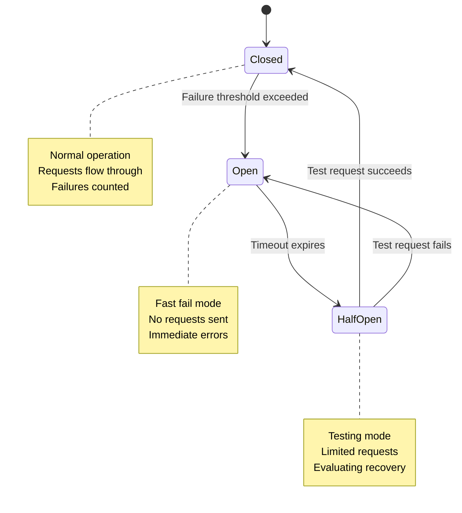
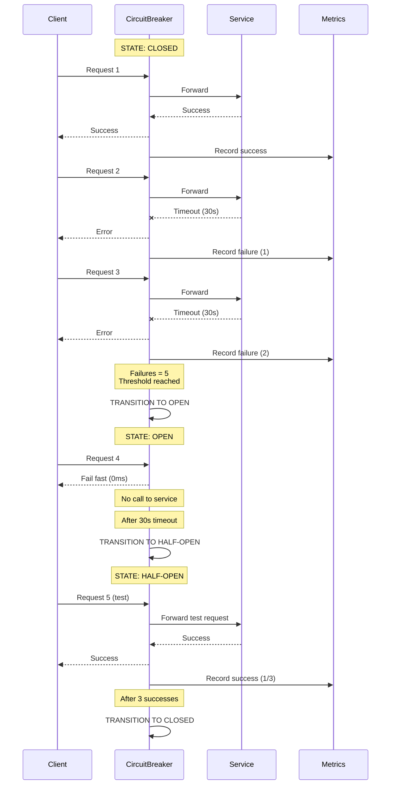

#system-design #pattern #reliability #resilience

# Circuit Breaker

## Intuition (30 sec)

An electrical circuit breaker: when too much current flows (failures), the breaker trips and cuts the circuit, preventing a fire (cascading failure). After a cooldown, it tentatively tries again. Protects the whole house (system) from one faulty appliance (service).

## Failure-First Scenario

> Service A calls Service B. Service B's database is down — every call takes 30 seconds to timeout. Service A has 100 threads, all waiting on Service B. Service A is now unresponsive. Service C calls Service A — also stuck. The entire system cascades into failure from one DB outage.

## Working Knowledge (5 min)

### Core Concept - Definition First

**Circuit Breaker:**
- **Definition:** A design pattern that prevents an application from repeatedly trying to execute an operation that's likely to fail, allowing it to continue without waiting for the fault to be fixed or wasting CPU cycles.
- **Purpose:** Prevent cascading failures across distributed systems by failing fast when a downstream service is degraded or unavailable.
- **How it works:** Monitors failure rates and automatically switches between three states (Closed, Open, Half-Open) to control request flow based on the health of downstream services.

**Key Terms:**
- **Cascading Failure:** A failure in one component triggers failures in dependent components, propagating through the system like falling dominoes.
- **Fail Fast:** Immediately return an error without attempting the operation, preventing resource exhaustion from doomed requests.
- **Fallback:** Alternative response returned when the circuit is open, such as cached data, default values, or graceful degradation messages.
- **Threshold:** Configurable limit that determines when the circuit breaker changes state (e.g., 5 failures to open, 3 successes to close).

### Three States



**State Definitions:**
- **Closed:** Normal operational state where requests pass through to the downstream service. Failures are monitored and counted against the threshold.
- **Open:** Protective state triggered when failures exceed the threshold. All requests immediately fail without calling the downstream service, returning fallback responses.
- **Half-Open:** Recovery testing state that allows a limited number of test requests through to determine if the downstream service has recovered.

| State | Behavior | Transition Condition |
|-------|----------|---------------------|
| **Closed** | Requests flow normally. Failures are counted. | Failure rate > threshold → Open |
| **Open** | All requests immediately fail (no call to downstream). Returns fallback or error. | Timeout expires → Half-Open |
| **Half-Open** | Limited test requests allowed through. If succeed → Closed. If fail → Open. | Success threshold met → Closed, Any failure → Open |

### Configuration Parameters

```yaml
circuit_breaker:
  failure_threshold: 5          # Definition: Number of consecutive failures before opening
                                # Purpose: Prevents flapping from transient errors

  failure_rate_threshold: 50    # Definition: Percentage of failures in evaluation window
                                # Purpose: Opens on sustained high failure rate (50%)

  success_threshold: 3          # Definition: Consecutive successes to close from half-open
                                # Purpose: Confirms service recovery before full traffic

  timeout: 30s                  # Definition: Duration to stay open before trying half-open
                                # Purpose: Gives downstream service time to recover

  evaluation_window: 100        # Definition: Number of recent requests to track
                                # Purpose: Calculate failure rate over sliding window

  half_open_max_calls: 10       # Definition: Max test requests allowed in half-open state
                                # Purpose: Limits risk during recovery testing
```

**Configuration Concepts:**
- **failure_threshold:** Absolute count approach - open after N consecutive failures. Use for services with low traffic where percentage is meaningless.
- **failure_rate_threshold:** Percentage approach - open when X% of requests fail in the evaluation window. Better for high-traffic services.
- **timeout:** Wait period before attempting recovery. Too short causes flapping, too long delays recovery. Typical: 30-60 seconds.

### Fallback Strategies

When the circuit is open, what do you return?

| Strategy | Definition | Example | Use When |
|----------|------------|---------|----------|
| **Default value** | Return a safe, predetermined value | Return cached data, empty list, last known good value | Non-critical features, can tolerate stale data |
| **Graceful degradation** | Show reduced functionality message | "Recommendations unavailable", "Using basic search" | User-facing features, maintain UX |
| **Alternative service** | Route to backup provider | Secondary payment gateway, replica database | Critical operations, backup available |
| **Queue for later** | Store request for async processing | "We'll process this when service recovers" | Non-time-sensitive operations |
| **Error response** | Explicit failure message | 503 Service Unavailable with retry-after header | APIs, let client decide retry strategy |

## Layer 1: Conceptual Precision (15 min)

### How It Works (Visual Flow)



**Step-by-step breakdown:**
1. **Monitor Phase (Closed):** Circuit breaker passes all requests through while monitoring failures. Each failure increments the failure counter.
2. **Threshold Detection:** When failures exceed the configured threshold (count or rate), the circuit breaker detects an unhealthy downstream service.
3. **Fast Fail Phase (Open):** Circuit immediately fails all requests without calling the downstream service, preventing resource exhaustion and giving the service time to recover.
4. **Recovery Test (Half-Open):** After the timeout period, the circuit allows limited test requests to check if the service has recovered.
5. **State Decision:** Based on test request results, either close the circuit (success) or reopen it (failure), repeating the cycle.

### Why Not Just Retry?

**Retry Logic:**
- **Definition:** Automatically re-attempting a failed operation, typically with exponential backoff.
- **Purpose:** Handle transient failures (network blips, momentary overload).
- **Limitation:** Assumes failures are temporary and service will recover quickly.

**Problem with Retry-Only Approach:**

```
Without Circuit Breaker:
━━━━━━━━━━━━━━━━━━━━━━━━━━━━━━━━━━━━━━━━━━━━
Service B is DOWN (database crashed)

Thread 1: Call Service B → Retry × 3 → Each timeout 30s = 90s blocked
Thread 2: Call Service B → Retry × 3 → Each timeout 30s = 90s blocked
Thread 3: Call Service B → Retry × 3 → Each timeout 30s = 90s blocked
...
Thread 100: All threads exhausted, waiting on timeouts

Result:
• 100 threads × 3 retries × 30s = 9000 seconds of wasted compute
• Service A becomes unresponsive (no threads available)
• Service B receives 300 requests while down (hammering it)
• Cascading failure: Service C → Service A fails too
```

```
With Circuit Breaker:
━━━━━━━━━━━━━━━━━━━━━━━━━━━━━━━━━━━━━━━━━━━━
Service B is DOWN (database crashed)

Request 1-5: Try → Fail → Circuit counts failures
Request 5: TRIP! Circuit opens
Request 6-100: Fail immediately (0ms, no retry, no timeout wait)

Result:
• Only 5 requests hit Service B (not 300)
• 95 requests fail fast in microseconds
• Threads immediately available for other work
• Service A remains responsive
• Service B gets breathing room to recover
```

**Key Difference:**
- **Retry:** Optimistic - "Maybe the next attempt will work"
- **Circuit Breaker:** Protective - "This service is down, stop trying and fail fast"

### Bulkhead Pattern (Companion to Circuit Breaker)

**Bulkhead Pattern:**
- **Definition:** Isolation pattern that partitions resources (threads, connections, memory) into separate pools to prevent failure in one area from consuming all resources.
- **Name Origin:** Ship bulkheads - watertight compartments that prevent the entire ship from flooding when one compartment is breached.
- **Purpose:** Limit blast radius of failures by containing them to isolated resource pools.

```
Without Bulkhead:
━━━━━━━━━━━━━━━━━━━━━━━━━━━━━━━━━━━━━━━━━━━━
┌────────────────────────────────────────────┐
│  Shared Thread Pool (100 threads)          │
│                                            │
│  Service B calls: 100 threads (all stuck) │  ← One failing service
│  Service C calls: 0 threads available     │     consumes everything
│  Service D calls: 0 threads available     │
│  Other work: 0 threads available          │
│                                            │
│  ENTIRE APPLICATION FROZEN                 │
└────────────────────────────────────────────┘
```

```
With Bulkhead:
━━━━━━━━━━━━━━━━━━━━━━━━━━━━━━━━━━━━━━━━━━━━
┌──────────────┐  ┌──────────────┐  ┌──────────────┐
│ Service B    │  │ Service C    │  │ Service D    │
│ Pool: 10     │  │ Pool: 10     │  │ Pool: 10     │
│              │  │              │  │              │
│ All 10 stuck │  │ Working fine │  │ Working fine │
│ Circuit OPEN │  │ ✓ Responsive │  │ ✓ Responsive │
└──────────────┘  └──────────────┘  └──────────────┘

┌────────────────────────────────────────────┐
│  General Thread Pool (70 threads)          │
│  Available for other work: ✓ 70 threads   │
└────────────────────────────────────────────┘

FAILURE ISOLATED - Rest of system responsive
```

**Bulkhead Component Definitions:**
- **Thread Pool:** Fixed-size pool of threads dedicated to a specific service or operation. Prevents unbounded thread creation.
- **Connection Pool:** Limited connections to database or external service. Prevents connection exhaustion.
- **Semaphore:** Counting semaphore that limits concurrent access to a resource. Lightweight alternative to thread pools.

**Combined Strategy:**
```
Circuit Breaker + Bulkhead = Defense in Depth
━━━━━━━━━━━━━━━━━━━━━━━━━━━━━━━━━━━━━━━━━━━━
1. Bulkhead: Limits damage (only 10 threads affected)
2. Circuit Breaker: Stops the bleeding (opens after 5 failures)
3. Result: Failure contained + Fast recovery + System responsive
```

### Trade-offs Matrix

```
Circuit Breaker ON                  Circuit Breaker OFF
══════════════════════════════════════════════════════════════════
Definition: Automatic failure      Definition: Direct calls with
detection with fast-fail           retry logic only

Pros:                               Pros:
• Prevents cascading failures      • Simpler implementation
• Fails fast (no wasted time)      • No false positives
• Gives downstream time to heal    • Handles transient errors well
• Protects caller's resources      • No additional configuration

Cons:                               Cons:
• False opens (transient spikes)   • Cascading failures possible
• Added complexity                 • Resource exhaustion
• Configuration tuning required    • Slow to detect sustained outage
• Possible stale fallback data     • Hammers failing service

Use When:                           Use When:
• Calling external services        • Single-tenant monolith
• Microservices architecture       • Failures are rare
• High-traffic systems             • Operations are idempotent
• SLA requirements strict          • Testing/development environment
```

## Layer 2: Technology-Specific Examples (20 min)

### Resilience4j - Java Implementation

**Resilience4j:**
- **Definition:** Lightweight, modular fault tolerance library for Java 8+, inspired by Netflix Hystrix but designed for functional programming.
- **Purpose:** Provides circuit breaker, rate limiter, retry, bulkhead, and time limiter patterns as composable decorators.
- **Best For:** Modern Java applications, Spring Boot microservices, reactive programming with Project Reactor.

#### Maven Dependency

```xml
<!-- pom.xml -->
<dependency>
    <groupId>io.github.resilience4j</groupId>
    <artifactId>resilience4j-spring-boot3</artifactId>
    <version>2.1.0</version>
</dependency>
<dependency>
    <groupId>io.github.resilience4j</groupId>
    <artifactId>resilience4j-circuitbreaker</artifactId>
    <version>2.1.0</version>
</dependency>
```

#### Configuration (application.yml)

```yaml
# Resilience4j Circuit Breaker Configuration
resilience4j:
  circuitbreaker:
    instances:
      paymentService:
        # ──────────────────────────────────────────────────────
        # Threshold Configuration
        # ──────────────────────────────────────────────────────

        failureRateThreshold: 50
        # Definition: Percentage of failures that triggers opening
        # Range: 1-100 (percent)
        # When to adjust: Lower (30-40%) for critical services,
        #                 Higher (60-70%) for flaky services

        slowCallRateThreshold: 50
        # Definition: Percentage of slow calls that triggers opening
        # Purpose: Detect performance degradation, not just errors
        # When it matters: Service is up but extremely slow

        slowCallDurationThreshold: 5s
        # Definition: Duration beyond which a call is "slow"
        # Purpose: Catch services that don't error but hang
        # Typical values: 2-5s for synchronous, 10-30s for batch

        # ──────────────────────────────────────────────────────
        # Sliding Window Configuration
        # ──────────────────────────────────────────────────────

        slidingWindowType: COUNT_BASED
        # Definition: How to measure the evaluation window
        # Options:
        #   COUNT_BASED: Last N requests (e.g., last 100 calls)
        #   TIME_BASED: Last N seconds (e.g., last 60 seconds)
        # Use COUNT_BASED for low traffic, TIME_BASED for high traffic

        slidingWindowSize: 100
        # Definition: Number of calls (COUNT_BASED) or seconds (TIME_BASED)
        #             to track for failure rate calculation
        # Purpose: Recent history to determine service health
        # Trade-off: Larger = more stable, Smaller = faster detection

        minimumNumberOfCalls: 10
        # Definition: Minimum calls before failure rate is calculated
        # Purpose: Prevent opening on small sample sizes
        # Example: With 10 min calls and 50% threshold,
        #          needs at least 5 failures from 10+ calls to open

        # ──────────────────────────────────────────────────────
        # State Transition Configuration
        # ──────────────────────────────────────────────────────

        waitDurationInOpenState: 30s
        # Definition: How long to stay OPEN before trying HALF_OPEN
        # Purpose: Give downstream service recovery time
        # Tuning: Increase if service needs longer to recover
        #         (e.g., cache warming, connection pool refill)

        permittedNumberOfCallsInHalfOpenState: 10
        # Definition: Test requests allowed in HALF_OPEN state
        # Purpose: Evaluate recovery with limited risk
        # Trade-off: More calls = better confidence but more load

        automaticTransitionFromOpenToHalfOpenEnabled: true
        # Definition: Auto-transition after waitDuration vs manual
        # Default: true (automatic)
        # Set false: If you want manual control via API

        # ──────────────────────────────────────────────────────
        # Advanced Configuration
        # ──────────────────────────────────────────────────────

        recordExceptions:
          - java.net.ConnectException
          - java.net.SocketTimeoutException
          - org.springframework.web.client.ResourceAccessException
        # Definition: Exceptions that count as failures
        # Purpose: Control what "failure" means

        ignoreExceptions:
          - com.example.BusinessException
          - javax.validation.ValidationException
        # Definition: Exceptions that DON'T count as failures
        # Purpose: Distinguish technical failures from business logic
        # Example: 404 Not Found might be expected, not a failure

        registerHealthIndicator: true
        # Definition: Expose circuit state to Spring Boot Actuator
        # Purpose: Health checks and monitoring integration
        # Endpoint: /actuator/health

        eventConsumerBufferSize: 100
        # Definition: Size of ring buffer for circuit breaker events
        # Purpose: Store events for monitoring/logging
        # Events: state transitions, success, error, ignored, etc.
```

#### Java Code Implementation

```java
package com.example.payment;

import io.github.resilience4j.circuitbreaker.annotation.CircuitBreaker;
import io.github.resilience4j.bulkhead.annotation.Bulkhead;
import org.springframework.stereotype.Service;
import org.springframework.web.client.RestTemplate;

/**
 * Payment service with circuit breaker protection
 *
 * Pattern: Circuit Breaker + Bulkhead + Fallback
 * Purpose: Prevent cascading failures from payment gateway
 */
@Service
public class PaymentService {

    private final RestTemplate restTemplate;
    private final PaymentCache cache;

    public PaymentService(RestTemplate restTemplate, PaymentCache cache) {
        this.restTemplate = restTemplate;
        this.cache = cache;
    }

    /**
     * Process payment with circuit breaker protection
     *
     * @param paymentRequest - payment details
     * @return PaymentResponse - result or fallback
     *
     * Annotations:
     * - @CircuitBreaker: Wraps method with circuit breaker named "paymentService"
     * - fallbackMethod: Method to call when circuit is OPEN or call fails
     * - @Bulkhead: Limits concurrent calls to 10 (thread pool isolation)
     */
    @CircuitBreaker(
        name = "paymentService",           // References config: resilience4j.circuitbreaker.instances.paymentService
        fallbackMethod = "paymentFallback" // Method signature must match (same params + Throwable)
    )
    @Bulkhead(
        name = "paymentService",
        type = Bulkhead.Type.THREADPOOL    // Dedicated thread pool (not caller's thread)
    )
    public PaymentResponse processPayment(PaymentRequest paymentRequest) {
        // This call is wrapped by circuit breaker
        // - If circuit is CLOSED: call proceeds normally
        // - If circuit is OPEN: immediately calls paymentFallback()
        // - If circuit is HALF_OPEN: test call proceeds

        String url = "https://payment-gateway.example.com/api/v1/charge";
        return restTemplate.postForObject(url, paymentRequest, PaymentResponse.class);
    }

    /**
     * Fallback method - called when circuit is open or call fails
     *
     * Definition: Alternative execution path when primary fails
     * Purpose: Graceful degradation instead of propagating errors
     *
     * Requirements:
     * - Same parameters as original method
     * - Additional Throwable parameter (the exception that triggered fallback)
     * - Same return type
     *
     * @param paymentRequest - original request
     * @param throwable - exception that caused fallback (CircuitBreakerOpenException, timeout, etc.)
     * @return PaymentResponse - fallback response
     */
    private PaymentResponse paymentFallback(PaymentRequest paymentRequest, Throwable throwable) {
        // Log the failure for investigation
        log.error("Payment service circuit breaker activated. Reason: {}",
                  throwable.getClass().getSimpleName());

        // Strategy 1: Return cached last known state
        PaymentResponse cached = cache.getLastSuccessful(paymentRequest.getUserId());
        if (cached != null) {
            cached.setFromCache(true);
            return cached;
        }

        // Strategy 2: Return graceful degradation response
        return PaymentResponse.builder()
            .status("PENDING")
            .message("Payment gateway temporarily unavailable. Your payment will be processed shortly.")
            .retryAfter(30) // Hint to client when to retry
            .build();
    }

    /**
     * Alternative: Async processing fallback
     */
    private PaymentResponse queueForLaterFallback(PaymentRequest paymentRequest, Throwable throwable) {
        // Queue the payment for async processing when service recovers
        paymentQueue.enqueue(paymentRequest);

        return PaymentResponse.builder()
            .status("QUEUED")
            .message("Payment queued for processing")
            .estimatedProcessingTime("5-10 minutes")
            .build();
    }
}
```

#### Programmatic Configuration (Alternative to YAML)

```java
package com.example.config;

import io.github.resilience4j.circuitbreaker.CircuitBreaker;
import io.github.resilience4j.circuitbreaker.CircuitBreakerConfig;
import io.github.resilience4j.circuitbreaker.CircuitBreakerRegistry;
import org.springframework.context.annotation.Bean;
import org.springframework.context.annotation.Configuration;

import java.time.Duration;

/**
 * Programmatic circuit breaker configuration
 * Use when: Dynamic configuration, complex logic, testing
 */
@Configuration
public class ResilienceConfig {

    @Bean
    public CircuitBreaker paymentCircuitBreaker() {
        // Create custom configuration
        CircuitBreakerConfig config = CircuitBreakerConfig.custom()
            // Failure threshold: 50% of calls fail → OPEN
            .failureRateThreshold(50)

            // Slow call threshold: 50% of calls slow → OPEN
            .slowCallRateThreshold(50)
            .slowCallDurationThreshold(Duration.ofSeconds(5))

            // Sliding window: Track last 100 calls
            .slidingWindowType(CircuitBreakerConfig.SlidingWindowType.COUNT_BASED)
            .slidingWindowSize(100)
            .minimumNumberOfCalls(10)  // Need 10 calls before calculating rate

            // State transitions
            .waitDurationInOpenState(Duration.ofSeconds(30))        // OPEN → HALF_OPEN after 30s
            .permittedNumberOfCallsInHalfOpenState(10)              // 10 test calls in HALF_OPEN
            .automaticTransitionFromOpenToHalfOpenEnabled(true)

            // Exception handling
            .recordExceptions(
                java.net.ConnectException.class,
                java.net.SocketTimeoutException.class
            )
            .ignoreExceptions(
                com.example.BusinessException.class
            )

            .build();

        // Create circuit breaker with config
        CircuitBreakerRegistry registry = CircuitBreakerRegistry.of(config);
        CircuitBreaker circuitBreaker = registry.circuitBreaker("paymentService");

        // Register event listeners for monitoring
        circuitBreaker.getEventPublisher()
            .onStateTransition(event ->
                log.info("Circuit breaker state transition: {} → {}",
                         event.getStateTransition().getFromState(),
                         event.getStateTransition().getToState())
            )
            .onError(event ->
                log.error("Circuit breaker recorded error: {}",
                          event.getThrowable().getMessage())
            )
            .onSuccess(event ->
                log.debug("Circuit breaker recorded success. Duration: {}ms",
                          event.getElapsedDuration().toMillis())
            );

        return circuitBreaker;
    }
}
```

#### Manual Circuit Breaker Usage (Without Annotations)

```java
/**
 * Manual circuit breaker usage - more control, more verbose
 * Use when: Need explicit control, using with non-Spring code
 */
public class ManualCircuitBreakerExample {

    private final CircuitBreaker circuitBreaker;

    public PaymentResponse processPaymentManual(PaymentRequest request) {
        // Decorate the supplier with circuit breaker
        Supplier<PaymentResponse> decoratedSupplier = CircuitBreaker
            .decorateSupplier(circuitBreaker, () -> {
                // This code is protected by circuit breaker
                return callPaymentGateway(request);
            });

        try {
            // Execute the protected call
            return decoratedSupplier.get();
        } catch (CallNotPermittedException e) {
            // Circuit is OPEN - call was not permitted
            return paymentFallback(request, e);
        } catch (Exception e) {
            // Call failed - circuit breaker recorded the failure
            return paymentFallback(request, e);
        }
    }

    /**
     * Try-recover pattern - attempt operation, fallback on failure
     */
    public PaymentResponse processPaymentWithRecover(PaymentRequest request) {
        return Try.ofSupplier(
                CircuitBreaker.decorateSupplier(
                    circuitBreaker,
                    () -> callPaymentGateway(request)
                )
            )
            .recover(throwable -> paymentFallback(request, throwable))
            .get();
    }
}
```

### Technology Comparison

**Tool Category:** Circuit breaker implementations across languages/platforms

| Resilience4j | Polly (.NET) | Netflix Hystrix |
|--------------|--------------|-----------------|
| **Definition:** Lightweight fault tolerance library for Java | **Definition:** Resilience and transient-fault-handling library for .NET | **Definition:** Latency and fault tolerance library (deprecated) |
| **Language:** Java 8+ | **Language:** C# / .NET | **Language:** Java |
| **Best For:** Spring Boot microservices | **Best For:** .NET Core/ASP.NET apps | **Best For:** Legacy reference only |
| **Architecture:** Functional, composable decorators | **Architecture:** Fluent API policy builders | **Architecture:** Command pattern |
| **Overhead:** Very low | **Overhead:** Very low | **Overhead:** Higher (thread pools) |
| **Metrics:** Micrometer integration | **Metrics:** Built-in + extensible | **Metrics:** Hystrix Dashboard |
| **Status:** Active, modern | **Status:** Active, mature | **Status:** Deprecated (maintenance mode) |
| ⭐⭐⭐⭐⭐ Spring integration | ⭐⭐⭐⭐⭐ .NET integration | ⭐⭐ (outdated) |
| ⭐⭐⭐⭐⭐ Performance | ⭐⭐⭐⭐⭐ Performance | ⭐⭐⭐ Performance |
| ⭐⭐⭐⭐ Documentation | ⭐⭐⭐⭐⭐ Documentation | ⭐⭐⭐⭐ Documentation |

**Service Mesh - Infrastructure-Level Circuit Breaking:**

| Istio | Envoy | Linkerd |
|-------|-------|---------|
| **Definition:** Service mesh with circuit breaking via Envoy proxies | **Definition:** High-performance proxy with circuit breaking | **Definition:** Lightweight service mesh |
| **Level:** Infrastructure (no code changes) | **Level:** Proxy/sidecar | **Level:** Infrastructure |
| **Best For:** Kubernetes, polyglot systems | **Best For:** When used standalone or in service mesh | **Best For:** Simplicity, low resource usage |
| **Configuration:** Istio DestinationRule YAML | **Configuration:** Envoy config JSON/YAML | **Configuration:** ServiceProfile YAML |
| **Language-Agnostic:** ✓ Yes | **Language-Agnostic:** ✓ Yes | **Language-Agnostic:** ✓ Yes |
| **Metrics:** Prometheus, Grafana | **Metrics:** Prometheus, stats endpoint | **Metrics:** Prometheus |

## Layer 3: Production-Ready Details (30 min)

### Monitoring Dashboard (Circuit State & Metrics)

```
┌─────────────────────────────────────────────────────────────────────────┐
│  CIRCUIT BREAKER MONITORING DASHBOARD                                   │
│  Service: payment-service                    Last Updated: 14:23:45 UTC │
├─────────────────────────────────────────────────────────────────────────┤
│                                                                         │
│  ┌─────────────────────────────────────────────────────────────────┐   │
│  │  CIRCUIT STATE                                                   │   │
│  │                                                                  │   │
│  │    Current State: CLOSED ✓                                      │   │
│  │    Definition: Requests flowing normally to downstream          │   │
│  │                                                                  │   │
│  │    State History (Last 1 hour):                                 │   │
│  │    ┌─────────────────────────────────────────────────────────┐ │   │
│  │    │ 13:45  CLOSED  ━━━━━━━━━━━━━━━━━                         │ │   │
│  │    │ 13:52  OPEN    ━━━━━━━━                                  │ │   │
│  │    │ 13:53  HALF    ━                                          │ │   │
│  │    │ 13:54  CLOSED  ━━━━━━━━━━━━━━━━━━━━━━━━━━━━━━━━━━━━━━━━│ │   │
│  │    └─────────────────────────────────────────────────────────┘ │   │
│  │                                                                  │   │
│  │    Time in Current State: 29m 12s                               │   │
│  │    Last State Transition: 13:54:33 HALF_OPEN → CLOSED           │   │
│  └─────────────────────────────────────────────────────────────────┘   │
│                                                                         │
│  ┌─────────────────────────────────────────────────────────────────┐   │
│  │  FAILURE RATE                                                    │   │
│  │                                                                  │   │
│  │    Current: 2.3% ✓                   Threshold: 50%             │   │
│  │    Definition: Percentage of requests that failed in sliding    │   │
│  │                window (last 100 calls)                          │   │
│  │                                                                  │   │
│  │    ┌────────────────────────────────────────────────────────┐  │   │
│  │ 60%│                                                         │  │   │
│  │    │                   ⚠ THRESHOLD                           │  │   │
│  │ 50%│- - - - - - - - - - - - - - - - - - - - - - - - - - - - │  │   │
│  │ 40%│                                                         │  │   │
│  │ 30%│         ┌──┐                                            │  │   │
│  │ 20%│         │  │                                            │  │   │
│  │ 10%│    ┌────┘  └────┐                                       │  │   │
│  │  0%│────┘            └───────────────────────────────────────│  │   │
│  │    └────────────────────────────────────────────────────────┘  │   │
│  │     13:00  13:15  13:30  13:45  14:00  14:15   Time          │   │
│  │                                                                  │   │
│  │    Peak (Last hour): 35% at 13:52                               │   │
│  │    Alert Status: ✓ Normal                                       │   │
│  └─────────────────────────────────────────────────────────────────┘   │
│                                                                         │
│  ┌─────────────────────────────────────────────────────────────────┐   │
│  │  CALL STATISTICS (Last 5 minutes)                               │   │
│  │                                                                  │   │
│  │    Total Calls:        1,247                                    │   │
│  │    Successful:         1,219  (97.7%)  ✓                        │   │
│  │    Failed:                28  (2.3%)   ✓                        │   │
│  │    Not Permitted:          0  (0%)     [Circuit blocked calls]  │   │
│  │                                                                  │   │
│  │    Definition:                                                   │   │
│  │    • Successful: Request completed without error                │   │
│  │    • Failed: Request threw exception or timeout                 │   │
│  │    • Not Permitted: Circuit was OPEN, call blocked immediately  │   │
│  └─────────────────────────────────────────────────────────────────┘   │
│                                                                         │
│  ┌─────────────────────────────────────────────────────────────────┐   │
│  │  SLOW CALL RATE                                                  │   │
│  │                                                                  │   │
│  │    Current: 5.2% ✓                    Threshold: 50%            │   │
│  │    Slow Call Duration Threshold: 5000ms                         │   │
│  │    Definition: Percentage of calls exceeding 5s duration        │   │
│  │                                                                  │   │
│  │    Calls > 5s:           65 calls                               │   │
│  │    P50 Latency:        124ms  ✓                                 │   │
│  │    P95 Latency:        856ms  ✓                                 │   │
│  │    P99 Latency:      2,341ms  ⚠ Elevated                        │   │
│  │                                                                  │   │
│  │    Why track: Detects performance degradation before errors     │   │
│  └─────────────────────────────────────────────────────────────────┘   │
│                                                                         │
│  ┌─────────────────────────────────────────────────────────────────┐   │
│  │  BUFFERED CALLS (Sliding Window)                                │   │
│  │                                                                  │   │
│  │    Window Type: COUNT_BASED                                     │   │
│  │    Window Size: 100 calls                                       │   │
│  │    Buffered:    100 / 100  [████████████████████] 100%          │   │
│  │    Min Calls:    10         (Met ✓)                             │   │
│  │                                                                  │   │
│  │    Definition: Circuit breaker tracks last 100 calls to         │   │
│  │                calculate failure rate. Needs minimum 10 calls   │   │
│  │                before opening circuit.                          │   │
│  └─────────────────────────────────────────────────────────────────┘   │
│                                                                         │
│  ┌─────────────────────────────────────────────────────────────────┐   │
│  │  STATE TRANSITION EVENTS (Recent)                                │   │
│  │                                                                  │   │
│  │  14:23:12  SUCCESS         Payment processed (123ms)            │   │
│  │  14:23:10  SUCCESS         Payment processed (98ms)             │   │
│  │  14:23:08  ERROR           SocketTimeoutException               │   │
│  │  14:23:05  SUCCESS         Payment processed (145ms)            │   │
│  │  13:54:33  STATE_TRANSITION  HALF_OPEN → CLOSED                 │   │
│  │  13:54:30  SUCCESS         Test call succeeded (112ms)          │   │
│  │  13:54:25  SUCCESS         Test call succeeded (134ms)          │   │
│  │  13:54:20  SUCCESS         Test call succeeded (101ms)          │   │
│  │  13:52:45  STATE_TRANSITION  OPEN → HALF_OPEN                   │   │
│  │  13:52:15  STATE_TRANSITION  CLOSED → OPEN (Threshold reached)  │   │
│  │  13:52:14  ERROR           ConnectException: Connection refused │   │
│  │  13:52:12  ERROR           ConnectException: Connection refused │   │
│  └─────────────────────────────────────────────────────────────────┘   │
│                                                                         │
│  ┌─────────────────────────────────────────────────────────────────┐   │
│  │  ALERTS & THRESHOLDS                                             │   │
│  │                                                                  │   │
│  │  ✓  Failure Rate: 2.3% < 50% threshold                          │   │
│  │  ✓  Slow Call Rate: 5.2% < 50% threshold                        │   │
│  │  ⚠  P99 Latency: 2.3s elevated (normal: <1s)                    │   │
│  │  ✓  Circuit State: CLOSED (healthy)                             │   │
│  │                                                                  │   │
│  │  Alert Rules:                                                    │   │
│  │  • Circuit OPEN for > 5min → Page on-call engineer              │   │
│  │  • Failure rate > 30% for 2min → Send alert                     │   │
│  │  • State flapping (>5 transitions/hour) → Investigate config    │   │
│  └─────────────────────────────────────────────────────────────────┘   │
└─────────────────────────────────────────────────────────────────────────┘
```

#### Prometheus Metrics

```yaml
# Metrics exposed by Resilience4j for Prometheus scraping

# Circuit breaker state (0=CLOSED, 1=OPEN, 2=HALF_OPEN)
resilience4j_circuitbreaker_state{name="paymentService"} 0

# Failure rate (percentage)
resilience4j_circuitbreaker_failure_rate{name="paymentService"} 2.3

# Slow call rate (percentage)
resilience4j_circuitbreaker_slow_call_rate{name="paymentService"} 5.2

# Call outcomes (counters)
resilience4j_circuitbreaker_calls_total{name="paymentService",kind="successful"} 1219
resilience4j_circuitbreaker_calls_total{name="paymentService",kind="failed"} 28
resilience4j_circuitbreaker_calls_total{name="paymentService",kind="not_permitted"} 0

# State transitions (counter)
resilience4j_circuitbreaker_state_transitions_total{name="paymentService",from="OPEN",to="HALF_OPEN"} 3
resilience4j_circuitbreaker_state_transitions_total{name="paymentService",from="HALF_OPEN",to="CLOSED"} 2

# Buffered calls in sliding window
resilience4j_circuitbreaker_buffered_calls{name="paymentService",kind="successful"} 97
resilience4j_circuitbreaker_buffered_calls{name="paymentService",kind="failed"} 3
```

#### Grafana Query Examples

```promql
# Circuit breaker state over time
resilience4j_circuitbreaker_state{name="paymentService"}

# Failure rate over time
resilience4j_circuitbreaker_failure_rate{name="paymentService"}

# Successful calls per second
rate(resilience4j_circuitbreaker_calls_total{name="paymentService",kind="successful"}[1m])

# Failed calls per second
rate(resilience4j_circuitbreaker_calls_total{name="paymentService",kind="failed"}[1m])

# Blocked calls (circuit open) per second
rate(resilience4j_circuitbreaker_calls_total{name="paymentService",kind="not_permitted"}[1m])

# State transitions per hour
increase(resilience4j_circuitbreaker_state_transitions_total{name="paymentService"}[1h])

# Alert: Circuit open for > 5 minutes
resilience4j_circuitbreaker_state{name="paymentService"} == 1
```

### Decision Trees

#### When to Use Circuit Breaker

```
START: You're calling an external service
│
├─ Is it a critical path operation?
│  ├─ YES: Strong candidate for circuit breaker
│  └─ NO: Continue evaluation
│
├─ Could failure cascade to other services?
│  ├─ YES: MUST use circuit breaker
│  └─ NO: Continue evaluation
│
├─ Is the external service outside your control?
│  │  (Third-party API, vendor service)
│  ├─ YES: Strongly recommended
│  └─ NO: Continue evaluation
│
├─ Does the operation have timeout > 1s?
│  ├─ YES: Recommended (prevent thread exhaustion)
│  └─ NO: Continue evaluation
│
├─ Is traffic volume high? (>100 req/min)
│  ├─ YES: Recommended (small failures amplify)
│  └─ NO: Continue evaluation
│
├─ Can you provide a fallback?
│  ├─ YES: Circuit breaker is valuable
│  └─ NO: Consider queueing or graceful degradation
│
└─ RESULT: Evaluate cost/benefit
   ├─ High benefit: Critical service, can cascade
   ├─ Medium benefit: External service, high traffic
   └─ Low benefit: Internal service, low traffic, can't fallback
```

#### Choosing Configuration Values

```
STEP 1: Determine Failure Threshold
│
├─ How critical is the downstream service?
│  ├─ CRITICAL (payment, auth):  30-40% threshold (sensitive)
│  ├─ IMPORTANT (search, recs):  50% threshold (balanced)
│  └─ NICE-TO-HAVE (analytics):  60-70% threshold (tolerant)
│
STEP 2: Set Sliding Window
│
├─ What's the traffic volume?
│  ├─ HIGH (>1000 req/min):   TIME_BASED window (60s)
│  │                           Captures enough samples quickly
│  │
│  ├─ MEDIUM (100-1000/min):   COUNT_BASED window (100 calls)
│  │                           Balances speed and stability
│  │
│  └─ LOW (<100 req/min):      COUNT_BASED window (20-50 calls)
│                               TIME_BASED would take too long
│
STEP 3: Set Wait Duration (Open State)
│
├─ How long does service typically take to recover?
│  ├─ Fast (cache clear, restart):     10-30s
│  ├─ Medium (connection reset):       30-60s
│  └─ Slow (database recovery):        60-120s
│
STEP 4: Set Minimum Calls
│
├─ Prevent premature opening on small samples
│  ├─ Sliding window 100:    minCalls = 10 (10%)
│  ├─ Sliding window 50:     minCalls = 5 (10%)
│  └─ Rule of thumb:         10-20% of window size
│
STEP 5: Half-Open Test Calls
│
├─ Balance confidence vs risk
│  ├─ High-risk service:      3-5 test calls (minimize risk)
│  ├─ Medium-risk service:    10 test calls (standard)
│  └─ Low-risk service:       20+ test calls (high confidence)
│
RESULT: Example Configurations
│
├─ CONSERVATIVE (critical service):
│   failureRateThreshold: 30%
│   slidingWindow: 100 COUNT_BASED
│   minimumCalls: 20
│   waitDuration: 60s
│   halfOpenCalls: 5
│
├─ BALANCED (typical service):
│   failureRateThreshold: 50%
│   slidingWindow: 100 COUNT_BASED
│   minimumCalls: 10
│   waitDuration: 30s
│   halfOpenCalls: 10
│
└─ AGGRESSIVE (tolerant service):
    failureRateThreshold: 70%
    slidingWindow: 50 COUNT_BASED
    minimumCalls: 5
    waitDuration: 15s
    halfOpenCalls: 20
```

#### Troubleshooting Flow

```
PROBLEM: Circuit breaker is not working as expected
│
├─ Issue: Circuit never opens despite failures
│  │
│  ├─ Check: Is minimumNumberOfCalls met?
│  │  └─ Solution: Lower minCalls or wait for more traffic
│  │
│  ├─ Check: Are exceptions being recorded?
│  │  └─ Solution: Verify recordExceptions includes your error types
│  │
│  ├─ Check: Are exceptions being ignored?
│  │  └─ Solution: Check ignoreExceptions list
│  │
│  └─ Check: Is failure rate actually reaching threshold?
│     └─ Solution: Lower threshold or check calculation window
│
├─ Issue: Circuit opens too frequently (false positives)
│  │
│  ├─ Check: Is threshold too low?
│  │  └─ Solution: Increase failureRateThreshold (50% → 70%)
│  │
│  ├─ Check: Is window size too small?
│  │  └─ Solution: Increase slidingWindowSize (50 → 100)
│  │
│  ├─ Check: Is minCalls too low?
│  │  └─ Solution: Increase minimumNumberOfCalls (5 → 20)
│  │
│  └─ Check: Are transient errors counted?
│     └─ Solution: Add transient exceptions to ignoreExceptions
│
├─ Issue: Circuit stays open too long
│  │
│  ├─ Check: Is waitDuration too high?
│  │  └─ Solution: Reduce waitDurationInOpenState (60s → 30s)
│  │
│  ├─ Check: Are test calls failing in HALF_OPEN?
│  │  └─ Solution: Verify downstream service actually recovered
│  │
│  └─ Check: Is permittedNumberOfCallsInHalfOpenState too high?
│     └─ Solution: Reduce test calls (20 → 5)
│
├─ Issue: Timeouts are not triggering circuit breaker
│  │
│  ├─ Check: Is timeout exception being recorded?
│  │  └─ Solution: Add SocketTimeoutException to recordExceptions
│  │
│  ├─ Check: Is slowCallRateThreshold configured?
│  │  └─ Solution: Enable slow call detection
│  │
│  └─ Check: Is slowCallDurationThreshold too high?
│     └─ Solution: Lower threshold (10s → 5s)
│
└─ Issue: Circuit state flapping (rapid open/close)
   │
   ├─ Cause: Window size too small for traffic pattern
   │  └─ Solution: Increase slidingWindowSize
   │
   ├─ Cause: Threshold too close to actual failure rate
   │  └─ Solution: Adjust threshold with more margin
   │
   └─ Cause: Service is actually unstable
      └─ Solution: Fix root cause in downstream service
```

### Production Patterns & Best Practices

#### Pattern 1: Circuit Breaker + Retry + Timeout (Defense in Depth)

```java
/**
 * Layered resilience: Timeout → Retry → Circuit Breaker
 *
 * Layer 1 (Timeout): Prevent hanging on slow calls
 * Layer 2 (Retry): Handle transient failures
 * Layer 3 (Circuit Breaker): Stop retry storm on sustained failures
 */
@Service
public class ResilientPaymentService {

    @CircuitBreaker(name = "paymentService", fallbackMethod = "paymentFallback")
    @Retry(name = "paymentService", fallbackMethod = "paymentFallback")
    @TimeLimiter(name = "paymentService")
    public CompletableFuture<PaymentResponse> processPayment(PaymentRequest request) {
        return CompletableFuture.supplyAsync(() -> {
            // This call is protected by:
            // 1. TimeLimiter: Timeout after 5s
            // 2. Retry: 3 attempts with exponential backoff
            // 3. CircuitBreaker: Open after threshold failures
            return paymentGateway.charge(request);
        });
    }
}
```

```yaml
# Configuration for layered resilience
resilience4j:
  timelimiter:
    instances:
      paymentService:
        timeoutDuration: 5s          # Layer 1: Kill slow calls
        cancelRunningFuture: true

  retry:
    instances:
      paymentService:
        maxAttempts: 3               # Layer 2: Retry transient failures
        waitDuration: 500ms
        exponentialBackoffMultiplier: 2
        retryExceptions:
          - java.net.SocketTimeoutException
        ignoreExceptions:
          - com.example.PaymentDeclinedException  # Don't retry business logic

  circuitbreaker:
    instances:
      paymentService:
        failureRateThreshold: 50     # Layer 3: Stop retry storm
        minimumNumberOfCalls: 5
        waitDurationInOpenState: 30s
```

**Why This Works:**
```
Scenario: Payment gateway has temporary network issues

Call 1: Try → Timeout (5s) → Retry 1 → Timeout (5s) → Retry 2 → Timeout (5s) → FAIL
        Circuit breaker: 1 failure counted

Call 2-4: Same pattern
        Circuit breaker: 4 failures counted

Call 5: Try → Timeout (5s) → Retry 1 → Timeout (5s) → FAIL
        Circuit breaker: 5 failures → THRESHOLD EXCEEDED → OPEN

Call 6+: Circuit OPEN → Fail immediately (no timeout wait, no retries)
         Result: Service stays responsive, gateway gets breathing room
```

#### Pattern 2: Circuit Breaker Per Endpoint

```java
/**
 * Different circuit breakers for different endpoints
 *
 * Why: Each endpoint has different characteristics
 * - /charge: Critical, low tolerance
 * - /refund: Important, medium tolerance
 * - /status: Non-critical, high tolerance
 */
@Service
public class PaymentGatewayClient {

    @CircuitBreaker(name = "payment-charge", fallbackMethod = "chargeFallback")
    public PaymentResponse charge(PaymentRequest request) {
        return restTemplate.postForObject("/api/v1/charge", request, PaymentResponse.class);
    }

    @CircuitBreaker(name = "payment-refund", fallbackMethod = "refundFallback")
    public RefundResponse refund(RefundRequest request) {
        return restTemplate.postForObject("/api/v1/refund", request, RefundResponse.class);
    }

    @CircuitBreaker(name = "payment-status", fallbackMethod = "statusFallback")
    public StatusResponse getStatus(String transactionId) {
        return restTemplate.getForObject("/api/v1/status/" + transactionId, StatusResponse.class);
    }
}
```

```yaml
resilience4j:
  circuitbreaker:
    instances:
      payment-charge:
        failureRateThreshold: 30     # Strict: Charges are critical
        waitDurationInOpenState: 60s # Longer recovery time

      payment-refund:
        failureRateThreshold: 50     # Balanced: Refunds important but not critical
        waitDurationInOpenState: 30s

      payment-status:
        failureRateThreshold: 70     # Tolerant: Status checks non-critical
        waitDurationInOpenState: 15s # Faster recovery attempt
```

#### Pattern 3: Metrics-Based Circuit Breaking

```java
/**
 * Circuit breaker that monitors custom metrics
 *
 * Use case: Open circuit based on downstream service's health metrics,
 * not just your call success rate
 */
@Component
public class MetricsBasedCircuitBreaker {

    private final CircuitBreaker circuitBreaker;
    private final MeterRegistry meterRegistry;

    @Scheduled(fixedRate = 10000) // Every 10 seconds
    public void checkDownstreamHealth() {
        // Query downstream service's health metrics
        double downstreamCpuUsage = getDownstreamMetric("cpu.usage");
        double downstreamErrorRate = getDownstreamMetric("error.rate");
        double downstreamLatencyP99 = getDownstreamMetric("latency.p99");

        // Proactively open circuit if downstream is unhealthy
        if (downstreamCpuUsage > 90 ||
            downstreamErrorRate > 20 ||
            downstreamLatencyP99 > 5000) {

            // Force circuit open
            circuitBreaker.transitionToOpenState();
            log.warn("Circuit breaker opened proactively. Downstream metrics degraded.");
        }
    }

    private double getDownstreamMetric(String metricName) {
        // Fetch from monitoring system (Prometheus, CloudWatch, etc.)
        return monitoringClient.queryMetric("payment-service", metricName);
    }
}
```

#### Pattern 4: Cascading Circuit Breakers

```java
/**
 * Hierarchical circuit breakers for microservices
 *
 * Frontend → Service A → Service B → Service C
 *                          ↓            ↓
 *                      CB for B     CB for C
 */
@Service
public class OrderService {

    private final PaymentService paymentService;      // Has its own circuit breaker
    private final InventoryService inventoryService;  // Has its own circuit breaker

    /**
     * Order creation protected by circuit breaker
     * Even if payment/inventory have their own CBs
     */
    @CircuitBreaker(name = "createOrder", fallbackMethod = "createOrderFallback")
    public OrderResponse createOrder(OrderRequest request) {
        // Call 1: Check inventory (protected by inventory CB)
        InventoryResponse inventory = inventoryService.checkStock(request.getProductId());

        // Call 2: Process payment (protected by payment CB)
        PaymentResponse payment = paymentService.charge(request.getPaymentInfo());

        // Call 3: Create order record
        return orderRepository.save(new Order(inventory, payment));
    }

    private OrderResponse createOrderFallback(OrderRequest request, Throwable t) {
        // Fallback triggered if:
        // - Payment service circuit is open
        // - Inventory service circuit is open
        // - This service's circuit opens due to repeated failures

        return OrderResponse.builder()
            .status("QUEUED")
            .message("Order processing temporarily delayed")
            .build();
    }
}
```

### Troubleshooting Guide

#### Problem: False Opens (Circuit opens on transient errors)

**Symptoms:**
- Circuit opens briefly then closes
- Happens during normal traffic spikes
- No actual downstream service issue

**Root Causes & Solutions:**

```yaml
# Cause 1: Threshold too sensitive
# Symptom: Opens on 2-3 failures out of 10 calls (20-30%)
# Solution: Increase failure rate threshold

resilience4j:
  circuitbreaker:
    instances:
      myService:
        failureRateThreshold: 30  # Change to → 50
        minimumNumberOfCalls: 10  # Change to → 20

# Cause 2: Window size too small
# Symptom: Small burst of errors causes open
# Solution: Increase sliding window

resilience4j:
  circuitbreaker:
    instances:
      myService:
        slidingWindowSize: 50     # Change to → 100

# Cause 3: Not enough minimum calls
# Symptom: Opens on 3 failures from only 5 calls (60%)
# Solution: Increase minimum calls before evaluation

resilience4j:
  circuitbreaker:
    instances:
      myService:
        minimumNumberOfCalls: 5   # Change to → 20
```

**Testing Configuration:**
```bash
# Simulate traffic to test thresholds
# Send mix of success/failure to validate configuration

# Example: Test 50% threshold with 100 window
# Should NOT open with 49 failures out of 100 calls
for i in {1..51}; do curl http://localhost:8080/api/test; done  # 51 success
for i in {1..49}; do curl http://localhost:8080/api/test?fail=true; done  # 49 failures

# Check circuit state (should be CLOSED)
curl http://localhost:8080/actuator/circuitbreakers/myService

# Send one more failure (50th out of 100)
curl http://localhost:8080/api/test?fail=true

# Check circuit state (should be OPEN)
curl http://localhost:8080/actuator/circuitbreakers/myService
```

#### Problem: Timeout Tuning (Circuit not opening on slow calls)

**Issue:** Service becomes slow but doesn't throw errors. Circuit breaker doesn't detect the degradation.

**Solution: Enable Slow Call Detection**

```yaml
resilience4j:
  circuitbreaker:
    instances:
      myService:
        # Enable slow call rate tracking
        slowCallRateThreshold: 50        # Open if 50% of calls are slow
        slowCallDurationThreshold: 3s    # Define "slow" as > 3 seconds

        # Keep regular failure tracking too
        failureRateThreshold: 50

        # Circuit opens if EITHER condition met:
        # - 50% of calls fail (errors/exceptions)
        # - 50% of calls exceed 3s duration
```

**Choosing Slow Call Threshold:**

```
Step 1: Measure baseline latency (when service is healthy)

        P50: 100ms
        P95: 250ms
        P99: 500ms

Step 2: Define "slow" as significantly degraded

        Rule of thumb: 3-5x P99 latency
        Slow threshold: 500ms × 4 = 2000ms (2s)

Step 3: Set slow call rate threshold

        Conservative: 30% of calls slow
        Balanced: 50% of calls slow
        Aggressive: 70% of calls slow

Step 4: Test configuration

        # Simulate slow responses
        # Add Thread.sleep(2500) in service
        # Circuit should open when 50% of calls > 2s
```

**Example: Detecting Database Connection Pool Exhaustion**

```java
@CircuitBreaker(name = "database", fallbackMethod = "databaseFallback")
public List<User> getUsers() {
    // When connection pool is exhausted:
    // - Calls don't fail (no exception)
    // - Calls just wait for available connection (slow)
    // - slowCallRateThreshold detects this

    return jdbcTemplate.query("SELECT * FROM users", userRowMapper);
}
```

```yaml
resilience4j:
  circuitbreaker:
    instances:
      database:
        slowCallDurationThreshold: 1s     # Database calls should be <1s
        slowCallRateThreshold: 30         # Open if 30% of calls take >1s
        failureRateThreshold: 50          # Also open on actual errors

        # This configuration catches:
        # 1. Connection pool exhaustion (slow, no error)
        # 2. Database crashes (errors)
        # 3. Slow queries (slow, no error)
```

#### Problem: Circuit Flapping (Rapid Open/Close Transitions)

**Symptoms:**
- Circuit opens and closes every few seconds
- State transitions: CLOSED → OPEN → HALF_OPEN → CLOSED → OPEN ...
- Logs show many state transition events

**Root Cause:** Service is at the edge of threshold, or configuration is too sensitive.

**Diagnosis:**

```bash
# Check state transition frequency
curl http://localhost:8080/actuator/metrics/resilience4j.circuitbreaker.state.transitions | grep rate

# If transitions > 5 per minute, you have flapping

# Check actual failure rate
curl http://localhost:8080/actuator/metrics/resilience4j.circuitbreaker.failure.rate

# If failure rate is 45-55% and threshold is 50%, that's the problem
```

**Solutions:**

```yaml
# Solution 1: Widen the threshold band
resilience4j:
  circuitbreaker:
    instances:
      myService:
        failureRateThreshold: 50
        # Add hysteresis by adjusting success threshold
        # Don't close immediately - need sustained recovery
        permittedNumberOfCallsInHalfOpenState: 20  # More test calls
        # Require more successes to close (implicit via more test calls)

# Solution 2: Increase wait duration
resilience4j:
  circuitbreaker:
    instances:
      myService:
        waitDurationInOpenState: 30s  # Change to → 60s
        # Stay open longer, reducing transition frequency

# Solution 3: Use time-based window for stability
resilience4j:
  circuitbreaker:
    instances:
      myService:
        slidingWindowType: TIME_BASED  # Instead of COUNT_BASED
        slidingWindowSize: 60          # 60 seconds
        # Smooths out bursty traffic patterns

# Solution 4: Increase minimum calls
resilience4j:
  circuitbreaker:
    instances:
      myService:
        minimumNumberOfCalls: 30       # Need more data before decision
```

**Prevention: Add Hysteresis**

```
Concept: Don't transition states on borderline conditions

Without Hysteresis:
━━━━━━━━━━━━━━━━━━━━━━━━━━━━━━━━━━━━━━━━━━━━
Failure rate: 49% → CLOSED ✓
Failure rate: 51% → OPEN
Failure rate: 49% → CLOSED ✓  (after HALF_OPEN test)
Failure rate: 51% → OPEN
Result: Flapping

With Hysteresis:
━━━━━━━━━━━━━━━━━━━━━━━━━━━━━━━━━━━━━━━━━━━━
Open threshold:  50% failures
Close threshold: 20% failures (or 10 consecutive successes)

Failure rate: 49% → CLOSED ✓
Failure rate: 51% → OPEN
Failure rate: 49% → Still OPEN (hasn't reached 20% yet)
Failure rate: 25% → Still OPEN
Failure rate: 18% → CLOSED ✓
Result: Stable state transitions
```

```yaml
# Implementation (Implicit via configuration)
resilience4j:
  circuitbreaker:
    instances:
      myService:
        failureRateThreshold: 50                        # Open at 50% failures
        permittedNumberOfCallsInHalfOpenState: 10      # Need 10 test calls
        # Implicit: All 10 must succeed to close = 0% failure rate
        # Creates hysteresis: Open at 50%, close at 0%
```

## Real-World Examples

### Example 1: Netflix - Hystrix (Now Retired, But Pioneering)

**Problem Definition:**
Netflix's streaming service consists of hundreds of microservices. A failure in one service (e.g., bookmark service) would cause timeouts that cascaded through dependent services, eventually taking down the entire platform. A single bad service could exhaust all threads across the system.

**Solution Definition:**
Netflix developed Hystrix, a circuit breaker library that provided:
- Automatic failure detection and circuit breaking
- Thread pool isolation (bulkhead pattern)
- Real-time monitoring dashboard
- Fallback mechanisms for graceful degradation

**Technical Terms Used:**
- **Hystrix Command:** Wrapper class that encapsulates external service calls with circuit breaker logic.
- **Thread Pool Isolation:** Each service gets its own thread pool, preventing one service from exhausting all threads.
- **Hystrix Dashboard:** Real-time UI showing circuit breaker states, metrics, and health across all services.

**Before:**
```
User Request → API Gateway → Recommendation Service → Bookmark Service (DOWN)
                                     ↓ (waiting 30s for timeout)
                                All threads exhausted
                                     ↓
                            Recommendation Service DOWN
                                     ↓
                            Other services can't call recommendations
                                     ↓
                            Cascading failure across platform
```

**After:**
```
User Request → API Gateway → Recommendation Service → Bookmark CB (OPEN)
                                     ↓ (fail fast in 0ms)
                                Returns cached bookmarks
                                     ↓
                            Recommendation Service stays UP
                                     ↓
                            User sees recommendations (slightly stale)
                                     ↓
                            Platform remains available
```

**Results:**
- **Availability:** Improved from 99.5% to 99.99% (4x reduction in downtime)
- **Thread Exhaustion:** Eliminated - failures isolated to dedicated thread pools
- **Mean Time To Recovery (MTTR):** Reduced from 15+ minutes to <1 minute (automatic recovery)
- **User Impact:** 90% of functionality remains available during partial outages

**Key Insight:** "We don't run perfectly, but we don't fail catastrophically either. The circuit breaker lets us degrade gracefully."

**Why Deprecated:** Moved to alternatives like Resilience4j (lighter weight) and service mesh (Envoy/Istio) for infrastructure-level circuit breaking without code changes.

### Example 2: AWS API Gateway - Service Mesh Circuit Breaking

**Problem Definition:**
AWS Lambda functions calling DynamoDB were experiencing intermittent throttling errors (ProvisionedThroughputExceededException). Without circuit breakers, Lambda retried aggressively, amplifying load on DynamoDB and consuming all Lambda concurrency quota, affecting other functions.

**Solution Definition:**
Implemented circuit breakers using AWS App Mesh (Envoy proxy) to:
- Detect DynamoDB throttling patterns
- Open circuit after consecutive throttling errors
- Route traffic to secondary region's DynamoDB during circuit open state
- Automatically recover when throttling subsides

**Technical Terms Used:**
- **App Mesh:** AWS managed service mesh built on Envoy proxy, providing circuit breaking at infrastructure level.
- **Outlier Detection:** Envoy's circuit breaker feature that tracks consecutive errors and ejects unhealthy hosts.
- **Connection Pool Circuit Breaking:** Limits concurrent connections/requests to protect downstream services.

**Configuration (AWS App Mesh):**
```json
{
  "spec": {
    "listeners": [{
      "portMapping": {"port": 8080, "protocol": "http"},
      "outlierDetection": {
        "maxServerErrors": 5,
        "interval": {"value": 10, "unit": "s"},
        "baseEjectionDuration": {"value": 30, "unit": "s"},
        "maxEjectionPercent": 50
      },
      "connectionPool": {
        "http": {
          "maxConnections": 100,
          "maxPendingRequests": 50
        }
      }
    }]
  }
}
```

**Before:**
```
Lambda Function (1000 invocations/sec)
    ↓
DynamoDB (throttling at 500 WCU)
    ↓
400 calls/sec throttled → ProvisionedThroughputExceededException
    ↓
Lambda retries 3x with exponential backoff
    ↓
1200 additional requests to DynamoDB
    ↓
Even more throttling → vicious cycle
    ↓
Lambda concurrency exhausted (no capacity for other functions)
```

**After:**
```
Lambda Function (1000 invocations/sec)
    ↓
App Mesh Envoy Proxy (Circuit Breaker)
    ↓
DynamoDB Primary Region (throttling detected)
    ↓
5 consecutive throttle errors → Circuit OPEN
    ↓
Envoy routes to DynamoDB Secondary Region (read replicas)
    ↓
Lambda functions continue working (read-only mode)
    ↓
After 30s, circuit HALF_OPEN → test primary region
    ↓
If recovered → Circuit CLOSED → resume normal routing
```

**Results:**
- **Lambda Concurrency:** No longer exhausted - failures fail fast
- **DynamoDB Throttling:** Reduced by 80% (no retry storm)
- **Latency P99:** Improved from 15s (timeout) to 200ms (fail fast + secondary region)
- **Cost:** 30% reduction in Lambda GB-seconds (no wasted compute on doomed retries)

**Lessons Learned:**
1. **Infrastructure-level beats code-level:** No code changes needed - mesh handles it
2. **Multi-region fallback:** Circuit breaker enables automatic failover to secondary region
3. **Amplification factor:** Without circuit breaker, 500 throttles became 1500+ retries

### Example 3: Uber - Payment Service Circuit Breaker

**Problem Definition:**
Uber's payment processing service calls multiple payment gateways (Braintree, Stripe, PayPal). When one gateway experienced issues, the retry logic would hammer the failing gateway while blocking threads, causing payment processing to freeze even though alternative gateways were healthy.

**Solution Definition:**
Implemented per-gateway circuit breakers with automatic fallback to alternative payment providers:
- Each payment gateway has its own circuit breaker
- When one gateway's circuit opens, route to next available provider
- Fallback priority: Primary → Secondary → Cache recent payment method → Queue for manual processing

**Technical Terms Used:**
- **Gateway Circuit Breaker:** Individual circuit breaker per payment provider, isolated failure domains.
- **Fallback Chain:** Sequential attempt of alternative payment methods when primary fails.
- **Payment Idempotency:** Ensures retries across gateways don't cause duplicate charges.

**Implementation Pattern:**

```java
@Service
public class UberPaymentService {

    @CircuitBreaker(name = "braintree", fallbackMethod = "tryStripe")
    public PaymentResult processWithBraintree(PaymentRequest request) {
        return braintreeClient.charge(request);
    }

    private PaymentResult tryStripe(PaymentRequest request, Throwable t) {
        return processWithStripe(request);
    }

    @CircuitBreaker(name = "stripe", fallbackMethod = "tryPaypal")
    public PaymentResult processWithStripe(PaymentRequest request) {
        return stripeClient.charge(request);
    }

    private PaymentResult tryPaypal(PaymentRequest request, Throwable t) {
        return processWithPaypal(request);
    }

    @CircuitBreaker(name = "paypal", fallbackMethod = "queueForManual")
    public PaymentResult processWithPaypal(PaymentRequest request) {
        return paypalClient.charge(request);
    }

    private PaymentResult queueForManual(PaymentRequest request, Throwable t) {
        // All gateways down - queue for manual processing
        paymentQueue.enqueue(request);
        return PaymentResult.queued("All payment gateways temporarily unavailable");
    }
}
```

**Before:**
```
Ride completed → Process Payment
    ↓
Try Braintree (primary gateway) → ERROR (timeout after 30s)
    ↓
Retry Braintree × 3 → ERROR (90s wasted)
    ↓
Thread exhausted, payment failed
    ↓
User can't complete ride (angry user)
    ↓
Meanwhile, Stripe and PayPal are working fine (unused)
```

**After:**
```
Ride completed → Process Payment
    ↓
Try Braintree → ERROR (circuit breaker trips after 5 failures)
    ↓
Circuit OPEN → Fail fast (0ms)
    ↓
Fallback → Try Stripe → SUCCESS
    ↓
Payment processed (user doesn't notice Braintree outage)
    ↓
Braintree circuit remains OPEN, all traffic to Stripe
    ↓
After 60s, test Braintree → recovered → circuit CLOSED
```

**Results:**
- **Payment Success Rate:** Increased from 95% to 99.7% during gateway outages
- **Payment Latency P99:** Reduced from 45s to 2s (fail fast + fallback)
- **Gateway Distribution:** Automatically shifted from failed gateway to healthy ones
- **Customer Impact:** Zero impact - seamless fallback invisible to riders

**Production Numbers:**
- **Payment Volume:** 10M payments/day
- **Gateway Outage Frequency:** 2-3 times per month (per gateway)
- **Prevented Failed Payments:** ~50,000 per month (would have failed without circuit breaker)
- **Revenue Protection:** $2-3M per month (prevented failed transactions)

## Interview Preparation

### Concept Glossary

Quick reference definitions for interview:

- **Circuit Breaker:** Design pattern that prevents cascading failures by automatically detecting unhealthy services and failing fast instead of retrying.
- **Cascading Failure:** Failure that propagates through dependent services like falling dominoes, potentially taking down entire systems.
- **Fail Fast:** Return error immediately without attempting operation, preventing resource waste on doomed requests.
- **Fallback:** Alternative response when circuit is open (cached data, default value, degraded functionality).
- **State Transition:** Circuit breaker changing between CLOSED, OPEN, or HALF_OPEN states based on health signals.
- **Threshold:** Configurable failure rate (percentage or count) that triggers circuit opening.
- **Sliding Window:** Recent time period or request count used to calculate failure rate (e.g., last 100 calls or last 60 seconds).
- **Bulkhead Pattern:** Resource isolation pattern that prevents one failing component from exhausting all system resources.
- **Half-Open State:** Testing state where limited requests check if downstream service has recovered.
- **Slow Call:** Request that exceeds duration threshold, indicating performance degradation even without errors.

### Question Template

**Q: What is a circuit breaker and when would you use it?**

**Answer Structure:**

1. **Define (5-10 sec):**
   "A circuit breaker is a design pattern that monitors calls to downstream services and automatically stops sending requests when failures exceed a threshold, preventing cascading failures and allowing failing services time to recover."

2. **Explain How (15-20 sec):**
   "It works in three states: Closed (normal operation, monitoring failures), Open (failing all requests immediately without calling downstream), and Half-Open (testing if service recovered). When failures exceed the configured threshold, it transitions to Open. After a timeout, it moves to Half-Open to test recovery with limited requests. If tests succeed, it closes; if they fail, it reopens."

3. **State When (10 sec):**
   "Use circuit breakers whenever calling external services, especially in microservices architectures where failures can cascade. Critical for services outside your control (third-party APIs, payment gateways) and high-traffic systems where small failure rates amplify quickly."

4. **Mention Trade-off (10 sec):**
   "Pro: Prevents cascading failures and resource exhaustion, keeps systems responsive during partial outages. Con: Adds complexity, requires careful configuration tuning, and can cause false opens if thresholds are too sensitive."

**Q: How would you configure a circuit breaker for a critical payment service?**

**Answer:**
"For a critical payment service, I'd use conservative configuration:
- Failure threshold: 30-40% (lower than default 50%) to detect issues quickly
- Sliding window: 100 requests (COUNT_BASED) or 60 seconds (TIME_BASED for high traffic)
- Minimum calls: 20 (need sufficient sample size)
- Wait duration: 60 seconds (longer recovery time for payment processing)
- Half-open calls: 5 (limited risk during testing)
- Enable slow call detection at 5 seconds (catch performance degradation)
- Implement fallback to secondary payment gateway
- Monitor circuit state with alerts for open state > 5 minutes"

**Q: Explain the difference between circuit breaker and retry.**

**Answer:**
"Retry is optimistic - it assumes failures are transient and the next attempt will succeed. It's good for handling brief network glitches. Circuit breaker is protective - it detects sustained failures and stops trying, preventing resource exhaustion. The key difference: retry adds more load to a failing service, while circuit breaker reduces load to give it recovery time. In production, use both: retry for transient errors (3 attempts with backoff), circuit breaker to stop retries when failures become sustained (open after 50% failure rate). Without circuit breaker, retries can create a storm that amplifies the problem."

**Q: How do you prevent false opens (circuit opening on transient errors)?**

**Answer:**
"Several strategies:
1. Increase minimum calls before evaluation (e.g., 20 instead of 5) - prevents small sample size from triggering circuit
2. Use larger sliding window (100 requests vs 50) - smooths out brief error spikes
3. Set appropriate failure threshold (50% balanced, 30% sensitive, 70% tolerant)
4. Use time-based window for high-traffic services - captures enough samples quickly
5. Configure exception ignoring - don't count expected business errors (404, validation failures) as circuit breaker failures
6. Monitor and tune based on actual traffic patterns - production data reveals optimal thresholds"

## Quick Reference

### Glossary

| Term | Definition | When You'll See It |
|------|------------|-------------------|
| **Circuit Breaker** | Pattern that stops requests to failing services | Microservices, external API calls |
| **Cascading Failure** | Failure propagating through dependent services | System outages, SRE postmortems |
| **Fail Fast** | Return error immediately without trying operation | High-traffic services, timeout prevention |
| **Fallback** | Alternative response when primary fails | Graceful degradation, cached data |
| **Threshold** | Failure rate that triggers circuit opening | Configuration: 30-70% typical |
| **Sliding Window** | Recent requests tracked for failure rate | COUNT_BASED (100 calls) or TIME_BASED (60s) |
| **Bulkhead** | Resource isolation (thread pools, connections) | Paired with circuit breakers |
| **Half-Open** | Testing state to check service recovery | State transitions, recovery |
| **Slow Call** | Request exceeding duration threshold | Performance degradation detection |
| **Hystrix** | Netflix's circuit breaker library (deprecated) | Historical reference, legacy systems |
| **Resilience4j** | Modern Java circuit breaker library | Spring Boot microservices |
| **Service Mesh** | Infrastructure-level circuit breaking | Istio, Envoy, Linkerd |

### Decision Cheat Sheet

```
IF calling external service (third-party API, payment gateway)
  THEN MUST use circuit breaker
  REASON: Prevents cascading failures from services outside your control

IF microservices architecture with service dependencies
  THEN MUST use circuit breaker
  REASON: One failing service shouldn't take down entire platform

IF operation timeout > 1 second
  THEN use circuit breaker
  REASON: Prevents thread exhaustion from long-running failures

IF traffic > 100 requests/minute
  THEN use circuit breaker
  REASON: Small failure rates amplify quickly at scale

IF can provide fallback (cached data, degraded functionality)
  THEN circuit breaker is highly valuable
  REASON: Enables graceful degradation instead of total failure

IF failure rate consistently 30-70%
  THEN tune circuit breaker threshold
  REASON: Avoid false opens (too sensitive) or missed opens (too tolerant)

IF circuit is flapping (rapid open/close)
  THEN increase wait duration or sliding window size
  REASON: Service is at edge of threshold, needs stability

IF timeouts not opening circuit
  THEN enable slow call detection
  REASON: Catches performance degradation before errors occur

IF using retries
  THEN MUST combine with circuit breaker
  REASON: Circuit breaker stops retry storms on sustained failures
```

### Configuration Quick Reference

```yaml
# CONSERVATIVE (Critical services: payment, auth)
failureRateThreshold: 30
slidingWindowSize: 100
minimumNumberOfCalls: 20
waitDurationInOpenState: 60s
permittedNumberOfCallsInHalfOpenState: 5

# BALANCED (Standard services: search, recommendations)
failureRateThreshold: 50
slidingWindowSize: 100
minimumNumberOfCalls: 10
waitDurationInOpenState: 30s
permittedNumberOfCallsInHalfOpenState: 10

# TOLERANT (Non-critical: analytics, logging)
failureRateThreshold: 70
slidingWindowSize: 50
minimumNumberOfCalls: 5
waitDurationInOpenState: 15s
permittedNumberOfCallsInHalfOpenState: 20
```

## Links

- [[back_pressure]] — Another overload protection pattern for controlling request flow
- [[02_building_blocks/monitoring_and_logging]] — Essential for monitoring circuit breaker state and metrics
- [[04_system_evolutions/from_monolith_to_microservices]] — Circuit breakers critical in microservices
- [[09_real_outages/cloudflare_regex_outage_2019]] — Many outages caused by missing circuit breakers
- [[rate_limiting]] — Complementary pattern for protecting services from overload
- [[bulkhead_pattern]] — Companion pattern for resource isolation
- [[retry_pattern]] — Use together with circuit breakers for resilience
- [[timeout_pattern]] — First line of defense before circuit breakers engage
