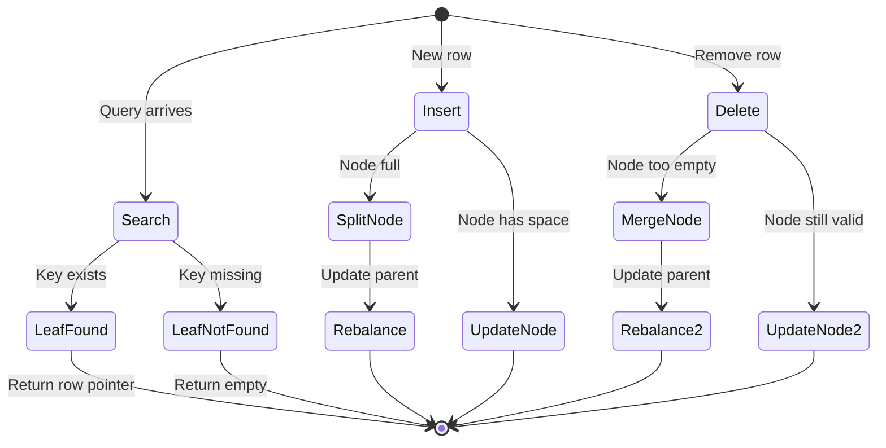
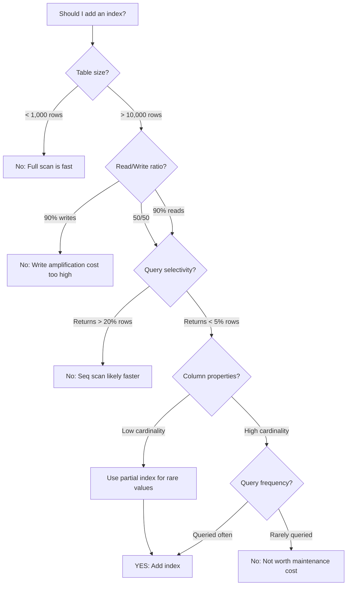
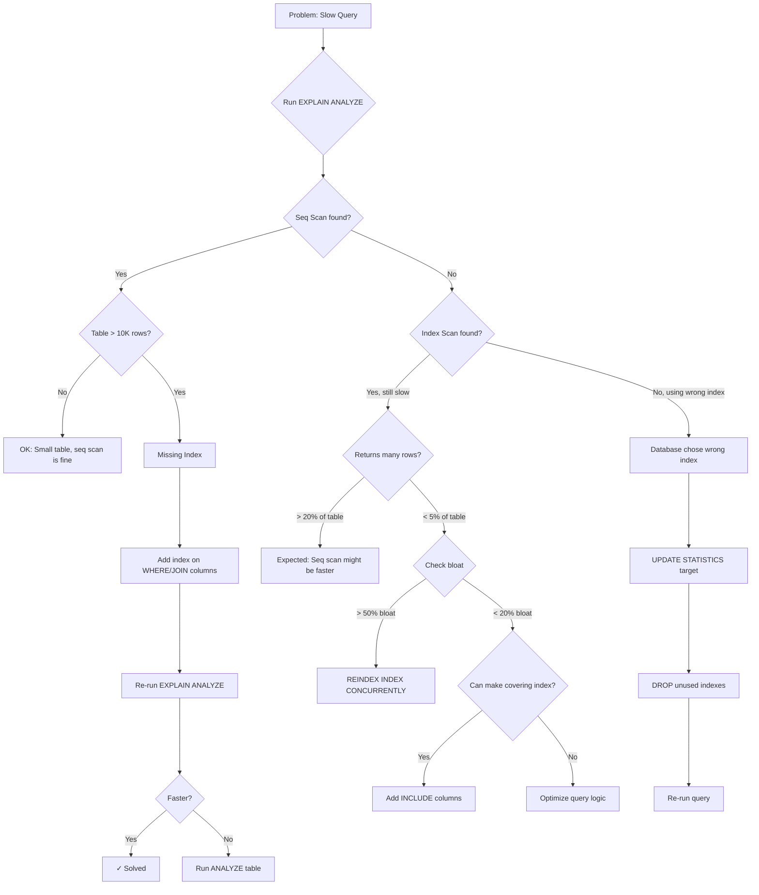

#system-design #pattern #database #performance

# Database Indexing

## Intuition (30 sec)

A textbook index at the back of the book: instead of reading 500 pages to find "mitochondria," you look it up in the index and go directly to page 237. Without the index, every search is a full book scan.

## Failure-First Scenario

> Your users table has 10M rows. `SELECT * FROM users WHERE email = 'user@example.com'` takes 3 seconds (full table scan). Adding ONE index on email column: 3ms. That's a 1000x improvement from a single `CREATE INDEX` statement.

## Working Knowledge (5 min)

### Core Concept - Definition First

**Database Index:**
- **Definition:** A database index is a data structure that maintains a sorted copy of selected columns to enable fast lookups without scanning the entire table.
- **Purpose:** Transform O(n) full table scans into O(log n) lookups, dramatically improving query performance.
- **How it works:** The index stores pointers to table rows, organized in a structure optimized for fast searching (typically a B-tree), allowing the database to jump directly to relevant rows.

**Key Terms:**
- **Selectivity:** The ratio of distinct values to total rows in a column; high selectivity (many distinct values) makes better indexes.
- **Cardinality:** The number of unique values in a column; higher cardinality generally benefits more from indexing.
- **Index Scan:** Database reads the index structure to find rows (fast).
- **Sequential Scan (Seq Scan):** Database reads every row in the table (slow for large tables).
- **Index-Only Scan:** Query answered entirely from index data without accessing the table (fastest).
- **Covering Index:** An index containing all columns needed by a query, enabling index-only scans.
- **Partial Index:** An index built on a subset of rows defined by a WHERE clause.
- **Composite Index:** An index spanning multiple columns, also called multi-column index.

### How Indexes Work

**Complexity Analysis:**
- **Without index:** Scan every row → O(n)
- **With B-tree index:** Binary-search-like lookup → O(log n)

**For 10M rows:**
- O(n) = 10,000,000 comparisons (seconds)
- O(log n) = ~23 comparisons (milliseconds)

### Index Types - Definitions

| Type | Definition | How It Works | Best For |
|------|------------|--------------|----------|
| **B-tree** | Balanced tree index storing sorted key-pointer pairs in multi-level nodes | Self-balancing tree with all leaves at same depth; supports range queries | Range queries (`>`, `<`, `BETWEEN`), equality, `ORDER BY`, `LIKE 'prefix%'` (default in most DBs) |
| **Hash** | Hash table index mapping keys to row locations via hash function | Direct key-to-location mapping using hash buckets; O(1) lookups | Exact equality only (`=`); very fast but no range support |
| **GIN** | Generalized Inverted Index mapping component values to rows containing them | Stores array/JSONB elements as keys pointing to containing rows | Full-text search, arrays, JSONB, multi-value columns (PostgreSQL) |
| **GiST** | Generalized Search Tree supporting custom data types and search strategies | Extension framework for custom indexing logic; tree-based | Geometric data, range types, nearest-neighbor, PostGIS |
| **BRIN** | Block Range Index storing min/max values per block range | Stores summary statistics per table block (pages); very compact | Large tables with natural ordering (time-series, sequential IDs) |

### Composite (Multi-Column) Indexes

**Definition:** A composite index is an index on multiple columns treated as a single concatenated key, evaluated left-to-right.

```sql
CREATE INDEX idx_orders ON orders(user_id, created_at);
```

**Leftmost prefix rule:** This index helps with:
- `WHERE user_id = 123` (uses first column)
- `WHERE user_id = 123 AND created_at > '2024-01-01'` (uses both)
- Does NOT help: `WHERE created_at > '2024-01-01'` alone (can't skip first column)

**Why:** Index keys are sorted like `(user_id=1, date=2024-01-01), (user_id=1, date=2024-01-02), (user_id=2, date=2024-01-01)` — you can't search by date without knowing user_id first.

### Covering Index - Definition

**Covering Index:**
- **Definition:** An index that contains all columns referenced in a query (SELECT, WHERE, ORDER BY), allowing the query to be answered entirely from the index without accessing the table.
- **Purpose:** Eliminate table lookups, achieving maximum query speed.
- **Benefit:** Index-only scans are the fastest possible query execution.

```sql
CREATE INDEX idx_cover ON orders(user_id, created_at, total);

-- This query never touches the table — answered entirely from index
SELECT total FROM orders WHERE user_id = 123 AND created_at > '2024-01-01';
```

### Partial Index - Definition

**Partial Index:**
- **Definition:** An index built on a filtered subset of table rows, specified by a WHERE clause.
- **Purpose:** Reduce index size and maintenance cost while maintaining fast lookups for common queries.

```sql
-- Only index active users
CREATE INDEX idx_active_users ON users(email) WHERE is_active = true;

-- Only index recent orders
CREATE INDEX idx_recent_orders ON orders(created_at) WHERE created_at > '2025-01-01';
```

**When to use:** When queries frequently filter on a specific condition (active users, recent records, non-null values).

## Layer 1: Conceptual Precision (15 min)

### B-tree Index - Deep Definitions

**B-tree (Balanced Tree):**
- **Formal Definition:** A self-balancing tree data structure where each node contains multiple keys and child pointers, maintaining sorted order and ensuring all leaf nodes are at the same depth.
- **Simple Definition:** A phonebook where pages are organized into chapters and sections, allowing you to jump to the right section in a few hops instead of flipping through every page.
- **Analogy:** Like a corporate hierarchy: CEO (root) → VPs (internal nodes) → Managers (internal nodes) → Employees (leaf nodes). You navigate down levels to find the person you need.
- **Related Terms:**
  - **B+tree:** Variant where all values stored in leaves (better for range scans); most databases use B+trees
  - **Binary tree:** Only 2 children per node (slower); B-tree has hundreds
  - **Hash index:** No ordering, can't do ranges

### B-tree Internals (Visual Flow)

```
                    Root Node
                      [50]
                   /         \
         Internal [20, 30]      [70, 80] Internal
           Nodes / |  \           / |  \   Nodes
              [10] [25] [35]  [60] [75] [90]
               Leaf Nodes (contain actual data/pointers)

Properties:
• Height: 3 (log₂₅₀ 10,000,000 ≈ 4 for 10M rows)
• Each node: 100-1000 keys (reduces disk I/O)
• Balanced: all paths root→leaf same length
• Sorted: enables range queries and ORDER BY
```

**B-tree Properties:**
- **Balance:** All leaf nodes at same depth → O(log n) guaranteed
- **Sorted:** Keys stored in order → range queries work
- **High fanout:** Each node holds many keys (hundreds) → shallow tree
- **Page-aligned:** Nodes match disk block size → minimal I/O

**Step-by-step search for key=75:**
1. **Root lookup:** Read root node [50], 75 > 50, go right
2. **Internal node:** Read [70, 80], 70 < 75 < 80, go middle
3. **Leaf node:** Read [75], found! Return row pointer

**Total disk reads:** 3 (height of tree) vs. millions for full scan

### B-tree Operations



**State Definitions:**
- **Search:** O(log n) tree traversal from root to leaf
- **Insert:** Add key to leaf, split node if full (triggers rebalance up to root)
- **Delete:** Remove key from leaf, merge node if too empty
- **Rebalance:** Propagate splits/merges up tree to maintain balance property

### Trade-offs Matrix (With Definitions)

```
Indexed Table                       Non-Indexed Table
════════════════════════════════════════════════════════════
Definition: Table with B-tree       Definition: Table with no
indexes on frequently queried       indexes (heap storage only)
columns

Pros:                               Pros:
• Fast reads: O(log n) lookups     • Fast writes: no index update
• Enables ORDER BY without sort    • Less storage: no index data
• Supports efficient JOINs         • Simple: no index maintenance
• Critical for large tables        • Good for small tables (<1000)

Cons:                               Cons:
• Slower writes: update indexes    • Slow reads: O(n) full scans
• Storage overhead: 20-50% more    • No ORDER BY optimization
• Maintenance cost: VACUUM/ANALYZE • JOINs always slow
• Can choose wrong index (bloat)   • Unusable at scale

Use When:                           Use When:
• Table > 10,000 rows              • Table < 1,000 rows
• Read-heavy workload (90% reads)  • Write-heavy (append-only logs)
• Complex queries (JOINs, ORDER BY)• Simple queries (no WHERE)
• Foreign keys                     • Staging/temporary tables
```

**Write Amplification:**
- **Definition:** Each write to the table also writes to every index on that table; one INSERT becomes N writes if N indexes exist.
- **Impact:** Table with 5 indexes: 1 INSERT = 6 writes (1 table + 5 indexes)

| Operation | Without Index | With Index |
|-----------|--------------|-----------|
| SELECT (where) | Slow (O(n) scan) | Fast (O(log n) lookup) |
| INSERT | Fast (append to heap) | Slower (must update all indexes) |
| UPDATE (indexed col) | Fast | Slower (must update matching indexes) |
| DELETE | Fast | Slower (must update all indexes) |
| Storage | Less (table only) | More (table + index data ~20-50%) |

**The Index Trade-off Rule:**
- If table is 90% reads → index everything queried
- If table is 50/50 → index selectively
- If table is 90% writes → minimal indexes only

### Index Selectivity - Deep Definition

**Selectivity:**
- **Formal Definition:** Selectivity is the ratio of distinct values to total rows, measuring how well an index narrows down the result set.
- **Formula:** `Selectivity = (Distinct Values) / (Total Rows)`
- **Range:** 0 to 1, where 1 is perfect (all unique), 0 is useless (all same)

**Why this matters:**
High selectivity means the index eliminates most rows, making it valuable. Low selectivity means the database might prefer a full scan over using the index (reading index + table could be slower than just scanning table).

```
High selectivity (good for index):
• email: 10M distinct / 10M rows = 1.0 (perfect)
• user_id: 10M distinct / 10M rows = 1.0 (perfect)
• username: 9.8M distinct / 10M rows = 0.98 (excellent)

Medium selectivity (case-by-case):
• country: 200 distinct / 10M rows = 0.00002 (index helpful for rare countries)
• category: 50 distinct / 10M rows = 0.000005 (might help with WHERE + other columns)

Low selectivity (bad for index):
• gender: 3 distinct / 10M rows = 0.0000003 (usually skip index)
• is_active: 2 distinct / 10M rows = 0.0000002 (full scan faster)
• boolean flags: useless for standalone index
```

**Rule of thumb:**
- Selectivity > 0.01 (1%): Usually worth indexing
- Selectivity < 0.01: Consider partial index or composite index instead
- Unique columns: Always index

**Exception - Partial Index for Low Selectivity:**
```sql
-- Bad: is_active has low selectivity
CREATE INDEX idx_active ON users(is_active);

-- Good: Partial index for the rare case (only 5% of users inactive)
CREATE INDEX idx_inactive ON users(id) WHERE is_active = false;
```

### EXPLAIN ANALYZE - Detailed Examples

**EXPLAIN ANALYZE:**
- **Definition:** A PostgreSQL command that executes a query and returns the query execution plan with actual runtime statistics.
- **Purpose:** Identify slow queries, missing indexes, inefficient joins, and wrong query plans.
- **How it works:** Database planner shows each step, estimated vs. actual rows, and time spent per operation.

**Key Metrics in Output:**
- **cost:** Estimated startup..total cost (abstract units, not time)
- **rows:** Estimated number of rows returned
- **actual time:** Real execution time in milliseconds
- **Seq Scan:** Sequential scan (full table scan) - slow
- **Index Scan:** Using index to find rows - fast
- **Bitmap Index Scan:** Build bitmap of matching rows, then fetch - medium
- **Index Only Scan:** Answer from index without table access - fastest

#### Example 1: Missing Index (Before)

```sql
EXPLAIN ANALYZE SELECT * FROM users WHERE email = 'john@example.com';

Seq Scan on users  (cost=0.00..185432.00 rows=1 width=256)
                   (actual time=2847.234..3240.123 rows=1 loops=1)
  Filter: (email = 'john@example.com')
  Rows Removed by Filter: 9999999
Planning Time: 0.123 ms
Execution Time: 3240.345 ms
```

**Analysis:**
- **Seq Scan:** Full table scan reading all 10M rows
- **Rows Removed by Filter:** 9,999,999 rows scanned but discarded
- **Execution Time:** 3.2 seconds for 1 row

#### Example 2: With Index (After)

```sql
CREATE INDEX idx_users_email ON users(email);

EXPLAIN ANALYZE SELECT * FROM users WHERE email = 'john@example.com';

Index Scan using idx_users_email on users  (cost=0.43..8.45 rows=1 width=256)
                                           (actual time=0.023..0.035 rows=1 loops=1)
  Index Cond: (email = 'john@example.com')
Planning Time: 0.234 ms
Execution Time: 0.067 ms
```

**Analysis:**
- **Index Scan:** Used index, jumped directly to row
- **Index Cond:** Condition applied at index level (not filter)
- **Execution Time:** 0.067ms (48,000x faster!)

#### Example 3: Composite Index

```sql
-- Query: Find user's recent orders
EXPLAIN ANALYZE
SELECT order_id, total FROM orders
WHERE user_id = 12345 AND created_at > '2026-01-01'
ORDER BY created_at DESC LIMIT 10;

-- Without composite index:
Seq Scan on orders  (cost=0.00..450892.45 rows=245 width=16)
                    (actual time=1234.56..5678.90 rows=245 loops=1)
  Filter: ((user_id = 12345) AND (created_at > '2026-01-01'))
  Rows Removed by Filter: 9999755
Sort  (cost=5680.12..5680.73 rows=245 width=16)
      (actual time=5679.45..5679.48 rows=10 loops=1)
  Sort Key: created_at DESC
  Sort Method: top-N heapsort  Memory: 25kB
Execution Time: 5679.834 ms

-- With composite index:
CREATE INDEX idx_orders_user_date ON orders(user_id, created_at DESC);

Limit  (cost=0.56..12.34 rows=10 width=16)
       (actual time=0.045..0.089 rows=10 loops=1)
  ->  Index Scan using idx_orders_user_date on orders
                    (cost=0.56..287.91 rows=245 width=16)
                    (actual time=0.043..0.086 rows=10 loops=1)
      Index Cond: ((user_id = 12345) AND (created_at > '2026-01-01'))
Planning Time: 0.312 ms
Execution Time: 0.123 ms
```

**Analysis:**
- **Before:** Full scan + sort = 5.6 seconds
- **After:** Index provides sorted results, LIMIT stops early = 0.12ms
- **Improvement:** 46,000x faster

#### Example 4: Index-Only Scan (Covering Index)

```sql
CREATE INDEX idx_orders_cover ON orders(user_id, created_at, total);

EXPLAIN ANALYZE
SELECT total FROM orders
WHERE user_id = 12345 AND created_at > '2026-01-01';

Index Only Scan using idx_orders_cover on orders
                (cost=0.56..234.12 rows=245 width=8)
                (actual time=0.034..0.287 rows=245 loops=1)
  Index Cond: ((user_id = 12345) AND (created_at > '2026-01-01'))
  Heap Fetches: 0
Planning Time: 0.189 ms
Execution Time: 0.312 ms
```

**Analysis:**
- **Index Only Scan:** Query answered entirely from index
- **Heap Fetches: 0:** Never touched the table (fastest possible)
- **Why:** Index contains user_id, created_at, total - all columns in query

#### Example 5: Wrong Index Chosen (Index Bloat)

```sql
-- Database chooses wrong index
EXPLAIN ANALYZE SELECT * FROM users WHERE email LIKE '%@gmail.com';

Index Scan using idx_users_email on users  -- WRONG CHOICE!
                (cost=0.43..450892.45 rows=500000 width=256)
                (actual time=0.123..8234.567 rows=500000 loops=1)
  Filter: (email ~~ '%@gmail.com')
  Rows Removed by Filter: 9500000
Execution Time: 8456.789 ms

-- Better: Force seq scan for this query
SET enable_indexscan = off;
EXPLAIN ANALYZE SELECT * FROM users WHERE email LIKE '%@gmail.com';

Seq Scan on users  (cost=0.00..185432.00 rows=500000 width=256)
                   (actual time=0.345..3456.789 rows=500000 loops=1)
  Filter: (email ~~ '%@gmail.com')
  Rows Removed by Filter: 9500000
Execution Time: 3567.890 ms
```

**Analysis:**
- **LIKE '%...':** Leading wildcard can't use index efficiently
- **Index scan:** Scanned entire index + fetched 500K rows from table
- **Seq scan:** Scanned table once, actually faster
- **Lesson:** Index not always better for non-selective queries

### Decision Trees - When to Index



### When to Add Indexes - Detailed

**1. Columns in WHERE clauses**
- **Definition:** Columns used to filter rows
- **Example:** `WHERE user_id = 123`, `WHERE email = 'x@y.com'`
- **Rule:** Index if query is frequent and selective

**2. Columns in JOIN conditions**
- **Definition:** Columns used to match rows between tables
- **Example:** `orders JOIN users ON orders.user_id = users.id`
- **Rule:** Always index foreign keys (both sides of JOIN)

**3. Columns in ORDER BY**
- **Definition:** Columns used to sort results
- **Example:** `ORDER BY created_at DESC`
- **Rule:** Index prevents expensive sort operation

**4. Columns in GROUP BY**
- **Definition:** Columns used to aggregate rows
- **Example:** `GROUP BY category`
- **Rule:** Index helps group rows efficiently

**5. Foreign keys**
- **Definition:** Columns referencing primary keys in other tables
- **Rule:** Always index (some DBs auto-index, PostgreSQL doesn't!)

**6. Unique constraints**
- **Definition:** Columns that must have distinct values
- **Rule:** Always creates an index automatically

### When NOT to Add Indexes - Detailed

**1. Small tables (< 1,000 rows)**
- **Reason:** Full scan faster than index lookup overhead
- **Exception:** Unique constraints still need indexes

**2. Write-heavy tables (> 70% writes)**
- **Reason:** Every write updates all indexes (write amplification)
- **Exception:** Critical read queries still need indexes

**3. Low-selectivity columns (< 1% distinct values)**
- **Example:** gender, boolean flags, status with few values
- **Reason:** Index doesn't narrow results enough
- **Exception:** Partial index for rare values

**4. Columns rarely queried (< 1 query/hour)**
- **Reason:** Index maintenance cost exceeds benefit
- **Alternative:** Optimize when usage increases

**5. Columns with leading wildcards**
- **Example:** `WHERE email LIKE '%@gmail.com'`
- **Reason:** Can't use B-tree index with leading wildcard
- **Alternative:** Full-text index (GIN) or trigram index

## Layer 2: Technology-Specific Examples (20 min)

### PostgreSQL Index Configuration (Annotated)

**Index Type Selection:**

```sql
-- B-tree (default) - most common, supports range queries
CREATE INDEX idx_users_email ON users(email);
-- Use for: =, <, >, <=, >=, BETWEEN, IN, LIKE 'prefix%'

-- B-tree with DESC (sorted descending)
CREATE INDEX idx_orders_date ON orders(created_at DESC);
-- Use for: ORDER BY created_at DESC (avoids sort)

-- Hash (equality only, faster than B-tree)
CREATE INDEX idx_sessions_token ON sessions USING HASH (session_token);
-- Use for: = only, no range queries
-- Note: Hash indexes not WAL-logged before PG 10 (not crash-safe)

-- GIN (inverted index for multi-value columns)
CREATE INDEX idx_posts_tags ON posts USING GIN (tags);
-- Use for: arrays, JSONB, full-text search
-- Query: WHERE tags @> ARRAY['postgres']

-- GiST (geometric and custom types)
CREATE INDEX idx_locations ON stores USING GIST (location);
-- Use for: PostGIS, nearest-neighbor, range types
-- Query: ORDER BY location <-> point(lat, lon) LIMIT 5

-- BRIN (block range index for sequential data)
CREATE INDEX idx_logs_timestamp ON logs USING BRIN (created_at);
-- Use for: time-series, append-only data, huge tables
-- Very small index size (~0.1% of table)
```

**Composite Index Configurations:**

```sql
-- Standard composite index
CREATE INDEX idx_orders_user_date ON orders(user_id, created_at);
-- Helps: WHERE user_id=X, WHERE user_id=X AND created_at>Y
-- Doesn't help: WHERE created_at>Y (missing leftmost column)

-- Covering index (include extra columns)
CREATE INDEX idx_orders_user_date_cover ON orders(user_id, created_at)
INCLUDE (total, status);
-- PostgreSQL 11+: INCLUDE adds columns to index without making them searchable
-- Enables index-only scans for queries selecting total/status

-- Partial index (filtered)
CREATE INDEX idx_active_users ON users(email) WHERE is_active = true;
-- Only indexes active users (smaller, faster)
-- Must use WHERE is_active=true in query to use this index

-- Unique index
CREATE UNIQUE INDEX idx_users_email_unique ON users(email);
-- Enforces uniqueness + provides fast lookups

-- Partial unique index
CREATE UNIQUE INDEX idx_users_email_active ON users(email)
WHERE is_active = true;
-- Allows duplicate emails if is_active=false, but unique when true

-- Expression index (function-based)
CREATE INDEX idx_users_email_lower ON users(LOWER(email));
-- Use for: WHERE LOWER(email) = 'john@example.com'
-- Enables case-insensitive searches

-- Multi-column expression index
CREATE INDEX idx_users_fullname ON users((first_name || ' ' || last_name));
-- Use for: WHERE first_name || ' ' || last_name = 'John Doe'
```

**PostgreSQL Index Parameters:**

```sql
-- Fillfactor (how full each index page should be)
CREATE INDEX idx_orders ON orders(id) WITH (fillfactor = 70);
-- Definition: Percentage of each page to fill (default 90)
-- Lower fillfactor (70): Leaves room for updates, reduces page splits
-- Use for: Tables with frequent updates to indexed columns

-- Statistics target (planner accuracy)
ALTER TABLE users ALTER COLUMN email SET STATISTICS 1000;
-- Definition: Number of histogram bins for query planner (default 100)
-- Higher = more accurate estimates but slower ANALYZE
-- Use for: Columns with complex distribution

-- Concurrent index creation (non-blocking)
CREATE INDEX CONCURRENTLY idx_users_email ON users(email);
-- Definition: Builds index without locking table for writes
-- Takes longer but allows concurrent INSERTs/UPDATEs
-- Use for: Production tables that can't have downtime
```

### PostgreSQL Index Maintenance

**Monitoring Index Usage:**

```sql
-- Check index usage statistics
SELECT
    schemaname,
    tablename,
    indexname,
    idx_scan as index_scans,
    idx_tup_read as tuples_read,
    idx_tup_fetch as tuples_fetched,
    pg_size_pretty(pg_relation_size(indexrelid)) as index_size
FROM pg_stat_user_indexes
ORDER BY idx_scan ASC;
-- Definition: idx_scan = number of times index was used
-- idx_scan = 0 → unused index, consider dropping

-- Find unused indexes (candidates for deletion)
SELECT
    schemaname || '.' || tablename AS table,
    indexname AS index,
    pg_size_pretty(pg_relation_size(indexrelid)) AS size,
    idx_scan
FROM pg_stat_user_indexes
WHERE idx_scan = 0
  AND indexrelid::regclass::text NOT LIKE '%_pkey'
ORDER BY pg_relation_size(indexrelid) DESC;

-- Find duplicate indexes (same columns)
SELECT
    pg_size_pretty(SUM(pg_relation_size(idx))::bigint) AS total_size,
    array_agg(idx) AS indexes
FROM (
    SELECT
        indexrelid::regclass AS idx,
        (indrelid::text || E'\n' || indclass::text || E'\n' ||
         indkey::text || E'\n' || COALESCE(indexprs::text, '') ||
         E'\n' || COALESCE(indpred::text, '')) AS key
    FROM pg_index
) sub
GROUP BY key
HAVING COUNT(*) > 1
ORDER BY SUM(pg_relation_size(idx)) DESC;

-- Index bloat detection
SELECT
    schemaname,
    tablename,
    indexname,
    pg_size_pretty(pg_relation_size(indexrelid)) AS index_size,
    ROUND(100 * (pg_relation_size(indexrelid) -
          pg_relation_size(indexrelid, 'main')) /
          NULLIF(pg_relation_size(indexrelid), 0), 2) AS bloat_pct
FROM pg_stat_user_indexes
WHERE pg_relation_size(indexrelid) > 10485760  -- > 10MB
ORDER BY pg_relation_size(indexrelid) DESC;
```

**Index Maintenance Commands:**

```sql
-- Rebuild bloated index (locks table)
REINDEX INDEX idx_users_email;
-- Definition: Rebuilds index from scratch, removes bloat
-- Locks: Takes exclusive lock, blocks reads/writes
-- Use: When index bloat > 50%

-- Rebuild all indexes on table
REINDEX TABLE users;

-- Concurrent rebuild (PostgreSQL 12+, no downtime)
REINDEX INDEX CONCURRENTLY idx_users_email;
-- Definition: Rebuilds without blocking reads/writes
-- Takes longer, requires 2x disk space temporarily
-- Use: Production tables

-- Update statistics (helps query planner)
ANALYZE users;
-- Definition: Collects statistics about table contents
-- Doesn't rebuild index, just updates planner stats
-- Fast, run after bulk changes

-- Vacuum (reclaim dead tuples)
VACUUM ANALYZE users;
-- Definition: Removes dead tuples, updates statistics
-- Important: Prevents transaction ID wraparound
-- Run: Automatically by autovacuum, or manually after bulk deletes
```

### Database Comparison - Index Support

| Feature | PostgreSQL | MySQL/InnoDB | MongoDB | Redis |
|---------|------------|--------------|---------|-------|
| **B-tree** | ✅ Default | ✅ Default | ✅ Default | ❌ |
| **Hash** | ✅ (since 10) | ✅ MEMORY only | ❌ | ✅ All data |
| **Full-text** | ✅ GIN/GiST | ✅ FULLTEXT | ✅ text index | ❌ RediSearch |
| **Geospatial** | ✅ PostGIS | ✅ SPATIAL | ✅ 2dsphere | ✅ GEOADD |
| **Partial Index** | ✅ WHERE clause | ❌ | ✅ partialFilterExpression | ❌ |
| **Expression Index** | ✅ | ❌ (generated cols) | ❌ | ❌ |
| **INCLUDE columns** | ✅ (since 11) | ❌ | ❌ | ❌ |
| **Concurrent Build** | ✅ CONCURRENTLY | ✅ ALGORITHM=INPLACE | ✅ background:true | N/A |

## Layer 3: Production-Ready Details (30 min)

### Monitoring Metrics (With Definitions)

```
┌─────────────────────────────────────────────────────────────┐
│  INDEX HEALTH DASHBOARD                                     │
├─────────────────────────────────────────────────────────────┤
│                                                             │
│ Index Usage Rate: 847 scans/sec                            │
│ Definition: Number of times indexes are used per second    │
│ Why track: Low usage = wasted indexes consuming space      │
│ Alert when: idx_scan = 0 for indexes > 100MB              │
│                                                             │
│ Index Hit Ratio: 99.8%                                     │
│ Definition: Percentage of index lookups served from cache  │
│ Formula: (idx_blks_hit) / (idx_blks_hit + idx_blks_read)  │
│ Target: > 99% (means enough shared_buffers)               │
│                                                             │
│ Index Size: 2.4 GB (15% of table size)                    │
│ Definition: Total disk space used by all indexes          │
│ Why track: Indexes cost storage; bloat wastes space       │
│ Alert when: Index > table size (likely bloated)           │
│                                                             │
│ Sequential Scans: 23/hour                                  │
│ Definition: Number of full table scans per hour           │
│ Why track: High seq scans = missing indexes               │
│ Query: SELECT seq_scan FROM pg_stat_user_tables;          │
│ Alert when: > 100/hour on tables > 100K rows              │
│                                                             │
│ Index Bloat: 12% (acceptable)                             │
│ Definition: Percentage of index space wasted by dead tuples│
│ Why track: Bloated indexes slow queries and waste disk    │
│ Fix: REINDEX when bloat > 50%                             │
│                                                             │
│ Write Amplification: 3.2x                                  │
│ Definition: Each logical write triggers 3.2 physical writes│
│ Formula: (table writes + index writes) / table writes      │
│ Why track: Too many indexes slow INSERTs/UPDATEs          │
│                                                             │
└─────────────────────────────────────────────────────────────┘
```

**Key Index Metrics:**

```sql
-- Index cache hit ratio (should be > 99%)
SELECT
    sum(idx_blks_hit) / nullif(sum(idx_blks_hit + idx_blks_read), 0) * 100 AS hit_ratio
FROM pg_statio_user_indexes;

-- Tables with most sequential scans (missing indexes?)
SELECT
    schemaname,
    tablename,
    seq_scan,
    seq_tup_read,
    idx_scan,
    seq_tup_read / nullif(seq_scan, 0) AS avg_seq_tup
FROM pg_stat_user_tables
WHERE seq_scan > 0
ORDER BY seq_tup_read DESC
LIMIT 20;

-- Slow queries needing indexes
SELECT
    calls,
    mean_exec_time,
    query
FROM pg_stat_statements
WHERE mean_exec_time > 100  -- > 100ms
ORDER BY mean_exec_time DESC
LIMIT 20;
```

### Troubleshooting Flow (With Explanations)



**Common Index Problems:**

**Problem 1: Missing Index**
```sql
-- Symptom: EXPLAIN shows Seq Scan
-- Solution: Add index on filtered columns
CREATE INDEX CONCURRENTLY idx_users_email ON users(email);
```

**Problem 2: Unused Index (Wasting Space)**
```sql
-- Symptom: idx_scan = 0 in pg_stat_user_indexes
-- Solution: Drop the index
DROP INDEX idx_users_middle_name;
```

**Problem 3: Wrong Index Chosen**
```sql
-- Symptom: Index scan slower than expected
-- Cause: Outdated statistics
-- Solution: Update statistics
ANALYZE users;

-- Or increase statistics target for column
ALTER TABLE users ALTER COLUMN email SET STATISTICS 1000;
ANALYZE users;
```

**Problem 4: Index Bloat**
```sql
-- Symptom: Index size much larger than expected
-- Cause: Many UPDATEs/DELETEs created dead tuples
-- Solution: Rebuild index
REINDEX INDEX CONCURRENTLY idx_users_email;
```

**Problem 5: Duplicate Indexes**
```sql
-- Symptom: Multiple indexes on same columns
-- Example: idx_users_email and idx_users_email_2
-- Solution: Drop duplicates
DROP INDEX idx_users_email_2;
```

**Problem 6: Composite Index Wrong Order**
```sql
-- Bad: Index on (created_at, user_id) but query filters user_id first
CREATE INDEX idx_orders_date_user ON orders(created_at, user_id);
SELECT * FROM orders WHERE user_id = 123;  -- Can't use index efficiently

-- Good: Match leftmost prefix
DROP INDEX idx_orders_date_user;
CREATE INDEX idx_orders_user_date ON orders(user_id, created_at);
```

## The "Why" Chain

- **Why index?** → Transform O(n) scans into O(log n) lookups — often 1000x faster
- **What's the alternative?** → Full table scans (fine for small tables), denormalization, caching
- **What breaks without it?** → Queries become seconds instead of milliseconds as data grows

## Real-World Examples

### Example 1: Instagram - Feed Generation Index Strategy

**Problem Definition:**
Instagram needed to generate personalized feeds for 1B+ users efficiently. Query: "Get last 100 posts from users I follow, ordered by time." Without proper indexing, this query scanned millions of posts per user request, causing 10+ second load times.

**Solution Definition:**
Multi-level composite indexing strategy with covering indexes to enable index-only scans for feed queries.

**Technical Terms Used:**
- **Feed Query:** Retrieve posts from followed users in chronological order
- **Fan-out:** Each user follows 100-500 users on average
- **Composite Index:** Index on (follower_id, created_at) to optimize feed queries
- **Covering Index:** Include post metadata in index to avoid table lookups

**Before Architecture:**
```sql
-- posts table: 100B+ rows
-- Query without index:
SELECT post_id, user_id, image_url, caption, created_at
FROM posts
WHERE user_id IN (123, 456, 789, ...)  -- 500 followed users
ORDER BY created_at DESC
LIMIT 100;

-- EXPLAIN: Seq Scan → 15 seconds per request
```

**After Architecture:**
```sql
-- Composite index for feed queries
CREATE INDEX idx_posts_user_time ON posts(user_id, created_at DESC);

-- Covering index to avoid table lookups
CREATE INDEX idx_posts_feed_cover ON posts(user_id, created_at DESC)
INCLUDE (post_id, image_url, caption, likes_count);

-- Query now uses index-only scan
SELECT post_id, user_id, image_url, caption, created_at
FROM posts
WHERE user_id IN (SELECT following_id FROM follows WHERE follower_id = 12345)
ORDER BY created_at DESC
LIMIT 100;

-- EXPLAIN: Index Only Scan → 50ms per request
```

**Additional Optimizations:**
```sql
-- Partial index for recent posts only (smaller index)
CREATE INDEX idx_posts_recent ON posts(user_id, created_at DESC)
WHERE created_at > NOW() - INTERVAL '30 days';
-- Reasoning: Feed only shows recent posts, old data rarely accessed

-- BRIN index for chronological data
CREATE INDEX idx_posts_time_brin ON posts USING BRIN(created_at);
-- Reasoning: Posts naturally ordered by time; BRIN is tiny (100MB vs 50GB B-tree)
```

**Results:**
- **Feed Query Time:** 15 seconds → 50ms (300x improvement)
- **Index Size:** 50GB for covering index (vs 500GB table)
- **Cache Hit Ratio:** 99.9% (index fits in memory)
- **Database Load:** Reduced by 95% (index-only scans)

**Key Lesson:** Covering indexes eliminate table lookups, critical for high-traffic queries.

---

### Example 2: Twitter - Timeline Index Strategy

**Problem Definition:**
Twitter timelines require fetching tweets from followed users, ranked by engagement and time. Original approach used application-level sorting after fetching all tweets, causing high latency and database load.

**Solution Definition:**
Composite indexes with expression indexes for engagement scoring, partial indexes for verified users, and materialized views for hot data.

**Technical Terms Used:**
- **Timeline Query:** Fetch tweets from followed users with engagement ranking
- **Engagement Score:** Calculated as `likes + retweets * 2 + replies * 3`
- **Hot Partition:** Recent tweets (< 7 days) queried frequently
- **Cold Partition:** Old tweets (> 7 days) archived, rarely queried

**Indexing Strategy:**

```sql
-- 1. Composite index for user timeline
CREATE INDEX idx_tweets_user_time ON tweets(user_id, created_at DESC);

-- 2. Expression index for engagement ranking
CREATE INDEX idx_tweets_engagement ON tweets(
    (likes_count + retweets_count * 2 + replies_count * 3) DESC,
    created_at DESC
);
-- Enables: ORDER BY engagement_score DESC without computing at query time

-- 3. Partial index for verified users (high engagement)
CREATE INDEX idx_tweets_verified ON tweets(user_id, created_at DESC)
WHERE user_verified = true;
-- Reasoning: Verified tweets prioritized in timeline, need fast access

-- 4. Partial index for hot partition (recent tweets)
CREATE INDEX idx_tweets_recent ON tweets(user_id, created_at DESC, engagement_score)
WHERE created_at > NOW() - INTERVAL '7 days';
-- Reasoning: 90% of timeline queries fetch last 7 days

-- 5. Hash index for exact tweet lookups
CREATE INDEX idx_tweets_id_hash ON tweets USING HASH (tweet_id);
-- Enables: Fast single-tweet fetches (permalink pages)
```

**Timeline Query Optimization:**

```sql
-- Before: Application-level sorting
SELECT * FROM tweets
WHERE user_id IN (SELECT following_id FROM follows WHERE follower_id = 12345)
  AND created_at > NOW() - INTERVAL '7 days'
ORDER BY created_at DESC
LIMIT 1000;
-- Application then sorts by engagement → Slow

-- After: Database-level sorting with index
SELECT
    tweet_id,
    user_id,
    content,
    (likes_count + retweets_count * 2 + replies_count * 3) AS engagement_score,
    created_at
FROM tweets
WHERE user_id IN (SELECT following_id FROM follows WHERE follower_id = 12345)
  AND created_at > NOW() - INTERVAL '7 days'
ORDER BY (likes_count + retweets_count * 2 + replies_count * 3) DESC, created_at DESC
LIMIT 50;
-- Uses idx_tweets_engagement expression index

-- EXPLAIN:
-- Index Scan using idx_tweets_engagement → 120ms
-- vs Sequential Scan + Sort → 8 seconds
```

**Sharding Strategy with Indexes:**

```sql
-- Tweets sharded by user_id (shard key)
-- Each shard has local indexes
CREATE INDEX idx_tweets_shard ON tweets_shard_1(user_id, created_at DESC);
CREATE INDEX idx_tweets_shard ON tweets_shard_2(user_id, created_at DESC);
-- ... 4096 shards

-- Timeline query hits multiple shards, merges results
-- Each shard query uses local index → Fast parallel lookups
```

**Results:**
- **Timeline Latency:** 8 seconds → 120ms (66x improvement)
- **Database CPU:** Reduced 80% (sorting offloaded to index)
- **Index Storage:** 300GB across shards (5% of total data)
- **Query Throughput:** 10K QPS → 500K QPS per shard

**Key Lesson:** Expression indexes eliminate runtime calculations; partial indexes reduce size for hot data.

---

### Example 3: Uber - Geospatial Indexing for Driver Matching

**Problem Definition:**
Uber needs to find nearest drivers within 5km of rider location. Naive approach checked distance for all drivers, causing 30+ second matching time.

**Solution Definition:**
R-tree geospatial index (PostGIS) with composite index on location + availability for sub-second driver matching.

```sql
-- Enable PostGIS extension
CREATE EXTENSION postgis;

-- Add geometry column
ALTER TABLE drivers ADD COLUMN location GEOMETRY(Point, 4326);

-- Geospatial index (R-tree)
CREATE INDEX idx_drivers_location ON drivers USING GIST (location);

-- Composite index: location + availability
CREATE INDEX idx_drivers_available ON drivers USING GIST (location)
WHERE is_available = true AND last_update > NOW() - INTERVAL '5 minutes';

-- Query: Find nearest 10 available drivers
SELECT
    driver_id,
    ST_Distance(location, ST_SetSRID(ST_MakePoint(-73.9857, 40.7484), 4326)) AS distance
FROM drivers
WHERE is_available = true
  AND ST_DWithin(location, ST_SetSRID(ST_MakePoint(-73.9857, 40.7484), 4326), 5000)  -- 5km
ORDER BY location <-> ST_SetSRID(ST_MakePoint(-73.9857, 40.7484), 4326)
LIMIT 10;

-- EXPLAIN: GiST Index Scan → 45ms (was 30 seconds)
```

**Results:**
- **Matching Time:** 30 seconds → 45ms (666x faster)
- **Index Type:** GiST R-tree optimized for spatial queries
- **Key Optimization:** Partial index on available drivers only

---

### Example 4: GitHub - Code Search with GIN Indexes

**Problem Definition:**
GitHub code search needed full-text search across billions of files. B-tree indexes don't support text search patterns.

**Solution Definition:**
PostgreSQL GIN (Generalized Inverted Index) with tsvector for tokenized full-text search.

```sql
-- Add full-text search column
ALTER TABLE code_files ADD COLUMN content_tsvector TSVECTOR;

-- Populate with tokenized content
UPDATE code_files SET content_tsvector = to_tsvector('english', content);

-- GIN index on tsvector (inverted index)
CREATE INDEX idx_code_search ON code_files USING GIN (content_tsvector);

-- Full-text search query
SELECT file_path, content
FROM code_files
WHERE content_tsvector @@ to_tsquery('postgres & index');
-- Finds files containing both "postgres" and "index"

-- EXPLAIN: Bitmap Index Scan using GIN → 200ms
-- Without index: Seq Scan with LIKE → 5 minutes
```

**Results:**
- **Search Time:** 5 minutes → 200ms (1500x faster)
- **Index Type:** GIN inverted index (token → file mappings)
- **Index Size:** 40GB (20% of content)

## Interview Preparation

### Concept Glossary

Quick reference definitions for interviews:

- **Index:** Data structure enabling O(log n) lookups instead of O(n) scans
- **B-tree:** Balanced tree with sorted keys, supports range queries (default index type)
- **Hash Index:** Direct key-to-row mapping via hash function, equality only
- **Composite Index:** Index on multiple columns, evaluated left-to-right
- **Covering Index:** Index containing all query columns, enables index-only scans
- **Partial Index:** Index on filtered rows (WHERE clause), reduces size
- **Selectivity:** Ratio of distinct values to total rows, high is better
- **Index Scan:** Reading index structure to find rows (fast)
- **Sequential Scan:** Reading all table rows (slow for large tables)
- **Index-Only Scan:** Query answered from index without table access (fastest)
- **Write Amplification:** Each write updates table + all indexes (cost of indexing)
- **Index Bloat:** Dead tuples wasting index space, fixed by REINDEX
- **Leftmost Prefix Rule:** Composite index (A, B, C) helps queries on A or A+B or A+B+C, not B or C alone

### Question Templates

**Q: Why are database indexes important in system design?**

**Answer Structure:**

1. **Define (5-10 sec):**
   "A database index is a data structure that maintains a sorted copy of columns to enable fast lookups, transforming O(n) full table scans into O(log n) lookups."

2. **Explain How (15-20 sec):**
   "Indexes work like a book index. Without an index, finding a row requires scanning every row. With a B-tree index, we navigate down a balanced tree structure in log(n) steps. For 10 million rows, that's 23 comparisons instead of 10 million—often 1000x faster."

3. **State When (10 sec):**
   "Use indexes for columns in WHERE, JOIN, ORDER BY clauses, especially on large tables (>10K rows) with high-selectivity columns and read-heavy workloads."

4. **Mention Trade-off (10 sec):**
   "Pro: Dramatically faster reads. Con: Slower writes due to index maintenance and storage overhead. Every insert updates all indexes."

---

**Q: How would you optimize a slow database query?**

**Answer Structure:**

1. **Start with EXPLAIN ANALYZE (15 sec):**
   "First, I'd run EXPLAIN ANALYZE to see the query execution plan. Look for sequential scans on large tables—that's usually a missing index. Check the actual vs. estimated row counts for cardinality issues."

2. **Identify Index Opportunities (20 sec):**
   "Add indexes on columns in WHERE clauses, JOIN conditions, and ORDER BY. For composite predicates, create multi-column indexes following the leftmost prefix rule. If the query returns many columns, consider a covering index with INCLUDE."

3. **Consider Alternatives (15 sec):**
   "If indexing doesn't help—like when returning >20% of table rows—consider query restructuring, denormalization, caching, or even accepting a sequential scan. Sometimes the index is more expensive than the scan."

4. **Verify and Monitor (10 sec):**
   "After adding indexes, re-run EXPLAIN ANALYZE to verify usage. Monitor index hit ratios and check for bloat. Use pg_stat_user_indexes to ensure new indexes are actually being used."

---

**Q: What's the difference between a B-tree and hash index?**

**Answer Structure:**

1. **Define Both (10 sec):**
   "B-tree is a balanced tree storing sorted keys, supporting range queries. Hash index maps keys to rows via hash function, supporting only equality."

2. **Key Difference (10 sec):**
   "B-tree supports <, >, BETWEEN, ORDER BY due to sorting. Hash index only supports = but is faster for exact matches."

3. **When to Use Each (10 sec):**
   "Use B-tree (default) for 95% of cases. Use hash only for exact-match-only queries on high-cardinality columns, and only in PostgreSQL 10+ (earlier versions weren't crash-safe)."

---

**Q: Explain the leftmost prefix rule for composite indexes.**

**Answer Structure:**

1. **Define (10 sec):**
   "A composite index on (A, B, C) treats columns as concatenated keys, sorted like (A=1,B=1,C=1), (A=1,B=1,C=2), (A=1,B=2,C=1). The database can only search from the left."

2. **Examples (20 sec):**
   "Index(user_id, created_at) helps: WHERE user_id=X (uses first column), WHERE user_id=X AND created_at>Y (uses both). But WHERE created_at>Y alone can't use the index—it needs user_id first."

3. **Design Implication (10 sec):**
   "Order matters. Put the most selective column first, or the most commonly queried column. Sometimes you need multiple indexes for different query patterns."

---

**Q: How do you monitor and maintain indexes in production?**

**Answer Structure:**

1. **Monitor Usage (15 sec):**
   "Query pg_stat_user_indexes for idx_scan counts. If idx_scan=0, the index is unused and wasting space. Track index cache hit ratios (should be >99%) and sequential scan counts on large tables."

2. **Identify Problems (15 sec):**
   "Look for index bloat (size much larger than expected), duplicate indexes (same columns), and wrong index choices (check EXPLAIN for index vs. seq scan decisions)."

3. **Maintenance Actions (15 sec):**
   "Run ANALYZE regularly to update statistics. REINDEX CONCURRENTLY to rebuild bloated indexes. Drop unused indexes. Use VACUUM to reclaim dead tuples."

4. **Prevention (10 sec):**
   "Enable autovacuum. Create indexes CONCURRENTLY in production. Use partial indexes for common filters to reduce size. Monitor disk space and set alerts for bloat."

---

**Q: Design indexes for a social media feed query.**

**Answer Structure:**

1. **Understand Query (10 sec):**
   "Feed query: Get posts from followed users, ordered by time, limit 100. This touches two tables: follows (who I follow) and posts (their posts)."

2. **Index Strategy (25 sec):**
   "Index follows(follower_id, following_id) for join. Index posts(user_id, created_at DESC) as composite for filtering and sorting. Consider a covering index posts(user_id, created_at, post_id, content) to avoid table lookups—enables index-only scans."

3. **Optimizations (20 sec):**
   "Add a partial index posts(user_id, created_at) WHERE created_at > NOW() - INTERVAL '30 days' since feeds only show recent posts—smaller index, faster. Use BRIN on created_at for chronological data. Shard by user_id for horizontal scaling."

4. **Trade-offs (10 sec):**
   "Covering index is large but eliminates table access. Partial index reduces size but only works for recent posts queries. Monitor write amplification as posts are write-heavy."

---

### Interview Tips - Practical Advice

**Always Mention These:**
- "First I'd check if we have proper indexes on filtered columns" (shows fundamentals)
- "I'd run EXPLAIN ANALYZE to see the query plan" (shows debugging approach)
- "Indexes speed up reads but slow down writes" (shows understanding of trade-offs)
- "For composite indexes, the leftmost prefix rule matters" (shows depth)

**Common Mistakes to Avoid:**
- Don't say "just add indexes everywhere" (shows lack of understanding of write costs)
- Don't forget to mention index maintenance (bloat, ANALYZE, unused indexes)
- Don't ignore selectivity (indexing boolean flags is usually wrong)
- Don't forget covering indexes (interviewers love index-only scan optimizations)

**Advanced Topics That Impress:**
- Partial indexes for common query patterns
- Expression indexes for computed columns
- Index-only scans with covering indexes
- BRIN for time-series data
- Geospatial indexes (GiST) for location queries
- GIN for full-text search and JSONB
- Index bloat and REINDEX CONCURRENTLY

**System Design Context:**
- Mention indexes in database layer of every design
- Pair with sharding: "Index locally within each shard"
- Pair with caching: "Index for cache misses"
- Pair with read replicas: "Indexes crucial for read replicas"

## Quick Reference

### Glossary

| Term | Definition | When You'll See It |
|------|------------|-------------------|
| **Index Scan** | Reading index to find rows | EXPLAIN output, good for selective queries |
| **Sequential Scan** | Reading all table rows | EXPLAIN output, slow for large tables |
| **Index Only Scan** | Query answered from index alone | EXPLAIN output, fastest possible |
| **Heap Fetches** | Table lookups after index scan | EXPLAIN output, 0 is ideal (covering index) |
| **Selectivity** | Distinct values / total rows | Query planning, >1% is good |
| **Cardinality** | Number of distinct values | Statistics, higher = better for indexes |
| **Write Amplification** | Writes multiplied by index count | Performance analysis, 1 write → N writes |
| **Index Bloat** | Dead tuples wasting space | Maintenance, fix with REINDEX |
| **Covering Index** | Index with all query columns | Optimization, enables index-only scans |
| **Partial Index** | Index on filtered rows | Space optimization, smaller indexes |
| **Composite Index** | Index on multiple columns | Multi-column queries, order matters |
| **Leftmost Prefix** | Composite index usage rule | Query optimization, match from left |
| **B-tree** | Balanced tree, default index | Most queries, supports ranges |
| **Hash Index** | Hash table, equality only | Exact matches, no ranges |
| **GIN** | Inverted index for arrays/text | Full-text search, JSONB, arrays |
| **GiST** | Extensible tree for custom types | Geospatial, PostGIS, nearest-neighbor |
| **BRIN** | Block range index, very small | Time-series, sequential data |

### Decision Cheat Sheet

```
IF table has < 1,000 rows
  THEN don't index (full scan is fast)

IF table has > 10,000 rows AND read-heavy (>70% reads)
  THEN index all WHERE/JOIN/ORDER BY columns

IF column has low selectivity (< 1% distinct values)
  THEN use partial index for rare values OR skip indexing

IF query returns > 20% of table rows
  THEN index won't help (seq scan faster)

IF query uses WHERE col1=X AND col2=Y
  THEN create composite index (col1, col2) with most selective first

IF query selects few columns
  THEN create covering index with INCLUDE

IF table has heavy writes (> 50% writes)
  THEN minimize indexes (only critical ones)

IF index has idx_scan = 0 for 30 days
  THEN DROP the index (unused, wasting space)

IF index bloat > 50%
  THEN REINDEX CONCURRENTLY (rebuild index)

IF EXPLAIN shows seq scan on large table
  THEN add index on filtered columns

IF EXPLAIN shows wrong index chosen
  THEN run ANALYZE (update statistics)

IF creating index on production table
  THEN use CREATE INDEX CONCURRENTLY (no downtime)
```

### Index Type Selection Flowchart

```
Start: What kind of query?
  │
  ├─ Equality only (col = value)
  │    │
  │    ├─ High QPS → Hash Index (PostgreSQL 10+)
  │    └─ General case → B-tree (default)
  │
  ├─ Range queries (col > value, BETWEEN, ORDER BY)
  │    └─ B-tree (only option)
  │
  ├─ Full-text search (LIKE '%word%', to_tsquery)
  │    └─ GIN index on tsvector
  │
  ├─ Array/JSONB contains (@>, ?&)
  │    └─ GIN index
  │
  ├─ Geospatial (nearest neighbor, within distance)
  │    └─ GiST index (PostGIS)
  │
  └─ Time-series (sequential, append-only)
       └─ BRIN index (tiny size)
```

## Links

- [[02_building_blocks/databases_sql]] — Indexes are fundamental to SQL performance
- [[sharding]] — Try indexing before sharding
- [[write_ahead_log]] — B-tree vs LSM tree write strategies
- [[02_building_blocks/search_systems]] — Inverted indexes for full-text search
