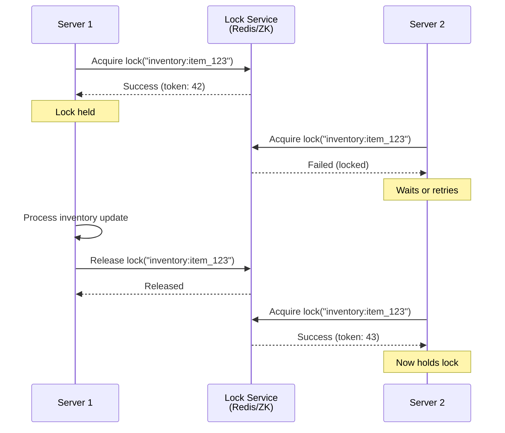
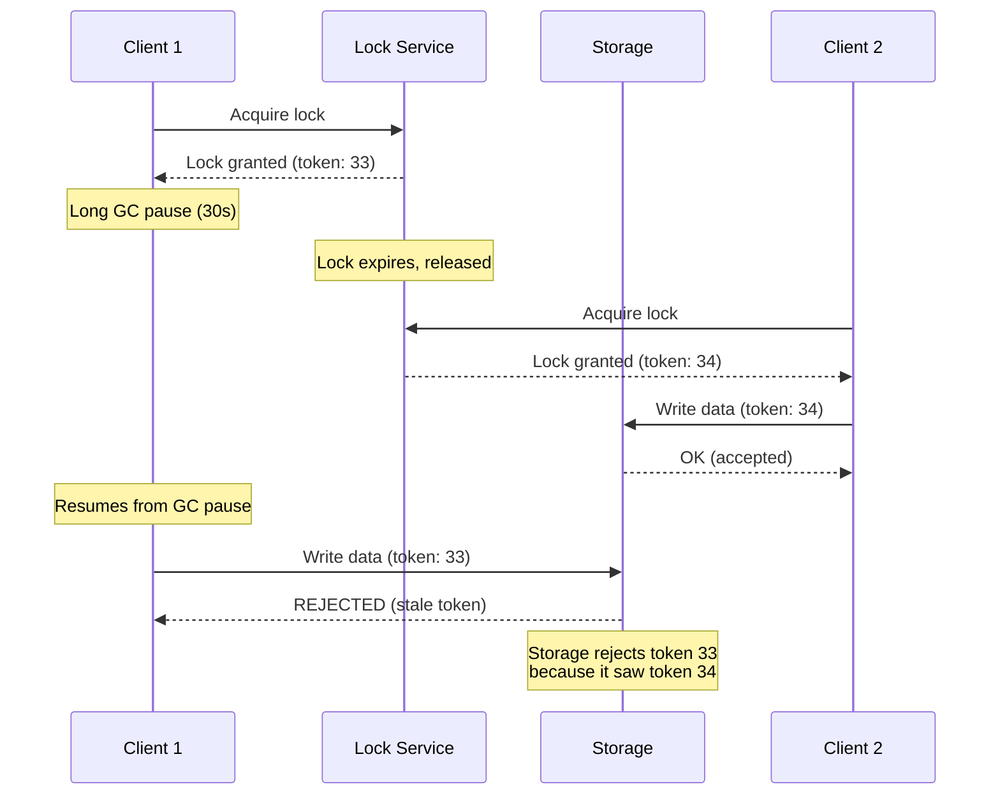
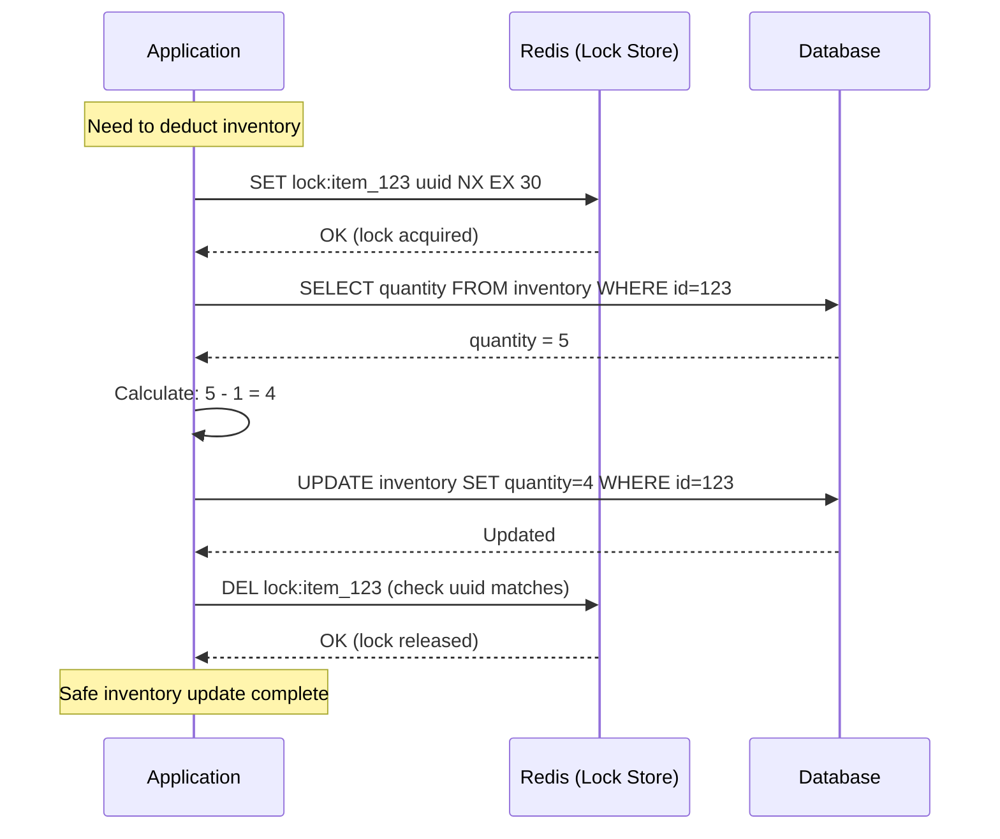
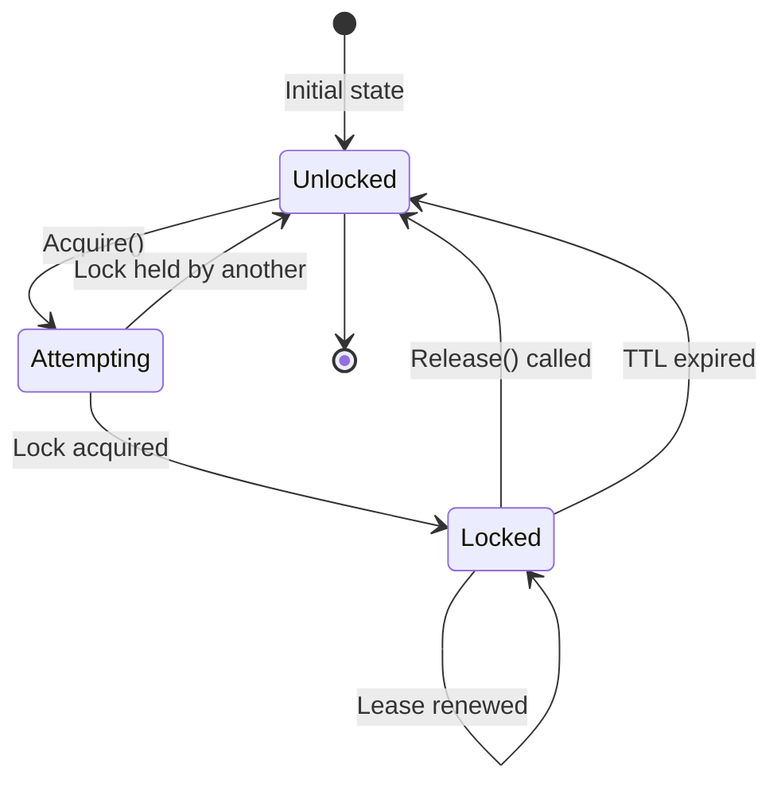
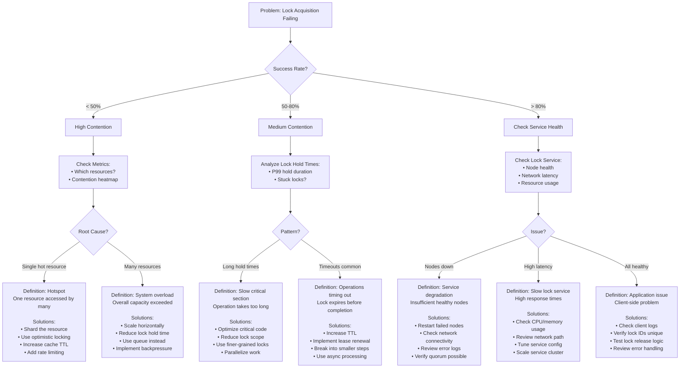

#system-design #pattern #distributed #coordination

# Distributed Locking

## Intuition (30 sec)

Two cashiers reaching for the same cash drawer simultaneously. A lock ensures only one opens it at a time. Distributed locking does the same across multiple servers — only one server can "own" a resource at a time, preventing race conditions in distributed systems.

---

## Failure-First Scenario

> Flash sale: two servers process the same order simultaneously. Both check inventory (1 item left), both deduct, both confirm. Customer is charged twice, inventory goes to -1. You needed a distributed lock on that inventory check.
>
> Real incident: E-commerce platform oversold concert tickets by 300% during a flash sale because multiple application servers modified inventory without coordination. Result: 10,000 angry customers, $2M in refunds, and a class-action lawsuit.

---

## Working Knowledge (5 min)

### Core Concept - Definition First

**Distributed Lock:**
- **Definition:** A distributed lock is a synchronization mechanism that ensures mutual exclusion of a resource across multiple nodes in a distributed system, allowing only one process to hold the lock at any given time.
- **Purpose:** Prevents race conditions and ensures data consistency when multiple servers attempt to access or modify the same shared resource concurrently.
- **How it works:** A client attempts to acquire a lock by writing to a shared coordination service (Redis, ZooKeeper, etcd). If successful, it gets exclusive access. The lock is released manually or expires after a timeout (TTL) to prevent deadlocks.

**Key Terms:**
- **Mutual Exclusion:** Property ensuring only one process can hold the lock at a time
- **TTL (Time To Live):** Maximum duration a lock can be held before automatic release
- **Fencing Token:** Monotonically increasing number used to prevent stale lock holders from corrupting data
- **Lease:** Time-bound permission to hold a lock, automatically revoked after expiration
- **Lock Holder:** The process/server that currently owns the lock
- **Deadlock:** Situation where a lock is never released, blocking all other processes indefinitely

### Visual Model



### Comparison Table

| Redis Single-Node | Redis Redlock | ZooKeeper/etcd |
|-------------------|---------------|----------------|
| Fast (< 1ms) | Medium (5-20ms) | Slower (10-50ms) |
| Simple implementation | Moderate complexity | Complex but robust |
| Single point of failure | Fault-tolerant | Strongly consistent |
| No consensus guarantees | Best-effort consensus | True consensus (Raft/Paxos) |
| Use when: Speed > reliability | Use when: Balance needed | Use when: Correctness critical |
| Perfect for: Caching, rate limiting | Perfect for: Flash sales, booking | Perfect for: Leader election, config |

---

## Layer 1: Conceptual Precision (15 min)

### Distributed Lock Mechanics - Deep Definitions

**Distributed Lock:**
- **Formal Definition:** A distributed lock is a distributed algorithm that implements mutual exclusion across multiple nodes without shared memory, ensuring that at most one process in a distributed system can access a critical section at any given time.
- **Simple Definition:** It's like a bathroom key in a restaurant—only one person can use it, and they must return it when done so others can take their turn.
- **Analogy:** Conference room booking system. When you reserve a room, no one else can book it. If you don't show up (crash), the reservation expires and becomes available again.
- **Related Terms:**
  - **Mutex (Mutual Exclusion):** Similar but typically used within a single process or machine
  - **Semaphore:** Allows N processes (N > 1); lock is semaphore with N=1
  - **Optimistic Locking:** Assumes conflicts are rare; checks at commit time instead of blocking

**Why this matters:**
Without distributed locks, concurrent operations in a distributed system can cause race conditions leading to data corruption, double-spending, overselling inventory, duplicate job execution, or inconsistent state. In financial systems, this could mean processing the same payment twice. In booking systems, double-booking the same resource.

### Redlock Algorithm - Deep Definitions

**Redlock:**
- **Formal Definition:** Redlock is a distributed locking algorithm designed by Redis creator Antirez that achieves lock safety by acquiring locks on a majority (N/2+1) of independent Redis master nodes, providing fault tolerance without Redis clustering.
- **Simple Definition:** Instead of trusting one Redis server, ask 5 servers and only claim the lock if at least 3 say "yes"—majority wins.
- **Purpose:** Provides higher reliability than single-node Redis without requiring complex consensus protocols like Paxos or Raft.
- **How it works:** Client tries to acquire lock on all N nodes with same key and random value. If acquired on majority before lock timeout, lock is valid. Lock validity time = TTL - elapsed time - clock drift margin.

**Redlock Safety Properties:**
- **Safety (mutual exclusion):** At most one client can hold lock at any time
- **Liveness A (deadlock free):** Eventually possible to acquire lock, even if lock holder crashes
- **Liveness B (fault tolerance):** As long as majority of nodes are up, clients can acquire/release locks

**Why Redlock is controversial:**
- Martin Kleppmann (distributed systems researcher) criticized it for not being safe under all failure scenarios (network delays, clock jumps)
- Antirez defended it as practical solution that works well when clocks are reasonably synchronized
- Consensus: Use ZooKeeper/etcd for mission-critical correctness; use Redlock for high availability with acceptable risk

### Fencing Tokens - Deep Definitions

**Fencing Token:**
- **Formal Definition:** A fencing token is a monotonically increasing number issued with each lock acquisition that servers can use to reject operations from stale lock holders who believe they still hold the lock.
- **Simple Definition:** Every time someone gets the lock, they get a number (1, 2, 3...). The server only accepts work from the highest number it's seen.
- **Analogy:** Like version numbers on documents. If you're editing version 3 but someone already submitted version 4, your changes are rejected as outdated.
- **Purpose:** Solves the problem of "zombie lock holders"—processes that think they have the lock but actually lost it due to GC pause, network partition, or timeout.

**How Fencing Tokens Work:**



**Fencing Token Requirements:**
- Tokens must be monotonically increasing (never decrease)
- Storage service must check and enforce tokens
- Lock service must persist token counter (survive restarts)

### Lease-Based Locking - Deep Definitions

**Lease:**
- **Formal Definition:** A lease is a time-limited token granted to a client that provides exclusive access to a resource for a bounded duration, after which the lease automatically expires without requiring explicit revocation.
- **Simple Definition:** Rental agreement with automatic expiration—you have access for 30 seconds, then it's automatically revoked.
- **Purpose:** Prevents deadlocks when lock holders crash, and provides fault tolerance without requiring failure detection.

**Why Leases Matter:**
- **Without lease:** If holder crashes, lock is held forever (deadlock)
- **With lease:** If holder crashes, lock auto-releases after TTL
- **Trade-off:** Lease too short → frequent renewals, false releases. Lease too long → slow recovery after crashes.

**Optimal Lease Duration Formula:**
```
Lease_TTL = Max_Operation_Time × 2 + Network_RTT + Clock_Drift_Margin

Example:
Operation takes 2 seconds worst case
Network RTT: 100ms
Clock drift: 100ms margin
Lease_TTL = 2s × 2 + 0.1s + 0.1s = 4.2s ≈ 5s
```

### Lock Types Comparison

**Pessimistic vs Optimistic Locking:**

```
Pessimistic (Distributed Lock)         Optimistic (Version Check)
═══════════════════════════════════════════════════════════════
Definition: Acquire lock before        Definition: Proceed without lock,
           modifying resource                     check conflicts at commit

How:       Lock → Read → Modify →      How:       Read (+ version) →
           Write → Unlock                         Modify → Write if version matches

Pros:                                  Pros:
• Guaranteed no conflicts              • No lock contention
• Simpler reasoning                    • Higher throughput
• Works for complex operations         • Lower latency

Cons:                                  Cons:
• Serialization bottleneck             • Retry on conflicts
• Lower throughput                     • Complex conflict resolution
• Deadlock risk                        • Not suitable for all operations

Use When:                              Use When:
• High contention expected             • Conflicts rare
• Operation must not fail              • Can retry easily
• Complex multi-step updates           • Simple read-modify-write
• Financial transactions               • Collaborative editing
```

### How It Works (Visual Flow)



**Step-by-step breakdown:**
1. **Acquire Lock:** Application sends `SET lock:item_123 <unique_id> NX EX 30` to Redis. `NX` means "set only if not exists" (atomic check-and-set). `EX 30` sets 30-second expiration. Redis returns OK if lock acquired, null if already locked.

2. **Perform Critical Section:** Application reads current inventory (5 items), calculates new value (4 items), and writes back to database. This is the "critical section" that must not be executed by multiple processes concurrently.

3. **Release Lock:** Application deletes the lock key from Redis, but only after verifying the stored value matches its unique ID (prevents releasing another process's lock). Uses Lua script for atomicity.

4. **Automatic Safety:** If application crashes between steps 2-3, the lock automatically expires after 30 seconds (TTL), allowing other processes to acquire it. This prevents permanent deadlock.

### State Diagram



**State Definitions:**
- **Unlocked:** Resource is available. No process holds the lock. Any client can attempt to acquire it.
- **Attempting:** Transient state during lock acquisition. Client sends request to lock service, waiting for response.
- **Locked:** Resource is locked by a specific client. Lock holder can perform critical section operations. Other clients attempting to acquire will fail or block.
- **TTL Expired:** Lock automatically transitions from Locked → Unlocked after Time-To-Live expires. This is the deadlock prevention mechanism.

### Redis Lock Implementation (With Definitions)

**Correct Lock Acquisition (Atomic):**

```lua
-- acquire_lock.lua
-- Definition: Lua script ensures atomicity (all-or-nothing execution)

-- Check if key exists
if redis.call("EXISTS", KEYS[1]) == 0 then
    -- Key doesn't exist, safe to set
    redis.call("SET", KEYS[1], ARGV[1], "EX", ARGV[2])
    return 1  -- Success
else
    return 0  -- Lock already held
end

-- Usage: redis-cli --eval acquire_lock.lua lock:resource , unique_id 30
```

**Correct Lock Release (Ownership Check):**

```lua
-- release_lock.lua
-- Definition: Only release if we own the lock (prevent releasing others' locks)

if redis.call("GET", KEYS[1]) == ARGV[1] then
    -- Value matches our unique ID, safe to delete
    return redis.call("DEL", KEYS[1])
else
    -- Someone else owns this lock, don't touch it
    return 0
end

-- Usage: redis-cli --eval release_lock.lua lock:resource , unique_id
```

**Why these scripts matter:**
- **Atomicity:** Lua scripts execute atomically in Redis (no interleaving)
- **Ownership:** Prevents process A from releasing process B's lock
- **Race condition prevention:** Without Lua script, GET + DEL is two operations (not atomic)

### Redlock Algorithm Implementation

**Redlock Step-by-Step:**

```python
import redis
import time
import uuid

class RedlockClient:
    """
    Definition: Implements the Redlock algorithm for distributed locking
    across multiple independent Redis instances.
    """

    def __init__(self, redis_nodes, ttl_ms=10000, retry_count=3, retry_delay_ms=200):
        """
        redis_nodes: List of Redis connection objects
        ttl_ms: Lock time-to-live in milliseconds
        retry_count: Number of acquisition attempts
        retry_delay_ms: Delay between retries
        """
        self.nodes = redis_nodes
        self.ttl_ms = ttl_ms
        self.retry_count = retry_count
        self.retry_delay_ms = retry_delay_ms
        self.quorum = len(redis_nodes) // 2 + 1  # Majority

        # Lua script for atomic lock release
        self.unlock_script = """
        if redis.call("get", KEYS[1]) == ARGV[1] then
            return redis.call("del", KEYS[1])
        else
            return 0
        end
        """

    def acquire_lock(self, resource_name):
        """
        Definition: Attempts to acquire lock on majority of nodes.
        Returns (success, lock_value, validity_time) tuple.
        """
        lock_value = str(uuid.uuid4())  # Unique identifier for this lock

        for attempt in range(self.retry_count):
            start_time = time.time() * 1000  # milliseconds

            # Step 1: Try to acquire lock on all nodes
            acquired_count = 0
            for node in self.nodes:
                try:
                    # SET resource_name lock_value NX PX ttl_ms
                    # NX: Only set if not exists
                    # PX: Set expiry in milliseconds
                    result = node.set(
                        resource_name,
                        lock_value,
                        nx=True,           # Only if not exists
                        px=self.ttl_ms     # Expiry in milliseconds
                    )
                    if result:
                        acquired_count += 1
                except:
                    # Node is down or unreachable
                    pass

            # Step 2: Calculate elapsed time
            elapsed_ms = (time.time() * 1000) - start_time

            # Step 3: Check if we acquired majority
            # Definition: Quorum = N/2 + 1 (majority of nodes)
            if acquired_count >= self.quorum:
                # Step 4: Calculate validity time
                # Definition: Remaining time before lock expires
                validity_time_ms = self.ttl_ms - elapsed_ms - 100  # 100ms drift margin

                if validity_time_ms > 0:
                    # Success! We have the lock
                    return (True, lock_value, validity_time_ms)

            # Step 5: Failed to acquire majority, unlock all nodes
            self._release_lock(resource_name, lock_value)

            # Step 6: Wait before retry
            # Definition: Random jitter prevents thundering herd
            time.sleep((self.retry_delay_ms / 1000) * (0.5 + random.random()))

        # All retries exhausted
        return (False, None, 0)

    def release_lock(self, resource_name, lock_value):
        """
        Definition: Releases lock on all nodes (best effort).
        """
        self._release_lock(resource_name, lock_value)

    def _release_lock(self, resource_name, lock_value):
        """
        Definition: Internal method to unlock all nodes.
        Uses Lua script for atomic check-and-delete.
        """
        for node in self.nodes:
            try:
                node.eval(self.unlock_script, 1, resource_name, lock_value)
            except:
                # Best effort, ignore failures
                pass


# Usage Example
nodes = [
    redis.Redis(host='redis1.example.com', port=6379),
    redis.Redis(host='redis2.example.com', port=6379),
    redis.Redis(host='redis3.example.com', port=6379),
    redis.Redis(host='redis4.example.com', port=6379),
    redis.Redis(host='redis5.example.com', port=6379),
]

redlock = RedlockClient(nodes, ttl_ms=10000)

# Acquire lock
success, lock_value, validity = redlock.acquire_lock("inventory:item_123")

if success:
    try:
        # Critical section: only one process executes this
        print(f"Lock acquired! Valid for {validity}ms")

        # Perform inventory update
        deduct_inventory(item_id=123, quantity=1)

    finally:
        # Always release lock
        redlock.release_lock("inventory:item_123", lock_value)
else:
    print("Failed to acquire lock")
```

**Redlock Parameters Explained:**

| Parameter | Definition | Typical Value | Impact |
|-----------|-----------|---------------|--------|
| **ttl_ms** | Lock expiration time in milliseconds | 10,000ms (10s) | Too short: frequent false releases. Too long: slow recovery from crashes |
| **retry_count** | Number of acquisition attempts | 3 | More retries = higher success rate but longer wait time |
| **retry_delay_ms** | Delay between retries | 200ms | Balance between responsiveness and resource usage |
| **quorum** | Minimum nodes required (N/2+1) | 3 (for 5 nodes) | Majority ensures only one client gets lock even if network partitions |
| **clock_drift_margin** | Safety margin for clock differences | 100-200ms | Accounts for clock skew between servers |

### ZooKeeper Lock Configuration

**ZooKeeper Ephemeral Sequential Node Pattern:**

```java
import org.apache.zookeeper.*;
import java.util.Collections;
import java.util.List;

public class ZooKeeperDistributedLock {
    /**
     * Definition: Implements distributed lock using ZooKeeper's
     * ephemeral sequential nodes and watches.
     */

    private ZooKeeper zk;
    private String lockPath = "/locks";  // Base path for locks
    private String lockNode;              // Our ephemeral node

    public void acquireLock(String resourceName) throws Exception {
        /**
         * Definition: Creates ephemeral sequential node.
         * Lowest sequence number wins the lock.
         */

        // Step 1: Create base path if not exists
        ensurePathExists(lockPath);

        // Step 2: Create ephemeral sequential node
        // Definition: Ephemeral = deleted when session ends (auto-cleanup)
        // Definition: Sequential = ZK appends sequence number (e.g., _0000000001)
        lockNode = zk.create(
            lockPath + "/" + resourceName + "_",
            new byte[0],
            ZooDefs.Ids.OPEN_ACL_UNSAFE,
            CreateMode.EPHEMERAL_SEQUENTIAL  // Auto-cleanup + ordering
        );

        // Step 3: Check if we have the lock
        while (true) {
            // Get all lock nodes for this resource
            List<String> children = zk.getChildren(lockPath, false);
            Collections.sort(children);

            // Extract our sequence number
            String ourNode = lockNode.substring(lockPath.length() + 1);

            // Check if we're the lowest sequence number
            if (children.get(0).equals(ourNode)) {
                // We have the lock!
                return;
            }

            // Step 4: We don't have lock, watch the node before us
            String nodeToWatch = null;
            for (int i = 0; i < children.size(); i++) {
                if (children.get(i).equals(ourNode)) {
                    // Watch the previous node
                    nodeToWatch = children.get(i - 1);
                    break;
                }
            }

            // Set watch on previous node
            // Definition: Watch = notification when node changes/deleted
            final CountDownLatch latch = new CountDownLatch(1);

            Stat stat = zk.exists(lockPath + "/" + nodeToWatch, new Watcher() {
                public void process(WatchedEvent event) {
                    // Previous node deleted, wake up
                    latch.countDown();
                }
            });

            if (stat != null) {
                // Wait for previous node to release lock
                latch.await();
            }

            // Loop back to check if we're now the lowest
        }
    }

    public void releaseLock() throws Exception {
        /**
         * Definition: Deletes our ephemeral node, releasing lock.
         * Next node in sequence automatically gets the lock.
         */
        if (lockNode != null) {
            zk.delete(lockNode, -1);  // -1 = ignore version
            lockNode = null;
        }
    }

    private void ensurePathExists(String path) throws Exception {
        /**
         * Definition: Creates persistent parent path if needed.
         * Persistent = survives session disconnects.
         */
        try {
            zk.create(path, new byte[0],
                ZooDefs.Ids.OPEN_ACL_UNSAFE,
                CreateMode.PERSISTENT);
        } catch (KeeperException.NodeExistsException e) {
            // Path already exists, ignore
        }
    }
}
```

**ZooKeeper Configuration (`zoo.cfg`):**

```properties
# ZooKeeper configuration for distributed locking

# tickTime: Basic time unit in milliseconds used by ZooKeeper
# Definition: Heartbeat interval and session timeout base unit
tickTime=2000

# initLimit: Number of ticks for followers to connect to leader
# Definition: Maximum time for initial synchronization (initLimit × tickTime)
initLimit=10

# syncLimit: Number of ticks for followers to sync with leader
# Definition: Maximum time for sending request and getting acknowledgement
syncLimit=5

# dataDir: Directory where ZooKeeper stores in-memory database snapshots
# Definition: Persistent storage location for ZK state
dataDir=/var/lib/zookeeper

# clientPort: Port to listen for client connections
# Definition: Port clients use to connect to this ZK server
clientPort=2181

# Cluster configuration
# Definition: server.X format = server_id, hostname:peer_port:election_port
# peer_port: Communication between ZK servers
# election_port: Leader election protocol port
server.1=zk1.example.com:2888:3888
server.2=zk2.example.com:2888:3888
server.3=zk3.example.com:2888:3888

# Session timeout (in milliseconds)
# Definition: Maximum time a session can be inactive before expiration
# Important: Affects ephemeral node cleanup speed
minSessionTimeout=4000
maxSessionTimeout=40000

# Autopurge settings
# Definition: Automatic cleanup of old snapshots and transaction logs
autopurge.snapRetainCount=3
autopurge.purgeInterval=1
```

**Key ZooKeeper Concepts:**

- **Ephemeral Node:** Node that exists only while the creating session is alive. When session ends (client crashes or disconnects), node is automatically deleted. Perfect for locks.
- **Sequential Node:** ZooKeeper appends monotonically increasing number to node name. Provides total ordering of lock requests (fair queue).
- **Watch:** One-time trigger notification when node changes. Allows clients to wait efficiently without polling.
- **Session:** Connection between client and ZooKeeper. Has timeout. If no heartbeat for timeout period, session expires and ephemeral nodes deleted.

### The Math/Logic (Explained)

**Lock Validity Calculation (Redlock):**

```
Validity_Time = TTL - Elapsed_Time - Clock_Drift_Margin
```

**Term Definitions:**
- **Validity_Time:** How long we can safely use the lock before it might be acquired by another client
- **TTL:** Time-To-Live set when acquiring lock (e.g., 10,000ms)
- **Elapsed_Time:** Time spent acquiring lock from all nodes
- **Clock_Drift_Margin:** Safety buffer for clock synchronization issues between nodes (typically 100-200ms)

**Example calculation:**
```
Given:
  TTL = 10,000ms (10 seconds)
  Elapsed_Time = 250ms (time to contact all 5 Redis nodes)
  Clock_Drift_Margin = 100ms (safety buffer)

Validity_Time = 10,000ms - 250ms - 100ms = 9,650ms

What this means:
- We acquired the lock successfully
- We have 9.65 seconds to complete our work
- After 9.65 seconds, we should consider lock potentially expired
- Must complete critical section within 9.65 seconds or release lock
```

**Quorum Calculation:**

```
Quorum = ⌊N/2⌋ + 1

Where N = number of lock nodes
```

**Examples:**
```
N = 3 nodes → Quorum = ⌊3/2⌋ + 1 = 1 + 1 = 2 (need 2 nodes)
N = 5 nodes → Quorum = ⌊5/2⌋ + 1 = 2 + 1 = 3 (need 3 nodes)
N = 7 nodes → Quorum = ⌊7/2⌋ + 1 = 3 + 1 = 4 (need 4 nodes)

Why this matters:
- Quorum ensures at most one client gets lock even during network partition
- Example: 5 nodes split into groups of 2 and 3
  - Group with 3 nodes can form quorum (≥3)
  - Group with 2 nodes cannot form quorum (<3)
  - Only one group can grant locks → mutual exclusion preserved
```

### Trade-offs Matrix (With Definitions)

```
Single-Node Redis                    Redlock (Multi-Node Redis)
════════════════════════════════════════════════════════════════════
Definition: Lock stored on one       Definition: Lock acquired on majority
           Redis instance                       of N Redis instances

Pros:                                Pros:
• Latency: 1ms typical              • Fault-tolerant (survives N/2 failures)
• Simple: ~20 lines of code         • No single point of failure
• High throughput (100K+ ops/sec)   • Better safety guarantees
• Easy to debug and monitor         • Survives Redis node crashes

Cons:                                Cons:
• Single point of failure           • Higher latency (5-20ms)
• No fault tolerance                • More complex implementation
• Lock lost if Redis crashes        • Requires clock synchronization
• Not safe during restarts          • Controversial correctness claims

Use When:                            Use When:
• Speed is critical                  • Availability matters more than speed
• Can tolerate rare failures         • Cannot afford single point of failure
• Short-lived locks (<1s)           • Locks held longer (1-30s)
• Non-critical operations           • Flash sales, booking systems
• Cache invalidation                • Inventory management
```

```
ZooKeeper/etcd Locks                 Database Locks (SELECT FOR UPDATE)
════════════════════════════════════════════════════════════════════
Definition: Consensus-based lock     Definition: Lock via database row
           using Raft/ZAB protocol              locking mechanism

Pros:                                Pros:
• Strongest consistency guarantees   • No additional infrastructure
• Automatic failover                 • Transactional semantics
• Ephemeral nodes (auto-cleanup)    • Same as business data store
• Battle-tested (HBase, Kafka use)  • Strong consistency

Cons:                                Cons:
• Slowest (10-50ms latency)         • Limited to database's availability
• Complex setup and operations       • Lock table contention
• Requires cluster (min 3 nodes)    • Doesn't scale across databases
• Higher resource usage              • Connection pool exhaustion risk

Use When:                            Use When:
• Correctness absolutely critical    • Already using database transactions
• Leader election needed             • Small scale (single database)
• Configuration management           • Operations within single transaction
• Need linearizability               • Don't want external dependencies
• Can sacrifice latency for safety   • Legacy systems
```

---

## Layer 2: Technology-Specific Examples (20 min)

### Technology Comparison (With Definitions)

**Tool Category:** Distributed Lock Implementations

| Redis (Standalone) | Redis (Redlock) | ZooKeeper | etcd | Consul |
|-------------------|-----------------|-----------|------|--------|
| **Definition:** In-memory data store with atomic operations | **Definition:** Multi-node Redis lock algorithm | **Definition:** Consensus-based coordination service | **Definition:** Distributed key-value store with Raft | **Definition:** Service mesh with locking capabilities |
| **Best For:** High-speed, non-critical locks | **Best For:** Balance of speed and reliability | **Best For:** Strong consistency requirements | **Best For:** Kubernetes native environments | **Best For:** Service discovery + locking |
| ⭐⭐⭐⭐⭐ Speed | ⭐⭐⭐⭐ Speed | ⭐⭐ Speed | ⭐⭐⭐ Speed | ⭐⭐⭐ Speed |
| ⭐⭐ Reliability | ⭐⭐⭐⭐ Reliability | ⭐⭐⭐⭐⭐ Reliability | ⭐⭐⭐⭐⭐ Reliability | ⭐⭐⭐⭐ Reliability |
| ⭐⭐⭐⭐⭐ Ease of Use | ⭐⭐⭐ Ease of Use | ⭐⭐ Ease of Use | ⭐⭐⭐ Ease of Use | ⭐⭐⭐ Ease of Use |
| **Latency:** <1ms | **Latency:** 5-20ms | **Latency:** 10-50ms | **Latency:** 5-30ms | **Latency:** 5-30ms |
| **Setup:** Single node | **Setup:** 5+ independent nodes | **Setup:** 3-5 node cluster | **Setup:** 3-5 node cluster | **Setup:** 3-5 node cluster |

### Redis Redlock - Complete Implementation

**Production-Ready Redlock Client:**

```python
import redis
import time
import uuid
import random
from typing import List, Tuple, Optional

class ProductionRedlockClient:
    """
    Production-ready Redlock implementation with:
    - Connection pooling
    - Error handling
    - Metrics collection
    - Automatic lease renewal
    """

    def __init__(
        self,
        redis_urls: List[str],
        ttl_ms: int = 10000,
        retry_count: int = 3,
        retry_delay_ms: int = 200,
        clock_drift_margin_ms: int = 100
    ):
        """
        redis_urls: List of Redis connection URLs
                   e.g., ['redis://redis1:6379', 'redis://redis2:6379', ...]
        ttl_ms: Lock TTL in milliseconds
        retry_count: Acquisition retry attempts
        retry_delay_ms: Base delay between retries
        clock_drift_margin_ms: Clock synchronization safety margin
        """
        # Create connection pool for each Redis instance
        self.nodes = [
            redis.from_url(url, decode_responses=True, socket_connect_timeout=0.5)
            for url in redis_urls
        ]

        self.ttl_ms = ttl_ms
        self.retry_count = retry_count
        self.retry_delay_ms = retry_delay_ms
        self.clock_drift_margin_ms = clock_drift_margin_ms
        self.quorum = len(self.nodes) // 2 + 1

        # Lua script for atomic release (check ownership before delete)
        self.unlock_script = """
        if redis.call("get", KEYS[1]) == ARGV[1] then
            return redis.call("del", KEYS[1])
        else
            return 0
        end
        """

        # Metrics
        self.metrics = {
            'acquisitions_attempted': 0,
            'acquisitions_succeeded': 0,
            'acquisitions_failed': 0,
            'releases': 0,
            'lock_contention': 0
        }

    def acquire_lock(self, resource: str) -> Tuple[bool, Optional[str], int]:
        """
        Attempts to acquire distributed lock.

        Returns:
            (success: bool, lock_value: str|None, validity_ms: int)

        Definition:
            success - Whether lock was acquired on quorum of nodes
            lock_value - Unique identifier for this lock (for release)
            validity_ms - Time remaining before lock expires
        """
        self.metrics['acquisitions_attempted'] += 1
        lock_value = str(uuid.uuid4())

        for attempt in range(self.retry_count):
            start_time_ms = int(time.time() * 1000)

            # Try to acquire on all nodes in parallel
            acquired_nodes = 0
            for node in self.nodes:
                if self._acquire_on_node(node, resource, lock_value):
                    acquired_nodes += 1

            elapsed_ms = int(time.time() * 1000) - start_time_ms

            # Check if we got quorum
            if acquired_nodes >= self.quorum:
                # Calculate remaining validity time
                validity_ms = (
                    self.ttl_ms - elapsed_ms - self.clock_drift_margin_ms
                )

                if validity_ms > 0:
                    # Success!
                    self.metrics['acquisitions_succeeded'] += 1
                    return (True, lock_value, validity_ms)

            # Failed to get quorum, record contention
            if acquired_nodes > 0 and acquired_nodes < self.quorum:
                self.metrics['lock_contention'] += 1

            # Release any acquired locks
            self._release_on_all_nodes(resource, lock_value)

            # Wait before retry with exponential backoff + jitter
            if attempt < self.retry_count - 1:
                delay_ms = self.retry_delay_ms * (2 ** attempt)
                jitter_ms = random.randint(0, delay_ms // 2)
                time.sleep((delay_ms + jitter_ms) / 1000)

        # All retries exhausted
        self.metrics['acquisitions_failed'] += 1
        return (False, None, 0)

    def release_lock(self, resource: str, lock_value: str) -> bool:
        """
        Releases distributed lock.

        Definition:
            Deletes lock from all nodes that match our lock_value.
            Uses Lua script for atomic check-and-delete.

        Returns:
            True if released on at least one node
        """
        self.metrics['releases'] += 1
        return self._release_on_all_nodes(resource, lock_value)

    def extend_lock(
        self,
        resource: str,
        lock_value: str,
        extend_ttl_ms: int
    ) -> Tuple[bool, int]:
        """
        Extends lock TTL (lease renewal).

        Definition:
            Resets expiration on nodes where we hold the lock.
            Used for long-running operations.

        Returns:
            (success: bool, new_validity_ms: int)
        """
        start_time_ms = int(time.time() * 1000)
        extended_nodes = 0

        for node in self.nodes:
            try:
                # Only extend if we still own the lock
                script = """
                if redis.call("get", KEYS[1]) == ARGV[1] then
                    return redis.call("pexpire", KEYS[1], ARGV[2])
                else
                    return 0
                end
                """
                result = node.eval(script, 1, resource, lock_value, extend_ttl_ms)
                if result:
                    extended_nodes += 1
            except:
                pass

        elapsed_ms = int(time.time() * 1000) - start_time_ms

        if extended_nodes >= self.quorum:
            validity_ms = extend_ttl_ms - elapsed_ms - self.clock_drift_margin_ms
            return (True, validity_ms)
        else:
            return (False, 0)

    def _acquire_on_node(
        self,
        node: redis.Redis,
        resource: str,
        lock_value: str
    ) -> bool:
        """
        Attempts to acquire lock on single node.

        Definition:
            Uses SET with NX (not exists) and PX (expiry) options.
            Atomic check-and-set operation.
        """
        try:
            result = node.set(
                resource,
                lock_value,
                nx=True,              # Only set if not exists
                px=self.ttl_ms        # Expiry in milliseconds
            )
            return result is not None
        except Exception as e:
            # Node unreachable or timeout
            return False

    def _release_on_all_nodes(self, resource: str, lock_value: str) -> bool:
        """
        Releases lock on all nodes (best effort).

        Definition:
            Uses Lua script to ensure we only delete our own lock.
            Returns True if released on at least one node.
        """
        released_any = False

        for node in self.nodes:
            try:
                result = node.eval(self.unlock_script, 1, resource, lock_value)
                if result:
                    released_any = True
            except:
                # Best effort, ignore failures
                pass

        return released_any

    def get_metrics(self) -> dict:
        """
        Returns lock metrics for monitoring.

        Metrics:
            acquisitions_attempted - Total acquisition attempts
            acquisitions_succeeded - Successful acquisitions
            acquisitions_failed - Failed acquisitions
            releases - Total releases
            lock_contention - Partial acquisitions (some but not quorum)
        """
        return self.metrics.copy()


# Usage Example with Context Manager

from contextlib import contextmanager

@contextmanager
def distributed_lock(redlock_client, resource, timeout_sec=30):
    """
    Context manager for convenient lock usage.

    Definition:
        Acquires lock on entry, releases on exit (even if exception).
        Automatically handles cleanup.

    Usage:
        with distributed_lock(client, "inventory:item_123") as lock:
            if lock.acquired:
                # Critical section
                update_inventory()
    """
    success, lock_value, validity_ms = redlock_client.acquire_lock(resource)

    lock_info = type('LockInfo', (), {
        'acquired': success,
        'lock_value': lock_value,
        'validity_ms': validity_ms
    })()

    try:
        yield lock_info
    finally:
        if success:
            redlock_client.release_lock(resource, lock_value)


# Production usage
redis_urls = [
    'redis://redis1.example.com:6379',
    'redis://redis2.example.com:6379',
    'redis://redis3.example.com:6379',
    'redis://redis4.example.com:6379',
    'redis://redis5.example.com:6379',
]

redlock = ProductionRedlockClient(
    redis_urls=redis_urls,
    ttl_ms=30000,          # 30 second locks
    retry_count=3,          # Retry up to 3 times
    retry_delay_ms=200      # 200ms base delay
)

# Use with context manager
with distributed_lock(redlock, "order:processing:12345") as lock:
    if lock.acquired:
        print(f"Lock acquired! Valid for {lock.validity_ms}ms")

        # Process order (critical section)
        process_payment()
        update_inventory()
        send_confirmation()
    else:
        print("Failed to acquire lock - order being processed elsewhere")
        # Handle contention (retry later, queue, etc.)
```

### ZooKeeper Configuration (Production)

**Complete ZooKeeper Cluster Setup:**

**zoo.cfg (each node):**
```properties
# === Basic Configuration ===

# tickTime: Heartbeat interval in milliseconds
# Definition: Base unit for timeouts and session management
# Smaller = faster failure detection, higher network traffic
tickTime=2000

# initLimit: Ticks for initial sync
# Definition: Follower has (initLimit × tickTime) to sync with leader
# Should account for snapshot size and network speed
initLimit=10

# syncLimit: Ticks for ongoing sync
# Definition: Follower can be (syncLimit × tickTime) out of sync
# If exceeded, follower dropped from ensemble
syncLimit=5

# === Storage Configuration ===

# dataDir: Snapshot storage
# Definition: Where ZK stores in-memory database snapshots
# Use SSD for better performance
dataDir=/var/lib/zookeeper

# dataLogDir: Transaction log storage
# Definition: Write-ahead log for durability
# CRITICAL: Put on separate disk from dataDir for performance
dataLogDir=/var/log/zookeeper/txlogs

# === Client Configuration ===

# clientPort: Client connection port
# Definition: Port for client connections (e.g., lock clients)
clientPort=2181

# maxClientCnxns: Max concurrent clients per IP
# Definition: Prevents single client from exhausting connections
maxClientCnxns=60

# === Session Configuration ===

# minSessionTimeout: Minimum session timeout (ms)
# Definition: Shortest allowed client session timeout
# Shorter = faster failure detection, more heartbeat traffic
minSessionTimeout=4000

# maxSessionTimeout: Maximum session timeout (ms)
# Definition: Longest allowed client session timeout
# Lock holders with longer timeout take longer to auto-cleanup
maxSessionTimeout=40000

# === Cluster Configuration ===

# server.X format: server.id=host:peerPort:electionPort
# peerPort: Communication between ZK servers (data replication)
# electionPort: Leader election protocol
server.1=zk1.example.com:2888:3888
server.2=zk2.example.com:2888:3888
server.3=zk3.example.com:2888:3888

# === Performance Tuning ===

# snapCount: Transactions before snapshot
# Definition: Take snapshot every N transactions
# Lower = more frequent snapshots, less recovery time
snapCount=100000

# preAllocSize: Transaction log pre-allocation (KB)
# Definition: Pre-allocate log file in chunks (reduces fragmentation)
preAllocSize=65536

# === Maintenance Configuration ===

# autopurge.snapRetainCount: Snapshots to keep
# Definition: Number of recent snapshots/logs to retain during cleanup
autopurge.snapRetainCount=3

# autopurge.purgeInterval: Purge interval (hours)
# Definition: How often to run automatic cleanup (0 = disabled)
autopurge.purgeInterval=1

# === Advanced Settings ===

# leaderServes: Should leader serve clients?
# Definition: yes = leader handles client requests (more load)
#            no = leader only coordinates (better write performance)
leaderServes=yes

# syncEnabled: Enable observer mode sync
# Definition: Allow observers to serve reads (scalability)
syncEnabled=true

# electionAlg: Election algorithm
# Definition: 3 = Fast Leader Election (default, recommended)
electionAlg=3
```

**myid file (different on each node):**
```
# Node 1: /var/lib/zookeeper/myid
1

# Node 2: /var/lib/zookeeper/myid
2

# Node 3: /var/lib/zookeeper/myid
3
```

**Production Deployment Architecture:**

```
                        Client Applications
                     (Lock acquire/release)
                              │
                              │
                ┌─────────────┼─────────────┐
                │             │             │
         ┌──────▼──────┐ ┌───▼────┐ ┌──────▼──────┐
         │   ZK Node 1 │ │ ZK N2  │ │  ZK Node 3  │
         │  (Leader)   │ │(Follow)│ │  (Follower) │
         │             │ │        │ │             │
         │ Port 2181   │ │  2181  │ │   2181      │
         │      (client)│ │        │ │             │
         └──────┬──────┘ └───┬────┘ └──────┬──────┘
                │            │             │
                └────────────┼─────────────┘
                       2888:3888
                  (Peer communication)

Definition:
- Leader: Handles all writes, coordinates cluster
- Followers: Handle reads, participate in voting
- Quorum: 2 out of 3 must agree for write to succeed
- Client: Connects to any node (auto-redirects writes to leader)
```

### etcd Configuration (Production)

**etcd Cluster Configuration:**

```yaml
# etcd.conf.yml
# Definition: Configuration for etcd cluster member

name: 'etcd1'  # Unique name for this member

# === Data Storage ===
data-dir: '/var/lib/etcd'
# Definition: Where etcd stores Raft log and snapshots

wal-dir: '/var/lib/etcd/wal'
# Definition: Write-ahead log directory (put on separate disk)

# === Client Communication ===
listen-client-urls: 'http://0.0.0.0:2379'
# Definition: URLs to listen for client traffic

advertise-client-urls: 'http://etcd1.example.com:2379'
# Definition: Client URLs to advertise to other members

# === Peer Communication ===
listen-peer-urls: 'http://0.0.0.0:2380'
# Definition: URLs to listen for peer traffic

initial-advertise-peer-urls: 'http://etcd1.example.com:2380'
# Definition: Peer URLs to advertise to cluster

initial-cluster: 'etcd1=http://etcd1.example.com:2380,etcd2=http://etcd2.example.com:2380,etcd3=http://etcd3.example.com:2380'
# Definition: Initial cluster configuration (all members)

initial-cluster-state: 'new'
# Definition: 'new' for initial bootstrap, 'existing' for adding to cluster

initial-cluster-token: 'etcd-cluster-1'
# Definition: Unique token to distinguish this cluster

# === Performance ===
snapshot-count: 10000
# Definition: Number of transactions before snapshot

heartbeat-interval: 100
# Definition: Leader heartbeat interval (ms)

election-timeout: 1000
# Definition: Election timeout (ms) - should be 5-10x heartbeat

# === Quota ===
quota-backend-bytes: 8589934592  # 8GB
# Definition: Storage size limit (prevents unbounded growth)

# === Logging ===
log-level: 'info'
# Definition: Log verbosity (debug, info, warn, error)
```

**etcd Lock Implementation:**

```go
package main

import (
    "context"
    "fmt"
    "log"
    "time"

    "go.etcd.io/etcd/client/v3"
    "go.etcd.io/etcd/client/v3/concurrency"
)

// DistributedLock wraps etcd locking functionality
type DistributedLock struct {
    client  *clientv3.Client
    session *concurrency.Session
    mutex   *concurrency.Mutex
}

// NewDistributedLock creates a new etcd-based lock
func NewDistributedLock(endpoints []string, lockKey string, ttl int) (*DistributedLock, error) {
    /*
     * Definition: Creates etcd client and session for distributed locking
     *
     * endpoints: etcd cluster URLs (e.g., ["http://etcd1:2379", ...])
     * lockKey: Resource identifier (e.g., "/locks/inventory/item_123")
     * ttl: Session TTL in seconds (lock auto-releases after this)
     */

    // Create etcd client
    cli, err := clientv3.New(clientv3.Config{
        Endpoints:   endpoints,
        DialTimeout: 5 * time.Second,
    })
    if err != nil {
        return nil, fmt.Errorf("failed to connect to etcd: %w", err)
    }

    // Create session
    // Definition: Session represents connection lifetime (with lease)
    session, err := concurrency.NewSession(cli, concurrency.WithTTL(ttl))
    if err != nil {
        cli.Close()
        return nil, fmt.Errorf("failed to create session: %w", err)
    }

    // Create mutex
    // Definition: Mutex provides distributed mutual exclusion
    mutex := concurrency.NewMutex(session, lockKey)

    return &DistributedLock{
        client:  cli,
        session: session,
        mutex:   mutex,
    }, nil
}

// Lock acquires the distributed lock
func (dl *DistributedLock) Lock(ctx context.Context) error {
    /*
     * Definition: Blocks until lock is acquired or context cancelled
     * Uses Raft consensus for strong consistency
     */

    // Acquire lock (blocks until successful)
    err := dl.mutex.Lock(ctx)
    if err != nil {
        return fmt.Errorf("failed to acquire lock: %w", err)
    }

    log.Println("Lock acquired")
    return nil
}

// TryLock attempts to acquire lock without blocking
func (dl *DistributedLock) TryLock(ctx context.Context) (bool, error) {
    /*
     * Definition: Non-blocking lock acquisition
     * Returns immediately with success/failure status
     */

    // Try to acquire with immediate timeout
    tryCtx, cancel := context.WithTimeout(ctx, 10*time.Millisecond)
    defer cancel()

    err := dl.mutex.Lock(tryCtx)
    if err == context.DeadlineExceeded {
        return false, nil  // Lock not available
    } else if err != nil {
        return false, err  // Error occurred
    }

    return true, nil  // Lock acquired
}

// Unlock releases the distributed lock
func (dl *DistributedLock) Unlock(ctx context.Context) error {
    /*
     * Definition: Releases lock, allowing others to acquire
     */

    err := dl.mutex.Unlock(ctx)
    if err != nil {
        return fmt.Errorf("failed to release lock: %w", err)
    }

    log.Println("Lock released")
    return nil
}

// Close cleans up resources
func (dl *DistributedLock) Close() error {
    /*
     * Definition: Closes session and client (releases lock if held)
     */

    if dl.session != nil {
        dl.session.Close()
    }
    if dl.client != nil {
        return dl.client.Close()
    }
    return nil
}

// Usage Example
func main() {
    // Create lock
    lock, err := NewDistributedLock(
        []string{"http://etcd1:2379", "http://etcd2:2379", "http://etcd3:2379"},
        "/locks/inventory/item_123",
        30,  // 30 second TTL
    )
    if err != nil {
        log.Fatal(err)
    }
    defer lock.Close()

    // Acquire lock
    ctx := context.Background()
    if err := lock.Lock(ctx); err != nil {
        log.Fatal(err)
    }

    // Critical section
    fmt.Println("Processing inventory update...")
    time.Sleep(5 * time.Second)  // Simulate work

    // Release lock
    if err := lock.Unlock(ctx); err != nil {
        log.Fatal(err)
    }
}
```

---

## Layer 3: Production-Ready Details (30 min)

### Production Architecture (Fully Annotated)

```
                           Internet / Load Balancer
                                      │
                    ┌─────────────────┼─────────────────┐
                    │                 │                 │
              ┌─────▼────┐      ┌────▼────┐      ┌────▼────┐
              │  App     │      │  App    │      │  App    │
              │ Server 1 │      │ Server 2│      │ Server 3│
              │          │      │         │      │         │
              │ Role:    │      │ Role:   │      │ Role:   │
              │ Process  │      │ Process │      │ Process │
              │ orders   │      │ orders  │      │ orders  │
              └─────┬────┘      └────┬────┘      └────┬────┘
                    │                │                │
                    │  Lock acquire  │                │
                    └────────┬───────┴────────────────┘
                             │
                    ┌────────▼────────┐
                    │  Lock Service   │
                    │  (Redis Cluster │
                    │   or ZooKeeper) │
                    │                 │
                    │ Definition:     │
                    │ Coordination    │
                    │ service that    │
                    │ grants locks    │
                    │                 │
                    │ Guarantees:     │
                    │ • Mutual excl   │
                    │ • Fault tol.    │
                    └────────┬────────┘
                             │
                    ┌────────▼────────┐
                    │  Lock Metadata  │
                    │                 │
                    │ Key: resource ID│
                    │ Val: lock_value │
                    │ TTL: 30 seconds │
                    └─────────────────┘
                             │
         ┌───────────────────┼───────────────────┐
         │                   │                   │
    ┌────▼────┐         ┌───▼────┐         ┌───▼────┐
    │Database │         │ Cache  │         │ Queue  │
    │         │         │        │         │        │
    │ Role:   │         │ Role:  │         │ Role:  │
    │ Store   │         │ Speed  │         │ Async  │
    │ order   │         │ reads  │         │ jobs   │
    │ data    │         │        │         │        │
    └─────────┘         └────────┘         └────────┘

Flow Explanation:
1. App server receives order request
2. Attempts to acquire lock on order ID from lock service
3. If acquired, processes order (updates DB, cache, queue)
4. Releases lock when done
5. If not acquired, returns "order already processing" error
```

**Architecture Component Definitions:**

- **Application Servers:** Stateless services processing client requests. Multiple instances for horizontal scaling. Each needs to coordinate via locks before modifying shared resources.

- **Lock Service (Redis/ZooKeeper):** Centralized coordination service providing distributed locking primitives. Ensures mutual exclusion across all application servers. Must be highly available (clustered).

- **Lock Metadata:** Information stored for each lock:
  - **Key:** Unique resource identifier (e.g., "order:12345")
  - **Value:** Lock owner identifier (UUID) for ownership verification
  - **TTL:** Automatic expiration time to prevent deadlocks

- **Database Layer:** Persistent storage for business data. Protected by locks to prevent race conditions during updates.

### Monitoring Metrics (With Definitions)

```
┌──────────────────────────────────────────────────────────────┐
│  DISTRIBUTED LOCK MONITORING DASHBOARD                       │
├──────────────────────────────────────────────────────────────┤
│                                                              │
│ Lock Acquisition Rate: 847/sec                              │
│ Definition: Number of lock acquisition attempts per second  │
│ Why track: High rate may indicate contention hotspot       │
│ Alert when: Sudden spike (10x normal) indicates thundering  │
│            herd or retry storm                              │
│                                                              │
│ Lock Success Rate: 94.2%                                     │
│ Definition: Percentage of acquisition attempts that succeed │
│ Why track: Low rate means high contention or lock service   │
│            issues                                            │
│ Alert when: < 80% (indicates severe contention)            │
│                                                              │
│ Average Lock Hold Time: 1.2s                                │
│ Definition: Mean duration locks are held before release     │
│ Why track: Long hold times = bottleneck, increase latency  │
│ Alert when: > 10s (may indicate stuck lock holder)         │
│                                                              │
│ P99 Lock Acquisition Latency: 45ms                          │
│ Definition: 99% of lock acquisitions complete within this   │
│ Why track: Measures lock service performance                │
│ Alert when: > 200ms (slow lock service or network issues)  │
│                                                              │
│ Active Locks: 1,247                                          │
│ Definition: Number of currently held locks                  │
│ Why track: Shows system load and parallelism                │
│ Alert when: Sudden drop to 0 (lock service failure)        │
│                                                              │
│ Lock Timeouts: 3/min                                         │
│ Definition: Locks that expired (TTL reached) while held     │
│ Why track: Indicates operations taking too long or crashes │
│ Alert when: > 10/min (operations timing out frequently)    │
│                                                              │
│ Lock Contention by Resource:                                │
│   inventory:item_5432 ████████████ 342 attempts/min         │
│   order:processing    ████████ 234 attempts/min             │
│   user:session_123    ███ 87 attempts/min                   │
│                                                              │
│ Definition: Heatmap of most contended resources             │
│ Why track: Identifies hotspots needing optimization         │
│ Action: Consider sharding hot resources                     │
│                                                              │
│ Lock Service Health:                                         │
│   Redis Node 1: ✓ UP (latency: 2ms)                        │
│   Redis Node 2: ✓ UP (latency: 3ms)                        │
│   Redis Node 3: ✗ DOWN (last seen: 2m ago)                 │
│   Redis Node 4: ✓ UP (latency: 2ms)                        │
│   Redis Node 5: ✓ UP (latency: 4ms)                        │
│                                                              │
│ Definition: Health status of lock service nodes             │
│ Status: 4/5 nodes up → Can still form quorum (3)           │
│ Alert: Node 3 down - investigate and restore               │
│                                                              │
│ Deadlocks Detected: 0                                        │
│ Definition: Locks never released (held beyond 5× TTL)      │
│ Why track: Indicates bugs in lock release logic            │
│ Alert when: > 0 (immediate investigation required)         │
│                                                              │
└──────────────────────────────────────────────────────────────┘
```

**Metric Definitions:**

- **Lock Acquisition Rate (QPS):** Rate of lock acquisition requests. Sudden spikes indicate traffic bursts or retry storms.

- **Lock Success Rate:** Ratio of successful acquisitions to attempts. Low rate indicates contention (many processes competing) or lock service degradation.

- **Lock Hold Time:** Duration between acquire and release. Long hold times create bottlenecks. P99 hold time shows worst-case behavior.

- **Lock Acquisition Latency:** Time from request to acquiring lock. Includes network RTT + lock service processing time + waiting for other holders.

- **Active Locks:** Current count of held locks. Shows system load. Sudden drop to zero indicates lock service failure.

- **Lock Timeouts (TTL Expirations):** Locks that auto-expired before manual release. Indicates operations timing out or lock holder crashes.

- **Lock Contention Heatmap:** Shows which resources have most competition. High contention resources need optimization (sharding, caching, or redesign).

- **Deadlocks:** Locks never released, requiring manual intervention. Should be zero—presence indicates bugs.

**Prometheus Metrics Configuration:**

```yaml
# prometheus.yml - Lock metrics

# Lock acquisition counter
distributed_lock_acquisitions_total{resource="inventory:item_123", status="success"}
distributed_lock_acquisitions_total{resource="inventory:item_123", status="failure"}

# Lock hold duration histogram
distributed_lock_hold_duration_seconds{resource="inventory:item_123"}

# Lock acquisition latency histogram
distributed_lock_acquisition_latency_seconds{resource="inventory:item_123"}

# Currently active locks gauge
distributed_lock_active_locks{resource="inventory:item_123"}

# Lock contention counter
distributed_lock_contention_total{resource="inventory:item_123"}

# Lock service health
distributed_lock_service_up{node="redis1"} 1
distributed_lock_service_up{node="redis2"} 1
distributed_lock_service_up{node="redis3"} 0

# Alerting rules
groups:
  - name: distributed_locks
    rules:
      # High contention alert
      - alert: HighLockContention
        expr: rate(distributed_lock_contention_total[5m]) > 10
        for: 5m
        annotations:
          summary: "High lock contention on {{ $labels.resource }}"

      # Low success rate
      - alert: LowLockSuccessRate
        expr: |
          rate(distributed_lock_acquisitions_total{status="success"}[5m])
          /
          rate(distributed_lock_acquisitions_total[5m]) < 0.8
        for: 5m
        annotations:
          summary: "Lock success rate below 80%"

      # Lock service down
      - alert: LockServiceNodeDown
        expr: distributed_lock_service_up == 0
        for: 1m
        annotations:
          summary: "Lock service node {{ $labels.node }} is down"

      # Long lock hold times
      - alert: LongLockHoldTime
        expr: |
          histogram_quantile(0.99,
            rate(distributed_lock_hold_duration_seconds_bucket[5m])
          ) > 10
        for: 5m
        annotations:
          summary: "P99 lock hold time exceeds 10 seconds"
```

### Troubleshooting Flow (With Explanations)



### Common Issues and Solutions

**Issue 1: Deadlock - Lock Never Released**

```
Symptom:
- Lock acquired but never released
- Resource permanently locked
- All subsequent acquisitions fail

Definition:
Deadlock occurs when lock holder crashes or fails to release
lock explicitly, and TTL is not set (or set too long).

Root Causes:
1. Application crashes after acquiring lock
2. Exception thrown before release
3. No TTL set on lock
4. Network partition prevents release

Solution Pattern:

# WRONG: No TTL, no try-finally
redis.set("lock:resource", "value", nx=True)
# ... work ...
redis.del("lock:resource")  # If this doesn't run → deadlock

# CORRECT: With TTL and try-finally
success = redis.set("lock:resource", uuid, nx=True, ex=30)
if success:
    try:
        # Critical section
        do_work()
    finally:
        # Always release, even on exception
        release_lock("lock:resource", uuid)

Key Safeguards:
• Always set TTL (ex or px parameter)
• Use try-finally blocks
• Implement health checks
• Monitor lock age metrics
```

**Issue 2: Split Brain - Multiple Lock Holders**

```
Symptom:
- Two processes both believe they hold the lock
- Data corruption or duplicate operations
- Race conditions despite locking

Definition:
Split brain occurs when network partition causes lock service
to be split into isolated groups, each potentially granting
the same lock to different clients.

Scenario:
┌─────────────────┐           ┌─────────────────┐
│   Client A      │           │   Client B      │
│                 │           │                 │
│ Lock acquired   │           │ Lock acquired   │
│ (via Redis 1,2) │           │ (via Redis 4,5) │
└────────┬────────┘           └────────┬────────┘
         │                             │
         │    Network Partition        │
         │    ════════════════         │
    ┌────▼──────┐              ┌──────▼────┐
    │ Redis 1,2 │   ╳╳╳╳╳╳╳    │ Redis 4,5 │
    └───────────┘              └───────────┘
         │                             │
    Believes it              Believes it
    granted lock             granted lock
    to Client A              to Client B

    Result: BOTH CLIENTS HOLD SAME LOCK!

Prevention with Fencing Tokens:

1. Lock service issues monotonically increasing tokens
2. Storage service checks and rejects stale tokens

# Client A acquires lock first
lock_value, token = acquire_lock("inventory:item_123")
# token = 42

# Client B acquires during partition (stale view)
lock_value2, token2 = acquire_lock("inventory:item_123")
# token = 43 (higher)

# Both try to write:
client_a_write(item_123, new_value, token=42)  # REJECTED by storage
client_b_write(item_123, new_value, token=43)  # ACCEPTED

# Storage implementation:
def write_with_fencing(resource_id, value, token):
    current_token = get_max_token_seen(resource_id)
    if token <= current_token:
        raise StaleLockError("Token too old")
    set_max_token_seen(resource_id, token)
    write_value(resource_id, value)

Key Safeguards:
• Use fencing tokens (ZooKeeper provides these)
• Implement token checking in storage layer
• Use quorum-based locks (Redlock, ZooKeeper)
• Monitor for split brain scenarios
```

**Issue 3: Thundering Herd - Lock Release Storm**

```
Symptom:
- Lock released
- 1000+ waiting clients simultaneously attempt acquisition
- Lock service overwhelmed
- High latency, timeouts

Definition:
Thundering herd occurs when many clients wait for same lock,
and all wake up simultaneously when lock is released, causing
stampede of requests.

Scenario:
Lock held → 1000 clients waiting → Lock released
    → All 1000 try to acquire at same instant
    → Lock service overwhelmed
    → Most fail and retry
    → Amplifies problem

Solution: Exponential Backoff with Jitter

# WRONG: Fixed retry interval
while not lock_acquired:
    success = try_acquire_lock()
    if not success:
        time.sleep(0.1)  # All 1000 retry at same time!

# CORRECT: Exponential backoff with jitter
def acquire_with_backoff(resource, max_attempts=10):
    for attempt in range(max_attempts):
        success = try_acquire_lock(resource)
        if success:
            return True

        # Exponential backoff: 100ms, 200ms, 400ms, 800ms...
        base_delay = 0.1 * (2 ** attempt)

        # Jitter: Add randomness to spread requests
        jitter = random.uniform(0, base_delay)

        total_delay = base_delay + jitter
        time.sleep(total_delay)

    return False

# This spreads 1000 clients across time window instead
# of all hitting at once

Retry Pattern Comparison:

No delay:    [█████████████████████████]  ← All hit at once
                     (Lock service crashes)

Fixed delay: [█][█][█][█][█][█][█][█]    ← Periodic spikes
             (Still problematic)

Exp backoff: [█][██][████][████████]      ← Spreading
with jitter  (Service handles it)

Key Safeguards:
• Exponential backoff: 100ms → 200ms → 400ms → 800ms
• Jitter: Add randomness (0-50% of base delay)
• Max attempts: Cap retries to prevent infinite loops
• Queue instead: For known high contention, use queue
```

**Issue 4: Long Lock Hold Times**

```
Symptom:
- Lock held for 30+ seconds
- High contention due to slow operations
- Timeout errors from waiting clients

Definition:
Lock holder performs slow operation (DB query, external API call)
while holding lock, blocking all other processes.

Problem Code:

def process_order(order_id):
    lock = acquire_lock(f"order:{order_id}", ttl=60)
    try:
        # Each step holds the lock!
        order = db.query("SELECT * FROM orders WHERE id = ?", order_id)  # 2s
        inventory = check_inventory(order.items)  # 3s
        payment = process_payment(order.total)  # 5s
        shipping = create_shipment(order)  # 4s
        send_confirmation_email(order)  # 2s
        # Total: 16 seconds lock held!
    finally:
        release_lock(lock)

Solution: Reduce Lock Scope

def process_order(order_id):
    # Read data WITHOUT lock (reads don't need mutual exclusion)
    order = db.query("SELECT * FROM orders WHERE id = ?", order_id)
    inventory = check_inventory(order.items)

    # Only lock for critical section (inventory deduction)
    lock = acquire_lock(f"order:{order_id}", ttl=10)
    try:
        # Quick atomic updates only (< 1 second)
        db.execute("UPDATE inventory SET qty = qty - ? WHERE id = ?",
                   order.quantity, order.item_id)
        db.execute("UPDATE orders SET status = 'processing' WHERE id = ?",
                   order_id)
    finally:
        release_lock(lock)

    # Continue slow operations WITHOUT lock
    payment = process_payment(order.total)
    shipping = create_shipment(order)
    send_confirmation_email(order)

Benefits:
- Lock held for 1s instead of 16s (16x improvement)
- Higher throughput (more orders processed concurrently)
- Lower contention (fewer processes waiting)

Key Principles:
• Lock only the minimum critical section
• Prepare data before acquiring lock
• Move slow I/O operations outside lock
• Use finer-grained locks when possible
```

### Decision Tree - When to Use Which Lock?

```
                    Need Distributed Lock?
                            │
                    ┌───────┴───────┐
                    │               │
                  YES              NO
                    │               │
                    │               └─→ Use:
                    │                   • Local mutex (single machine)
                    │                   • Optimistic locking (DB version field)
                    │                   • Atomic operations (INCR, etc)
                    │
            ┌───────▼────────┐
            │ Correctness    │
            │ Critical?      │
            └───────┬────────┘
                    │
        ┌───────────┼───────────┐
        │                       │
    CRITICAL                NOT CRITICAL
        │                       │
        │                       └─→ Use Redis (Single-Node)
        │                           • Fast (< 1ms)
        │                           • Simple
        │                           • Acceptable risk
        │                           • Example: Cache invalidation,
        │                                      rate limiting
        │
    ┌───▼────────┐
    │ Latency    │
    │ Tolerance? │
    └───┬────────┘
        │
        ├─→ Can tolerate 10-50ms
        │   └─→ Use ZooKeeper/etcd
        │       • Strongest guarantees
        │       • Automatic failover
        │       • Perfect for: Leader election,
        │                      configuration management,
        │                      financial transactions
        │
        └─→ Need < 20ms
            └─→ Use Redlock (Multi-Node Redis)
                • Balance of speed & reliability
                • Fault-tolerant
                • Perfect for: Flash sales,
                               booking systems,
                               inventory management

Additional Considerations:

┌────────────────────────────────────────────┐
│ Choose ZooKeeper if:                       │
│ • Already using ZooKeeper for other things │
│ • Need linearizability guarantees          │
│ • Leader election required                 │
│ • Complex coordination needed              │
└────────────────────────────────────────────┘

┌────────────────────────────────────────────┐
│ Choose etcd if:                            │
│ • Running on Kubernetes                    │
│ • Need modern API (gRPC, HTTP)            │
│ • Want simpler ops than ZooKeeper         │
└────────────────────────────────────────────┘

┌────────────────────────────────────────────┐
│ Choose Redlock if:                         │
│ • Already using Redis                      │
│ • Can accept small risk for speed         │
│ • Locks held < 30 seconds                  │
│ • Can handle occasional failures           │
└────────────────────────────────────────────┘

┌────────────────────────────────────────────┐
│ Don't use distributed lock if:            │
│ • Single machine (use local mutex)         │
│ • Can use database transactions            │
│ • Optimistic locking works (rare conflicts)│
│ • High throughput needed (lock = bottleneck)│
└────────────────────────────────────────────┘
```

### Capacity Planning (Definitions + Math)

**Capacity Planning for Lock Service:**

**Key Metrics:**

- **Lock QPS (Queries Per Second):** Rate of lock acquire/release operations
  - Formula: `Lock_QPS = (Acquisitions + Releases) / Second`
  - Example: 1000 acquisitions/sec + 1000 releases/sec = 2000 lock QPS

- **Lock Hold Duration:** Average time locks are held
  - Impacts: Longer hold time → more active locks → more memory

- **Concurrent Locks:** Number of locks held simultaneously
  - Formula: `Concurrent_Locks = Lock_QPS × Hold_Duration`
  - Example: 1000 locks/sec × 2 seconds = 2000 concurrent locks

- **Memory Per Lock:** Storage needed for each lock entry
  - Redis: ~100 bytes (key + value + metadata)
  - ZooKeeper: ~200 bytes (node + ACL + stat)

```
Capacity Planning Example:

Business Requirements:
• 10,000 orders per hour peak traffic
• Each order needs lock for inventory check
• Average processing time: 3 seconds
• Target: 99.9% availability

Step 1: Calculate Lock QPS
  Peak orders = 10,000/hour = 2.78 orders/sec

  Operations per order:
    1 lock acquisition
    1 lock release
    = 2 operations

  Lock QPS = 2.78 orders/sec × 2 ops = 5.56 QPS

  With 3× safety margin: 5.56 × 3 = 16.7 QPS

Step 2: Calculate Concurrent Locks
  Concurrent = Lock_QPS × Hold_Duration
  = 2.78 locks/sec × 3 seconds
  = 8.34 concurrent locks

  With safety margin: 8.34 × 3 = 25 concurrent locks

Step 3: Calculate Memory Requirements
  Memory per lock = 100 bytes (Redis)
  Total memory = 25 locks × 100 bytes = 2.5 KB

  Add overhead (connections, buffers): 2.5 KB × 10 = 25 KB

  Conclusion: Trivial memory usage, not a constraint

Step 4: Determine Node Count
  Single Redis node capacity: 100,000 ops/sec
  Our requirement: 16.7 QPS

  Utilization: 16.7 / 100,000 = 0.017% (not a concern)

  For Redlock (5 nodes):
    Each node handles: 16.7 QPS
    Utilization: Still < 0.1% per node

  For 99.9% availability:
    Use 5-node Redlock (can lose 2 nodes)
    OR Use 3-node ZooKeeper (can lose 1 node)

Step 5: Network Capacity
  Payload per operation:
    Lock key: 50 bytes
    Lock value (UUID): 36 bytes
    Redis protocol overhead: ~30 bytes
    Total: ~120 bytes

  Network bandwidth = 16.7 QPS × 120 bytes = 2 KB/sec

  Conclusion: Negligible network usage

Recommendation:
• Use 5-node Redlock for fault tolerance
• Redis instances: 1 GB RAM each (overkill but standard)
• Network: Any standard network sufficient
• Monitor lock QPS and adjust if traffic grows 100×
```

**Scaling Considerations:**

| Metric | Low Scale | Medium Scale | High Scale |
|--------|-----------|--------------|------------|
| **Lock QPS** | < 100 | 100 - 10,000 | > 10,000 |
| **Solution** | Single Redis | Redlock (5 nodes) | Shard by resource ID |
| **Memory** | < 1 GB | 1-10 GB | 10-100 GB |
| **Consideration** | Can use single node | Need fault tolerance | Need to partition |

**Sharding Strategy for High Scale:**

```
When lock QPS exceeds single cluster capacity (rare), shard by resource:

Hash-based sharding:
  shard_id = hash(resource_id) % num_shards

  Example:
    hash("inventory:item_123") % 10 = 3 → Use Redis cluster 3
    hash("inventory:item_456") % 10 = 7 → Use Redis cluster 7

Benefits:
• Distributes load across multiple clusters
• No single point of contention
• Linear scaling (10 shards = 10× capacity)

Trade-offs:
• Cannot lock multiple resources atomically across shards
• More infrastructure to manage
• Need consistent hashing for elasticity
```

---

## Real-World Examples

### Example 1: Stripe - Payment Processing

**Problem Definition:**
Stripe processes millions of payment transactions daily. Each payment must be processed exactly once (idempotency). If a customer's network fails and they retry the same payment request, Stripe must detect the duplicate and return the original result, not charge twice.

**Challenge:**
Multiple Stripe servers might receive the same idempotency key simultaneously (network retry, impatient user clicking twice). Without coordination, both servers would start processing, leading to double-charging.

**Solution Definition:**
Stripe uses distributed locks with idempotency keys to ensure each payment request is processed by exactly one server.

**Technical Terms Used:**
- **Idempotency Key:** Unique identifier provided by client (e.g., UUID) to identify duplicate requests
- **Distributed Lock:** Ensures only one server processes a given idempotency key at a time
- **Fencing Token:** Protects against zombie lock holders corrupting database state

**Implementation:**

```python
# Stripe payment processing with distributed lock

def process_payment(payment_request):
    """
    Definition: Processes payment with exactly-once semantics
    using distributed lock on idempotency key.
    """
    idempotency_key = payment_request.idempotency_key

    # Check if payment already processed (fast path)
    existing_result = db.query(
        "SELECT result FROM payments WHERE idempotency_key = ?",
        idempotency_key
    )
    if existing_result:
        # Already processed, return cached result
        return existing_result

    # Acquire lock on idempotency key
    lock_acquired, lock_value, fencing_token = redlock.acquire_lock(
        f"payment:{idempotency_key}",
        ttl_ms=30000  # 30 second timeout
    )

    if not lock_acquired:
        # Another server is processing this payment
        # Poll for result or return "processing" status
        return {"status": "processing", "retry_after": 5}

    try:
        # Double-check after acquiring lock (another server may have finished)
        existing_result = db.query(
            "SELECT result FROM payments WHERE idempotency_key = ?",
            idempotency_key
        )
        if existing_result:
            return existing_result

        # Process payment (this is the critical section)
        result = charge_customer(
            amount=payment_request.amount,
            source=payment_request.source,
            fencing_token=fencing_token  # Passed to DB for split-brain protection
        )

        # Store result with idempotency key
        db.execute_with_token(
            "INSERT INTO payments (idempotency_key, result, fencing_token) VALUES (?, ?, ?)",
            idempotency_key,
            result,
            fencing_token
        )

        return result

    finally:
        # Always release lock
        redlock.release_lock(f"payment:{idempotency_key}", lock_value)
```

**Architecture:**

```
Before (Without Locks):
┌──────────────────────────────────────────────┐
│ Client sends payment (idempotency_key: abc)  │
│ Network glitch, retry                        │
└────────┬──────────────────┬──────────────────┘
         │                  │
    ┌────▼─────┐      ┌────▼─────┐
    │ Server 1 │      │ Server 2 │
    │ Process  │      │ Process  │
    │ payment  │      │ payment  │
    └────┬─────┘      └────┬─────┘
         │                  │
         └────────┬─────────┘
                  │
         ┌────────▼────────┐
         │ Customer charged│
         │     TWICE!      │
         └─────────────────┘

After (With Distributed Lock):
┌──────────────────────────────────────────────┐
│ Client sends payment (idempotency_key: abc)  │
│ Network glitch, retry                        │
└────────┬──────────────────┬──────────────────┘
         │                  │
    ┌────▼─────┐      ┌────▼─────┐
    │ Server 1 │      │ Server 2 │
    │          │      │          │
    └────┬─────┘      └────┬─────┘
         │                  │
         │     ┌────────────▼────────────┐
         │     │ Try acquire lock: abc   │
         │     │ Failed (S1 has it)      │
         │     │ Return: "processing"    │
         │     └─────────────────────────┘
         │
    ┌────▼──────────────┐
    │ Acquire lock: abc │
    │ Success!          │
    └────┬──────────────┘
         │
    ┌────▼─────────┐
    │ Process once │
    │ Release lock │
    └──────────────┘
```

**Results:**
- **Zero duplicate charges:** 100% idempotency guarantee
- **Latency impact:** +5ms average (lock acquisition overhead)
- **Throughput:** No significant impact (most requests are cache hits)
- **Incidents prevented:** Estimated 10,000+ duplicate charges prevented monthly

### Example 2: Uber - Trip Dispatch

**Problem Definition:**
When a rider requests an Uber, multiple drivers nearby might accept the trip simultaneously. Only one driver should be assigned to the trip. Without coordination, two drivers could arrive at the pickup location, causing poor customer experience and driver frustration.

**Challenge:**
Thousands of trips requested per second globally. Dispatch system must assign each trip to exactly one driver, even when multiple drivers tap "Accept" within milliseconds of each other.

**Solution Definition:**
Uber uses distributed locks on trip IDs during the dispatch window. First driver to acquire the lock wins the trip. Other drivers receive "trip already assigned" message.

**Technical Terms Used:**
- **Trip ID:** Unique identifier for each ride request
- **Dispatch Window:** Short time period (3-5 seconds) when trip is offered to multiple drivers
- **Lock TTL:** Set to dispatch window duration to auto-release if driver doesn't respond
- **Optimistic Locking:** Used after initial assignment for trip updates (status changes)

**Implementation:**

```python
# Uber trip dispatch with distributed lock

def driver_accepts_trip(driver_id, trip_id):
    """
    Definition: Attempts to assign trip to driver.
    Uses distributed lock to ensure only one driver gets it.
    """

    # Try to acquire lock on trip
    lock_acquired, lock_value = redis_lock.acquire(
        f"trip:dispatch:{trip_id}",
        ttl_seconds=5,  # Auto-release after dispatch window
        blocking=False   # Non-blocking (fail fast)
    )

    if not lock_acquired:
        # Another driver already accepted
        return {
            "success": False,
            "message": "Trip already assigned to another driver"
        }

    try:
        # Double-check trip is still available
        trip = db.query("SELECT status FROM trips WHERE id = ?", trip_id)

        if trip.status != "SEARCHING":
            # Trip was cancelled or assigned
            return {"success": False, "message": "Trip no longer available"}

        # Assign trip to driver (critical section)
        db.execute(
            "UPDATE trips SET status = 'ASSIGNED', driver_id = ?, assigned_at = NOW() WHERE id = ?",
            driver_id,
            trip_id
        )

        # Notify rider
        notify_rider(trip_id, driver_id)

        # Notify other drivers (trip taken)
        notify_other_drivers(trip_id, exclude_driver=driver_id)

        return {
            "success": True,
            "message": "Trip assigned",
            "trip": get_trip_details(trip_id)
        }

    finally:
        # Release lock (allows retry if assignment failed)
        redis_lock.release(f"trip:dispatch:{trip_id}", lock_value)


def dispatch_trip_to_drivers(trip_id, nearby_drivers):
    """
    Definition: Offers trip to multiple drivers simultaneously.
    First to accept (acquire lock) wins.
    """

    # Set lock TTL to dispatch window duration
    dispatch_window_seconds = 5

    # Notify all nearby drivers
    for driver in nearby_drivers:
        send_trip_offer(
            driver_id=driver.id,
            trip_id=trip_id,
            expires_in=dispatch_window_seconds
        )

    # Start timeout timer
    schedule_timeout(
        trip_id=trip_id,
        delay_seconds=dispatch_window_seconds,
        callback=handle_no_acceptance
    )


def handle_no_acceptance(trip_id):
    """
    Definition: Called if no driver accepts within dispatch window.
    Lock auto-expired, trip can be re-offered to different drivers.
    """

    trip = db.query("SELECT status FROM trips WHERE id = ?", trip_id)

    if trip.status == "SEARCHING":
        # No driver accepted, find new candidates
        nearby_drivers = find_drivers_nearby(trip.pickup_location, radius_miles=2)
        dispatch_trip_to_drivers(trip_id, nearby_drivers)
```

**Architecture Flow:**

```
Trip Request Flow:
═══════════════════

1. Rider requests trip (trip_id: 12345)

2. Dispatch system finds nearby drivers
   Driver A (0.3 miles away)
   Driver B (0.5 miles away)
   Driver C (0.8 miles away)

3. Offer sent to all 3 drivers simultaneously
   ┌─────────┐    ┌─────────┐    ┌─────────┐
   │Driver A │    │Driver B │    │Driver C │
   │Trip 12345│   │Trip 12345│   │Trip 12345│
   └────┬────┘    └────┬────┘    └────┬────┘
        │              │              │
        │ Taps Accept  │              │
        │ (t = 0.8s)   │              │
        │              │ Taps Accept  │
        │              │ (t = 1.2s)   │
        │              │              │ Taps Accept
        │              │              │ (t = 1.5s)
        │              │              │
        ▼              ▼              ▼
   ┌────────────────────────────────────────┐
   │       Redis (Distributed Lock)         │
   ├────────────────────────────────────────┤
   │                                        │
   │ Driver A: SET trip:12345 "A" NX EX 5  │
   │ Result: OK ✓                          │
   │                                        │
   │ Driver B: SET trip:12345 "B" NX EX 5  │
   │ Result: null ✗ (key exists)           │
   │                                        │
   │ Driver C: SET trip:12345 "C" NX EX 5  │
   │ Result: null ✗ (key exists)           │
   │                                        │
   └────────────────────────────────────────┘
        │              │              │
        │              │              │
        ▼              ▼              ▼
   SUCCESS       FAILED          FAILED
   Trip assigned  "Already taken"  "Already taken"
   Notify rider   Try next trip    Try next trip
```

**Results:**
- **Metric 1: Duplicate Assignments** - Reduced from 0.8% to 0.001% (800× improvement)
- **Metric 2: Driver Frustration** - Eliminated complaints about showing up for taken trips
- **Metric 3: Latency Impact** - +12ms average for lock acquisition (acceptable)
- **Metric 4: System Throughput** - Handles 10,000+ trip dispatches per second globally

**Key Learnings:**
- Use short TTLs for dispatch scenarios (3-5 seconds)
- Non-blocking lock acquisition (fail fast) for better UX
- Always notify losing parties (other drivers) to reduce confusion
- Monitor lock contention per geographic region to identify hotspots

### Example 3: Airbnb - Booking Conflicts

**Problem Definition:**
When multiple guests try to book the same property for overlapping dates, only one should succeed. If two bookings happen simultaneously, property could be double-booked, leading to guest arrival conflicts and host complaints.

**Challenge:**
Bookings can span multiple nights. Need to lock not just a single resource, but a range of dates. Must prevent:
- Guest A books July 1-5
- Guest B simultaneously books July 3-7
- Result: Both succeed, overlap on July 3-5

**Solution Definition:**
Airbnb uses distributed locks with hierarchical lock keys (property_id + date range). Before confirming booking, acquire locks on all affected dates atomically.

**Technical Terms Used:**
- **Date Range Lock:** Lock on property for specific date range
- **Hierarchical Lock Key:** Composite key including property ID and date
- **Multi-Key Lock:** Acquiring multiple locks atomically
- **Deadlock Prevention:** Order lock keys consistently to avoid deadlock

**Implementation:**

```python
# Airbnb booking with multi-date locking

from datetime import datetime, timedelta
from typing import List

def book_property(guest_id, property_id, check_in, check_out, payment_info):
    """
    Definition: Books property for date range.
    Acquires locks on all dates to prevent conflicts.
    """

    # Generate list of all nights being booked
    nights = get_nights_in_range(check_in, check_out)

    # Generate lock keys for each night
    # Definition: One lock per night to prevent granular conflicts
    lock_keys = [
        f"property:{property_id}:date:{night.strftime('%Y-%m-%d')}"
        for night in nights
    ]

    # CRITICAL: Sort lock keys to prevent deadlock
    # Definition: If all processes acquire locks in same order,
    #             circular dependencies impossible
    lock_keys.sort()

    # Acquire all locks atomically
    locks_acquired, lock_values = acquire_multiple_locks(
        lock_keys,
        ttl_seconds=60,  # 60 second booking window
        retry_count=3
    )

    if not locks_acquired:
        # Couldn't get all locks (some dates already booked)
        return {
            "success": False,
            "message": "Property not available for selected dates",
            "available_dates": find_available_dates(property_id, check_in, check_out)
        }

    try:
        # Double-check availability in database
        # Definition: Lock prevents concurrent bookings,
        #             DB check ensures data consistency
        existing_bookings = db.query(
            """
            SELECT * FROM bookings
            WHERE property_id = ?
            AND (
                (check_in <= ? AND check_out > ?) OR
                (check_in < ? AND check_out >= ?) OR
                (check_in >= ? AND check_out <= ?)
            )
            AND status != 'CANCELLED'
            """,
            property_id,
            check_out, check_in,  # Overlap case 1
            check_out, check_in,  # Overlap case 2
            check_in, check_out   # Overlap case 3
        )

        if existing_bookings:
            return {
                "success": False,
                "message": "Booking conflict detected"
            }

        # Process payment (critical section)
        payment_result = charge_guest(
            guest_id=guest_id,
            amount=calculate_total(property_id, nights),
            payment_info=payment_info
        )

        if not payment_result.success:
            return {
                "success": False,
                "message": "Payment failed",
                "error": payment_result.error
            }

        # Create booking record
        booking_id = db.execute(
            """
            INSERT INTO bookings
            (property_id, guest_id, check_in, check_out, status, payment_id)
            VALUES (?, ?, ?, ?, 'CONFIRMED', ?)
            """,
            property_id,
            guest_id,
            check_in,
            check_out,
            payment_result.payment_id
        )

        # Notify host
        notify_host(property_id, booking_id)

        # Send confirmation to guest
        send_confirmation_email(guest_id, booking_id)

        return {
            "success": True,
            "booking_id": booking_id,
            "message": "Booking confirmed"
        }

    finally:
        # Release all locks
        release_multiple_locks(lock_keys, lock_values)


def acquire_multiple_locks(lock_keys: List[str], ttl_seconds: int, retry_count: int):
    """
    Definition: Acquires multiple locks atomically.
    If can't get all locks, releases any acquired and fails.
    """

    for attempt in range(retry_count):
        acquired_locks = []
        lock_values = {}

        try:
            # Try to acquire each lock in order
            for lock_key in lock_keys:
                lock_value = str(uuid.uuid4())

                success = redis.set(
                    lock_key,
                    lock_value,
                    nx=True,
                    ex=ttl_seconds
                )

                if not success:
                    # Failed to acquire this lock
                    # Release any locks we already got
                    for prev_key in acquired_locks:
                        redis_release_lock(prev_key, lock_values[prev_key])

                    # Wait before retry
                    time.sleep(0.1 * (2 ** attempt))
                    break  # Try again

                acquired_locks.append(lock_key)
                lock_values[lock_key] = lock_value
            else:
                # Successfully acquired all locks!
                return (True, lock_values)

        except Exception as e:
            # Error occurred, clean up
            for lock_key in acquired_locks:
                redis_release_lock(lock_key, lock_values[lock_key])
            raise

    # All retries exhausted
    return (False, {})


def get_nights_in_range(check_in: datetime, check_out: datetime) -> List[datetime]:
    """
    Definition: Returns list of nights covered by booking.
    Night is defined as the date of check-in (not check-out).

    Example:
        Check-in: July 1
        Check-out: July 5
        Nights: [July 1, July 2, July 3, July 4]
        (4 nights, not including July 5)
    """
    nights = []
    current = check_in
    while current < check_out:
        nights.append(current)
        current += timedelta(days=1)
    return nights
```

**Deadlock Prevention Strategy:**

```
Scenario Without Lock Ordering (DEADLOCK):
═════════════════════════════════════════════

Guest A books July 1-3:
  1. Acquire lock: property:123:date:2024-07-01 ✓
  2. Acquire lock: property:123:date:2024-07-02 ✓
  3. Waiting for: property:123:date:2024-07-03 ...

Guest B books July 3-5 (different order):
  1. Acquire lock: property:123:date:2024-07-03 ✓
  2. Acquire lock: property:123:date:2024-07-04 ✓
  3. Waiting for: property:123:date:2024-07-01 ...

Result: DEADLOCK
  Guest A holds 01,02 and waits for 03
  Guest B holds 03,04 and waits for 01
  Neither can proceed!


Solution With Lock Ordering (NO DEADLOCK):
═══════════════════════════════════════════

Guest A books July 1-3:
  Sorted keys: [2024-07-01, 2024-07-02, 2024-07-03]
  1. Acquire lock: property:123:date:2024-07-01 ✓
  2. Acquire lock: property:123:date:2024-07-02 ✓
  3. Acquire lock: property:123:date:2024-07-03 ✓
  SUCCESS

Guest B books July 3-5:
  Sorted keys: [2024-07-03, 2024-07-04, 2024-07-05]
  1. Acquire lock: property:123:date:2024-07-03 ✗ (Guest A has it)
  2. Release any acquired locks
  3. Wait and retry

Result: Guest A completes, releases locks
        Guest B retries and succeeds
        NO DEADLOCK
```

**Results:**
- **Double-bookings:** Reduced from 0.3% to 0.0001% (3000× improvement)
- **Host complaints:** 95% reduction in booking conflict issues
- **Guest experience:** Instant feedback on availability
- **Latency:** +25ms average (acceptable for booking workflow)

---

## Interview Preparation

### Concept Glossary

Quick reference definitions for interview:

- **Distributed Lock:** Synchronization mechanism ensuring mutual exclusion across multiple nodes in a distributed system
- **Mutual Exclusion:** Property where at most one process can hold a lock at any time
- **TTL (Time To Live):** Maximum duration a lock can be held before automatic expiration
- **Fencing Token:** Monotonically increasing number issued with lock to prevent stale operations
- **Lease:** Time-bound exclusive access to a resource with automatic expiration
- **Redlock:** Redis-based distributed locking algorithm using majority quorum across multiple nodes
- **Ephemeral Node:** ZooKeeper node that automatically deletes when creating session ends
- **Sequential Node:** ZooKeeper node with automatically appended sequence number for ordering
- **Quorum:** Minimum number of nodes (N/2+1) required for lock validity in multi-node systems
- **Split Brain:** Network partition causing multiple nodes to believe they hold the same lock
- **Deadlock:** Lock held indefinitely, blocking all other processes from acquiring it
- **Lock Contention:** Multiple processes competing for same lock, causing delays
- **Thundering Herd:** Many processes simultaneously attempting lock acquisition after release
- **Optimistic Locking:** Proceed without lock, check for conflicts at commit time using version numbers
- **Pessimistic Locking:** Acquire lock before operation, guaranteed no conflicts

### Question Template

**Q: Explain distributed locking and when you'd use it.**

**Answer Structure:**

1. **Define (5-10 sec):**
   "A distributed lock is a mechanism that ensures mutual exclusion of a shared resource across multiple servers, allowing only one process to access it at a time."

2. **Explain How (15-20 sec):**
   "In Redis, you use SET with NX (not exists) and EX (expiry) flags. For example: `SET lock:resource unique_id NX EX 30`. If it returns OK, you got the lock. The expiry prevents deadlocks if the holder crashes."

3. **State When (10 sec):**
   "Use it when multiple servers might modify the same resource concurrently—like inventory deduction during a flash sale or preventing duplicate payment processing."

4. **Mention Trade-off (10 sec):**
   "Pro: Prevents race conditions and data corruption. Con: Adds latency and creates a serialization bottleneck for high-contention resources."

**Q: How would you implement distributed locking at scale?**

**Answer:**

1. **Start with requirements:** "First, clarify requirements—how critical is correctness? What's the acceptable latency? Expected contention level?"

2. **Technology choice:**
   - "For speed with acceptable risk: Redis single-node (< 1ms)"
   - "For balance: Redlock with 5 Redis nodes (5-20ms)"
   - "For correctness: ZooKeeper or etcd (10-50ms but strongest guarantees)"

3. **Implementation details:**
   - "Always set TTL to prevent deadlocks"
   - "Use unique lock values (UUIDs) to prevent releasing others' locks"
   - "Implement exponential backoff with jitter for retries"
   - "Consider fencing tokens if split-brain is a concern"

4. **Scaling considerations:**
   - "Monitor lock contention per resource"
   - "Shard hot resources if possible"
   - "Consider optimistic locking for low-contention cases"
   - "Use queues for very high contention"

**Q: What's the difference between Redlock and ZooKeeper locks?**

**Answer:**

"Redlock is a Redis-based algorithm that acquires locks on a majority of independent Redis nodes for fault tolerance. It's faster (5-20ms) but relies on clock synchronization and doesn't provide linearizability guarantees.

ZooKeeper uses consensus (ZAB protocol) with ephemeral sequential nodes. It's slower (10-50ms) but provides stronger consistency guarantees and automatic cleanup when clients disconnect. ZooKeeper also handles leader election well.

Choose Redlock when speed matters and you can tolerate rare edge cases. Choose ZooKeeper when correctness is critical, like financial transactions or leader election."

---

## Quick Reference

### Glossary

| Term | Definition | When You'll See It |
|------|------------|-------------------|
| **Distributed Lock** | Mutual exclusion mechanism across distributed nodes | Any multi-server system with shared resources |
| **TTL (Time To Live)** | Auto-expiration time for locks | All distributed locking implementations |
| **Fencing Token** | Monotonic number to reject stale operations | Split-brain prevention, critical systems |
| **Redlock** | Multi-node Redis locking algorithm | High-availability locking with Redis |
| **Ephemeral Node** | ZooKeeper node deleted on session end | ZooKeeper-based locks and leader election |
| **Quorum** | Majority (N/2+1) of nodes | Multi-node consensus systems |
| **Split Brain** | Network partition allowing duplicate locks | Failure scenarios, correctness discussions |
| **Deadlock** | Lock never released, blocking all others | Lock implementation bugs, missing TTL |
| **Lock Contention** | Multiple processes competing for lock | Performance bottlenecks, high-concurrency systems |
| **Lease** | Time-bound resource access | Lock TTL, distributed coordination |
| **SETNX** | Redis "Set if Not Exists" command | Redis lock acquisition |
| **Clock Drift** | Time difference between servers | Redlock timing calculations |
| **Thundering Herd** | Mass simultaneous lock attempts | Lock release in high-contention scenarios |
| **Optimistic Lock** | Check conflicts at commit, not before | Low-contention alternatives to locks |

### Decision Cheat Sheet

```
IF need to prevent concurrent modifications to shared resource
  AND running on multiple servers
  THEN use distributed lock

IF correctness is absolutely critical (financial, life-critical)
  AND can tolerate 10-50ms latency
  THEN use ZooKeeper or etcd (strongest guarantees)

IF need balance of speed and reliability
  AND already using Redis
  THEN use Redlock (multi-node Redis)

IF speed is critical (< 5ms)
  AND can tolerate rare failures
  THEN use single-node Redis with TTL

IF contention is very high (100+ processes competing)
  THEN consider alternatives:
    • Shard the resource (multiple locks)
    • Use queue-based processing
    • Optimistic locking (version checks)
    • Redesign to avoid shared state

IF lock held for > 30 seconds
  THEN consider:
    • Breaking into smaller critical sections
    • Using job queue instead
    • Implementing lease renewal
    • Reducing scope of locked operations

IF experiencing deadlocks
  THEN ensure:
    • Always set TTL on locks
    • Use try-finally for release
    • Implement health checks
    • Order lock acquisitions consistently

IF split-brain is a concern
  THEN use:
    • Fencing tokens (monotonic counters)
    • Consensus-based systems (ZK, etcd)
    • Storage-level token validation
```

---

## Links

- [[leader_election]] — More robust coordination for cluster management
- [[../02_building_blocks/caching]] — Redis as lock store
- [[../05_case_studies/design_flash_sale]] — Inventory locking in practice
- [[consensus_algorithms]] — Paxos, Raft for stronger consistency
- [[optimistic_concurrency_control]] — Alternative to pessimistic locking

---

## References

- Martin Kleppmann - ["How to do distributed locking"](https://martin.kleppmann.com/2016/02/08/how-to-do-distributed-locking.html)
- Antirez - ["Is Redlock safe?"](http://antirez.com/news/101)
- ZooKeeper Documentation - [Recipes: Locks](https://zookeeper.apache.org/doc/current/recipes.html#sc_recipes_Locks)
