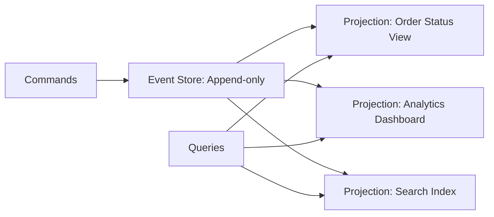

#system-design #pattern #architecture #data

# Event Sourcing

## Intuition (30 sec)

A bank statement: instead of just showing your current balance ($500), it stores every transaction: deposit $1000, withdraw $200, transfer $300. You can always recalculate the current state from the history. The history IS the source of truth, not the balance.

## Failure-First Scenario

> Your e-commerce system updates order status in-place: pending → paid → shipped → delivered. A customer disputes: "I never received it, but it says delivered." You have no history of WHO changed the status or WHEN. With event sourcing, every state change is an immutable event with full audit trail.

## Core Definitions

### Event Sourcing
A persistence pattern where state changes are stored as a sequence of immutable events rather than updating current state. The event log becomes the source of truth, and current state is derived by replaying events.

### Event Store
An append-only database optimized for storing events in sequential order. Provides efficient writes, event ordering guarantees, and fast sequential reads for replay.

### Event
An immutable fact representing something that happened in the past. Always named in past tense (OrderPlaced, PaymentReceived, ItemShipped). Contains timestamp, aggregate ID, and domain data.

### Aggregate
A consistency boundary in domain-driven design. Events are organized by aggregate - all events for one aggregate form a stream that can be replayed to reconstruct that aggregate's state.

### Snapshot
A materialized state checkpoint taken at a specific event version. Optimizes replay by allowing reconstruction from snapshot + subsequent events rather than replaying from the beginning.

### Replay
The process of reading events sequentially and applying them to reconstruct state. Used for rebuilding aggregates, creating projections, or recovering from failures.

### Projection
A read model derived from events. Multiple projections can be built from the same event stream for different query needs (CQRS pattern).

### Event Stream
An ordered sequence of events for a specific aggregate. Each stream is identified by aggregate type and ID (e.g., Order-12345 stream).

## Visual Architecture

### Event Sourcing Flow

```
┌─────────────────────────────────────────────────────────────────┐
│                    EVENT SOURCING SYSTEM                         │
└─────────────────────────────────────────────────────────────────┘

WRITE SIDE (Commands)                 READ SIDE (Queries)
─────────────────────                 ───────────────────

   ┌─────────┐                         ┌──────────────┐
   │ Command │                         │   Queries    │
   │ Handler │                         │  (Fast Read) │
   └────┬────┘                         └──────▲───────┘
        │                                     │
        ├─ Validate                           │
        ├─ Load Aggregate                     │
        ├─ Execute Business Logic             │
        │                                     │
        ▼                                     │
   ┌─────────────┐                            │
   │   Append    │                            │
   │   Events    │                            │
   └──────┬──────┘                            │
          │                                   │
          ▼                                   │
┌─────────────────────┐                       │
│   EVENT STORE       │                       │
│  (Append-Only Log)  │                       │
├─────────────────────┤                       │
│ Order-123:          │                       │
│  [1] OrderCreated   │──Event───────────────┐│
│  [2] ItemAdded      │  Stream              ││
│  [3] PaymentDone    │  (Pub/Sub)           ││
│  [4] OrderShipped   │                      ││
├─────────────────────┤                      ││
│ Order-124:          │                      ││
│  [1] OrderCreated   │                      ││
│  [2] OrderCancelled │                      ││
└─────────────────────┘                      ││
                                             ││
        ┌────────────────────────────────────┘│
        │                                     │
        ▼                                     │
┌────────────────┐                            │
│ Event Handlers │                            │
│  (Subscribers) │                            │
└───────┬────────┘                            │
        │                                     │
        ├─ Update Projection 1               │
        ├─ Update Projection 2               │
        ├─ Trigger Side Effects              │
        │                                     │
        ▼                                     │
┌─────────────────────┐                       │
│   PROJECTIONS       │                       │
│  (Read Models)      │───────────────────────┘
├─────────────────────┤
│ OrderStatusView     │  ← Optimized for queries
│ AnalyticsDashboard  │
│ SearchIndex         │
└─────────────────────┘

Key Properties:
• Events are immutable and append-only
• Single source of truth = Event Store
• Read models eventually consistent
• Multiple projections from same events
```

### State Reconstruction Process

```
┌────────────────────────────────────────────────────────────────┐
│              REBUILDING AGGREGATE STATE FROM EVENTS             │
└────────────────────────────────────────────────────────────────┘

Starting Point: Empty State
┌─────────────────┐
│  Order State:   │
│  status: null   │
│  items: []      │
│  total: 0       │
└─────────────────┘
         │
         │ Apply: OrderCreated
         │ { orderId: 123, customer: "Alice", timestamp: T1 }
         ▼
┌─────────────────┐
│  Order State:   │
│  status: NEW    │
│  items: []      │
│  total: 0       │
│  customer: Alice│
└─────────────────┘
         │
         │ Apply: ItemAdded
         │ { itemId: "SKU-001", qty: 2, price: 25.00, timestamp: T2 }
         ▼
┌─────────────────┐
│  Order State:   │
│  status: NEW    │
│  items: [SKU001]│
│  total: 50.00   │
│  customer: Alice│
└─────────────────┘
         │
         │ Apply: PaymentReceived
         │ { amount: 50.00, method: "CC", timestamp: T3 }
         ▼
┌─────────────────┐
│  Order State:   │
│  status: PAID   │
│  items: [SKU001]│
│  total: 50.00   │
│  customer: Alice│
│  paymentMethod:CC│
└─────────────────┘
         │
         │ Apply: OrderShipped
         │ { trackingId: "UPS123", timestamp: T4 }
         ▼
┌─────────────────┐
│  Order State:   │  ← CURRENT STATE
│  status: SHIPPED│     (Derived from events)
│  items: [SKU001]│
│  total: 50.00   │
│  trackingId:UPS │
└─────────────────┘

Formula: CurrentState = fold(Events, InitialState, ApplyEvent)

Time Travel: Want state at T2? Replay events 1-2 only.
```

### Snapshot Strategy

```
┌───────────────────────────────────────────────────────────────┐
│                    SNAPSHOT OPTIMIZATION                       │
└───────────────────────────────────────────────────────────────┘

WITHOUT SNAPSHOTS (Slow for large streams):
─────────────────────────────────────────────

Event 1 → Event 2 → Event 3 → ... → Event 999,998 → Event 999,999 → Event 1,000,000
  (T1)     (T2)      (T3)              (Tn-2)         (Tn-1)           (Tn)

To get current state: Replay ALL 1,000,000 events
Rebuild Time: 45 seconds ❌


WITH SNAPSHOTS (Fast):
──────────────────────

Event 1 → ... → Event 10,000 → [Snapshot v10000]
                                     ↓
Event 10,001 → ... → Event 20,000 → [Snapshot v20000]
                                          ↓
Event 20,001 → ... → Event 30,000 → [Snapshot v30000]
                                          ↓
                        ...
                                          ↓
Event 990,001 → ... → Event 1,000,000 → [Snapshot v1000000]
                             ↓
                    Event 1,000,001
                    Event 1,000,002
                    Event 1,000,003  ← Current Position

To get current state:
1. Load snapshot v1000000 (instant)
2. Replay events 1,000,001 to 1,000,003 (3 events)

Rebuild Time: 50 milliseconds ✓


SNAPSHOT STRATEGIES:

┌─────────────────────┬──────────────────┬─────────────────┐
│     Strategy        │   When to Snap   │   Trade-offs    │
├─────────────────────┼──────────────────┼─────────────────┤
│ Event Count         │ Every N events   │ Simple, but may │
│                     │ (e.g., 10,000)   │ snapshot too    │
│                     │                  │ often/rarely    │
├─────────────────────┼──────────────────┼─────────────────┤
│ Time Based          │ Daily/Hourly     │ Predictable,    │
│                     │                  │ good for batch  │
├─────────────────────┼──────────────────┼─────────────────┤
│ Size Based          │ Stream > 1MB     │ Adapts to event │
│                     │                  │ size variation  │
├─────────────────────┼──────────────────┼─────────────────┤
│ On Demand           │ After rebuild    │ Efficient, but  │
│                     │ takes > 100ms    │ complex logic   │
└─────────────────────┴──────────────────┴─────────────────┘

Storage Pattern:
┌─────────────────────────────────────┐
│ Event Store:                        │
│   events/order-123/0001-10000.evt   │
│   events/order-123/10001-20000.evt  │
│                                     │
│ Snapshot Store:                     │
│   snapshots/order-123/v10000.snap   │
│   snapshots/order-123/v20000.snap   │
│   snapshots/order-123/v30000.snap   │
└─────────────────────────────────────┘
```

### Event Replay Process

```
┌─────────────────────────────────────────────────────────────┐
│                  EVENT REPLAY SCENARIOS                      │
└─────────────────────────────────────────────────────────────┘

SCENARIO 1: Bug Fix Replay
───────────────────────────

Problem: Shipping calculation bug discovered
Solution: Fix logic, replay events, rebuild projection

┌──────────────────────────────────────────────┐
│         EVENT STORE (Immutable)              │
│  [1] OrderCreated                            │
│  [2] ItemAdded (weight: 5kg)                 │
│  [3] ShippingCalculated (cost: $5) ← BUG!    │
│  [4] OrderShipped                            │
└──────────────────────────────────────────────┘
              │
              │ Replay with Fixed Logic
              ▼
┌──────────────────────────────────────────────┐
│     NEW PROJECTION (Corrected)               │
│  ShippingCalculated (cost: $15) ← FIXED      │
└──────────────────────────────────────────────┘


SCENARIO 2: New Feature Replay
───────────────────────────────

Need: Build new "Customer Lifetime Value" view
Solution: Replay all historical events

Historical Events (Last 2 Years)
         │
         │ Replay ALL events
         │ through new projection
         ▼
┌──────────────────────────────┐
│  Customer LTV Projection     │
│  customer-001: $15,234       │
│  customer-002: $8,932        │
│  customer-003: $23,445       │
└──────────────────────────────┘


SCENARIO 3: Disaster Recovery
──────────────────────────────

Situation: Projection database corrupted
Solution: Replay events from backup

┌─────────────────────┐
│  Event Store Backup │
│  (S3 / Tape)        │
└──────────┬──────────┘
           │
           │ Stream events
           │ (can parallelize by aggregate)
           ▼
┌─────────────────────────────────┐
│  Replay Worker Pool             │
│  Worker 1: Orders 1-1000        │
│  Worker 2: Orders 1001-2000     │
│  Worker 3: Orders 2001-3000     │
└───────────┬─────────────────────┘
            │
            ▼
┌─────────────────────┐
│  Rebuilt Projection │
│  (Full Recovery)    │
└─────────────────────┘


PARALLEL REPLAY STRATEGY:

Sequential (Slow):
─────────────────
Order-1 → Order-2 → Order-3 → ... → Order-10000
Time: 10 minutes

Parallel (Fast):
────────────────
Thread 1: Order-1    → Order-4    → Order-7    ...
Thread 2: Order-2    → Order-5    → Order-8    ...
Thread 3: Order-3    → Order-6    → Order-9    ...
Time: 3.5 minutes

Key: Events within same aggregate must be sequential,
     but different aggregates can replay in parallel
```

## Working Knowledge (5 min)

**Traditional:** Store current state. UPDATE row when things change.
**Event Sourcing:** Store events (facts that happened). Derive current state from events.

```
Traditional:  orders table → { id: 1, status: "shipped", total: 99.99 }

Event Sourced:
  OrderCreated     { id: 1, items: [...], total: 99.99, at: t1 }
  PaymentReceived  { id: 1, amount: 99.99, at: t2 }
  OrderShipped     { id: 1, tracking: "UPS123", at: t3 }
```

Current state = replay all events: Created → Paid → Shipped.

## Implementation Patterns

### Pattern 1: Basic Event Store Implementation

```python
from dataclasses import dataclass
from datetime import datetime
from typing import List, Any, Dict
import json

@dataclass
class Event:
    aggregate_id: str
    event_type: str
    data: Dict[str, Any]
    version: int
    timestamp: datetime
    metadata: Dict[str, Any]

class EventStore:
    def __init__(self):
        self.events: Dict[str, List[Event]] = {}

    def append(self, aggregate_id: str, events: List[Event],
               expected_version: int) -> None:
        """Append events with optimistic concurrency check"""
        stream = self.events.get(aggregate_id, [])

        # Optimistic concurrency control
        if len(stream) != expected_version:
            raise ConcurrencyException(
                f"Expected version {expected_version}, "
                f"but stream is at {len(stream)}"
            )

        # Append events atomically
        for event in events:
            event.version = len(stream) + 1
            stream.append(event)

        self.events[aggregate_id] = stream

    def get_events(self, aggregate_id: str,
                   from_version: int = 0) -> List[Event]:
        """Get events for aggregate starting from version"""
        stream = self.events.get(aggregate_id, [])
        return [e for e in stream if e.version > from_version]

    def get_all_events(self, from_position: int = 0) -> List[Event]:
        """Get all events across all aggregates (for projections)"""
        all_events = []
        for stream in self.events.values():
            all_events.extend(stream)
        return sorted(all_events, key=lambda e: e.timestamp)[from_position:]

# Usage Example
class Order:
    def __init__(self, order_id: str):
        self.id = order_id
        self.status = None
        self.items = []
        self.total = 0
        self.version = 0

    @staticmethod
    def create(order_id: str, customer: str, items: List[Dict]) -> 'Order':
        order = Order(order_id)
        event = Event(
            aggregate_id=order_id,
            event_type="OrderCreated",
            data={"customer": customer, "items": items},
            version=1,
            timestamp=datetime.now(),
            metadata={"user": "system"}
        )
        order.apply(event)
        return order, [event]

    def apply(self, event: Event) -> None:
        """Apply event to rebuild state"""
        if event.event_type == "OrderCreated":
            self.status = "NEW"
            self.items = event.data["items"]
            self.total = sum(item["price"] * item["qty"]
                           for item in self.items)
        elif event.event_type == "OrderPaid":
            self.status = "PAID"
        elif event.event_type == "OrderShipped":
            self.status = "SHIPPED"

        self.version = event.version

    @classmethod
    def load(cls, order_id: str, event_store: EventStore) -> 'Order':
        """Rebuild order from events"""
        order = cls(order_id)
        events = event_store.get_events(order_id)
        for event in events:
            order.apply(event)
        return order
```

### Pattern 2: Snapshot Implementation

```python
from typing import Optional
import pickle

class Snapshot:
    def __init__(self, aggregate_id: str, state: Any, version: int):
        self.aggregate_id = aggregate_id
        self.state = state
        self.version = version
        self.timestamp = datetime.now()

class SnapshotStore:
    def __init__(self):
        self.snapshots: Dict[str, Snapshot] = {}

    def save(self, snapshot: Snapshot) -> None:
        """Save snapshot, keeping only the latest"""
        self.snapshots[snapshot.aggregate_id] = snapshot

    def get(self, aggregate_id: str) -> Optional[Snapshot]:
        """Get latest snapshot for aggregate"""
        return self.snapshots.get(aggregate_id)

class OrderWithSnapshot(Order):
    SNAPSHOT_FREQUENCY = 100  # Snapshot every 100 events

    @classmethod
    def load(cls, order_id: str, event_store: EventStore,
             snapshot_store: SnapshotStore) -> 'OrderWithSnapshot':
        """Load from snapshot + events"""
        # Try to load from snapshot
        snapshot = snapshot_store.get(order_id)

        if snapshot:
            order = snapshot.state
            from_version = snapshot.version
        else:
            order = cls(order_id)
            from_version = 0

        # Replay events since snapshot
        events = event_store.get_events(order_id, from_version)
        for event in events:
            order.apply(event)

        # Create new snapshot if threshold reached
        if order.version % cls.SNAPSHOT_FREQUENCY == 0:
            snapshot_store.save(Snapshot(order_id, order, order.version))

        return order
```

### Pattern 3: CQRS + Event Sourcing

```python
from abc import ABC, abstractmethod

# Command Side
class Command(ABC):
    pass

class CreateOrderCommand(Command):
    def __init__(self, order_id: str, customer: str, items: List[Dict]):
        self.order_id = order_id
        self.customer = customer
        self.items = items

class CommandHandler:
    def __init__(self, event_store: EventStore, event_bus: 'EventBus'):
        self.event_store = event_store
        self.event_bus = event_bus

    def handle(self, command: CreateOrderCommand) -> None:
        # Create aggregate and get events
        order, events = Order.create(
            command.order_id,
            command.customer,
            command.items
        )

        # Store events
        self.event_store.append(command.order_id, events, expected_version=0)

        # Publish events for projections
        for event in events:
            self.event_bus.publish(event)

# Query Side
class OrderView:
    """Denormalized read model"""
    def __init__(self, order_id: str, customer: str, status: str, total: float):
        self.order_id = order_id
        self.customer = customer
        self.status = status
        self.total = total

class OrderProjection:
    """Builds and maintains OrderView from events"""
    def __init__(self):
        self.views: Dict[str, OrderView] = {}

    def handle_order_created(self, event: Event) -> None:
        data = event.data
        self.views[event.aggregate_id] = OrderView(
            order_id=event.aggregate_id,
            customer=data["customer"],
            status="NEW",
            total=sum(i["price"] * i["qty"] for i in data["items"])
        )

    def handle_order_paid(self, event: Event) -> None:
        view = self.views[event.aggregate_id]
        view.status = "PAID"

    def handle_order_shipped(self, event: Event) -> None:
        view = self.views[event.aggregate_id]
        view.status = "SHIPPED"

    def get_order(self, order_id: str) -> Optional[OrderView]:
        """Fast query - no event replay needed"""
        return self.views.get(order_id)

# Event Bus for distributing to projections
class EventBus:
    def __init__(self):
        self.subscribers: List[Any] = []

    def subscribe(self, handler: Any) -> None:
        self.subscribers.append(handler)

    def publish(self, event: Event) -> None:
        for subscriber in self.subscribers:
            method_name = f"handle_{event.event_type.lower()}"
            if hasattr(subscriber, method_name):
                getattr(subscriber, method_name)(event)
```

### Pattern 4: Event Versioning

```python
from typing import Union

# Version 1: Original event
@dataclass
class OrderCreatedV1:
    order_id: str
    customer: str
    items: List[Dict]

# Version 2: Added shipping address
@dataclass
class OrderCreatedV2:
    order_id: str
    customer: str
    items: List[Dict]
    shipping_address: Dict  # New field

class EventUpgrader:
    """Handles event schema evolution"""

    @staticmethod
    def upgrade_order_created(event: Event) -> Event:
        """Upgrade OrderCreated v1 to v2"""
        if event.metadata.get("schema_version") == 1:
            # Add default shipping address
            event.data["shipping_address"] = {
                "street": "Unknown",
                "city": "Unknown",
                "country": "Unknown"
            }
            event.metadata["schema_version"] = 2
            event.metadata["upgraded_from"] = 1
        return event

    def upgrade(self, event: Event) -> Event:
        """Apply all necessary upgrades"""
        if event.event_type == "OrderCreated":
            return self.upgrade_order_created(event)
        return event

class VersionedEventStore(EventStore):
    def __init__(self):
        super().__init__()
        self.upgrader = EventUpgrader()

    def get_events(self, aggregate_id: str,
                   from_version: int = 0) -> List[Event]:
        """Get events and upgrade to latest schema"""
        events = super().get_events(aggregate_id, from_version)
        return [self.upgrader.upgrade(e) for e in events]
```

## Monitoring Dashboard

```
┌─────────────────────────────────────────────────────────────────┐
│              EVENT SOURCING MONITORING DASHBOARD                 │
└─────────────────────────────────────────────────────────────────┘

┌─────────────────────────────────────────────────────────────────┐
│ EVENT RATE (Events/sec)                                         │
│                                                                 │
│  500 ┤                                    ╭─╮                   │
│  400 ┤                          ╭─╮      │ │                   │
│  300 ┤                ╭─╮      │ │╭─────╯ │                   │
│  200 ┤      ╭─────────╯ ╰──────╯ ╰╯       │                   │
│  100 ┤──────╯                              ╰─────              │
│    0 ┼─────────────────────────────────────────────────────    │
│      00:00   04:00   08:00   12:00   16:00   20:00            │
│                                                                 │
│  Current:  342 events/sec    Peak:  498 events/sec            │
│  Avg (24h): 215 events/sec   Total: 18.5M events              │
└─────────────────────────────────────────────────────────────────┘

┌─────────────────────────────────────────────────────────────────┐
│ REPLAY PERFORMANCE                                              │
│                                                                 │
│  Aggregate Rebuild Time (p95):                                 │
│  ████████░░░░░░░░░░░░░░░░░░  42ms                             │
│                                                                 │
│  Projection Rebuild Time (full):                               │
│  ████████████████████░░░░░░░  12.3 minutes                    │
│                                                                 │
│  Event Processing Lag:                                         │
│  ██░░░░░░░░░░░░░░░░░░░░░░░░  850ms                            │
│                                                                 │
│  Replay Throughput:   25,432 events/sec                        │
│  Sequential vs Parallel Speedup:  3.2x                         │
└─────────────────────────────────────────────────────────────────┘

┌─────────────────────────────────────────────────────────────────┐
│ SNAPSHOT EFFICIENCY                                             │
│                                                                 │
│  Snapshot Hit Rate:      ██████████████████░░  89.2%          │
│  Avg Events After Snap:  127 events                            │
│  Snapshot Size (avg):    2.4 KB                                │
│  Snapshot Creation Time: 15ms (p95)                            │
│                                                                 │
│  Top Aggregates by Event Count:                                │
│  Order-7845:     ████████████████████████  12,453 events      │
│  Order-3421:     ████████████████████░░░░   9,823 events      │
│  Order-9012:     █████████████████░░░░░░░   7,234 events      │
│                                                                 │
│  Snapshot Schedule:  Every 1,000 events OR 1 hour             │
│  Last Snapshot Run:  2 minutes ago                             │
└─────────────────────────────────────────────────────────────────┘

┌─────────────────────────────────────────────────────────────────┐
│ STORAGE METRICS                                                 │
│                                                                 │
│  Event Store Size:     ████████████░░░░░░░░  1.2 TB / 2 TB    │
│  Snapshot Store Size:  ██████░░░░░░░░░░░░░░  245 GB / 500 GB  │
│  Projection DB Size:   ████████░░░░░░░░░░░░  89 GB / 200 GB   │
│                                                                 │
│  Growth Rate (daily):  +12 GB/day                              │
│  Oldest Event:         823 days ago                            │
│  Archival Status:      Events > 2 years → S3                   │
└─────────────────────────────────────────────────────────────────┘

┌─────────────────────────────────────────────────────────────────┐
│ PROJECTION STATUS                                               │
│                                                                 │
│  Projection             Status    Lag        Last Updated      │
│  ──────────────────────────────────────────────────────────    │
│  OrderStatusView        ✓ OK      120ms      2s ago           │
│  AnalyticsDashboard     ✓ OK      850ms      5s ago           │
│  SearchIndex            ⚠ SLOW    2.3s       12s ago          │
│  CustomerLTV            ✓ OK      340ms      3s ago           │
│  InventoryView          ✗ ERROR   N/A        5m ago           │
│                                                                 │
│  Event Processing Errors (last hour): 3                        │
│  Dead Letter Queue Size: 12 events                             │
└─────────────────────────────────────────────────────────────────┘

┌─────────────────────────────────────────────────────────────────┐
│ ALERTS & ANOMALIES                                              │
│                                                                 │
│  🔴 InventoryView projection failing - database connection     │
│     Action: Restarting projection worker...                    │
│                                                                 │
│  🟡 SearchIndex projection lag > 2s                            │
│     Action: Consider adding more workers                       │
│                                                                 │
│  🟢 All other systems operating normally                       │
└─────────────────────────────────────────────────────────────────┘

Key Metrics to Monitor:
• Write throughput: Events appended per second
• Read latency: Time to rebuild aggregate from events
• Snapshot effectiveness: % of rebuilds using snapshots
• Projection lag: Time between event write and projection update
• Storage growth: Rate of event accumulation
• Concurrency conflicts: Failed optimistic lock attempts
```

## Decision Trees

### When to Use Event Sourcing

```
                          START: Need persistence?
                                    │
                                    ▼
                    ┌───────────────────────────────┐
                    │  Need complete audit trail?   │
                    │  (who, what, when, why)       │
                    └───────────┬───────────────────┘
                                │
                ┌───────────────┴───────────────┐
                │ YES                           │ NO
                ▼                               ▼
    ┌───────────────────────┐      ┌────────────────────────┐
    │  Financial/Regulated  │      │  Need to analyze       │
    │  domain?              │      │  historical behavior?  │
    └───────┬───────────────┘      └───────┬────────────────┘
            │                              │
            │ YES                          │
            ▼                     ┌────────┴────────┐
    ┌──────────────┐              │ YES             │ NO
    │ Use Event    │              ▼                 ▼
    │ Sourcing     │   ┌─────────────────┐  ┌──────────────┐
    │ ✓✓✓         │   │  Complex domain  │  │  Simple CRUD │
    └──────────────┘   │  with many state │  │  sufficient  │
                       │  transitions?    │  │              │
                       └────────┬─────────┘  │  Use         │
                                │            │  traditional │
                    ┌───────────┴─────┐      │  DB          │
                    │ YES              │ NO   └──────────────┘
                    ▼                  ▼
         ┌──────────────────┐  ┌─────────────────┐
         │  Need multiple   │  │  Consider if    │
         │  read models?    │  │  complexity     │
         └────────┬─────────┘  │  justified      │
                  │            └─────────────────┘
         ┌────────┴────────┐
         │ YES             │ NO
         ▼                 ▼
┌─────────────────┐ ┌─────────────────┐
│ Use Event       │ │ Event Sourcing  │
│ Sourcing +      │ │ may be          │
│ CQRS            │ │ overkill, but   │
│ ✓✓✓            │ │ okay if needed  │
└─────────────────┘ └─────────────────┘

RULE OF THUMB:
──────────────
Use Event Sourcing when at least 2 of these are true:
• Need complete audit trail (regulatory, debugging)
• Complex domain with rich state transitions
• Need multiple projections from same data
• Benefit from time-travel/replay capabilities
• Working with distributed systems (saga patterns)

DON'T use Event Sourcing if:
• Simple CRUD application
• No need for audit history
• Team lacks experience (high learning curve)
• Query patterns are simple and singular
```

### Snapshot Strategy Decision Tree

```
          START: Implementing Event Sourcing?
                        │
                        ▼
          ┌─────────────────────────────┐
          │  How many events per        │
          │  aggregate on average?      │
          └──────────┬──────────────────┘
                     │
         ┌───────────┴───────────┐
         │ < 100                 │ > 100
         ▼                       ▼
┌──────────────────┐    ┌────────────────────┐
│  No snapshots    │    │  Do some aggregates│
│  needed          │    │  have > 1000 events│
│                  │    └─────────┬──────────┘
│  Replay is fast  │              │
└──────────────────┘    ┌─────────┴─────────┐
                        │ YES               │ NO
                        ▼                   ▼
            ┌────────────────────┐  ┌──────────────────┐
            │  Aggressive        │  │  Standard        │
            │  snapshot strategy │  │  snapshot every  │
            │                    │  │  1000 events     │
            │  • Every 100 evts  │  └──────────────────┘
            │  • Or on-demand if │
            │    rebuild > 100ms │
            └────────────────────┘
                        │
                        ▼
            ┌────────────────────┐
            │  How critical is   │
            │  rebuild speed?    │
            └─────────┬──────────┘
                      │
          ┌───────────┴──────────┐
          │ Critical             │ Normal
          ▼                      ▼
┌─────────────────────┐  ┌─────────────────────┐
│  Use rolling        │  │  Use periodic       │
│  snapshots          │  │  snapshots          │
│                     │  │                     │
│  Keep last 3        │  │  Keep last 1        │
│  snapshots for      │  │  snapshot           │
│  redundancy         │  │                     │
│                     │  │  Snapshot async     │
│  Snapshot sync      │  │  after write        │
│  after write        │  │                     │
└─────────────────────┘  └─────────────────────┘

SNAPSHOT FREQUENCY GUIDE:
─────────────────────────

Events/Aggregate  │  Strategy               │  Expected Rebuild
─────────────────────────────────────────────────────────────
< 50              │  No snapshot            │  < 10ms
50 - 500          │  Every 500 events       │  10-50ms
500 - 5,000       │  Every 1,000 events     │  50-200ms
> 5,000           │  Every 500-1,000 events │  < 100ms
                  │  + on-demand            │

WHEN TO SNAPSHOT:
─────────────────
✓ After high-frequency command batches
✓ Before long-running queries
✓ During off-peak hours (background job)
✓ When rebuild time exceeds threshold
✗ After every single event (too expensive)
✗ Never (unless < 50 events per aggregate)
```

## Production Patterns

### Event Versioning Strategy

```
┌─────────────────────────────────────────────────────────────────┐
│                    EVENT SCHEMA EVOLUTION                        │
└─────────────────────────────────────────────────────────────────┘

PROBLEM: Schema changes over time, but old events are immutable

STRATEGY 1: Upcasting (Recommended)
────────────────────────────────────

Store events in original format, upgrade on read:

┌──────────────────────────────────────┐
│ Event Store (Immutable)              │
├──────────────────────────────────────┤
│ OrderCreated v1 (2023-01-15)        │
│ { "customer": "Alice",               │
│   "items": [...] }                   │
│                                      │
│ OrderCreated v2 (2024-06-20)        │
│ { "customer": "Bob",                 │
│   "items": [...],                    │
│   "shipping_address": {...} }        │
│                                      │
│ OrderCreated v3 (2025-11-10)        │
│ { "customer": "Charlie",             │
│   "items": [...],                    │
│   "shipping_address": {...},         │
│   "billing_address": {...} }         │
└──────────────────────────────────────┘
              │
              │ Upcasting Layer
              ▼
┌──────────────────────────────────────┐
│ All events read as v3:               │
│                                      │
│ { "customer": "Alice",               │
│   "items": [...],                    │
│   "shipping_address": {              │
│     "street": "Unknown" },  ← default│
│   "billing_address": {               │
│     "same_as_shipping": true }}      │
└──────────────────────────────────────┘

Implementation:
───────────────

class EventUpcaster:
    def upcast(self, event: Event) -> Event:
        version = event.metadata.get("version", 1)

        # Chain of upcasters
        if version == 1:
            event = self.v1_to_v2(event)
            version = 2
        if version == 2:
            event = self.v2_to_v3(event)
            version = 3

        return event

    def v1_to_v2(self, event: Event) -> Event:
        """Add shipping_address field"""
        if "shipping_address" not in event.data:
            event.data["shipping_address"] = self.default_address()
        event.metadata["version"] = 2
        return event

    def v2_to_v3(self, event: Event) -> Event:
        """Add billing_address field"""
        if "billing_address" not in event.data:
            event.data["billing_address"] = {
                "same_as_shipping": True
            }
        event.metadata["version"] = 3
        return event


STRATEGY 2: Copy and Transform (for major changes)
───────────────────────────────────────────────────

Create new event stream with transformed events:

Old Stream:                New Stream:
OrderPlaced        ──────→  OrderCreatedV2
ItemAdded         ──────→  OrderCreatedV2 (merged)
PaymentProcessed  ──────→  PaymentReceivedV2

Used for: Breaking changes, event consolidation


STRATEGY 3: Weak Schema (JSON)
───────────────────────────────

Store events as flexible JSON, handle missing fields gracefully:

def apply_order_created(order, event):
    # Defensive coding
    order.customer = event.data.get("customer")
    order.items = event.data.get("items", [])
    order.shipping = event.data.get("shipping_address", DEFAULT_ADDRESS)
    order.billing = event.data.get("billing_address", order.shipping)

Trade-off: Flexibility vs Type Safety


VERSION METADATA:
─────────────────

Every event should include:

{
  "event_type": "OrderCreated",
  "aggregate_id": "order-123",
  "data": { ... },
  "metadata": {
    "schema_version": 3,
    "created_at": "2025-11-10T14:30:00Z",
    "correlation_id": "abc-123",
    "causation_id": "xyz-789",
    "user_id": "user-456"
  }
}

Key fields:
• schema_version: Which version of event schema
• correlation_id: Which business transaction (for tracing)
• causation_id: Which event caused this event (event lineage)
```

### CQRS + Event Sourcing Pattern

```
┌─────────────────────────────────────────────────────────────────┐
│              CQRS + EVENT SOURCING ARCHITECTURE                 │
└─────────────────────────────────────────────────────────────────┘

┌──────────────────────────────────────────────────────────────┐
│                        CLIENT                                │
└────────────┬───────────────────────────┬─────────────────────┘
             │                           │
             │ Commands                  │ Queries
             │ (Write)                   │ (Read)
             ▼                           ▼
┌─────────────────────────┐   ┌──────────────────────────────┐
│   COMMAND SIDE          │   │     QUERY SIDE               │
│                         │   │                              │
│  ┌───────────────────┐  │   │  ┌────────────────────────┐ │
│  │ Command Handler   │  │   │  │  Query Handler         │ │
│  │                   │  │   │  │                        │ │
│  │ • Validate        │  │   │  │ • Fast reads           │ │
│  │ • Load aggregate  │  │   │  │ • Join pre-computed    │ │
│  │ • Execute logic   │  │   │  │   views                │ │
│  │ • Generate events │  │   │  │ • No business logic    │ │
│  └─────────┬─────────┘  │   │  └───────┬────────────────┘ │
│            │             │   │          │                  │
│            ▼             │   │          ▼                  │
│  ┌───────────────────┐  │   │  ┌────────────────────────┐ │
│  │ Event Store       │  │   │  │ Read Model DB          │ │
│  │                   │  │   │  │                        │ │
│  │ • Append-only     │  │   │  │ • OrderView            │ │
│  │ • Optimistic lock │  │   │  │ • CustomerView         │ │
│  │ • Source of truth │  │   │  │ • AnalyticsView        │ │
│  └─────────┬─────────┘  │   │  │                        │ │
└────────────┼─────────────┘   │  │ • Indexed for queries  │ │
             │                 │  │ • Eventually consistent│ │
             │                 │  └────────────────────────┘ │
             │                 └──────────────────────────────┘
             │ Event Stream
             │ (Pub/Sub)
             │
             ▼
┌────────────────────────────────────────────────────────┐
│              EVENT PROCESSORS                          │
│                                                        │
│  ┌──────────────────┐  ┌──────────────────┐          │
│  │ Projection 1     │  │ Projection 2     │  ...     │
│  │ OrderView        │  │ Analytics        │          │
│  │                  │  │                  │          │
│  │ • Subscribe      │  │ • Subscribe      │          │
│  │ • Apply events   │  │ • Apply events   │          │
│  │ • Update read DB │  │ • Update read DB │          │
│  └──────────────────┘  └──────────────────┘          │
└────────────────────────────────────────────────────────┘


WRITE PATH (Command):
─────────────────────

1. Receive Command: CreateOrder
2. Load Aggregate: Replay events to get current state
3. Validate: Check business rules
4. Execute: Generate new events
5. Persist: Append events to event store (atomic)
6. Publish: Send events to event bus
7. Return: Success to client

Time: 50-150ms (optimistic case)


READ PATH (Query):
──────────────────

1. Receive Query: GetOrderDetails(id)
2. Query Read Model: SELECT * FROM order_view WHERE id = ?
3. Return: Denormalized data

Time: 1-5ms (very fast)


EVENTUAL CONSISTENCY:
─────────────────────

┌────────────────────────────────────────────────────┐
│  T0: Command executed, events written              │
│  T1: Events published to message bus               │
│  T2: Projection 1 processes event (10ms later)     │
│  T3: Projection 2 processes event (50ms later)     │
│                                                    │
│  Consistency Window: 10-100ms typically            │
└────────────────────────────────────────────────────┘

Handling in UI:
• Optimistic updates (assume success)
• Show "processing..." indicator
• Poll for confirmation
• Use correlation IDs to match command → events


MULTIPLE READ MODELS:
─────────────────────

Same Events, Different Views:

Event Stream → Projection 1: OrderStatusView
                             (fast status lookup)

            → Projection 2: OrderSearchIndex
                             (full-text search)

            → Projection 3: AnalyticsDashboard
                             (aggregated metrics)

            → Projection 4: CustomerLTVView
                             (customer analytics)

Each optimized for its query pattern!
```

### Saga Pattern with Event Sourcing

```
┌─────────────────────────────────────────────────────────────────┐
│           DISTRIBUTED SAGA WITH EVENT SOURCING                   │
└─────────────────────────────────────────────────────────────────┘

SCENARIO: Place order across multiple services
───────────────────────────────────────────────

┌──────────────┐   ┌──────────────┐   ┌──────────────┐
│   Order      │   │   Payment    │   │   Inventory  │
│   Service    │   │   Service    │   │   Service    │
└──────────────┘   └──────────────┘   └──────────────┘

HAPPY PATH:
───────────

Order Service:
  Event: OrderCreated {order_id, items, total}
         │
         ├─→ Saga Orchestrator listens
         │
         ▼
Payment Service:
  Event: PaymentRequested {order_id, amount}
  Event: PaymentCompleted {order_id, transaction_id}
         │
         ▼
Inventory Service:
  Event: InventoryReserved {order_id, items}
  Event: InventoryAllocated {order_id, warehouse_id}
         │
         ▼
Order Service:
  Event: OrderConfirmed {order_id}


FAILURE PATH (with compensation):
──────────────────────────────────

Order Service:
  Event: OrderCreated {order_id, items, total}
         │
         ▼
Payment Service:
  Event: PaymentRequested {order_id, amount}
  Event: PaymentCompleted {order_id, transaction_id}
         │
         ▼
Inventory Service:
  Event: InventoryReserved {order_id, items}
  Event: InventoryAllocationFailed {order_id, reason: "out of stock"}
         │
         │ Saga detects failure, triggers compensation
         ▼
Payment Service:
  Event: PaymentRefundRequested {order_id, transaction_id}
  Event: PaymentRefunded {order_id}
         │
         ▼
Order Service:
  Event: OrderCancelled {order_id, reason: "inventory unavailable"}


Implementation:
───────────────

class SagaOrchestrator:
    def __init__(self, event_store, event_bus):
        self.event_store = event_store
        self.event_bus = event_bus
        self.sagas = {}  # saga_id → SagaState

    def handle_order_created(self, event):
        saga_id = f"order-saga-{event.aggregate_id}"
        saga = OrderSaga(saga_id, event)
        self.sagas[saga_id] = saga

        # Start saga: request payment
        payment_command = RequestPayment(
            order_id=event.aggregate_id,
            amount=event.data["total"]
        )
        self.send_command(payment_command)

    def handle_payment_completed(self, event):
        saga = self.find_saga_for_order(event.data["order_id"])
        saga.payment_completed()

        # Next step: reserve inventory
        inventory_command = ReserveInventory(
            order_id=event.data["order_id"],
            items=saga.order_items
        )
        self.send_command(inventory_command)

    def handle_inventory_allocation_failed(self, event):
        saga = self.find_saga_for_order(event.data["order_id"])
        saga.inventory_failed()

        # Compensate: refund payment
        refund_command = RefundPayment(
            order_id=event.data["order_id"],
            transaction_id=saga.payment_transaction_id
        )
        self.send_command(refund_command)

    def handle_payment_refunded(self, event):
        saga = self.find_saga_for_order(event.data["order_id"])
        saga.compensation_completed()

        # Cancel order
        cancel_command = CancelOrder(
            order_id=event.data["order_id"],
            reason="inventory unavailable"
        )
        self.send_command(cancel_command)

Each service's state is in its own event store!
Saga orchestrator coordinates based on events.
```

## Troubleshooting Guide

### Large Event Streams

```
PROBLEM: Aggregate has 100,000+ events, slow to rebuild
─────────────────────────────────────────────────────────

SYMPTOMS:
• Aggregate load time > 1 second
• High memory usage during replay
• Timeouts on complex aggregates

SOLUTIONS:

1. Implement Snapshots (Priority 1)
   ────────────────────────────────

   class SnapshotManager:
       SNAPSHOT_FREQUENCY = 1000  # Every 1000 events

       def load_aggregate(self, id):
           snapshot = self.get_latest_snapshot(id)
           if snapshot:
               aggregate = deserialize(snapshot.data)
               events = self.get_events_after(id, snapshot.version)
           else:
               aggregate = Aggregate(id)
               events = self.get_all_events(id)

           for event in events:
               aggregate.apply(event)

           # Create new snapshot if needed
           if should_snapshot(aggregate):
               self.save_snapshot(aggregate)

           return aggregate

   Expected improvement: 10-100x faster

2. Use Rolling Snapshots
   ──────────────────────

   Keep multiple snapshots at different intervals:
   • Snapshot at event 10,000
   • Snapshot at event 50,000
   • Snapshot at event 100,000

   If latest snapshot fails, fall back to previous

3. Archive Old Events
   ───────────────────

   Move events older than X months to cold storage:

   Active Store:  Events from last 6 months
   Archive (S3): Events older than 6 months

   Load from archive only when time-travel needed

4. Aggregate Splitting
   ────────────────────

   If aggregate is too large, consider splitting:

   Before: Order aggregate (100K events)
   After:
     • Order aggregate (metadata, status)
     • OrderItems aggregate (line items)
     • OrderPayments aggregate (payment history)

   Trade-off: More complex, but each smaller


PREVENTION:
───────────
• Monitor event count per aggregate
• Alert when aggregate > 10K events
• Consider if domain model needs refactoring
```

### Replay Performance

```
PROBLEM: Full projection rebuild takes hours
─────────────────────────────────────────────

SYMPTOMS:
• Projection rebuild > 1 hour
• Cannot add new projections easily
• Disaster recovery too slow

SOLUTIONS:

1. Parallel Replay
   ───────────────

   Replay different aggregates in parallel:

   class ParallelReplayEngine:
       def rebuild_projection(self, projection):
           # Get all aggregate IDs
           aggregate_ids = self.get_all_aggregate_ids()

           # Partition into chunks
           chunk_size = 1000
           chunks = partition(aggregate_ids, chunk_size)

           # Parallel processing
           with ThreadPoolExecutor(max_workers=10) as executor:
               futures = []
               for chunk in chunks:
                   future = executor.submit(
                       self.replay_chunk,
                       chunk,
                       projection
                   )
                   futures.append(future)

               # Wait for all
               wait(futures)

       def replay_chunk(self, aggregate_ids, projection):
           for agg_id in aggregate_ids:
               events = self.event_store.get_events(agg_id)
               for event in events:
                   projection.apply(event)

   Expected improvement: Linear with core count

2. Incremental Replay
   ───────────────────

   Track projection position, resume from there:

   class IncrementalProjection:
       def __init__(self):
           self.position = self.load_position()  # Last processed event

       def replay(self):
           events = self.event_store.get_all_events(self.position)

           for event in events:
               self.apply(event)
               self.position = event.global_position

               # Checkpoint every 1000 events
               if self.position % 1000 == 0:
                   self.save_position(self.position)

3. Batch Processing
   ─────────────────

   Process events in batches, commit together:

   BATCH_SIZE = 1000
   events = []

   for event in event_stream:
       events.append(event)

       if len(events) >= BATCH_SIZE:
           # Process batch
           db.begin_transaction()
           for e in events:
               projection.apply(e)
           db.commit()
           events = []

4. Use Cached Projections
   ───────────────────────

   Don't rebuild from scratch if you have recent backup:

   1. Backup projection DB daily
   2. Restore from backup
   3. Replay only events since backup

   Example:
     Backup from yesterday: Restore (30 sec)
     Replay today's events: 100K events (2 min)
     Total: 2.5 min instead of 4 hours


BENCHMARKS:
───────────
Event Count    Sequential    Parallel (8 cores)
──────────────────────────────────────────────
100K           30 sec        6 sec
1M             5 min         45 sec
10M            50 min        8 min
100M           8 hours       1.2 hours
```

### Event Ordering Issues

```
PROBLEM: Events processed out of order
───────────────────────────────────────

SYMPTOMS:
• Projection state inconsistent
• Race conditions in distributed setup
• Events applied in wrong sequence

ROOT CAUSES:
────────────

1. Network delays in distributed system
2. Multiple consumers processing in parallel
3. Clock skew between servers
4. Retry logic causing duplicates

SOLUTIONS:

1. Partition by Aggregate ID
   ──────────────────────────

   Ensure all events for same aggregate go to same partition:

   partition = hash(aggregate_id) % num_partitions

   Events within partition are ordered.
   Single consumer per partition processes sequentially.

   Kafka Example:
   ──────────────

   events_topic (4 partitions):
     Partition 0: Order-1, Order-5, Order-9  ← Consumer 0
     Partition 1: Order-2, Order-6, Order-10 ← Consumer 1
     Partition 2: Order-3, Order-7, Order-11 ← Consumer 2
     Partition 3: Order-4, Order-8, Order-12 ← Consumer 3

2. Use Sequence Numbers
   ─────────────────────

   Each event in aggregate stream has monotonic version:

   Order-123:
     [1] OrderCreated
     [2] ItemAdded
     [3] PaymentReceived
     [4] OrderShipped

   Projection tracks last processed version:

   class OrderedProjection:
       def __init__(self):
           self.last_version = {}  # aggregate_id → version

       def apply(self, event):
           agg_id = event.aggregate_id
           expected = self.last_version.get(agg_id, 0) + 1

           if event.version < expected:
               # Duplicate, ignore
               return
           elif event.version > expected:
               # Gap detected, wait or fetch missing
               self.handle_gap(agg_id, expected, event.version)
           else:
               # Correct order
               self.do_apply(event)
               self.last_version[agg_id] = event.version

3. Idempotent Event Handlers
   ──────────────────────────

   Make projections safe to replay:

   class IdempotentProjection:
       def apply(self, event):
           # Check if already processed
           if self.is_processed(event.id):
               return

           # Process
           self.do_apply(event)

           # Mark as processed
           self.mark_processed(event.id)

   Use event ID or (aggregate_id, version) as deduplication key

4. Causal Ordering
   ────────────────

   For cross-aggregate dependencies, use causation metadata:

   Event: PaymentReceived
   {
     "aggregate_id": "payment-456",
     "causation_id": "order-created-123",  ← Caused by this event
     "correlation_id": "purchase-flow-789"
   }

   Projection can wait for causal dependencies before processing


MONITORING:
───────────
• Track event gaps per aggregate
• Alert on out-of-order events
• Monitor duplicate event rate
• Check partition lag
```

## Real-World Examples

### Apache Kafka as Event Store

```
┌─────────────────────────────────────────────────────────────────┐
│              KAFKA-BASED EVENT SOURCING                          │
└─────────────────────────────────────────────────────────────────┘

ARCHITECTURE:
─────────────

┌────────────────────────────────────────────────────────┐
│  Kafka Cluster                                         │
│                                                        │
│  Topic: orders-events (Partitioned by order_id)       │
│  ┌──────────────────────────────────────────────────┐ │
│  │ Partition 0:                                     │ │
│  │   Order-1: [OrderCreated, ItemAdded, Paid]      │ │
│  │   Order-4: [OrderCreated, Cancelled]            │ │
│  ├──────────────────────────────────────────────────┤ │
│  │ Partition 1:                                     │ │
│  │   Order-2: [OrderCreated, Paid, Shipped]        │ │
│  │   Order-5: [OrderCreated, ItemAdded, ItemAdded] │ │
│  ├──────────────────────────────────────────────────┤ │
│  │ Partition 2:                                     │ │
│  │   Order-3: [OrderCreated, Paid]                 │ │
│  └──────────────────────────────────────────────────┘ │
│                                                        │
│  Retention: 30 days (or forever with log compaction)  │
│  Replication Factor: 3                                │
└────────────────────────────────────────────────────────┘

WHY KAFKA FOR EVENT SOURCING:
──────────────────────────────

✓ Append-only log (perfect for events)
✓ Ordered within partition (per-aggregate ordering)
✓ Highly scalable (distributed)
✓ Multiple consumers (projections)
✓ Built-in replication (durability)
✓ Time-based retention or log compaction
✓ Fast sequential writes


IMPLEMENTATION:
───────────────

from kafka import KafkaProducer, KafkaConsumer
import json

class KafkaEventStore:
    def __init__(self, bootstrap_servers):
        self.producer = KafkaProducer(
            bootstrap_servers=bootstrap_servers,
            value_serializer=lambda v: json.dumps(v).encode('utf-8'),
            acks='all',  # Wait for all replicas
            retries=3
        )
        self.topic = 'orders-events'

    def append_events(self, aggregate_id, events):
        """Append events to Kafka"""
        for event in events:
            # Use aggregate_id as key for partitioning
            self.producer.send(
                topic=self.topic,
                key=aggregate_id.encode('utf-8'),
                value={
                    'aggregate_id': aggregate_id,
                    'event_type': event.event_type,
                    'data': event.data,
                    'version': event.version,
                    'timestamp': event.timestamp.isoformat()
                }
            )
        self.producer.flush()

    def get_events(self, aggregate_id):
        """Get all events for aggregate (replay)"""
        consumer = KafkaConsumer(
            self.topic,
            bootstrap_servers=self.bootstrap_servers,
            auto_offset_reset='earliest',
            value_deserializer=lambda m: json.loads(m.decode('utf-8'))
        )

        events = []
        for message in consumer:
            event_data = message.value
            if event_data['aggregate_id'] == aggregate_id:
                events.append(Event.from_dict(event_data))

        return events

class OrderProjection:
    def __init__(self, bootstrap_servers):
        self.consumer = KafkaConsumer(
            'orders-events',
            bootstrap_servers=bootstrap_servers,
            group_id='order-projection-group',
            auto_offset_reset='earliest',
            value_deserializer=lambda m: json.loads(m.decode('utf-8'))
        )

    def start(self):
        """Consume events and update projection"""
        for message in self.consumer:
            event = message.value
            self.apply_event(event)
            # Kafka automatically tracks offset per consumer group

    def apply_event(self, event):
        if event['event_type'] == 'OrderCreated':
            self.handle_order_created(event)
        elif event['event_type'] == 'OrderPaid':
            self.handle_order_paid(event)
        # ... more handlers


OPTIMIZATIONS:
──────────────

1. Log Compaction for Snapshots
   ─────────────────────────────

   Use compacted topics to store latest snapshot per aggregate:

   Topic: orders-snapshots (log.cleanup.policy=compact)
   Key: order-123 → Value: Latest snapshot

   Kafka keeps only the latest value per key.

2. Parallel Processing
   ────────────────────

   Consumer Group with multiple consumers:

   Partition 0 → Consumer 1
   Partition 1 → Consumer 2
   Partition 2 → Consumer 3

   Each consumer processes different orders in parallel.

3. Exactly-Once Semantics
   ────────────────────────

   Use Kafka transactions for atomic writes:

   producer = KafkaProducer(
       transactional_id='order-service-1',
       enable_idempotence=True
   )
   producer.begin_transaction()
   producer.send('orders-events', event1)
   producer.send('orders-events', event2)
   producer.commit_transaction()


TRADE-OFFS:
───────────

✓ Pros:
  • Battle-tested, production-ready
  • Excellent throughput (millions of events/sec)
  • Built-in replication and fault tolerance
  • Multiple consumers (fan-out to projections)

✗ Cons:
  • Operational complexity (need to run Kafka cluster)
  • Retention policies (may need separate archive)
  • Query by aggregate_id requires full scan (no indexing)
  • Not a database (need external store for snapshots)
```

### Banking System Event Sourcing

```
┌─────────────────────────────────────────────────────────────────┐
│           BANK ACCOUNT WITH EVENT SOURCING                       │
└─────────────────────────────────────────────────────────────────┘

DOMAIN: Bank Account
────────────────────

Events:
• AccountOpened
• MoneyDeposited
• MoneyWithdrawn
• TransferReceived
• TransferSent
• AccountFrozen
• AccountClosed

IMPLEMENTATION:
───────────────

class BankAccount:
    def __init__(self, account_id):
        self.account_id = account_id
        self.balance = 0
        self.status = None
        self.transaction_count = 0
        self.version = 0

    @staticmethod
    def open(account_id, owner, initial_deposit):
        """Create new account"""
        account = BankAccount(account_id)
        event = Event(
            aggregate_id=account_id,
            event_type="AccountOpened",
            data={
                "owner": owner,
                "initial_deposit": initial_deposit,
                "opened_at": datetime.now().isoformat()
            },
            version=1,
            timestamp=datetime.now(),
            metadata={"user": owner}
        )
        account.apply(event)
        return account, [event]

    def deposit(self, amount, description):
        """Deposit money"""
        if self.status != "ACTIVE":
            raise Exception("Account not active")

        event = Event(
            aggregate_id=self.account_id,
            event_type="MoneyDeposited",
            data={
                "amount": amount,
                "description": description,
                "balance_after": self.balance + amount
            },
            version=self.version + 1,
            timestamp=datetime.now(),
            metadata={}
        )

        self.apply(event)
        return [event]

    def withdraw(self, amount, description):
        """Withdraw money"""
        if self.status != "ACTIVE":
            raise Exception("Account not active")
        if self.balance < amount:
            # Still record the attempt!
            event = Event(
                aggregate_id=self.account_id,
                event_type="WithdrawalFailed",
                data={
                    "amount": amount,
                    "reason": "insufficient_funds",
                    "balance": self.balance
                },
                version=self.version + 1,
                timestamp=datetime.now(),
                metadata={}
            )
            self.apply(event)
            return [event]

        event = Event(
            aggregate_id=self.account_id,
            event_type="MoneyWithdrawn",
            data={
                "amount": amount,
                "description": description,
                "balance_after": self.balance - amount
            },
            version=self.version + 1,
            timestamp=datetime.now(),
            metadata={}
        )

        self.apply(event)
        return [event]

    def apply(self, event):
        """Rebuild state from event"""
        if event.event_type == "AccountOpened":
            self.status = "ACTIVE"
            self.balance = event.data["initial_deposit"]

        elif event.event_type == "MoneyDeposited":
            self.balance += event.data["amount"]
            self.transaction_count += 1

        elif event.event_type == "MoneyWithdrawn":
            self.balance -= event.data["amount"]
            self.transaction_count += 1

        elif event.event_type == "WithdrawalFailed":
            # Record attempt, don't change balance
            self.transaction_count += 1

        elif event.event_type == "AccountFrozen":
            self.status = "FROZEN"

        self.version = event.version


WHY EVENT SOURCING FOR BANKING:
────────────────────────────────

1. Complete Audit Trail
   ─────────────────────

   Regulatory requirement: Every transaction must be traceable.

   Events provide:
   • Who: metadata.user
   • What: event_type, data
   • When: timestamp
   • Why: description field
   • How much: amount

   Can answer: "Show me all transactions on this account
                 between Jan 1 and Jan 31, 2025"

2. Temporal Queries
   ────────────────

   "What was the balance on Dec 31, 2024?"

   → Replay events up to that date

   class BankAccount:
       @classmethod
       def load_at_date(cls, account_id, event_store, target_date):
           account = cls(account_id)
           events = event_store.get_events(account_id)

           for event in events:
               if event.timestamp > target_date:
                   break
               account.apply(event)

           return account

3. Bug Recovery
   ────────────

   Scenario: Interest calculation bug discovered

   Solution:
   1. Fix bug in code
   2. Replay all "InterestCalculated" events
   3. Rebuild account balances with correct logic
   4. Generate compensating transactions if needed

   The events (facts) don't change, only our interpretation!

4. Fraud Detection
   ───────────────

   Build fraud detection projection from same events:

   class FraudDetectionProjection:
       def handle_money_withdrawn(self, event):
           amount = event.data["amount"]

           # Get recent withdrawals for this account
           recent = self.get_recent_withdrawals(
               event.aggregate_id,
               hours=24
           )

           if len(recent) > 10:
               self.flag_suspicious(event.aggregate_id,
                                   "High frequency withdrawals")

           if amount > 10000:
               self.flag_suspicious(event.aggregate_id,
                                   "Large withdrawal")

5. Reconciliation
   ──────────────

   End-of-day reconciliation:

   Expected balance = Opening Balance + Sum(Deposits) - Sum(Withdrawals)
   Actual balance   = Current state from events

   If mismatch → Replay events to find discrepancy


PRODUCTION SETUP:
─────────────────

┌─────────────────────────────────────────────────────────┐
│  Core Banking System                                    │
│                                                         │
│  Event Store:  PostgreSQL (append-only table)          │
│  Snapshot:     Every 1000 transactions                 │
│  Retention:    Forever (regulatory requirement)        │
│  Backup:       Daily snapshots to S3                   │
│                                                         │
│  Projections:                                          │
│    • AccountBalanceView (real-time queries)            │
│    • TransactionHistory (audit log)                    │
│    • DailyBalanceSnapshot (reporting)                  │
│    • FraudDetection (real-time alerts)                 │
│    • RegulatoryReporting (compliance)                  │
└─────────────────────────────────────────────────────────┘

COMPLIANCE:
───────────
• Immutable events satisfy audit requirements
• Can prove state at any point in time
• Full lineage of every transaction
• Meets SOX, PCI-DSS, Basel III requirements
```

## Deep Dive (30 min)

### Benefits

- **Complete audit trail** — Who changed what, when, and why
- **Time travel** — Rebuild state at any point in time
- **Replay and fix** — Found a bug? Fix logic, replay events, get correct state
- **Multiple projections** — Same events, different read models (CQRS)
- **Debug production issues** — Replay the exact sequence that caused a bug
- **Regulatory compliance** — Immutable log satisfies audit requirements
- **Experimentation** — Test new business logic against historical events

### Event Sourcing + CQRS

Natural pairing:


## The "Why" Chain

- **Why event sourcing?** → Complete history, audit trail, ability to replay and rebuild
- **What's the alternative?** → CRUD (update in place) — simpler, fine for most apps
- **What breaks without it?** → No audit trail, can't debug state corruption, can't build new views from historical data
- **What does it enable?** → Temporal queries, bug recovery, multiple projections, compliance

## When to Use / When NOT to Use

| Use | Don't Use |
|-----|-----------|
| Financial systems (audit required) | Simple CRUD apps |
| Need complete history | Don't need history |
| Complex domain with many state transitions | Simple status updates |
| Need to build multiple read models | One read model is sufficient |
| Distributed systems with sagas | Single monolithic database works |
| Regulatory compliance (SOX, PCI-DSS) | Prototypes / MVPs |
| Need to debug production issues | Team lacks event sourcing experience |

## Interview Tips

- Mention for financial/banking/order systems — "We'd use event sourcing for the audit trail"
- Always pair with CQRS when discussing
- Mention snapshots — shows practical awareness
- Don't over-apply: "For user profiles, simple CRUD is fine"
- Discuss trade-offs: eventual consistency, complexity, storage growth
- Real example: "Kafka can serve as an event store with proper partitioning"
- Know the downsides: eventual consistency, operational complexity, storage costs

## Links

- [[cqrs]] — Natural companion pattern
- [[02_building_blocks/message_queues]] — Kafka as event store
- [[write_ahead_log]] — Related concept (append-only durability)
- [[saga_pattern]] — Orchestrating multi-service events
- [[eventual_consistency]] — Read model consistency model
- [[optimistic_locking]] — Concurrency control for events
