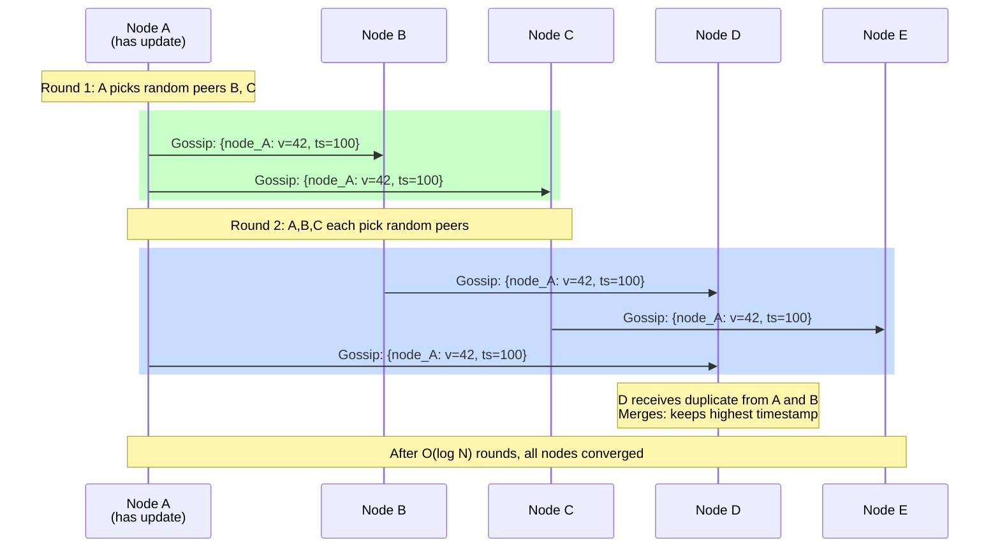
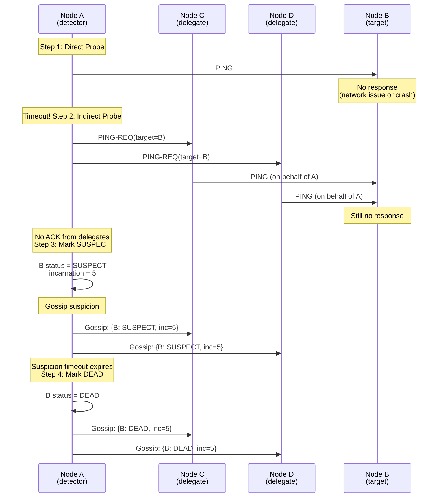
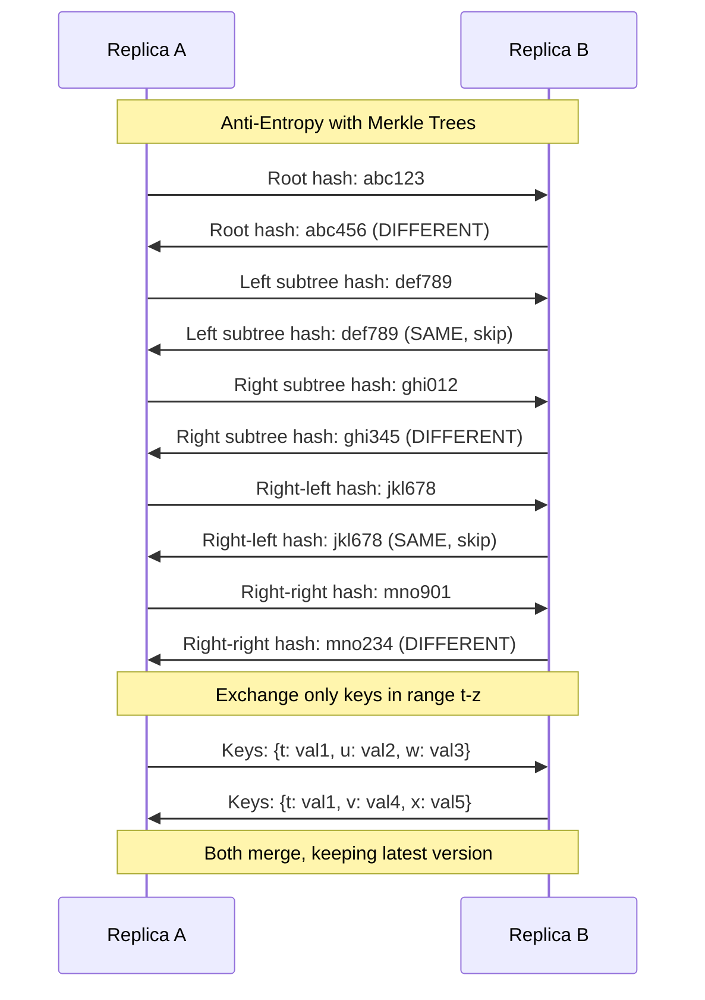
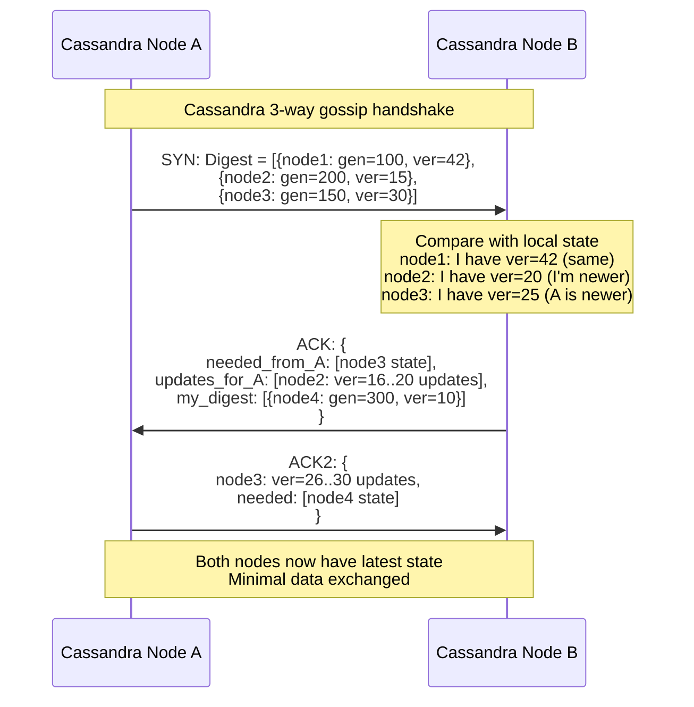

#system-design #pattern #distributed-systems #communication

# Gossip Protocol

## Intuition (30 sec)

Imagine a rumor spreading in a school cafeteria. One student tells 2-3 friends. Each of those friends tells 2-3 others. Within minutes, every student in the school knows the rumor — even though nobody broadcast it to everyone. No coordinator, no announcement system. Just peer-to-peer whispers that spread exponentially. That is exactly how gossip protocols work in distributed systems.

## Failure-First Scenario

> You have a cluster of 1000 nodes. A centralized heartbeat monitor tracks every node's health. The monitor itself crashes. Now nobody knows which nodes are alive. Requests route to dead nodes, timeouts cascade, the entire cluster degrades. With gossip, every node independently detects failures by exchanging state with random peers — no single point of failure. Even if 10% of nodes die simultaneously, the remaining 900 converge on the new membership within seconds.

## Working Knowledge (5 min)

### Core Concepts - Definitions First

**Gossip Protocol:**
- **Definition:** A peer-to-peer communication protocol where each node periodically selects random peers and exchanges state information, causing updates to propagate exponentially through the cluster until all nodes converge.
- **Purpose:** Failure detection, cluster membership management, state dissemination, and metadata propagation in large-scale distributed systems.
- **How it works:** Every T seconds, each node picks 1-3 random peers and exchanges local state. Received state is merged with local state. After O(log N) rounds, all N nodes have consistent information.

**Key Terms:**
- **Epidemic Protocol:** Synonym for gossip protocol; borrowed from epidemiology where infections spread person-to-person.
- **SWIM:** Scalable Weakly-consistent Infection-style Membership protocol; optimized gossip for failure detection.
- **Heartbeat:** Periodic signal a node sends to indicate it is alive; in gossip, heartbeats are piggybacked on gossip messages.
- **Suspicion:** Intermediate state before declaring a node dead; reduces false positives from transient network issues.
- **Fanout:** Number of random peers each node contacts per gossip round (typically 2-3).
- **Convergence Time:** Number of gossip rounds needed for all nodes to receive an update; O(log N) for N nodes.
- **Infection:** The process of a node receiving an update it did not previously have; analogous to catching a disease.
- **Susceptible/Infected/Removed (SIR):** Epidemiological model applied to gossip; susceptible nodes have not received the update, infected nodes are actively spreading it, removed nodes have finished spreading.

### Visual Model

```
GOSSIP ROUND 1:                    GOSSIP ROUND 2:
Node A has update [v=42]           Nodes A,B,C have update

     [A]──gossip──>[B]                  [A]──gossip──>[D]
      │                                  │
      └──gossip──>[C]              [B]──gossip──>[E]
                                        │
                                   [C]──gossip──>[F]

1 node infected                    Nodes with update: A,B,C,D,E,F
                                   (exponential spread)

GOSSIP ROUND 3:                    GOSSIP ROUND 4:
6 nodes spreading                  All nodes converged

[D]──>[G]   [E]──>[H]             ┌─────────────────────┐
[F]──>[I]   [A]──>[J]             │ All 10 nodes have    │
[B]──>[K]   [C]──>[L]             │ update [v=42]        │
                                   │                     │
                                   │ Convergence in      │
                                   │ O(log 10) ~ 4 rounds│
                                   └─────────────────────┘
```



### How It Works (step by step)

**Gossip Dissemination Algorithm:**

```
Every T seconds (gossip interval):
  1. Select `fanout` random peers from membership list
  2. For each selected peer:
     a. Send local state digest (or full state)
     b. Receive peer's state
     c. Merge received state with local state
        - For each entry: keep the one with higher version/timestamp
  3. After O(log N) rounds, all nodes converge
```

**Convergence Analysis:**
```
N = number of nodes
f = fanout (peers per round)

Round 0: 1 node has update
Round 1: 1 + f nodes have update
Round 2: (1+f) + (1+f)*f = (1+f)^2
Round k: (1+f)^k nodes have update

To reach all N nodes:
  (1+f)^k >= N
  k >= log(N) / log(1+f)

Example: N=1000, f=3
  k >= log(1000) / log(4) = 3 / 0.6 = 5 rounds

With T=1s gossip interval:
  Full convergence in ~5 seconds for 1000 nodes
```

### Gossip Styles

**Push Gossip:**
- Sender pushes its updates to a random peer
- Simple to implement
- Fast at spreading new updates
- Slows down as most nodes already have the update (wasted messages)

**Pull Gossip:**
- Sender asks a random peer for any updates it is missing
- Efficient when most nodes already have the update
- Slower to initially spread new updates
- Good for anti-entropy (repairing stale data)

**Push-Pull Gossip:**
- Both nodes exchange state in a single interaction
- Sender pushes updates AND pulls updates from peer
- Fastest convergence: combines benefits of both
- Used by most production systems (Cassandra, Consul)

```
PUSH:                    PULL:                    PUSH-PULL:
A──[my state]──>B        A──[what's new?]──>B     A──[my state]──>B
                         B──[updates]──>A          B──[my state]──>A
                                                   (both merge)

Convergence:             Convergence:              Convergence:
O(N log N)               O(N log N)                O(log N)
messages                 messages                  rounds
```

## Deep Dive

### SWIM Protocol (Scalable Weakly-consistent Infection-style Membership)

**SWIM:**
- **Definition:** A membership protocol that separates failure detection from state dissemination, using direct and indirect probing to detect failures and piggybacking membership updates on probe messages.
- **Purpose:** Scalable failure detection with O(1) message load per node per protocol period, regardless of cluster size.
- **Used by:** Uber Ringpop, HashiCorp Consul/Serf, Memberlist (Go library).

**SWIM vs Traditional Heartbeat:**

| Aspect | Traditional Heartbeat | SWIM |
|--------|----------------------|------|
| **Message complexity** | O(N^2) per period (all-to-all) | O(1) per node per period |
| **Failure detection** | Central monitor or all-to-all | Decentralized, peer-to-peer |
| **False positive rate** | High under network congestion | Low (indirect probing) |
| **Scalability** | Degrades with cluster size | Constant overhead per node |
| **Single point of failure** | Central monitor is SPOF | No SPOF |

**SWIM Failure Detection Lifecycle:**

```
┌──────────────────────────────────────────────────────────────────┐
│                    SWIM Failure Detection                         │
├──────────────────────────────────────────────────────────────────┤
│                                                                  │
│  Step 1: PING (Direct Probe)                                    │
│  ┌─────────┐     ping     ┌─────────┐                          │
│  │  Node A  │──────── ────>│  Node B  │                          │
│  │(detector)│<─────────────│ (target) │                          │
│  └─────────┘     ack      └─────────┘                          │
│                                                                  │
│  If ACK received → B is ALIVE. Done.                            │
│  If no ACK within timeout → Go to Step 2.                       │
│                                                                  │
│  Step 2: PING-REQ (Indirect Probe)                              │
│  ┌─────────┐  ping-req  ┌─────────┐   ping   ┌─────────┐      │
│  │  Node A  │──────────>│  Node C  │────────>│  Node B  │      │
│  │(detector)│           │(delegate)│<────────│ (target) │      │
│  │          │<──────────│          │   ack    └─────────┘      │
│  └─────────┘    ack     └─────────┘                            │
│                                                                  │
│  A asks k random nodes (C, D, E) to ping B on its behalf.      │
│  If ANY delegate gets ACK from B → B is ALIVE.                  │
│  If NO delegate gets ACK → Go to Step 3.                        │
│                                                                  │
│  Step 3: SUSPECT                                                │
│  ┌─────────┐                                                    │
│  │  Node A  │ marks B as SUSPECT                                │
│  └─────────┘                                                    │
│                                                                  │
│  B is not yet declared dead.                                    │
│  Suspicion is gossipped to all nodes.                           │
│  B can refute by sending an alive message with higher           │
│  incarnation number.                                            │
│  Wait for suspicion timeout.                                    │
│                                                                  │
│  Step 4: DEAD (Confirmed Failure)                               │
│  ┌─────────┐                                                    │
│  │  Node A  │ marks B as DEAD after suspicion timeout           │
│  └─────────┘                                                    │
│                                                                  │
│  Dead status gossipped to all nodes.                            │
│  B removed from membership list.                                │
│  If B was actually alive, it will re-join with new incarnation. │
│                                                                  │
└──────────────────────────────────────────────────────────────────┘
```



**Incarnation Numbers:**
- **Definition:** A monotonically increasing counter that a node increments to refute suspicion; higher incarnation overrides lower incarnation messages.
- **Purpose:** Allows a falsely suspected node to "come back" without ambiguity.
- **How it works:** If Node B is suspected with incarnation=5, B can send an alive message with incarnation=6 to refute the suspicion.

```
Timeline of incarnation numbers:

B joins (inc=0) → B suspected (inc=0) → B refutes (inc=1)
                                          ↓
                    Gossip: B ALIVE (inc=1) overrides B SUSPECT (inc=0)
                                          ↓
B suspected again (inc=1) → B refutes (inc=2)
                                          ↓
B network-partitioned → suspicion timeout → B declared DEAD (inc=2)
                                          ↓
B comes back → re-joins cluster → gets new membership (inc=0, fresh start)
```

### Anti-Entropy

**Anti-Entropy:**
- **Definition:** A background process that compares data between replicas and repairs any inconsistencies, ensuring eventual convergence to the same state.
- **Purpose:** Catches updates that gossip may have missed (dropped messages, node restarts, network partitions).
- **Difference from gossip:** Gossip spreads new updates; anti-entropy repairs old inconsistencies.

**Merkle Trees for Anti-Entropy:**

```
Replica A and Replica B need to find which keys differ

MERKLE TREE STRUCTURE:
                    ┌──────────────┐
                    │   Root Hash  │
                    │  H(H1 + H2) │
                    └──────┬───────┘
                           │
              ┌────────────┴────────────┐
              │                         │
       ┌──────┴──────┐          ┌──────┴──────┐
       │    H1       │          │    H2       │
       │ H(H3 + H4) │          │ H(H5 + H6) │
       └──────┬──────┘          └──────┬──────┘
              │                        │
       ┌──────┴──────┐          ┌──────┴──────┐
       │             │          │             │
   ┌───┴───┐   ┌───┴───┐  ┌───┴───┐   ┌───┴───┐
   │  H3   │   │  H4   │  │  H5   │   │  H6   │
   │key:a-f│   │key:g-m│  │key:n-s│   │key:t-z│
   └───────┘   └───────┘  └───────┘   └───────┘

COMPARISON PROCESS:
Step 1: Compare root hashes
  Replica A root: abc123
  Replica B root: abc456   ← DIFFERENT (some data diverges)

Step 2: Compare child hashes
  A.H1 = def789    B.H1 = def789  ← SAME (skip this subtree)
  A.H2 = ghi012    B.H2 = ghi345  ← DIFFERENT (dig deeper)

Step 3: Compare H2's children
  A.H5 = jkl678    B.H5 = jkl678  ← SAME (skip)
  A.H6 = mno901    B.H6 = mno234  ← DIFFERENT (keys t-z differ)

Step 4: Exchange only keys t-z between replicas
  Instead of comparing ALL keys, only compare the divergent range

EFFICIENCY:
  Without Merkle tree: Compare all keys → O(N) data transfer
  With Merkle tree: Compare hashes top-down → O(log N) comparisons
  Only transfer divergent keys → minimal data movement
```



**In Production:** Cassandra (`nodetool repair`, run weekly), DynamoDB (internal), Riak (continuous AAE).

### Real-World Usage

#### Uber Ringpop: Consistent Hashing Ring via SWIM

```
┌──────────────────────────────────────────────────────┐
│                Uber Ringpop                          │
├──────────────────────────────────────────────────────┤
│                                                      │
│  Problem:                                            │
│  Route requests to correct shard owner in a          │
│  consistent hashing ring. Need to maintain           │
│  ring membership across thousands of nodes.          │
│                                                      │
│  Solution:                                           │
│  Use SWIM gossip to maintain membership list.        │
│  Each node knows the full ring and routes            │
│  requests directly to the owner.                     │
│                                                      │
│  Architecture:                                       │
│  ┌─────────┐  SWIM gossip  ┌─────────┐             │
│  │ Node A  │<──────────────>│ Node B  │             │
│  │ Ring:   │                │ Ring:   │             │
│  │ [A,B,C] │                │ [A,B,C] │             │
│  └────┬────┘                └────┬────┘             │
│       │        SWIM gossip       │                   │
│       └────────────┬─────────────┘                   │
│                    │                                 │
│              ┌─────▼─────┐                           │
│              │  Node C   │                           │
│              │  Ring:    │                           │
│              │  [A,B,C]  │                           │
│              └───────────┘                           │
│                                                      │
│  When Node D joins:                                  │
│  1. D contacts any existing node via SWIM            │
│  2. SWIM gossips D's membership to all nodes         │
│  3. All nodes update ring: [A,B,C,D]                │
│  4. Consistent hashing redistributes keys            │
│                                                      │
│  When Node B fails:                                  │
│  1. SWIM detects B failure (ping → ping-req → dead) │
│  2. Gossips B's removal to all nodes                 │
│  3. All nodes update ring: [A,C,D]                  │
│  4. B's keys redistributed to next node on ring     │
│                                                      │
│  Convergence: ~2 seconds for 1000-node cluster      │
│                                                      │
└──────────────────────────────────────────────────────┘
```

#### AWS DynamoDB: Membership and Failure Detection

```
┌──────────────────────────────────────────────────────┐
│             DynamoDB Gossip Usage                     │
├──────────────────────────────────────────────────────┤
│                                                      │
│  Uses gossip for:                                    │
│  1. Node membership (who is in the cluster)          │
│  2. Failure detection (who is dead)                  │
│  3. Partition map dissemination                      │
│  4. Token range ownership propagation                │
│                                                      │
│  From the Dynamo paper (2007):                       │
│  - Each node contacts random peer every second       │
│  - Exchanges membership state (heartbeat counters)   │
│  - Detects failures via missing heartbeat increments │
│  - Uses anti-entropy with Merkle trees for data      │
│    synchronization between replicas                  │
│                                                      │
│  Key insight: Separates failure detection (gossip)   │
│  from data replication (quorum reads/writes)         │
│                                                      │
└──────────────────────────────────────────────────────┘
```

#### Apache Cassandra: Cluster Membership and Schema Propagation

```
┌──────────────────────────────────────────────────────┐
│          Cassandra Gossip Protocol                    │
├──────────────────────────────────────────────────────┤
│                                                      │
│  Gossip interval: 1 second                           │
│  Fanout: 1-3 random peers per round                  │
│                                                      │
│  State exchanged via gossip:                         │
│  ┌─────────────────────────────────────────┐        │
│  │ EndpointState for each node:            │        │
│  │   HeartBeatState:                       │        │
│  │     generation: 1708886400 (epoch)      │        │
│  │     version: 42 (heartbeat counter)     │        │
│  │                                         │        │
│  │   ApplicationState:                     │        │
│  │     STATUS: NORMAL                      │        │
│  │     LOAD: 150.5 GB                      │        │
│  │     SCHEMA: uuid-of-schema-version      │        │
│  │     DC: us-east-1                       │        │
│  │     RACK: rack-1                        │        │
│  │     TOKENS: [-9223372036854775808, ...] │        │
│  │     HOST_ID: uuid-of-node              │        │
│  └─────────────────────────────────────────┘        │
│                                                      │
│  Gossip message flow:                                │
│  1. SYN: Send digest (node, generation, version)    │
│  2. ACK: Respond with missing state + own digest    │
│  3. ACK2: Send remaining missing state              │
│                                                      │
│  Three-way handshake minimizes data transfer:        │
│  Only exchange state that the other node is missing  │
│                                                      │
│  Failure detection:                                  │
│  - Uses Phi Accrual Failure Detector                │
│  - Not binary alive/dead; outputs suspicion level   │
│  - Phi > 8: node considered dead (configurable)     │
│  - Adapts to network conditions automatically       │
│                                                      │
└──────────────────────────────────────────────────────┘
```



#### HashiCorp Consul/Serf: Cluster Management via SWIM

```
Consul uses Serf (SWIM-based Go library) for:
1. Cluster membership management
2. Failure detection across datacenters
3. Event broadcasting (custom user events)

Serf configuration:
  gossip_interval: 200ms
  probe_interval: 1s
  probe_timeout: 500ms
  suspicion_mult: 4
  retransmit_mult: 4
```

#### Redis Cluster: Node Communication

```
Redis Cluster gossip (Cluster Bus, port = data_port + 10000):
- Each node pings random node every 1 second
- PING/PONG contains: node_id, epoch, flags, slot bitmap, gossip section
- Failure: PFAIL (possible fail) → gossipped → majority agree → FAIL (broadcast)
```

### Implementation Considerations

**Fanout Factor:**

```
Fanout = number of random peers contacted per gossip round

Trade-offs:
┌─────────┬──────────────────┬──────────────┬─────────────────┐
│ Fanout  │ Convergence Time │ Bandwidth    │ Use Case        │
├─────────┼──────────────────┼──────────────┼─────────────────┤
│ 1       │ O(N log N)       │ Lowest       │ Low-priority    │
│         │ (slow)           │              │ background sync │
│ 2       │ O(log N)         │ Moderate     │ Most systems    │
│ 3       │ O(log N)         │ Higher       │ Fast convergence│
│         │ (fastest)        │              │ needed          │
│ N       │ O(1)             │ O(N^2)       │ Never (flood)   │
│         │ (broadcast)      │ (too high)   │                 │
└─────────┴──────────────────┴──────────────┴─────────────────┘

Recommendation: fanout = 2 or 3 for most systems
  - Cassandra uses 1-3
  - Consul/Serf uses 3
  - Redis Cluster uses 1 (but pings more frequently)
```

**Convergence Time:**

```
For N nodes with fanout f, push-pull gossip:

Rounds to converge: O(log_f(N))

Examples:
┌───────┬───────────┬────────────┬──────────────────┐
│ Nodes │ Fanout=2  │ Fanout=3   │ With T=1s        │
├───────┼───────────┼────────────┼──────────────────┤
│ 10    │ 4 rounds  │ 3 rounds   │ 3-4 seconds      │
│ 100   │ 7 rounds  │ 5 rounds   │ 5-7 seconds      │
│ 1000  │ 10 rounds │ 7 rounds   │ 7-10 seconds     │
│ 10000 │ 14 rounds │ 9 rounds   │ 9-14 seconds     │
└───────┴───────────┴────────────┴──────────────────┘

Key insight: Convergence is LOGARITHMIC
  Doubling cluster size adds only 1 more round
  1000 → 2000 nodes: +1 round (~1 second slower)
```

**Bandwidth:**

```
Message complexity:
  Per node per round: O(fanout) = O(1)
  Cluster total per round: O(N * fanout) = O(N)
  Total until convergence: O(N * log N)

Cassandra example (1000-node cluster, 1s interval, fanout=3):
  Per node: ~3 KB/s (digests), peak ~150 KB/s (full state)
  Cluster total: ~6 MB/s steady state (negligible vs data traffic)
```

### Implementation Pattern: Gossip State Merge

```python
# Core merge logic - the heart of any gossip implementation

def merge_state(local_state, remote_state):
    """
    Merge remote state with local state

    Rules:
    1. Higher incarnation always wins
    2. Same incarnation: ALIVE > SUSPECT > DEAD
    3. Higher heartbeat indicates more recent state
    """
    for node_id, remote in remote_state.items():
        if node_id not in local_state:
            local_state[node_id] = remote  # New node discovered
            continue

        local = local_state[node_id]

        # Higher incarnation always wins
        if remote.incarnation > local.incarnation:
            local_state[node_id] = remote
        elif remote.incarnation == local.incarnation:
            # Same incarnation: ALIVE beats SUSPECT
            if remote.status == "ALIVE" and local.status == "SUSPECT":
                local_state[node_id] = remote
            elif remote.heartbeat > local.heartbeat:
                local_state[node_id] = remote

    return local_state

# Gossip loop pseudocode
def gossip_loop(self):
    while running:
        self.heartbeat += 1
        peers = random.sample(alive_members, min(fanout, len(alive_members)))
        for peer in peers:
            remote_state = send_receive(peer, self.local_state)
            self.local_state = merge_state(self.local_state, remote_state)
        check_failures()  # suspect nodes with stale heartbeats
        sleep(gossip_interval)
```

## Production Considerations

### Tuning Gossip Interval

```
┌─────────────────────────────────────────────────────────────┐
│           Gossip Interval Tuning Guide                       │
├─────────────────────────────────────────────────────────────┤
│                                                             │
│  Gossip Interval = time between gossip rounds per node      │
│                                                             │
│  ┌──────────┬──────────────────┬────────────────────────┐   │
│  │ Interval │ Pros             │ Cons                   │   │
│  ├──────────┼──────────────────┼────────────────────────┤   │
│  │ 100ms    │ Fast convergence │ High CPU/bandwidth     │   │
│  │          │ Quick detection  │ Excessive in large     │   │
│  │          │                  │ clusters               │   │
│  ├──────────┼──────────────────┼────────────────────────┤   │
│  │ 200ms    │ Good balance     │ Moderate overhead      │   │
│  │          │ Used by Consul   │                        │   │
│  ├──────────┼──────────────────┼────────────────────────┤   │
│  │ 1s       │ Low overhead     │ Slower convergence     │   │
│  │          │ Used by Cassandra│ 7-10s for 1000 nodes   │   │
│  │          │ and Redis        │                        │   │
│  ├──────────┼──────────────────┼────────────────────────┤   │
│  │ 5s       │ Very low overhead│ Slow failure detection  │   │
│  │          │ Background sync  │ 30-50s convergence     │   │
│  └──────────┴──────────────────┴────────────────────────┘   │
│                                                             │
│  Rule of thumb:                                             │
│  - Failure detection critical: 200ms (Consul, Serf)        │
│  - General membership: 1s (Cassandra, Redis)               │
│  - Background sync: 5-10s (anti-entropy only)              │
│                                                             │
│  Formula: Detection time = gossip_interval * log(N) * 3    │
│    Where 3 accounts for suspicion + confirmation            │
│                                                             │
│  Example: 1s interval, 1000 nodes                          │
│    Detection time = 1 * 10 * 3 = ~30 seconds               │
│                                                             │
└─────────────────────────────────────────────────────────────┘
```

### Network Partition Behavior

```
SCENARIO: Network partition splits cluster in half

Before partition:
  All 10 nodes see each other
  Full membership: [A, B, C, D, E, F, G, H, I, J]

During partition:
  ┌─────────────────┐     ┌─────────────────┐
  │  Partition 1     │  X  │  Partition 2     │
  │  [A, B, C, D, E]│     │  [F, G, H, I, J]│
  │                  │     │                  │
  │  A gossips B,C   │     │  F gossips G,H   │
  │  B gossips A,D   │     │  G gossips I,J   │
  │  ...             │     │  ...             │
  │                  │     │                  │
  │  After timeout:  │     │  After timeout:  │
  │  F,G,H,I,J →    │     │  A,B,C,D,E →    │
  │    SUSPECTED     │     │    SUSPECTED     │
  │    then DEAD     │     │    then DEAD     │
  │                  │     │                  │
  │  P1 membership:  │     │  P2 membership:  │
  │  [A,B,C,D,E]    │     │  [F,G,H,I,J]    │
  └─────────────────┘     └─────────────────┘

After partition heals:
  A contacts F (gossip picks random peer)
  A: "F is alive! incarnation=5"
  F: "A is alive! incarnation=3"

  This update gossips through both partitions
  Within O(log N) rounds, all nodes converge:
  Full membership: [A, B, C, D, E, F, G, H, I, J]

Key insight: Gossip is SELF-HEALING
  No manual intervention needed to restore membership
  Nodes automatically re-discover each other
```

### False Failure Detection and Suspicion Mechanisms

```
WHY FALSE POSITIVES HAPPEN:

1. Network congestion:
   A ─PING─> B    (ping delayed 2s, timeout is 1s)
   A: "B is dead!" (false positive)
   B: "I'm fine!"

2. GC pauses:
   B running garbage collection for 3s
   A's ping times out
   A: "B is dead!" (false positive)
   B: GC finishes, resumes

3. CPU saturation:
   B processing heavy query, can't respond to ping
   A: "B is dead!" (false positive)

HOW SUSPICION REDUCES FALSE POSITIVES:

Without suspicion (binary alive/dead):
  A pings B → timeout → B is DEAD → remove from cluster
  False positive rate: HIGH (any transient failure = death)

With suspicion (SWIM model):
  A pings B → timeout → PING-REQ via C,D,E → still no response
  → B is SUSPECT (not dead yet)
  → Gossip suspicion to cluster
  → B can refute with higher incarnation
  → Wait suspicion_timeout (5-10s)
  → If B never refutes → B is DEAD

  False positive rate: LOW
  - Indirect probing (ping-req) catches network asymmetry
  - Suspicion period gives B time to recover (GC, CPU)
  - Incarnation refutation lets B prove it's alive

Phi Accrual Failure Detector (used by Cassandra):
  Instead of binary threshold, outputs suspicion LEVEL (phi)
  - phi = 1: normal heartbeat delay
  - phi = 5: unusual delay
  - phi = 8: likely dead (default threshold)
  - phi = 12: almost certainly dead

  Adapts to network conditions:
  - High-latency network: phi threshold adjusts upward
  - Stable network: phi threshold remains normal
  - Result: fewer false positives across varied environments
```

## Monitoring

### Key Metrics

```
┌─────────────────────────────────────────────────────────────┐
│         GOSSIP PROTOCOL MONITORING DASHBOARD                 │
├─────────────────────────────────────────────────────────────┤
│                                                             │
│  Convergence Time:                                          │
│  Definition: Time from first gossip of an update until      │
│              all nodes have received it                      │
│  Target: < 10 seconds for 1000-node cluster                │
│  Alert: > 30 seconds (gossip not propagating)              │
│  Causes of high convergence: network issues, high fanout    │
│          needed, gossip interval too long                    │
│                                                             │
│  Message Overhead:                                          │
│  Definition: Bandwidth consumed by gossip messages per node │
│  Target: < 100 KB/s per node (steady state)                │
│  Alert: > 1 MB/s per node (message storm)                  │
│  Causes of high overhead: too frequent gossip, large state, │
│          too many nodes joining/leaving                      │
│                                                             │
│  False Positive Rate:                                       │
│  Definition: Percentage of alive nodes incorrectly marked   │
│              as dead                                         │
│  Target: < 0.1% (1 in 1000 detections is wrong)           │
│  Alert: > 1% (suspicion tuning needed)                     │
│  Causes: suspicion timeout too short, network congestion,   │
│          GC pauses exceeding probe timeout                  │
│                                                             │
│  Membership Consistency:                                    │
│  Definition: Percentage of nodes that agree on the same     │
│              membership list                                 │
│  Target: 100% (eventually)                                  │
│  Alert: < 95% after 60 seconds                              │
│  Causes: network partition, gossip not reaching all nodes   │
│                                                             │
│  Suspicion Count:                                           │
│  Definition: Number of nodes currently in SUSPECT state     │
│  Target: 0 (no nodes under suspicion)                       │
│  Alert: > 5% of cluster in SUSPECT state                    │
│  Causes: network degradation, overloaded nodes              │
│                                                             │
│  Gossip Round Duration:                                     │
│  Definition: Time to complete one gossip round (send +      │
│              receive from fanout peers)                      │
│  Target: < gossip_interval / 2                              │
│  Alert: > gossip_interval (gossip falling behind)           │
│  Causes: large state payloads, slow serialization           │
│                                                             │
└─────────────────────────────────────────────────────────────┘
```

### Alerting Rules

```yaml
groups:
- name: gossip_protocol
  rules:
    - alert: GossipConvergenceSlow
      expr: histogram_quantile(0.95, gossip_convergence_seconds_bucket) > 30
      for: 5m
      labels:
        severity: warning
      annotations:
        summary: "Gossip convergence exceeding 30 seconds"

    - alert: GossipHighSuspicionRate
      expr: gossip_members{status="suspect"} / ignoring(status) sum(gossip_members) > 0.05
      for: 2m
      labels:
        severity: warning
      annotations:
        summary: "More than 5% of cluster under suspicion"

    - alert: GossipFalsePositives
      expr: rate(gossip_false_positives_total[1h]) > 5
      for: 10m
      labels:
        severity: warning
      annotations:
        summary: "High false positive rate - tune suspicion timeout"

    - alert: GossipMembershipDivergence
      expr: stddev(gossip_members{status="alive"}) > 2
      for: 60s
      labels:
        severity: critical
      annotations:
        summary: "Nodes disagree on cluster membership - possible partition"
```

## Interview Prep

### When to Use Gossip vs Centralized Coordination (ZooKeeper)

```
USE GOSSIP WHEN:
├─ Cluster is large (100+ nodes)
│   Gossip scales O(N), centralized is bottleneck
├─ Eventual consistency is acceptable
│   Membership can take a few seconds to converge
├─ No single point of failure is required
│   Every node is equal, no coordinator
├─ Failure detection at scale
│   SWIM: O(1) per node vs heartbeat monitor: O(N)
└─ State dissemination (cluster metadata)
    Propagate config changes, load info

USE CENTRALIZED (ZooKeeper/etcd) WHEN:
├─ Strong consistency is required
│   Exactly one leader, no ambiguity
├─ Cluster is small (< 20 nodes)
│   Centralized coordination is simpler
├─ Need atomic operations
│   Distributed locks, barriers, queues
├─ Need linearizable reads
│   Read-your-own-writes guarantee
└─ Configuration management
    Centralized source of truth

COMBINE BOTH (common pattern):
  Gossip for: membership, failure detection, metadata
  Centralized for: leader election, locks, config
  Example: Kafka uses gossip (metadata propagation) +
           ZooKeeper (controller election)
```

### Trade-offs

```
PROS:
+ No single point of failure (fully decentralized)
+ Scales to thousands of nodes (O(log N) convergence)
+ Self-healing after network partitions
+ Simple to implement (random peer selection)
+ Constant per-node message overhead O(1)
+ Tolerates high node churn (joins/leaves)

CONS:
- Eventually consistent (not immediate)
- Convergence takes O(log N) rounds
- Bandwidth overhead (all nodes gossip continuously)
- Difficult to debug (non-deterministic propagation)
- False positives in failure detection
- State must be mergeable (needs conflict resolution)
- Cannot guarantee order of delivery
```

### Interview Question Templates

**Q: Explain how gossip protocols work and when you would use them.**

**Answer Structure:**

1. **Define (10 sec):**
   "A gossip protocol is a peer-to-peer communication method where each node periodically exchanges state with randomly selected peers. Like rumors in a school, information spreads exponentially — after O(log N) rounds, all N nodes have the update."

2. **Explain Mechanism (15 sec):**
   "Every second, each node picks 2-3 random peers and does a push-pull exchange: send your state, receive theirs, merge by keeping the latest version. No coordinator needed. For failure detection, systems like SWIM use ping, indirect ping-req, and suspicion phases to reduce false positives."

3. **State When (10 sec):**
   "Use gossip for large clusters (100+ nodes) where eventual consistency is acceptable. Examples: Cassandra uses gossip for cluster membership and schema propagation, Consul/Serf uses SWIM for failure detection, DynamoDB uses gossip for membership."

4. **Trade-off (10 sec):**
   "Pro: No single point of failure, scales logarithmically. Con: Eventually consistent, takes seconds to converge, harder to debug than centralized approaches. For strong consistency needs, pair gossip with consensus (ZooKeeper, etcd)."

**Q: How does SWIM improve on traditional heartbeat-based failure detection?**

**Answer Structure:**

1. **Problem (10 sec):**
   "Traditional heartbeat monitoring uses a central monitor or all-to-all heartbeats. Central monitor is a SPOF. All-to-all heartbeats generate O(N^2) messages per round."

2. **SWIM Solution (15 sec):**
   "SWIM uses three-phase failure detection: direct ping, indirect ping-req through random delegates, then suspicion. Each node only probes one random peer per round — O(1) message load regardless of cluster size. Suspected nodes can refute with higher incarnation numbers."

3. **Result (10 sec):**
   "SWIM achieves O(N) total messages per round for the entire cluster vs O(N^2) for all-to-all. False positive rate is lower because indirect probing catches network asymmetry, and suspicion gives nodes time to recover from transient failures."

**Q: How does Cassandra use gossip?**

**Answer Structure:**

1. **Purpose (5 sec):**
   "Cassandra uses gossip for cluster membership, failure detection, and propagating node metadata like token ownership, load, schema version, and datacenter/rack info."

2. **Mechanism (15 sec):**
   "Every second, each Cassandra node picks 1-3 random peers and performs a three-way handshake: SYN (send digests), ACK (exchange missing state), ACK2 (send remaining). This minimizes data transfer by only exchanging what the other node is missing. Cassandra uses a Phi Accrual Failure Detector instead of binary alive/dead — it outputs a suspicion level that adapts to network conditions."

3. **Anti-entropy (10 sec):**
   "For data repair, Cassandra uses anti-entropy with Merkle trees. Replicas compare hash trees top-down, identifying only the divergent key ranges, then exchange just those keys. This runs as background repair or can be triggered manually with nodetool repair."

### Cross-References for Interview Context

- **Gossip + Consistent Hashing:** Gossip maintains the membership ring. When gossip detects a failure, the ring updates and keys redistribute. See: [[03_design_patterns/consistent_hashing]]
- **Gossip + Leader Election:** Use gossip for membership (data plane), consensus for leader election (control plane). See: [[03_design_patterns/leader_election]]
- **Gossip + Replication:** Gossip propagates replica ownership; anti-entropy repairs inconsistencies. See: [[03_design_patterns/replication]]
- **Gossip + CAP:** Gossip is AP (Available + Partition-tolerant); sacrifices strong Consistency for availability. See: [[01_fundamentals/cap_theorem]]

## Common Pitfalls

| Pitfall | Why It's Wrong | Solution |
|---------|----------------|----------|
| Using gossip for strong consistency | Gossip is eventually consistent; cannot guarantee all nodes agree at same instant | Use consensus (Raft/Paxos) for strong consistency needs |
| Gossip interval too short | High CPU/bandwidth overhead, especially in large clusters | Start at 1s; decrease only if convergence too slow |
| Gossip interval too long | Slow failure detection, stale membership | Use 200ms-1s for failure-critical systems |
| No suspicion mechanism | Binary alive/dead causes high false positive rate | Implement SWIM suspicion with incarnation numbers |
| Large gossip payloads | Bandwidth explodes with cluster size | Use digests first, exchange only missing state |
| Not handling network partitions | Split membership after partition heals | Ensure gossip automatically re-discovers after heal |
| Ignoring convergence monitoring | Cannot tell if gossip is propagating correctly | Track convergence time, alert on slow propagation |
| Same fanout for all cluster sizes | Fanout 3 wastes bandwidth in 10-node cluster | Adjust fanout: min(fanout, N/2) |

## Quick Reference

| Aspect | Recommendation |
|--------|---------------|
| **Gossip interval** | 200ms (Consul) to 1s (Cassandra) |
| **Fanout** | 2-3 peers per round |
| **Convergence time** | O(log N) rounds; ~5s for 1000 nodes at 1s interval |
| **Suspicion timeout** | 3-5x gossip interval |
| **Message size** | < 1 KB (digests), < 50 KB (full state) |
| **Failure detection** | SWIM: ping → ping-req → suspect → dead |
| **Anti-entropy** | Merkle trees, run weekly (Cassandra nodetool repair) |
| **Bandwidth per node** | O(fanout * message_size) per round; typically < 100 KB/s |
| **False positive alert** | > 1% false detections |
| **Membership divergence** | Alert if < 95% nodes agree after 60s |

## Links

- [[03_design_patterns/consistent_hashing]] — Gossip maintains the membership ring that consistent hashing uses
- [[03_design_patterns/leader_election]] — Use gossip for membership, consensus for leader election
- [[03_design_patterns/replication]] — Anti-entropy gossip repairs replica inconsistencies
- [[01_fundamentals/cap_theorem]] — Gossip is AP (eventual consistency, high availability)
- [[03_design_patterns/circuit_breaker]] — Combine with gossip failure detection for client-side resilience
- [[02_building_blocks/distributed_coordination]] — Gossip vs centralized coordination trade-offs
