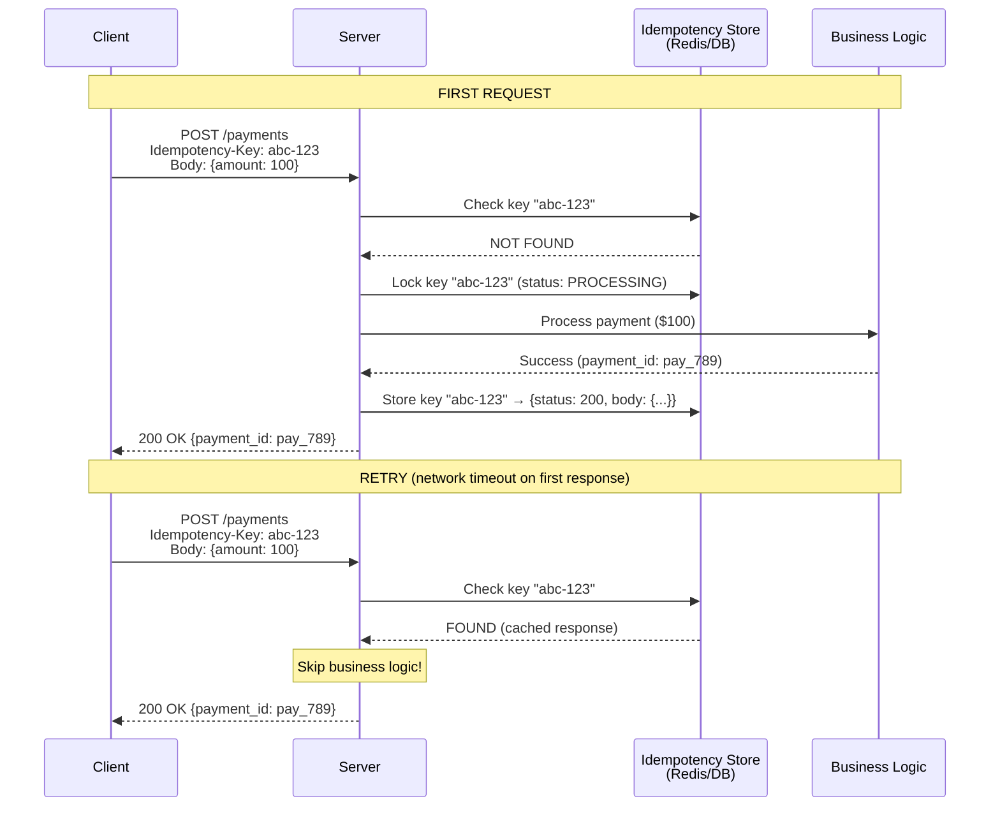
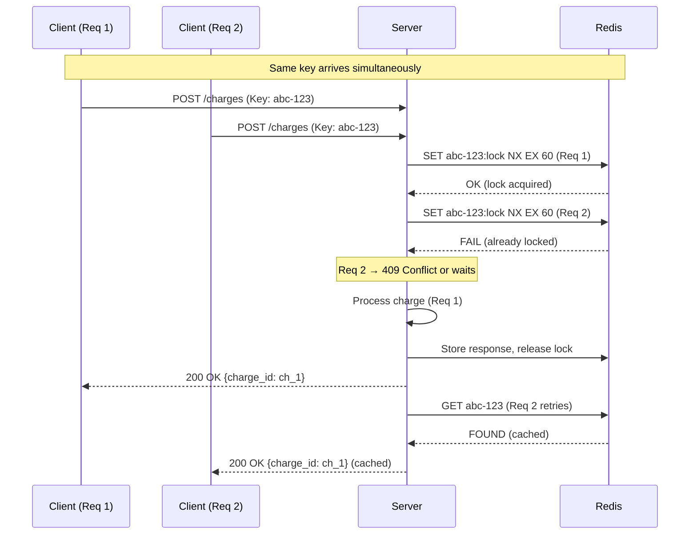

#system-design #pattern #reliability #api-design

# Idempotency

## Intuition (30 sec)

Pressing an elevator button 5 times doesn't call 5 elevators. The operation produces the same result regardless of how many times it's executed. In distributed systems, idempotency means retrying a request is always safe — the system converges to the same state whether the operation runs once, twice, or a hundred times.

## Failure-First Scenario

> User clicks "Pay $100" button. Network timeout. User clicks again. Without idempotency, they get charged $200. With idempotency, the server recognizes the duplicate request and returns the cached response from the first successful charge.
>
> Real incident: A payment gateway processed duplicate charges during a network partition, resulting in 12,000 customers double-charged over 45 minutes. Root cause: POST endpoint for payments had no idempotency mechanism. Result: $1.8M in emergency refunds, 3-day customer support backlog, and loss of merchant trust.

---

## Working Knowledge (5 min)

### Core Concepts - Definitions First

**Idempotency:**
- **Definition:** An operation that produces the same result whether executed once or multiple times with the same input. Mathematically: f(f(x)) = f(x).
- **Purpose:** Safe retries, exactly-once semantics in distributed systems, protection against duplicate processing.
- **How it works:** The server identifies duplicate requests (via idempotency key, request hash, or natural business key) and returns the stored result instead of re-executing the operation.

**Key Terms:**
- **Idempotency Key:** A unique identifier (typically UUID) sent by the client in a request header, used by the server to detect and deduplicate repeat requests.
- **Exactly-Once Semantics:** The guarantee that an operation is processed exactly one time, even in the presence of retries and failures. Achieved by combining at-least-once delivery with idempotent processing.
- **At-Least-Once Delivery:** A delivery guarantee where a message is delivered one or more times. Retries ensure no message is lost, but duplicates are possible.
- **Deduplication:** The process of detecting and discarding duplicate requests or messages, ensuring each unique operation is processed only once.
- **Idempotent vs Safe:** A safe operation causes no side effects (GET). An idempotent operation may cause side effects on the first call but produces the same result on subsequent calls (PUT, DELETE). All safe operations are idempotent, but not all idempotent operations are safe.

### HTTP Methods and Idempotency

```
HTTP Method Idempotency Matrix:
════════════════════════════════════════════════════════════════

Method    │ Safe? │ Idempotent? │ Why?
──────────┼───────┼─────────────┼─────────────────────────────
GET       │  Yes  │    Yes      │ Read-only, no state change
HEAD      │  Yes  │    Yes      │ Same as GET but no body
OPTIONS   │  Yes  │    Yes      │ Metadata only
PUT       │  No   │    Yes      │ Replaces entire resource
                                │  Always results in same state
DELETE    │  No   │    Yes      │ Deleting already-deleted
                                │  resource returns same result
POST      │  No   │    NO       │ Creates new resource each time
                                │  NEEDS explicit idempotency
PATCH     │  No   │  Depends    │ Absolute: idempotent
                                │  PATCH {name: "Alice"} ← same
                                │  Relative: NOT idempotent
                                │  PATCH {balance: +100} ← adds

Key Insight:
────────────
POST is the dangerous method. Every payment, order creation,
and write operation that uses POST needs an idempotency strategy.
```

### Visual Model



```
ASCII Flow:
═══════════

Client                    Server                    Idempotency Store
  │                         │                              │
  │── POST /pay ──────────▶ │                              │
  │   Key: abc-123          │── Check key ───────────────▶ │
  │   Amount: $100          │◀── NOT FOUND ───────────────│
  │                         │── Lock key (PROCESSING) ──▶ │
  │                         │── Process Payment ──▶ $      │
  │                         │── Store response ──────────▶ │
  │◀── 200 OK ─────────────│                              │
  │                         │                              │
  │── POST /pay ──────────▶ │   (RETRY)                   │
  │   Key: abc-123          │── Check key ───────────────▶ │
  │                         │◀── FOUND (cached) ─────────│
  │◀── 200 OK (cached) ────│   (No processing!)          │
```

### Implementation Strategies

1. **Client-generated idempotency key** (Stripe approach: UUID in header)
   - Client generates UUID, sends in `Idempotency-Key` header
   - Server stores key → response mapping in Redis with 24h TTL
   - Industry standard: Stripe, PayPal, Square

2. **Server-side deduplication** (hash of request body)
   - Server computes SHA-256(method + path + body + user_id)
   - No client changes needed, fully transparent
   - Cannot distinguish intentional duplicates from retries

3. **Database unique constraints** (natural idempotency)
   - `INSERT INTO orders (...) ON CONFLICT DO NOTHING`
   - Database enforces correctness, no extra infrastructure
   - Only works when natural business keys exist

4. **Idempotency table** (store key → response mapping)
   - Dedicated table: `idempotency_keys(key, status, request_hash, response, expires_at)`
   - Full control, can detect parameter mismatches
   - Needs TTL cleanup job

---

## Deep Dive

### Stripe's Idempotency Implementation

```
Stripe Idempotency Flow:
═══════════════════════

1. Client sends: POST /v1/charges
   Header: Idempotency-Key: Jk8sL2nP9qRt

2. Server checks Redis: GET idempotency:Jk8sL2nP9qRt → NOT FOUND

3. Acquire distributed lock:
   SET idempotency:Jk8sL2nP9qRt:lock <owner> NX EX 60

4. Process charge → ch_1A2B3C

5. Store in Redis (24h TTL):
   SET idempotency:Jk8sL2nP9qRt
       {"status": 200, "body": {...}, "params_hash": "a1b2c3..."}
       EX 86400

6. Release lock, return response

On retry: key found → return stored response (no reprocessing)

Parameter mismatch detection:
  Same key + different body → 422 Unprocessable Entity
  "Idempotency key already used with different parameters"
  Server stores hash of original params, compares on retry
```

**Race Condition Handling:**



### Database-Level Idempotency

```sql
-- Strategy 1: INSERT with ON CONFLICT DO NOTHING
CREATE TABLE payments (
    payment_id      UUID PRIMARY KEY DEFAULT gen_random_uuid(),
    idempotency_key VARCHAR(255) UNIQUE NOT NULL,
    user_id         BIGINT NOT NULL,
    amount          DECIMAL(10,2) NOT NULL,
    status          VARCHAR(20) DEFAULT 'PENDING',
    created_at      TIMESTAMP DEFAULT NOW()
);

-- First call → inserts row
INSERT INTO payments (idempotency_key, user_id, amount)
VALUES ('key_abc123', 42, 100.00)
ON CONFLICT (idempotency_key) DO NOTHING;

-- Retry → conflict detected, no duplicate created

-- Strategy 2: Unique constraints on business keys
CREATE UNIQUE INDEX idx_one_order_per_cart
  ON orders(user_id, cart_id)
  WHERE status != 'CANCELLED';

-- Strategy 3: Optimistic locking with version numbers
UPDATE accounts
SET balance = balance - 100.00, version = version + 1
WHERE account_id = 42 AND version = 5;
-- 0 rows affected → concurrent modification → retry
```

### Message Queue Idempotency

```
Delivery Guarantees:
══════════════════════

At-Most-Once:   Send once, no retry → may LOSE messages
At-Least-Once:  Retry until ACK → may DUPLICATE messages
Exactly-Once:   At-Least-Once + Idempotent Consumer
```

**Kafka: Idempotent Producer (PID + Sequence Number):**

```
Each producer gets unique Producer ID (PID)
Each message gets monotonically increasing sequence number
Broker deduplicates using (PID, Partition, SeqNum)

┌──────────────┐         ┌──────────────┐
│   Producer   │         │    Broker    │
│   PID: 42    │         │              │
│              │         │ Dedup Store: │
│ Msg(seq=1) ──┼────────▶│  last_seq: 0 │ → Accept
│ Msg(seq=2) ──┼────────▶│  last_seq: 1 │ → Accept
│ Msg(seq=2) ──┼────────▶│  last_seq: 2 │ → REJECT (dup)
│  (retry)     │         │              │
└──────────────┘         └──────────────┘

Config: enable.idempotence=true, acks=all
Limitation: Only within single producer session
```

**SQS FIFO: Deduplication ID:**

```
AWS SQS FIFO Queues:
═════════════════════

Method 1: Explicit Deduplication ID
  aws sqs send-message \
    --queue-url .../MyQueue.fifo \
    --message-body '{"orderId": "order_42"}' \
    --message-deduplication-id "order_42_payment" \
    --message-group-id "order_42"

  Same deduplication ID within 5 min → silently dropped

Method 2: Content-Based Deduplication
  Enable: ContentBasedDeduplication = true
  SQS computes SHA-256 of body automatically

  ┌────────────────────────┬───────────────────────┐
  │ Explicit Dedup ID      │ Content-Based          │
  ├────────────────────────┼───────────────────────┤
  │ Full control           │ Automatic              │
  │ Different body, same   │ Must be exact same     │
  │ ID → deduplicated      │ body to deduplicate    │
  │ Better for retries     │ Simpler, less control  │
  └────────────────────────┴───────────────────────┘
```

**Idempotent Consumer Pattern:**

```
┌─────────────────────────────────────────────┐
│  Idempotent Consumer                        │
│                                             │
│  1. Receive message                         │
│  2. Extract deduplication key               │
│  3. Check: processed_messages table         │
│  4. If found → ACK and skip (duplicate)     │
│  5. If not found:                           │
│     a. BEGIN TRANSACTION                    │
│     b. Process business logic               │
│     c. INSERT INTO processed_messages       │
│     d. COMMIT                               │
│     e. ACK message to queue                 │
│                                             │
│  Critical: Steps b + c SAME transaction     │
└─────────────────────────────────────────────┘
```

### Real-World Usage

```
Company Implementations:
═══════════════════════

┌────────────┬──────────────────────────────────────────────┐
│ Company    │ Implementation                               │
├────────────┼──────────────────────────────────────────────┤
│ Stripe     │ Idempotency-Key header on all POST endpoints │
│            │ Redis storage with 24h TTL                   │
│            │ Parameter mismatch detection (422 error)     │
│            │ Distributed locking during processing        │
├────────────┼──────────────────────────────────────────────┤
│ Razorpay   │ Payment deduplication via receipt field      │
│            │ Each payment has unique receipt string       │
│            │ Server rejects duplicate receipts            │
├────────────┼──────────────────────────────────────────────┤
│ Shopify    │ Idempotency keys on order creation           │
│            │ Prevents duplicate orders from double-click  │
│            │ DB unique constraints on (shop_id, order_id) │
├────────────┼──────────────────────────────────────────────┤
│ AWS        │ DynamoDB conditional writes                  │
│            │ PutItem with ConditionExpression:            │
│            │   attribute_not_exists(pk)                   │
├────────────┼──────────────────────────────────────────────┤
│ PayPal     │ PayPal-Request-Id header (UUID)              │
│            │ Idempotent for 72 hours                      │
│            │ Returns original response on retry           │
├────────────┼──────────────────────────────────────────────┤
│ Uber       │ Request UUID on all ride and payment calls   │
│            │ Stored in Cassandra with TTL                 │
│            │ Critical for preventing double-charges       │
├────────────┼──────────────────────────────────────────────┤
│ Google     │ Cloud Tasks deduplication via task name      │
│            │ Same task name within 1 hour → rejected      │
└────────────┴──────────────────────────────────────────────┘
```

### Implementation (Java - Spring Boot)

```java
/**
 * Idempotency Key Interceptor (Spring Boot)
 *
 * Flow: Extract key → check Redis → return cached or proceed → store response
 */
@Component
public class IdempotencyInterceptor implements HandlerInterceptor {

    private static final Duration TTL = Duration.ofHours(24);
    private static final Duration LOCK_TTL = Duration.ofSeconds(60);
    private final RedisTemplate<String, String> redis;

    @Override
    public boolean preHandle(HttpServletRequest request,
                             HttpServletResponse response,
                             Object handler) throws Exception {

        if (!"POST".equals(request.getMethod())) return true;

        String key = request.getHeader("Idempotency-Key");
        if (key == null) return true;

        // Check for cached response
        String cached = redis.opsForValue().get("idempotency:" + key);
        if (cached != null) {
            IdempotencyRecord record = deserialize(cached);
            // Parameter mismatch check
            if (!record.getRequestHash().equals(computeHash(request))) {
                response.setStatus(422);
                response.getWriter().write(
                    "{\"error\": \"Key used with different parameters\"}");
                return false;
            }
            // Return cached response
            response.setStatus(record.getStatusCode());
            response.getWriter().write(record.getResponseBody());
            return false; // Skip controller
        }

        // Acquire distributed lock
        Boolean locked = redis.opsForValue()
            .setIfAbsent("idempotency:" + key + ":lock", "1", LOCK_TTL);
        if (Boolean.FALSE.equals(locked)) {
            response.setStatus(409); // Another request processing
            return false;
        }

        request.setAttribute("idempotency_key", key);
        return true; // Proceed to controller
    }

    @Override
    public void afterCompletion(HttpServletRequest request,
                                HttpServletResponse response,
                                Object handler, Exception ex) {
        String key = (String) request.getAttribute("idempotency_key");
        if (key == null) return;

        // Store response with 24h TTL
        IdempotencyRecord record = new IdempotencyRecord(
            response.getStatus(), getResponseBody(response), computeHash(request));
        redis.opsForValue().set("idempotency:" + key, serialize(record), TTL);
        redis.delete("idempotency:" + key + ":lock");
    }
}
```

---

## Production Considerations

### TTL for Idempotency Records

```
Standard TTLs:  Stripe 24h, PayPal 72h, Square 24h, Shopify 48h

Too short (1h):  ✗ Retries after TTL → duplicate processing
Too long (30d):  ✗ Storage grows unbounded
Sweet spot (24h): ✓ Covers most retries, manageable storage

Storage math (1000 req/s):
  Records/day = 86.4M, ~500 bytes each = ~43 GB steady state
  Redis for < 100GB, DB for larger datasets
```

### Storage Backend Selection

```
┌──────────────┬──────────────┬──────────────────────┐
│              │ Redis        │ Database (PostgreSQL) │
├──────────────┼──────────────┼──────────────────────┤
│ Latency      │ < 1ms        │ 2-10ms               │
│ Durability   │ Volatile*    │ Durable (ACID)       │
│ TTL support  │ Native (EX)  │ Manual cleanup job   │
│ Cost         │ Higher (RAM) │ Lower (disk)         │
├──────────────┼──────────────┼──────────────────────┤
│ Best for     │ High volume  │ Critical operations  │
│              │ Speed needed │ Durability needed    │
└──────────────┴──────────────┴──────────────────────┘

Hybrid (production pattern):
  Redis = primary lookup (speed)
  PostgreSQL = backup/audit (durability)
  Write both, read Redis first with DB fallback
```

### Race Condition: Concurrent Duplicates

```
WITHOUT distributed lock:
─────────────────────────
T1: Req A checks Redis → NOT FOUND
T2: Req B checks Redis → NOT FOUND (race!)
T3: Req A processes payment → $100
T4: Req B processes payment → $100 (DUPLICATE!)
Result: Customer charged $200!

WITH distributed lock:
──────────────────────
T1: Req A acquires lock (SET NX EX 60) → OK
T2: Req B tries lock → FAIL → 409 Conflict
T3: Req A processes, stores, releases lock
T4: Req B retries → finds cached → returns it
Result: Customer charged $100 (correct)

Lock release via Lua script (atomic check-and-delete):
  if redis.call("get", KEYS[1]) == ARGV[1] then
    return redis.call("del", KEYS[1])
  end
  -- Prevents releasing someone else's lock
```

### Edge Cases and Failure Modes

```
Edge Case 1: Server Crashes During Processing
══════════════════════════════════════════════

Timeline:
  T1: Request arrives (key: abc-123)
  T2: Lock acquired
  T3: Payment processed (charge $100)
  T4: Server crashes before storing response!

Problem:
  Lock TTL expires → retry allowed
  Key not stored → retry processes AGAIN
  Customer charged twice!

Solution: Two-phase approach
  Phase 1 (before processing):
    Store: {key: abc-123, status: "PROCESSING"}

  Phase 2 (after processing):
    Update: {key: abc-123, status: "COMPLETED", response: ...}

  On retry:
    status == "PROCESSING" → check payment gateway for actual result
    status == "COMPLETED"  → return cached response

  This is the Stripe approach: reconcile with gateway state
  before reprocessing.


Edge Case 2: Response Too Large for Redis
═════════════════════════════════════════

Problem: Some responses are very large (file URLs, reports)
Solution:
  Store hash + metadata in Redis
  Store full response in S3/database
  On cache hit → fetch full response from storage


Edge Case 3: Clock Skew in TTL
══════════════════════════════

Problem:
  Redis on server A: key expired (clock ahead)
  Redis on server B: key still valid (clock behind)

Solution:
  Use Redis Cluster (synchronized time)
  Or add safety margin: actual_ttl = desired_ttl + clock_drift
  Typical clock drift margin: 1-5 seconds


Edge Case 4: Key Exhaustion / Collision
═══════════════════════════════════════

Problem: UUID v4 collision (same key for different requests)
Probability: 1 in 2^122 (~5.3 × 10^36) — effectively zero
Prevention: Use UUID v4 (random), not UUID v1 (time-based)
```

### Monitoring and Alerting

```
Key Metrics to Track:
═════════════════════

1. Cache Hit Rate
   Definition: % of requests that found a cached response
   Formula: cache_hits / total_requests × 100
   Normal: 1-5% (healthy retry rate)
   Alert if: > 20% (clients retrying excessively)
   Alert if: 0% (idempotency system may be broken)

2. Duplicate Rate by Endpoint
   Definition: % of duplicates per API endpoint
   High on /payments → expected (retries)
   High on /users → unexpected (client bug)

3. Lock Contention Rate
   Definition: % of requests that failed to acquire lock
   Normal: < 1%
   Alert if: > 5% (too many concurrent duplicates)

4. Parameter Mismatch Rate (422 errors)
   Definition: Requests with same key but different body
   Normal: < 0.1%
   Alert if: > 1% (client bug, key reuse)

5. Storage Usage
   Definition: Size of idempotency records in Redis/DB
   Monitor: Growth rate, TTL cleanup effectiveness
   Alert if: Approaching memory limits

Prometheus Metrics Example:
  idempotency_cache_hit_total{endpoint="/payments"}
  idempotency_cache_miss_total{endpoint="/payments"}
  idempotency_lock_contention_total{endpoint="/payments"}
  idempotency_param_mismatch_total{endpoint="/payments"}
  idempotency_store_size_bytes
```

---

## Interview Prep

### Concept Glossary

- **Idempotency:** Operation that produces same result whether executed once or many times
- **Idempotency Key:** Client-generated UUID to identify duplicate requests
- **Exactly-Once:** At-least-once delivery + idempotent consumer
- **Deduplication:** Detecting and discarding duplicate requests
- **Safe vs Idempotent:** Safe = no side effects (GET). Idempotent = same result on repeat (PUT, DELETE)

### Question Templates

**Q: What is idempotency and why does it matter?**

"Idempotency means an operation produces the same result whether executed once or multiple times. It matters because networks are unreliable — retries are inevitable. Without idempotency, retries cause duplicate side effects like charging a customer twice. The standard approach is client-generated UUID keys in headers. Server checks Redis, returns cached response on duplicate, or processes and stores on first request. Stripe, PayPal, and Shopify all use this pattern."

**Q: How to prevent double-charging?**

"Three layers: (1) Client-generated idempotency key on every payment POST. (2) Server-side Redis deduplication with distributed lock for race conditions. (3) Database unique constraint on idempotency_key as safety net. TTL of 24h, parameter mismatch detection returns 422."

**Q: How does exactly-once work in message queues?**

"At-least-once delivery + idempotent consumer. Consumer checks processed_messages table before processing. If message_id exists, skip. If not, process business logic and insert message_id in the SAME database transaction (atomic). Kafka uses Producer ID + sequence numbers at broker level. SQS FIFO uses deduplication IDs with 5-minute window."

**Q: What if server crashes after processing but before storing the idempotency response?**

"Two-phase approach: store key with PROCESSING status before processing, update to COMPLETED after. On retry, if PROCESSING, check downstream service for actual result instead of reprocessing. This is how Stripe handles it."

### Interview Signals

```
When to bring up idempotency in system design:
═══════════════════════════════════════════════

ALWAYS mention for:
  • Any payment system
  • Order placement / checkout flow
  • Any POST endpoint that modifies state
  • Message queue consumers
  • Distributed transactions / sagas

Signal phrases from interviewer:
  "What if the user clicks twice?"        → idempotency
  "How do you handle retries?"            → idempotency
  "What about network failures?"          → idempotency
  "How to prevent double-charging?"       → idempotency
  "How to ensure exactly-once?"           → at-least-once + idempotency
```

### Cross-Links

- Every payment system question needs idempotency
- "How to prevent double-charging?" → this pattern
- [[03_design_patterns/distributed_locking]] — Locks protect idempotency operations from race conditions
- [[03_design_patterns/saga_pattern]] — Every saga step must be idempotent for safe compensation
- [[03_design_patterns/retry_with_backoff]] — Retries are only safe when operations are idempotent

---

## Quick Reference

### Decision Cheat Sheet

```
IF POST endpoint with side effects → MUST implement idempotency
IF GET/PUT/DELETE                  → naturally idempotent
IF payment API                    → client-generated key (Stripe pattern)
IF message queue consumer         → idempotent consumer (dedup table)
IF concurrent duplicates possible → distributed lock (SET NX EX)
IF same key, different body       → return 422 error
IF server crash during processing → two-phase: PROCESSING → COMPLETED
IF choosing TTL                   → 24 hours (industry standard)
IF choosing storage               → Redis for speed, DB for durability
```

### Common Pitfalls

```
1.  No idempotency on payment POST endpoints → double charges
2.  No distributed lock → race condition with concurrent duplicates
3.  No parameter mismatch detection → different ops reuse same key
4.  TTL too short → retries after expiry cause reprocessing
5.  No crash recovery → two-phase state needed
6.  Key in body instead of header → serialization changes break it
7.  Server-generated keys → client cannot retry with same key
8.  Compensations not idempotent → double refunds
9.  Only caching success responses → failed retries process differently
10. No monitoring → cannot detect dedup system failures
```

---

## The "Why" Chain

- **Why idempotency?** → Networks are unreliable. Retries are inevitable. Without idempotency, retries cause duplicate side effects (double charges, double orders).
- **What's the alternative?** → At-most-once delivery (no retries), but then messages are lost. Or manual reconciliation (expensive and error-prone).
- **What breaks without it?** → Payment systems double-charge. Order systems create duplicates. Inventory systems over-deduct stock.
- **Why not just use PUT instead of POST?** → PUT replaces the entire resource and needs a known ID. POST creates new resources where the ID is server-generated. Payments and orders are inherently POST.
- **Why 24-hour TTL?** → Covers most retry scenarios including overnight batch retries. Short enough to keep storage manageable. Industry standard (Stripe, Square).
- **Why client-generated keys?** → Only the client knows if a request is a retry. Server-generated keys would differ each time, defeating the purpose.
- **Why distributed lock?** → Two requests with the same key arriving simultaneously would both pass the "not found" check and both process. Lock ensures mutual exclusion.
- **Why store error responses too?** → If only success is cached, a failed request retried could be processed differently (succeeding on retry), breaking the idempotency contract.

---

## Links

- [[03_design_patterns/distributed_locking]] — Distributed locks protect idempotency operations from race conditions
- [[03_design_patterns/saga_pattern]] — Every saga step must be idempotent for safe retry and compensation
- [[03_design_patterns/retry_with_backoff]] — Retries are only safe when operations are idempotent
- [[03_design_patterns/event_sourcing]] — Event deduplication at the handler level requires idempotency
- [[03_design_patterns/circuit_breaker]] — Circuit breaker retries rely on downstream idempotency
- [[02_building_blocks/message_queues]] — At-least-once delivery requires idempotent consumers
