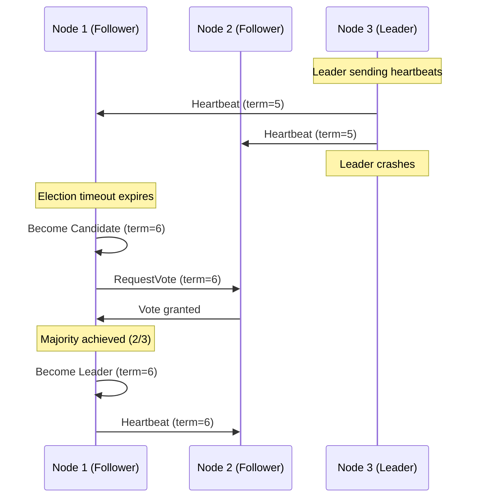
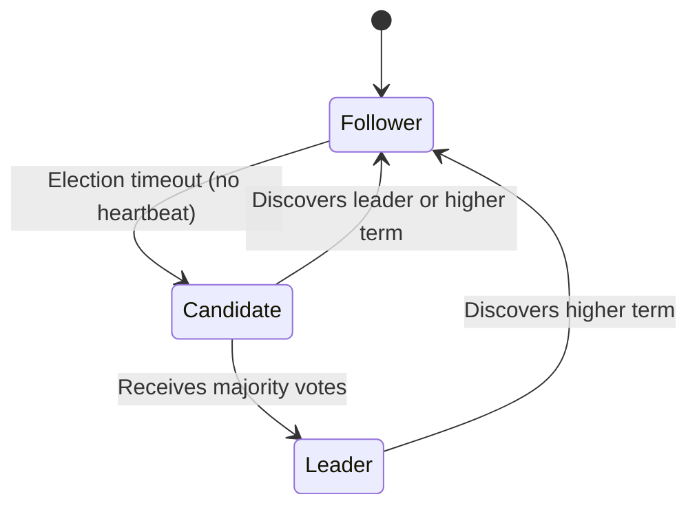
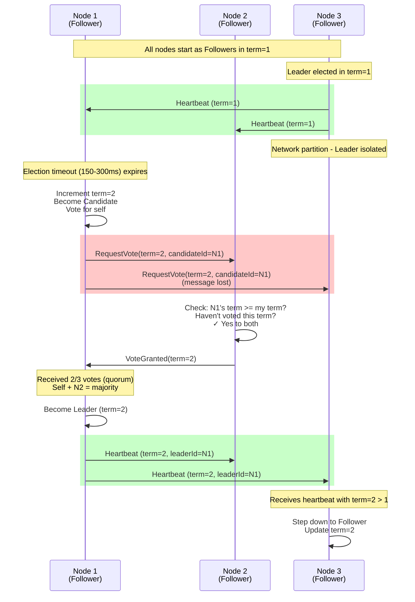
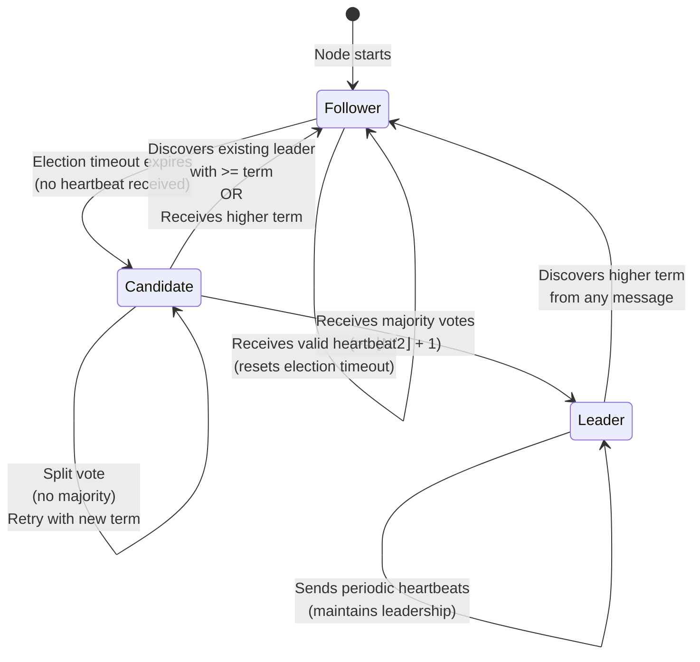
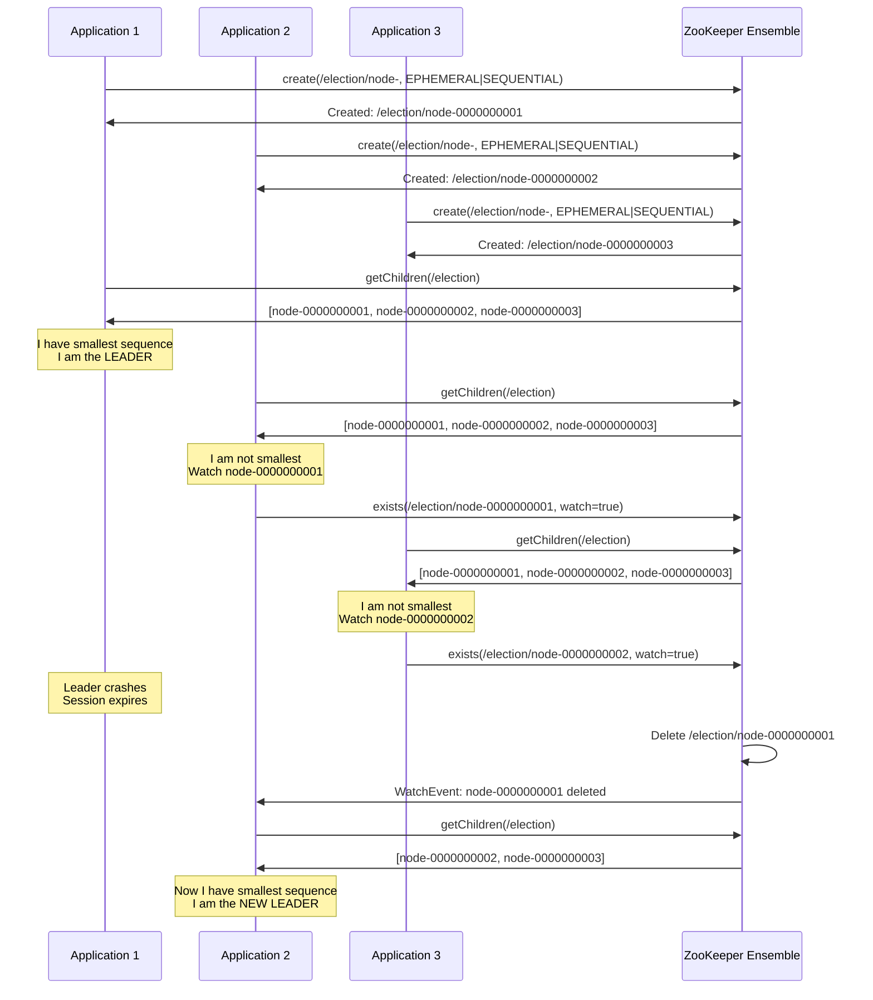
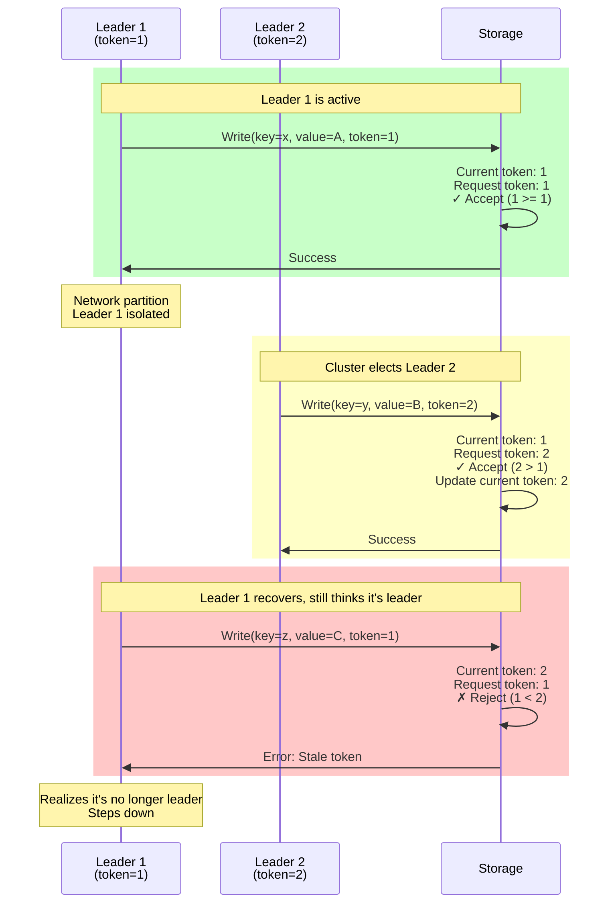
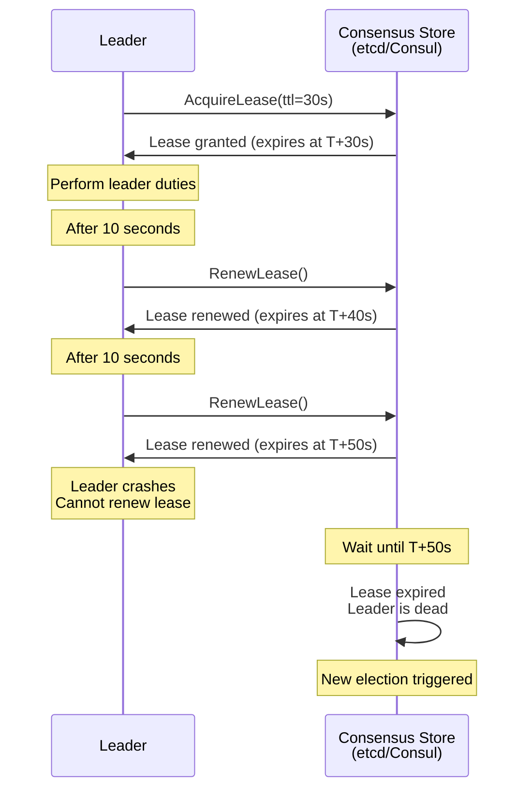
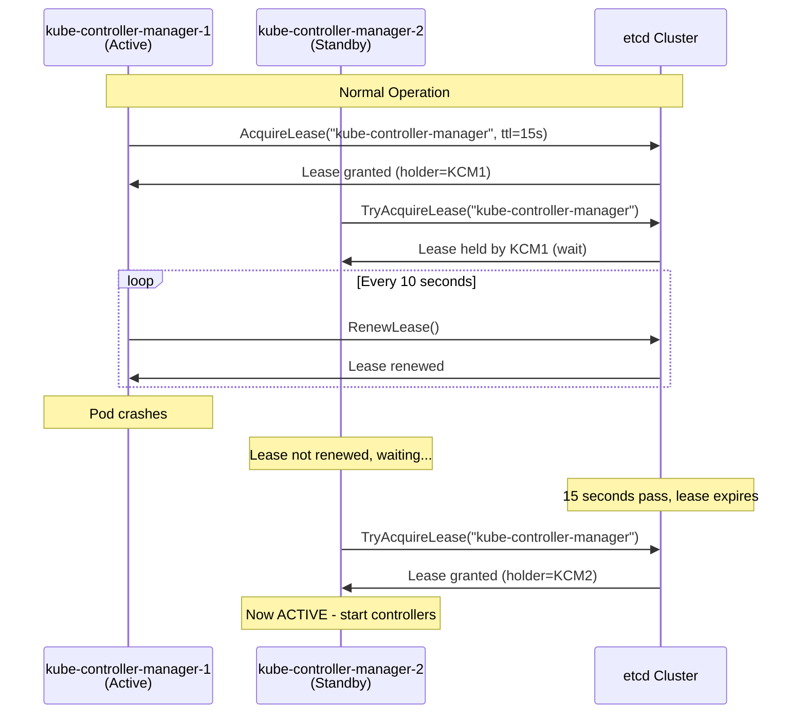
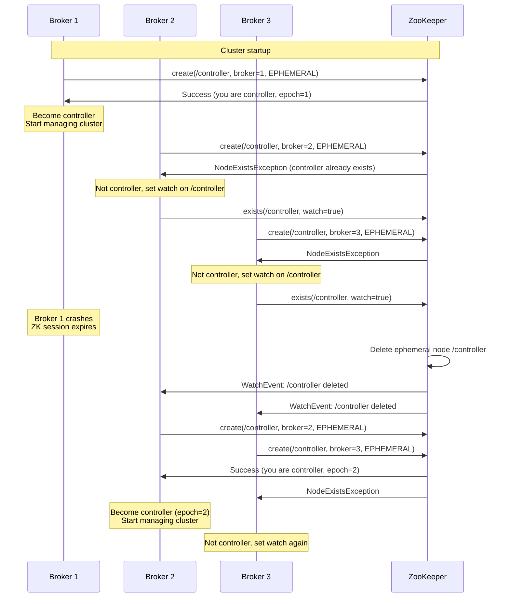

#system-design #pattern #distributed #coordination

# Leader Election

## Intuition (30 sec)

A group project where someone needs to be the coordinator — submitting the final document, scheduling meetings. If the coordinator disappears, the group must quickly pick a new one. Only ONE person can be coordinator at a time, or you'll submit two different documents.

## Failure-First Scenario

> You have 3 database replicas. The leader (handling writes) crashes. Both followers detect this and both declare themselves the new leader. Two leaders accept writes independently. Data diverges. Clients see different data depending on which "leader" they hit. You've entered split-brain.

## Working Knowledge (5 min)

### Core Concept - Definition First

**Leader Election:**
- **Definition:** A distributed algorithm that ensures exactly one node in a cluster is designated as the coordinator (leader) at any given time, with automatic failover when the leader fails.
- **Purpose:** Guarantees single point of coordination for operations that must not be duplicated (writes, job scheduling, lock management).
- **How it works:** Nodes use a consensus algorithm to vote on a leader; the leader maintains authority through periodic heartbeats; new elections trigger when heartbeats stop.

**Key Terms:**
- **Leader:** The single node authorized to perform coordinated operations (writes, task distribution).
- **Follower:** Non-leader nodes that replicate the leader's state and participate in elections.
- **Quorum:** Minimum number of nodes (majority) required to elect a leader, preventing split-brain.
- **Term/Epoch:** Monotonically increasing number identifying leadership periods; prevents stale leaders.
- **Heartbeat:** Periodic message from leader to followers proving it's alive and maintaining authority.
- **Split-Brain:** Dangerous state where multiple nodes believe they're the leader simultaneously.
- **Fencing Token:** Monotonically increasing number given to each new leader to reject stale operations.
- **Ephemeral Node:** Temporary ZooKeeper node that auto-deletes when the creating session dies.

### Why You Need a Leader

Some operations MUST be done by exactly one node:
- **Database writes** (to maintain consistency)
- **Cron job execution** (don't run the same job 3 times)
- **Distributed locks** (coordinate access to shared resources)
- **Task assignment** (one coordinator distributes work)

### Visual Model - Election Process



### Consensus Algorithms - Definitions

**Raft** (most understandable):
- **Definition:** A consensus algorithm designed for understandability that manages replicated logs and leader election through explicit state transitions.
- **How it works:** Nodes progress through Follower → Candidate → Leader states using randomized election timeouts and majority voting.

**Raft States:**
1. **Follower:** Default state; passively receives heartbeats and replication from leader
2. **Candidate:** Transition state during election; requests votes from other nodes
3. **Leader:** Single coordinator; sends heartbeats and manages all client interactions

**Raft Election Process:**
1. Nodes start as **followers**
2. If a follower doesn't hear from leader (election timeout), it becomes a **candidate**
3. Candidate increments term, votes for itself, asks others for votes
4. Node with majority votes becomes **leader**
5. Leader sends heartbeats to maintain authority



**Paxos** (academically rigorous):
- **Definition:** The foundational distributed consensus algorithm that guarantees safety in asynchronous networks but is notoriously difficult to understand and implement.
- **How it works:** Three-phase protocol (Prepare, Promise, Accept) where proposers suggest values and acceptors vote; requires majority agreement.
- **Key insight:** Separates safety (never make wrong decision) from liveness (eventually make decision).

**ZooKeeper Atomic Broadcast (ZAB)**:
- **Definition:** ZooKeeper's consensus protocol for maintaining ordered, atomic broadcast of state changes with strong consistency.
- **How it works:** Similar to Paxos but optimized for primary-backup replication; leader proposes, followers accept in order.
- **Use case:** Powers ZooKeeper's coordination primitives (locks, leader election, configuration).

**Key insight:** Majority requirement means at most ONE leader can be elected (can't get majority in both halves of a split).

### Tools for Leader Election

| Tool | Definition | How | Used By |
|------|------------|-----|---------|
| **ZooKeeper** | Distributed coordination service providing primitives for consensus | Ephemeral nodes + watches | Kafka, HBase, Hadoop |
| **etcd** | Distributed key-value store using Raft for consensus | Raft consensus, lease-based | Kubernetes, CoreDNS |
| **Consul** | Service mesh with built-in leader election | Raft, session-based | HashiCorp ecosystem |
| **Redis** | In-memory store with distributed lock support | Redlock algorithm (best effort) | Simple distributed locks |

## Layer 1: Conceptual Precision (15 min)

### Raft Consensus - Deep Definitions

**Term (Election Term):**
- **Formal Definition:** A monotonically increasing integer that represents a logical time period in which at most one leader can be elected; acts as a logical clock for detecting stale information.
- **Simple Definition:** A version number for leadership periods; higher term always wins.
- **Analogy:** Like presidential terms - Trump was 45th, Biden is 46th. You can't have two presidents in the same term.
- **Related Terms:**
  - **Epoch:** Similar concept in Paxos/ZAB; represents a version of the cluster state.
  - **Version number:** Broader concept; term is specifically for leader election.

**Election Timeout:**
- **Formal Definition:** Randomized duration (typically 150-300ms) a follower waits without receiving leader heartbeats before triggering a new election.
- **Simple Definition:** "If I haven't heard from the leader in X milliseconds, I'll run for leader."
- **Why randomized:** Prevents all nodes from becoming candidates simultaneously, reducing split votes.

**Quorum:**
- **Formal Definition:** The minimum number of nodes (⌊N/2⌋ + 1) required to make decisions, ensuring at most one majority group can form during network partitions.
- **Simple Definition:** "More than half"; in a 5-node cluster, you need 3 votes.
- **Math:**
  - 3 nodes: quorum = 2
  - 5 nodes: quorum = 3
  - 7 nodes: quorum = 4
- **Why this matters:** Two disjoint subsets of a cluster cannot both have quorum, preventing split-brain.

### Raft Leader Election - Visual Flow



**Step-by-step breakdown:**
1. **Steady State:** Leader (Node 3) sends periodic heartbeats to all followers; followers reset election timeout on each heartbeat.
2. **Leader Failure:** Network partition or crash prevents heartbeats from reaching followers.
3. **Election Timeout:** Node 1's randomized timer expires (150-300ms); no other node's timer has expired yet.
4. **Become Candidate:** Node 1 increments term to 2, votes for itself (1 vote), sends RequestVote to all other nodes.
5. **Vote Decision:** Node 2 receives RequestVote; checks if Node 1's term is current and if Node 2 hasn't voted yet this term; grants vote.
6. **Achieve Quorum:** Node 1 has 2/3 votes (itself + Node 2); this is a majority in a 3-node cluster.
7. **Become Leader:** Node 1 transitions to Leader state; begins sending heartbeats to assert authority.
8. **Old Leader Steps Down:** When Node 3 receives heartbeat with term=2 (higher than its term=1), it reverts to Follower.

### State Diagram - Detailed



**State Definitions:**
- **Follower:** Passive state; accepts heartbeats from leader; resets election timeout on each heartbeat; if timeout expires without heartbeat, transitions to Candidate.
- **Candidate:** Active election state; increments current term; votes for itself; requests votes from all other nodes; becomes Leader with majority or reverts to Follower if discovers higher term.
- **Leader:** Authority state; the only node that processes client requests; sends periodic heartbeats (typically every 50ms) to all followers; steps down if receives message with higher term.

**Transition Rules:**
- **Follower → Candidate:** Election timeout elapsed without leader heartbeat (typically 150-300ms randomized).
- **Candidate → Leader:** Received votes from majority of nodes (quorum).
- **Candidate → Follower:** Received heartbeat from valid leader OR discovered higher term.
- **Leader → Follower:** Received message with term higher than own term (discovered newer leader).

### ZooKeeper Leader Election - How It Works

**ZooKeeper:**
- **Definition:** Centralized coordination service providing distributed primitives (locks, leader election, configuration) built on ZAB consensus protocol.
- **Purpose:** Offload coordination complexity from applications; provides strongly consistent coordination.
- **Architecture:** 3 or 5 server ensemble; clients connect to any server; all writes go through leader.

**Ephemeral Sequential Nodes:**
- **Definition:** Temporary ZNode that auto-deletes when the creating client session ends; with SEQUENTIAL flag, ZooKeeper appends a monotonically increasing counter.
- **Purpose:** Automatically detect when participants fail (session expires → node deleted).
- **Example:** Nodes create `/election/node-0000000001`, `/election/node-0000000002`, etc.

**ZooKeeper Election Algorithm:**



**Algorithm Steps:**
1. **Create Ephemeral Sequential Node:** Each participant creates a node under `/election` with EPHEMERAL|SEQUENTIAL flags.
2. **List All Nodes:** Get all children under `/election` and sort by sequence number.
3. **Check if Leader:** If this node has the smallest sequence number, it's the leader; otherwise, it's a follower.
4. **Watch Predecessor:** Non-leaders set a watch on the node with the next smallest sequence number (immediate predecessor).
5. **Leader Failure:** When leader's session expires, ZooKeeper deletes its ephemeral node, triggering the watch for the next node.
6. **New Election:** Node that was watching the deleted node checks if it now has the smallest sequence; if yes, becomes leader.

**Why This Works:**
- **Ordered:** Sequential numbers create a clear ordering; smallest number is always the leader.
- **Automatic Failover:** Ephemeral nodes auto-delete on session expiration; next node is immediately notified.
- **No Herd Effect:** Each node only watches its immediate predecessor, not all nodes (avoids thundering herd).

### Fencing Tokens - Deep Dive

**Fencing Token:**
- **Formal Definition:** A monotonically increasing identifier (typically the term/epoch number) issued to each new leader, which storage systems use to reject operations from stale leaders.
- **Simple Definition:** A version number for leaders; storage accepts only increasing numbers, rejecting old leaders.
- **Analogy:** Like dated checks - a bank won't accept a check dated before the account was closed.

**Problem:** Old leader comes back after network partition, thinks it's still leader.

**Solution Flow:**



**Implementation Example:**
```
Leader 1: token=1 → gets partitioned
Leader 2: elected with token=2
Leader 1: comes back, tries to write with token=1
Storage: Rejects token=1 (< current token 2)
```

**Why This Matters:**
Without fencing tokens, a partitioned leader could come back and corrupt data by making changes that conflict with the new leader's operations. Fencing ensures **monotonic writes** - once a new leader is elected, old leaders cannot interfere.

### Split-Brain Prevention - Detailed

**Split-Brain:**
- **Definition:** A failure scenario in distributed systems where network partition separates the cluster into multiple disjoint groups, each potentially electing its own leader, leading to conflicting operations and data divergence.
- **Why dangerous:** Multiple leaders accept writes independently; data forks; when partition heals, reconciliation may be impossible (which writes win?).
- **Real-world impact:** Can cause data loss, corruption, duplicate job execution, financial transactions processed twice.

```
Before Split-Brain:          During Split-Brain:
   [Leader]                      [Leader A]  [Leader B]
   /      \                           |          |
[Node 2] [Node 3]               [Node 2]   [Node 3]
                                     ↓          ↓
                                 Write X    Write Y
                                (Conflict when partition heals)
```

**Prevention Techniques:**

| Technique | Definition | How | Trade-off |
|-----------|------------|-----|-----------|
| **Quorum** | Require majority (>N/2) of nodes to make decisions | Need ≥⌊N/2⌋+1 nodes to elect leader | Minority partition becomes unavailable (loses liveness) |
| **Fencing Tokens** | Attach monotonically increasing token to operations; storage rejects lower tokens | Each new leader gets higher token; old leader's ops rejected | Requires storage system support |
| **STONITH** | "Shoot The Other Node In The Head" - physically power off suspected failed node | Use network-controlled PDU or IPMI to hard-power-off node | Requires special hardware; can lose node permanently if wrong |
| **Lease-based** | Leader holds time-limited exclusive lease; must renew periodically | Leader's lease expires if can't renew; new leader elected | Clock skew can cause issues; requires tight clock sync |

### Lease-Based Leadership - Detailed

**Lease:**
- **Formal Definition:** A time-bounded exclusive lock that grants the holder exclusive access to a resource for a fixed duration; must be renewed before expiration to maintain access.
- **Simple Definition:** "You're the leader for the next 30 seconds; renew or lose leadership."
- **Analogy:** Like a parking meter - you pay for 2 hours; if you don't come back to add more time, you lose the spot.

**How It Works:**



**Timing Parameters:**
```
Lease TTL: 30 seconds        (how long lease is valid)
Renew interval: 10 seconds   (leader renews 3x before expiration)
Grace period: 5 seconds      (buffer before giving up)

Safe operation window: TTL - grace = 25 seconds
If leader doesn't renew within 25s → assumes leadership lost
```

**State Transitions:**

```
┌─────────────────────────────────────────┐
│ Leader State                            │
├─────────────────────────────────────────┤
│                                         │
│  Lease Acquired (T=0)                   │
│  ├─ Expires at: T+30s                   │
│  └─ Next renewal: T+10s                 │
│                                         │
│  ──────────────────────────────────────▶│
│           Time passes                   │
│                                         │
│  Renew #1 (T=10s)                       │
│  ├─ Expires at: T+40s                   │
│  └─ Next renewal: T+20s                 │
│                                         │
│  ──────────────────────────────────────▶│
│           Time passes                   │
│                                         │
│  Renew #2 (T=20s)                       │
│  ├─ Expires at: T+50s                   │
│  └─ Next renewal: T+30s                 │
│                                         │
│  ──────────────────────────────────────▶│
│        Leader crashes                   │
│                                         │
│  (T=50s) Lease expires                  │
│  └─ Consensus store triggers election   │
└─────────────────────────────────────────┘
```

**Used By:**
- **etcd:** Uses Raft-based leases for leader election in Kubernetes
- **Consul:** Session-based leases for service discovery and leader election
- **DynamoDB:** Internal lease-based coordination for partition leadership
- **Chubby (Google):** Lock service with lease-based distributed locks

**Clock Skew Problem:**
If clocks are not synchronized:
- Leader thinks lease is valid (local clock T+29s)
- Consensus store thinks lease expired (its clock T+31s)
- New leader elected → split-brain

**Solution:** Use logical clocks (like Raft term) or ensure tight clock sync (NTP, PTP).

## Layer 2: Technology-Specific Examples (20 min)

### Technology Comparison - With Definitions

**Tool Category:** Distributed coordination systems providing leader election primitives

| ZooKeeper | etcd | Consul |
|-----------|------|--------|
| **Definition:** Centralized coordination service using ZAB consensus protocol | **Definition:** Distributed key-value store using Raft consensus | **Definition:** Service mesh with health checks, service discovery, and KV store using Raft |
| **Best For:** Kafka, HBase, Hadoop coordination | **Best For:** Kubernetes control plane, distributed config | **Best For:** Service discovery, health checking, multi-datacenter |
| **Consensus:** ZAB (Zookeeper Atomic Broadcast) | **Consensus:** Raft | **Consensus:** Raft |
| **Election Method:** Ephemeral sequential nodes | **Election Method:** Lease-based with TTL | **Election Method:** Session-based locks |
| **Data Model:** Hierarchical namespace (like filesystem) | **Data Model:** Flat key-value store | **Data Model:** Key-value + service catalog |
| **Cluster Size:** 3 or 5 nodes typical | **Cluster Size:** 3, 5, or 7 nodes | **Cluster Size:** 3 or 5 nodes |
| **Performance:** ~10k ops/sec | **Performance:** ~10k writes/sec | **Performance:** ~5k writes/sec |
| **Language:** Java | **Language:** Go | **Language:** Go |

### ZooKeeper - Configuration & Setup

**Java Configuration Pattern:**

```java
/**
 * ZooKeeper Leader Election Implementation
 *
 * Key Concepts:
 * - CuratorFramework: High-level ZooKeeper client (wrapper around raw ZK API)
 * - LeaderLatch: Recipe for leader election (manages ephemeral nodes)
 * - ConnectionState: Tracks connection to ZooKeeper ensemble
 */

import org.apache.curator.framework.CuratorFramework;
import org.apache.curator.framework.CuratorFrameworkFactory;
import org.apache.curator.retry.ExponentialBackoffRetry;
import org.apache.curator.framework.recipes.leader.LeaderLatch;
import org.apache.curator.framework.recipes.leader.LeaderLatchListener;

public class LeaderElectionExample {

    // Connection string format: "host1:2181,host2:2181,host3:2181"
    // Definition: Comma-separated list of ZooKeeper servers
    private static final String ZK_CONNECTION = "zk1:2181,zk2:2181,zk3:2181";

    // Definition: Namespace for leader election nodes in ZooKeeper hierarchy
    private static final String ELECTION_PATH = "/leader-election";

    // Definition: Participant identifier (must be unique per instance)
    private String nodeId;

    private CuratorFramework client;
    private LeaderLatch leaderLatch;

    public void start() throws Exception {
        // Retry policy: wait 1s between retries, max 3 retries
        // Definition: ExponentialBackoffRetry increases wait time exponentially
        // after each failure (1s, 2s, 4s, etc.)
        client = CuratorFrameworkFactory.builder()
                .connectString(ZK_CONNECTION)
                .sessionTimeoutMs(15000)    // Definition: Max time ZK waits
                                            // before declaring session dead
                .connectionTimeoutMs(5000)  // Definition: Time to wait when
                                            // initially connecting
                .retryPolicy(new ExponentialBackoffRetry(1000, 3))
                .namespace("myapp")         // Definition: All paths prefixed
                                            // with /myapp
                .build();

        client.start();

        // Create LeaderLatch - automatically participates in election
        // Definition: LeaderLatch manages ephemeral sequential node creation
        // and monitoring for leader election
        leaderLatch = new LeaderLatch(client, ELECTION_PATH, nodeId);

        // Add listener for leadership changes
        leaderLatch.addListener(new LeaderLatchListener() {
            @Override
            public void isLeader() {
                // Called when this node becomes the leader
                System.out.println(nodeId + " is now the LEADER");
                // Start leader-specific work here
                startLeaderDuties();
            }

            @Override
            public void notLeader() {
                // Called when this node loses leadership
                System.out.println(nodeId + " is now a FOLLOWER");
                // Stop leader-specific work here
                stopLeaderDuties();
            }
        });

        // Start participating in election
        // Definition: Creates ephemeral sequential node and begins monitoring
        leaderLatch.start();

        System.out.println("Node " + nodeId + " started, participating in election");
    }

    public boolean isLeader() {
        // Definition: Returns true if this node currently holds leadership
        return leaderLatch.hasLeadership();
    }

    public void stop() throws Exception {
        // Gracefully relinquish leadership and clean up
        // Definition: Closes latch (deletes ephemeral node), triggers new election
        leaderLatch.close();
        client.close();
    }

    private void startLeaderDuties() {
        // Example: Only the leader processes jobs
        // processJobQueue();
        // schedulePeriodicTasks();
    }

    private void stopLeaderDuties() {
        // Example: Stop processing when losing leadership
        // stopJobProcessing();
        // cancelScheduledTasks();
    }
}
```

**Configuration Concepts:**
- **connectString:** Comma-separated list of ZooKeeper ensemble servers (hostname:port).
- **sessionTimeoutMs (15000ms):** Duration after which ZooKeeper considers client dead if no heartbeat received; triggers ephemeral node deletion.
- **connectionTimeoutMs (5000ms):** Max time to wait when establishing initial connection; fails if can't connect.
- **retryPolicy:** Strategy for retrying failed operations; ExponentialBackoffRetry backs off exponentially (1s, 2s, 4s).
- **namespace:** Prefix for all paths (e.g., namespace="myapp" makes "/leader" become "/myapp/leader").

### etcd - Configuration & Setup

**Go Configuration Pattern:**

```go
/**
 * etcd Leader Election with Lease-based Locking
 *
 * Key Concepts:
 * - Election: etcd's leader election API (wraps lease + KV)
 * - Lease: Time-bounded exclusive lock; must renew to maintain
 * - Session: Wrapper that auto-renews leases
 * - Campaign: Attempt to become leader with a value (node ID)
 */

package main

import (
    "context"
    "fmt"
    "log"
    "time"

    clientv3 "go.etcd.io/etcd/client/v3"
    "go.etcd.io/etcd/client/v3/concurrency"
)

func main() {
    // Connect to etcd cluster
    // Definition: Endpoints are the HTTP/gRPC addresses of etcd servers
    client, err := clientv3.New(clientv3.Config{
        Endpoints:   []string{"etcd1:2379", "etcd2:2379", "etcd3:2379"},
        DialTimeout: 5 * time.Second,  // Definition: Timeout for initial connection
    })
    if err != nil {
        log.Fatal(err)
    }
    defer client.Close()

    // Create a session with lease TTL
    // Definition: Session manages a lease and auto-renews it to keep alive
    // TTL: 10 seconds means if node crashes, leadership released after 10s
    session, err := concurrency.NewSession(client,
        concurrency.WithTTL(10))  // Lease TTL: 10 seconds
    if err != nil {
        log.Fatal(err)
    }
    defer session.Close()

    // Create election object
    // Definition: Election represents participation in leader election
    // under a specific key prefix
    electionKey := "/leader-election/my-app"
    election := concurrency.NewElection(session, electionKey)

    // Campaign to be leader
    // Definition: Campaign attempts to acquire leadership by writing
    // node ID to election key; blocks until elected or context cancelled
    nodeID := "node-1"
    fmt.Printf("%s: Campaigning for leadership...\n", nodeID)

    ctx := context.Background()
    if err := election.Campaign(ctx, nodeID); err != nil {
        log.Fatal(err)
    }

    fmt.Printf("%s: I am the LEADER!\n", nodeID)

    // Do leader work
    // Example: Process jobs, coordinate tasks, handle writes
    go doLeaderWork(ctx, election)

    // Observe leadership
    // Definition: Observe watches for leadership changes and calls
    // callback when new leader elected
    observeCh := election.Observe(ctx)
    go func() {
        for resp := range observeCh {
            fmt.Printf("Leader is now: %s\n", string(resp.Kvs[0].Value))
        }
    }()

    // Keep running
    select {}
}

func doLeaderWork(ctx context.Context, election *concurrency.Election) {
    ticker := time.NewTicker(5 * time.Second)
    defer ticker.Stop()

    for {
        select {
        case <-ticker.C:
            // Check if still leader
            // Definition: Leader() returns the current leader's value
            leader, err := election.Leader(ctx)
            if err != nil {
                log.Printf("Error getting leader: %v", err)
                continue
            }

            fmt.Printf("Current leader: %s\n", string(leader.Kvs[0].Value))

            // Do periodic leader tasks
            // processJobs()
            // syncDatabases()

        case <-ctx.Done():
            // Context cancelled, step down
            // Definition: Resign() explicitly releases leadership
            election.Resign(ctx)
            return
        }
    }
}
```

**etcd Configuration Concepts:**
- **Endpoints:** List of etcd server URLs (HTTP/gRPC); client connects to any available.
- **DialTimeout:** Maximum time to wait when establishing initial connection; fails after timeout.
- **TTL (Time To Live):** Duration lease remains valid; if leader doesn't renew within TTL, lease expires and new election begins.
- **Session:** High-level abstraction that manages lease lifecycle; automatically renews lease to prevent expiration.
- **Campaign:** API call that attempts to acquire leadership; blocks until elected or context cancelled.
- **Observe:** Watches for leadership changes; streams updates when new leader elected.
- **Resign:** Explicitly releases leadership; triggers new election immediately.

### Setup Flow - Visual

```
Step 1: Install & Configure
┌─────────────────────────┐
│ ZooKeeper Ensemble      │
│                         │
│ Node 1: zk1.example.com │  Install ZooKeeper 3.8+
│ Node 2: zk2.example.com │  Edit zoo.cfg:
│ Node 3: zk3.example.com │    tickTime=2000
│                         │    dataDir=/var/lib/zookeeper
└─────────────────────────┘    clientPort=2181
      │                        server.1=zk1:2888:3888
      ▼                        server.2=zk2:2888:3888
                              server.3=zk3:2888:3888
Step 2: Application Setup
┌─────────────────────────┐
│ Application Servers     │
│                         │
│ Add dependency:         │  Maven:
│ curator-framework       │  <dependency>
│ curator-recipes         │    <groupId>org.apache.curator</groupId>
│                         │    <artifactId>curator-recipes</artifactId>
│ Purpose: High-level     │    <version>5.5.0</version>
│ ZooKeeper client API    │  </dependency>
└─────────────────────────┘
      │
      ▼
Step 3: Implement Election
┌─────────────────────────┐
│ Code Integration        │
│                         │
│ 1. Create Curator client│  CuratorFramework client = ...
│ 2. Create LeaderLatch   │  LeaderLatch latch = ...
│ 3. Add listeners        │  latch.addListener(...)
│ 4. Start latch          │  latch.start()
│ 5. Check isLeader()     │  if (latch.hasLeadership()) {...}
└─────────────────────────┘
```

## Layer 3: Production-Ready Details (30 min)

### Production Architecture - Fully Annotated

```
                    Internet / Load Balancer
                              │
                ┌─────────────┼─────────────┐
                │             │             │
                │             │             │
           ┌────▼────┐   ┌───▼───┐    ┌───▼───┐
           │ App     │   │ App   │    │ App   │
           │ Node 1  │   │ Node 2│    │ Node 3│
           │         │   │       │    │       │
           │ LEADER  │   │Follower│   │Follower│
           │         │   │       │    │       │
           │ Duties: │   │Duties: │   │Duties: │
           │• Write  │   │• Read  │   │• Read  │
           │  ops    │   │  ops   │   │  ops   │
           │• Cron   │   │• Standby│  │• Standby│
           │  jobs   │   │        │   │        │
           │• Task   │   │        │   │        │
           │  distro │   │        │   │        │
           └────┬────┘   └───┬───┘    └───┬───┘
                │            │            │
                │     Leader Election     │
                │      Coordination       │
                └────────────┬────────────┘
                             │
                    ┌────────▼────────┐
                    │   Coordination  │
                    │     Cluster     │
                    │                 │
                    │  ┌──────────┐   │
                    │  │ZooKeeper │   │
                    │  │   or     │   │
                    │  │   etcd   │   │
                    │  │   or     │   │
                    │  │  Consul  │   │
                    │  └──────────┘   │
                    │                 │
                    │  3 or 5 nodes   │
                    │  for quorum     │
                    │                 │
                    │  Definition:    │
                    │  Consensus      │
                    │  service that   │
                    │  manages leader │
                    │  election and   │
                    │  configuration  │
                    └─────────┬───────┘
                              │
                    ┌─────────▼────────┐
                    │  Shared Storage  │
                    │   (Optional)     │
                    │                  │
                    │  Definition:     │
                    │  Accepts writes  │
                    │  only from       │
                    │  current leader  │
                    │  (via fencing    │
                    │  tokens)         │
                    └──────────────────┘
```

**Architecture Component Definitions:**
- **Application Nodes:** Stateless application servers; all can handle reads; only leader handles writes/coordination.
- **Leader:** Single node elected to perform coordinated operations (writes, job scheduling, task distribution); automatically failed over.
- **Followers:** Standby nodes; handle read traffic; participate in elections; promote to leader on failure.
- **Coordination Cluster:** 3 or 5 node ensemble running ZooKeeper/etcd/Consul; provides consensus for leader election; must maintain quorum to function.
- **Shared Storage:** Database or distributed storage that accepts writes only from authenticated leader (via fencing tokens).

### Monitoring Metrics - With Definitions

```
┌────────────────────────────────────────────────────────┐
│  LEADER ELECTION METRICS DASHBOARD                     │
├────────────────────────────────────────────────────────┤
│                                                        │
│ Current Leader: node-2                                 │
│ Definition: Node ID of current leader                 │
│ Why track: Detect leadership changes (failovers)     │
│                                                        │
│ Leadership Changes (24h): 3                            │
│ Definition: Number of times leader changed in period  │
│ Alert when: > 5 in 1 hour (indicates instability)    │
│ Causes: Node crashes, network partitions, GC pauses  │
│                                                        │
│ Election Duration: 847ms                               │
│ Definition: Time from leader failure to new election  │
│ Why track: Measures downtime during failover         │
│ Target: < 2 seconds for Raft (depends on timeout)    │
│                                                        │
│ Quorum Status: HEALTHY (3/3 nodes)                    │
│ Definition: Number of coordination nodes available    │
│ Alert when: Lost quorum (< 2/3 nodes)                │
│ Impact: Lost quorum = no elections, cluster frozen    │
│                                                        │
│ Lease TTL Remaining: 23s / 30s                         │
│ Definition: Time until leader lease expires if not    │
│            renewed                                    │
│ Why track: Low TTL means leader close to losing      │
│           leadership (network/CPU issues)            │
│ Alert when: < 5s remaining (leader struggling)       │
│                                                        │
│ Heartbeat Latency (P99): 45ms                          │
│ Definition: 99th percentile time for heartbeat RTT    │
│ Why track: High latency = risk of missed heartbeats  │
│ Target: < 100ms (depends on election timeout)        │
│                                                        │
│ Split-Brain Events (24h): 0                            │
│ Definition: Occurrences of multiple simultaneous      │
│            leaders detected                           │
│ Alert when: > 0 (CRITICAL - data corruption risk)    │
│ Detection: Fencing token conflicts, multiple writes  │
└────────────────────────────────────────────────────────┘
```

**Metric Definitions:**
- **Current Leader:** Node ID of the elected leader; changes indicate failover.
- **Leadership Changes:** Count of leader transitions; high frequency indicates instability (crashes, network issues, GC pauses).
- **Election Duration:** Time to elect new leader after old leader fails; measures availability during failover.
- **Quorum Status:** Number of coordination nodes reachable; losing quorum (< majority) halts all decisions.
- **Lease TTL Remaining:** Time before leader's lease expires; low values indicate leader struggling to renew (network lag, CPU saturation).
- **Heartbeat Latency:** Round-trip time for leader heartbeats; high latency risks election timeout.
- **Split-Brain Events:** Occurrences of multiple leaders; should ALWAYS be 0 (indicates serious bug).

### Monitoring Implementation - Prometheus

```yaml
# Prometheus metrics for leader election
# Integration: Expose these metrics from your application

# Gauge: Current leadership status (1 = leader, 0 = follower)
# Definition: Gauge is a metric that can go up or down
leader_status{node="node-1"} 1
leader_status{node="node-2"} 0
leader_status{node="node-3"} 0

# Counter: Total leadership changes
# Definition: Counter is a metric that only increases
leadership_changes_total 3

# Histogram: Election duration in milliseconds
# Definition: Histogram tracks distribution of values
election_duration_ms_bucket{le="100"} 0     # 0 elections < 100ms
election_duration_ms_bucket{le="500"} 2     # 2 elections < 500ms
election_duration_ms_bucket{le="1000"} 3    # 3 elections < 1000ms
election_duration_ms_bucket{le="+Inf"} 3   # All elections
election_duration_ms_sum 2541               # Total time for all elections
election_duration_ms_count 3                # Total number of elections

# Gauge: Coordination cluster quorum status
coordination_quorum_size 3
coordination_quorum_active 3

# Gauge: Lease TTL remaining in seconds
lease_ttl_remaining_seconds{node="node-1"} 23

# Histogram: Heartbeat latency
heartbeat_latency_ms_bucket{le="10"} 120
heartbeat_latency_ms_bucket{le="50"} 450
heartbeat_latency_ms_bucket{le="100"} 490
heartbeat_latency_ms_bucket{le="+Inf"} 500
```

**Prometheus Alerting Rules:**

```yaml
# Alert when quorum is lost
groups:
- name: leader_election
  rules:
  - alert: CoordinationQuorumLost
    expr: coordination_quorum_active < (coordination_quorum_size / 2 + 1)
    for: 30s
    labels:
      severity: critical
    annotations:
      summary: "Coordination cluster lost quorum"
      description: "Only {{ $value }} nodes active, need {{ coordination_quorum_size / 2 + 1 }} for quorum"

  # Alert on frequent leadership changes
  - alert: FrequentLeadershipChanges
    expr: rate(leadership_changes_total[1h]) > 5
    for: 5m
    labels:
      severity: warning
    annotations:
      summary: "Leader changing too frequently"
      description: "{{ $value }} leadership changes per hour, indicates instability"

  # Alert on long election duration
  - alert: SlowLeaderElection
    expr: histogram_quantile(0.95, election_duration_ms_bucket) > 5000
    for: 10m
    labels:
      severity: warning
    annotations:
      summary: "Leader elections taking too long"
      description: "95th percentile election time: {{ $value }}ms"

  # Alert on low lease TTL
  - alert: LeaderLeaseExpiringSoon
    expr: lease_ttl_remaining_seconds < 5
    for: 30s
    labels:
      severity: warning
    annotations:
      summary: "Leader lease about to expire"
      description: "Node {{ $labels.node }} has only {{ $value }}s lease remaining"
```

### Troubleshooting Decision Tree

```mermaid
flowchart TD
    Start[Problem: No Leader Elected] --> Check1{Quorum Available?}

    Check1 -->|No| Fix1[CRITICAL: Quorum Lost<br/><br/>Definition: Fewer than majority<br/>of coordination nodes available<br/><br/>Check:<br/>• Network connectivity between nodes<br/>• Node health status<br/>• Firewall blocking ports<br/><br/>Fix:<br/>• Restart failed nodes<br/>• Check logs for crash reasons<br/>• Verify port 2181 ZK / 2379 etcd<br/>• If > half nodes dead, restore<br/>  from backup]

    Check1 -->|Yes| Check2{Split-Brain Detected?}

    Check2 -->|Yes| Fix2[CRITICAL: Split-Brain<br/><br/>Definition: Multiple nodes<br/>believe they are leader<br/><br/>Symptoms:<br/>• Multiple nodes return isLeader=true<br/>• Fencing token conflicts<br/>• Divergent writes<br/><br/>Fix:<br/>1. Immediately fence old leader<br/>2. Identify leader with highest term<br/>3. Force other nodes to step down<br/>4. Verify fencing tokens working<br/>5. Check quorum logic bug]

    Check2 -->|No| Check3{Elections Timing Out?}

    Check3 -->|Yes| Fix3[Election Timeout Issue<br/><br/>Definition: Nodes cannot agree<br/>on leader within timeout period<br/><br/>Causes:<br/>• Network latency too high<br/>• Election timeout too short<br/>• Split votes (even node count)<br/><br/>Fix:<br/>• Increase election timeout<br/>  Raft: 150-300ms → 300-600ms<br/>• Check network latency between nodes<br/>  Target: < 10ms p99<br/>• Use odd node count 3,5,7<br/>  not even 2,4,6]

    Check3 -->|No| Check4{Lease Expiring Quickly?}

    Check4 -->|Yes| Fix4[Lease Renewal Issue<br/><br/>Definition: Leader cannot renew<br/>lease before expiration<br/><br/>Causes:<br/>• Leader CPU saturated<br/>• Network hiccups<br/>• Clock skew<br/>• GC pauses<br/><br/>Fix:<br/>• Check leader CPU/memory usage<br/>• Increase lease TTL<br/>  30s → 60s<br/>• Check NTP clock sync<br/>  Use: ntpq -p<br/>• Tune JVM GC if Java app]

    Check4 -->|No| Check5{Coordination Cluster Slow?}

    Check5 -->|Yes| Fix5[Coordination Performance<br/><br/>Definition: ZooKeeper/etcd/Consul<br/>responding slowly<br/><br/>Check metrics:<br/>• Heartbeat latency > 100ms<br/>• Disk I/O wait high<br/>• CPU usage > 80%<br/><br/>Fix:<br/>• Use SSD for coordination cluster<br/>• Check disk fsync latency<br/>  etcd: fsync < 10ms required<br/>• Add more coordination nodes<br/>• Tune txn log on separate disk]

    Check5 -->|No| Check6{Frequent Leadership Changes?}

    Check6 -->|Yes| Fix6[Instability Root Cause<br/><br/>Definition: Leader changes<br/>multiple times per hour<br/><br/>Causes:<br/>• Node crashes/restarts<br/>• Network flapping<br/>• Process killed by OOM<br/>• GC pauses > heartbeat interval<br/><br/>Fix:<br/>• Check node logs for crashes<br/>• Verify network stability<br/>• Increase node memory<br/>• Tune GC pause times<br/>• Check if anti-virus interfering]

    Check6 -->|No| End[System Healthy<br/><br/>Verify:<br/>• 1 leader elected<br/>• Quorum maintained<br/>• Heartbeats regular<br/>• Lease renewed successfully]
```

### Troubleshooting Guide - Common Issues

**Issue 1: Quorum Loss**

**Definition:** Coordination cluster has fewer than majority of nodes available; cannot make decisions.

**Symptoms:**
- No new leader elected after failure
- Applications hang waiting for coordination
- Logs show: "No quorum available"

**Root Causes:**
- Network partition isolating nodes
- Multiple node crashes (e.g., power outage)
- Firewall blocking coordination ports

**Resolution Steps:**
```bash
# 1. Check coordination cluster status
# ZooKeeper:
echo stat | nc zk1 2181    # Should show "Mode: follower" or "Mode: leader"

# etcd:
etcdctl --endpoints=etcd1:2379 endpoint health

# Consul:
consul members

# 2. Verify network connectivity between nodes
ping zk1
telnet zk1 2181   # Check port accessibility

# 3. Check logs for crash reasons
# ZooKeeper:
tail -f /var/log/zookeeper/zookeeper.log

# etcd:
journalctl -u etcd -f

# 4. Restart failed nodes
systemctl restart zookeeper  # or etcd, consul

# 5. If quorum cannot be restored (>50% nodes dead):
# LAST RESORT: Reconfigure cluster to smaller size
# This requires manual intervention and may cause data loss
```

**Issue 2: Split-Brain**

**Definition:** Multiple nodes simultaneously believe they are the leader; causes divergent writes.

**Symptoms:**
- Multiple nodes report `isLeader=true`
- Fencing token conflicts in logs
- Different clients see different "leaders"
- Data inconsistencies after partition heals

**Root Causes:**
- Quorum logic bug (CRITICAL - should never happen)
- Fencing not implemented correctly
- Network partition without proper timeout

**Resolution Steps:**
```bash
# 1. Identify all nodes claiming leadership
curl http://node1:8080/leader-status    # Returns: "I am leader"
curl http://node2:8080/leader-status    # Returns: "I am leader" ← PROBLEM!
curl http://node3:8080/leader-status    # Returns: "I am follower"

# 2. Check term/epoch numbers
# Higher term wins
curl http://node1:8080/term    # Returns: term=5
curl http://node2:8080/term    # Returns: term=6  ← This is real leader

# 3. Fence the stale leader (lower term)
# Option A: Graceful shutdown
ssh node1 "systemctl stop myapp"

# Option B: STONITH (power off node)
ipmitool -H node1-ipmi -U admin -P password power off

# 4. Verify fencing token implementation
# Storage should reject operations from lower term/token

# 5. Force new election
# Restart all nodes to clear state
for node in node1 node2 node3; do
    ssh $node "systemctl restart myapp"
done
```

**Issue 3: Election Storms**

**Definition:** Leader keeps changing rapidly (multiple times per minute); cluster unstable.

**Symptoms:**
- Frequent leadership change alerts
- Applications unavailable during elections
- Logs show: "Became leader" → "Lost leadership" repeatedly

**Root Causes:**
- Election timeout too short for network latency
- GC pauses exceeding heartbeat interval
- Network flapping (intermittent connectivity)

**Resolution Steps:**
```bash
# 1. Check current election timeout settings
# Should be > 10x network RTT
# ZooKeeper:
grep tickTime /etc/zookeeper/zoo.cfg
# tickTime=2000 → election timeout = 10-20 ticks = 20-40 seconds

# etcd:
etcdctl get /config/election-timeout
# Typical: 1000ms (1 second)

# 2. Measure network latency between nodes
ping -c 100 node2 | tail -1
# Typical output: rtt min/avg/max/mdev = 0.5/1.2/5.3/0.8 ms
# If p99 > 10ms, increase timeouts

# 3. Increase election timeout
# ZooKeeper: Edit zoo.cfg
tickTime=3000  # Increase from 2000 to 3000

# etcd: Edit systemd unit or etcd.conf
--election-timeout=5000  # Increase from 1000 to 5000

# Raft-based apps: Application config
election_timeout_ms=3000

# 4. Check for GC pauses (Java apps)
# Enable GC logging
-Xlog:gc*:file=/var/log/gc.log:time,uptime,level,tags

# Look for long pauses
grep "Pause Young" /var/log/gc.log | awk '{print $NF}' | sort -n
# If pauses > heartbeat interval (e.g., > 100ms), tune GC

# 5. Verify network stability
# Run continuous ping and look for packet loss
ping -i 0.1 node2 > ping.log &
# Later:
grep "packet loss" ping.log
# 0% packet loss is goal; > 1% is problematic
```

### Decision Tree - When to Use Leader Election

```
Do you need coordination across nodes?
    │
    ├─ No → Use leaderless architecture
    │         Examples: Cassandra, DynamoDB
    │
    └─ Yes → Do operations need exactly-once execution?
              │
              ├─ No → Use eventual consistency
              │         Examples: DNS, CDN, gossip protocols
              │
              └─ Yes → Do you need high availability?
                        │
                        ├─ No → Use single server
                        │         Simpler, no coordination needed
                        │
                        └─ Yes → Use Leader Election
                                  │
                                  ├─ Low latency required (< 10ms) → etcd (Raft)
                                  │   Use case: Kubernetes control plane
                                  │
                                  ├─ Complex coordination (locks, barriers) → ZooKeeper
                                  │   Use case: Kafka, HBase, Hadoop
                                  │
                                  ├─ Service discovery + health checks → Consul
                                  │   Use case: Microservices, multi-datacenter
                                  │
                                  └─ Simple distributed lock → Redis (Redlock)
                                      Use case: Job deduplication, simple leader election
                                      Warning: Redlock not strongly consistent

IF [need writes to single node] AND [high availability required]
  THEN use leader election with fencing tokens

IF [network has high latency] (> 50ms p99)
  THEN increase election timeout to 10x latency

IF [cluster size is even] (2, 4, 6)
  THEN risk of split votes; use odd size (3, 5, 7)

IF [need to survive N failures]
  THEN deploy 2N+1 nodes (survive N failures with quorum)
  Examples: Survive 1 failure → 3 nodes
            Survive 2 failures → 5 nodes
            Survive 3 failures → 7 nodes
```

## Real-World Examples

### Example 1: etcd in Kubernetes - Control Plane Leader Election

**Problem Definition:**
Kubernetes control plane has multiple components (kube-controller-manager, kube-scheduler) that must run as singletons - only one instance should be active to avoid duplicate operations (e.g., creating multiple pods for the same deployment).

**Solution Definition:**
Kubernetes uses etcd's lease-based leader election to ensure only one instance of each control plane component is active at a time. Other instances remain in standby mode and take over within seconds if the active instance fails.

**Technical Terms Used:**
- **kube-controller-manager:** Component that runs controller loops (e.g., ReplicaSet controller, Deployment controller); ensures desired state matches actual state.
- **Lease-based election:** Uses etcd's TTL-based locks; active component continuously renews its lease; standby components wait for lease expiration.
- **Failover time:** Duration from primary failure to standby taking over; typically 15-30 seconds in Kubernetes.

**How It Works:**



**Configuration (kube-controller-manager flags):**

```bash
kube-controller-manager \
  --leader-elect=true \                          # Enable leader election
  --leader-elect-lease-duration=15s \            # Lease TTL: 15 seconds
  --leader-elect-renew-deadline=10s \            # Must renew within 10s
  --leader-elect-retry-period=2s \               # Check lease every 2s
  --leader-elect-resource-name=kube-controller-manager  # Lock name in etcd
```

**Definitions:**
- **leader-elect-lease-duration:** How long lease is valid; if not renewed, expires and new election begins.
- **leader-elect-renew-deadline:** Deadline for active leader to renew lease; if missed, leader steps down voluntarily.
- **leader-elect-retry-period:** How often standby instances check if lease is available.

**Results:**
- **Availability:** Kubernetes control plane survives single node failure with 15-30s failover.
- **Consistency:** Only one controller-manager active at any time; no duplicate pod creation.
- **Observability:** kubectl get leases -n kube-system shows current lease holders.

### Example 2: Kafka - Controller Election with ZooKeeper

**Problem Definition:**
Kafka cluster needs a single controller to manage partition leadership, replica assignment, and metadata propagation. Without a controller, partition leadership cannot change on broker failure, causing unavailability.

**Solution Definition:**
Kafka uses ZooKeeper's ephemeral node mechanism for controller election. First broker to create `/controller` node becomes the controller. When controller crashes, its ephemeral node is auto-deleted, triggering new election.

**Technical Terms Used:**
- **Kafka Controller:** Single broker responsible for managing partition leaders, replica assignments, and cluster metadata.
- **ISR (In-Sync Replicas):** Set of replicas that are fully caught up with the leader; controller selects new leader from ISR.
- **Controller Epoch:** Monotonically increasing number identifying controller generations; used as fencing token to reject stale controller requests.

**Architecture:**

```
┌────────────────────────────────────────────────┐
│           Kafka Cluster                        │
├────────────────────────────────────────────────┤
│                                                │
│  ┌───────────┐  ┌───────────┐  ┌───────────┐ │
│  │ Broker 1  │  │ Broker 2  │  │ Broker 3  │ │
│  │           │  │           │  │           │ │
│  │CONTROLLER │  │  Follower │  │  Follower │ │
│  │           │  │           │  │           │ │
│  │ Epoch: 42 │  │           │  │           │ │
│  │           │  │           │  │           │ │
│  │ Duties:   │  │ Duties:   │  │ Duties:   │ │
│  │• Partition│  │• Host     │  │• Host     │ │
│  │  leader   │  │  partitions│ │  partitions│ │
│  │  election │  │• Replicate│  │• Replicate│ │
│  │• ISR mgmt │  │  data     │  │  data     │ │
│  │• Metadata │  │           │  │           │ │
│  │  updates  │  │           │  │           │ │
│  └─────┬─────┘  └─────┬─────┘  └─────┬─────┘ │
│        │              │              │        │
└────────┼──────────────┼──────────────┼────────┘
         │              │              │
         └──────────────┴──────────────┘
                        │
                ┌───────▼────────┐
                │   ZooKeeper    │
                │    Ensemble    │
                │                │
                │  /controller   │
                │  ├─ broker=1   │
                │  ├─ epoch=42   │
                │  └─ timestamp  │
                │                │
                │  (Ephemeral    │
                │   node held by │
                │   Broker 1)    │
                └────────────────┘
```

**Controller Election Process:**



**Controller Epoch as Fencing Token:**

```
Scenario: Broker 1 is controller (epoch=42), gets partitioned

1. Broker 1 (controller, epoch=42)
   ├─ Send partition leader update (epoch=42) → ⏱ delayed by network
   └─ Loses connection to ZooKeeper

2. ZooKeeper detects session timeout
   └─ Deletes /controller ephemeral node

3. Broker 2 elected as new controller (epoch=43)
   └─ Send partition leader update (epoch=43) → ✓ Succeeds

4. Broker 1's delayed message arrives (epoch=42)
   └─ Other brokers reject: epoch 42 < 43 (stale controller)

Result: Fencing prevents stale controller from making changes
```

**Results:**
- **Availability:** Kafka cluster automatically recovers from controller failure in seconds.
- **Consistency:** Controller epoch acts as fencing token; stale controller requests are rejected.
- **Scale:** Kafka clusters with 1000s of partitions rely on controller for metadata management.

**Migration to KRaft (Kafka Raft):**
As of Kafka 3.3+ (2022), Kafka is moving from ZooKeeper to KRaft (Kafka's native Raft implementation) for metadata management. Controller election now uses Raft instead of ZooKeeper, eliminating external dependency.

### Example 3: etcd - Self-Leader Election (Eating Own Dog Food)

**Problem Definition:**
etcd itself is a distributed system that needs a leader to process all writes (Raft requirement). etcd must elect its own leader using the Raft protocol it implements.

**Solution Definition:**
etcd uses the Raft consensus algorithm for internal leader election. etcd nodes are Raft peers; they elect a leader who handles all client writes and log replication to followers.

**Technical Terms Used:**
- **Raft Peer:** An etcd server participating in the Raft cluster.
- **Log Replication:** Leader receives writes, appends to its log, replicates log entries to followers.
- **Committed Entry:** Log entry replicated to majority of nodes; safe to apply to state machine.

**Architecture:**

```
                        Client Writes
                              │
                    ┌─────────▼─────────┐
                    │   etcd Leader     │
                    │   (Node 1)        │
                    │                   │
                    │  Receives writes  │
                    │  Appends to log   │
                    │  Replicates logs  │
                    └─────────┬─────────┘
                              │
              ┌───────────────┼───────────────┐
              │               │               │
     ┌────────▼────────┐ ┌───▼────────┐ ┌───▼────────┐
     │  etcd Follower  │ │etcd Follower│ │etcd Follower│
     │   (Node 2)      │ │ (Node 3)    │ │ (Node 4)   │
     │                 │ │             │ │            │
     │ Receives logs   │ │Receives logs│ │Receives logs│
     │ Appends to log  │ │Appends to log│ │Appends to log│
     │ Sends ACK       │ │Sends ACK    │ │Sends ACK   │
     └─────────────────┘ └─────────────┘ └────────────┘

When leader fails:
1. Followers detect missing heartbeats (election timeout)
2. A follower becomes candidate, requests votes
3. Majority elect new leader
4. New leader begins replicating logs
```

**Example Election Sequence:**

```
Initial state: 5 nodes, Node 1 is leader (term 10)

T=0s:  Node 1 sends heartbeats
       All followers reset election timeout

T=5s:  Node 1 crashes
       Heartbeats stop

T=5.2s: Node 3's election timeout expires (randomized 150-300ms)
        Node 3 → Candidate (term 11)
        Node 3 votes for self (1 vote)
        Node 3 sends RequestVote(term=11) to all nodes

T=5.21s: Node 2 receives RequestVote
         Node 2 checks: term 11 > my term 10? Yes
                       Already voted this term? No
                       Candidate log up-to-date? Yes
         Node 2 grants vote to Node 3 (2 votes total)

T=5.22s: Node 4 receives RequestVote
         Node 4 grants vote to Node 3 (3 votes total)

T=5.22s: Node 3 has 3/5 votes (quorum!)
         Node 3 → Leader (term 11)
         Node 3 sends heartbeats to all followers

T=5.23s: Node 2, Node 4, Node 5 receive heartbeat (term 11)
         Update term to 11, recognize Node 3 as leader

Total election duration: 230ms
```

**Results:**
- **Self-hosting:** etcd uses its own Raft implementation for its internal coordination.
- **Performance:** Leader election typically completes in < 300ms.
- **Consistency:** Raft guarantees at most one leader per term; linearizable reads/writes.

## Interview Preparation

### Concept Glossary

Quick reference definitions for interview:

- **Leader Election:** Distributed algorithm ensuring exactly one coordinator node at any time.
- **Quorum:** Majority of nodes (>N/2) required to make decisions; prevents split-brain.
- **Split-Brain:** Dangerous state with multiple simultaneous leaders; causes data divergence.
- **Fencing Token:** Monotonically increasing ID (term/epoch) to reject stale leader operations.
- **Heartbeat:** Periodic message from leader proving it's alive; followers expect heartbeats.
- **Election Timeout:** Duration follower waits without heartbeat before triggering election.
- **Term/Epoch:** Leadership period identifier; higher term always wins.
- **Ephemeral Node:** ZooKeeper node that auto-deletes when session dies; detects failure.
- **Lease:** Time-bounded lock; leader must renew periodically to maintain leadership.
- **Raft:** Understandable consensus algorithm using majority voting and log replication.
- **Paxos:** Academic consensus algorithm; hard to understand but foundational.
- **ZAB:** ZooKeeper Atomic Broadcast; consensus protocol powering ZooKeeper.

### Question Template

**Q: Explain leader election and when you'd use it.**

**Answer Structure:**

1. **Define (5-10 sec):**
   "Leader election is a distributed algorithm that ensures exactly one node in a cluster acts as the coordinator at any given time. It's used when operations must happen exactly once, like database writes or job scheduling."

2. **Explain How (15-20 sec):**
   "In Raft, the most common algorithm, nodes start as followers. If a follower doesn't receive heartbeats from the leader within an election timeout (say 300ms), it becomes a candidate and requests votes. The node that gets a majority becomes the new leader and sends heartbeats to assert authority. The majority requirement prevents split-brain."

3. **State When (10 sec):**
   "Use leader election when you need high availability for single-coordinator operations. Examples: database replication (one write leader), distributed cron (one job executor), Kafka (one controller managing partitions)."

4. **Mention Trade-off (10 sec):**
   "Pro: Provides automatic failover and prevents duplicate operations. Con: Adds complexity and latency; if you lose quorum (majority of nodes), the system can't elect a leader and becomes unavailable."

**Q: How do you prevent split-brain in leader election?**

**Answer Structure:**

1. **Define (5 sec):**
   "Split-brain is when multiple nodes simultaneously believe they're the leader, causing conflicting operations."

2. **Explain Prevention (20 sec):**
   "Use a quorum-based approach: require more than half the nodes (N/2 + 1) to elect a leader. Since two disjoint groups can't both have a majority, at most one leader can be elected. Also use fencing tokens - each new leader gets a higher term number, and storage systems reject operations with lower terms, preventing stale leaders from making changes."

3. **Give Example (10 sec):**
   "In a 5-node cluster, you need 3 votes to elect a leader. If the cluster splits 2-3, only the group of 3 can elect a leader. The group of 2 stays unavailable until reconnected."

**Q: Explain Raft consensus algorithm.**

**Answer Structure:**

1. **Define (5 sec):**
   "Raft is a consensus algorithm designed for understandability. It manages replicated logs and leader election through explicit state transitions."

2. **Explain States (15 sec):**
   "Nodes have three states: Follower (default, receives heartbeats), Candidate (during election, requests votes), and Leader (handles writes, sends heartbeats). Nodes also track a term number - a logical clock for leadership periods."

3. **Election Process (15 sec):**
   "When a follower's election timeout expires (no heartbeat), it increments the term, becomes a candidate, votes for itself, and requests votes from others. If it gets a majority, it becomes the leader. If it discovers a leader with equal or higher term, it reverts to follower."

4. **Key Insight (10 sec):**
   "Randomized election timeouts prevent all nodes from becoming candidates simultaneously, reducing split votes. Terms act as fencing tokens to reject stale leaders."

**Q: How does ZooKeeper implement leader election?**

**Answer Structure:**

1. **Mechanism (10 sec):**
   "ZooKeeper uses ephemeral sequential nodes. Each participant creates a node under an election path with EPHEMERAL|SEQUENTIAL flags. ZooKeeper appends a monotonically increasing number."

2. **Leader Determination (10 sec):**
   "The participant with the smallest sequence number is the leader. Non-leaders watch the node with the next-smallest number (their predecessor)."

3. **Failover (10 sec):**
   "When the leader crashes, its session expires, ZooKeeper deletes its ephemeral node, and the next node is notified via the watch. It checks if it now has the smallest number and becomes the new leader."

4. **Benefit (5 sec):**
   "This approach avoids the thundering herd problem - only one node is notified per leadership change, not all nodes."

**Q: What are fencing tokens and why are they important?**

**Answer Structure:**

1. **Define (10 sec):**
   "A fencing token is a monotonically increasing identifier (like Raft term number) issued to each new leader. Storage systems check the token and reject operations from lower-numbered tokens."

2. **Problem Solved (15 sec):**
   "They prevent zombie leaders. If a leader gets network-partitioned, the cluster elects a new leader with a higher token. When the old leader reconnects and tries to write, the storage system rejects it because its token is stale, preventing data corruption."

3. **Example (10 sec):**
   "Leader 1 has token=5, gets partitioned. Leader 2 is elected with token=6. Leader 1 comes back and tries to write with token=5. Database rejects it: 5 < 6."

## Quick Reference

### Glossary

| Term | Definition | When You'll See It |
|------|------------|-------------------|
| **Leader** | Single elected coordinator node | Distributed databases, job schedulers |
| **Follower** | Non-leader node; standby for failover | All consensus systems |
| **Quorum** | Majority of nodes (⌊N/2⌋+1) | Raft, Paxos, ZooKeeper, etcd |
| **Split-Brain** | Multiple simultaneous leaders | System design discussions, troubleshooting |
| **Fencing Token** | Monotonic ID to reject stale leaders | Distributed locks, replicated storage |
| **Heartbeat** | Periodic alive message from leader | Raft, all consensus protocols |
| **Election Timeout** | Time to wait before triggering election | Raft configuration |
| **Term/Epoch** | Leadership period identifier | Raft (term), Paxos/ZAB (epoch) |
| **Lease** | Time-bounded exclusive lock | etcd, Consul, Chubby |
| **Ephemeral Node** | Auto-deletes on session end | ZooKeeper leader election |
| **Raft** | Understandable consensus algorithm | etcd, Consul, CockroachDB |
| **Paxos** | Original consensus algorithm | Chubby, Spanner, early systems |
| **ZAB** | ZooKeeper Atomic Broadcast | ZooKeeper internals |
| **ISR** | In-Sync Replicas (Kafka) | Kafka partition leadership |

### Decision Cheat Sheet

```
IF [need exactly-once execution] AND [high availability]
  THEN use leader election
  Example: Database writes, cron jobs

IF [cluster size < 3]
  THEN cannot tolerate even single failure with quorum
  Use: 3 nodes minimum (survive 1 failure)

IF [cluster size is even] (2, 4, 6)
  THEN risk of split votes in Raft
  Use: Odd numbers (3, 5, 7) for clean majorities

IF [need to survive N failures]
  THEN deploy 2N+1 nodes
  Examples: N=1 → 3 nodes, N=2 → 5 nodes, N=3 → 7 nodes

IF [network latency high] (> 50ms p99)
  THEN increase election timeout to 10x latency
  Example: 50ms latency → 500ms election timeout

IF [using ZooKeeper]
  THEN use ephemeral sequential nodes for election
  Why: Automatic failover, avoids thundering herd

IF [using etcd]
  THEN use lease-based locks with TTL
  Why: Simple API, automatic expiration

IF [implementing Raft]
  THEN randomize election timeouts (150-300ms)
  Why: Prevents all nodes from becoming candidates simultaneously

IF [storage supports fencing]
  THEN always use fencing tokens
  Why: Prevents zombie leader data corruption

IF [split-brain detected]
  THEN immediately fence stale leader
  Action: Power off old leader (STONITH) or network block
  Why: Prevent divergent writes

IF [losing quorum frequently]
  THEN check: network stability, node health, GC pauses
  Fix: Increase heartbeat/timeout, tune GC, stabilize network
```

### Common Pitfalls

| Pitfall | Why It's Wrong | Solution |
|---------|----------------|----------|
| Even node count (2, 4, 6) | Doesn't improve fault tolerance; increases split-vote risk | Use odd count (3, 5, 7) |
| Election timeout = Heartbeat interval | Leader needs time to send heartbeat before timeout | Timeout ≥ 10x heartbeat interval |
| No fencing tokens | Stale leader can corrupt data after network partition | Always implement fencing |
| Clock-based leases without sync | Clock skew causes split-brain | Use NTP/PTP or logical clocks |
| Forgetting to handle lost quorum | System hangs when majority fails | Monitor quorum, alert on loss |
| Not monitoring leadership changes | Frequent changes indicate instability | Track change rate, alert if high |
| Assuming leader election is free | Adds latency and operational complexity | Only use when necessary |

## Links

- [[replication]] — Leader-follower replication needs leader election
- [[02_building_blocks/message_queues]] — Kafka uses ZooKeeper for leader election
- [[01_fundamentals/cap_theorem]] — Leader election is a CP operation (Consistency + Partition tolerance)
- [[01_fundamentals/consistency_models]] — Linearizable leader election ensures strong consistency
