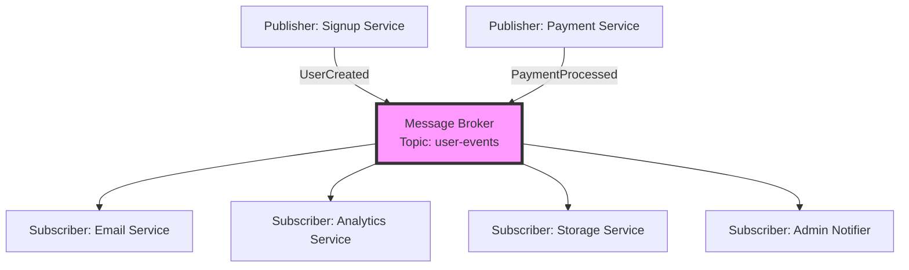
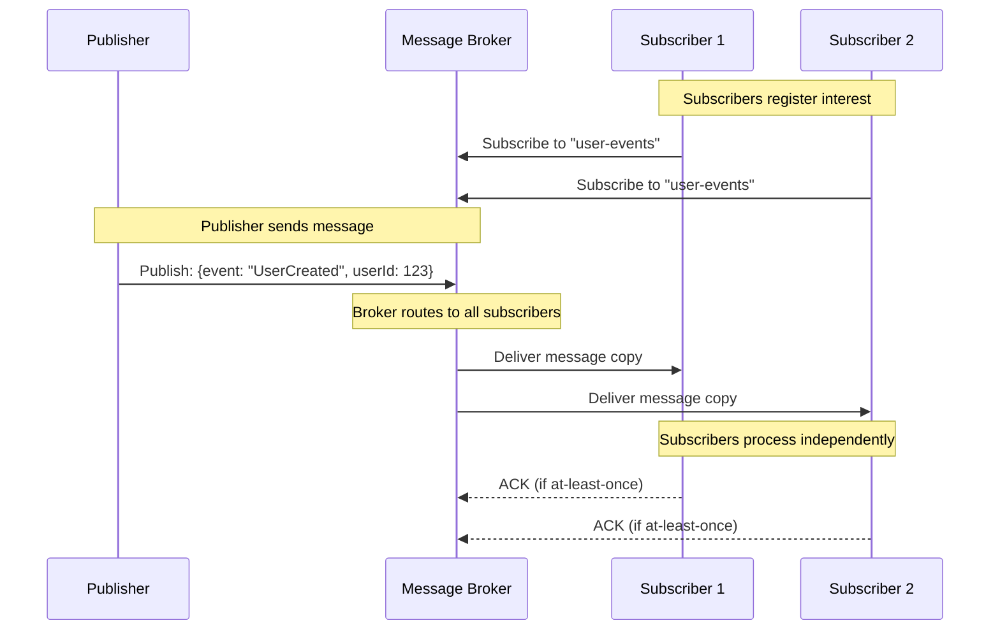
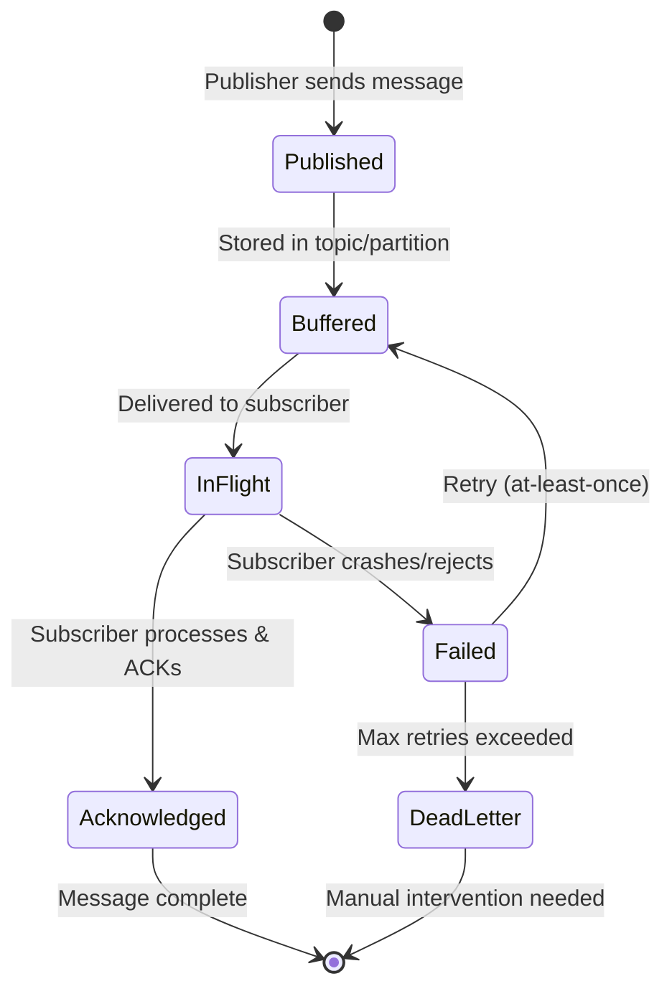
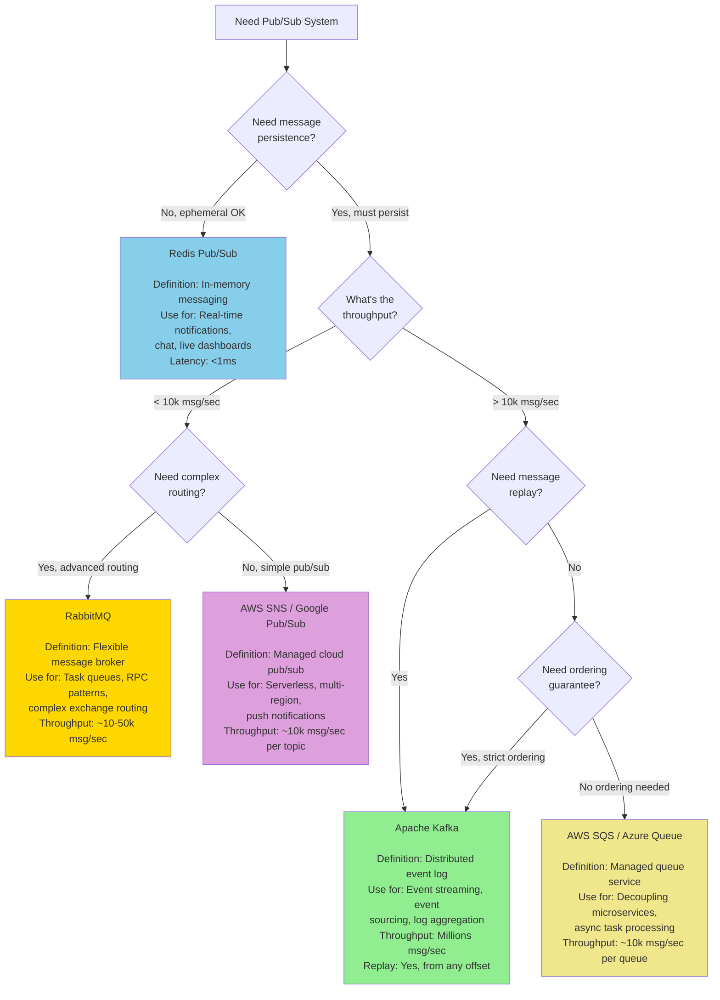
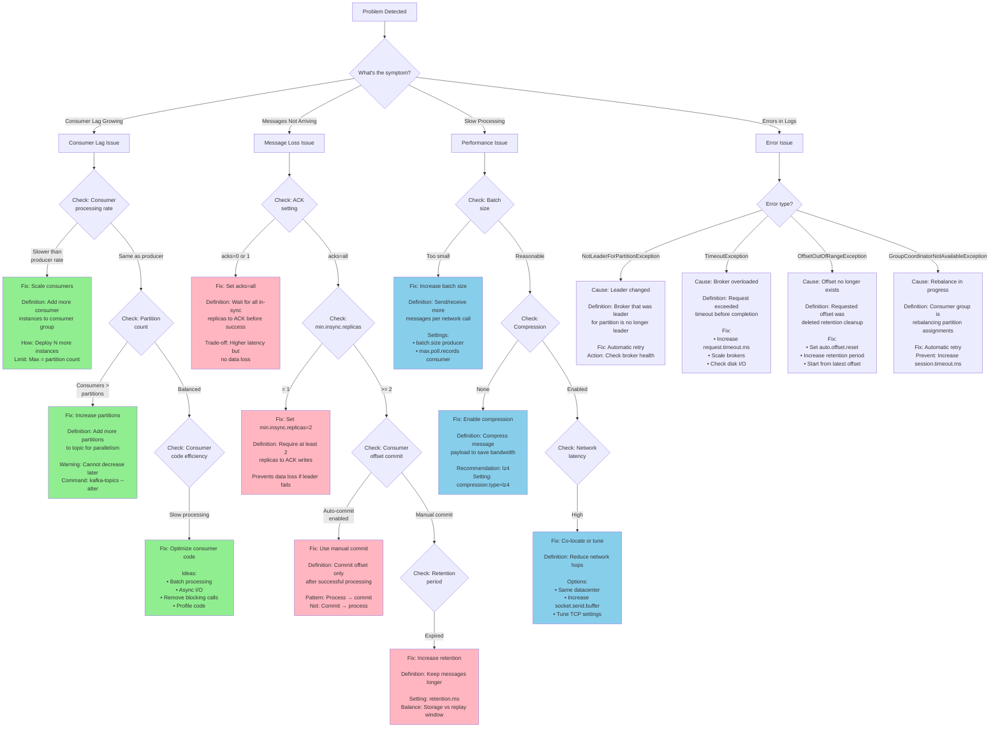

#system-design #pattern #messaging #architecture

# Pub/Sub (Publish-Subscribe)

## Intuition (30 sec)

A newspaper subscription: the publisher (newspaper) doesn't know who reads it. Subscribers sign up for topics they care about. Publisher sends once, all subscribers receive. Nobody needs to know about anyone else.

## Failure-First Scenario

> When a new user signs up, you need to: send welcome email, create analytics event, provision storage, notify admin. Your signup service directly calls 4 other services. If email service is slow, signup is slow. If analytics service goes down, signup fails. Tight coupling everywhere.

## Working Knowledge (5 min)

### Core Concept - Definition First

**Publish-Subscribe (Pub/Sub):**
- **Definition:** A messaging pattern where publishers send messages to topics without knowing who receives them, and subscribers receive messages from topics they're interested in without knowing who sent them.
- **Purpose:** Decouple message producers from consumers to enable independent scaling, resilience, and flexibility in distributed systems.
- **How it works:** Publishers send messages to a message broker organized by topics; the broker routes copies of each message to all active subscribers of that topic.

**Key Terms:**
- **Publisher:** A component that sends messages to a topic without knowledge of subscribers.
- **Subscriber:** A component that receives messages from topics it has registered interest in.
- **Topic:** A named channel or category that groups related messages for routing.
- **Message Broker:** The intermediary system (like Kafka, RabbitMQ, or Redis) that receives messages from publishers and distributes them to subscribers.
- **Message:** The data payload sent from publisher to subscribers, typically containing an event or notification.
- **Partition:** A subdivision of a topic that enables parallel processing and ordering guarantees (used in Kafka).
- **Consumer Group:** A set of subscribers that cooperate to consume messages from a topic, with each message delivered to only one member of the group.
- **Offset:** A position marker indicating which messages a subscriber has already consumed (Kafka-specific).

### Visual Model



### Comparison Table

| Pub/Sub | Point-to-Point (Queue) | Request-Response |
|---------|----------------------|------------------|
| One message → many consumers | One message → one consumer | One request → one response |
| Broadcasting events | Distributing work | Direct communication |
| "Something happened" | "Do this task" | "Do this now and tell me" |
| Async, decoupled | Async, load balancing | Sync, coupled |
| Kafka topics, SNS, Redis pub/sub | SQS, RabbitMQ queue | HTTP, gRPC, direct DB |

### Key Benefits

| Benefit | How | Example |
|---------|-----|---------|
| **Decoupling** | Publisher doesn't know about subscribers | Add email service without changing signup code |
| **Scalability** | Add subscribers without changing publisher | New analytics sink just subscribes to topic |
| **Resilience** | One slow subscriber doesn't block others | Slow email service doesn't delay analytics |
| **Fan-out** | One event triggers many actions | Single payment event → receipt, analytics, inventory |

---

## Layer 1: Conceptual Precision (15 min)

### Message Delivery Semantics - Deep Definitions

**At-Most-Once Delivery:**
- **Formal Definition:** A delivery guarantee where each message is delivered zero or one time, with no retries on failure.
- **Simple Definition:** Fire and forget - send it once, if it fails, too bad.
- **Analogy:** Shouting across a noisy room - if they didn't hear you, the message is lost.
- **Related Terms:** Differs from at-least-once (which retries) and exactly-once (which deduplicates).

**At-Least-Once Delivery:**
- **Formal Definition:** A delivery guarantee where each message is delivered one or more times until acknowledged, ensuring no messages are lost but allowing duplicates.
- **Simple Definition:** Keep trying until you get a confirmation, even if that means sending twice.
- **Analogy:** Certified mail - keep resending until you get a signature.
- **Related Terms:** Requires idempotent consumers to handle duplicates safely.

**Exactly-Once Delivery:**
- **Formal Definition:** A delivery guarantee where each message is delivered precisely once, with no loss and no duplicates, typically using deduplication and transactional semantics.
- **Simple Definition:** Guaranteed single delivery through tracking and deduplication.
- **Analogy:** Bank transfer - money moves exactly once, never lost or duplicated.
- **Related Terms:** Hardest to achieve, requires distributed transactions or idempotency keys.

**Why this matters:**
The delivery guarantee you choose fundamentally impacts your system's complexity and reliability. At-most-once is simple but lossy. At-least-once is reliable but requires idempotent consumers. Exactly-once is ideal but complex and expensive. Most production systems use at-least-once with idempotent processing.

### How Pub/Sub Works (Visual Flow)



**Step-by-step breakdown:**
1. **Subscription:** Subscribers register their interest in specific topics with the message broker, establishing routing rules.
2. **Publication:** Publisher sends a message to the broker with a topic identifier, without knowledge of how many subscribers exist.
3. **Routing:** Broker creates copies of the message and routes each copy to all active subscribers of that topic.
4. **Delivery:** Each subscriber receives its own copy of the message independently and asynchronously.
5. **Acknowledgment:** Subscribers send acknowledgments back to the broker to confirm processing (for at-least-once delivery).

### Message Lifecycle State Diagram



**State Definitions:**
- **Published:** Message has been sent to the broker and persisted to the topic.
- **Buffered:** Message is stored in the broker's queue/log awaiting delivery to subscribers.
- **InFlight:** Message has been sent to a subscriber but not yet acknowledged.
- **Acknowledged:** Subscriber has confirmed successful processing of the message.
- **Failed:** Subscriber failed to process the message (crash, exception, or explicit rejection).
- **DeadLetter:** Message moved to a special dead-letter queue after exceeding retry attempts.

### Fan-Out Patterns - Deep Dive

**Fan-out on Write (Push Model):**
- **Definition:** A pattern where data is replicated to all consumers' storage immediately when an event occurs, before any consumer requests it.
- **Purpose:** Optimize read performance by pre-computing and distributing data to all interested parties.
- **How it works:** When user A posts, immediately write to all followers' inboxes/feeds.

**Fan-out on Read (Pull Model):**
- **Definition:** A pattern where data remains centralized, and consumers aggregate/fetch data on-demand when they need it.
- **Purpose:** Avoid write amplification and storage duplication at the cost of read complexity.
- **How it works:** When user B opens their feed, query for posts from all followed users in real-time.

**Trade-offs Matrix:**
```
Fan-out on Write                     Fan-out on Read
════════════════════════════════════════════════════════════
Definition: Pre-compute and push     Definition: Aggregate on-demand
            data to all consumers                when requested

Pros:                                Pros:
• Fast reads (pre-computed)          • No write amplification
• Simple read logic                  • Storage efficient
• Guaranteed delivery                • Handles celebrity problem

Cons:                                Cons:
• Celebrity problem (1M writes)      • Slow reads (aggregate N sources)
• Storage duplication                • Complex read logic
• Wasted work (inactive users)       • May miss real-time updates

Use When:                            Use When:
• Few followers per user             • Many followers per user
• Read-heavy workload                • Write-heavy workload
• Real-time delivery critical        • Storage cost is critical
```

### Topic Design Patterns

**Broad Topics:**
- **Definition:** Topics that contain multiple event types, requiring subscribers to filter messages.
- **Example:** `user-events` containing UserCreated, UserUpdated, UserDeleted
- **Pros:** Fewer topics to manage, easier to add new event types
- **Cons:** Subscribers receive unwanted messages, must implement filtering logic

**Specific Topics:**
- **Definition:** Topics dedicated to a single event type for precise routing.
- **Example:** `user-created`, `user-updated`, `user-deleted` as separate topics
- **Pros:** Precise routing, subscribers only get relevant messages
- **Cons:** Topic proliferation, more broker configuration

**Partitioned Topics:**
- **Definition:** Topics divided into partitions for parallel processing and ordering guarantees.
- **Purpose:** Enable horizontal scaling while maintaining order within each partition.
- **How it works:** Messages with the same key go to the same partition, preserving order for that key.

```
Topic: "orders" (4 partitions)
════════════════════════════════════
Partition 0: [order-101] [order-105] [order-109]  ← Customer A orders
Partition 1: [order-102] [order-106] [order-110]  ← Customer B orders
Partition 2: [order-103] [order-107] [order-111]  ← Customer C orders
Partition 3: [order-104] [order-108] [order-112]  ← Customer D orders

Key: Partition = hash(customer_id) % 4
Result: All orders for Customer A stay in order within Partition 0
```

### Message Ordering Guarantees

**Ordering Guarantee:**
- **Definition:** A promise about the sequence in which messages are delivered relative to their send order.
- **Within Partition (Kafka):** Messages are strictly ordered - message N+1 comes after message N.
- **Across Partitions:** No global ordering - partition 0's messages may be delivered before partition 1's.
- **Single Topic (Redis Pub/Sub):** No ordering guarantee at all - network delays cause reordering.

**Why this matters:**
If you need "user created" to always happen before "user updated", put both events in the same partition (same user ID as key). If order doesn't matter (independent events), spread across partitions for parallelism.

### Architecture Pattern (With Definitions)

```
┌─────────────────────────────────────────────────────────────┐
│                      Publishers                              │
│  Definition: Services that emit events when state changes    │
│  Role: Decouple event source from event handling             │
│  Examples: API servers, background jobs, databases (CDC)     │
└─────────┬─────────────────────────────────┬─────────────────┘
          │                                 │
          │                                 │
    ┌─────▼─────────────────────────────────▼──────┐
    │         Message Broker (Kafka/RabbitMQ)      │
    │                                               │
    │  Definition: Distributed log or message queue │
    │  Role: Persist messages and route to subs     │
    │  Responsibilities:                            │
    │    • Topic management                         │
    │    • Message persistence                      │
    │    • Delivery tracking                        │
    │    • Replication & HA                         │
    └─────┬───────────────┬────────────────┬────────┘
          │               │                │
    ┌─────▼─────┐   ┌────▼────┐    ┌──────▼──────┐
    │Subscriber │   │Subscriber│    │Subscriber   │
    │ Group A   │   │ Group B  │    │ Group C     │
    │           │   │          │    │             │
    │ Role:     │   │ Role:    │    │ Role:       │
    │ Email     │   │ Analytics│    │ Warehouse   │
    └───────────┘   └──────────┘    └─────────────┘
```

**Component Definitions:**
- **Message Broker:** The central component that receives, stores, and routes messages between publishers and subscribers, providing durability and delivery guarantees.
- **Publisher:** Any service that sends messages to topics when events occur, completely decoupled from who receives the messages.
- **Subscriber Group:** A set of consumer instances that work together to process messages from a topic, with each message delivered to exactly one instance in the group for load balancing.

---

## Layer 2: Technology-Specific Examples (20 min)

### Technology Comparison (With Definitions)

**Message Broker Category:** Distributed systems that facilitate asynchronous communication between services

| Apache Kafka | Redis Pub/Sub | RabbitMQ |
|--------------|---------------|----------|
| **Definition:** Distributed event streaming platform and commit log | **Definition:** In-memory data structure store with publish/subscribe messaging | **Definition:** Message broker with flexible routing via exchanges |
| **Best For:** High-throughput event streaming, event sourcing, log aggregation | **Best For:** Real-time messaging, chat, live updates with low latency | **Best For:** Complex routing, task queues, RPC patterns |
| ⭐⭐⭐⭐⭐ Throughput (millions/sec) | ⭐⭐⭐⭐ Throughput (thousands/sec) | ⭐⭐⭐ Throughput (thousands/sec) |
| ⭐⭐⭐⭐⭐ Durability (persistent log) | ⭐ Durability (in-memory, optional persistence) | ⭐⭐⭐⭐ Durability (persistent queues) |
| ⭐⭐⭐⭐ Ordering (per partition) | ⭐ Ordering (none guaranteed) | ⭐⭐⭐ Ordering (per queue) |
| ⭐⭐⭐⭐⭐ Replay (from any offset) | ⭐ Replay (none - ephemeral) | ⭐⭐ Replay (limited via rejected messages) |
| ⭐⭐ Latency (10-50ms) | ⭐⭐⭐⭐⭐ Latency (<1ms) | ⭐⭐⭐ Latency (5-20ms) |

### Kafka Configuration (Annotated)

```yaml
# Kafka Topic Configuration

topic: user-events
partitions: 12           # Definition: Number of parallel processing lanes
                         # Rule: Set to expected consumer count for max parallelism
                         # Example: 12 consumers = 12 partitions (1:1 mapping)

replication_factor: 3    # Definition: Number of broker copies for fault tolerance
                         # Purpose: Survive broker failures (N-1 failures tolerated)
                         # Production minimum: 3 (tolerates 2 broker failures)

retention_ms: 604800000  # Definition: How long messages are kept (7 days)
                         # Purpose: Balance storage cost vs replay ability
                         # When to change: Increase for audit trails, decrease for ephemeral data

min_insync_replicas: 2   # Definition: Minimum replicas that must ACK writes
                         # Purpose: Guarantee durability (avoid data loss)
                         # Formula: Should be replication_factor - 1

compression_type: lz4    # Definition: Algorithm to compress messages
                         # Options: none, gzip, snappy, lz4, zstd
                         # Recommendation: lz4 (good balance of speed/ratio)

# Producer Configuration
acks: all                # Definition: ACK requirement before considering write successful
                         # Options: 0 (no ACK), 1 (leader only), all (all in-sync replicas)
                         # Use 'all' for critical data to prevent loss

retries: 2147483647      # Definition: Number of retry attempts for failed sends
                         # Purpose: Ensure delivery despite transient failures
                         # Max int for infinite retries (rely on timeout instead)

max_in_flight_requests_per_connection: 5
                         # Definition: Max unacknowledged requests sent concurrently
                         # Purpose: Balance throughput vs ordering
                         # Set to 1 for strict ordering, 5+ for throughput

# Consumer Configuration
enable_auto_commit: false # Definition: Whether to automatically commit offsets
                          # Recommendation: false (manual commit for at-least-once)
                          # Reason: Control exactly when offset advances

auto_offset_reset: earliest # Definition: What to do when no offset exists
                            # Options: earliest (start from beginning), latest (skip to end)
                            # Use 'earliest' to process all historical data

max_poll_records: 500       # Definition: Max records returned in single poll()
                            # Purpose: Control batch size for processing
                            # Balance: Large = throughput, Small = latency

session_timeout_ms: 10000   # Definition: Max time consumer can be silent before kicked
                            # Purpose: Detect dead consumers for rebalancing
                            # Increase if processing takes longer than 10s
```

**Configuration Concepts:**
- **Partitions:** Independent parallel processing lanes within a topic that enable horizontal scaling.
- **Replication Factor:** Number of copies of each partition stored across different brokers for fault tolerance.
- **Retention:** Time-based or size-based limit on how long messages are stored before deletion.
- **ACK Levels:** Publisher's requirement for confirmation before considering a message successfully sent.
- **Offset:** A sequential ID assigned to each message in a partition, used by consumers to track progress.

### Kafka Producer Example (Python)

```python
from kafka import KafkaProducer
import json

# Initialize producer with reliability settings
producer = KafkaProducer(
    bootstrap_servers=['kafka-1:9092', 'kafka-2:9092', 'kafka-3:9092'],

    # Serialization: Convert Python objects to bytes
    value_serializer=lambda v: json.dumps(v).encode('utf-8'),
    key_serializer=lambda k: k.encode('utf-8') if k else None,

    # Reliability: Wait for all replicas to acknowledge
    acks='all',  # Definition: All in-sync replicas must ACK

    # Retries: Keep trying on transient failures
    retries=3,   # Definition: Retry 3 times before failing

    # Idempotence: Prevent duplicates from retries
    enable_idempotence=True,  # Definition: Deduplicate retries on broker side

    # Compression: Save network bandwidth
    compression_type='lz4',  # Definition: Fast compression algorithm
)

# Publish message with partition key
user_event = {
    'event_type': 'UserCreated',
    'user_id': 12345,
    'email': 'user@example.com',
    'timestamp': '2026-02-15T10:30:00Z'
}

# Key ensures all events for user 12345 go to same partition (preserving order)
future = producer.send(
    topic='user-events',
    key=str(user_event['user_id']),  # Partition key
    value=user_event,
    headers=[('source', b'signup-service')]  # Optional metadata
)

# Wait for acknowledgment (blocking)
record_metadata = future.get(timeout=10)
print(f"Message sent to partition {record_metadata.partition} at offset {record_metadata.offset}")

producer.flush()  # Ensure all buffered messages are sent
producer.close()  # Cleanup
```

### Kafka Consumer Example (Python)

```python
from kafka import KafkaConsumer
import json

# Initialize consumer
consumer = KafkaConsumer(
    'user-events',  # Topic to subscribe to

    bootstrap_servers=['kafka-1:9092', 'kafka-2:9092'],

    # Consumer group: Load balance messages across instances
    group_id='email-service',  # Definition: All instances with same group_id share work

    # Deserialization
    value_deserializer=lambda m: json.loads(m.decode('utf-8')),

    # Offset management: Manual commit for at-least-once delivery
    enable_auto_commit=False,  # Definition: We control when to mark message as processed

    # Starting position: Where to start if no offset exists
    auto_offset_reset='earliest',  # Definition: Start from beginning of topic

    # Performance tuning
    max_poll_records=100,  # Definition: Process 100 messages per poll
)

# Process messages
try:
    for message in consumer:
        # Message contains: topic, partition, offset, key, value, timestamp

        event = message.value
        print(f"Processing {event['event_type']} for user {event['user_id']}")

        # Business logic
        if event['event_type'] == 'UserCreated':
            send_welcome_email(event['email'])

        # Manual commit: Only advance offset after successful processing
        # Definition: Tell Kafka "I successfully processed this message"
        consumer.commit()  # Commits current offset

except KeyboardInterrupt:
    print("Shutting down...")
finally:
    consumer.close()  # Cleanup: Leave consumer group gracefully
```

### Redis Pub/Sub Configuration (Annotated)

```redis
# Redis Pub/Sub is ephemeral and in-memory (no durability by default)

# Subscribe to channel
SUBSCRIBE user-events     # Definition: Register interest in 'user-events' channel
                          # Result: Receive all future messages (not historical)

# Subscribe with pattern matching
PSUBSCRIBE user-*         # Definition: Subscribe to all channels matching pattern
                          # Example: Receives from 'user-events', 'user-notifications', etc.

# Publish message
PUBLISH user-events '{"event":"UserCreated","user_id":123}'
                          # Definition: Send message to all current subscribers
                          # Result: Returns number of subscribers who received it

# Configuration in redis.conf
notify-keyspace-events Ex  # Definition: Enable keyspace notifications
                          # E = Keyevent events
                          # x = Expired events
                          # Purpose: Get pub/sub events for key expiration

timeout 0                 # Definition: Never close idle client connections
                          # Purpose: Keep long-lived subscriber connections open

tcp-keepalive 300         # Definition: Send TCP keepalive every 300 seconds
                          # Purpose: Detect dead connections

maxmemory-policy noeviction # Definition: Don't evict keys when memory full
                            # Purpose: Prevent losing pub/sub metadata
```

**Redis Pub/Sub Characteristics:**
- **Ephemeral:** Messages are fire-and-forget; if no subscriber is listening, message is lost
- **No Persistence:** Messages are not stored; used for real-time notifications only
- **No Replay:** Cannot read historical messages; subscribers only receive new messages after subscribing
- **Low Latency:** Sub-millisecond delivery for real-time use cases
- **No Ordering:** Network delays can cause reordering of messages

### Redis Pub/Sub Example (Python)

```python
import redis
import json
import threading

# Publisher
def publish_events():
    r = redis.Redis(host='localhost', port=6379, decode_responses=True)

    event = {
        'event_type': 'UserCreated',
        'user_id': 12345,
        'timestamp': '2026-02-15T10:30:00Z'
    }

    # Publish returns number of subscribers who received the message
    num_subscribers = r.publish('user-events', json.dumps(event))
    print(f"Message delivered to {num_subscribers} subscribers")

# Subscriber
def subscribe_to_events():
    r = redis.Redis(host='localhost', port=6379, decode_responses=True)
    pubsub = r.pubsub()

    # Subscribe to channel
    pubsub.subscribe('user-events')
    print("Subscribed to user-events")

    # Listen for messages (blocking)
    for message in pubsub.listen():
        # Message types:
        # - 'subscribe': Confirmation of subscription
        # - 'message': Actual published message

        if message['type'] == 'message':
            event = json.loads(message['data'])
            print(f"Received: {event['event_type']} for user {event['user_id']}")

            # Process event (no ACK needed - fire and forget)
            handle_event(event)

# Pattern subscription for multiple channels
def subscribe_with_pattern():
    r = redis.Redis(host='localhost', port=6379, decode_responses=True)
    pubsub = r.pubsub()

    # Subscribe to all user-related channels
    pubsub.psubscribe('user-*')  # Matches: user-events, user-notifications, etc.

    for message in pubsub.listen():
        if message['type'] == 'pmessage':  # Pattern message
            channel = message['channel']
            data = message['data']
            print(f"Received from {channel}: {data}")

# Run subscriber in background thread
subscriber_thread = threading.Thread(target=subscribe_to_events, daemon=True)
subscriber_thread.start()

# Publish event
publish_events()
```

### RabbitMQ Configuration (Annotated)

```python
import pika
import json

# Connection configuration
credentials = pika.PlainCredentials('username', 'password')
parameters = pika.ConnectionParameters(
    host='localhost',
    port=5672,
    virtual_host='/',        # Definition: Logical separation of exchanges/queues
    credentials=credentials,
    heartbeat=60,            # Definition: Send keepalive every 60s to detect dead connections
    connection_attempts=3,    # Definition: Retry connection 3 times before failing
    retry_delay=2,           # Definition: Wait 2 seconds between connection attempts
)

connection = pika.BlockingConnection(parameters)
channel = connection.channel()

# Declare exchange (pub/sub router)
channel.exchange_declare(
    exchange='user-events',
    exchange_type='fanout',   # Definition: Broadcast to all bound queues (pub/sub pattern)
                              # Other types: 'direct' (routing key), 'topic' (pattern matching), 'headers'
    durable=True,             # Definition: Survive broker restart
    auto_delete=False,        # Definition: Don't delete when last queue unbinds
)

# Declare queue for subscriber
channel.queue_declare(
    queue='email-service-queue',
    durable=True,             # Definition: Persist queue metadata across restarts
    exclusive=False,          # Definition: Allow multiple consumers
    auto_delete=False,        # Definition: Don't delete when last consumer disconnects
    arguments={
        'x-message-ttl': 86400000,  # Definition: Messages expire after 24 hours (milliseconds)
        'x-max-length': 100000,     # Definition: Queue holds max 100k messages
        'x-overflow': 'reject-publish',  # Definition: Reject new messages when full
    }
)

# Bind queue to exchange (establish subscription)
channel.queue_bind(
    queue='email-service-queue',
    exchange='user-events',
    routing_key='',           # Empty for fanout (ignored)
)

# Publish message
message = {
    'event_type': 'UserCreated',
    'user_id': 12345,
}

channel.basic_publish(
    exchange='user-events',
    routing_key='',           # Ignored for fanout exchange
    body=json.dumps(message),
    properties=pika.BasicProperties(
        delivery_mode=2,      # Definition: Persistent message (survive broker restart)
        content_type='application/json',
        priority=5,           # Definition: Message priority (0-9, higher = more important)
    )
)

# Consume messages
def callback(ch, method, properties, body):
    event = json.loads(body)
    print(f"Received: {event['event_type']}")

    # Process message
    send_welcome_email(event)

    # Manual ACK after successful processing (at-least-once delivery)
    ch.basic_ack(delivery_tag=method.delivery_tag)

channel.basic_qos(prefetch_count=10)  # Definition: Deliver max 10 unacked messages at once
channel.basic_consume(
    queue='email-service-queue',
    on_message_callback=callback,
    auto_ack=False,           # Definition: Manual ACK for reliability
)

channel.start_consuming()  # Blocking call
```

---

## Layer 3: Production-Ready Details (30 min)

### Production Architecture (Fully Annotated)

```
                           Internet / Clients
                                  │
                    ┌─────────────▼─────────────┐
                    │      API Gateway          │
                    │                           │
                    │ Definition: Entry point   │
                    │ Purpose: Authentication,  │
                    │         rate limiting     │
                    └─────────────┬─────────────┘
                                  │
        ┌─────────────────────────┼─────────────────────────┐
        │                         │                         │
  ┌─────▼──────┐         ┌───────▼────────┐       ┌───────▼────────┐
  │  Service A │         │   Service B    │       │   Service C    │
  │ (Publisher)│         │  (Publisher)   │       │  (Publisher)   │
  │            │         │                │       │                │
  │ Role: Emit │         │ Role: Emit     │       │ Role: Emit     │
  │ user events│         │ order events   │       │ payment events │
  └─────┬──────┘         └───────┬────────┘       └───────┬────────┘
        │                        │                        │
        └────────────────────────┼────────────────────────┘
                                 │
                    ┌────────────▼─────────────┐
                    │   Kafka Cluster          │
                    │   (Message Broker)       │
                    │                          │
                    │ ┌──────┐  ┌──────┐      │
                    │ │Broker│  │Broker│      │
                    │ │  1   │  │  2   │      │
                    │ └──────┘  └──────┘      │
                    │ ┌──────┐                │
                    │ │Broker│  Definition:   │
                    │ │  3   │  Distributed   │
                    │ └──────┘  commit log    │
                    │                          │
                    │ Topics: user-events,     │
                    │         order-events,    │
                    │         payment-events   │
                    └────────────┬─────────────┘
                                 │
        ┌────────────────────────┼────────────────────────┐
        │                        │                        │
  ┌─────▼─────────┐    ┌────────▼────────┐    ┌─────────▼────────┐
  │ Consumer      │    │ Consumer Group  │    │ Consumer Group   │
  │ Group: Email  │    │ Group: Analytics│    │ Group: Warehouse │
  │               │    │                 │    │                  │
  │ ┌──────────┐  │    │ ┌────┐  ┌────┐ │    │ ┌────┐           │
  │ │Instance 1│  │    │ │Ins1│  │Ins2│ │    │ │Ins1│           │
  │ └──────────┘  │    │ └────┘  └────┘ │    │ └────┘           │
  │               │    │ ┌────┐  ┌────┐ │    │                  │
  │ Role: Send    │    │ │Ins3│  │Ins4│ │    │ Role: ETL to     │
  │ notifications │    │ └────┘  └────┘ │    │ data warehouse   │
  │               │    │                 │    │                  │
  │               │    │ Role: Stream    │    │ Definition:      │
  │               │    │ processing      │    │ Batch load data  │
  └───────────────┘    └─────────────────┘    └──────────────────┘
                                │
                    ┌───────────▼────────────┐
                    │  Monitoring Stack      │
                    │                        │
                    │  • Prometheus          │
                    │  • Grafana             │
                    │  • Kafka Exporter      │
                    │  • Consumer Lag Monitor│
                    └────────────────────────┘
```

**Architecture Component Definitions:**
- **Kafka Cluster:** A distributed system of 3+ broker nodes that store and replicate messages across topics and partitions for fault tolerance.
- **Consumer Group:** A logical grouping of consumer instances that share the work of processing messages from a topic, with each partition assigned to exactly one instance in the group.
- **Replication:** Each partition has N replicas across different brokers; one is leader (serves reads/writes), others are followers (replicate data).
- **Zookeeper/KRaft:** Coordination service for managing Kafka cluster metadata, leader election, and consumer group coordination (KRaft is the newer Zookeeper-free mode).

### Monitoring Metrics (With Definitions)

```
┌────────────────────────────────────────────────────────────┐
│              KAFKA METRICS DASHBOARD                       │
├────────────────────────────────────────────────────────────┤
│                                                            │
│ Messages In Per Second: 12,473/sec                        │
│ Definition: Rate of messages published to all topics      │
│ Why track: Indicates producer load on cluster             │
│ Alert when: Sudden drops (upstream failure) or spikes     │
│            (potential overload)                            │
│                                                            │
│ Messages Out Per Second: 11,982/sec                       │
│ Definition: Rate of messages consumed by all consumers    │
│ Why track: Should match messages in (± buffer lag)        │
│ Alert when: Out < In for extended period (consumer lag)   │
│                                                            │
│ Consumer Lag: 45,231 messages                             │
│ Definition: Number of messages produced but not yet       │
│            consumed (latest offset - committed offset)    │
│ Why track: Primary health indicator for consumers         │
│ Alert when: > 100k messages or growing steadily           │
│ Impact: High lag → stale data, delayed processing         │
│                                                            │
│ Partition Leader Distribution:                            │
│   Broker 1: 156 leaders                                   │
│   Broker 2: 152 leaders                                   │
│   Broker 3: 158 leaders                                   │
│ Definition: Number of partitions each broker leads        │
│ Why track: Ensure even load distribution                  │
│ Alert when: Imbalance > 20% (one broker overloaded)       │
│                                                            │
│ Under-Replicated Partitions: 0                            │
│ Definition: Partitions with fewer replicas than           │
│            configured replication factor                  │
│ Why track: Indicates broker failure or replication lag    │
│ Alert when: > 0 (data at risk)                            │
│ Impact: Data loss possible if leader broker fails         │
│                                                            │
│ Request Latency (P99): 23ms                               │
│ Definition: 99% of produce requests complete within this  │
│ Why track: Measure broker performance                     │
│ Alert when: > 100ms (broker overloaded or disk slow)      │
│                                                            │
│ Disk Usage: 2.3 TB / 5 TB (46%)                           │
│ Definition: Space used by message log storage             │
│ Why track: Prevent out-of-space failures                  │
│ Alert when: > 80% (time to scale storage or reduce        │
│            retention)                                      │
│                                                            │
│ Failed Fetch Requests: 12/sec                             │
│ Definition: Consumer fetch requests that failed           │
│ Why track: Indicates consumer or network issues           │
│ Alert when: > 1% of total requests                        │
└────────────────────────────────────────────────────────────┘

┌────────────────────────────────────────────────────────────┐
│           CONSUMER GROUP METRICS DASHBOARD                 │
├────────────────────────────────────────────────────────────┤
│                                                            │
│ Group: email-service                                       │
│                                                            │
│ ┌─────────────┬─────────────┬──────────────┬─────────┐   │
│ │ Partition   │ Current     │ Log End      │ Lag     │   │
│ │             │ Offset      │ Offset       │         │   │
│ ├─────────────┼─────────────┼──────────────┼─────────┤   │
│ │ 0           │ 1,234,567   │ 1,234,600    │ 33      │   │
│ │ 1           │ 1,198,432   │ 1,203,891    │ 5,459   │ ⚠ │
│ │ 2           │ 1,299,001   │ 1,299,001    │ 0       │   │
│ │ 3           │ 1,156,778   │ 1,189,902    │ 33,124  │ ⚠ │
│ └─────────────┴─────────────┴──────────────┴─────────┘   │
│                                                            │
│ Definition of columns:                                     │
│ • Current Offset: Last message committed by this consumer │
│ • Log End Offset: Latest message in partition             │
│ • Lag: Log End Offset - Current Offset                    │
│                                                            │
│ Total Lag: 38,616 messages                                │
│ Alert: Partitions 1 and 3 falling behind                  │
│                                                            │
│ Consumer Rebalances: 2 in last 24h                        │
│ Definition: Number of times partitions were reassigned    │
│            among consumer group members                    │
│ Why track: Frequent rebalances disrupt processing         │
│ Alert when: > 5 per hour (unstable consumers)             │
└────────────────────────────────────────────────────────────┘
```

**Metric Definitions:**
- **Consumer Lag:** The difference between the highest offset in a partition and the offset last committed by a consumer, measured in number of messages.
- **Offset:** A unique sequential ID assigned to each message in a partition, starting from 0.
- **Under-Replicated Partition:** A partition where one or more follower replicas are not caught up with the leader, putting data at risk.
- **Request Latency:** Time taken for the broker to respond to a produce or fetch request, measured at various percentiles (P50, P99, P999).
- **Rebalance:** The process of redistributing partition assignments among consumers in a group when members join or leave.

### Decision Tree: Choosing a Message Broker



**Decision Criteria Definitions:**
- **Message Persistence:** Whether messages must survive broker restarts and be stored to disk (vs in-memory only).
- **Throughput:** The rate of messages the system can handle, measured in messages per second.
- **Message Replay:** The ability to re-read historical messages from any point in time, not just the latest.
- **Ordering Guarantee:** A promise that messages are delivered in the order they were sent.
- **Complex Routing:** Need for pattern matching, content-based routing, or multiple routing rules (exchanges in RabbitMQ).

### Troubleshooting Guide (With Explanations)



### Common Issues and Solutions

**Issue 1: Consumer Lag**
- **Definition:** Consumers cannot keep up with message production rate, causing backlog.
- **Symptoms:** Increasing lag metric, stale data, delayed processing.
- **Root Causes:**
  - Not enough consumer instances (under-provisioned)
  - Slow processing logic (inefficient code)
  - Not enough partitions (parallelism limit)
  - Consumer keeps rebalancing (unstable)
- **Solutions:**
  1. **Scale horizontally:** Add more consumer instances (up to partition count)
  2. **Optimize code:** Profile and improve consumer processing speed
  3. **Increase partitions:** Add partitions for more parallelism (cannot undo)
  4. **Batch processing:** Process multiple messages at once
  5. **Async I/O:** Don't block on external calls

**Issue 2: Message Loss**
- **Definition:** Messages are sent but never received by consumers.
- **Symptoms:** Missing data, gaps in event stream, inconsistent state.
- **Root Causes:**
  - acks=0 or 1 (not waiting for replication)
  - min.insync.replicas=1 (no redundancy)
  - Auto-commit before processing complete
  - Consumer crashes before committing offset
  - Message expired due to retention
- **Solutions:**
  1. **Set acks=all:** Wait for all in-sync replicas to acknowledge
  2. **Set min.insync.replicas=2:** Require 2+ replicas for writes
  3. **Manual commit:** Commit offset only after successful processing
  4. **Idempotent producer:** Enable idempotence to prevent duplicates from retries
  5. **Increase retention:** Keep messages longer (balance with storage cost)

**Issue 3: Rebalancing Storm**
- **Definition:** Consumer group constantly rebalances, disrupting processing.
- **Symptoms:** Frequent "Rebalancing" logs, processing stops, high lag.
- **Root Causes:**
  - session.timeout.ms too low (false positives)
  - max.poll.interval.ms exceeded (slow processing)
  - Consumer crashes and restarts frequently
  - Network instability
- **Solutions:**
  1. **Increase session.timeout.ms:** Give consumers more time before kicked (e.g., 30s)
  2. **Increase max.poll.interval.ms:** Allow longer processing time (e.g., 5 minutes)
  3. **Reduce max.poll.records:** Process fewer messages per batch
  4. **Fix consumer crashes:** Debug and stabilize consumer code
  5. **Sticky assignor:** Use CooperativeStickyAssignor to minimize rebalancing impact

### Capacity Planning (Definitions + Math)

**Capacity Planning:**
- **Definition:** Process of determining infrastructure resources (brokers, partitions, storage) needed to meet performance and reliability targets.
- **Goal:** Right-size Kafka cluster to handle expected load with headroom for growth.

**Key Metrics:**
- **Messages Per Second (MPS):** Rate of messages published to the system.
- **Message Size:** Average size of each message in bytes.
- **Throughput:** MPS × Message Size = bytes per second.
- **Retention:** How long messages are stored before deletion.
- **Replication Factor:** Number of copies of each partition.

```
Calculation Example:

Given Requirements:
• Expected traffic: 100,000 messages/second
• Average message size: 1 KB (1,024 bytes)
• Retention: 7 days
• Replication factor: 3
• Availability: 99.9%

Step 1: Calculate throughput
  Definition: Throughput = messages/sec × message size
  Throughput = 100,000 msg/sec × 1 KB = 100 MB/sec

Step 2: Calculate storage needed (before replication)
  Definition: Storage = throughput × retention period
  Storage = 100 MB/sec × 7 days
  Storage = 100 MB/sec × 604,800 sec = 60,480,000 MB
  Storage = 60.48 TB

Step 3: Account for replication
  Definition: Replicated storage = storage × replication factor
  Replicated storage = 60.48 TB × 3 = 181.44 TB

Step 4: Add headroom (50% for growth and compaction)
  Total storage = 181.44 TB × 1.5 = 272.16 TB

Step 5: Determine partition count
  Rule: Each partition can handle ~10-50 MB/sec (depends on hardware)
  Assume 20 MB/sec per partition for safety

  Partitions needed = 100 MB/sec ÷ 20 MB/sec = 5 partitions minimum

  Best practice: More partitions for consumer parallelism
  Recommended: 20-50 partitions (allows 20-50 parallel consumers)

Step 6: Determine broker count
  Storage per broker = 272.16 TB ÷ broker count
  Assume 10 TB disks per broker

  Brokers for storage = 272.16 TB ÷ 10 TB = 27.2 → 28 brokers

  Brokers for throughput: Each broker handles ~500 MB/sec
  Brokers needed = 100 MB/sec × 3 (replication) ÷ 500 MB/sec = 0.6 → 1 broker

  For availability (tolerating N-1 failures): Minimum 3 brokers

  Final broker count = max(28, 3) = 28 brokers

Step 7: Verify availability
  With 28 brokers and replication factor 3:
  • Can tolerate 2 broker failures (still 26 brokers with full data)
  • Meets 99.9% availability requirement

Result:
  • 28 brokers (10 TB disk each)
  • 20-50 partitions per topic
  • 3× replication
  • 100 MB/sec throughput supported
  • 7 days retention
```

**Resource Calculation Rules:**
- **Partitions:** More partitions = more parallelism, but more overhead. Rule of thumb: 2-4 partitions per broker.
- **Brokers:** Determined by max(storage needs, throughput needs, availability needs).
- **Replication Factor:** Standard is 3 (tolerates 2 failures), minimum production is 2.
- **Retention:** Balance between replay capability and storage cost. Common values: 3 days (ephemeral), 7 days (standard), 30+ days (audit/compliance).

---

## Real-World Examples

### Example 1: LinkedIn - Kafka for Activity Streams

**Problem Definition:**
LinkedIn needed to track user activity (profile views, connection requests, messages) across hundreds of services in real-time while supporting both real-time feeds and batch analytics on the same data.

**Solution Definition:**
LinkedIn invented and open-sourced Apache Kafka as a distributed commit log to unify real-time and batch data processing using a single pub/sub platform.

**Technical Terms Used:**
- **Activity Stream:** A chronological sequence of user actions (events) on the platform.
- **Commit Log:** An append-only, ordered sequence of records that persists to disk.
- **Dual-Mode Processing:** Serving both real-time consumers (notifications) and batch consumers (analytics) from the same topic.

**Before:**
```
   User Action (e.g., profile view)
              │
      ┌───────┴────────┐
      │                │
      ▼                ▼
  Real-Time      Batch Storage
  Database         (HDFS)
      │                │
   Queried by      Queried by
   Web Services    Analytics Jobs

Problem:
• Data written twice (duplication)
• Different formats (inconsistency)
• Delayed analytics (batch only)
• Tight coupling to DB
```

**After (With Kafka):**
```
   User Action (e.g., profile view)
              │
              ▼
   ┌──────────────────┐
   │ Kafka Topic:     │
   │ member-activity  │
   │                  │
   │ Retention: 7 days│
   │ Partitions: 100  │
   │ Replication: 3   │
   └────────┬─────────┘
            │
    ┌───────┼────────┐
    │       │        │
    ▼       ▼        ▼
 Real-Time Feed  Analytics  Monitoring
 Consumer    Consumer    Consumer
    │           │           │
    ▼           ▼           ▼
  Redis     Hadoop/     Grafana
  Cache    Cassandra   Dashboards

Benefits:
• Single source of truth
• Real-time + batch from same data
• Replay for reprocessing
• Decoupled producers/consumers
```

**Results:**
- **Throughput:** Scaled to 7+ trillion messages per day (2018 numbers)
- **Latency:** P99 latency < 50ms for publishing
- **Durability:** Zero data loss with replication factor 3
- **Replay:** Enabled reprocessing historical data when adding new features
- **Decoupling:** Teams could add new consumers without coordinating with publishers

**Architecture Evolution:**
1. **2010:** Initial deployment for activity tracking
2. **2011:** Expanded to log aggregation (replacing Scribe)
3. **2012:** Became backbone for all inter-service messaging
4. **2015:** Added Kafka Streams for stream processing
5. **2018:** Processing 7 trillion messages/day across 1400+ brokers

**Key Insight:**
LinkedIn's Kafka deployment demonstrates that pub/sub at scale requires treating messages as a durable, replayable log rather than ephemeral fire-and-forget events. This enabled unified real-time and batch processing.

### Example 2: Netflix - Event-Driven Microservices

**Problem Definition:**
Netflix needed to decouple 700+ microservices to avoid cascading failures while maintaining real-time user experience (viewing history, recommendations, billing) across 200+ million subscribers.

**Solution Definition:**
Netflix uses Apache Kafka and proprietary systems (Delta, Key-Value) as event buses to implement choreography-based event-driven architecture, where services react to events without direct coupling.

**Technical Terms Used:**
- **Choreography:** Services react to events independently without central orchestrator (vs orchestration where a coordinator directs services).
- **Change Data Capture (CDC):** Capturing database changes as events and publishing to Kafka.
- **Event Sourcing:** Storing state changes as events rather than current state snapshots.
- **Viewing History Stream:** Real-time stream of what users watch, used by recommendations, billing, analytics.

**Before (Synchronous Service Calls):**
```
   User presses "Play"
         │
         ▼
   ┌─────────┐
   │ Playback│
   │ Service │
   └────┬────┘
        │
   ┌────┼────────────────┐
   │    │                │
   │    ▼                ▼
   │ Update         Update      Update
   │ Viewing ──────>Recommend────>Billing
   │ History        Service      Service
   │    │
   │    │ If any service is down or slow,
   │    │ user sees error or delay
   │    ▼
   │  FAIL → User sees error

Problem:
• Tight coupling → cascading failures
• Timeout chain (1 slow service blocks all)
• Need retries and circuit breakers everywhere
• Hard to add new consumers (change all publishers)
```

**After (Event-Driven with Kafka):**
```
   User presses "Play"
         │
         ▼
   ┌─────────┐
   │ Playback│
   │ Service │
   └────┬────┘
        │
        ▼ Publish event
   ┌──────────────────────┐
   │ Kafka Topic:         │
   │ viewing-events       │
   │                      │
   │ Event: {             │
   │   user_id: 12345,    │
   │   title: "Stranger", │
   │   timestamp: ...     │
   │ }                    │
   └──────┬───────────────┘
          │
   ┌──────┼──────┬────────┐
   │      │      │        │
   ▼      ▼      ▼        ▼
 Viewing  Rec  Billing  Analytics
 History  Eng  Service  Service
   │      │      │        │
   ▼      ▼      ▼        ▼
 Updates Updates Updates   Stores
 Profile Algo   Charges   Metrics

Benefits:
• Playback service returns immediately
• If Billing is down, viewing still works
• Easy to add new consumers (just subscribe)
• Replay events for debugging/testing
• Natural audit trail of all actions
```

**Netflix-Specific Architecture:**
Netflix uses multiple event systems:

1. **Apache Kafka:**
   - **Use:** High-throughput event streams (viewing events, device events)
   - **Scale:** Petabytes of data, thousands of topics
   - **Retention:** 7 days for most topics

2. **Delta (Proprietary):**
   - **Definition:** Netflix's internal pub/sub for low-latency updates
   - **Use:** Real-time notifications, cache invalidation
   - **Latency:** < 10ms

3. **Key-Value Stores (CDC):**
   - **Definition:** Capture database changes as events
   - **Use:** Profile updates, subscription changes
   - **Pattern:** DB write → CDC → Kafka → Consumers

**Results:**
- **Availability:** Services isolated from each other's failures
- **Scalability:** Added 100+ new event consumers without changing producers
- **Latency:** Playback starts immediately (no blocking on downstream services)
- **Debugging:** Replay events to reproduce production issues in dev
- **Innovation:** New features (e.g., "Top 10 in your country") added by subscribing to existing events

**Specific Use Case: Viewing History + Recommendations**
```
Event Flow:
1. User watches "Stranger Things" S1E1 for 25 minutes
   → Playback service publishes: ViewingEvent{user: 123, title: "ST", duration: 25m}

2. Kafka routes to multiple consumers:

   Consumer A (Viewing History Service):
   • Stores: "User 123 watched ST S1E1"
   • Updates profile page

   Consumer B (Recommendation Engine):
   • Analyzes: User likes sci-fi, thriller
   • Updates: "Users who watched ST also watched..."
   • Triggers: Re-train personalization model

   Consumer C (Billing Service):
   • Tracks: User actively using service (for churn prediction)
   • No action needed (subscription still active)

   Consumer D (Analytics):
   • Aggregates: ST view count, completion rate
   • Feeds: Executive dashboard, content team

3. All consumers process independently
   • If Billing is down: Viewing history still updates
   • If Recommendations fail: User can still watch
   • No cascading failures
```

**Key Insight:**
Netflix demonstrates that at massive scale (700+ services), pub/sub with choreography is more resilient than orchestration. Services react to events without knowing about each other, preventing cascading failures.

### Example 3: Uber - Real-Time Matching via Event Streams

**Problem Definition:**
Uber needs to match riders with nearby drivers in real-time (<1 second latency) while updating driver locations every 4 seconds from millions of drivers globally.

**Solution Definition:**
Uber uses Kafka as the event backbone for real-time driver location updates, rider requests, and matching events, with stream processing via Flink for geospatial matching.

**Before:**
```
Driver location update → DB write → Matching service polls DB
↓
Slow (500ms latency), DB overload, stale data
```

**After (Event-Driven):**
```
Driver app → Kafka (location-updates topic) → Flink (geospatial processor) → Kafka (matches topic) → Rider app
↓
Fast (<100ms latency), real-time, scalable
```

**Key Metrics:**
- **Location Updates:** 10+ million/minute globally
- **Matching Latency:** P99 < 100ms from request to match
- **Events Processed:** Billions per day

**Techniques Used:**
- **Partitioning by Geo-hash:** Location updates partitioned by geographic region for locality
- **Stateful Stream Processing:** Flink maintains in-memory index of drivers per region
- **Exactly-Once Semantics:** Kafka + Flink transactional writes prevent duplicate matches

---

## Interview Preparation

### Concept Glossary

Quick reference definitions for interview:

- **Pub/Sub:** Messaging pattern where publishers send to topics and subscribers receive from topics, with the broker decoupling them.
- **Topic:** Named channel that groups related messages for routing.
- **Partition:** Subdivision of a topic enabling parallel processing and ordering within each partition.
- **Consumer Group:** Set of consumer instances sharing work, with each partition assigned to one member.
- **Offset:** Sequential ID for each message in a partition, used to track consumer progress.
- **Replication Factor:** Number of copies of each partition across brokers for fault tolerance.
- **At-Least-Once:** Delivery guarantee with retries, possibly delivering duplicates.
- **Exactly-Once:** Delivery guarantee with no loss and no duplicates (complex, requires transactions).
- **Fan-out:** One event triggering multiple actions (writing to multiple subscribers).
- **Message Broker:** System that receives, stores, and routes messages (Kafka, RabbitMQ, Redis).

### Question Template

**Q: When would you use pub/sub vs a request-response pattern?**

**Answer Structure:**

1. **Define (5-10 sec):**
   "Pub/sub is a messaging pattern where publishers broadcast events to topics without knowing subscribers, while request-response is synchronous direct communication expecting a reply."

2. **Explain How (15-20 sec):**
   "In pub/sub, a publisher sends an event like 'UserCreated' to a topic. The message broker routes copies to all subscribers (email service, analytics, etc.) who process independently and asynchronously. In request-response, the client calls a service and waits for a response."

3. **State When (10 sec):**
   "Use pub/sub when: one event triggers multiple actions, you want to decouple services, or you need async processing. Use request-response when: you need immediate feedback, there's one clear action, or the operation is transactional."

4. **Mention Trade-off (10 sec):**
   "Pro: Pub/sub decouples services and scales independently. Con: Harder to debug (no synchronous call stack), eventual consistency, and potential message loss if not configured carefully."

**Q: How do you handle message loss in Kafka?**

**Answer Structure:**

1. **Define:**
   "Message loss occurs when a published message never reaches consumers due to broker failure, network issues, or improper configuration."

2. **Explain How:**
   "Set acks=all to wait for all in-sync replicas to acknowledge before considering write successful. Set min.insync.replicas=2 to require at least 2 replicas. Use manual offset commits so consumers only commit after successfully processing messages."

3. **State When:**
   "Critical for financial transactions, user data changes, and audit logs where losing data has serious consequences."

4. **Mention Trade-off:**
   "Pro: Guaranteed durability and no data loss. Con: Higher latency (waiting for replicas) and lower throughput (more network overhead)."

**Q: How do you handle consumer lag?**

**Answer Structure:**

1. **Define:**
   "Consumer lag is the number of messages produced but not yet consumed, indicating consumers can't keep up with producers."

2. **Explain How:**
   "Monitor the lag metric (log end offset - committed offset). Scale horizontally by adding more consumer instances up to the partition count. Optimize consumer code for faster processing. Increase partitions for more parallelism."

3. **State When:**
   "Address when lag exceeds 100k messages or grows steadily, as it leads to stale data and delayed processing."

4. **Mention Trade-off:**
   "Scaling consumers adds infrastructure cost. Increasing partitions cannot be reversed and adds broker overhead."

---

## Quick Reference

### Glossary

| Term | Definition | When You'll See It |
|------|------------|-------------------|
| Pub/Sub | Pattern where publishers send to topics, subscribers receive from topics | Event-driven architecture design |
| Kafka | Distributed commit log for high-throughput event streaming | Large-scale messaging systems |
| RabbitMQ | Message broker with flexible routing via exchanges | Task queues, RPC patterns |
| Redis Pub/Sub | In-memory ephemeral messaging | Real-time notifications, chat |
| Topic | Named channel grouping related messages | Kafka, SNS, Google Pub/Sub |
| Queue | FIFO structure for point-to-point messaging | SQS, RabbitMQ queues |
| Partition | Subdivision of topic for parallelism | Kafka (ordering per partition) |
| Consumer Group | Set of consumers sharing work | Kafka consumer load balancing |
| Offset | Sequential message ID in partition | Kafka consumer progress tracking |
| ACK | Acknowledgment of message processing | Delivery guarantees |
| Replication Factor | Number of partition copies | Kafka fault tolerance (typically 3) |
| At-Least-Once | Delivery with retries, possible duplicates | Reliable messaging |
| Exactly-Once | Delivery with no loss, no duplicates | Financial transactions |
| Fan-out | One message → many consumers | Pub/sub core characteristic |
| Broker | System routing messages between services | Kafka, RabbitMQ, Redis |
| Producer | Service publishing messages | Event publishers |
| Consumer | Service receiving messages | Event subscribers |
| Lag | Messages produced but not consumed | Kafka performance metric |

### Decision Cheat Sheet

```
IF you need ephemeral real-time messaging (chat, live updates)
  THEN use Redis Pub/Sub (< 1ms latency, in-memory only)

IF you need high throughput (> 100k msg/sec) and event replay
  THEN use Apache Kafka (distributed log, millions msg/sec, replay from any offset)

IF you need simple cloud-managed pub/sub without infrastructure
  THEN use AWS SNS or Google Pub/Sub (serverless, auto-scaling)

IF you need complex routing (content-based, pattern matching)
  THEN use RabbitMQ (exchanges with flexible routing rules)

IF you need strict ordering guarantees
  THEN use Kafka with single partition OR ensure same partition key

IF you cannot tolerate message loss
  THEN configure: acks=all, min.insync.replicas=2, manual offset commits

IF consumer lag is growing
  THEN scale consumers horizontally (up to partition count) OR increase partitions

IF you need exactly-once semantics
  THEN use Kafka with idempotent producer and transactional consumer OR implement idempotency in application

IF partitions < consumer instances
  THEN some consumers will be idle (add more partitions)

IF adding new functionality that reacts to existing events
  THEN just add new subscriber (no changes to publisher needed)
```

---

## The "Why" Chain

- **Why pub/sub?** → Decouple services, enable event-driven architecture, scale independently, prevent cascading failures
- **What's the alternative?** → Direct service calls (tight coupling, cascading failures), shared database (scaling nightmare, contention), polling (inefficient, delayed)
- **What breaks without it?** → Adding a new consumer requires changing the publisher, one slow service blocks all, cannot replay historical events, hard to add new features
- **When not to use?** → Request-response needed (synchronous reply required), single consumer (use queue instead), very low volume (overhead not worth it), strong consistency required (eventual consistency of pub/sub is problematic)

## Common Anti-Patterns to Avoid

1. **Publishing to Too Many Topics:**
   - **Problem:** Topic explosion makes management nightmare
   - **Solution:** Use broader topics with event types in message payload

2. **Synchronous Processing in Consumer:**
   - **Problem:** Blocking calls slow down entire consumer, increase lag
   - **Solution:** Use async I/O, offload to background workers

3. **Not Handling Duplicates:**
   - **Problem:** At-least-once delivery causes duplicate processing
   - **Solution:** Make consumers idempotent (same message twice = same result)

4. **Publishing Sensitive Data:**
   - **Problem:** All subscribers can see messages, hard to control access
   - **Solution:** Publish event IDs, let subscribers fetch details via API

5. **Using Pub/Sub for Request-Response:**
   - **Problem:** Async pattern used for sync needs, brittle correlation logic
   - **Solution:** Use request-response protocol (HTTP, gRPC) instead

6. **Not Monitoring Consumer Lag:**
   - **Problem:** Discover lag only when users complain about stale data
   - **Solution:** Alert on lag > threshold, track lag per consumer group

## Interview Tips

- Use pub/sub whenever one event triggers multiple actions
- "Event-driven architecture with Kafka as the event bus" — common and impressive pattern
- Know fan-out on write vs read for social media systems
- Mention that pub/sub enables adding new features without changing existing code
- Always discuss delivery guarantees (at-least-once vs exactly-once) and idempotency
- Be ready to explain how you'd monitor consumer lag and handle failures
- Know the difference between Kafka (durable log), RabbitMQ (message broker), and Redis (ephemeral)
- Discuss trade-offs: decoupling vs complexity, async vs eventual consistency

## Further Reading

**Foundational Papers:**
- "The Log: What every software engineer should know about real-time data's unifying abstraction" by Jay Kreps (LinkedIn)
- "Kafka: A Distributed Messaging System for Log Processing" (LinkedIn paper)

**Books:**
- "Designing Data-Intensive Applications" by Martin Kleppmann (Chapter 11: Stream Processing)
- "Building Event-Driven Microservices" by Adam Bellemare

**Online Resources:**
- Kafka Documentation: https://kafka.apache.org/documentation/
- Confluent Blog: Real-world Kafka use cases and patterns
- AWS re:Invent talks on event-driven architectures

## Links

- [[02_building_blocks/message_queues]] — Implementation detail
- [[event_sourcing]] — Events as the core data model
- [[saga_pattern]] — Choreography sagas use pub/sub
- [[05_case_studies/design_twitter]] — Fan-out problem
- [[05_case_studies/design_notification_system]] — Classic pub/sub use case
- [[02_building_blocks/load_balancer]] — Different type of distribution
- [[03_design_patterns/cqrs]] — Often paired with event-driven architecture
