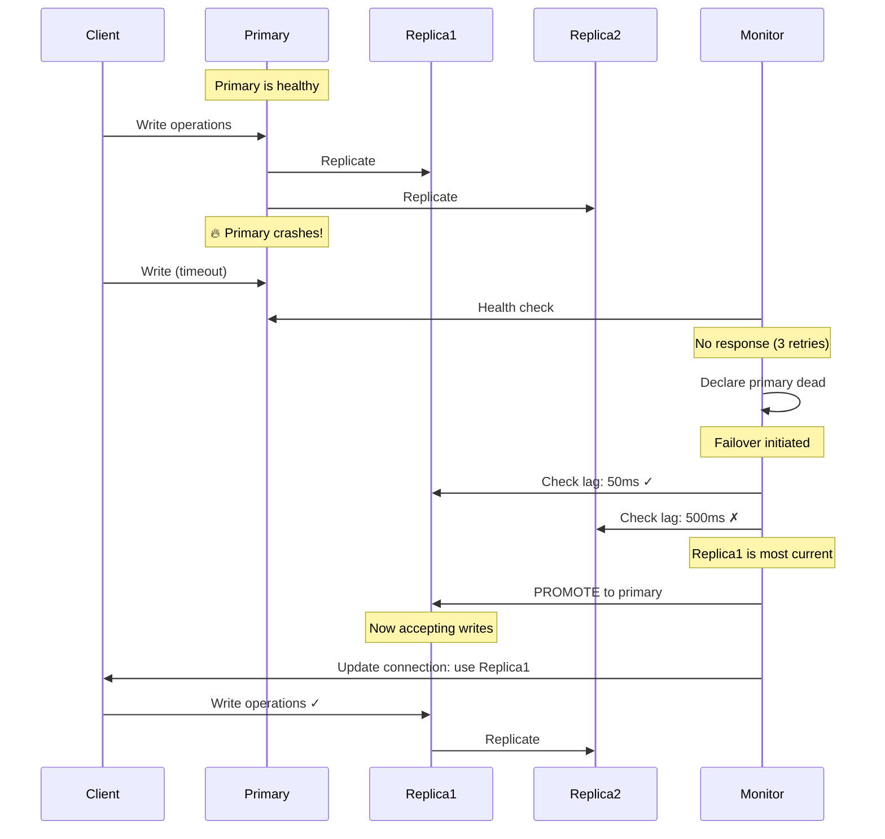
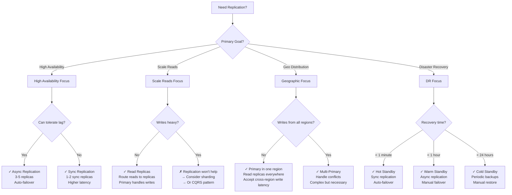

#system-design #pattern #data #reliability

# Replication

## Intuition (30 sec)

Making photocopies of an important document and storing them in different offices. If one office burns down, you still have copies. And multiple people can read copies simultaneously without waiting in line at one office.

## Failure-First Scenario

> Your single database server crashes at 2 AM. All data is gone (last backup was 12 hours ago). Even when it's running, peak hours mean all reads and writes compete for the same server. You need copies of your data on multiple servers.

---

## Working Knowledge (5 min)

### Core Concept - Definitions First

**Replication:**
- **Definition:** The process of maintaining multiple copies of the same data on different nodes to improve availability, durability, and read performance
- **Purpose:** Ensures data survives node failures and allows distributing read load across multiple servers
- **How it works:** One or more nodes maintain copies of data, synchronized through replication logs or change streams

**Key Terms:**

- **Primary (Leader):** The main database node that accepts write operations and propagates changes to replicas
- **Replica (Follower):** A copy of the primary database that receives updates and typically serves read-only queries
- **Replication Log:** A sequential record of all changes (inserts, updates, deletes) sent from primary to replicas
- **Replication Lag:** The time delay between a write occurring on the primary and appearing on a replica (measured in milliseconds or seconds)
- **Failover:** The process of promoting a replica to primary when the current primary fails
- **Split Brain:** A dangerous scenario where two nodes both believe they are the primary, accepting conflicting writes

### Replication Topologies (Visual Models)

```
┌─────────────────────────────────────────────────────────┐
│          1. PRIMARY-REPLICA (Most Common)               │
└─────────────────────────────────────────────────────────┘

                   ┌─────────────┐
                   │   Primary   │
                   │   (Write)   │
                   └──────┬──────┘
                          │
          ┌───────────────┼───────────────┐
          │               │               │
    ┌─────▼─────┐   ┌─────▼─────┐   ┌─────▼─────┐
    │ Replica 1 │   │ Replica 2 │   │ Replica 3 │
    │  (Read)   │   │  (Read)   │   │  (Read)   │
    └───────────┘   └───────────┘   └───────────┘

Definition: Single source of truth for writes
Use case: 95% of production systems
Examples: PostgreSQL, MySQL, MongoDB

Characteristics:
✓ Simple to reason about
✓ No write conflicts
✓ Strong consistency possible
✗ Write bottleneck at primary
✗ Wasted replica capacity (read-only)


┌─────────────────────────────────────────────────────────┐
│          2. MULTI-PRIMARY (Multi-Master)                │
└─────────────────────────────────────────────────────────┘

    ┌─────────────┐           ┌─────────────┐
    │  Primary 1  │◄─────────▶│  Primary 2  │
    │   (R + W)   │   Sync    │   (R + W)   │
    └──────┬──────┘           └──────┬──────┘
           │                         │
      ┌────▼────┐               ┌────▼────┐
      │Replica 1│               │Replica 2│
      └─────────┘               └─────────┘

    DC 1 (US-East)            DC 2 (EU-West)

Definition: Multiple nodes accept writes, sync with each other
Use case: Multi-datacenter deployments
Examples: MySQL Group Replication, Cassandra (with tuning)

Characteristics:
✓ No single write bottleneck
✓ Lower latency (write to closest DC)
✓ Survives datacenter failure
✗ Write conflicts possible
✗ Complex conflict resolution
⚠ Requires careful design


┌─────────────────────────────────────────────────────────┐
│          3. LEADERLESS (Peer-to-Peer)                   │
└─────────────────────────────────────────────────────────┘

         ┌─────────┐
         │ Node 1  │
         │ (R + W) │
         └────┬────┘
              │
    ┌─────────┼─────────┐
    │         │         │
┌───▼───┐ ┌───▼───┐ ┌───▼───┐
│Node 2 │ │Node 3 │ │Node 4 │
│(R + W)│ │(R + W)│ │(R + W)│
└───────┘ └───────┘ └───────┘

All nodes are equal peers

Definition: No primary; all nodes accept reads and writes
Use case: High availability with partition tolerance
Examples: Cassandra, DynamoDB, Riak

Characteristics:
✓ No single point of failure
✓ High availability
✓ Horizontal scalability
✗ Eventual consistency
✗ Complex client logic (quorum)
⚠ Conflict resolution needed
```

### Synchronous vs Asynchronous Replication

**Synchronous Replication:**
- **Definition:** The primary waits for at least one replica to confirm the write before acknowledging to the client
- **Guarantee:** Data is guaranteed to exist on multiple nodes before success is returned
- **Trade-off:** Higher write latency but zero data loss on primary failure

**Asynchronous Replication:**
- **Definition:** The primary acknowledges the write immediately without waiting for replica confirmation
- **Guarantee:** Faster writes but potential data loss if primary fails before replication completes
- **Trade-off:** Lower write latency but risk of losing recent writes

```
SYNCHRONOUS REPLICATION
═══════════════════════════════════════════

Time: 0ms
Client ──────▶ Primary: Write X=5
               │
               ├──────▶ Replica 1: Write X=5
               │
               └──────▶ Replica 2: Write X=5

Time: 10ms
               ◄────── Replica 1: ACK ✓
               ◄────── Replica 2: ACK ✓

Time: 10ms
Client ◄────── Primary: Success ✓

Total latency: 10ms
Guarantee: X=5 exists on 3 nodes before client sees success

✓ Zero data loss
✓ Strong consistency
✗ Higher latency (wait for replica)
✗ Availability risk (if replica down, writes block)

Use when: Financial transactions, critical data


ASYNCHRONOUS REPLICATION
═══════════════════════════════════════════

Time: 0ms
Client ──────▶ Primary: Write X=5
               │
Time: 1ms      │
Client ◄────── Primary: Success ✓
               │
               ├──────▶ Replica 1: Write X=5 (async)
               │
               └──────▶ Replica 2: Write X=5 (async)

Time: 10ms
               ◄────── Replica 1: ACK ✓
               ◄────── Replica 2: ACK ✓

Total client latency: 1ms
Risk: If primary crashes at 5ms, X=5 might be lost

✓ Low latency
✓ High availability (replicas don't block writes)
✗ Potential data loss
✗ Replication lag

Use when: Social media posts, analytics, caching


SEMI-SYNCHRONOUS (Hybrid)
═══════════════════════════════════════════

Primary waits for ONE replica (not all)

               Primary
               │
               ├──────▶ Replica 1 (SYNC - wait)
               │
               └──────▶ Replica 2 (ASYNC - don't wait)

Balances safety and performance
Used by: MySQL semi-sync, PostgreSQL synchronous_commit
```

### Comparison Table

| Aspect | Synchronous | Asynchronous | Semi-Synchronous |
|--------|-------------|--------------|------------------|
| **Write Latency** | High (10-50ms) | Low (1-5ms) | Medium (5-20ms) |
| **Data Loss Risk** | Zero | Possible | Minimal |
| **Availability** | Lower (replica failure blocks writes) | Higher | Balanced |
| **Use Case** | Financial data, orders | Social feeds, logs | E-commerce, SaaS |
| **Consistency** | Strong | Eventual | Strong (1 replica) |

---

## Layer 1: Conceptual Precision (15 min)

### Replication Lag - The Hidden Problem

**Replication Lag:**
- **Formal Definition:** The time difference between when a transaction commits on the primary and when it becomes visible on a replica
- **Measured as:** Timestamp difference or bytes behind (e.g., "Replica is 250ms behind" or "5MB behind")
- **Why it happens:** Network delays, replica load, complex transactions, slow disk I/O

**Analogy:** You post a photo on Instagram (write to primary). Your friend in another country refreshes their feed (read from replica) but doesn't see it yet. The lag is how long until it appears.

```
Timeline of Replication Lag:

T=0ms   Primary: User writes "Post #123"
        ┌─────────────┐
        │   Primary   │  [Post #123 written]
        └─────────────┘

T=50ms  Network delay + processing
        │
        ▼
        ┌─────────────┐
        │  Replica 1  │  [Post #123 arrives]
        └─────────────┘
        Lag: 50ms ✓ Acceptable

T=200ms More delay (overloaded network)
        │
        ▼
        ┌─────────────┐
        │  Replica 2  │  [Post #123 arrives]
        └─────────────┘
        Lag: 200ms ⚠ Noticeable

T=5000ms Severe delay (replica catching up)
        │
        ▼
        ┌─────────────┐
        │  Replica 3  │  [Post #123 arrives]
        └─────────────┘
        Lag: 5000ms ✗ Unacceptable
```

### Problems Caused by Replication Lag

```
Problem 1: READ-AFTER-WRITE INCONSISTENCY
═══════════════════════════════════════════

User writes, then immediately reads from replica

T=0ms:  User ──────▶ Primary: "Update profile pic"
                     Primary: ✓ Saved

T=10ms: User ──────▶ Replica: "Get my profile"
                     Replica: Old pic (no update yet!)

        User sees: "Where's my new pic?" 😠

Solution: Read-your-writes consistency
→ For X seconds after write, read from primary
→ Or track user's last write timestamp


Problem 2: MONOTONIC READ VIOLATION
═══════════════════════════════════════════

User reads from different replicas, sees time go backwards

T=0ms:  User ──────▶ Replica 1: "Get comment count"
                     Returns: 42 comments ✓

T=10ms: User ──────▶ Replica 2: "Get comment count"
                     Returns: 40 comments ✗
                     (Replica 2 is lagging behind)

        User sees: Comments disappeared? 🤔

Solution: Sticky sessions (pin user to one replica)
→ Load balancer always routes same user to same replica


Problem 3: CAUSAL CONSISTENCY VIOLATION
═══════════════════════════════════════════

Reply appears before the original post

Primary:
T=0ms:   Alice posts: "What's for lunch?"
T=10ms:  Bob replies: "Pizza sounds good!"

Replica 1 (50ms lag):
  Sees: "Pizza sounds good!" (Bob's reply)
  But not: "What's for lunch?" (Alice's post)

User sees: Bob talking about pizza... why? 🍕❓

Solution: Causal consistency
→ Track dependencies between writes
→ Don't show reply until original post is visible
```

### Failover - Promoting a Replica

**Failover:**
- **Definition:** The automated or manual process of promoting a replica to become the new primary when the current primary fails
- **Goal:** Minimize downtime and prevent data loss
- **Complexity:** Must handle partial writes, prevent split brain, update application configuration

**Key Terms:**
- **MTTR (Mean Time To Recovery):** Target time to complete failover (typically 30-120 seconds)
- **RTO (Recovery Time Objective):** Maximum acceptable downtime
- **RPO (Recovery Point Objective):** Maximum acceptable data loss (in time)
- **Fencing:** Preventing the old primary from accepting writes after failover



**Failover Process (Step by Step):**

```
AUTOMATED FAILOVER TIMELINE
═══════════════════════════════════════════

T=0s    🔥 Primary node crashes
        ┌─────────────┐
        │   Primary   │  ✗ Dead
        └─────────────┘

T=5s    Monitor detects failure
        ├─ Health check timeout (3 attempts)
        ├─ Mark primary as unhealthy
        └─ Begin failover protocol

T=10s   Select best replica
        ├─ Replica 1: 50ms lag  ← Choose this
        ├─ Replica 2: 500ms lag
        └─ Replica 3: 2s lag

T=15s   Promote Replica 1
        ├─ Stop replication
        ├─ Enable write mode
        ├─ Fence old primary (STONITH if needed)
        └─ Update DNS/load balancer

T=20s   Reconfigure other replicas
        ├─ Replica 2 → now follows Replica 1
        └─ Replica 3 → now follows Replica 1

T=25s   Update application
        └─ Connection string points to new primary

T=30s   ✓ Service restored

Total downtime: 30 seconds
Data loss: ~50ms of writes (last transactions on old primary)


POTENTIAL ISSUES:
═══════════════════════════════════════════

Issue 1: Split Brain
┌─────────────┐           ┌─────────────┐
│ Old Primary │           │New Primary  │
│ (isolated)  │           │ (promoted)  │
└──────┬──────┘           └──────┬──────┘
       │                         │
   Accepts writes!           Accepts writes!
       │                         │
   Data diverges! ✗

Prevention:
• Fencing tokens (increment counter)
• STONITH (power off old primary)
• Quorum (require majority vote)


Issue 2: Data Loss
Last 50ms of writes on old primary not replicated
├─ Write A ✓ (replicated)
├─ Write B ✓ (replicated)
├─ Write C ✗ (lost - not replicated yet)
└─ CRASH

Mitigation:
• Use synchronous replication for critical data
• Lower RPO (accept higher latency)
• Transaction log archiving


Issue 3: Cascading Failure
Primary dies → Replica 1 promoted → Overloaded → Dies
└─ Solution: Capacity planning (N+2 redundancy)
```

### Split Brain - The Nightmare Scenario

**Split Brain:**
- **Definition:** A failure condition where two or more nodes simultaneously believe they are the primary, accepting independent writes that diverge
- **Cause:** Network partition separates nodes but doesn't kill them
- **Danger:** Conflicting data that's impossible to automatically merge
- **Impact:** Can cause permanent data corruption or require manual reconciliation

```
HOW SPLIT BRAIN HAPPENS
═══════════════════════════════════════════

Normal State:
┌─────────────┐         ┌─────────────┐
│   Primary   │────────▶│  Replica 1  │
└─────────────┘         └─────────────┘
       │
       │
       ▼
┌─────────────┐
│  Replica 2  │
└─────────────┘

Network Partition Occurs:
┌─────────────┐    ✗    ┌─────────────┐
│   Primary   │- - - - -│  Replica 1  │
└─────────────┘  broken └─────────────┘
       │
       │ still connected
       ▼
┌─────────────┐
│  Replica 2  │
└─────────────┘

Monitoring system in Replica 1's partition:
"Primary is dead! Promote Replica 1!"

Now we have TWO primaries:
┌─────────────┐         ┌─────────────┐
│   Primary   │         │  Replica 1  │
│ (original)  │         │ (promoted)  │
└──────┬──────┘         └──────┬──────┘
       │                       │
   Client A               Client B
   writes X=5             writes X=7
       │                       │
       ▼                       ▼
   Data diverges! ✗


CONCRETE EXAMPLE - E-commerce:
═══════════════════════════════════════════

Product: iPhone (stock = 1)

Partition happens:

DC1 (has "Primary 1"):
  Customer A: "Buy iPhone" → Stock: 1 → 0 ✓
  Order #123 created

DC2 (promoted "Primary 2"):
  Customer B: "Buy iPhone" → Stock: 1 → 0 ✓
  Order #456 created

Network heals:
  Stock = 0 on both
  But TWO orders for ONE phone! ✗
  Which customer gets it? 😱


PREVENTION STRATEGIES:
═══════════════════════════════════════════

1. FENCING TOKENS
   ┌─────────────┐
   │   Primary   │ Token: 42
   └─────────────┘

   Promoted replica gets Token: 43

   Old primary tries to write (Token: 42)
   → Database: "Token 43 exists, rejecting 42" ✗

2. QUORUM / CONSENSUS
   Requires majority vote to become primary

   5 nodes total:
   ├─ 3 nodes in Partition A → Can elect primary ✓
   └─ 2 nodes in Partition B → Cannot elect (no majority) ✗

3. STONITH ("Shoot The Other Node In The Head")
   Before promoting replica:
   └─ Physically power off old primary
   └─ Guaranteed old primary can't accept writes

4. WITNESS NODE
   Odd number of nodes (3, 5, 7)
   └─ Breaks ties in network partition
```

### Multi-Primary Conflict Resolution

**Write Conflict:**
- **Definition:** When two primaries accept writes to the same record with different values before synchronizing
- **Why it happens:** In multi-primary or leaderless systems, concurrent writes reach different nodes
- **Challenge:** No automatic "correct" answer - business logic decides

```
CONFLICT SCENARIO
═══════════════════════════════════════════

T=0ms:  Document: {title: "Draft", status: "pending"}

DC1 (US):
T=100ms: User A updates: status = "published"

DC2 (EU):
T=100ms: User B updates: status = "archived"

T=200ms: Replication occurs

DC1 receives: status = "archived" (from DC2)
DC2 receives: status = "published" (from DC1)

Conflict! Which value is correct? 🤔


RESOLUTION STRATEGY 1: LAST-WRITE-WINS (LWW)
═══════════════════════════════════════════

Use timestamp to decide winner

DC1: status = "published" at T=100.001
DC2: status = "archived"  at T=100.002

DC2 timestamp is higher → "archived" wins

┌─────────────┐
│ Final state:│
│ status =    │
│ "archived"  │
└─────────────┘

Pros: Simple, automatic
Cons:
✗ Clock skew can cause wrong winner
✗ Lost write (User A's update disappeared)
✗ No semantic understanding


RESOLUTION STRATEGY 2: VERSION VECTORS
═══════════════════════════════════════════

Track causality with version numbers

Initial: {title: "Draft", v: [DC1:0, DC2:0]}

DC1 write: {status: "published", v: [DC1:1, DC2:0]}
DC2 write: {status: "archived",  v: [DC1:0, DC2:1]}

Sync occurs:
Both systems detect conflict (neither version subsumes the other)

Application must resolve:
Option 1: Prompt user to choose
Option 2: Merge: {status: "needs-review"} (custom logic)
Option 3: Keep both: status = ["published", "archived"]


RESOLUTION STRATEGY 3: CRDTs
═══════════════════════════════════════════
(Conflict-Free Replicated Data Types)

Data structures designed to merge automatically

Example: Grow-only Set
DC1: Add "apple"  → Set: {apple}
DC2: Add "banana" → Set: {banana}

Merge: {apple, banana} ✓ (union)

Example: Counter
DC1: Increment → 5
DC2: Increment → 5

Merge: 6 ✓ (sum of increments, not values)

Pros: Automatic, mathematically sound
Cons: Limited data types (sets, counters, registers)


RESOLUTION STRATEGY 4: APPLICATION-LEVEL
═══════════════════════════════════════════

Let business logic decide

E-commerce example:
DC1: Inventory -= 5 (sold 5 units)
DC2: Inventory -= 3 (sold 3 units)

Conflict resolution:
→ Apply both: Inventory -= 8 ✓
→ (Additive changes can be commutative)

Bank account:
DC1: Balance += $100 (deposit)
DC2: Balance -= $50 (withdrawal)

Conflict resolution:
→ Apply both in order ✓
→ Track operation log, not just final value


DECISION MATRIX:
═══════════════════════════════════════════

Strategy         | Use When                  | Risk
─────────────────┼───────────────────────────┼─────────────
Last-Write-Wins  | Cache, user preferences   | Lost writes
Version Vectors  | Documents, complex data   | Manual merge
CRDTs           | Counters, sets, flags     | Limited types
Application     | Financial, inventory      | Complex code
```

---

## Layer 2: Technology-Specific Examples (20 min)

### PostgreSQL Replication Configuration

```yaml
# postgresql.conf (Primary Server)
# ───────────────────────────────────────────

# Enable WAL (Write-Ahead Log) for replication
wal_level = replica                # Minimum: replica (logical for logical replication)
                                   # Definition: How much info to write to WAL
                                   # Options: minimal, replica, logical

# WAL archiving (for point-in-time recovery)
archive_mode = on                  # Enable archiving of WAL files
archive_command = 'cp %p /mnt/archive/%f'
                                   # Definition: Command to copy WAL files
                                   # %p = path of file, %f = filename

# Replication slots (prevent WAL deletion before replica catches up)
max_wal_senders = 10               # Max concurrent replication connections
                                   # Definition: Number of replicas + backups

max_replication_slots = 10         # Max replication slots
                                   # Definition: Named replication connections
                                   # Purpose: Track replica progress

# Synchronous replication (optional)
synchronous_commit = on            # Wait for replica confirmation
                                   # Options: off, local, remote_write, remote_apply, on
                                   # off = async (fastest, risk data loss)
                                   # on = sync (slowest, safest)

synchronous_standby_names = 'replica1'
                                   # Definition: Which replicas to wait for
                                   # Format: 'ANY 1 (replica1, replica2)'
                                   #         ↑   ↑  ↑
                                   #         |   |  List of replicas
                                   #         |   Wait for N replicas
                                   #         ANY or FIRST

# Connection settings
listen_addresses = '*'             # Allow connections from replicas
max_connections = 100              # Total connection limit
```

```yaml
# postgresql.conf (Replica Server)
# ───────────────────────────────────────────

# Hot standby (allow read queries on replica)
hot_standby = on                   # Definition: Accept read-only queries
                                   # on = replica can serve reads ✓
                                   # off = replica is recovery-only

# Feedback to primary (prevent query cancellation)
hot_standby_feedback = on          # Definition: Tell primary about active queries
                                   # Purpose: Primary won't delete rows
                                   #          that replica is still reading

# Connection to primary
primary_conninfo = 'host=primary-db.example.com port=5432 user=replicator password=xxx'
                                   # Definition: Connection string to primary

primary_slot_name = 'replica1'     # Definition: Replication slot name
                                   # Must match slot created on primary

# Promote trigger file (for manual failover)
promote_trigger_file = '/tmp/promote_to_primary'
                                   # Definition: Create this file to promote
                                   # Purpose: Manual failover trigger
```

```bash
# Setting up replication (Step-by-step)
# ═══════════════════════════════════════════

# On PRIMARY server:
# 1. Create replication user
sudo -u postgres psql
CREATE ROLE replicator WITH REPLICATION LOGIN PASSWORD 'secure_password';

# 2. Allow replica to connect (pg_hba.conf)
# Add line:
# host    replication     replicator      10.0.1.0/24      md5
#         ↑               ↑               ↑                ↑
#         Replication DB  Username        Replica IP       Auth method

# 3. Create replication slot
SELECT pg_create_physical_replication_slot('replica1');

# 4. Restart PostgreSQL
sudo systemctl restart postgresql


# On REPLICA server:
# 1. Stop PostgreSQL
sudo systemctl stop postgresql

# 2. Clear data directory
sudo rm -rf /var/lib/postgresql/14/main/*

# 3. Clone from primary (base backup)
sudo -u postgres pg_basebackup \
  -h primary-db.example.com \
  -D /var/lib/postgresql/14/main \
  -U replicator \
  -P \
  -v \
  -R \
  -X stream \
  -C -S replica1

# Flags explained:
# -h = primary hostname
# -D = destination directory
# -U = replication user
# -P = show progress
# -v = verbose
# -R = create standby.signal (replica mode)
# -X stream = stream WAL during backup
# -C = create replication slot
# -S = slot name

# 4. Start replica
sudo systemctl start postgresql

# 5. Verify replication status
sudo -u postgres psql -c "SELECT * FROM pg_stat_replication;"
```

### MySQL Replication Configuration

```ini
# my.cnf (Primary Server)
# ───────────────────────────────────────────

[mysqld]
# Server identification
server-id = 1                      # Definition: Unique ID for this server
                                   # Requirement: Every server must have unique ID
                                   # Range: 1 to 4294967295

# Binary logging (required for replication)
log-bin = /var/log/mysql/mysql-bin # Definition: Path to binary log files
                                   # Purpose: Records all changes for replication

binlog-format = ROW                # Definition: How to log changes
                                   # Options:
                                   # • STATEMENT = log SQL (smallest, risk of divergence)
                                   # • ROW = log changed rows (largest, safest)
                                   # • MIXED = auto-choose (balanced)

# Binary log retention
expire-logs-days = 7               # Definition: Auto-delete logs older than N days
                                   # Purpose: Prevent disk space exhaustion

# GTID (Global Transaction ID) - recommended
gtid-mode = ON                     # Definition: Enable GTID-based replication
                                   # Purpose: Easier failover, track transactions globally

enforce-gtid-consistency = ON      # Definition: Reject non-GTID-safe statements
                                   # Purpose: Ensure GTID correctness

# Semi-synchronous replication (optional)
plugin-load = "rpl_semi_sync_master=semisync_master.so"
rpl_semi_sync_master_enabled = 1   # Definition: Wait for 1 replica ACK
rpl_semi_sync_master_timeout = 1000
                                   # Definition: Wait 1000ms, then fall back to async
                                   # Purpose: Balance safety and performance
```

```ini
# my.cnf (Replica Server)
# ───────────────────────────────────────────

[mysqld]
# Server identification
server-id = 2                      # Must be unique and different from primary

# Relay log (stores replicated events)
relay-log = /var/log/mysql/relay-bin
                                   # Definition: Local log of changes from primary
                                   # Purpose: Apply changes in order

# Read-only mode (prevent accidental writes)
read-only = 1                      # Definition: Block writes from non-SUPER users
                                   # Purpose: Enforce replica as read-only

super-read-only = 1                # Definition: Block ALL writes (even SUPER users)
                                   # Purpose: Stricter protection

# Semi-synchronous replication
plugin-load = "rpl_semi_sync_slave=semisync_slave.so"
rpl_semi_sync_slave_enabled = 1

# Parallel replication (performance)
slave-parallel-workers = 4         # Definition: Number of threads applying changes
                                   # Purpose: Speed up replication (multi-threaded)
                                   # Rule: Set to number of CPU cores

slave-parallel-type = LOGICAL_CLOCK
                                   # Definition: How to parallelize
                                   # Options:
                                   # • DATABASE = different DBs in parallel
                                   # • LOGICAL_CLOCK = smart dependency detection
```

```sql
-- Setting up MySQL replication
-- ═══════════════════════════════════════════

-- On PRIMARY:
-- 1. Create replication user
CREATE USER 'replicator'@'%' IDENTIFIED BY 'secure_password';
GRANT REPLICATION SLAVE ON *.* TO 'replicator'@'%';
FLUSH PRIVILEGES;

-- 2. Check primary status
SHOW MASTER STATUS;
-- Returns:
-- +------------------+----------+--------------+------------------+
-- | File             | Position | Binlog_Do_DB | Binlog_Ignore_DB |
-- +------------------+----------+--------------+------------------+
-- | mysql-bin.000003 |      154 |              |                  |
-- +------------------+----------+--------------+------------------+
-- Note these values! You'll need them.

-- 3. (Optional) Take a consistent backup
mysqldump --all-databases --master-data --single-transaction > backup.sql


-- On REPLICA:
-- 1. Restore backup (if taken)
mysql < backup.sql

-- 2. Configure replication
CHANGE MASTER TO
  MASTER_HOST='primary-db.example.com',
  MASTER_USER='replicator',
  MASTER_PASSWORD='secure_password',
  MASTER_LOG_FILE='mysql-bin.000003',  -- From SHOW MASTER STATUS
  MASTER_LOG_POS=154;                   -- From SHOW MASTER STATUS

-- 3. Start replication
START SLAVE;

-- 4. Check status
SHOW SLAVE STATUS\G

-- Key fields to check:
-- Slave_IO_Running: Yes       ← Receiving updates from primary
-- Slave_SQL_Running: Yes      ← Applying updates to replica
-- Seconds_Behind_Master: 0    ← Replication lag in seconds
-- Last_Error:                 ← Should be empty
```

### Monitoring Replication Health

```
╔═══════════════════════════════════════════════════════╗
║         REPLICATION HEALTH DASHBOARD                  ║
╠═══════════════════════════════════════════════════════╣
║                                                       ║
║  Primary: db-primary-01                               ║
║  ━━━━━━━━━━━━━━━━━━━━━━━━━━━━━━━━━━━━━━━━━━━━━━━━   ║
║  🟢 Status: Healthy                                   ║
║  📊 Write Rate: 1,247 TPS (transactions/sec)          ║
║  💾 Disk Usage: 67% (340GB / 500GB)                   ║
║  🔄 Active Replicas: 3 / 3                            ║
║                                                       ║
║  ─────────────────────────────────────────────────    ║
║                                                       ║
║  Replica 1: db-replica-us-east-1a                     ║
║  ━━━━━━━━━━━━━━━━━━━━━━━━━━━━━━━━━━━━━━━━━━━━━━━━   ║
║  🟢 Status: Healthy                                   ║
║  ⏱️  Replication Lag: 45ms ✓                          ║
║      ▰▰▰▰▰░░░░░░░░░░░░░░░░░░░░░░░░░░░░░░░░░░        ║
║      Target: < 200ms                                  ║
║  📈 Apply Rate: 1,245 TPS                             ║
║  🔗 Connection: Streaming (WAL position: 0/3A2B4C)    ║
║                                                       ║
║  Replica 2: db-replica-us-east-1b                     ║
║  ━━━━━━━━━━━━━━━━━━━━━━━━━━━━━━━━━━━━━━━━━━━━━━━━   ║
║  🟢 Status: Healthy                                   ║
║  ⏱️  Replication Lag: 120ms ✓                         ║
║      ▰▰▰▰▰▰▰▰▰▰▰▰░░░░░░░░░░░░░░░░░░░░░░░░░░        ║
║  📈 Apply Rate: 1,240 TPS                             ║
║  🔗 Connection: Streaming (WAL position: 0/3A2B3F)    ║
║                                                       ║
║  Replica 3: db-replica-us-west-2                      ║
║  ━━━━━━━━━━━━━━━━━━━━━━━━━━━━━━━━━━━━━━━━━━━━━━━━   ║
║  🟡 Status: Degraded (High Lag)                       ║
║  ⏱️  Replication Lag: 2,500ms ⚠️                      ║
║      ▰▰▰▰▰▰▰▰▰▰▰▰▰▰▰▰▰▰▰▰▰▰▰▰▰▰▰▰▰▰▰▰▰▰▰▰▰▰▰▰      ║
║      Cause: Network latency (cross-region)            ║
║  📈 Apply Rate: 890 TPS (below primary rate!)         ║
║  🔗 Connection: Streaming (WAL position: 0/3A1C2D)    ║
║                                                       ║
║  ─────────────────────────────────────────────────    ║
║                                                       ║
║  📊 Replication Metrics (Last Hour):                  ║
║                                                       ║
║    Max Lag Observed: 3.2 seconds                      ║
║    Min Lag Observed: 12 milliseconds                  ║
║    Avg Lag: 185 milliseconds                          ║
║                                                       ║
║    Lag Spikes: 3 times (> 1 second)                   ║
║    ├─ 14:23 UTC - 3.2s (Replica 3)                    ║
║    ├─ 14:45 UTC - 1.8s (Replica 2)                    ║
║    └─ 15:12 UTC - 1.1s (Replica 3)                    ║
║                                                       ║
║  🚨 Alerts (Active):                                  ║
║    ⚠️  Replica 3: Lag > 2 seconds for 10 minutes      ║
║                                                       ║
╚═══════════════════════════════════════════════════════╝
```

```sql
-- PostgreSQL Monitoring Queries
-- ═══════════════════════════════════════════

-- Check replication status (run on PRIMARY)
SELECT
    client_addr,                    -- Replica IP
    state,                          -- streaming = active
    sent_lsn,                       -- WAL position sent
    write_lsn,                      -- WAL position written to replica
    flush_lsn,                      -- WAL position flushed to disk
    replay_lsn,                     -- WAL position applied
    sync_state,                     -- async or sync
    pg_wal_lsn_diff(sent_lsn, replay_lsn) AS lag_bytes
                                    -- Bytes behind
FROM pg_stat_replication;

-- Expected output:
-- client_addr     | state     | lag_bytes | sync_state
-- ────────────────┼───────────┼───────────┼───────────
-- 10.0.1.10       | streaming | 2048      | async
-- 10.0.1.11       | streaming | 0         | sync


-- Check replication lag in seconds (run on REPLICA)
SELECT
    CASE
        WHEN pg_last_wal_receive_lsn() = pg_last_wal_replay_lsn() THEN 0
        ELSE EXTRACT(EPOCH FROM (now() - pg_last_xact_replay_timestamp()))
    END AS lag_seconds;

-- Expected: < 1 second for healthy replica


-- Check if replica is in recovery mode
SELECT pg_is_in_recovery();
-- TRUE = this is a replica
-- FALSE = this is a primary
```

```sql
-- MySQL Monitoring Queries
-- ═══════════════════════════════════════════

-- Check replication status (run on REPLICA)
SHOW SLAVE STATUS\G

-- Key fields:
-- Slave_IO_Running: Yes/No       ← Is replica receiving updates?
-- Slave_SQL_Running: Yes/No      ← Is replica applying updates?
-- Seconds_Behind_Master: N       ← Lag in seconds (NULL = not running)
-- Last_IO_Error:                 ← Network/connection errors
-- Last_SQL_Error:                ← Application errors (e.g., constraint violation)


-- Simplified lag check
SELECT
    IF(Slave_IO_Running = 'Yes' AND Slave_SQL_Running = 'Yes',
       Seconds_Behind_Master,
       NULL) AS replication_lag_seconds
FROM performance_schema.replication_connection_status;


-- Check GTID progress (if using GTID)
SHOW MASTER STATUS;  -- On primary
SHOW SLAVE STATUS;   -- On replica, compare Executed_Gtid_Set
```

---

## Layer 3: Production-Ready Details (30 min)

### Production Replication Architecture

```
┌──────────────────────────────────────────────────────────┐
│                    FULL STACK REPLICATION                │
│                  (Multi-Region, Multi-AZ)                │
└──────────────────────────────────────────────────────────┘

                        🌍 Internet
                            │
                    ┌───────▼────────┐
                    │   DNS (Route53) │
                    │   Geo-routing   │
                    └───────┬─────────┘
                            │
        ┌───────────────────┼───────────────────┐
        │                   │                   │
┌───────▼────────┐  ┌───────▼────────┐  ┌──────▼──────────┐
│  Region 1 (US) │  │  Region 2 (EU) │  │  Region 3 (Asia)│
└───────┬────────┘  └───────┬────────┘  └──────┬──────────┘
        │                   │                   │
        │                   │                   │
        ▼                   ▼                   ▼

┌─────────────────────────────────────────────────────────┐
│              REGION 1: US-EAST (PRIMARY)                │
├─────────────────────────────────────────────────────────┤
│                                                         │
│                   Application Layer                     │
│   ┌─────────────────────────────────────────────┐      │
│   │          Load Balancer (Layer 7)            │      │
│   └────┬────────┬────────┬────────┬─────────┬──┘      │
│        │        │        │        │         │          │
│   ┌────▼──┐ ┌──▼───┐ ┌──▼───┐ ┌──▼───┐ ┌──▼───┐      │
│   │App-01│ │App-02│ │App-03│ │App-04│ │App-05│      │
│   └───────┘ └──────┘ └──────┘ └──────┘ └──────┘      │
│        │        │        │        │         │          │
│        └────────┴────────┴────────┴─────────┘          │
│                         │                               │
│            ┌────────────┼────────────┐                  │
│            │            │            │                  │
│       ┌────▼────┐  ┌────▼────┐  ┌───▼────┐            │
│       │  Redis  │  │Primary  │  │ Kafka  │            │
│       │  Cache  │  │   DB    │  │ Queue  │            │
│       │  (R+W)  │  │  (R+W)  │  │        │            │
│       └─────────┘  └────┬────┘  └────────┘            │
│                         │                               │
│                         │ Async Replication             │
│               ┌─────────┼─────────┐                     │
│               │         │         │                     │
│          ┌────▼────┐ ┌──▼───────┐ │                    │
│          │Replica-1│ │Replica-2 │ │                    │
│          │US-East-1a│ │US-East-1b│ │                    │
│          │  (Read) │ │  (Read)  │ │                    │
│          └─────────┘ └──────────┘ │                    │
│                                    │                     │
│                    Cross-region replication             │
│                                    │                     │
└────────────────────────────────────┼─────────────────────┘
                                     │
                ┌────────────────────┼────────────────────┐
                │                    │                    │
┌───────────────▼────────────┐  ┌────▼────────────────────▼─┐
│  REGION 2: EU-WEST          │  │  REGION 3: AP-SOUTHEAST   │
│  (READ REPLICAS)            │  │  (READ REPLICAS)          │
├─────────────────────────────┤  ├───────────────────────────┤
│                             │  │                           │
│     ┌───────────────┐       │  │     ┌───────────────┐     │
│     │   Replica-3   │       │  │     │   Replica-4   │     │
│     │   EU-West-1   │       │  │     │   AP-South-1  │     │
│     │   (Read Only) │       │  │     │   (Read Only) │     │
│     └───────────────┘       │  │     └───────────────┘     │
│                             │  │                           │
│  Lag: ~100-200ms            │  │  Lag: ~200-400ms          │
│  Use: EU users              │  │  Use: Asia users          │
└─────────────────────────────┘  └───────────────────────────┘


Key Characteristics:
═══════════════════════════════════════════

• Primary in US-East (lowest latency for most users)
• Local read replicas in same region (high availability)
• Cross-region replicas (geo-distribution, DR)
• Redis cache layer (reduce DB load)
• Kafka for async processing (decoupling)

Failover Plan:
• Primary dies → Promote Replica-1 (same AZ, lowest lag)
• Entire US region fails → Promote Replica-3 in EU
• DNS TTL: 60 seconds (fast failover)

Cost Estimate:
• Primary DB (r6g.2xlarge): $500/month
• 4× Replicas (r6g.xlarge): $800/month
• Network transfer: $200/month
• Total: ~$1,500/month
```

### Read Replica Strategy (Scaling Reads)

```
READ REPLICA PATTERNS
═══════════════════════════════════════════

Pattern 1: READ/WRITE SPLIT
────────────────────────────

Application intelligently routes queries:

┌──────────────────────────┐
│    Application Code      │
└──────┬─────────────┬─────┘
       │             │
   if (write):   if (read):
       │             │
       ▼             ▼
┌────────────┐  ┌────────────┐
│  Primary   │  │  Replica   │
│   (R+W)    │  │   (R only) │
└────────────┘  └────────────┘

Code example:
```python
# Django database routing
class ReplicaRouter:
    def db_for_read(self, model, **hints):
        return 'replica'  # Read from replica

    def db_for_write(self, model, **hints):
        return 'primary'  # Write to primary

# Usage
User.objects.using('primary').create(name='Alice')  # Write
users = User.objects.using('replica').all()         # Read
```

```
Pattern 2: READ-YOUR-WRITES
────────────────────────────

Problem: User writes, then reads from replica (doesn't see their write)

Solution: Track user's last write, route to primary if too recent

┌──────────────────────────────────┐
│  User writes at T=0              │
│  Store: last_write_time = 0      │
└─────────────┬────────────────────┘
              │
              ▼
        ┌─────────────┐
        │   Primary   │  Write saved
        └─────────────┘

┌──────────────────────────────────┐
│  User reads at T=50ms            │
│  Check: T - last_write_time      │
│         50ms < 1000ms            │
│  → Route to PRIMARY ✓            │
└──────────────────────────────────┘

┌──────────────────────────────────┐
│  User reads at T=5000ms          │
│  Check: T - last_write_time      │
│         5000ms > 1000ms          │
│  → Route to REPLICA ✓            │
└──────────────────────────────────┘
```

```python
# Implementation (pseudocode)
def get_database_for_user(user_id, operation):
    if operation == 'write':
        cache.set(f"last_write:{user_id}", time.now())
        return 'primary'

    if operation == 'read':
        last_write = cache.get(f"last_write:{user_id}")
        if last_write and (time.now() - last_write < 1.0):
            return 'primary'  # Too recent, use primary
        return 'replica'      # Safe to use replica
```

```
Pattern 3: GEO-DISTRIBUTED READS
─────────────────────────────────

Route users to nearest replica:

User in US:
   ↓
┌────────────┐
│ US Primary │  Latency: 10ms ✓
└────────────┘

User in EU:
   ↓
┌────────────┐
│ EU Replica │  Latency: 15ms ✓
└────────────┘
(vs 150ms to US Primary)

Implementation:
• DNS-based (Route53 geo-routing)
• CDN-based (CloudFlare)
• Application-level (detect user region)


Pattern 4: LOAD-BALANCED READS
───────────────────────────────

Distribute reads across multiple replicas:

         Read Queries
              │
      ┌───────┼───────┐
      │       │       │
  ┌───▼──┐ ┌──▼──┐ ┌──▼──┐
  │Rep-1 │ │Rep-2│ │Rep-3│
  │ 33% │ │ 33%│ │ 33%│
  └──────┘ └─────┘ └─────┘

Load balancing algorithms:
• Round-robin (simple)
• Least-connections (avoid overload)
• Least-lag (prefer most up-to-date)
```

### Decision Tree: Choosing Replication Strategy



### Troubleshooting Guide

```
╔═══════════════════════════════════════════════════════╗
║         REPLICATION TROUBLESHOOTING FLOWCHART         ║
╠═══════════════════════════════════════════════════════╣
║                                                       ║
║  Problem: Replication Lag Spike                       ║
║  ═════════════════════════════                        ║
║                                                       ║
║  Step 1: Check if lag is increasing                   ║
║  ┌─────────────────────────────────┐                 ║
║  │ SELECT seconds_behind_master;   │                 ║
║  │                                 │                 ║
║  │ If stable → Acceptable lag      │                 ║
║  │ If growing → Problem! ✗         │                 ║
║  └─────────────────────────────────┘                 ║
║           │                                           ║
║           ▼                                           ║
║  Step 2: Is primary overloaded?                       ║
║  ┌─────────────────────────────────┐                 ║
║  │ Check primary CPU, disk I/O     │                 ║
║  │                                 │                 ║
║  │ If high → Slow writes           │                 ║
║  │   Fix: Add indexes, optimize    │                 ║
║  │        queries, upgrade instance│                 ║
║  └─────────────────────────────────┘                 ║
║           │                                           ║
║           ▼                                           ║
║  Step 3: Is replica overloaded?                       ║
║  ┌─────────────────────────────────┐                 ║
║  │ Check replica CPU, disk I/O     │                 ║
║  │                                 │                 ║
║  │ If high → Can't keep up         │                 ║
║  │   Fix: Reduce read load, add    │                 ║
║  │        more replicas, upgrade   │                 ║
║  └─────────────────────────────────┘                 ║
║           │                                           ║
║           ▼                                           ║
║  Step 4: Network issue?                               ║
║  ┌─────────────────────────────────┐                 ║
║  │ Check network latency            │                 ║
║  │ ping primary-db                  │                 ║
║  │                                 │                 ║
║  │ If high → Network bottleneck    │                 ║
║  │   Fix: Move to same region/VPC  │                 ║
║  └─────────────────────────────────┘                 ║
║                                                       ║
╠═══════════════════════════════════════════════════════╣
║                                                       ║
║  Problem: Replica Drift (Data Mismatch)               ║
║  ═══════════════════════════════════════════         ║
║                                                       ║
║  Causes:                                              ║
║  ├─ Write to replica (if not read-only)              ║
║  ├─ Skipped transaction (error, filter)              ║
║  ├─ Corrupt relay log                                 ║
║  └─ Non-deterministic query (NOW(), RAND())          ║
║                                                       ║
║  Detection:                                           ║
║  ┌─────────────────────────────────┐                 ║
║  │ pt-table-checksum (Percona)     │                 ║
║  │ Checksums table data            │                 ║
║  │ Reports mismatches              │                 ║
║  └─────────────────────────────────┘                 ║
║                                                       ║
║  Fix:                                                 ║
║  ├─ Stop replica                                      ║
║  ├─ Re-sync from primary (pg_basebackup/mysqldump)   ║
║  └─ Restart replication                               ║
║                                                       ║
╠═══════════════════════════════════════════════════════╣
║                                                       ║
║  Problem: Split Brain Detected                        ║
║  ═══════════════════════════════════════════         ║
║                                                       ║
║  Symptoms:                                            ║
║  ├─ Two primaries accepting writes                    ║
║  ├─ Conflicting data                                  ║
║  └─ Replication broken                                ║
║                                                       ║
║  IMMEDIATE ACTION (Manual):                           ║
║  ┌─────────────────────────────────┐                 ║
║  │ 1. STOP ALL WRITES              │                 ║
║  │    (read-only mode both nodes)  │                 ║
║  │                                 │                 ║
║  │ 2. Identify correct primary     │                 ║
║  │    (most recent data, or        │                 ║
║  │     business decision)          │                 ║
║  │                                 │                 ║
║  │ 3. Demote incorrect primary     │                 ║
║  │    (shut down or read-only)     │                 ║
║  │                                 │                 ║
║  │ 4. Merge data if needed         │                 ║
║  │    (manual, app-specific)       │                 ║
║  │                                 │                 ║
║  │ 5. Reconfigure replication      │                 ║
║  │                                 │                 ║
║  │ 6. Resume writes                │                 ║
║  └─────────────────────────────────┘                 ║
║                                                       ║
║  Prevention:                                          ║
║  ├─ Use fencing tokens                                ║
║  ├─ Implement STONITH                                 ║
║  ├─ Use consensus (Raft/Paxos)                        ║
║  └─ Monitor continuously                              ║
║                                                       ║
╚═══════════════════════════════════════════════════════╝
```

### Common Issues & Solutions

```
Issue 1: Replication Lag Growing Unbounded
═══════════════════════════════════════════

Symptom:
  Replica lag: 0ms → 100ms → 500ms → 2s → 10s → ...

Root Causes:
┌────────────────────────────────────────┐
│ A) Long-running transaction on primary │
│    → Blocks replication apply          │
│                                        │
│    Fix:                                │
│    • Break into smaller transactions   │
│    • Use AUTOCOMMIT for batch jobs     │
│    • Schedule heavy writes off-peak    │
└────────────────────────────────────────┘

┌────────────────────────────────────────┐
│ B) Replica hardware insufficient       │
│    → Can't keep up with primary        │
│                                        │
│    Fix:                                │
│    • Upgrade replica instance          │
│    • Use same size as primary          │
│    • Enable parallel replication       │
└────────────────────────────────────────┘

┌────────────────────────────────────────┐
│ C) Heavy read load on replica          │
│    → CPU/disk saturated                │
│                                        │
│    Fix:                                │
│    • Add more read replicas            │
│    • Implement caching layer           │
│    • Optimize slow queries             │
└────────────────────────────────────────┘


Issue 2: Replication Stopped
═══════════════════════════════════════════

Symptom:
  Slave_SQL_Running: No
  Last_Error: "Duplicate key error..."

Common Errors:
┌────────────────────────────────────────┐
│ Error: Duplicate key (1062)            │
│                                        │
│ Cause: Write happened on replica       │
│                                        │
│ Fix:                                   │
│ • Find the row: SELECT * FROM table    │
│     WHERE id = X;                      │
│ • Delete it: DELETE FROM table         │
│     WHERE id = X;                      │
│ • Resume: START SLAVE;                 │
│                                        │
│ Prevention: Set read_only = ON         │
└────────────────────────────────────────┘

┌────────────────────────────────────────┐
│ Error: Table doesn't exist (1146)      │
│                                        │
│ Cause: Schema change on primary not    │
│        replicated (binlog filter?)     │
│                                        │
│ Fix:                                   │
│ • Re-run DDL on replica manually       │
│ • Or skip event: SET GLOBAL            │
│   sql_slave_skip_counter = 1;          │
│ • START SLAVE;                         │
│                                        │
│ Prevention: Test schema changes in     │
│             staging first              │
└────────────────────────────────────────┘


Issue 3: Failover Didn't Complete
═══════════════════════════════════════════

Symptom:
  Primary dead, but replica still read-only

Checklist:
□ 1. Verify primary is truly dead
      (not just network partition)

□ 2. Check replica is caught up
      SELECT pg_last_wal_replay_lsn();

□ 3. Promote replica
      SELECT pg_promote();  -- PostgreSQL
      or
      STOP SLAVE;
      RESET SLAVE ALL;      -- MySQL

□ 4. Verify replica is now read-write
      SELECT pg_is_in_recovery();  -- Should be FALSE

□ 5. Update application config
      New DB host in connection string

□ 6. Update DNS if using domain name
      TTL respected (wait or flush)

□ 7. Reconfigure other replicas
      Point to new primary

□ 8. Monitor for issues
      Check logs, metrics, alerts
```

---

## Real-World Examples

### Example 1: GitHub - MySQL at Scale

**Problem Definition:**
GitHub handles millions of git operations per day, all backed by MySQL. A single primary database couldn't handle the read load, and failover needed to be fast (< 30 seconds) to minimize disruption to developers worldwide.

**Solution Architecture:**

```
GITHUB'S MYSQL REPLICATION TOPOLOGY
═══════════════════════════════════════════

                ┌─────────────────┐
                │  GitHub.com     │
                │  Application    │
                └────────┬────────┘
                         │
                    ┌────┴─────┐
                    │          │
            ┌───────▼─────┐  ┌─▼──────────┐
            │   Primary   │  │ Read Pool  │
            │   (R + W)   │  │  (Reads)   │
            └──────┬──────┘  └─┬──────────┘
                   │            │
      ┌────────────┼────────────┼──────────┐
      │            │            │          │
  ┌───▼──┐    ┌───▼──┐    ┌────▼───┐ ┌───▼────┐
  │Rep-1 │    │Rep-2 │    │ Rep-3  │ │ Rep-4  │
  │(Hot) │    │(Hot) │    │ (Read) │ │ (Read) │
  └──────┘    └──────┘    └────────┘ └────────┘
     │            │
  Standby      Standby
  (failover)   (failover)
```

**Technical Implementation:**

- **Tool:** Orchestrator (open-source MySQL failover tool by GitHub)
- **Replication:** Semi-synchronous to 1 replica, async to others
- **Failover Time:** Automated in 10-30 seconds
- **Topology Discovery:** Orchestrator continuously maps replication tree

**Key Decisions:**

1. **Semi-sync for safety:**
   - Primary waits for 1 replica ACK
   - Guarantees zero data loss to at least one node
   - Acceptable 5ms write latency increase

2. **Read pool isolation:**
   - Separate replicas for user-facing reads
   - Keeps them fresh (low lag priority)
   - Standby replicas can lag more (failover priority)

3. **Automated failover:**
   - Orchestrator detects dead primary in 5 seconds
   - Promotes best replica (lowest lag, healthy)
   - Rewires other replicas automatically
   - No human intervention needed (3 AM outages!)

**Results:**
- **Availability:** 99.95% (improved from 99.5%)
- **Read Capacity:** 5x increase (added replicas as needed)
- **Failover Time:** 30s (down from 10+ minutes manual)
- **Data Loss:** Zero (semi-sync guarantee)

**Blog Post:** "Orchestrator: MySQL Replication Topology Management"

---

### Example 2: Reddit - PostgreSQL Replica Strategy

**Problem Definition:**
Reddit's read:write ratio is approximately 90:10. Most traffic is users browsing posts and comments (reads). The single primary database was CPU-bottlenecked during peak hours, causing slow page loads.

**Solution Architecture:**

```
REDDIT'S READ-HEAVY REPLICATION
═══════════════════════════════════════════

┌────────────────────────────────────────┐
│        Reddit Application Servers       │
└──────┬─────────────────────────┬───────┘
       │                         │
   if write:                 if read:
       │                         │
       ▼                         ▼
┌─────────────┐         ┌────────────────┐
│   Primary   │────────▶│  Read Replicas │
│    (10%)    │  async  │      (90%)     │
└─────────────┘         └────────┬───────┘
                                 │
                    ┌────────────┼────────────┐
                    │            │            │
               ┌────▼────┐  ┌────▼────┐  ┌───▼─────┐
               │Replica-1│  │Replica-2│  │Replica-3│
               └─────────┘  └─────────┘  └─────────┘

Geographic Distribution:
├─ Primary: US-West
├─ Replica-1: US-West (same AZ, low lag)
├─ Replica-2: US-East (cross-region, 100ms lag)
└─ Replica-3: EU-West (international users, 150ms lag)
```

**Technical Implementation:**

```python
# Django database router (simplified)
class RedditDatabaseRouter:
    def db_for_read(self, model, **hints):
        # Route reads to replicas
        return random.choice(['replica1', 'replica2', 'replica3'])

    def db_for_write(self, model, **hints):
        # All writes to primary
        return 'primary'

    # Special case: User's own content
    def db_for_read_after_write(self, user_id, **hints):
        # Check if user wrote recently
        last_write = cache.get(f'last_write:{user_id}')

        if last_write and (time.time() - last_write < 2.0):
            # Within 2 seconds of write, use primary
            return 'primary'

        # Safe to use replica
        return self.db_for_read(None, **hints)
```

**Challenges & Solutions:**

```
Challenge 1: "I just posted, where is it?"
═══════════════════════════════════════════

Problem:
User posts comment → Primary
User refreshes page → Replica (no comment yet!)

Solution: Read-your-writes consistency
After POST request:
  1. Set cookie: last_write_time = now()
  2. For next 2 seconds, route reads to primary
  3. After 2s, resume reading from replicas

Result: Users always see their own content ✓


Challenge 2: Replica lag spikes during peak
═══════════════════════════════════════════

Problem:
7 PM ET (peak traffic) → Replica lag: 500ms → 2s

Investigation:
• Primary: 40% CPU (not the bottleneck)
• Replica: 95% CPU (can't keep up!)
• Cause: Heavy read load + applying writes

Solution:
  1. Added 2 more read replicas (total 5)
  2. Implemented connection pooling (PgBouncer)
  3. Cached hot queries (post rankings) in Redis

Result: Lag reduced to < 200ms even at peak


Challenge 3: Schema migrations broke replication
═══════════════════════════════════════════

Problem:
ALTER TABLE posts ADD COLUMN ... (10 min)
→ Blocked replication
→ Replica lag exploded to 10 minutes

Solution: Online schema change tool (pt-online-schema-change)
  1. Create new table with new schema
  2. Copy data in chunks (non-blocking)
  3. Trigger keeps new table in sync
  4. Swap tables atomically
  5. Replicas apply same process

Result: Zero-downtime schema changes ✓
```

**Results:**
- **Read Throughput:** 7x increase (1 → 5 replicas)
- **Primary CPU:** 95% → 40% (offloaded reads)
- **Page Load Time:** Improved by 40% (lower DB latency)
- **Cost:** $2,000/month → $3,500/month (worth it for 7x capacity)

---

## Interview Preparation

### Concept Glossary (Quick Reference)

- **Replication:** Maintaining copies of data across multiple nodes for availability and performance
- **Primary (Leader):** The authoritative node for writes; propagates changes to replicas
- **Replica (Follower):** A read-only copy of the primary; receives updates via replication
- **Replication Lag:** Time delay between write on primary and visibility on replica
- **Synchronous Replication:** Primary waits for replica confirmation before acknowledging write
- **Asynchronous Replication:** Primary acknowledges write immediately without waiting for replica
- **Failover:** Promoting a replica to primary when current primary fails
- **Split Brain:** Multiple nodes simultaneously believing they are primary (dangerous!)
- **GTID:** Global Transaction ID - unique identifier for each transaction across all nodes
- **WAL:** Write-Ahead Log - sequential log of database changes used for replication
- **Semi-Synchronous:** Hybrid approach - wait for one replica, don't wait for others

### Common Interview Questions

**Q1: "Explain the trade-offs between synchronous and asynchronous replication"**

**Answer Structure:**

```
1. DEFINE (10 sec):
   "Synchronous waits for replica confirmation,
   asynchronous doesn't wait."

2. DRAW (20 sec):

   Sync:  Client → Primary → Replica → ACK → Client ✓
          Latency: 10-50ms

   Async: Client → Primary → Client ✓ → Replica (later)
          Latency: 1-5ms

3. TRADE-OFFS (20 sec):

   Synchronous:
   ✓ Zero data loss (replica has data before success)
   ✗ Higher latency (wait for network + replica)
   ✗ Availability risk (replica down = writes blocked)

   Asynchronous:
   ✓ Low latency (fast writes)
   ✓ High availability (replica doesn't block)
   ✗ Potential data loss (recent writes lost if primary dies)

4. WHEN TO USE (10 sec):

   Sync: Financial transactions, critical data
   Async: Social media, analytics, logs (90% of systems)
   Semi-sync: E-commerce (balanced approach)
```

**Q2: "How would you design replication for a global application?"**

**Answer Structure:**

```
1. CLARIFY REQUIREMENTS (20 sec):
   "Let me understand the constraints:
   • Do all regions need to accept writes?
   • What's acceptable latency for reads/writes?
   • How critical is data consistency?"

2. PROPOSE ARCHITECTURE (40 sec):

   Option A: Single Primary (if writes can be centralized)

   US (Primary) ──async──> EU (Replica)
                ──async──> Asia (Replica)

   • Writes: Always to US primary
   • Reads: Local replica (low latency)
   • Trade-off: Cross-region write latency

   Option B: Multi-Primary (if writes must be local)

   US (Primary) ←──→ EU (Primary) ←──→ Asia (Primary)

   • Writes: Local primary (low latency)
   • Reads: Local primary or replica
   • Trade-off: Conflict resolution complexity

3. CONFLICT RESOLUTION (if multi-primary) (30 sec):

   "For conflicts, I'd use:
   • Last-write-wins for user preferences (acceptable loss)
   • Version vectors for documents (manual merge)
   • CRDTs for counters (automatic merge)
   • Application logic for financial data (careful handling)"

4. MONITORING (10 sec):

   "Key metrics:
   • Replication lag per region
   • Conflict rate (multi-primary)
   • Failover drill results"
```

**Q3: "What happens during a database failover?"**

**Answer Structure:**

```
1. TIMELINE (30 sec):

   T=0s:   Primary crashes
   T=5s:   Monitor detects (health check timeout)
   T=10s:  Select best replica (lowest lag)
   T=15s:  Promote replica (enable writes)
   T=20s:  Update DNS/config
   T=25s:  Reconfigure other replicas
   T=30s:  Service restored ✓

2. KEY CHALLENGES (30 sec):

   Challenge 1: Data loss
   • Last 50-200ms of writes might be lost (async)
   • Solution: Semi-sync replication

   Challenge 2: Split brain
   • Old primary comes back, both accept writes
   • Solution: Fencing tokens, STONITH

   Challenge 3: Slow detection
   • Waiting too long = longer downtime
   • Solution: Aggressive health checks (5s timeout)

3. PRODUCTION CONSIDERATIONS (20 sec):

   "In production, I'd:
   • Use automated failover tool (Orchestrator, Patroni)
   • Run failover drills monthly (test it works)
   • Monitor MTTR (mean time to recovery)
   • Set up alerts for split brain detection"
```

---

## Quick Reference

### Decision Cheat Sheet

```
┌─────────────────────────────────────────────────┐
│         REPLICATION DECISION TREE               │
└─────────────────────────────────────────────────┘

IF goal is HIGH AVAILABILITY:
  THEN use async replication with 3+ replicas
  BECAUSE you want fast writes and redundancy

IF goal is ZERO DATA LOSS:
  THEN use synchronous replication to 1+ replicas
  BECAUSE you need guaranteed durability
  WARNING: Higher latency, lower availability

IF goal is SCALE READS:
  THEN add read replicas (3-10 depending on load)
  AND route reads to replicas, writes to primary
  BECAUSE replicas can serve reads in parallel

IF goal is GEO-DISTRIBUTION:
  AND writes are regional:
    THEN single primary + cross-region replicas
  AND writes are global:
    THEN multi-primary with conflict resolution

IF replication lag > 1 second:
  CHECK primary load (CPU, disk, network)
  CHECK replica load (CPU, disk, network)
  CHECK network latency (ping, traceroute)
  THEN add replicas OR upgrade hardware OR optimize queries

IF failover needed:
  PREFER automated (Orchestrator, Patroni)
  OVER manual (too slow, error-prone)
  TEST monthly (failure drills)
```

### Monitoring Checklist

```
┏━━━━━━━━━━━━━━━━━━━━━━━━━━━━━━━━━━━━━━━━━┓
┃  REPLICATION HEALTH CHECKS               ┃
┗━━━━━━━━━━━━━━━━━━━━━━━━━━━━━━━━━━━━━━━━━┛

□ Replication lag per replica
  Target: < 200ms
  Alert: > 1 second for 5 minutes

□ Replication connection status
  Target: All replicas connected
  Alert: Any replica disconnected

□ Primary write throughput (TPS)
  Track: Baseline and trends
  Alert: 50% drop (potential issue)

□ Replica apply rate (TPS)
  Target: Equal to primary write rate
  Alert: Apply rate < write rate (lag will grow)

□ Disk space (WAL/binlog)
  Target: < 70% on primary
  Alert: > 85% (risk of disk full)

□ Failed replication errors
  Target: Zero
  Alert: Any replication error

□ Failover test date
  Target: < 30 days ago
  Alert: > 60 days (test overdue)

□ Backup test date
  Target: < 7 days ago
  Alert: > 14 days (verify restore works)
```

---

## Links

- [[sharding]] - Sharding for writes, replication for reads
- [[leader_election]] - Choosing a new leader after failure
- [[01_fundamentals/consistency_models]] - Consistency guarantees under replication
- [[01_fundamentals/cap_theorem]] - Replication forces CAP choices
- [[02_building_blocks/databases_sql]] - All SQL DBs use replication
- [[02_building_blocks/caching]] - Caching layer reduces replica read load
- [[load_balancing]] - Distributing reads across replicas
- [[monitoring]] - Observability for replication health
