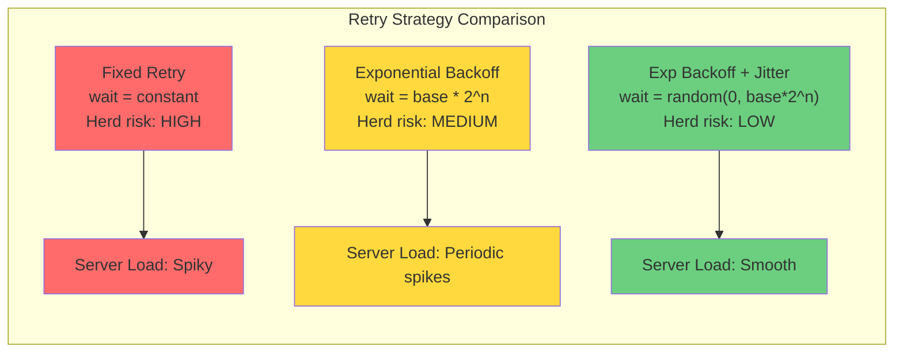
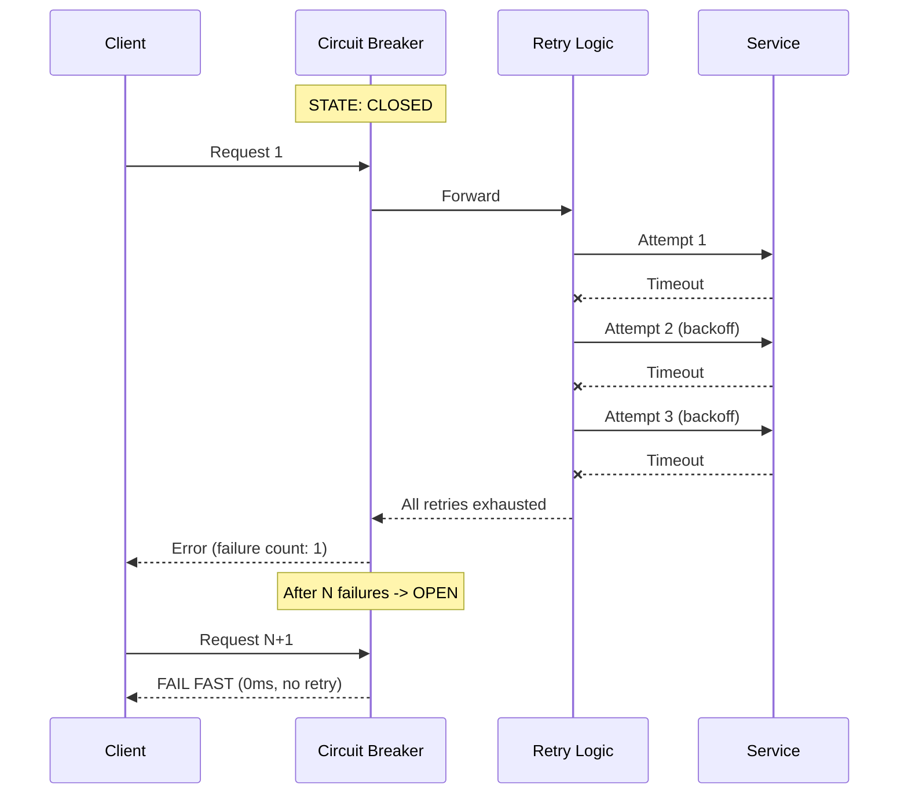
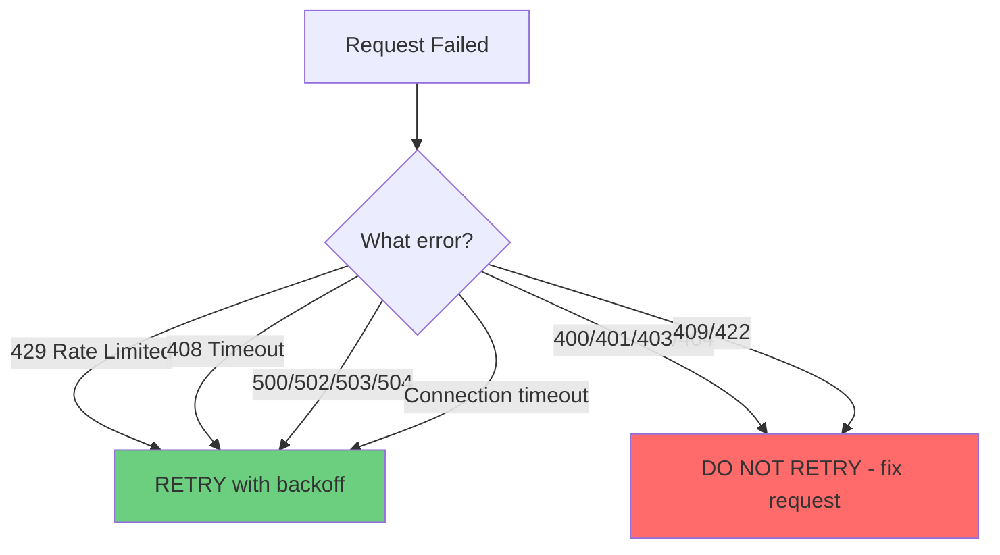
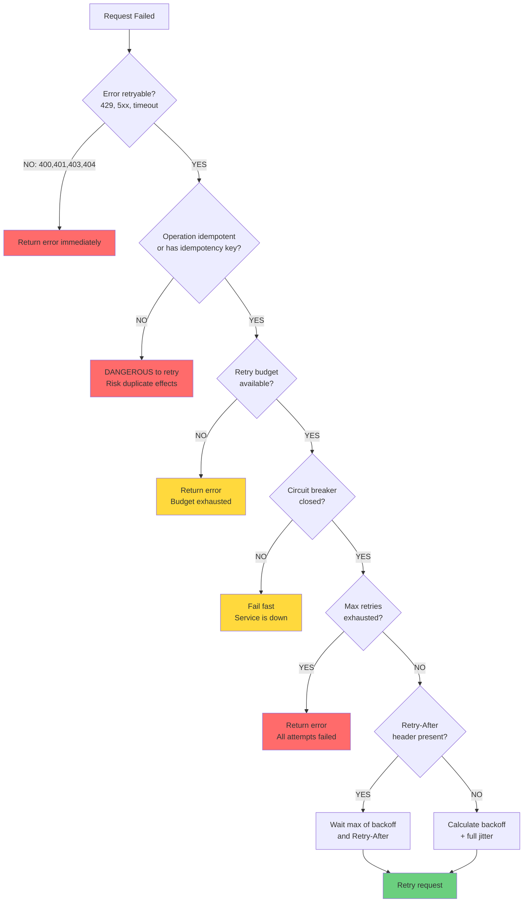

#system-design #pattern #reliability #resilience

# Retry with Exponential Backoff and Jitter

## Intuition (30 sec)

Calling a busy restaurant: you call, it's busy. You don't call back immediately -- you wait 1 minute, then 2 minutes, then 5 minutes. And you add a random offset so that everyone who got a busy signal doesn't call at the same moment, creating another busy signal. That random offset is jitter -- it decorrelates the retries.

---

## Failure-First Scenario

> 1000 clients call your payment API. The server is briefly overloaded and returns 503 to all 1000 clients. All 1000 clients retry at exactly t=1s. Server gets hammered with 1000 requests again. All fail. All retry at t=2s. The retries are synchronized -- they create a thundering herd that makes the overload WORSE. The server never recovers because each wave of retries recreates the exact spike that caused the original failure. A transient 1-second overload becomes a permanent outage.

---

## Working Knowledge (5 min)

### Core Concepts - Definitions First

**Retry with Backoff:**
- **Definition:** Automatically retry failed operations with increasing delay between attempts, preventing synchronized retry storms that amplify failures.
- **Purpose:** Handle transient failures (network blip, temporary overload, brief database lock) without overwhelming the target service.

**Key Terms:**
- **Exponential Backoff:** Delay strategy where wait time doubles after each failed attempt (1s, 2s, 4s, 8s...), spreading retries over time.
- **Jitter:** Random variation added to retry delay to prevent synchronized retries across multiple clients.
- **Thundering Herd:** Problem where many clients simultaneously retry after a failure, creating a spike that recreates the original overload.
- **Retry Storm:** Cascading effect where retries from failed requests generate more load than the original requests, making outages worse.
- **Idempotency:** Property ensuring that performing an operation multiple times produces the same result as performing it once. Critical for safe retries.
- **Max Retries:** Upper limit on retry attempts to prevent infinite retry loops and allow graceful failure.
- **Retry Budget:** System-wide limit on the percentage of requests that can be retries (e.g., max 10%), preventing retry amplification.

### Why Naive Retry Kills Systems

```
Naive Fixed Retry (1000 clients, retry at fixed 1s intervals):
━━━━━━━━━━━━━━━━━━━━━━━━━━━━━━━━━━━━━━━━━━━━━━━━━━━━━━━━━━━

Time   Server Load     What Happens
────   ───────────     ─────────────────────────────────────────
t=0s   1000 requests   Original burst -> server overloaded -> all fail
t=1s   1000 retries    All retry simultaneously -> same spike -> all fail
t=2s   1000 retries    Exact same pattern -> server never recovers

       Load Graph:
       |
  1000 | #   #   #   #   #   #   #   #   #   #
       | #   #   #   #   #   #   #   #   #   #
   500 | #   #   #   #   #   #   #   #   #   #
     0 |─────────────────────────────────────────
       0   1   2   3   4   5   6   7   8   9  (seconds)
       Synchronized spikes -> server never recovers


Exponential Backoff + Jitter (same 1000 clients):
━━━━━━━━━━━━━━━━━━━━━━━━━━━━━━━━━━━━━━━━━━━━━━━━

       Load Graph:
       |
  1000 | #
   500 | ##..
   200 | ##..::::........
   100 | ##..::::................
     0 |──────────────────────────────────────────
       0   1   2   4       8           16   (seconds)
       Load spreads out -> server recovers -> clients succeed
```

### The Three Levels

```
Level 1: Fixed Retry (BAD)
  Attempt 1: wait 1s,  Attempt 2: wait 1s,  Attempt 3: wait 1s
  Problem: All clients retry at same intervals -> thundering herd

Level 2: Exponential Backoff (BETTER)
  Attempt 1: wait 1s,  Attempt 2: wait 2s,  Attempt 3: wait 4s
  Better: Spreads retries over time
  Problem: All clients STILL retry at same moments (1s, 2s, 4s)

Level 3: Exponential Backoff + Jitter (BEST)
  Attempt 1: wait random(0, 1s),  Attempt 2: wait random(0, 2s),  Attempt 3: wait random(0, 4s)
  Best: Retries decorrelated -- each client retries at different times
```

### Jitter Strategies (with formulas)

**Full Jitter (AWS Recommended):**
```
sleep = random(0, min(cap, base * 2^attempt))

Example (base=1s, cap=30s):
  Attempt 0: random(0, 1s)
  Attempt 1: random(0, 2s)
  Attempt 2: random(0, 4s)
  Attempt 3: random(0, 8s)
  Attempt 5: random(0, 30s)  <- capped

Pros: Maximum decorrelation -- clients spread across entire range
Cons: Can sleep very short (near 0), wasting attempts
Best for: Most use cases (AWS recommendation)
```

**Equal Jitter:**
```
temp = min(cap, base * 2^attempt)
sleep = temp / 2 + random(0, temp / 2)

Example: Attempt 2 -> 2.0 + random(0, 2.0) = 2.0s - 4.0s

Pros: Guarantees minimum wait (half of backoff)
Best for: When you want guaranteed minimum delay
```

**Decorrelated Jitter:**
```
sleep = min(cap, random(base, sleep_prev * 3))

Pros: Each retry depends on previous sleep, creating decorrelation
Best for: Advanced scenarios with many concurrent retriers
```

### Visual Comparison

```
Retry Timing (10 clients, 3 retries each):
━━━━━━━━━━━━━━━━━━━━━━━━━━━━━━━━━━━━━━━━━━

Fixed Retry (every 1s):
Time: 0s    1s    2s    3s
      ######-----######-----######-----######
      All 10      All 10     All 10     All 10

Exponential Backoff (1s, 2s, 4s):
Time: 0s    1s    2s    3s    4s    5s    6s    7s
      ######-----######-----------######
      All 10      All 10           All 10

Exponential Backoff + Full Jitter:
Time: 0s    1s    2s    3s    4s    5s    6s    7s
      ######--#--##-#--###--#--##--#--#---#--#
      (retries spread smoothly across time range)
```



---

## Deep Dive

### Retry Budget

**Retry Budget:**
- **Definition:** A system-wide constraint that limits the total percentage of requests that can be retries, preventing retry amplification.

```
Without Retry Budget:
  Normal traffic: 1000 req/sec, capacity: 1200 req/sec, failure: 50%
  Round 1: 1000 original -> 500 fail -> 500 retries queued
  Round 2: 1000 + 500 retries = 1500 req/sec -> OVER CAPACITY
  Round 3: 1000 + 800 retries = 1800 req/sec -> MUCH WORSE
  Retries amplify load -> vicious cycle -> total collapse

With Retry Budget (10%):
  Retry budget: max 100 retries/sec (10% of 1000)
  Round 2: 1000 + 100 retries = 1100 req/sec -> within capacity
  Server recovers. Budget prevents amplification.
```

| Service Type | Retry Budget | Reasoning |
|-------------|-------------|-----------|
| **Critical (payment)** | 5-10% | Minimize extra load on critical path |
| **Standard (API)** | 10-20% | Balance between resilience and load |
| **Background (batch)** | 20-30% | More tolerance, less time-sensitive |

### Idempotency Requirement

**Retries MUST be idempotent** -- retrying a non-idempotent operation is dangerous.

```
Idempotent (safe to retry):
  GET  /users/123          -> Always returns same user
  PUT  /users/123 {data}   -> Sets user to data (same result)
  DELETE /users/123         -> User deleted (already deleted = OK)

Non-Idempotent (DANGEROUS to retry):
  POST /payments {$100}    -> Retry = double charge!
  POST /orders             -> Retry = duplicate order!
```

**Idempotency Key Pattern (how Stripe solves this):**
```
Client generates unique key before first attempt:

Attempt 1: POST /payments {$100}
           Idempotency-Key: abc-123
           -> Server processes, stores result keyed by "abc-123"
           -> Response lost in transit

Attempt 2: POST /payments {$100}   (retry, same key)
           Idempotency-Key: abc-123
           -> Server checks: already processed "abc-123"
           -> Returns cached response. No duplicate charge.
```

### Circuit Breaker Interaction

**Key rule:** Retries happen INSIDE the circuit breaker, not outside.

```
Correct: Retries Inside Circuit Breaker
┌────────────────────────────────────────────────────┐
│                 Circuit Breaker                     │
│  ┌─────────────────────────────────────────────┐  │
│  │  Retry: Attempt 1 -> fail -> Attempt 2 ->   │  │
│  │  fail -> Attempt 3 -> fail                   │  │
│  └─────────────────────────────────────────────┘  │
│  CB counts: 1 failure (all retries exhausted)      │
│  After N logical failures -> circuit OPENS          │
│  -> no more retries, fail fast immediately          │
└────────────────────────────────────────────────────┘
```



### Retryable vs Non-Retryable Errors



### Real-World Usage

| System | How Retry Works |
|--------|----------------|
| **AWS SDK** | Built-in exponential backoff + full jitter. Default: 3 retries, 100ms base, 20s max. Adaptive mode adds client-side rate limiting. |
| **gRPC** | Retry policy per method. Configurable maxAttempts, initialBackoff, maxBackoff, retryableStatusCodes. |
| **Stripe** | Idempotency keys on all mutable APIs. SDK retries with backoff. Server returns cached response on duplicate key. |
| **Spring Retry** | `@Retryable(maxAttempts=3, backoff=@Backoff(delay=1000, multiplier=2))` annotation. |
| **HTTP Clients** | OkHttp, Apache HttpClient, Python requests, Go retryablehttp -- all have built-in retry support. |

### Implementation (Java)

```java
import java.util.concurrent.ThreadLocalRandom;

/**
 * Retry with Exponential Backoff and Full Jitter
 * Algorithm: sleep = random(0, min(cap, base * 2^attempt))
 */
public class RetryWithBackoff {

    private final int maxRetries;
    private final long baseDelayMs;
    private final long maxDelayMs;

    public RetryWithBackoff(int maxRetries, long baseDelayMs, long maxDelayMs) {
        this.maxRetries = maxRetries;
        this.baseDelayMs = baseDelayMs;
        this.maxDelayMs = maxDelayMs;
    }

    public <T> T execute(
            RetryableOperation<T> operation,
            RetryPredicate isRetryable) throws Exception {

        Exception lastException = null;

        for (int attempt = 0; attempt <= maxRetries; attempt++) {
            try {
                return operation.execute();
            } catch (Exception e) {
                lastException = e;
                if (!isRetryable.shouldRetry(e)) throw e;
                if (attempt == maxRetries) break;

                long delay = calculateFullJitterDelay(attempt);
                Thread.sleep(delay);
            }
        }
        throw new RetriesExhaustedException(
            "All " + (maxRetries + 1) + " attempts failed", lastException);
    }

    /**
     * Full Jitter: sleep = random(0, min(cap, base * 2^attempt))
     */
    private long calculateFullJitterDelay(int attempt) {
        long exponentialDelay = baseDelayMs * (1L << attempt);
        long cappedDelay = Math.min(maxDelayMs, exponentialDelay);
        return ThreadLocalRandom.current().nextLong(0, cappedDelay + 1);
    }

    @FunctionalInterface
    public interface RetryableOperation<T> { T execute() throws Exception; }

    @FunctionalInterface
    public interface RetryPredicate { boolean shouldRetry(Exception e); }
}
```

**Usage:**

```java
RetryWithBackoff retrier = new RetryWithBackoff(3, 100, 30_000);

PaymentResponse response = retrier.execute(
    () -> paymentGateway.charge(request),
    (ex) -> {
        if (ex instanceof HttpClientException) {
            int status = ((HttpClientException) ex).getStatusCode();
            return status == 429 || status >= 500;
        }
        return ex instanceof SocketTimeoutException;
    }
);
```

**Resilience4j (Spring Boot):**

```yaml
resilience4j:
  retry:
    instances:
      paymentService:
        maxAttempts: 4
        waitDuration: 500ms
        enableExponentialBackoff: true
        exponentialBackoffMultiplier: 2
        enableRandomizedWait: true
        randomizedWaitFactor: 0.5
        retryExceptions:
          - java.net.SocketTimeoutException
          - java.net.ConnectException
        ignoreExceptions:
          - org.springframework.web.client.HttpClientErrorException

  # Combine with circuit breaker (retry INSIDE circuit breaker)
  circuitbreaker:
    instances:
      paymentService:
        failureRateThreshold: 50
        waitDurationInOpenState: 30s
```

```java
@Service
public class PaymentService {

    @CircuitBreaker(name = "paymentService", fallbackMethod = "paymentFallback")
    @Retry(name = "paymentService")
    @TimeLimiter(name = "paymentService")
    public CompletableFuture<PaymentResponse> processPayment(PaymentRequest request) {
        return CompletableFuture.supplyAsync(() -> paymentGateway.charge(request));
    }

    private CompletableFuture<PaymentResponse> paymentFallback(
            PaymentRequest request, Throwable t) {
        return CompletableFuture.completedFuture(
            PaymentResponse.pending("Payment temporarily unavailable"));
    }
}
```

---

## Production Considerations

### Configuration Guidelines

```
Parameter               Typical Value        Notes
━━━━━━━━━━━━━━━━━━━━━━━━━━━━━━━━━━━━━━━━━━━━━━━━━━━━━━━━━━━━━━━━
Max retry count         3-5 attempts         More than 5 rarely helps
Base delay              100ms - 1s           Start small, grow fast
Max backoff cap         30-60 seconds        Don't wait forever
Jitter strategy         Full jitter          AWS recommended
Retry budget            10% of total traffic Prevent amplification
Backoff multiplier      2x (doubling)        Standard exponential growth
```

### Retry Rate as Health Signal

```
Metric: retry_rate = retries / total_requests

  0-2%:   Normal (healthy, occasional transient errors)
  2-5%:   Warning (something degraded, investigate)
  5-10%:  Alert (significant issue, prepare to intervene)
  10%+:   Critical (retry storm or severe degradation)

Prometheus Queries:
━━━━━━━━━━━━━━━━━━

# Retry rate over 5 minutes
rate(requests_retried_total[5m]) / rate(requests_total[5m])

# Retry success rate (retries that eventually succeeded)
rate(retries_succeeded_total[5m]) / rate(requests_retried_total[5m])

# Average retries per failed request
rate(retry_attempts_total[5m]) / rate(requests_retried_total[5m])

# Alert: retry rate exceeds budget
alert: RetryBudgetExceeded
expr: (rate(requests_retried_total[5m]) / rate(requests_total[5m])) > 0.10
for: 2m
annotations:
  summary: "Retry rate exceeds 10% budget"
```

### Respect Retry-After Header

```
HTTP/1.1 429 Too Many Requests
Retry-After: 30

-> Client MUST wait at least 30 seconds before retrying
-> Override your backoff calculation: retryDelay = max(calculatedBackoff, retryAfterHeader)
```

### Common Pitfalls

```
1. Retrying non-idempotent operations without idempotency keys
   -> POST /payments retried = double charge. Fix: idempotency keys.

2. No max retry limit
   -> Infinite retries waste resources. Fix: Cap at 3-5.

3. Retrying 4xx client errors
   -> 400 Bad Request will never succeed. Fix: Only retry 429/5xx/timeouts.

4. No backoff cap
   -> base * 2^20 = absurd wait. Fix: Cap at 30-60s.

5. Retries outside circuit breaker
   -> Retry against open circuit = wasted attempts. Fix: Retry INSIDE CB.

6. No retry budget
   -> 50% failure + retries = 150% load. Fix: Budget retries to 10%.
```

### Decision Tree: When to Retry



---

## Real-World Examples

### Example 1: AWS SDK - Adaptive Retry Mode

**Problem:** AWS services experience transient throttling when clients exceed provisioned capacity. Without intelligent retry, clients either fail on throttling (losing requests) or retry too aggressively (amplifying load on already-throttled services).

**Solution:** Three retry modes with increasing sophistication:

```
Legacy Mode:
  Fixed backoff, no jitter
  Max 3 retries
  Problem: Thundering herd on throttled APIs

Standard Mode:
  Exponential backoff + full jitter
  Max 3 retries, 100ms base, 20s max
  Retries on throttle (429) and transient errors (5xx)

Adaptive Mode (recommended):
  All of Standard, PLUS:
  - Client-side rate limiting based on throttling responses
  - Tracks throttle rate and automatically reduces request rate
  - Retry budget: limits retries to percentage of traffic
  - Effectively implements back pressure at SDK level
```

**Configuration:**
```python
# Python boto3
import botocore.config
config = botocore.config.Config(
    retries={'max_attempts': 5, 'mode': 'adaptive'}
)
client = boto3.client('dynamodb', config=config)
```

**Results:**
- Request success rate: 99.9%+ (from 95% without retry)
- Adaptive mode recovers 3x faster than standard
- Retry amplification eliminated via built-in budget

### Example 2: Stripe - Idempotency Keys + Retry

**Problem:** Payment processing has the most dangerous retry failure mode: duplicate charges. Client sends payment, server processes it, but response lost. Client retries -- customer charged twice.

**Solution:** Every mutable API accepts `Idempotency-Key` header:

```
POST /v1/charges
Idempotency-Key: "key_abc123"
{"amount": 2000, "currency": "usd"}

First call:  Server processes charge, stores result keyed by "key_abc123"
             Response lost in transit.

Retry call:  Server sees "key_abc123" already processed.
             Returns SAME cached response. No duplicate charge.
```

**Key details:** Keys stored 24 hours. Scoped per API key. SDK auto-generates keys and retries with backoff. Duplicate payments reduced to near zero.

### Example 3: Google Cloud gRPC - Per-Method Retry

**Problem:** Brief UNAVAILABLE errors during deployments, load balancer draining, backend restarts (1-5 seconds).

**Solution:** gRPC built-in retry with per-method configuration:

```json
{
  "methodConfig": [{
    "name": [{"service": "google.spanner.v1.Spanner"}],
    "retryPolicy": {
      "maxAttempts": 5,
      "initialBackoff": "0.5s",
      "maxBackoff": "30s",
      "backoffMultiplier": 2.0,
      "retryableStatusCodes": ["UNAVAILABLE", "RESOURCE_EXHAUSTED"]
    }
  }]
}
```

**Key design decisions:**
- **Per-method config:** Different retry policies for different RPCs (reads vs writes)
- **Server pushback:** Server can send `retry-after` metadata to override client backoff
- **Retry throttling:** Client limits retry ratio to prevent storms
- **Hedged requests:** For latency-sensitive reads, send duplicate request to second backend after delay (not a retry, but complementary pattern)

---

## Interview Preparation

### Concept Glossary

- **Exponential Backoff:** Delay doubles each retry: 1s, 2s, 4s, 8s.
- **Full Jitter:** `random(0, min(cap, base*2^attempt))`. AWS recommended.
- **Thundering Herd:** Synchronized retry spike from many clients.
- **Retry Storm:** Retries amplify load beyond original requests.
- **Retry Budget:** Max % of traffic allowed as retries (10% typical).
- **Idempotency Key:** Unique ID preventing duplicate processing on retry.
- **Circuit Breaker:** Stops retrying on sustained failure. Retry lives inside CB.

### Question Template

**Q: "How do you handle transient failures?"**

1. **Define:** "Retry with exponential backoff and jitter. Backoff doubles wait time between retries. Jitter adds randomness so clients don't retry in lockstep, preventing thundering herd."

2. **Formula:** "sleep = random(0, min(cap, base * 2^attempt)). Full jitter. Cap at 30s. Max 3-5 retries."

3. **What separates good from great:**
   - Always mention **jitter** -- without it, backoff still has synchronized spikes
   - Implement **retry budget** (10%) -- prevents retry amplification
   - Ensure **idempotency** -- retrying non-idempotent ops causes duplicate effects

4. **Connect to circuit breaker:** "Retry handles transient failures. Circuit breaker handles sustained failures. After N retries fail, circuit opens, we stop retrying entirely."

**Q: "Why jitter, not just exponential backoff?"**

"Exponential backoff alone still synchronizes retries -- everyone waits exactly 1s, then 2s, then 4s. If 1000 clients fail simultaneously, you get 1000 retries at t=1s, then t=3s, then t=7s. Adding jitter randomizes each delay: instead of exactly 4s, one client waits 0.3s, another 2.7s, another 3.9s. AWS tested this and found full jitter completes all work fastest with fewest total calls."

**Q: "Why is idempotency critical for retries?"**

"Because the client can't distinguish 'server never received request' from 'server processed it but response was lost.' If I POST a $100 payment and get a timeout, the payment might have succeeded. Retry without idempotency = double charge. Fix: idempotency keys. Client generates unique key, server deduplicates. Stripe uses this on every mutable API."

### Three Things To Always Mention

```
1. JITTER       -> Decorrelates retries, prevents thundering herd
                   Formula: sleep = random(0, min(cap, base * 2^attempt))

2. IDEMPOTENCY  -> Safe to retry mutable operations
                   Pattern: Idempotency-Key header

3. CIRCUIT BREAKER -> Stop retrying on sustained failure
                      Retry inside circuit breaker, not outside
```

---

## Quick Reference

### Glossary

| Term | Definition | When You'll See It |
|------|------------|-------------------|
| **Exponential Backoff** | Delay doubles each retry: 1s, 2s, 4s | Every retry implementation |
| **Full Jitter** | random(0, min(cap, base*2^n)) | AWS SDK, best practice |
| **Thundering Herd** | Synchronized retry spike | Fixed retry without jitter |
| **Retry Storm** | Retries amplify load beyond original | No retry budget |
| **Retry Budget** | Max % of traffic as retries (10%) | Production systems |
| **Idempotency Key** | Unique ID preventing duplicates | Stripe, AWS, payments |
| **Retry-After** | Server header: when to retry | HTTP 429, 503 responses |
| **Backoff Cap** | Maximum delay (30-60s) | Prevents absurd waits |

### Configuration Quick Reference

```yaml
# CONSERVATIVE (Critical: payment, auth)
maxAttempts: 3
baseDelay: 200ms
maxDelay: 30s
jitter: full
retryBudget: 5%

# BALANCED (Standard: API, search)
maxAttempts: 4
baseDelay: 100ms
maxDelay: 30s
jitter: full
retryBudget: 10%

# AGGRESSIVE (Background: batch jobs)
maxAttempts: 5
baseDelay: 500ms
maxDelay: 60s
jitter: full
retryBudget: 20%
```

---

## The "Why" Chain

- **Why retry?** -> Transient failures are common in distributed systems. Most succeed on second attempt.
- **Why exponential backoff?** -> Fixed retry hammers server at constant rate. Exponential spreads retries over increasing windows.
- **Why jitter?** -> Even with backoff, clients that failed together retry together. Jitter randomizes so retries spread smoothly.
- **Why full jitter?** -> AWS tested all strategies. Full jitter completes work fastest with fewest total calls.
- **Why retry budget?** -> Without it, retries can exceed original traffic during outages (1000 + 1000 retries = 2000 load).
- **Why idempotency?** -> Response can be lost after server processes request. Retry without idempotency = duplicate effect.
- **Why circuit breaker with retry?** -> Retry handles transient failures. If failure is sustained, circuit breaker stops retrying entirely.

---

## Links

- [[03_design_patterns/circuit_breaker]] -- Circuit breaker stops retrying on sustained failures, prevents retry storms
- [[03_design_patterns/back_pressure]] -- Back pressure slows producers when consumers overwhelmed, complements retry
- [[02_building_blocks/rate_limiter]] -- Rate limiting triggers 429 that clients should retry with backoff
- [[02_building_blocks/monitoring_and_logging]] -- Monitor retry rate as health signal, alert on budget exhaustion
- [[03_design_patterns/saga_pattern]] -- Saga compensations must be idempotent, retry-safe
