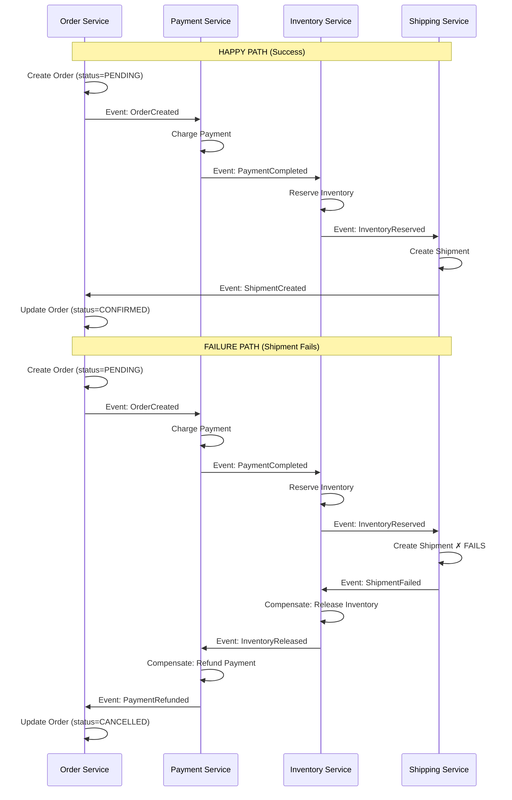
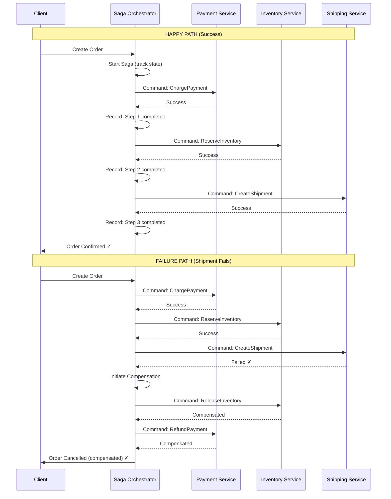
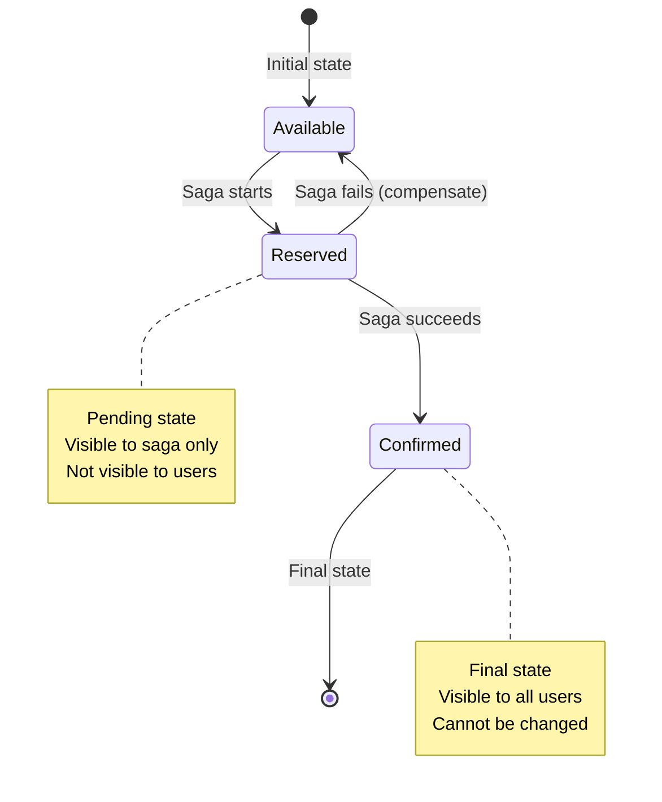
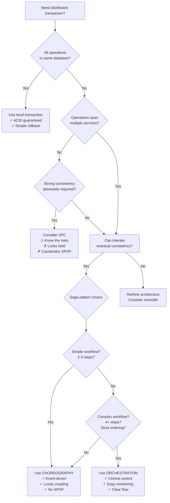
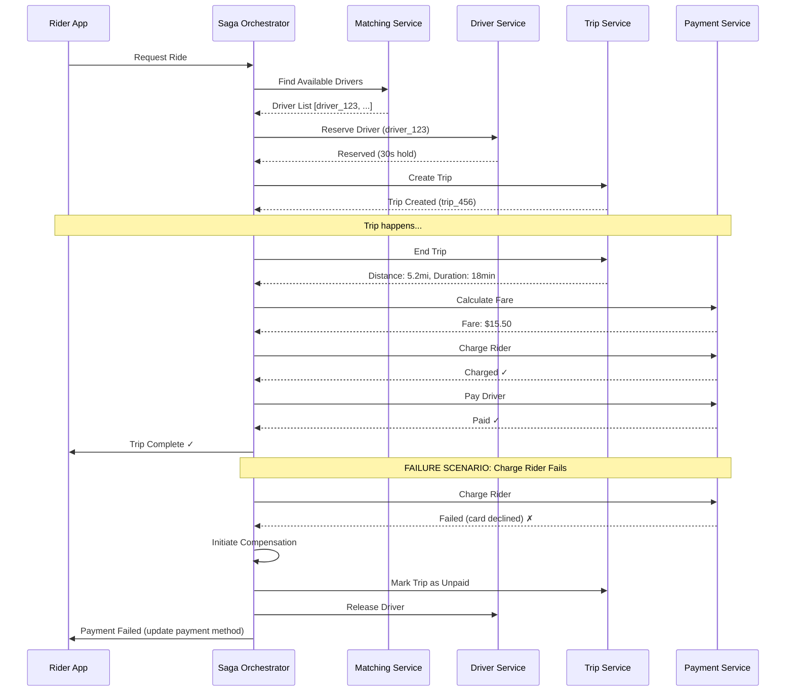
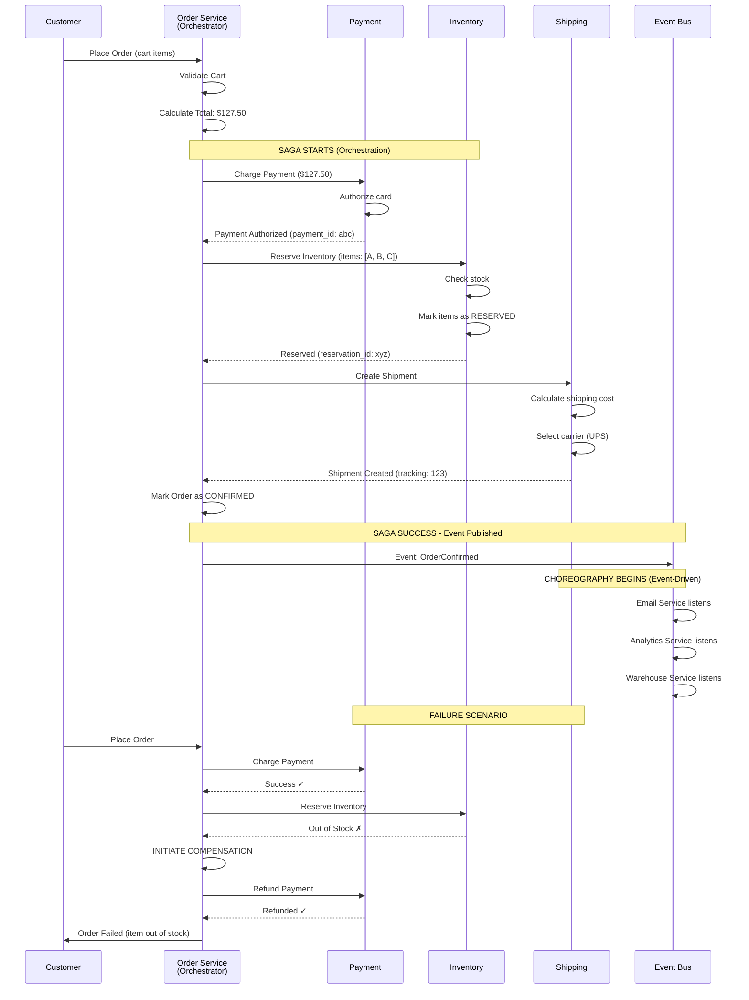

#system-design #pattern #distributed #transactions

# Saga Pattern

## Intuition (30 sec)

Booking a vacation: you book flight, then hotel, then car rental. If the car rental fails, you cancel the hotel, then cancel the flight — reversing each step. Each booking is a separate transaction with its own undo action. That's a saga.

## Failure-First Scenario

> E-commerce checkout: deduct payment → reduce inventory → create shipment. These span 3 microservices. You can't use a single database transaction. Payment succeeds, inventory deduction succeeds, shipment creation FAILS. Now you have money taken and inventory reduced for an order that can't ship. You need distributed transaction coordination.

---

## Working Knowledge (5 min)

### Core Concept - What is a Saga?

**Saga:**
- **Definition:** A design pattern that manages data consistency across multiple microservices by breaking a distributed transaction into a sequence of local transactions, where each step has a compensating action to undo it if needed
- **Purpose:** Provides eventual consistency without using distributed locks (avoids Two-Phase Commit)
- **How it works:** Execute steps sequentially; if any step fails, execute compensating transactions in reverse order

**Key Terms:**
- **Local Transaction:** A transaction that operates within a single microservice's database
- **Compensating Transaction:** An operation that reverses/undoes the effect of a previously completed step
- **Saga Execution Coordinator (SEC):** Component that manages the saga workflow (in orchestration pattern)
- **Forward Recovery:** Retry a failed step until it succeeds (for transient failures)
- **Backward Recovery:** Execute compensating transactions to roll back completed steps

### Why Not Two-Phase Commit (2PC)?

Two-Phase Commit is slow and fragile:

```
Two-Phase Commit (2PC):
═══════════════════════════════════════

Coordinator: "Prepare to commit"
    │
    ├──▶ Service A: ✓ Ready (holds locks)
    ├──▶ Service B: ✓ Ready (holds locks)
    └──▶ Service C: ✗ Failed

Problem: If coordinator crashes here,
         services are stuck holding locks!

Drawbacks:
✗ Coordinator is Single Point of Failure
✗ Locks held during prepare phase
✗ Blocking (services can't proceed)
✗ Poor performance (3-5x slower)
```

**Saga Alternative:**

```
Saga Approach:
═══════════════════════════════════════

Each step commits immediately:
Step 1: Commit ✓
Step 2: Commit ✓
Step 3: Failed ✗
  → Compensate Step 2 ✓
  → Compensate Step 1 ✓

Advantages:
✓ No distributed locks
✓ Non-blocking
✓ Better performance
✓ No coordinator SPOF (in choreography)

Trade-off:
~ Eventual consistency (not immediate)
~ Dirty reads possible during saga
```

### Visual Comparison Table

```
┌──────────────────────────────────────────────────────────────┐
│                 2PC vs SAGA COMPARISON                       │
├──────────────────────────────────────────────────────────────┤
│                                                              │
│  Two-Phase Commit (2PC)        Saga Pattern                 │
│  ══════════════════════        ════════════                 │
│                                                              │
│  Consistency: Strong           Consistency: Eventual         │
│  ✓ ACID guarantees             ~ BASE model                 │
│                                                              │
│  Locking: Pessimistic          Locking: Optimistic           │
│  ✗ Holds locks                 ✓ No locks held              │
│                                                              │
│  Performance: Slow             Performance: Fast             │
│  3-5x latency overhead         Minimal overhead              │
│                                                              │
│  Availability: Low             Availability: High            │
│  ✗ Coordinator SPOF            ✓ Decentralized              │
│                                                              │
│  Complexity: High              Complexity: Medium            │
│  Hard to implement             Easier to reason about        │
│                                                              │
│  Use When:                     Use When:                     │
│  • Same database               • Multiple microservices     │
│  • Strong consistency needed   • Eventual consistency OK    │
│  • Low scale                   • High scale needed          │
│                                                              │
└──────────────────────────────────────────────────────────────┘
```

---

## Layer 1: Conceptual Precision (15 min)

### Two Saga Implementation Styles

**1. Choreography (Event-Driven)**

**Definition:** A decentralized approach where each service listens for events and publishes events when its work is done, without a central coordinator.

**How it works:** Services communicate via events (pub/sub). Each service knows what to do when it receives an event, and what event to publish when done.



**Characteristics:**
- **Loose Coupling:** Services don't call each other directly
- **No Central Point:** Each service owns its logic
- **Event-Driven:** Communication via message queue/event bus

**2. Orchestration (Central Coordinator)**

**Definition:** A centralized approach where a saga orchestrator service explicitly tells each participant what operation to perform and tracks the overall saga state.

**How it works:** Orchestrator sends commands to services, waits for responses, decides next step, and handles compensations if needed.



**Characteristics:**
- **Centralized Control:** One orchestrator manages entire flow
- **Clear Visibility:** Easy to track saga state
- **Explicit Commands:** Services receive direct instructions
- **Tight Coupling:** Orchestrator knows all participants

### Choreography vs Orchestration Decision Tree

```
┌──────────────────────────────────────────────────┐
│  CHOREOGRAPHY vs ORCHESTRATION DECISION TREE     │
└──────────────────────────────────────────────────┘

START: Choose Saga Style
    │
    ▼
┌─────────────────────────────┐
│ How many steps in saga?     │
└─────────────────────────────┘
    │
    ├─ 2-3 steps (simple) ─────────▶ CHOREOGRAPHY
    │                               • Less overhead
    │                               • Simpler setup
    │
    └─ 4+ steps (complex) ─────────▶ Continue evaluation
                                        │
                                        ▼
                            ┌─────────────────────────────┐
                            │ Need central monitoring?    │
                            └─────────────────────────────┘
                                        │
                                        ├─ YES ────────────▶ ORCHESTRATION
                                        │                   • Easier debugging
                                        │                   • Track saga state
                                        │
                                        └─ NO ─────────────▶ Continue evaluation
                                                                │
                                                                ▼
                                                ┌─────────────────────────────┐
                                                │ Is order important?         │
                                                └─────────────────────────────┘
                                                                │
                                                    ├─ YES, strict order ──────▶ ORCHESTRATION
                                                    │                          • Guarantees sequence
                                                    │
                                                    └─ NO, parallel OK ────────▶ CHOREOGRAPHY
                                                                               • Better parallelism

Summary:
═════════
CHOREOGRAPHY when:                ORCHESTRATION when:
• 2-3 simple steps                • 4+ complex steps
• Services independent            • Strict ordering needed
• High autonomy desired           • Central monitoring required
• Event-driven architecture       • Complex compensation logic
```

### Choreography vs Orchestration Comparison

| Aspect | Choreography | Orchestration |
|--------|-------------|---------------|
| **Definition** | Decentralized coordination via events | Central coordinator directs flow |
| **Coupling** | Loose (services don't know each other) | Tight (orchestrator knows all) |
| **SPOF** | No single point of failure | Orchestrator is potential SPOF |
| **Visibility** | Hard to see overall flow | Easy to track saga state |
| **Complexity** | Distributed complexity | Centralized complexity |
| **Debugging** | Harder (trace across services) | Easier (check orchestrator logs) |
| **Cyclic Dependencies** | Possible (event loops) | Avoided (orchestrator controls) |
| **Best For** | Simple flows, 2-3 steps | Complex flows, 4+ steps |
| **Example** | Order → Payment → Inventory | Uber trip (7+ steps) |

### Compensating Transactions (The Undo Logic)

**Definition:** A compensating transaction is an operation that semantically undoes the effects of a completed step in a saga, restoring the system to a consistent state.

**Critical Properties:**
1. **Idempotent:** Safe to execute multiple times (network retries)
2. **Commutative:** Order doesn't matter if applied repeatedly
3. **Semantic Reversal:** Undoes business effect, not technical rollback

**Important Distinction:**
- **Database Rollback:** Technical undo within one transaction
- **Compensating Transaction:** Business-level undo across services

```
Compensating Transactions Examples:
════════════════════════════════════

┌────────────────────────────────────────────────────┐
│  Forward Action         │  Compensation            │
├────────────────────────────────────────────────────┤
│  Reserve inventory      │  Release inventory       │
│  Charge payment         │  Refund payment          │
│  Create shipment        │  Cancel shipment         │
│  Lock resource          │  Unlock resource         │
│  Send confirmation email│  Send cancellation email │
│  Deduct loyalty points  │  Add loyalty points back │
│  Create booking         │  Cancel booking          │
└────────────────────────────────────────────────────┘

Non-Compensatable Actions:
═══════════════════════════
Some actions CANNOT be compensated:
✗ Send email to customer (already sent!)
✗ Trigger external API (already called!)
✗ Print shipping label (already printed!)

Solution: Use semantic locks
• Mark order as "PENDING" not "CONFIRMED"
• Only send email AFTER saga completes
• Use two-step commit (reserve → confirm)
```

### Semantic Locks (The Pending State)

**Definition:** A technique where resources are marked as "pending" or "reserved" during the saga, preventing other transactions from using them while allowing the saga to proceed without distributed locks.

**Why needed:** Between saga steps, other transactions might see intermediate state (dirty reads).

```
Problem: Dirty Reads During Saga
═════════════════════════════════

Time  │ Saga: Book Concert Ticket           │ User Query
──────┼─────────────────────────────────────┼────────────────
T1    │ Deduct $100 from account            │
      │ (balance: $900)                     │
      │                                     │
T2    │ Reserve seat A12                    │ User checks: "$900"
      │ (marked as TAKEN)                   │ "Why so low?"
      │                                     │
T3    │ Payment processing fails ✗          │
      │                                     │
T4    │ Compensate: Refund $100             │ User checks: "$1000"
      │ (balance: $1000)                    │ "Wait, it changed?"
      │ Release seat A12                    │

User saw inconsistent state!


Solution: Semantic Locks (Pending State)
═════════════════════════════════════════

Time  │ Saga: Book Concert Ticket           │ User Query
──────┼─────────────────────────────────────┼────────────────
T1    │ Reserve $100 (balance: $900)        │
      │ BUT mark $100 as "PENDING"          │
      │                                     │
T2    │ Reserve seat A12                    │ User checks:
      │ Mark seat as "RESERVED"             │ "$900 available"
      │ (not TAKEN, not AVAILABLE)          │ "$100 pending"
      │                                     │ ✓ Consistent!
T3    │ Payment processing fails ✗          │
      │                                     │
T4    │ Release $100 reservation            │ User checks:
      │ Release seat A12 reservation        │ "$1000 available"
      │ (back to AVAILABLE)                 │ ✓ Consistent!

States prevent dirty reads!
```

**State Machine for Resources:**



### Forward Recovery vs Backward Recovery

**Forward Recovery:**
- **Definition:** Retry a failed step until it succeeds, assuming the failure is transient
- **When to use:** Network timeouts, temporary unavailability, rate limiting
- **Example:** Payment service timeout → retry 3 times with exponential backoff

**Backward Recovery:**
- **Definition:** Execute compensating transactions for all completed steps, abandoning the saga
- **When to use:** Permanent failures, business rule violations, resource exhaustion
- **Example:** Inventory out of stock → can't proceed, must compensate

```
Recovery Decision Flow:
═══════════════════════

Step Failed
    │
    ▼
┌─────────────────────┐
│ Is failure transient?│
└─────────────────────┘
    │
    ├─ YES (network timeout, rate limit)
    │       │
    │       ▼
    │   FORWARD RECOVERY
    │   • Retry with backoff
    │   • Max 3 attempts
    │   • If still fails → backward recovery
    │
    └─ NO (business rule violation, permanent error)
            │
            ▼
        BACKWARD RECOVERY
        • Execute compensations
        • In reverse order
        • Mark saga as failed


Example: E-Commerce Saga
═════════════════════════

Step 1: Charge Payment ✓
Step 2: Reserve Inventory ✓
Step 3: Create Shipment... (timeout)
    │
    ▼
Is timeout transient? YES
    │
    ▼
Retry Step 3 (attempt 2)... (timeout)
Retry Step 3 (attempt 3)... (timeout)
    │
    ▼
Max retries exceeded → Backward Recovery
    │
    ▼
Compensate Step 2: Release Inventory ✓
Compensate Step 1: Refund Payment ✓
    │
    ▼
Saga Failed (user notified)
```

---

## Layer 2: Technology-Specific Examples (20 min)

### Technology Stack Comparison

**Saga Orchestrators:**

| Tool | Definition | Best For | Language |
|------|-----------|----------|----------|
| **Temporal** | Durable workflow engine that manages long-running sagas with automatic retries and state persistence | Complex sagas with timeouts | Java, Go, Python |
| **Camunda** | BPMN-based workflow engine for orchestrating business processes | Visual workflow design | Java |
| **Apache Camel Saga** | Lightweight saga coordination in Camel routes | Integration pipelines | Java |
| **Axon Framework** | Event-sourcing framework with built-in saga support | CQRS + Event Sourcing | Java |

**Event Streaming (Choreography):**

| Tool | Definition | Best For |
|------|-----------|----------|
| **Kafka** | Distributed event streaming platform | High throughput, event replay |
| **RabbitMQ** | Message broker with routing | Flexible routing, lower latency |
| **AWS EventBridge** | Serverless event bus | AWS-native, low ops overhead |

### Orchestration Implementation Pattern (Conceptual)

```
Saga Orchestrator Architecture:
════════════════════════════════

┌────────────────────────────────────────────┐
│         SAGA ORCHESTRATOR                  │
│                                            │
│  ┌──────────────────────────────────┐     │
│  │  Saga Definition                 │     │
│  │  ─────────────────               │     │
│  │  • Step 1: ChargePayment         │     │
│  │    Compensate: RefundPayment     │     │
│  │  • Step 2: ReserveInventory      │     │
│  │    Compensate: ReleaseInventory  │     │
│  │  • Step 3: CreateShipment        │     │
│  │    Compensate: CancelShipment    │     │
│  └──────────────────────────────────┘     │
│                                            │
│  ┌──────────────────────────────────┐     │
│  │  State Persistence               │     │
│  │  ────────────────                │     │
│  │  • Current step: 2/3             │     │
│  │  • Completed steps: [1, 2]       │     │
│  │  • Retry count: 0                │     │
│  │  • Status: IN_PROGRESS           │     │
│  └──────────────────────────────────┘     │
│                                            │
│  ┌──────────────────────────────────┐     │
│  │  Retry Logic                     │     │
│  │  ────────────                    │     │
│  │  • Max retries: 3                │     │
│  │  • Backoff: exponential          │     │
│  │  • Timeout: 30s per step         │     │
│  └──────────────────────────────────┘     │
└────────────────────────────────────────────┘
         │           │           │
    ┌────▼───┐  ┌───▼────┐  ┌──▼──────┐
    │Payment │  │Inventory│ │Shipping │
    │Service │  │ Service │ │ Service │
    └────────┘  └─────────┘ └─────────┘
```

### Choreography Implementation Pattern (Conceptual)

```
Event-Driven Saga (Choreography):
══════════════════════════════════

┌─────────────────────────────────────────────────┐
│              EVENT BUS (Kafka)                  │
│                                                 │
│  Topics:                                        │
│  • order-created                                │
│  • payment-completed / payment-failed           │
│  • inventory-reserved / inventory-failed        │
│  • shipment-created / shipment-failed           │
└─────────────────────────────────────────────────┘
    │           │           │           │
    │           │           │           │
┌───▼─────┐ ┌──▼──────┐ ┌──▼──────┐ ┌──▼──────┐
│ Order   │ │Payment  │ │Inventory│ │Shipping │
│ Service │ │ Service │ │ Service │ │ Service │
└─────────┘ └─────────┘ └─────────┘ └─────────┘
    │
    │ Each service:
    │ • Listens to specific events
    │ • Performs local transaction
    │ • Publishes success/failure event
    │ • Handles compensation events
    └──────────────────────────────────────
```

### Configuration Pattern: Orchestration (Conceptual)

```yaml
# Saga Definition (Temporal-style)

saga-order-placement:
  name: "E-Commerce Order Saga"
  timeout: 5m                    # Max saga duration

  steps:
    - name: ChargePayment
      service: payment-service
      action: charge
      timeout: 30s               # Step timeout
      retry:
        max-attempts: 3
        backoff: exponential     # 1s, 2s, 4s
      compensate: RefundPayment  # Undo action

    - name: ReserveInventory
      service: inventory-service
      action: reserve
      timeout: 30s
      retry:
        max-attempts: 3
        backoff: exponential
      compensate: ReleaseInventory

    - name: CreateShipment
      service: shipping-service
      action: create
      timeout: 30s
      retry:
        max-attempts: 2
        backoff: linear          # 1s, 2s
      compensate: CancelShipment

  on-failure:
    action: compensate-all       # Execute compensations in reverse
    notify: order-service        # Notify original caller

  on-success:
    action: confirm-order        # Mark order as confirmed
    notify: order-service
```

**Configuration Explanations:**

- **timeout (saga level):** Maximum time for entire saga (prevents stuck sagas)
- **timeout (step level):** Maximum time for one step (prevents hung services)
- **retry.max-attempts:** How many times to retry before giving up
- **backoff: exponential:** Wait 1s, 2s, 4s, 8s between retries (reduces load)
- **compensate:** Which action to call if saga fails

### Configuration Pattern: Choreography (Conceptual)

```yaml
# Event Handler Configuration (Order Service)

event-handlers:
  - event: OrderCreated
    action: publishToPaymentService
    topic: payment-requests

  - event: PaymentFailed
    action: cancelOrder
    compensate: true             # This is a compensation

  - event: InventoryReleased
    action: notifyCustomer
    message: "Order cancelled"

---

# Event Handler Configuration (Payment Service)

event-handlers:
  - event: PaymentRequest
    source-topic: payment-requests
    action: chargeCustomer
    timeout: 30s
    on-success:
      publish-event: PaymentCompleted
      target-topic: inventory-requests
    on-failure:
      publish-event: PaymentFailed
      target-topic: order-updates

  - event: PaymentRefundRequest  # Compensation
    action: refundCustomer
    idempotency-key: orderId     # Prevent double refund
    on-success:
      publish-event: PaymentRefunded
```

**Key Concepts:**
- **idempotency-key:** Ensures compensation runs only once (critical!)
- **source-topic:** Which Kafka topic to listen to
- **target-topic:** Where to publish result event
- **on-success / on-failure:** Different event based on outcome

---

## Layer 3: Production-Ready Details (30 min)

### Production Architecture: E-Commerce Saga

```
                    ┌──────────────────┐
                    │  API Gateway     │
                    │  (Rate Limiting) │
                    └────────┬─────────┘
                             │
                    ┌────────▼─────────┐
                    │ Saga Orchestrator│
                    │  (Stateful)      │
                    │                  │
                    │ Features:        │
                    │ • State DB       │
                    │ • Retry logic    │
                    │ • Timeout mgmt   │
                    │ • Compensation   │
                    └────────┬─────────┘
                             │
        ┌────────────────────┼────────────────────┐
        │                    │                    │
   ┌────▼─────┐       ┌──────▼──────┐     ┌─────▼──────┐
   │ Payment  │       │  Inventory  │     │  Shipping  │
   │ Service  │       │   Service   │     │   Service  │
   │          │       │             │     │            │
   │ POST     │       │ POST        │     │ POST       │
   │ /charge  │       │ /reserve    │     │ /shipment  │
   │ /refund  │       │ /release    │     │ /cancel    │
   └────┬─────┘       └──────┬──────┘     └─────┬──────┘
        │                    │                   │
   ┌────▼─────┐         ┌────▼─────┐       ┌────▼──────┐
   │Payment DB│         │Stock DB  │       │Shipment DB│
   │(Postgres)│         │(Postgres)│       │(Postgres) │
   └──────────┘         └──────────┘       └───────────┘

   ┌────────────────────────────────────────────────────┐
   │          Saga State Database                       │
   │          (Critical Component!)                     │
   │                                                    │
   │  Table: saga_executions                            │
   │  ──────────────────────────────────────            │
   │  • saga_id: UUID                                   │
   │  • status: IN_PROGRESS | COMPLETED | COMPENSATING │
   │  • current_step: 2                                 │
   │  • completed_steps: [1, 2]                         │
   │  • retry_count: 0                                  │
   │  • started_at: timestamp                           │
   │  • timeout_at: timestamp + 5min                    │
   │  • context: JSON (order data)                      │
   │                                                    │
   │  Purpose: Resume saga after orchestrator crash!    │
   └────────────────────────────────────────────────────┘
```

**Architecture Component Definitions:**

- **API Gateway:** Entry point that authenticates requests and applies rate limiting
- **Saga Orchestrator:** Stateful service that manages saga execution and compensation
- **Saga State Database:** Persistent store for saga progress (enables crash recovery)
- **Service DBs:** Each service owns its data (no shared database)

### Monitoring Dashboard: Saga Health

```
╔════════════════════════════════════════════════════════════╗
║              SAGA MONITORING DASHBOARD                     ║
╠════════════════════════════════════════════════════════════╣
║                                                            ║
║  🟢 Saga Success Rate                                      ║
║  ▰▰▰▰▰▰▰▰▰▰▰▰▰▰▰▰▰▰▰▰▰▰▰▰▰▰▰▰▰▰▰▰▰▰▰▰▰▰▱▱               ║
║  98.5%  (1,247 succeeded / 1,266 total)                   ║
║  Definition: Percentage of sagas that complete without     ║
║              requiring compensation                        ║
║  Target: > 95%                                             ║
║                                                            ║
║  🟡 Compensation Frequency                                 ║
║  ▰▰▰░░░░░░░░░░░░░░░░░░░░░░░░░░░░░░░░░░░░                 ║
║  1.5%  (19 compensations / 1,266 sagas)                   ║
║  Definition: How often sagas fail and need to rollback    ║
║  Alert if: > 5% (indicates systemic issues)               ║
║                                                            ║
║  🔵 Average Saga Duration                                  ║
║  ▰▰▰▰▰▰▰▰▰▰▰▰▰▰▰▰▰▰▰▰▰▰░░░░░░░░░░░░░░░░                 ║
║  847ms  (P50: 650ms, P99: 2.3s)                           ║
║  Definition: Time from saga start to completion           ║
║  Target: < 1s for P50, < 3s for P99                       ║
║                                                            ║
║  🟠 Currently Running Sagas                                ║
║  ▰▰▰▰▰▰▰▰░░░░░░░░░░░░░░░░░░░░░░░░░░░░░                  ║
║  47 active sagas                                           ║
║  Definition: Sagas currently in progress                  ║
║  Alert if: > 1000 (potential bottleneck)                  ║
║                                                            ║
║  🔴 Saga Timeouts                                          ║
║  ▰░░░░░░░░░░░░░░░░░░░░░░░░░░░░░░░░░░░░░░                 ║
║  3 timeouts in last hour                                   ║
║  Definition: Sagas that exceeded max duration (5 min)     ║
║  Alert if: > 10/hour                                       ║
║                                                            ║
║  Compensation Step Breakdown:                              ║
║  ┌──────────────────────────────────────────────┐         ║
║  │ Payment Refund:     14 times  [▰▰▰▰▰▰▰░░░]  │         ║
║  │ Inventory Release:  8 times   [▰▰▰▰░░░░░░]  │         ║
║  │ Shipment Cancel:    2 times   [▰░░░░░░░░░]  │         ║
║  └──────────────────────────────────────────────┘         ║
║  Most common failure: Payment step (73% of failures)      ║
║                                                            ║
╠════════════════════════════════════════════════════════════╣
║  Recent Failed Sagas:                                      ║
║  • saga_a7f9  Payment timeout (compensated)                ║
║  • saga_b2d4  Inventory out of stock (compensated)         ║
║  • saga_c8e1  Shipping service unavailable (compensated)   ║
╚════════════════════════════════════════════════════════════╝
```

**Metric Definitions:**

- **Saga Success Rate:** (Completed sagas) / (Total sagas) × 100%
  - Formula: `success_rate = (completed / (completed + compensated)) * 100`
  - Good: > 95%, Warning: 90-95%, Critical: < 90%

- **Compensation Frequency:** (Compensated sagas) / (Total sagas) × 100%
  - Formula: `comp_rate = (compensated / total) * 100`
  - Indicates: System health (low is better)

- **Average Duration:** Time from saga start to end (success or compensation)
  - Includes: All step durations + retries + network latency
  - P99: 99% of sagas complete within this time

- **Timeout Rate:** Sagas that exceed configured max duration
  - Indicates: Potential deadlocks, hung services, or cascading failures

### Production Patterns: Critical Considerations

#### 1. Timeout Handling

```
Timeout Strategy (Critical for Production):
═══════════════════════════════════════════

Problem: Service hangs, saga waits forever
Solution: Multi-level timeouts

┌────────────────────────────────────────────┐
│  Timeout Level 1: Step Timeout (30s)      │
│  ─────────────────────────────────         │
│  Each saga step has individual timeout     │
│                                            │
│  Payment Service: 30s                      │
│    └─ If exceeds → retry or compensate     │
│                                            │
│  Inventory Service: 30s                    │
│    └─ If exceeds → retry or compensate     │
└────────────────────────────────────────────┘

┌────────────────────────────────────────────┐
│  Timeout Level 2: Saga Timeout (5min)     │
│  ────────────────────────────────          │
│  Entire saga must complete in 5 minutes    │
│                                            │
│  If exceeded:                              │
│  • Mark saga as TIMED_OUT                  │
│  • Initiate full compensation              │
│  • Alert operations team                   │
│  • Investigate root cause                  │
└────────────────────────────────────────────┘

┌────────────────────────────────────────────┐
│  Timeout Level 3: HTTP Timeout (10s)      │
│  ──────────────────────────────────        │
│  HTTP client timeout for service calls     │
│                                            │
│  If exceeded:                              │
│  • Close connection                        │
│  • Count as step failure                   │
│  • Trigger step retry logic                │
└────────────────────────────────────────────┘

Best Practice:
HTTP Timeout < Step Timeout < Saga Timeout
   10s       <      30s      <      5min
```

#### 2. Idempotency (Critical!)

```
Idempotency: Execute Multiple Times Safely
═══════════════════════════════════════════

Problem: Network failure → retry → duplicate action

WITHOUT Idempotency:
────────────────────
Client: "Charge $100"
Service: Charges $100 ✓
Network: Timeout ✗ (response lost)
Client: "Didn't get response, retry"
Service: Charges $100 again ✗
Result: Customer charged $200! 💸


WITH Idempotency:
─────────────────
Client: "Charge $100" (idempotency_key: order_123)
Service: Charges $100 ✓
         Stores: {order_123: "charged"}
Network: Timeout ✗ (response lost)
Client: "Didn't get response, retry"
        "Charge $100" (idempotency_key: order_123)
Service: Sees order_123 already processed
         Returns: "Already charged" ✓
Result: Customer charged $100 (correct!) ✓


Implementation Pattern:
───────────────────────
Table: idempotency_keys
  • key: VARCHAR (e.g., "order_123_payment")
  • operation: VARCHAR ("charge", "refund")
  • result: JSON (response data)
  • created_at: TIMESTAMP
  • expires_at: TIMESTAMP (24h later)

Before executing operation:
1. Check if key exists
2. If exists → return cached result
3. If not exists → execute + store result
4. Cleanup expired keys (>24h old)

Idempotency Key Format:
  {saga_id}_{step_name}_{attempt}
  Example: "a7f9_payment_1"

This prevents:
✓ Duplicate charges
✓ Duplicate inventory reservations
✓ Duplicate shipments
✓ Duplicate compensations (critical!)
```

#### 3. Saga State Persistence

```
Saga State Persistence (Crash Recovery):
════════════════════════════════════════

Why needed: Orchestrator crashes, sagas must resume

┌────────────────────────────────────────────┐
│  Saga State Table Schema                   │
├────────────────────────────────────────────┤
│                                            │
│  CREATE TABLE saga_state (                 │
│    saga_id          UUID PRIMARY KEY,      │
│    saga_type        VARCHAR,  -- "order"   │
│    status           VARCHAR,  -- state     │
│    current_step     INTEGER,  -- 2         │
│    completed_steps  JSON,     -- [1,2]     │
│    retry_count      INTEGER,  -- 0         │
│    context          JSON,     -- order data│
│    started_at       TIMESTAMP,             │
│    updated_at       TIMESTAMP,             │
│    timeout_at       TIMESTAMP, -- deadline │
│    last_error       TEXT                   │
│  )                                         │
│                                            │
│  INDEX idx_status_timeout                  │
│    ON saga_state(status, timeout_at)       │
│    WHERE status = 'IN_PROGRESS'            │
└────────────────────────────────────────────┘

Saga Status Values:
───────────────────
• CREATED: Saga initialized, not started
• IN_PROGRESS: Currently executing steps
• COMPENSATING: Rolling back completed steps
• COMPLETED: All steps succeeded
• COMPENSATED: All steps rolled back
• FAILED: Compensation failed (manual fix!)
• TIMED_OUT: Exceeded max duration

Recovery Process (After Orchestrator Restart):
───────────────────────────────────────────────
1. Query: SELECT * FROM saga_state
          WHERE status IN ('IN_PROGRESS', 'COMPENSATING')

2. For each saga:
   • Check if timed out → initiate compensation
   • Resume from current_step
   • Use context to rebuild state
   • Continue execution or compensation

3. Handle stuck sagas:
   • If updated_at > 5 min ago → mark as TIMED_OUT
   • Initiate compensation
   • Alert operations
```

### Decision Tree: When to Use Saga vs 2PC



### Troubleshooting Guide

#### Problem 1: Partial Failure (Step Succeeds, Response Lost)

```
Scenario: Partial Failure
═════════════════════════

Timeline:
────────
T1: Orchestrator → Payment Service: "Charge $100"
T2: Payment Service: Charges $100 ✓
T3: Payment Service → Orchestrator: "Success" (network fails)
T4: Orchestrator: Timeout, no response received
T5: Orchestrator: Should retry? Or assume failure?

Problem:
────────
• Payment succeeded (customer charged)
• Orchestrator thinks it failed (no response)
• If retry → double charge!
• If don't retry → saga can't proceed!

Solution: Idempotency + State Check
────────────────────────────────────
T6: Orchestrator retries with SAME idempotency key
T7: Payment Service checks: "order_123 already processed"
T8: Payment Service returns: "Already charged" ✓
T9: Orchestrator: Receives confirmation, continues saga

Key Pattern:
────────────
✓ Always use idempotency keys
✓ Always retry on timeout (safe with idempotency)
✓ Service checks state before executing
✓ Return cached result if already done

Implementation:
───────────────
Payment Service:
  1. Receive: (orderId, amount, idempotency_key)
  2. Check: SELECT * FROM processed
            WHERE key = idempotency_key
  3. If found: Return cached result
  4. If not found:
     a. Charge payment
     b. Store result with key
     c. Return result
```

#### Problem 2: Compensation Failure

```
Scenario: Compensation Fails
════════════════════════════

Timeline:
────────
T1: Charge Payment ✓ (customer charged $100)
T2: Reserve Inventory ✓ (item reserved)
T3: Create Shipment ✗ (shipping service down)
T4: Compensate: Release Inventory ✓
T5: Compensate: Refund Payment ✗ (payment service down!)

Problem:
────────
• Customer charged $100
• No shipment created
• Refund failed!
• Customer lost money! 💸

Solution: Dead Letter Queue + Manual Review
────────────────────────────────────────────
T6: Orchestrator marks saga as "COMPENSATION_FAILED"
T7: Publishes event to Dead Letter Queue (DLQ)
T8: Alert sent to operations team
T9: Manual review process triggered

Event in DLQ:
─────────────
{
  "saga_id": "a7f9",
  "status": "COMPENSATION_FAILED",
  "failed_step": "RefundPayment",
  "reason": "Payment service unavailable",
  "customer_id": "user_123",
  "amount": 100.00,
  "attempts": 5,
  "action_needed": "Manual refund required"
}

Handling Process:
─────────────────
1. Operations receives alert
2. Verify customer was charged
3. Issue manual refund
4. Update saga status to "COMPENSATED"
5. Notify customer of delay

Prevention:
───────────
• Compensations should be simple operations
• Compensations should rarely fail
• Use queue for async compensation (more reliable)
• Have fallback compensation mechanism
• Monitor compensation failure rate (alert if > 0.1%)
```

#### Problem 3: Long-Running Sagas

```
Scenario: Long-Running Saga
═══════════════════════════

Timeline:
────────
T1: Start saga (order placement)
T2: Charge Payment ✓ (30ms)
T3: Reserve Inventory ✓ (40ms)
T4: Create Shipment... (calling external carrier API)
T5: Still waiting... (5 seconds)
T6: Still waiting... (30 seconds)
T7: Still waiting... (5 minutes)
T8: Should we timeout? Keep waiting?

Problem:
────────
• External API is slow (carrier verification)
• Saga is stuck waiting
• Resources held (inventory reserved)
• Customer sees "processing" for 5+ minutes
• Other sagas queued behind it

Solution 1: Timeout + Async Continuation
─────────────────────────────────────────
Instead of synchronous shipment creation:

Saga steps:
1. Charge Payment ✓
2. Reserve Inventory ✓
3. Request Shipment (async) ✓
   • Post to queue
   • Return immediately
   • Worker processes later
4. Mark Order as "PAYMENT_CONFIRMED"
5. Complete Saga ✓

Shipment Worker (separate):
• Pulls from queue
• Calls carrier API (can take 5 min)
• Updates order when done
• If fails → can compensate asynchronously

Benefit:
• Saga completes fast (~100ms)
• Customer sees "Order Confirmed" quickly
• Shipment happens in background
• No blocking

Solution 2: Polling Pattern
───────────────────────────
If must wait for shipment:

1. Initiate Shipment (returns job_id)
2. Poll for status (every 5 seconds)
   • Max 12 attempts (60 seconds)
   • Check: GET /shipment/status/{job_id}
3. If timeout → compensate
4. If success → continue

This prevents:
✗ Indefinite waiting
✓ Bounded time (60s max)
✓ Can compensate if too slow

Best Practice:
──────────────
Long-running operations should be:
• Asynchronous (use queues)
• Pollable (provide status endpoint)
• Time-bounded (have max wait time)
• Compensatable (can cancel/undo)

Saga should only wait for:
• Fast operations (< 5 seconds)
• Critical operations (payment)
```

---

## Real-World Examples

### Example 1: Uber - Trip Booking Saga

**Problem:**
```
Book a ride involves multiple services:
• Rider places ride request
• Match with available driver
• Reserve driver
• Start trip
• Calculate fare
• Charge rider
• Pay driver

Any step can fail → need compensation
```

**Solution: Orchestration-Based Saga**



**Saga Steps:**

```
Uber Trip Saga (7 Steps):
═════════════════════════

Step 1: Match Driver
  Action: Find nearby driver
  Compensate: Release driver search
  Timeout: 30s

Step 2: Reserve Driver
  Action: Lock driver for this trip
  Compensate: Release driver (make available)
  Timeout: 5s
  Semantic Lock: Driver status = "RESERVED"

Step 3: Create Trip
  Action: Create trip record
  Compensate: Cancel trip
  Timeout: 5s
  Semantic Lock: Trip status = "PENDING"

Step 4: Start Trip
  Action: Mark trip as started
  Compensate: Cannot compensate (already started!)
  Timeout: N/A
  Note: Point of no return

Step 5: End Trip
  Action: Record distance, duration
  Compensate: N/A (trip already happened)
  Timeout: N/A

Step 6: Charge Rider
  Action: Charge credit card
  Compensate: Refund payment
  Timeout: 30s
  Idempotency: Required!

Step 7: Pay Driver
  Action: Transfer funds to driver
  Compensate: Reverse payment
  Timeout: 30s
  Idempotency: Required!
```

**Key Design Decisions:**

```
Decision 1: Point of No Return
───────────────────────────────
After "Start Trip", cannot fully compensate
(trip already happened physically)

Solution:
• Split payment from trip
• If payment fails after trip → rider debt
• Retry payment later (asynchronously)
• Block future rides until paid

Decision 2: Driver Timeout
──────────────────────────
Driver must accept within 30 seconds

If timeout:
• Release driver
• Find another driver
• Transparent to rider

Decision 3: Payment Retry
─────────────────────────
If charge fails:
• Don't immediately cancel trip
• Try alternative payment method
• Retry 3 times
• Only then compensate
```

**Results:**
- 99.7% saga success rate
- Average saga duration: 2.3s (excluding actual trip)
- Compensation rate: 0.3% (mostly payment failures)
- Handles 100M+ trips/day

### Example 2: E-Commerce - Order Placement Saga

**Problem:**
```
Place order involves:
• Validate cart
• Check inventory
• Apply discounts
• Charge payment
• Reserve inventory
• Create shipment
• Send confirmation

Traditional monolith: Single DB transaction
Microservices: Need saga pattern
```

**Solution: Hybrid Approach (Orchestration + Choreography)**

```
E-Commerce Order Saga Architecture:
════════════════════════════════════

                 ┌──────────────┐
                 │ Order Service│
                 │ (Orchestrator)│
                 └───────┬──────┘
                         │
    ┌────────────────────┼────────────────────┐
    │                    │                    │
┌───▼────────┐    ┌──────▼──────┐    ┌───────▼──────┐
│ Payment    │    │  Inventory  │    │  Shipping    │
│ Service    │    │  Service    │    │  Service     │
└───┬────────┘    └──────┬──────┘    └───────┬──────┘
    │                    │                    │
    └────────────────┬───┴────────────────────┘
                     │
            ┌────────▼────────┐
            │   Event Bus     │
            │   (Kafka)       │
            └─────────────────┘
                     │
    ┌────────────────┼────────────────┐
    │                │                │
┌───▼──────┐  ┌──────▼──────┐  ┌─────▼──────┐
│ Email    │  │ Analytics   │  │ Warehouse  │
│ Service  │  │ Service     │  │ Service    │
└──────────┘  └─────────────┘  └────────────┘
```

**Saga Flow:**



**Saga Definition:**

```yaml
saga: order-placement
version: 2.0
timeout: 5m

steps:
  - name: ValidateCart
    service: order-service
    action: validate
    local: true              # No network call
    timeout: 1s
    retry: 0                 # Don't retry validation
    compensate: null         # No compensation needed

  - name: ChargePayment
    service: payment-service
    endpoint: POST /payments/charge
    timeout: 30s
    retry: 3
    backoff: exponential
    idempotency-key: "{{orderId}}_payment"
    compensate:
      action: RefundPayment
      endpoint: POST /payments/refund
      timeout: 30s
      idempotency-key: "{{orderId}}_refund"

  - name: ReserveInventory
    service: inventory-service
    endpoint: POST /inventory/reserve
    timeout: 30s
    retry: 2
    backoff: linear
    idempotency-key: "{{orderId}}_inventory"
    compensate:
      action: ReleaseInventory
      endpoint: POST /inventory/release
      timeout: 15s
      idempotency-key: "{{orderId}}_release"

  - name: CreateShipment
    service: shipping-service
    endpoint: POST /shipments
    timeout: 45s             # Slower (external carrier API)
    retry: 2
    backoff: exponential
    idempotency-key: "{{orderId}}_shipment"
    compensate:
      action: CancelShipment
      endpoint: POST /shipments/cancel
      timeout: 30s
      idempotency-key: "{{orderId}}_cancel_shipment"

on-success:
  - publish-event: OrderConfirmed
    topic: orders
    async: true              # Don't wait for consumers

on-failure:
  - publish-event: OrderFailed
    topic: orders
    reason: "{{failureReason}}"
```

**State Transitions:**

```
Order State Machine:
════════════════════

    [CREATED]
        │
        ▼
   [VALIDATING]  ──✗──▶ [VALIDATION_FAILED]
        │
        ▼ ✓
   [CHARGING]  ──✗──▶ [PAYMENT_FAILED]
        │                    │
        ▼ ✓                  ▼
   [RESERVING]          [CANCELLED]
        │
    ┌───▼──┐
    │      │
    ✓      ✗ (out of stock)
    │      │
    │      └──▶ [COMPENSATING] ──▶ [REFUNDED] ──▶ [CANCELLED]
    │
    ▼
 [SHIPPING]  ──✗──▶ [COMPENSATING]
    │
    ▼ ✓
 [CONFIRMED]
    │
    ▼
 [COMPLETED]

Semantic Lock States:
• RESERVING: Inventory held but not confirmed
• CHARGING: Payment authorized but not captured
• SHIPPING: Shipment created but not picked up

Visibility:
• Customer sees: "Processing..." (for RESERVING, CHARGING, SHIPPING)
• Customer sees: "Confirmed" (for CONFIRMED)
• Internal: Full state visible
```

**Results:**
- Order placement: 850ms average (P99: 2.1s)
- Success rate: 97.8%
- Compensation rate: 2.2% (mostly inventory issues)
- Payment failure: 0.8%
- Inventory failure: 1.3%
- Shipping failure: 0.1%

**Key Learnings:**

```
Learning 1: Separate Fast and Slow Steps
─────────────────────────────────────────
Payment + Inventory: Fast (~100ms each)
Shipping: Slow (500ms+ due to carrier API)

Solution: Complete saga at CONFIRMED state
  Ship asynchronously via event

Learning 2: Idempotency is Critical
───────────────────────────────────
Payment retries caused double charges

Solution: Idempotency keys on ALL operations
  Store: {orderId}_payment, {orderId}_refund

Learning 3: Monitor Compensation Patterns
─────────────────────────────────────────
Inventory failures spiked during Black Friday

Solution: Pre-allocate popular items
  Cache inventory checks
  Fail fast if out of stock (before payment)

Learning 4: Semantic Locks for UX
──────────────────────────────────
Users saw balance change mid-saga

Solution: Show "pending" state
  Don't confirm until saga completes
  Use PENDING status for all resources
```

---

## Interview Preparation

### Concept Glossary

Quick reference definitions for interview:

- **Saga:** Design pattern for managing distributed transactions across microservices using local transactions and compensations
- **Compensating Transaction:** Operation that reverses the effect of a completed step
- **Orchestration:** Centralized saga coordination with explicit orchestrator
- **Choreography:** Decentralized saga coordination via events
- **SEC (Saga Execution Coordinator):** The orchestrator service managing saga state
- **Forward Recovery:** Retry failed step (for transient failures)
- **Backward Recovery:** Execute compensating transactions (for permanent failures)
- **Idempotency:** Property where operation can be executed multiple times safely
- **Semantic Lock:** Resource marked as "pending" during saga execution
- **Two-Phase Commit (2PC):** Distributed transaction protocol with prepare and commit phases
- **Eventual Consistency:** System reaches consistent state eventually (not immediately)

### Question Template

**Q: Explain saga pattern and when to use it**

**Answer Structure:**

1. **Define (10 sec):**
   "Saga is a pattern for distributed transactions that breaks a long transaction into local transactions with compensations. Instead of locking resources across services, each service commits locally and publishes events or responds to commands."

2. **Problem it Solves (15 sec):**
   "In microservices, you can't use a single database transaction across services. Two-Phase Commit is too slow and fragile. Saga provides coordination without distributed locks."

3. **Two Styles (20 sec):**
   ```
   Choreography: Event-driven, no coordinator
   • Service A → Event → Service B → Event → Service C
   • Good for simple flows (2-3 steps)

   Orchestration: Central coordinator
   • Orchestrator → Service A → Orchestrator → Service B
   • Better for complex flows (4+ steps)
   ```

4. **Key Concepts (15 sec):**
   "Each step needs a compensating transaction. If step 3 fails, compensate steps 2 and 1 in reverse order. This provides eventual consistency."

5. **Trade-off (10 sec):**
   "Pro: Scales well, no distributed locks, high availability. Con: Eventual consistency (not immediate), more complex than single DB transaction."

**Q: How do you handle saga failures?**

**Answer:**

1. **Two Types (10 sec):**
   "Forward recovery: retry transient failures (timeout, rate limit). Backward recovery: compensate permanent failures (out of stock, card declined)."

2. **Compensation Flow (15 sec):**
   ```
   Step 1: Payment ✓
   Step 2: Inventory ✓
   Step 3: Shipping ✗

   → Compensate Step 2 (release inventory)
   → Compensate Step 1 (refund payment)
   ```

3. **Critical Pattern (10 sec):**
   "Compensations must be idempotent. Use idempotency keys to prevent duplicate refunds or releases."

4. **Edge Case (10 sec):**
   "If compensation fails, publish to Dead Letter Queue for manual review. Alert operations team. Have fallback process."

---

## Quick Reference

### Decision Cheat Sheet

```
┌──────────────────────────────────────────────────────┐
│            SAGA PATTERN QUICK DECISIONS              │
├──────────────────────────────────────────────────────┤
│                                                      │
│  IF transaction spans multiple services              │
│  AND eventual consistency is acceptable              │
│  THEN use Saga (not 2PC)                             │
│                                                      │
│  IF workflow is simple (2-3 steps)                   │
│  AND services are independent                        │
│  THEN use Choreography                               │
│                                                      │
│  IF workflow is complex (4+ steps)                   │
│  OR strict ordering required                         │
│  OR need central monitoring                          │
│  THEN use Orchestration                              │
│                                                      │
│  IF step fails with timeout                          │
│  THEN retry with same idempotency key                │
│                                                      │
│  IF step fails permanently                           │
│  THEN execute compensations in reverse order         │
│                                                      │
│  IF compensation fails                               │
│  THEN publish to DLQ + alert operations              │
│                                                      │
└──────────────────────────────────────────────────────┘
```

### Saga Implementation Checklist

```
✅ BEFORE IMPLEMENTING SAGA:
─────────────────────────────
□ Identify all services involved
□ Map out saga steps (forward actions)
□ Design compensating transactions for each step
□ Identify non-compensatable actions (handle separately)
□ Choose orchestration vs choreography
□ Define timeout for each step
□ Define timeout for overall saga
□ Design idempotency key format
□ Plan saga state persistence schema

✅ PRODUCTION READINESS:
────────────────────────
□ Implement idempotency for all operations
□ Implement idempotency for all compensations
□ Add retry logic with exponential backoff
□ Add timeout handling (step + saga level)
□ Persist saga state (for crash recovery)
□ Use semantic locks for resources
□ Implement Dead Letter Queue for failed compensations
□ Add monitoring (success rate, duration, compensation rate)
□ Add alerting (compensation failures, timeouts)
□ Test compensation flows (not just happy path!)
□ Test partial failure scenarios
□ Test idempotency (duplicate calls)
□ Load test (concurrent sagas)

✅ MONITORING METRICS:
──────────────────────
□ Saga success rate (target: > 95%)
□ Compensation frequency (target: < 5%)
□ Average saga duration (target: < 1s)
□ P99 saga duration (target: < 3s)
□ Timeout rate (target: < 0.1%)
□ Compensation failure rate (target: < 0.01%)
□ Step-level failure breakdown
```

### Common Pitfalls

```
❌ ANTI-PATTERNS TO AVOID:
──────────────────────────

1. No Idempotency
   Problem: Retry causes duplicate operations
   Fix: Always use idempotency keys

2. No Timeouts
   Problem: Saga waits forever
   Fix: Set step + saga timeouts

3. No State Persistence
   Problem: Orchestrator crash loses saga state
   Fix: Persist saga state to database

4. Ignoring Compensation Failures
   Problem: Resources leak (money not refunded)
   Fix: DLQ + manual review process

5. No Semantic Locks
   Problem: Users see inconsistent state
   Fix: Use PENDING states during saga

6. Compensating Too Early
   Problem: Transient failures trigger compensation
   Fix: Retry before compensating

7. Long-Running Synchronous Steps
   Problem: Saga blocks for minutes
   Fix: Use async operations + polling

8. No Monitoring
   Problem: Can't detect systemic issues
   Fix: Track success rate, compensation rate

9. Cyclic Dependencies (Choreography)
   Problem: Event loops never terminate
   Fix: Use orchestration or careful event design

10. Not Testing Compensation
    Problem: Compensation fails in production
    Fix: Test compensation flows explicitly
```

---

## Links

- [[01_fundamentals/acid_vs_base]] — Sagas provide BASE (eventual consistency) instead of ACID
- [[02_building_blocks/message_queues]] — Event bus for choreography pattern
- [[event_sourcing]] — Often used with sagas for audit trail
- [[cqrs]] — Sagas often used in command side of CQRS
- [[02_building_blocks/databases_nosql]] — Saga state often stored in NoSQL for performance
- [[microservices_architecture]] — Sagas solve distributed transaction problem in microservices

---

## The "Why" Chain

- **Why saga?** → Microservices can't share a single database transaction. Sagas coordinate without distributed locks.
- **What's the alternative?** → 2PC (slow, fragile), or monolith with single DB (defeats purpose of microservices)
- **What breaks without it?** → Inconsistent state across services, money lost, inventory corrupted, customer data inconsistent
- **Why not 2PC?** → Holds locks (blocks other transactions), coordinator is SPOF, poor performance (3-5x slower)
- **Why two patterns?** → Choreography for simple flows (loose coupling), orchestration for complex flows (easier debugging)
- **Why compensations?** → Can't rollback distributed transactions, need business-level undo operations
- **Why idempotency?** → Network failures cause retries, without idempotency you get duplicate operations
- **Why semantic locks?** → Prevents dirty reads during saga execution, improves user experience
