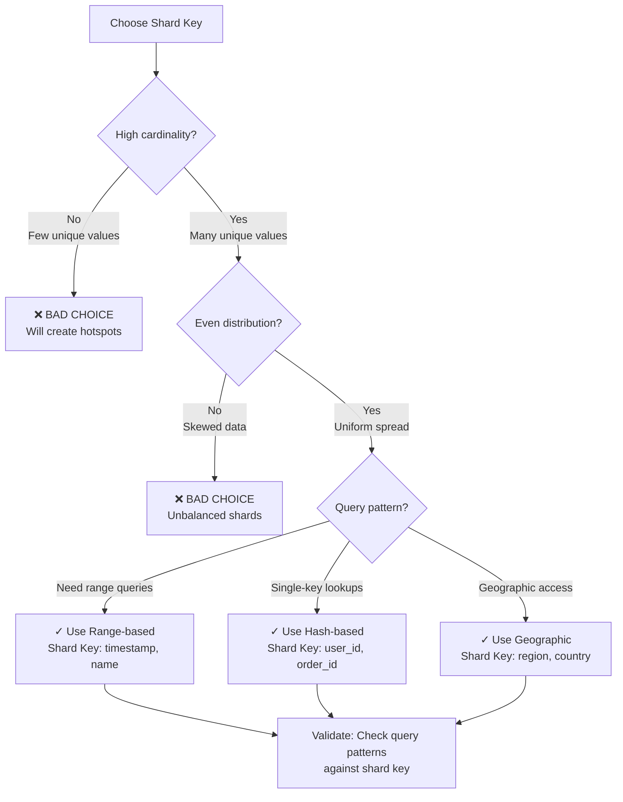
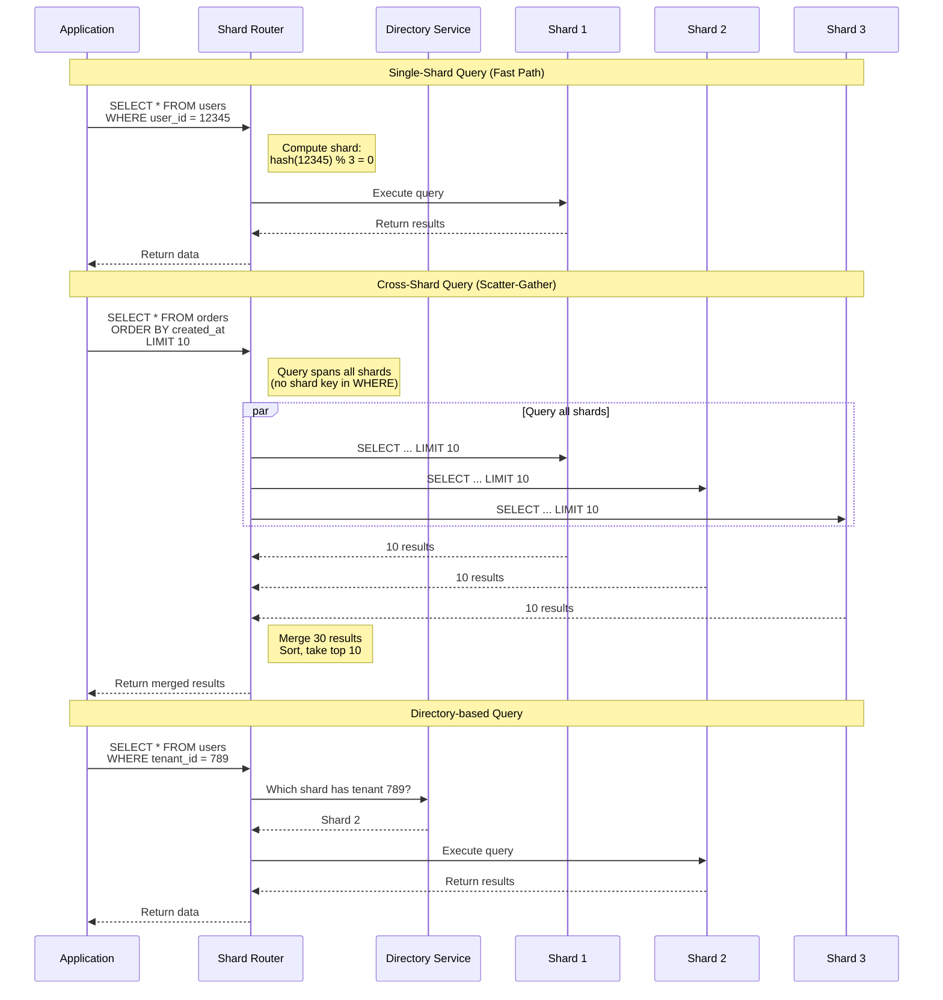
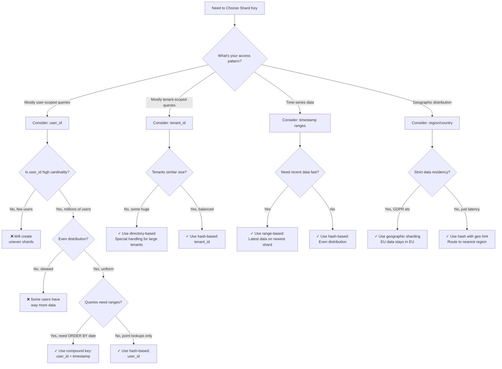
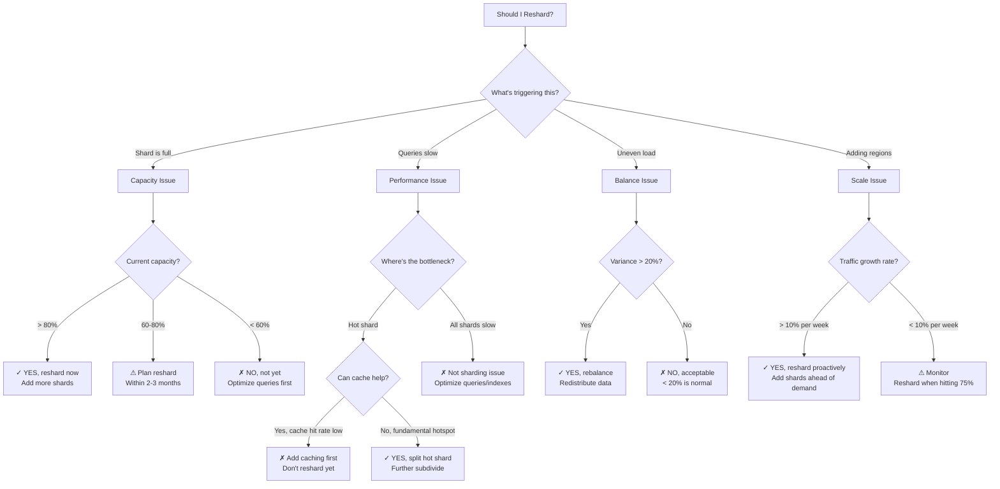

#system-design #pattern #data #database

# Sharding

## Intuition (30 sec)

A library with millions of books split across 26 rooms: A-room has all books starting with A, B-room has B, etc. Each room is independently managed. Finding a book means going to the right room first. That's sharding — splitting data across multiple databases.

---

## Failure-First Scenario

> Your PostgreSQL database has 2TB of data, 50,000 writes/second. Single server maxed out — vertical scaling limit reached. Read replicas help reads but writes all hit one server. You need to split the data itself across multiple databases.

---

## Working Knowledge (5 min)

### Core Concept - Definition First

**Sharding:**
- **Definition:** A database architecture pattern that horizontally partitions data across multiple independent database instances (shards), where each shard contains a subset of the total data
- **Purpose:** Enables horizontal scaling of write capacity and storage beyond the limits of a single database server
- **How it works:** Data is distributed using a shard key that determines which shard stores each record, allowing parallel processing across shards

**Key Terms:**

- **Shard:** An independent database instance that stores a subset of the total dataset
- **Shard Key:** The field (or fields) used to determine which shard a piece of data belongs to
- **Horizontal Partitioning:** Splitting data by rows (users 1-1000 in shard 1, users 1001-2000 in shard 2)
- **Hash-based Sharding:** Using a hash function on the shard key to determine shard placement
- **Range-based Sharding:** Assigning data to shards based on ranges of the shard key values
- **Directory-based Sharding:** Using a lookup table to map entities to their shard locations
- **Rebalancing:** The process of redistributing data when adding or removing shards
- **Hot Shard:** A shard that receives disproportionately high traffic compared to others

### Visual Model: Sharding Strategies Comparison

```
┌──────────────────────────────────────────────────────────────┐
│                    SHARDING STRATEGIES                       │
└──────────────────────────────────────────────────────────────┘

1. HASH-BASED SHARDING
═══════════════════════════════════════════════════════════
Definition: Apply hash function to shard key, use modulo to determine shard

    user_id = 12345
        ↓
    hash(12345) = 8927461
        ↓
    8927461 % 3 = 0  → Shard 0

┌─────────┐
│ user_id │──┐
└─────────┘  │
             ▼
        hash() % 3
             │
     ┌───────┼───────┐
     │       │       │
  ┌──▼──┐ ┌─▼───┐ ┌─▼───┐
  │Shard│ │Shard│ │Shard│
  │  0  │ │  1  │ │  2  │
  └─────┘ └─────┘ └─────┘

✓ Even distribution
✓ No hotspots
✗ Hard to reshard (most keys move)
✗ No range queries


2. RANGE-BASED SHARDING
═══════════════════════════════════════════════════════════
Definition: Assign data to shards based on ranges of values

    user_id ranges:
    A-M → Shard 0
    N-Z → Shard 1

┌──────────────┐
│   Shard 0    │
│  A-M users   │  ← Anderson, Chen, Miller
│              │
└──────────────┘

┌──────────────┐
│   Shard 1    │
│  N-Z users   │  ← Roberts, Zhang
│              │
└──────────────┘

✓ Range queries work
✓ Easy to add shards
✗ Can create hotspots
✗ Uneven distribution


3. DIRECTORY-BASED SHARDING
═══════════════════════════════════════════════════════════
Definition: Use lookup service to map each entity to its shard

┌─────────────────────┐
│  Lookup Directory   │
├─────────────────────┤
│ user_123 → Shard 2  │
│ user_456 → Shard 0  │
│ user_789 → Shard 1  │
└──────────┬──────────┘
           │ Query first
           ▼
    ┌──────┴──────┐
    │             │
┌───▼──┐  ┌────▼──┐
│Shard │  │ Shard │
│  0   │  │   1   │
└──────┘  └───────┘

✓ Flexible (easy to move data)
✓ Can handle special cases
✗ Lookup service is dependency
✗ Extra latency for lookup


4. GEOGRAPHIC SHARDING
═══════════════════════════════════════════════════════════
Definition: Shard by physical location for data locality

┌────────────────────────────────────────────┐
│         US Shard (US-East)                 │
│  All US users' data                        │
└────────────────────────────────────────────┘
           ↑
    US users connect here (10ms)

┌────────────────────────────────────────────┐
│         EU Shard (EU-West)                 │
│  All EU users' data                        │
└────────────────────────────────────────────┘
           ↑
    EU users connect here (10ms)

┌────────────────────────────────────────────┐
│         Asia Shard (AP-East)               │
│  All Asia users' data                      │
└────────────────────────────────────────────┘
           ↑
    Asia users connect here (10ms)

✓ Low latency (close to users)
✓ Data residency compliance
✗ Cross-region queries expensive
✗ Users who travel create issues
```

### Shard Key Selection Flow



**Good vs Bad Shard Keys:**

| Criteria | Good Example | Bad Example | Why |
|----------|-------------|-------------|-----|
| **Cardinality** | user_id (millions) | status (5 values) | Low cardinality creates hotspots |
| **Distribution** | UUID (random) | created_date (recent spike) | Skewed data overloads one shard |
| **Query Pattern** | tenant_id (isolated queries) | global_counter (all shards) | Cross-shard queries are expensive |
| **Immutability** | user_id (never changes) | email (can update) | Changing key requires data migration |
| **Growth** | timestamp (predictable) | celebrity_id (viral spikes) | Unpredictable growth causes hotspots |

---

## Layer 1: Conceptual Precision (15 min)

### Data Distribution - How It Works

**Hash-based Distribution:**
- **Formal Definition:** A deterministic function that maps a shard key to a shard identifier using a hash function followed by modulo operation
- **Simple Definition:** Take the key, scramble it with math, divide by number of shards, use remainder to pick shard
- **Analogy:** Like dealing cards - each card (record) gets distributed in a round-robin fashion based on its suit (hash)
- **Related Terms:** Consistent hashing (reduces resharding pain), Hash ring (visual model)

**Why this matters:** Hash-based sharding ensures even distribution but makes resharding painful. When you add a shard, almost all keys hash to different locations, requiring massive data movement.

### Visual Flow: Query Routing Process



**Step-by-step breakdown:**

1. **Query arrives:** Application sends SQL query to shard router (not directly to database)
2. **Shard determination:** Router analyzes WHERE clause to extract shard key
   - If shard key present → route to single shard (fast)
   - If no shard key → query all shards (slow scatter-gather)
3. **Query execution:** Router forwards query to appropriate shard(s)
4. **Result aggregation:** If multiple shards queried, router merges/sorts results
5. **Return to application:** Combined results sent back to caller

### Data Distribution Across Shards

```
┌────────────────────────────────────────────────────────────┐
│         DATA DISTRIBUTION VISUALIZATION                    │
└────────────────────────────────────────────────────────────┘

Ideal Distribution (Hash-based):
════════════════════════════════════════════════════════════

┌────────────┐  ┌────────────┐  ┌────────────┐
│  Shard 1   │  │  Shard 2   │  │  Shard 3   │
│            │  │            │  │            │
│ 33.3%      │  │ 33.3%      │  │ 33.3%      │
│ 333K users │  │ 333K users │  │ 334K users │
│            │  │            │  │            │
│ ▰▰▰▰▰▰▰▰▰▰ │  │ ▰▰▰▰▰▰▰▰▰▰ │  │ ▰▰▰▰▰▰▰▰▰▰ │
│            │  │            │  │            │
│ CPU: 60%   │  │ CPU: 62%   │  │ CPU: 59%   │
│ Disk: 1TB  │  │ Disk: 1TB  │  │ Disk: 1TB  │
└────────────┘  └────────────┘  └────────────┘

✓ Balanced load
✓ Predictable performance
✓ Easy capacity planning


Uneven Distribution (Bad shard key):
════════════════════════════════════════════════════════════

┌────────────┐  ┌────────────┐  ┌────────────┐
│  Shard 1   │  │  Shard 2   │  │  Shard 3   │
│            │  │            │  │            │
│ 60%        │  │ 25%        │  │ 15%        │
│ 600K users │  │ 250K users │  │ 150K users │
│            │  │            │  │            │
│ ▰▰▰▰▰▰▰▰▰▰ │  │ ▰▰▰▰░░░░░░ │  │ ▰▰░░░░░░░░ │
│ ▰▰▰▰▰▰▰▰▰▰ │  │            │  │            │
│ ▰▰▰▰▰▰     │  │            │  │            │
│            │  │            │  │            │
│ CPU: 95%❌  │  │ CPU: 40%   │  │ CPU: 25%   │
│ Disk: 2TB❌ │  │ Disk: 800GB│  │ Disk: 500GB│
└────────────┘  └────────────┘  └────────────┘
     ↑ HOT SHARD

✗ Shard 1 overloaded (bottleneck)
✗ Shards 2 & 3 underutilized (waste)
✗ Unpredictable performance
```

### Rebalancing Process

**Rebalancing:**
- **Definition:** The process of redistributing data when the number of shards changes, to maintain even distribution and performance
- **When needed:** Adding new shards (scaling up), removing shards (scaling down), or fixing hotspots
- **Challenge:** Must move data while keeping system operational (zero-downtime requirement)

```
┌────────────────────────────────────────────────────────────┐
│              REBALANCING WORKFLOW                          │
└────────────────────────────────────────────────────────────┘

BEFORE: 3 Shards (900K users, 300K each)
═══════════════════════════════════════════════════════════

┌────────┐  ┌────────┐  ┌────────┐
│Shard 0 │  │Shard 1 │  │Shard 2 │
│ 300K   │  │ 300K   │  │ 300K   │
└────────┘  └────────┘  └────────┘

Problem: Each shard at 80% capacity (need to scale)


STEP 1: Add New Shard
═══════════════════════════════════════════════════════════

┌────────┐  ┌────────┐  ┌────────┐  ┌────────┐
│Shard 0 │  │Shard 1 │  │Shard 2 │  │Shard 3 │
│ 300K   │  │ 300K   │  │ 300K   │  │   0    │← Empty
└────────┘  └────────┘  └────────┘  └────────┘


STEP 2: Recalculate Shard Assignments
═══════════════════════════════════════════════════════════

Old mapping (% 3):          New mapping (% 4):
user_1 → 1 % 3 = 1          user_1 → 1 % 4 = 1 ✓ Same
user_2 → 2 % 3 = 2          user_2 → 2 % 4 = 2 ✓ Same
user_3 → 3 % 3 = 0          user_3 → 3 % 4 = 3 ✗ MOVE!
user_4 → 4 % 3 = 1          user_4 → 4 % 4 = 0 ✗ MOVE!
user_5 → 5 % 3 = 2          user_5 → 5 % 4 = 1 ✗ MOVE!

Problem: ~75% of keys need to move (expensive!)


STEP 3: Dual-Write Phase
═══════════════════════════════════════════════════════════

New writes go to BOTH old and new locations:

Write user_3 data:
  ├─ Write to Shard 0 (old location)
  └─ Write to Shard 3 (new location)

Duration: Until background migration completes


STEP 4: Background Data Migration
═══════════════════════════════════════════════════════════

┌────────┐  ┌────────┐  ┌────────┐  ┌────────┐
│Shard 0 │─┐│Shard 1 │─┐│Shard 2 │─┐│Shard 3 │
│ 300K   │ ││ 300K   │ ││ 300K   │ ││   0    │
└────────┘ │└────────┘ │└────────┘ │└────────┘
           │           │           │
    Copy 75K    Copy 75K    Copy 75K
           │           │           │
           └───────────┴───────────┘
                   ↓
         ┌────────────────┐
         │   Shard 3      │
         │   225K (new)   │
         └────────────────┘

Progress: 0% ▰░░░░░░░░░░ ... 100% ▰▰▰▰▰▰▰▰▰▰


STEP 5: Cutover
═══════════════════════════════════════════════════════════

When migration reaches 100%:
  1. Stop dual writes
  2. Delete old data from source shards
  3. Update routing to use new mapping


AFTER: 4 Shards (900K users, 225K each)
═══════════════════════════════════════════════════════════

┌────────┐  ┌────────┐  ┌────────┐  ┌────────┐
│Shard 0 │  │Shard 1 │  │Shard 2 │  │Shard 3 │
│ 225K   │  │ 225K   │  │ 225K   │  │ 225K   │
└────────┘  └────────┘  └────────┘  └────────┘

✓ Balanced load (each at 60% capacity)
✓ Room to grow
```

**Rebalancing Time Estimate:**

```
Data size: 1TB to move
Network: 1 Gbps
Calculation: 1TB = 8000 Gb
            8000 Gb ÷ 1 Gbps = 8000 seconds
            = 2.2 hours (theoretical minimum)

Real world (with throttling): 8-24 hours
```

### Hot Shard Problem

**Hot Shard:**
- **Definition:** A shard that receives significantly more traffic (reads/writes) than other shards, becoming a performance bottleneck
- **Causes:**
  - Celebrity users (millions of followers)
  - Viral content (one post gets massive traffic)
  - Poor shard key selection (temporal skew)
  - Time-zone effects (all users in one region active at once)

**Visual Example:**

```
Normal Traffic Distribution:
════════════════════════════════════════════════════════════

┌────────┐  ┌────────┐  ┌────────┐  ┌────────┐
│Shard 0 │  │Shard 1 │  │Shard 2 │  │Shard 3 │
│1000 QPS│  │1000 QPS│  │1000 QPS│  │1000 QPS│
│ ▰▰▰▰▰  │  │ ▰▰▰▰▰  │  │ ▰▰▰▰▰  │  │ ▰▰▰▰▰  │
└────────┘  └────────┘  └────────┘  └────────┘

Total: 4000 QPS evenly distributed


Hot Shard Scenario (Celebrity User):
════════════════════════════════════════════════════════════

User @celebrity has 10M followers
All followers reading @celebrity's posts
@celebrity is on Shard 1

┌────────┐  ┌──────────────┐  ┌────────┐  ┌────────┐
│Shard 0 │  │  Shard 1     │  │Shard 2 │  │Shard 3 │
│ 500 QPS│  │ 8500 QPS ❌  │  │ 500 QPS│  │ 500 QPS│
│ ▰▰     │  │ ▰▰▰▰▰▰▰▰▰▰   │  │ ▰▰     │  │ ▰▰     │
│        │  │ ▰▰▰▰▰▰▰▰▰▰   │  │        │  │        │
│        │  │ ▰▰▰▰▰▰▰▰▰▰   │  │        │  │        │
│        │  │ 🔥 MAXED     │  │        │  │        │
└────────┘  └──────────────┘  └────────┘  └────────┘
                  ↑
              BOTTLENECK

Shard 1 can't handle load → entire system slows down
```

**Hot Shard Solutions:**

1. **Further Sharding (Split the hot shard)**
```
Before:
┌──────────────┐
│   Shard 1    │
│ @celebrity   │
│ + 100K users │
│ 8500 QPS ❌  │
└──────────────┘

After:
┌──────────────┐  ┌──────────────┐
│  Shard 1a    │  │  Shard 1b    │
│ @celebrity   │  │  50K users   │
│ + 50K users  │  │  + cache     │
│ 4500 QPS ✓   │  │  4000 QPS ✓  │
└──────────────┘  └──────────────┘
```

2. **Aggressive Caching**
```
┌─────────────┐
│   Cache     │ ← Most reads served here (95%+)
│  (Redis)    │   8000 QPS
└──────┬──────┘
       │ Cache miss (5%)
       ▼
┌─────────────┐
│  Shard 1    │ ← Only handles 500 QPS
│ @celebrity  │
└─────────────┘
```

3. **Read Replicas**
```
        ┌─────────────┐
        │  Primary    │ ← Writes only (100 QPS)
        │  Shard 1    │
        └──────┬──────┘
               │ Replication
       ┌───────┼───────┐
       │       │       │
┌──────▼──┐ ┌─▼─────┐ ┌▼────────┐
│Replica 1│ │Replica│ │Replica 3│ ← Reads distributed
│2800 QPS │ │2800   │ │2800 QPS │   (8400 QPS / 3)
└─────────┘ └───────┘ └─────────┘
```

4. **Scatter Reads (Append random suffix)**
```
@celebrity's data replicated with suffix:
  celebrity_0 → Shard 0
  celebrity_1 → Shard 1
  celebrity_2 → Shard 2
  celebrity_3 → Shard 3

Read request:
  - Pick random suffix (0-3)
  - Read from that shard
  - Load distributed across 4 shards
```

### Trade-offs Matrix

```
Hash-based Sharding          Range-based Sharding
═══════════════════════════════════════════════════════════
Definition: Use hash function   Definition: Use value ranges
to distribute data evenly       to partition data logically

Pros:                           Pros:
• Perfect distribution          • Range queries efficient
• No hotspots (usually)         • Easy to add new ranges
• Simple algorithm              • Intuitive data locality

Cons:                           Cons:
• Resharding expensive          • Hotspots possible
• No range queries              • Manual range definition
• Hash collisions possible      • Rebalancing needed

Use When:                       Use When:
• Random access patterns        • Time-series data
• Need even distribution        • Alphabetical sorting needed
• User/order IDs               • Geographic partitioning


Directory-based Sharding     Geographic Sharding
═══════════════════════════════════════════════════════════
Definition: Lookup table       Definition: Shard by physical
maps entities to shards        location of users/data

Pros:                           Pros:
• Very flexible                 • Low latency (data close)
• Easy data migration           • Data residency compliance
• Handle exceptions             • Simple routing logic

Cons:                           Cons:
• Lookup overhead               • Cross-region queries slow
• Directory is SPOF             • Uneven distribution
• Scales with data              • User travel creates issues

Use When:                       Use When:
• Multi-tenant (B2B SaaS)       • Global user base
• Need data isolation           • Regulatory requirements
• Frequent migrations           • Regional access patterns
```

---

## Layer 2: Technology-Specific Examples (20 min)

### Database Sharding Configuration (PostgreSQL + Citus)

```sql
-- Citus: Distributed PostgreSQL extension
-- Configuration example

-- Step 1: Add worker nodes (shards)
SELECT master_add_node('shard1.example.com', 5432);
SELECT master_add_node('shard2.example.com', 5432);
SELECT master_add_node('shard3.example.com', 5432);

-- Step 2: Create distributed table with shard key
CREATE TABLE users (
    user_id BIGINT PRIMARY KEY,      -- Shard key
    username TEXT NOT NULL,
    email TEXT NOT NULL,
    created_at TIMESTAMP DEFAULT NOW()
);

-- Distribute table across shards by user_id (hash-based)
SELECT create_distributed_table('users', 'user_id');
-- Definition: create_distributed_table() tells Citus to:
--   1. Hash user_id
--   2. Create shards on worker nodes
--   3. Route queries automatically


-- Step 3: Create related table (co-located for performance)
CREATE TABLE orders (
    order_id BIGINT PRIMARY KEY,
    user_id BIGINT NOT NULL,         -- Same shard key!
    total DECIMAL(10,2),
    created_at TIMESTAMP DEFAULT NOW()
);

-- Distribute with same key (co-location)
SELECT create_distributed_table('orders', 'user_id');
-- Definition: Co-location ensures user + their orders
-- are on same shard (enables efficient JOINs)


-- Key Configuration Parameters
-- Definition: Control shard behavior

-- Number of shards to create (default: 32)
SET citus.shard_count = 64;
-- Why 64? Power of 2 makes resharding easier

-- Replication factor (copies per shard)
SET citus.shard_replication_factor = 2;
-- Definition: Each shard has 2 copies (high availability)

-- Rebalance strategy
SELECT citus_rebalance_start();
-- Definition: Automatically moves shards to balance load
```

**MongoDB Sharding Configuration:**

```javascript
// MongoDB sharding setup

// Step 1: Enable sharding on database
sh.enableSharding("myapp")
// Definition: Tell MongoDB this database will be sharded

// Step 2: Choose shard key and create index
db.users.createIndex({ user_id: "hashed" })
// Definition: Hash index for even distribution

// Step 3: Shard the collection
sh.shardCollection("myapp.users", { user_id: "hashed" })
// Definition: Distribute users collection by user_id hash

// Step 4: Check shard distribution
db.users.getShardDistribution()
/* Output:
Shard shard0001:
  Data: 333 MB, Docs: 335420, Chunks: 21
Shard shard0002:
  Data: 335 MB, Docs: 337890, Chunks: 22
Shard shard0003:
  Data: 332 MB, Docs: 334690, Chunks: 21
*/

// Configuration for chunk size
use config
db.settings.updateOne(
   { _id: "chunksize" },
   { $set: { value: 128 } },  // 128 MB chunks
   { upsert: true }
)
// Definition: Chunk is a contiguous range of data
// Why 128MB? Smaller chunks = more granular balancing


// Range-based sharding (for time-series)
db.events.createIndex({ created_at: 1 })
sh.shardCollection("myapp.events", { created_at: 1 })
// Definition: Range-based on timestamp (good for time queries)


// Compound shard key (better distribution)
db.orders.createIndex({ user_id: 1, created_at: 1 })
sh.shardCollection("myapp.orders", {
  user_id: 1,
  created_at: 1
})
// Definition: Combine user_id + timestamp for uniqueness
// Benefits: Prevents hotspots for active users
```

### Application-Level Sharding (Vitess - YouTube's MySQL sharding)

```yaml
# Vitess topology configuration

# Define keyspace (logical database)
keyspaces:
  - name: user_data
    sharded: true

    # Vindexes: Vitess's routing logic
    vindexes:
      # Hash vindex for user_id
      user_hash:
        type: hash            # Hash-based sharding
        params:
          - name: "hash_func"
            value: "md5"

      # Lookup vindex for email -> user_id
      email_lookup:
        type: lookup_unique
        owner: users          # Source table
        params:
          - name: "table"
            value: "email_to_user"
          - name: "from"
            value: "email"
          - name: "to"
            value: "user_id"

    # Table definitions
    tables:
      - name: users
        column_vindexes:
          - column: user_id   # Primary vindex
            name: user_hash
          - column: email     # Secondary vindex
            name: email_lookup

      - name: orders
        column_vindexes:
          - column: user_id   # Co-located with users
            name: user_hash

    # Shard definitions (-80 means hash < 0x80, 80- means >= 0x80)
    shards:
      - name: "-40"           # 0x00 - 0x40 (25%)
        master:
          host: "shard1-master.example.com"
          port: 3306
        replicas:
          - host: "shard1-replica1.example.com"
          - host: "shard1-replica2.example.com"

      - name: "40-80"         # 0x40 - 0x80 (25%)
        master:
          host: "shard2-master.example.com"
          port: 3306
        replicas:
          - host: "shard2-replica1.example.com"
          - host: "shard2-replica2.example.com"

      - name: "80-c0"         # 0x80 - 0xC0 (25%)
        master:
          host: "shard3-master.example.com"
          port: 3306
        replicas:
          - host: "shard3-replica1.example.com"
          - host: "shard3-replica2.example.com"

      - name: "c0-"           # 0xC0 - 0xFF (25%)
        master:
          host: "shard4-master.example.com"
          port: 3306
        replicas:
          - host: "shard4-replica1.example.com"
          - host: "shard4-replica2.example.com"

# Key Terms:
# - Keyspace: Logical database (like a schema)
# - Vindex: Virtual index, defines sharding logic
# - Shard range: Hexadecimal hash range each shard handles
# - Primary vindex: Main routing key (user_id)
# - Lookup vindex: Allows querying by non-shard-key (email)
```

### Application Code Pattern (Java + ShardingSphere)

```java
// ShardingSphere: Java framework for database sharding

// Configuration
@Configuration
public class ShardingConfig {

    @Bean
    public DataSource dataSource() throws SQLException {
        // Define actual datasources (shards)
        Map<String, DataSource> dataSourceMap = new HashMap<>();
        dataSourceMap.put("shard0", createDataSource("shard0.db"));
        dataSourceMap.put("shard1", createDataSource("shard1.db"));
        dataSourceMap.put("shard2", createDataSource("shard2.db"));

        // Sharding rule for 'users' table
        TableRuleConfiguration userTableRule =
            new TableRuleConfiguration(
                "users",                         // Table name
                "shard${0..2}.users"            // Actual tables
            );

        // Hash-based sharding algorithm
        userTableRule.setDatabaseShardingStrategy(
            new StandardShardingStrategyConfiguration(
                "user_id",                       // Shard key column
                new HashModShardingAlgorithm()   // user_id % 3
            )
        );

        // Build sharding datasource
        ShardingRuleConfiguration shardingRule =
            new ShardingRuleConfiguration();
        shardingRule.getTableRuleConfigs().add(userTableRule);

        return ShardingDataSourceFactory.createDataSource(
            dataSourceMap,
            shardingRule,
            new Properties()
        );
    }

    // Custom sharding algorithm
    public class HashModShardingAlgorithm
        implements PreciseShardingAlgorithm<Long> {

        @Override
        public String doSharding(
            Collection<String> shardNames,
            PreciseShardingValue<Long> shardingValue
        ) {
            // Definition: Extract shard key value, compute shard
            Long userId = shardingValue.getValue();
            int shardIndex = (int) (userId % shardNames.size());

            // Return shard name (e.g., "shard1")
            return new ArrayList<>(shardNames).get(shardIndex);
        }
    }

    private DataSource createDataSource(String dbName) {
        HikariConfig config = new HikariConfig();
        config.setJdbcUrl("jdbc:postgresql://localhost:5432/" + dbName);
        config.setUsername("user");
        config.setPassword("password");
        config.setMaximumPoolSize(10);  // Connection pool per shard
        return new HikariDataSource(config);
    }
}

// Application code (transparent sharding)
@Service
public class UserService {

    @Autowired
    private JdbcTemplate jdbcTemplate;  // Sharding-aware

    public User getUserById(Long userId) {
        // Query automatically routed to correct shard
        // ShardingSphere intercepts, determines shard0/1/2
        String sql = "SELECT * FROM users WHERE user_id = ?";
        return jdbcTemplate.queryForObject(
            sql,
            new Object[]{userId},
            new UserRowMapper()
        );

        // Behind the scenes:
        // 1. ShardingSphere sees user_id = 12345
        // 2. Computes: 12345 % 3 = 0
        // 3. Routes to shard0
        // 4. Executes: SELECT * FROM shard0.users WHERE user_id = 12345
    }

    public List<User> getRecentUsers() {
        // Cross-shard query (scatter-gather)
        String sql = "SELECT * FROM users ORDER BY created_at DESC LIMIT 10";
        return jdbcTemplate.query(sql, new UserRowMapper());

        // Behind the scenes:
        // 1. No shard key in WHERE clause
        // 2. ShardingSphere queries ALL shards:
        //    - shard0: SELECT ... LIMIT 10
        //    - shard1: SELECT ... LIMIT 10
        //    - shard2: SELECT ... LIMIT 10
        // 3. Merge 30 results, sort, take top 10
        // 4. Return final 10 results
        //
        // Performance: 3x slower (parallel queries + merge overhead)
    }

    public void createUser(User user) {
        // Insert automatically routed
        String sql = "INSERT INTO users (user_id, username, email) VALUES (?, ?, ?)";
        jdbcTemplate.update(sql, user.getId(), user.getUsername(), user.getEmail());

        // Shard determined by user.getId() hash
    }
}
```

---

## Layer 3: Production-Ready Details (30 min)

### Production Architecture (Fully Annotated)

```
                    🌍 Internet
                       │
              ┌────────▼────────┐
              │   DNS + CDN      │
              │  (CloudFlare)    │
              │                  │
              │ Definition:      │
              │ Route to nearest │
              │ data center      │
              └────────┬─────────┘
                       │
         ┌─────────────┼─────────────┐
         │             │             │
    ┌────▼───┐    ┌────▼───┐    ┌────▼───┐
    │US-East │    │US-West │    │  EU    │
    │Region  │    │Region  │    │Region  │
    └────┬───┘    └────┬───┘    └────┬───┘
         │             │             │
    ┌────▼──────────────────────────────────┐
    │     Application Load Balancer          │
    │  (Layer 7 - inspects HTTP headers)     │
    │                                        │
    │  Definition: Routes requests based on  │
    │  URL path and shard key extraction     │
    │                                        │
    │  Rules:                                │
    │  • /users/:id → extract id, route shard│
    │  • /health → round-robin all apps      │
    │  • Health check: every 10s             │
    └────┬───────┬───────┬───────┬──────────┘
         │       │       │       │
    ┌────▼──┐ ┌─▼────┐ ┌▼────┐ ┌▼────┐
    │App    │ │App   │ │App  │ │App  │
    │Server │ │Server│ │Srvr │ │Srvr │
    │   1   │ │  2   │ │  3  │ │  4  │
    │       │ │      │ │     │ │     │
    │ Shard │ │ Shard│ │ Shrd│ │ Shrd│
    │ Router│ │ Router│ │Ruter│ │Ruter│
    └───┬───┘ └──┬───┘ └─┬───┘ └─┬───┘
        │        │       │       │
        └────────┴───────┴───────┘
                 │
      ┌──────────┼──────────┐
      │          │          │
┌─────▼─────┐ ┌─▼────────┐ ┌▼─────────┐
│  Shard 0  │ │ Shard 1  │ │ Shard 2  │
│ ────────  │ │ ───────  │ │ ───────  │
│ Primary   │ │ Primary  │ │ Primary  │
│ (Write)   │ │ (Write)  │ │ (Write)  │
│           │ │          │ │          │
│ Hash range│ │ Hash rng │ │ Hash rng │
│ 0x00-0x55 │ │ 0x56-0xAA│ │ 0xAB-0xFF│
│           │ │          │ │          │
│ Users:    │ │ Users:   │ │ Users:   │
│ 340K      │ │ 335K     │ │ 338K     │
└─────┬─────┘ └─┬────────┘ └┬─────────┘
      │         │           │
      │    ┌────┴───┐       │
      │    │        │       │
  ┌───▼──┐ ┌▼────┐ ┌▼────┐ ┌▼─────┐
  │Read  │ │Read │ │Read │ │Read  │
  │Rep 1 │ │Rep 2│ │Rep 3│ │Rep 4 │
  └──────┘ └─────┘ └─────┘ └──────┘
      ↑         ↑       ↑       ↑
      │         │       │       │
   Handles read traffic (70% of queries)


Supporting Services:
══════════════════════════════════════════

┌─────────────────────────────────────┐
│         Redis Cache Layer           │
│  (Distributed across shards)        │
│                                     │
│  Cache Key Format:                  │
│  user:{user_id} → full user object  │
│  TTL: 300s (5 minutes)              │
│                                     │
│  Hit Rate Target: > 90%             │
│  Reduces DB load by 10x             │
└─────────────────────────────────────┘

┌─────────────────────────────────────┐
│      Shard Mapping Service          │
│   (Directory for complex routing)   │
│                                     │
│  tenant_id → shard_id mapping       │
│  Backed by: Redis (fast lookup)     │
│  Fallback: PostgreSQL (persistence) │
│                                     │
│  Example:                           │
│  tenant_acme → shard_2              │
│  tenant_beta → shard_0              │
└─────────────────────────────────────┘

┌─────────────────────────────────────┐
│      Background Jobs (Kafka)        │
│                                     │
│  • Rebalancing worker               │
│  • Analytics aggregation            │
│  • Cross-shard reporting            │
│                                     │
│  Reads from all shards in parallel  │
└─────────────────────────────────────┘
```

**Architecture Component Definitions:**

- **Shard Router:** Application-level component that analyzes queries, extracts shard keys, and routes requests to appropriate database shards
- **Primary Shard:** The authoritative write instance for a shard; all writes go here, then replicate to read replicas
- **Read Replica:** Read-only copy of a shard that handles query traffic, reducing load on primary (eventual consistency: ~50ms lag)
- **Hash Range:** The portion of the hash key space (0x00-0xFF) that a shard is responsible for
- **Shard Mapping Service:** Centralized lookup service for complex routing (multi-tenant, directory-based sharding)

### Monitoring Dashboard

```
╔═══════════════════════════════════════════════════════════════╗
║                SHARD HEALTH DASHBOARD                         ║
╠═══════════════════════════════════════════════════════════════╣
║                                                               ║
║  📊 SHARD DISTRIBUTION                                        ║
║  ════════════════════════════════════════════════════════     ║
║                                                               ║
║  Shard 0:  ▰▰▰▰▰▰▰▰▰▰ 340K users (33.6%)  CPU: 62%  ✓        ║
║            Disk: 1.2TB / 2TB (60%)                            ║
║            QPS: 1,247 (reads: 870, writes: 377)               ║
║                                                               ║
║  Shard 1:  ▰▰▰▰▰▰▰▰▰░ 335K users (33.1%)  CPU: 58%  ✓        ║
║            Disk: 1.1TB / 2TB (55%)                            ║
║            QPS: 1,189 (reads: 835, writes: 354)               ║
║                                                               ║
║  Shard 2:  ▰▰▰▰▰▰▰▰▰░ 338K users (33.3%)  CPU: 60%  ✓        ║
║            Disk: 1.15TB / 2TB (57%)                           ║
║            QPS: 1,221 (reads: 852, writes: 369)               ║
║                                                               ║
║  Distribution Health: ✓ GOOD (variance < 5%)                 ║
║  Definition: Variance measures how evenly distributed         ║
║              the data is across shards                        ║
║                                                               ║
║  ─────────────────────────────────────────────────────────── ║
║                                                               ║
║  🎯 QUERY ROUTING METRICS                                     ║
║  ════════════════════════════════════════════════════════     ║
║                                                               ║
║  Single-Shard Queries:  ▰▰▰▰▰▰▰▰▰▰ 3,420/sec (88%) ✓         ║
║  Definition: Queries that hit only one shard (fast)           ║
║  Avg Latency: 12ms                                            ║
║                                                               ║
║  Cross-Shard Queries:   ▰▰░░░░░░░░   467/sec (12%)           ║
║  Definition: Scatter-gather queries hitting all shards        ║
║  Avg Latency: 145ms (12x slower)                              ║
║  Alert: > 20% triggers optimization review                    ║
║                                                               ║
║  Shard Key Coverage:    95.2%                                 ║
║  Definition: % of queries that include shard key in WHERE     ║
║  Target: > 90%                                                ║
║                                                               ║
║  ─────────────────────────────────────────────────────────── ║
║                                                               ║
║  🔥 HOT SHARD DETECTION                                       ║
║  ════════════════════════════════════════════════════════     ║
║                                                               ║
║  Heat Map (QPS):                                              ║
║                                                               ║
║  Shard 0:  ▰▰▰▰▰▰░░░░  1,247 QPS                             ║
║  Shard 1:  ▰▰▰▰▰▰░░░░  1,189 QPS                             ║
║  Shard 2:  ▰▰▰▰▰▰░░░░  1,221 QPS                             ║
║                                                               ║
║  Status: ✓ NO HOT SHARDS (max variance 5%)                   ║
║  Definition: Hot shard = traffic > 1.5x average               ║
║                                                               ║
║  Top Keys by Traffic (last hour):                            ║
║  ┌───────────────────────────────────────────────┐           ║
║  │ user_123456 → 12,450 queries  (normal)       │           ║
║  │ user_789012 → 11,230 queries  (normal)       │           ║
║  │ user_345678 →  9,876 queries  (normal)       │           ║
║  └───────────────────────────────────────────────┘           ║
║                                                               ║
║  Alert Threshold: Any key > 50,000 queries/hour               ║
║                                                               ║
║  ─────────────────────────────────────────────────────────── ║
║                                                               ║
║  💾 REBALANCING STATUS                                        ║
║  ════════════════════════════════════════════════════════     ║
║                                                               ║
║  Current Status: IDLE (last rebalance: 23 days ago)          ║
║                                                               ║
║  Next Scheduled: Triggered when any shard > 75% capacity     ║
║                                                               ║
║  ─────────────────────────────────────────────────────────── ║
║                                                               ║
║  ⚡ PERFORMANCE METRICS                                       ║
║  ════════════════════════════════════════════════════════     ║
║                                                               ║
║  P50 Latency:   8ms   ▰▰░░░░░░░░░░                           ║
║  P95 Latency:  24ms   ▰▰▰▰░░░░░░░░                           ║
║  P99 Latency:  47ms   ▰▰▰▰▰░░░░░░░                           ║
║                                                               ║
║  Connection Pool Status:                                      ║
║  Shard 0: Active 45/200  Idle 155  Wait 0                    ║
║  Shard 1: Active 42/200  Idle 158  Wait 0                    ║
║  Shard 2: Active 44/200  Idle 156  Wait 0                    ║
║                                                               ║
║  ─────────────────────────────────────────────────────────── ║
║                                                               ║
║  📈 GROWTH TRENDS (30 days)                                   ║
║  ════════════════════════════════════════════════════════     ║
║                                                               ║
║  Data Growth:    +3.2% per week                               ║
║  Query Growth:   +5.1% per week                               ║
║  Capacity Left:  ~6 months until 75% threshold                ║
║                                                               ║
║  Recommendation: Plan shard expansion in Q3 2026              ║
║                                                               ║
╚═══════════════════════════════════════════════════════════════╝
```

**Metric Definitions:**

- **QPS (Queries Per Second):** Total number of queries (reads + writes) hitting each shard per second
- **Single-Shard Query:** Query that contains shard key in WHERE clause, routed to one shard (fast path)
- **Cross-Shard Query:** Query without shard key, must query all shards and merge results (slow path)
- **Shard Key Coverage:** Percentage of queries that include the shard key, enabling single-shard routing
- **Heat Map:** Visual representation of traffic distribution showing if any shard is overloaded
- **Variance:** Statistical measure of distribution evenness; low variance = balanced shards

### Decision Trees

**Decision Tree 1: Choosing a Shard Key**



**Decision Tree 2: When to Reshard**



### Production Patterns: Resharding Strategies

**Strategy 1: Stop-the-World Resharding (Small Databases)**

```
┌────────────────────────────────────────────────────────────┐
│           STOP-THE-WORLD RESHARDING                        │
└────────────────────────────────────────────────────────────┘

Best for: Databases < 100GB, can tolerate downtime

Timeline:
──────────────────────────────────────────────────────────────

Day 1 - Week 1: Preparation
┌─────────────────────────────────────┐
│ 1. Set up new shards (hardware)     │
│ 2. Test resharding script           │
│ 3. Dry-run on staging environment   │
│ 4. Prepare rollback plan             │
│ 5. Schedule maintenance window      │
└─────────────────────────────────────┘

Maintenance Window (3-4 hours):
┌─────────────────────────────────────┐
│ T+0min:  Put app in maintenance mode│
│          "Down for upgrade"         │
│                                     │
│ T+5min:  Stop all writes to DB      │
│          Drain connection pools     │
│                                     │
│ T+10min: Take final snapshot        │
│          Backup all shards          │
│                                     │
│ T+15min: Start data migration       │
│          Copy data to new shards    │
│          Progress: ▰▰░░░░░░░░       │
│                                     │
│ T+120min: Migration complete ✓      │
│           Verify data integrity     │
│           Run validation queries    │
│                                     │
│ T+150min: Update app config         │
│           Point to new shards       │
│           Update shard routing      │
│                                     │
│ T+180min: Start application         │
│           Monitor for errors        │
│                                     │
│ T+200min: Remove maintenance mode   │
│           ✓ LIVE with new shards    │
└─────────────────────────────────────┘

Pros:
✓ Simple process
✓ Guaranteed consistency
✓ Easy rollback (restore from backup)

Cons:
✗ Downtime (hours)
✗ Not suitable for 24/7 systems
✗ Stressful (time pressure)
```

**Strategy 2: Zero-Downtime Resharding (Large Databases)**

```
┌────────────────────────────────────────────────────────────┐
│         ZERO-DOWNTIME RESHARDING (DUAL-WRITE)             │
└────────────────────────────────────────────────────────────┘

Best for: Databases > 100GB, cannot tolerate downtime

Phase 1: Preparation (Week 1-2)
═══════════════════════════════════════════════════════════

┌─────────────────┐
│ Old Shards: 2   │  ← Production traffic
│ Shard 0, 1      │
└─────────────────┘

Tasks:
• Provision new shards (Shard 0, 1, 2, 3)
• Set up replication infrastructure
• Deploy dual-write code (off by default)


Phase 2: Dual-Write Enabled (Week 3-4)
═══════════════════════════════════════════════════════════

Application starts writing to BOTH old and new:

Write request for user_123:
├─ Compute old shard: 123 % 2 = 1 → Old Shard 1
├─ Compute new shard: 123 % 4 = 3 → New Shard 3
└─ Write to BOTH Shard 1 and Shard 3

┌─────────────────┐     ┌─────────────────┐
│ Old Shards      │     │ New Shards      │
│ (reads go here) │     │ (writes only)   │
│                 │     │                 │
│ Shard 0 ─────────────▶ Shard 0, 1      │
│ Shard 1 ─────────────▶ Shard 2, 3      │
└─────────────────┘     └─────────────────┘

Reads: Still from old shards (consistent)
Writes: Go to both old and new (slight latency increase)


Phase 3: Background Migration (Week 3-6)
═══════════════════════════════════════════════════════════

While dual-write is active, copy old data:

┌────────────────────────────────────────┐
│  Migration Worker                      │
│  ───────────────────────────────────   │
│                                        │
│  For each record in old shards:        │
│    1. Read from old shard              │
│    2. Compute new shard location       │
│    3. Write to new shard (if missing)  │
│    4. Mark as migrated                 │
│                                        │
│  Throttled: 1000 records/sec           │
│  (Don't overload production)           │
│                                        │
│  Progress:                             │
│  Day 1:  ▰▰░░░░░░░░  20%               │
│  Day 5:  ▰▰▰▰▰░░░░░  50%               │
│  Day 10: ▰▰▰▰▰▰▰▰▰▰ 100% ✓             │
└────────────────────────────────────────┘

How dual-write ensures consistency:
• New writes go to both (captured)
• Old data slowly copied (caught up)
• Eventually, new shards have everything


Phase 4: Validation (Week 7)
═══════════════════════════════════════════════════════════

Verify new shards have all data:

┌────────────────────────────────────────┐
│  Validation Checks                     │
│  ───────────────────────────────────   │
│                                        │
│  ✓ Row count matches                   │
│    Old: 1,000,000 rows                 │
│    New: 1,000,000 rows                 │
│                                        │
│  ✓ Checksum matches                    │
│    Sample 10,000 random records        │
│    Compare data byte-by-byte           │
│                                        │
│  ✓ Query results match                 │
│    Run test queries on both            │
│    Compare outputs                     │
│                                        │
│  ✓ All checks pass → Ready to cut over │
└────────────────────────────────────────┘


Phase 5: Read Cutover (Week 8)
═══════════════════════════════════════════════════════════

Switch reads to new shards (gradual):

Day 1: 10% of reads → new shards
┌───────────────────────────────────────┐
│ Reads:  Old: 90%   New: 10%           │
│ Writes: Old: 100%  New: 100% (dual)   │
└───────────────────────────────────────┘
Monitor: Latency, error rate, data consistency

Day 3: 50% of reads → new shards
┌───────────────────────────────────────┐
│ Reads:  Old: 50%   New: 50%           │
│ Writes: Old: 100%  New: 100% (dual)   │
└───────────────────────────────────────┘

Day 7: 100% of reads → new shards
┌───────────────────────────────────────┐
│ Reads:  Old: 0%    New: 100% ✓        │
│ Writes: Old: 100%  New: 100% (dual)   │
└───────────────────────────────────────┘

If any issues: Rollback (flip reads back to old shards)


Phase 6: Write Cutover (Week 9)
═══════════════════════════════════════════════════════════

Stop writing to old shards:

┌───────────────────────────────────────┐
│ Reads:  Old: 0%    New: 100%          │
│ Writes: Old: 0%    New: 100%          │
└───────────────────────────────────────┘

✓ Resharding complete!


Phase 7: Cleanup (Week 10+)
═══════════════════════════════════════════════════════════

• Keep old shards for 2 weeks (rollback safety)
• Monitor new shards for stability
• After 2 weeks: Decommission old shards
• Remove dual-write code from application

Total time: 10 weeks (but zero downtime!)
```

**Strategy 3: Directory-based Tenant Migration (SaaS)**

```
┌────────────────────────────────────────────────────────────┐
│      DIRECTORY-BASED TENANT MIGRATION (SaaS Pattern)       │
└────────────────────────────────────────────────────────────┘

Best for: Multi-tenant SaaS with tenant-based sharding

Current State:
┌─────────────────────────────────────────┐
│     Shard Directory (Redis)             │
├─────────────────────────────────────────┤
│ tenant_acme → shard_0                   │
│ tenant_beta → shard_0                   │
│ tenant_gamma → shard_1                  │
│ tenant_delta → shard_1                  │
└─────────────────────────────────────────┘
          │
    ┌─────┴─────┐
    │           │
┌───▼───┐   ┌───▼───┐
│Shard 0│   │Shard 1│
│ Acme  │   │ Gamma │
│ Beta  │   │ Delta │
└───────┘   └───────┘

Problem: Shard 0 is 90% full, Shard 1 at 40%


Solution: Migrate tenant Beta to new Shard 2
═══════════════════════════════════════════════════════════

Step 1: Provision Shard 2
┌───────┐
│Shard 2│ ← Empty, ready
└───────┘

Step 2: Copy Beta's data
┌───────┐                    ┌───────┐
│Shard 0│──Copy Beta data──▶ │Shard 2│
│ Acme  │                    │ Beta  │
│ Beta  │                    │ (copy)│
└───────┘                    └───────┘

Step 3: Enable dual-write for Beta
Writes for Beta go to both Shard 0 and Shard 2

Step 4: Finish background copy (5-30 min)
Progress: ▰▰▰▰▰▰▰▰▰▰ 100%

Step 5: Update directory (atomic operation)
┌─────────────────────────────────────────┐
│     Shard Directory (Redis)             │
├─────────────────────────────────────────┤
│ tenant_acme → shard_0                   │
│ tenant_beta → shard_2  ✓ UPDATED        │
│ tenant_gamma → shard_1                  │
│ tenant_delta → shard_1                  │
└─────────────────────────────────────────┘

Step 6: All Beta traffic now goes to Shard 2
┌───────┐   ┌───────┐   ┌───────┐
│Shard 0│   │Shard 1│   │Shard 2│
│ Acme  │   │ Gamma │   │ Beta  │✓
└───────┘   │ Delta │   └───────┘
            └───────┘

Step 7: Delete Beta data from Shard 0 (after validation)

Result:
✓ Zero downtime for all tenants
✓ Beta migrated in < 1 hour
✓ Can migrate tenants one-by-one (low risk)
✓ Easy rollback (flip directory back)

Advantages of directory-based:
• Migrate individual tenants independently
• No need to move all data at once
• Can balance load dynamically
• Special handling for large tenants
```

### Handling Cross-Shard Queries

**Problem Statement:**

Cross-shard queries are the biggest operational challenge of sharding. Without the shard key in the WHERE clause, you must query all shards and merge results.

**Pattern 1: Scatter-Gather**

```
Query: SELECT * FROM orders ORDER BY created_at DESC LIMIT 10

Problem: No shard key (user_id) in query
Solution: Query all shards in parallel, merge results

┌──────────────────────────────────────────────────────────┐
│            SCATTER-GATHER PATTERN                        │
└──────────────────────────────────────────────────────────┘

Step 1: Shard Router sends query to ALL shards
═══════════════════════════════════════════════════════════

       ┌──────────────────┐
       │  Shard Router    │
       └────┬────┬────┬───┘
            │    │    │
      ┌─────┘    │    └─────┐
      │          │          │
┌─────▼────┐ ┌──▼──────┐ ┌─▼────────┐
│ Shard 0  │ │ Shard 1 │ │ Shard 2  │
│          │ │         │ │          │
│ SELECT * │ │ SELECT *│ │ SELECT * │
│ ORDER BY │ │ ORDER BY│ │ ORDER BY │
│ LIMIT 10 │ │ LIMIT 10│ │ LIMIT 10 │
└──────────┘ └─────────┘ └──────────┘

Parallel execution (takes ~50ms each)


Step 2: Each shard returns its top 10 results
═══════════════════════════════════════════════════════════

Shard 0 returns 10 orders:
[order_505, order_501, order_498, ...]

Shard 1 returns 10 orders:
[order_507, order_503, order_499, ...]

Shard 2 returns 10 orders:
[order_509, order_504, order_500, ...]

Total: 30 orders received


Step 3: Router merges and sorts all results
═══════════════════════════════════════════════════════════

┌───────────────────────────┐
│  Merge Heap (Min-Heap)    │
│  ──────────────────────   │
│  Input: 30 orders         │
│  Sort by: created_at DESC │
│  Take: Top 10             │
│                           │
│  Output:                  │
│  [order_509,              │
│   order_507,              │
│   order_505,              │
│   order_504,              │
│   order_503,              │
│   order_501,              │
│   order_500,              │
│   order_499,              │
│   order_498,              │
│   order_497]              │
└───────────────────────────┘


Step 4: Return merged results to application
═══════════════════════════════════════════════════════════

Total latency:
• Query 3 shards in parallel: 50ms
• Merge 30 results: 5ms
• Network overhead: 10ms
• Total: ~65ms

Compare to single-shard query: ~5ms
Cost: 13x slower + 3x database load

When to use:
✗ High-traffic queries (expensive)
✓ Admin dashboards (low frequency)
✓ Analytics queries (batch processing)
```

**Pattern 2: Denormalization**

```
┌──────────────────────────────────────────────────────────┐
│         DENORMALIZATION TO AVOID CROSS-SHARD JOINS       │
└──────────────────────────────────────────────────────────┘

Problem: Need to join users and orders (different shards)
═══════════════════════════════════════════════════════════

Naive approach (BROKEN):
SELECT u.username, o.total
FROM users u
JOIN orders o ON u.user_id = o.user_id
WHERE o.created_at > NOW() - INTERVAL '7 days'

Why it's broken:
• users table sharded by user_id
• orders table sharded by user_id
• But JOIN requires scanning both tables
• Would need to query all shards and join in application
• 100x slower than single-shard query


Solution: Denormalize username into orders table
═══════════════════════════════════════════════════════════

BEFORE (normalized):
┌─────────────────┐
│  users table    │
├─────────────────┤
│ user_id         │
│ username        │
│ email           │
└─────────────────┘

┌─────────────────┐
│ orders table    │
├─────────────────┤
│ order_id        │
│ user_id  ←──────┼─ Foreign key (JOIN needed)
│ total           │
└─────────────────┘


AFTER (denormalized):
┌─────────────────┐
│  users table    │
├─────────────────┤
│ user_id         │
│ username        │
│ email           │
└─────────────────┘

┌─────────────────┐
│ orders table    │
├─────────────────┤
│ order_id        │
│ user_id         │
│ username  ✓ ────┼─ Denormalized! (no JOIN needed)
│ total           │
└─────────────────┘


Now the query is simple:
SELECT username, total
FROM orders
WHERE user_id = 123          ← Shard key present!
  AND created_at > NOW() - INTERVAL '7 days'

Benefits:
✓ Single-shard query (fast)
✓ No cross-shard JOIN
✓ Latency: 5ms (vs 500ms for JOIN)

Tradeoffs:
✗ Data duplication (username stored in both tables)
✗ Consistency challenge (if username changes, must update orders)
✗ Increased storage (minimal in practice)

When to denormalize:
✓ Read-heavy fields (username)
✗ Fields that change often (balance)
✓ Small fields (< 1KB)
✗ Large blobs (images)
```

**Pattern 3: Aggregation Table (Materialized View)**

```
┌──────────────────────────────────────────────────────────┐
│       AGGREGATION TABLE FOR CROSS-SHARD ANALYTICS        │
└──────────────────────────────────────────────────────────┘

Problem: Dashboard needs "Total orders per day" (all shards)
═══════════════════════════════════════════════════════════

Real-time approach (BAD):
SELECT DATE(created_at), COUNT(*)
FROM orders
GROUP BY DATE(created_at)
ORDER BY DATE(created_at) DESC

Why it's bad:
• Must scan ALL shards (3 shards)
• Must scan ALL orders (1M+ rows)
• Takes 5-10 seconds
• Dashboard times out


Solution: Precomputed aggregation table
═══════════════════════════════════════════════════════════

Create separate table (not sharded):
┌────────────────────────────────────┐
│  daily_order_stats (single table)  │
├────────────────────────────────────┤
│ date        | total_orders | total_revenue │
│ 2026-02-14  |     1,247    |  $45,823     │
│ 2026-02-13  |     1,189    |  $43,567     │
│ 2026-02-12  |     1,221    |  $44,123     │
└────────────────────────────────────┘

How it's populated:
1. Background job runs every hour
2. Queries all shards: SELECT DATE, COUNT, SUM
3. Aggregates results
4. Writes to daily_order_stats table

Dashboard query (FAST):
SELECT * FROM daily_order_stats
WHERE date > NOW() - INTERVAL '30 days'
ORDER BY date DESC

Latency: 5ms (vs 5000ms)

Tradeoffs:
✓ 1000x faster queries
✓ No load on production shards
✗ Data is delayed (updated hourly)
✗ Extra storage for aggregation table

When to use:
✓ Analytics dashboards
✓ Reports (don't need real-time)
✓ Aggregations (COUNT, SUM, AVG)
✗ Real-time data requirements
```

### Troubleshooting Guide

```
┌──────────────────────────────────────────────────────────┐
│                 TROUBLESHOOTING GUIDE                    │
└──────────────────────────────────────────────────────────┘

Problem 1: UNEVEN DISTRIBUTION
═══════════════════════════════════════════════════════════

Symptoms:
• Shard 0: 500K users (50%)
• Shard 1: 300K users (30%)
• Shard 2: 200K users (20%)
• Shard 0 CPU at 95%, others at 40%

Root Causes:
┌────────────────────────────────────────────────────────┐
│ Cause 1: Poor shard key choice                         │
│ ────────────────────────────────────────────────────   │
│ Example: Sharding by "first letter of last name"      │
│          Smith, Johnson = many users (S, J shards hot)│
│                                                        │
│ Fix: Use hash-based sharding on user_id (random)      │
│      Ensures even distribution                        │
└────────────────────────────────────────────────────────┘

┌────────────────────────────────────────────────────────┐
│ Cause 2: Hash collision or bad hash function          │
│ ────────────────────────────────────────────────────   │
│ Example: hash(user_id) % 3 produces:                  │
│          0: 45%, 1: 35%, 2: 20% (not uniform)         │
│                                                        │
│ Fix: Use better hash function (MD5, MurmurHash)       │
│      Test distribution before production              │
└────────────────────────────────────────────────────────┘

┌────────────────────────────────────────────────────────┐
│ Cause 3: Natural skew in data                         │
│ ────────────────────────────────────────────────────   │
│ Example: Multi-tenant, one tenant has 60% of data     │
│                                                        │
│ Fix: Use directory-based sharding                     │
│      Give large tenant dedicated shard                │
└────────────────────────────────────────────────────────┘

Diagnosis Commands:
──────────────────────────────────────────────────────────

-- Check row count per shard
SELECT COUNT(*) FROM shard0.users; -- 500,000 ❌
SELECT COUNT(*) FROM shard1.users; -- 300,000
SELECT COUNT(*) FROM shard2.users; -- 200,000

-- Check disk usage per shard
df -h /data/shard0  # 2.5TB ❌
df -h /data/shard1  # 1.5TB
df -h /data/shard2  # 1.0TB

-- Check CPU usage per shard
top -p $(pgrep -f "shard0")  # 95% ❌
top -p $(pgrep -f "shard1")  # 40%
top -p $(pgrep -f "shard2")  # 35%

Solution Steps:
1. Validate shard key distribution (should be uniform)
2. If skewed, plan rebalancing:
   • Migrate data from overloaded shards
   • Or add more shards and redistribute
3. If one tenant causing skew:
   • Move large tenant to dedicated shard (directory-based)


Problem 2: HOT SHARD
═══════════════════════════════════════════════════════════

Symptoms:
• Shard 1 getting 10,000 QPS
• Shards 0, 2 getting 1,000 QPS each
• Shard 1 latency spiking to 500ms
• Overall app performance degraded

Root Causes:
┌────────────────────────────────────────────────────────┐
│ Cause 1: Celebrity user (viral content)                │
│ ────────────────────────────────────────────────────   │
│ Example: User @celebrity posts, gets 10M views         │
│          All reads hitting Shard 1 (celebrity's shard) │
│                                                        │
│ Immediate fix: Cache aggressively                      │
│   SET cache:user:celebrity:posts TTL 60               │
│   99% of reads served from cache                      │
│                                                        │
│ Long-term fix: Replicate hot data                     │
│   Copy celebrity's posts to all shards                │
│   Read from any shard (distribute load)               │
└────────────────────────────────────────────────────────┘

┌────────────────────────────────────────────────────────┐
│ Cause 2: Temporal hotspot (time-based shard key)      │
│ ────────────────────────────────────────────────────   │
│ Example: Sharding by date, all new data on Shard 3    │
│          Recent data (today) accessed 100x more       │
│                                                        │
│ Fix: Change shard key to non-temporal                 │
│      Reshard using user_id instead of created_at      │
└────────────────────────────────────────────────────────┘

┌────────────────────────────────────────────────────────┐
│ Cause 3: Geographic time-zone effect                  │
│ ────────────────────────────────────────────────────   │
│ Example: US shard at 8pm ET (peak traffic)           │
│          All US users active simultaneously           │
│                                                        │
│ Fix: Add more US shards (split geography)             │
│      US-East and US-West separate shards              │
└────────────────────────────────────────────────────────┘

Diagnosis Commands:
──────────────────────────────────────────────────────────

-- Check QPS per shard (from app logs)
$ grep "shard0" app.log | wc -l  # 1,000/sec
$ grep "shard1" app.log | wc -l  # 10,000/sec ❌
$ grep "shard2" app.log | wc -l  # 1,000/sec

-- Find hot keys (top accessed users)
$ redis-cli --hotkeys
# Returns:
# user:123456 - 50,000 requests/min ❌
# user:789012 - 5,000 requests/min

-- Check shard latency
$ psql -c "SELECT shard_id, AVG(query_time_ms)
           FROM query_log
           GROUP BY shard_id"
# shard0: 8ms
# shard1: 450ms ❌ HOT SHARD
# shard2: 10ms

Immediate Solutions (within minutes):
1. Cache hot keys aggressively:
   redis-cli SET cache:user:123456 "$data" EX 300

2. Add read replicas to hot shard:
   Shard 1: 1 primary → 1 primary + 3 replicas
   Distribute reads across replicas

3. Rate limit hot keys (if abusive traffic):
   IF requests_for_user > 1000/min THEN throttle

Long-term Solutions (days/weeks):
1. Split hot shard further:
   Shard 1 → Shard 1a, 1b (subdivide)

2. Use scatter-reads for hot keys:
   Replicate hot data with suffix (user_123_0, user_123_1)
   Read from random copy

3. Change architecture:
   Move viral content to CDN
   Serve from edge (not database)


Problem 3: ORPHANED DATA (Data in wrong shard)
═══════════════════════════════════════════════════════════

Symptoms:
• Query returns incomplete results
• User data found on multiple shards
• After resharding, some data missing

Root Causes:
┌────────────────────────────────────────────────────────┐
│ Cause 1: Resharding incomplete                         │
│ ────────────────────────────────────────────────────   │
│ Example: Added shard 3, forgot to move some data      │
│                                                        │
│ Fix: Run validation query                             │
│      Find orphaned records and migrate                │
└────────────────────────────────────────────────────────┘

┌────────────────────────────────────────────────────────┐
│ Cause 2: Dual-write bug                               │
│ ────────────────────────────────────────────────────   │
│ Example: During resharding, writes only went to new   │
│          shard, missed old shard cleanup              │
│                                                        │
│ Fix: Audit all shards for duplicates                  │
│      Delete old copies after validation               │
└────────────────────────────────────────────────────────┘

Diagnosis Commands:
──────────────────────────────────────────────────────────

-- Find records in wrong shard
-- (user_id 123 should be in shard 123 % 3 = 0, not shard 1)

$ psql shard0 -c "SELECT user_id, COUNT(*) FROM users
                  WHERE (user_id % 3) != 0 GROUP BY user_id"
# Should return empty (all users in correct shard)
# If returns rows: orphaned data ❌

-- Check for duplicates (same user_id on multiple shards)
$ psql -c "
  WITH all_users AS (
    SELECT user_id, 0 AS shard_id FROM shard0.users
    UNION ALL
    SELECT user_id, 1 AS shard_id FROM shard1.users
    UNION ALL
    SELECT user_id, 2 AS shard_id FROM shard2.users
  )
  SELECT user_id, COUNT(*) AS shard_count
  FROM all_users
  GROUP BY user_id
  HAVING COUNT(*) > 1
"
# user_id | shard_count
# --------+------------
# 123456  |     2       ❌ Duplicate!

Solution Steps:
1. Identify orphaned records (above query)
2. Determine correct shard for each record
3. Migrate orphaned records:
   INSERT INTO shard0.users SELECT * FROM shard1.users WHERE user_id = 123456
4. Verify migration completed
5. Delete orphaned record from wrong shard:
   DELETE FROM shard1.users WHERE user_id = 123456
6. Re-run validation (should be empty)
```

---

## Real-World Examples

### Example 1: Instagram - User-Based Sharding

**Problem Definition:**

In 2012, Instagram hit 100M users and 1TB of data. Single PostgreSQL database couldn't handle:
- 50,000 writes/second (photo uploads, likes, comments)
- 500,000 reads/second (feed generation)
- Need to scale to billions of users

**Solution Definition:**

Implemented user-based sharding across thousands of PostgreSQL instances using a custom sharding framework.

**Technical Terms Used:**

- **Shard Key:** user_id (hash-based distribution)
- **Co-location:** All user data (photos, likes, comments, follows) on same shard
- **Logical Shard:** 4096 logical shards mapped to fewer physical servers
- **Shard Routing:** Application-level routing (no middleware)

**Architecture:**

```
BEFORE (2011): Single PostgreSQL
═══════════════════════════════════════════════════════════

┌──────────────────┐
│   PostgreSQL     │
│   1TB data       │
│   Maxed out ❌   │
└──────────────────┘


AFTER (2012): Sharded by user_id
═══════════════════════════════════════════════════════════

Logical Shards: 4096 (virtual shards)
Physical Servers: 512 (actual databases)
Mapping: 8 logical shards per physical server

┌────────────────────────────────────────────────────────┐
│            Shard Mapping Logic                         │
├────────────────────────────────────────────────────────┤
│ user_id = 123456                                       │
│ logical_shard = hash(user_id) % 4096 = 2341           │
│ physical_server = logical_shard / 8 = 292             │
│                                                        │
│ → Route to server-292                                  │
└────────────────────────────────────────────────────────┘

Physical Layout:
═══════════════

Server 0:    Logical shards 0-7
Server 1:    Logical shards 8-15
Server 2:    Logical shards 16-23
...
Server 292:  Logical shards 2336-2343  ← user_id 123456
...
Server 511:  Logical shards 4088-4095


Schema Design (Co-located data):
═══════════════════════════════════════════════════════════

All tables sharded by user_id:

┌──────────────────────────────────────────┐
│ photos table                             │
│ ────────────────────────────────────     │
│ photo_id    (UUID)                       │
│ user_id     (shard key) ⭐               │
│ image_url                                │
│ created_at                               │
└──────────────────────────────────────────┘

┌──────────────────────────────────────────┐
│ likes table                              │
│ ────────────────────────────────────────│
│ like_id                                  │
│ photo_id                                 │
│ user_id     (shard key) ⭐               │
│ created_at                               │
└──────────────────────────────────────────┘

┌──────────────────────────────────────────┐
│ follows table                            │
│ ────────────────────────────────────────│
│ follower_id   (shard key) ⭐             │
│ followee_id                              │
│ created_at                               │
└──────────────────────────────────────────┘

Co-location benefit:
• User's photos, likes, followers on SAME shard
• Generate feed with single-shard query (fast!)


Query Patterns:
═══════════════════════════════════════════════════════════

✓ Fast (single-shard):
  SELECT * FROM photos WHERE user_id = 123
  → Routes to one shard, 5ms

✓ Fast (single-shard):
  SELECT * FROM follows WHERE follower_id = 123
  → Routes to one shard, 5ms

✗ Slow (cross-shard):
  SELECT * FROM photos WHERE hashtag = '#sunset'
  → Must query all 512 shards, merge results, 500ms
  → Solution: Separate search index (Elasticsearch)
```

**Results:**

- **Scalability:** Grew from 100M to 1B+ users (10x growth)
- **Performance:** Maintained < 50ms query latency at scale
- **Write Capacity:** 50K writes/sec → 500K writes/sec (10x increase)
- **Cost:** Linear scaling (add servers as needed)

**Key Decisions:**

1. **Why user_id?** User-scoped queries dominate (80%+ of traffic)
2. **Why 4096 logical shards?** Allows resharding without changing application code
3. **Why co-locate data?** Enables fast feed generation (single-shard joins)
4. **Trade-off:** Cross-shard queries slow (use Elasticsearch for search)

### Example 2: Discord - Guild-Based Sharding Evolution

**Problem Definition:**

Discord launched in 2015 with single MongoDB. By 2017:
- 200M messages/day
- 100M users
- Massive read/write spikes during gaming hours
- Database hitting 100% CPU during peak
- Need to scale to handle 10x traffic

**Solution Definition:**

Evolved from single MongoDB → sharded MongoDB → custom sharding with Cassandra for messages, still MongoDB for guilds.

**Evolution Timeline:**

```
┌────────────────────────────────────────────────────────────┐
│           DISCORD SHARDING EVOLUTION                       │
└────────────────────────────────────────────────────────────┘

Phase 1 (2015): Single MongoDB
═══════════════════════════════════════════════════════════

┌──────────────────┐
│   MongoDB        │
│   All data       │
│   10M messages   │
└──────────────────┘

Problem: CPU at 100% during gaming hours (6-10pm)


Phase 2 (2016): MongoDB Sharding (guild_id)
═══════════════════════════════════════════════════════════

┌────────────────────────────────────────────┐
│  MongoDB Sharded Cluster                   │
│  Shard Key: guild_id                       │
│  ──────────────────────────────────────    │
│                                            │
│  Why guild_id?                             │
│  • Users in same guild chat together       │
│  • Queries scoped to guild: "get messages  │
│    from #general channel in guild ABC"     │
│  • 95% of queries are guild-scoped         │
└────────────────────────────────────────────┘

┌─────────┐  ┌─────────┐  ┌─────────┐
│ Shard 0 │  │ Shard 1 │  │ Shard 2 │
│ Guilds  │  │ Guilds  │  │ Guilds  │
│ 0-999   │  │ 1K-1999 │  │ 2K-2999 │
└─────────┘  └─────────┘  └─────────┘

Result: Scaled to 100M messages/day ✓


Phase 3 (2017): Cassandra for Messages
═══════════════════════════════════════════════════════════

Problem: MongoDB sharding hit limits at 1B messages/day
- Large guilds (100K+ members) creating hotspots
- Message history queries slow (MongoDB not optimized)
- Need better write throughput

Solution: Separate message storage (Cassandra)

┌──────────────────────────────────────────┐
│  MongoDB (metadata)                      │
│  ─────────────────────────────────       │
│  • Guild info                            │
│  • User profiles                         │
│  • Channel structure                     │
│  Sharded by guild_id                     │
└──────────────────────────────────────────┘

┌──────────────────────────────────────────┐
│  Cassandra (messages)                    │
│  ─────────────────────────────────────   │
│  • Message content                       │
│  • Message history                       │
│  Sharded by (guild_id, channel_id)       │
│  Partition key: (guild_id, channel_id)   │
│  Clustering key: message_id (time-based) │
└──────────────────────────────────────────┘

Why Cassandra?
• Optimized for time-series data (messages)
• Built-in sharding (partition key)
• Linear write scalability
• Tunable consistency


Phase 4 (2020): Hot Guild Problem
═══════════════════════════════════════════════════════════

Problem: Large guilds (e.g., official game servers, 1M members)
- All messages for guild on ONE Cassandra partition
- Hot partition: 100K messages/sec
- Partition maxing out single Cassandra node

Solution: Further shard by channel_id

BEFORE: Partition key = guild_id
┌──────────────────────────────────────┐
│  Partition: guild_123456             │
│  ──────────────────────────────────  │
│  All channels in one partition ❌    │
│  • #general                          │
│  • #announcements                    │
│  • #memes                            │
│  • ... (100 channels)                │
│                                      │
│  100K messages/sec → ONE node ❌      │
└──────────────────────────────────────┘

AFTER: Partition key = (guild_id, channel_id)
┌──────────────────────────────────────┐
│  Partition: (guild_123456, general)  │
│  35K messages/sec                    │
└──────────────────────────────────────┘

┌──────────────────────────────────────┐
│  Partition: (guild_123456, memes)    │
│  40K messages/sec                    │
└──────────────────────────────────────┘

┌──────────────────────────────────────┐
│  Partition: (guild_123456, announce) │
│  25K messages/sec                    │
└──────────────────────────────────────┘

Result: Load distributed across 100 nodes ✓
```

**Final Architecture (2026):**

```
Application Layer:
═══════════════════════════════════════════════════════════

┌─────────────────────────────────────────┐
│  Discord App Servers (Go)               │
│  ──────────────────────────────────────│
│  • Extract guild_id, channel_id         │
│  • Route to appropriate database        │
│  • Cache frequently accessed messages   │
└─────────────────────────────────────────┘

Data Layer:
═══════════════════════════════════════════════════════════

┌──────────────────────────────────────────┐
│  MongoDB (guild metadata)                │
│  Sharded by: guild_id                    │
│  ──────────────────────────────────────  │
│  Stores:                                 │
│  • Guild settings                        │
│  • Member list                           │
│  • Channel structure                     │
│  • Roles & permissions                   │
└──────────────────────────────────────────┘

┌──────────────────────────────────────────┐
│  Cassandra (messages)                    │
│  Partition key: (guild_id, channel_id)   │
│  Clustering key: message_id (timeuuid)   │
│  ──────────────────────────────────────  │
│  Stores:                                 │
│  • Message content                       │
│  • Message metadata (author, timestamp)  │
│  • Optimized for range queries           │
│    (get last 50 messages in channel)     │
└──────────────────────────────────────────┘

┌──────────────────────────────────────────┐
│  Redis (cache)                           │
│  ──────────────────────────────────────  │
│  • Recent messages (last 50 per channel) │
│  • Active user sessions                  │
│  • Rate limiting counters                │
│  TTL: 5 minutes                          │
│  Cache hit rate: 95%+                    │
└──────────────────────────────────────────┘


Query Flow Example:
═══════════════════════════════════════════════════════════

User sends: "Hello!" in #general channel of guild ABC

Step 1: App extracts routing keys
  guild_id: ABC
  channel_id: general

Step 2: Check permissions (MongoDB)
  Query: "Can user post in guild ABC, channel general?"
  Routed to: MongoDB shard (guild ABC)
  Latency: 5ms
  Result: ✓ Allowed

Step 3: Write message (Cassandra)
  Partition: (guild_id=ABC, channel_id=general)
  message_id: timeuuid (sortable by time)
  Content: "Hello!"
  Latency: 3ms

Step 4: Invalidate cache (Redis)
  DEL cache:guild:ABC:channel:general:recent
  Next reader will fetch fresh messages

Step 5: Broadcast to online users (WebSocket)
  Pub/Sub to all connected clients in channel
  Real-time delivery: < 100ms
```

**Results:**

- **Scale:** 200M messages/day (2017) → 4B messages/day (2026) - 20x growth
- **Latency:** P99 message send latency < 50ms
- **Availability:** 99.99% uptime (4 nines)
- **Hot Guild Handling:** Large guilds (1M+ members) perform same as small guilds

**Key Lessons:**

1. **Shard by access pattern:** Guild-scoped queries = guild_id shard key
2. **Evolve architecture:** Started MongoDB, moved to Cassandra for messages (right tool for job)
3. **Further shard hot entities:** Large guilds needed channel-level sharding
4. **Cache aggressively:** 95%+ cache hit rate = 20x less database load
5. **Separate reads and writes:** Different storage optimizations for each

---

## Interview Preparation

### Concept Glossary

Quick reference definitions for interview:

- **Sharding:** Horizontal partitioning of data across multiple independent databases for scalability
- **Shard Key:** The field used to determine which shard stores a record
- **Horizontal Partitioning:** Splitting data by rows (vs vertical = splitting by columns)
- **Hash-based Sharding:** Using hash(shard_key) % num_shards to distribute data evenly
- **Range-based Sharding:** Assigning data to shards based on value ranges (A-M, N-Z)
- **Directory-based Sharding:** Using a lookup service to map entities to shards
- **Consistent Hashing:** Hash algorithm that minimizes data movement when resharding
- **Rebalancing:** Redistributing data when adding/removing shards to maintain balance
- **Hot Shard:** A shard receiving disproportionate traffic, becoming a bottleneck
- **Cross-shard Query:** Query requiring data from multiple shards, expensive to execute
- **Co-location:** Storing related data on the same shard for efficient joins
- **Scatter-Gather:** Query pattern that fans out to all shards and merges results

### Question Template

**Q: How would you shard a database for a social media application?**

**Answer Structure:**

1. **Define (5-10 sec):**
   "Sharding is horizontally partitioning data across multiple database instances. For social media, I'd shard by user_id to keep each user's data together."

2. **Explain How (15-20 sec):**
   ```
   User 123 → hash(123) % 4 = 3 → Shard 3

   ┌────┐  ┌────┐  ┌────┐  ┌────┐
   │ S0 │  │ S1 │  │ S2 │  │ S3 │
   │    │  │    │  │    │  │User│
   │    │  │    │  │    │  │123 │
   └────┘  └────┘  └────┘  └────┘

   All user's posts, likes, followers go to Shard 3.
   Single-shard queries are fast (5ms).
   ```

3. **State When (10 sec):**
   "Use sharding when single database can't handle write load or data size. For social media at 10M+ users, 50K+ writes/sec."

4. **Mention Trade-off (10 sec):**
   "Pro: Scales writes horizontally. Con: Cross-shard queries (like global feed) are slow - need denormalization or separate search index."

**Q: How do you handle a hot shard?**

**Answer Structure:**

1. **Define (5-10 sec):**
   "A hot shard receives much more traffic than others, becoming a bottleneck. Common cause: celebrity user with millions of followers."

2. **Explain Solutions (20-30 sec):**
   ```
   Solution 1: Aggressive caching
   • Cache hot user's data (95% cache hit rate)
   • Reduces DB load 20x

   Solution 2: Read replicas
   • Add 3-5 replicas to hot shard
   • Distribute reads across replicas

   Solution 3: Further shard
   • Split hot shard into sub-shards
   • Or replicate hot data to all shards
   ```

3. **State Trade-off (10 sec):**
   "Caching is fastest fix but adds complexity. Read replicas help reads but not writes. Further sharding is most scalable but takes time to implement."

**Q: When would you NOT use sharding?**

**Answer Structure:**

"Don't shard if:
- Data fits in single database (< 1TB, < 10K writes/sec)
- Can solve with read replicas + caching
- Heavy cross-shard query requirements (reporting, analytics)
- Haven't optimized indexes and queries first

Sharding adds operational complexity - it's a last resort after exhausting vertical scaling, indexing, caching, and read replicas."

---

## Quick Reference

### Glossary

| Term | Definition | When You'll See It |
|------|------------|-------------------|
| Shard | Independent database instance holding subset of data | "We have 8 shards handling 1M users each" |
| Shard Key | Field determining data placement | "user_id is our shard key" |
| Hot Shard | Overloaded shard with excess traffic | "Shard 3 is hot due to celebrity user" |
| Cross-shard Query | Query spanning multiple shards | "Global search is a cross-shard query" |
| Rebalancing | Redistributing data across shards | "Adding shard 9 requires rebalancing" |
| Co-location | Related data on same shard | "User + posts co-located for fast joins" |
| Scatter-Gather | Fan-out query pattern to all shards | "Leaderboard uses scatter-gather" |
| Hash-based | Shard using hash(key) % N | "Hash-based sharding on user_id" |
| Range-based | Shard using value ranges | "A-M on shard 0, N-Z on shard 1" |
| Directory-based | Lookup table for shard routing | "Tenant ABC → Shard 2 (directory)" |
| Consistent Hashing | Minimize resharding data movement | "Using consistent hashing for cache" |
| Orphaned Data | Data in wrong shard after migration | "Found orphaned records in old shards" |

### Decision Cheat Sheet

```
┌────────────────────────────────────────────────────────────┐
│              SHARDING DECISION TREE                        │
└────────────────────────────────────────────────────────────┘

IF database < 1TB AND writes < 10K/sec
  THEN don't shard yet
  → Try: indexes, caching, read replicas

IF writes > single DB capacity (50K+/sec)
  THEN shard is necessary
  → Choose shard key based on query pattern

IF user-scoped queries dominate (social media, SaaS)
  THEN shard by user_id or tenant_id
  → Benefit: 90%+ queries hit single shard

IF time-series data (logs, events)
  THEN shard by timestamp ranges
  → Benefit: Recent data on newest shard

IF global user base with data residency needs
  THEN shard by geography
  → Benefit: Data stays in-region (GDPR)

IF shard becomes > 80% capacity
  THEN trigger rebalancing
  → Add shards, redistribute data

IF one shard receives > 2x traffic
  THEN hot shard detected
  → Immediate: cache aggressively
  → Long-term: split shard or read replicas

IF query doesn't include shard key
  THEN cross-shard query (slow)
  → Consider: denormalization, aggregation table, or search index
```

---

## Links

- [[consistent_hashing]] — Solves the resharding problem by minimizing data movement
- [[replication]] — Often combined with sharding (each shard has replicas for HA)
- [[database_indexing]] — Try this before sharding to optimize query performance
- [[caching]] — Essential for reducing load on hot shards
- [[02_building_blocks/databases_sql]] — What gets sharded (PostgreSQL, MySQL)
- [[02_building_blocks/databases_nosql]] — NoSQL databases with built-in sharding (MongoDB, Cassandra)
- [[04_system_evolutions/scaling_a_database]] — When sharding appears in scaling journey
- [[load_balancing]] — Routes queries to appropriate shards
- [[cap_theorem]] — Sharding impacts consistency guarantees across shards

