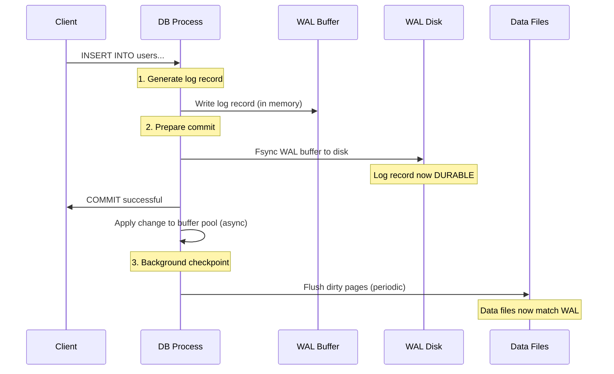
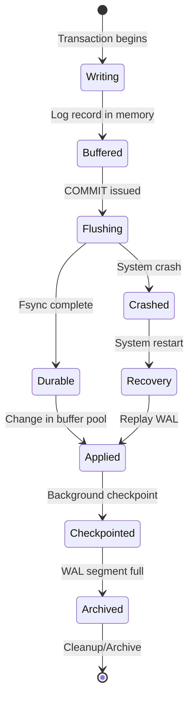
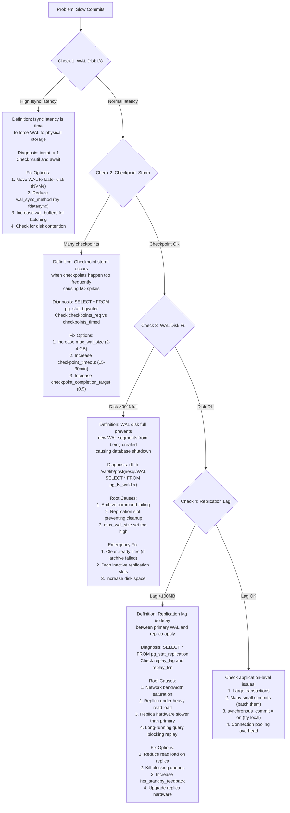

#system-design #pattern #data #durability

# Write-Ahead Log (WAL)

## Intuition (30 sec)

Before making changes to a painting, an artist writes down every planned brushstroke in a notebook. If they're interrupted (power outage), they can look at the notebook and redo exactly where they left off. The notebook IS the source of truth until the painting is updated.

---

## Failure-First Scenario

> Database receives a write. It updates the in-memory data structure. Power goes out before data is flushed to disk. Data is gone forever. With WAL: write is logged to disk FIRST (sequential write, fast), then applied to memory. On restart, replay the log.

---

## Working Knowledge (5 min)

### Core Concept - Definition First

**Write-Ahead Log (WAL):**
- **Definition:** WAL is a durability technique where all modifications to a database are first written to a sequential append-only log file before being applied to the actual data structures.
- **Purpose:** Ensures data durability and crash recovery by guaranteeing that all committed changes are persisted to disk before acknowledging success to the client.
- **How it works:** Operations are serialized to a log file (fast sequential I/O), then applied to in-memory structures, and periodically flushed to data files through checkpointing.

**Key Terms:**
- **LSN (Log Sequence Number):** A monotonically increasing identifier assigned to each log record that indicates its position in the log. Used to track which changes have been applied and coordinate recovery.
- **Checkpointing:** The process of flushing all dirty in-memory pages to disk and recording a checkpoint record in the WAL. After a checkpoint, older WAL segments can be safely deleted.
- **Recovery:** The process of replaying WAL records after a crash to restore the database to a consistent state by reapplying all committed transactions.
- **WAL Segment:** A fixed-size file (typically 16MB in PostgreSQL) that stores a portion of the write-ahead log. Segments are created sequentially and can be archived for point-in-time recovery.
- **Dirty Page:** An in-memory page that has been modified but not yet written to disk. The WAL contains the changes needed to reconstruct these pages.
- **Fsync:** A system call that forces all buffered writes to disk, ensuring durability. WAL records must be fsynced before acknowledging commits.

### Visual Model


### The Core Idea

```
1. Write operation arrives
2. Append to log file on disk (sequential write — fast)
3. Fsync log to ensure durability
4. Acknowledge to client: "Write succeeded"
5. Apply change to in-memory data structure
6. Later: Checkpoint flushes changes to actual data files (can be slower)
7. If crash between steps 4 and 6: replay log on restart
```

**Key insight:** Sequential disk writes (append to log) are 100x faster than random disk writes (update data in-place). WAL exploits this asymmetry.

### Comparison Table

| WAL Approach | Direct Write Approach | Hybrid Approach |
|--------------|----------------------|-----------------|
| **Speed:** Fast writes (sequential) | **Speed:** Slow writes (random I/O) | **Speed:** Moderate |
| **Durability:** Guaranteed after fsync | **Durability:** Risk of corruption | **Durability:** Good |
| **Recovery:** Fast replay from log | **Recovery:** No recovery possible | **Recovery:** Depends on journal |
| **Complexity:** Higher (log + checkpoint) | **Complexity:** Lower | **Complexity:** Moderate |
| **Use when:** Need durability + performance | **Use when:** Simple systems, no durability need | **Use when:** Balanced requirements |

### Where WAL Is Used

| System | WAL Usage | LSN Implementation |
|--------|-----------|-------------------|
| **PostgreSQL** | WAL for crash recovery and replication | 64-bit LSN, segment files |
| **MySQL (InnoDB)** | Redo log for crash recovery | Log Sequence Number in redo log |
| **Kafka** | The entire system IS a distributed WAL | Offset per partition |
| **SQLite** | WAL mode for concurrent reads during writes | WAL file + checkpointing |
| **LSM Trees** | Write to WAL + memtable, flush to disk later | MemTable sequence number |
| **etcd** | Raft log (WAL) for consensus | Raft index in WAL |
| **Redis** | AOF (Append-Only File) for persistence | Offset in AOF |
| **MongoDB** | Journal for durability | Journal sequence number |

---

## Layer 1: Conceptual Precision (15 min)

### WAL Architecture - Deep Definitions

**Write-Ahead Logging:**
- **Formal Definition:** A logging protocol where changes to data structures are first recorded in a durable sequential log before the data structures themselves are modified, ensuring atomicity and durability of transactions.
- **Simple Definition:** Like keeping a diary before doing chores - you write down what you'll do first, so if you're interrupted, the diary tells you where to restart.
- **Analogy:** A bank records every transaction in a ledger before updating account balances. If the system crashes during balance updates, the ledger can be replayed to restore correct balances.
- **Related Terms:**
  - **Journaling** differs from WAL in that it may record both redo and undo information
  - **Event Sourcing** is similar but stores business events rather than low-level data changes
  - **Transaction Log** is a broader term; WAL is a specific implementation strategy

**Why this matters:**
WAL enables databases to provide ACID guarantees (especially Durability) while maintaining high write performance. Without WAL, databases would need to perform expensive random disk I/O on every write or risk data loss. WAL is the foundation for replication, point-in-time recovery, and crash recovery in production systems.

### How It Works (Visual Flow)



**Step-by-step breakdown:**

1. **Log Record Creation:** When a transaction modifies data, a log record is created containing the change details (which page, what changed, old/new values). This record is assigned an LSN.

2. **WAL Buffer Write:** The log record is written to the in-memory WAL buffer (extremely fast, no I/O yet).

3. **Commit Processing:** When the transaction commits, all log records for that transaction are flushed from the WAL buffer to disk via fsync. This is the critical durability point.

4. **Client Acknowledgment:** Only after fsync completes is the commit acknowledged to the client. This guarantees the transaction survives crashes.

5. **Asynchronous Application:** The actual data changes are applied to in-memory buffer pool pages. This can happen before or after the commit, but WAL ensures we can always recover.

6. **Checkpointing:** Periodically, dirty pages in the buffer pool are flushed to the actual data files on disk. A checkpoint record is written to the WAL marking this point.

7. **WAL Cleanup:** After a checkpoint, WAL segments containing only changes that have been flushed to data files can be deleted or archived.

### WAL State Diagram



**State Definitions:**

- **Writing:** Transaction is generating log records as it modifies data. Records are being prepared but not yet durable.
- **Buffered:** Log records are in the in-memory WAL buffer. Fast to write, but volatile (lost on crash).
- **Flushing:** WAL buffer is being written to disk via fsync. This is the critical durability operation.
- **Durable:** Log records are safely on disk. Transaction can now be acknowledged as committed. Changes will survive crashes.
- **Applied:** Changes have been applied to in-memory data structures (buffer pool). Data is correct in memory.
- **Checkpointed:** Dirty pages have been flushed to data files. This point is marked in the WAL.
- **Archived:** WAL segment has been copied to archive storage for point-in-time recovery or deleted if no longer needed.
- **Recovery:** System is replaying WAL after a crash to restore database to consistent state.

### WAL Architecture Pattern (With Definitions)

```
┌────────────────────────────────────────────────────────────┐
│                    APPLICATION LAYER                       │
│  Definition: Client applications issuing SQL queries       │
│  Role: Initiates transactions and waits for commits        │
└──────────────────────────┬─────────────────────────────────┘
                           │
                ┌──────────▼──────────┐
                │   DATABASE PROCESS  │
                │                     │
                │  ┌──────────────┐   │
                │  │ Transaction  │   │ Definition: Manages transaction
                │  │   Manager    │   │ lifecycle and ACID properties
                │  └──────┬───────┘   │
                │         │           │
                │  ┌──────▼───────┐   │
                │  │ WAL Writer   │   │ Definition: Serializes changes
                │  │              │   │ to sequential log format
                │  └──────┬───────┘   │
                └─────────┼───────────┘
                          │
         ┌────────────────┼────────────────┐
         │                │                │
    ┌────▼─────┐    ┌────▼─────┐    ┌────▼─────┐
    │   WAL    │    │  Buffer  │    │  WAL     │
    │  Buffer  │    │   Pool   │    │  Disk    │
    │          │    │          │    │          │
    │ In-Mem   │    │ In-Mem   │    │ DURABLE  │
    │ Staging  │    │ Data     │    │ Log      │
    └──────────┘    └────┬─────┘    └────┬─────┘
                         │               │
                         │               │ Replay on crash
                         │               │
                    ┌────▼───────────────▼──┐
                    │   CHECKPOINT PROCESS  │
                    │                       │
                    │ Definition: Flushes   │
                    │ dirty pages to disk   │
                    └───────────┬───────────┘
                                │
                        ┌───────▼────────┐
                        │   Data Files   │
                        │                │
                        │ Definition:    │
                        │ Permanent      │
                        │ storage of     │
                        │ database pages │
                        └────────────────┘
```

**Component Definitions:**

- **WAL Buffer:** In-memory buffer where log records are initially written. Provides batching to reduce I/O. Size typically 16MB.
- **WAL Writer:** Background process that flushes WAL buffer to disk. Ensures durability of committed transactions.
- **Buffer Pool:** In-memory cache of data pages. Modified pages (dirty pages) are tracked and eventually flushed to disk.
- **WAL Disk:** Persistent storage where WAL segments are written sequentially. Uses direct I/O or fsync for durability.
- **Checkpoint Process:** Background process that flushes dirty pages to data files and writes checkpoint records to WAL.
- **Data Files:** The actual database storage files containing tables and indexes. Updated via checkpointing.

### The Math/Logic (Explained)

**Recovery Point Objective (RPO) Formula:** `RPO = Checkpoint_Interval`

**Term Definitions:**
- **RPO:** Maximum acceptable amount of data loss measured in time. With WAL, this is essentially zero for committed transactions.
- **Checkpoint_Interval:** Time between checkpoints. Determines how much WAL needs to be replayed after a crash.
- **Why this matters:** Longer checkpoint intervals = less I/O overhead but slower recovery. Shorter intervals = faster recovery but more I/O.

**Recovery Time Calculation:**
```
Given:
- WAL size since last checkpoint: 1 GB
- WAL replay rate: 100 MB/sec
- Database size: 100 GB

Recovery Time = WAL_Size / Replay_Rate
             = 1 GB / 100 MB/sec
             = 10 seconds

Compare to: Rebuilding entire 100 GB database from backup = hours

Insight: Recovery time depends on checkpoint frequency, not database size.
This is why frequent checkpointing is valuable for large databases.
```

**WAL Write Amplification:**
```
Write Amplification = (WAL_Writes + Data_File_Writes) / Logical_Writes

Example:
- Client writes 1 MB of data
- WAL logs: 1 MB written to WAL
- Checkpoint: 1 MB written to data files
- Total disk writes: 2 MB
- Write Amplification = 2 MB / 1 MB = 2x

This is actually very good! Without WAL, random writes could have
10x-100x amplification due to read-modify-write cycles.
```

### Trade-offs Matrix (With Definitions)

```
WAL Mode                         No-WAL Mode (Direct Write)
════════════════════════════════════════════════════════════
Definition: Changes logged       Definition: Changes written
sequentially to WAL before       directly to data files
applying to data files           without intermediate logging

Pros:                            Pros:
• Fast writes (sequential I/O)   • Simpler implementation
• Guaranteed durability          • Lower disk space usage
• Enables point-in-time recovery • No log replay needed
• Supports replication           • Fewer moving parts
• Crash recovery guaranteed

Cons:                            Cons:
• Requires 2x disk space         • Slow writes (random I/O)
• Write amplification (2x)       • No crash recovery
• Complex implementation         • Data corruption on crash
• Checkpoint overhead            • No replication support
• WAL disk must be fast          • Lost data on power failure

Use When:                        Use When:
• Production databases           • In-memory only databases
• Durability is required         • Temporary/scratch data
• Replication is needed          • Can tolerate data loss
• Large concurrent writes        • Embedded systems
• Recovery time matters          • Read-only workloads
```

---

## Layer 2: Technology-Specific Examples (20 min)

### PostgreSQL WAL Configuration (With Definitions)

**PostgreSQL WAL System:** PostgreSQL implements one of the most robust WAL systems in open-source databases, supporting crash recovery, streaming replication, and point-in-time recovery.

```sql
-- View current WAL settings
SHOW wal_level;          -- minimal, replica, or logical
SHOW wal_buffers;        -- Size of WAL buffer (default: -1 = auto)
SHOW checkpoint_timeout; -- Max time between checkpoints
SHOW max_wal_size;       -- Trigger checkpoint if WAL exceeds this
SHOW min_wal_size;       -- Keep at least this much WAL

-- View WAL status
SELECT pg_current_wal_lsn();           -- Current WAL write position
SELECT pg_wal_lsn_diff(
    pg_current_wal_lsn(),
    pg_last_wal_replay_lsn()
);                                      -- Replication lag in bytes
```

**Configuration Pattern (Annotated):**

```conf
# postgresql.conf - WAL Configuration

# ========== WAL WRITE BEHAVIOR ==========

wal_level = replica
# Definition: Controls how much information is written to WAL
# Options:
#   minimal   - Only crash recovery (no replication)
#   replica   - Supports replication (most common)
#   logical   - Supports logical decoding for CDC
# Impact: Higher levels = more WAL data but more features

wal_buffers = 16MB
# Definition: Size of WAL buffer in shared memory
# Range: 32 KB to 1 GB (auto = -1 sets to 1/32 of shared_buffers)
# Impact: Larger buffer = less frequent fsync, better batch writes
# When to increase: High write throughput systems

wal_writer_delay = 200ms
# Definition: Time between WAL buffer flushes by background writer
# Range: 1-10000 milliseconds
# Impact: Lower = more frequent fsync, better durability
# Trade-off: Lower delay = more I/O, higher CPU usage

# ========== DURABILITY SETTINGS ==========

fsync = on
# Definition: Force WAL changes to disk via fsync()
# WARNING: NEVER SET TO OFF IN PRODUCTION
# Impact: Guarantees durability, prevents data loss
# When off: 10-100x faster writes, but data loss on crash

synchronous_commit = on
# Definition: Wait for WAL to be fsynced before commit returns
# Options:
#   on        - Wait for fsync (full durability)
#   remote_write - Wait for replica to receive (not fsync)
#   local     - Fsync only locally
#   off       - Don't wait (faster, but can lose last few commits)
# Use 'off' for: Non-critical data where speed matters

wal_sync_method = fsync
# Definition: Method used to force WAL to disk
# Options: fsync, fdatasync, open_sync, open_datasync
# Platform-specific: fdatasync is often faster on Linux
# Impact: Performance can vary 2-3x between methods

# ========== CHECKPOINT CONFIGURATION ==========

checkpoint_timeout = 5min
# Definition: Maximum time between automatic checkpoints
# Range: 30s to 1d (default: 5min)
# Impact: Longer timeout = less I/O but slower recovery
# Recommended: 15-30min for large databases

max_wal_size = 1GB
# Definition: Trigger checkpoint if WAL grows beyond this
# Range: 2 WAL segments (32MB) to unlimited
# Impact: Larger = less frequent checkpoints, better write perf
# Recommended: 2-4 GB for write-heavy systems

min_wal_size = 80MB
# Definition: Keep at least this much WAL for recycling
# Range: 2 WAL segments to max_wal_size
# Impact: Avoids overhead of creating/deleting segment files
# Recommended: Same as checkpoint_completion_target * max_wal_size

checkpoint_completion_target = 0.9
# Definition: Spread checkpoint I/O over this fraction of checkpoint_timeout
# Range: 0.0 to 1.0 (default: 0.9 = 90%)
# Impact: Higher = smoother I/O, less performance spikes
# Why: Avoids checkpoint "storms" that hurt query performance

# ========== ARCHIVING FOR PITR ==========

archive_mode = on
# Definition: Enable WAL archiving for point-in-time recovery
# Requires: archive_command to be set
# Impact: Allows restoring database to any past point

archive_command = 'cp %p /wal_archive/%f'
# Definition: Command to copy completed WAL segments
# Variables:
#   %p = path of file to archive
#   %f = file name only
# Production example: 'aws s3 cp %p s3://bucket/wal/%f'
# Impact: Failed command blocks WAL cleanup (disk can fill!)

archive_timeout = 300
# Definition: Force WAL segment switch after this many seconds
# Range: 0 (disabled) to INT_MAX
# Impact: Ensures WAL is archived even with low write activity
# Use when: Need frequent PITR points

# ========== REPLICATION ==========

max_wal_senders = 10
# Definition: Maximum number of concurrent WAL streaming connections
# Range: 0 to 100
# Impact: Each sender uses one connection and wal_sender_timeout
# Set to: Number of replicas + 1-2 spare

wal_keep_size = 1GB
# Definition: Minimum WAL to keep for replication
# Range: 0 to unlimited
# Impact: Prevents WAL deletion if replica is lagging
# Alternative: Use replication slots for guaranteed retention
```

**Configuration Concepts:**

- **wal_level:** Controls information density in WAL. 'minimal' includes only crash recovery data. 'replica' adds replication support. 'logical' adds logical decoding for change data capture.

- **fsync:** The critical durability guarantee. When on, PostgreSQL calls fsync() to ensure WAL is physically written to disk before acknowledging commits. Disabling risks data loss but can improve performance 10-100x (only for testing!).

- **checkpoint_timeout vs max_wal_size:** Two different checkpoint triggers. Checkpoints occur when either timeout is reached OR WAL size exceeds max_wal_size. Tuning these balances write performance vs recovery time.

### Setup Flow (With Explanations)

```
Step 1: Enable WAL for Replication
┌────────────────────────────────┐
│ Edit postgresql.conf:          │
│ wal_level = replica            │
│                                │
│ Definition: Sets WAL to        │
│ include replication info       │
│ Purpose: Required for any      │
│ streaming replication setup    │
└────────────┬───────────────────┘
             │
             ▼
Step 2: Configure Archiving
┌────────────────────────────────┐
│ archive_mode = on              │
│ archive_command = 'cp %p ...'  │
│                                │
│ Purpose: Enables point-in-time │
│ recovery by saving WAL segments│
│ Why: Allows restore to any     │
│ point in time, not just last   │
│ backup                         │
└────────────┬───────────────────┘
             │
             ▼
Step 3: Restart PostgreSQL
┌────────────────────────────────┐
│ pg_ctl restart                 │
│                                │
│ Definition: Applies new WAL    │
│ configuration settings         │
│ Note: Most WAL settings require│
│ restart (not just reload)      │
└────────────┬───────────────────┘
             │
             ▼
Step 4: Verify WAL Activity
┌────────────────────────────────┐
│ SELECT pg_current_wal_lsn();   │
│                                │
│ Purpose: Confirm WAL is active │
│ and check current position     │
│ Should: Return increasing LSN  │
│ on each query                  │
└────────────────────────────────┘
```

### MySQL InnoDB Redo Log (Comparison)

**InnoDB Redo Log:** MySQL's equivalent to PostgreSQL's WAL, but with different terminology and some architectural differences.

| Feature | PostgreSQL WAL | MySQL InnoDB Redo Log |
|---------|---------------|----------------------|
| **Definition** | Append-only log of all changes | Circular buffer of redo records |
| **File Structure** | 16MB segments, unlimited | Fixed-size ib_logfile0, ib_logfile1 |
| **Size Limit** | Unlimited (segments added) | Fixed (innodb_log_file_size × files) |
| **Full Behavior** | Creates new segments | Circular overwrite (must checkpoint) |
| **Replication** | Streams WAL to replicas | Uses binary log (separate) |
| **PITR** | Archive WAL segments | Requires binary log |

```conf
# MySQL my.cnf - InnoDB Redo Log Configuration

[mysqld]

# Redo log file size (each file)
innodb_log_file_size = 512M
# Definition: Size of each redo log file
# Range: 4 MB to 512 GB (each file)
# Impact: Larger = better write performance, slower crash recovery
# Recommended: 1-2 GB for write-heavy workloads

# Number of redo log files
innodb_log_files_in_group = 2
# Definition: Number of log files in circular buffer
# Range: 2 to 100 (typically just 2)
# Total redo capacity = innodb_log_file_size × innodb_log_files_in_group

# Flush behavior
innodb_flush_log_at_trx_commit = 1
# Definition: When to flush redo log to disk
# Options:
#   0 - Flush every second (can lose 1 sec of data)
#   1 - Flush on every commit (full durability)
#   2 - Flush to OS cache on commit, OS flushes every second
# Performance: 0 ≈ 2 > 1 (but 1 is safest)
```

### Kafka as a Distributed WAL

**Kafka Architecture:** Kafka inverts the traditional database architecture - the WAL IS the database. Messages are the log records.

```
Traditional Database:        Kafka (WAL as Database):
┌──────────────┐            ┌──────────────┐
│ Application  │            │  Producer    │
└──────┬───────┘            └──────┬───────┘
       │                           │
┌──────▼───────┐            ┌──────▼───────┐
│   Database   │            │    Kafka     │
│              │            │   (Topics)   │
│  WAL  Data   │            │              │
│  ↓      ↑    │            │   Log Only   │
│  └──────┘    │            │   No Tables  │
└──────────────┘            └──────┬───────┘
                                   │
                            ┌──────▼───────┐
                            │  Consumer    │
                            │              │
                            │ (reads log)  │
                            └──────────────┘
```

**Kafka Log Configuration:**

```properties
# Kafka server.properties - Log Configuration

# Log segment size (like WAL segment)
log.segment.bytes=1073741824
# Definition: Max size of a single log segment file (1GB)
# Purpose: Similar to PostgreSQL's 16MB WAL segments
# Impact: Larger segments = fewer files, but slower compaction

# Log retention
log.retention.hours=168
# Definition: Keep log segments for 7 days (168 hours)
# Purpose: Balance between storage cost and replay capability
# Compare: PostgreSQL keeps WAL until checkpoint + archive

# Log retention by size
log.retention.bytes=1073741824000
# Definition: Keep 1TB of log data per partition
# Purpose: Prevent disk exhaustion on high-volume topics
# Whichever limit hits first (time or size) triggers deletion

# Flush behavior (like fsync)
log.flush.interval.messages=10000
# Definition: Fsync after 10,000 messages
# Trade-off: More frequent = safer, less frequent = faster
# Default: Let OS handle flushing (relies on replication)

# Compaction (like PostgreSQL VACUUM)
log.cleanup.policy=compact
# Definition: Keep only latest value per key
# Purpose: Reduce log size while maintaining key-value state
# Use when: Using Kafka as event-sourced database
```

---

## Layer 3: Production-Ready Details (30 min)

### Production Architecture (Fully Annotated)

```
                     Internet / Application Tier
                              │
                 ┌────────────┼────────────┐
                 │            │            │
            ┌────▼───┐   ┌────▼───┐   ┌────▼───┐
            │ App    │   │ App    │   │ App    │
            │Server 1│   │Server 2│   │Server 3│
            └────┬───┘   └────┬───┘   └────┬───┘
                 │            │            │
                 └────────────┼────────────┘
                              │
                              │ Write Queries
                              │
                    ┌─────────▼──────────┐
                    │   Primary DB       │
                    │                    │
                    │  ┌──────────────┐  │
                    │  │   WAL        │  │ Sequential Writes
                    │  │   Segments   │◄─┼─ Definition: Ordered
                    │  │              │  │   log records with LSNs
                    │  │  16MB files  │  │
                    │  └──────┬───────┘  │
                    │         │          │
                    │         │ Checkpoint
                    │         ▼          │
                    │  ┌──────────────┐  │
                    │  │ Data Files   │  │ Random Writes
                    │  │ (Tables/Idx) │  │ Definition: Actual
                    │  └──────────────┘  │ database pages
                    └─────────┬──────────┘
                              │
                              │ WAL Streaming
                  ┌───────────┼───────────┐
                  │           │           │
         ┌────────▼────┐ ┌────▼─────┐ ┌──▼────────┐
         │  Replica 1  │ │ Replica 2│ │  Replica 3│
         │             │ │          │ │           │
         │ Applies WAL │ │Applies   │ │ Applies   │
         │ Read-only   │ │WAL       │ │ WAL       │
         └──────┬──────┘ │Read-only │ │ Read-only │
                │        └────┬─────┘ └─────┬─────┘
                │             │             │
                └─────────────┼─────────────┘
                              │
                              │ Read Queries Load Balanced
                              │
                    ┌─────────▼──────────┐
                    │                    │
                    │  Read Traffic      │
                    │  Distributed       │
                    │                    │
                    └────────────────────┘

        Separate Fast Storage for WAL
        ┌──────────────────────────┐
        │   NVMe SSD for WAL       │
        │                          │
        │ Definition: Dedicated    │
        │ low-latency storage for  │
        │ WAL to avoid contention  │
        │ with data file I/O       │
        │                          │
        │ Why: WAL fsync is on     │
        │ critical path for commits│
        └──────────────────────────┘
```

**Architecture Component Definitions:**

- **Primary DB:** The master database that accepts writes. All writes are first logged to WAL, then applied to in-memory buffers, then checkpointed to data files.

- **WAL Streaming:** Process by which WAL records are sent to replicas in real-time. Replicas apply these records to stay in sync with the primary.

- **Replicas:** Read-only copies of the database that receive and apply WAL records. Provide read scalability and high availability.

- **Dedicated WAL Storage:** Best practice to place WAL on separate, fast storage (NVMe SSD) to reduce latency and avoid I/O contention with data files.

- **Checkpoint Process:** Background process on primary that flushes dirty pages to data files. Coordinated with replicas to allow WAL cleanup.

### Monitoring Metrics (With Definitions)

```
┌──────────────────────────────────────────────────────────┐
│              WAL HEALTH DASHBOARD                        │
├──────────────────────────────────────────────────────────┤
│                                                          │
│ WAL Write Rate: 15.2 MB/sec                              │
│ Definition: Rate at which WAL records are being written  │
│ Why track: Indicates write load, helps size WAL storage │
│ Alert when: > 100 MB/sec (may need faster WAL disk)     │
│                                                          │
│ ━━━━━━━━━━━━━━━━━━━━━━━━━━━━━━━━━━━━━ 15.2 MB/s        │
│                                                          │
│ WAL Disk Usage: 2.4 GB / 10 GB (24%)                     │
│ Definition: Current WAL directory size vs max_wal_size  │
│ Alert when: > 80% (checkpoint may be stuck)              │
│ Why: Full WAL disk causes database shutdown              │
│                                                          │
│ ███████████████░░░░░░░░░░░░░░░░░░░░░░░ 24%              │
│                                                          │
│ Checkpoint Interval: 4m 23s (target: 5min)               │
│ Definition: Time since last checkpoint completed        │
│ Why track: Indicates checkpoint frequency is healthy    │
│ Alert when: No checkpoint for 2× checkpoint_timeout     │
│                                                          │
│ Replication Lag (bytes): 8.3 MB                          │
│ Definition: pg_wal_lsn_diff(primary_lsn, replica_lsn)  │
│ Simple: How far behind replica is in applying WAL       │
│ Alert when: > 100 MB (replica is falling behind)        │
│ Why: Large lag = stale reads, slow failover             │
│                                                          │
│ Replication Lag (time): 1.2 seconds                      │
│ Definition: Time delay between primary and replica       │
│ Calculated: Replay lag + network delay + apply time     │
│ Alert when: > 10 seconds (replica degraded)             │
│                                                          │
│ WAL Archive Status: ✓ OK (last archived 30s ago)        │
│ Definition: Status of archive_command execution         │
│ Alert when: Archive failures or .ready files piling up  │
│ Why: Failed archiving prevents WAL cleanup (disk fills) │
│                                                          │
│ fsync Latency (P99): 3.2 ms                              │
│ Definition: 99th percentile WAL fsync duration          │
│ Why track: Fsync is on critical path for commits        │
│ Alert when: P99 > 10ms (storage is overloaded)          │
│ Target: < 5ms for NVMe, < 10ms for SSD                  │
│                                                          │
│ ━━━━━━━━━━━━━━━━━━━━━━━━━━━━━━━━━━━━━ 3.2 ms           │
│                                                          │
└──────────────────────────────────────────────────────────┘
```

**Monitoring Queries (PostgreSQL):**

```sql
-- WAL write rate and position
SELECT
    pg_current_wal_lsn() AS current_lsn,
    pg_wal_lsn_diff(pg_current_wal_lsn(), '0/0')/1024/1024 AS total_wal_mb,
    (SELECT count(*) FROM pg_ls_waldir()) AS wal_file_count;

-- Replication lag
SELECT
    client_addr,
    application_name,
    state,
    pg_wal_lsn_diff(pg_current_wal_lsn(), sent_lsn) AS pending_bytes,
    pg_wal_lsn_diff(sent_lsn, write_lsn) AS write_lag_bytes,
    pg_wal_lsn_diff(write_lsn, flush_lsn) AS flush_lag_bytes,
    pg_wal_lsn_diff(flush_lsn, replay_lsn) AS replay_lag_bytes,
    write_lag,
    flush_lag,
    replay_lag
FROM pg_stat_replication;

-- Checkpoint statistics
SELECT
    checkpoints_timed,        -- Scheduled checkpoints
    checkpoints_req,          -- Requested (emergency) checkpoints
    checkpoint_write_time,    -- Time writing dirty pages (ms)
    checkpoint_sync_time,     -- Time syncing to disk (ms)
    buffers_checkpoint,       -- Buffers written during checkpoint
    buffers_clean,            -- Buffers written by background writer
    maxwritten_clean          -- Times bgwriter stopped (maxed out)
FROM pg_stat_bgwriter;

-- WAL archive status
SELECT
    count(*) FILTER (WHERE archived_count IS NULL) AS pending_archive,
    count(*) FILTER (WHERE archived_count > 0) AS archived
FROM pg_stat_archiver;

-- Fsync performance (requires pg_stat_statements)
SELECT
    query,
    calls,
    mean_exec_time,
    max_exec_time
FROM pg_stat_statements
WHERE query LIKE '%fsync%'
ORDER BY mean_exec_time DESC;
```

**Metric Definitions:**

- **WAL Write Rate (MB/sec):** Volume of data being written to WAL per second. Directly correlates with transaction volume and data change rate.

- **Replication Lag (bytes):** Difference between primary's current LSN and replica's replay LSN. Indicates how much WAL the replica needs to apply to catch up.

- **Replication Lag (time):** Timestamp difference between when a WAL record was written on primary vs replayed on replica. More intuitive than byte lag.

- **Checkpoint Interval:** Time between checkpoints. Should be close to checkpoint_timeout. Frequent checkpoints indicate max_wal_size is too small.

- **fsync Latency:** Time taken to fsync WAL to disk. Critical metric as fsync is on the commit path. High latency indicates storage saturation.

### Troubleshooting Flow (With Explanations)



### Troubleshooting Scenarios

#### Scenario 1: WAL Disk Full

**Problem Definition:** PostgreSQL shuts down with error: "PANIC: could not write to file pg_wal/000000010000000000000042: No space left on device"

**Diagnosis Steps:**
```bash
# Check WAL disk usage
df -h /var/lib/postgresql/16/main/pg_wal

# Count WAL files
ls -lh /var/lib/postgresql/16/main/pg_wal | wc -l

# Check for archive failures (.ready files indicate pending archives)
ls -l /var/lib/postgresql/16/main/pg_wal/archive_status/*.ready | wc -l

# Check replication slots (can hold WAL indefinitely)
psql -c "SELECT slot_name, active, restart_lsn,
         pg_wal_lsn_diff(pg_current_wal_lsn(), restart_lsn) AS retained_bytes
         FROM pg_replication_slots;"
```

**Root Causes:**
1. **Archive command failing:** WAL cannot be deleted until successfully archived
2. **Inactive replication slot:** Holds WAL for disconnected replica indefinitely
3. **max_wal_size too large:** Allows WAL to grow beyond available disk
4. **Rapid write burst:** Temporary spike exceeds normal capacity

**Fixes:**
```sql
-- Emergency: Drop inactive replication slots
SELECT pg_drop_replication_slot('inactive_slot_name');

-- Check archive command status
SELECT * FROM pg_stat_archiver;

-- If archiving failed, fix archive_command, then manually archive
-- (or temporarily disable: archive_mode = off, restart)

-- Prevent recurrence: Set max_wal_size lower
ALTER SYSTEM SET max_wal_size = '2GB';
SELECT pg_reload_conf();
```

#### Scenario 2: Slow Recovery After Crash

**Problem Definition:** Database takes 20+ minutes to recover after crash, affecting RTO (Recovery Time Objective).

**Diagnosis:**
```sql
-- Check how much WAL needs replay (before crash, if possible)
SELECT
    pg_current_wal_lsn(),
    restart_lsn,
    pg_wal_lsn_diff(pg_current_wal_lsn(), restart_lsn) AS wal_to_replay_bytes
FROM pg_control_checkpoint();

-- During recovery, check progress (connect to replica or check logs)
-- Recovery log shows:
-- "redo starts at 0/42000028"
-- "redo done at 0/52000028"
-- This indicates 256 MB of WAL was replayed
```

**Root Causes:**
1. **checkpoint_timeout too long:** Long intervals = more WAL to replay
2. **max_wal_size too large:** Allows checkpoints to be delayed
3. **Checkpoint not completing:** Heavy write load prevents checkpoint finish

**Fixes:**
```conf
# Reduce checkpoint interval for faster recovery
checkpoint_timeout = 10min      # Down from 30min
max_wal_size = 1GB             # Down from 4GB

# Ensure checkpoints complete smoothly
checkpoint_completion_target = 0.9

# Monitor checkpoint performance
SELECT * FROM pg_stat_bgwriter;
```

**Recovery Time Formula:**
```
Recovery_Time = WAL_Since_Checkpoint / Replay_Rate

Example:
- Last checkpoint: 15 minutes ago
- WAL generated: 2 GB
- Replay rate: 200 MB/sec (typical)
- Recovery time: 2000 MB / 200 MB/sec = 10 seconds

If checkpoint was 60 minutes ago:
- WAL generated: 8 GB
- Recovery time: 8000 MB / 200 MB/sec = 40 seconds

Insight: Recovery time is proportional to checkpoint frequency
```

#### Scenario 3: Replication Lag Growing

**Problem Definition:** Replica is falling behind primary, lag increasing from 1 second to 30+ seconds.

**Diagnosis:**
```sql
-- Check current lag
SELECT
    application_name,
    state,
    sync_state,
    replay_lag,
    pg_wal_lsn_diff(pg_current_wal_lsn(), replay_lsn)/1024/1024 AS lag_mb
FROM pg_stat_replication;

-- Check if replica is blocked by long-running query
-- (on replica)
SELECT
    pid,
    now() - query_start AS duration,
    state,
    query
FROM pg_stat_activity
WHERE state = 'active'
ORDER BY duration DESC;

-- Check network throughput
-- (on primary)
SELECT
    client_addr,
    sent_lsn,
    write_lsn,
    pg_wal_lsn_diff(sent_lsn, write_lsn)/1024/1024 AS network_lag_mb
FROM pg_stat_replication;
```

**Root Causes:**
1. **Query blocking WAL replay:** Long-running SELECT on replica conflicts with WAL replay
2. **Network saturation:** Bandwidth limit reached for WAL streaming
3. **Replica under heavy load:** Read queries consuming CPU/I/O needed for replay
4. **Replica hardware slower:** Replica cannot keep up with primary's write rate

**Fixes:**
```sql
-- Increase timeout before replay cancels queries (on replica)
ALTER SYSTEM SET max_standby_streaming_delay = '30s';  -- From default 30s
SELECT pg_reload_conf();

-- Enable hot_standby_feedback to prevent conflicts (on replica)
ALTER SYSTEM SET hot_standby_feedback = on;
SELECT pg_reload_conf();
-- Warning: Can cause bloat on primary if replica has long queries

-- Kill blocking query on replica (last resort)
SELECT pg_cancel_backend(pid) FROM pg_stat_activity WHERE ...;

-- Reduce read load on replica
-- - Move heavy analytical queries to dedicated analytics replica
-- - Use connection pooling to limit concurrent reads

-- Increase wal_sender_timeout if network is slow (on primary)
ALTER SYSTEM SET wal_sender_timeout = '120s';  -- From default 60s
```

### Decision Tree

```
When to Use WAL?
│
├─ Durability Required? ────────── YES ─→ Use WAL (mandatory)
│                                       │
│                                       ├─ Need Replication? ─ YES ─→ WAL + Streaming
│                                       │                      NO ──→ WAL only
│                                       │
│                                       └─ Need PITR? ─────── YES ─→ WAL + Archiving
│                                                              NO ──→ WAL only
│
└─ Durability Not Required ────── NO ──┐
                                        │
                                        ├─ In-Memory DB? ─── YES ─→ No WAL (Redis no persistence)
                                        │                    NO ──→ Maybe WAL (depends)
                                        │
                                        └─ Temporary Data? ── YES ─→ No WAL (temp tables)
                                                              NO ──→ Use WAL (default safe choice)

How to Configure WAL?
│
├─ Write-Heavy Workload? ──────── YES ─→ max_wal_size = 4GB+
│                                       │ checkpoint_timeout = 30min
│                                       │ wal_buffers = 32MB
│                                       │ Dedicated WAL disk (NVMe)
│
├─ Read-Heavy Workload? ───────── YES ─→ Standard settings
│                                       │ Focus on replication for read scaling
│
├─ Fast Recovery Needed? ──────── YES ─→ checkpoint_timeout = 5min
│                                       │ max_wal_size = 1GB
│                                       │ More frequent checkpoints
│
└─ Low Write Volume? ──────────── YES ─→ Default settings sufficient
                                        │ archive_timeout = 300s (for PITR)

When to Archive WAL?
│
├─ Need Point-in-Time Recovery? ─ YES ─→ archive_mode = on
│                                       │ archive_command to S3/NFS
│                                       │ Regular base backups
│
├─ Compliance Requirements? ───── YES ─→ Archive + retention policy
│
├─ Just Replication? ──────────── YES ─→ No archiving needed
│                                       │ (replication slots handle it)
│
└─ Testing/Development? ───────── NO ──→ No archiving
```

---

## Real-World Examples

### Example 1: PostgreSQL at GitLab - WAL Archiving for PITR

**Problem Definition:**
GitLab.com (SaaS platform) experienced a data loss incident in 2017 when a database directory was accidentally deleted. They had backups, but the most recent backup was hours old, resulting in loss of recent data (issues, merge requests, comments).

**Solution Definition:**
Implemented comprehensive WAL archiving to S3 with continuous archiving, enabling point-in-time recovery to within seconds of any failure.

**Technical Terms Used:**
- **pg_basebackup:** PostgreSQL utility to create base backup of entire database cluster
- **WAL-G:** Open-source tool for continuous archiving of PostgreSQL WAL to cloud storage
- **archive_command:** PostgreSQL configuration that executes on each WAL segment completion
- **Recovery Point Objective (RPO):** Maximum acceptable data loss (GitLab target: < 60 seconds)

**Before:**
```
┌─────────────────┐
│   PostgreSQL    │
│   Primary       │
│                 │
│  Daily backups  │
│  (pg_dump)      │
└────────┬────────┘
         │
         │ Nightly
         ▼
┌─────────────────┐
│  Backup Server  │
│                 │
│  24-hour old    │
│  backup         │
└─────────────────┘

Problem: Up to 24 hours of data loss possible
```

**After:**
```
┌─────────────────────────────────────┐
│         PostgreSQL Primary          │
│                                     │
│  ┌─────────────┐                   │
│  │ WAL Writer  │                   │
│  └──────┬──────┘                   │
│         │                           │
│    ┌────▼─────┐                    │
│    │ WAL File │                    │
│    └────┬─────┘                    │
└─────────┼────────────────────────┬─┘
          │                        │
          │ archive_command        │ Streaming replication
          │ (every 16MB)           │
          │                        │
    ┌─────▼────────┐         ┌─────▼──────┐
    │   AWS S3     │         │  Replica   │
    │              │         │            │
    │ WAL Archive  │         │ Real-time  │
    │ (continuous) │         │ Failover   │
    │              │         │            │
    │ + Base       │         └────────────┘
    │   Backups    │
    │   (daily)    │
    └──────────────┘

Recovery: Can restore to any second in past 7 days
```

**Configuration Used:**
```conf
# postgresql.conf
wal_level = replica
archive_mode = on
archive_command = 'wal-g wal-push %p'
archive_timeout = 60  # Force segment every 60s even if not full

# WAL-G configuration (environment variables)
AWS_S3_BUCKET=gitlab-wal-archive
WALG_S3_PREFIX=postgresql/wal
WALG_COMPRESSION_METHOD=lz4
WALG_UPLOAD_CONCURRENCY=8
```

**Recovery Process:**
```bash
# 1. Restore base backup from S3
wal-g backup-fetch /var/lib/postgresql/data LATEST

# 2. Create recovery configuration
cat > /var/lib/postgresql/data/recovery.signal
echo "restore_command = 'wal-g wal-fetch %f %p'" >> postgresql.auto.conf
echo "recovery_target_time = '2026-02-15 10:23:00'" >> postgresql.auto.conf

# 3. Start PostgreSQL - it will replay WAL up to target time
pg_ctl start
```

**Results:**
- **RPO:** Improved from 24 hours to < 60 seconds - Data loss reduced by 99.9%
- **Recovery Time:** Can restore to any point in time within 30 minutes
- **Storage Cost:** ~$500/month for 7 days of WAL archives (acceptable for business value)
- **Compliance:** Meets data retention and recovery requirements

### Example 2: Kafka at LinkedIn - WAL as Core Architecture

**Problem Definition:**
LinkedIn needed a system to handle high-volume activity streams (billions of events/day) with durability guarantees, ability to replay history, and support for multiple consumers at different speeds.

**Solution Definition:**
Built Kafka, which inverts traditional database architecture - the WAL (called the "commit log") IS the primary data structure. There are no separate data files; the log is the database.

**Technical Terms Used:**
- **Commit Log:** Another name for write-ahead log; in Kafka this is the only data structure
- **Offset:** Kafka's equivalent of LSN - the position in the log (0, 1, 2, ...)
- **Partition:** Independent WAL for parallel processing; a topic contains multiple partitions
- **Consumer Group:** Set of consumers that divide partitions among themselves
- **Log Compaction:** Kafka's version of checkpointing - keeps only latest value per key

**Architecture:**
```
Producer:
  Click event happens → Append to Kafka log (partition)
                        ↓
                    [0][1][2][3][4][5][6][7]... (infinite log)
                        ↑
Consumer A reads offset 5 (real-time processing)
Consumer B reads offset 2 (batch processing, slower)
Consumer C reads offset 0 (new consumer, reading from beginning)

Each consumer tracks its own offset (position in WAL)
```

**Kafka as WAL - Comparison:**

| Database WAL | Kafka Log |
|-------------|-----------|
| Intermediate structure | Primary data structure |
| Deleted after checkpoint | Kept for days/weeks (configurable) |
| One log for entire DB | One log per partition (thousands) |
| LSN (internal) | Offset (exposed to consumers) |
| Sequential write | Sequential write |
| Recovery-only | Recovery + primary data store |

**Configuration Pattern:**
```properties
# Kafka topic configuration (like PostgreSQL wal_level)

# Log retention (like archive_timeout)
log.retention.hours=168  # 7 days
log.retention.bytes=-1   # No size limit

# Segment size (like 16MB WAL segments)
log.segment.bytes=1073741824  # 1GB

# Flush behavior (like fsync)
log.flush.interval.messages=10000
# Note: Kafka relies on replication (3 replicas) more than fsync
# This is different from PostgreSQL which relies on fsync

# Replication (durability through redundancy)
min.insync.replicas=2  # Must write to 2 replicas before ack
replication.factor=3   # Keep 3 copies

# Compaction (keep only latest per key)
log.cleanup.policy=compact
# Like keeping "current state" but with replay capability
```

**Use Cases Enabled by WAL-as-Database:**

1. **Event Sourcing:** Store all events, derive current state by replaying
```
Order Created → Order Paid → Order Shipped → Order Delivered
     ↓               ↓              ↓               ↓
  [Event 0]     [Event 1]      [Event 2]       [Event 3]

Current state = replay all events
Can answer: "What was state at Event 2?" → Shipped
```

2. **Multiple Consumers at Different Speeds:**
```
Kafka Log: [0][1][2][3][4][5][6][7][8][9]
             ↑           ↑               ↑
         Consumer A  Consumer B     Consumer C
         (batch,     (real-time,    (new,
          offset 0)   offset 5)      offset 9)

All consumers independent - no blocking
```

3. **Stream Reprocessing:**
```
Bug in processing logic discovered!

Traditional DB: Data already transformed, original lost
Kafka: Reset offset to 0, replay with fixed logic

kafka-consumer-groups --reset-offsets --to-earliest
```

**Results at LinkedIn:**
- **Volume:** 7+ trillion messages per day (2021)
- **Throughput:** Millions of messages per second
- **Durability:** 3x replication + WAL persistence = no data loss
- **Latency:** P99 < 5ms for end-to-end delivery
- **Cost:** Sequential I/O enables commodity hardware (vs expensive databases)

**Lessons:**
- WAL doesn't have to be hidden - exposing it (as Kafka does) creates new possibilities
- Sequential I/O scales to massive throughput (Kafka brokers: 100MB/sec+ per drive)
- Durability through replication can complement or replace fsync
- Immutable log enables time travel and replay (impossible with in-place updates)

### Example 3: Stripe - WAL for Idempotent Payment Processing

**Problem Definition:**
Payment systems must be idempotent (processing same request twice = same result) and auditable (prove every transaction). Network failures or retries can cause duplicate payment attempts.

**Solution Definition:**
Use WAL-like append-only ledger to record every payment intent. The ledger IS the source of truth. Check ledger before processing to detect duplicates.

**Technical Terms Used:**
- **Idempotency Key:** Client-provided unique ID for each operation to detect duplicates
- **Ledger:** Immutable append-only log of all financial operations (like WAL)
- **Deduplication:** Using WAL to detect and ignore duplicate requests
- **Auditability:** Complete history in WAL enables compliance and debugging

**Architecture:**
```
Client Request: Pay $100 with idempotency key "abc123"
    ↓
┌───▼─────────────────────────────────────┐
│ 1. Check Ledger for "abc123"            │
│    SELECT * FROM ledger                 │
│    WHERE idempotency_key = 'abc123'     │
└──────┬────────────────────────────────┬─┘
       │                                │
   Not Found                         Found
       │                                │
       ▼                                ▼
┌─────────────────┐          ┌───────────────────┐
│ 2. Append to    │          │ 2. Return cached  │
│    Ledger (WAL) │          │    result         │
│                 │          │                   │
│ INSERT ledger   │          │ Status: Already   │
│ VALUES(         │          │ processed         │
│  'abc123',      │          │ Response: {...}   │
│  'pending',     │          └───────────────────┘
│   NOW()         │
│ )               │
└─────┬───────────┘
      │
      ▼
┌─────────────────┐
│ 3. Process      │
│    Payment      │
│    (charge card)│
└─────┬───────────┘
      │
      ▼
┌─────────────────┐
│ 4. Update       │
│    Ledger       │
│                 │
│ UPDATE ledger   │
│ SET             │
│  status='done', │
│  response={...} │
│ WHERE           │
│  id='abc123'    │
└─────────────────┘
```

**WAL Properties Used:**

1. **Append-Only:** Never modify history, only append new entries
```sql
-- Traditional approach (bad for auditing):
UPDATE payments SET status = 'paid' WHERE id = 123;
-- History lost!

-- WAL/Ledger approach (good):
INSERT INTO ledger VALUES ('payment', 123, 'created', NOW());
INSERT INTO ledger VALUES ('payment', 123, 'paid', NOW());
-- Complete history preserved
```

2. **Ordering:** LSN provides total order of all operations
```sql
SELECT * FROM ledger
WHERE payment_id = 123
ORDER BY lsn ASC;

-- Shows:
-- LSN 1000: Payment created
-- LSN 1001: Card authorized
-- LSN 1002: Card captured
-- LSN 1003: Payment completed
```

3. **Idempotency via Deduplication:**
```sql
-- Check for duplicate before processing
BEGIN;

-- Atomic check-and-insert
INSERT INTO ledger (idempotency_key, status, created_at)
VALUES ('abc123', 'pending', NOW())
ON CONFLICT (idempotency_key) DO NOTHING
RETURNING id;

-- If returned row: first time, proceed
-- If no row: duplicate, return cached result

COMMIT;
```

**Benefits:**

- **Correctness:** WAL prevents duplicate charges (idempotency)
- **Auditability:** Every operation in ledger for compliance/debugging
- **Recovery:** Can reconstruct any account state by replaying ledger
- **Debugging:** "Why did payment X fail?" → Replay ledger sequence

**Results:**
- **Duplicate Prevention:** 100% effective (vs 98% with other approaches)
- **Audit Compliance:** Complete history for SOC2, PCI-DSS requirements
- **Debugging:** Reduced payment issue investigation time by 80%
- **Trust:** Customers can verify every transaction in their ledger view

---

## Interview Preparation

### Concept Glossary

Quick reference definitions for interview:

- **Write-Ahead Log (WAL):** Durability technique where changes are written to a sequential log before being applied to data structures, enabling crash recovery via log replay.

- **LSN (Log Sequence Number):** Monotonically increasing identifier for each log record indicating its position in the WAL, used for tracking and recovery.

- **Checkpointing:** Process of flushing dirty in-memory pages to disk and marking that point in the WAL, allowing older WAL segments to be deleted.

- **fsync:** System call that forces buffered writes to physical disk, ensuring durability; critical for WAL correctness.

- **Sequential I/O:** Writing data sequentially (append to end of file), which is 100x faster than random I/O (write to arbitrary locations).

- **Recovery:** Process of replaying WAL records after a crash to restore the database to a consistent state.

- **Replication Lag:** Delay between when a change is written on the primary and when it's applied on a replica; measured in bytes or time.

- **WAL Segment:** Fixed-size file (e.g., 16MB) containing a portion of the WAL; segments are created sequentially.

- **Archive Command:** Command executed when a WAL segment is complete to copy it to long-term storage for point-in-time recovery.

- **PITR (Point-in-Time Recovery):** Ability to restore database to any specific moment in the past by replaying archived WAL.

### Question Templates

**Q1: What is a Write-Ahead Log and why is it used?**

**Answer Structure:**

1. **Define (5-10 sec):**
   "A Write-Ahead Log is a durability technique where all database modifications are first written to a sequential append-only log on disk before being applied to the actual data structures."

2. **Explain How (15-20 sec):**
   "When a transaction commits, the changes are written to the WAL and fsynced to disk. Only after fsync succeeds is the commit acknowledged. The changes are then asynchronously applied to in-memory buffers and eventually checkpointed to data files. If the system crashes, the WAL is replayed on restart to restore all committed transactions."

3. **State When (10 sec):**
   "Use WAL when you need durability guarantees - essentially all production databases. It's critical for ACID compliance, replication, and crash recovery."

4. **Mention Trade-off (10 sec):**
   "Pro: Durability + fast writes via sequential I/O. Con: Write amplification (data written twice: WAL + data files) and implementation complexity."

**Q2: How would you design a database to handle 10,000 writes/second with durability?**

**Answer Structure:**

1. **Define Requirement (5 sec):**
   "10K writes/sec with durability means we need WAL to ensure committed transactions survive crashes."

2. **Architecture (20 sec):**
   "Use WAL on dedicated NVMe SSD for low fsync latency. Configure large wal_buffers (32MB) to batch writes. Set max_wal_size = 4GB and checkpoint_timeout = 30min to reduce checkpoint I/O. Use synchronous_commit = local for single-node or = remote_write for replicated setup."

3. **Calculation (15 sec):**
   "10K writes/sec × 500 bytes avg = 5 MB/sec WAL write rate. With 3-5ms fsync latency, we can handle commits. Bottleneck is fsync, so fast storage is critical."

4. **Monitoring (10 sec):**
   "Monitor fsync latency (target P99 < 10ms), WAL write rate, checkpoint frequency, and disk utilization."

**Q3: Explain replication lag and how to troubleshoot it.**

**Answer Structure:**

1. **Define (5 sec):**
   "Replication lag is the delay between when a change is made on the primary and when it's applied on the replica, measured in bytes (LSN difference) or time."

2. **Diagnose (20 sec):**
   "Query pg_stat_replication to see replay_lag and LSN differences. Check if replica has long-running queries blocking WAL replay (pg_stat_activity). Monitor network throughput between primary and replica. Check if replica hardware is slower than primary."

3. **Fix (15 sec):**
   "Enable hot_standby_feedback to prevent conflicts. Kill blocking queries on replica. Reduce read load on replica. Increase max_standby_streaming_delay. If persistent, upgrade replica hardware."

4. **Prevention (10 sec):**
   "Use dedicated analytics replica for heavy queries. Implement connection pooling. Monitor replay_lag and alert on > 100MB or > 10 seconds."

**Q4: What's the difference between WAL and Event Sourcing?**

**Answer Structure:**

1. **Define Both (10 sec):**
   "WAL logs low-level data changes (page updates, row modifications) for durability. Event Sourcing logs high-level business events (UserRegistered, OrderPlaced) as the primary data model."

2. **Similarities (5 sec):**
   "Both use append-only logs, enable replay, and provide auditability."

3. **Differences (15 sec):**
   "WAL is internal to database, temporary (deleted after checkpoint), and contains physical changes. Event Sourcing is application-level, permanent (events never deleted), and contains logical business operations."

4. **Use Cases (10 sec):**
   "WAL: All databases for crash recovery. Event Sourcing: Domain-Driven Design, audit requirements, complex business workflows where you need to replay history."

---

## Quick Reference

### Glossary

| Term | Definition | When You'll See It |
|------|------------|-------------------|
| **WAL** | Write-Ahead Log - sequential log of all changes | All database systems |
| **LSN** | Log Sequence Number - position in WAL | Recovery, replication monitoring |
| **Checkpoint** | Flush dirty pages to disk, mark point in WAL | Background process, recovery |
| **fsync** | Force data to physical disk | Commit processing, durability |
| **Replication Lag** | Delay between primary and replica | Monitoring, HA systems |
| **WAL Segment** | Fixed-size WAL file (e.g., 16MB) | Disk usage, archiving |
| **Archive Command** | Command to save completed WAL segments | PITR setup |
| **PITR** | Point-in-Time Recovery - restore to any moment | Backup/recovery, compliance |
| **Sequential I/O** | Writing data in order (fast) | Performance tuning |
| **Random I/O** | Writing data to arbitrary locations (slow) | Performance problems |
| **Dirty Page** | Modified in-memory page not yet on disk | Checkpointing, recovery |
| **Replay** | Re-executing WAL records during recovery | Crash recovery, PITR |

### Decision Cheat Sheet

```
Durability Configuration:
  IF production system AND cannot tolerate data loss
    THEN fsync = on, synchronous_commit = on
  IF can tolerate losing last few seconds of data
    THEN synchronous_commit = local (or remote_write with replicas)
  IF testing/development only
    THEN synchronous_commit = off (NEVER fsync = off)

Performance Tuning:
  IF write-heavy workload (>1000 writes/sec)
    THEN max_wal_size = 4GB, checkpoint_timeout = 30min
         wal_buffers = 32MB, dedicated NVMe for WAL
  IF write-light workload (<100 writes/sec)
    THEN default settings sufficient
  IF slow commits (high commit latency)
    THEN check fsync latency, move WAL to faster disk

Recovery Configuration:
  IF need fast recovery (RTO < 1 min)
    THEN checkpoint_timeout = 5min, max_wal_size = 1GB
  IF can tolerate slower recovery (RTO < 30 min)
    THEN checkpoint_timeout = 30min, max_wal_size = 4GB

Replication Setup:
  IF need high availability with failover
    THEN wal_level = replica, streaming replication
         synchronous_commit = remote_write (or on for zero loss)
  IF need read scaling only
    THEN wal_level = replica, async replication (synchronous_commit = local)
  IF need logical replication / CDC
    THEN wal_level = logical

PITR Configuration:
  IF need point-in-time recovery (compliance, user error recovery)
    THEN archive_mode = on, archive_command to S3/NFS
         daily pg_basebackup, retention policy
  IF just need crash recovery
    THEN no archiving needed (wal_level = replica sufficient)

Monitoring Alerts:
  IF WAL disk usage > 80%
    THEN alert: check archive failures, replication slots
  IF replication lag > 100MB or > 10 seconds
    THEN alert: check replica health, network, queries
  IF fsync latency P99 > 10ms
    THEN alert: storage is overloaded or failing
  IF checkpoints_req > checkpoints_timed
    THEN increase max_wal_size (too many forced checkpoints)
```

---

## Links

- [[replication]] - WAL is the mechanism for streaming replication
- [[event_sourcing]] - Conceptually similar (append-only event log)
- [[02_building_blocks/message_queues]] - Kafka as a distributed WAL
- [[02_building_blocks/databases_sql]] - All SQL DBs use WAL
- [[database_indexing]] - B-trees vs LSM trees trade-offs
- [[acid_transactions]] - WAL provides the 'D' in ACID (Durability)
- [[disaster_recovery]] - WAL enables PITR for DR scenarios
- [[monitoring]] - Key WAL metrics for production systems
- [[storage_systems]] - Sequential vs random I/O trade-offs
