#system-design #evolution #architecture #microservices

# From Monolith to Microservices

> Most companies start with a monolith and should. This is the journey of when and how to break it apart.

---

## Intuition (30 sec)

Starting a business with microservices is like building a house by first constructing 15 separate tiny houses and connecting them with tunnels. You'll spend all your time managing the tunnels instead of building rooms. Start with one house, add room dividers, then split into separate buildings only when the rooms need different climates, different maintenance schedules, or different building codes.

---

## Failure-First Scenario

**Team at startup with 8 engineers:**
- Month 1: "We'll do microservices from day one! We're going to scale!"
- Month 2: 6 services deployed, 3 engineers writing infrastructure code
- Month 3: Simple feature requires changing 4 services, coordinating deploys, debugging across logs
- Month 4: Distributed transaction hell, eventual consistency surprises customers
- Month 5: Spends 2 days debugging why service A can't reach service B (DNS config)
- Month 6: Competitors with monolith shipped 5x more features

**Without this knowledge:** You over-engineer, spend time on infrastructure instead of product, and slow down when you should be moving fast.

**With this knowledge:** Start with monolith, extract services only when you feel specific pain, and maintain development velocity.

---

## Core Definitions

### Key Architectural Terms

**Monolith:**
- **Definition:** A software application where all components (UI, business logic, data access) are combined into a single codebase and deployed as one unit
- **Purpose:** Simplifies development, deployment, and debugging when system and team are small
- **How it works:** All code runs in one process, shares memory, uses single database with direct ACID transactions

**Microservices:**
- **Definition:** An architectural style where an application is composed of small, independent services that communicate over network protocols
- **Purpose:** Enables independent scaling, deployment, and team ownership of different business capabilities
- **How it works:** Each service runs in its own process, has its own database, communicates via APIs or events

**Bounded Context:**
- **Definition:** A logical boundary within which a particular domain model is defined and applicable (from Domain-Driven Design)
- **Purpose:** Defines the scope of responsibility for a service - what it owns, what terms mean within that context
- **How it works:** Within "Order" context, "Customer" means order history; within "Auth" context, "Customer" means credentials
- **Example:** In e-commerce, "Order," "Payment," "Inventory," and "Shipping" are separate bounded contexts

**API Gateway:**
- **Definition:** A server that acts as a single entry point for all client requests, routing them to appropriate backend services
- **Purpose:** Abstracts internal service topology from clients, centralizes cross-cutting concerns (auth, rate limiting, logging)
- **How it works:** Client sends request → Gateway authenticates, routes based on path, aggregates responses if needed → Returns to client
- **Key responsibilities:** Routing, authentication, rate limiting, request/response transformation, API composition

**Service Mesh:**
- **Definition:** An infrastructure layer that handles service-to-service communication using sidecar proxies deployed alongside each service
- **Purpose:** Moves networking concerns (encryption, retries, load balancing, observability) out of application code into infrastructure
- **How it works:** Each service gets a sidecar proxy (e.g., Envoy); control plane (e.g., Istio) configures all proxies; traffic flows proxy-to-proxy
- **Key features:** mTLS, circuit breaking, retries, traffic splitting, distributed tracing

**Strangler Fig Pattern:**
- **Definition:** A migration pattern where new functionality is built in a new system while gradually redirecting traffic away from the legacy system
- **Purpose:** Enables safe, incremental migration from monolith to microservices without big-bang rewrites
- **How it works:** New service is deployed alongside monolith → Route some traffic to new service → Monitor → Route more traffic → Eventually deprecate monolith feature
- **Named after:** The strangler fig tree that grows around a host tree, eventually replacing it

**Distributed Transaction:**
- **Definition:** A transaction that spans multiple databases or services, requiring coordination to ensure all succeed or all fail together
- **Purpose:** Maintains data consistency across service boundaries
- **Challenge:** Two-phase commit is slow and fragile; prefer eventual consistency with Saga pattern
- **See:** [[03_design_patterns/saga_pattern]] for distributed transaction management

---

## Working Knowledge (5 min)

### The Migration Decision Tree

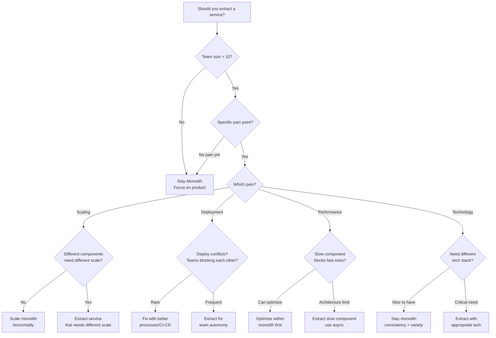

### Maturity Comparison

| Aspect | Monolith | Modular Monolith | Microservices |
|--------|----------|------------------|---------------|
| **Definition** | Single codebase, single deployment | Single deployment, clear module boundaries | Multiple deployable services |
| **Team Size** | 1-10 engineers | 10-30 engineers | 30+ engineers |
| **Deployment** | Deploy everything together | Deploy everything together | Deploy independently |
| **Scaling** | Scale entire app | Scale entire app | Scale services independently |
| **Complexity** | Low - one codebase | Medium - enforce boundaries | High - distributed system |
| **Debugging** | Easy - stack traces work | Easy - still one process | Hard - spans multiple services |
| **Data** | Single database, ACID | Single database, logical separation | Multiple databases, eventual consistency |
| **Best For** | Speed of development | Growing team with domain clarity | Multiple teams, heterogeneous scaling |

---

## Stage 1: The Monolith

**Everything in one codebase, one deployment, one database.**

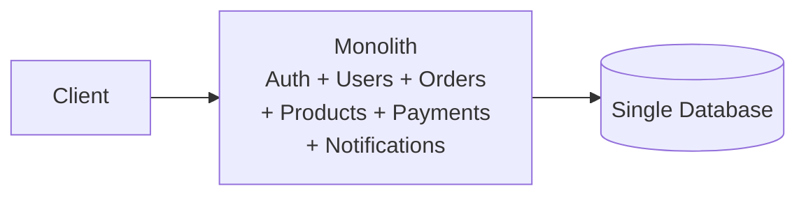

**This is FINE for:**
- Startups (ship fast, iterate fast)
- Small teams (1-10 engineers)
- New products (requirements are changing weekly)

**Advantages:** Simple deployment, easy debugging, no network overhead between components, one DB transaction for everything.

**The problem that hits:** 15 engineers, all committing to one repo. Merge conflicts daily. Deploying a typo fix in notifications requires deploying the entire app. One buggy payment module crashes the user profile page.

---

## Stage 2: Modular Monolith

**Still one codebase, but with well-defined module boundaries.**

```
monolith/
  modules/
    auth/        (own models, services, routes)
    users/       (own models, services, routes)
    orders/      (own models, services, routes)
    payments/    (own models, services, routes)
    notifications/
  shared/
    database.py
    middleware.py
```

**Rules:**
- Modules communicate through defined interfaces (not direct DB access)
- Each module owns its tables
- No cross-module imports of internal classes

**Key win:** Code is organized. Teams can work on modules independently. Still simple to deploy and debug.
**Why this before microservices?** If you can't build a clean monolith, you can't build clean microservices. Module boundaries become service boundaries later.

**The problem that hits:** Payments module needs to scale to 10x during sales. Can't scale just payments — must scale entire monolith. Notifications are slow and block the order flow.

---

## Stage 3: Extract First Service (Auth)

**Start with the least risky, most independent service.**

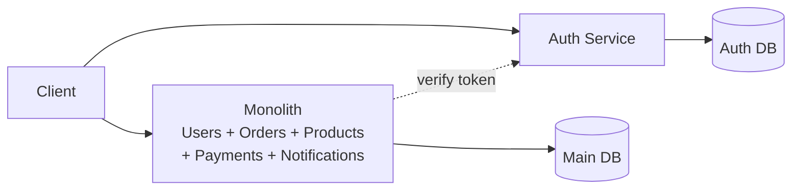

**Why auth first?**
- Clear, well-defined API (login, logout, verify token)
- Independent — doesn't need data from other modules
- High reuse — every service will need auth
- Low risk — well-understood problem

**Pattern:** Strangler Fig — new service handles auth requests, monolith gradually stops handling them.

---

## Stage 4: API Gateway

**Clients shouldn't know about your internal service topology.**

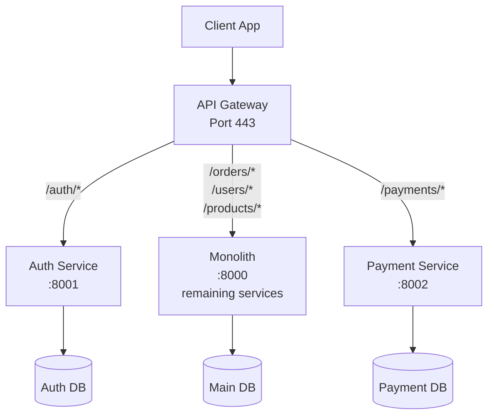

### API Gateway Deep Dive

**The [[02_building_blocks/api_gateway|API Gateway]] handles:**

**1. Routing:**
- `/auth/*` → Auth Service
- `/payments/*` → Payment Service
- Everything else → Monolith
- Path-based, header-based, or method-based routing

**2. Authentication & Authorization:**
- Verify JWT at gateway (single point)
- Extract user info, pass to services in headers
- Services trust gateway, don't re-authenticate

**3. Cross-Cutting Concerns:**
- Rate limiting: Prevent abuse centrally
- Request/response logging: Single place for observability
- SSL termination: Handle HTTPS at edge
- Response caching: Cache common responses

**4. API Composition (Advanced):**
```
Client: GET /dashboard
Gateway:
  1. Calls Auth Service → user info
  2. Calls Order Service → recent orders
  3. Calls Notification Service → unread count
  4. Aggregates → single response
```

**Gateway Options:**

| Tool | Definition | Best For |
|------|-----------|----------|
| **Kong** | Open-source API gateway with plugin ecosystem | Feature-rich, need many plugins (auth, rate limit, logging) |
| **NGINX** | High-performance web server/reverse proxy | Simple routing, already familiar with NGINX |
| **Envoy** | Cloud-native proxy from Lyft | Part of service mesh, advanced routing |
| **AWS API Gateway** | Managed service by AWS | AWS-native, serverless functions |
| **Traefik** | Cloud-native gateway with automatic service discovery | Kubernetes environments, dynamic routing |

---

## Stage 5: Service Discovery

**Services need to find each other as instances scale up/down.**

```
Order Service: "Where is Payment Service?"
Service Registry: "Payment Service has 3 instances:
  - payment-1:8080
  - payment-2:8080
  - payment-3:8080"
```

**Options:**
- **DNS-based:** Kubernetes services, AWS Cloud Map
- **Registry-based:** Consul, etcd, ZooKeeper
- **Sidecar proxy:** Envoy (service mesh)

---

## Stage 6: Event-Driven Communication

**Services communicate via events, not direct calls.**

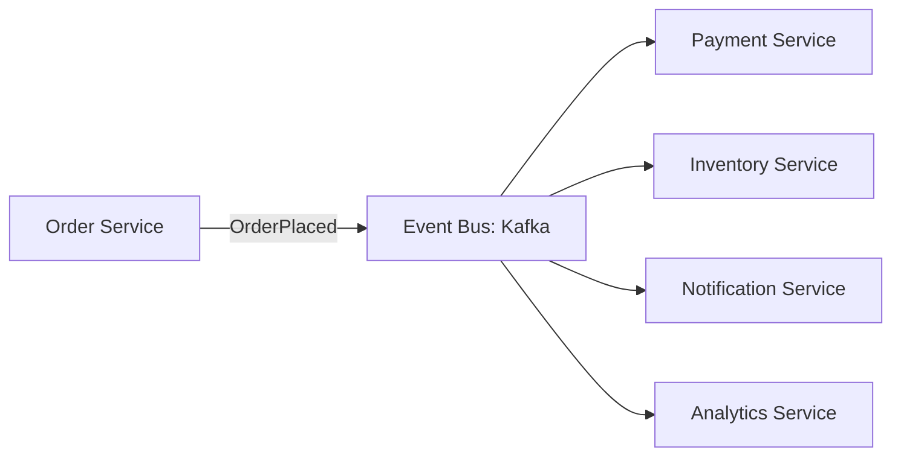

**Before (synchronous):**
```
Order → calls Payment → calls Inventory → calls Notification
If Notification is slow, Order is slow. If Inventory is down, Order fails.
```

**After (asynchronous):**
```
Order → emits "OrderPlaced" event → done (fast!)
Payment, Inventory, Notification each process the event independently
```

See [[03_design_patterns/pub_sub]], [[03_design_patterns/saga_pattern]].

---

## Stage 7: Distributed Tracing and Observability

**With 15 services, debugging is impossible without observability.**

### The Three Pillars of Observability

**1. Metrics (Numbers over time):**
- **Definition:** Numerical measurements aggregated over time intervals
- **Purpose:** Show trends, trigger alerts, capacity planning
- **Examples:** Request rate (QPS), error rate (%), latency (P50, P95, P99), CPU/memory usage
- **Tool:** Prometheus (collection) + Grafana (visualization)

**2. Logs (Event records):**
- **Definition:** Timestamped records of discrete events that happened
- **Purpose:** Detailed debugging, audit trails, understanding what happened
- **Examples:** "User 123 logged in", "Payment failed: insufficient funds", "DB connection timeout"
- **Tool:** ELK Stack (Elasticsearch, Logstash, Kibana) or Loki

**3. Traces (Request journey):**
- **Definition:** Track a single request's path through multiple services with timing for each step
- **Purpose:** Understand service dependencies, find bottlenecks, debug distributed transactions
- **Tool:** Jaeger, Zipkin, AWS X-Ray

### Distributed Trace Example

```
Trace ID: abc-123-def
Request: GET /checkout
Total: 637ms

├── API Gateway (2ms)
│   └── Validate request, route to Order Service
│
├── Auth Service (15ms)
│   ├── Verify JWT (5ms)
│   └── DB: Check user status (10ms)
│
├── Order Service (120ms)
│   ├── Cache: Get user cart (1ms) ✓ HIT
│   ├── DB: Fetch product details (45ms)
│   ├── Call Inventory Service (60ms)
│   │   └── DB: Check stock (55ms)
│   └── Create order record (14ms)
│
├── Payment Service (500ms) ← BOTTLENECK
│   ├── DB: Get payment method (15ms)
│   ├── External: Stripe API (480ms) ⚠️ SLOW
│   └── DB: Record transaction (5ms)
│
└── Notification Service (async, not blocking)
    └── Queued: "Order confirmation email"
```

### Correlation ID Pattern

**Correlation ID (Trace ID):**
- **Definition:** A unique identifier generated for each request and passed through all services involved in handling it
- **Purpose:** Connect logs, metrics, and traces across services to understand a single request's journey
- **How it works:**
  1. API Gateway generates UUID: `req-abc-123`
  2. Passes in HTTP header: `X-Correlation-ID: req-abc-123`
  3. Every service logs this ID with every action
  4. Can query logs across all services: "Show me everything for req-abc-123"

```
Gateway log:  [req-abc-123] Routing to Order Service
Order log:    [req-abc-123] Creating order for user 456
Payment log:  [req-abc-123] Charging card ending in 1234
Notify log:   [req-abc-123] Sending confirmation email
```

### Monitoring Dashboard Essentials

```
┌─────────────────────────────────────────────────────────────┐
│  SERVICE HEALTH DASHBOARD                                   │
├─────────────────────────────────────────────────────────────┤
│                                                             │
│  Request Rate (QPS)                    ▲ 1,247/sec         │
│  Definition: Queries per second                            │
│  ████████████████████░░░░░░░░ (60% of capacity)           │
│  Alert: > 2,000/sec (80% capacity)                         │
│                                                             │
│  Error Rate                            ⚠ 0.2%              │
│  Definition: % of requests returning 4xx or 5xx            │
│  ████░░░░░░░░░░░░░░░░░░░░░ (within SLO)                   │
│  Alert: > 1% (SLO breach)                                  │
│                                                             │
│  P50 Latency                           ✓ 45ms              │
│  Definition: 50% of requests faster than this              │
│                                                             │
│  P95 Latency                           ✓ 180ms             │
│  Definition: 95% of requests faster than this              │
│                                                             │
│  P99 Latency                           ⚠ 450ms             │
│  Definition: 99% of requests faster than this              │
│  Alert: > 500ms (degraded experience)                      │
│                                                             │
│  Service Dependencies                                       │
│  ┌──────────┐    ┌──────────┐    ┌──────────┐            │
│  │  Order   │───>│ Payment  │───>│ External │            │
│  │  (2ms)   │    │ (500ms)  │    │  (480ms) │⚠           │
│  └──────────┘    └──────────┘    └──────────┘            │
│                                                             │
└─────────────────────────────────────────────────────────────┘
```

**Key Metrics Explained:**

- **QPS (Queries Per Second):** Rate of incoming requests - indicates load on system
- **Error Rate:** Percentage of failed requests - main health indicator
- **P50 (Median):** Half of requests are faster, half are slower - typical experience
- **P95:** 95% of requests are this fast - catches most users
- **P99:** 99% of requests are this fast - finds edge cases and outliers
- **Apdex Score:** (Satisfied + Tolerating/2) / Total - user satisfaction metric

**Alerting Strategy:**

```
IF P99 latency > 500ms for 5 minutes
  THEN Page on-call engineer
  REASON: Users experiencing slow responses

IF Error rate > 1% for 2 minutes
  THEN Create incident ticket
  REASON: SLO breach, affects reliability

IF Service dependency down
  THEN Trigger circuit breaker
  REASON: Prevent cascade failure
```

**Tools:** Jaeger/Zipkin for tracing, Prometheus/Grafana for metrics, ELK for logs.
**See:** [[02_building_blocks/monitoring_and_logging]] for complete monitoring setup.

---

## Stage 8: Service Mesh

**Infrastructure-level handling of service-to-service communication.**

### Service Mesh Architecture

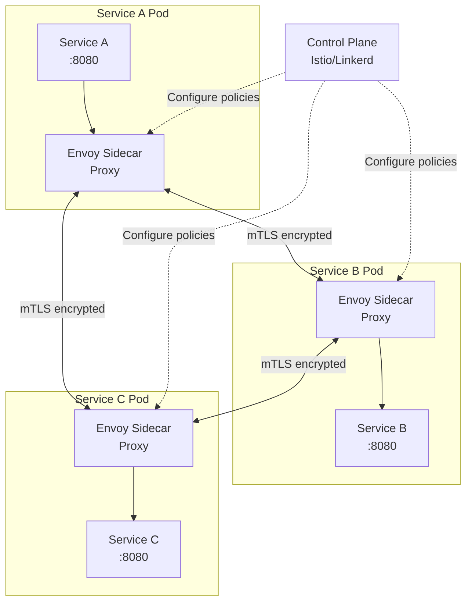

### Service Mesh Deep Dive

**What the mesh handles (without changing application code):**

**1. Security (mTLS):**
- **Definition:** Mutual TLS - both client and server authenticate each other using certificates
- **Purpose:** Encrypt all service-to-service traffic, verify service identity
- **How it works:** Sidecar proxy handles certificate rotation, encryption, verification transparently
- **Without mesh:** Each service implements TLS, manages certificates, handles rotation

**2. Reliability (Retries, Timeouts, Circuit Breaking):**
- **Retries:** Automatically retry failed requests (exponential backoff)
- **Timeouts:** Enforce max wait time per request (prevent hanging)
- **Circuit Breaking:** Stop sending requests to failing service (fail fast)
- **Without mesh:** Each service implements retry logic, different behaviors

**3. Observability (Automatic Metrics):**
- **Metrics:** Request rate, error rate, latency - automatically collected
- **Traces:** Distributed tracing spans - automatically generated
- **Logs:** Access logs for every request
- **Without mesh:** Each service instruments manually, inconsistent formats

**4. Traffic Management:**
- **Load Balancing:** Distribute requests across instances (round-robin, least-request)
- **Traffic Splitting:** A/B testing, canary deployments (90% v1, 10% v2)
- **Fault Injection:** Test resilience by injecting delays/failures
- **Without mesh:** Configure in each service or load balancer

### Service Mesh Components

**Data Plane (Sidecar Proxies):**
- **Definition:** Lightweight proxies deployed alongside each service instance
- **Role:** Intercepts all network traffic in/out of service
- **Common proxy:** Envoy (from Lyft, powers Istio, Linkerd, Consul Connect)
- **Memory overhead:** ~50-100MB per sidecar
- **Latency overhead:** ~1-3ms per hop

**Control Plane:**
- **Definition:** Centralized component that configures and manages all sidecar proxies
- **Role:** Push policies (retries, timeouts, routes), collect telemetry
- **Common platforms:**
  - **Istio:** Full-featured, complex, large community
  - **Linkerd:** Simpler, faster, less features
  - **Consul Connect:** From HashiCorp, integrates with Consul service registry

### Service Mesh vs. API Gateway

| Aspect | API Gateway | Service Mesh |
|--------|-------------|--------------|
| **Location** | Edge (client to backend) | Internal (service to service) |
| **Purpose** | Client-facing API management | Service-to-service communication |
| **Features** | Routing, auth, rate limiting, API composition | mTLS, retries, circuit breaking, observability |
| **Scope** | North-South traffic (external → internal) | East-West traffic (internal ↔ internal) |
| **Example** | Kong, AWS API Gateway, NGINX | Istio, Linkerd, Consul Connect |

**You need both:** API Gateway for external traffic, Service Mesh for internal traffic.

### When You Need a Service Mesh

```
IF you have:
  ✓ 20+ microservices
  ✓ Need consistent security policies (mTLS everywhere)
  ✓ Complex traffic management (canary, A/B testing)
  ✓ Observability requirements (trace all requests)
  ✓ Multiple teams deploying services

THEN: Service Mesh is worth the complexity

IF you have:
  ✗ < 10 services
  ✗ Simple request patterns
  ✗ Limited need for advanced routing

THEN: Service Mesh is overkill - use API Gateway + client libraries
```

**Tools:** Istio (most popular), Linkerd (simpler), Consul Connect.

**When you need it:** 20+ services, need consistent security/retry/observability policies across all services.

---

## Troubleshooting Common Migration Problems

### Problem 1: Distributed Transactions

**Scenario:** Order Service creates order, Payment Service charges card, Inventory Service decrements stock. What if Payment succeeds but Inventory fails?

**The Challenge:**
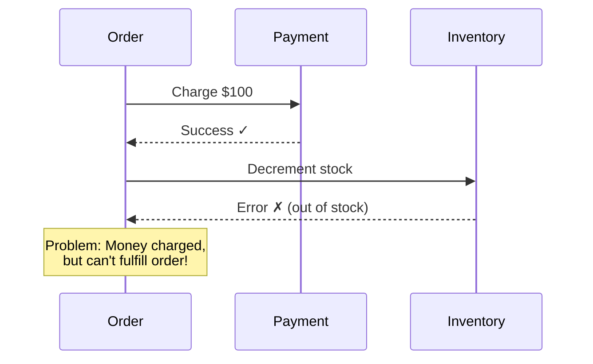

**Solution 1: Saga Pattern (Choreography)**
- **Definition:** Break transaction into local transactions with compensating actions
- **How it works:** Each service commits locally, publishes event; if step fails, execute compensating transactions to undo
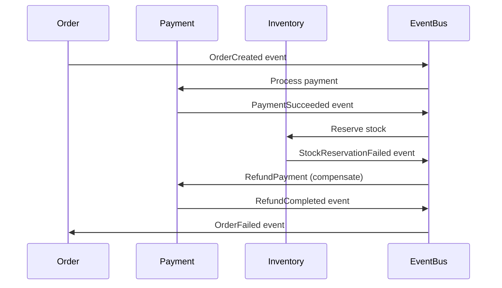

**Solution 2: Saga Pattern (Orchestration)**
- **Definition:** Central orchestrator controls the saga, explicitly calls compensations
```
Orchestrator decides:
1. Create order (local transaction)
2. Call Payment → Success
3. Call Inventory → Failure
4. Call Payment.refund() (compensating action)
5. Mark order as failed
```

**See:** [[03_design_patterns/saga_pattern]] for full implementation details.

---

### Problem 2: Data Consistency

**Scenario:** Order Service has customer data, User Service has customer data. They diverge.

**The Challenge:**
- Monolith: Update in one transaction, always consistent
- Microservices: Two databases, can't use ACID transaction

**Solutions:**

**Option A: Single Source of Truth**
```
User Service owns ALL customer data
Order Service stores only user_id (foreign key)
When Order needs customer data:
  → Call User Service API (synchronous)
  → Or subscribe to User events (eventual consistency)
```

**Option B: Eventual Consistency with Events**
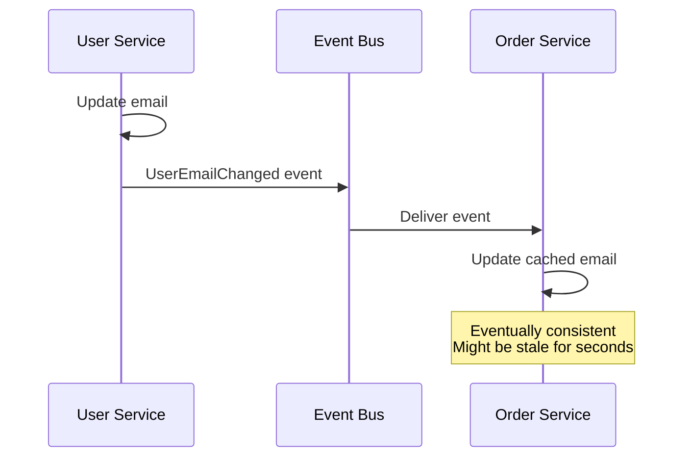

**Choose based on:**
- **Need real-time accuracy?** → API call (synchronous)
- **Can tolerate staleness?** → Event-driven (async, faster)

**Option C: Event Sourcing**
- **Definition:** Store all changes as events, rebuild state by replaying events
- **Purpose:** Single source of truth (event log), enables time travel, audit trail
- **How it works:**
```
Instead of: UPDATE users SET email = 'new@email.com'
Store event: {type: "UserEmailChanged", userId: 123, email: "new@email.com", timestamp: ...}

Any service can replay events to rebuild state
```

---

### Problem 3: Service Discovery Failures

**Scenario:** Service A can't reach Service B after deployment.

**Troubleshooting Flow:**
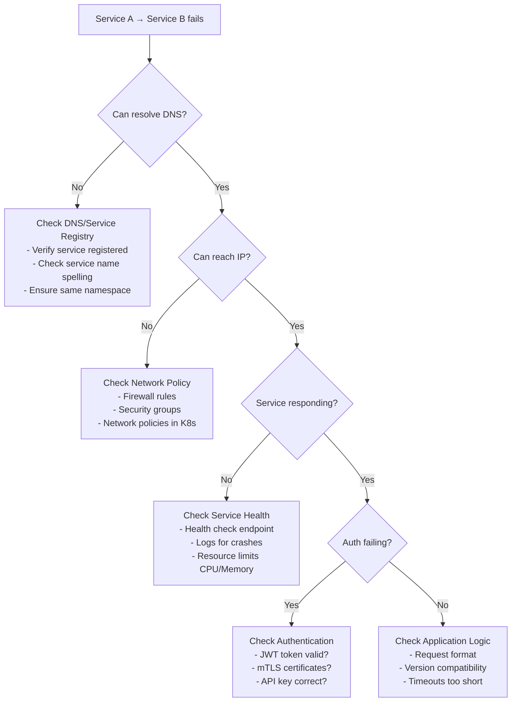

**Debugging Commands:**
```bash
# 1. Check if service is registered
kubectl get svc <service-name>
consul catalog services

# 2. Check DNS resolution
nslookup <service-name>
dig <service-name>

# 3. Check network connectivity
curl http://<service-name>:<port>/health
telnet <service-ip> <port>

# 4. Check service logs
kubectl logs <pod-name>
tail -f /var/log/<service>.log | grep ERROR

# 5. Trace request path
# Add X-Correlation-ID header, follow through logs
curl -H "X-Correlation-ID: test-123" http://api/endpoint
grep "test-123" */logs/*.log
```

---

### Problem 4: Cascading Failures

**Scenario:** Payment Service is slow (5 sec timeout). Order Service waits, blocks threads. Soon Order Service is down too.

**The Challenge:**
```
Payment Service slow (5s)
  ↓
Order Service threads blocked waiting
  ↓
Order Service thread pool exhausted
  ↓
API Gateway waits for Order Service
  ↓
Entire system slows/crashes
```

**Solution: Circuit Breaker Pattern**
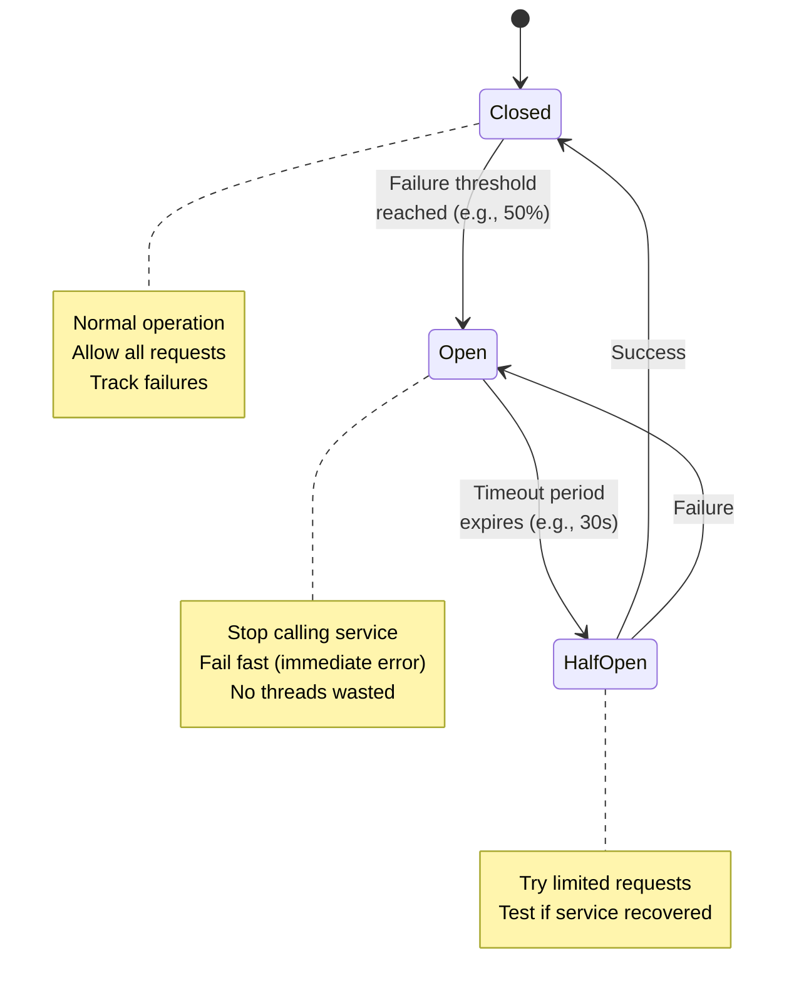

**Implementation:**
```python
circuit_breaker = CircuitBreaker(
    failure_threshold=50,      # Open after 50% failures
    timeout=30,                # Try again after 30s
    expected_exception=TimeoutError
)

@circuit_breaker
def call_payment_service(order_id):
    response = requests.post(
        'http://payment-service/charge',
        json={'order_id': order_id},
        timeout=2  # Fail fast, don't wait forever
    )
    return response.json()

# If circuit is open:
# - Raises CircuitBreakerError immediately
# - Doesn't waste thread waiting
# - Order Service can return: "Payment unavailable, order queued"
```

**Additional Protection: Timeouts & Bulkheads**
- **Timeout:** Max wait time per request (prevent hanging)
- **Bulkhead:** Separate thread pools per dependency (one slow service doesn't consume all threads)

**See:** [[03_design_patterns/circuit_breaker]] for full implementation.

---

## When to Stay Monolith

| Stay Monolith | Consider Microservices |
|---------------|----------------------|
| < 10 engineers | 10+ engineers on same codebase |
| Requirements changing fast | Stable, well-understood domains |
| Single team | Multiple teams with clear ownership |
| Simple scaling needs | Different components need different scaling |
| Speed of development matters most | Independent deployment matters most |

**Warning signs you extracted too early:**
- Services constantly need to change together (not actually independent)
- Distributed transactions everywhere (data should be in one service)
- More time on infrastructure than features
- Team is small but managing 20 services

## Real-World Migration Examples

### Example 1: Netflix - From DVD Rental Monolith to Streaming Microservices

**Problem Definition:**
- 2008: DVD rental business with monolithic Java application on Oracle database
- Oracle database was single point of failure - outages cost millions
- Couldn't scale to streaming demand (different traffic patterns than DVD rental)
- 2008 major database corruption took service down for 3 days

**Migration Journey:**

**Phase 1 (2009-2011): Move to Cloud**
```
Before (Data Center):
┌─────────────────────────────────┐
│      Monolithic Java App        │
│  (DVD rental + early streaming) │
└────────────┬────────────────────┘
             │
      ┌──────▼──────┐
      │   Oracle DB │ ← Single point of failure
      └─────────────┘

After (AWS):
┌─────────────────────────────────┐
│      Monolithic Java App        │
│    (Now on AWS EC2)             │
└────────────┬────────────────────┘
             │
      ┌──────▼──────────┐
      │   SimpleDB      │ ← Distributed, but still one DB
      └─────────────────┘
```

**Phase 2 (2011-2016): Break into Microservices**
```
Client Apps ──> API Gateway (Zuul)
                     │
        ┌────────────┼────────────┐
        │            │            │
    ┌───▼───┐   ┌───▼────┐  ┌───▼────┐
    │ User  │   │Billing │  │Video   │  ... 700+ services
    │Service│   │Service │  │Playback│
    └───┬───┘   └───┬────┘  └───┬────┘
        │           │           │
    ┌───▼───┐   ┌───▼───┐   ┌───▼───┐
    │ User  │   │Billing│   │Video  │
    │  DB   │   │  DB   │   │  DB   │
    └───────┘   └───────┘   └───────┘
```

**Key Decisions:**
- **Extracted first:** User authentication (Zuul API Gateway) - clear boundaries, used by all services
- **Service discovery:** Eureka (built in-house) - dynamic service registration
- **Circuit breaker:** Hystrix (built in-house) - prevent cascading failures
- **Event-driven:** Apache Kafka for async communication between services

**Technical Terms Used:**
- **Zuul:** Netflix's API Gateway for routing and filtering
- **Eureka:** Service discovery registry - tracks service instances
- **Hystrix:** Circuit breaker library - implements fallback logic
- **Ribbon:** Client-side load balancer
- **EVCache (Ephemeral Volatile Cache):** Distributed in-memory cache built on Memcached

**Results:**
- **Availability:** From 99.9% (3 days downtime/year) to 99.99% (52 minutes/year)
- **Scale:** Handles 200M+ subscribers, billions of requests/day
- **Deployment velocity:** Teams deploy independently, hundreds of deployments/day
- **Resilience:** Regional outages don't take down entire service (multi-region active-active)

**Lessons Learned:**
1. **Build tools for microservices:** Open-sourced Netflix OSS (Zuul, Eureka, Hystrix) because tooling didn't exist
2. **Chaos engineering:** Built Chaos Monkey to randomly kill services - test resilience in production
3. **Observability is critical:** Built Atlas (metrics), distributed tracing from day one
4. **Don't do it too early:** Started as monolith, migrated only when pain was real

---

### Example 2: Uber - From Monolithic Python to Go Microservices

**Problem Definition:**
- 2013: Single Python monolith handling dispatch, billing, payments, maps
- Global expansion stalled by monolith - couldn't scale to new cities fast enough
- Tight coupling - changing dispatch logic required full regression testing of billing
- Deployment took hours, blocked by other teams

**Migration Journey:**

**Before (2013):**
```
┌──────────────────────────────────────────────┐
│          Python Monolith                     │
│  ┌─────────┐  ┌──────┐  ┌─────────┐        │
│  │Dispatch │  │Billing│  │Payments │        │
│  └────┬────┘  └───┬──┘  └────┬────┘        │
│       │           │           │              │
│       └───────────┴───────────┘              │
│              Shared DB                        │
└──────────────────────────────────────────────┘
```

**After (2018):**
```
                API Gateway
                     │
        ┌────────────┼────────────┬──────────┐
        │            │            │          │
    ┌───▼───┐   ┌───▼────┐  ┌───▼────┐  ┌──▼──────┐
    │Dispatch│   │ Maps   │  │Billing │  │Payments │  ... 2,200+ services
    │(Go)    │   │(Java)  │  │(Go)    │  │(Java)   │
    └───┬────┘   └───┬────┘  └───┬────┘  └───┬─────┘
        │            │           │           │
     Dispatch      Maps       Billing    Payments
       DB           DB          DB          DB
```

**Key Decisions:**
- **Rewrite in Go:** Python too slow for high-throughput dispatch; Go for performance + concurrency
- **Domain-driven design:** Bounded contexts - Dispatch, Trip, Maps, Billing, Payments
- **Service boundaries:** By business capability, not technical layers
- **Data ownership:** Each service owns its database schema - no shared database

**Technical Terms Used:**
- **TChannel:** Uber's RPC framework (later moved to gRPC)
- **Ringpop:** Consistent hashing for service discovery and coordination
- **Cadence:** Workflow orchestration engine for distributed sagas
- **Jaeger:** Distributed tracing (donated to CNCF by Uber)

**Challenges Faced:**

**1. Distributed Tracing:**
- **Problem:** With 2,200+ services, debugging "why is trip slow?" was impossible
- **Solution:** Built Jaeger (open-sourced) - distributed tracing system
- **Result:** Can trace single trip request through 40+ service calls, find bottleneck

**2. Consistent Dispatch State:**
- **Problem:** Driver state changes (available → assigned → trip started) must be consistent
- **Solution:** Built Cadence - workflow engine that guarantees state transitions even with failures
- **Result:** No lost trips, reliable state machine across services

**Results:**
- **Scale:** From 1 city to 600+ cities globally
- **Deployment:** From 1 deploy/week to hundreds/day
- **Team velocity:** Independent teams deploy without coordination
- **Performance:** Dispatch latency from 1 second to <100ms (Go + microservices)

**Lessons Learned:**
1. **Don't extract prematurely:** Stayed monolith until they had 100+ engineers
2. **Extract by business domain:** Not by technical layers (don't split "user API" from "user DB logic")
3. **Build foundational tools first:** Service discovery, RPC framework, observability before extracting services
4. **Data consistency is hard:** Invested heavily in Cadence (workflow engine) for distributed sagas

---

### Example 3: Amazon - From Monolith to Service-Oriented Architecture

**Problem Definition:**
- Early 2000s: Retail monolith called "Obidos" - all of Amazon.com in one codebase
- Couldn't scale teams - merge conflicts, deployment bottlenecks, tight coupling
- New features took months because of dependencies on other teams' code
- Database became single point of contention - lock conflicts, slow queries

**Migration Journey (2001-2006):**

**2001: The Mandate**
- Jeff Bezos memo: "All teams will expose data and functionality through service interfaces"
- No more direct database access between teams
- Services must be designed to be externalizable (could become public API)

**Before:**
```
┌─────────────────────────────────────────────────────┐
│                 Obidos Monolith                     │
│                                                     │
│  ┌─────────┐  ┌──────┐  ┌─────────┐  ┌─────────┐ │
│  │ Product │──│Orders│──│Inventory│──│Payments │ │
│  │Catalog  │  │      │  │         │  │         │ │
│  └────┬────┘  └──┬───┘  └────┬────┘  └────┬────┘ │
│       │          │           │            │       │
│       └──────────┴───────────┴────────────┘       │
│              Shared Oracle Database               │
└─────────────────────────────────────────────────────┘
```

**After (2006):**
```
        ┌────────────────────────────────┐
        │      API Gateway Layer         │
        └────────────┬───────────────────┘
                     │
     ┌───────────────┼───────────────┬───────────┐
     │               │               │           │
┌────▼─────┐  ┌─────▼────┐  ┌──────▼─────┐  ┌──▼──────┐
│ Product  │  │  Orders  │  │ Inventory  │  │Payments │
│ Catalog  │  │  Service │  │  Service   │  │ Service │
│ Service  │  │          │  │            │  │         │
└────┬─────┘  └─────┬────┘  └──────┬─────┘  └──┬──────┘
     │              │              │            │
  ┌──▼──┐       ┌───▼──┐      ┌───▼──┐     ┌──▼──┐
  │ DB  │       │  DB  │      │  DB  │     │ DB  │
  └─────┘       └──────┘      └──────┘     └─────┘
```

**Key Decisions:**
- **Two-pizza teams:** Teams small enough to feed with two pizzas (5-10 people)
- **Service ownership:** Each team owns service end-to-end (code, deployment, on-call)
- **No shared code:** Services can't share libraries that enforce coupling
- **API contracts:** Well-defined interfaces, versioned, backward compatible

**Technical Terms Used:**
- **SOA (Service-Oriented Architecture):** Architecture style focusing on services as primary building blocks
- **Two-Pizza Teams:** Amazon's organizational principle - keep teams small for autonomy
- **API-first design:** Design API before implementation, treat as external API
- **Backward compatibility:** New versions must not break existing clients

**Challenges Faced:**

**1. Distributed Monolith (Anti-pattern):**
- **Problem:** Early services still tightly coupled - changes required changing multiple services
- **Mistake:** Split services by technical layers (API Service → Logic Service → Data Service)
- **Fix:** Reorganize by business capabilities (Product, Order, Inventory)

**2. Service Discovery at Scale:**
- **Problem:** With 1,000+ services, how do services find each other?
- **Solution:** Internal service registry + DNS
- **Evolution:** Later became AWS Service Discovery

**3. Data Consistency:**
- **Problem:** Can't use database transactions across services
- **Solution:** Event-driven architecture - services publish state changes, consumers react
- **Tool:** Amazon SQS (Simple Queue Service) for async messaging

**Results:**
- **Team velocity:** Teams deploy independently, release cycle from months to days
- **Innovation:** Enabled Amazon Web Services (AWS) - internal services became external products
- **Scale:** From thousands to millions of transactions per second
- **Availability:** Improved reliability through isolation - service failures don't cascade

**Lessons Learned:**
1. **Organization drives architecture:** Conway's Law - team structure determines system architecture
2. **Bounded context is key:** Services that match business domains, not technical layers
3. **API-first thinking:** Designing APIs as if they'll be public forces good design
4. **Operational ownership:** Teams own services in production - "you build it, you run it"

**Legacy Impact:**
- Amazon's migration pioneered many microservices patterns
- AWS products (ECS, Lambda, API Gateway) built from internal tools
- Two-pizza team model adopted by tech industry

---

## Migration Decision Framework

### Should You Extract This Service?

```
┌─────────────────────────────────────────────────────┐
│  Service Extraction Decision Checklist              │
├─────────────────────────────────────────────────────┤
│                                                     │
│  ✓ Clear Bounded Context                           │
│    Can you define what this service owns?          │
│                                                     │
│  ✓ Independent Change Rate                         │
│    Does it change independently from other code?   │
│                                                     │
│  ✓ Different Scaling Requirements                  │
│    Does it need to scale differently?              │
│                                                     │
│  ✓ Team Ownership                                  │
│    Can one team own it end-to-end?                 │
│                                                     │
│  ✓ Well-Defined API                                │
│    Can you define clear inputs/outputs?            │
│                                                     │
│  ✓ Limited Dependencies                            │
│    Doesn't need data from many other services?     │
│                                                     │
│  ✓ Monitoring & Tooling Ready                      │
│    Have you built observability infrastructure?    │
│                                                     │
└─────────────────────────────────────────────────────┘

IF checked 5+ boxes: Extract
IF checked 3-4 boxes: Consider, but not urgent
IF checked < 3 boxes: Stay in monolith
```

---

## Key Lessons

1. **Start with a monolith.** Extract services only when you feel the pain.
2. **Modular monolith first.** Clean boundaries → clean services later.
3. **Extract the easiest service first.** Build confidence and infrastructure.
4. **Events over direct calls.** Decoupling is the whole point.
5. **Invest in observability early.** You can't debug what you can't see.
6. **Learn from giants.** Netflix, Uber, Amazon all started with monoliths and migrated incrementally.
7. **Organization matters.** Conway's Law - your architecture reflects your team structure.
8. **Don't create a distributed monolith.** Services must be truly independent, not just physically separated.

## Quick Reference Glossary

| Term | Definition | When You'll See It |
|------|------------|-------------------|
| **Monolith** | Single codebase, single deployment, shared database | Startups, small teams |
| **Microservices** | Independent services, separate deployments, own databases | Scale, multiple teams |
| **Bounded Context** | Domain boundary - what a service owns | Designing service boundaries |
| **API Gateway** | Single entry point for clients, routes to services | Stage 4 of migration |
| **Service Mesh** | Infrastructure layer for service communication | 20+ services, need mTLS |
| **Saga Pattern** | Distributed transaction with compensating actions | Multi-service transactions |
| **Circuit Breaker** | Stop calling failing service, fail fast | Preventing cascading failures |
| **Strangler Fig** | Gradually replace old with new | Safe migration pattern |
| **Correlation ID** | Unique ID per request, trace across services | Distributed debugging |
| **mTLS** | Mutual TLS - both sides authenticate | Service-to-service security |
| **Eventual Consistency** | Data becomes consistent over time, not immediately | Async, event-driven systems |
| **Two-Phase Commit** | Distributed transaction protocol (slow, fragile) | Legacy systems, avoid if possible |

## Links

- [[02_building_blocks/api_gateway]] — Stage 4
- [[02_building_blocks/message_queues]] — Stage 6
- [[02_building_blocks/monitoring_and_logging]] — Stage 7
- [[03_design_patterns/circuit_breaker]] — Essential for service resilience
- [[03_design_patterns/saga_pattern]] — Distributed transactions
- [[scaling_a_web_app]] — Full system scaling story
