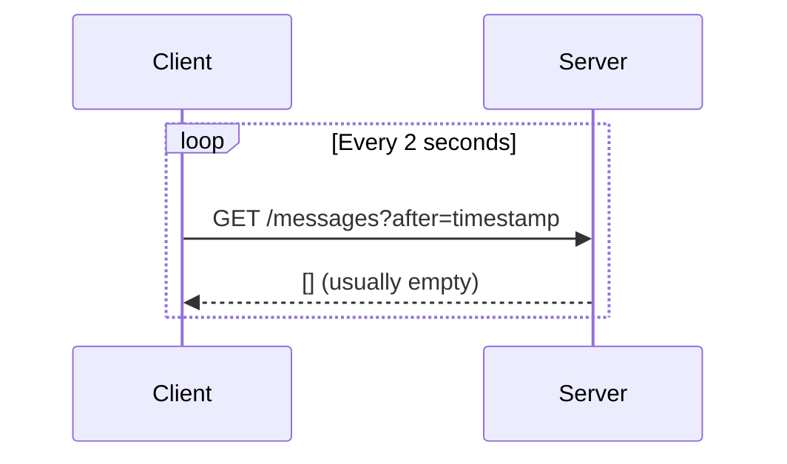
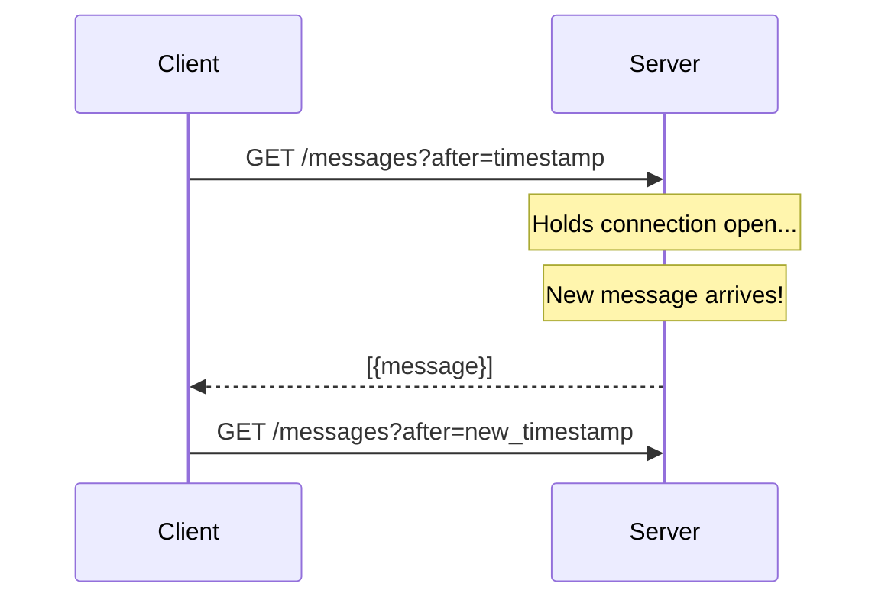
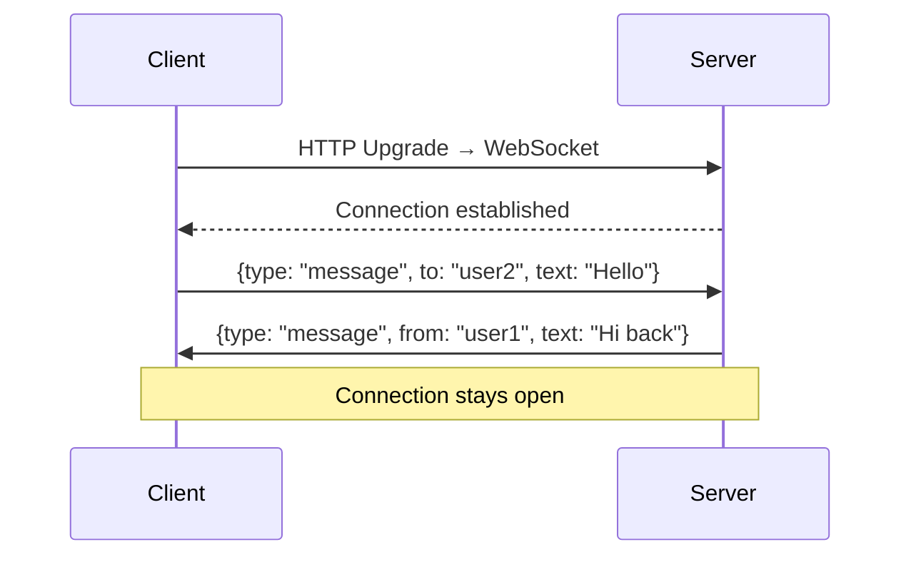
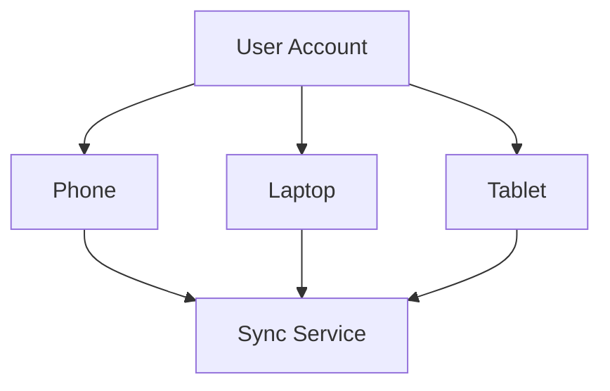
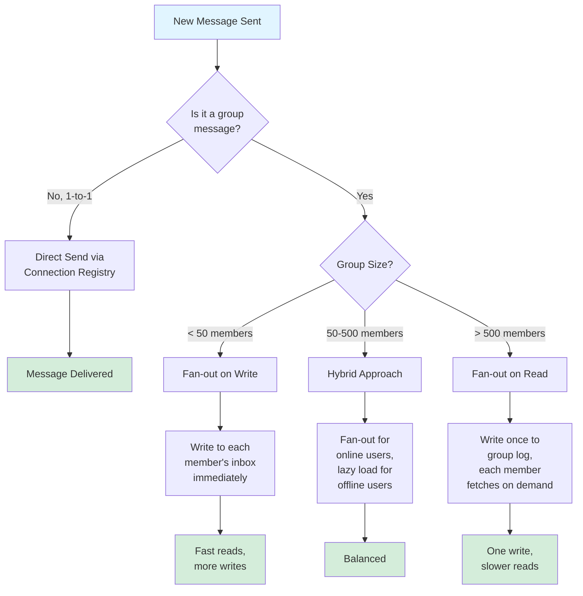
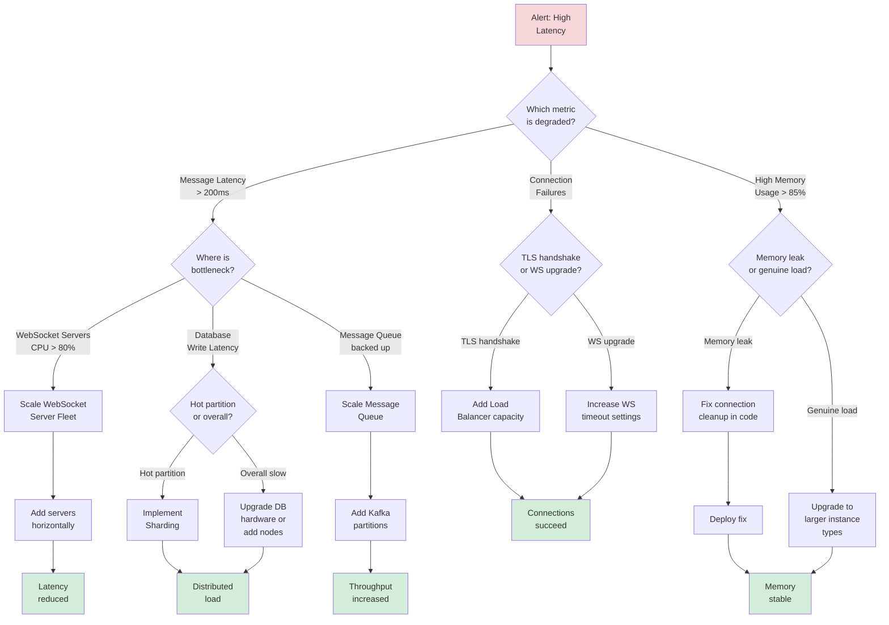
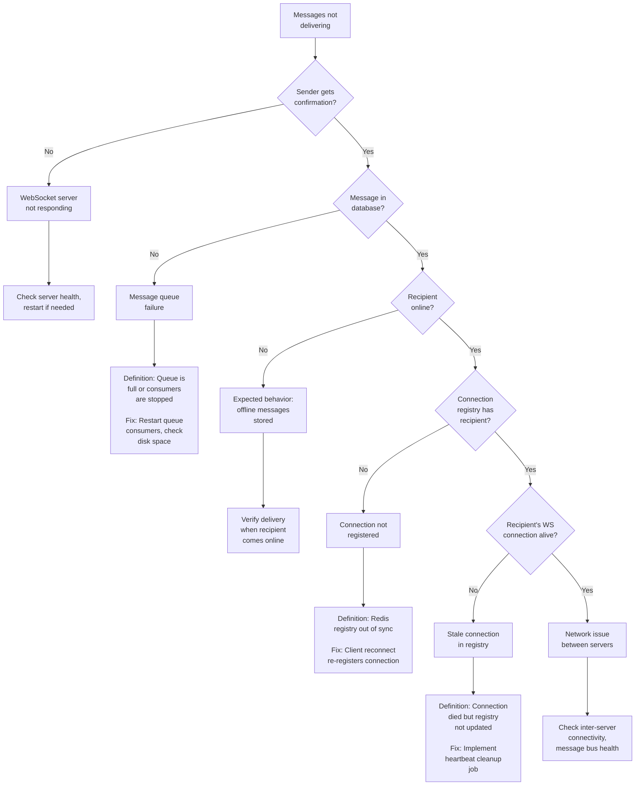

#system-design #evolution #real-time #messaging

# Scaling a Chat System: From HTTP Polling to Encrypted Real-Time Messaging

---

## Intuition (30 sec)

Building a chat system is like evolving a postal service: start with customers checking their mailbox every few minutes (HTTP polling), then have the postal worker wait at the door until mail arrives (long polling), then install a direct pneumatic tube from sender to receiver (WebSockets), and finally encrypt every letter so even the postal service can't read it (E2E encryption).

---

## Failure-First Scenario

You launch a chat app that polls the server every 2 seconds. It works great with 100 beta users. Then you go viral and hit 10,000 users. Your server suddenly receives 5,000 requests per second, 95% returning empty responses. Your AWS bill spikes from $50 to $3,000/month. Users complain messages take 2 seconds to arrive. Your database locks up from constant polling queries. You've learned the hard way why WhatsApp uses WebSockets, not polling.

---

## Key Terms & Definitions

**Core Concepts:**

- **WebSocket:** A communication protocol that provides full-duplex (bidirectional) communication channels over a single TCP connection. Unlike HTTP (request-response), WebSockets keep a persistent connection open, allowing servers to push data to clients instantly.

- **Presence:** A system feature that indicates the online/offline status of users. Implementation requires tracking connection states, heartbeats, and broadcasting status updates to relevant users.

- **Message Queue:** A component that temporarily stores messages waiting to be delivered. Messages are enqueued when sent and dequeued when delivered, providing buffering and decoupling between senders and receivers.

- **Read Receipts:** Acknowledgment signals sent by the recipient's client back to the sender, indicating message delivery status. Types include: delivered (message reached device) and read (user viewed message).

- **Fan-out:** The process of distributing a single message to multiple recipients. "Fan-out on write" copies the message to each recipient's inbox immediately. "Fan-out on read" stores once and each recipient pulls from a shared location.

- **Heartbeat:** A periodic signal sent from client to server to indicate the client is still connected and active. Typically sent every 30-60 seconds. Missing heartbeats indicate disconnection or inactivity.

- **Connection Registry:** A distributed data store (typically Redis) that maps user IDs to their current WebSocket server. Essential for routing messages to the correct server in a multi-server deployment.

- **E2E Encryption (End-to-End):** A security method where messages are encrypted on the sender's device and only decrypted on the recipient's device. The server cannot read message content, only route encrypted payloads.

---

## Visual Evolution Overview: 1 User → 1 Million Users

```mermaid
graph TD
    subgraph "1-100 Users: Simple Polling"
        U1[Users] -->|Poll every 2s| S1[Single Server]
        S1 --> DB1[(SQLite)]
    end

    subgraph "100-10K Users: Long Polling"
        U2[Users] -->|Hold connection| LB1[Load Balancer]
        LB1 --> S2A[Server 1]
        LB1 --> S2B[Server 2]
        S2A --> DB2[(PostgreSQL)]
        S2B --> DB2
    end

    subgraph "10K-100K Users: WebSockets"
        U3[Users] -->|Persistent WS| LB2[Load Balancer]
        LB2 --> WS1[WS Server 1]
        LB2 --> WS2[WS Server 2]
        WS1 --> REG[Connection Registry<br/>Redis]
        WS2 --> REG
        WS1 --> MQ[Message Queue<br/>Kafka]
        WS2 --> MQ
        MQ --> DB3[(Cassandra)]
    end

    subgraph "100K-1M Users: Distributed + Encrypted"
        U4[Users] -->|Encrypted WS| CDN[CDN + LB]
        CDN --> WSC1[WS Cluster 1<br/>US-East]
        CDN --> WSC2[WS Cluster 2<br/>EU-West]
        WSC1 --> DIST[Distributed<br/>Message Bus]
        WSC2 --> DIST
        DIST --> CACHE[Cache Layer<br/>Redis Cluster]
        DIST --> DB4[(Cassandra<br/>Multi-DC)]
        CACHE --> DB4
    end
```



**Evolution Summary:**

| Scale | Architecture | Key Addition | Cost Impact |
|-------|-------------|--------------|-------------|
| **1-100 users** | Single server, polling | Basic HTTP requests | ~$20/month |
| **100-10K users** | Load balanced, long polling | Multiple servers, held connections | ~$200/month |
| **10K-100K users** | WebSockets + message queue | Connection registry, state management | ~$2,000/month |
| **100K-1M users** | Multi-region, E2E encrypted | Geographic distribution, encryption overhead | ~$20,000/month |
| **1M+ users** | Federated, sharded | Database sharding, cross-DC sync | ~$100,000+/month |

---

## Stage 1: HTTP Polling

**Simplest approach:** Client asks "any new messages?" every 2 seconds.



**Problem:** 95% of requests return nothing. With 10K users polling every 2s = 5K useless requests/second. Wasteful, slow (up to 2s delay), and hammers the server.

---

## Stage 2: Long Polling

**Server holds the request open** until there's new data or a timeout.



**Improvement:** Near-instant delivery. No wasted empty responses. Server only responds when there's data.
**Problem:** Each held connection uses a server thread. 100K users = 100K open connections. Server-side complexity for managing held connections.

---

## Stage 3: WebSockets

**Persistent, bidirectional connection.** Server can push messages to clients instantly.



**How:** Starts as HTTP, upgrades to WebSocket. Full-duplex. Low overhead per message.
**Key challenge:** WebSocket connections are stateful — must connect to the SAME server. Need connection registry.

```
Connection Registry (Redis):
  user_123 → ws-server-7
  user_456 → ws-server-3
```

To send message to user_456: look up which server holds their connection → route message there.

**Problem:** 1-to-1 messaging works. But sending to a group chat with 500 members means 500 individual pushes.

---

## Stage 4: Fan-Out Strategy

**When a message is sent to a group, how do you deliver to all members?**

**Fan-out on write:**
```
User sends to group (500 members)
→ Write message to each member's inbox/queue
→ Each member's WebSocket server pushes from their inbox
```
- Pro: Reads are fast (pre-computed)
- Con: 500 writes per message. Celebrity group = millions of writes.

**Fan-out on read:**
```
User sends to group → Write once to group's message log
Each member pulls from group log when they come online
```
- Pro: One write per message
- Con: Reads require aggregation

**Hybrid (WhatsApp-style):** Small groups = fan-out on write. Large channels = fan-out on read.

---

## Stage 5: Presence Detection

**Show who's online.** Harder than it sounds.

**Heartbeat approach:**
```
Client sends heartbeat every 30 seconds
Server: "Last heartbeat from user_123 was 15s ago → online"
Server: "Last heartbeat from user_456 was 90s ago → offline"
```

**Scale challenge:** Showing presence in group chats. 500-member group × each member's presence updates × all other members being notified = broadcast storm.

**Solutions:**
- Only fetch presence when chat is opened (lazy loading)
- Batch presence updates (update every 30s, not real-time)
- Don't show presence in large groups (WhatsApp approach)

---

## Stage 6: Message Storage and Retrieval

**Where do messages live?**

| Approach | Database | Why |
|----------|----------|-----|
| Recent messages | Cassandra / DynamoDB | Write-heavy, time-series, partitioned by conversation_id |
| Message search | Elasticsearch | Full-text search across messages |
| Media files | S3 / Blob Storage | Images, videos, voice notes |

**Data model (Cassandra):**
```
Partition key: conversation_id
Clustering key: message_timestamp (DESC)

Query: "Get latest 50 messages for conversation X"
→ Single partition read, sorted by time. Fast.
```

**Message delivery states:**
```
Sent (✓)       → Server received the message
Delivered (✓✓)  → Recipient's device received it
Read (✓✓ blue)  → Recipient opened the conversation
```

Track via ack messages: client sends "delivered" ack, later sends "read" ack.

---

## Stage 7: Multi-Device Sync

**User has phone + laptop + tablet. All must stay in sync.**



**Challenge:** Message sent on phone must appear on laptop. Read status on laptop must sync to phone.

**Approach:** Each device maintains a cursor (last message seen). Sync service pushes updates to all devices. Conflict resolution: last-write-wins for read status, merge for message list.

---

## Stage 8: End-to-End Encryption

**Messages encrypted on sender's device, decrypted only on receiver's device.** Server can't read them.

**Signal Protocol (used by WhatsApp, Signal):**
1. Each device has public/private key pair
2. Sender encrypts with receiver's public key
3. Only receiver's private key can decrypt
4. Group chats: sender encrypts once per member (using each member's public key)
5. Key rotation: new keys for forward secrecy

**Server's role:** Route encrypted blobs. Cannot read content. Cannot comply with "give us the messages" requests.

**Trade-off:** No server-side search, no server-side spam filtering, key management complexity.

---

## Capacity Planning: Calculating System Requirements

### Definitions

**Capacity Planning:**
- **Definition:** The process of determining the computational resources (servers, databases, bandwidth) needed to meet performance targets at expected load levels.
- **Purpose:** Prevent over-provisioning (wasted money) and under-provisioning (poor performance).

**Key Metrics:**

- **QPS (Queries Per Second):** The rate at which the system receives requests. For chat systems, this includes message sends, presence updates, and message retrievals.
- **Concurrent Connections:** Number of WebSocket connections active at the same time. For chat apps, approximately equals the number of online users.
- **Message Throughput:** Number of messages the system can process per second, measured in messages/sec.
- **Peak-to-Average Ratio:** Ratio of peak traffic to average traffic. Chat systems typically have 3-5x ratio (higher during lunch/evening hours).

### Calculation Example: Scaling to 1 Million Users

```
Given Requirements:
• 1M registered users
• 20% online simultaneously (peak hours) = 200K concurrent users
• Each user sends 10 messages/day average
• Peak traffic = 5× average

Step 1: Calculate Daily Message Volume
  Total messages = 1M users × 10 messages/day = 10M messages/day

Step 2: Calculate Average QPS
  Definition: QPS = requests per second
  Average QPS = 10M ÷ 86,400 seconds = 116 messages/sec

Step 3: Account for Peak Traffic
  Definition: Peak load during busiest hour
  Peak QPS = 116 × 5 = 580 messages/sec

Step 4: Calculate WebSocket Connections
  Definition: Persistent connections to maintain
  Concurrent connections = 200K users online

Step 5: Calculate Server Requirements (WebSocket Servers)
  Assumption: 1 server handles 10K concurrent WebSocket connections
  Required servers = 200K ÷ 10K = 20 servers
  Add 50% redundancy = 30 servers total

Step 6: Calculate Database Write Capacity
  Definition: Write throughput needed
  Peak writes = 580 messages/sec
  With replication factor 3 = 1,740 writes/sec
  Cassandra nodes needed (5K writes/sec per node) = 1 node
  Add redundancy = 3-node cluster

Step 7: Calculate Bandwidth
  Definition: Data transfer capacity required
  Average message size = 1KB (text + metadata)
  Peak bandwidth = 580 KB/sec × 1024 = 594 KB/sec ≈ 5 Mbps
  Add overhead for presence, acks = 25 Mbps total

Step 8: Calculate Storage
  Definition: Long-term message storage needs
  Daily storage = 10M messages × 1KB = 10 GB/day
  1 year retention = 10 GB × 365 = 3.65 TB
  With replication factor 3 = 11 TB total
```

**Cost Estimate (AWS Pricing):**

```
Component Breakdown:

WebSocket Servers (30× c5.2xlarge):
  $0.34/hour × 30 × 730 hours = $7,446/month

Database (3-node Cassandra cluster, i3.2xlarge):
  $0.624/hour × 3 × 730 = $1,368/month

Redis Connection Registry (r5.2xlarge):
  $0.504/hour × 730 = $368/month

Load Balancer (Application LB):
  $22.50/month + data processed = ~$200/month

Data Transfer (5 TB/month):
  $0.09/GB × 5,000 = $450/month

S3 Storage (media files, 11 TB):
  $0.023/GB × 11,000 = $253/month

Total: ~$10,085/month for 1M users
Cost per user: ~$0.01/month
```

### Resource Scaling Table

| Metric | 10K Users | 100K Users | 1M Users | 10M Users |
|--------|-----------|------------|----------|-----------|
| **Concurrent Connections** | 2K | 20K | 200K | 2M |
| **Peak QPS** | 6 | 58 | 580 | 5,800 |
| **WebSocket Servers** | 1 | 3 | 30 | 300 |
| **DB Nodes** | 1 | 3 | 3 | 30 |
| **Monthly Cost** | $100 | $1,000 | $10,000 | $100,000 |

---

## Monitoring Dashboard

```
┌─────────────────────────────────────────────────────────────────┐
│  CHAT SYSTEM MONITORING DASHBOARD                               │
├─────────────────────────────────────────────────────────────────┤
│                                                                 │
│  CONNECTION METRICS                                             │
│  ════════════════════════════════════════════════════════════   │
│                                                                 │
│  Active WebSocket Connections: 187,432                          │
│  Definition: Number of currently open WS connections            │
│  Alert: > 190K (approaching capacity)                           │
│  Graph: [████████████████████░░] 93% capacity                  │
│                                                                 │
│  Connection Success Rate: 99.7%                                 │
│  Definition: % of WS handshake attempts that succeed            │
│  Alert: < 99% (connection issues)                               │
│                                                                 │
│  Average Connection Duration: 4.2 hours                         │
│  Definition: Mean time users stay connected                     │
│  Baseline: 3-5 hours typical for chat apps                      │
│                                                                 │
│─────────────────────────────────────────────────────────────────│
│                                                                 │
│  MESSAGE METRICS                                                │
│  ════════════════════════════════════════════════════════════   │
│                                                                 │
│  Messages/Second: 547                                           │
│  Definition: Rate of messages being sent through system         │
│  Peak today: 892/sec at 8:15 PM                                 │
│  Graph: [░░░░████████░░░░░░░░] Peak hours                      │
│                                                                 │
│  P50 Message Latency: 23ms                                      │
│  Definition: 50% of messages delivered within this time         │
│  Target: < 50ms (excellent UX)                                  │
│                                                                 │
│  P99 Message Latency: 145ms                                     │
│  Definition: 99% of messages delivered within this time         │
│  Alert: > 200ms (user-perceivable delay)                        │
│                                                                 │
│  Message Delivery Rate: 99.97%                                  │
│  Definition: % of messages successfully delivered               │
│  Alert: < 99.9% (reliability issue)                             │
│                                                                 │
│─────────────────────────────────────────────────────────────────│
│                                                                 │
│  PRESENCE METRICS                                               │
│  ════════════════════════════════════════════════════════════   │
│                                                                 │
│  Heartbeat Success Rate: 99.2%                                  │
│  Definition: % of heartbeats received within timeout window     │
│  Alert: < 98% (network or server issues)                        │
│                                                                 │
│  Presence Updates/Second: 1,234                                 │
│  Definition: Rate of online/offline status changes              │
│  Note: High rate indicates connection instability               │
│                                                                 │
│  False Offline Rate: 0.8%                                       │
│  Definition: % of users incorrectly marked offline              │
│  Target: < 1% (accurate presence)                               │
│                                                                 │
│─────────────────────────────────────────────────────────────────│
│                                                                 │
│  DATABASE METRICS                                               │
│  ════════════════════════════════════════════════════════════   │
│                                                                 │
│  Write Throughput: 1,247 writes/sec                             │
│  Definition: Messages being written to database                 │
│  Capacity: 5,000 writes/sec per node (3 nodes)                  │
│  Utilization: 8.3% [██░░░░░░░░░░░░░░]                          │
│                                                                 │
│  Read Latency P99: 12ms                                         │
│  Definition: 99% of message fetch queries complete in this time │
│  Alert: > 50ms (degraded performance)                           │
│                                                                 │
│  Cache Hit Rate: 94.2%                                          │
│  Definition: % of message reads served from cache (Redis)       │
│  Target: > 90% (efficient caching)                              │
│                                                                 │
│─────────────────────────────────────────────────────────────────│
│                                                                 │
│  INFRASTRUCTURE METRICS                                         │
│  ════════════════════════════════════════════════════════════   │
│                                                                 │
│  Server CPU: Avg 45%, Max 67%                                   │
│  Definition: CPU utilization across server fleet                │
│  Alert: Sustained > 80% (need scaling)                          │
│                                                                 │
│  Memory Usage: 78%                                              │
│  Definition: RAM usage (primarily for connection buffers)       │
│  Alert: > 85% (risk of OOM)                                     │
│                                                                 │
│  Network I/O: 2.3 Gbps in, 2.5 Gbps out                         │
│  Definition: Bandwidth usage for message transmission           │
│  Capacity: 10 Gbps per server                                   │
│                                                                 │
└─────────────────────────────────────────────────────────────────┘
```

**Critical Alerts Configuration:**

```yaml
alerts:
  - name: HighMessageLatency
    condition: p99_latency > 200ms for 5 minutes
    severity: critical
    definition: "Messages taking >200ms impacts UX"
    action: "Scale up WebSocket servers"

  - name: LowDeliveryRate
    condition: delivery_rate < 99.9% for 2 minutes
    severity: critical
    definition: "Messages not reaching recipients"
    action: "Check message queue health"

  - name: ConnectionCapacity
    condition: active_connections > 0.95 × max_capacity
    severity: warning
    definition: "Approaching connection limit"
    action: "Add WebSocket servers proactively"

  - name: DatabaseSlowdown
    condition: db_write_latency > 100ms
    severity: warning
    definition: "Database struggling with write load"
    action: "Check for hot partitions, consider sharding"

  - name: CacheDegradation
    condition: cache_hit_rate < 85% for 10 minutes
    severity: info
    definition: "More DB queries than expected"
    action: "Review cache TTL settings, check cache size"
```

---

## Decision Trees

### Decision Tree 1: Choosing Message Delivery Strategy



**Definitions:**
- **Fan-out on Write:** Immediately create a copy of the message in each recipient's inbox/queue. Trade-off: Fast reads (pre-computed), but high write amplification.
- **Fan-out on Read:** Write message once to a shared group log. Each user queries the log when they need messages. Trade-off: Low write cost, but reads require aggregation logic.
- **Hybrid:** Combine both approaches based on user status or group size.

### Decision Tree 2: Scaling Response Strategy



### Decision Tree 3: Protocol Selection

```
START: Designing real-time feature
│
├─ Question 1: Do you need server-to-client push?
│  │
│  ├─ NO → HTTP REST API
│  │       Definition: Request-response only
│  │       Use case: Traditional CRUD operations
│  │
│  └─ YES → Continue
│
├─ Question 2: Is latency critical (< 100ms required)?
│  │
│  ├─ NO → HTTP Long Polling
│  │       Definition: Server holds request until data available
│  │       Use case: Notifications, infrequent updates
│  │       Latency: 1-5 seconds acceptable
│  │
│  └─ YES → Continue
│
├─ Question 3: Is it high-frequency bidirectional communication?
│  │
│  ├─ NO → Server-Sent Events (SSE)
│  │       Definition: One-way push from server to client
│  │       Use case: Live feeds, stock tickers
│  │       Limitation: Client-to-server still uses HTTP
│  │
│  └─ YES → WebSockets
│           Definition: Full-duplex, persistent connection
│           Use case: Chat, gaming, collaborative editing
│           Latency: 10-50ms typical
│
└─ Question 4: Do you need UDP-level control?
   │
   ├─ NO → Stick with WebSockets
   │
   └─ YES → WebRTC
           Definition: Peer-to-peer with UDP transport
           Use case: Video/audio calls, screen sharing
           Latency: < 50ms
```

---

## Troubleshooting Guide

### Problem 1: Messages Not Delivering



### Problem 2: High Latency

**Diagnostic Steps:**

```
Step 1: Measure where latency occurs
┌─────────────────────────────────────────┐
│ Latency Breakdown Tool                  │
├─────────────────────────────────────────┤
│ Client → Load Balancer: 5ms             │
│ Load Balancer → WS Server: 3ms          │
│ WS Server processing: 145ms  ← PROBLEM  │
│ WS Server → Recipient: 2ms              │
│ Total: 155ms                            │
└─────────────────────────────────────────┘

Definition: WS Server processing time
= Time to write to DB + queue + route

Step 2: Check server metrics
$ top
  PID  CPU%  Command
  123  95%   ws-server  ← CPU bound

Diagnosis: Server overloaded

Step 3: Check database latency
Query: INSERT INTO messages...
Average latency: 120ms  ← SLOW

Definition: DB write latency should be < 10ms
Hot partition detected: conversation_id = abc123

Step 4: Solution
• Immediate: Add more WS servers to reduce CPU
• Short-term: Add database read replicas
• Long-term: Implement sharding to distribute hot partitions
```

### Problem 3: Connection Drops

```
Symptom: Users report frequent disconnections

Diagnostic Checklist:

□ Check 1: Network stability
  Definition: Packet loss or network interruption
  Test: ping -c 100 ws-server.example.com
  Acceptable: < 0.1% packet loss
  Found: 2.3% packet loss  ← ISSUE

□ Check 2: Load balancer timeout
  Definition: LB closes idle connections
  Current setting: 60 seconds
  Recommendation: Increase to 300 seconds for chat

□ Check 3: WebSocket ping/pong
  Definition: WS-level keepalive mechanism
  Client should send ping every 30s
  Server should respond with pong within 5s
  Found: Client not sending pings  ← ISSUE

□ Check 4: Server restart frequency
  Definition: Rolling deployments killing connections
  Last 24h: 8 restarts
  Recommendation: Implement graceful shutdown
    1. Stop accepting new connections
    2. Wait for existing messages to flush (30s)
    3. Send close frame to clients
    4. Shutdown

□ Check 5: Memory pressure
  Definition: Server running out of RAM
  Current: 94% memory usage
  Causing: Connection buffer allocation failures
  Fix: Upgrade instance size or reduce connections per server
```

### Problem 4: Presence Accuracy Issues

```
Symptom: Users shown online when they're offline (or vice versa)

Root Cause Analysis:

Scenario A: False Online (user offline but shown online)
┌──────────────────────────────────────────────┐
│ Timeline:                                    │
│ 12:00:00 - User connects                     │
│ 12:05:00 - User's phone loses network        │
│ 12:05:30 - Heartbeat missed (server doesn't  │
│            know yet)                          │
│ 12:06:00 - Timeout threshold reached,        │
│            user marked offline                │
│                                              │
│ Problem: 60-second window of false online   │
│                                              │
│ Definition: Heartbeat timeout = duration     │
│ after missed heartbeat before marking       │
│ offline                                      │
│                                              │
│ Solution:                                    │
│ • Reduce heartbeat interval: 60s → 30s      │
│ • Reduce timeout threshold: 90s → 45s       │
│ • Trade-off: More heartbeat traffic         │
└──────────────────────────────────────────────┘

Scenario B: False Offline (user online but shown offline)
┌──────────────────────────────────────────────┐
│ Timeline:                                    │
│ 12:00:00 - User connects to ws-server-5      │
│ 12:00:01 - Connection registered in Redis    │
│ 12:05:00 - Redis failover occurs             │
│ 12:05:05 - Connection registry restored      │
│            from backup                        │
│ 12:05:05 - User's entry missing (wrote       │
│            during backup window)              │
│                                              │
│ Problem: User connected but registry says    │
│ offline                                      │
│                                              │
│ Solution:                                    │
│ • Implement connection re-registration       │
│   on registry miss                           │
│ • Add Redis persistence (AOF)                │
│ • Monitor registry sync lag                  │
└──────────────────────────────────────────────┘

Monitoring Query:
SELECT COUNT(*) as false_offline
FROM users u
LEFT JOIN connection_registry r ON u.id = r.user_id
WHERE u.last_seen < NOW() - INTERVAL '2 minutes'
  AND r.server IS NULL
  AND u.app_state = 'foreground'

Definition: False offline = user's app is active but
no connection registry entry exists
```

---

## Real-World Examples

### Example 1: WhatsApp - Scaling to 2 Billion Users

**Problem Definition:**
WhatsApp needed to scale from 50 million to 2 billion users while maintaining end-to-end encryption, 99.99% uptime, and sub-second message delivery globally. The challenge was handling 100 billion messages per day with a small engineering team (50 engineers).

**Solution Definition:**
WhatsApp built a minimalist architecture focused on efficiency, using Erlang for connection handling and aggressive horizontal scaling with simple components.

**Technical Terms Used:**
- **Erlang/OTP:** A programming language and framework designed for building distributed, fault-tolerant systems. WhatsApp chose it because one Erlang process per connection is lightweight (few KB of memory).
- **BEAM VM:** The Erlang virtual machine that provides lightweight processes and message passing. Allows millions of concurrent connections on commodity hardware.
- **Signal Protocol:** E2E encryption protocol ensuring messages are encrypted on sender's device and only decrypted on recipient's device.
- **Mnesia:** Erlang's distributed database used for connection registry and routing tables.

**Before (2011 - 50M users):**
```
Architecture:
┌─────────────────────────────────────────┐
│          Load Balancer                  │
└───────────┬─────────────────────────────┘
            │
    ┌───────┴────────┐
    │                │
┌───▼───┐       ┌───▼───┐
│ Erlang│       │ Erlang│
│Server │       │Server │
│  1    │       │  2    │
└───┬───┘       └───┬───┘
    │               │
    └───────┬───────┘
            │
    ┌───────▼────────┐
    │  FreeBSD +     │
    │  MySQL         │
    └────────────────┘

Specs:
• 10 servers (each handling 5M connections)
• 1 MySQL instance
• Messages/day: ~2 billion
```

**After (2020 - 2B users):**
```
Architecture:
                    Global DNS Load Balancing
                             │
    ┌────────────────────────┼────────────────────────┐
    │                        │                        │
┌───▼────┐             ┌────▼─────┐            ┌────▼─────┐
│ Region │             │ Region   │            │ Region   │
│ US     │             │ EU       │            │ Asia     │
└───┬────┘             └────┬─────┘            └────┬─────┘
    │                       │                       │
    │ Each region:          │                       │
    │                       │                       │
┌───▼─────────────────────────────────────────┐    │
│  WhatsApp Chat Servers (Erlang)             │    │
│  • 1000+ servers per region                 │    │
│  • Each handles 3M concurrent connections   │    │
│  • Soft real-time processing (< 100ms)      │    │
│                                             │    │
│  Connection Registry (Mnesia distributed)   │    │
│  • User ID → Server mapping                 │    │
│  • Replicated across region                 │    │
│                                             │    │
│  Routing Layer                              │    │
│  • Routes messages between servers          │    │
│  • Cross-region message forwarding          │    │
└─────────────────┬───────────────────────────┘    │
                  │                                │
        ┌─────────▼─────────┐                      │
        │ Message Store     │                      │
        │ • Cassandra       │←─────────────────────┘
        │ • Partitioned by  │  (Replicated globally)
        │   user_id         │
        │ • 30-day retention│
        └───────────────────┘

Specs:
• 3000+ servers globally
• 100B messages/day
• 2B users, ~500M concurrent connections during peak
• 99.99% uptime SLA
```

**Key Scaling Decisions:**

1. **Erlang for Concurrency:**
   - **Definition:** One Erlang process per WebSocket connection (lightweight, ~3KB each)
   - **Benefit:** Single server handles 3 million concurrent connections
   - **Alternative considered:** C++ would require complex thread pooling

2. **No Message Queue (Initially):**
   - **Definition:** Direct server-to-server message passing
   - **Reason:** Erlang's message passing is fast enough (< 1ms)
   - **Trade-off:** Added Kafka later for offline message buffering

3. **Minimalist Protocol:**
   - Messages are just: `{from_user_id, to_user_id, encrypted_payload, timestamp}`
   - **Benefit:** Minimal parsing overhead
   - **Size:** Average message = 1-2KB including encryption overhead

4. **Aggressive Sharding:**
   - **Definition:** Partition users by user_id hash across database shards
   - **Implementation:** 1000s of Cassandra partitions
   - **Benefit:** No single hot shard, writes distributed

5. **Minimal State:**
   - Server only stores: active connections, routing table
   - **Benefit:** Server crashes don't lose messages (reconnect recovers)
   - **Trade-off:** Clients must retry on connection failure

**Results:**
- **Message Latency (P99):** 120ms end-to-end globally
- **Uptime:** 99.99% (< 1 hour downtime per year)
- **Cost Efficiency:** ~$0.0005 per user per month (infrastructure only)
- **Team Size:** Scaled to 2B users with ~50 engineers
- **Servers Required:** ~3000 servers for 2B users = 666K users per server

**WhatsApp-Specific Optimizations:**

```python
# Efficient presence broadcast strategy
# Definition: Only show presence in 1-to-1 chats, not groups

def handle_presence_update(user_id, status):
    """
    Presence broadcast strategy:
    - Don't broadcast to group chats (too expensive)
    - Only notify users who have 1-to-1 chat with this user
    - Batch updates every 30 seconds
    """
    # Find users who have recent 1-to-1 conversation
    recent_contacts = get_recent_1to1_contacts(user_id, days=7)

    # Batch presence updates
    presence_batch.append({
        'user_id': user_id,
        'status': status,
        'timestamp': now()
    })

    # Flush every 30 seconds or 1000 updates
    if len(presence_batch) > 1000 or time_since_last_flush > 30:
        broadcast_presence_batch(presence_batch, recent_contacts)
        presence_batch.clear()

# Result: Reduced presence traffic by 95%
```

---

### Example 2: Discord - Real-Time Group Communication at Scale

**Problem Definition:**
Discord needed to support real-time voice, video, and text chat for gaming communities. Key challenges: ultra-low latency voice (< 50ms), large servers (100K+ members), screen sharing, and handling traffic spikes during game launches (10x normal load).

**Solution Definition:**
Discord built a distributed architecture with dedicated voice servers, a custom text protocol, and aggressive caching. They separated text chat (WebSocket) from voice (WebRTC + UDP) for optimal performance.

**Technical Terms Used:**
- **WebRTC:** Web Real-Time Communication protocol for peer-to-peer voice/video. Discord uses it for voice channels.
- **Opus Codec:** Audio compression format optimized for speech and music. Provides 6-40ms latency at 6-510 kbps.
- **Gateway:** Discord's term for WebSocket servers that handle text messages and events.
- **Voice Servers:** Dedicated servers for voice/video using UDP transport (not WebSocket).
- **Guilds:** Discord's term for servers/communities. Can have 500K+ members.

**Architecture (2024 - 150M monthly active users):**

```
┌─────────────────────────────────────────────────────────────┐
│                      Discord Architecture                    │
├─────────────────────────────────────────────────────────────┤
│                                                             │
│  CLIENT LAYER                                               │
│  ┌──────────────────────────────────────┐                  │
│  │ Discord Client (Desktop/Mobile/Web)  │                  │
│  │ • WebSocket for text messages        │                  │
│  │ • WebRTC for voice/video             │                  │
│  │ • Local cache for message history    │                  │
│  └──────┬───────────────────────┬───────┘                  │
│         │                       │                          │
│  ┌──────▼────────┐      ┌──────▼──────────┐               │
│  │ TEXT          │      │ VOICE           │               │
│  │ GATEWAY       │      │ SERVER          │               │
│  └──────┬────────┘      └──────┬──────────┘               │
│         │                      │                          │
│         │                      │                          │
│  GATEWAY CLUSTER (Elixir)     VOICE CLUSTER (Rust/Go)    │
│  ┌─────────────────────────────────────────┐              │
│  │ • 200+ Gateway servers                  │              │
│  │ • Each handles 10K WS connections       │              │
│  │ • Event routing & permissions           │              │
│  │ • Rate limiting                          │              │
│  └──────┬──────────────────────────────────┘              │
│         │                                                  │
│  ┌──────▼──────────────────────────────────┐              │
│  │ MESSAGE BROKER (Custom - Elixir)        │              │
│  │ • Routes messages between gateways      │              │
│  │ • Handles fan-out for guilds            │              │
│  └──────┬──────────────────────────────────┘              │
│         │                                                  │
│  ┌──────▼──────────────────────────────────────────┐      │
│  │ DATA LAYER                                      │      │
│  │                                                 │      │
│  │ Cassandra Cluster (Messages, 15 days)          │      │
│  │ • Partition key: (channel_id, bucket)          │      │
│  │ • Clustering key: message_id (snowflake)       │      │
│  │ • 100+ nodes                                    │      │
│  │                                                 │      │
│  │ ScyllaDB (Newer replacement for Cassandra)     │      │
│  │ • 10× faster than Cassandra                    │      │
│  │ • Same data model                              │      │
│  │                                                 │      │
│  │ Redis Cluster (Cache + Presence)               │      │
│  │ • Message cache (last 50 per channel)          │      │
│  │ • User presence data                           │      │
│  │ • Rate limit counters                          │      │
│  │                                                 │      │
│  │ MongoDB (Guild config, user profiles)          │      │
│  │ • Flexible schema for guild settings           │      │
│  │                                                 │      │
│  └─────────────────────────────────────────────────┘      │
│                                                             │
└─────────────────────────────────────────────────────────────┘

VOICE ARCHITECTURE (SEPARATE):
┌──────────────────────────────────────────────────┐
│ Voice Servers (Distributed globally)             │
│ • WebRTC for signaling                           │
│ • UDP for audio/video packets                    │
│ • Opus codec at 64kbps                           │
│                                                  │
│ Client → Voice Server → Clients                  │
│ (not peer-to-peer, server mixes audio)           │
│                                                  │
│ Latency target: < 50ms (p99)                     │
│ Packet loss tolerance: < 5%                      │
└──────────────────────────────────────────────────┘
```

**Key Scaling Decisions:**

1. **Snowflake IDs for Messages:**
   - **Definition:** 64-bit ID encoding timestamp + worker ID + sequence number
   - **Format:** `[41 bits timestamp][10 bits worker][12 bits sequence]`
   - **Benefit:** Sortable by time, no coordination needed, embedded timestamps
   ```
   Example: 175928847299117063

   Binary breakdown:
   Timestamp: 41 bits → Milliseconds since Discord epoch
   Worker ID: 10 bits → Which server generated it
   Sequence: 12 bits → Up to 4096 IDs per millisecond per worker

   Allows: Distributed ID generation without central coordination
   ```

2. **Guild Sharding:**
   - **Definition:** Distribute guilds across gateway servers based on guild_id hash
   - **Implementation:** `gateway_server = guild_id % num_gateways`
   - **Benefit:** Members of same guild connect to same gateway (efficient fan-out)
   - **Challenge:** Large guilds (100K+ members) need special handling

3. **Member Chunking:**
   - **Problem:** Sending 100K member list to client on join = minutes of loading
   - **Solution:** Lazy load members
     ```
     Initial join: Send only online members (first 100)
     Scroll in member list: Load more in chunks of 100
     Search: Query backend for specific users
     ```
   - **Result:** Join time reduced from 90s to 2s for large guilds

4. **Message Indexing Strategy:**
   ```
   Cassandra Schema:

   CREATE TABLE messages (
       channel_id bigint,
       bucket int,          -- Time bucket (e.g., hour)
       message_id bigint,   -- Snowflake ID
       author_id bigint,
       content text,
       PRIMARY KEY ((channel_id, bucket), message_id)
   ) WITH CLUSTERING ORDER BY (message_id DESC);

   Definition:
   • Partition key (channel_id, bucket): Limits partition size
   • Clustering key message_id: Sorts messages by time (newest first)
   • Bucket = floor(timestamp / 1_hour): Groups messages into time windows

   Query: "Get last 50 messages from channel"
   SELECT * FROM messages
   WHERE channel_id = ? AND bucket = current_hour
   ORDER BY message_id DESC
   LIMIT 50;

   Benefit: Single partition read, sorted in memory
   ```

5. **Rate Limiting (Per-User and Per-Guild):**
   ```python
   # Discord's multi-tier rate limiting

   RATE_LIMITS = {
       'global': 50 / 1,        # 50 requests per second (all endpoints)
       'per_channel': 5 / 5,    # 5 messages per 5 seconds per channel
       'per_guild': 100 / 60,   # 100 messages per minute per guild
   }

   # Implementation using Redis
   def check_rate_limit(user_id, channel_id, guild_id):
       # Check global limit
       global_key = f"ratelimit:global:{user_id}"
       if redis.incr(global_key) > 50:
           return False, "Global rate limit exceeded"
       redis.expire(global_key, 1)  # 1 second window

       # Check per-channel limit
       channel_key = f"ratelimit:channel:{user_id}:{channel_id}"
       if redis.incr(channel_key) > 5:
           return False, "Channel rate limit exceeded"
       redis.expire(channel_key, 5)  # 5 second window

       # Check per-guild limit
       guild_key = f"ratelimit:guild:{user_id}:{guild_id}"
       if redis.incr(guild_key) > 100:
           return False, "Guild rate limit exceeded"
       redis.expire(guild_key, 60)  # 60 second window

       return True, None

   # Definition: Multi-tier limits prevent spam at multiple levels
   ```

6. **Voice Server Selection:**
   ```
   Problem: User in Australia connects to voice server in US = 200ms latency

   Solution: Geographic voice server distribution

   Algorithm:
   1. Measure latency from client to all voice regions
   2. Select lowest latency region < 100ms
   3. If voice channel already active, join existing region
      (even if not optimal) to avoid splitting users

   Voice Regions:
   • US-West (Oregon)
   • US-East (Virginia)
   • EU-West (London)
   • EU-Central (Frankfurt)
   • Asia (Singapore)
   • Asia (Tokyo)
   • Australia (Sydney)
   • Brazil (São Paulo)

   Result: P99 voice latency < 50ms within region
   ```

7. **Message Fan-Out Optimization:**
   ```
   Problem: Large guild (50K online members) sends message
   → Need to push to 50K WebSocket connections

   Strategy: Hierarchical fan-out

   Step 1: Message arrives at Gateway-1
   Step 2: Gateway-1 publishes to message broker
   Step 3: Broker fans out to 20 gateway servers
          (members distributed across these)
   Step 4: Each gateway pushes to ~2500 local connections

   Timeline:
   • Message sent: 0ms
   • Broker receive: 2ms
   • All gateways receive: 10ms
   • All clients receive: 25ms (p99)

   Alternative considered: Direct gateway-to-gateway
   Problem: 20× gateway connections = 400 network hops
   ```

**Results:**
- **Active Users:** 150M monthly, ~6M concurrent peak
- **Messages/Day:** 5+ billion
- **Voice Channels:** 100K+ concurrent voice channels
- **Message Latency (P99):** 80ms globally
- **Voice Latency (P99):** 45ms within region
- **Uptime:** 99.97% (excluding DDoS attacks)

**Discord-Specific Challenges Solved:**

```
Challenge 1: Huge guilds (500K+ members)
Example: Minecraft guild with 800K members

Problem: Can't load 800K member list or broadcast presence

Solution:
• Separate large guilds to special "mega-guild" gateway cluster
• Only load online members (typically 5-10K)
• Disable presence for guilds > 100K members
• Use pagination for member list
• Implement "recent interactions" cache (show users you've
  talked to recently)

Challenge 2: Game launch traffic spikes
Example: New game release → 10× traffic in 10 minutes

Problem: Auto-scaling takes 5-10 minutes (too slow)

Solution:
• Pre-emptive scaling: Monitor game release calendar
• Over-provision during known events (50% extra capacity)
• Implement queue system: "Connecting..." state
• Priority tiers: Paying users (Nitro) get priority

Challenge 3: Offline message delivery
Problem: User offline for 3 days, how to sync?

Solution:
• Store last_seen_message_id per channel per user
• On reconnect: Fetch messages after last_seen_message_id
• Limit: Max 200 messages per channel (older = paginated)
• Notification system: Push notification for mentions only
```

---

## Summary

| Stage | Solution | Key Concept |
|-------|----------|-------------|
| 1 | HTTP Polling | Simple but wasteful |
| 2 | Long Polling | Efficient but connection-heavy |
| 3 | WebSockets | Real-time, bidirectional |
| 4 | Fan-out strategy | Write vs read amplification |
| 5 | Presence | Heartbeats, lazy loading |
| 6 | Message storage | Cassandra + S3 |
| 7 | Multi-device sync | Cursor-based sync |
| 8 | E2E encryption | Signal Protocol |

**Evolution at a Glance:**

```
Stage 1 (HTTP Polling):        Like checking mailbox every 2 minutes
                               ↓ Problem: 95% empty checks
Stage 2 (Long Polling):        Mailman waits until mail arrives
                               ↓ Problem: 100K waiting mailmen
Stage 3 (WebSockets):          Direct tube between sender & receiver
                               ↓ Problem: 500-member groups = 500 pushes
Stage 4 (Fan-out):             Smart routing: write-once for large groups
                               ↓ Problem: Who's online? Need presence
Stage 5 (Presence):            Track online status with heartbeats
                               ↓ Problem: Messages lost if server dies
Stage 6 (Message Storage):     Durable storage in Cassandra + S3
                               ↓ Problem: User has phone + laptop
Stage 7 (Multi-device):        Sync across all devices
                               ↓ Problem: Server can read messages
Stage 8 (E2E Encryption):      Only sender/receiver can decrypt
```

---

## Interview Preparation

### Concept Glossary

Quick reference definitions for interview:

- **WebSocket:** Full-duplex communication protocol over single TCP connection, enables server push to clients
- **Presence:** System feature indicating user online/offline status, implemented via heartbeats
- **Message Queue:** Temporary storage buffer for messages awaiting delivery, decouples sender/receiver
- **Read Receipt:** Acknowledgment signal from recipient indicating message delivery/read status
- **Fan-out on Write:** Copy message to each recipient's inbox immediately (fast reads, many writes)
- **Fan-out on Read:** Write message once, recipients pull from shared store (one write, slower reads)
- **Heartbeat:** Periodic client→server signal indicating connection alive (typically every 30-60s)
- **Connection Registry:** Distributed map of user_id → websocket_server for message routing
- **Snowflake ID:** 64-bit ID encoding timestamp + worker + sequence (sortable, distributed generation)
- **Sharding:** Partitioning data across multiple database nodes by key (e.g., user_id % num_shards)
- **E2E Encryption:** Message encrypted on sender device, only recipient can decrypt, server cannot read
- **Signal Protocol:** Industry-standard E2E encryption protocol (used by WhatsApp, Signal, others)

### Question Template

**Q: How would you design a chat system to scale from 100 to 1 million users?**

**Answer Structure:**

1. **Define (10 sec):**
   "A scalable chat system requires real-time message delivery, presence tracking, and reliable storage. I'll evolve the architecture through stages as user count grows."

2. **Explain Stages (60 sec):**
   ```
   100 users → Simple HTTP polling works fine
   1K users → Switch to long polling to reduce wasted requests
   10K users → WebSockets for true real-time (bi-directional push)
   100K users → Add connection registry (Redis) for routing across servers
   1M users → Multi-region, message queue (Kafka), sharded database
   ```

3. **Key Components (30 sec):**
   "Core components: WebSocket servers (handle connections), connection registry (route messages), message queue (buffer/decouple), database (Cassandra for messages, Redis for cache), load balancer (distribute connections)"

4. **Mention Trade-offs (20 sec):**
   "Pro: WebSockets give <50ms latency. Con: Stateful connections require sticky sessions or registry. For groups, fan-out on write is fast but expensive; fan-out on read is cheap but slower. Hybrid approach for different group sizes."

---

**Q: How does message delivery work when recipient is offline?**

**Answer Structure:**

1. **Define (5 sec):**
   "Offline message delivery requires durable storage and a delivery queue that holds messages until recipient connects."

2. **Explain How (30 sec):**
   ```
   Step 1: Message arrives, recipient offline (no WS connection)
   Step 2: Write to database (permanent storage)
   Step 3: Write to recipient's delivery queue (Redis)
   Step 4: When recipient connects, push queued messages
   Step 5: Mark messages as delivered, clear from queue
   ```

3. **State Components (10 sec):**
   "Need: Database (Cassandra) for durability, Redis queue per user, notification service (push notifications if app closed)"

4. **Mention Limits (10 sec):**
   "Limit queue size to prevent memory issues. WhatsApp stores ~30 days, Discord stores 15 days. Older messages require pagination from database."

---

**Q: How do you handle presence (online/offline status) at scale?**

**Answer Structure:**

1. **Define (5 sec):**
   "Presence tracks user online/offline status using heartbeat signals and broadcasts changes to relevant users."

2. **Explain How (30 sec):**
   ```
   • Client sends heartbeat every 30s while connected
   • Server: if heartbeat < 60s ago → online, else offline
   • On status change, notify users who need to see it
   • Store in Redis: user_id → {status, last_seen_timestamp}
   ```

3. **State Challenge (15 sec):**
   "Challenge: Broadcasting to large groups. 500-member group × presence updates = broadcast storm."

4. **Mention Solutions (15 sec):**
   "Solutions: Only show presence in 1-to-1 chats (WhatsApp approach), batch updates every 30s, lazy-load presence when chat opened, disable for large groups (>100 members)"

---

**Q: What's the difference between long polling and WebSockets?**

**Answer Structure:**

1. **Define Both (15 sec):**
   "Long polling: Client sends request, server holds it open until data arrives or timeout. WebSocket: Persistent bi-directional connection upgraded from HTTP."

2. **Explain Mechanism (20 sec):**
   ```
   Long polling: Request → Hold → Data → Response → New Request
   WebSocket: Handshake → Persistent connection → Push data both ways
   ```

3. **State When (10 sec):**
   "Use long polling for infrequent updates (notifications). Use WebSocket for real-time bi-directional (chat, gaming, collaborative editing)."

4. **Mention Trade-off (10 sec):**
   "Long polling: Simpler, works through all proxies. WebSocket: Lower latency (<50ms), lower overhead, but stateful (needs connection registry)."

---

**Q: How would you handle a viral message in a 100K member group?**

**Answer Structure:**

1. **Define (5 sec):**
   "Viral message in large group requires efficient fan-out to avoid overwhelming servers with 100K simultaneous writes or pushes."

2. **Explain Strategy (30 sec):**
   ```
   Use fan-out on read for large groups:
   • Write message once to group's message log (Cassandra)
   • Don't write to individual inboxes (too expensive)
   • When user opens channel, fetch from group log
   • Cache recent messages (last 50) in Redis per channel
   ```

3. **State Optimization (15 sec):**
   "For online users, push notification 'New message in #general' without full content. Client then fetches. Avoids 100K pushes."

4. **Mention Alternative (10 sec):**
   "Alternative: Hybrid approach. Push to online users who have channel open, queue notification for others. Trade-off: More complexity for better UX."

---

## Quick Reference

### Glossary

| Term | Definition | When You'll See It |
|------|------------|-------------------|
| **WebSocket** | Persistent, bi-directional TCP connection | Real-time features (chat, gaming, live updates) |
| **Long Polling** | Server holds HTTP request until data available | Infrequent updates, fallback for old browsers |
| **Presence** | User online/offline status indicator | Chat apps, collaboration tools |
| **Heartbeat** | Periodic keepalive signal (30-60s) | Detecting disconnections, maintaining presence |
| **Read Receipt** | Acknowledgment of message delivery/read | Messaging apps (✓✓ indicators) |
| **Fan-out on Write** | Copy message to each recipient's inbox | Small groups, fast reads required |
| **Fan-out on Read** | Write once, recipients pull | Large groups, write efficiency needed |
| **Connection Registry** | Map of user_id → server_id | Multi-server WebSocket deployments |
| **Message Queue** | Buffer for async message processing | Decoupling, handling spikes, offline delivery |
| **Sharding** | Partitioning data across DB nodes | Horizontal scaling, distributing load |
| **Snowflake ID** | 64-bit: timestamp + worker + sequence | Distributed unique ID generation (Discord, Twitter) |
| **E2E Encryption** | Encrypted on sender, decrypted on receiver only | Privacy-focused messaging (WhatsApp, Signal) |
| **Signal Protocol** | E2E encryption standard with forward secrecy | Implementing encrypted chat |
| **P99 Latency** | 99% of requests complete within this time | Performance SLAs, monitoring |
| **QPS** | Queries per second | Capacity planning, load testing |
| **Concurrent Connections** | Number of active connections at once | WebSocket server sizing |

### Decision Cheat Sheet

```
IF user count < 1,000
  THEN use HTTP polling
  REASON: Simplest, no infrastructure complexity

IF user count 1K - 10K
  THEN use long polling
  REASON: Reduces empty requests, manageable connection count

IF user count > 10K OR latency needs < 100ms
  THEN use WebSockets
  REASON: True real-time, efficient for high-frequency messages

IF group size < 50
  THEN fan-out on write
  REASON: Fast reads, acceptable write amplification

IF group size > 500
  THEN fan-out on read
  REASON: 500 writes per message unsustainable

IF group size 50-500
  THEN hybrid approach
  REASON: Balance between read speed and write cost

IF messages need searchability
  THEN store plaintext + use Elasticsearch
  REASON: E2E encryption prevents server-side search

IF privacy is critical
  THEN implement E2E encryption (Signal Protocol)
  REASON: Server cannot read messages, regulatory compliance

IF presence needed in large groups (>100 members)
  THEN disable or lazy-load
  REASON: Broadcast storm (100×100 = 10K updates)

IF database writes slow (>50ms)
  THEN implement sharding
  REASON: Distribute load, eliminate hot partitions

IF cross-region latency high (>200ms)
  THEN deploy regionally, replicate data
  REASON: Users connect to nearest region

IF connection registry fails
  THEN implement connection re-registration on miss
  REASON: Redis failover can lose recent entries

IF offline messages accumulate (>10K per user)
  THEN implement pagination + limit storage
  REASON: Prevent memory exhaustion, practical limits
```

---

## Links

- [[05_case_studies/design_chat_system]] — Full case study with interview simulation
- [[01_fundamentals/api_design]] — WebSocket protocol
- [[02_building_blocks/message_queues]] — Message routing
- [[06_trade_offs/push_vs_pull]] — Fan-out decisions
