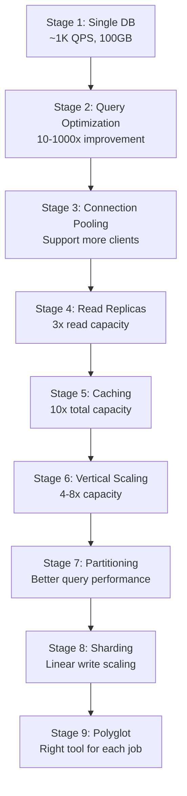
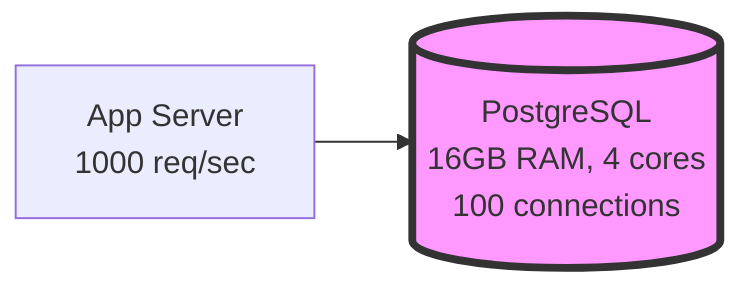
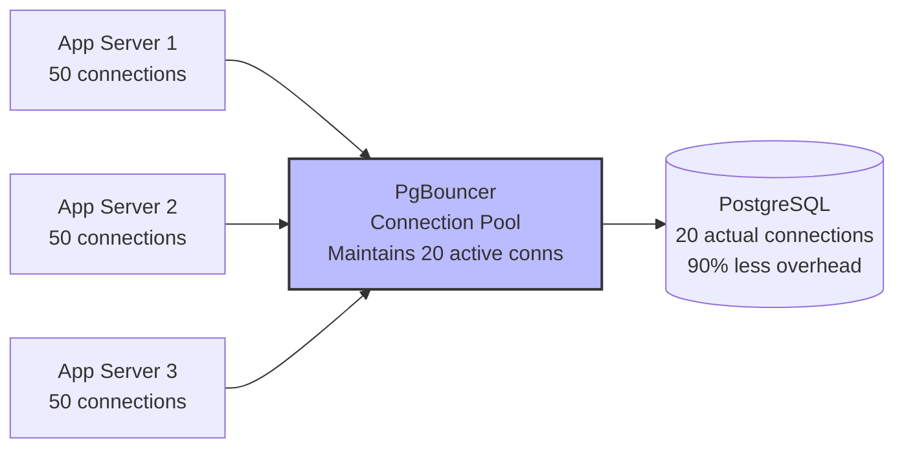
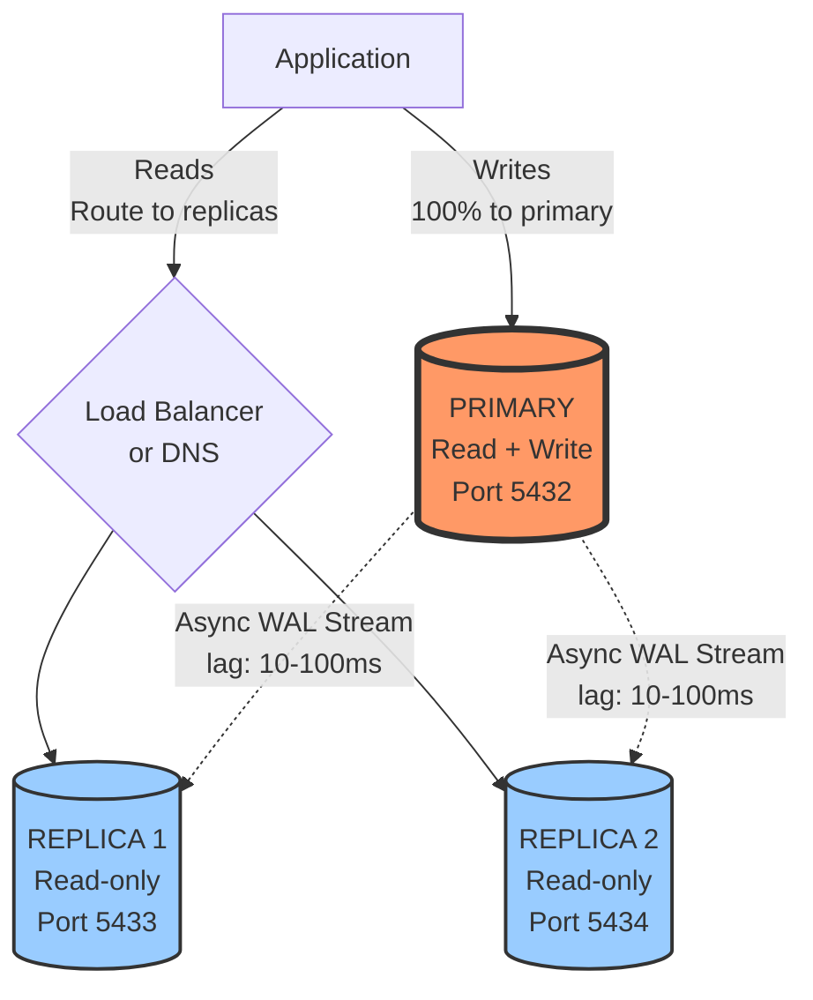
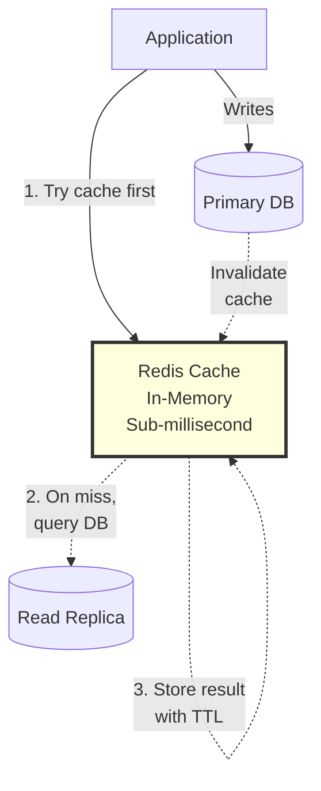
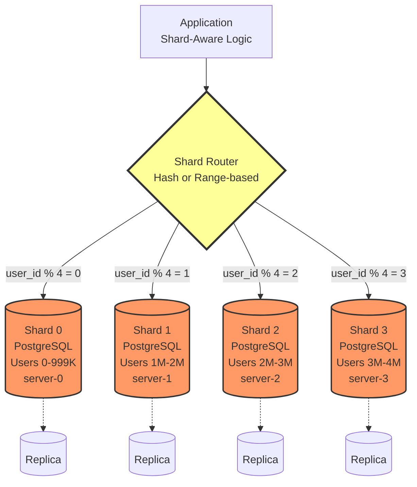
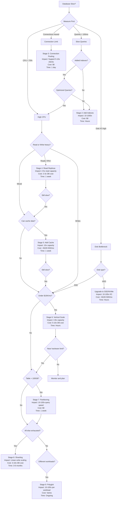

#system-design #evolution #database #scaling

# Scaling a Database: From Single Instance to Global Distribution

---

## Intuition (30 sec)

**Database scaling is like a restaurant expanding:**
- Start with one chef (single DB) serving all customers
- Add waiters (connection pooling) to manage order flow
- Train assistant chefs (read replicas) to help with prep work
- Install a heating lamp (cache) to keep popular dishes ready
- Buy bigger equipment (vertical scaling)
- Open multiple locations (sharding) when one building can't fit more

Each step adds complexity but handles more customers.

---

## Failure-First Scenario

**Day 1:** Your app has 100 users. One PostgreSQL instance on a $50/month server. Response time: 50ms. Life is good.

**Day 90:** Viral growth. 50,000 users. Same database.
- Login takes 8 seconds
- Dashboard queries timeout
- Black Friday sale crashes the site
- Database CPU at 100%, connections maxed out
- Lost $500K in sales during downtime

**The problem:** You optimized code, fixed algorithms, but never scaled the database. One machine can't handle 10,000 queries per second. You need a systematic approach to database scaling.

---

## Working Knowledge (5 min)

### Core Concept - Definitions

**Database Scaling:**
- **Definition:** The process of increasing a database's capacity to handle more requests, store more data, and maintain performance as load increases
- **Purpose:** To prevent slowdowns, timeouts, and outages as your application grows
- **How it works:** Progress through stages from simple optimizations (indexes) to distributed systems (sharding)

**Key Terms:**

- **Vertical Scaling (Scale Up):** Adding more resources (CPU, RAM, disk) to a single server
- **Horizontal Scaling (Scale Out):** Adding more servers to distribute the load
- **Read Replica:** A copy of the primary database that handles read queries only
- **Sharding:** Splitting data across multiple databases, each handling a subset of the total data
- **Connection Pooling:** Reusing database connections across multiple requests to reduce overhead
- **Replication Lag:** The delay between a write on the primary and when it appears on replicas
- **QPS (Queries Per Second):** The rate of database queries the system processes
- **Write Amplification:** When a single write causes multiple writes (to replicas, indexes, etc.)

### Visual Evolution Overview



### When to Use Each Stage

| Stage | Use When | Effort | Impact | Cost |
|-------|----------|--------|--------|------|
| Query optimization | First sign of slowness | Low | Very High | $0 |
| Connection pooling | Connection limit errors | Low | Medium | $0 |
| Read replicas | Reads > 70% of traffic | Medium | High | 2-3x DB cost |
| Caching | Repeated identical queries | Medium | Very High | +$100/mo |
| Vertical scaling | Single server not enough | Low | Medium-High | 5-10x DB cost |
| Partitioning | Queries scan too much data | Medium | Medium | $0 |
| Sharding | Exhausted all above | Very High | Very High | 3-10x DB cost |
| Polyglot | Different workload patterns | High | High | Varies |

---

## Layer 1: Foundational Scaling (Stages 1-3)

### Stage 1: Single PostgreSQL Instance

**Definition:**
- **Single Instance:** One database server handling all read and write operations
- **Use case:** Early-stage applications with < 1,000 QPS and < 100GB data
- **Characteristics:** Simple, predictable, zero replication lag, but limited capacity



**Typical Configuration (postgresql.conf):**

```sql
# Basic single instance config
max_connections = 100                    # Definition: Max simultaneous connections
shared_buffers = 4GB                     # Definition: Memory for caching data (25% of RAM)
effective_cache_size = 12GB              # Definition: OS + PG cache estimate (75% of RAM)
maintenance_work_mem = 512MB             # Definition: Memory for maintenance operations
checkpoint_completion_target = 0.9       # Definition: Spread checkpoints over 90% of interval
wal_buffers = 16MB                       # Definition: Memory for write-ahead log
default_statistics_target = 100          # Definition: Query planner statistics detail level
random_page_cost = 1.1                   # Definition: Cost of random disk I/O (SSD = ~1.1)
effective_io_concurrency = 200           # Definition: Concurrent I/O operations (SSD)
work_mem = 41MB                          # Definition: Memory per query operation (RAM/connections/3)
```

**Monitoring at This Stage:**

```
Key Metrics to Watch:
┌─────────────────────────────────────────────────────────┐
│ Active Connections: 45/100                              │
│ Definition: Current vs max simultaneous connections     │
│ Alert: > 80 (connection pressure building)            │
│                                                         │
│ QPS: 850                                               │
│ Definition: Queries executed per second                │
│ Alert: > 1000 (approaching capacity)                   │
│                                                         │
│ CPU Usage: 45%                                         │
│ Alert: > 70% sustained (need optimization/scaling)    │
│                                                         │
│ Disk I/O Wait: 5%                                      │
│ Definition: % of time CPU waits for disk              │
│ Alert: > 20% (disk is bottleneck)                     │
│                                                         │
│ Cache Hit Ratio: 98%                                   │
│ Definition: % of reads served from memory             │
│ Formula: (blks_hit / (blks_hit + blks_read)) * 100   │
│ Alert: < 90% (need more shared_buffers)               │
│                                                         │
│ Average Query Time: 12ms                               │
│ P95 Query Time: 45ms                                   │
│ P99 Query Time: 120ms                                  │
│ Alert: P99 > 200ms (queries need optimization)        │
└─────────────────────────────────────────────────────────┘
```

**Query to Check Cache Hit Ratio:**

```sql
-- Check if data is being read from cache vs disk
SELECT
    sum(blks_hit) as cache_hits,
    sum(blks_read) as disk_reads,
    CASE
        WHEN sum(blks_hit) + sum(blks_read) = 0 THEN 100
        ELSE round(sum(blks_hit) * 100.0 / (sum(blks_hit) + sum(blks_read)), 2)
    END as cache_hit_ratio
FROM pg_stat_database;

-- Definition: cache_hit_ratio > 90% is good
-- If < 90%, increase shared_buffers
```

**State:** One database, handles everything. Perfectly fine for early stage.
**Limit:** ~1,000 QPS, ~100GB data, depending on query complexity.
**Problem:** Query for user dashboard takes 500ms. `EXPLAIN ANALYZE` shows full table scans.

---

### Stage 2: Optimize Queries + Add Indexes

**Definition:**
- **Query Optimization:** Rewriting queries to use fewer resources (CPU, I/O, memory)
- **Database Index:** A data structure that improves the speed of data retrieval operations at the cost of additional storage and slower writes
- **Purpose:** Achieve 10-1000x performance improvement without adding infrastructure

**Index Fundamentals:**

```
Without Index (Sequential Scan):          With Index (Index Scan):
┌─────────────────┐                      ┌──────────┐
│ Scan ALL rows   │                      │ B-Tree   │
│ Row 1  ✗        │                      │ Index    │
│ Row 2  ✗        │                      │   ├─ 50 ──┐
│ Row 3  ✗        │                      │   ├─100 ──┼─→ Direct access
│ ...             │                      │   ├─123 ──┘   to matching rows
│ Row 5M ✓        │                      │   └─999    │
│                 │                      └──────────┘
│ Time: O(n)      │                      Time: O(log n)
│ 5M rows = 500ms │                      5M rows = 2ms
└─────────────────┘                      └─────────────┘

Definition: Sequential scan reads every row
Definition: Index scan jumps directly to matches
```

**Before and After Example:**

```sql
-- Before: 500ms (sequential scan on 5M rows)
SELECT * FROM orders WHERE user_id = 123 ORDER BY created_at DESC;

-- Check execution plan
EXPLAIN ANALYZE
SELECT * FROM orders WHERE user_id = 123 ORDER BY created_at DESC;

/*
Output:
Seq Scan on orders  (cost=0.00..125000.00 rows=5000 width=100) (actual time=5.123..487.456 rows=5000 loops=1)
  Filter: (user_id = 123)
  Rows Removed by Filter: 4995000

Definition: Seq Scan = sequential scan = table scan = reads every row
Definition: Rows Removed = rows that didn't match (wasted work)
*/

-- After: 2ms (index scan)
CREATE INDEX idx_orders_user_created ON orders(user_id, created_at DESC);

-- Now the query uses the index
EXPLAIN ANALYZE
SELECT * FROM orders WHERE user_id = 123 ORDER BY created_at DESC;

/*
Output:
Index Scan using idx_orders_user_created on orders  (cost=0.43..198.76 rows=5000 width=100) (actual time=0.045..1.823 rows=5000 loops=1)
  Index Cond: (user_id = 123)

Definition: Index Scan = uses index to find rows directly
Definition: Index Cond = condition that uses the index
Result: 250x faster (500ms → 2ms)
*/
```

**Composite Index Strategy:**

```sql
-- Index column order matters!

-- Good: Index matches query pattern (user_id first, then created_at)
CREATE INDEX idx_orders_user_created ON orders(user_id, created_at DESC);
SELECT * FROM orders WHERE user_id = 123 ORDER BY created_at DESC;
-- Uses index efficiently

-- Bad: Wrong order (created_at first)
CREATE INDEX idx_orders_created_user ON orders(created_at DESC, user_id);
SELECT * FROM orders WHERE user_id = 123 ORDER BY created_at DESC;
-- Can't use index efficiently for WHERE user_id

-- Rule: Index column order should match query WHERE → JOIN → ORDER BY
```

**Index Monitoring Queries:**

```sql
-- Find unused indexes (candidates for removal)
SELECT
    schemaname,
    tablename,
    indexname,
    idx_scan as index_scans,
    pg_size_pretty(pg_relation_size(indexrelid)) as index_size
FROM pg_stat_user_indexes
WHERE idx_scan = 0                           -- Definition: Never used
  AND indexrelname NOT LIKE 'pg_toast%'     -- Exclude system indexes
ORDER BY pg_relation_size(indexrelid) DESC;
-- Definition: Unused indexes waste disk space and slow down writes

-- Find tables missing indexes (frequent sequential scans)
SELECT
    schemaname,
    tablename,
    seq_scan,                                 -- Definition: # of sequential scans
    seq_tup_read,                             -- Definition: # rows read by seq scans
    idx_scan,                                 -- Definition: # of index scans
    seq_tup_read / seq_scan as avg_seq_read  -- Definition: Avg rows per seq scan
FROM pg_stat_user_tables
WHERE seq_scan > 0
ORDER BY seq_tup_read DESC
LIMIT 10;
-- Alert: High seq_scan + high seq_tup_read = missing index
```

**Common Query Optimizations:**

```sql
-- Problem: N+1 queries (one query per user)
-- Bad: 101 queries (1 for posts + 100 for users)
posts = SELECT * FROM posts LIMIT 100;
for post in posts:
    user = SELECT * FROM users WHERE id = post.user_id;  -- 100 separate queries!

-- Good: 2 queries (1 for posts + 1 for all users)
posts = SELECT * FROM posts LIMIT 100;
user_ids = [post.user_id for post in posts]
users = SELECT * FROM users WHERE id IN (user_ids);  -- 1 query for all users

-- Best: 1 query (JOIN)
SELECT posts.*, users.* FROM posts
JOIN users ON posts.user_id = users.id
LIMIT 100;
-- Definition: JOIN combines data from multiple tables in one query
```

**Actions:**
- Run `EXPLAIN ANALYZE` on slow queries to see execution plan
- Add indexes on WHERE, JOIN, ORDER BY columns ([[03_design_patterns/database_indexing]])
- Fix N+1 queries (use JOINs or batch queries)
- Add `LIMIT` to paginate results
- Use `SELECT specific_columns` instead of `SELECT *`

**Key win:** 10-1000x improvement, zero infrastructure change.
**Problem:** At 5,000 connections, DB can't open that many. Connection overhead kills performance.

---

### Stage 3: Connection Pooling

**Definition:**
- **Connection Pool:** A cache of database connections maintained to be reused for future requests
- **Purpose:** Reduce overhead of opening/closing connections and limit total connections to the database
- **Connection Overhead:** Each PostgreSQL connection uses ~10MB of memory and takes 5-50ms to establish

**The Problem:**

```
Without Connection Pooling:                 With Connection Pooling:
┌──────────────┐                           ┌──────────────┐
│ App Server 1 │\                          │ App Server 1 │\
│ 50 conns     │ \                         │ 50 conns     │ \    ┌──────────┐
└──────────────┘  \   ┌──────────────┐    └──────────────┘  \   │PgBouncer │   ┌──────────────┐
                   →  │ PostgreSQL   │                       →  │  Pool    │→  │ PostgreSQL   │
┌──────────────┐  /   │ 150 conns    │    ┌──────────────┐  /   │ 20 conns │   │ 20 conns     │
│ App Server 2 │ /    │ CPU: 30%     │    │ App Server 2 │ /    │          │   │ CPU: 5%      │
│ 50 conns     │/     │ RAM: 1.5GB   │    │ 50 conns     │/     └──────────┘   │ RAM: 200MB   │
└──────────────┘      │              │    └──────────────┘                     │              │
                      │ PROBLEM:     │                                         │ SOLUTION:    │
┌──────────────┐      │ Connection   │    ┌──────────────┐                     │ Reuse        │
│ App Server 3 │      │ overhead     │    │ App Server 3 │                     │ connections  │
│ 50 conns     │      │ high         │    │ 50 conns     │                     │              │
└──────────────┘      └──────────────┘    └──────────────┘                     └──────────────┘

Definition: Direct connections waste resources
Definition: Pool reuses connections across requests
```



**Tool:** PgBouncer (PostgreSQL), ProxySQL (MySQL)
**How:** 3 app servers × 50 connections = 150 connections. PgBouncer pools them into 20-100 actual DB connections.

**PgBouncer Configuration (pgbouncer.ini):**

```ini
[databases]
myapp = host=localhost port=5432 dbname=myapp
# Definition: Maps application database name to actual PostgreSQL instance

[pgbouncer]
# Pool Modes:
pool_mode = transaction                    # Definition: Connection returned after each transaction
                                          # Alternatives: session (after disconnect), statement (after each query)
# Why transaction mode: Balance between connection reuse and app compatibility

# Connection Limits:
max_client_conn = 1000                    # Definition: Max connections FROM apps TO pgbouncer
default_pool_size = 25                    # Definition: How many server connections per db pool
reserve_pool_size = 5                     # Definition: Extra connections for burst traffic
reserve_pool_timeout = 3                  # Definition: Seconds to wait for reserved connection

# Performance:
server_idle_timeout = 600                 # Definition: Close idle server connections after 10min
server_connect_timeout = 15               # Definition: Timeout for connecting to PostgreSQL
query_timeout = 0                         # Definition: Max query time (0 = disabled)

# Authentication:
auth_type = md5                           # Definition: Password authentication method
auth_file = /etc/pgbouncer/userlist.txt  # Definition: Username/password file
```

**Pool Mode Comparison:**

```
┌──────────────────────────────────────────────────────────────────┐
│ Pool Mode Decision Matrix                                        │
├──────────────────────────────────────────────────────────────────┤
│                                                                  │
│ SESSION MODE                                                     │
│ Definition: Connection owned by client for entire session       │
│ Pros: Compatible with all features (prepared statements, etc)   │
│ Cons: Least efficient pooling                                   │
│ Use when: Using advanced features like LISTEN/NOTIFY            │
│                                                                  │
│ TRANSACTION MODE ⭐ RECOMMENDED                                  │
│ Definition: Connection returned after COMMIT/ROLLBACK           │
│ Pros: Good balance of efficiency and compatibility              │
│ Cons: Can't use session-level features                          │
│ Use when: Standard web apps (90% of cases)                      │
│                                                                  │
│ STATEMENT MODE                                                   │
│ Definition: Connection returned after each SQL statement        │
│ Pros: Maximum pooling efficiency                                │
│ Cons: Breaks multi-statement transactions                       │
│ Use when: Each query is independent (read-only dashboards)      │
└──────────────────────────────────────────────────────────────────┘
```

**Monitoring PgBouncer:**

```sql
-- Connect to PgBouncer's admin console
psql -p 6432 -U pgbouncer pgbouncer

-- Show pool statistics
SHOW POOLS;
/*
database  | user     | cl_active | cl_waiting | sv_active | sv_idle | sv_used
──────────┼──────────┼───────────┼────────────┼───────────┼─────────┼────────
myapp     | appuser  |        12 |          0 |        15 |       5 |     100

Definition:
  cl_active = Client connections actively doing work
  cl_waiting = Client connections waiting for a server connection
  sv_active = Server connections in use
  sv_idle = Server connections available in pool
  sv_used = Total server connections used since start

Alert: cl_waiting > 0 = not enough server connections, increase default_pool_size
*/

-- Show current client connections
SHOW CLIENTS;

-- Show server connections to PostgreSQL
SHOW SERVERS;
```

**Capacity Planning:**

```
Calculation: How many connections do you need?

Formula: connections_needed = concurrent_requests × avg_query_time_sec

Example:
• Load: 1000 requests/sec
• Avg query time: 10ms = 0.01 sec
• Concurrent queries = 1000 × 0.01 = 10

Recommendation:
• default_pool_size = concurrent_queries × 1.5 = 15
• max_client_conn = app_servers × connections_per_server

Without pooling:
• 10 app servers × 50 connections = 500 DB connections
• PostgreSQL RAM usage: 500 × 10MB = 5GB just for connections!

With pooling:
• 10 app servers × 50 = 500 client connections to PgBouncer
• PgBouncer → PostgreSQL: 20 server connections
• PostgreSQL RAM usage: 20 × 10MB = 200MB
• Savings: 96% less memory!
```

**Key win:** Support more app servers without adding DB connections. Reduce memory usage by 80-95%.
**Problem:** Read queries (80% of traffic) overload the single DB.

---

## Layer 2: Horizontal Read Scaling (Stages 4-5)

### Stage 4: Read Replicas

**Definition:**
- **Read Replica:** An exact copy of the primary database that handles read-only queries
- **Primary (Leader):** The main database that handles all writes and replicates changes to replicas
- **Replication:** The process of copying data changes from primary to replicas
- **Purpose:** Distribute read load across multiple servers, increasing total read capacity

**How Replication Works:**

```
Write Flow:                                  Read Flow:
┌────────┐                                  ┌────────┐
│ Client │ Write request                    │ Client │ Read request
└───┬────┘                                  └───┬────┘
    │                                           │
    ▼                                           ▼
┌──────────────┐                          ┌──────────┐
│   PRIMARY    │                          │Load      │
│              │                          │Balancer  │
│ 1. Execute   │                          └────┬─────┘
│    INSERT    │                               │
│              │                          ┌────┴─────────────────┐
│ 2. Write to  │                          │    Route to any      │
│    WAL log   │                          │    replica           │
│              │                          │                      │
│ 3. Apply to  │                          ▼         ▼         ▼
│    database  │                     ┌─────────┐ ┌─────────┐ ┌─────────┐
└──┬───────────┘                     │REPLICA 1│ │REPLICA 2│ │REPLICA 3│
   │                                 │Read-only│ │Read-only│ │Read-only│
   │ Stream WAL                      └─────────┘ └─────────┘ └─────────┘
   │ (Write-Ahead Log)
   │                                 Definition: WAL = sequential log of all changes
   ▼                                 Definition: Streaming = continuous replication
┌──────────────┐ ┌──────────────┐
│  REPLICA 1   │ │  REPLICA 2   │   Result: Read capacity = # of replicas × single server capacity
│              │ │              │
│ 1. Receive   │ │ 1. Receive   │
│    WAL       │ │    WAL       │
│              │ │              │
│ 2. Apply     │ │ 2. Apply     │
│    changes   │ │    changes   │
└──────────────┘ └──────────────┘
```



**PostgreSQL Replication Setup:**

```bash
# On PRIMARY server (postgresql.conf):
wal_level = replica                        # Definition: Level of WAL detail (minimal/replica/logical)
max_wal_senders = 10                       # Definition: Max concurrent replication connections
max_replication_slots = 10                 # Definition: Max replication slots for replicas
synchronous_commit = off                   # Definition: Don't wait for replica confirmation (async)
                                          # on = wait for replica (slower writes, zero lag)
                                          # off = don't wait (faster writes, some lag)

# Create replication user
CREATE ROLE replicator WITH REPLICATION PASSWORD 'secure_password' LOGIN;

# Allow replication connections (pg_hba.conf):
host replication replicator replica-1-ip/32 md5
host replication replicator replica-2-ip/32 md5
```

```bash
# On REPLICA server (recovery.conf or postgresql.auto.conf for PG 12+):
primary_conninfo = 'host=primary-ip port=5432 user=replicator password=secure_password'
# Definition: Connection string to primary server

hot_standby = on
# Definition: Allow read queries on replica while replicating

# Start replica (this creates a copy from primary):
pg_basebackup -h primary-ip -D /var/lib/postgresql/data -U replicator -P -v -R
# Definition: pg_basebackup = tool to clone entire database from primary
# -R = write recovery configuration automatically
```

**Monitoring Replication:**

```sql
-- On PRIMARY: Check connected replicas
SELECT
    client_addr as replica_ip,
    state,                                    -- Definition: streaming = active replication
    sync_state,                               -- Definition: async or sync
    pg_wal_lsn_diff(pg_current_wal_lsn(), sent_lsn) as send_lag_bytes,
    pg_wal_lsn_diff(sent_lsn, write_lsn) as write_lag_bytes,
    pg_wal_lsn_diff(write_lsn, flush_lsn) as flush_lag_bytes,
    pg_wal_lsn_diff(flush_lsn, replay_lsn) as replay_lag_bytes
FROM pg_stat_replication;

-- Definition: LSN = Log Sequence Number = position in WAL
-- Alert: send_lag_bytes > 100MB = replica falling behind

-- On REPLICA: Check replication lag
SELECT
    now() - pg_last_xact_replay_timestamp() AS replication_lag;
-- Definition: Time difference between last replayed transaction and now
-- Alert: > 1 second = significant lag
```

**The Replication Lag Problem:**

```
Timeline of events:

Time    Primary                  Replica               User Experience
────────────────────────────────────────────────────────────────────────
T0      User posts comment       (lag: 0ms)
        "Hello world!"

T1      INSERT executed          Replication           User redirected
        Comment ID: 123          in progress...        to view page
                                 (lag: 50ms)

T2      -                        Still                 SELECT * FROM comments
                                 replicating...        WHERE id = 123
                                 (lag: 50ms)
                                                       Result: NOT FOUND ❌
                                                       User sees error!

T3      -                        INSERT                Now visible
                                 replayed
                                 (lag: 0ms)

Problem: Read-after-write inconsistency
Definition: User can't see their own write immediately
```

**Solution: Read-Your-Writes Pattern:**

```python
# Application-level routing logic

def create_comment(user_id, text):
    # Write to primary
    comment_id = primary_db.execute(
        "INSERT INTO comments (user_id, text) VALUES (?, ?) RETURNING id",
        user_id, text
    )

    # Store in user's session: "I just wrote this"
    session[user_id]['recent_writes'].add(comment_id)
    session[user_id]['write_timestamp'] = now()

    return comment_id

def get_comment(comment_id, user_id):
    # Check: Did THIS user just write this comment?
    if comment_id in session[user_id]['recent_writes']:
        # Read from PRIMARY (guaranteed to see own write)
        return primary_db.query("SELECT * FROM comments WHERE id = ?", comment_id)

    # Check: Was there a recent write? (within replication lag window)
    if now() - session[user_id]['write_timestamp'] < 1_second:
        # Play it safe: read from primary
        return primary_db.query("SELECT * FROM comments WHERE id = ?", comment_id)

    # Otherwise: Read from replica (distribute load)
    return replica_db.query("SELECT * FROM comments WHERE id = ?", comment_id)

# Definition: Read-your-writes = strategy to route reads to primary after writes
# Ensures user sees their own changes immediately
```

**Capacity Impact:**

```
Before Replicas:
• Primary: 1000 reads/sec + 200 writes/sec = 1200 QPS total
• CPU: 85%
• Problem: Can't handle more traffic

After Adding 2 Replicas:
• Primary: 200 writes/sec (reads removed)
• Replica 1: 500 reads/sec
• Replica 2: 500 reads/sec
• Total capacity: 1000 reads/sec + 200 writes/sec = 1200 QPS
• But primary CPU: 25% (only handling writes)
• Headroom: Can scale reads to 3000/sec by adding more replicas

Definition: Read capacity scales linearly with # of replicas
Definition: Write capacity still limited by single primary
```

**How:** PostgreSQL streaming replication. Primary sends WAL ([[03_design_patterns/write_ahead_log]]) to replicas.
**Routing:** Application or middleware routes reads to replicas, writes to primary.
**Trade-off:** Replication lag (typically <100ms). User writes, immediately reads from replica, doesn't see own write.
**Fix:** Read-your-writes from primary for the user who just wrote.

**Key win:** Read capacity multiplied by number of replicas (3 replicas = 3x read capacity).
**Problem:** Database CPU pegged at 80% even with replicas. Certain queries computed repeatedly.

---

### Stage 5: Add Caching Layer

**Definition:**
- **Cache:** High-speed data storage layer that stores frequently accessed data in memory
- **Cache Hit:** When requested data is found in cache (fast)
- **Cache Miss:** When requested data is NOT in cache, must query database (slow)
- **Hit Ratio:** Percentage of requests served from cache (target: >90%)
- **TTL (Time To Live):** How long data stays in cache before expiring

**Cache-Aside Pattern (Lazy Loading):**

```
Request Flow with Caching:

┌──────────┐
│  Client  │ GET /user/123
└────┬─────┘
     │
     ▼
┌─────────────────────────────────────────────────────────────┐
│ Application Server                                          │
│                                                             │
│  1. Check cache first                                       │
│     ┌────────────────────────────┐                         │
│     │ key = "user:123"           │                         │
│     │ result = redis.get(key)    │                         │
│     └──────────┬─────────────────┘                         │
│                │                                            │
│         ┌──────┴──────┐                                     │
│         │             │                                     │
│    ┌────▼──────┐  ┌──▼─────────┐                          │
│    │ HIT! ✓    │  │ MISS ✗     │                          │
│    │           │  │            │                          │
│    │ Return    │  │ 2. Query   │                          │
│    │ cached    │  │    database │                          │
│    │ data      │  │            │ ┌──────────────────┐     │
│    │           │  │ SELECT *   │ │   PostgreSQL     │     │
│    │ Fast:     │  │ FROM users │→│   Query: 15ms    │     │
│    │ 0.5ms     │  │ WHERE      │ └──────────────────┘     │
│    │           │  │ id=123     │                          │
│    └───────────┘  │            │                          │
│                   │ 3. Store   │                          │
│                   │    in cache │                          │
│                   │            │ ┌──────────────────┐     │
│                   │ redis.set( │ │   Redis          │     │
│                   │   key,data,│→│   SET "user:123" │     │
│                   │   TTL=300) │ │   TTL: 5min      │     │
│                   │            │ └──────────────────┘     │
│                   │ Total:     │                          │
│                   │ 16ms       │                          │
│                   └────────────┘                          │
└─────────────────────────────────────────────────────────────┘

Definition: Cache-aside = application manages cache manually
Definition: First request slow (miss), subsequent requests fast (hit)
```



**What to Cache:**

```
Cache Strategy by Data Type:
┌──────────────────────────────────────────────────────────────────────┐
│ Data Type          │ TTL    │ Why Cache?              │ Hit Ratio    │
├────────────────────┼────────┼─────────────────────────┼──────────────┤
│ User Profile       │ 5 min  │ Read 100x per write     │ 95-98%       │
│ Session Data       │ 30 min │ Read on every request   │ 99%          │
│ Product Catalog    │ 1 min  │ Read-heavy, slow join   │ 90-95%       │
│ Homepage Feed      │ 30 sec │ Same for all users      │ 98%          │
│ API Rate Limits    │ 1 min  │ Checked every request   │ 99.9%        │
│ Auth Tokens        │ 15 min │ Validated every request │ 99%          │
│ Config Settings    │ 10 min │ Rarely change           │ 99.9%        │
│ Search Results     │ 5 min  │ Expensive queries       │ 70-80%       │
└──────────────────────────────────────────────────────────────────────┘

DO NOT CACHE:
• Financial transactions (must be real-time, accurate)
• Inventory counts (can cause overselling)
• Real-time analytics (defeats the purpose)

Definition: High read:write ratio = good cache candidate
Definition: Low TTL = fresher data but more cache misses
```

**Implementation Example:**

```python
import redis
import json

redis_client = redis.Redis(host='localhost', port=6379, decode_responses=True)

def get_user(user_id):
    """Get user with caching"""

    # Step 1: Try cache
    cache_key = f"user:{user_id}"
    cached = redis_client.get(cache_key)

    if cached:
        # Cache hit!
        print("✓ Cache hit")
        return json.loads(cached)

    # Step 2: Cache miss - query database
    print("✗ Cache miss - querying database")
    user = database.query("SELECT * FROM users WHERE id = ?", user_id)

    if user:
        # Step 3: Store in cache for future requests
        redis_client.setex(
            cache_key,
            300,  # TTL = 5 minutes (300 seconds)
            json.dumps(user)
        )
        # Definition: setex = SET with EXpiration time

    return user

def update_user(user_id, new_data):
    """Update user and invalidate cache"""

    # Step 1: Write to database
    database.execute(
        "UPDATE users SET name = ?, email = ? WHERE id = ?",
        new_data['name'], new_data['email'], user_id
    )

    # Step 2: Invalidate cache (delete stale data)
    cache_key = f"user:{user_id}"
    redis_client.delete(cache_key)
    # Definition: Cache invalidation = removing outdated data from cache

    # Alternative: Write-through (update cache immediately)
    # redis_client.setex(cache_key, 300, json.dumps(new_data))
```

**Cache Invalidation Strategies:**

```
1. TTL Expiration (Time-based) ⭐ MOST COMMON
   ┌────────────┐
   │ Write data │ → Cache stores with TTL
   └────────────┘   After 5 minutes: automatically expires

   Pros: Simple, automatic
   Cons: Stale data for up to TTL duration

2. Write-Through (Update on write)
   ┌────────────┐
   │ Write data │ → Update DB → Update cache immediately
   └────────────┘

   Pros: Cache always fresh
   Cons: Extra write latency, more complexity

3. Write-Behind (Async update)
   ┌────────────┐
   │ Write data │ → Update cache → Queue DB write for later
   └────────────┘

   Pros: Very fast writes
   Cons: Risk of data loss, consistency issues

4. Cache Invalidation (Delete on write)
   ┌────────────┐
   │ Write data │ → Update DB → Delete from cache
   └────────────┘   Next read: cache miss → reload fresh data

   Pros: Simple, guarantees freshness
   Cons: First read after write is slow

Recommendation: TTL + Cache Invalidation on writes
```

**Redis Configuration for Caching:**

```conf
# redis.conf for caching (NOT persistence)

# Memory
maxmemory 4gb                              # Definition: Max memory Redis can use
maxmemory-policy allkeys-lru               # Definition: Evict least recently used keys when full
                                          # Alternatives: allkeys-lfu (least frequently used)

# Persistence (for cache, disable for better performance)
save ""                                    # Definition: Disable RDB snapshots
appendonly no                              # Definition: Disable AOF (append-only file)
# Why: Cache data is not critical, can be regenerated from DB

# Performance
tcp-backlog 511                            # Definition: Pending connection queue size
timeout 0                                  # Definition: Close idle client connections (0=never)
tcp-keepalive 300                          # Definition: Send keepalive packets every 5min

# Networking
bind 0.0.0.0                               # Definition: Listen on all interfaces
protected-mode no                          # Definition: Allow external connections (use firewall!)
port 6379
```

**Monitoring Cache Performance:**

```python
# Get cache statistics
info = redis_client.info('stats')

hit_ratio = info['keyspace_hits'] / (info['keyspace_hits'] + info['keyspace_misses']) * 100
print(f"Cache Hit Ratio: {hit_ratio:.1f}%")
# Definition: Hit ratio = % of requests served from cache
# Target: > 90% for good cache effectiveness

# Monitor memory usage
memory_info = redis_client.info('memory')
print(f"Used Memory: {memory_info['used_memory_human']}")
print(f"Evicted Keys: {info['evicted_keys']}")
# Alert: High evicted_keys = cache too small, increase maxmemory
```

**Impact Analysis:**

```
Before Caching:
• Database: 1000 reads/sec to replicas
• Avg query time: 15ms
• CPU: 60%

After Caching (95% hit ratio):
• Cache: 950 reads/sec (0.5ms avg)
• Database: 50 reads/sec (15ms avg)
• Database CPU: 6%
• Total capacity increased: 10x

Calculation:
• 95% × 0.5ms = 0.475ms (from cache)
• 5% × 15ms = 0.75ms (from DB)
• Average: 1.225ms (vs 15ms before)
• 12x faster response time!
• Database handles only 5% of traffic

Cost: Redis 4GB = ~$100/month
Benefit: Avoid scaling DB = save $1000s/month
```

**Strategy:** Cache-aside (lazy loading). Check Redis first. Miss → query DB → store in Redis. ([[02_building_blocks/caching]])
**Cache:** User profiles (TTL: 5min), product data (TTL: 1min), session data (TTL: 30min).
**Hit ratio:** 95% → only 5% of reads hit the database.

**Key win:** DB load drops by 90-95%. Can handle 10x more traffic. Dramatically reduced database CPU.
**Problem:** Single primary can't handle write volume. CPU maxed on writes + replication overhead.

---

## Layer 3: Single-Server Limits (Stages 6-7)

### Stage 6: Vertical Scaling

**Definition:**
- **Vertical Scaling (Scale Up):** Increasing the resources (CPU, RAM, disk, network) of a single server
- **Purpose:** Simple way to increase capacity without architectural changes
- **Trade-off:** Limited by hardware maximums, cost increases exponentially, still single point of failure

**Just get a bigger machine.** Seriously. Before adding complexity, throw hardware at the problem.

```
Hardware Progression:

Small                  Medium                Large                 X-Large
┌────────────┐        ┌────────────┐        ┌────────────┐        ┌────────────┐
│ 4 cores    │        │ 16 cores   │        │ 32 cores   │        │ 64 cores   │
│ 16GB RAM   │   →    │ 64GB RAM   │   →    │ 256GB RAM  │   →    │ 512GB RAM  │
│ 500GB SSD  │        │ 1TB NVMe   │        │ 4TB NVMe   │        │ 8TB NVMe   │
│            │        │            │        │            │        │            │
│ $200/mo    │        │ $800/mo    │        │ $2,000/mo  │        │ $5,000/mo  │
│ ~1K QPS    │        │ ~5K QPS    │        │ ~20K QPS   │        │ ~50K QPS   │
└────────────┘        └────────────┘        └────────────┘        └────────────┘

Definition: QPS capacity scales roughly linearly with cores (for CPU-bound workloads)
Definition: Cost increases exponentially (4x cores ≠ 4x cost, more like 8-10x)
```

**AWS RDS Instance Comparison:**

| Instance Type | vCPU | RAM | Network | Cost/mo | Use Case |
|---------------|------|-----|---------|---------|----------|
| db.t3.small | 2 | 2GB | Moderate | $30 | Development, testing |
| db.r5.large | 2 | 16GB | Up to 10Gb | $175 | Small production |
| db.r5.xlarge | 4 | 32GB | Up to 10Gb | $350 | Medium traffic |
| db.r5.2xlarge | 8 | 64GB | Up to 10Gb | $700 | Growing app |
| db.r5.4xlarge | 16 | 128GB | 10Gb | $1,400 | High traffic |
| db.r5.8xlarge | 32 | 256GB | 10Gb | $2,800 | Very high traffic |
| db.r5.12xlarge | 48 | 384GB | 12Gb | $4,200 | Near maximum |
| db.r5.24xlarge | 96 | 768GB | 25Gb | $8,400 | Maximum single instance |

**When to Vertically Scale:**

```
Decision Tree:

Q: Is your database slow?
│
├─ YES → Q: Have you optimized queries and added indexes?
│        │
│        ├─ NO → START HERE: Optimize first (Stage 2)
│        │       Cost: $0, Impact: 10-1000x improvement
│        │
│        └─ YES → Q: Is CPU the bottleneck?
│                 │
│                 ├─ YES → Q: CPU > 70% sustained?
│                 │        │
│                 │        └─ YES → Vertical scale: 2x cores
│                 │                 Cost: ~2x, Impact: ~2x capacity
│                 │
│                 ├─ NO → Q: Is RAM the bottleneck?
│                 │        │
│                 │        ├─ YES → Check cache hit ratio
│                 │        │        If < 90%: Increase shared_buffers
│                 │        │        If already optimized: Vertical scale RAM
│                 │        │
│                 │        └─ NO → Q: Is disk I/O the bottleneck?
│                 │                 │
│                 │                 └─ YES → Upgrade to faster disks
│                 │                          (HDD → SSD → NVMe)
│                 │
│                 └─ NO → Not a hardware problem
│                         Check: Network, locks, replication lag
│
└─ NO → Monitor and plan for growth
```

**PostgreSQL Config Adjustments for Larger Machines:**

```sql
-- For 256GB RAM server:

# Memory (25-40% of total RAM for shared_buffers)
shared_buffers = 64GB                      # Definition: PostgreSQL's data cache
effective_cache_size = 192GB               # Definition: OS + PG cache (75% of total RAM)
maintenance_work_mem = 2GB                 # Definition: Memory for VACUUM, CREATE INDEX
work_mem = 256MB                           # Definition: Memory per query operation
                                          # Calculation: (RAM - shared_buffers) / max_connections / 3
                                          # (256GB - 64GB) / 200 / 3 = 320MB → use 256MB

# Checkpoints (more aggressive on large DBs)
checkpoint_timeout = 15min                 # Definition: Max time between checkpoints
max_wal_size = 16GB                       # Definition: Trigger checkpoint at this WAL size
min_wal_size = 8GB                        # Definition: Keep this much WAL for future checkpoints

# Query Planner
default_statistics_target = 100            # Definition: Detail level for query planning stats
random_page_cost = 1.1                     # Definition: Cost estimate for random I/O (NVMe)
effective_io_concurrency = 200             # Definition: Parallel I/O operations (SSD/NVMe)

# Autovacuum (more aggressive on large tables)
autovacuum_max_workers = 6                # Definition: Parallel vacuum processes
autovacuum_naptime = 10s                  # Definition: Time between autovacuum runs
```

**Monitoring to Determine If You Need More Resources:**

```sql
-- Check if you're CPU-bound
SELECT
    datname,
    xact_commit + xact_rollback as total_transactions,
    xact_commit * 100.0 / (xact_commit + xact_rollback) as commit_ratio
FROM pg_stat_database
WHERE datname = 'your_db';
-- If high transaction volume but CPU at 100% → need more CPU

-- Check if you're memory-bound
SELECT
    sum(heap_blks_read) as disk_reads,
    sum(heap_blks_hit) as cache_hits,
    sum(heap_blks_hit) * 100.0 / (sum(heap_blks_read) + sum(heap_blks_hit)) as hit_ratio
FROM pg_statio_user_tables;
-- If hit_ratio < 90% → need more RAM or optimize shared_buffers

-- Check disk I/O wait (from OS level)
-- High iowait% → need faster disks or more RAM for caching
```

**Why Do This Before Sharding?**

```
Complexity Comparison:

Vertical Scaling:                    Sharding:
┌──────────────────┐                ┌──────────────────────────────────┐
│ Effort: 1 hour   │                │ Effort: 3-6 months               │
│                  │                │                                  │
│ 1. Stop database │                │ 1. Choose shard key              │
│ 2. Resize server │                │ 2. Implement routing logic       │
│ 3. Start database│                │ 3. Migrate data                  │
│                  │                │ 4. Update application code       │
│ Code changes: 0  │                │ 5. Handle cross-shard queries    │
│ Risk: Low        │                │ 6. Rebalancing strategy          │
│ Cost: Higher     │                │                                  │
│                  │                │ Code changes: 100s-1000s of lines│
│                  │                │ Risk: High                       │
│                  │                │ Cost: Lower hardware, high labor │
└──────────────────┘                └──────────────────────────────────┘

Definition: Vertical scaling is operational, sharding is architectural
Recommendation: Exhaust vertical scaling before considering sharding
```

**Key win:** 4-8x more capacity with zero code changes. Fast implementation (hours, not months).
**Problem:** Hardware has limits. Maximum realistic single server: ~96 cores, ~768GB RAM, ~$10K/month. Still single point of failure. Eventually, you must horizontally scale.

---

### Stage 7: Table Partitioning

**Definition:**
- **Table Partitioning:** Splitting a large table into smaller physical pieces (partitions) while maintaining a single logical table
- **Purpose:** Improve query performance by scanning only relevant partitions, simplify data maintenance
- **Key Difference from Sharding:** Partitions reside on the SAME server, shards on DIFFERENT servers
- **Partition Key:** The column(s) used to determine which partition a row belongs to

**How Partitioning Works:**

```
Without Partitioning:                      With Partitioning (by date):

Single Large Table:                        Parent Table (logical):
┌─────────────────────┐                   ┌─────────────────────┐
│ orders (500M rows)  │                   │ orders (metadata)   │
│                     │                   └──────────┬──────────┘
│ 2020 data: 100M     │                              │
│ 2021 data: 100M     │                   ┌──────────┼──────────┐
│ 2022 data: 100M     │                   │          │          │
│ 2023 data: 100M     │            ┌──────▼────┬─────▼────┬─────▼────┐
│ 2024 data: 100M     │            │ orders_   │ orders_  │ orders_  │
│                     │            │ 2024_q1   │ 2024_q2  │ 2024_q3  │
└─────────────────────┘            │ (25M)     │ (25M)    │ (25M)    │
                                   │ Jan-Mar   │ Apr-Jun  │ Jul-Sep  │
Query recent orders:               └───────────┴──────────┴──────────┘
SELECT * FROM orders
WHERE created_at >= '2024-09-01'   Query recent orders:
                                   SELECT * FROM orders
Scans: 500M rows ❌                WHERE created_at >= '2024-09-01'
Time: 8 seconds
                                   Scans: Only orders_2024_q3 ✓
                                   Time: 80ms (100x faster!)

Definition: Partition pruning = skipping irrelevant partitions
Definition: Same table name, different physical storage
```

**PostgreSQL Partitioning Setup:**

```sql
-- Create parent table (logical table)
CREATE TABLE orders (
    id BIGINT,
    user_id INT,
    created_at TIMESTAMP NOT NULL,
    total DECIMAL,
    status VARCHAR(50)
) PARTITION BY RANGE (created_at);
-- Definition: PARTITION BY RANGE = split by value ranges
-- Alternatives: PARTITION BY LIST (discrete values), PARTITION BY HASH (even distribution)

-- Create partitions (physical tables)
CREATE TABLE orders_2024_q1 PARTITION OF orders
    FOR VALUES FROM ('2024-01-01') TO ('2024-04-01');

CREATE TABLE orders_2024_q2 PARTITION OF orders
    FOR VALUES FROM ('2024-04-01') TO ('2024-07-01');

CREATE TABLE orders_2024_q3 PARTITION OF orders
    FOR VALUES FROM ('2024-07-01') TO ('2024-10-01');

CREATE TABLE orders_2024_q4 PARTITION OF orders
    FOR VALUES FROM ('2024-10-01') TO ('2025-01-01');

-- Create default partition (for data outside defined ranges)
CREATE TABLE orders_default PARTITION OF orders DEFAULT;
-- Definition: Catches rows that don't match any partition range

-- Indexes must be created on each partition
CREATE INDEX idx_orders_2024_q1_user ON orders_2024_q1(user_id);
CREATE INDEX idx_orders_2024_q2_user ON orders_2024_q2(user_id);
-- OR create on parent table (auto-creates on all partitions)
CREATE INDEX idx_orders_user ON orders(user_id);
```

**Partitioning Strategies:**

```
1. RANGE Partitioning (by date/time) ⭐ MOST COMMON
   Use case: Time-series data, logs, orders
   Example: Partition by created_at (daily, monthly, quarterly)

   ┌──────────┬──────────┬──────────┬──────────┐
   │ Jan-Mar  │ Apr-Jun  │ Jul-Sep  │ Oct-Dec  │
   └──────────┴──────────┴──────────┴──────────┘

   Pros: Perfect for time-based queries ("last 7 days")
   Cons: Uneven partition sizes if data growth varies

2. LIST Partitioning (by discrete values)
   Use case: Geographic regions, status codes, categories
   Example: Partition by region (US, EU, ASIA)

   ┌──────────┬──────────┬──────────┐
   │ US       │ EU       │ ASIA     │
   │ (50%)    │ (30%)    │ (20%)    │
   └──────────┴──────────┴──────────┘

   Pros: Natural data separation by business logic
   Cons: Uneven sizes, manual partition management

3. HASH Partitioning (by hash value)
   Use case: Evenly distribute data when no natural partition key
   Example: Partition by user_id hash

   ┌──────────┬──────────┬──────────┬──────────┐
   │ Part 0   │ Part 1   │ Part 2   │ Part 3   │
   │ (25%)    │ (25%)    │ (25%)    │ (25%)    │
   └──────────┴──────────┴──────────┴──────────┘

   Pros: Even distribution
   Cons: Can't prune partitions for range queries
```

**Partition Maintenance:**

```sql
-- Add new partition for future data (run monthly/quarterly)
CREATE TABLE orders_2025_q1 PARTITION OF orders
    FOR VALUES FROM ('2025-01-01') TO ('2025-04-01');

-- Drop old partition (instant deletion, faster than DELETE)
DROP TABLE orders_2020_q1;
-- vs DELETE: DELETE FROM orders WHERE created_at < '2020-04-01'; -- Takes hours!
-- Definition: DROP TABLE is instant, DELETE scans and removes rows individually

-- Archive partition before dropping (move to cold storage)
-- 1. Detach partition from parent
ALTER TABLE orders DETACH PARTITION orders_2020_q1;
-- 2. orders_2020_q1 is now a standalone table
-- 3. Export to S3 or archive database
pg_dump -t orders_2020_q1 > archive_2020_q1.sql
-- 4. Drop the partition
DROP TABLE orders_2020_q1;

-- Check partition sizes
SELECT
    schemaname,
    tablename,
    pg_size_pretty(pg_total_relation_size(schemaname||'.'||tablename)) AS size
FROM pg_tables
WHERE tablename LIKE 'orders_%'
ORDER BY pg_total_relation_size(schemaname||'.'||tablename) DESC;
```

**Query Performance with Partitioning:**

```sql
-- Query automatically uses partition pruning
EXPLAIN SELECT * FROM orders
WHERE created_at >= '2024-09-01' AND created_at < '2024-10-01';

/*
Output:
Append  (cost=0.00..1234.56 rows=10000 width=100)
  ->  Seq Scan on orders_2024_q3  (cost=0.00..1234.56 rows=10000 width=100)
        Filter: (created_at >= '2024-09-01' AND created_at < '2024-10-01')

Definition: Append = combine results from multiple partitions
Notice: Only scans orders_2024_q3 partition (partition pruning works!)
NOT scanned: orders_2024_q1, q2, q4 (saves 75% of scan)
*/

-- Cross-partition query (scans multiple partitions)
EXPLAIN SELECT * FROM orders
WHERE created_at >= '2024-06-01' AND created_at < '2024-09-01';

/*
Output:
Append  (cost=0.00..2469.12 rows=20000 width=100)
  ->  Seq Scan on orders_2024_q2  (cost=0.00..1234.56 rows=10000 width=100)
  ->  Seq Scan on orders_2024_q3  (cost=0.00..1234.56 rows=10000 width=100)

Definition: Scans both Q2 and Q3 partitions (but still faster than full table)
*/
```

**When to Use Partitioning:**

```
Decision Criteria:

✓ USE PARTITIONING IF:
  • Table > 100GB or > 100M rows
  • Queries consistently filter on a specific column (created_at, region, etc.)
  • Need to archive/delete old data regularly
  • Read queries target recent data (last 7 days, current month)

✗ DON'T USE PARTITIONING IF:
  • Table < 10GB (indexes are enough)
  • Queries are random across all data (no partition pruning benefit)
  • Too many partitions (> 1000 = management overhead)
  • Write pattern doesn't match partition key
```

**Benefits:**
- Queries on recent data only scan recent partitions (10-100x faster)
- Drop old partitions instantly (vs slow DELETE)
- Parallel operations per partition
- Better index maintenance (smaller indexes per partition)

**Limitations:**
- Still one server for all partitions
- No increase in write capacity (CPU still bottlenecked)
- Application sees same logical table (no code changes)

**Not the same as sharding:**
- Partitioning: Multiple tables on ONE server (performance optimization)
- Sharding: Multiple tables on DIFFERENT servers (capacity scaling)

**Key win:** Queries on recent/specific data much faster (10-100x). Maintenance easier (instant drops). Storage management simpler.
**Problem:** Still one server for writes. Single point of failure. You've exhausted single-server optimizations. Next step requires architectural change.

---

## Layer 4: Distributed Databases (Stages 8-9)

### Stage 8: Horizontal Sharding

**Definition:**
- **Sharding (Horizontal Partitioning):** Splitting data across multiple independent database servers, each containing a subset of the total data
- **Shard:** An independent database instance holding a portion of the data
- **Shard Key:** The column(s) used to determine which shard a row belongs to
- **Purpose:** Scale write capacity beyond a single server's limits
- **Last Resort:** Most complex scaling technique, only use when all other options exhausted

**Sharding vs Partitioning vs Replication:**

```
┌──────────────────────────────────────────────────────────────────────┐
│                    Key Differences                                   │
├──────────────────────────────────────────────────────────────────────┤
│                                                                      │
│ PARTITIONING (Stage 7):                                             │
│ ┌───────────────────────────────┐                                   │
│ │      Single Server            │                                   │
│ │  ┌─────┐ ┌─────┐ ┌─────┐    │                                   │
│ │  │Part1│ │Part2│ │Part3│    │                                   │
│ │  └─────┘ └─────┘ └─────┘    │                                   │
│ └───────────────────────────────┘                                   │
│ Purpose: Query optimization                                          │
│ Same data visible to all                                            │
│                                                                      │
│ REPLICATION (Stage 4):                                              │
│ ┌──────────┐  ┌──────────┐  ┌──────────┐                          │
│ │ Primary  │  │ Replica1 │  │ Replica2 │                          │
│ │ ALL DATA │→ │ ALL DATA │→ │ ALL DATA │                          │
│ └──────────┘  └──────────┘  └──────────┘                          │
│ Purpose: Read scaling, redundancy                                   │
│ Each server has complete copy                                       │
│                                                                      │
│ SHARDING (Stage 8): ⭐ THIS STAGE                                   │
│ ┌──────────┐  ┌──────────┐  ┌──────────┐                          │
│ │ Shard 1  │  │ Shard 2  │  │ Shard 3  │                          │
│ │ Users    │  │ Users    │  │ Users    │                          │
│ │ 0-999K   │  │ 1M-2M    │  │ 2M-3M    │                          │
│ └──────────┘  └──────────┘  └──────────┘                          │
│ Purpose: Write scaling, storage distribution                        │
│ Each server has different subset                                    │
└──────────────────────────────────────────────────────────────────────┘

Definition: Sharding is the ONLY technique that increases write capacity
```

**How Sharding Works:**

```
Application Request Flow:

Step 1: Client requests user data
┌────────────┐
│ App Server │ GET /user/1234567
└──────┬─────┘
       │
Step 2: Calculate shard location
       │ shard_id = hash(user_id) % num_shards
       │          = hash(1234567) % 4
       │          = 2 (routes to Shard 2)
       ▼
┌─────────────────────────────────────────┐
│      Shard Router / Application         │
│                                         │
│  Routing Logic:                         │
│  if user_id 0-999999:      → Shard 0  │
│  if user_id 1M-1.999M:     → Shard 1  │
│  if user_id 2M-2.999M:     → Shard 2  │ ← USER 1234567 GOES HERE
│  if user_id 3M-3.999M:     → Shard 3  │
└────┬────────────┬────────────┬─────────┘
     │            │            │
     ▼            ▼            ▼            ▼
┌─────────┐  ┌─────────┐  ┌─────────┐  ┌─────────┐
│ Shard 0 │  │ Shard 1 │  │ Shard 2 │  │ Shard 3 │
│ Users   │  │ Users   │  │ Users   │  │ Users   │
│ 0-999K  │  │ 1M-2M   │  │ 2M-3M   │  │ 3M-4M   │
│         │  │         │  │         │  │         │
│ DB 1    │  │ DB 2    │  │ DB 3    │  │ DB 4    │
│ server-1│  │ server-2│  │ server-3│  │ server-4│
└─────────┘  └─────────┘  └─────────┘  └─────────┘

Definition: Each shard is completely independent database
Definition: Shard router = logic that determines which shard to query
```



**Shard Key Selection (Critical Decision):**

```
Good Shard Keys:                         Bad Shard Keys:

user_id ✓                               created_at ✗
• Even distribution                      • Skewed: all new data → newest shard
• Co-locates user data                   • Hot shard: all writes hit one shard
• Single-shard queries                   • Can't query single user efficiently

tenant_id ✓ (multi-tenant SaaS)        status ✗ (e.g., "active" vs "inactive")
• Isolates tenant data                   • Uneven: 95% active, 5% inactive
• Single-shard tenant queries            • Changes over time (re-sharding needed)
• Natural boundary                       • Hot shard for status updates

geographic_region ✓                     email_domain ✗
• Co-locates regional data              • Uneven: 60% gmail.com
• Latency optimization                   • Not stable (users change emails)
• Regulatory compliance                  • No natural distribution

Characteristics of Good Shard Key:
1. High cardinality (many unique values)
2. Even distribution across shards
3. Stable (doesn't change over time)
4. Supports common query patterns (avoid cross-shard queries)
```

**Sharding Strategies:**

```sql
-- 1. RANGE-BASED SHARDING
-- Definition: Split by value ranges
-- Shard 0: user_id 0 - 999,999
-- Shard 1: user_id 1,000,000 - 1,999,999
-- Shard 2: user_id 2,000,000 - 2,999,999

if user_id < 1000000:
    shard = 0
elif user_id < 2000000:
    shard = 1
else:
    shard = 2

Pros: Simple, predictable, easy to add shards at end
Cons: Uneven distribution if user growth not linear, newest shard is hot shard

-- 2. HASH-BASED SHARDING ⭐ RECOMMENDED
-- Definition: Hash the shard key, modulo by number of shards
shard = hash(user_id) % num_shards

Pros: Even distribution, balanced load
Cons: Adding shards requires resharding (expensive)

-- 3. CONSISTENT HASHING ([[03_design_patterns/consistent_hashing]])
-- Definition: Use consistent hash ring to minimize resharding
-- Only ~1/N of data moves when adding Nth shard

Pros: Minimal data movement when resharding
Cons: More complex implementation

-- 4. DIRECTORY-BASED SHARDING
-- Definition: Lookup table maps keys to shards
-- lookup_table: user_id → shard_id

Pros: Flexible, easy to rebalance
Cons: Lookup table is single point of failure, extra query
```

**Application Code Changes:**

```python
# Before sharding: Single database
db = connect("postgresql://host/db")
user = db.query("SELECT * FROM users WHERE id = ?", user_id)

# After sharding: Shard-aware routing

class ShardedDatabase:
    def __init__(self, shard_configs):
        # Connect to all shards
        self.shards = [
            connect(config) for config in shard_configs
        ]
        self.num_shards = len(self.shards)

    def get_shard(self, user_id):
        """Determine which shard contains this user"""
        shard_id = hash(user_id) % self.num_shards
        return self.shards[shard_id]

    def get_user(self, user_id):
        """Query specific shard"""
        shard = self.get_shard(user_id)
        return shard.query("SELECT * FROM users WHERE id = ?", user_id)

    def get_all_active_users(self):
        """Cross-shard query (EXPENSIVE!)"""
        results = []
        for shard in self.shards:
            # Query each shard
            users = shard.query("SELECT * FROM users WHERE status = 'active'")
            results.extend(users)
        return results
        # Definition: Fan-out query = query all shards and merge results
        # Problem: 4 shards = 4 database queries (slow!)

# Usage
sharded_db = ShardedDatabase([
    "postgresql://shard0/db",
    "postgresql://shard1/db",
    "postgresql://shard2/db",
    "postgresql://shard3/db",
])

user = sharded_db.get_user(1234567)  # Fast: single shard
all_users = sharded_db.get_all_active_users()  # Slow: queries all shards
```

**Cross-Shard Query Problem:**

```
Single-Shard Query (GOOD):              Cross-Shard Query (BAD):
SELECT * FROM users                     SELECT * FROM users
WHERE user_id = 1234567                 WHERE status = 'active'

Routing: Hash(1234567) → Shard 2        Routing: Don't know which shards!
Execution: Query 1 shard                Execution: Query ALL shards
Time: 15ms                              Time: 15ms × 4 shards = 60ms
                                        + Network overhead = 80ms

                                        Solution strategies:
                                        1. Denormalize: Replicate status to separate table
                                        2. App-level join: Query shards in parallel
                                        3. Avoid: Redesign query pattern
```

**Resharding (Adding Shards):**

```
Problem: Adding shard changes hash distribution

Before (2 shards):                      After (3 shards):
shard = hash(user_id) % 2               shard = hash(user_id) % 3

user_id=100 → hash → 12345 % 2 = 1     user_id=100 → hash → 12345 % 3 = 0
user_id=200 → hash → 54321 % 2 = 1     user_id=200 → hash → 54321 % 3 = 0

Result: ~50% of data needs to move to new shard!

Resharding Process:
1. Add new shard (empty)
2. Freeze writes (downtime) OR implement dual-write
3. Migrate data to new distribution
4. Update routing logic
5. Resume normal operations

Downtime: Hours to days depending on data size
Cost: High (engineering time, coordination)

Better Alternative: Consistent Hashing
• Only ~1/N data moves when adding Nth shard
• But more complex implementation
```

**Sharding Tools:**

```
1. Vitess (by YouTube/PlanetScale) ⭐ PRODUCTION-READY
   • Automatic sharding for MySQL
   • Built-in resharding tools
   • Used by: YouTube, Slack, GitHub

2. Citus (PostgreSQL Extension)
   • Distributed PostgreSQL
   • Transparent sharding
   • Used by: Microsoft, Heap Analytics

3. Custom Application-Level Sharding
   • Most flexibility
   • Most complexity
   • Full control over routing

4. Database-Native Sharding
   • MongoDB: Built-in auto-sharding
   • Cassandra: Built-in partitioning
   • CockroachDB: Distributed by design
```

**What Changes:**
- Each shard handles a fraction of data (4 shards = 25% of data each)
- Write capacity scales linearly (4 shards = 4x write capacity)
- Each shard can be scaled independently (vertical + horizontal)
- Application must implement shard-aware routing

**Challenges:**
- Cross-shard queries (slow, complex, avoid if possible)
- Cross-shard JOINs (must be done in application layer)
- Resharding (expensive, requires downtime or complex migration)
- Transactions across shards (often not possible, eventual consistency)
- Backup and restore (must coordinate across shards)
- Monitoring (4x the databases to watch)
- Schema changes (must apply to all shards)

**When to Shard:**

```
✓ SHARD IF:
  • Single database > 2TB or > 2B rows
  • Write QPS > 50,000 (single server limit)
  • Read replicas + caching not enough
  • Vertical scaling exhausted (cost > $10K/month)
  • Clear natural shard key exists (user_id, tenant_id, etc.)

✗ DON'T SHARD IF:
  • Database < 500GB
  • Haven't tried: indexes, caching, read replicas, vertical scaling
  • No clear shard key (cross-shard queries will kill performance)
  • Team < 10 engineers (operational complexity too high)
  • Not ready for eventual consistency trade-offs

Sharding is a one-way door. Once sharded, very hard to go back.
```

**Shard key:** user_id (hash-based with [[03_design_patterns/consistent_hashing]])
**Tools:** Vitess (YouTube), Citus (PostgreSQL extension), custom routing.

**Key win:** Write capacity scales linearly (4 shards = 4x writes). No single server bottleneck. Can store petabytes of data.
**Problem:** Massive complexity. Cross-shard queries slow. Operational overhead high. Consider if your data model can be split differently.

---

### Stage 9: Polyglot Persistence

**Definition:**
- **Polyglot Persistence:** Using multiple different database technologies for different types of data within the same application
- **Purpose:** Match database strengths to specific workload requirements
- **Key Principle:** Stop forcing one database to do everything

**Different databases for different needs:**

```
Single Database (Before):                Polyglot Persistence (After):

┌─────────────────────────────────┐     ┌──────────────────────────────────────┐
│       PostgreSQL                │     │     Specialized Databases            │
│                                 │     │                                      │
│ • User data          ✓          │     │ PostgreSQL (sharded)                │
│ • Sessions           ✗ slow     │     │ • User accounts                     │
│ • Full-text search   ✗ poor     │     │ • Orders                            │
│ • Activity feed      ✗ slow     │     │ • Transactions                      │
│ • Analytics          ✗ slow     │     │ Why: ACID, relations, consistency   │
│ • File storage       ✗ wrong    │     │                                      │
│                                 │     │ Redis                                │
│ Performance: Poor               │     │ • Sessions                           │
│ All queries fight for same      │     │ • Cache                              │
│ resources                       │     │ • Rate limiting                      │
└─────────────────────────────────┘     │ Why: Speed, TTL, simple key-value   │
                                        │                                      │
Definition: Trying to use one DB        │ Elasticsearch                        │
for everything creates bottlenecks      │ • Full-text search                   │
and poor performance                    │ • Log analysis                       │
                                        │ Why: Inverted index, relevance       │
                                        │                                      │
                                        │ Cassandra                            │
                                        │ • Activity feeds                     │
                                        │ • Time-series metrics                │
                                        │ Why: Write-optimized, distributed    │
                                        │                                      │
                                        │ S3                                   │
                                        │ • Files, images, videos              │
                                        │ Why: Object storage, infinite scale  │
                                        │                                      │
                                        │ ClickHouse / BigQuery                │
                                        │ • Analytics                          │
                                        │ • Data warehouse                     │
                                        │ Why: Columnar, aggregations          │
                                        └──────────────────────────────────────┘

                                        Performance: Excellent
                                        Each workload gets optimal DB
```

**Database Selection Matrix:**

| Data Type | Database | Why This Database? | Characteristics |
|-----------|----------|-------------------|-----------------|
| **Users, Orders, Inventory** | PostgreSQL<br/>(sharded) | ACID transactions<br/>Complex queries<br/>Relationships (JOINs)<br/>Data integrity | Read: Medium<br/>Write: Medium<br/>Consistency: Strong<br/>Query: Complex SQL |
| **Sessions, Cache** | Redis | In-memory speed<br/>TTL support<br/>Simple key-value<br/>Pub/sub | Read: Very Fast<br/>Write: Very Fast<br/>Consistency: Eventual<br/>Query: Key lookup |
| **Activity Feed, Metrics** | Cassandra | Write-heavy workload<br/>Time-series data<br/>Linear scalability<br/>No single point failure | Read: Fast<br/>Write: Very Fast<br/>Consistency: Tunable<br/>Query: Simple (by key) |
| **Full-Text Search, Logs** | Elasticsearch | Inverted indexes<br/>Relevance scoring<br/>Faceted search<br/>Log aggregation | Read: Fast<br/>Write: Medium<br/>Consistency: Eventual<br/>Query: Full-text DSL |
| **Files, Images, Videos** | S3 (Object Storage) | Unlimited scale<br/>Durability (99.999999999%)<br/>CDN integration<br/>Cost-effective | Read: Fast (CDN)<br/>Write: Fast<br/>Consistency: Eventual<br/>Query: By key only |
| **Analytics, Reporting** | ClickHouse<br/>BigQuery | Columnar storage<br/>Fast aggregations<br/>Compression<br/>OLAP workloads | Read: Very Fast (agg)<br/>Write: Batch<br/>Consistency: Strong<br/>Query: Analytical SQL |
| **Graph Relationships** | Neo4j | Graph traversal<br/>Relationship queries<br/>Pattern matching<br/>Social networks | Read: Fast (graphs)<br/>Write: Medium<br/>Consistency: Strong<br/>Query: Cypher |
| **Document Storage** | MongoDB | Flexible schema<br/>JSON documents<br/>Horizontal scaling<br/>Embedded data | Read: Fast<br/>Write: Fast<br/>Consistency: Tunable<br/>Query: Rich queries |

**Real-World Example: E-Commerce Platform:**

```python
# Application uses 6 different databases

class EcommerceApp:
    def __init__(self):
        # 1. PostgreSQL: Core business data
        self.postgres = connect_postgres()  # Users, orders, inventory

        # 2. Redis: High-speed cache and sessions
        self.redis = connect_redis()  # Sessions, cart, rate limits

        # 3. Elasticsearch: Product search
        self.search = connect_elasticsearch()  # Product catalog search

        # 4. S3: File storage
        self.s3 = connect_s3()  # Product images, user uploads

        # 5. Cassandra: Activity tracking
        self.cassandra = connect_cassandra()  # User activity feed

        # 6. ClickHouse: Analytics
        self.analytics = connect_clickhouse()  # Sales reports, metrics

    def create_order(self, user_id, items):
        """Create order - Uses 4 databases"""

        # 1. Check inventory (PostgreSQL - strong consistency needed)
        with self.postgres.transaction():
            for item in items:
                inventory = self.postgres.query(
                    "SELECT quantity FROM inventory WHERE product_id = ?",
                    item.product_id
                )
                if inventory < item.quantity:
                    raise OutOfStock()

            # 2. Create order (PostgreSQL - ACID transaction)
            order = self.postgres.execute(
                "INSERT INTO orders (user_id, total) VALUES (?, ?) RETURNING id",
                user_id, total
            )

            # 3. Decrement inventory (PostgreSQL - same transaction)
            for item in items:
                self.postgres.execute(
                    "UPDATE inventory SET quantity = quantity - ? WHERE product_id = ?",
                    item.quantity, item.product_id
                )

        # 4. Clear cart from cache (Redis)
        self.redis.delete(f"cart:{user_id}")

        # 5. Record activity (Cassandra - write-optimized)
        self.cassandra.execute(
            "INSERT INTO activity_feed (user_id, event_type, timestamp, data) VALUES (?, ?, ?, ?)",
            user_id, 'order_created', now(), order
        )

        # 6. Track for analytics (ClickHouse - batch insert)
        self.analytics.execute(
            "INSERT INTO order_events (user_id, order_id, amount, timestamp) VALUES (?, ?, ?, ?)",
            user_id, order.id, total, now()
        )

        return order

    def search_products(self, query):
        """Search products - Uses Elasticsearch"""
        # Elasticsearch: Optimized for full-text search
        return self.search.search(
            index="products",
            body={
                "query": {
                    "multi_match": {
                        "query": query,
                        "fields": ["name^3", "description", "category"]
                        # ^ 3 = boost name relevance 3x
                    }
                }
            }
        )

    def get_user_session(self, session_id):
        """Get session - Uses Redis"""
        # Redis: Sub-millisecond lookup
        return self.redis.get(f"session:{session_id}")

    def get_activity_feed(self, user_id):
        """Get user activity - Uses Cassandra"""
        # Cassandra: Optimized for time-series queries
        return self.cassandra.query(
            "SELECT * FROM activity_feed WHERE user_id = ? ORDER BY timestamp DESC LIMIT 50",
            user_id
        )

    def get_sales_report(self, start_date, end_date):
        """Analytics report - Uses ClickHouse"""
        # ClickHouse: Fast aggregations on billions of rows
        return self.analytics.query("""
            SELECT
                toDate(timestamp) as date,
                count() as orders,
                sum(amount) as revenue
            FROM order_events
            WHERE timestamp BETWEEN ? AND ?
            GROUP BY date
            ORDER BY date
        """, start_date, end_date)
```

**Data Flow Between Databases:**

```
Event: User creates order

1. PostgreSQL (Source of Truth)
   ↓ Order created in transaction
   ↓
2. Redis (Invalidate Cache)
   ↓ Delete cached user cart
   ↓
3. Elasticsearch (Update Search Index)
   ↓ Update product inventory counts in search
   ↓
4. Cassandra (Activity Feed)
   ↓ Write activity event
   ↓
5. ClickHouse (Analytics)
   ↓ Batch insert for reporting
   ↓
6. Kafka/Event Stream (Optional)
   └→ Publish "OrderCreated" event
      • Email service subscribes → send confirmation
      • Warehouse service subscribes → prepare shipment
      • Analytics service subscribes → update dashboards

Definition: Event-driven architecture connects polyglot databases
Definition: Each database gets data it needs in its optimal format
```

**Consistency Challenges:**

```
Problem: Data is spread across multiple databases
         How do you keep them in sync?

Example: User updates profile

PostgreSQL: UPDATE users SET name = 'New Name' WHERE id = 123
            ✓ Completed

Redis Cache: DELETE user:123  -- Cache invalidation
             ✓ Completed

Elasticsearch: Update user document
               ✗ FAILED (network timeout)
               ❌ Search shows old name!

Solutions:

1. Eventual Consistency (Accept temporarily stale data)
   • Redis TTL expires → fresh data loaded
   • Elasticsearch retry mechanism updates later
   • Good for: Non-critical data (profiles, preferences)

2. Event-Driven Updates
   • Publish "UserUpdated" event to message queue
   • Each database subscribes and updates independently
   • Retries on failure

3. Two-Phase Commit (Distributed Transaction)
   • Rarely used (performance penalty, complexity)
   • Only for critical operations requiring strong consistency

4. Saga Pattern
   • Break into smaller transactions
   • Each has compensating transaction (rollback)
   • If step fails, undo previous steps
```

**Benefits:**
- Each database optimized for its workload (10-100x better performance)
- Scale each database independently
- Failure isolation (search down ≠ checkout broken)
- Cost optimization (cheap storage for archives, expensive for hot data)

**Challenges:**
- Operational complexity (6 databases to monitor, backup, upgrade)
- Data consistency across databases (eventual consistency)
- Learning curve (team needs expertise in multiple databases)
- More moving parts (more things that can fail)

**Key win:** Each database optimized for its workload. No more forcing one tool to do everything. Right tool for each job means 10-100x better performance for specific use cases.

---

## Decision Trees

### Decision Tree: When to Scale and How



### Decision Tree: Read vs Write Scaling

```
Q: What is your read:write ratio?

├─ 90:10 (Read-heavy) → Prioritize read scaling
│  │
│  ├─ Step 1: Add read replicas (Stage 4)
│  │         • 2 replicas = 3x read capacity
│  │         • Cost: 2-3x database cost
│  │
│  ├─ Step 2: Add caching (Stage 5)
│  │         • 95% hit ratio = 20x capacity
│  │         • Cost: +$100-500/month
│  │
│  └─ Step 3: CDN for static content
│            • Reduce database reads
│            • Cost: +$50-200/month
│
├─ 70:30 (Balanced) → Scale both reads and writes
│  │
│  ├─ Step 1: Add cache (Stage 5)
│  │         • Reduce read load first
│  │
│  ├─ Step 2: Add read replicas (Stage 4)
│  │         • Handle remaining reads
│  │
│  └─ Step 3: Vertical scale primary (Stage 6)
│            • Increase write capacity
│
└─ 30:70 (Write-heavy) → Prioritize write scaling
   │
   ├─ Step 1: Optimize writes
   │         • Batch inserts
   │         • Async writes
   │         • Remove unnecessary indexes
   │
   ├─ Step 2: Vertical scale (Stage 6)
   │         • More CPU/RAM for primary
   │
   ├─ Step 3: Consider write-optimized DB
   │         • Cassandra for high write volume
   │         • Time-series DB for metrics
   │
   └─ Step 4: Sharding (Stage 8)
             • Last resort for extreme write volume
             • 4 shards = 4x write capacity
```

### Decision Tree: Cache vs Replica vs Both

```
Q: Should I add cache, replicas, or both?

Decision Matrix:

┌────────────────────────────────────────────────────────────────┐
│ Workload Characteristics              │ Solution               │
├───────────────────────────────────────┼────────────────────────┤
│ • Same queries repeatedly             │ ADD CACHE ⭐           │
│ • Data changes infrequently           │ Redis/Memcached        │
│ • Can tolerate stale data (30s-5min)  │ Cost: $100-500/mo      │
│                                       │ Impact: 10-100x        │
├───────────────────────────────────────┼────────────────────────┤
│ • Many different queries              │ ADD REPLICAS ⭐        │
│ • Low cache hit ratio (<70%)          │ 2-3 read replicas      │
│ • Need fresh data (<100ms lag)        │ Cost: 2-3x DB cost     │
│ • Complex queries with JOINs          │ Impact: 2-5x           │
├───────────────────────────────────────┼────────────────────────┤
│ • Mix of repeated + unique queries    │ BOTH ⭐⭐⭐            │
│ • High traffic volume                 │ Cache + Replicas       │
│ • Read:Write ratio > 80:20            │ Cost: 3-4x DB cost     │
│                                       │ Impact: 20-100x        │
├───────────────────────────────────────┼────────────────────────┤
│ • Write-heavy workload                │ NEITHER                │
│ • Read:Write ratio < 50:50            │ Focus on:              │
│ • Writes are bottleneck               │ • Vertical scaling     │
│                                       │ • Write optimization   │
└────────────────────────────────────────────────────────────────┘

Example Decision:

E-commerce Homepage:
• Query: "SELECT * FROM products WHERE featured = true ORDER BY popularity LIMIT 20"
• Same query for all users: YES
• Changes frequently: NO (updates hourly)
• Decision: CACHE (5-minute TTL)
• Result: 99% cache hit ratio, 0.5ms response time

User Dashboard:
• Query: "SELECT * FROM orders WHERE user_id = ? ORDER BY created_at DESC LIMIT 50"
• Same query for all users: NO (unique per user)
• Low cache hit ratio: YES (<30%)
• Decision: READ REPLICAS
• Result: Distribute load across 3 replicas

High-Traffic App:
• Homepage: Cached (high hit ratio)
• User-specific: Replicas (low hit ratio)
• Decision: BOTH
• Result: 95% cached, 5% to replicas → 100x total capacity
```

---

## Troubleshooting Guide

### Symptom: Slow Queries

```
Troubleshooting Flow:

1. Identify slow queries
   psql> SELECT query, calls, mean_exec_time, max_exec_time
         FROM pg_stat_statements
         ORDER BY mean_exec_time DESC
         LIMIT 10;

   Definition: pg_stat_statements = extension that tracks query performance
   Install: CREATE EXTENSION pg_stat_statements;

2. Analyze execution plan
   psql> EXPLAIN ANALYZE <your slow query>;

   Look for:
   • Seq Scan (bad: scanning all rows)
     Fix: Add index on filtered/joined columns

   • High cost numbers (> 10,000)
     Fix: Simplify query or add indexes

   • Rows removed by filter (wasted work)
     Fix: More selective WHERE clause or better index

3. Add missing indexes
   psql> CREATE INDEX idx_name ON table(column);

4. Update query statistics
   psql> ANALYZE table_name;
   Definition: ANALYZE updates query planner statistics

5. Verify improvement
   psql> EXPLAIN ANALYZE <query>;  -- Should show Index Scan
```

### Symptom: High CPU Usage

```
Troubleshooting Flow:

1. Check what's consuming CPU
   psql> SELECT pid, usename, query, state
         FROM pg_stat_activity
         WHERE state = 'active'
         ORDER BY query_start;

2. Identify patterns
   • Many slow queries → Need optimization (Stage 2) or replicas (Stage 4)
   • High write volume → Need vertical scaling (Stage 6) or sharding (Stage 8)
   • Long-running queries → Add indexes or optimize

3. Check cache efficiency
   psql> SELECT
           sum(blks_hit) * 100.0 / (sum(blks_hit) + sum(blks_read)) as cache_hit_ratio
         FROM pg_stat_database;

   If < 90%: Increase shared_buffers
   If > 95%: CPU is computation-bound, not I/O-bound

4. Solutions by cause:
   • Read queries: Add replicas (Stage 4) + cache (Stage 5)
   • Write queries: Vertical scale (Stage 6) or optimize writes
   • Complex queries: Add indexes, simplify logic
```

### Symptom: Connection Errors

```
Error: "FATAL: sorry, too many clients already"

Troubleshooting:

1. Check current connections
   psql> SELECT count(*) FROM pg_stat_activity;
   psql> SHOW max_connections;

2. Identify connection sources
   psql> SELECT client_addr, count(*)
         FROM pg_stat_activity
         GROUP BY client_addr
         ORDER BY count DESC;

3. Solutions:
   A. Add connection pooling (Stage 3) ⭐ BEST
      • PgBouncer can reduce connections by 80-95%

   B. Increase max_connections (SHORT-TERM)
      postgresql.conf: max_connections = 200
      Warning: Each connection uses ~10MB RAM

   C. Fix connection leaks in application
      • Always close connections
      • Use connection pools in app (e.g., SQLAlchemy, HikariCP)

4. Verify
   # After PgBouncer:
   • App connections to PgBouncer: 500
   • PgBouncer to PostgreSQL: 50
   • Result: 90% reduction ✓
```

### Symptom: Replication Lag

```
Error: User can't see their own write (read-after-write inconsistency)

Troubleshooting:

1. Measure replication lag
   # On PRIMARY:
   psql> SELECT client_addr,
                state,
                pg_wal_lsn_diff(pg_current_wal_lsn(), sent_lsn) as send_lag,
                pg_wal_lsn_diff(sent_lsn, write_lsn) as write_lag,
                pg_wal_lsn_diff(write_lsn, replay_lsn) as replay_lag
         FROM pg_stat_replication;

   # On REPLICA:
   psql> SELECT now() - pg_last_xact_replay_timestamp() AS lag;

2. Root causes:
   • Network latency between primary and replica
   • Replica hardware slower than primary
   • Heavy queries blocking replication apply
   • Replication slot not advancing

3. Solutions:
   A. Immediate: Implement read-your-writes pattern
      • Route user's reads to primary for 1 second after write

   B. Short-term: Upgrade replica hardware
      • Match or exceed primary specs

   C. Long-term: Use synchronous replication
      postgresql.conf: synchronous_commit = on
      synchronous_standby_names = 'replica1'
      Warning: Slower writes (wait for replica confirmation)

4. Acceptable lag levels:
   • < 100ms: Excellent (users won't notice)
   • 100ms - 1s: Good (read-your-writes pattern needed)
   • 1s - 10s: Poor (visible inconsistency)
   • > 10s: Critical (replica falling behind, investigate immediately)
```

### Symptom: Disk Space Full

```
Error: "ERROR: could not write to file: No space left on device"

Troubleshooting:

1. Check disk usage
   psql> SELECT pg_size_pretty(pg_database_size('your_db'));

   # Find largest tables
   psql> SELECT tablename,
                pg_size_pretty(pg_total_relation_size(schemaname||'.'||tablename))
         FROM pg_tables
         ORDER BY pg_total_relation_size(schemaname||'.'||tablename) DESC
         LIMIT 10;

2. Identify bloat
   psql> SELECT schemaname, tablename,
                pg_size_pretty(pg_total_relation_size(schemaname||'.'||tablename)) as size,
                n_dead_tup
         FROM pg_stat_user_tables
         ORDER BY n_dead_tup DESC;

   Definition: Dead tuples = deleted/updated rows not yet vacuumed

3. Solutions:
   A. Run VACUUM (reclaim space)
      psql> VACUUM FULL table_name;
      Warning: Locks table, use during maintenance window

   B. Enable/tune autovacuum
      postgresql.conf:
      autovacuum = on
      autovacuum_naptime = 10s
      autovacuum_vacuum_scale_factor = 0.05

   C. Archive old data (Stage 7: Partitioning)
      • Partition by date
      • Drop old partitions
      • Move to cold storage (S3 Glacier)

   D. Increase disk size
      • AWS RDS: Increase allocated storage
      • Add more disk space
```

---

## Capacity Planning

### Calculating Database Capacity

**Key Metrics:**

```
1. QPS (Queries Per Second)
   Definition: Rate of queries the database processes
   Measurement: SELECT sum(xact_commit + xact_rollback) / 60
                FROM pg_stat_database;
   Typical limits:
   • Single PostgreSQL: 1,000 - 10,000 QPS (depends on query complexity)
   • With replicas (3): 3,000 - 30,000 read QPS
   • With caching (95% hit): 60,000 - 600,000 QPS

2. Concurrent Connections
   Formula: Concurrent = QPS × Avg Query Time (seconds)
   Example: 1,000 QPS × 0.01s = 10 concurrent queries
   PostgreSQL limit: ~500-1000 connections (without pooling)
   With PgBouncer: 10,000+ client connections → 50-100 server connections

3. Data Size
   Current: SELECT pg_size_pretty(pg_database_size('db_name'));
   Growth: Track monthly: (current_size - last_month_size) / 30 days
   Projection: current_size + (daily_growth × days)

4. I/O Throughput
   Definition: Data read/written per second
   Measurement: iostat -x 1  (Linux)
   Limits:
   • HDD: 100-200 IOPS, 100-200 MB/s
   • SSD: 3,000-50,000 IOPS, 200-500 MB/s
   • NVMe: 100,000-1M IOPS, 1-7 GB/s
```

**Capacity Planning Worksheet:**

```
Current State (Measure These):
┌──────────────────────────────────────────────────────────┐
│ Database: PostgreSQL 14                                  │
│ Instance: db.r5.xlarge (4 cores, 32GB RAM)              │
│ Cost: $350/month                                         │
│                                                          │
│ Traffic:                                                 │
│ • Total QPS: 850                                        │
│ • Read QPS: 680 (80%)                                   │
│ • Write QPS: 170 (20%)                                  │
│ • Peak QPS: 1,200 (40% above average)                  │
│                                                          │
│ Performance:                                             │
│ • CPU: 55%                                              │
│ • RAM: 70%                                              │
│ • Disk I/O: 15% wait                                    │
│ • Connections: 45/100                                   │
│ • Cache hit ratio: 95%                                  │
│ • P95 latency: 45ms                                     │
│ • P99 latency: 120ms                                    │
│                                                          │
│ Data:                                                    │
│ • Current size: 150GB                                   │
│ • Growth rate: 5GB/month                                │
│ • Largest table: orders (80GB, 50M rows)               │
└──────────────────────────────────────────────────────────┘

Future Projection (6 months):
┌──────────────────────────────────────────────────────────┐
│ Expected Growth:                                         │
│ • User growth: 3x (viral marketing campaign)            │
│ • Traffic growth: 3x QPS → 2,550 QPS                   │
│ • Data growth: 150GB + (5GB × 6) = 180GB               │
│                                                          │
│ Bottleneck Analysis:                                     │
│ • Current limit: ~1,000 QPS                             │
│ • Projected: 2,550 QPS                                  │
│ • Shortfall: 1,550 QPS (155% over capacity) ❌         │
│                                                          │
│ Action Plan:                                             │
│                                                          │
│ Phase 1 (Month 1): Add Caching                          │
│ • Redis 8GB: $200/month                                 │
│ • Hit ratio target: 90%                                 │
│ • Effective QPS: 2,550 × 0.1 = 255 DB QPS              │
│ • Result: Within capacity ✓                             │
│                                                          │
│ Phase 2 (Month 2): Add Read Replicas                    │
│ • 2 replicas: $700/month (2 × $350)                    │
│ • Read capacity: 3x                                     │
│ • Result: Headroom for growth ✓                         │
│                                                          │
│ Phase 3 (Month 4): Vertical Scale Primary              │
│ • db.r5.2xlarge: $700/month                            │
│ • Write capacity: 2x                                    │
│ • Result: Handle 340 writes/sec ✓                       │
│                                                          │
│ Total Cost:                                              │
│ • Current: $350/month                                   │
│ • After scaling: $1,600/month (4.6x)                   │
│ • Supports: 7,500 QPS (3x projected demand)            │
└──────────────────────────────────────────────────────────┘
```

**Right-Sizing Guidelines:**

```
CPU Usage Target:
• Development: 20-40% (lots of headroom)
• Production: 40-60% (balanced)
• Peak traffic: 70-80% (max safe limit)
• Alert: > 80% sustained (scale immediately)

Why not run at 100%?
• No headroom for traffic spikes
• Slow query response times
• Risk of cascading failures

Memory (RAM) Target:
• shared_buffers: 25-40% of total RAM
• OS page cache: 50% of total RAM
• Remaining: Connections, work_mem

Disk Usage Target:
• Production: < 70% full
• Alert: > 80% (plan expansion)
• Critical: > 90% (emergency)

Why keep free space?
• VACUUM needs temp space
• Query temp files
• WAL growth during high load
```

---

## Real-World Examples

### Example 1: Instagram - 100+ PostgreSQL Shards

**Problem Definition:**
- 2016: 400 million users, 95 million photos/day
- Single PostgreSQL database couldn't handle write volume
- CPU constantly at 100%, queries timing out
- User photos taking 30+ seconds to appear

**Solution: Progressive sharding**

**Timeline:**

```
2010-2012: Single PostgreSQL
┌──────────────────────┐
│ PostgreSQL           │
│ 10M users            │
│ All tables           │
└──────────────────────┘

2012-2013: Initial sharding by user_id
┌──────────┐ ┌──────────┐ ┌──────────┐ ┌──────────┐
│ Shard 0  │ │ Shard 1  │ │ Shard 2  │ │ Shard 3  │
│ Users    │ │ Users    │ │ Users    │ │ Users    │
│ 0-2.5M   │ │ 2.5-5M   │ │ 5-7.5M   │ │ 7.5-10M  │
└──────────┘ └──────────┘ └──────────┘ └──────────┘

2014-2016: Expand to 100+ shards
┌────┐ ┌────┐ ┌────┐       ┌────┐
│ S0 │ │ S1 │ │ S2 │  ...  │S99 │
└────┘ └────┘ └────┘       └────┘
  100+ shards for users and photos
  Each shard: EC2 instance with replicas

2016-2020: Cassandra for feed, PostgreSQL for users
• PostgreSQL (sharded): Users, relationships
• Cassandra: Photo feed (write-optimized)
• S3: Photo storage
• Redis: Caching layer
```

**Technical Implementation:**

```python
# Instagram's sharding logic (simplified)

TOTAL_SHARDS = 100

def get_shard_id(user_id):
    """Determine shard for user"""
    # Consistent hashing to distribute evenly
    return user_id % TOTAL_SHARDS

def get_user(user_id):
    """Fetch user from correct shard"""
    shard_id = get_shard_id(user_id)
    shard_db = shard_connections[shard_id]
    return shard_db.query("SELECT * FROM users WHERE id = ?", user_id)

def follow_user(follower_id, followee_id):
    """Handle cross-shard relationship"""
    # Both users might be on different shards!
    follower_shard = get_shard_id(follower_id)
    followee_shard = get_shard_id(followee_id)

    # Write to both shards (eventual consistency)
    shard_connections[follower_shard].execute(
        "INSERT INTO following (user_id, following_id) VALUES (?, ?)",
        follower_id, followee_id
    )
    shard_connections[followee_shard].execute(
        "INSERT INTO followers (user_id, follower_id) VALUES (?, ?)",
        followee_id, follower_id
    )
```

**Results:**
- **Scalability:** Each shard handles ~4M users (400M / 100)
- **Write capacity:** 100x increase (100 shards vs 1 database)
- **Latency:** Photo upload latency dropped from 30s to <1s
- **Reliability:** Single shard failure affects only 1% of users

**Key Lessons:**
- Started with vertical scaling, exhausted before sharding
- Chose user_id as shard key (co-locates user data)
- Cross-shard queries (followers across shards) solved with denormalization
- Combined sharding + Cassandra for different workloads (polyglot persistence)

---

### Example 2: Pinterest - Database Evolution

**Problem Definition:**
- 2011: MySQL single instance
- Growing to 10M users, 1B+ pins
- Database CPU at 90%, queries slowing
- Homepage feed generation taking 10+ seconds

**Evolution Timeline:**

```
Stage 1 (2010-2011): Single MySQL
• 1M users, 100M pins
• MySQL 5.5 on EC2
• Cost: $500/month

Problem: Homepage slow (full table scans on pins)

Stage 2 (2011): Add Indexes + Query Optimization
• Added covering indexes on (user_id, created_at)
• Batch queries instead of N+1
• Homepage: 10s → 500ms ✓

Problem: Write volume increasing, primary CPU at 80%

Stage 3 (2011-2012): Read Replicas
• Added 4 MySQL read replicas
• Read traffic: 80% to replicas
• Primary CPU: 80% → 30%

Problem: Feed generation still slow (complex queries)

Stage 4 (2012): Add Caching (Memcached)
• Cached user feeds (30-second TTL)
• Cache hit ratio: 95%
• Homepage: 500ms → 50ms ✓

Problem: 100M pins → 1B pins, single MySQL not enough

Stage 5 (2012-2013): Sharding by pin_id
• 16 MySQL shards
• Shard key: pin_id
• Each shard: 60M pins

Problem: User feed queries hit ALL shards (slow)

Stage 6 (2013-2014): Redesign sharding by user_id
• Reshard 16 shards by user_id
• Co-locate user pins on same shard
• Feed queries: 16 shards → 1 shard ✓

Problem: Different workloads need different databases

Stage 7 (2014-present): Polyglot Persistence
• MySQL (sharded): Users, pins metadata
• HBase: Graph data (who follows whom)
• Redis: Caching, rate limiting
• S3: Image storage
• Elasticsearch: Search
```

**Current Architecture (Simplified):**

```
┌──────────────────────────────────────────────────────────┐
│                    Load Balancer                         │
└────┬────────────────────────────────────────────────┬────┘
     │                                                 │
┌────▼─────────────┐                    ┌─────────────▼────┐
│ Application      │                    │ Application      │
│ Servers          │◄──────────────────►│ Servers          │
│ (Shard routing)  │                    │ (Shard routing)  │
└┬──┬──┬──┬───┬───┘                    └┬──┬──┬──┬───┬────┘
 │  │  │  │   │                          │  │  │  │   │
 │  │  │  │   │                          │  │  │  │   │
 ▼  ▼  ▼  ▼   ▼                          ▼  ▼  ▼  ▼   ▼
┌──────────┐  ┌──────────┐  ┌──────────┐  ┌──────────┐
│ MySQL    │  │ MySQL    │  │ MySQL    │  │ MySQL    │
│ Shard 0  │  │ Shard 1  │  │ Shard 2  │  │ Shard 15 │
│ + replicas│ │ +replicas│  │ +replicas│  │ +replicas│
└──────────┘  └──────────┘  └──────────┘  └──────────┘

      ┌──────────┐      ┌──────────┐     ┌──────────┐
      │ Redis    │      │ HBase    │     │Elastic-  │
      │ Cluster  │      │ Graph DB │     │search    │
      └──────────┘      └──────────┘     └──────────┘
          Cache           Followers         Search

                   ┌──────────┐
                   │   S3     │
                   │  Images  │
                   └──────────┘
```

**Results:**
- **Scale:** 400M+ users, 200B+ pins (as of 2020)
- **Performance:** Homepage load <100ms (vs 10s in 2011)
- **Capacity:** 100,000+ QPS
- **Cost efficiency:** Specialized databases for each workload

**Key Lessons:**
- Started with simple optimizations (indexes) before infrastructure
- Chose wrong shard key first (pin_id), had to reshard (expensive!)
- Shard key must match query patterns (user_id for user-centric queries)
- Polyglot persistence essential at scale (MySQL can't do everything)
- Caching provided biggest bang for buck (95% hit ratio = 20x capacity)

---

### Example 3: Discord - Cassandra Migration

**Problem Definition:**
- 2015: MongoDB for message storage
- Growing to millions of messages per day
- MongoDB performance degrading (GC pauses, latency spikes)
- Read latency P99: 5+ seconds (users complaining)

**Solution: Migrate to Cassandra**

```
Why Cassandra?
• Write-optimized (millions of messages/day)
• Linear scalability (add nodes = add capacity)
• Tunable consistency
• Time-series data model (messages sorted by time)

Migration Process:

Step 1: Dual-write (1 month)
MongoDB ← writes → Cassandra
              (same data to both)

Step 2: Backfill historical data (2 months)
MongoDB → background sync → Cassandra

Step 3: Dual-read (1 month)
Cassandra (primary) + MongoDB (fallback)

Step 4: Full cutover
Cassandra only, decommission MongoDB
```

**Cassandra Schema Design:**

```sql
-- Messages partitioned by channel_id and bucketed by day
CREATE TABLE messages (
    channel_id bigint,
    bucket int,          -- day of year: 2024-01-15 → 15
    message_id bigint,
    author_id bigint,
    content text,
    created_at timestamp,
    PRIMARY KEY ((channel_id, bucket), message_id)
) WITH CLUSTERING ORDER BY (message_id DESC);

-- Partition key: (channel_id, bucket) = all messages for one channel on one day
-- Clustering key: message_id = sorted within partition

-- Query: Get last 50 messages in channel
SELECT * FROM messages
WHERE channel_id = 123 AND bucket = 15
ORDER BY message_id DESC
LIMIT 50;

-- Result: Single partition query (fast!)
-- Cassandra reads from 1 node, not all nodes
```

**Results:**
- **Latency:** P99 read: 5s → 40ms (125x faster!)
- **Scalability:** 6 nodes → 12 nodes = 2x capacity
- **Reliability:** No more MongoDB GC pauses
- **Cost:** 40% reduction (Cassandra more efficient for time-series)

**Key Lessons:**
- Right database for workload matters (Cassandra > MongoDB for time-series)
- Partition key design critical (channel_id + bucket prevents hot partitions)
- Gradual migration reduces risk (dual-write → dual-read → cutover)
- Monitoring during migration essential (caught issues early)

---

## Summary

```
Optimization order (most to least impact per effort):
1. Query optimization + indexes     (zero infra cost, 10-1000x improvement)
2. Connection pooling               (minimal effort, support 5-10x more clients)
3. Read replicas                    (moderate effort, 2-5x read capacity)
4. Caching                          (moderate effort, 10-100x capacity, huge impact)
5. Vertical scaling                 (just money, 4-8x capacity)
6. Table partitioning               (moderate effort, 10-100x query speed)
7. Sharding                         (high effort, linear write scaling, last resort)
8. Polyglot persistence             (highest effort, 10-100x per workload)
```

**The Golden Rule:** Always exhaust simpler optimizations before reaching for complex ones. Sharding is a last resort, not a first solution.

---

## Quick Reference

### Glossary

| Term | Definition | When You'll See It |
|------|------------|-------------------|
| **QPS** | Queries Per Second - rate of database queries | Capacity planning, performance metrics |
| **Vertical Scaling** | Adding more resources (CPU/RAM) to a single server | When single server is bottleneck |
| **Horizontal Scaling** | Adding more servers | Read replicas, sharding |
| **Replication** | Copying data from primary to replica databases | Stage 4: Read scaling |
| **Replication Lag** | Time delay between write on primary and appearance on replica | Typical: <100ms |
| **Shard** | Independent database containing subset of total data | Stage 8: Write scaling |
| **Shard Key** | Column(s) determining which shard a row belongs to | Must choose carefully! |
| **Partition** | Physical split of table on same server | Stage 7: Query optimization |
| **Cache Hit** | Data found in cache (fast: ~0.5ms) | Target: >90% hit ratio |
| **Cache Miss** | Data not in cache, must query DB (slow: ~15ms) | Reduce with good caching strategy |
| **Connection Pool** | Reusable database connections | Stage 3: Reduces overhead |
| **Index** | Data structure for fast lookups (B-tree) | Stage 2: 10-1000x speedup |
| **Sequential Scan** | Reading every row (slow: O(n)) | Bad - add index! |
| **Index Scan** | Jumping to matching rows (fast: O(log n)) | Good - what you want |
| **ACID** | Atomicity, Consistency, Isolation, Durability | PostgreSQL guarantees |
| **Eventual Consistency** | Data becomes consistent over time, not immediately | Replicas, distributed systems |
| **WAL** | Write-Ahead Log - sequential log of changes | Replication mechanism |
| **Polyglot Persistence** | Using multiple database types | Stage 9: Right tool per job |

### Decision Cheat Sheet

```
IF queries > 100ms AND no indexes
  THEN Stage 2: Add indexes (10-1000x improvement)

IF connections > 80% of max_connections
  THEN Stage 3: Add PgBouncer (5-10x more clients)

IF CPU > 70% AND read:write ratio > 70:30
  THEN Stage 4: Add read replicas (2-5x read capacity)

IF same queries repeatedly AND cache hit ratio would be > 90%
  THEN Stage 5: Add cache (10-100x capacity)

IF CPU > 80% AND writes are bottleneck AND cost < $10K/month
  THEN Stage 6: Vertical scale (4-8x capacity)

IF table > 100GB AND queries filter by date/region
  THEN Stage 7: Partition table (10-100x query speed)

IF database > 2TB OR write QPS > 50K OR all else exhausted
  THEN Stage 8: Shard database (linear write scaling)

IF different workload patterns (transactional + search + analytics)
  THEN Stage 9: Polyglot persistence (10-100x per workload)
```

### Cost-Benefit Matrix

| Stage | Cost | Effort | Time | Impact | Risk |
|-------|------|--------|------|--------|------|
| **1. Single DB** | $200/mo | None | - | Baseline | Low |
| **2. Indexes** | $0 | Low | Hours | 10-1000x | Very Low |
| **3. Pooling** | $0 | Low | 1 day | 5-10x clients | Low |
| **4. Replicas** | 2-3x DB | Medium | 1 week | 2-5x reads | Low |
| **5. Caching** | +$100-500 | Medium | 1 week | 10-100x | Low |
| **6. Vertical** | 5-10x DB | Low | Hours | 4-8x | Low |
| **7. Partitioning** | $0 | Medium | 1 week | 10-100x queries | Medium |
| **8. Sharding** | 3-10x DB | Very High | 3-6 months | Linear scaling | High |
| **9. Polyglot** | Varies | High | Ongoing | 10-100x per type | Medium |

---

## Interview Preparation

### Concept Glossary (Quick Definitions for Interviews)

- **Database Scaling:** Process of increasing database capacity to handle more load
- **Read Replica:** Copy of database that handles read-only queries
- **Sharding:** Splitting data across multiple databases, each with different subset
- **Partitioning:** Splitting large table into smaller pieces on same server
- **Cache-Aside:** Application checks cache first, queries DB on miss
- **Connection Pooling:** Reusing database connections across requests
- **Replication Lag:** Time between write on primary and visibility on replica
- **Index:** Data structure (usually B-tree) for fast data lookups
- **Vertical Scaling:** Bigger machine (more CPU/RAM)
- **Horizontal Scaling:** More machines (replicas, shards)

### Common Interview Questions

**Q1: "Your database is slow. How would you approach this problem?"**

**Answer Structure (2-3 minutes):**

1. **Measure First (15 sec):**
   "I'd start by identifying the bottleneck. Is it slow queries, high CPU, connection limits, or disk I/O? Use `pg_stat_statements` to find slow queries and `EXPLAIN ANALYZE` to see execution plans."

2. **Low-Hanging Fruit (30 sec):**
   "First optimization: add indexes. Check for sequential scans in `EXPLAIN ANALYZE` and add indexes on WHERE, JOIN, and ORDER BY columns. This often gives 10-1000x improvement with zero infrastructure cost."

3. **Infrastructure Scaling (45 sec):**
   "If indexes aren't enough, I'd add a caching layer like Redis for repeated queries. Then add read replicas if reads dominate (>70% of traffic). This typically handles 10-100x more load."

4. **Advanced Techniques (30 sec):**
   "For continued growth, vertical scaling (bigger machine) is simple and effective. Only consider sharding as a last resort after exhausting these options, as it adds massive operational complexity."

5. **Trade-offs (10 sec):**
   "Key trade-off: simplicity vs capacity. Start simple (indexes), add complexity only when necessary (sharding)."

---

**Q2: "When would you use read replicas vs caching?"**

**Answer Structure (1-2 minutes):**

1. **Define Both (10 sec):**
   "Read replicas are exact copies of the database that handle read queries. Caching stores frequently accessed data in memory for sub-millisecond access."

2. **Use Replicas When (20 sec):**
   "Use read replicas when you have many different queries with low cache hit ratio (<70%), need fresh data (<100ms lag), or have complex queries with JOINs that can't be easily cached."

3. **Use Cache When (20 sec):**
   "Use caching when the same queries are repeated frequently, data changes infrequently, and you can tolerate stale data (30 seconds to 5 minutes). Target 90%+ cache hit ratio for effectiveness."

4. **Use Both When (15 sec):**
   "In production, you often use both: cache handles repeated queries (homepage, popular products), replicas handle unique queries (user-specific dashboards). This gives 10-100x total capacity improvement."

5. **Example (15 sec):**
   "E-commerce: Homepage product listings cached (same for all users, 99% hit ratio). User order history from replicas (unique per user, low hit ratio)."

---

**Q3: "Explain database sharding and when you'd use it."**

**Answer Structure (2-3 minutes):**

1. **Definition (15 sec):**
   "Sharding is horizontal partitioning where data is split across multiple independent database servers, each containing a different subset of the data. Each shard is a complete database."

2. **How It Works (30 sec):**
   "You choose a shard key (like user_id) and use a hash function to determine which shard contains each row. For example, `shard = hash(user_id) % num_shards`. The application routes queries to the correct shard."

3. **When to Use (30 sec):**
   "Sharding is a last resort. Use it when: database >2TB, write QPS >50K, you've exhausted vertical scaling, read replicas, and caching. Must have a clear natural shard key that matches your query patterns."

4. **Trade-offs (45 sec):**
   "Pros: Linear write scaling (4 shards = 4x writes), no single server limit. Cons: Cross-shard queries are slow and complex, transactions across shards are difficult, resharding is expensive, operational overhead is high."

5. **Real Example (20 sec):**
   "Instagram uses 100+ PostgreSQL shards with user_id as the shard key. Each shard handles ~4M users. This allows them to scale to 400M+ users, but they can't easily query 'all users where...' since it requires hitting all shards."

---

**Q4: "How do you handle the read-after-write consistency problem with replicas?"**

**Answer Structure (1-2 minutes):**

1. **Define Problem (20 sec):**
   "When a user writes to the primary database, there's replication lag (typically 10-100ms) before replicas receive the update. If the user immediately reads from a replica, they won't see their own write. This breaks user expectations."

2. **Solution: Read-Your-Writes Pattern (30 sec):**
   "Track which users recently wrote (in session or cache). For those users, route their reads to the primary database for a short window (1-2 seconds). Other users read from replicas normally."

3. **Implementation (30 sec):**
   "After a write, store `last_write_timestamp` in the user's session. On read, if `now() - last_write_timestamp < 1 second`, read from primary. Otherwise, read from replica. This ensures users see their own changes while still distributing most reads to replicas."

4. **Alternative (15 sec):**
   "For critical operations, use synchronous replication where the primary waits for replica acknowledgment. This eliminates lag but slows writes. Trade-off: consistency vs performance."

---

**Q5: "Design a caching strategy for a social media feed."**

**Answer Structure (2 minutes):**

1. **Analyze Workload (20 sec):**
   "Social media feed is read-heavy (100:1 read:write ratio), same content shown to many users, and can tolerate slight staleness (30-60 seconds)."

2. **Caching Strategy (40 sec):**
   "Use cache-aside pattern with Redis:
   - Key: `feed:user_id:page_num`
   - Value: JSON array of post IDs + metadata
   - TTL: 60 seconds
   - On cache miss: Query database, populate cache
   - On new post: Invalidate relevant feed caches"

3. **Optimization (30 sec):**
   "Pre-compute feeds for active users during off-peak hours. Store in cache with longer TTL (5 minutes). When user views feed, it's already cached. This gives 95%+ cache hit ratio."

4. **Scaling (20 sec):**
   "Redis cluster with consistent hashing for distribution. If one Redis node fails, only 1/N of cache is lost, not everything. Feed generation from DB serves as fallback."

5. **Monitoring (10 sec):**
   "Track cache hit ratio (target: >90%), latency (cache: <1ms, DB: <100ms), and eviction rate (high = need more cache memory)."

---

### Key Points to Remember

**Scaling Order (Always Mention This):**
1. Indexes first (cheapest, highest impact)
2. Connection pooling (if connection issues)
3. Read replicas (read-heavy workload)
4. Caching (repeated queries)
5. Vertical scaling (before sharding)
6. Partitioning (large tables)
7. Sharding (last resort)
8. Polyglot (different workloads)

**Trade-offs to Always Mention:**
- **Replicas:** Added capacity vs replication lag
- **Caching:** Speed vs staleness
- **Vertical:** Simple vs expensive vs limited
- **Sharding:** Linear scaling vs operational complexity
- **Consistency:** Strong vs eventual (performance)

**Red Flags (What NOT to Say):**
- "Just shard immediately" (no! exhaust simpler options)
- "NoSQL is always faster" (no! depends on workload)
- "Cache everything" (no! cache hit ratio matters)
- "Add more indexes to all columns" (no! indexes slow writes)

**Strong Answer Patterns:**
- Measure before optimizing
- Start simple, add complexity only when necessary
- Mention specific numbers (90% cache hit, 100ms lag, 50K QPS)
- Give real-world examples (Instagram, Pinterest, Discord)
- Discuss trade-offs, not just benefits

---

## Links

- [[03_design_patterns/database_indexing]] — Step 2: Deep dive on indexes
- [[03_design_patterns/replication]] — Step 4: Replication patterns
- [[02_building_blocks/caching]] — Step 5: Caching strategies
- [[03_design_patterns/sharding]] — Step 8: Sharding deep dive
- [[03_design_patterns/consistent_hashing]] — Sharding distribution
- [[03_design_patterns/write_ahead_log]] — How replication works
- [[scaling_a_web_app]] — Full system scaling story (app + DB + infra)
