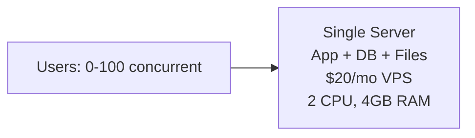
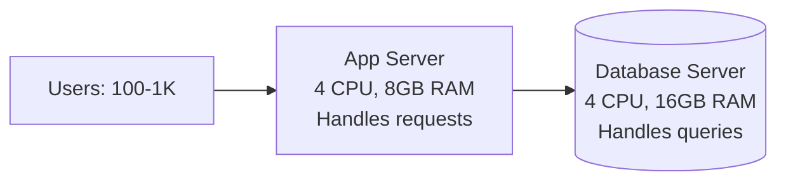
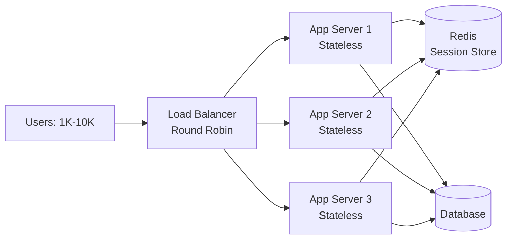
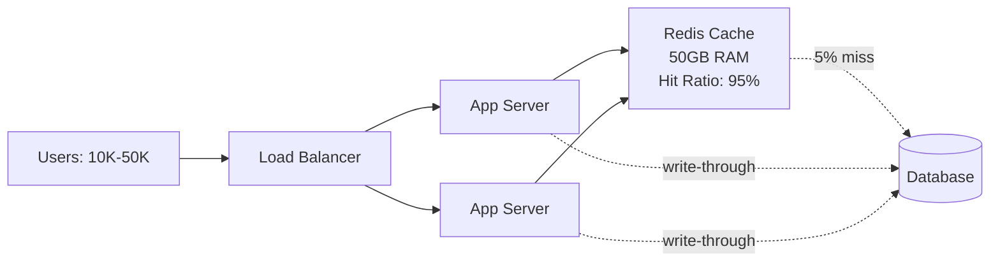
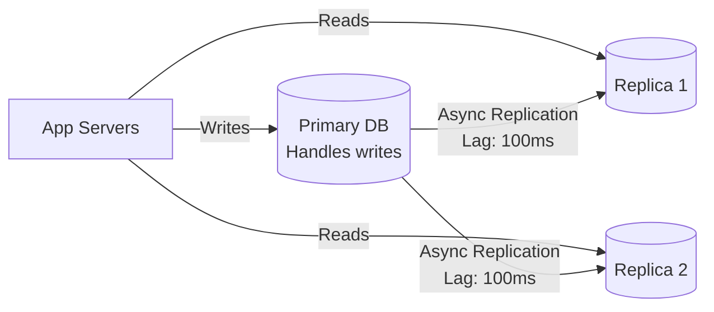
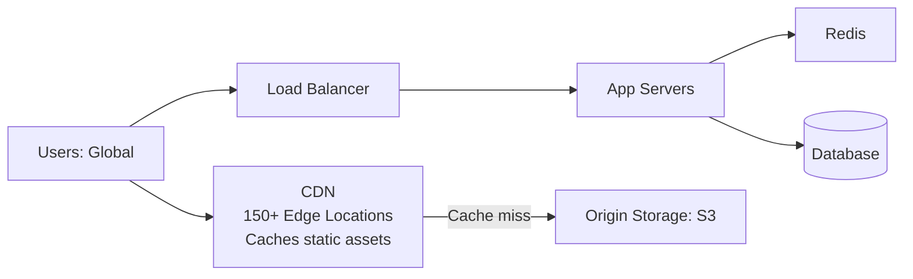
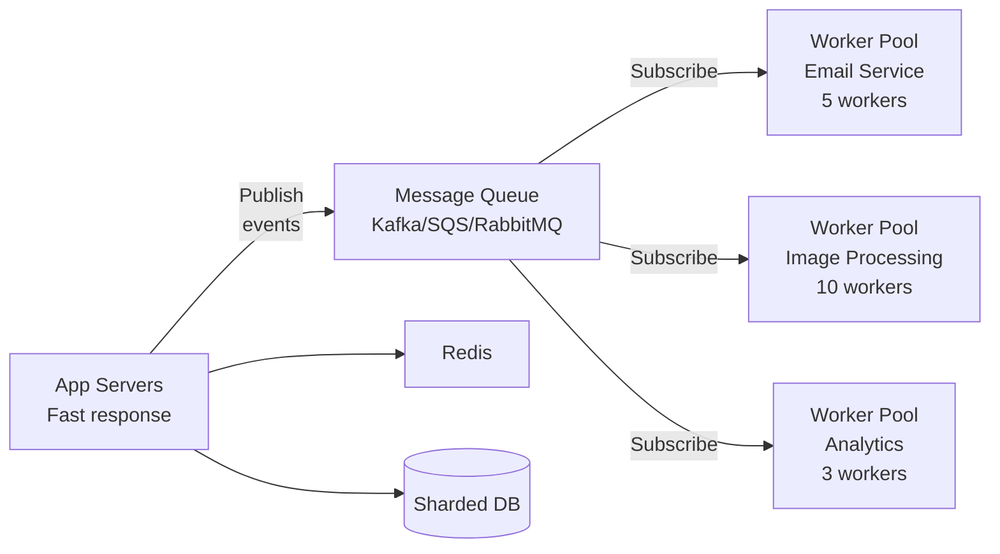
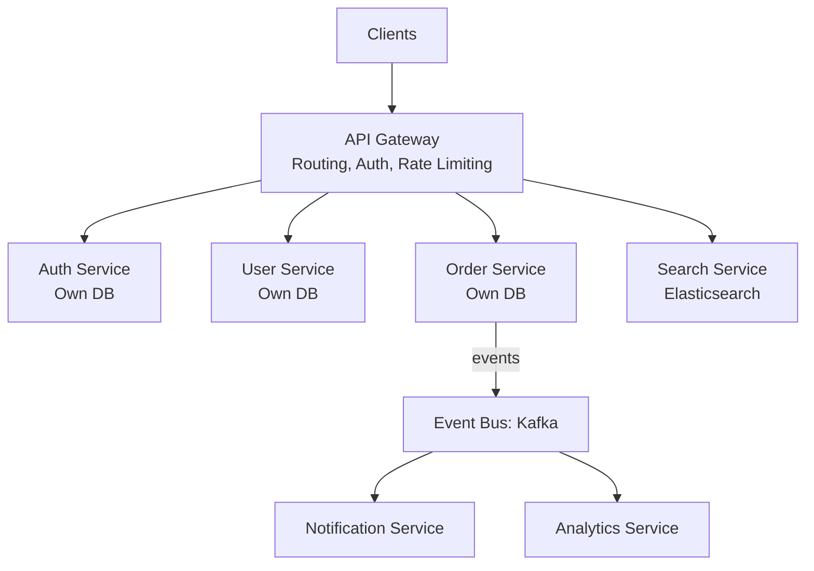
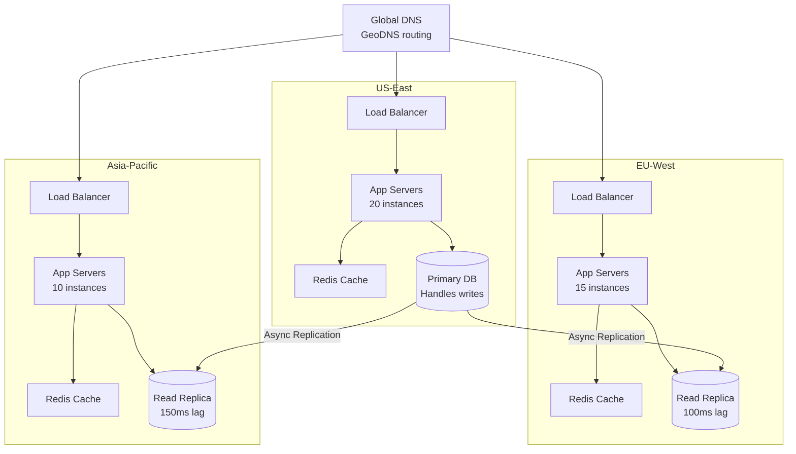

#system-design #evolution #scaling #flagship

# Scaling a Web App: From 1 Server to Millions of Users

> This is the single most important note in this vault. It ties every concept together through a real scaling story.

---

## Intuition (30 sec)

Think of scaling a web app like growing a restaurant: You start with one person cooking and serving in a food truck (single server). As customers grow, you split responsibilities (separate kitchen and servers), then hire more servers (horizontal scaling), add a buffet to reduce kitchen trips (caching), open multiple locations (sharding), and eventually franchise globally (multi-region). Each growth stage forces you to solve one specific bottleneck.

---

## Core Definitions

**Scaling:**
- **Definition:** The process of increasing system capacity to handle growing user traffic and data while maintaining or improving performance
- **Purpose:** To serve more users without degrading response times, reliability, or user experience
- **How it works:** Incrementally adding resources (servers, databases, caching) and architectural changes to eliminate bottlenecks as they appear

**Key Terms:**
- **Vertical Scaling (Scale Up):** Adding more resources (CPU, RAM) to a single server. Limited by hardware constraints.
- **Horizontal Scaling (Scale Out):** Adding more servers to distribute load. Theoretically unlimited but requires architectural changes.
- **Bottleneck:** The component in your system that limits overall performance (usually CPU, memory, disk I/O, or network bandwidth)
- **QPS (Queries Per Second):** The rate of incoming requests your system needs to handle
- **Latency:** The time it takes to process one request (usually measured in milliseconds)
- **Throughput:** The maximum amount of requests your system can handle per second
- **Stateless Service:** A server that doesn't store session data, allowing any server to handle any request
- **Concurrent Requests:** The number of requests being processed simultaneously = QPS × Latency (in seconds)

---

## The Story

You launch a startup. Day 1: one server. Day 1000: millions of users. Here's every step, why you took it, and what broke at each stage.

---

## Stage 1: Single Server (0-100 users)

**Definition:** A monolithic architecture where all components (web server, application logic, database, static files) run on a single physical or virtual machine.

**Everything on one machine:** web server, application, database.



**What works:** Simple, cheap, fast to develop. One machine to SSH into.
**What you're running:** Node.js/Django/Rails + PostgreSQL + Nginx on a $20/month VPS.
**Key metric:** Response time ~50ms. Plenty fast.

**Capacity Planning:**
```
Expected Load:
• Daily active users: 100
• Average requests per user: 20 requests/day
• Total daily requests: 2,000
• Average QPS: 2,000 ÷ 86,400 = 0.023 QPS
• Peak QPS (3x average): ~0.07 QPS

Concurrent Requests:
• Latency: 50ms = 0.05 seconds
• Concurrent = QPS × Latency = 0.07 × 0.05 = 0.0035
• A single server can easily handle this
```

**The problem that hits:** At 100 concurrent users, CPU spikes. App and DB compete for the same CPU/RAM.

**Why it fails:**
- Database queries consume 60% CPU
- Application logic needs remaining 40% CPU
- Both compete for same 4GB RAM
- Disk I/O becomes bottleneck when DB writes spike

---

## Stage 2: Separate the Database (100-1K users)

**Definition:** Database separation is the process of moving the database to a dedicated server, allowing independent resource allocation for application logic and data storage.

**Move the database to its own server.** Now app and DB have dedicated resources.



**What changes:** App server handles requests. DB server handles queries. Each can be sized independently.
**Cost:** $40/month (two servers).
**Key win:** DB can have more RAM for caching, app server can have more CPU.

**Capacity Planning:**
```
Expected Load:
• Daily active users: 1,000
• Total daily requests: 20,000
• Average QPS: 20,000 ÷ 86,400 = 0.23 QPS
• Peak QPS (3x average): ~0.7 QPS

Concurrent Requests:
• Latency: 80ms = 0.08 seconds (slightly higher due to network)
• Concurrent = 0.7 × 0.08 = 0.056
• Single app server can handle ~100 concurrent
• Current load: 0.056 / 100 = 0.056% utilization

Network overhead:
• Localhost latency: ~0ms
• Cross-server latency: ~1ms (within same data center)
• DB query time: 5-10ms
```

**The problem that hits:** At 1K users, single app server maxes out. CPU at 95%.

**Why it fails:**
- Application code is CPU-bound (JSON parsing, business logic)
- Single server handles all requests sequentially
- No redundancy: if app server dies, site is down

---

## Stage 3: Load Balancer + Multiple App Servers (1K-10K users)

**Definition:** Horizontal scaling through load balancing distributes incoming traffic across multiple identical servers, increasing capacity and providing redundancy.

**Add a [[02_building_blocks/load_balancers|load balancer]] and run multiple app servers.**



**Critical requirement:** App servers MUST be **stateless**. No sessions stored in memory. Use Redis for sessions. (See [[01_fundamentals/scalability]])

**Key Terms:**
- **Stateless Server:** A server that stores no client session data locally, allowing any server to handle any request
- **Load Balancer:** A reverse proxy that distributes requests across multiple servers using algorithms like round-robin or least connections
- **Session Store:** External storage (Redis/Memcached) that holds user session data accessible by all app servers

**What changes:** Traffic distributed across 3 servers. Can add more servers as needed.
**Key win:** If one server dies, others handle traffic. First taste of high availability.

**Capacity Planning:**
```
Expected Load:
• Daily active users: 10,000
• Total daily requests: 200,000
• Average QPS: 200,000 ÷ 86,400 = 2.3 QPS
• Peak QPS (5x average): ~12 QPS

Concurrent Requests:
• Latency: 100ms = 0.1 seconds
• Concurrent = 12 × 0.1 = 1.2

Server Capacity:
• Each server handles ~33 concurrent requests
• 3 servers = 99 concurrent capacity
• Current load: 1.2 / 99 = 1.2% utilization
• Comfortable headroom

Why 3 servers?
• N+1 redundancy: if 1 dies, 2 can handle load
• Cost: 3 × $30 = $90/month
• Can scale to ~330 concurrent (27,500 QPS peak)
```

**The problem that hits:** Database is the bottleneck. All 3 app servers hammer one DB. Query latency increases from 5ms to 200ms.

**Why it fails:**
- Database connection pool exhausted (100 connections max)
- 3 app servers create 300 concurrent DB connections
- DB CPU at 100% handling repetitive queries
- No caching: same queries executed thousands of times

---

## Stage 4: Add Caching (10K-50K users)

**Definition:** Caching is an in-memory data store that holds frequently accessed data to reduce database load and improve response times.

**Put a [[02_building_blocks/caching|cache]] (Redis) in front of the database.**



**Key Terms:**
- **Cache Hit:** Request finds data in cache, returns in ~1ms
- **Cache Miss:** Data not in cache, must query database (~50ms)
- **Hit Ratio:** Percentage of requests served from cache (target: 90%+)
- **TTL (Time To Live):** How long data stays in cache before expiring (e.g., 5 minutes)
- **Cache-Aside Pattern:** Application checks cache first, queries DB on miss, then stores result in cache

**Cache-aside pattern:** Check cache → hit? Return cached data. Miss? Query DB, store in cache.
**What to cache:** User profiles, product pages, API responses — anything read frequently.
**Hit ratio target:** 90%+ means 90% fewer DB queries.

**Capacity Planning:**
```
Expected Load:
• Daily active users: 50,000
• Average QPS: 23 QPS
• Peak QPS: ~115 QPS

Database Impact:
• Without cache: 115 QPS × 50ms = 5.75 concurrent DB queries
• With 95% hit ratio: 115 × 0.05 = 5.75 QPS to DB
• DB concurrent queries: 5.75 × 0.05 = 0.29 (98% reduction!)

Latency Improvement:
• Cached request: 1ms (cache lookup)
• DB request: 50ms (query + network)
• Weighted average: (0.95 × 1ms) + (0.05 × 50ms) = 3.45ms
• P95 latency: Drops from 200ms to 20ms

Cache Memory Sizing:
• User object: 5KB
• 50K active users: 250MB
• Product pages: 100K × 10KB = 1GB
• Total needed: ~2GB, provision 50GB for growth
```

**Key win:** P95 latency drops from 200ms to 20ms. Database load drops by 90%.

**The problem that hits:** Remaining 10% DB queries are mostly reads (product listings, search, feeds). DB CPU still climbs.

**Why it fails:**
- Single database handles both reads and writes
- Read queries (SELECT) are 80-90% of traffic
- Complex queries (JOINs, aggregations) consume CPU
- Write queries block during heavy read traffic

---

## Stage 5: Database Read Replicas (50K-200K users)

**Definition:** Read replication creates multiple read-only copies of the database, distributing read traffic while the primary database handles writes.

**Add [[03_design_patterns/replication|read replicas]].** Writes go to primary, reads distributed across replicas.



**Key Terms:**
- **Primary Database:** The main database that accepts writes; source of truth
- **Read Replica:** A read-only copy of the database that receives updates asynchronously
- **Replication Lag:** Time delay between write to primary and visibility on replica (typically 50-500ms)
- **Eventual Consistency:** Replicas will eventually match the primary, but may be temporarily stale
- **Read/Write Split:** Application logic routes writes to primary, reads to replicas

**What changes:** Read queries (80-95% of traffic) spread across replicas. Primary handles writes only.
**Trade-off:** Replication lag — reads might be slightly stale (see [[01_fundamentals/consistency_models]]).
**Acceptable for:** Product listings, feeds, profiles. NOT for account balance or inventory.

**Capacity Planning:**
```
Expected Load:
• Daily active users: 200,000
• Average QPS: 92 QPS
• Peak QPS: ~460 QPS

Query Distribution:
• Read queries: 90% × 460 = 414 QPS
• Write queries: 10% × 460 = 46 QPS

Database Load:
• Primary: 46 QPS (writes only)
• Each replica: 414 ÷ 2 = 207 QPS reads
• Single DB capacity: ~500 QPS
• Each component has 50%+ headroom

Replication Lag Consideration:
• Lag: 100ms average
• User posts a comment → reads own comment
• Might see old state for 100ms
• Solution: Read from primary for "read-your-writes" consistency
```

**The problem that hits:** Static assets (images, CSS, JS) consume most bandwidth. App servers waste time serving files.

**Why it fails:**
- Static files account for 60% of bandwidth
- App servers waste CPU serving images/CSS/JS
- Users far from data center experience slow asset loads
- Bandwidth costs increase linearly with traffic

---

## Stage 6: CDN for Static Assets (200K-500K users)

**Definition:** A Content Delivery Network (CDN) is a geographically distributed network of servers that cache and serve static content from locations closest to users.

**Move static content to a [[02_building_blocks/cdn|CDN]].**



**Key Terms:**
- **CDN (Content Delivery Network):** A distributed network that caches content at edge locations near users
- **Edge Server:** A CDN server geographically close to end users (e.g., London, Tokyo, Sydney)
- **Origin Server:** The source of content (e.g., S3 bucket) that CDN pulls from on cache miss
- **Edge Caching:** Storing static files at edge locations with TTLs (e.g., 1 day for images)
- **Cache Invalidation:** Process of removing or updating cached content at CDN edges

**What moves to CDN:** Images, videos, CSS, JavaScript, fonts.
**Key win:** 60% of bandwidth offloaded. Global users get faster load times (edge servers).
**Bonus:** DDoS protection from CDN provider (Cloudflare).

**Capacity Planning:**
```
Expected Load:
• Daily active users: 500,000
• Average QPS: 231 QPS
• Peak QPS: ~1,155 QPS

Traffic Breakdown:
• Total requests: 1,155 QPS
• Static assets: 60% × 1,155 = 693 QPS
• Dynamic API: 40% × 1,155 = 462 QPS

Before CDN:
• App servers handle all 1,155 QPS
• Bandwidth: 1,155 × 50KB average = 57.75 MB/s
• Cost: ~$3,000/month bandwidth

After CDN:
• App servers: 462 QPS (40% reduction)
• CDN handles: 693 QPS
• CDN cache hit ratio: 95%
• Origin bandwidth: 693 × 0.05 = 35 QPS to S3
• Cost: CDN $500/month + S3 $100/month = $600/month (80% savings)

Latency Improvement:
• User in Tokyo requests image
• Before: Round trip to US = 250ms
• After: Served from Tokyo edge = 15ms (94% faster)
```

**The problem that hits:** Write traffic grows. Single primary DB can't handle the write volume.

**Why it fails:**
- Primary database handles all writes
- Write QPS grows to 100+ QPS
- Single primary DB can't scale horizontally
- Disk I/O becomes bottleneck for writes

---

## Stage 7: Shard the Database (500K-2M users)

**Definition:** Database sharding is the practice of horizontally partitioning data across multiple database servers, with each shard holding a subset of the total data.

**[[03_design_patterns/sharding|Shard]] the database.** Split data across multiple database servers.

```mermaid
graph LR
    App[App Servers] --> Router[Shard Router<br/>hash(user_id) % N]
    Router --> S1[(Shard 1<br/>user_id % 4 = 0<br/>25% of users)]
    Router --> S2[(Shard 2<br/>user_id % 4 = 1<br/>25% of users)]
    Router --> S3[(Shard 3<br/>user_id % 4 = 2<br/>25% of users)]
    Router --> S4[(Shard 4<br/>user_id % 4 = 3<br/>25% of users)]
    S1 --> R1[(Replica)]
    S2 --> R2[(Replica)]
    S3 --> R3[(Replica)]
    S4 --> R4[(Replica)]
```

**Key Terms:**
- **Sharding:** Horizontal partitioning of data across multiple databases
- **Shard Key:** The field used to determine which shard holds the data (e.g., user_id)
- **Shard Router:** Logic that routes queries to the correct shard based on shard key
- **Hash-based Sharding:** Using hash(key) % N to distribute data evenly across N shards
- **Cross-shard Query:** A query that needs data from multiple shards (expensive!)
- **Consistent Hashing:** A sharding algorithm that minimizes data movement when adding/removing shards

**Shard key:** user_id (hash-based with [[03_design_patterns/consistent_hashing|consistent hashing]]).
**What changes:** Writes distributed across shards. Each shard handles a fraction of total load.
**Challenge:** Cross-shard queries are expensive. Design data model to minimize them.

**Capacity Planning:**
```
Expected Load:
• Daily active users: 2M
• Average QPS: 925 QPS
• Peak QPS: ~4,625 QPS

Query Distribution:
• Reads: 90% × 4,625 = 4,163 QPS
• Writes: 10% × 4,625 = 463 QPS

With 4 Shards:
• Writes per shard: 463 ÷ 4 = 116 QPS
• Reads per shard replica: 4,163 ÷ 8 = 520 QPS (2 replicas/shard)
• Single DB capacity: ~600 QPS
• Each shard has 25% headroom

Shard Key Selection:
• user_id is ideal: most queries filter by user
• hash(user_id) % 4 distributes evenly
• 25% of users per shard

Avoiding Cross-shard Queries:
• Design: Store user's data on same shard
• Example: user_posts table also sharded by user_id
• Single shard query: SELECT * FROM posts WHERE user_id = 123
• Cross-shard query (avoid!): SELECT * FROM posts WHERE created_at > NOW()
```

**The problem that hits:** Certain operations (email sending, image processing, analytics) are slow and block request handling.

**Why it fails:**
- Synchronous operations block request threads
- Sending email takes 500ms → request waits
- Image resizing takes 2 seconds → request waits
- App server threads exhausted by long-running tasks

---

## Stage 8: Message Queues for Async Processing (2M-5M users)

**Definition:** Message queues decouple synchronous request processing from slow background tasks by queueing work for asynchronous processing by dedicated workers.

**Add [[02_building_blocks/message_queues|message queues]] for background work.**



**Key Terms:**
- **Message Queue:** A buffer that stores messages/events to be processed asynchronously
- **Producer:** Service that publishes messages to the queue (app servers)
- **Consumer/Worker:** Service that reads and processes messages from the queue
- **Asynchronous Processing:** Work that happens in the background, not blocking the request
- **Dead Letter Queue:** A queue for messages that fail processing repeatedly
- **At-least-once Delivery:** Guarantee that messages are delivered (but may be duplicated)

**What becomes async:** Email sending, image resizing, notifications, analytics events, search indexing.
**Key win:** API response times drop (don't wait for slow operations). Workers scale independently.

**Capacity Planning:**
```
Expected Load:
• Daily active users: 5M
• Peak QPS: 11,575 QPS

Task Breakdown:
• Email notifications: 20% of requests = 2,315 tasks/sec
• Image uploads: 5% of requests = 579 tasks/sec
• Analytics events: 100% of requests = 11,575 events/sec

Before Message Queue:
• API latency: 200ms (app) + 500ms (send email) = 700ms
• User waits 700ms per request
• App server threads blocked

After Message Queue:
• API latency: 200ms (app) + 1ms (queue publish) = 201ms
• User waits only 201ms (72% faster!)
• Email sent in background (500ms, user doesn't wait)

Worker Scaling:
• Email workers: 2,315 tasks/sec × 0.5s = 1,158 concurrent
  → Need 1,158 workers OR 10 workers with throughput queue
• Image workers: 579 tasks/sec × 2s = 1,158 concurrent
  → Need 10 workers (100 req/sec each)
• Analytics workers: Buffer and batch writes (not real-time)
  → 3 workers handling 3,858 events/sec each

Cost Efficiency:
• Workers scale independently
• Can use spot instances for non-critical workers (50% cost savings)
• Queue handles traffic spikes without dropping tasks
```

**The problem that hits:** Monolithic codebase is slowing development. Deploying one feature requires deploying everything.

**Why it fails:**
- Single codebase: 500K+ lines of code
- Deployment takes 30 minutes, blocks all teams
- Bug in one feature brings down entire site
- Teams step on each other's code
- Can't scale teams beyond 20-30 engineers

---

## Stage 9: Microservices (5M-20M users)

**Definition:** Microservices architecture decomposes a monolithic application into small, independently deployable services that communicate via APIs or events.

**Decompose into [[04_system_evolutions/from_monolith_to_microservices|microservices]].**



**Key Terms:**
- **Microservice:** An independently deployable service responsible for a single business capability
- **API Gateway:** A single entry point that routes requests to appropriate microservices
- **Service Discovery:** Mechanism for services to find each other dynamically (e.g., Consul, etcd)
- **Event Bus:** Message broker for asynchronous service-to-service communication
- **Distributed Tracing:** Tracking requests across multiple services (e.g., Jaeger, Zipkin)
- **Database per Service:** Each microservice owns its database schema (no shared DB)
- **Saga Pattern:** Coordinating transactions across multiple services using events

**What changes:** Each service owns its data, deploys independently, scales independently.
**New complexity:** Service discovery, distributed tracing ([[02_building_blocks/monitoring_and_logging]]), API gateway ([[02_building_blocks/api_gateway]]), saga pattern ([[03_design_patterns/saga_pattern]]).

**Capacity Planning:**
```
Expected Load:
• Daily active users: 20M
• Peak QPS: 46,300 QPS

Service-level QPS:
• Auth service: 100% × 46,300 = 46,300 QPS (every request)
• User service: 60% × 46,300 = 27,780 QPS (profile lookups)
• Order service: 10% × 46,300 = 4,630 QPS (purchases)
• Search service: 30% × 46,300 = 13,890 QPS (queries)

Independent Scaling:
• Auth: 46,300 QPS ÷ 1,000 per instance = 47 instances
• User: 27,780 QPS ÷ 2,000 per instance = 14 instances
• Order: 4,630 QPS ÷ 500 per instance = 10 instances (CPU intensive)
• Search: 13,890 QPS ÷ 5,000 per instance = 3 instances (Elasticsearch)

Total instances: 74 (vs 150 monolith instances)
Cost savings: 50% (right-sized services)

Team Scaling:
• 6 teams × 8 engineers = 48 engineers
• Each team owns 1-2 services
• Deploy independently (10x faster iteration)
• No coordination needed for deployments
```

**Benefits:**
- **Independent deployment:** Auth team deploys without waiting for Order team
- **Independent scaling:** Scale Search service without scaling Order service
- **Technology flexibility:** Order uses PostgreSQL, Search uses Elasticsearch
- **Fault isolation:** Bug in Search doesn't crash Order service
- **Team autonomy:** Each team owns their service end-to-end

**The problem that hits:** Users in Asia experience 300ms latency for every request (round trip to US data center).

**Why it fails:**
- Single US data center serves global traffic
- Users in Asia: 250ms round trip latency
- Users in Europe: 150ms round trip latency
- CDN only helps static assets, not API calls
- Database located in US (all reads/writes cross ocean)

---

## Stage 10: Multi-Region (20M+ users)

**Definition:** Multi-region deployment distributes application infrastructure across geographically separated data centers to reduce latency and improve reliability for global users.

**Deploy across multiple regions.**



**Key Terms:**
- **Multi-Region:** Deploying infrastructure in multiple geographic locations (e.g., US, EU, Asia)
- **GeoDNS:** DNS that routes users to nearest regional deployment based on location
- **Active-Active:** All regions serve traffic simultaneously
- **Active-Passive:** One region handles traffic, others are hot standby
- **Cross-Region Replication:** Copying data between regions (typically async)
- **Write Locality:** Strategy for where writes happen (single primary or multi-leader)

**Key decisions:**
- Reads served from local region (low latency)
- Writes routed to primary region (consistency) or multi-leader ([[03_design_patterns/replication]])
- CDN serves static content from nearest edge

**Capacity Planning:**
```
Expected Load:
• Daily active users: 50M
• Peak global QPS: 115,750 QPS

Regional Distribution:
• US (40%): 46,300 QPS
  → 20 instances × 2,315 QPS each
• Europe (35%): 40,513 QPS
  → 15 instances × 2,701 QPS each
• Asia (25%): 28,938 QPS
  → 10 instances × 2,894 QPS each

Latency Improvement:
• User in Tokyo before: 250ms (round trip to US)
• User in Tokyo after: 50ms (local Asia region)
• 80% latency reduction

Write Strategy Options:
1. Single Primary (Consistency)
   • All writes go to US primary
   • Asia writes: 50ms (local API) + 150ms (write to US) = 200ms
   • Simple, strong consistency

2. Multi-Leader (Performance)
   • Each region accepts writes locally
   • Writes: 50ms local latency
   • Eventual consistency, conflict resolution needed
   • Complex but better UX

Failure Scenarios:
• US region fails → GeoDNS routes to EU (degraded but working)
• Recovery time: Automatic failover in 60 seconds
• Data loss: Max 150ms of writes (replication lag)
```

**Architecture Decision Tree:**
```
Is strong consistency required?
├─ YES → Single primary region
│        → All writes to primary
│        → Reads from local replicas
│        → Accept higher write latency
│
└─ NO → Multi-leader replication
        → Writes to local region
        → Conflict resolution needed
        → Best performance
```

---

## Complete Visual Evolution

**From Single Server to Global Distribution:**

```
STAGE 1: Single Server (0-100 users)
┌────────────────┐
│  [ONE SERVER]  │
│  App + DB      │
│  $20/month     │
└────────────────┘
Problem: CPU exhausted
         ↓

STAGE 2: Separate Database (100-1K users)
┌──────────┐        ┌──────────┐
│   App    │───────>│ Database │
│  Server  │        │  Server  │
└──────────┘        └──────────┘
$40/month
Problem: App server maxed out
         ↓

STAGE 3: Load Balancer (1K-10K users)
              ┌───────────┐
   Users ────>│Load Bal.  │
              └─────┬─────┘
         ┌──────────┼──────────┐
         ▼          ▼          ▼
      [App1]     [App2]     [App3]
         │          │          │
         └──────────┼──────────┘
                    ▼
              ┌──────────┐
              │ Database │
              └──────────┘
$120/month
Problem: Database hammered by all app servers
         ↓

STAGE 4: Add Caching (10K-50K users)
              ┌───────────┐
   Users ────>│Load Bal.  │
              └─────┬─────┘
         ┌──────────┼──────────┐
         ▼          ▼          ▼
      [App1]     [App2]     [App3]
         │          │          │
         └──────────┼──────────┘
                    ▼
              ┌──────────┐
              │  Redis   │  <── 95% hit ratio
              │  Cache   │
              └─────┬────┘
                    │ 5% miss
                    ▼
              ┌──────────┐
              │ Database │
              └──────────┘
$200/month
Problem: Read queries still hitting DB
         ↓

STAGE 5: Read Replicas (50K-200K users)
              ┌───────────┐
   Users ────>│Load Bal.  │
              └─────┬─────┘
         ┌──────────┼──────────┐
         ▼          ▼          ▼
      [Apps]     [Apps]     [Apps]
         │          │          │
         └──────────┼──────────┘
                    │
         ┌──────────┼──────────┐
         │          │          │
    Writes ▼        │ Reads    ▼
      ┌─────────┐   │     ┌─────────┐
      │ Primary │───┼────>│Replica 1│
      │   DB    │   │     └─────────┘
      └─────────┘   │     ┌─────────┐
                    └────>│Replica 2│
                          └─────────┘
$400/month
Problem: Static assets consuming bandwidth
         ↓

STAGE 6: CDN (200K-500K users)
                    ┌───────────┐
   Users (static) ─>│    CDN    │
         │          │ (Global)  │
         │          └─────┬─────┘
         │                │ miss
         │                ▼
         │          ┌──────────┐
         │          │    S3    │
         │          └──────────┘
         │
         │ (dynamic)
         └─────────>┌───────────┐
                    │Load Bal.  │
                    └─────┬─────┘
                          │
                      [Apps...]
                          │
                      [Databases...]
$600/month
Problem: Write traffic overwhelming single DB
         ↓

STAGE 7: Database Sharding (500K-2M users)
              ┌───────────┐
   Users ────>│Load Bal.  │
              └─────┬─────┘
                    │
                [Apps...]
                    │
                    ▼
              ┌───────────┐
              │  Shard    │
              │  Router   │
              └─────┬─────┘
         ┌──────────┼──────────┐
         ▼          ▼          ▼
    ┌─────────┐ ┌─────────┐ ┌─────────┐
    │ Shard 1 │ │ Shard 2 │ │ Shard 3 │
    │Users 0-3│ │Users 4-7│ │Users 8-9│
    └────┬────┘ └────┬────┘ └────┬────┘
         │           │           │
    [Replicas]  [Replicas]  [Replicas]
$1,200/month
Problem: Slow operations block requests
         ↓

STAGE 8: Message Queues (2M-5M users)
              ┌───────────┐
   Users ────>│Load Bal.  │
              └─────┬─────┘
                    │
                [Apps...]────┐
                    │        │
                    │        ▼
                    │   ┌──────────┐
                    │   │  Kafka   │
                    │   │  Queue   │
                    │   └─────┬────┘
                    │         │
              [Databases]     ├──> [Email Workers]
                              ├──> [Image Workers]
                              └──> [Analytics Workers]
$2,000/month
Problem: Monolith deployment bottleneck
         ↓

STAGE 9: Microservices (5M-20M users)
              ┌────────────┐
   Users ────>│   API      │
              │  Gateway   │
              └──────┬─────┘
         ┌───────────┼───────────┬───────────┐
         ▼           ▼           ▼           ▼
    ┌────────┐  ┌────────┐  ┌────────┐  ┌────────┐
    │  Auth  │  │  User  │  │ Order  │  │ Search │
    │Service │  │Service │  │Service │  │Service │
    └───┬────┘  └───┬────┘  └───┬────┘  └───┬────┘
        │           │           │           │
     [Auth DB]   [User DB]  [Order DB]  [Search DB]
                                 │
                                 └──> [Event Bus] ──> [Other Services]
$5,000/month
Problem: Global users experience high latency
         ↓

STAGE 10: Multi-Region (20M+ users)
                    ┌────────────────────────┐
                    │    Global DNS          │
                    │  (GeoDNS Routing)      │
                    └───────┬────────────────┘
         ┌──────────────────┼──────────────────┐
         ▼                  ▼                  ▼
  ┌─────────────┐    ┌─────────────┐    ┌─────────────┐
  │  US Region  │    │  EU Region  │    │ APAC Region │
  ├─────────────┤    ├─────────────┤    ├─────────────┤
  │ [Services]  │    │ [Services]  │    │ [Services]  │
  │ [Primary DB]│───>│ [Replica DB]│    │ [Replica DB]│
  │ [Cache]     │    │ [Cache]     │    │ [Cache]     │
  └─────────────┘    └─────────────┘    └─────────────┘
      40% users          35% users          25% users

                    ┌────────────────────────┐
                    │   CDN (150+ edges)     │
                    │  (Static Assets)       │
                    └────────────────────────┘
$20,000+/month

Final Result: Global, resilient, independently scalable services
```

---

## Capacity Planning Reference

**Key Formulas:**

```
1. QPS (Queries Per Second)
   QPS = Total Daily Requests ÷ 86,400 seconds
   Peak QPS = Average QPS × Peak Factor (typically 3-5x)

2. Concurrent Requests
   Concurrent = QPS × Latency (in seconds)
   Example: 1000 QPS × 0.1s = 100 concurrent

3. Server Count
   Servers = Concurrent Requests ÷ Capacity per Server
   Add N+1 for redundancy (if 1 fails, others handle load)

4. Cache Hit Ratio Impact
   DB Load = Total QPS × (1 - Hit Ratio)
   Example: 1000 QPS × (1 - 0.95) = 50 QPS to DB (95% reduction)

5. Memory Sizing
   Cache Size = (Avg Object Size) × (Number of Objects) × (Overhead Factor 1.2)
   Example: 10KB × 100K objects × 1.2 = 1.2GB

6. Bandwidth
   Bandwidth = QPS × Average Response Size
   Example: 1000 QPS × 50KB = 50 MB/s

7. Database Connections
   Connections per App Server = Concurrent Queries + Overhead (20%)
   Total Pool Size = Connections × Number of App Servers

8. Cost Estimation
   Monthly Cost = (Servers × Cost per Server) + (Bandwidth × Cost per GB) + (Storage × Cost per GB)
```

**Scaling Thresholds:**

| Metric | Warning | Critical | Action |
|--------|---------|----------|--------|
| CPU | > 70% | > 85% | Add servers or optimize |
| Memory | > 80% | > 90% | Increase RAM or optimize |
| Disk I/O | > 70% | > 85% | Add SSDs or optimize queries |
| DB Connections | > 80% pool | > 95% pool | Increase pool or fix leaks |
| Cache Hit Ratio | < 80% | < 60% | Increase cache size or TTL |
| Error Rate | > 0.5% | > 2% | Investigate errors |
| P99 Latency | > 500ms | > 2000ms | Optimize slow paths |
| Queue Depth | > 1000 | > 10,000 | Add workers |
| Replication Lag | > 500ms | > 5000ms | Add replicas or optimize |

**Growth Planning:**

```
Current State:
• Users: 100,000
• QPS: 50
• Servers: 3

Expected 3x Growth:
• Users: 300,000
• QPS: 150
• Servers needed: 3 × 3 = 9

But consider:
• Cache hit ratio improvement: 150 × 0.05 = 7.5 QPS to DB (vs 50 × 0.2 = 10)
• Code optimizations: -20% CPU usage
• Actual servers needed: ~6 (not 9)

Plan:
• Month 1: Add caching (biggest win)
• Month 2: Optimize code
• Month 3: Add 3 servers (total 6)
• Month 4: Add read replicas if DB is bottleneck
```

---

## Glossary

**Quick reference for interviews:**

- **Availability:** Percentage of time system is operational (99.9% = 8.7 hours downtime/year)
- **Bandwidth:** Amount of data transferred per unit time (GB/s)
- **Bottleneck:** The component limiting system performance
- **Cache Hit Ratio:** Percentage of requests served from cache without DB query
- **CDN (Content Delivery Network):** Distributed servers that cache content near users
- **Concurrent Requests:** Number of requests being processed at the same time
- **Consistent Hashing:** Hash algorithm that minimizes data movement when adding nodes
- **Database Replica:** Read-only copy of database for distributing read load
- **Eventual Consistency:** Replicas will eventually match, but may be temporarily stale
- **Fanout:** Distributing one write to multiple destinations (e.g., followers' timelines)
- **GeoDNS:** DNS that returns different IPs based on user location
- **Horizontal Scaling:** Adding more servers (scale out)
- **Latency:** Time to process one request (milliseconds)
- **Load Balancer:** Distributes traffic across multiple servers
- **Message Queue:** Buffer for asynchronous task processing
- **Microservices:** Architecture of small, independently deployable services
- **P99 Latency:** 99% of requests complete within this time (99th percentile)
- **QPS (Queries Per Second):** Rate of incoming requests
- **Read Replica:** Database copy that handles read queries
- **Replication Lag:** Delay between write to primary and visibility on replica
- **Shard Key:** Field used to partition data across shards
- **Sharding:** Horizontal partitioning of database across multiple servers
- **Stateless Service:** Server that stores no session data locally
- **Throughput:** Maximum requests system can handle per second
- **TTL (Time To Live):** How long data stays cached before expiring
- **Vertical Scaling:** Adding more resources to one server (scale up)

---

## Summary Table

| Stage | Scale | Key Addition | Concept |
|-------|-------|-------------|---------|
| 1 | 0-100 | Single server | Keep it simple |
| 2 | 100-1K | Separate DB | Dedicated resources |
| 3 | 1K-10K | Load balancer | [[01_fundamentals/scalability\|Horizontal scaling]] |
| 4 | 10K-50K | Caching | [[02_building_blocks/caching\|Redis cache]] |
| 5 | 50K-200K | Read replicas | [[03_design_patterns/replication]] |
| 6 | 200K-500K | CDN | [[02_building_blocks/cdn]] |
| 7 | 500K-2M | DB sharding | [[03_design_patterns/sharding]] |
| 8 | 2M-5M | Message queues | [[02_building_blocks/message_queues\|Async processing]] |
| 9 | 5M-20M | Microservices | Service decomposition |
| 10 | 20M+ | Multi-region | Global distribution |

---

## Monitoring Dashboard

**Definition:** A real-time visualization of key system metrics used to detect issues, measure performance, and guide scaling decisions.

```
┌─────────────────────────────────────────────────────────────────┐
│                    SYSTEM HEALTH DASHBOARD                      │
├─────────────────────────────────────────────────────────────────┤
│                                                                 │
│  REQUEST METRICS                                                │
│  ━━━━━━━━━━━━━━━━━━━━━━━━━━━━━━━━━━━━━━━━━━━━━━━━━━━━━━━━━━━  │
│  QPS (Queries Per Second): 23,450 ▲ 5% from 1h ago            │
│  Definition: Rate of incoming requests                          │
│  Alert: > 100,000 (capacity limit)                             │
│                                                                 │
│  P50 Latency: 45ms  │  P95: 120ms  │  P99: 280ms               │
│  Definition: Percentile response times                          │
│  • P50: Half of requests faster than this                      │
│  • P95: 95% of requests faster than this                       │
│  • P99: 99% of requests faster than this                       │
│  Alert: P99 > 1000ms (poor user experience)                    │
│                                                                 │
│  Error Rate: 0.15% ✓ (normal)                                  │
│  Definition: Percentage of 4xx/5xx responses                    │
│  Alert: > 1% (indicates system issues)                         │
│  Breakdown: 404 (0.10%), 500 (0.03%), 503 (0.02%)             │
│                                                                 │
│  ─────────────────────────────────────────────────────────────  │
│  DATABASE METRICS                                               │
│  ━━━━━━━━━━━━━━━━━━━━━━━━━━━━━━━━━━━━━━━━━━━━━━━━━━━━━━━━━━━  │
│  Query Rate: 12,340 QPS (Reads: 11,106 | Writes: 1,234)       │
│  Primary DB CPU: 67% ✓                                         │
│  Replica 1 CPU: 45% ✓  │  Replica 2 CPU: 48% ✓                │
│  Alert: > 85% (add read replica or shard)                      │
│                                                                 │
│  Replication Lag: 87ms ✓                                       │
│  Definition: Delay between write to primary and visibility      │
│              on replicas                                        │
│  Alert: > 1000ms (stale reads)                                 │
│                                                                 │
│  Query Latency: P95: 25ms ✓  │  P99: 95ms ✓                   │
│  Slow Query Count: 23 queries > 1s in last hour               │
│  Action: Review slow query log and add indexes                 │
│                                                                 │
│  Connection Pool: 78/100 connections used ✓                    │
│  Alert: > 90 (increase pool size)                              │
│                                                                 │
│  ─────────────────────────────────────────────────────────────  │
│  CACHE METRICS                                                  │
│  ━━━━━━━━━━━━━━━━━━━━━━━━━━━━━━━━━━━━━━━━━━━━━━━━━━━━━━━━━━━  │
│  Cache Hit Ratio: 94.2% ✓                                      │
│  Definition: Percentage of requests served from cache           │
│  Target: > 90% (10x reduction in DB load)                      │
│  Alert: < 70% (cache not effective)                            │
│                                                                 │
│  Hits: 21,973/sec  │  Misses: 1,477/sec                        │
│  Evictions: 145/sec ✓ (normal)                                 │
│  Alert: Evictions > 1,000/sec (increase cache size)            │
│                                                                 │
│  Memory Usage: 42GB / 50GB (84%) ⚠                             │
│  Alert: > 85% (scale up cache)                                 │
│                                                                 │
│  Cache Latency: P99: 2ms ✓                                     │
│  Definition: Time to retrieve from cache                        │
│  Alert: > 10ms (network or cache issues)                       │
│                                                                 │
│  ─────────────────────────────────────────────────────────────  │
│  INFRASTRUCTURE METRICS                                         │
│  ━━━━━━━━━━━━━━━━━━━━━━━━━━━━━━━━━━━━━━━━━━━━━━━━━━━━━━━━━━━  │
│  App Servers: 24 healthy ✓  │  2 unhealthy ⚠                  │
│  Load Balancer: Distributing evenly ✓                          │
│                                                                 │
│  CPU Usage (avg across servers): 58% ✓                         │
│  Memory Usage: 72% ✓                                           │
│  Network I/O: 2.3 GB/s in, 4.1 GB/s out ✓                     │
│  Alert: Network > 8 GB/s (bandwidth limit)                     │
│                                                                 │
│  ─────────────────────────────────────────────────────────────  │
│  MESSAGE QUEUE METRICS                                          │
│  ━━━━━━━━━━━━━━━━━━━━━━━━━━━━━━━━━━━━━━━━━━━━━━━━━━━━━━━━━━━  │
│  Queue Depth: 1,245 messages ✓                                 │
│  Definition: Number of messages waiting to be processed         │
│  Alert: > 10,000 (workers falling behind)                      │
│                                                                 │
│  Processing Rate: 3,450 msg/sec ✓                              │
│  Consumer Lag: 0.4 seconds ✓                                   │
│  Alert: Lag > 60 seconds (add workers)                         │
│                                                                 │
│  Dead Letter Queue: 12 messages ⚠                              │
│  Action: Investigate failed messages                            │
│                                                                 │
└─────────────────────────────────────────────────────────────────┘

Legend: ✓ Healthy  │  ⚠ Warning  │  ✗ Critical
```

**Key Monitoring Principles:**
- **RED Method:** Rate, Errors, Duration (for every service)
- **USE Method:** Utilization, Saturation, Errors (for every resource)
- **Golden Signals:** Latency, Traffic, Errors, Saturation
- **Alert Fatigue:** Only alert on actionable issues
- **SLOs (Service Level Objectives):** Set targets (e.g., P99 < 200ms, uptime > 99.9%)

---

## Decision Trees

### When to Add Caching?

```
Start: Is your database CPU > 70%?
│
├─ NO → Monitor and wait
│
└─ YES → Are most queries reads?
         │
         ├─ NO → Consider read replicas or sharding
         │
         └─ YES → Is data frequently accessed?
                  │
                  ├─ NO → Optimize queries (indexes)
                  │       Database may be inefficient
                  │
                  └─ YES → Add caching!
                           ├─ User profiles? → Cache for 5-10 min
                           ├─ Product listings? → Cache for 1 hour
                           ├─ Static content? → Use CDN
                           └─ Real-time data? → Cache for 10-30 sec
```

### When to Shard the Database?

```
Start: Is your primary DB write CPU > 80%?
│
├─ NO → Add read replicas for read scaling
│
└─ YES → Have you optimized queries and indexes?
         │
         ├─ NO → Optimize first! Sharding is expensive
         │
         └─ YES → Can you identify a shard key?
                  │
                  ├─ NO → Consider vertical scaling
                  │       or NoSQL database
                  │
                  └─ YES → Shard key characteristics:
                           • High cardinality? ✓
                           • Even distribution? ✓
                           • Queries filter by it? ✓
                           • Avoids cross-shard queries? ✓
                           │
                           ALL YES? → Proceed with sharding
                           │
                           Start with 2-4 shards
                           Use consistent hashing
```

### When to Switch to Microservices?

```
Start: Evaluate your current state
│
├─ Team size < 10 engineers?
│  └─ Stay monolith (lower complexity)
│
├─ Deploy frequency < 1x/day?
│  └─ Monolith is fine
│
└─ Are you experiencing these issues?
   │
   ├─ Deployment takes > 30 minutes? ✓
   ├─ One bug crashes entire system? ✓
   ├─ Teams block each other on deploys? ✓
   ├─ Different components need different scaling? ✓
   ├─ Code merge conflicts daily? ✓
   │
   3+ checkmarks? → Consider microservices
   │
   BUT FIRST:
   ├─ Try modular monolith (internal service boundaries)
   ├─ Ensure you have:
   │  • Service discovery
   │  • Distributed tracing
   │  • API gateway
   │  • DevOps automation
   │  • Team ownership model
   │
   └─ Extract 1-2 services first (not all at once!)
      Good candidates:
      • Authentication (called by everything)
      • Notification (independent)
      • Search (different tech stack)
```

### Horizontal vs Vertical Scaling Decision

```
Problem: Server CPU at 90%
│
├─ Is your application stateful?
│  │
│  ├─ YES → Vertical scaling (easier)
│  │        Or refactor to stateless
│  │
│  └─ NO → Horizontal scaling preferred
│
├─ Cost comparison:
│  │
│  ├─ Current: 1 server @ 8 CPU = $200/mo
│  │
│  ├─ Vertical: 1 server @ 16 CPU = $400/mo
│  │  Pros: Simple, no architecture change
│  │  Cons: Limited ceiling (max 96 CPU), no redundancy
│  │
│  └─ Horizontal: 2 servers @ 8 CPU = $400/mo
│     Pros: Unlimited scaling, redundancy, better fault tolerance
│     Cons: Requires load balancer, stateless architecture
│
└─ Best practice:
   Scale horizontally when possible
   Use vertical as temporary solution
```

---

## Troubleshooting Bottlenecks

### Symptom: High Latency (P99 > 1000ms)

```
Step 1: Identify the layer
├─ Check distributed tracing (Jaeger/Zipkin)
│  Shows time spent in each service
│
Step 2: Where is time spent?
│
├─ In Database (> 500ms)?
│  │
│  ├─ Check slow query log
│  │  Solution: Add indexes, optimize queries
│  │
│  ├─ Check DB CPU (> 85%)?
│  │  Solution: Add read replicas or cache
│  │
│  └─ Check connection pool exhaustion?
│     Solution: Increase pool size or optimize queries
│
├─ In External API calls (> 300ms)?
│  │
│  ├─ Add timeout and circuit breaker
│  ├─ Cache responses if possible
│  └─ Make calls asynchronous
│
├─ In Application code (> 200ms)?
│  │
│  ├─ Profile code (CPU flame graph)
│  ├─ Look for N+1 queries
│  ├─ Check for blocking I/O
│  └─ Optimize hot code paths
│
└─ In Network (> 100ms)?
   │
   ├─ Cross-region calls? → Multi-region deployment
   ├─ Large payloads? → Compress responses
   └─ Too many round trips? → Batch requests
```

### Symptom: Database CPU at 100%

```
Step 1: Identify query type
├─ Run: SHOW PROCESSLIST (MySQL) or pg_stat_activity (Postgres)
│
Step 2: Are queries slow or just high volume?
│
├─ Slow Queries (> 1 second)?
│  │
│  ├─ EXPLAIN query → Missing indexes?
│  │  Solution: Add indexes on WHERE/JOIN columns
│  │
│  ├─ Full table scans?
│  │  Solution: Add indexes or partition table
│  │
│  ├─ Complex JOINs?
│  │  Solution: Denormalize or cache result
│  │
│  └─ Lock contention?
│     Solution: Use row-level locking, optimize transactions
│
└─ High Volume (queries are fast but many)?
   │
   ├─ Mostly reads (> 80%)?
   │  │
   │  ├─ Add caching (Redis)
   │  │  Expected: 10-100x reduction in DB load
   │  │
   │  └─ Add read replicas
   │     Split reads across 2-4 replicas
   │
   └─ Mostly writes (> 30%)?
      │
      ├─ Single table hot? → Shard by key
      │  Example: user_id, tenant_id
      │
      ├─ Small writes? → Batch inserts
      │  Insert 1000 rows at once instead of 1 by 1
      │
      └─ Sequential IDs? → Use UUID or snowflake ID
         Reduces write contention
```

### Symptom: Cache Hit Ratio < 70%

```
Problem: Cache is not effective
│
Step 1: Check metrics
├─ Evictions > 1000/sec?
│  │
│  └─ Cache memory full → Increase cache size
│     OR reduce TTL for less important data
│
├─ TTL too short?
│  │
│  └─ Data expires before being reused
│     Solution: Increase TTL based on data type
│     • User profiles: 5-10 minutes
│     • Product info: 1 hour
│     • Static pages: 24 hours
│
├─ Cache keys not optimized?
│  │
│  └─ Each user sees unique content (can't cache)
│     Solution:
│     • Cache common parts
│     • Use fragment caching
│     • Normalize cache keys
│
└─ Cold cache after restart?
   │
   └─ Cache warming strategy
      • Pre-populate popular keys on startup
      • Use write-through caching
      • Persistent cache (Redis with AOF)
```

### Symptom: Message Queue Depth Growing

```
Problem: Queue depth > 10,000 and increasing
│
Step 1: Workers falling behind
│
├─ Check worker processing rate
│  Current: 500 msg/sec
│  Incoming: 1,200 msg/sec
│  Gap: 700 msg/sec (queue grows by 700/sec)
│
Step 2: Why are workers slow?
│
├─ Workers CPU at 100%?
│  │
│  └─ Add more workers
│     Calculate: Need 2.4x workers
│     Current: 10 workers → Add 14 more = 24 total
│
├─ Workers waiting on external service?
│  │
│  ├─ Database slow? → Optimize DB queries
│  ├─ API slow? → Increase timeout or parallelize
│  └─ Network latency? → Deploy workers closer
│
├─ Workers crashing?
│  │
│  └─ Check dead letter queue
│     Fix bugs causing crashes
│     Add retry logic with exponential backoff
│
└─ Poison message?
   │
   └─ One bad message crashes all workers
      Solution:
      • Add message validation
      • Skip after N retries
      • Alert on repeated failures
```

---

## Real-World Examples

### Example 1: Twitter - Scaling Timeline Delivery

**Problem Definition:**
Twitter grew from 1M to 100M users (2008-2012). Timeline delivery became the bottleneck. Each user follows 100s of people, and each tweet must fan-out to all followers' timelines.

**Initial Approach (Fanout on Read):**
```
User requests timeline:
1. Query: SELECT tweets FROM follows WHERE user_id IN (following_list)
2. Merge and sort tweets from 100s of users
3. Return top 20

Problem: Query joins across millions of rows (slow!)
Latency: 500-1000ms per timeline load
```

**Solution Definition (Fanout on Write):**
```
User posts tweet:
1. Fetch list of followers (millions for celebrities)
2. Write tweet to each follower's timeline cache (Redis)
3. Timeline is pre-computed

User requests timeline:
1. Query Redis: GET timeline:user_123
2. Return cached timeline
3. Latency: 10-20ms (50x faster!)
```

**Architecture Before:**
```
User Request
    │
    ▼
┌─────────┐
│ App     │
│ Server  │──┐
└─────────┘  │
             ├──> Query DB for follows
             │    JOIN with tweets table
             │    Sort by timestamp
             │    (500ms latency)
             ▼
      ┌──────────┐
      │ Database │
      │ (MySQL)  │
      └──────────┘
```

**Architecture After:**
```
Tweet Posted
    │
    ▼
┌─────────┐      ┌──────────┐
│ App     │─────>│ Fanout   │
│ Server  │      │ Service  │
└─────────┘      └─────┬────┘
                       │
                       ├──> Write to Redis timelines
                       │    (5M writes/sec)
                       ▼
                ┌─────────────┐
                │Redis Cluster│
                │ (100s nodes)│
                └─────────────┘

User Loads Timeline (10ms)
```

**Technical Terms Used:**
- **Fanout:** Distributing a single write to multiple locations (follower timelines)
- **Fanout on Write:** Pre-compute timelines when tweets are posted (write-heavy)
- **Fanout on Read:** Compute timelines when requested (read-heavy)
- **Hybrid Approach:** Twitter uses fanout-on-write for regular users, fanout-on-read for celebrities (>10M followers) to avoid writing to 10M+ timelines

**Results:**
- **Timeline Latency:** Dropped from 500ms to 20ms (96% improvement)
- **Database Load:** Reduced by 90% (reads served from Redis)
- **Scalability:** Can handle 6,000 tweets/second
- **Trade-off:** More complex writes, but much faster reads (good trade since reads >>> writes)

**Lessons:**
- Pre-compute expensive operations when possible
- Choose fanout strategy based on read/write ratio
- Use hybrid approaches for outliers (celebrities)
- Cache everything that can be cached

---

### Example 2: Reddit - Evolution from Single Server to Multi-Region

**Problem Definition:**
Reddit grew from a simple link-sharing site on one server (2005) to 50M+ daily users requiring sophisticated architecture (2020s).

**Stage-by-Stage Evolution:**

**2005-2006: Single Server**
```
┌──────────────────┐
│  Single Server   │
│  Python + PostgreSQL │
│  $100/month      │
└──────────────────┘

Users: 1,000
QPS: < 1
```

**2006-2008: Separate Database**
```
┌─────────┐        ┌──────────┐
│ Web     │───────>│PostgreSQL│
│ Server  │        │ Database │
└─────────┘        └──────────┘

Users: 100K
QPS: ~10
Problem: Database bottleneck
```

**2008-2010: Caching + Load Balancing**
```
          ┌─────────┐
Users ───>│ Load    │
          │Balancer │
          └────┬────┘
               │
      ┌────────┼────────┐
      ▼        ▼        ▼
    [App1]  [App2]  [App3]
      │        │        │
      └────────┼────────┘
               ▼
         ┌──────────┐
         │ Memcached│  <── Added caching
         └─────┬────┘
               │
               ▼
         ┌──────────┐
         │PostgreSQL│
         └──────────┘

Users: 1M
QPS: ~100
Key Win: 80% of requests served from cache
Problem: Database writes becoming bottleneck
```

**2010-2012: Cassandra for Comments**
```
Comments: Moved to Cassandra (NoSQL)
Reason: Write-heavy workload (millions of comments/day)
PostgreSQL: Still used for posts, users, votes
Cassandra: Better for high-volume writes

Architecture: Polyglot persistence
• PostgreSQL: Posts, users (strong consistency)
• Cassandra: Comments (eventual consistency ok)
• Memcached: Hot data caching

Users: 10M
QPS: ~1,000
```

**2012-2016: Message Queues + Search**
```
                ┌──────────┐
                │ App      │
                │ Servers  │
                └─────┬────┘
                      │
        ┌─────────────┼─────────────┐
        ▼             ▼             ▼
  ┌──────────┐  ┌──────────┐  ┌──────────┐
  │PostgreSQL│  │Cassandra │  │ Memcached│
  └──────────┘  └──────────┘  └──────────┘
        │
        └────> RabbitMQ (Message Queue)
                  │
                  ├─> Search Indexer ──> Elasticsearch
                  ├─> Email Workers
                  └─> Thumbnail Generator

Users: 50M
QPS: ~10,000
Problem: Monolith slowing development
```

**2016-2020: Microservices**
```
                  ┌─────────────┐
    Users ───────>│ API Gateway │
                  └──────┬──────┘
                         │
          ┌──────────────┼──────────────┐
          ▼              ▼              ▼
    ┌─────────┐    ┌─────────┐    ┌─────────┐
    │ Post    │    │ Comment │    │ Vote    │
    │ Service │    │ Service │    │ Service │
    └────┬────┘    └────┬────┘    └────┬────┘
         │              │              │
    PostgreSQL      Cassandra        Redis

Team structure: 15 teams, each owns 2-3 services
Deploy: 50+ times/day (vs 1x/week with monolith)

Users: 100M
QPS: ~50,000
```

**2020+: Multi-Region + CDN**
```
Global Architecture:

         [CloudFront CDN]
               │
         ┌─────┴─────┐
         ▼           ▼
   US Region    EU Region
   (Primary)    (Replica)
      │            │
   Services    Services
      │            │
   Databases   Databases

Geographic distribution:
• US users → US region (50ms latency)
• EU users → EU region (40ms latency)
• Static content → CloudFront (20ms latency)

Users: 400M+
Peak QPS: 200,000+
```

**Key Scaling Decisions:**

| Year | Users | Key Addition | Why |
|------|-------|-------------|-----|
| 2005 | 1K | Single server | Simplicity |
| 2006 | 100K | Separate DB | Resource isolation |
| 2008 | 1M | Memcached | Reduce DB load 80% |
| 2010 | 10M | Cassandra | Handle write-heavy comments |
| 2012 | 50M | Message queues | Async processing |
| 2016 | 100M | Microservices | Team scalability |
| 2020 | 400M | Multi-region | Global latency |

**Technical Decisions:**
- **Polyglot Persistence:** PostgreSQL for relational data, Cassandra for comments, Redis for votes
- **Eventual Consistency:** Acceptable for vote counts (minor delays ok)
- **Caching Strategy:** Cache-aside with 99% hit rate on hot posts
- **Sharding:** Comments sharded by post_id (keeps comments together)

**Results:**
- **Latency:** P95 from 2000ms (2010) to 150ms (2020)
- **Availability:** 99.9% uptime (8.7 hours downtime/year)
- **Scale:** Handles 1M posts/day, 10M comments/day
- **Cost Efficiency:** $0.002 per active user/month

**Lessons from Reddit:**
- Start simple, scale when needed (not before)
- Caching is the biggest win (80-90% DB load reduction)
- Right tool for right job (PostgreSQL vs Cassandra vs Redis)
- Team structure follows architecture (Conway's Law)
- Monitor everything, optimize bottlenecks iteratively

---

## Key Lessons

1. **Don't over-engineer early.** Stage 1 is fine for months.
2. **Scale incrementally.** Each stage solves the CURRENT bottleneck, nothing more.
3. **Caching is the biggest bang for buck** — usually 10-100x improvement.
4. **Stateless services are the foundation** of everything after Stage 3.
5. **Every scaling decision has trade-offs** — complexity, consistency, cost.
6. **Monitor first, optimize second.** You can't fix what you don't measure.
7. **Horizontal scaling > Vertical scaling** for redundancy and unlimited growth.
8. **Database is usually the bottleneck.** Cache, replicate, then shard (in that order).
9. **Make it work, make it right, make it fast** — in that order.
10. **Real-world systems are messy** — Twitter and Reddit evolved over years, not designed perfectly upfront.

---

## Interview Preparation

### Common Interview Questions

**Q1: "Design a system that scales from 1 user to 1 million users."**

**Answer Structure (5 minutes):**

1. **Clarify Requirements (30 sec):**
   - "What type of application? Read-heavy or write-heavy?"
   - "Any specific latency requirements?"
   - "Global users or single region?"

2. **Stage 1-3: Basic Scaling (1 min):**
   - "Start with single server for simplicity"
   - "Separate database at 100 users for resource isolation"
   - "Add load balancer + horizontal scaling at 1K users"
   - Draw simple diagram

3. **Stage 4-6: Performance Optimization (1.5 min):**
   - "Add caching layer (Redis) - biggest win, 10-100x improvement"
   - "Read replicas for database at 50K users"
   - "CDN for static assets - reduces bandwidth 60%"
   - Explain cache hit ratio and replica lag

4. **Stage 7-8: Database Scaling (1.5 min):**
   - "Shard database by user_id at 500K users"
   - "Message queues for async operations"
   - Mention trade-offs: cross-shard queries, eventual consistency

5. **Stage 9-10: Advanced Scaling (1 min):**
   - "Microservices for team scalability at 5M users"
   - "Multi-region for global users"
   - Mention complexity: distributed tracing, service discovery

**Key Points to Emphasize:**
- "Scale incrementally, solve current bottleneck"
- "Monitor first, optimize second"
- "Caching and replication before sharding"
- "Every decision has trade-offs"

---

**Q2: "Your API latency suddenly increased from 50ms to 500ms. How do you debug?"**

**Answer Structure (3 minutes):**

1. **Check Monitoring Dashboard (30 sec):**
   - "Look at P50, P95, P99 latency - which percentile increased?"
   - "Check error rate - is it errors or slow successes?"
   - "Check QPS - is traffic higher than normal?"

2. **Distributed Tracing (30 sec):**
   - "Use Jaeger/Zipkin to see where time is spent"
   - "Is it database (query time)? External API? Application code?"

3. **Database Investigation (1 min):**
   - "If database: Check slow query log"
   - "Run EXPLAIN on slow queries - missing indexes?"
   - "Check DB CPU - is it maxed out?"
   - "Check connection pool - exhausted?"
   - "Solution: Add indexes, cache, or read replicas"

4. **Application Investigation (30 sec):**
   - "Profile application code (CPU flame graph)"
   - "Look for N+1 queries"
   - "Check for blocking I/O operations"

5. **External Factors (30 sec):**
   - "Network latency increased?"
   - "Third-party API slow?"
   - "Traffic spike from unexpected source?"

**Key Debugging Tools:**
- Monitoring: Datadog, Grafana, Prometheus
- Tracing: Jaeger, Zipkin
- Profiling: py-spy (Python), pprof (Go), async-profiler (Java)
- Database: EXPLAIN, slow query log, pg_stat_activity

---

**Q3: "When would you choose database sharding vs vertical scaling?"**

**Answer Structure (2 minutes):**

1. **Define Terms (20 sec):**
   - "Sharding: Horizontal partitioning across multiple databases"
   - "Vertical scaling: Adding more resources to one database"

2. **Choose Vertical Scaling When (30 sec):**
   - "Current database is under-provisioned (< 50% CPU/memory)"
   - "Quick temporary solution needed"
   - "Data size is manageable (< 1TB)"
   - "Team lacks sharding expertise"
   - "Limit: Single server max is ~96 CPU, 1TB RAM"

3. **Choose Sharding When (30 sec):**
   - "Vertical scaling maxed out or too expensive"
   - "Write traffic is high (> 5,000 writes/sec on single DB)"
   - "Data > 5TB and growing"
   - "Need unlimited horizontal scaling"
   - "Can identify good shard key (user_id, tenant_id)"

4. **Trade-offs (40 sec):**
   - "Vertical: Simple, no app changes, but limited ceiling"
   - "Sharding: Unlimited scaling, but complex and requires refactoring"
   - "Avoid cross-shard queries (expensive!)"
   - "Consider middle ground: Use PostgreSQL partitioning first"

**Decision Tree:**
```
DB struggling?
├─ Write-heavy? → Shard
├─ Read-heavy? → Add read replicas
├─ Small data? → Vertical scaling
└─ Large data? → Shard
```

---

**Q4: "Explain caching strategies and when to use each."**

**Answer Structure (3 minutes):**

1. **Cache-Aside (Lazy Loading) - 45 sec:**
   - **How:** App checks cache → miss? Query DB + store in cache
   - **Pros:** Only cache what's needed, simple
   - **Cons:** Cache miss penalty (2 trips: cache + DB)
   - **Use:** Most common, general purpose (user profiles, product pages)

2. **Write-Through - 45 sec:**
   - **How:** Write to cache AND database simultaneously
   - **Pros:** Cache always up-to-date, no stale data
   - **Cons:** Write latency (2 operations), cache fills with unread data
   - **Use:** When strong consistency needed (financial data)

3. **Write-Behind (Write-Back) - 45 sec:**
   - **How:** Write to cache, async write to DB later
   - **Pros:** Fast writes, can batch DB writes
   - **Cons:** Risk of data loss if cache crashes
   - **Use:** High write throughput (analytics, logs)

4. **Refresh-Ahead - 45 sec:**
   - **How:** Automatically refresh cache before expiration
   - **Pros:** No cache miss penalty for hot data
   - **Cons:** Can waste resources refreshing unneeded data
   - **Use:** Predictable access patterns (homepage, top products)

**Key Metrics:**
- Hit Ratio: 90%+ is excellent
- TTL: Balance freshness vs hit ratio
- Eviction: LRU (least recently used) is most common

---

### Whiteboard Practice

**Exercise: Draw the evolution from 1K to 1M users**

**Time: 5 minutes**

1. Draw single server (10 sec)
2. Add load balancer + app servers (20 sec)
3. Add cache layer (20 sec)
4. Add read replicas (30 sec)
5. Add CDN (20 sec)
6. Show database sharding (40 sec)
7. Annotate with QPS at each stage (30 sec)
8. Mention key metrics: latency, cost, complexity (1 min)

**Tips:**
- Use simple boxes and arrows
- Label each component clearly
- Show data flow with arrows
- Mention numbers (QPS, latency, cost)
- Explain trade-offs at each stage

---

## Quick Reference Cheat Sheet

### Scaling Stages at a Glance

```
Stage | Scale | Add | Cost | Key Metric | When to Move?
------|-------|-----|------|------------|---------------
1     | 0-100 | Single Server | $20 | 50ms latency | CPU > 80%
2     | 100-1K | Separate DB | $40 | 80ms latency | App CPU > 90%
3     | 1K-10K | Load Balancer | $120 | 100ms, HA | DB overloaded
4     | 10K-50K | Caching | $200 | 20ms latency | DB queries high
5     | 50K-200K | Read Replicas | $400 | Low DB load | Read bottleneck
6     | 200K-500K | CDN | $600 | Global speed | Bandwidth cost
7     | 500K-2M | Sharding | $1.2K | Write scaling | Write overload
8     | 2M-5M | Async Queue | $2K | Fast API | Blocking tasks
9     | 5M-20M | Microservices | $5K | Team velocity | Monolith pain
10    | 20M+ | Multi-Region | $20K+ | Global UX | Global latency
```

### Capacity Planning Quick Calc

```
Given:
• 1M daily users
• Each user: 20 requests/day
• Average response time: 100ms

Calculate:
1. Daily requests: 1M × 20 = 20M
2. Average QPS: 20M ÷ 86,400 = 231
3. Peak QPS (3x): 231 × 3 = 693
4. Concurrent: 693 × 0.1 = 69.3
5. Servers (100 concurrent each): 1 server + redundancy = 2 servers

With 95% cache hit:
• DB QPS: 693 × 0.05 = 35 (20x reduction!)
```

### Bottleneck Diagnosis Quick Guide

```
Symptom                    → Check                → Solution
---------------------------|---------------------|--------------------
High latency              → Distributed trace  → Optimize slow layer
DB CPU > 85%              → Query patterns     → Cache / replicas
Cache hit < 70%           → Evictions          → Increase size / TTL
Error rate > 1%           → Error logs         → Fix bugs / scale
Queue depth growing       → Worker CPU         → Add workers
High bandwidth cost       → Traffic breakdown  → Add CDN
Deployment takes > 30min  → Team conflicts     → Microservices
Write overload            → Write QPS          → Shard database
Global users slow         → Latency by region  → Multi-region
```

### Trade-offs Matrix

| Decision | Pros | Cons | When |
|----------|------|------|------|
| **Vertical Scale** | Simple, no code change | Limited, expensive, no HA | Quick fix, < 1TB data |
| **Horizontal Scale** | Unlimited, HA, cost-effective | Complex, stateless needed | Long-term, > 10K users |
| **Caching** | Huge performance win (10-100x) | Stale data, memory cost | Read-heavy, < 1min TTL ok |
| **Read Replicas** | Scale reads, simple | Replication lag, eventual consistency | Reads > 70% traffic |
| **Sharding** | Scale writes, unlimited | Very complex, cross-shard queries | Writes > 5K/sec |
| **Microservices** | Team scalability, independent deploy | Distributed complexity, network overhead | Teams > 30 engineers |
| **Multi-Region** | Global latency, HA | Complex, data consistency | Global users |

### Key Numbers to Remember

```
1 ms = Disk seek time
10 ms = Database query (indexed)
50 ms = Cross-datacenter round trip (US East to West)
100 ms = Acceptable web page latency
150 ms = Cross-continental round trip (US to Europe)
250 ms = Cross-oceanic round trip (US to Asia)
1 second = User attention span threshold
10 seconds = Page load timeout

Cache hit ratio: 90%+ is good, 95%+ is excellent
Error rate: < 0.1% is excellent, < 1% is acceptable
Uptime: 99.9% = 8.7 hrs down/year, 99.99% = 52 min/year

QPS capacity:
• Single server: ~1,000 QPS (simple API)
• Redis cache: ~100,000 QPS per node
• Load balancer: ~1M QPS (AWS ALB)
• Database: ~5,000 QPS (complex queries)

Cost (AWS ballpark):
• Server (2 CPU, 4GB): $30/month
• Database (4 CPU, 16GB): $200/month
• Load balancer: $20/month
• CDN: $0.01/GB transferred
• S3 storage: $0.023/GB/month
```

---

## Additional Resources

**Related Notes:**
- [[01_fundamentals/scalability]] — Vertical vs horizontal scaling fundamentals
- [[02_building_blocks/load_balancers]] — Load balancing algorithms and strategies
- [[02_building_blocks/caching]] — Caching patterns and eviction policies
- [[02_building_blocks/cdn]] — CDN architecture and edge computing
- [[02_building_blocks/message_queues]] — Async processing with queues
- [[03_design_patterns/replication]] — Database replication strategies
- [[03_design_patterns/sharding]] — Database partitioning patterns
- [[03_design_patterns/consistent_hashing]] — Hash-based sharding
- [[04_system_evolutions/from_monolith_to_microservices]] — Service decomposition

**External Resources:**
- AWS Well-Architected Framework (Reliability & Performance pillars)
- Google SRE Book (Capacity planning chapter)
- High Scalability Blog (Real-world architecture case studies)
- System Design Primer (GitHub repo with comprehensive guides)
