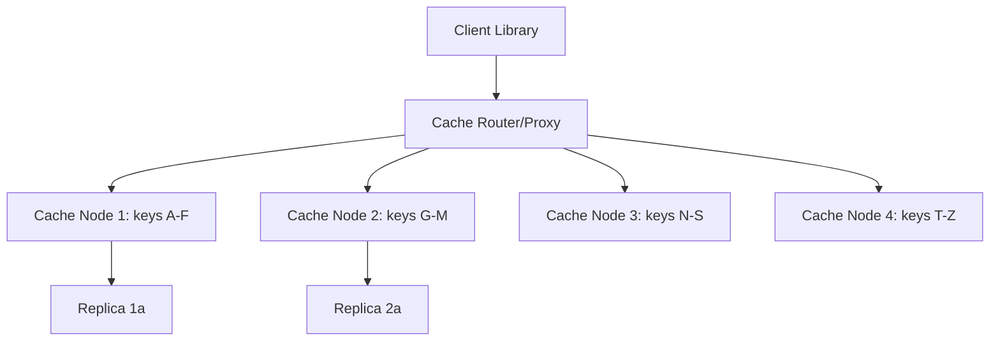

#system-design #case-study #intermediate

# Design a Distributed Cache (Redis-like)

## The Question

> "Design a distributed caching system like Redis or Memcached."

---

## Step 1: Requirements

**Functional:** GET/SET/DELETE by key, TTL expiration, support various data types (strings, lists, sets, hashes), LRU eviction when full
**Non-Functional:** Sub-millisecond latency, handle 1M+ ops/sec, high availability, data partitioned across nodes

---

## Step 2: High-Level Design



---

## Step 3: Deep Dive

### Data Partitioning: Consistent Hashing

Use [[03_design_patterns/consistent_hashing]] to distribute keys across nodes:
```
hash(key) → position on hash ring → nearest node clockwise
```

Adding/removing nodes only moves ~1/N keys. Virtual nodes for better distribution.

### Single Node Architecture

```
┌─────────────────────────────────┐
│          Cache Node              │
│  ┌─────────────────────────┐    │
│  │   Hash Table (in-memory) │    │
│  │   key → value + TTL      │    │
│  └─────────────────────────┘    │
│  ┌─────────────────────────┐    │
│  │   LRU Linked List        │    │
│  │   (eviction order)       │    │
│  └─────────────────────────┘    │
│  ┌─────────────────────────┐    │
│  │   TTL Expiry (lazy +     │    │
│  │   periodic cleanup)      │    │
│  └─────────────────────────┘    │
└─────────────────────────────────┘
```

**LRU Eviction:** Doubly-linked list + hash map. O(1) for both access and eviction.

**TTL Expiration:**
- **Lazy:** Check expiry on access. If expired, delete and return null.
- **Active:** Background thread scans random keys periodically, deletes expired ones.
- Combination of both (how Redis actually works).

### Replication for Availability

Each primary node has 1-2 replicas:
- Writes go to primary → async replication to replicas
- If primary dies → promote replica
- Trade-off: async replication means possible data loss of last few writes

### Cache Client Library

Smart client that knows the hash ring:
```java
public class CacheClient {
    private final ConsistentHash ring;

    public String get(String key) {
        CacheNode node = ring.getNode(key);
        return node.get(key); // Direct connection to correct node
    }

    public void set(String key, String value, Duration ttl) {
        CacheNode node = ring.getNode(key);
        node.set(key, value, ttl);
    }
}
```

### Cache Stampede Prevention

When a popular key expires, 1000 requests simultaneously query the database:
```
Solution: Distributed lock
1. First request acquires lock: SET "lock:popular_key" "1" NX EX 5
2. Other requests wait or return stale data
3. First request fills cache, releases lock
4. Other requests get cached data
```

---

## Interview Simulation

> **Interviewer:** Design a distributed cache.

> **Candidate:** I'd design this with consistent hashing for partitioning keys across nodes. Each node is an in-memory hash table with an LRU eviction policy — implemented as a doubly-linked list plus hash map for O(1) operations.

> **Candidate:** For TTL expiration, I'd use Redis's approach: lazy expiration on access combined with periodic active scanning. For availability, each primary node has async replicas. A smart client library knows the hash ring and routes directly to the correct node — no proxy bottleneck.

> **Interviewer:** What about cache stampede?

> **Candidate:** When a hot key expires, I'd use a distributed lock — first request acquires a lock, fills the cache, others either wait briefly or return stale data. This prevents thundering herd on the database.

---

## Building Blocks Used

| Component | Building Block |
|-----------|---------------|
| Partitioning | [[03_design_patterns/consistent_hashing]] |
| Eviction | LRU (hash map + doubly-linked list) |
| Replication | [[03_design_patterns/replication]] (async) |
| Expiration | Lazy + active TTL cleanup |
| Stampede prevention | Distributed locking |
