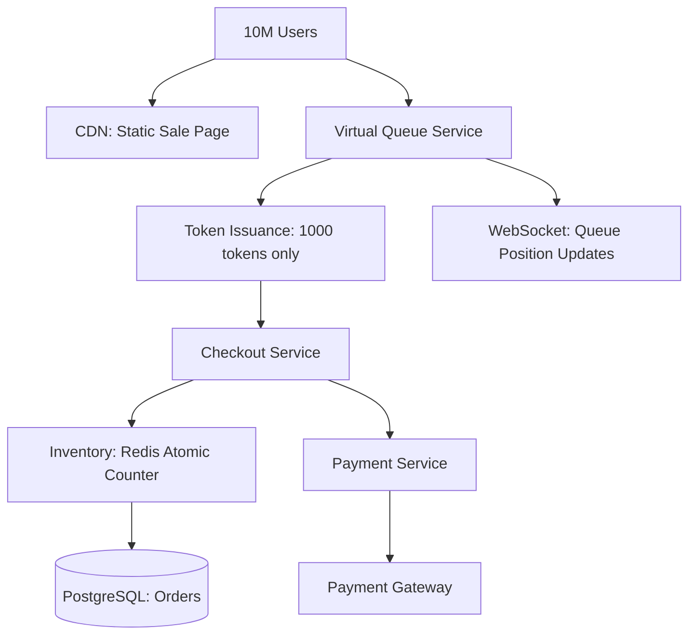

#system-design #case-study #advanced #india

# Design a Flash Sale System (Flipkart Big Billion Days / Amazon Great Indian Festival)

## The Question

> "Design a system to handle flash sales where millions of users compete for limited inventory."

---

## Step 1: Requirements

**Functional:** Limited inventory (1000 units), millions trying to buy simultaneously, fair ordering, prevent overselling, prevent bots
**Non-Functional:** Handle 10M+ concurrent users, no overselling (ever), sub-second checkout, prevent bots/scalpers

---

## Step 2: The Core Challenge

```
10,000,000 users clicking "Buy Now" at exactly 12:00:00 PM
1,000 items available
9,999,000 users must get "Sold Out" — gracefully, within 2 seconds
```

---

## Step 3: High-Level Design



---

## Step 4: Deep Dive

### Layer 1: CDN + Static Pages

Before the sale: serve product page from CDN. Zero hits to backend. "Buy Now" button is disabled until sale starts (client-side timer + server validation).

### Layer 2: Virtual Queue

At 12:00:00, "Buy Now" becomes active:
```
User clicks → enters virtual queue → gets position number
Queue processes users in batches: first 1000 get tokens
Token = "You may proceed to checkout within 5 minutes"
Others → "Sold Out" or "Wait for next batch"
```

### Layer 3: Atomic Inventory Check (Redis)

```
DECR inventory:product_123
If result >= 0 → SUCCESS (proceed to payment)
If result < 0 → INCR inventory:product_123 (undo) → SOLD OUT
```

`DECR` is atomic in Redis. Even if 10,000 requests hit simultaneously, only 1000 will get a result >= 0. **Zero overselling guaranteed.**

### Layer 4: Payment with Timeout

```
Token issued → user has 5 minutes to complete payment
If payment succeeds → order confirmed
If payment fails or timeout → release inventory (INCR)
Next user in queue gets the slot
```

### Bot Prevention

| Technique | How |
|-----------|-----|
| CAPTCHA at queue entry | Blocks automated scripts |
| Device fingerprinting | Detect multiple accounts from same device |
| Rate limiting per IP | Max 1 purchase attempt per IP |
| Account age verification | Only accounts created > 7 days ago |
| Behavioral analysis | Superhuman click speed = bot |

### Graceful "Sold Out" Handling

Don't let 10M users hit your API. Filter at each layer:
```
Layer 1: CDN serves static page (0 backend load)
Layer 2: Queue shows position (WebSocket, minimal load)
Layer 3: Only token holders hit checkout API (1000 users)
Layer 4: Only successful checkouts hit payment (< 1000)

99.99% of users never touch the backend.
```

---

## Interview Simulation

> **Interviewer:** Design a flash sale system for Flipkart Big Billion Days.

> **Candidate:** The key insight is that 99.99% of users won't get the item, so we must reject them as early as possible without hitting our backend. I'd use a layered filtering approach.

> **Candidate:** Layer 1: CDN serves the static sale page. Layer 2: A virtual queue — users enter and get a position. We issue purchase tokens to only the first N users (matching inventory). Only token holders can proceed to checkout. Layer 3: Redis atomic DECR for inventory — even with concurrent requests, DECR is atomic so we can never oversell.

> **Interviewer:** What about bots buying everything?

> **Candidate:** Multi-layered defense: CAPTCHA at queue entry, device fingerprinting to catch multiple accounts per device, rate limiting per IP, and behavioral analysis for superhuman click speeds. We'd also restrict to accounts created more than 7 days before the sale.

---

## Building Blocks Used

| Component | Building Block |
|-----------|---------------|
| Static pages | [[02_building_blocks/cdn]] |
| Inventory counter | [[02_building_blocks/caching]] (Redis DECR) |
| Queue management | WebSocket + [[02_building_blocks/message_queues]] |
| Bot prevention | [[02_building_blocks/rate_limiter]] + CAPTCHA |
| Payment | [[03_design_patterns/saga_pattern]] (timeout → release) |
