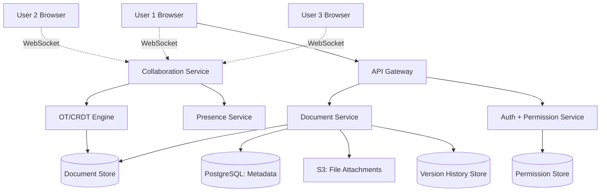
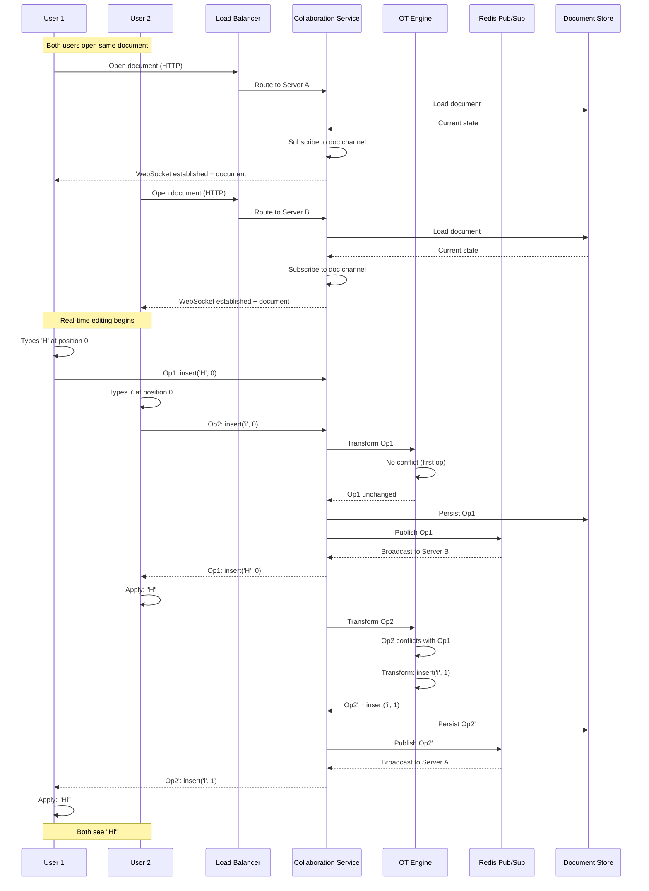
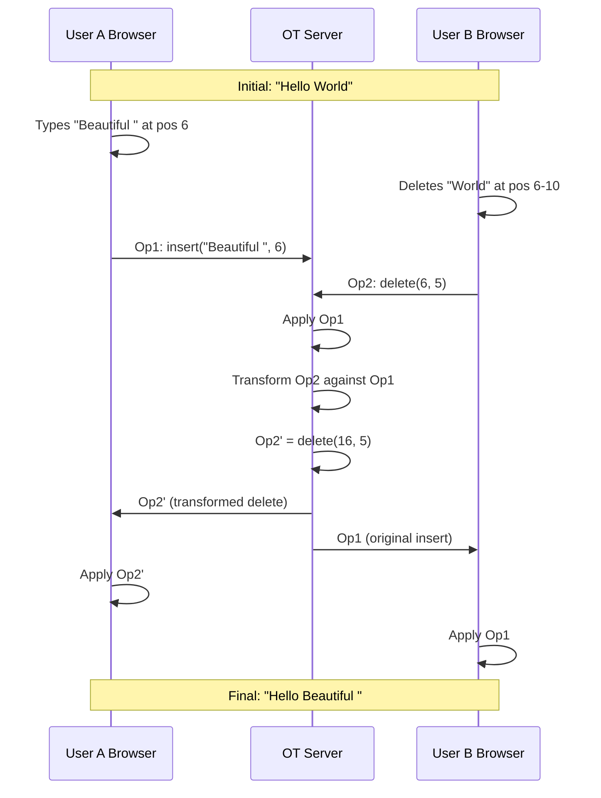
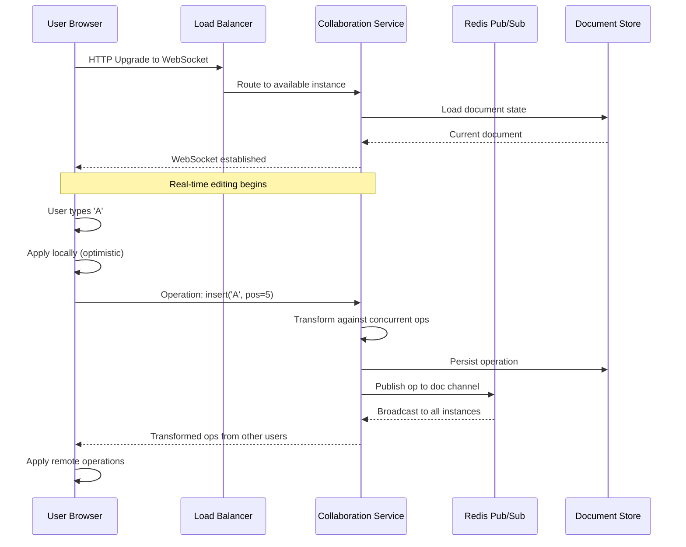
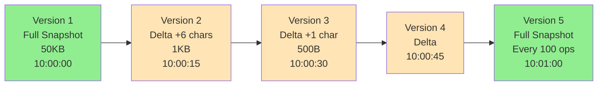
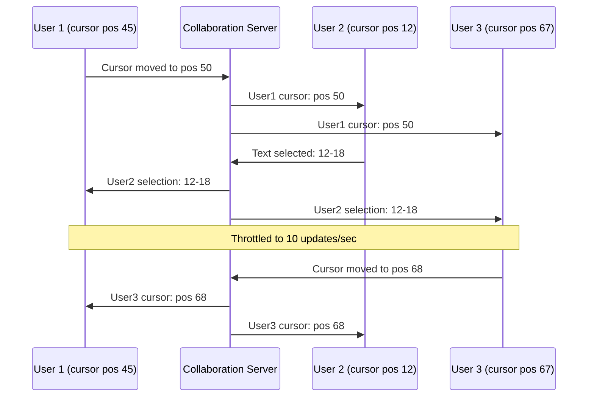
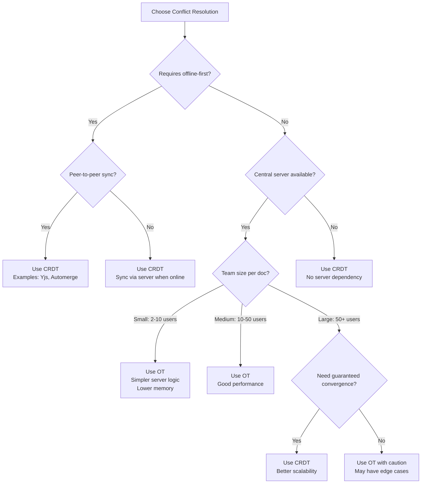
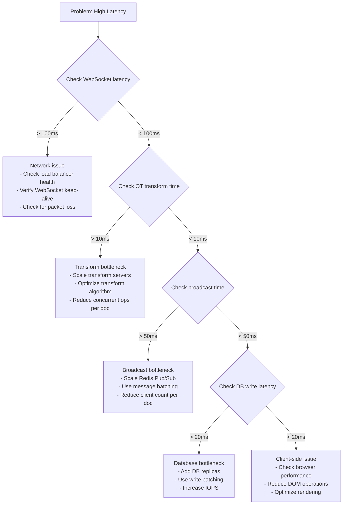

#system-design #case-study #advanced

# Design Google Docs (Real-Time Collaboration)

## Intuition (30 sec)

Imagine 10 people editing the same physical document with pens. Everyone writes simultaneously, but somehow the document never becomes a jumbled mess—every edit appears in the right place for everyone. That's Google Docs: a system that makes concurrent edits converge to the same consistent state through conflict resolution algorithms.

---

## Failure-First Scenario

**The Lost Edit Problem:**

You're collaborating with your team on a critical proposal. You spend 10 minutes writing a detailed paragraph. Your colleague simultaneously deletes the section you were editing. When the network synchronizes, your paragraph vanishes completely. Hours of work lost because the system couldn't resolve conflicting operations. This is why Google Docs needs Operational Transformation—to ensure no edit is ever lost.

---

## The Question

> "Design a real-time collaborative document editor like Google Docs."

---

## Step 1: Requirements

**Functional:** Multiple users edit same document simultaneously, see each other's cursors, conflict resolution, version history, share with permissions, offline editing
**Non-Functional:** <100ms latency for edits to appear, strong consistency (no lost edits), handle 100+ simultaneous editors

---

## Step 2: Estimation

| Metric | Value |
|--------|-------|
| DAU | 50M |
| Documents | 5B total |
| Avg concurrent editors per doc | 3-5 (peak: 100+) |
| Edits/sec per active doc | 10-50 keystrokes/sec |
| Document size | avg 50KB, max 10MB |

---

## Step 3: High-Level Design

### System Architecture Overview



**Component Definitions:**

- **Collaboration Service:** Real-time service handling WebSocket connections, operation transformation, and broadcasting
- **OT/CRDT Engine:** Core algorithm that transforms concurrent operations to ensure consistency
- **Document Store:** NoSQL database (MongoDB/Cassandra) storing current document state and operation log
- **Presence Service:** Tracks and broadcasts user cursor positions and online status
- **Document Service:** REST API for CRUD operations on documents (create, read, update metadata)
- **Version History Store:** Time-series storage for document snapshots and operation deltas
- **Auth + Permission Service:** Handles authentication and document sharing permissions

### Detailed Collaboration Flow



### Data Flow: Edit Operation Lifecycle

```
1. Local Edit
   ┌─────────────────────────────────┐
   │ User types 'A' at position 5    │
   │ Browser applies immediately     │
   │ Generate operation object       │
   └────────────┬────────────────────┘
                │
                ▼
2. Send to Server
   ┌─────────────────────────────────┐
   │ WebSocket.send({                │
   │   type: 'insert',               │
   │   char: 'A',                    │
   │   position: 5,                  │
   │   userId: 'user123',            │
   │   timestamp: 1234567890,        │
   │   baseVersion: 42               │
   │ })                              │
   └────────────┬────────────────────┘
                │
                ▼
3. Server Receives
   ┌─────────────────────────────────┐
   │ Validate operation              │
   │ Check permissions               │
   │ Get current document version    │
   └────────────┬────────────────────┘
                │
                ▼
4. Transform
   ┌─────────────────────────────────┐
   │ Current version: 45             │
   │ Client's base version: 42       │
   │ Missing ops: 43, 44, 45         │
   │                                 │
   │ Transform new op against:       │
   │   Op 43: insert('B', 3)         │
   │   → Adjust position: 5 → 6      │
   │   Op 44: delete(2)              │
   │   → Adjust position: 6 → 5      │
   │   Op 45: insert('C', 7)         │
   │   → No change needed            │
   │                                 │
   │ Final: insert('A', 5)           │
   └────────────┬────────────────────┘
                │
                ▼
5. Persist
   ┌─────────────────────────────────┐
   │ Write to operation log          │
   │ Update document state           │
   │ Increment version: 46           │
   └────────────┬────────────────────┘
                │
                ▼
6. Broadcast
   ┌─────────────────────────────────┐
   │ Publish to Redis channel        │
   │ All servers receive operation   │
   │ Send to connected clients       │
   │ (except originator)             │
   └────────────┬────────────────────┘
                │
                ▼
7. Clients Apply
   ┌─────────────────────────────────┐
   │ Receive operation               │
   │ Transform against pending ops   │
   │ Apply to local document         │
   │ Update UI                       │
   └─────────────────────────────────┘
```

---

## Step 4: Deep Dive

### Core Concepts - Definitions

**Real-Time Collaboration:**
- **Definition:** A system where multiple users can simultaneously edit a shared document and see each other's changes within milliseconds
- **Purpose:** Enable seamless team collaboration without edit conflicts or lost work
- **How it works:** Changes are captured locally, sent to a central server, transformed to resolve conflicts, and broadcast to all connected clients

**Key Terms:**

- **Operational Transformation (OT):** An algorithm that transforms concurrent operations so they can be applied in any order while converging to the same document state
- **CRDT (Conflict-free Replicated Data Type):** A data structure designed to automatically merge concurrent changes without conflicts by using commutative operations
- **Conflict Resolution:** The process of determining how to apply multiple simultaneous edits to the same document position
- **Operation:** A discrete change to a document (insert character, delete character, format text)
- **Transform Function:** A mathematical function that adjusts an operation's position based on concurrent operations
- **Vector Clock:** A logical timestamp mechanism to track causality between operations in distributed systems
- **Tombstone:** A marker indicating a deleted element in CRDTs, preserved to maintain operation order
- **Convergence:** The property that all clients eventually reach the same document state after applying all operations

### The Core Challenge: Conflict Resolution

Two users type at the same position simultaneously. Whose edit wins?

**Approach 1: Operational Transformation (OT)** — Used by Google Docs

**Operational Transformation Definition:**
- **Formal Definition:** A technique for maintaining consistency in collaborative editing by transforming operations against concurrent operations to preserve user intentions
- **Simple Definition:** A way to adjust the position of your edit based on what others are simultaneously typing
- **Analogy:** Like GPS recalculating your route when you take a wrong turn—it adjusts directions based on your current position
- **Related Terms:** Differs from CRDTs (which avoid conflicts) and locks (which prevent concurrent edits entirely)

**OT Example:**
```
Initial Document: "Hello World"
                   012345678910

User A types "Beautiful " at position 6
  Operation A: insert("Beautiful ", 6)

User B deletes "World" (positions 6-10)
  Operation B: delete(6, 5)

Without OT: Both operations execute at position 6 → conflict

With OT Transform:
1. Server receives Operation A first (arbitrary order)
2. Apply A: "Hello Beautiful World"
3. Transform B against A:
   - B wants to delete at position 6
   - But A inserted 10 chars at position 6
   - Transform adjusts B's position: delete(16, 5)
4. Apply transformed B: "Hello Beautiful "

Result: Both users see "Hello Beautiful "
```

**Visual Flow:**



**OT Transform Function:**

```java
// OT Transform Function: Transforms operation B against operation A
Operation transform(Operation opA, Operation opB) {
    if (opA instanceof Insert && opB instanceof Insert) {
        // Both are inserts
        if (opB.position < opA.position) {
            return opB; // B is before A, no change needed
        } else if (opB.position > opA.position) {
            // B is after A, shift by A's length
            return new Insert(opB.position + opA.length, opB.text);
        } else {
            // Same position: use user ID to break tie
            return opB.userId < opA.userId ?
                opB :
                new Insert(opB.position + opA.length, opB.text);
        }
    }

    if (opA instanceof Insert && opB instanceof Delete) {
        // A inserts, B deletes
        if (opB.position < opA.position) {
            return opB; // Delete is before insert
        } else if (opB.position >= opA.position + opA.length) {
            // Delete is after insert, shift by insert length
            return new Delete(opB.position + opA.length, opB.length);
        } else {
            // Delete overlaps insert, split delete operation
            return new Delete(opB.position + opA.length, opB.length);
        }
    }

    if (opA instanceof Delete && opB instanceof Insert) {
        // A deletes, B inserts
        if (opB.position <= opA.position) {
            return opB; // Insert is before delete
        } else if (opB.position >= opA.position + opA.length) {
            // Insert is after delete, shift back
            return new Insert(opB.position - opA.length, opB.text);
        } else {
            // Insert is within deleted range
            return new Insert(opA.position, opB.text);
        }
    }

    if (opA instanceof Delete && opB instanceof Delete) {
        // Both are deletes - complex case
        // Need to adjust ranges based on overlap
        // Simplified version:
        if (opB.position < opA.position) {
            return opB;
        } else {
            return new Delete(opB.position - opA.length, opB.length);
        }
    }

    return opB;
}
```

**Approach 2: CRDTs (Conflict-free Replicated Data Types)** — Used by Figma

**CRDT Definition:**
- **Formal Definition:** A data structure that guarantees eventual consistency across replicas without coordination, using commutative and associative operations
- **Simple Definition:** A smart data structure where every possible order of operations produces the same final result
- **Analogy:** Like a shopping cart where adding items in any order gives you the same cart contents
- **Related Terms:** Unlike OT (which transforms operations), CRDTs design operations that naturally merge

**CRDT Example:**
```
Each character gets a unique ID and fractional position

Initial: ""

User A types "H" → ID: A1, position: 0.5
User B types "i" → ID: B1, position: 0.7

Document structure:
[
  {id: "A1", char: "H", position: 0.5},
  {id: "B1", char: "i", position: 0.7}
]

User A inserts "e" between H and i:
  ID: A2, position: 0.6 (between 0.5 and 0.7)

No matter what order operations arrive, sorting by position gives: "Hei"

Deletion: Mark as tombstone
Delete "e": {id: "A2", char: "e", position: 0.6, deleted: true}

Tombstones remain for causality tracking
```

**Visual: CRDT Structure**

```
Traditional Document:
Position: [0]  [1]  [2]  [3]  [4]
Content:  'H'  'e'  'l'  'l'  'o'

Problem: Concurrent inserts at same position collide

CRDT Document (YATA/RGA):
[
  {id: "user1-1", char: 'H', pos: 0.5,    left: null,      right: "user1-2"},
  {id: "user1-2", char: 'e', pos: 0.75,   left: "user1-1", right: "user1-3"},
  {id: "user1-3", char: 'l', pos: 0.875,  left: "user1-2", right: "user1-4"},
  {id: "user1-4", char: 'l', pos: 0.9375, left: "user1-3", right: "user1-5"},
  {id: "user1-5", char: 'o', pos: 0.96875,left: "user1-4", right: null}
]

Each char has unique ID + fractional position → no conflicts possible
```

**Comparison Table**

| Aspect | OT (Operational Transformation) | CRDT (Conflict-free Replicated Data Type) |
|--------|---------------------------------|------------------------------------------|
| **Definition** | Transforms operations to maintain intention | Designs operations that commute naturally |
| **Complexity** | Server-side transformation logic | Client-side merge logic |
| **Server dependency** | Requires central server for coordination | Can work peer-to-peer or serverless |
| **Performance** | Good for small groups (< 50) | Better for large groups (100+) |
| **Network** | Requires low latency to server | Works well with high latency/offline |
| **Memory** | Stores document as string/array | Stores metadata per character (higher memory) |
| **Convergence** | Guarantees if operations transformed in order | Guarantees automatically (commutative) |
| **Implementation** | Complex transform functions | Complex data structures |
| **Used by** | Google Docs, Microsoft Office Online | Figma, Notion, Yjs, Automerge |
| **Best for** | Online-first, server-centric apps | Offline-first, peer-to-peer apps |

### WebSocket Connection per Document

**WebSocket Definition:**
- **Definition:** A protocol providing full-duplex communication channels over a single TCP connection
- **Purpose:** Enable real-time, bidirectional communication between browser and server
- **How it works:** Establishes persistent connection after HTTP handshake, allowing instant message exchange without polling

**Connection Flow:**



**Step-by-step breakdown:**

1. **Connection Establishment:**
   - Browser sends HTTP Upgrade request
   - Server accepts and switches to WebSocket protocol
   - Server loads document state from database
   - Client receives initial document content

2. **Local Operation:**
   - User types character
   - Client applies change immediately (optimistic update)
   - Client generates operation: `{type: 'insert', char: 'A', position: 5, userId: 'user123', timestamp: 1234567890}`

3. **Server Transform:**
   - Server receives operation
   - Transforms against any concurrent operations already applied
   - Server applies transformed operation to canonical document state

4. **Broadcast:**
   - Server publishes operation to Redis channel for this document
   - All WebSocket servers subscribed to document receive operation
   - Each server sends operation to connected clients (except originator)

5. **Remote Apply:**
   - Other clients receive operation
   - Apply to their local document state
   - Update UI to show change

**Java WebSocket Implementation:**

```java
import javax.websocket.*;
import javax.websocket.server.ServerEndpoint;
import java.util.concurrent.ConcurrentHashMap;
import java.util.Set;
import java.util.concurrent.CopyOnWriteArraySet;

@ServerEndpoint("/collab/{documentId}")
public class CollaborationWebSocket {

    // Map: documentId -> Set of sessions editing that document
    private static ConcurrentHashMap<String, Set<Session>> documentSessions =
        new ConcurrentHashMap<>();

    private String documentId;
    private DocumentService documentService;
    private OTEngine otEngine;

    @OnOpen
    public void onOpen(Session session, @PathParam("documentId") String docId) {
        this.documentId = docId;

        // Add session to document's active sessions
        documentSessions.computeIfAbsent(docId, k -> new CopyOnWriteArraySet<>())
                       .add(session);

        // Load current document state
        Document doc = documentService.getDocument(docId);

        // Send initial state to client
        sendMessage(session, new Message("init", doc.getContent()));

        // Notify others of new user
        broadcastToOthers(session, new Message("user_joined",
            "{\"userId\": \"" + session.getId() + "\"}"));

        System.out.println("User " + session.getId() + " joined document " + docId);
    }

    @OnMessage
    public void onMessage(Session session, String message) {
        try {
            // Parse incoming operation
            Operation op = parseOperation(message);
            op.setUserId(session.getId());
            op.setTimestamp(System.currentTimeMillis());

            // Transform operation against concurrent operations
            Operation transformed = otEngine.transform(documentId, op);

            // Apply to document store
            documentService.applyOperation(documentId, transformed);

            // Broadcast transformed operation to all other users
            broadcastToOthers(session, new Message("operation", transformed));

        } catch (Exception e) {
            sendError(session, "Failed to process operation: " + e.getMessage());
        }
    }

    @OnClose
    public void onClose(Session session) {
        // Remove session from document
        Set<Session> sessions = documentSessions.get(documentId);
        if (sessions != null) {
            sessions.remove(session);
            if (sessions.isEmpty()) {
                documentSessions.remove(documentId);
            }
        }

        // Notify others of user leaving
        broadcastToOthers(session, new Message("user_left",
            "{\"userId\": \"" + session.getId() + "\"}"));

        System.out.println("User " + session.getId() + " left document " + documentId);
    }

    @OnError
    public void onError(Session session, Throwable error) {
        System.err.println("WebSocket error for session " + session.getId());
        error.printStackTrace();
    }

    private void broadcastToOthers(Session sender, Message message) {
        Set<Session> sessions = documentSessions.get(documentId);
        if (sessions != null) {
            String json = message.toJson();
            sessions.stream()
                   .filter(s -> !s.equals(sender))
                   .forEach(s -> sendMessage(s, json));
        }
    }

    private void sendMessage(Session session, String message) {
        if (session.isOpen()) {
            session.getAsyncRemote().sendText(message);
        }
    }

    private void sendError(Session session, String error) {
        sendMessage(session, new Message("error", error).toJson());
    }
}

// Operation class
class Operation {
    private String type; // "insert" or "delete"
    private int position;
    private String text;
    private String userId;
    private long timestamp;

    // Getters and setters
}

// OT Engine for transformation
class OTEngine {
    // Queue of operations per document
    private ConcurrentHashMap<String, List<Operation>> pendingOps = new ConcurrentHashMap<>();

    public Operation transform(String docId, Operation newOp) {
        List<Operation> pending = pendingOps.get(docId);
        Operation transformed = newOp;

        if (pending != null) {
            // Transform against all pending operations
            for (Operation existingOp : pending) {
                transformed = transformOperation(existingOp, transformed);
            }
        }

        // Add to pending queue
        pendingOps.computeIfAbsent(docId, k -> new CopyOnWriteArrayList<>())
                 .add(transformed);

        return transformed;
    }

    private Operation transformOperation(Operation opA, Operation opB) {
        // Implementation of OT transform logic (see previous section)
        // This is simplified - real implementation is more complex
        if (opA.getType().equals("insert") && opB.getType().equals("insert")) {
            if (opB.getPosition() > opA.getPosition()) {
                opB.setPosition(opB.getPosition() + opA.getText().length());
            }
        }
        return opB;
    }
}
```

**Client-side JavaScript:**

```javascript
class CollaborativeEditor {
    constructor(documentId) {
        this.documentId = documentId;
        this.ws = null;
        this.localVersion = 0;
        this.serverVersion = 0;
        this.pendingOps = [];
    }

    connect() {
        this.ws = new WebSocket(`wss://docs.example.com/collab/${this.documentId}`);

        this.ws.onopen = () => {
            console.log('Connected to collaboration server');
        };

        this.ws.onmessage = (event) => {
            const message = JSON.parse(event.data);
            this.handleMessage(message);
        };

        this.ws.onerror = (error) => {
            console.error('WebSocket error:', error);
        };

        this.ws.onclose = () => {
            console.log('Disconnected. Attempting reconnect...');
            setTimeout(() => this.connect(), 3000);
        };
    }

    handleMessage(message) {
        switch (message.type) {
            case 'init':
                this.document = message.data;
                this.render();
                break;

            case 'operation':
                this.applyRemoteOperation(message.data);
                break;

            case 'user_joined':
                this.showUserJoined(message.data.userId);
                break;

            case 'user_left':
                this.showUserLeft(message.data.userId);
                break;

            case 'error':
                console.error('Server error:', message.data);
                break;
        }
    }

    localInsert(char, position) {
        // Apply locally first (optimistic update)
        this.document = this.document.slice(0, position) + char +
                       this.document.slice(position);
        this.render();

        // Send to server
        const operation = {
            type: 'insert',
            char: char,
            position: position,
            version: this.localVersion++
        };

        this.ws.send(JSON.stringify(operation));
        this.pendingOps.push(operation);
    }

    applyRemoteOperation(operation) {
        // Transform against pending local operations
        let transformed = operation;
        for (const pendingOp of this.pendingOps) {
            transformed = this.transform(pendingOp, transformed);
        }

        // Apply to document
        if (transformed.type === 'insert') {
            this.document = this.document.slice(0, transformed.position) +
                          transformed.char +
                          this.document.slice(transformed.position);
        } else if (transformed.type === 'delete') {
            this.document = this.document.slice(0, transformed.position) +
                          this.document.slice(transformed.position + 1);
        }

        this.render();
    }

    transform(opA, opB) {
        // Simplified OT transform
        if (opA.type === 'insert' && opB.type === 'insert') {
            if (opB.position > opA.position) {
                opB.position += opA.char.length;
            }
        }
        return opB;
    }
}

// Usage
const editor = new CollaborativeEditor('doc-12345');
editor.connect();

document.getElementById('editor').addEventListener('input', (e) => {
    const char = e.data;
    const position = e.target.selectionStart - 1;
    editor.localInsert(char, position);
});
```

### Version History

**Version History Definition:**
- **Definition:** A system that records snapshots of document state over time, allowing users to view and restore previous versions
- **Purpose:** Enable undo/redo, audit trails, and recovery from mistakes
- **How it works:** Store periodic snapshots + operation deltas, reconstruct any historical state by replaying operations

**Version History Strategy:**

```
Time-based snapshots:
Version 1: "Hello"          (timestamp: 10:00:00, snapshot)
Version 2: "Hello World"    (timestamp: 10:00:15, delta: +6 chars)
Version 3: "Hello World!"   (timestamp: 10:00:30, delta: +1 char)
Version 4: [Full Snapshot]  (timestamp: 10:01:00, every 100 ops)
```

**Storage Strategy:**

```
┌─────────────────────────────────────────────────┐
│  Version History Storage                        │
├─────────────────────────────────────────────────┤
│                                                 │
│  Snapshot Table (PostgreSQL):                  │
│  ┌───────────────────────────────────────────┐ │
│  │ version_id │ doc_id │ timestamp │ type   │ │
│  │ v1         │ doc123 │ 10:00:00  │ full   │ │
│  │ v2         │ doc123 │ 10:00:15  │ delta  │ │
│  │ v3         │ doc123 │ 10:00:30  │ delta  │ │
│  └───────────────────────────────────────────┘ │
│                                                 │
│  Content Store (S3):                           │
│  ┌───────────────────────────────────────────┐ │
│  │ s3://versions/doc123/v1.json (50KB)      │ │
│  │ s3://versions/doc123/v2.diff (1KB)       │ │
│  │ s3://versions/doc123/v3.diff (500B)      │ │
│  └───────────────────────────────────────────┘ │
└─────────────────────────────────────────────────┘

Storage Calculation:
- Full snapshot every 100 operations: 50KB
- Avg delta: 1KB
- 100 operations = 1 × 50KB + 99 × 1KB = 149KB
- Compression: 149KB → ~50KB (3x reduction)
```

**Reconstruction Algorithm:**

```java
class VersionHistoryService {

    public Document reconstructVersion(String docId, int targetVersion) {
        // Find nearest snapshot before target version
        Snapshot snapshot = findNearestSnapshot(docId, targetVersion);
        Document doc = snapshot.getContent();

        // Replay operations from snapshot to target
        List<Operation> operations = getOperationsSince(
            docId,
            snapshot.getVersion(),
            targetVersion
        );

        for (Operation op : operations) {
            doc = applyOperation(doc, op);
        }

        return doc;
    }

    private Snapshot findNearestSnapshot(String docId, int targetVersion) {
        // Query: SELECT * FROM snapshots
        //        WHERE doc_id = ? AND version <= ?
        //        ORDER BY version DESC LIMIT 1
        return snapshotRepository.findNearestSnapshot(docId, targetVersion);
    }

    public void saveVersion(String docId, Document doc, VersionType type) {
        int newVersion = getLatestVersion(docId) + 1;

        if (type == VersionType.FULL || newVersion % 100 == 0) {
            // Save full snapshot
            saveFullSnapshot(docId, newVersion, doc);
        } else {
            // Save delta from previous version
            Document prevDoc = getVersion(docId, newVersion - 1);
            Delta delta = computeDelta(prevDoc, doc);
            saveDelta(docId, newVersion, delta);
        }
    }

    private Delta computeDelta(Document oldDoc, Document newDoc) {
        // Use diff algorithm (Myers, or simple position-based)
        List<Operation> operations = new ArrayList<>();

        // Simplified: compare character by character
        String oldText = oldDoc.getText();
        String newText = newDoc.getText();

        int i = 0, j = 0;
        while (i < oldText.length() || j < newText.length()) {
            if (i >= oldText.length()) {
                // Insertion
                operations.add(new Insert(j, newText.charAt(j)));
                j++;
            } else if (j >= newText.length()) {
                // Deletion
                operations.add(new Delete(i));
                i++;
            } else if (oldText.charAt(i) != newText.charAt(j)) {
                // Character differs - could be replace
                operations.add(new Delete(i));
                operations.add(new Insert(j, newText.charAt(j)));
                i++;
                j++;
            } else {
                // Same character
                i++;
                j++;
            }
        }

        return new Delta(operations);
    }
}
```

**Version Timeline Visualization:**



### Presence (Cursors)

**Presence Definition:**
- **Definition:** Real-time display of other users' cursor positions, selections, and online status in a collaborative document
- **Purpose:** Help users avoid editing conflicts by seeing where others are working
- **How it works:** Each client broadcasts cursor position via WebSocket, throttled to reduce network traffic

**Presence Flow:**



**Presence Data Structure:**

```java
class PresenceService {

    // Redis: key = "presence:{docId}", value = Map<userId, PresenceInfo>
    private RedisTemplate<String, Map<String, PresenceInfo>> redisTemplate;

    // Throttle: max 10 updates per second per user
    private RateLimiter rateLimiter = RateLimiter.create(10.0);

    public void updateCursorPosition(String docId, String userId, int position) {
        if (!rateLimiter.tryAcquire()) {
            return; // Drop update if rate limit exceeded
        }

        PresenceInfo presence = new PresenceInfo(
            userId,
            position,
            null, // no selection
            System.currentTimeMillis()
        );

        // Store in Redis with TTL
        String key = "presence:" + docId;
        redisTemplate.opsForHash().put(key, userId, presence);
        redisTemplate.expire(key, 30, TimeUnit.SECONDS);

        // Broadcast to all users in document
        broadcastPresence(docId, userId, presence);
    }

    public void updateSelection(String docId, String userId, int start, int end) {
        if (!rateLimiter.tryAcquire()) {
            return;
        }

        PresenceInfo presence = new PresenceInfo(
            userId,
            start,
            new Selection(start, end),
            System.currentTimeMillis()
        );

        String key = "presence:" + docId;
        redisTemplate.opsForHash().put(key, userId, presence);

        broadcastPresence(docId, userId, presence);
    }

    public List<PresenceInfo> getActiveUsers(String docId) {
        String key = "presence:" + docId;
        Map<String, PresenceInfo> presenceMap =
            redisTemplate.opsForHash().entries(key);

        // Remove stale entries (older than 30 seconds)
        long now = System.currentTimeMillis();
        return presenceMap.values().stream()
            .filter(p -> now - p.getTimestamp() < 30000)
            .collect(Collectors.toList());
    }

    private void broadcastPresence(String docId, String userId, PresenceInfo presence) {
        // Use Redis Pub/Sub to broadcast to all servers
        Message message = new Message("presence", presence);
        redisTemplate.convertAndSend("presence:" + docId, message);
    }
}

class PresenceInfo {
    private String userId;
    private String userName;
    private String color; // Unique color for each user
    private int cursorPosition;
    private Selection selection; // null if no selection
    private long timestamp;

    // Constructor, getters, setters
}

class Selection {
    private int start;
    private int end;

    // Constructor, getters, setters
}
```

**Client-side Presence Rendering:**

```javascript
class PresenceManager {
    constructor(editor) {
        this.editor = editor;
        this.users = new Map(); // userId -> PresenceInfo
        this.colors = ['#FF6B6B', '#4ECDC4', '#45B7D1', '#FFA07A', '#98D8C8'];
        this.colorIndex = 0;
    }

    updateUserPresence(userId, userName, cursorPosition, selection) {
        if (!this.users.has(userId)) {
            // Assign color to new user
            this.users.set(userId, {
                userName: userName,
                color: this.colors[this.colorIndex++ % this.colors.length],
                cursorPosition: cursorPosition,
                selection: selection
            });
        } else {
            // Update existing user
            const user = this.users.get(userId);
            user.cursorPosition = cursorPosition;
            user.selection = selection;
        }

        this.renderAllPresence();
    }

    removeUser(userId) {
        this.users.delete(userId);
        this.renderAllPresence();
    }

    renderAllPresence() {
        // Clear existing presence indicators
        document.querySelectorAll('.remote-cursor').forEach(el => el.remove());
        document.querySelectorAll('.remote-selection').forEach(el => el.remove());

        // Render each user's presence
        this.users.forEach((user, userId) => {
            this.renderCursor(userId, user);
            if (user.selection) {
                this.renderSelection(userId, user);
            }
        });
    }

    renderCursor(userId, user) {
        const cursor = document.createElement('div');
        cursor.className = 'remote-cursor';
        cursor.style.backgroundColor = user.color;
        cursor.style.position = 'absolute';

        // Position cursor at character position
        const coords = this.editor.coordsAtPos(user.cursorPosition);
        cursor.style.left = coords.left + 'px';
        cursor.style.top = coords.top + 'px';

        // Add user name label
        const label = document.createElement('div');
        label.className = 'cursor-label';
        label.textContent = user.userName;
        label.style.backgroundColor = user.color;
        cursor.appendChild(label);

        document.getElementById('editor-container').appendChild(cursor);
    }

    renderSelection(userId, user) {
        const selection = document.createElement('div');
        selection.className = 'remote-selection';
        selection.style.backgroundColor = user.color;
        selection.style.opacity = '0.3';

        const startCoords = this.editor.coordsAtPos(user.selection.start);
        const endCoords = this.editor.coordsAtPos(user.selection.end);

        selection.style.left = startCoords.left + 'px';
        selection.style.top = startCoords.top + 'px';
        selection.style.width = (endCoords.left - startCoords.left) + 'px';
        selection.style.height = (endCoords.bottom - startCoords.top) + 'px';

        document.getElementById('editor-container').appendChild(selection);
    }

    // Throttle cursor updates
    throttledCursorUpdate = this.throttle((position) => {
        this.websocket.send(JSON.stringify({
            type: 'cursor',
            position: position
        }));
    }, 100); // 10 updates per second

    throttle(func, delay) {
        let lastCall = 0;
        return function(...args) {
            const now = Date.now();
            if (now - lastCall >= delay) {
                lastCall = now;
                return func(...args);
            }
        };
    }
}
```

---

## Capacity Planning

**Capacity Planning Definition:**
- **Definition:** Process of determining infrastructure resources needed to meet performance targets under expected load
- **Goal:** Right-size servers, databases, and network capacity for current and future traffic

**Key Metrics:**

- **QPS (Queries Per Second):** Rate of incoming requests to API servers
- **Operations Per Second:** Rate of edit operations in real-time collaboration
- **WebSocket Connections:** Number of concurrent persistent connections
- **Bandwidth:** Network throughput for operation broadcasts
- **Storage:** Disk space for documents, versions, and operation logs

**Calculation Example:**

```
Given Assumptions:
• 50M daily active users (DAU)
• 10% users editing at peak hour (5M concurrent editors)
• Average 3 users per document
• 5M ÷ 3 = 1.67M active documents at peak
• Each user makes 1 edit per second (typing)
• Each edit operation = 500 bytes

Step 1: Calculate WebSocket connections needed
  Concurrent connections = 5M users
  Each connection uses:
    - Memory: ~10KB per connection = 5M × 10KB = 50GB RAM
    - CPU: minimal (event-driven I/O)

  If 1 server handles 10K connections:
    Servers needed = 5M ÷ 10K = 500 WebSocket servers

Step 2: Calculate operations per second
  Total operations = 5M users × 1 edit/sec = 5M ops/sec
  Operations per document = 5M ÷ 1.67M docs = ~3 ops/sec/doc

  Each operation must be:
    - Transformed (1ms CPU)
    - Persisted (5ms DB write)
    - Broadcast to 2 other users (2ms network)

  Processing time per op = 8ms
  Concurrent operations = 5M ops/sec × 0.008s = 40K concurrent

  If 1 server handles 1K concurrent operations:
    Servers needed = 40K ÷ 1K = 40 processing servers

Step 3: Calculate bandwidth
  Operation size = 500 bytes
  Operations per second = 5M
  Each operation broadcast to average 2 users

  Inbound traffic = 5M × 500B = 2.5 GB/sec
  Outbound traffic = 5M × 500B × 2 = 5 GB/sec
  Total bandwidth = 7.5 GB/sec = 60 Gbps

  If 1 server has 10 Gbps network:
    Network capacity = 60 Gbps ÷ 10 Gbps = 6 servers (for bandwidth alone)

Step 4: Calculate database capacity
  Operations to persist = 5M ops/sec
  If using Cassandra with 5ms write latency:
    Each node handles 200 writes/sec
    Nodes needed = 5M ÷ 200 = 25K nodes (too many!)

  Solution: Batch operations
    Batch 100 operations together
    Effective writes = 5M ÷ 100 = 50K writes/sec
    Nodes needed = 50K ÷ 200 = 250 nodes

Step 5: Calculate storage
  Daily operations = 50M users × 100 ops/user/day = 5B operations
  Operation size = 500 bytes
  Daily storage = 5B × 500B = 2.5 TB/day

  With snapshots every 100 operations:
    Snapshots = 5B ÷ 100 = 50M snapshots/day
    Snapshot size = 50KB average
    Snapshot storage = 50M × 50KB = 2.5 TB/day

  Total daily storage = 2.5 TB + 2.5 TB = 5 TB/day
  Monthly storage = 5 TB × 30 = 150 TB/month

  With 90-day retention:
    Total storage = 150 TB × 3 = 450 TB

Summary:
• WebSocket servers: 500 (for 5M connections)
• Processing servers: 40 (for operation transformation)
• Database nodes: 250 (Cassandra cluster)
• Network capacity: 60 Gbps
• Storage: 450 TB (with 90-day retention)
• Cost estimate: ~$500K/month (AWS pricing)
```

---

## Monitoring and Observability

**Key Metrics Dashboard:**

```
┌─────────────────────────────────────────────────────────────┐
│  GOOGLE DOCS COLLABORATION MONITORING                       │
├─────────────────────────────────────────────────────────────┤
│                                                             │
│  WebSocket Connections: 4.2M / 5M capacity                 │
│  Definition: Number of active persistent connections       │
│  Alert when: > 90% capacity (4.5M)                         │
│                                                             │
│  Operations Per Second: 3.8M ops/sec                       │
│  Definition: Rate of edit operations being processed       │
│  Why track: Indicates system load and user activity       │
│                                                             │
│  OT Transform Latency (P99): 2.3ms                         │
│  Definition: 99% of transforms complete within this time   │
│  Target: < 5ms for real-time feel                         │
│  Alert when: > 10ms (users notice lag)                    │
│                                                             │
│  Broadcast Latency (P99): 45ms                             │
│  Definition: Time from operation to all clients receiving  │
│  Target: < 100ms (imperceptible to users)                 │
│  Alert when: > 200ms (noticeable delay)                   │
│                                                             │
│  Operation Success Rate: 99.97%                            │
│  Definition: Percentage of operations applied successfully │
│  Alert when: < 99.9% (data loss risk)                     │
│                                                             │
│  Document Convergence Rate: 100%                           │
│  Definition: % of documents where all clients converged    │
│  Alert when: < 100% (sync issues)                         │
│                                                             │
│  Version Snapshot Success Rate: 99.95%                     │
│  Definition: % of snapshots successfully stored            │
│  Alert when: < 99% (history loss risk)                    │
│                                                             │
│  Redis Pub/Sub Lag: 12ms                                   │
│  Definition: Delay in message broadcast via Redis          │
│  Target: < 50ms                                            │
│                                                             │
└─────────────────────────────────────────────────────────────┘
```

**Java Monitoring Implementation:**

```java
@Service
class CollaborationMetrics {

    private final MeterRegistry meterRegistry;
    private final Counter operationCounter;
    private final Timer transformTimer;
    private final Timer broadcastTimer;
    private final Gauge connectionGauge;

    public CollaborationMetrics(MeterRegistry meterRegistry) {
        this.meterRegistry = meterRegistry;

        // Operation counter
        this.operationCounter = Counter.builder("collaboration.operations")
            .description("Total number of operations processed")
            .tag("type", "all")
            .register(meterRegistry);

        // Transform latency timer
        this.transformTimer = Timer.builder("collaboration.transform.latency")
            .description("Time taken to transform operations")
            .publishPercentiles(0.5, 0.95, 0.99)
            .register(meterRegistry);

        // Broadcast latency timer
        this.broadcastTimer = Timer.builder("collaboration.broadcast.latency")
            .description("Time taken to broadcast to all clients")
            .publishPercentiles(0.5, 0.95, 0.99)
            .register(meterRegistry);

        // Active connections gauge
        this.connectionGauge = Gauge.builder("collaboration.connections.active",
            this, CollaborationMetrics::getActiveConnections)
            .description("Number of active WebSocket connections")
            .register(meterRegistry);
    }

    public void recordOperation(String operationType) {
        operationCounter.increment();
        Counter.builder("collaboration.operations")
            .tag("type", operationType)
            .register(meterRegistry)
            .increment();
    }

    public void recordTransformLatency(long durationMs) {
        transformTimer.record(durationMs, TimeUnit.MILLISECONDS);
    }

    public void recordBroadcastLatency(long durationMs) {
        broadcastTimer.record(durationMs, TimeUnit.MILLISECONDS);
    }

    public double getActiveConnections() {
        // Return current WebSocket connection count
        return WebSocketRegistry.getConnectionCount();
    }

    // Alert on high latency
    @Scheduled(fixedRate = 60000) // Every minute
    public void checkLatencyAlerts() {
        double p99Transform = transformTimer.percentile(0.99);
        if (p99Transform > 10.0) {
            alertService.sendAlert(
                "High OT transform latency: " + p99Transform + "ms",
                Severity.WARNING
            );
        }

        double p99Broadcast = broadcastTimer.percentile(0.99);
        if (p99Broadcast > 200.0) {
            alertService.sendAlert(
                "High broadcast latency: " + p99Broadcast + "ms",
                Severity.CRITICAL
            );
        }
    }
}
```

---

## Decision Trees

### When to Use OT vs CRDT?



### How to Handle Network Partition?

```
IF [Network disconnected]
  THEN Store operations in local queue
       Continue editing in offline mode
       Show "Offline" indicator to user

IF [Network reconnected]
  THEN Send queued operations to server
       Server transforms against concurrent ops
       Apply transformed remote ops to local state
       Show "Syncing..." indicator

IF [Conflicts detected during reconnection]
  THEN Server applies OT/CRDT resolution
       Client receives transformed operations
       User sees merged result
       Option: Show "Changes merged" notification

IF [Reconnection fails after 3 attempts]
  THEN Save document to local storage
       Show "Save failed - document stored locally"
       Provide manual sync button
```

### When to Create Version Snapshot?

```
IF [100 operations since last snapshot]
  THEN Create full snapshot

IF [30 seconds elapsed AND document modified]
  THEN Create delta checkpoint

IF [User explicitly clicks "Save"]
  THEN Create snapshot with user label

IF [Major formatting change: entire doc reformat]
  THEN Create snapshot for efficient storage

IF [Document reaches 10MB size]
  THEN Create snapshot and archive old deltas
```

---

## Troubleshooting Guide

### Problem: High Latency (Users see delays > 500ms)



### Problem: Document Divergence (Clients see different content)

**Symptoms:**
- User A sees "Hello World"
- User B sees "Hello Beautiful World"
- Operations appear lost or duplicated

**Diagnosis:**

```java
class ConvergenceChecker {

    public DiagnosticReport checkConvergence(String docId) {
        // Get document state from all connected clients
        List<String> clientStates = getAllClientStates(docId);

        // Get canonical server state
        String serverState = getServerState(docId);

        DiagnosticReport report = new DiagnosticReport();

        // Check if all clients match server
        for (int i = 0; i < clientStates.size(); i++) {
            if (!clientStates.get(i).equals(serverState)) {
                report.addDivergence(
                    "Client " + i + " diverged from server",
                    computeDiff(serverState, clientStates.get(i))
                );
            }
        }

        // Check operation queue
        List<Operation> pendingOps = getPendingOperations(docId);
        if (pendingOps.size() > 100) {
            report.addWarning("Large pending queue: " + pendingOps.size());
        }

        return report;
    }
}
```

**Fixes:**

```
IF [OT transform incorrect]
  THEN Review transform function implementation
       Add test cases for edge cases
       Verify operation ordering

IF [Operations lost in transit]
  THEN Check WebSocket reliability
       Implement operation acknowledgment
       Add operation sequence numbers

IF [Client out of sync]
  THEN Force client to reload from server
       Send full document snapshot
       Clear client-side operation queue

IF [Server state corrupted]
  THEN Restore from last good snapshot
       Replay operations from log
       Verify checksums
```

### Problem: Memory Leak in WebSocket Servers

**Symptoms:**
- Server memory grows over time
- Eventually OOM (Out of Memory)
- Connections drop unexpectedly

**Diagnosis:**

```java
@Scheduled(fixedRate = 300000) // Every 5 minutes
public void checkMemoryLeaks() {
    Runtime runtime = Runtime.getRuntime();
    long usedMemory = runtime.totalMemory() - runtime.freeMemory();
    long maxMemory = runtime.maxMemory();
    double usage = (double) usedMemory / maxMemory;

    if (usage > 0.85) {
        // Memory usage > 85%, investigate
        Map<String, Integer> sessionCounts = getSessionCountsByDocument();

        // Check for documents with excessive connections
        for (Map.Entry<String, Integer> entry : sessionCounts.entrySet()) {
            if (entry.getValue() > 1000) {
                logger.warn("Document {} has {} connections (potential leak)",
                    entry.getKey(), entry.getValue());
            }
        }

        // Force garbage collection
        System.gc();

        // Check memory again
        usedMemory = runtime.totalMemory() - runtime.freeMemory();
        usage = (double) usedMemory / maxMemory;

        if (usage > 0.90) {
            // Critical: close idle connections
            closeIdleConnections(600); // Close connections idle > 10min
        }
    }
}
```

**Fixes:**

```
IF [Sessions not cleaned up on disconnect]
  THEN Add proper @OnClose handler cleanup
       Remove from documentSessions map
       Clear operation queue

IF [Operation history growing unbounded]
  THEN Implement TTL on operation cache
       Archive old operations to DB
       Limit in-memory queue to 1000 ops

IF [Presence data accumulating]
  THEN Set Redis TTL on presence keys (30s)
       Clean up stale presence entries
       Remove disconnected user data
```

---

## Real-World Architecture: Google Docs

**How Google Actually Built Google Docs:**

Google Docs uses a proprietary system combining elements of OT with custom optimizations. Here's what we know from public information:

### Google's Approach

**1. Jupiter Operational Transformation:**
- Google uses a modified OT algorithm called "Jupiter"
- Server maintains canonical document state
- Each client has a local copy + operation buffer
- Operations transformed against server state before applying

**2. Infrastructure:**

```
┌─────────────────────────────────────────────────────────────┐
│                     Google Docs Architecture                │
├─────────────────────────────────────────────────────────────┤
│                                                             │
│   Browser (JavaScript Client)                              │
│   ├── CodeMirror-like editor                               │
│   ├── Local operation buffer                               │
│   ├── WebSocket connection                                 │
│   └── Optimistic updates                                   │
│         │                                                   │
│         │ WebSocket over HTTPS                             │
│         ▼                                                   │
│   Google Frontend (GFE)                                    │
│   ├── Load balancing                                       │
│   ├── TLS termination                                      │
│   └── DDoS protection                                      │
│         │                                                   │
│         ▼                                                   │
│   Tango (Collaboration Service)                            │
│   ├── Written in C++                                       │
│   ├── Handles OT transformation                            │
│   ├── Maintains document sessions                          │
│   └── Real-time operation broadcast                        │
│         │                                                   │
│         ├──────────────────┬─────────────────┐            │
│         ▼                  ▼                 ▼            │
│   Bigtable           Colossus (GFS)    Spanner            │
│   (Operations)       (Document blobs)  (Metadata)         │
│                                                             │
│   Supporting Services:                                     │
│   ├── Chubby: Distributed locking                         │
│   ├── Stubby: RPC framework                               │
│   └── Monarch: Monitoring                                 │
└─────────────────────────────────────────────────────────────┘
```

**3. Key Design Decisions:**

- **C++ Backend:** Tango (collaboration service) written in C++ for performance
- **Bigtable for Operations:** Stores operation log with low latency writes
- **Colossus for Documents:** Stores full document snapshots (Google's distributed file system)
- **Spanner for Metadata:** Globally distributed SQL database for document metadata, permissions
- **No Redis:** Uses internal Google infrastructure (Chubby for coordination)

**4. Operation Processing:**

```java
// Simplified model of Google's approach

class TangoCollaborationService {

    // Each document has a canonical server state
    private ConcurrentHashMap<String, DocumentState> documents = new ConcurrentHashMap<>();

    public void handleClientOperation(String docId, Operation clientOp) {
        DocumentState state = documents.get(docId);

        synchronized (state) {
            // Get current server version
            int serverVersion = state.getVersion();

            // Client operation based on older version?
            if (clientOp.getBaseVersion() < serverVersion) {
                // Transform against all operations since client's version
                List<Operation> serverOps = getOperationsSince(
                    docId,
                    clientOp.getBaseVersion(),
                    serverVersion
                );

                for (Operation serverOp : serverOps) {
                    clientOp = transform(serverOp, clientOp);
                }
            }

            // Apply to server state
            state.apply(clientOp);
            state.incrementVersion();

            // Persist to Bigtable
            bigtable.write(docId, state.getVersion(), clientOp);

            // Broadcast to all other clients
            broadcastOperation(docId, clientOp, state.getVersion());
        }
    }

    private Operation transform(Operation serverOp, Operation clientOp) {
        // Jupiter OT transformation
        // Google's proprietary algorithm with edge case handling
        return otEngine.transform(serverOp, clientOp);
    }
}
```

**5. Scalability Techniques:**

- **Document Sharding:** Documents distributed across servers by document ID
- **Regional Deployment:** Tango servers in every Google datacenter
- **Graceful Degradation:** Falls back to polling if WebSocket unavailable
- **Operation Batching:** Combines multiple rapid operations before persisting
- **Snapshot Compression:** Uses custom compression for document snapshots

**6. Reliability:**

- **Operation Log:** Every operation logged to Bigtable (immutable, durable)
- **Version Snapshots:** Full snapshots every 1000 operations
- **Replication:** 3x replication across datacenters for operation log
- **Automatic Recovery:** Can reconstruct document from operation log
- **Checksum Verification:** Every operation has checksum to detect corruption

---

## Interview Simulation

> **Interviewer:** Design Google Docs.

> **Candidate:** The core challenge here is real-time conflict resolution — multiple users editing the same document simultaneously without losing anyone's changes. I'd use Operational Transformation, which Google Docs actually uses. Each edit is an operation — insert or delete at a position. When concurrent operations arrive, the server transforms them so they can be applied in any order and converge to the same state.

> **Interviewer:** Why OT over CRDTs?

> **Candidate:** OT requires a central server for transformation, which gives us a single source of truth — good for consistency. CRDTs are better for peer-to-peer or offline-heavy scenarios. For a Google Docs-like product where users are usually online, OT is simpler and well-proven. Though for offline editing support, we'd use a CRDT layer that syncs when reconnected.

> **Candidate:** For the real-time layer, each document gets a WebSocket session. Users connect, send operations, server transforms and broadcasts. We'd store the document in a document store and keep version history as diffs with periodic snapshots.

---

## Interview Preparation

### Concept Glossary

Quick reference definitions for interviews:

- **Operational Transformation (OT):** Algorithm that transforms concurrent operations to maintain consistency in collaborative editing
- **CRDT:** Conflict-free Replicated Data Type - data structure where operations commute and automatically merge
- **Conflict Resolution:** Process of determining final state when multiple users edit same position simultaneously
- **Operation:** Discrete change to document (insert, delete, format) with position and content
- **Transform Function:** Mathematical function adjusting operation position based on concurrent operations
- **WebSocket:** Full-duplex communication protocol over TCP for real-time bidirectional data transfer
- **Presence:** Real-time display of other users' cursors and selections in collaborative document
- **Vector Clock:** Logical timestamp tracking causality between operations in distributed system
- **Tombstone:** Marker for deleted element in CRDT, preserved to maintain operation ordering
- **Convergence:** Property where all clients reach same document state after applying all operations
- **Document Sharding:** Distributing documents across servers by document ID for horizontal scaling
- **Operation Log:** Immutable record of all operations applied to document for audit and recovery
- **Snapshot:** Full document state saved periodically for efficient version reconstruction
- **Delta:** Difference between two document versions stored as sequence of operations

### Common Interview Questions

**Q1: Why does Google Docs use Operational Transformation instead of CRDTs?**

**Answer Structure:**

1. **Define (5-10 sec):**
   "Operational Transformation transforms concurrent operations on a central server, while CRDTs use commutative data structures that merge automatically."

2. **Explain Reason (15-20 sec):**
   "Google Docs was built when strong server-side coordination was the norm, and OT provides a single source of truth. The central server model simplifies consistency guarantees and was more proven when Google Docs launched in 2006."

3. **State Trade-off (10 sec):**
   "Pro: Simpler for small groups, lower memory overhead. Con: Requires server for every edit, doesn't work well offline."

4. **Modern Context (10 sec):**
   "Today, CRDTs might be better for offline-first apps, but Google Docs' server-centric approach works well for their online-first use case."

**Q2: How do you handle the case where two users delete the same character simultaneously?**

**Answer:**

"This is handled by the OT transform function. If both users delete position 5:
- Server receives both delete operations
- First delete is applied: character removed, document shifts left
- Second delete is transformed: position adjusted to account for first delete
- If position no longer exists, operation becomes no-op
- Both clients converge to same state after receiving transformed operations"

**Q3: How would you scale Google Docs to support 1 million concurrent editors on the same document?**

**Answer:**

"This is a challenging edge case. Strategies:

1. **Hierarchical OT:** Use multiple transformation servers in tree topology
2. **Operation Batching:** Batch operations in 100ms windows to reduce broadcast count
3. **Regional Hubs:** Have regional servers that aggregate operations before sending to master
4. **Client-side Merge:** Push some CRDT-like merging to clients to reduce server load
5. **Graceful Degradation:** At extreme scale, show read-only mode to some users or introduce propagation delay

Realistically, 100+ simultaneous editors is rare, and 1M is likely impractical regardless of architecture."

**Q4: How do you implement version history without storing full copies of the document for each version?**

**Answer:**

"Use a combination of snapshots and deltas:
1. Store full snapshot every 100 operations
2. Store delta (difference) for operations in between
3. To reconstruct version 250: Load snapshot at version 200, replay deltas 201-250
4. Use diff algorithms to compute deltas efficiently
5. Compress deltas - most are small (insert/delete few characters)
6. Archive old snapshots to cold storage after 90 days

This reduces storage by 10-100x compared to full copies."

**Q5: What happens when a user's network disconnects in the middle of editing?**

**Answer:**

"Google Docs handles this gracefully:
1. Client detects WebSocket disconnect
2. Show 'Trying to reconnect...' banner
3. Queue operations locally while offline
4. User can continue editing (optimistic updates)
5. On reconnect: Send all queued operations to server
6. Server transforms queued operations against operations that happened during disconnect
7. Client receives transformed remote operations
8. Apply remote operations to local state
9. Show 'Changes merged' notification

If reconnect fails repeatedly, save to browser localStorage and allow manual sync."

---

## Quick Reference

### Glossary

| Term | Definition | When You'll See It |
|------|------------|-------------------|
| **OT** | Operational Transformation - algorithm for concurrent editing | Real-time collaboration design |
| **CRDT** | Conflict-free Replicated Data Type | Alternative to OT for offline-first |
| **Transform Function** | Adjusts operation positions based on concurrent ops | Core of OT algorithm |
| **WebSocket** | Persistent TCP connection for bidirectional messaging | Real-time data transfer |
| **Presence** | Display of other users' cursors and selections | Collaboration features |
| **Operation Log** | Immutable record of all document changes | Audit trail, recovery |
| **Snapshot** | Full document state at point in time | Version history, recovery |
| **Delta** | Difference between versions | Space-efficient history |
| **Convergence** | All clients reaching same final state | Consistency guarantee |
| **Jupiter** | Google's OT algorithm variant | Google Docs architecture |
| **Vector Clock** | Logical timestamp for causality tracking | Distributed systems |
| **Tombstone** | Deleted element marker in CRDT | CRDT implementation |

### Decision Cheat Sheet

```
IF [Need real-time collaboration]
  THEN Use WebSocket for bidirectional communication
       Implement OT or CRDT for conflict resolution
       Add presence (cursor sharing) for awareness

IF [Users mostly online]
  THEN Use OT with central server
       Benefits: Simpler logic, proven at scale
       Example: Google Docs, Office 365

IF [Users need offline editing]
  THEN Use CRDT for automatic merging
       Benefits: Works without server coordination
       Example: Notion, Figma

IF [Document has < 50 simultaneous editors]
  THEN OT is sufficient
       Lower memory, simpler implementation

IF [Document has 50-100+ simultaneous editors]
  THEN Consider CRDT for better scalability
       Or use hierarchical OT topology

IF [Network latency > 100ms]
  THEN Use optimistic updates
       Apply locally first, sync in background
       Show conflict resolution UI if needed

IF [Need version history]
  THEN Store full snapshot every N operations
       Store deltas in between
       N = 100 is good balance

IF [Need audit trail]
  THEN Log every operation immutably
       Include userId, timestamp, operation details
       Use append-only log (Kafka, Bigtable)
```

### Architecture Pattern Summary

```
Browser Client
├── Editor (CodeMirror, ProseMirror, Quill)
├── Local operation buffer
├── Optimistic updates
└── WebSocket connection
      │
      ▼
Load Balancer
├── Sticky sessions (same server per document)
├── WebSocket support
└── Health checks
      │
      ▼
Collaboration Service
├── OT/CRDT engine
├── Document session management
├── Operation transformation
└── Broadcasting
      │
      ├──────────────────┬─────────────────┐
      ▼                  ▼                 ▼
  Document Store    Version Store    Pub/Sub (Redis)
  (MongoDB)         (S3 + Postgres)  (Operation broadcast)

Supporting:
├── Auth Service (permissions, sharing)
├── Presence Service (cursor positions)
└── Monitoring (latency, convergence)
```

---

## Building Blocks Used

| Component | Building Block |
|-----------|---------------|
| Real-time sync | WebSocket ([[01_fundamentals/api_design]]) |
| Conflict resolution | OT / CRDT (application-level) |
| Document storage | [[02_building_blocks/databases_nosql]] (MongoDB) |
| Metadata | [[02_building_blocks/databases_sql]] (PostgreSQL) |
| Version history | [[03_design_patterns/event_sourcing]] (operations as events) |
| Presence | [[02_building_blocks/caching]] (Redis pub/sub) |
| Attachments | [[02_building_blocks/blob_storage]] (S3) |
