#system-design #case-study #advanced

# Design Google Maps

## Intuition (30 sec)

Think of Google Maps like a massive library with pre-printed atlases. Instead of drawing a custom map for each visitor, the library has billions of pre-printed map pages (tiles) at different zoom levels. When you request a location, you're just grabbing the right tiles from the shelf (CDN). For directions, it's like having a pre-computed road network where highways are shortcuts - you don't need to check every street, just the major routes that connect regions.

---

## Failure-First Scenario

**The Problem:**
A startup builds a navigation app. They render maps on-demand using a database query: "fetch all roads in this viewport, draw them, return image." At 100 users, it works. At 10,000 users, map loads take 30 seconds because:
- Each map view generates 1,000 database queries
- Drawing roads from scratch takes CPU time
- No caching exists
- Route calculation uses naive Dijkstra on 1 billion road segments (takes 45 seconds per route)

**The Fix:**
Pre-render and cache map tiles (static content). Separate rendering from serving. Use hierarchical routing algorithms with pre-computation. This is what Google Maps does.

---

## The Question
> "Design a navigation/maps service like Google Maps that serves 1B+ users globally."

---

## Requirements

### Functional Requirements
1. **Map Display:** Render and serve map tiles at multiple zoom levels
2. **Place Search:** Search for businesses, addresses, landmarks
3. **Route Calculation:** Calculate optimal routes (driving, walking, transit, cycling)
4. **Real-Time Traffic:** Show current traffic conditions and ETA updates
5. **Turn-by-Turn Navigation:** Provide voice guidance during navigation
6. **Nearby Places:** Find restaurants, gas stations, etc. near a location
7. **Street View:** Display panoramic street-level imagery

### Non-Functional Requirements
1. **Map Tile Loading:** <100ms for tile delivery
2. **Route Calculation:** <2s for route computation
3. **Real-Time Updates:** Traffic data updated every 30-60 seconds
4. **Availability:** 99.99% uptime (critical infrastructure)
5. **Global Coverage:** Serve users worldwide with low latency
6. **Scalability:** Handle 1B+ daily active users
7. **Accuracy:** <10m GPS accuracy, routes within 5% of optimal

---

## Estimation

### Traffic Estimation
| Metric | Value | Calculation |
|--------|-------|-------------|
| **DAU** | 1 billion users | Given |
| **Map Views/User/Day** | 10 views | Average usage |
| **Tiles per View** | 15 tiles | 5×3 grid + zoom interactions |
| **Total Tile Requests/Day** | 150B requests | 1B × 10 × 15 |
| **Tile Requests/Second** | 1.7M QPS | 150B / 86,400 |
| **Route Calculations/Day** | 500M routes | 50% of users navigate |
| **Route Calc QPS** | 5,800 QPS | 500M / 86,400 |

### Storage Estimation
| Component | Size | Calculation |
|-----------|------|-------------|
| **Road Network** | 1B road segments | Global coverage |
| **Road Graph (in-memory)** | 200 GB | 200 bytes per edge |
| **Map Tiles (all zoom levels)** | 500 TB | Zoom 0-18, all regions |
| **Street View Images** | 10 PB | Panoramic imagery globally |
| **Traffic Historical Data** | 50 TB | 2 years of traffic patterns |
| **Place Index (POIs)** | 100 GB | 200M places × 500 bytes |

### Bandwidth Estimation
| Traffic Type | Per Request | QPS | Total Bandwidth |
|-------------|-------------|-----|-----------------|
| **Map Tiles** | 50 KB/tile | 1.7M | 85 GB/sec |
| **Route Response** | 20 KB | 5,800 | 116 MB/sec |
| **Traffic Overlay** | 100 KB | 100K | 10 GB/sec |
| **Total** | - | - | ~100 GB/sec |

---

## Core Concepts & Definitions

### Key Terms Glossary

#### Geospatial Terms

**Geohash:**
- **Definition:** A geocoding system that encodes latitude/longitude into a short alphanumeric string
- **Purpose:** Enables efficient spatial indexing and proximity searches
- **How it works:** Recursively divides the world into smaller grids; longer strings = more precision
- **Example:** "9q5" represents San Francisco area; "9q5cs" is more precise (100m square)
- **Use in Maps:** Indexing places, spatial queries like "nearby restaurants"

**Quadtree:**
- **Definition:** A tree data structure where each node has exactly four children, used for partitioning 2D space
- **Purpose:** Efficiently store and query spatial data by recursively dividing regions
- **How it works:** Start with one square (world), divide into 4 quadrants, subdivide dense quadrants recursively
- **Use in Maps:** Spatial indexing, tile generation, clustering markers
- **Advantage:** Adapts to data density (more subdivision in cities, less in oceans)

**Tile System (Slippy Map Tiles):**
- **Definition:** Division of the world map into a pyramid of square image tiles at increasing zoom levels
- **Format:** Tiles identified by (x, y, zoom) coordinates
- **Zoom 0:** 1 tile (entire world: 256×256 pixels)
- **Zoom n:** 2^n × 2^n tiles (each 256×256 pixels)
- **Formula:** At zoom level z, there are 4^z tiles total
- **Example:** Zoom 10 = 1,048,576 tiles; Zoom 18 = 68,719,476,736 tiles

**Spatial Index (R-Tree):**
- **Definition:** A tree data structure for indexing multi-dimensional spatial data using bounding boxes
- **Purpose:** Efficiently query "what's near this point" or "what's in this area"
- **How it works:** Groups nearby objects and represents them with minimum bounding rectangles
- **Use in Maps:** Finding nearby places, route planning, spatial searches

#### Routing Algorithm Terms

**A* (A-Star) Algorithm:**
- **Definition:** A pathfinding algorithm that finds the shortest path using both actual distance traveled (g) and estimated remaining distance (h)
- **Formula:** f(n) = g(n) + h(n)
  - g(n) = cost from start to node n
  - h(n) = heuristic estimated cost from n to goal
  - f(n) = total estimated cost
- **Purpose:** Faster than Dijkstra because it searches toward the goal, not in all directions
- **Heuristic:** Straight-line distance (Euclidean or Haversine for lat/lon)
- **Use in Maps:** Basic route calculation with traffic weights

**Contraction Hierarchies:**
- **Definition:** A preprocessing technique that creates "shortcut" edges in a graph to speed up shortest path queries
- **How it works:**
  1. **Preprocess (hours):** Iteratively "contract" nodes by removing them and adding shortcuts
  2. **Query (milliseconds):** Search only the contracted graph (much smaller)
- **Analogy:** Like creating highway shortcuts - instead of driving through 50 city streets, you have one edge representing "via Highway 101"
- **Trade-off:** Huge preprocessing time, but 1000x faster queries
- **Use in Maps:** Primary algorithm for route calculation at scale

**Bidirectional Search:**
- **Definition:** Running two simultaneous searches - one from start to goal, one from goal to start - until they meet
- **Purpose:** Reduces search space significantly (square root of nodes compared to unidirectional)
- **Analogy:** Two people searching for each other in a building, each from opposite ends
- **Use in Maps:** Combined with A* and Contraction Hierarchies

**Edge Weights:**
- **Definition:** The cost associated with traversing a road segment in the routing graph
- **Components:**
  - Base weight: Physical distance or time
  - Traffic factor: Real-time congestion multiplier (1.0 = free-flow, 3.0 = heavy traffic)
  - Road type: Highway (fast), residential (slow)
  - Turn penalties: Left turn costs more than straight
- **Dynamic:** Continuously updated based on real-time traffic data

#### Map Rendering Terms

**Vector Tiles:**
- **Definition:** Map tiles that contain geometric and attribute data (points, lines, polygons) rather than pre-rendered images
- **Advantage:** Rendered client-side, enabling rotation, 3D views, style changes
- **Format:** Protobuf-encoded (efficient compression)
- **Use in Maps:** Modern approach - sends roads as vectors, phone renders them

**Raster Tiles:**
- **Definition:** Pre-rendered image tiles (PNG/JPEG) served as static files
- **Advantage:** Fast to serve, no client-side rendering needed
- **Disadvantage:** Cannot rotate, fixed style, larger size
- **Use in Maps:** Satellite imagery, older map styles

**Map Projection (Web Mercator):**
- **Definition:** Mathematical transformation from Earth's curved surface (3D sphere) to flat map (2D plane)
- **Web Mercator (EPSG:3857):** Standard for web maps
- **Property:** Preserves angles (conformal) but distorts size at poles
- **Why:** Enables rectangular tiles; Greenland looks huge, equator accurate
- **Formula:** Projects lat/lon to x/y coordinates

**Generalization:**
- **Definition:** The process of simplifying map features based on zoom level
- **Examples:**
  - Zoom 5: Show only highways, major cities
  - Zoom 15: Show residential streets, building footprints
  - Zoom 18: Show sidewalks, crosswalks, benches
- **Purpose:** Reduce data size and visual clutter at lower zoom levels

#### Traffic Data Terms

**GPS Probe Data:**
- **Definition:** Location and speed data continuously sent by mobile devices to infer traffic conditions
- **Source:** Android phones with location services enabled (anonymized)
- **Format:** {device_id, lat, lon, speed, timestamp, accuracy}
- **Frequency:** Every 1-5 seconds while Maps is active
- **Use in Maps:** Primary source of real-time traffic data

**Map Matching:**
- **Definition:** The process of aligning GPS points to the actual road network (snapping to roads)
- **Challenge:** GPS has 5-50m error; need to infer which road user is on
- **Algorithm:** Hidden Markov Model (HMM) with probability of being on each nearby road
- **Use in Maps:** Convert raw GPS to road-specific traffic data

**Traffic Segmentation:**
- **Definition:** Dividing roads into segments (typically 100-500m) for granular traffic reporting
- **Purpose:** Traffic is not uniform - one block might be congested while next is clear
- **Aggregation:** Multiple GPS probes on same segment → average speed for that segment
- **Use in Maps:** Color-coded traffic overlay (green/yellow/red)

---

## High-Level Architecture

### System Components

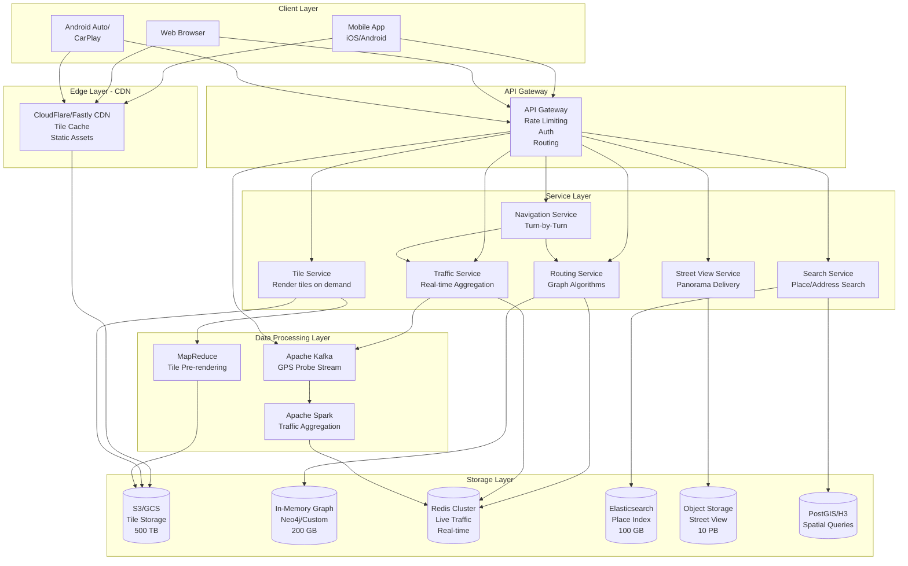

### Architecture Component Definitions

**Client Layer:**
- **Mobile App:** Native iOS/Android apps with offline maps, GPS, caching
- **Web Browser:** JavaScript-based map renderer using WebGL
- **Android Auto/CarPlay:** Optimized navigation UI for vehicles

**CDN (Content Delivery Network):**
- **Definition:** Geographically distributed cache servers that serve static content from locations near users
- **Purpose:** Reduce latency for tile delivery from 500ms → 50ms
- **Strategy:** Cache tiles at edge locations (200+ global PoPs)
- **Hit Rate:** 95%+ for popular tiles (city centers)

**API Gateway:**
- **Definition:** Single entry point for all API requests with routing, authentication, and rate limiting
- **Rate Limiting:** 10,000 tile requests/min per API key
- **Auth:** OAuth 2.0, API keys
- **Routing:** Routes requests to appropriate microservices

**Tile Service:**
- **Definition:** Service that generates map tiles or retrieves from storage
- **Strategy:** Pre-render popular tiles, render on-demand for rare areas
- **Format:** Returns PNG (raster) or PBF (vector) tiles

**Search Service:**
- **Definition:** Full-text and geospatial search for places, addresses, and landmarks
- **Technology:** Elasticsearch with geo_point and geo_shape queries
- **Features:** Autocomplete, fuzzy matching, ranking by relevance + distance

**Routing Service:**
- **Definition:** Calculates shortest or fastest path between two points
- **Algorithm:** Contraction Hierarchies + A*
- **Graph:** In-memory road network (200 GB RAM per instance)
- **Response Time:** <500ms for 99% of queries

**Traffic Service:**
- **Definition:** Aggregates GPS probe data to produce real-time traffic conditions
- **Input:** 10M+ GPS points per second from Android devices
- **Output:** Traffic speeds per road segment, updated every 30 seconds
- **Storage:** Redis with TTL of 5 minutes

---

## Core Challenges

### Challenge 1: Map Tiles at Scale

#### The Problem
**Definition:** Serving 1.7M tile requests per second globally with <100ms latency

**Calculation:**
- Zoom 0: 1 tile (entire world)
- Zoom 1: 4 tiles (2×2 grid)
- Zoom 2: 16 tiles (4×4 grid)
- Zoom n: 4^n tiles
- Zoom 18: 4^18 = 68,719,476,736 tiles (street level detail)

**Storage Math:**
```
At zoom 18, if every tile is 50 KB:
68B tiles × 50 KB = 3,400 TB (3.4 PB) for one map style at one zoom level

All zoom levels 0-18:
(4^0 + 4^1 + ... + 4^18) tiles ≈ 91.6B tiles
91.6B × 50 KB ≈ 4.5 PB for one style

Multiple styles (satellite, terrain, transit) = 15+ PB
```

#### Solution: Tile Pyramid + Aggressive Caching

**Tile Pyramid Structure:**
```
Zoom Level 0:           [  World  ]              1 tile
                         /    |    \
Zoom Level 1:      [NW] [NE] [SW] [SE]          4 tiles
                   /  \  ...
Zoom Level 2:     [16 tiles]                    16 tiles
    ...
Zoom Level 18:    [68 billion tiles]            68B tiles
```

**Tile Addressing:**
- **TMS (Tile Map Service):** {z}/{x}/{y}.png
  - z = zoom level (0-18)
  - x = column (0 to 2^z - 1)
  - y = row (0 to 2^z - 1)
- **Example:** `/tiles/15/5242/12642.png` = San Francisco at zoom 15

**Caching Strategy:**

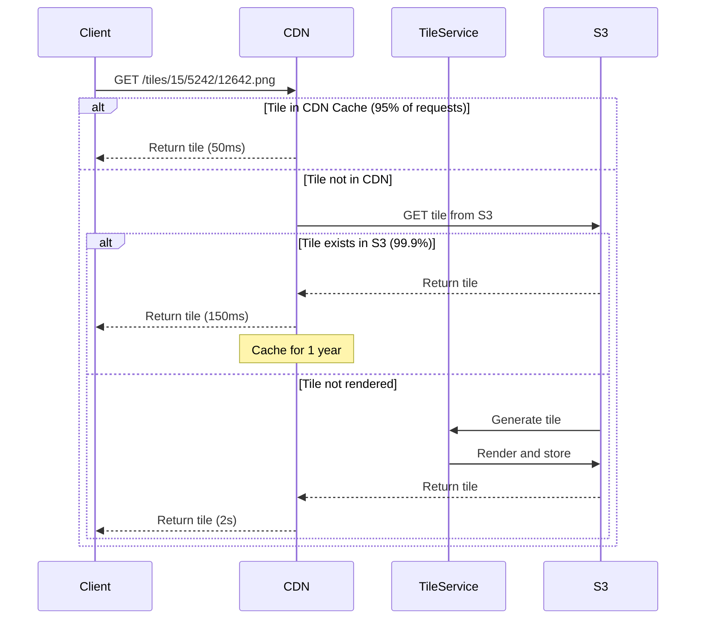

**Tile Caching Layers:**

| Layer | Hit Rate | Latency | TTL | Purpose |
|-------|----------|---------|-----|---------|
| **Browser Cache** | 80% | 0ms | 7 days | Repeated views of same area |
| **CDN Edge (PoP)** | 95% | 50ms | 1 year | Popular urban tiles |
| **S3/GCS Origin** | 99.9% | 150ms | Permanent | All pre-rendered tiles |
| **On-Demand Render** | 0.1% | 2s | N/A | Rare rural tiles |

**Optimization: Tile Pre-rendering Strategy**

```
Priority Queue for Tile Rendering:

1. Population-based: Render urban areas first
   - Top 1000 cities: All zoom levels 0-18
   - Rural areas: Only zoom 0-12

2. Usage-based: Analyze request logs
   - Re-render frequently accessed tiles
   - Deprioritize never-accessed tiles

3. Update-based: Re-render when data changes
   - New roads: Re-render affected tiles
   - Business opens: Update tiles in 24 hours
```

**Vector Tiles: Modern Approach**

**Definition:** Send geometric data (vectors) instead of pre-rendered images

**Advantages:**
- Smaller size: 30 KB vs. 50 KB (40% reduction)
- Client-side rendering: Can rotate, tilt, change style
- One tile serves multiple styles
- Smooth zoom (interpolation)

**Disadvantages:**
- Client must have rendering capability
- Higher CPU usage on client
- Not suitable for satellite imagery

**Format: Mapbox Vector Tiles (MVT)**
```protobuf
// Protobuf-encoded vector tile
message Tile {
  repeated Layer layers = 1;
}

message Layer {
  required string name = 1;  // "roads", "buildings", "water"
  repeated Feature features = 2;
}

message Feature {
  enum GeomType {
    POINT = 0;
    LINESTRING = 1;
    POLYGON = 2;
  }
  required GeomType type = 1;
  repeated uint32 geometry = 2;  // Encoded coordinates
  repeated uint32 tags = 3;      // Key-value attributes
}
```

**Vector Tile Rendering Flow:**
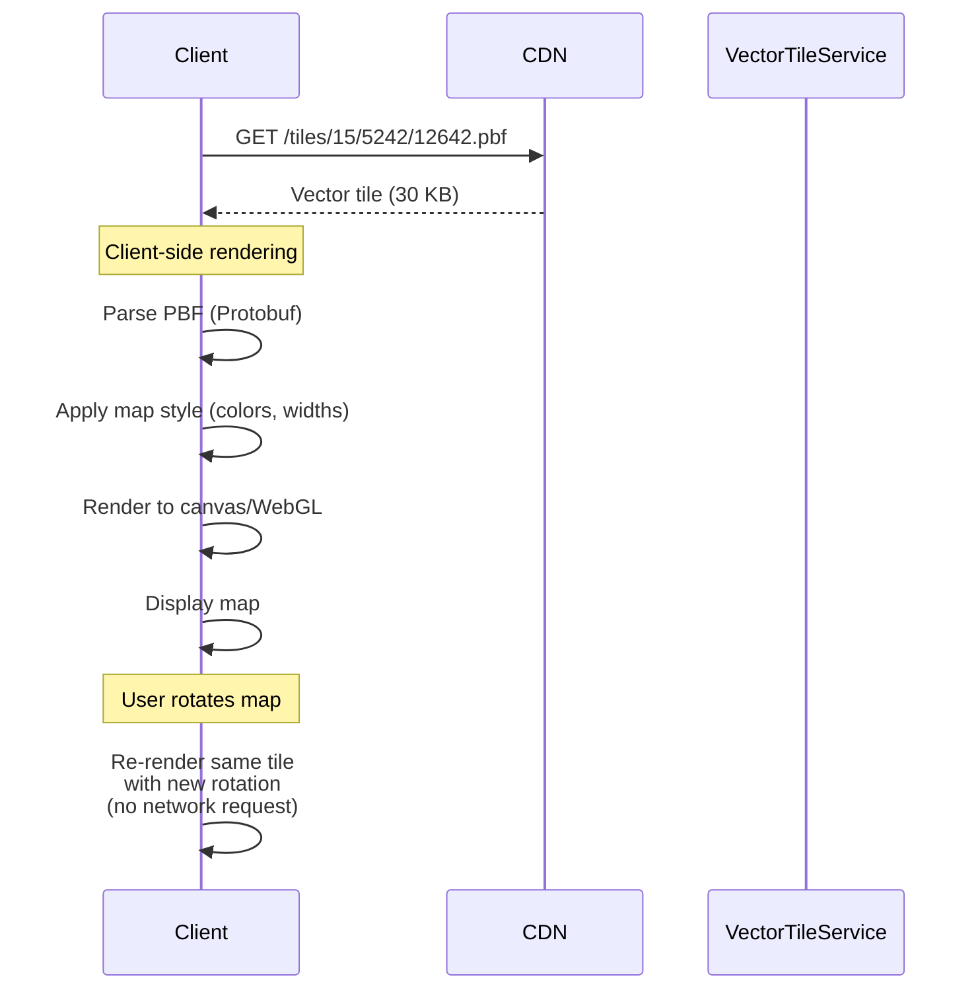

---

### Challenge 2: Route Calculation on Massive Graph

#### The Problem

**Scale:**
- 1 billion road segments (edges)
- 100 million intersections (nodes)
- Each edge: {from_node, to_node, length, speed_limit, road_type, current_traffic}

**Naive Approach: Dijkstra's Algorithm**
```
Time Complexity: O(E log V) where:
- E = 1 billion edges
- V = 100 million vertices

On 1B edges: ~30 seconds per route
Too slow for real-time routing!
```

**Why Dijkstra is Slow:**
- Explores all directions equally
- No knowledge of goal location
- Visits millions of nodes for cross-country route

#### Solution: Hierarchical Routing with Contraction Hierarchies

**Step 1: Preprocessing (Offline, takes hours)**

**Contraction Hierarchies Concept:**
1. Assign importance ranking to all nodes (based on road type)
   - Highway intersections = high importance
   - Residential street corners = low importance
2. "Contract" nodes from least to most important:
   - Remove node from graph
   - Add shortcut edges between its neighbors
3. Result: Hierarchical graph with shortcuts

**Visualization of Contraction:**

```
Original Graph:
A ---1km--- B ---1km--- C ---1km--- D
(Highway)   (Local)     (Local)     (Highway)

After contracting B and C (low importance):
A ---------3km shortcut------------ D
(Shortcut represents: A→B→C→D)

Now routing A to D is 1 hop instead of 3!
```

**Detailed Contraction Process:**

```mermaid
stateDiagram-v2
    [*] --> Original_Graph
    Original_Graph --> Rank_Nodes: Assign importance<br/>(highway nodes ranked high)

    Rank_Nodes --> Contract_Lowest: Process lowest rank node

    Contract_Lowest --> Check_Neighbors: Find all neighbors
    Check_Neighbors --> Add_Shortcuts: Add edges connecting<br/>neighbors through<br/>this node

    Add_Shortcuts --> Remove_Node: Mark node as contracted
    Remove_Node --> More_Nodes{More nodes?}

    More_Nodes --> Contract_Lowest: Yes
    More_Nodes --> Contracted_Graph: No

    Contracted_Graph --> [*]
```

**Example: San Francisco to New York**

Without Contraction Hierarchies:
```
- Must explore millions of residential streets
- Visits every city along the way
- Time: 30+ seconds
```

With Contraction Hierarchies:
```
1. Local search from SF: Find nearby highway on-ramps (100 nodes)
2. Highway search: Search only major highways (10,000 nodes)
3. Local search in NY: Find route from highway to destination (100 nodes)
Total nodes explored: ~10,200 instead of 10,000,000
Time: 50 milliseconds
```

**Step 2: Query Time (Online, milliseconds)**

**Bidirectional CH Search:**
```
1. Start forward search from origin
   - Only use edges going "up" the hierarchy

2. Start backward search from destination
   - Only use edges going "up" the hierarchy

3. Stop when searches meet
   - Meeting point is on a high-importance road (highway)

4. Reconstruct path by unpacking shortcuts
```

**Query Visualization:**

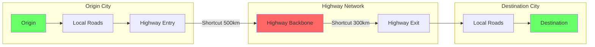

**Contraction Hierarchies vs. Basic Dijkstra:**

| Metric | Dijkstra | A* | Contraction Hierarchies |
|--------|----------|-----|------------------------|
| **Preprocessing** | None | None | Hours (one-time) |
| **Query Time (SF-NY)** | 30 seconds | 10 seconds | 50 milliseconds |
| **Nodes Explored** | 10M+ | 1M+ | ~10K |
| **Memory Usage** | Low | Low | High (shortcuts) |
| **Supports Dynamic Weights** | Yes | Yes | Partial (limited traffic) |
| **Use Case** | Small graphs | Medium graphs | Large static graphs |

**Handling Real-Time Traffic:**

**Challenge:** Contraction Hierarchies are pre-computed, but traffic changes constantly

**Solution: Customizable Contraction Hierarchies (CCH)**

```
Preprocessing (offline):
1. Build base contraction hierarchy (no traffic)
2. Store customization data for each edge

Query time (online):
1. Apply current traffic weights to base hierarchy
2. Quick re-optimization (10ms)
3. Run CH query on traffic-adjusted graph
```

**Traffic Integration Flow:**

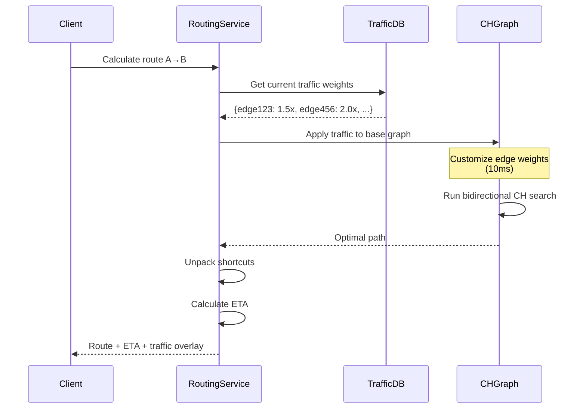

**Alternative Algorithm: A* with Landmarks**

**Definition:** A* with pre-computed distances to landmark nodes for better heuristics

**Landmarks:**
- Select 16-32 important nodes distributed geographically
- Pre-compute distance from every node to each landmark
- Use triangle inequality for heuristic

**Heuristic Calculation:**
```
Standard A*: h(n) = straight_line_distance(n, goal)

Landmark A*: h(n) = max over all landmarks L:
  |distance(L, n) - distance(L, goal)|

Better heuristic → fewer nodes explored → faster
```

**When to Use Each Algorithm:**

```
IF graph is static (roads rarely change)
  AND need fastest possible queries
  THEN use Contraction Hierarchies

IF graph is highly dynamic (traffic, closures)
  AND can tolerate slightly slower queries
  THEN use A* with Landmarks

IF need multiple route options (avoid highways)
  AND graph changes frequently
  THEN use bidirectional A* with constraints
```

---

### Challenge 3: Real-Time Traffic Processing

#### The Problem

**Scale:**
- 1 billion Android users globally
- 10% have Maps open at any time = 100M active users
- Each sends GPS data every 3 seconds
- **Incoming data rate:** 33 million GPS points per second
- **Must process and aggregate in <30 seconds** for real-time updates

**GPS Probe Data Format:**
```json
{
  "device_id": "anonymized_hash_xyz",
  "timestamp": "2026-02-15T14:32:18Z",
  "latitude": 37.7749,
  "longitude": -122.4194,
  "speed": 45.3,  // km/h
  "accuracy": 12,  // meters
  "bearing": 135,  // degrees
  "road_segment_id": null  // computed by map matching
}
```

#### Solution: Streaming Pipeline with Map Matching

**Traffic Processing Architecture:**

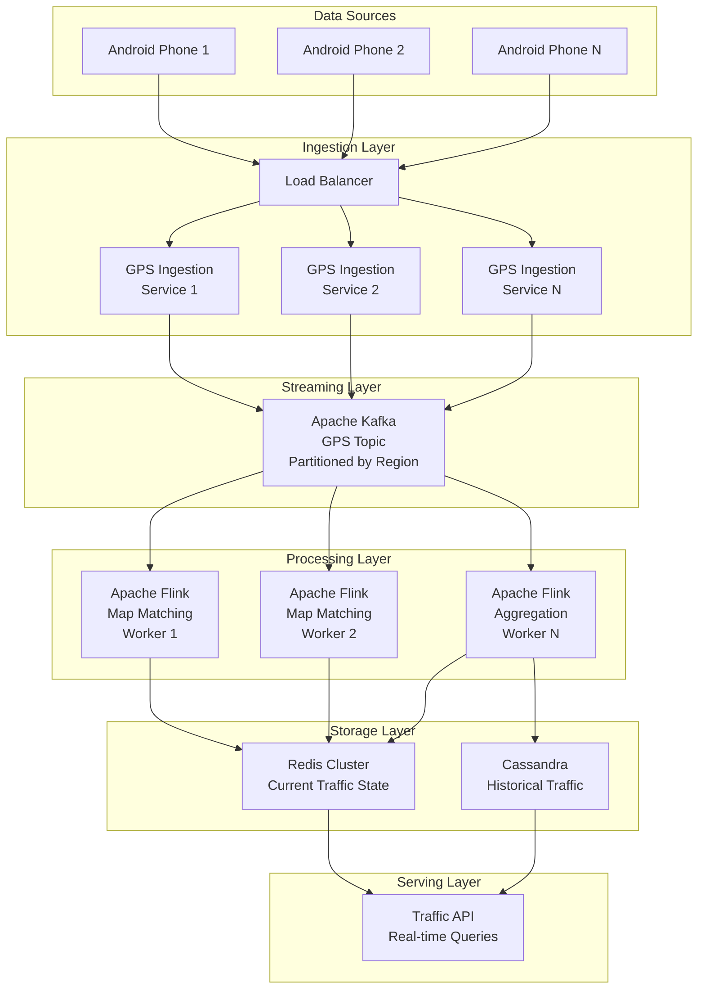

**Step 1: Map Matching**

**Definition:** Matching noisy GPS points to the actual road network

**Challenge:** GPS has 5-50m error; a point might be between 3 roads

**Algorithm: Hidden Markov Model (HMM)**

```
States: Possible road segments
Observations: GPS points
Transition probability: Likelihood of moving from road A to road B
Emission probability: Likelihood of GPS point given road position

Viterbi algorithm finds most likely sequence of road segments
```

**Map Matching Visualization:**

```
Actual Road Network:
    Street A  ═══════════════
                        ║
    Street B  ══════════╬═════════
                        ║
    Street C  ══════════╬═════════

GPS Points (with error):
    Point 1: × (could be A, B, or C)
    Point 2:   × (closer to B)
    Point 3:     × (closer to B)
    Point 4:       × (closer to C)

Map Matching Result:
    Most likely path: B → B → B → C (turned from B to C)
```

**Map Matching Code (Pseudocode):**
```python
def map_match(gps_points, road_network):
    candidates = []

    # For each GPS point, find nearby road segments
    for point in gps_points:
        nearby_roads = road_network.find_within_radius(point, 50m)

        for road in nearby_roads:
            # Project point onto road
            projected = project_point_to_line(point, road)
            distance = haversine_distance(point, projected)

            # Emission probability (closer = higher)
            emit_prob = gaussian(distance, sigma=20m)

            candidates.append({
                'point': point,
                'road': road,
                'position': projected,
                'emit_prob': emit_prob
            })

    # HMM: Find most likely sequence using Viterbi
    path = viterbi(candidates, transition_model)

    return path  # Sequence of road segments
```

**Step 2: Traffic Aggregation**

**Definition:** Combining multiple GPS probes on the same road segment to estimate traffic speed

**Window-based Aggregation (30-second windows):**

```sql
-- Apache Flink SQL-like logic
SELECT
    road_segment_id,
    window_start,
    AVG(speed) as avg_speed,
    PERCENTILE(speed, 0.5) as median_speed,
    COUNT(*) as probe_count,
    STDDEV(speed) as speed_variance
FROM gps_probes
WHERE accuracy < 30  -- Filter low-accuracy GPS
GROUP BY
    road_segment_id,
    TUMBLE(timestamp, INTERVAL '30' SECOND)
HAVING COUNT(*) >= 3  -- Need minimum 3 probes for reliability
```

**Traffic State Model:**

```python
class RoadSegmentTraffic:
    segment_id: str
    timestamp: datetime
    avg_speed: float  # km/h
    free_flow_speed: float  # Historical baseline
    congestion_level: Enum  # CLEAR, MODERATE, HEAVY, STOPPED
    probe_count: int

    @property
    def speed_ratio(self):
        """Traffic metric: actual speed / free flow speed"""
        return self.avg_speed / self.free_flow_speed

    @property
    def congestion_level(self):
        ratio = self.speed_ratio
        if ratio > 0.8:
            return "CLEAR"  # Green
        elif ratio > 0.5:
            return "MODERATE"  # Yellow
        elif ratio > 0.2:
            return "HEAVY"  # Red
        else:
            return "STOPPED"  # Dark red
```

**Step 3: Traffic State Storage**

**Redis Schema (Real-Time Traffic):**

```
Key: "traffic:segment:{segment_id}"
Value: JSON {
    "avg_speed": 35.2,
    "free_flow_speed": 60.0,
    "congestion": "MODERATE",
    "probe_count": 47,
    "timestamp": "2026-02-15T14:32:00Z"
}
TTL: 5 minutes

Key: "traffic:region:{geohash}"
Value: Sorted Set of segment_ids by congestion level
TTL: 2 minutes
```

**Cassandra Schema (Historical Traffic):**

```sql
CREATE TABLE historical_traffic (
    road_segment_id TEXT,
    timestamp TIMESTAMP,
    day_of_week INT,
    hour INT,
    avg_speed FLOAT,
    probe_count INT,
    PRIMARY KEY ((road_segment_id, day_of_week, hour), timestamp)
) WITH CLUSTERING ORDER BY (timestamp DESC);

-- Enables queries like:
-- "What's typical Friday 5pm traffic on this road?"
```

**Traffic Overlay Rendering:**

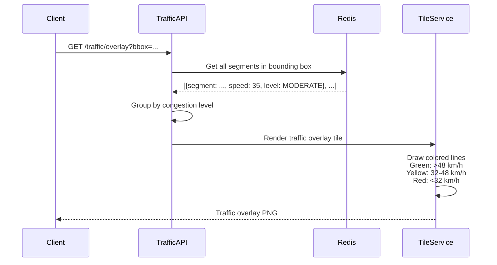

**Historical Traffic Patterns:**

**Definition:** Predicting traffic based on historical data when real-time probes are insufficient

**Use Cases:**
- Rural roads with few probes
- Predicting future traffic for ETA
- Time-of-day routing ("leave at 6pm to avoid traffic")

**Machine Learning Model:**
```python
# Simplified traffic prediction model
features = [
    'day_of_week',      # Monday = 1, ..., Sunday = 7
    'hour',             # 0-23
    'weather',          # Clear, Rain, Snow
    'is_holiday',       # Boolean
    'nearby_events',    # Concerts, sports games
    'historical_avg'    # Avg speed at this time
]

target = 'actual_speed'

# Train gradient boosting model on 2 years of data
model = XGBoostRegressor()
model.fit(X=historical_features, y=actual_speeds)

# Predict traffic for next hour
predicted_speed = model.predict({
    'day_of_week': 5,  # Friday
    'hour': 17,        # 5 PM
    'weather': 'Clear',
    'is_holiday': False,
    'nearby_events': 1,  # Stadium event
    'historical_avg': 45.0
})
# Prediction: 28 km/h (heavy traffic due to event + rush hour)
```

---

### Challenge 4: Place Search & Geocoding

#### The Problem

**Requirements:**
- Search for places by name, category, or address
- Support fuzzy matching ("starbuck" → "Starbucks")
- Autocomplete with <100ms latency
- Rank results by relevance AND proximity
- Handle multi-language queries

**Scale:**
- 200 million places globally
- 100,000 search queries per second

#### Solution: Elasticsearch with Geospatial Indexing

**Place Data Model:**

```json
{
  "place_id": "ChIJN1t_tDeuEmsRUsoyG83frY4",
  "name": "Starbucks Coffee",
  "category": ["cafe", "coffee_shop", "restaurant"],
  "address": {
    "street": "1234 Market St",
    "city": "San Francisco",
    "state": "CA",
    "zip": "94102",
    "country": "USA"
  },
  "location": {
    "lat": 37.7749,
    "lon": -122.4194
  },
  "rating": 4.2,
  "price_level": 2,  // $$ on a scale of 1-4
  "opening_hours": {
    "monday": "06:00-22:00",
    "tuesday": "06:00-22:00",
    ...
  },
  "phone": "+1-415-555-0123",
  "website": "https://starbucks.com",
  "geohash": "9q8yy",  // For geospatial indexing
  "popularity": 8750  // Based on search volume
}
```

**Elasticsearch Index Configuration:**

```json
{
  "mappings": {
    "properties": {
      "place_id": {"type": "keyword"},
      "name": {
        "type": "text",
        "fields": {
          "keyword": {"type": "keyword"},
          "completion": {"type": "completion"}
        },
        "analyzer": "standard"
      },
      "category": {"type": "keyword"},
      "address": {
        "properties": {
          "street": {"type": "text"},
          "city": {"type": "text"},
          "state": {"type": "keyword"},
          "zip": {"type": "keyword"},
          "country": {"type": "keyword"}
        }
      },
      "location": {"type": "geo_point"},
      "rating": {"type": "float"},
      "popularity": {"type": "integer"}
    }
  },
  "settings": {
    "number_of_shards": 20,
    "number_of_replicas": 2,
    "analysis": {
      "analyzer": {
        "place_analyzer": {
          "type": "custom",
          "tokenizer": "standard",
          "filter": ["lowercase", "asciifolding", "synonym"]
        }
      }
    }
  }
}
```

**Search Query Example:**

```json
{
  "query": {
    "function_score": {
      "query": {
        "bool": {
          "must": [
            {
              "multi_match": {
                "query": "starbuck coffee",
                "fields": ["name^3", "category^2", "address.street"],
                "fuzziness": "AUTO"
              }
            }
          ],
          "filter": [
            {
              "geo_distance": {
                "distance": "5km",
                "location": {
                  "lat": 37.7749,
                  "lon": -122.4194
                }
              }
            }
          ]
        }
      },
      "functions": [
        {
          "gauss": {
            "location": {
              "origin": {"lat": 37.7749, "lon": -122.4194},
              "scale": "2km",
              "decay": 0.5
            }
          },
          "weight": 2
        },
        {
          "field_value_factor": {
            "field": "popularity",
            "factor": 0.01,
            "modifier": "log1p"
          }
        },
        {
          "field_value_factor": {
            "field": "rating",
            "factor": 1.2
          }
        }
      ],
      "score_mode": "sum",
      "boost_mode": "multiply"
    }
  },
  "size": 10,
  "sort": ["_score", {"_geo_distance": {"location": {"lat": 37.7749, "lon": -122.4194}}}]
}
```

**Scoring Function Explanation:**

```
Final Score = TextRelevance × (DistanceScore + PopularityScore + RatingScore)

Where:
- TextRelevance: How well "starbuck coffee" matches place name (fuzzy matching)
- DistanceScore: Gaussian decay (closer = higher score)
  - Origin: User's location
  - Scale: 2km (score halves at 2km distance)
- PopularityScore: Logarithmic scale of search volume
- RatingScore: Boost by user rating (4.2 stars = 1.2x multiplier)
```

**Autocomplete Implementation:**

```json
{
  "suggest": {
    "place-suggestion": {
      "prefix": "starb",
      "completion": {
        "field": "name.completion",
        "size": 5,
        "contexts": {
          "location": {
            "lat": 37.7749,
            "lon": -122.4194,
            "precision": "5km"
          }
        },
        "fuzzy": {
          "fuzziness": 1
        }
      }
    }
  }
}
```

**Autocomplete Response:**
```json
{
  "suggest": {
    "place-suggestion": [
      {
        "text": "starb",
        "options": [
          {
            "text": "Starbucks Coffee",
            "score": 87.5,
            "_source": {
              "place_id": "ChIJN1t_tDeuEmsRUsoyG83frY4",
              "address": "1234 Market St, San Francisco, CA",
              "rating": 4.2
            }
          },
          {
            "text": "Starbucks Reserve Roastery",
            "score": 82.1,
            ...
          }
        ]
      }
    ]
  }
}
```

**Geocoding (Address → Coordinates):**

**Definition:** Converting human-readable address to lat/lon coordinates

**Process:**
```mermaid
graph LR
    A[Address String<br/>"1600 Amphitheatre Pkwy,<br/>Mountain View, CA"] --> B[Parse & Normalize]
    B --> C[Elasticsearch Query]
    C --> D{Exact Match?}
    D -->|Yes| E[Return Coordinates]
    D -->|No| F[Fuzzy Match]
    F --> G[Return Best Match<br/>+ Confidence Score]
```

**Reverse Geocoding (Coordinates → Address):**

**Definition:** Converting lat/lon to human-readable address

```json
{
  "query": {
    "bool": {
      "filter": [
        {
          "geo_distance": {
            "distance": "100m",
            "location": {"lat": 37.7749, "lon": -122.4194}
          }
        }
      ]
    }
  },
  "sort": [
    {
      "_geo_distance": {
        "location": {"lat": 37.7749, "lon": -122.4194},
        "order": "asc"
      }
    }
  ],
  "size": 1
}
```

---

## PostGIS Configuration for Geospatial Queries

### PostGIS Overview

**PostGIS:**
- **Definition:** A PostgreSQL extension that adds support for geographic objects and spatial queries
- **Purpose:** Store and query roads, places, polygons (city boundaries), and perform geospatial operations
- **Use in Maps:** Road network storage, administrative boundaries, complex spatial queries

### PostGIS Setup

```sql
-- Enable PostGIS extension
CREATE EXTENSION postgis;
CREATE EXTENSION postgis_topology;

-- Create road network table
CREATE TABLE roads (
    road_id BIGSERIAL PRIMARY KEY,
    name VARCHAR(255),
    road_type VARCHAR(50),  -- 'highway', 'arterial', 'residential'
    one_way BOOLEAN,
    speed_limit INT,
    geometry GEOMETRY(LineString, 4326),  -- WGS84 lat/lon
    geom_webmercator GEOMETRY(LineString, 3857),  -- Web Mercator for tile rendering
    length_meters DOUBLE PRECISION,
    from_node_id BIGINT,
    to_node_id BIGINT,
    country_code CHAR(2),
    region_geohash VARCHAR(10)
);

-- Create spatial index (essential for performance)
CREATE INDEX roads_geom_idx ON roads USING GIST(geometry);
CREATE INDEX roads_webmercator_idx ON roads USING GIST(geom_webmercator);
CREATE INDEX roads_geohash_idx ON roads(region_geohash);

-- Create places table
CREATE TABLE places (
    place_id UUID PRIMARY KEY,
    name VARCHAR(255),
    category VARCHAR(100),
    location GEOMETRY(Point, 4326),
    address JSONB,
    rating DECIMAL(2,1),
    created_at TIMESTAMP DEFAULT NOW()
);

CREATE INDEX places_location_idx ON places USING GIST(location);
CREATE INDEX places_category_idx ON places(category);

-- Create administrative boundaries table
CREATE TABLE admin_boundaries (
    boundary_id BIGSERIAL PRIMARY KEY,
    name VARCHAR(255),
    admin_level INT,  -- 2=country, 4=state, 6=county, 8=city
    boundary GEOMETRY(MultiPolygon, 4326),
    population INT,
    area_km2 DOUBLE PRECISION
);

CREATE INDEX admin_boundaries_geom_idx ON admin_boundaries USING GIST(boundary);
```

### Common Geospatial Queries

**1. Find roads within bounding box (for tile rendering):**

```sql
SELECT
    road_id,
    name,
    road_type,
    ST_AsGeoJSON(geom_webmercator) as geometry
FROM roads
WHERE geom_webmercator && ST_MakeEnvelope(
    -13655000, 4545000,  -- xmin, ymin
    -13650000, 4550000,  -- xmax, ymax
    3857  -- Web Mercator SRID
)
AND road_type IN ('highway', 'arterial')  -- Filter by zoom level
LIMIT 1000;
```

**2. Find places within radius:**

```sql
SELECT
    place_id,
    name,
    category,
    ST_Distance(
        location,
        ST_SetSRID(ST_MakePoint(-122.4194, 37.7749), 4326)::geography
    ) as distance_meters
FROM places
WHERE ST_DWithin(
    location::geography,
    ST_SetSRID(ST_MakePoint(-122.4194, 37.7749), 4326)::geography,
    5000  -- 5km radius
)
AND category = 'restaurant'
ORDER BY distance_meters
LIMIT 20;
```

**3. Find which city a point is in:**

```sql
SELECT
    name,
    admin_level,
    population
FROM admin_boundaries
WHERE ST_Contains(
    boundary,
    ST_SetSRID(ST_MakePoint(-122.4194, 37.7749), 4326)
)
ORDER BY admin_level DESC  -- Most specific first (city before state)
LIMIT 1;
```

**4. Calculate road network statistics by region:**

```sql
SELECT
    region_geohash,
    COUNT(*) as road_count,
    SUM(length_meters) / 1000 as total_km,
    AVG(speed_limit) as avg_speed_limit,
    COUNT(*) FILTER (WHERE road_type = 'highway') as highway_count
FROM roads
WHERE region_geohash LIKE '9q%'  -- San Francisco area
GROUP BY region_geohash;
```

**5. Snap point to nearest road (for map matching):**

```sql
SELECT
    road_id,
    name,
    road_type,
    ST_Distance(
        geometry::geography,
        ST_SetSRID(ST_MakePoint(-122.4194, 37.7749), 4326)::geography
    ) as distance_meters,
    ST_AsText(
        ST_ClosestPoint(
            geometry,
            ST_SetSRID(ST_MakePoint(-122.4194, 37.7749), 4326)
        )
    ) as snapped_point
FROM roads
WHERE geometry && ST_Expand(
    ST_SetSRID(ST_MakePoint(-122.4194, 37.7749), 4326)::geometry,
    0.001  -- ~100m buffer
)
ORDER BY distance_meters
LIMIT 1;
```

### PostGIS Performance Optimization

```sql
-- Analyze tables to update statistics
ANALYZE roads;
ANALYZE places;

-- Vacuum to reclaim space and update indexes
VACUUM ANALYZE roads;

-- Create materialized view for frequently accessed data
CREATE MATERIALIZED VIEW major_highways AS
SELECT
    road_id,
    name,
    geometry,
    length_meters
FROM roads
WHERE road_type = 'highway'
  AND length_meters > 1000;

CREATE INDEX major_highways_geom_idx ON major_highways USING GIST(geometry);

-- Refresh periodically
REFRESH MATERIALIZED VIEW CONCURRENTLY major_highways;

-- Partitioning by region for large tables
CREATE TABLE roads_partitioned (
    road_id BIGSERIAL,
    region_code CHAR(2),
    geometry GEOMETRY(LineString, 4326),
    ...
) PARTITION BY LIST (region_code);

CREATE TABLE roads_us PARTITION OF roads_partitioned FOR VALUES IN ('US');
CREATE TABLE roads_eu PARTITION OF roads_partitioned FOR VALUES IN ('DE', 'FR', 'IT', ...);
```

### PostGIS Configuration Tuning

```
# postgresql.conf optimizations for geospatial workloads

# Increase memory for complex spatial queries
shared_buffers = 16GB
work_mem = 256MB
maintenance_work_mem = 2GB

# Parallel query execution for spatial operations
max_parallel_workers_per_gather = 4
max_parallel_workers = 8

# Increase cache for spatial indexes
effective_cache_size = 32GB

# PostGIS-specific
postgis.gdal_enabled_drivers = 'ENABLE_ALL'
postgis.enable_outdb_rasters = on
```

---

## Monitoring & Observability

### Key Metrics Dashboard

```
┌─────────────────────────────────────────────────────────────────┐
│                    GOOGLE MAPS MONITORING                       │
├─────────────────────────────────────────────────────────────────┤
│                                                                 │
│ TILE SERVICE                                                    │
│ ────────────                                                    │
│ • Requests/sec:     1,724,583 ✓                                │
│   Definition: Tile requests across all zoom levels             │
│   Target: < 2M/sec (infrastructure capacity)                   │
│                                                                 │
│ • CDN Hit Rate:     96.3% ✓                                    │
│   Definition: % of requests served from CDN cache              │
│   Target: > 95% (reduces origin load)                          │
│                                                                 │
│ • P99 Latency:      47ms ✓                                     │
│   Definition: 99% of tile requests complete within this time   │
│   Target: < 100ms (smooth map panning)                         │
│                                                                 │
│ • Origin Requests:  63,791/sec                                 │
│   Definition: Tile requests hitting origin (cache miss)        │
│   Alert when: > 100K/sec (potential cache issue)               │
│                                                                 │
│ ─────────────────────────────────────────────────────────────  │
│                                                                 │
│ ROUTING SERVICE                                                 │
│ ────────────────                                                │
│ • Route Calc QPS:   5,847 ✓                                    │
│   Definition: Route calculations per second                     │
│   Target: < 10K/sec per instance                               │
│                                                                 │
│ • P99 Route Time:   427ms ✓                                    │
│   Definition: 99% of routes calculated within this time        │
│   Target: < 2s (user expectation for navigation)               │
│                                                                 │
│ • Graph Memory:     187 GB / 200 GB ✓                          │
│   Definition: In-memory road network size                       │
│   Alert when: > 190 GB (approaching capacity)                  │
│                                                                 │
│ • Failed Routes:    0.12% ✓                                    │
│   Definition: % of route requests that failed                   │
│   Alert when: > 1% (indicates routing issues)                  │
│                                                                 │
│ ─────────────────────────────────────────────────────────────  │
│                                                                 │
│ TRAFFIC SERVICE                                                 │
│ ────────────────                                                │
│ • GPS Probes/sec:   28.4M ✓                                    │
│   Definition: Incoming GPS points from mobile devices          │
│   Alert when: < 20M/sec (data collection issue)                │
│                                                                 │
│ • Map Match Rate:   99.1% ✓                                    │
│   Definition: % of GPS points successfully matched to roads    │
│   Target: > 98% (high accuracy)                                │
│                                                                 │
│ • Processing Lag:   12 seconds ✓                               │
│   Definition: Time from GPS receipt to traffic update          │
│   Target: < 30 seconds (real-time requirement)                 │
│                                                                 │
│ • Redis Memory:     847 GB / 1 TB ✓                            │
│   Definition: Traffic state cache size                          │
│   Alert when: > 900 GB (approaching capacity)                  │
│                                                                 │
│ ─────────────────────────────────────────────────────────────  │
│                                                                 │
│ SEARCH SERVICE                                                  │
│ ──────────────                                                  │
│ • Search QPS:       47,283 ✓                                   │
│   Definition: Place search queries per second                   │
│   Target: < 100K/sec per cluster                               │
│                                                                 │
│ • P99 Search Time:  78ms ✓                                     │
│   Definition: 99% of searches complete within this time        │
│   Target: < 100ms (autocomplete responsiveness)                │
│                                                                 │
│ • ES Heap Usage:    68% ✓                                      │
│   Definition: Elasticsearch JVM heap utilization                │
│   Alert when: > 75% (GC pressure)                              │
│                                                                 │
│ • Index Size:       127 GB                                     │
│   Definition: Total size of place index                         │
│                                                                 │
└─────────────────────────────────────────────────────────────────┘
```

### Monitoring Stack

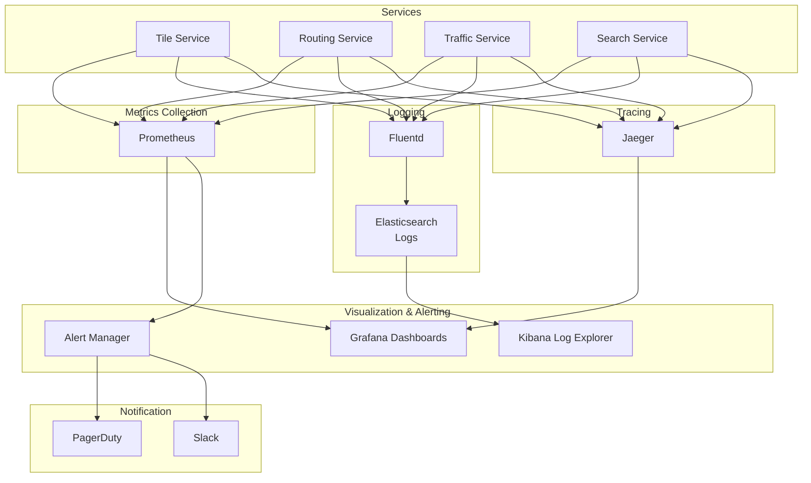

### Alert Rules

```yaml
# Prometheus alert rules
groups:
  - name: google_maps_alerts
    interval: 30s
    rules:
      # Tile Service Alerts
      - alert: HighTileLatency
        expr: histogram_quantile(0.99, tile_request_duration_seconds) > 0.1
        for: 5m
        labels:
          severity: warning
        annotations:
          summary: "P99 tile latency above 100ms"
          description: "{{ $value }}s latency affecting user experience"

      - alert: LowCDNHitRate
        expr: (tile_cdn_hits / tile_total_requests) < 0.90
        for: 10m
        labels:
          severity: warning
        annotations:
          summary: "CDN hit rate below 90%"
          description: "Hit rate at {{ $value | humanizePercentage }}"

      # Routing Service Alerts
      - alert: SlowRouteCalculation
        expr: histogram_quantile(0.99, route_calculation_duration_seconds) > 2
        for: 5m
        labels:
          severity: critical
        annotations:
          summary: "Route calculation exceeding 2s"
          description: "P99 route time: {{ $value }}s"

      - alert: HighRouteFailureRate
        expr: (route_failures / route_requests) > 0.01
        for: 3m
        labels:
          severity: critical
        annotations:
          summary: "Route failure rate above 1%"
          description: "{{ $value | humanizePercentage }} of routes failing"

      # Traffic Service Alerts
      - alert: TrafficProcessingLag
        expr: traffic_processing_lag_seconds > 60
        for: 5m
        labels:
          severity: warning
        annotations:
          summary: "Traffic data processing lagging"
          description: "{{ $value }}s lag (target <30s)"

      - alert: LowGPSProbeVolume
        expr: rate(gps_probes_received[5m]) < 20000000
        for: 10m
        labels:
          severity: critical
        annotations:
          summary: "GPS probe volume below normal"
          description: "{{ $value }} probes/sec (expected >20M)"

      # Search Service Alerts
      - alert: SlowSearchQueries
        expr: histogram_quantile(0.99, search_duration_seconds) > 0.2
        for: 5m
        labels:
          severity: warning
        annotations:
          summary: "Search queries exceeding 200ms"
          description: "P99 search latency: {{ $value }}s"

      - alert: ElasticsearchHighHeap
        expr: elasticsearch_jvm_memory_used_bytes{area="heap"} / elasticsearch_jvm_memory_max_bytes{area="heap"} > 0.75
        for: 10m
        labels:
          severity: warning
        annotations:
          summary: "Elasticsearch heap usage high"
          description: "{{ $value | humanizePercentage }} heap used"
```

### Distributed Tracing Example

```
Request: Calculate route from SF to LA

┌─────────────────────────────────────────────────────────────────┐
│ Trace ID: 7a8c9b2d-4f3e-1a2b-8c9d-3e4f5a6b7c8d                 │
├─────────────────────────────────────────────────────────────────┤
│                                                                 │
│ [API Gateway]                                       447ms       │
│  │                                                              │
│  ├─> [Auth Service]                                 12ms       │
│  │                                                              │
│  ├─> [Routing Service]                             421ms       │
│  │    │                                                         │
│  │    ├─> Load Graph from Cache                     5ms        │
│  │    │                                                         │
│  │    ├─> [Traffic Service] Get Traffic Weights    37ms       │
│  │    │    │                                                    │
│  │    │    ├─> Redis: GET traffic:segment:*        8ms        │
│  │    │    └─> Aggregate weights                   29ms       │
│  │    │                                                         │
│  │    ├─> Apply traffic to graph                   18ms       │
│  │    │                                                         │
│  │    ├─> Run Contraction Hierarchies              287ms       │
│  │    │    • Bidirectional search                              │
│  │    │    • Explored 8,472 nodes                              │
│  │    │                                                         │
│  │    ├─> Unpack shortcuts                         42ms       │
│  │    │                                                         │
│  │    └─> Calculate ETA and waypoints              32ms       │
│  │                                                              │
│  └─> Format response                                14ms       │
│                                                                 │
│ Total Duration: 447ms                                          │
│ Status: 200 OK                                                 │
└─────────────────────────────────────────────────────────────────┘
```

---

## Capacity Planning for 1B+ Users

### Capacity Planning Definition

**Capacity Planning:**
- **Definition:** The process of determining infrastructure resources needed to meet performance and availability targets under expected load
- **Goal:** Right-size infrastructure - enough capacity for peak + growth, minimal waste
- **Approach:** Calculate based on traffic patterns, latency requirements, and redundancy needs

### Traffic Patterns

```
Daily Active Users: 1 billion
Peak Traffic: 3x average (during commute hours: 7-9 AM, 5-7 PM)

Hourly Distribution:
┌─────────────────────────────────────────────────────────────────┐
│                    DAILY TRAFFIC PATTERN                        │
├─────────────────────────────────────────────────────────────────┤
│                                                                 │
│ 100%│                  ╱█╲                    ╱█╲              │
│     │                 ╱ █ ╲                  ╱ █ ╲             │
│  75%│                ╱  █  ╲                ╱  █  ╲            │
│     │               ╱   █   ╲              ╱   █   ╲           │
│  50%│             ╱     █    ╲            ╱    █    ╲          │
│     │           ╱       █     ╲          ╱     █     ╲        │
│  25%│    ──────╱        █      ╲────────╱      █      ╲────   │
│     │                                                           │
│   0%└───┬───┬───┬───┬───┬───┬───┬───┬───┬───┬───┬───┬───┐   │
│        00  03  06  09  12  15  18  21  24                     │
│                         Hour (UTC)                             │
│                                                                 │
│ Peak Hours: 7-9 AM, 5-7 PM local time (rolling globally)      │
└─────────────────────────────────────────────────────────────────┘
```

### Component Capacity Calculations

#### 1. Tile Service Capacity

**Requirements:**
- 1.7M tile requests/sec (average)
- Peak: 5.1M tile requests/sec (3x average)
- P99 latency: <100ms
- CDN hit rate: 95%

**Calculations:**

```
Step 1: Calculate origin requests (CDN miss traffic)
  Origin QPS = Total QPS × (1 - CDN_hit_rate)
  Origin QPS = 5.1M × 0.05 = 255,000 QPS

Step 2: Calculate required tile service instances
  Assumptions:
    - Each instance handles 1,000 QPS
    - Need 2x capacity for failover

  Instances = (Origin QPS / QPS_per_instance) × 2
  Instances = (255,000 / 1,000) × 2 = 510 instances

Step 3: Calculate storage for tiles
  Total tiles (zoom 0-18): 91.6 billion tiles
  Average tile size: 50 KB

  Storage = 91.6B × 50 KB = 4.5 PB
  With replication (3x): 13.5 PB

Step 4: Calculate bandwidth
  Per tile: 50 KB
  Peak QPS: 5.1M

  Bandwidth = 5.1M × 50 KB = 255 GB/sec
  With overhead (20%): 306 GB/sec
```

**Tile Service Infrastructure:**
- **500+ servers** for tile rendering (origin)
- **13.5 PB** S3/GCS storage (3x replication)
- **300 Gbps** egress bandwidth
- **200+ CDN PoPs** globally

#### 2. Routing Service Capacity

**Requirements:**
- 5,800 route calculations/sec (average)
- Peak: 17,400 calculations/sec
- P99 latency: <2s
- Graph size: 200 GB in-memory

**Calculations:**

```
Step 1: Calculate concurrent route calculations
  Concurrent = QPS × Latency
  Concurrent = 17,400 × 0.5s (median latency) = 8,700 concurrent

Step 2: Calculate required instances
  Assumptions:
    - Each instance: 200 GB RAM (for graph)
    - Can handle 100 concurrent calculations
    - Need 2x capacity for failover

  Instances = (Concurrent / Concurrent_per_instance) × 2
  Instances = (8,700 / 100) × 2 = 174 instances

Step 3: Calculate memory requirements
  Per instance: 200 GB (graph) + 50 GB (working memory) = 250 GB
  Total RAM = 174 × 250 GB = 43.5 TB

Step 4: Calculate CPU requirements
  Each route calculation: ~500ms CPU time
  CPU cores needed = Concurrent / 1 (single-core per calculation)
  CPU cores = 8,700 cores

  With 64 cores per server: 136 servers
```

**Routing Service Infrastructure:**
- **170+ servers** (m5.16xlarge: 64 vCPU, 256 GB RAM)
- **43.5 TB** total RAM for road graph
- **CPU utilization target:** 50% average, 80% peak
- **Load balancing:** Geographic routing (route in nearest region)

#### 3. Traffic Service Capacity

**Requirements:**
- 28M GPS probes/sec
- Processing lag: <30 seconds
- Historical data: 2 years
- Real-time cache: 5 minutes

**Calculations:**

```
Step 1: Calculate ingestion capacity
  GPS probes/sec: 28M
  Per probe: 100 bytes

  Ingestion bandwidth = 28M × 100 bytes = 2.8 GB/sec
  With compression (3x): ~930 MB/sec

Step 2: Calculate Kafka capacity
  Messages/sec: 28M
  Retention: 24 hours
  Total messages = 28M × 86,400 = 2.4 trillion messages/day

  Storage (24h retention) = 2.4T × 100 bytes = 240 TB

Step 3: Calculate Flink processing capacity
  Operations per probe:
    - Map matching: 50ms
    - Aggregation: 10ms

  Processing time per probe: 60ms
  Concurrent processing = 28M × 0.06s = 1.68M concurrent

  With 100 concurrent per worker: 16,800 workers

Step 4: Calculate Redis capacity
  Road segments: 1 billion
  Active segments (5min data): ~100M (10% of roads with traffic)
  Per segment: 200 bytes

  Redis storage = 100M × 200 bytes = 20 GB
  With replication (3x) + overhead: 100 GB

Step 5: Calculate Cassandra capacity (historical data)
  Traffic records per segment per day: 2,880 (every 30 sec)
  Active segments: 100M
  Per record: 50 bytes

  Daily data = 100M × 2,880 × 50 bytes = 14.4 TB/day
  2 years retention = 14.4 TB × 730 = 10.5 PB
  With replication (3x): 31.5 PB
```

**Traffic Service Infrastructure:**
- **Kafka:** 100+ brokers, 250 TB storage
- **Flink:** 1,000+ workers (8 vCPU, 32 GB RAM each)
- **Redis:** 50-node cluster, 100 GB RAM per node (5 TB total)
- **Cassandra:** 500+ nodes, 31.5 PB storage

#### 4. Search Service Capacity

**Requirements:**
- 47K search QPS (average)
- Peak: 141K search QPS
- P99 latency: <100ms
- Index size: 200M places

**Calculations:**

```
Step 1: Calculate Elasticsearch cluster size
  Index size: 100 GB (with analyzers and caches)
  Replication factor: 2 (primary + 1 replica)
  Total storage = 100 GB × 2 = 200 GB

  Shards: 20 shards (5 GB each)

Step 2: Calculate node count
  Each node:
    - 64 GB RAM (50% for JVM heap)
    - Can handle 2-3 shards
    - Can handle 5,000 QPS

  Nodes for capacity = Peak_QPS / QPS_per_node
  Nodes = 141,000 / 5,000 = 28 nodes

  Nodes for data = Shards / Shards_per_node
  Nodes = 20 / 2 = 10 nodes

  Required: 28 nodes (capacity-bound, not data-bound)

Step 3: Calculate CPU requirements
  Per search: ~20ms CPU
  Concurrent searches = QPS × Latency
  Concurrent = 141,000 × 0.02 = 2,820 concurrent

  With 8 cores per node: ~350 cores needed
  28 nodes × 16 cores = 448 cores ✓
```

**Search Service Infrastructure:**
- **Elasticsearch:** 30-node cluster (16 vCPU, 64 GB RAM each)
- **Storage:** 200 GB (with replication)
- **JVM heap:** 32 GB per node
- **Load balancing:** Coordinate nodes for routing

### Total Infrastructure Summary

| Component | Servers | RAM | Storage | Bandwidth |
|-----------|---------|-----|---------|-----------|
| **Tile Service** | 500 | 32 TB | 13.5 PB | 306 Gbps |
| **Routing Service** | 170 | 43.5 TB | 100 GB | 10 Gbps |
| **Traffic Service** | 1,650 | 80 TB | 31.8 PB | 3 Gbps |
| **Search Service** | 30 | 1.9 TB | 200 GB | 5 Gbps |
| **API Gateway** | 100 | 3.2 TB | 1 TB | 50 Gbps |
| **CDN (3rd party)** | 200 PoPs | - | 20 PB cache | 300 Gbps |
| **Total** | **2,450** | **160 TB** | **65 PB** | **674 Gbps** |

### Cost Estimation (AWS Pricing)

```
Monthly Infrastructure Cost:

Compute (EC2):
  - 2,450 instances × $2,500/month avg = $6,125,000/month

Storage (S3/EBS):
  - 65 PB × $23/TB = $1,495,000/month

Bandwidth:
  - 674 Gbps × 2.6 PB/sec × $0.085/GB = $7,225,000/month

CDN (CloudFront):
  - 300 Gbps × 7.8 PB/month × $0.085/GB = $663,000/month

Total: ~$15.5M/month = $186M/year

Note: These are rough estimates. Google operates its own infrastructure,
significantly reducing costs through:
  - Custom ASICs (TPUs for ML, custom chips for routing)
  - Owned fiber networks
  - Global data center footprint
  - Aggressive hardware optimization
```

---

## Decision Trees & Troubleshooting

### Decision Tree: When to Pre-render Tiles

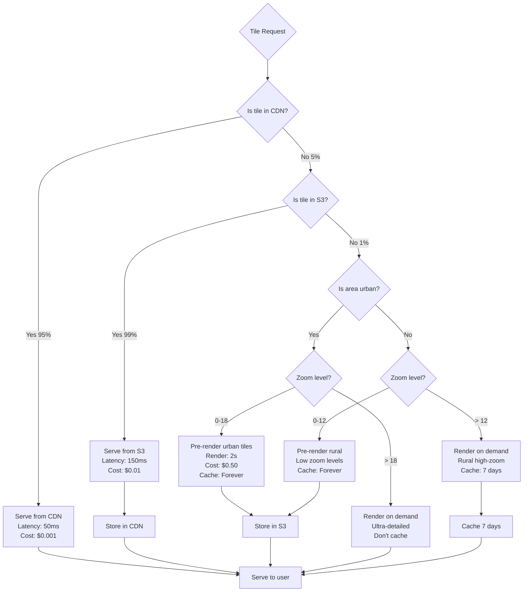

### Decision Tree: Routing Algorithm Selection

```
┌─────────────────────────────────────────────────────────────────┐
│             ROUTING ALGORITHM DECISION TREE                     │
├─────────────────────────────────────────────────────────────────┤
│                                                                 │
│ START: Need to calculate route                                 │
│   │                                                             │
│   ├─> Q1: What's the distance?                                 │
│   │    ├─> < 5 km (local): Use A* with landmarks              │
│   │    │   • Fast enough without preprocessing                 │
│   │    │   • Can handle dynamic traffic easily                 │
│   │    │                                                        │
│   │    ├─> 5-50 km (city): Use Contraction Hierarchies        │
│   │    │   • Optimal for medium distances                      │
│   │    │   • Good traffic integration                          │
│   │    │                                                        │
│   │    └─> > 50 km (long distance): Use CH + Arc Flags        │
│   │        • Best for inter-city routing                       │
│   │        • Prunes irrelevant regions                         │
│   │                                                             │
│   ├─> Q2: How many alternatives needed?                        │
│   │    ├─> 1 route: Standard CH                                │
│   │    └─> Multiple: Penalty method or Yen's algorithm         │
│   │        • Calculate fastest, then penalize used roads       │
│   │        • Show "alternate routes" feature                   │
│   │                                                             │
│   ├─> Q3: Special constraints?                                 │
│   │    ├─> Avoid highways: A* with edge filtering             │
│   │    ├─> Avoid tolls: Modify edge weights (toll = high cost)│
│   │    ├─> Truck routing: Use truck-specific graph            │
│   │    │   • Height, weight restrictions                       │
│   │    │   • Hazmat route compliance                           │
│   │    └─> Wheelchair accessible: Filter for ramps/elevators  │
│   │                                                             │
│   └─> Q4: Transit mode?                                        │
│        ├─> Driving: Standard road graph + traffic             │
│        ├─> Walking: Pedestrian graph (sidewalks, crosswalks)  │
│        ├─> Cycling: Bike lanes + road sharing allowed         │
│        └─> Transit: Multi-modal (walking + bus + train)       │
│            • Time-dependent (schedule-based)                   │
│            • Transfer optimization                             │
│                                                                 │
└─────────────────────────────────────────────────────────────────┘
```

### Troubleshooting Guide

#### Problem 1: High Tile Latency

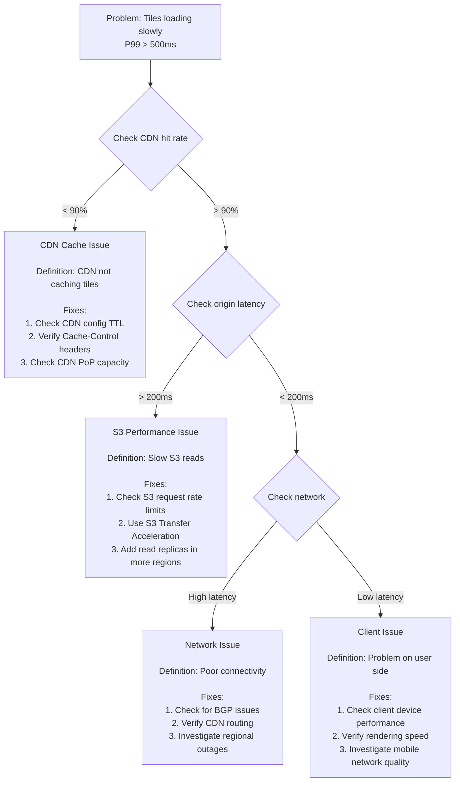

#### Problem 2: Slow Route Calculation

```
┌─────────────────────────────────────────────────────────────────┐
│          TROUBLESHOOTING: Slow Route Calculation                │
├─────────────────────────────────────────────────────────────────┤
│                                                                 │
│ Symptom: Route calculation > 5s                                │
│                                                                 │
│ Step 1: Check graph loading time                               │
│   Command: log_analysis "graph_load_time"                      │
│   │                                                             │
│   ├─> High (> 100ms):                                          │
│   │    Cause: Graph not in memory                              │
│   │    Fix: Increase instance RAM, use memory-optimized VMs   │
│   │                                                             │
│   └─> Low (< 50ms): ✓ Graph loading OK                        │
│                                                                 │
│ Step 2: Check traffic weight application                       │
│   Command: log_analysis "traffic_merge_time"                   │
│   │                                                             │
│   ├─> High (> 500ms):                                          │
│   │    Cause: Redis latency or too many segments              │
│   │    Fix: Batch Redis queries, use Redis cluster            │
│   │                                                             │
│   └─> Low (< 100ms): ✓ Traffic merge OK                       │
│                                                                 │
│ Step 3: Check CH search performance                            │
│   Command: log_analysis "ch_search_time"                       │
│   │                                                             │
│   ├─> High (> 3s):                                             │
│   │    Cause: Query exploring too many nodes                   │
│   │    Fixes:                                                   │
│   │      - Check if CH preprocessing is stale                  │
│   │      - Verify bidirectional search working                 │
│   │      - Check for graph corruption                          │
│   │                                                             │
│   └─> Low (< 500ms): ✓ CH search OK                           │
│                                                                 │
│ Step 4: Check shortcut unpacking                               │
│   Command: log_analysis "unpack_time"                          │
│   │                                                             │
│   ├─> High (> 1s):                                             │
│   │    Cause: Too many shortcuts in path                       │
│   │    Fix: Re-tune CH preprocessing parameters                │
│   │                                                             │
│   └─> Low (< 200ms): ✓ Unpacking OK                           │
│                                                                 │
│ Step 5: Check for specific problem routes                      │
│   Pattern: Only certain routes slow?                           │
│   │                                                             │
│   ├─> Yes: Geographic issue                                    │
│   │    Investigate: Missing roads, data corruption,            │
│   │                 or region-specific graph problem           │
│   │                                                             │
│   └─> No: System-wide performance issue                        │
│        Investigate: CPU, memory, or network saturation         │
│                                                                 │
└─────────────────────────────────────────────────────────────────┘
```

#### Problem 3: Traffic Data Lag

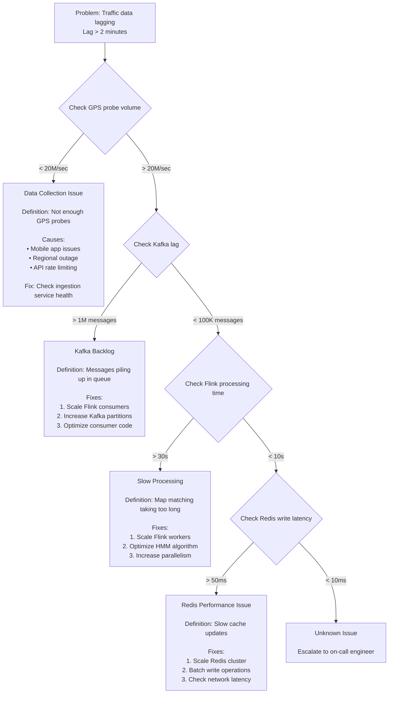

---

## Real Google Maps Architecture

### What We Know from Public Information

Google has shared limited details about Maps architecture through blog posts, patents, and presentations. Here's what we can infer:

#### 1. Custom Infrastructure

**Google's Advantages:**
- **Jupiter Network:** Google's internal data center network (1 Pbps bisection bandwidth)
- **Custom ASICs:** Purpose-built chips for specific operations
  - TPUs for machine learning (traffic prediction)
  - Custom routing accelerators for graph algorithms
- **Colossus:** Distributed file system (successor to GFS) for tile storage
- **Bigtable:** NoSQL database for metadata and place information
- **Spanner:** Globally distributed SQL database for transactional data

#### 2. Maps Data Pipeline

**Data Sources:**
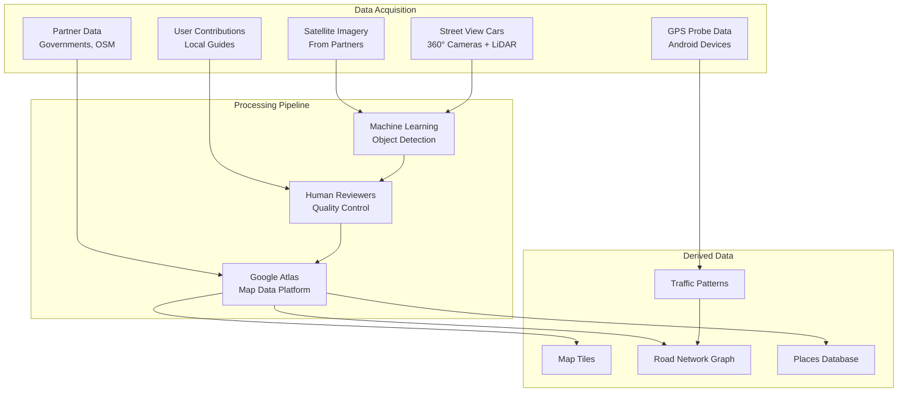

**Google Atlas:**
- **Definition:** Google's internal platform for storing and updating map data
- **Purpose:** Single source of truth for all geographic information
- **Scale:** Petabytes of raw data, continuously updated
- **Features:**
  - Automated change detection (compare new satellite imagery to existing maps)
  - Conflict resolution (multiple data sources for same location)
  - Version control (historical map states)

#### 3. Street View System

**Street View Capture:**
```
Street View Car Equipment:
┌─────────────────────────────────────────────────────────────────┐
│                                                                 │
│  Roof Mount:                                                    │
│  ┌───────────────────────────────────────────────────────────┐ │
│  │   ╱█╲  ← 360° Camera Array (15 cameras)                   │ │
│  │  ╱███╲                                                     │ │
│  │ ╱█████╲                                                    │ │
│  │███████████                                                 │ │
│  │  LiDAR  ← 3D Laser Scanner                                │ │
│  └───────────────────────────────────────────────────────────┘ │
│                                                                 │
│  Interior:                                                      │
│  • GPS receiver (high-precision)                               │
│  • IMU (inertial measurement unit)                             │
│  • Storage: 2 TB SSD                                           │
│  • Processing: Real-time image quality checks                  │
│                                                                 │
│  Captures:                                                      │
│  • 360° panoramic images every 10-20 meters                    │
│  • LiDAR point clouds for 3D reconstruction                    │
│  • GPS coordinates for each capture                            │
│                                                                 │
└─────────────────────────────────────────────────────────────────┘
```

**Street View Processing:**
```
1. Image Stitching:
   - Combine 15 camera images into seamless 360° panorama
   - Correct for lens distortion and exposure differences

2. Privacy Protection:
   - ML models detect faces and license plates
   - Automatically blur sensitive information
   - Human review for edge cases

3. 3D Reconstruction:
   - Combine LiDAR and image data
   - Create 3D point cloud of environment
   - Extract building heights, road widths

4. Object Detection:
   - Identify street signs, traffic lights, storefronts
   - Extract text (business names, addresses)
   - Update Places database

5. Storage & Serving:
   - Store as multi-resolution panoramas
   - Pre-render common viewing angles
   - Compress using custom codecs (50% smaller than JPEG)
```

#### 4. Traffic Prediction with Machine Learning

**Historical Traffic Patterns:**
```python
# Simplified version of traffic prediction

class TrafficPredictor:
    """
    Predicts future traffic using historical patterns + real-time data
    """

    def predict_traffic(self, road_segment, target_time):
        # Feature engineering
        features = {
            'day_of_week': target_time.weekday(),
            'hour': target_time.hour,
            'minute': target_time.minute,
            'is_holiday': is_holiday(target_time),
            'weather': get_weather_forecast(road_segment.location, target_time),
            'events': get_nearby_events(road_segment.location, target_time),

            # Historical features
            'avg_speed_same_time_last_week': self.historical_db.query(...),
            'avg_speed_same_day_last_4_weeks': self.historical_db.query(...),
            'typical_speed_this_hour': self.baseline[road_segment.id][target_time.hour],

            # Real-time features
            'current_speed': self.traffic_db.get_current_speed(road_segment.id),
            'upstream_speed': self.traffic_db.get_current_speed(road_segment.prev_id),
            'recent_trend': self.calculate_speed_trend(road_segment.id, minutes=15)
        }

        # Neural network prediction
        predicted_speed = self.model.predict(features)
        confidence = self.model.predict_uncertainty(features)

        return predicted_speed, confidence

# Model architecture (simplified)
Model: Deep Neural Network
  - Input layer: 20+ features
  - Hidden layers: 3 layers, 128 nodes each, ReLU activation
  - Output: Predicted speed + uncertainty estimate

Training:
  - Dataset: 2+ years of historical traffic data
  - Training examples: Trillions (every road segment × time)
  - Re-trained weekly with new data
```

**Graph Neural Networks for Traffic:**

Google likely uses Graph Neural Networks (GNNs) that understand road network structure:
```
Traditional ML: Treat each road segment independently
GNN: Understand that traffic on one road affects neighbors

Example:
  If Highway 101 northbound is congested at Exit 15,
  GNN predicts that:
    - Exit 14 (upstream) will slow down as cars queue
    - Exit 16 (downstream) will speed up (fewer cars)
    - Parallel streets will slow down (drivers rerouting)

This spatial awareness improves prediction accuracy by 15-20%
```

#### 5. Edge Computing for Navigation

**On-Device Processing:**
```
Modern Google Maps apps do significant processing locally:

On-Device Capabilities:
┌─────────────────────────────────────────────────────────────────┐
│                                                                 │
│ Offline Maps:                                                   │
│  • Pre-downloaded tiles for region (1-5 GB)                     │
│  • Local road graph for basic routing                           │
│  • Places index for search                                      │
│                                                                 │
│ GPS Processing:                                                 │
│  • Map matching algorithm runs locally                          │
│  • Snap to road in real-time (no network needed)               │
│  • Detect turns for navigation cues                             │
│                                                                 │
│ Rendering:                                                      │
│  • Vector tile rendering (WebGL / Metal / OpenGL)              │
│  • 3D building extrusion                                        │
│  • Real-time rotation and zoom                                  │
│                                                                 │
│ Machine Learning:                                               │
│  • On-device ML models (TensorFlow Lite)                        │
│  • Predict next destination                                     │
│  • Optimize route based on usage patterns                       │
│                                                                 │
└─────────────────────────────────────────────────────────────────┘
```

**Hybrid Architecture:**
```
Initial Route Calculation:
  - Server-side: Complex Contraction Hierarchies calculation
  - Returns: Full route with turn-by-turn instructions
  - Client caches: Route + surrounding map data

During Navigation:
  - Client-side: GPS tracking, map matching, ETAs
  - Server-side: Traffic updates every 2-5 minutes
  - Re-routing: Client initiates, server calculates new route

Offline Mode:
  - Client-side: All routing (limited to downloaded area)
  - Uses pre-downloaded traffic patterns (historical)
  - No real-time traffic updates
```

#### 6. Multi-Modal Routing (Transit)

**Transit Routing Challenges:**
- **Time-dependent:** Buses/trains run on schedules
- **Multi-leg:** Walk + bus + train + walk
- **Transfers:** Minimize waiting time
- **Service disruptions:** Handle delays, cancellations

**Transit Algorithm:**
```
Modified Dijkstra with Time-Expanded Graph:

Graph Structure:
  - Nodes: (stop, time) pairs
  - Edges: Transit connections

Example:
  Node: (Bus Stop A, 8:00 AM)
  Edges:
    → (Bus Stop A, 8:05 AM) [waiting, cost = 5 min]
    → (Bus Stop B, 8:15 AM) [Bus Line 10, cost = 15 min]
    → (Within walking distance) [walking, cost = distance/speed]

Search:
  1. Start at current location + current time
  2. Explore all options: walk, wait, or take transit
  3. Penalize transfers (add 5 min transfer penalty)
  4. Find path with earliest arrival time

Optimizations:
  - Prune dominated paths (slower AND more transfers)
  - Use raptor algorithm (round-based public transit routing)
  - Pre-compute transfer stations
```

#### 7. Global Scale Optimizations

**Regional Routing:**
```
Problem: Can't load 1B road segments into memory on every server

Solution: Regional Graph Sharding

Example:
  Server in US-West region:
    - Loads full graph for California, Oregon, Washington (high detail)
    - Loads highway-only graph for rest of USA
    - Loads international graph at country level

  For route SF → LA:
    - Use local detailed graph (fast)

  For route SF → Paris:
    - Use local graph to get to airport
    - Use international graph for overview
    - Forward request to EU server for Paris detail

Benefits:
  - Reduced memory footprint (20 GB vs. 200 GB)
  - Faster route calculation (smaller graph)
  - Geographic load distribution
```

**Load Balancing Strategy:**
```
Geographic Load Balancing:

1. Anycast routing: User connects to nearest PoP
2. PoP forwards to regional data center
3. Regional DC routes to appropriate service

Example:
  User in Tokyo opens Maps
    → Anycast DNS: Resolves to asia-northeast1 region
    → Load balancer: Routes to least-loaded server
    → Server: Serves tiles, calculates routes using Asia-Pacific graph

  User searches "restaurants near me"
    → Uses local place index (Japan)
    → Results in < 50ms (no cross-region query)
```

---

## Interview Preparation

### Concept Glossary

Quick reference definitions for interviews:

**Geospatial:**
- **Geohash:** Encodes lat/lon as short string; longer = more precise; enables proximity search
- **Quadtree:** Recursively divides 2D space into 4 quadrants; adapts to data density
- **Tile System:** Divides world into 2^n × 2^n grid at each zoom level; zoom 18 = 68B tiles
- **Map Projection:** Transforms 3D Earth to 2D map; Web Mercator distorts poles
- **R-Tree:** Spatial index using bounding boxes; enables "near me" queries

**Routing:**
- **A Algorithm:** * Shortest path using actual cost + heuristic estimate; faster than Dijkstra
- **Contraction Hierarchies:** Pre-computes shortcuts in road graph; 1000x faster queries
- **Bidirectional Search:** Search from both start and goal; meets in middle; √n speedup
- **Edge Weight:** Cost of traversing road segment; includes distance, time, traffic
- **Graph Partitioning:** Divide road network by region; reduces memory requirements

**Traffic:**
- **GPS Probe:** Location + speed data from mobile device; anonymized
- **Map Matching:** Aligning noisy GPS to actual roads using HMM
- **Traffic Segmentation:** Divide roads into 100-500m segments for granular traffic
- **Congestion Level:** Speed ratio (actual/free-flow); green/yellow/red zones

**Infrastructure:**
- **CDN (Content Delivery Network):** Edge caches serving content near users; 95%+ hit rate
- **Vector Tiles:** Geometric data rendered client-side; enables rotation, styles
- **Raster Tiles:** Pre-rendered images; fixed style but universally compatible
- **PostGIS:** PostgreSQL extension for geospatial queries; stores roads, boundaries

### Question Template

**Q: "How does Google Maps calculate routes so quickly on a billion-edge graph?"**

**Answer Structure:**

**1. Define (5-10 sec):**
"Google Maps uses Contraction Hierarchies, a preprocessing technique that creates 'shortcut' edges in the road graph, representing multi-hop paths through low-importance roads."

**2. Explain How (15-20 sec):**
"In preprocessing, nodes are ranked by importance - highways are high, residential streets are low. Low-importance nodes are iteratively 'contracted' by removing them and adding shortcut edges between neighbors. For example, a path A→B→C→D through residential streets becomes a single shortcut A→D. At query time, bidirectional search runs on this contracted graph, exploring only ~10,000 nodes instead of millions."

**3. State When (10 sec):**
"Use Contraction Hierarchies when the graph is mostly static and you need sub-second query times. For highly dynamic graphs with frequent edge weight changes, A* with landmarks is better."

**4. Mention Trade-off (10 sec):**
"Pro: 1000x faster queries (milliseconds vs. seconds). Con: Hours of preprocessing needed; updates to road network require re-preprocessing."

---

**Q: "How does Google Maps handle real-time traffic data from millions of devices?"**

**Answer:**

**1. Define (5-10 sec):**
"Maps uses a streaming pipeline where GPS probes from Android devices flow through Kafka, get map-matched to road segments via Apache Flink, and are aggregated into traffic speeds stored in Redis."

**2. Explain How (15-20 sec):**
"Every 3 seconds, active Android devices send GPS points (lat/lon/speed) to an ingestion service. Kafka queues these messages (~30M/sec). Flink workers consume the stream, run HMM-based map matching to determine which road each GPS point corresponds to, then aggregate multiple probes on the same segment into average speed. Results are written to Redis with a 5-minute TTL."

**3. State When (10 sec):**
"Use streaming pipelines for real-time data that must be processed continuously with low latency. Batch processing would be too slow for live traffic updates."

**4. Mention Trade-off (10 sec):**
"Pro: Real-time updates within 30 seconds. Con: Complex infrastructure; high operational cost (~$1.5M/month for traffic processing alone)."

---

### Quick Decision Reference

```
┌─────────────────────────────────────────────────────────────────┐
│                    DECISION CHEAT SHEET                         │
├─────────────────────────────────────────────────────────────────┤
│                                                                 │
│ Tile Rendering:                                                 │
│   IF zoom 0-12 OR urban area                                    │
│     THEN pre-render tiles (high usage)                          │
│   IF zoom 13-18 AND rural area                                  │
│     THEN render on-demand (low usage)                           │
│                                                                 │
│ Tile Format:                                                    │
│   IF need rotation/tilt/3D                                      │
│     THEN use vector tiles (client-side rendering)               │
│   IF satellite imagery OR legacy clients                        │
│     THEN use raster tiles (pre-rendered images)                 │
│                                                                 │
│ Routing Algorithm:                                              │
│   IF distance < 5 km                                            │
│     THEN use A* with landmarks (simple, fast enough)           │
│   IF distance 5-500 km                                          │
│     THEN use Contraction Hierarchies (optimal)                  │
│   IF distance > 500 km                                          │
│     THEN use CH + arc flags (prune regions)                    │
│                                                                 │
│ Traffic Data Storage:                                           │
│   IF real-time (< 5 min old)                                    │
│     THEN use Redis (in-memory, fast)                            │
│   IF historical (for predictions)                               │
│     THEN use Cassandra (time-series, scalable)                  │
│                                                                 │
│ Search Strategy:                                                │
│   IF text search with autocomplete                              │
│     THEN use Elasticsearch (full-text + fuzzy)                  │
│   IF spatial query ("near me")                                  │
│     THEN use PostGIS or geohash indexing                        │
│   IF complex spatial + text                                     │
│     THEN use Elasticsearch with geo_point type                  │
│                                                                 │
│ Caching Strategy:                                               │
│   IF content changes rarely (tiles, places)                     │
│     THEN cache aggressively (1 year TTL)                        │
│   IF content changes frequently (traffic)                       │
│     THEN cache briefly (2-5 min TTL)                            │
│   IF content is user-specific (routes)                          │
│     THEN don't cache server-side (or use short TTL)            │
│                                                                 │
└─────────────────────────────────────────────────────────────────┘
```

---

## Links

- [[../02_building_blocks/cdn]] — Tile delivery and caching strategies
- [[../02_building_blocks/search_systems]] — Place search with Elasticsearch
- [[../02_building_blocks/caching]] — Multi-layer caching for tiles and traffic
- [[../02_building_blocks/message_queues]] — Kafka for GPS probe streaming
- [[../05_case_studies/design_ride_sharing]] — Similar geospatial challenges (Uber/Lyft)
- [[../03_scalability_patterns/sharding]] — Geographic sharding for road graphs
- [[../03_scalability_patterns/load_balancing]] — Regional load distribution

---

## Summary

**Google Maps is built on three independent subsystems:**

1. **Map Rendering (CDN Problem):**
   - Pre-render tiles at multiple zoom levels
   - Serve from CDN with 95%+ hit rate
   - Vector tiles for modern clients, raster for legacy

2. **Route Calculation (Graph Algorithm Problem):**
   - Contraction Hierarchies with pre-processing
   - Bidirectional search for 1000x speedup
   - Dynamic traffic weights via Customizable CH

3. **Real-Time Traffic (Streaming Problem):**
   - Kafka + Flink pipeline for 30M GPS probes/sec
   - HMM-based map matching
   - Redis for real-time, Cassandra for historical

**Key Insights:**
- Separation of concerns: rendering, routing, traffic are independent
- Aggressive pre-computation: spend hours preprocessing to save milliseconds at query time
- Multi-layer caching: browser → CDN → origin
- Geographic partitioning: reduce memory footprint, improve latency
- Hybrid client-server: do as much as possible on-device to reduce server load

**Scale Numbers to Remember:**
- 1B DAU, 1.7M tile requests/sec
- 68B tiles at zoom 18
- 200 GB in-memory road graph
- 30M GPS probes/sec
- <100ms tile latency, <2s route calculation
