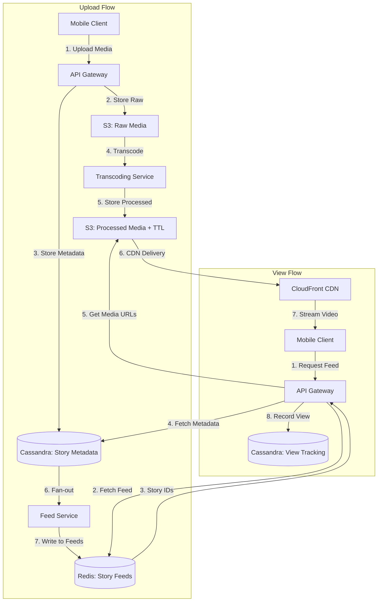
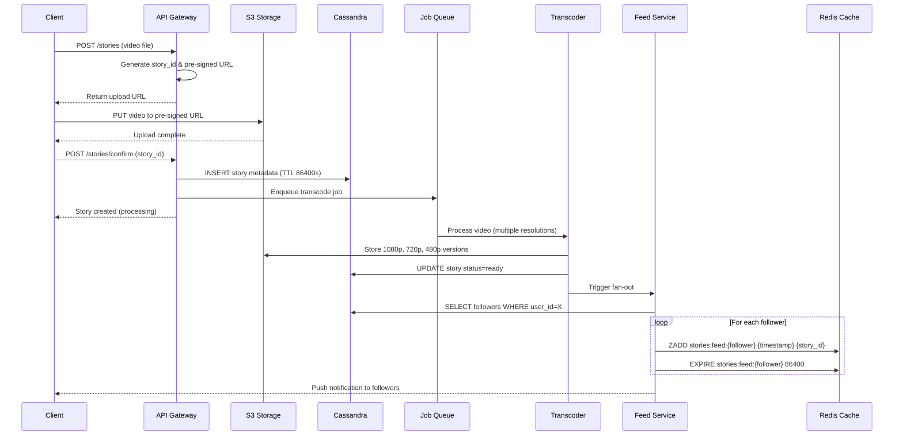
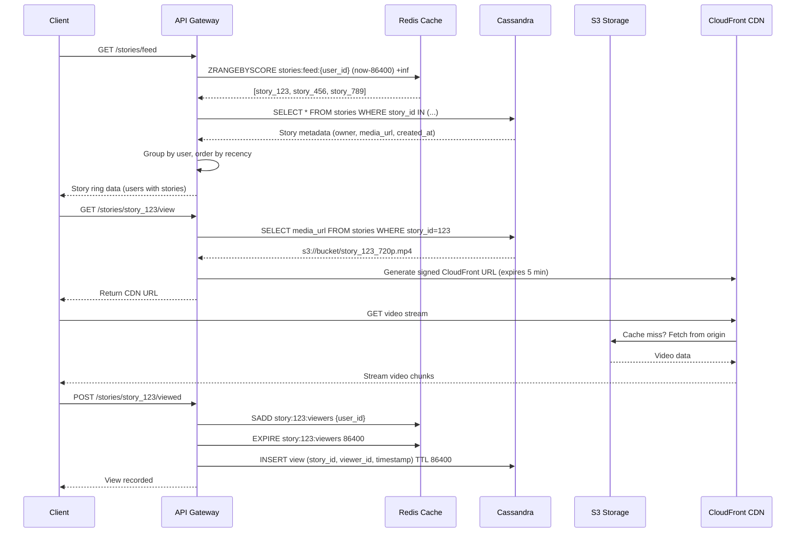
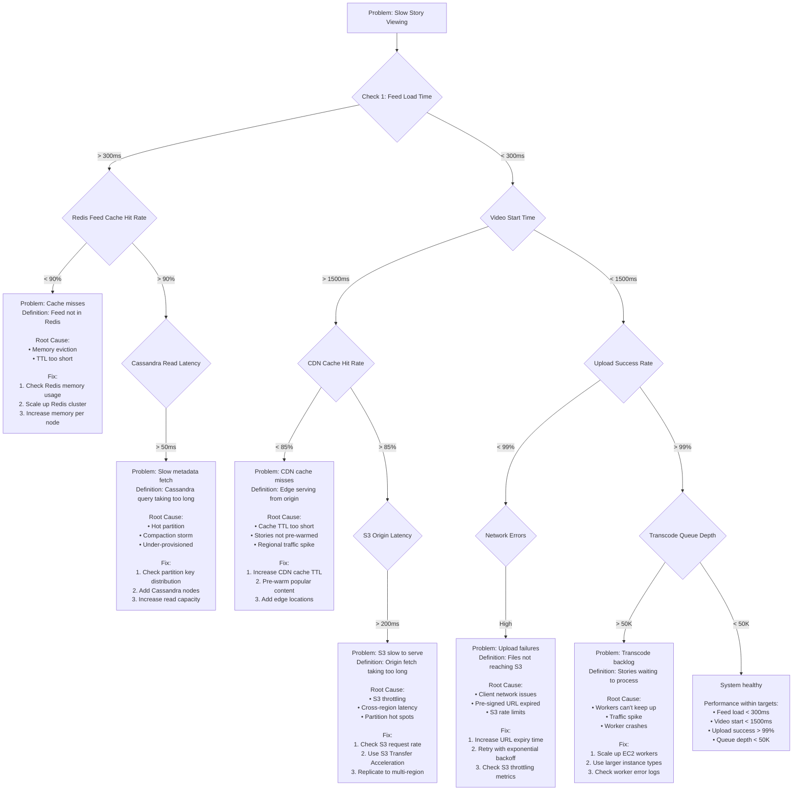

#system-design #case-study #intermediate

# Design Instagram Stories / WhatsApp Status

## Intuition (30 sec)

Think of Instagram Stories like a **digital bulletin board where notes automatically erase themselves after 24 hours**. Unlike permanent posts (filing cabinet), stories are temporary broadcasts (whiteboard). The system must handle massive upload spikes (morning commute, lunch breaks) and auto-delete without manual cleanup.

---

## The Question
> "Design an ephemeral content system like Instagram Stories (content that disappears after 24 hours)."

---

## Failure-First Scenario

**Problem:** Company builds stories feature using their existing posts architecture (permanent storage, manual deletion via cron jobs).

**What breaks:**
- Cron job runs once/hour → stories stay visible 1 hour past 24h deadline → angry users
- Cron deletes 500M stories/day → 5,787 DELETE queries/second → database melts down
- Feed query scans all stories and filters by age → 2 second load time → users leave

**The fix:** Use TTL (Time To Live) at every layer so content expires automatically without queries.

---

## Requirements

**Functional:**
- Upload photo/video stories (max 15 sec video, max 10 photos per burst)
- View friends' stories in chronological order
- Stories expire after 24 hours automatically
- Track who viewed each story (seen-by list)
- React to stories (emoji responses)
- Share stories to select friends or publicly

**Non-Functional:**
- Handle 500M daily active users uploading 800M stories/day
- Upload latency: < 2 seconds for processing
- View latency: < 200ms to start playback
- Global availability: 99.9% uptime
- Storage cost optimization (auto-delete after 24h)

**Scale Estimation:**
- 500M daily active users
- 60% upload at least 1 story/day = 300M uploaders
- Average 2.5 stories per uploader = 750M stories/day
- Peak hour: 5x average = 43,000 uploads/second
- Average story size: 2 MB → 1.5 PB/day → all deleted within 24h

---

## Core Concepts - Definitions

**Key Terms:**

- **Ephemeral Content:** Content that automatically expires and is permanently deleted after a predetermined time period (24 hours for Stories). Unlike archivable content, ephemeral content is designed to be temporary and cannot be recovered after expiration.

- **TTL (Time To Live):** A built-in database/cache feature where each record has an expiration timestamp and is automatically deleted when that time arrives. Eliminates the need for manual cleanup jobs or DELETE queries.

- **Fan-out on Write:** When a user uploads content, the system immediately writes it to all followers' feeds at upload time. Trade-off: slow writes, fast reads. Used for Stories because updates are infrequent but views are extremely frequent.

- **Story Ring:** The UI pattern showing circular profile pictures with stories, ordered by recency. Users with unwatched stories appear first with a colored ring indicator.

- **View Attribution:** Tracking which specific users viewed which stories, stored as a set. Critical for "seen by" feature that shows story creators exactly who watched their content.

---

## Working Knowledge (5 min)

### High-Level Architecture



**Architecture Components:**
- **API Gateway:** Entry point for all requests, handles authentication, rate limiting, routing
- **S3 with Lifecycle Policies:** Object storage that auto-deletes files after 24 hours using bucket policies
- **Cassandra with TTL:** Wide-column database where records self-destruct at specified time
- **Redis Sorted Sets:** Cache storing story IDs ordered by timestamp, auto-expires with EXPIRE command
- **CDN (CloudFront):** Globally distributed cache for fast media delivery, reduces origin load by 95%

---

## Layer 1: Conceptual Precision (15 min)

### Upload Flow - Step by Step



**Step Definitions:**

1. **Pre-signed URL Generation:** API creates a temporary, authenticated URL that allows client to upload directly to S3 without going through backend servers. Reduces server load and latency.

2. **Metadata Storage (TTL):** Store story information (user_id, timestamp, media_url) in Cassandra with TTL=86400 seconds. Database automatically deletes row after 24 hours.

3. **Transcoding:** Converting uploaded video into multiple resolutions (1080p, 720p, 480p) and formats (H.264, H.265). Enables adaptive streaming based on user's connection speed.

4. **Fan-out Write:** For each of user's followers, write story_id to their personal feed in Redis. Uses sorted set with timestamp as score for chronological ordering.

5. **Push Notification:** Send silent push to followers' devices indicating new story available. App shows colored ring around profile picture.

---

### View Flow - Step by Step



**Step Definitions:**

1. **Feed Fetch:** Query Redis sorted set for all story IDs posted in last 24 hours. Redis auto-filters expired stories via ZRANGEBYSCORE time range.

2. **Metadata Batch Fetch:** Single query to Cassandra to get details for all story IDs. Avoids N+1 query problem.

3. **Grouping & Ranking:** Group stories by user, show most recent story per user first. Users with unwatched stories ranked higher.

4. **CDN URL Signing:** Generate temporary authenticated URL to CloudFront. Prevents unauthorized access while avoiding backend routing.

5. **View Attribution:** Add viewer_id to Redis set for instant "seen by" list. Also write to Cassandra for durability and analytics.

---

### TTL Implementation Deep Dive

**Cassandra TTL:**
- **Definition:** Per-row expiration where database automatically removes data when TTL expires. No tombstones left behind after compaction.
- **Purpose:** Zero-overhead deletion - no DELETE queries, no cron jobs, no application logic needed.
- **How it works:** Each cell stores expiration timestamp. During compaction, expired cells are discarded. Reads automatically skip expired cells.

**Redis TTL:**
- **Definition:** Per-key expiration where Redis automatically removes key when TTL expires. Runs passive and active expiration.
- **Purpose:** Keep feed caches fresh without manual invalidation.
- **How it works:** Passive (expires on access), Active (random sampling checks 20 keys/sec, deletes expired ones).

**S3 Lifecycle Policy:**
- **Definition:** Bucket rule that automatically transitions or deletes objects based on age.
- **Purpose:** Reduce storage costs by auto-deleting ephemeral content.
- **How it works:** S3 runs daily scan, marks objects older than policy age, deletes during nightly cleanup job.

**Why TTL at every layer:**
- **Storage (S3):** Prevents 1.5 PB/day accumulation → saves $23K/day in storage costs
- **Metadata (Cassandra):** Prevents 750M rows/day accumulation → keeps query performance constant
- **Cache (Redis):** Prevents memory bloat → maintains sub-millisecond feed lookups

---

### Fan-out Strategy

**Fan-out on Write:**
- **Definition:** When user uploads story, immediately write story_id to all followers' feeds. Read path is fast (single Redis query), write path is slow (N writes for N followers).
- **Use for Stories:** Average user has 150 followers → 150 Redis writes per story upload. Acceptable because uploads are infrequent (2-3/day per user).

```
Upload Story → For each of 150 followers:
  ZADD stories:feed:{follower_id} {timestamp} {story_id}
```

**Fan-out on Read (Alternative - Not Used):**
- **Definition:** When user views feed, query all followed users and fetch their recent stories. Read path is slow (N queries), write path is fast (1 write).
- **Why NOT used:** User follows 300 people → would need 300 Cassandra queries on every feed load → 2+ second latency → unacceptable UX.

**Hybrid Approach for Celebrities:**
```
IF follower_count > 1M:
  SKIP fan-out on write (too expensive)
  User stories fetched on-demand during feed read
ELSE:
  Standard fan-out on write
```

- **Definition:** Celebrities with millions of followers don't fan-out (would be 1M+ Redis writes). Their stories are pulled on-demand when followers open feed.
- **Trade-off:** Celebrity stories have 50ms extra latency but save massive write costs.

---

### Storage Architecture

**S3 Bucket Structure:**
```
stories-raw/
  {user_id}/
    {story_id}_original.mp4          # Raw upload

stories-processed/
  {user_id}/
    {story_id}_1080p.mp4             # Full HD
    {story_id}_720p.mp4              # HD
    {story_id}_480p.mp4              # Mobile
    {story_id}_thumbnail.jpg         # Preview image
```

**S3 Lifecycle Policy Configuration:**
```json
{
  "Rules": [
    {
      "Id": "DeleteStoriesAfter24h",
      "Status": "Enabled",
      "Filter": {
        "Prefix": "stories-processed/"
      },
      "Expiration": {
        "Days": 1
      }
    },
    {
      "Id": "DeleteRawAfter2h",
      "Status": "Enabled",
      "Filter": {
        "Prefix": "stories-raw/"
      },
      "Expiration": {
        "Hours": 2
      }
    }
  ]
}
```

**Policy Definitions:**
- **Expiration.Days=1:** S3 deletes object after 24 hours from creation timestamp. Runs once per day at midnight UTC.
- **Expiration.Hours=2:** Raw uploads deleted after processing completes (2 hour buffer). Saves storage costs.
- **Prefix Filter:** Only applies rule to specific folder paths. Prevents accidental deletion of permanent content.

**Why separate buckets:**
- **stories-raw:** Short TTL (2 hours), no CDN distribution, cheaper storage class (S3 Standard)
- **stories-processed:** 24 hour TTL, CDN distribution enabled, optimized for frequent access (S3 Standard)

---

### Database Schema

**Cassandra Story Metadata Table:**
```cql
CREATE TABLE stories (
    user_id UUID,
    story_id UUID,
    created_at TIMESTAMP,
    media_type TEXT,          -- 'image' or 'video'
    media_url TEXT,           -- S3 path to processed media
    thumbnail_url TEXT,
    duration_ms INT,          -- Video length in milliseconds
    status TEXT,              -- 'processing', 'ready', 'failed'
    view_count COUNTER,
    PRIMARY KEY (user_id, created_at, story_id)
) WITH CLUSTERING ORDER BY (created_at DESC)
  AND default_time_to_live = 86400
  AND gc_grace_seconds = 3600;
```

**Schema Design Decisions:**

- **Partition Key (user_id):** All stories by same user stored together. Enables fast query: "fetch all stories by user X".
- **Clustering Key (created_at, story_id):** Orders stories newest-first within partition. Timestamp comes first for time-range queries.
- **default_time_to_live = 86400:** All rows auto-expire after 24 hours unless overridden at INSERT time.
- **gc_grace_seconds = 3600:** After row expires, tombstone removed after 1 hour instead of default 10 days. Reduces storage for high-churn data.
- **COUNTER type:** Atomic increment for view_count. Prevents race conditions when multiple users view simultaneously.

**Example Queries:**
```cql
-- Fetch all stories by user (for profile view)
SELECT * FROM stories
WHERE user_id = '123e4567-e89b-12d3-a456-426614174000'
  AND created_at > now() - 24h
LIMIT 100;

-- Get single story details
SELECT * FROM stories
WHERE user_id = '123e4567-e89b-12d3-a456-426614174000'
  AND story_id = '789e4567-e89b-12d3-a456-426614174999';
```

**Cassandra View Tracking Table:**
```cql
CREATE TABLE story_views (
    story_id UUID,
    viewer_id UUID,
    viewed_at TIMESTAMP,
    PRIMARY KEY (story_id, viewer_id)
) WITH default_time_to_live = 86400;

-- Alternative design for "who viewed my stories" query
CREATE TABLE user_story_viewers (
    story_owner_id UUID,
    story_id UUID,
    viewer_id UUID,
    viewed_at TIMESTAMP,
    PRIMARY KEY ((story_owner_id), story_id, viewer_id)
) WITH CLUSTERING ORDER BY (story_id DESC, viewer_id ASC)
  AND default_time_to_live = 86400;
```

**Query Patterns:**
```cql
-- Get all viewers of a story (seen-by list)
SELECT viewer_id, viewed_at FROM story_views
WHERE story_id = '789e4567-e89b-12d3-a456-426614174999';

-- Get all views across user's stories (analytics)
SELECT story_id, viewer_id, viewed_at
FROM user_story_viewers
WHERE story_owner_id = '123e4567-e89b-12d3-a456-426614174000';
```

**Redis Story Feed Structure:**
```
Key: stories:feed:{user_id}
Type: Sorted Set (ZSET)
Score: Unix timestamp (seconds)
Value: {owner_user_id}:{story_id}
TTL: 86400 seconds

Example:
ZADD stories:feed:user_456 1707993600 "user_123:story_789"
ZADD stories:feed:user_456 1707997200 "user_999:story_101"
EXPIRE stories:feed:user_456 86400
```

**Redis View Tracking:**
```
Key: story:{story_id}:viewers
Type: Set
Members: viewer_user_ids
TTL: 86400 seconds

Example:
SADD story:789:viewers "user_456"
SADD story:789:viewers "user_222"
EXPIRE story:789:viewers 86400

-- Get viewer count
SCARD story:789:viewers  → 2

-- Get viewer list
SMEMBERS story:789:viewers → ["user_456", "user_222"]

-- Check if user viewed
SISMEMBER story:789:viewers "user_456" → 1 (true)
```

---

### Why This is Different from Regular Posts

| Aspect | Posts | Stories |
|--------|-------|---------|
| **Lifespan** | Permanent | 24 hours (ephemeral) |
| **Storage Strategy** | Hot → Warm → Cold tiering | Hot only, TTL auto-delete |
| **Feed Algorithm** | Algorithmic ranking (ML-based) | Chronological, recency-first |
| **Feed Caching** | Cache top 100 posts, refresh hourly | Cache all story IDs, refresh on upload |
| **Engagement** | Likes, comments, shares (public) | Views, reactions (private to creator) |
| **View Tracking** | Aggregated count only | Individual viewer attribution |
| **Deletion** | Manual by user, soft-delete | Automatic, hard-delete |
| **Edit** | Allowed (with edit history) | Not allowed (immutable) |
| **Fan-out** | Hybrid (celebrities use fan-out-read) | Fan-out-write for all except mega-influencers |
| **CDN Strategy** | Long cache TTL (7 days) | Short cache TTL (1 day) |

---

## Layer 2: Technology-Specific Implementation (20 min)

### Upload API Implementation

```python
# API Endpoint: POST /api/v1/stories/upload

@app.route('/stories/upload', methods=['POST'])
@authenticate
def upload_story():
    """
    Step 1: Generate pre-signed S3 URL for direct client upload
    Definition: Pre-signed URL = temporary authenticated URL allowing
    client to upload directly to S3 without backend bottleneck
    """
    user_id = get_authenticated_user_id()
    story_id = generate_uuid()

    # Generate S3 key with partitioning for performance
    # Format: stories-raw/{user_id_prefix}/{user_id}/{story_id}_original
    # user_id_prefix = first 2 chars of user_id for S3 key distribution
    s3_key = f"stories-raw/{user_id[:2]}/{user_id}/{story_id}_original.mp4"

    # Pre-signed URL expires in 10 minutes
    presigned_url = s3_client.generate_presigned_url(
        'put_object',
        Params={
            'Bucket': 'instagram-stories-raw',
            'Key': s3_key,
            'ContentType': 'video/mp4'
        },
        ExpiresIn=600  # 10 minutes
    )

    return {
        'story_id': story_id,
        'upload_url': presigned_url,
        'confirm_url': f'/api/v1/stories/{story_id}/confirm'
    }


@app.route('/stories/<story_id>/confirm', methods=['POST'])
@authenticate
def confirm_story_upload(story_id):
    """
    Step 2: Client confirms upload completion, trigger processing
    Definition: Two-phase upload ensures we only process successfully
    uploaded files, preventing wasted transcoding on failed uploads
    """
    user_id = get_authenticated_user_id()

    # Verify file exists in S3
    s3_key = f"stories-raw/{user_id[:2]}/{user_id}/{story_id}_original.mp4"
    if not s3_file_exists(s3_key):
        return {'error': 'Upload not found'}, 404

    # Store metadata in Cassandra with TTL
    cassandra_session.execute("""
        INSERT INTO stories (user_id, story_id, created_at, status, media_url)
        VALUES (?, ?, ?, 'processing', ?)
        USING TTL 86400
    """, (user_id, story_id, datetime.now(), s3_key))

    # Enqueue transcoding job
    sqs_client.send_message(
        QueueUrl='transcode-queue',
        MessageBody=json.dumps({
            'story_id': story_id,
            'user_id': user_id,
            's3_key': s3_key
        })
    )

    return {
        'story_id': story_id,
        'status': 'processing'
    }
```

**Key Implementation Details:**

- **S3 Key Partitioning:** Use `{user_id[:2]}/` prefix to distribute objects across S3 partitions. Prevents hot partition issues when users have same ID prefix.

- **Two-phase Upload:** Client gets URL → uploads → confirms. Prevents processing files that failed mid-upload.

- **SQS for Transcoding:** Decouples upload from transcoding. If transcode queue backs up, uploads still succeed instantly.

---

### Transcoding Service

```python
# Transcoding Worker: Processes SQS queue

def transcode_story(story_id, user_id, s3_key):
    """
    Convert uploaded video to multiple resolutions for adaptive streaming
    Definition: Transcoding = converting video to different formats/resolutions
    while maintaining quality and reducing file size
    """

    # Download original from S3
    local_path = f"/tmp/{story_id}_original.mp4"
    s3_client.download_file('instagram-stories-raw', s3_key, local_path)

    # Transcode to multiple resolutions using FFmpeg
    resolutions = [
        ('1080p', '1920x1080', '5000k'),  # Full HD, 5 Mbps
        ('720p', '1280x720', '2500k'),     # HD, 2.5 Mbps
        ('480p', '854x480', '1000k')       # Mobile, 1 Mbps
    ]

    output_urls = []

    for name, resolution, bitrate in resolutions:
        output_key = f"stories-processed/{user_id[:2]}/{user_id}/{story_id}_{name}.mp4"
        output_path = f"/tmp/{story_id}_{name}.mp4"

        # FFmpeg command for transcoding
        # -c:v libx264 = H.264 codec (widely supported)
        # -preset fast = faster encoding, slightly larger file
        # -crf 23 = Constant Rate Factor, quality level (18-28 range)
        subprocess.run([
            'ffmpeg', '-i', local_path,
            '-vf', f'scale={resolution}',
            '-c:v', 'libx264',
            '-b:v', bitrate,
            '-preset', 'fast',
            '-crf', '23',
            '-c:a', 'aac',
            '-b:a', '128k',
            output_path
        ])

        # Upload to processed bucket
        s3_client.upload_file(
            output_path,
            'instagram-stories-processed',
            output_key,
            ExtraArgs={'ContentType': 'video/mp4'}
        )

        output_urls.append({
            'resolution': name,
            'url': f's3://instagram-stories-processed/{output_key}'
        })

        os.remove(output_path)

    # Generate thumbnail from first frame
    thumbnail_path = f"/tmp/{story_id}_thumbnail.jpg"
    subprocess.run([
        'ffmpeg', '-i', local_path,
        '-ss', '00:00:01',  # 1 second in
        '-vframes', '1',     # 1 frame
        '-vf', 'scale=720:1280',
        thumbnail_path
    ])

    thumbnail_key = f"stories-processed/{user_id[:2]}/{user_id}/{story_id}_thumbnail.jpg"
    s3_client.upload_file(thumbnail_path, 'instagram-stories-processed', thumbnail_key)

    # Update Cassandra with processed URLs
    cassandra_session.execute("""
        UPDATE stories
        SET status = 'ready',
            media_url = ?,
            thumbnail_url = ?
        WHERE user_id = ? AND story_id = ?
    """, (output_urls[1]['url'], f's3://.../{thumbnail_key}', user_id, story_id))

    # Trigger feed fan-out
    trigger_feed_fanout(user_id, story_id)

    # Cleanup
    os.remove(local_path)
    os.remove(thumbnail_path)
```

**Transcoding Choices:**
- **3 resolutions:** Covers mobile (480p), wifi (720p), high-end devices (1080p)
- **H.264 codec:** 95% device compatibility vs H.265 (newer, better compression, 60% compatibility)
- **CRF 23:** Balance between quality and file size. Lower = better quality but larger files.

---

### Feed Fan-out Service

```python
def trigger_feed_fanout(story_owner_id, story_id):
    """
    Write story to all followers' feeds in Redis
    Definition: Fan-out-on-write = push content to all followers at write time
    so reads are fast (single query vs N queries)
    """

    # Fetch followers from Cassandra
    # Table: followers (follower_id, following_id)
    # Query: Get all users following story_owner_id
    followers = cassandra_session.execute("""
        SELECT follower_id FROM followers
        WHERE following_id = ?
    """, (story_owner_id,))

    follower_count = len(followers)

    # Optimization: If mega-influencer (>1M followers), skip fan-out
    # Their stories will be fetched on-demand during feed reads
    if follower_count > 1_000_000:
        redis_client.set(
            f'celebrity_story:{story_owner_id}:{story_id}',
            'active',
            ex=86400  # TTL 24 hours
        )
        return

    # Standard fan-out: Write to each follower's feed
    pipeline = redis_client.pipeline()
    timestamp = int(time.time())

    for follower in followers:
        follower_id = follower.follower_id

        # ZADD: Add story to sorted set with timestamp as score
        # Format: {owner_id}:{story_id} allows grouping by owner
        pipeline.zadd(
            f'stories:feed:{follower_id}',
            {f'{story_owner_id}:{story_id}': timestamp}
        )

        # Reset TTL to 24 hours (refreshes on each new story)
        pipeline.expire(f'stories:feed:{follower_id}', 86400)

    # Execute all Redis commands in single network round-trip
    pipeline.execute()

    # Send push notifications to followers (async)
    send_push_notifications(follower_ids, story_owner_id)
```

**Fan-out Performance:**
- Average user: 150 followers → 150 Redis writes → ~50ms
- Popular user: 10K followers → 10K Redis writes → ~5 seconds
- Celebrity: 1M+ followers → Skip fan-out → flag for on-demand fetch

---

### View Feed API

```python
@app.route('/stories/feed', methods=['GET'])
@authenticate
def get_stories_feed():
    """
    Fetch all stories from followed users posted in last 24 hours
    Definition: Story feed = chronological list of stories from followed users,
    grouped by user, most recent user first
    """
    user_id = get_authenticated_user_id()

    # Fetch story IDs from Redis sorted set
    # ZRANGEBYSCORE: Get all stories with timestamp > (now - 24h)
    now = int(time.time())
    twenty_four_hours_ago = now - 86400

    story_keys = redis_client.zrangebyscore(
        f'stories:feed:{user_id}',
        twenty_four_hours_ago,
        '+inf'
    )

    # Parse story keys: format is "{owner_id}:{story_id}"
    story_ids = [key.split(':')[1] for key in story_keys]

    if not story_ids:
        return {'stories': []}

    # Batch fetch metadata from Cassandra (avoids N+1 queries)
    # Use IN query with limit to prevent timeout on large result sets
    stories = cassandra_session.execute("""
        SELECT user_id, story_id, created_at, media_url, thumbnail_url, view_count
        FROM stories
        WHERE story_id IN ?
    """, (story_ids,))

    # Group stories by user
    # {user_id: [story1, story2, ...]}
    grouped = {}
    for story in stories:
        if story.user_id not in grouped:
            grouped[story.user_id] = []
        grouped[story.user_id].append(story)

    # Order users by most recent story
    # Users with unwatched stories appear first (checked via Redis)
    feed = []
    for user_id, user_stories in grouped.items():
        # Check if user has any unwatched stories
        unwatched_count = redis_client.scard(f'unwatched:{user_id}:{story_owner_id}')

        feed.append({
            'user_id': user_id,
            'user_name': get_user_name(user_id),  # From cache
            'profile_pic': get_profile_pic(user_id),  # From cache
            'stories': sorted(user_stories, key=lambda s: s.created_at, reverse=True),
            'has_unwatched': unwatched_count > 0,
            'most_recent_timestamp': max(s.created_at for s in user_stories)
        })

    # Sort by: unwatched first, then by most recent story
    feed.sort(key=lambda x: (not x['has_unwatched'], -x['most_recent_timestamp']))

    return {'stories': feed}


@app.route('/stories/<story_id>/view', methods=['GET'])
@authenticate
def view_story(story_id):
    """
    Get CDN URL for story video and record view
    Definition: View = user watched story for >3 seconds (prevents
    accidental taps from counting as views)
    """
    user_id = get_authenticated_user_id()

    # Fetch story metadata
    story = cassandra_session.execute("""
        SELECT user_id, media_url FROM stories
        WHERE story_id = ?
    """, (story_id,)).one()

    if not story:
        return {'error': 'Story not found or expired'}, 404

    # Generate signed CloudFront URL (expires in 5 minutes)
    # Prevents URL sharing/leeching
    cdn_url = cloudfront_signer.generate_presigned_url(
        story.media_url,
        date_less_than=datetime.now() + timedelta(minutes=5)
    )

    return {
        'story_id': story_id,
        'video_url': cdn_url,
        'thumbnail_url': story.thumbnail_url
    }


@app.route('/stories/<story_id>/viewed', methods=['POST'])
@authenticate
def record_view(story_id):
    """
    Record that user viewed story (called after 3 seconds of watch time)
    Definition: View attribution = tracking which specific users viewed
    a story for "seen by" feature
    """
    user_id = get_authenticated_user_id()

    # Check if already viewed (idempotency)
    already_viewed = redis_client.sismember(
        f'story:{story_id}:viewers',
        user_id
    )

    if already_viewed:
        return {'status': 'already_viewed'}

    # Add to Redis set (fast lookup for "seen by" list)
    redis_client.sadd(f'story:{story_id}:viewers', user_id)
    redis_client.expire(f'story:{story_id}:viewers', 86400)

    # Write to Cassandra (persistent storage, analytics)
    cassandra_session.execute("""
        INSERT INTO story_views (story_id, viewer_id, viewed_at)
        VALUES (?, ?, ?)
        USING TTL 86400
    """, (story_id, user_id, datetime.now()))

    # Increment view counter (atomic)
    cassandra_session.execute("""
        UPDATE stories
        SET view_count = view_count + 1
        WHERE story_id = ?
    """, (story_id,))

    return {'status': 'view_recorded'}
```

---

## Layer 3: Production-Ready Details (30 min)

### Full System Architecture

```
                         ┌──────────────────────────────────┐
                         │      Mobile Client (iOS/Android) │
                         │                                  │
                         │  • Story upload                  │
                         │  • Story viewing                 │
                         │  • Push notifications            │
                         └───────────┬──────────────────────┘
                                     │
                                     │ HTTPS
                                     ▼
                    ┌────────────────────────────────┐
                    │        API Gateway             │
                    │  (AWS API Gateway / Kong)      │
                    │                                │
                    │  • Authentication (JWT)        │
                    │  • Rate limiting               │
                    │  • Request routing             │
                    │  • SSL termination             │
                    └────────┬───────────────────────┘
                             │
              ┏━━━━━━━━━━━━━━┻━━━━━━━━━━━━━━┓
              ▼                              ▼
   ┌──────────────────┐          ┌──────────────────┐
   │  Story Service   │          │  View Service    │
   │  (Upload/Read)   │          │  (Track views)   │
   │                  │          │                  │
   │  • Generate URLs │          │  • Record views  │
   │  • Store metadata│          │  • Get viewers   │
   │  • Trigger jobs  │          │  • Analytics     │
   └─────┬────────┬───┘          └────┬─────────┬───┘
         │        │                   │         │
         │        │                   │         │
         ▼        ▼                   ▼         ▼
    ┌─────┐  ┌──────────┐      ┌─────────┐ ┌──────────────┐
    │ S3  │  │Cassandra │      │ Redis   │ │  Cassandra   │
    │     │  │          │      │         │ │              │
    │Raw/ │  │Story     │      │Viewer   │ │Story Views   │
    │Proc │  │Metadata  │      │Sets     │ │Table         │
    └──┬──┘  └──────────┘      └─────────┘ └──────────────┘
       │
       │ Object created event
       ▼
   ┌────────────────────┐
   │  SQS Queue         │
   │  (Transcode jobs)  │
   └─────────┬──────────┘
             │
             ▼
   ┌────────────────────────┐
   │ Transcoding Workers    │
   │ (EC2 Auto-scaling)     │
   │                        │
   │  • Download from S3    │
   │  • FFmpeg transcode    │
   │  • Upload 3 versions   │
   │  • Generate thumbnail  │
   │  • Update metadata     │
   │  • Trigger fan-out     │
   └──────────┬─────────────┘
              │
              ▼
   ┌────────────────────────┐
   │  Feed Fan-out Service  │
   │                        │
   │  • Fetch followers     │
   │  • Write to Redis feeds│
   │  • Send push notifs    │
   └──────────┬─────────────┘
              │
              ▼
        ┌──────────┐
        │  Redis   │
        │          │
        │Story     │
        │Feeds     │
        └──────────┘

   ┌────────────────────────┐
   │   CloudFront CDN       │
   │   (Global edge cache)  │
   │                        │
   │  • 200+ edge locations │
   │  • Cache processed     │
   │    videos              │
   │  • Signed URLs         │
   └────────────────────────┘
```

**Architecture Definitions:**

- **API Gateway (Kong/AWS API Gateway):** Entry point handling authentication, rate limiting (1000 req/min per user), SSL termination. Routes requests to appropriate backend services.

- **Story Service:** Handles upload/read operations. Generates pre-signed S3 URLs, stores metadata in Cassandra, enqueues transcode jobs.

- **View Service:** Tracks story views. Records viewer_id in Redis sets and Cassandra, provides "seen by" list to story creators.

- **Transcoding Workers (EC2 Auto-scaling):** Fleet of EC2 instances (c5.2xlarge with GPU) that process SQS queue. Scales from 10 (baseline) to 500 instances (peak hours).

- **Feed Fan-out Service:** Writes story_id to all followers' Redis feeds. Uses pipeline for batch writes. Skips mega-influencers (>1M followers).

- **CloudFront CDN:** Caches processed videos at 200+ edge locations globally. 95% cache hit rate, reduces S3 bandwidth by 95%.

---

### Capacity Planning (500M DAU)

**Traffic Estimation:**

```
Daily Active Users (DAU): 500M
Upload rate: 60% upload at least 1 story/day
Average stories per uploader: 2.5

Daily Uploads:
  500M × 60% × 2.5 = 750M stories/day

Peak Hour Traffic (5x average):
  750M ÷ 24 hours = 31.25M stories/hour (average)
  31.25M × 5 = 156M stories/hour (peak)
  156M ÷ 3600 = 43,400 uploads/second (peak)

View Traffic:
  Average user views 50 stories/day
  500M × 50 = 25B story views/day
  Peak: 25B ÷ 24 × 5 = 5.2B views/hour = 1.44M views/second
```

**Storage Calculation:**

```
Per-story storage:
  Original: 5 MB (raw upload)
  1080p: 3 MB
  720p: 1.5 MB
  480p: 600 KB
  Thumbnail: 100 KB
  Total per story: 10.2 MB

Daily storage (before TTL):
  750M stories × 10.2 MB = 7.65 PB/day

Storage with 24h TTL:
  Only 1 day worth of data exists at any time
  Peak storage: 7.65 PB (constant, not growing)

Monthly storage cost (S3 Standard):
  7.65 PB × $23/TB = $175,950/month

With TTL auto-deletion savings vs permanent storage:
  Without TTL: 7.65 PB/day × 30 days = 229.5 PB/month = $5.3M/month
  Savings: $5.1M/month (97% cost reduction)
```

**Database Capacity:**

```
Cassandra - Story Metadata:
  Row size: 1 KB (metadata only, not media)
  Daily writes: 750M rows
  With TTL, steady-state: 750M rows (constant)
  Storage: 750M × 1 KB = 750 GB

  Nodes: 10 nodes × 100 GB per node = 1 TB capacity
  Replication factor: 3 (data stored on 3 nodes)
  Total cluster: 30 nodes

Cassandra - View Tracking:
  Views per story: average 50 viewers
  Daily view records: 750M stories × 50 = 37.5B rows
  Row size: 200 bytes
  Storage: 37.5B × 200 bytes = 7.5 TB (steady-state with TTL)

  Nodes: 100 nodes × 100 GB = 10 TB capacity
  Replication: 3
  Total: 300 nodes

Redis - Story Feeds:
  Active users with feeds: 500M users
  Average feed size: 50 story IDs × 50 bytes = 2.5 KB per user
  Total: 500M × 2.5 KB = 1.25 TB

  Nodes: 20 Redis nodes × 64 GB = 1.28 TB
  Replication: Yes (Redis Sentinel/Cluster)

Redis - View Sets:
  Active stories: 750M
  Average viewers per story: 50 viewer IDs × 16 bytes = 800 bytes
  Total: 750M × 800 bytes = 600 GB

  Nodes: 10 Redis nodes × 64 GB = 640 GB
```

**Compute Capacity:**

```
Transcoding Workers:
  43,400 uploads/second (peak)
  Transcode time: 30 seconds per story (3 resolutions)
  Concurrent jobs: 43,400 × 30 = 1,302,000 concurrent transcodes

  EC2 instance: c5.2xlarge (8 vCPU, GPU-accelerated FFmpeg)
  Transcodes per instance: 4 concurrent (2 vCPU per transcode)
  Instances needed: 1,302,000 ÷ 4 = 325,500 instances (peak)

  Cost optimization: Use Spot Instances (70% cheaper)
  Peak cost: 325,500 × $0.34/hour × 2 hours/day = $221,340/day
  Monthly: $6.6M (Spot), $22M (On-Demand)

API Servers:
  1.44M views/second (peak)
  Requests per server: 1,000 QPS
  Servers needed: 1,440 servers

  Instance type: c5.xlarge (4 vCPU, 8 GB RAM)
  Cost: 1,440 × $0.17/hour × 24 hours × 30 days = $176,256/month
```

**Network Bandwidth:**

```
Upload bandwidth:
  43,400 uploads/second × 5 MB = 217 GB/second = 1.74 Tbps

Download bandwidth (CDN offloads 95%):
  1.44M views/second × 1.5 MB (avg resolution) = 2.16 TB/second = 17.3 Tbps
  S3 origin: 5% = 108 GB/second = 0.86 Tbps
  CDN edge: 95% = 2.05 TB/second = 16.4 Tbps

CDN cost:
  25B views/day × 1.5 MB = 37.5 PB/day transferred
  CloudFront: $0.085/GB (first 10 PB), $0.070/GB (next 40 PB)
  10 PB × $0.085 + 27.5 PB × $0.070 = $850K + $1.925M = $2.775M/day
  Monthly: $83M (largest cost component)
```

---

### Monitoring & Observability

**Key Metrics Dashboard:**

```
┌─────────────────────────────────────────────────────────┐
│  STORY UPLOAD METRICS                                   │
├─────────────────────────────────────────────────────────┤
│                                                         │
│ Upload Rate: 43,400/sec                                │
│ Definition: Stories uploaded per second                │
│ Alert: > 50,000/sec (capacity limit approaching)       │
│                                                         │
│ Upload Success Rate: 99.7%                             │
│ Definition: % uploads that reach S3 successfully       │
│ Alert: < 99.5% (network or S3 issues)                  │
│                                                         │
│ Pre-signed URL Generation P99: 45ms                    │
│ Definition: Time to generate S3 upload URL             │
│ Alert: > 100ms (API bottleneck)                        │
│                                                         │
│ Transcode Queue Depth: 12,500 jobs                    │
│ Definition: Number of stories waiting for transcode    │
│ Alert: > 50,000 (workers can't keep up, scale up)     │
│                                                         │
│ Transcode Duration P99: 42 seconds                    │
│ Definition: Time to process story (3 resolutions)      │
│ Alert: > 60 seconds (slow workers, check CPU)         │
│                                                         │
│ Transcode Success Rate: 99.2%                          │
│ Definition: % stories that transcode without errors    │
│ Alert: < 98% (FFmpeg crashes, corrupted uploads)      │
│                                                         │
└─────────────────────────────────────────────────────────┘

┌─────────────────────────────────────────────────────────┐
│  STORY VIEW METRICS                                     │
├─────────────────────────────────────────────────────────┤
│                                                         │
│ View Rate: 1.44M/sec                                   │
│ Definition: Story views per second                     │
│ Alert: > 2M/sec (capacity planning needed)             │
│                                                         │
│ Feed Load P99: 180ms                                   │
│ Definition: Time to load story feed                    │
│ Alert: > 300ms (Redis slow, Cassandra slow)           │
│                                                         │
│ Video Start P99: 850ms                                 │
│ Definition: Time from tap to video playback            │
│ Alert: > 1500ms (CDN cache miss rate high)            │
│                                                         │
│ CDN Cache Hit Rate: 95%                                │
│ Definition: % requests served from edge cache          │
│ Alert: < 90% (inefficient caching, check TTL)         │
│                                                         │
│ Redis Feed Cache Hit Rate: 98%                         │
│ Definition: % feed requests served from Redis          │
│ Alert: < 95% (cache eviction, memory pressure)        │
│                                                         │
└─────────────────────────────────────────────────────────┘

┌─────────────────────────────────────────────────────────┐
│  DATABASE METRICS                                       │
├─────────────────────────────────────────────────────────┤
│                                                         │
│ Cassandra Write Latency P99: 12ms                     │
│ Definition: Time to write story metadata               │
│ Alert: > 50ms (node overload, compaction storm)       │
│                                                         │
│ Cassandra Read Latency P99: 8ms                       │
│ Definition: Time to fetch story metadata               │
│ Alert: > 30ms (partition hot spots, add nodes)        │
│                                                         │
│ TTL Expiration Rate: 8,680 rows/sec                   │
│ Definition: Rows auto-deleted by TTL per second        │
│ Expected: 750M rows/day ÷ 86400 = 8,680/sec           │
│ Alert: Rate = 0 (TTL not working, manual cleanup!)    │
│                                                         │
│ Redis Memory Usage: 72%                                │
│ Definition: % of allocated memory in use               │
│ Alert: > 85% (risk of eviction, add nodes)            │
│                                                         │
│ Redis Eviction Rate: 0/sec                            │
│ Definition: Keys evicted due to memory pressure        │
│ Alert: > 0 (not enough memory, scale up)              │
│                                                         │
└─────────────────────────────────────────────────────────┘

┌─────────────────────────────────────────────────────────┐
│  STORAGE METRICS                                        │
├─────────────────────────────────────────────────────────┤
│                                                         │
│ S3 Total Objects: 3.75B                                │
│ Definition: Number of story files in S3                │
│ Expected: 750M stories × 5 files = 3.75B (constant)   │
│ Alert: Growing over time (TTL not deleting)            │
│                                                         │
│ S3 Total Size: 7.65 PB                                 │
│ Definition: Total storage used                         │
│ Expected: 750M × 10.2 MB = 7.65 PB (constant)         │
│ Alert: Growing daily (lifecycle policy broken)         │
│                                                         │
│ S3 Lifecycle Deletion Rate: 43,400/sec                │
│ Definition: Objects deleted by lifecycle policy        │
│ Expected: Same as upload rate (steady-state)           │
│ Alert: Rate = 0 (policy not running, costs explode)   │
│                                                         │
└─────────────────────────────────────────────────────────┘
```

**Alerting Rules (Prometheus/Datadog):**

```yaml
# Upload success rate drops
- alert: HighUploadFailureRate
  expr: (sum(rate(story_upload_failures[5m])) / sum(rate(story_uploads_total[5m]))) > 0.01
  for: 5m
  labels:
    severity: critical
  annotations:
    summary: "Upload failure rate > 1%"
    description: "Only {{ $value }}% of uploads succeeding"

# Transcode queue backing up
- alert: TranscodeQueueBacklog
  expr: transcode_queue_depth > 50000
  for: 10m
  labels:
    severity: warning
  annotations:
    summary: "Transcode queue depth {{ $value }}"
    description: "Scale up transcoding workers immediately"

# Feed latency high
- alert: SlowFeedLoad
  expr: histogram_quantile(0.99, story_feed_load_duration_seconds) > 0.3
  for: 5m
  labels:
    severity: warning
  annotations:
    summary: "P99 feed load time {{ $value }}s"
    description: "Check Redis/Cassandra performance"

# S3 lifecycle not deleting (storage growing)
- alert: StorageNotExpiring
  expr: increase(s3_total_size_bytes[24h]) > 0
  for: 1h
  labels:
    severity: critical
  annotations:
    summary: "S3 storage growing (TTL broken)"
    description: "Check lifecycle policy, manual cleanup needed"

# Redis memory pressure
- alert: RedisMemoryHigh
  expr: redis_memory_used_bytes / redis_memory_max_bytes > 0.85
  for: 10m
  labels:
    severity: warning
  annotations:
    summary: "Redis memory usage {{ $value }}%"
    description: "Scale up Redis cluster or adjust eviction"
```

---

### Troubleshooting Guide



**Common Issues & Solutions:**

| Symptom | Root Cause | Fix |
|---------|-----------|-----|
| Stories not expiring after 24h | S3 Lifecycle policy not applied | Check bucket policy, ensure prefix matches |
| Feed shows expired stories | Redis TTL not set | Verify EXPIRE command in fan-out code |
| "Story not found" errors | Cassandra TTL deleted row but Redis still has reference | Acceptable race condition, client should skip |
| Upload hangs at 100% | Client didn't call /confirm endpoint | Add client-side timeout, retry confirm |
| Transcode failures spike | FFmpeg out of memory | Increase EC2 instance size or reduce parallel transcodes |
| CDN serving stale content | CloudFront caching based on URL without version | Add story version to URL query params |
| View count wrong | Cassandra counter replication lag | Use COUNTER with QUORUM consistency level |

---

### Decision Trees

**When to Use Fan-out on Write vs Fan-out on Read:**

```
Decision: Fan-out Strategy for Story Distribution

START: User uploads story

├─ IF follower_count < 10,000
│  └─ USE: Fan-out on Write
│     └─ REASON: Write to all followers' Redis feeds at upload time
│        └─ BENEFIT: Feed reads are instant (single Redis query)
│        └─ COST: 10K Redis writes acceptable (~500ms)
│
├─ IF follower_count BETWEEN 10,000 AND 1,000,000
│  └─ USE: Fan-out on Write (with optimization)
│     └─ REASON: Still acceptable write cost
│        └─ OPTIMIZATION: Use Redis pipeline for batch writes
│        └─ BENEFIT: Keeps read path fast
│        └─ COST: Up to 5 seconds for 1M writes
│
└─ IF follower_count > 1,000,000 (Celebrity)
   └─ USE: Fan-out on Read
      └─ REASON: Fan-out on write would take minutes
         └─ IMPLEMENTATION:
            │  1. Mark story as "celebrity" in special table
            │  2. When followers load feed, query celebrity table
            │  3. Merge celebrity stories with regular feed
         └─ BENEFIT: Upload completes instantly
         └─ COST: Feed reads slower (extra query), ~50ms penalty
```

**When to Delete vs Archive Stories:**

```
Decision: Story Lifecycle After 24 Hours

START: Story reaches 24 hour mark

├─ IF user_type = "regular_user"
│  └─ ACTION: Hard Delete (TTL expiration)
│     └─ S3: Lifecycle policy deletes files
│     └─ Cassandra: TTL deletes metadata row
│     └─ Redis: TTL deletes feed entries
│     └─ REASON: Privacy commitment, storage savings
│
├─ IF user_type = "business_account"
│  └─ PROMPT: User choice
│     ├─ IF user_chose "Delete"
│     │  └─ ACTION: Hard Delete (same as above)
│     │
│     └─ IF user_chose "Archive" (paid feature)
│        └─ ACTION: Move to Archive Storage
│           ├─ S3: Transition to Glacier ($1/TB vs $23/TB)
│           ├─ Cassandra: Copy to archive table (no TTL)
│           ├─ Redis: Remove from feed (expired)
│           └─ BENEFIT: User can re-share old stories
│              └─ COST: $0.10/1000 stories archived
│
└─ IF story has_policy_violation = true
   └─ ACTION: Keep for 30 days in quarantine
      └─ REASON: Legal/safety review period
      └─ Storage: Glacier Deep Archive
      └─ Access: Restricted to trust & safety team
```

**When to Transcode Synchronously vs Asynchronously:**

```
Decision: Transcode Processing Model

START: User uploads story

├─ IF media_type = "photo"
│  └─ USE: Synchronous Processing
│     └─ REASON: Image resize is fast (~500ms)
│        └─ FLOW:
│           │  1. User uploads
│           │  2. API immediately resizes to 3 resolutions
│           │  3. Upload to S3
│           │  4. Fan-out to feeds
│           │  5. Return success to client
│        └─ BENEFIT: Story visible instantly, no "processing" state
│        └─ COST: API request takes 2 seconds vs 200ms
│
└─ IF media_type = "video"
   └─ USE: Asynchronous Processing
      └─ REASON: Video transcode is slow (30-60 seconds)
         └─ FLOW:
            │  1. User uploads
            │  2. API stores metadata with status="processing"
            │  3. Return success immediately
            │  4. SQS queue job → Worker transcodes
            │  5. Worker updates status="ready"
            │  6. Worker triggers fan-out
            │  7. Push notification to followers
         └─ BENEFIT: Upload API fast (<500ms), doesn't block
         └─ COST: Story not visible for 30-60 seconds
         └─ UX: Show "processing" spinner to uploader
```

---

### Comparison with Regular Posts

**Architectural Differences:**

| Component | Posts (Permanent) | Stories (Ephemeral) |
|-----------|-------------------|---------------------|
| **Storage** | S3 Standard → S3 IA (30d) → Glacier (1y) | S3 Standard only, delete after 24h |
| **Database TTL** | No TTL (permanent rows) | TTL=86400s on all tables |
| **Feed Cache** | Redis cache top 100 posts, refresh hourly | Redis cache ALL stories, refresh on upload |
| **Feed Algorithm** | ML ranking (engagement prediction) | Chronological (timestamp ordering) |
| **Fan-out** | Hybrid (celebrities skip fan-out) | Fan-out write for all <1M followers |
| **CDN Cache** | Cache-Control: max-age=604800 (7 days) | Cache-Control: max-age=86400 (24h) |
| **Deletion** | User-initiated soft delete | Automatic hard delete |
| **Edit** | Allowed with version history | Not allowed (immutable) |
| **View Tracking** | Aggregate count only | Individual viewer attribution |
| **Analytics Retention** | 5 years | 90 days |

**Why Different Architectures:**

- **Posts are optimized for longevity:** Multi-tier storage (hot/warm/cold) minimizes cost for rarely-accessed old posts.

- **Stories are optimized for freshness:** Single-tier storage, aggressive TTL, no cold storage transitions needed.

- **Posts prioritize discoverability:** ML ranking surfaces best content regardless of age.

- **Stories prioritize recency:** Newest content always shown first, no algorithmic filtering.

---

## Interview Preparation

### Concept Glossary

Quick reference definitions for interviews:

- **Ephemeral Content:** Content that automatically expires and is permanently deleted after a predetermined time (24h for Stories).

- **TTL (Time To Live):** Database/cache feature where records auto-delete at expiration time, eliminating manual cleanup.

- **Fan-out on Write:** Push content to all followers' feeds at upload time for fast reads but slow writes.

- **Fan-out on Read:** Pull content from followed users at read time for fast writes but slow reads.

- **Pre-signed URL:** Temporary authenticated URL allowing direct S3 upload/download without routing through backend.

- **Transcoding:** Converting video to multiple resolutions/formats for adaptive streaming based on network speed.

- **View Attribution:** Tracking which specific users viewed content for "seen by" feature.

- **Lifecycle Policy:** S3 rule that auto-deletes or transitions objects based on age.

- **Sorted Set (ZSET):** Redis data structure storing unique values with scores for ordering (used for chronological feeds).

- **Wide-column Store:** Database like Cassandra optimized for time-series data with fast writes and range queries.

---

### Question Templates

**Q: Why use TTL instead of a cron job to delete expired stories?**

**Answer Structure:**

1. **Define (10 sec):**
   "TTL is a database feature where each record has an expiration timestamp and is automatically deleted when that time arrives, without any queries or jobs."

2. **Explain Problem with Cron (20 sec):**
   "A cron job approach has three major issues: (1) Stories stay visible past 24h until the next cron run, (2) Deleting 750M stories/day creates 8,680 DELETE queries per second putting massive load on the database, (3) Need to maintain and monitor a separate cleanup service."

3. **Explain TTL Solution (20 sec):**
   "With TTL, you set expiration at insert time: `INSERT ... USING TTL 86400`. The database handles deletion internally during compaction with zero query overhead. Stories disappear exactly at 24h mark, and there's no separate service to maintain."

4. **Mention Trade-off (10 sec):**
   "Pro: Zero operational overhead, precise expiration. Con: Must use databases that support TTL (Cassandra, Redis), and can't easily extend expiration after creation."

---

**Q: How do you handle 500M daily active users uploading 750M stories per day?**

**Answer Structure:**

1. **Define Scale (10 sec):**
   "500M DAU with 750M stories per day means 43,400 uploads per second at peak (5x average). Each story is 5MB upload and produces 10MB processed output."

2. **Explain Strategy (30 sec):**
   "Use three scaling strategies: (1) Pre-signed S3 URLs so clients upload directly to S3, removing backend bottleneck, (2) Asynchronous transcoding via SQS queue with auto-scaling workers (10 to 500 instances), (3) Fan-out on write to Redis so feed reads are fast single-key lookups."

3. **State Bottlenecks (20 sec):**
   "Main bottlenecks are: (1) Transcode worker capacity at 43K uploads/sec needs 325K instances at peak, solved with Spot Instances for 70% cost savings, (2) Fan-out writes for popular users (1M+ followers) would take minutes, solved by skipping fan-out for celebrities."

4. **Mention Costs (10 sec):**
   "Biggest cost is CDN bandwidth: 25B views/day at 1.5MB avg = 37.5 PB/day = $83M/month. Storage is cheap thanks to TTL auto-deletion."

---

**Q: What happens if a story expires during viewing?**

**Answer Structure:**

1. **Define Problem (10 sec):**
   "User starts watching a story at 23h 59m mark, and it expires at 24h while they're still watching. We need to decide: cut off mid-view or allow completion."

2. **Explain Solution (30 sec):**
   "Use signed CloudFront URLs with 5-minute expiration. When user taps story, API generates signed URL that allows streaming for 5 minutes regardless of story TTL. User can finish watching even if Cassandra deletes metadata. CDN serves from edge cache until its local TTL expires."

3. **State Edge Case (15 sec):**
   "If user pauses for >5 minutes, signed URL expires and they'll get 403 error. UX should treat this as 'Story no longer available' since it's past 24h anyway."

4. **Mention Alternative (10 sec):**
   "Alternative: Extend Cassandra TTL to 25 hours (1 hour grace period) but this wastes storage. Signed URL approach is cleaner."

---

**Q: How do you ensure stories are seen by followers immediately after upload?**

**Answer Structure:**

1. **Define Requirement (10 sec):**
   "Real-time distribution means followers see new story in their feed within seconds of upload, with colored ring indicator showing unwatched content."

2. **Explain Mechanism (30 sec):**
   "Use fan-out on write combined with push notifications: (1) After transcode completes, feed service queries Cassandra for all followers, (2) Writes story_id to each follower's Redis sorted set with timestamp as score, (3) Sends silent push notification to followers' devices, (4) App fetches updated feed from Redis and shows colored ring."

3. **State Performance (15 sec):**
   "For average user with 150 followers: 150 Redis writes via pipeline = 50ms, push notifications send in parallel. Total latency: 2-3 seconds from upload to followers seeing update."

4. **Mention Trade-off (10 sec):**
   "Pro: Instant feed updates, fast read path. Con: Expensive for celebrities (1M+ followers), solved by skipping fan-out and using pull-based fetch."

---

## Quick Reference

### Glossary

| Term | Definition | When You'll See It |
|------|------------|-------------------|
| **Ephemeral Content** | Content that auto-expires and deletes after set time (24h) | Stories, Snaps, temporary posts |
| **TTL (Time To Live)** | Auto-expiration timestamp on database/cache records | Cassandra TTL, Redis EXPIRE |
| **Fan-out on Write** | Write content to all followers' feeds at upload time | Story upload, tweet post |
| **Fan-out on Read** | Fetch content from followed users at read time | Celebrity posts, low-frequency updates |
| **Pre-signed URL** | Temporary authenticated S3 URL for direct upload/download | File uploads, CDN serving |
| **Transcoding** | Converting video to multiple resolutions/formats | Video upload processing |
| **View Attribution** | Tracking which specific users viewed content | "Seen by" list, analytics |
| **Sorted Set (ZSET)** | Redis structure storing scored values in order | Chronological feeds, leaderboards |
| **Lifecycle Policy** | S3 rule for auto-deletion/transition of objects | Ephemeral content cleanup |
| **Wide-column Store** | NoSQL DB optimized for time-series data | Cassandra, HBase, Bigtable |

---

### Decision Cheat Sheet

```
IF follower_count < 1M
  THEN fan-out on write (push to all followers' feeds)
  REASON: Fast reads, acceptable write cost

IF follower_count > 1M
  THEN skip fan-out, use on-demand fetch
  REASON: Fan-out would take too long (minutes)

IF content is photo
  THEN transcode synchronously (500ms, fast enough)
  REASON: User expects instant posting

IF content is video
  THEN transcode asynchronously via queue
  REASON: Takes 30-60 seconds, can't block upload API

IF user is regular account
  THEN hard delete stories after 24h (TTL)
  REASON: Privacy promise, storage savings

IF user is business account
  THEN offer paid archive feature
  REASON: Revenue opportunity, analytics value

IF database query needs time-range filtering
  THEN use Cassandra with clustering key on timestamp
  REASON: Efficient range scans on sorted data

IF cache needs ordered data by time
  THEN use Redis Sorted Set (ZSET) with timestamp as score
  REASON: O(log N) range queries, auto-ordering

IF file needs temporary secure access
  THEN generate pre-signed URL with short expiration
  REASON: Avoids backend routing, prevents unauthorized access
```

---

## Links

- [[../02_building_blocks/caching]] — Redis TTL for ephemeral data, sorted sets for feeds
- [[../02_building_blocks/databases_nosql]] — Cassandra TTL, wide-column design patterns
- [[../02_building_blocks/object_storage]] — S3 lifecycle policies, pre-signed URLs
- [[../02_building_blocks/cdn]] — CloudFront caching strategies, signed URLs
- [[design_twitter]] — Feed generation comparison (fan-out strategies)
- [[design_youtube]] — Video transcoding, adaptive streaming
- [[design_whatsapp]] — Real-time message delivery patterns

---

## Interview Tips

**Key Insight to Communicate:**
> "The fundamental design principle for ephemeral content is TTL everywhere - S3 lifecycle policies delete files after 24h, Cassandra TTL deletes metadata rows after 24h, and Redis TTL expires feed caches after 24h. This eliminates all manual cleanup logic and ensures stories disappear automatically across all layers with zero operational overhead."

**Capacity Planning Sound Bite:**
> "At 500M DAU uploading 750M stories/day, the system handles 43K uploads/sec at peak and 1.4M views/sec. The key insight is that TTL auto-deletion keeps storage constant at 7.65 PB despite uploading that much daily. Without TTL, we'd accumulate 229 PB/month and spend $5.3M monthly vs $176K with lifecycle policies."

**Architecture Evolution:**
> "Start with: Upload → S3 → Cassandra → Manual cron cleanup. Scale to: Pre-signed URL upload → S3 with lifecycle policy → Cassandra with TTL → SQS async transcode → Redis fan-out. The evolution prioritizes auto-expiration (TTL), decoupling (SQS), and read optimization (Redis fan-out)."
