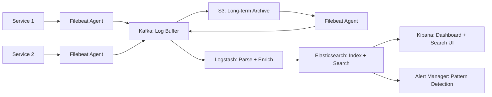

#system-design #case-study #intermediate

# Design a Distributed Logging System (ELK-like)

## The Question
> "Design a centralized logging system that ingests logs from thousands of services."

---

## Requirements
**Functional:** Ingest structured logs from all services, search by any field, filter by time/service/level, alerting on patterns
**Non-Functional:** Handle 1M logs/sec, query latency <2s, 30-day retention, no log loss

## High-Level Design



### Why Kafka as Buffer?
- Services produce logs at variable rates (spikes during errors)
- Elasticsearch can't handle ingestion spikes directly
- Kafka absorbs spikes, Logstash consumes at steady rate
- If Elasticsearch is down, logs buffered in Kafka (not lost)

### Log Format (Structured JSON)
```json
{
  "timestamp": "2024-01-15T10:23:45.123Z",
  "level": "ERROR",
  "service": "order-service",
  "instance": "order-service-pod-3",
  "trace_id": "abc-123-def-456",
  "message": "Payment failed: insufficient funds",
  "user_id": "user_789",
  "order_id": "order_012",
  "error_code": "PAYMENT_INSUFFICIENT_FUNDS",
  "duration_ms": 234
}
```

### Index Strategy (Elasticsearch)
```
Index per day: logs-2024.01.15, logs-2024.01.16, ...

Day 0-7:   Hot nodes (SSD, more replicas) → fast search
Day 7-30:  Warm nodes (HDD, fewer replicas) → slower search
Day 30+:   Delete or archive to S3

ILM (Index Lifecycle Management) automates this.
```

### Key Queries
```
"Show all ERROR logs from order-service in the last hour"
"Find all logs with trace_id = abc-123" (distributed tracing)
"Count errors per service per minute" (alerting)
"Show logs where duration_ms > 5000" (slow request investigation)
```

## Interview Tip
> "The architecture is: agents on each service → Kafka buffer → processing pipeline → Elasticsearch for search → Kibana for visualization. Kafka is critical as a buffer to handle ingestion spikes and prevent log loss during Elasticsearch maintenance. Index-per-day with ILM for hot/warm/cold lifecycle."

## Links
- [[../02_building_blocks/monitoring_and_logging]] — Observability pillars
- [[../02_building_blocks/search_systems]] — Elasticsearch internals
- [[../15_intermediate_topics/kafka_deep_dive]] — Kafka as buffer
