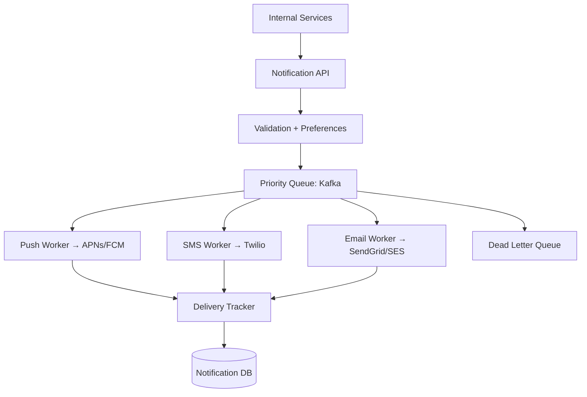

#system-design #case-study #intermediate

# Design a Notification System

## The Question

> "Design a notification system that supports push notifications, SMS, and email at scale."

---

## Step 1: Requirements

**Functional:** Send push/SMS/email notifications, user preferences (opt-in/out per channel), priority levels, rate limiting, template system, delivery tracking
**Non-Functional:** At-least-once delivery, <1 minute for high priority, scalable to 10B+ notifications/day

---

## Step 2: Estimation

| Metric | Value |
|--------|-------|
| Notifications/day | 10B |
| Notifications/sec | ~115,000 |
| Push : SMS : Email ratio | 70% : 10% : 20% |

---

## Step 3: High-Level Design



---

## Step 4: Deep Dive

### Request Flow

1. Service calls `POST /notify` with recipient, channel, template, priority
2. Validation: check user preferences, rate limits, dedup
3. Render template with user data
4. Route to priority queue (Kafka topic per channel per priority)
5. Channel-specific worker picks up and delivers
6. Track delivery status (sent, delivered, failed, bounced)

### Priority Queues

```
kafka topics:
  push-high      → OTP codes, security alerts
  push-medium    → social interactions
  push-low       → marketing
  sms-high       → verification codes
  email-low      → newsletters
```

High-priority consumers have more workers and faster processing.

### Rate Limiting

Protect users from notification spam:
```
Max 3 push notifications per hour per user
Max 1 SMS per minute per user
Max 5 emails per day per user (marketing)
No limit for transactional (OTP, receipts)
```

### Retry and DLQ

```
Attempt 1 → fail → wait 1s → Attempt 2 → fail → wait 5s → Attempt 3 → fail → DLQ
```

DLQ ([[02_building_blocks/message_queues]]) stores failed notifications for investigation.

### Provider Failover

Push: APNs (iOS) + FCM (Android) — required, not redundant
SMS: Primary (Twilio) → Failover (Vonage) if Twilio is down
Email: Primary (SES) → Failover (SendGrid)

---

## Interview Simulation

> **Interviewer:** Design a notification system.

> **Candidate:** I'd design this as an event-driven pipeline with three main stages: intake, routing, and delivery. The intake API validates the request and checks user preferences. It then routes to a priority queue — separate Kafka topics per channel and priority level. Channel-specific workers consume from these topics and deliver via external providers.

> **Candidate:** Key design decisions: at-least-once delivery with idempotent consumers, rate limiting per user per channel, provider failover for SMS and email, and a dead letter queue for persistent failures. Delivery tracking stores the status of every notification for debugging and analytics.

> **Interviewer:** How do you handle 10B notifications per day?

> **Candidate:** That's ~115K/sec. Kafka handles this throughput easily with proper partitioning. The workers are horizontally scalable — add more consumers to each topic. The bottleneck is usually the external providers (APNs, Twilio) — we'd batch where possible and use connection pooling.

---

## Building Blocks Used

| Component | Building Block |
|-----------|---------------|
| Async pipeline | [[02_building_blocks/message_queues]] (Kafka) |
| Rate limiting | [[02_building_blocks/rate_limiter]] |
| Delivery tracking | [[02_building_blocks/databases_nosql]] |
| Template rendering | Application layer |
| Provider failover | [[03_design_patterns/circuit_breaker]] |
