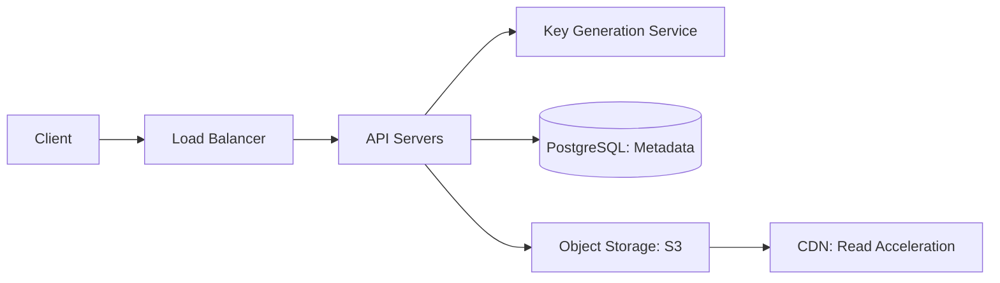

#system-design #case-study #beginner

# Design Pastebin

## The Question

> "Design a text-sharing service like Pastebin where users can store and share text snippets."

---

## Step 1: Requirements

**Functional:** Create paste (text + optional expiry), get paste by URL, syntax highlighting, public/private/unlisted, user accounts (optional)
**Non-Functional:** High availability for reads, 5M+ pastes/day, global access, auto-expire old pastes

---

## Step 2: Estimation

| Metric | Value |
|--------|-------|
| New pastes/day | 5M |
| Read:write ratio | 5:1 |
| Avg paste size | 10KB |
| Storage/day | 5M × 10KB = 50GB |
| Storage/year | ~18TB |
| Reads/sec | ~290 |
| Writes/sec | ~58 |

---

## Step 3: High-Level Design



### Key APIs
```
POST /pastes    → { content, expiry, visibility } → { url: "paste.bin/abc123" }
GET  /pastes/:key → returns paste content
DELETE /pastes/:key → delete paste
```

### Paste Storage

**Metadata** (PostgreSQL): key, user_id, created_at, expires_at, visibility, content_hash
**Content** (S3): actual paste text, keyed by paste ID

Why S3 for content? Paste content varies wildly (1KB to 10MB). S3 is cheap, durable, and CDN-friendly. PostgreSQL for metadata queries (list user's pastes, find expired ones).

### Key Generation

Same approach as [[design_url_shortener]]: base62 encoding, 8-character keys = 62^8 = 218 trillion unique pastes.

### Expiration

Background cleanup job:
```sql
DELETE FROM pastes WHERE expires_at < NOW() AND expires_at IS NOT NULL;
```
Run every hour. Also lazy-check on read: if expired, return 404.

---

## Links
- [[design_url_shortener]] — Very similar architecture
- [[02_building_blocks/blob_storage]] — Content storage
- [[02_building_blocks/cdn]] — Read acceleration
