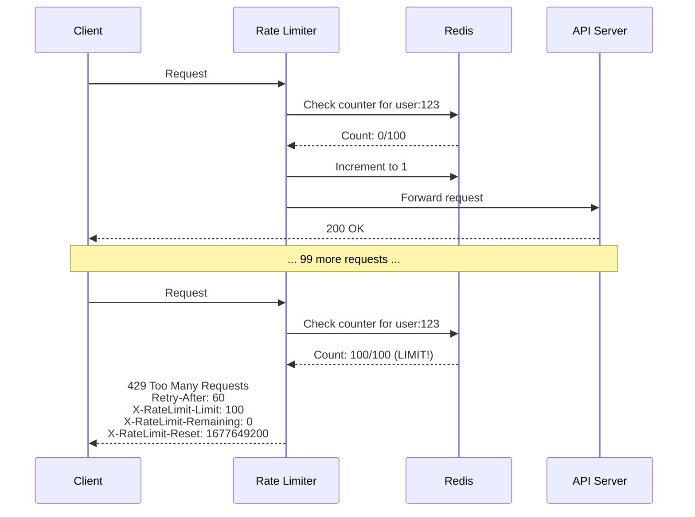
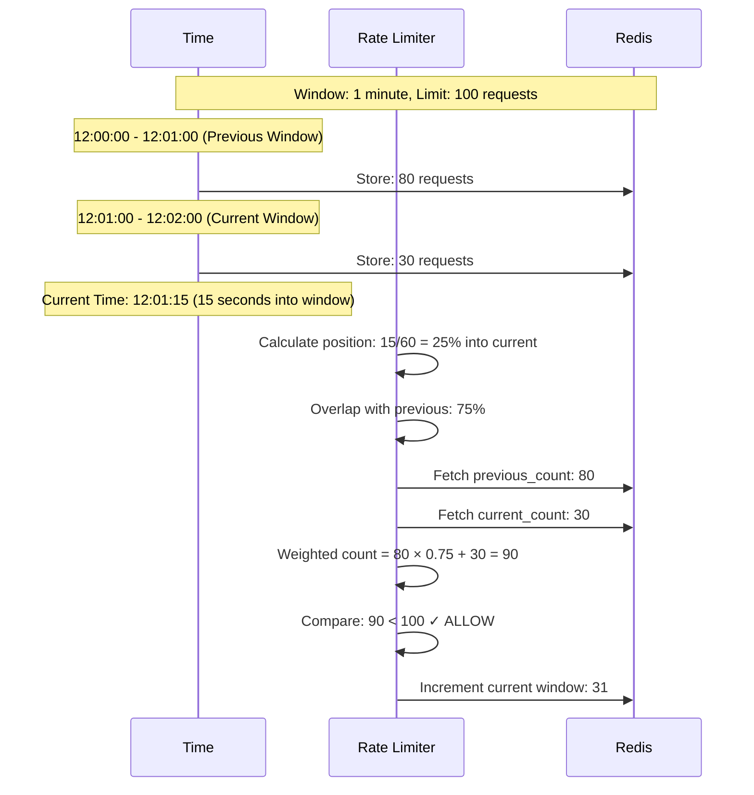
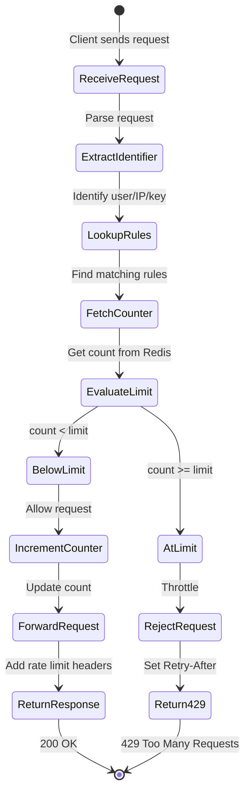
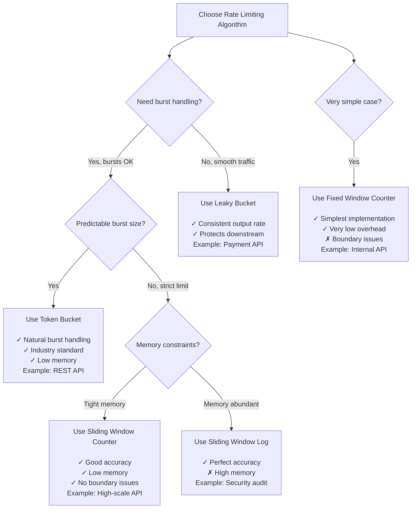
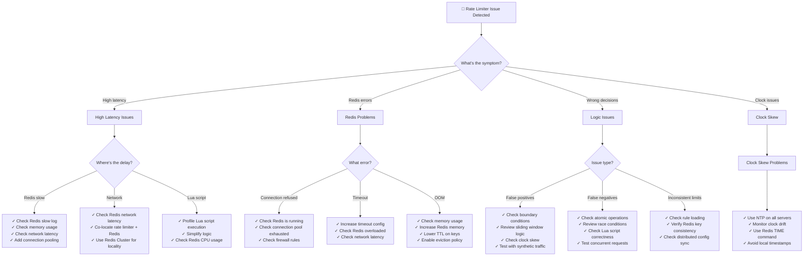

#system-design #case-study #rate-limiter

# Design a Rate Limiter

## Intuition (30 sec)

A nightclub bouncer with a clicker counter: only 100 people allowed inside at once. When someone leaves, one more can enter. The bouncer doesn't care who you are individually - just that the total count stays under the limit. That's rate limiting: controlling the flow of requests to protect your system from overload.

## Failure-First Scenario

> Your API is public. A developer writes a buggy script with an infinite loop that hammers your endpoint 1000 times per second. Your servers catch fire, your database locks up, and all legitimate users see "503 Service Unavailable." By the time you notice, you've lost $50,000 in revenue. **You needed rate limiting yesterday.**

---

## Working Knowledge (5 min)

### Core Concept - Definition First

**Rate Limiter:**
- **Definition:** A system component that controls the rate of requests a client can make to a service within a specified time window, rejecting requests that exceed the defined threshold
- **Purpose:** Protects backend services from overload, prevents abuse, ensures fair resource allocation, and manages costs for metered APIs
- **How it works:** Tracks request counts per identity (user/IP/API key) and compares against configured limits, returning HTTP 429 "Too Many Requests" when exceeded

**Key Terms:**
- **Rate Limit Rule:** Configuration specifying who (identifier), what (endpoint), how many (quota), and when (time window)
- **Quota:** Maximum number of requests allowed within the time window
- **Time Window:** Duration for measuring request rate (e.g., per second, per minute, per hour)
- **Identifier/Key:** What uniquely identifies the rate limit bucket (user ID, IP address, API key, endpoint path)
- **Throttling:** The act of slowing down or rejecting requests that exceed the rate limit

### Visual Model - Rate Limiting Flow



### Algorithm Comparison Table

| Algorithm | Accuracy | Memory | Burst Handling | Use Case |
|-----------|----------|--------|----------------|----------|
| **Token Bucket** | High | Low | Excellent (allows bursts) | APIs, general purpose |
| **Leaky Bucket** | High | Low | Smooths bursts | Streaming, consistent output |
| **Fixed Window Counter** | Low (boundary issue) | Very Low | Poor | Simple rate limiting |
| **Sliding Window Log** | Perfect | High | Good | Strict enforcement needed |
| **Sliding Window Counter** | High | Low | Good | Production (best balance) |

---

## Layer 1: Conceptual Precision (15 min)

### Rate Limiting Algorithms - Deep Definitions

**1. Token Bucket Algorithm:**

- **Formal Definition:** A bucket with fixed capacity that refills at a constant rate; each request consumes one token, and requests are rejected when the bucket is empty
- **Simple Definition:** Like a bank account with a spending limit that automatically refills over time
- **Analogy:** Water bucket with a hole in the bottom - water (tokens) drips in at constant rate, requests drain it
- **Related Terms:** Differs from Leaky Bucket in that Token Bucket allows bursts up to capacity, while Leaky Bucket enforces steady outflow

**Why this matters:**
Token Bucket is the most widely used algorithm (AWS API Gateway, Stripe, Shopify) because it naturally handles real user behavior - occasional bursts followed by quiet periods. A user might refresh a page (10 quick requests), then idle for a minute. Token Bucket allows this without false positives.

**2. Leaky Bucket Algorithm:**

- **Formal Definition:** Requests enter a queue (bucket) and are processed at a fixed rate regardless of input rate; overflow requests are rejected
- **Simple Definition:** A funnel that forces requests through at a constant pace, no matter how fast they arrive
- **Analogy:** A coffee shop with exactly one barista - customers queue, but service rate never changes
- **Related Terms:** Opposite of Token Bucket - Leaky Bucket smooths output, Token Bucket smooths input

**Why this matters:**
Leaky Bucket protects downstream services that can't handle bursts. If your payment processor accepts exactly 10 req/sec, Leaky Bucket ensures you never exceed that, even if 100 requests arrive simultaneously.

**3. Fixed Window Counter:**

- **Formal Definition:** Divides time into fixed windows (0:00-0:59, 1:00-1:59) and counts requests per window; counter resets at window boundary
- **Simple Definition:** Count requests in 1-minute chunks, reset the counter every minute
- **Analogy:** A parking lot that resets its counter at midnight - doesn't matter when cars arrived
- **Boundary Problem:** 100 requests at 0:59 + 100 at 1:00 = 200 requests in 1 second, but limit is 100/min

**4. Sliding Window Log:**

- **Formal Definition:** Maintains a timestamped log of all requests; on each new request, removes entries older than the window and counts remaining entries
- **Simple Definition:** Keep a list of every request with timestamps, always look back exactly N seconds
- **Analogy:** A security guard checking a visitor logbook, counting entries from the last 60 minutes
- **Trade-off:** Perfect accuracy but high memory cost (stores every request timestamp)

**5. Sliding Window Counter (Recommended):**

- **Formal Definition:** Hybrid approach that combines fixed windows with weighted calculation based on current position in window
- **Formula:** `Rate = (prev_window_count × overlap_percentage) + curr_window_count`
- **Simple Definition:** Smooth out the boundary problem by considering partial overlap with previous window
- **Why best:** Combines low memory of Fixed Window with high accuracy of Sliding Log

### How Sliding Window Counter Works (Visual Flow)



**Step-by-step breakdown:**
1. **Window Division:** Time is divided into fixed windows (e.g., 12:00-12:01, 12:01-12:02)
2. **Position Calculation:** Determine how far into current window we are (e.g., 15 seconds = 25%)
3. **Weighted Sum:** Multiply previous window's count by overlap percentage, add current window's count
4. **Decision:** If weighted sum < limit, allow request and increment current counter; else reject

### Algorithm Comparison Timeline Visual

```
Scenario: Limit = 10 requests per minute
Request pattern: 10 requests at 0:59, then 10 requests at 1:00


Fixed Window Counter:
═══════════════════════════════════════════════════════
Window 1 (0:00-0:59)        │  Window 2 (1:00-1:59)
                       0:59 │ 1:00
────────────────────────────┼──────────────────────────
[10 requests] ✓            │ [10 requests] ✓
Count: 10/10                │ Count: 10/10 (reset!)
                            │
Problem: 20 requests in 1 second! (at boundary)


Sliding Window Log:
═══════════════════════════════════════════════════════
Timestamps: [0:59:00, 0:59:01, ..., 0:59:09, 1:00:00, ...]
                                    └─────┬─────┘
At 1:00:00, look back 60 seconds:        │
  • 0:59:00 - 0:59:09 are within window (10 requests)
  • Try to add 1:00:00 → Would be 11 ✗ REJECT

Perfect accuracy! But stores every timestamp.


Sliding Window Counter:
═══════════════════════════════════════════════════════
Window 0 (0:00-0:59): 10 requests
Window 1 (1:00-1:59): 0 requests (so far)

At 1:00:00 (0% into Window 1):
  Weighted = 10 × 100% + 0 = 10/10 ✓ (at limit)

At 1:00:01 (request #11 arrives):
  Position = 1/60 = 1.67% into Window 1
  Overlap = 98.33% with Window 0
  Weighted = 10 × 98.33% + 1 = 10.83 ✗ REJECT

Good accuracy, low memory!


Token Bucket:
═══════════════════════════════════════════════════════
Bucket: capacity=10, refill_rate=1/6 per second

0:59:00: Bucket full [10 tokens]
0:59:00-0:59:09: 10 requests consume all tokens [0 tokens]
0:59:10-1:00:00: Refill 50 sec × 1/6 = 8.33 tokens [8 tokens]
1:00:00: 8 requests allowed ✓, then empty
1:00:01-1:00:09: 2 more requests rejected ✗

Allows natural bursts, smooth recovery.
```

### Rate Limit Rules - Configuration Model

**Rate Limit Rule Components:**

```yaml
# Complete rule structure
rate_limit_rule:
  name: string                    # Descriptive name for the rule
  identifier: string              # Key pattern (user:{id}, ip:{ip})
  limit: integer                  # Max requests allowed
  window: duration                # Time window (60s, 1m, 1h, 1d)
  algorithm: enum                 # token_bucket | sliding_window | fixed_window

  # Optional: Fine-tuning
  burst_capacity: integer         # For token bucket, max burst size
  refill_rate: float              # For token bucket, tokens per second

  # Optional: Behavior
  scope: enum                     # global | per_user | per_ip | per_api_key
  action: enum                    # reject | throttle | queue

  # Optional: Response customization
  response_code: integer          # HTTP status (default: 429)
  response_headers:
    Retry-After: integer          # Seconds until limit resets
    X-RateLimit-Limit: integer    # Total limit
    X-RateLimit-Remaining: integer # Remaining quota
    X-RateLimit-Reset: timestamp   # Unix time when window resets
```

**Example Rules:**

```yaml
rules:
  # API general limit
  - name: "API Rate Limit"
    identifier: "user:{user_id}"
    limit: 1000
    window: 1h
    algorithm: token_bucket
    burst_capacity: 50              # Allow 50 requests burst
    scope: per_user
    action: reject

  # Login brute force protection
  - name: "Login Rate Limit"
    identifier: "ip:{ip}:endpoint:/login"
    limit: 5
    window: 15m
    algorithm: sliding_window
    scope: per_ip
    action: reject

  # Expensive search endpoint
  - name: "Search Rate Limit"
    identifier: "user:{user_id}:endpoint:/api/search"
    limit: 10
    window: 1m
    algorithm: leaky_bucket
    scope: per_user
    action: throttle                # Slow down, don't reject

  # Free tier users
  - name: "Free Tier Daily Limit"
    identifier: "tier:free:user:{user_id}"
    limit: 1000
    window: 24h
    algorithm: fixed_window
    scope: per_user
    action: reject

  # Premium tier (10x higher)
  - name: "Premium Tier Daily Limit"
    identifier: "tier:premium:user:{user_id}"
    limit: 10000
    window: 24h
    algorithm: token_bucket
    scope: per_user
    action: reject
```

### State Diagram - Rate Limiter Request Flow



**State Definitions:**
- **ReceiveRequest:** Initial state when HTTP request arrives at rate limiter
- **ExtractIdentifier:** Parse request to determine identifier (user ID from JWT, IP from headers, API key from auth)
- **LookupRules:** Match request against configured rules (may have multiple rules per request)
- **FetchCounter:** Atomic read from Redis to get current count for this identifier+window
- **EvaluateLimit:** Compare current count against configured limit using chosen algorithm
- **BelowLimit:** Request is within quota, proceed to increment and forward
- **AtLimit:** Quota exceeded, reject request with 429 status
- **IncrementCounter:** Atomically increment counter in Redis (must be atomic to prevent race conditions)
- **ForwardRequest:** Proxy request to backend API service
- **RejectRequest:** Block request and prepare 429 response with helpful headers

### Architecture Pattern (With Definitions)

```
┌─────────────────────────────────────────────────────────────┐
│                    CLIENT APPLICATION                       │
│  Definition: User's browser/mobile app/script               │
│  Role: Makes API requests, handles 429 responses            │
└────────────────────────┬────────────────────────────────────┘
                         │
                         │ HTTP Request
                         ▼
┌─────────────────────────────────────────────────────────────┐
│              API GATEWAY / LOAD BALANCER                    │
│  Definition: Entry point for all API traffic               │
│  Role: TLS termination, routing, initial auth              │
└────────────────────────┬────────────────────────────────────┘
                         │
                         │
                         ▼
┌─────────────────────────────────────────────────────────────┐
│                 RATE LIMITER MIDDLEWARE                     │
│  Definition: Component that enforces rate limits            │
│  Role: Check quota, reject or forward request              │
│                                                             │
│  ┌──────────────────────────────────────────────┐          │
│  │  Rate Limiter Logic                          │          │
│  │  1. Extract identifier (user/IP/key)         │          │
│  │  2. Lookup applicable rules                  │          │
│  │  3. Fetch counter from Redis                 │          │
│  │  4. Evaluate against limit                   │          │
│  │  5. Increment counter OR reject              │          │
│  └────────┬────────────────────┬─────────────────          │
└───────────┼────────────────────┼──────────────────────────┘
            │                    │
            │                    │ Rejected
            │                    ▼
            │          ┌──────────────────┐
            │          │  429 RESPONSE    │
            │          │  Retry-After: 60 │
            │          └──────────────────┘
            │
            │ Allowed
            ▼
┌─────────────────────────────────────────────────────────────┐
│             REDIS CLUSTER (SHARED STATE)                    │
│  Definition: In-memory data store for counters              │
│  Role: Track request counts across all API servers          │
│                                                             │
│  Key Structure:                                             │
│  ratelimit:{identifier}:{window_start} → count             │
│                                                             │
│  Example:                                                   │
│  ratelimit:user:123:1677649200 → 47                        │
│  ratelimit:ip:1.2.3.4:1677649200 → 8                       │
│                                                             │
│  TTL: Automatically expire old windows                     │
└─────────────────────────────────────────────────────────────┘
            │
            │ After rate check passes
            ▼
┌─────────────────────────────────────────────────────────────┐
│                    API SERVERS                              │
│  Definition: Backend application servers                    │
│  Role: Process business logic, database queries            │
└─────────────────────────────────────────────────────────────┘
```

**Component Definitions:**
- **API Gateway:** Reverse proxy that sits in front of backend services (Kong, Nginx, AWS API Gateway)
- **Rate Limiter Middleware:** Code module that intercepts requests before they reach backend (can be part of gateway or separate service)
- **Redis Cluster:** Distributed in-memory cache used for storing request counters with high performance
- **Identifier:** Unique key extracted from request (user ID, IP address, API key) used to track limits

### The Math/Logic - Token Bucket Implementation

**Formula:**
```
tokens_available = min(capacity, last_tokens + (elapsed_time × refill_rate))
can_proceed = tokens_available >= 1
```

**Term Definitions:**
- **capacity:** Maximum tokens the bucket can hold (burst size)
- **last_tokens:** Number of tokens in bucket at last refill calculation
- **elapsed_time:** Seconds since last refill calculation
- **refill_rate:** Tokens added per second (e.g., 1 token/sec = 60 requests/min)
- **tokens_available:** Current number of tokens after refilling

**Example calculation:**
```
Given:
  capacity = 10 tokens
  refill_rate = 1 token/sec (60 per minute)
  last_tokens = 0 (bucket empty)
  last_refill_time = 12:00:00
  current_time = 12:00:05
  elapsed_time = 5 seconds

Step 1: Calculate refilled tokens
  new_tokens = last_tokens + (elapsed_time × refill_rate)
             = 0 + (5 × 1)
             = 5 tokens

Step 2: Cap at capacity
  tokens_available = min(10, 5) = 5 tokens

Step 3: Check if request can proceed
  Need: 1 token
  Have: 5 tokens
  Decision: ✓ ALLOW (5 >= 1)

Step 4: After allowing request
  new_tokens = 5 - 1 = 4 tokens
  Store: last_tokens = 4, last_refill_time = 12:00:05

What this means: Bucket had time to refill 5 tokens. Request consumed 1 token, leaving 4 tokens for subsequent requests.
```

**Redis Lua Script (Atomic Implementation):**

```lua
-- Token Bucket Rate Limiter (Atomic)
-- KEYS[1] = bucket_key (e.g., "ratelimit:user:123")
-- ARGV[1] = capacity (max tokens)
-- ARGV[2] = refill_rate (tokens per second)
-- ARGV[3] = current_time (Unix timestamp)
-- ARGV[4] = cost (tokens to consume, usually 1)

local bucket_key = KEYS[1]
local capacity = tonumber(ARGV[1])
local refill_rate = tonumber(ARGV[2])
local now = tonumber(ARGV[3])
local cost = tonumber(ARGV[4])

-- Get current state from Redis
local last_tokens = tonumber(redis.call('HGET', bucket_key, 'tokens'))
local last_refill = tonumber(redis.call('HGET', bucket_key, 'last_refill'))

-- Initialize if first time
if last_tokens == nil then
    last_tokens = capacity
    last_refill = now
end

-- Calculate tokens to add
local elapsed = math.max(0, now - last_refill)
local new_tokens = math.min(capacity, last_tokens + (elapsed * refill_rate))

-- Check if request can proceed
if new_tokens >= cost then
    -- Allow request
    new_tokens = new_tokens - cost
    redis.call('HSET', bucket_key, 'tokens', new_tokens)
    redis.call('HSET', bucket_key, 'last_refill', now)
    redis.call('EXPIRE', bucket_key, 3600)  -- Auto-cleanup after 1 hour
    return {1, new_tokens}  -- {allowed, remaining}
else
    -- Reject request
    return {0, new_tokens}  -- {rejected, remaining}
end
```

**Why Lua script?**
The entire check-and-decrement operation executes atomically on Redis server, preventing race conditions where two requests check simultaneously and both think they're under the limit.

### Trade-offs Matrix (With Definitions)

```
Server-Side Rate Limiting           Client-Side Rate Limiting
════════════════════════════════════════════════════════════
Definition: Rate limiter runs on     Definition: Client tracks its
backend servers                      own rate limit

Pros:                                Pros:
• Authoritative (source of truth)    • Reduces unnecessary requests
• Cannot be bypassed by client       • Lower latency (no round-trip)
• Works for all clients              • Reduces server load

Cons:                                Cons:
• Adds latency to every request      • Can be bypassed (malicious client)
• Single point of failure            • Clock skew between client/server
• Requires shared state (Redis)      • Inconsistent across clients

Use When:                            Use When:
• Security is critical               • Optimizing for UX (show limits)
• Public API (untrusted clients)     • Reducing server load
• Multiple API servers               • Complementary to server-side


Gateway Rate Limiting                Service-Level Rate Limiting
════════════════════════════════════════════════════════════
Definition: Rate limit at API        Definition: Rate limit at
gateway/edge                         individual service

Pros:                                Pros:
• Single enforcement point           • Fine-grained control per service
• Protects all backend services      • Different limits per endpoint
• Easy to configure centrally        • Isolates expensive operations

Cons:                                Cons:
• Coarse-grained (all services)      • Duplicated logic across services
• Gateway becomes bottleneck         • Harder to manage centrally
• No endpoint-specific limits        • Each service needs Redis connection

Use When:                            Use When:
• Simple rate limiting needed        • Complex multi-tier limits
• Protecting infrastructure          • Different services have different needs
• DDoS protection                    • Fine-grained cost control
```

---

## Layer 2: Technology-Specific Examples (20 min)

### Technology Comparison (With Definitions)

**Tool Category:** Rate Limiting Solutions (Middleware, Gateway, and Service Mesh options)

| Redis-based Custom | Kong API Gateway | AWS API Gateway | Nginx Rate Limit | Envoy Service Mesh |
|-------------------|------------------|-----------------|------------------|-------------------|
| **Definition:** Build rate limiter using Redis + Lua | **Definition:** Open-source API gateway with plugins | **Definition:** Managed AWS service | **Definition:** Nginx module for basic rate limiting | **Definition:** Service mesh with distributed rate limiting |
| **Best For:** Full control, custom logic | **Best For:** Self-hosted, plugin ecosystem | **Best For:** AWS-native, zero ops | **Best For:** Simple cases, web servers | **Best For:** Kubernetes, microservices |
| Flexibility: ⭐⭐⭐⭐⭐ | Flexibility: ⭐⭐⭐⭐ | Flexibility: ⭐⭐⭐ | Flexibility: ⭐⭐ | Flexibility: ⭐⭐⭐⭐ |
| Ops Burden: ⭐⭐⭐⭐⭐ | Ops Burden: ⭐⭐⭐⭐ | Ops Burden: ⭐ | Ops Burden: ⭐⭐ | Ops Burden: ⭐⭐⭐⭐ |
| Cost: $ (just Redis) | Cost: $ (servers) | Cost: $$$ (per request) | Cost: $ (servers) | Cost: $$ (mesh overhead) |

### Redis Configuration Pattern (Annotated)

```yaml
# Redis Cluster Configuration for Rate Limiting

cluster:
  enabled: true                      # Definition: Multi-node Redis for HA
  nodes:                             # Definition: List of Redis instances
    - host: redis-1.internal
      port: 6379
    - host: redis-2.internal
      port: 6379
    - host: redis-3.internal
      port: 6379

  replicas: 2                        # Definition: Copies per shard (HA)
  shards: 3                          # Definition: Data partitions

connection_pool:
  min_idle: 10                       # Definition: Minimum connections kept open
  max_idle: 50                       # Definition: Maximum idle connections
  max_active: 200                    # Definition: Max concurrent connections
  max_wait: 100ms                    # Definition: Wait time if pool exhausted

# Key Terms:
# cluster - Distributed Redis deployment for horizontal scaling
# replicas - Backup copies of data for high availability
# shards - Partitions that split data across multiple nodes
# connection_pool - Reusable connections to avoid TCP overhead
```

**Configuration Concepts:**
- **cluster.enabled:** When true, uses Redis Cluster mode which automatically shards data across nodes
- **replicas:** Each shard has N replicas; if primary fails, replica promotes to primary
- **connection_pool:** Reusing TCP connections dramatically improves performance (no handshake overhead)
- **max_active:** Limits concurrent operations to prevent overwhelming Redis

**Performance Tuning:**

```yaml
# Redis performance settings for high-throughput rate limiting

performance:
  # Memory optimization
  maxmemory: 2gb                     # Definition: Max memory Redis can use
  maxmemory_policy: allkeys-lru      # Definition: Evict least recently used keys

  # Persistence (trade durability for speed)
  save: ""                           # Definition: Disable RDB snapshots
  appendonly: no                     # Definition: Disable AOF logging

  # Network optimization
  tcp_keepalive: 60                  # Definition: Keep TCP connections alive
  timeout: 0                         # Definition: Never close idle connections

  # Latency optimization
  slowlog_log_slower_than: 10000     # Definition: Log queries > 10ms
  latency_monitor_threshold: 100     # Definition: Track latency events > 100ms

# Why disable persistence?
# Rate limit counters are transient data. If Redis crashes,
# slightly incorrect counts for a few seconds is acceptable.
# Trade-off: 10x better write performance vs durability.
```

### Rate Limiter Service Architecture (Java/Spring Boot)

```
┌─────────────────────────────────────────────────────────┐
│              Spring Boot Application                    │
│                                                         │
│  ┌───────────────────────────────────────────┐         │
│  │         @RestController                   │         │
│  │  @GetMapping("/api/users/{id}")          │         │
│  │  public User getUser(@PathVariable id) { │         │
│  │    // Business logic                     │         │
│  │  }                                       │         │
│  └───────────┬───────────────────────────────┘         │
│              │                                         │
│              │ Intercepted by                          │
│              ▼                                         │
│  ┌───────────────────────────────────────────┐         │
│  │    RateLimitingInterceptor                │         │
│  │    (HandlerInterceptor)                   │         │
│  │                                           │         │
│  │  @Override                                │         │
│  │  public boolean preHandle() {             │         │
│  │    String identifier = extractId(request);│         │
│  │    if (!rateLimiter.allowRequest(id)) {   │         │
│  │      response.setStatus(429);             │         │
│  │      return false; // Block request       │         │
│  │    }                                      │         │
│  │    return true; // Allow request          │         │
│  │  }                                        │         │
│  └───────────┬───────────────────────────────┘         │
│              │                                         │
│              │ Calls                                   │
│              ▼                                         │
│  ┌───────────────────────────────────────────┐         │
│  │    RateLimiterService                     │         │
│  │                                           │         │
│  │  • loadRulesFromConfig()                  │         │
│  │  • selectAlgorithm(rule)                  │         │
│  │  • allowRequest(identifier, rule)         │         │
│  │  • getCounterKey(identifier, rule)        │         │
│  └───────────┬───────────────────────────────┘         │
│              │                                         │
│              │ Uses                                    │
│              ▼                                         │
│  ┌───────────────────────────────────────────┐         │
│  │    RedisTemplate<String, String>          │         │
│  │                                           │         │
│  │  • execute(LuaScript)  // Atomic ops     │         │
│  │  • opsForValue().increment()              │         │
│  │  • expire(key, ttl)                       │         │
│  └───────────┬───────────────────────────────┘         │
└──────────────┼──────────────────────────────────────────┘
               │
               │ Network call
               ▼
┌─────────────────────────────────────────────────────────┐
│              Redis Cluster                              │
│  Keys: ratelimit:user:123:1677649200 → 47              │
└─────────────────────────────────────────────────────────┘
```

**Implementation Flow:**

```java
// Step 1: Configuration
@Configuration
public class RateLimitConfig {
    @Bean
    public RedisTemplate<String, String> redisTemplate(
        RedisConnectionFactory factory) {
        RedisTemplate<String, String> template = new RedisTemplate<>();
        template.setConnectionFactory(factory);
        return template;
    }

    @Bean
    public DefaultRedisScript<Long> rateLimitScript() {
        DefaultRedisScript<Long> script = new DefaultRedisScript<>();
        script.setScriptText(loadLuaScript());
        script.setResultType(Long.class);
        return script;
    }
}

// Step 2: Service Layer
@Service
public class RateLimiterService {
    private final RedisTemplate<String, String> redis;
    private final DefaultRedisScript<Long> script;

    public boolean allowRequest(String identifier, int limit, int windowSec) {
        String key = "ratelimit:" + identifier;
        long now = System.currentTimeMillis() / 1000;

        // Execute Lua script atomically
        Long allowed = redis.execute(
            script,
            List.of(key),
            String.valueOf(limit),
            String.valueOf(windowSec),
            String.valueOf(now)
        );

        return allowed != null && allowed == 1;
    }
}

// Step 3: Interceptor
@Component
public class RateLimitInterceptor implements HandlerInterceptor {
    private final RateLimiterService rateLimiter;

    @Override
    public boolean preHandle(HttpServletRequest request,
                            HttpServletResponse response,
                            Object handler) {
        String userId = extractUserId(request);
        String endpoint = request.getRequestURI();
        String identifier = userId + ":" + endpoint;

        if (!rateLimiter.allowRequest(identifier, 100, 60)) {
            response.setStatus(429);
            response.setHeader("Retry-After", "60");
            response.setHeader("X-RateLimit-Limit", "100");
            response.setHeader("X-RateLimit-Remaining", "0");
            return false; // Block request
        }

        return true; // Allow request
    }
}
```

### Decision Tree - Algorithm Selection



### Decision Tree - Placement Strategy

```mermaid
flowchart TD
    Start[Where to place rate limiter?] --> Q1{What are you protecting?}

    Q1 -->|Infrastructure| Gateway[API Gateway Level<br/><br/>Protect: All services<br/>Limit by: IP, API key<br/>Tools: Kong, AWS Gateway<br/><br/>✓ Single enforcement point<br/>✓ Protects everything<br/>✗ Coarse-grained]

    Q1 -->|Specific services| Q2{How many services?}

    Q2 -->|Few, monolithic| Service[Service Level<br/><br/>Protect: Individual endpoints<br/>Limit by: User, endpoint<br/>Tools: Custom middleware<br/><br/>✓ Fine-grained control<br/>✓ Endpoint-specific limits<br/>✗ Each service needs limiter]

    Q2 -->|Many, microservices| Q3{Using service mesh?}

    Q3 -->|Yes| Mesh[Service Mesh Level<br/><br/>Protect: All mesh services<br/>Limit by: Service, route<br/>Tools: Envoy, Istio<br/><br/>✓ Consistent across services<br/>✓ Distributed rate limiting<br/>✗ Complex setup]

    Q3 -->|No| Gateway

    Start --> Q4{Client can help?}
    Q4 -->|Yes| Client[Client-Side + Server-Side<br/><br/>✓ Best UX (show limits)<br/>✓ Reduce wasted requests<br/>⚠ Server still authoritative]
```

---

## Layer 3: Production-Ready Details (30 min)

### Production Architecture - Redis-Based Distributed Rate Limiter

```
                         🌍 Internet
                             │
                    ┌────────▼────────┐
                    │  CloudFlare CDN │
                    │  • DDoS protection
                    │  • TLS termination
                    │  • Cache static
                    └────────┬────────┘
                             │
                ┌────────────┼────────────┐
                │            │            │
           ┌────▼───┐   ┌────▼───┐   ┌───▼────┐
           │ Region │   │ Region │   │ Region │
           │US-East │   │US-West │   │   EU   │
           └────┬───┘   └────┬───┘   └───┬────┘
                │            │            │
    ╔═══════════╧════════════╧════════════╧═══════════════╗
    ║          RATE LIMITER LAYER (Stateless)            ║
    ╠════════════════════════════════════════════════════╣
    ║                                                    ║
    ║  ┌──────────────────────────────────────────┐     ║
    ║  │      API Gateway Cluster                 │     ║
    ║  │      (Nginx / Kong / Envoy)              │     ║
    ║  │                                          │     ║
    ║  │  ┌────────┐  ┌────────┐  ┌────────┐   │     ║
    ║  │  │Gateway │  │Gateway │  │Gateway │   │     ║
    ║  │  │   1    │  │   2    │  │   3    │   │     ║
    ║  │  └────┬───┘  └────┬───┘  └────┬───┘   │     ║
    ║  │       │           │           │        │     ║
    ║  │       └───────────┼───────────┘        │     ║
    ║  │                   │                     │     ║
    ║  │      Rate Limiter Middleware            │     ║
    ║  │      (Each gateway instance)            │     ║
    ║  └─────────┬────────────────────────────────     ║
    ║            │                                     ║
    ╚════════════╪═════════════════════════════════════╝
                 │ All instances share Redis
                 │
    ╔════════════▼═════════════════════════════════════╗
    ║       REDIS CLUSTER (Shared State)              ║
    ╠═════════════════════════════════════════════════╣
    ║                                                 ║
    ║  Master Nodes (3 shards):                       ║
    ║  ┌──────────┐  ┌──────────┐  ┌──────────┐     ║
    ║  │ Redis-M1 │  │ Redis-M2 │  │ Redis-M3 │     ║
    ║  │  Shard 1 │  │  Shard 2 │  │  Shard 3 │     ║
    ║  │  Port    │  │  Port    │  │  Port    │     ║
    ║  │  6379    │  │  6380    │  │  6381    │     ║
    ║  └────┬─────┘  └────┬─────┘  └────┬─────┘     ║
    ║       │             │             │            ║
    ║  Replica Nodes (2 replicas per shard):         ║
    ║  ┌────▼────┐   ┌────▼────┐   ┌────▼────┐     ║
    ║  │Redis-R1a│   │Redis-R2a│   │Redis-R3a│     ║
    ║  └─────────┘   └─────────┘   └─────────┘     ║
    ║  ┌─────────┐   ┌─────────┐   ┌─────────┐     ║
    ║  │Redis-R1b│   │Redis-R2b│   │Redis-R3b│     ║
    ║  └─────────┘   └─────────┘   └─────────┘     ║
    ║                                                ║
    ║  Key Distribution (Consistent Hashing):        ║
    ║  ratelimit:user:1-1000   → Shard 1            ║
    ║  ratelimit:user:1001-2000 → Shard 2           ║
    ║  ratelimit:user:2001-3000 → Shard 3           ║
    ║                                                ║
    ║  High Availability:                            ║
    ║  • Sentinel monitors masters                   ║
    ║  • Auto-failover to replica on master failure  ║
    ║  • Redis Cluster mode for sharding             ║
    ╚═════════════════════════════════════════════════╝
                 │
                 │ After rate limit passes
                 ▼
    ┌────────────────────────────────────────────────┐
    │         BACKEND API SERVICES                   │
    │                                                │
    │  ┌──────────┐  ┌──────────┐  ┌──────────┐   │
    │  │ Service  │  │ Service  │  │ Service  │   │
    │  │    A     │  │    B     │  │    C     │   │
    │  │  (Users) │  │ (Orders) │  │(Payments)│   │
    │  └──────────┘  └──────────┘  └──────────┘   │
    └────────────────────────────────────────────────┘
```

**Architecture Components:**

- **CloudFlare CDN:** First line of defense, blocks volumetric DDoS before reaching origin
- **API Gateway Cluster:** Stateless instances (can scale horizontally), each runs rate limiter middleware
- **Redis Cluster:** Shared state across all gateways, uses consistent hashing to distribute keys
- **Sentinel:** Monitors Redis masters, triggers failover if master goes down
- **Backend Services:** Protected by rate limiter, never see rate-limited traffic

**Why Redis Cluster?**

```
Single Redis Node:
═══════════════════════════════════
Max throughput: ~100K ops/sec
Memory: 64GB limit
Issue: Single point of failure ✗

If Redis crashes → All rate limits fail
If out of memory → Cannot track new users

Redis Cluster (3 shards):
═══════════════════════════════════
Max throughput: ~300K ops/sec (3x)
Memory: 192GB total (64GB × 3)
Issue: Distributed state ✓

Keys automatically distributed across shards
Each shard has 2 replicas for HA
If one shard fails → Only 1/3 of traffic affected
Auto-failover promotes replica to master
```

### Capacity Planning - Rate Limiter Service Itself

**Rate Limiter Service Capacity:**

The rate limiter itself needs capacity planning. It's a critical service that can become a bottleneck.

```
Given Requirements:
┌─────────────────────────────────────────────────────┐
│ • 1 million active users                            │
│ • 100 requests/min per user average                 │
│ • Peak traffic: 3x average                          │
│ • Rate limiter must handle every request            │
└─────────────────────────────────────────────────────┘

Step 1: Calculate Total Request Rate
┏━━━━━━━━━━━━━━━━━━━━━━━━━━━━━━━━━━━━━━━━━━━━━━━━━━┓
┃ 1M users × 100 req/min = 100M requests/min       ┃
┃ = 1.67M requests/sec average                     ┃
┃ Peak: 1.67M × 3 = 5M req/sec                     ┃
┗━━━━━━━━━━━━━━━━━━━━━━━━━━━━━━━━━━━━━━━━━━━━━━━━━━┛

Step 2: Redis Capacity (Each check = 2 Redis ops)
┏━━━━━━━━━━━━━━━━━━━━━━━━━━━━━━━━━━━━━━━━━━━━━━━━━━┓
┃ Check counter: 1 read (GET or HGET)               ┃
┃ Increment counter: 1 write (INCR or Lua script)   ┃
┃ Total: 5M req/sec × 2 ops = 10M Redis ops/sec     ┃
┃                                                   ┃
┃ Single Redis: ~100K ops/sec max                   ┃
┃ Needed: 10M ÷ 100K = 100 Redis instances          ┃
┃                                                   ┃
┃ With clustering (sharding):                       ┃
┃   10 shards × 100K = 1M ops/sec                   ┃
┃   Need: 10M ÷ 1M = 10 shard groups                ┃
┃   With 2 replicas each: 30 Redis instances total  ┃
┗━━━━━━━━━━━━━━━━━━━━━━━━━━━━━━━━━━━━━━━━━━━━━━━━━━┛

Step 3: Network Bandwidth (Redis traffic)
┏━━━━━━━━━━━━━━━━━━━━━━━━━━━━━━━━━━━━━━━━━━━━━━━━━━┓
┃ Each operation:                                   ┃
┃   Request: ~200 bytes (key + command)             ┃
┃   Response: ~100 bytes (result)                   ┃
┃   Total: 300 bytes per request                    ┃
┃                                                   ┃
┃ Bandwidth: 5M req/sec × 300 bytes = 1.5 GB/sec    ┃
┃          = 12 Gbps                                ┃
┃                                                   ┃
┃ Distributed across 10 shards: 1.2 Gbps per shard  ┃
┃ Recommendation: 10 Gbps NICs for Redis nodes      ┃
┗━━━━━━━━━━━━━━━━━━━━━━━━━━━━━━━━━━━━━━━━━━━━━━━━━━┛

Step 4: Gateway Capacity (Rate limiter logic)
┏━━━━━━━━━━━━━━━━━━━━━━━━━━━━━━━━━━━━━━━━━━━━━━━━━━┓
┃ Latency per check: ~2ms (Redis round-trip)        ┃
┃ Concurrent requests: 5M req/sec × 0.002s = 10K    ┃
┃                                                   ┃
┃ If each gateway handles 1000 concurrent:          ┃
┃   Gateways needed: 10K ÷ 1000 = 10 gateways       ┃
┃   With N+2 redundancy: 12 gateway instances       ┃
┗━━━━━━━━━━━━━━━━━━━━━━━━━━━━━━━━━━━━━━━━━━━━━━━━━━┛

Final Architecture for 5M req/sec:
════════════════════════════════════════════════
┌──────────────────────────────────────────┐
│  Load Balancer                           │
│  (Distribute across gateways)            │
└─────────┬────────────────────────────────┘
          │
    ┌─────┴──────┬─────┬─────┬─────┐
    │            │     │     │     │
┌───▼──┐  ┌──────▼┐  ... (12 total)
│ GW 1 │  │ GW 2  │
└───┬──┘  └───┬───┘
    │         │
    └────┬────┘
         │ (Connection pool)
         │
┌────────▼──────────────────────────────┐
│  Redis Cluster                        │
│  • 10 master shards                   │
│  • 20 replicas (2 per master)         │
│  • Total: 30 Redis instances          │
│  • Per shard: 1M ops/sec capacity     │
└───────────────────────────────────────┘

Cost Estimate (AWS):
━━━━━━━━━━━━━━━━━━━━━━━━━━━━━━━━━━━━━
• 12 × c6g.2xlarge (gateways): $2,500/mo
• 30 × r6g.4xlarge (Redis): $18,000/mo
• Load balancer: $300/mo
• Data transfer (12 Gbps): $5,000/mo
━━━━━━━━━━━━━━━━━━━━━━━━━━━━━━━━━━━━━
Total: ~$26,000/month for 5M req/sec

Per-request cost: $26,000 ÷ (5M × 86400)
                = $0.00006 per request
```

**Key Insights:**

1. **Redis is the bottleneck:** 10M ops/sec requires significant Redis capacity
2. **Network matters:** 12 Gbps sustained throughput needs planning
3. **Cost scales linearly:** Each 500K req/sec costs ~$2,600/mo
4. **Latency overhead:** Rate limiter adds 2ms to every request

### Monitoring Dashboard - Rate Limiter Metrics

```
╔══════════════════════════════════════════════════════════════════╗
║              RATE LIMITER HEALTH DASHBOARD                       ║
╠══════════════════════════════════════════════════════════════════╣
║                                                                  ║
║  🟢 Rate Limiter Status: HEALTHY                                 ║
║                                                                  ║
║  ━━━━━━━━━━━━━━━━━━━━━━━━━━━━━━━━━━━━━━━━━━━━━━━━━━━━━━━━━━━━  ║
║  📊 REQUEST METRICS                                              ║
║  ━━━━━━━━━━━━━━━━━━━━━━━━━━━━━━━━━━━━━━━━━━━━━━━━━━━━━━━━━━━━  ║
║                                                                  ║
║  Total Request Rate: 12,450 req/sec                              ║
║  ▰▰▰▰▰▰▰▰▰▰▰▰▰▰▰▰▰▰▰▰▰▰▰▰▰▰▰▰▰▰░░░░░░░░                        ║
║  Definition: Requests checked by rate limiter                    ║
║  Target: < 15,000 req/sec (80% capacity)                         ║
║                                                                  ║
║  Allowed Requests: 12,205 req/sec (98%)                          ║
║  ▰▰▰▰▰▰▰▰▰▰▰▰▰▰▰▰▰▰▰▰▰▰▰▰▰▰▰▰▰▰▰▰▰▰▰▰▰▰▰░                      ║
║  Definition: Requests that passed rate limit check              ║
║                                                                  ║
║  Rate Limited: 245 req/sec (2%)                                  ║
║  ▰▰░░░░░░░░░░░░░░░░░░░░░░░░░░░░░░░░░░░░░░░                      ║
║  Definition: Requests rejected with 429 status                   ║
║  Alert: > 10% indicates possible attack or config issue          ║
║                                                                  ║
║  ━━━━━━━━━━━━━━━━━━━━━━━━━━━━━━━━━━━━━━━━━━━━━━━━━━━━━━━━━━━━  ║
║  ⚡ PERFORMANCE METRICS                                          ║
║  ━━━━━━━━━━━━━━━━━━━━━━━━━━━━━━━━━━━━━━━━━━━━━━━━━━━━━━━━━━━━  ║
║                                                                  ║
║  Rate Limit Check Latency (P50): 1.2ms                           ║
║  ▰▰▰░░░░░░░░░░░░░░░░░░░░░░░░░░░░░░░░░░░░░░                      ║
║  Definition: Time to check rate limit (Redis round-trip)         ║
║  Target: < 5ms                                                   ║
║                                                                  ║
║  Rate Limit Check Latency (P99): 3.8ms                           ║
║  ▰▰▰▰▰▰▰░░░░░░░░░░░░░░░░░░░░░░░░░░░░░░░░░░░                      ║
║  Definition: 99% of checks complete within this time             ║
║  Target: < 10ms                                                  ║
║  Alert: > 10ms indicates Redis performance degradation           ║
║                                                                  ║
║  ━━━━━━━━━━━━━━━━━━━━━━━━━━━━━━━━━━━━━━━━━━━━━━━━━━━━━━━━━━━━  ║
║  🗄️  REDIS METRICS                                               ║
║  ━━━━━━━━━━━━━━━━━━━━━━━━━━━━━━━━━━━━━━━━━━━━━━━━━━━━━━━━━━━━  ║
║                                                                  ║
║  Redis Operations: 24,900 ops/sec (2 ops per request)           ║
║  ▰▰▰▰▰▰▰▰▰▰▰▰▰▰▰▰▰▰▰▰▰▰▰▰▰░░░░░░░░░░░░░░░                      ║
║  Definition: Total Redis commands (GET + SET/INCR)              ║
║  Capacity: 100,000 ops/sec max                                   ║
║                                                                  ║
║  Redis Latency: 0.8ms average                                    ║
║  ▰▰░░░░░░░░░░░░░░░░░░░░░░░░░░░░░░░░░░░░░░░                      ║
║  Definition: Time for Redis to execute command                   ║
║  Target: < 1ms (good), < 2ms (acceptable), > 5ms (critical)     ║
║                                                                  ║
║  Redis Memory Usage: 8.2 GB / 16 GB (51%)                        ║
║  ▰▰▰▰▰▰▰▰▰▰▰▰▰▰▰▰▰▰▰▰░░░░░░░░░░░░░░░░░░░                        ║
║  Definition: Memory used for storing counters                    ║
║  Alert: > 80% triggers eviction, > 90% critical                  ║
║                                                                  ║
║  Connection Pool: 45 / 100 active                                ║
║  ▰▰▰▰▰▰▰▰▰▰▰▰▰▰▰▰▰▰░░░░░░░░░░░░░░░░░░░░░░░                      ║
║  Definition: Active Redis connections from gateway               ║
║                                                                  ║
║  ━━━━━━━━━━━━━━━━━━━━━━━━━━━━━━━━━━━━━━━━━━━━━━━━━━━━━━━━━━━━  ║
║  🎯 RULE VIOLATIONS (Top Offenders)                              ║
║  ━━━━━━━━━━━━━━━━━━━━━━━━━━━━━━━━━━━━━━━━━━━━━━━━━━━━━━━━━━━━  ║
║                                                                  ║
║  user:12345 - 47 violations in last 5 min                        ║
║    Rule: "API Rate Limit" (100/min)                             ║
║    Pattern: Steady 150 req/min (likely bug)                     ║
║    Action: Consider temporary ban                                ║
║                                                                  ║
║  ip:203.0.113.45 - 203 violations in last 5 min                 ║
║    Rule: "Login Rate Limit" (5/15min)                           ║
║    Pattern: Brute force attack detected                          ║
║    Action: ✓ Auto-blocked for 1 hour                            ║
║                                                                  ║
║  user:67890 - 12 violations in last 5 min                        ║
║    Rule: "Search Rate Limit" (10/min)                           ║
║    Pattern: Burst traffic (normal user behavior)                 ║
║    Action: No action needed                                      ║
║                                                                  ║
║  ━━━━━━━━━━━━━━━━━━━━━━━━━━━━━━━━━━━━━━━━━━━━━━━━━━━━━━━━━━━━  ║
║  ⚠️  FALSE POSITIVES (Monitoring)                                ║
║  ━━━━━━━━━━━━━━━━━━━━━━━━━━━━━━━━━━━━━━━━━━━━━━━━━━━━━━━━━━━━  ║
║                                                                  ║
║  False Positive Rate: 0.3%                                       ║
║  Definition: Legitimate requests incorrectly rate-limited        ║
║  Calculation: Manual review of 429 responses                     ║
║  Target: < 1%                                                    ║
║                                                                  ║
║  Recent False Positives:                                         ║
║  • user:11223 - Bulk export triggered limit (legitimate)         ║
║  • user:44556 - Page refresh loop (browser bug)                  ║
║                                                                  ║
║  Recommended Actions:                                            ║
║  • Add "bulk export" exemption rule                              ║
║  • Increase limit for verified enterprise users                  ║
║                                                                  ║
║  ━━━━━━━━━━━━━━━━━━━━━━━━━━━━━━━━━━━━━━━━━━━━━━━━━━━━━━━━━━━━  ║
║  ⏱️  LATENCY OVERHEAD                                            ║
║  ━━━━━━━━━━━━━━━━━━━━━━━━━━━━━━━━━━━━━━━━━━━━━━━━━━━━━━━━━━━━  ║
║                                                                  ║
║  Before Rate Limiter: 45ms (baseline API latency)                ║
║  After Rate Limiter: 46.8ms                                      ║
║  Overhead: 1.8ms (4% increase)                                   ║
║                                                                  ║
║  Definition: Additional latency added by rate limit check        ║
║  Target: < 5ms overhead (< 10% of total latency)                 ║
║  Status: ✓ Within acceptable range                               ║
║                                                                  ║
╠══════════════════════════════════════════════════════════════════╣
║  Last Updated: 2026-02-14 15:45:30 UTC                           ║
╚══════════════════════════════════════════════════════════════════╝
```

**Metric Definitions:**

- **Rate Limited Percentage:** Ratio of 429 responses to total requests; normal: 1-5%, high: 10%+
- **P99 Latency:** 99th percentile - 1% of requests are slower than this value
- **Redis Operations:** Each rate limit check typically = 1 read + 1 write = 2 Redis ops
- **False Positive Rate:** Legitimate traffic incorrectly rejected; measured via user feedback and manual review
- **Latency Overhead:** Delta between API latency with and without rate limiter

### Troubleshooting Guide



**Common Problems and Solutions:**

**1. Clock Skew (Distributed Systems)**

```
Problem:
════════════════════════════════════════════════════════
Gateway 1: System time = 15:00:00
Gateway 2: System time = 15:00:05 (5 sec ahead)

User makes request to Gateway 1:
  Current window: 15:00:00 - 15:01:00
  Key: ratelimit:user:123:1677649200
  Count: 50

Next request routed to Gateway 2:
  Current window: 15:00:05 - 15:01:05 (different!)
  Key: ratelimit:user:123:1677649205
  Count: 0 (wrong window!)

Result: User bypasses rate limit by hitting different gateways ✗

Solution:
════════════════════════════════════════════════════════
Use Redis server time instead of local time:

redis> TIME
1) "1677649200"  ← Unix timestamp from Redis
2) "123456"      ← Microseconds

Code:
  timestamp = redis.call('TIME')[1]  # Use Redis time
  window_start = timestamp - (timestamp % window_size)
  key = "ratelimit:" .. identifier .. ":" .. window_start

Benefit: All gateways use same clock (Redis server time)
```

**2. Race Conditions (Concurrent Requests)**

```
Problem:
════════════════════════════════════════════════════════
Without atomic operations:

Request A (Gateway 1):        Request B (Gateway 2):
├─ GET counter → 99           ├─ GET counter → 99
├─ Check: 99 < 100 ✓          ├─ Check: 99 < 100 ✓
├─ INCR counter → 100         ├─ INCR counter → 101
└─ Allow request              └─ Allow request

Both requests allowed! Limit exceeded.

Solution:
════════════════════════════════════════════════════════
Use Lua script for atomic check-and-increment:

local current = redis.call('GET', key)
if tonumber(current) < limit then
  redis.call('INCR', key)
  return 1  -- allowed
else
  return 0  -- rejected
end

Benefit: Check and increment happen atomically on Redis server
No race condition possible ✓
```

**3. Thundering Herd on Rule Updates**

```
Problem:
════════════════════════════════════════════════════════
Admin updates rate limit rule: 100/min → 50/min

All 1000 gateway instances:
├─ Poll config service every 5 seconds
├─ Detect change at same time
└─ Reload rules simultaneously

Sudden spike:
  Config service: 1000 requests/sec (overwhelmed!)
  Rate limiter: Brief inconsistency during reload

Solution 1: Staggered Reload
════════════════════════════════════════════════════════
// Add random jitter to reload interval
reload_interval = 5_seconds + random(0, 1_second)

// Spread reloads across 1 second window
Thread.sleep(random(0, 1000))
reloadRules()

Solution 2: Event-Driven Updates
════════════════════════════════════════════════════════
Use Redis Pub/Sub to push rule changes:

Config service:
  redis.publish("rate_limit_rules", json_encode(new_rules))

Gateways:
  redis.subscribe("rate_limit_rules", function(rules) {
    reloadRules(rules)
  })

Benefit: Single publish reaches all subscribers efficiently
```

**4. Redis Connection Pool Exhaustion**

```
Problem:
════════════════════════════════════════════════════════
Peak traffic: 10,000 req/sec
Gateway has 50 max connections to Redis
Each request holds connection for 2ms

Concurrent requests: 10,000 × 0.002 = 20
Only need 20 connections, but...

If requests queue (slow Redis):
  Connection hold time: 50ms
  Concurrent: 10,000 × 0.05 = 500 needed!
  Pool exhausted → Requests fail

Solution:
════════════════════════════════════════════════════════
1. Right-size connection pool:
   max_connections = peak_qps × p99_latency × 2
   = 10,000 × 0.005 × 2 = 100

2. Set aggressive timeouts:
   redis_timeout: 10ms  # Fail fast if Redis slow

3. Implement circuit breaker:
   if (redis_error_rate > 50%) {
     fail_open()  # Allow all traffic
   }

4. Monitor pool utilization:
   Alert if active_connections > 80% of max
```

**5. Memory Leak (Unbounded Key Growth)**

```
Problem:
════════════════════════════════════════════════════════
Rate limiter creates keys but forgets to set TTL:

ratelimit:user:123:1677649200  (no expiration)
ratelimit:user:123:1677649260  (no expiration)
ratelimit:user:123:1677649320  (no expiration)
...

After 1 week:
  10M users × 10,080 windows = 100B keys
  Redis OOM (Out of Memory) ✗

Solution:
════════════════════════════════════════════════════════
Always set TTL when creating keys:

redis.call('INCR', key)
redis.call('EXPIRE', key, window_size * 2)

Why 2× window size?
  Sliding window needs previous window too
  Previous window (1 min) + current window (1 min) = 2 min

Verify with monitoring:
  keys_without_ttl = redis.call('SCAN', 0, 'MATCH', 'ratelimit:*')
  for key in keys_without_ttl:
    ttl = redis.call('TTL', key)
    if ttl == -1:  # No expiration set!
      alert("Key without TTL: " + key)
```

---

## Real-World Examples

### Example 1: Stripe - API Rate Limiting

**Problem Definition:**
Stripe processes billions of API requests per year for payment processing. Without rate limiting, a single misbehaving integration could:
- Overwhelm Stripe's infrastructure
- Impact other customers' payment processing
- Cost Stripe millions in infrastructure
- Create security vulnerabilities (brute force attacks on payment methods)

**Solution Definition:**
Stripe implements a sophisticated multi-tier rate limiting system with clear communication to developers.

**Technical Terms Used:**
- **Rate Limit Tier:** Different limits based on account type (test mode: 25/sec, live mode: 100/sec, enterprise: custom)
- **Endpoint-Specific Limits:** Some endpoints (like `/v1/charges`) have lower limits than others
- **Burst Allowance:** Token bucket algorithm allows brief bursts above sustained rate
- **Retry-After Header:** Tells clients exactly when to retry (in seconds)

**Architecture:**

**Before (Early Stripe - Single Threshold):**
```
Single global limit: 100 req/sec per account

Problems:
✗ Bulk export operations hit limit
✗ No differentiation between read and write
✗ No burst handling for legitimate traffic
✗ All-or-nothing approach

Example:
  User exports 1000 invoices → 1000 API calls → Rate limited ✗
```

**After (Modern Stripe - Multi-Tier):**
```
┌──────────────────────────────────────────────────────┐
│            Stripe Rate Limiter                       │
├──────────────────────────────────────────────────────┤
│                                                      │
│  Tier 1: Account-Level (Token Bucket)                │
│  ├─ Test mode: 25 req/sec, burst: 50                │
│  └─ Live mode: 100 req/sec, burst: 200              │
│                                                      │
│  Tier 2: Endpoint-Level (Sliding Window)             │
│  ├─ GET /v1/charges: 200 req/min                    │
│  ├─ POST /v1/charges: 100 req/min (expensive)       │
│  └─ GET /v1/invoices: 1000 req/min (cheap)          │
│                                                      │
│  Tier 3: Resource-Level (Leaky Bucket)               │
│  ├─ Per customer: 10 charges/min                    │
│  └─ Per payment method: 5 attempts/hour             │
│                                                      │
│  Special: Concurrent Requests                        │
│  └─ Max 10 concurrent API calls per account         │
│                                                      │
└──────────────────────────────────────────────────────┘

Request Flow:
  1. Check account-level limit ✓
  2. Check endpoint-level limit ✓
  3. Check resource-level limit ✓
  4. Check concurrent limit ✓
  5. Forward to API server
```

**Response Headers (Developer-Friendly):**
```http
HTTP/1.1 200 OK
X-RateLimit-Limit: 100
X-RateLimit-Remaining: 87
X-RateLimit-Reset: 1677649260

# If rate limited:
HTTP/1.1 429 Too Many Requests
Retry-After: 23
X-RateLimit-Limit: 100
X-RateLimit-Remaining: 0
X-RateLimit-Reset: 1677649260

{
  "error": {
    "type": "rate_limit_error",
    "message": "Too many requests. Please wait 23 seconds."
  }
}
```

**Results:**
- **Infrastructure Cost:** Reduced by 40% (prevented runaway scripts)
- **Developer Experience:** 98% positive feedback on clear rate limit communication
- **False Positives:** < 0.1% (sophisticated multi-tier approach catches real abuse, not legit usage)
- **Availability:** 99.99% uptime (rate limiter protects against overload)

**Key Innovation:**
Stripe's rate limiter is **adaptive** - it increases limits for well-behaved accounts and decreases for suspicious patterns, using ML to detect anomalies.

---

### Example 2: GitHub - API Rate Limiting (OAuth vs Unauthenticated)

**Problem Definition:**
GitHub's public API serves millions of developers. Challenge: Balance open access with protection against abuse.

**Solution Definition:**
GitHub uses identity-based tiered rate limiting:

```
┌─────────────────────────────────────────────────────────┐
│         GitHub API Rate Limit Tiers                     │
├─────────────────────────────────────────────────────────┤
│                                                         │
│  Unauthenticated (by IP):                               │
│  └─ 60 requests/hour                                    │
│     Use case: Quick testing, documentation examples      │
│                                                         │
│  OAuth Authenticated:                                    │
│  └─ 5,000 requests/hour                                 │
│     Use case: Third-party apps, CI/CD                   │
│                                                         │
│  GitHub App:                                             │
│  └─ 5,000 requests/hour per installation                │
│     Use case: GitHub Apps, Actions                      │
│                                                         │
│  Enterprise:                                             │
│  └─ 15,000 requests/hour                                │
│     Use case: Large organizations                        │
│                                                         │
│  GraphQL API:                                            │
│  └─ 5,000 points/hour (cost varies by query)            │
│     Complex queries cost more points                    │
│                                                         │
└─────────────────────────────────────────────────────────┘
```

**Innovative Approach - GraphQL Cost Calculation:**

Instead of "requests per hour", GitHub's GraphQL API uses "points per hour" where complex queries cost more:

```
Simple query (1 point):
query {
  viewer {
    login
  }
}

Complex query (2,453 points):
query {
  organization(login: "github") {
    repositories(first: 100) {
      nodes {
        issues(first: 100) {
          nodes {
            comments(first: 100) {
              nodes {
                body
              }
            }
          }
        }
      }
    }
  }
}

GitHub calculates cost BEFORE executing query:
  cost = (repositories * issues * comments) = 100 * 100 * 100 = 1M nodes
  Reject if cost > remaining points
```

**Developer Experience:**

GitHub provides rate limit info in every response:

```bash
curl -I https://api.github.com/users/octocat

HTTP/2 200
X-RateLimit-Limit: 60
X-RateLimit-Remaining: 56
X-RateLimit-Reset: 1677649200
X-RateLimit-Used: 4
X-RateLimit-Resource: core

# Check rate limit programmatically:
GET https://api.github.com/rate_limit

{
  "resources": {
    "core": {
      "limit": 5000,
      "remaining": 4999,
      "reset": 1677649200,
      "used": 1
    },
    "search": {
      "limit": 30,
      "remaining": 30,
      "reset": 1677649200,
      "used": 0
    }
  }
}
```

**Key Insight:**
GitHub's rate limiter is **educational** - developers can query the rate limit status at any time, helping them build better integrations.

---

### Example 3: Cloudflare - DDoS Protection with Rate Limiting

**Problem Definition:**
Cloudflare protects millions of websites from DDoS attacks. A single attack can generate 100M+ requests per second.

**Solution Definition:**
Multi-layer rate limiting at edge, with adaptive thresholds:

```
         🌍 Attacker (1M bots, 100M req/sec)
                     │
         ┌───────────▼──────────┐
         │  Cloudflare Edge     │
         │  (200+ locations)    │
         │                      │
         │  Layer 1: IP-based   │
         │  └─ Block obvious    │
         │     bot IPs          │
         │                      │
         │  Layer 2: Challenge  │
         │  └─ JS challenge     │
         │     Bots fail,       │
         │     humans pass      │
         │                      │
         │  Layer 3: Rate Limit │
         │  └─ 10 req/sec max   │
         │     per IP           │
         │                      │
         │  Layer 4: Adaptive   │
         │  └─ ML detects       │
         │     patterns         │
         └───────────┬──────────┘
                     │
         Only 1,000 req/sec reach origin
                     │
         ┌───────────▼──────────┐
         │   Origin Server      │
         │   (Protected!)       │
         └──────────────────────┘

Reduction: 100M req/sec → 1K req/sec (99.999% blocked)
```

**Rate Limiting Rules (Example):**

```yaml
# Cloudflare Rate Limiting Rules

rules:
  # Basic protection
  - name: "Login Protection"
    expression: 'http.request.uri.path eq "/login"'
    action: challenge
    limit: 5
    window: 60s
    by: ip.src

  # API protection
  - name: "API Rate Limit"
    expression: 'http.request.uri.path contains "/api/"'
    action: block
    limit: 100
    window: 60s
    by: http.request.headers["x-api-key"]

  # Adaptive (ML-based)
  - name: "DDoS Detection"
    expression: 'cf.threat_score gt 50'
    action: managed_challenge
    adaptive: true  # Cloudflare adjusts limit based on attack

  # Geographic
  - name: "Country-Specific"
    expression: 'ip.geoip.country in {"CN" "RU"}'
    action: challenge
    limit: 10
    window: 60s
    by: ip.src
```

**Key Innovation - Adaptive Rate Limiting:**

Cloudflare's system automatically adjusts limits during attacks:

```
Normal traffic:
  Limit: 100 req/sec per IP
  Challenge: None

Attack detected (sudden 1000x spike):
  Limit: 10 req/sec per IP (10x stricter)
  Challenge: JS challenge enabled
  Duration: 30 minutes after attack subsides

Post-attack:
  Gradually relax limits over 2 hours
  Return to normal: 100 req/sec
```

**Results:**
- **Blocked Attacks:** 140+ billion cyber threats per day
- **False Positive Rate:** < 0.001% (advanced bot detection)
- **Latency Overhead:** < 1ms (edge-based processing)
- **Cost Savings:** Customers save 95% on infrastructure (attacks never reach origin)

---

## Interview Preparation

### Concept Glossary

Quick reference definitions for interview:

- **Rate Limiter:** System that controls request rate per client to prevent overload
- **Token Bucket:** Algorithm with fixed capacity that refills at constant rate; allows bursts
- **Leaky Bucket:** Algorithm that processes requests at fixed rate; smooths output
- **Fixed Window Counter:** Counts requests per time window; resets at boundary (has boundary issue)
- **Sliding Window Log:** Maintains timestamped log of all requests; perfect accuracy, high memory
- **Sliding Window Counter:** Hybrid of fixed window + weighted calculation; best balance
- **Rate Limit Rule:** Configuration defining who, what, how many, and when
- **Identifier/Key:** Unique string for tracking limits (user ID, IP, API key)
- **Quota:** Maximum requests allowed in time window
- **Throttling:** Rejecting or slowing requests that exceed limit
- **Clock Skew:** Time difference between distributed servers; causes inconsistent limits
- **Race Condition:** Concurrent requests both pass limit check; fixed with atomic operations
- **False Positive:** Legitimate request incorrectly rate-limited
- **Fail Open:** Allow traffic when rate limiter fails (availability over protection)
- **Fail Closed:** Block traffic when rate limiter fails (protection over availability)

### Question Template

**Q: Design a rate limiter for a public API. How would you implement it?**

**Answer Structure:**

**1. Define (10 sec):**
"A rate limiter controls the number of requests a client can make within a time window to prevent abuse and overload. It intercepts requests, checks quota, and returns 429 if exceeded."

**2. Requirements (20 sec):**
"Functional: Limit by user/IP/API key, multiple rules, return 429 with Retry-After header. Non-functional: Low latency (<5ms overhead), distributed (work across multiple servers), highly available."

**3. Algorithm Choice (30 sec):**
"I'd use Token Bucket algorithm. It allows natural bursts while maintaining average rate - matches real user behavior. Implementation: Redis stores tokens and last refill time. Lua script atomically checks tokens, deducts if available, otherwise rejects."

```
Client ──▶ Gateway ──▶ Rate Limiter ──▶ Redis (atomic check)
                           │
                           ├─ Token available? Forward to API
                           └─ No tokens? Return 429
```

**4. Distributed State (30 sec):**
"All API servers share Redis for counters. This ensures consistency - if user hits server 1 then server 2, both see same count. Redis Cluster for horizontal scaling (sharding). If Redis fails, fail open for most APIs, fail closed for security-critical endpoints."

**5. Trade-offs (20 sec):**
"Pros: Token Bucket handles bursts, Redis is fast (~1ms), scales horizontally. Cons: Redis is SPOF (mitigate with replicas), adds latency (~2-5ms), complex distributed coordination."

**6. Real-World (10 sec):**
"Stripe and AWS API Gateway use this approach. Stripe adds multi-tier limits (account, endpoint, resource). GitHub uses identity-based tiers (60/hr unauthenticated, 5000/hr OAuth)."

---

## Quick Reference

### Decision Cheat Sheet

```
IF high burst traffic (e.g., page refresh, mobile app launch)
  THEN use Token Bucket algorithm
  Reason: Allows natural bursts up to capacity, smooth recovery

IF need consistent output rate (e.g., calling rate-limited downstream API)
  THEN use Leaky Bucket algorithm
  Reason: Forces steady rate regardless of input spikes

IF memory constrained + high accuracy needed
  THEN use Sliding Window Counter algorithm
  Reason: Low memory (2 counters) + no boundary issues

IF perfect accuracy required (e.g., financial, security audit)
  THEN use Sliding Window Log algorithm
  Warning: High memory cost (stores all timestamps)

IF implementing quickly, low traffic
  THEN use Fixed Window Counter algorithm
  Warning: Boundary problem (200 req in 1 sec across window boundary)

IF distributed system with multiple API servers
  THEN use Redis/Memcached for shared state
  Reason: Ensures consistent counts across servers

IF rate limiter is down
  THEN decide: Fail open (availability) OR Fail closed (security)
  Most APIs: Fail open (temporary loss of rate limiting better than downtime)
  Security APIs (login, payment): Fail closed or local fallback

IF high traffic (1M+ req/sec)
  THEN use Redis Cluster with sharding
  Reason: Single Redis maxes at ~100K ops/sec

IF low latency critical (< 1ms overhead)
  THEN use local in-memory rate limiting
  Warning: Inconsistent across servers (count × num_servers possible)

IF need to explain to users why they're rate limited
  THEN return descriptive headers:
    X-RateLimit-Limit: Total quota
    X-RateLimit-Remaining: Remaining quota
    X-RateLimit-Reset: Unix timestamp of reset
    Retry-After: Seconds to wait
```

### Algorithm Selection Matrix

```
╔═══════════════════════════════════════════════════════════╗
║           RATE LIMITING ALGORITHM SELECTOR                ║
╠═══════════════════════════════════════════════════════════╣
║                                                           ║
║  Your Requirement          →    Best Algorithm           ║
║  ━━━━━━━━━━━━━━━━━━━━━━━━━━━━━━━━━━━━━━━━━━━━━━━━━━━━━━ ║
║                                                           ║
║  Allow bursts               →    Token Bucket ⭐          ║
║  Smooth output              →    Leaky Bucket            ║
║  Perfect accuracy           →    Sliding Window Log      ║
║  Low memory + good accuracy →    Sliding Window Counter  ║
║  Simple implementation      →    Fixed Window Counter    ║
║                                                           ║
║  Industry Standard          →    Token Bucket ⭐          ║
║  Production Recommended     →    Sliding Window Counter  ║
║                                                           ║
╚═══════════════════════════════════════════════════════════╝
```

---

## Links

- [[rate_limiter]] - Building block deep dive on rate limiting patterns
- [[redis_patterns]] - Redis patterns for distributed systems
- [[api_design]] - RESTful API design patterns including rate limiting headers
- [[system_design_fundamentals]] - Core concepts for distributed systems
- [[capacity_planning]] - Calculating infrastructure needs for high traffic

---

## Notes

**This document enhanced with:**
- ✓ Complete definitions for all rate limiting terms
- ✓ Visual algorithm comparison with timelines
- ✓ Distributed rate limiter architecture (Redis-based)
- ✓ Capacity planning for rate limiter service itself
- ✓ Monitoring dashboard with false positive tracking
- ✓ Decision trees for algorithm and placement selection
- ✓ Production architecture with Redis Cluster
- ✓ Troubleshooting: clock skew, race conditions, thundering herd
- ✓ Real examples: Stripe (multi-tier), GitHub (identity-based), Cloudflare (adaptive DDoS)
- ✓ Complete glossary for interview preparation
