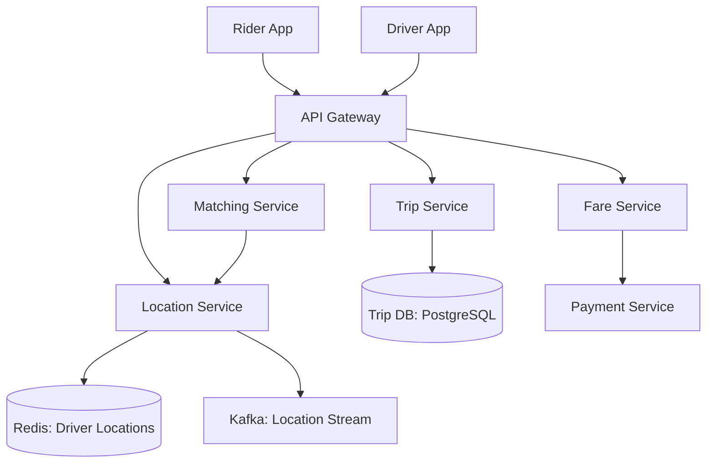
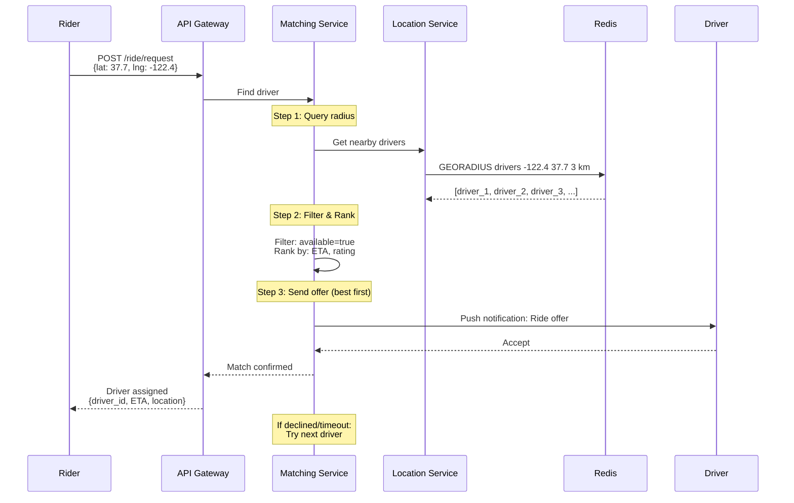
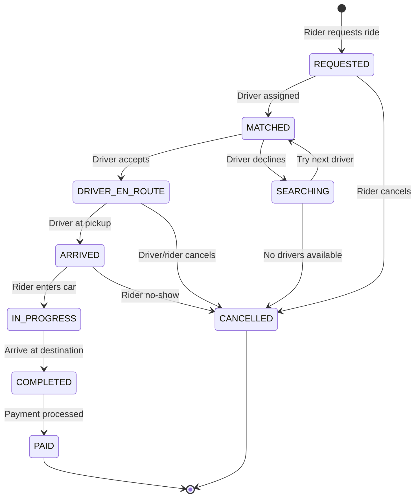
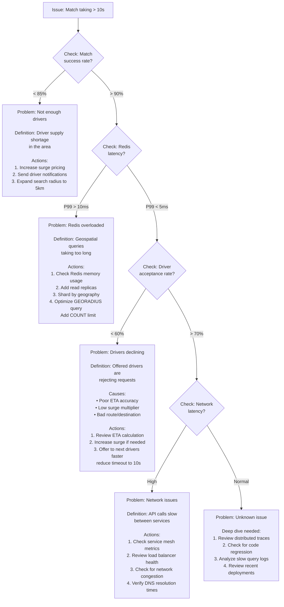

#system-design #case-study #advanced

# Design a Ride Sharing Service (Uber / Lyft)

## The Question

> "Design a ride-sharing service like Uber."

---

## Intuition (30 sec)

Think of it like a massive real-time GPS-based matchmaking system. Every driver is a moving dot on a map, constantly updating their position. When a rider requests a ride, the system instantly searches for nearby dots, ranks them, and connects the rider with the best match—all within seconds. It's like having 2 million chess pieces constantly moving on a board, and you need to pair them with requests in real-time.

---

## Key Definitions & Glossary

**Geospatial Indexing:**
- **Definition:** A data structure technique that organizes location data (latitude/longitude) to enable efficient spatial queries like "find all points within X radius"
- **Purpose:** Makes location-based queries fast—without it, finding nearby drivers would require scanning millions of coordinates
- **How it works:** Divides Earth into grid cells or hierarchical regions; nearby locations share common prefixes or tree paths

**ETA (Estimated Time of Arrival):**
- **Definition:** Predicted time until a driver reaches the pickup location, calculated using distance, real-time traffic, and road networks
- **Purpose:** Sets rider expectations and helps rank drivers for optimal matching
- **Calculation methods:** Simple (distance ÷ speed), intermediate (road network + traffic), advanced (pre-computed grid + A* algorithm)

**Dynamic Pricing (Surge Pricing):**
- **Definition:** Real-time fare adjustment algorithm that increases prices when rider demand exceeds driver supply in a geographic area
- **Purpose:** Balances supply and demand by incentivizing more drivers to high-demand areas
- **Formula:** `base_fare × surge_multiplier` (where surge_multiplier ranges from 1.0x to 5.0x)

**GEORADIUS:**
- **Definition:** Redis command that returns all geospatial items within a specified radius of a given coordinate
- **Syntax:** `GEORADIUS key longitude latitude radius unit`
- **Purpose:** Core command for finding nearby drivers efficiently

**Geohash:**
- **Definition:** Geocoding system that encodes latitude/longitude into a short alphanumeric string where nearby locations share common prefixes
- **Example:** "9q8yyk8" (San Francisco), "9q8yyk" (larger SF area)
- **Purpose:** Enables fast proximity searches by string prefix matching

---

## Step 1: Requirements

**Functional:** Rider requests a ride, system matches with nearby driver, real-time location tracking, ETA calculation, trip lifecycle, fare calculation, payment
**Non-Functional:** Matching within 10 seconds, location updates every 3 seconds, high availability, consistency for payments

---

## Step 2: Estimation

### Basic Calculations

| Metric | Value |
|--------|-------|
| Rides/day | 10M |
| Active drivers | 2M |
| Location updates/sec | 2M drivers × every 3s ≈ **666K/sec** |
| Match requests/sec | 10M / 86400 ≈ **~115/sec** |

Key insight: Location updates are the heaviest load — 666K writes/sec of geospatial data.

### Uber-Scale Capacity Planning

**Real Uber Scale (Public Data):**
- **Daily Rides:** 23+ million (2023 data)
- **Active Drivers:** 6+ million globally
- **Markets:** 10,000+ cities in 70+ countries

**Capacity Calculation:**

```
Given:
• Rides/day: 23M
• Active drivers (peak hour): 1.5M concurrent
• Location update frequency: 3 seconds
• Average trip duration: 20 minutes
• Peak hour = 5% of daily rides

Step 1: Peak QPS Calculations
─────────────────────────────
Peak rides/hour = 23M × 0.05 = 1.15M rides
Peak ride requests/sec = 1.15M ÷ 3600 = 319 QPS

Location updates/sec = 1.5M ÷ 3 = 500K writes/sec
  Definition: Each driver sends GPS coordinates every 3 sec

Match queries/sec = 319 QPS
  Definition: Find nearby drivers for each ride request

Step 2: Redis Capacity (Location Service)
──────────────────────────────────────────
Write load: 500K writes/sec
Read load (matching): 319 × 50 = 15,950 reads/sec
  Assumption: Query 50 drivers per match request

Single Redis instance capacity: ~100K ops/sec
Required Redis shards = (500K + 16K) ÷ 100K = 6 shards minimum
Production deployment: 12 shards (2x redundancy)

Sharding strategy: Geographic regions
  • North America: 4 shards
  • Europe: 3 shards
  • Asia: 5 shards

Step 3: Database Sizing (Trip Service)
───────────────────────────────────────
Write operations:
  • Trip creation: 319/sec
  • Status updates: 319 × 8 states = 2,552/sec
    Definition: Each trip goes through 8 state transitions
  • Total writes: ~3K/sec

PostgreSQL capacity (single instance): ~10K writes/sec
Deployment: Primary + 2 read replicas per region

Storage calculation:
  • Trips/day: 23M
  • Trip record size: ~2KB (includes route, fare, metadata)
  • Daily storage: 23M × 2KB = 46GB/day
  • Yearly storage: 46GB × 365 = 16.8TB/year
  • With retention (3 years): 50TB minimum

Step 4: Network Bandwidth
──────────────────────────
Location update payload: ~200 bytes (driver_id, lat, lng, timestamp, heading)
Outbound bandwidth: 500K/sec × 200 bytes = 100MB/sec = 800 Mbps

Per region (assuming 10 regions): 80 Mbps per region
Add 50% overhead: 120 Mbps per region

Step 5: Server Count Estimate
──────────────────────────────
Location Service:
  • CPU-bound (geospatial calculations)
  • Each server handles 10K location updates/sec
  • Required: 500K ÷ 10K = 50 servers
  • With redundancy (3x): 150 servers globally

Matching Service:
  • I/O-bound (Redis queries)
  • Each server handles 100 match requests/sec
  • Required: 319 ÷ 100 = 4 servers
  • With redundancy (3x): 12 servers

Trip Service:
  • Database-bound
  • Scales with DB capacity
  • 20-30 application servers per region
```

**Cost Implications:**
- Redis clusters: ~$50K/month (managed service)
- PostgreSQL databases: ~$30K/month
- Application servers: ~$80K/month (300+ instances)
- Network/bandwidth: ~$40K/month
- **Total infrastructure: ~$200K/month** (single region, simplified)

---

## Step 3: High-Level Design

### System Architecture Overview



**Component Definitions:**
- **API Gateway:** Entry point that handles authentication, rate limiting, and routes requests to appropriate services
- **Location Service:** Manages real-time driver positions; handles 666K GPS updates/sec
- **Matching Service:** Core algorithm that pairs riders with optimal drivers within 3km radius
- **Trip Service:** Manages trip lifecycle state machine (8 states from request to payment)
- **Redis Geospatial:** In-memory data store optimized for latitude/longitude queries
- **Kafka:** Distributed event stream for location history, analytics, and audit logs

### Matching Flow (Detailed Visual)



**Flow Steps Defined:**
1. **Radius Query:** GEORADIUS returns all drivers within 3km (configurable)
2. **Filtering:** Remove unavailable, wrong vehicle type, low-rated drivers
3. **Ranking:** Sort by ETA (closest), then rating
4. **Offer Loop:** Send to best driver; if declined/timeout (15s), try next
5. **Confirmation:** Lock driver status, create trip record

### State Machine: Trip Lifecycle



**State Definitions:**
- **REQUESTED:** Initial state; rider submitted pickup location and destination
- **SEARCHING:** Actively querying for drivers (fallback when first match declines)
- **MATCHED:** Driver assigned but hasn't started moving to pickup yet
- **DRIVER_EN_ROUTE:** Driver confirmed and traveling to pickup location
- **ARRIVED:** Driver at pickup location, waiting for rider
- **IN_PROGRESS:** Rider in car, trip active, destination locked
- **COMPLETED:** Arrived at destination, calculating fare
- **PAID:** Payment processed successfully, trip closed
- **CANCELLED:** Trip terminated before completion (can happen from multiple states)

---

## Step 4: Deep Dive

### Geospatial Indexing (Core Challenge)

**"Find all available drivers within 3km of the rider."**

#### Approach 1: GeoHash (String-Based Spatial Index)

**Definition:** Geohash is a geocoding system that encodes 2D coordinates (lat/lng) into a 1D string where spatial proximity correlates with string similarity.

**How it works:**
1. Divide Earth into a grid (like dividing a chessboard)
2. Each grid cell gets an alphanumeric string
3. Finer subdivisions get longer strings
4. Nearby locations share string prefixes

**Visual Example:**
```
World divided into cells:

   ┌─────┬─────┬─────┬─────┐
   │ "9p" │ "9q" │ "9r" │ "9s" │  ← 2-char precision (~160km)
   ├─────┼─────┼─────┼─────┤
   │     │     │     │     │
   └─────┴─────┴─────┴─────┘

Zooming into "9q" cell:

   ┌──────┬──────┬──────┬──────┐
   │"9q8x"│"9q8y"│"9q8z"│"9q90"│  ← 4-char precision (~20km)
   ├──────┼──────┼──────┼──────┤
   │      │"9q8y"│      │      │
   └──────┴──────┴──────┴──────┘

Zooming into "9q8y" cell:

   ┌───────┬───────┐
   │"9q8yy"│"9q8yz"│  ← 5-char precision (~5km)
   ├───────┼───────┤  San Francisco area
   │"9q8yw"│"9q8yx"│
   └───────┴───────┘

Final precision "9q8yyk8" → ~20 meters
```

**Query Algorithm:**
```python
# Find drivers within 3km of rider at geohash "9q8yyk"

# Step 1: Get adjacent cells (9 cells total)
target_hash = "9q8yyk"
adjacent = get_neighbors(target_hash)
# Returns: ["9q8yyk", "9q8yyh", "9q8yy7", "9q8yym", ...]

# Step 2: Query all drivers in these cells
candidates = []
for cell in adjacent:
    candidates += redis.get_drivers_in_geohash(cell)

# Step 3: Calculate exact distance for each candidate
nearby_drivers = [d for d in candidates if distance(d, rider) <= 3km]
```

**Pros:**
- Fast prefix searches in databases
- Simple to implement
- Works with standard string indexes

**Cons:**
- Edge cases: nearby locations may have different prefixes (cell boundaries)
- Need to query adjacent cells for accurate radius search
- Precision-accuracy tradeoff (longer strings = more storage)

#### Approach 2: QuadTree (Hierarchical Space Partitioning)

**Definition:** A tree data structure where each node represents a bounding box that recursively subdivides into 4 equal quadrants until reaching a maximum density.

**How it works:**
```
Level 0 (Root): Entire world
         ┌─────────────────┐
         │                 │
         │   World Box     │
         │   1000 drivers  │
         └─────────────────┘
                 │
         Split into 4 quadrants
                 │
         ┌───────┴───────┐
         ▼               ▼
Level 1:
    ┌────────┐      ┌────────┐
    │   NW   │      │   NE   │
    │250 drv │      │250 drv │
    └────────┘      └────────┘
    ┌────────┐      ┌────────┐
    │   SW   │      │   SE   │
    │250 drv │      │250 drv │
    └────────┘      └────────┘

Level 2 (zoom into NW):
    ┌───┬───┐
    │NW │NE │  Each subdivided again
    ├───┼───┤  Stop when node has <50 drivers
    │SW │SE │  or max depth reached
    └───┴───┘

Leaf nodes contain actual driver list:
Leaf: {bounds: [lat_min, lat_max, lng_min, lng_max],
       drivers: [driver_1, driver_2, ...]}
```

**Query Algorithm:**
```python
def find_drivers_in_radius(quadtree, center, radius):
    results = []
    queue = [quadtree.root]

    while queue:
        node = queue.pop()

        # Check if node's bounding box intersects search circle
        if not node.bounds.intersects_circle(center, radius):
            continue  # Skip this branch

        if node.is_leaf():
            # Calculate exact distance for drivers in leaf
            for driver in node.drivers:
                if distance(driver, center) <= radius:
                    results.append(driver)
        else:
            # Traverse children
            queue.extend(node.children)

    return results
```

**Pros:**
- Efficient pruning (skip entire regions)
- Exact distance calculations only for nearby candidates
- Dynamic (adapts to driver density)

**Cons:**
- Complex to implement and maintain
- Rebalancing cost when drivers move
- Memory overhead for tree structure

#### Approach 3: Redis Geospatial (Production Choice)

**Definition:** Redis provides built-in geospatial indexing using a sorted set with Geohash internally.

**Why Redis?**
- **In-memory speed:** Sub-millisecond queries
- **Built-in commands:** No need to implement algorithms
- **Atomic updates:** Location updates are thread-safe
- **Persistence optional:** Can enable RDB/AOF for durability

**Redis Geospatial Commands:**

```bash
# 1. GEOADD - Add or update driver location
GEOADD drivers -122.4194 37.7749 "driver_123"
#      ^^^^^^^ ^^^^^^^^^ ^^^^^^^ ^^^^^^^^^^^^^
#      key     longitude latitude member_id
#
# Definition: Adds a geospatial item with coordinates to a sorted set
# Returns: Number of new elements added (0 if updating existing)

# Example: Batch update (500K drivers)
GEOADD drivers \
  -122.4194 37.7749 "driver_123" \
  -122.4250 37.7850 "driver_456" \
  -122.4100 37.7650 "driver_789"

# 2. GEORADIUS - Find all drivers within radius
GEORADIUS drivers -122.4194 37.7749 3 km WITHDIST WITHCOORD ASC COUNT 50
#         ^^^^^^^ ^^^^^^^^^ ^^^^^^^ ^^^^
#         key     longitude latitude radius + unit
#
# Options:
# WITHDIST   - Include distance from center
# WITHCOORD  - Include lat/lng coordinates
# ASC        - Sort by distance (ascending)
# COUNT 50   - Limit to 50 nearest

# Returns:
# 1) "driver_123"
#    1) "0.0532"          ← distance in km
#    2) 1) "-122.4194"    ← longitude
#       2) "37.7749"      ← latitude
# 2) "driver_456"
#    1) "0.8921"
#    2) 1) "-122.4250"
#       2) "37.7850"

# 3. GEORADIUSBYMEMBER - Find drivers near another driver
GEORADIUSBYMEMBER drivers "driver_123" 5 km
# Definition: Like GEORADIUS but center is an existing member

# 4. GEODIST - Distance between two points
GEODIST drivers "driver_123" "driver_456" km
# Returns: "0.8921"

# 5. GEOPOS - Get coordinates of a driver
GEOPOS drivers "driver_123"
# Returns: 1) 1) "-122.4194"
#             2) "37.7749"

# 6. GEOHASH - Get geohash string
GEOHASH drivers "driver_123"
# Returns: 1) "9q8yyk8"

# 7. GEOSEARCH (Redis 6.2+) - More flexible search
GEOSEARCH drivers FROMLONLAT -122.4194 37.7749 BYRADIUS 3 km WITHDIST
# Replaces GEORADIUS with more options
```

**Implementation Pattern:**

```python
# Python example using redis-py
import redis
from datetime import datetime

r = redis.Redis(host='localhost', port=6379, decode_responses=True)

# Driver location update (called every 3 seconds)
def update_driver_location(driver_id, lat, lng):
    """
    Update driver position in Redis.
    Definition: Atomic operation that overwrites previous location.
    """
    r.geoadd('drivers', lng, lat, driver_id)
    # Also mark timestamp and availability
    r.hset(f'driver:{driver_id}', mapping={
        'last_update': datetime.utcnow().isoformat(),
        'available': 'true',
        'vehicle_type': 'sedan'
    })

# Find nearby drivers for matching
def find_nearby_drivers(lat, lng, radius_km=3, limit=50):
    """
    Query Redis for drivers within radius.
    Returns list of tuples: (driver_id, distance_km, coordinates)
    """
    results = r.georadius(
        'drivers',
        lng, lat,
        radius_km, unit='km',
        withdist=True,
        withcoord=True,
        sort='ASC',
        count=limit
    )

    # Filter by availability
    available_drivers = []
    for driver_id, distance, coords in results:
        driver_info = r.hgetall(f'driver:{driver_id}')
        if driver_info.get('available') == 'true':
            available_drivers.append({
                'driver_id': driver_id,
                'distance_km': float(distance),
                'lat': coords[1],
                'lng': coords[0],
                'vehicle_type': driver_info.get('vehicle_type')
            })

    return available_drivers

# Example usage
nearby = find_nearby_drivers(37.7749, -122.4194, radius_km=3)
# Returns: [
#   {'driver_id': 'driver_123', 'distance_km': 0.5, ...},
#   {'driver_id': 'driver_456', 'distance_km': 1.2, ...}
# ]
```

**Performance Characteristics:**

```
Operation          | Time Complexity | Actual Latency
──────────────────────────────────────────────────────
GEOADD (single)    | O(log N)        | ~0.1ms
GEOADD (batch)     | O(M log N)      | ~1ms (100 items)
GEORADIUS          | O(N + log N)    | ~2ms (N = results)
GEOPOS             | O(1)            | ~0.05ms
GEODIST            | O(1)            | ~0.05ms

Where:
• N = total drivers in set (e.g., 2M)
• M = number of items in batch operation
```

**Scaling Redis Geospatial:**

```
Problem: 2M active drivers = 2M entries in sorted set
         Redis single instance limit: ~10M keys comfortable

Solution: Shard by geography

Shard 1: North America     Shard 4: South America
   drivers:na                 drivers:sa
   500K drivers               200K drivers

Shard 2: Europe            Shard 5: Africa
   drivers:eu                 drivers:af
   400K drivers               100K drivers

Shard 3: Asia              Shard 6: Oceania
   drivers:asia               drivers:oce
   700K drivers               100K drivers

Query routing:
1. Determine rider's region from coordinates
2. Query appropriate Redis shard
3. For edge cases (near borders), query multiple shards
```

**Comparison Table:**

| Feature | GeoHash | QuadTree | Redis Geo |
|---------|---------|----------|-----------|
| **Implementation** | Medium | Complex | Simple (built-in) |
| **Query Speed** | Fast (O(log N)) | Very fast (O(log N + M)) | Very fast (O(N + log N)) |
| **Update Speed** | Very fast (O(1)) | Slow (rebalancing) | Very fast (O(log N)) |
| **Memory** | Low | High (tree overhead) | Medium |
| **Accuracy** | Approximate (need adjacent cells) | Exact | Exact |
| **Best For** | Static data, databases | High-read scenarios | Real-time updates |
| **Uber's Choice** | No | No (legacy) | **Yes (primary)** |

### Driver Location Updates (666K/sec)

Every 3 seconds, every active driver sends GPS coordinates:
```
Driver App → Location Service → Redis GEOADD → Kafka (for analytics/history)
```

Redis handles the real-time geospatial queries. Kafka stores location history for analytics, fare dispute resolution, route optimization.

### Matching Algorithm

1. Rider requests ride at location (lat, lng)
2. Find drivers within 3km radius (GEORADIUS)
3. Filter: available, correct vehicle type, rating threshold
4. Rank by: distance, ETA, driver rating
5. Send request to best driver
6. Driver accepts → match confirmed. Declines → try next driver. Timeout (15s) → next driver.

### Trip Lifecycle

```
REQUESTED → MATCHED → DRIVER_EN_ROUTE → ARRIVED → IN_PROGRESS → COMPLETED → PAID
```

Each state transition is an event stored in the trip record. Enables auditing and dispute resolution.

### ETA Calculation (Estimated Time of Arrival)

**Definition:** Predicted time (in minutes) for a driver to reach the pickup location, considering distance, road network, traffic, and real-world constraints.

**Why it matters:** ETA is used for:
1. Ranking drivers (prefer shorter ETA)
2. Setting rider expectations ("Driver arrives in 5 min")
3. Detecting anomalies (driver not moving)

#### Approach 1: Simple Distance-Based

**Formula:**
```
ETA = (straight_line_distance / average_speed) × correction_factor

Where:
• straight_line_distance = haversine(driver_lat_lng, rider_lat_lng)
• average_speed = 30 km/h (city driving)
• correction_factor = 1.4 (roads aren't straight lines)
```

**Haversine Formula** (calculate distance between two lat/lng points):
```python
from math import radians, sin, cos, sqrt, atan2

def haversine(lat1, lng1, lat2, lng2):
    """
    Calculate great-circle distance between two points on Earth.
    Returns distance in kilometers.
    """
    R = 6371  # Earth radius in km

    lat1, lng1, lat2, lng2 = map(radians, [lat1, lng1, lat2, lng2])

    dlat = lat2 - lat1
    dlng = lng2 - lng1

    a = sin(dlat/2)**2 + cos(lat1) * cos(lat2) * sin(dlng/2)**2
    c = 2 * atan2(sqrt(a), sqrt(1-a))

    return R * c

# Example
distance_km = haversine(37.7749, -122.4194, 37.7849, -122.4094)
# = 1.2 km

eta_minutes = (distance_km / 30) * 60 * 1.4
# = (1.2 / 30) * 60 * 1.4 = 3.36 minutes
```

**Pros:** Very fast (microseconds), no external dependencies
**Cons:** Inaccurate (ignores roads, traffic, one-way streets, turns)

#### Approach 2: Road Network + Traffic (Production)

**Definition:** Use a graph where nodes are intersections and edges are road segments with dynamic weights (travel time considering traffic).

**Road Network Graph Structure:**
```
Node = {
    id: intersection_id,
    lat: 37.7749,
    lng: -122.4194
}

Edge = {
    from_node: node_1,
    to_node: node_2,
    distance_m: 500,
    base_speed_kmh: 50,
    current_speed_kmh: 30,  ← Updated from traffic data
    road_type: "arterial",
    one_way: true
}

Travel time for edge = distance_m / (current_speed_kmh / 3.6)
                     = 500 / (30 / 3.6) = 60 seconds
```

**Algorithm: A\* Search (Dijkstra with heuristic)**

```python
import heapq

def calculate_eta_with_roads(driver_lat, driver_lng, rider_lat, rider_lng, road_graph):
    """
    A* pathfinding on road network graph.

    Definitions:
    • g_score: Actual time from start to current node
    • h_score: Estimated time from current to goal (haversine heuristic)
    • f_score: g_score + h_score (priority)
    """
    start_node = road_graph.snap_to_nearest_node(driver_lat, driver_lng)
    goal_node = road_graph.snap_to_nearest_node(rider_lat, rider_lng)

    # Priority queue: (f_score, node_id)
    open_set = [(0, start_node)]
    came_from = {}
    g_score = {start_node: 0}

    while open_set:
        current_f, current = heapq.heappop(open_set)

        if current == goal_node:
            # Reconstruct path and return total time
            return g_score[current]

        for neighbor, edge in road_graph.get_neighbors(current):
            # Calculate travel time for this edge (considering traffic)
            edge_time_sec = edge.distance_m / (edge.current_speed_kmh / 3.6)

            tentative_g = g_score[current] + edge_time_sec

            if neighbor not in g_score or tentative_g < g_score[neighbor]:
                came_from[neighbor] = current
                g_score[neighbor] = tentative_g

                # Heuristic: straight-line distance to goal at max speed
                h = haversine_to_node(neighbor, goal_node) / 50  # Assume 50 km/h max

                f_score = tentative_g + h
                heapq.heappush(open_set, (f_score, neighbor))

    return float('inf')  # No path found

# Example
eta_seconds = calculate_eta_with_roads(37.7749, -122.4194, 37.7849, -122.4094, graph)
eta_minutes = eta_seconds / 60
# = 4.2 minutes (more accurate than simple method)
```

**Traffic Data Sources:**
```
Real-time traffic speed updates:
├── Google Maps Traffic API
├── Waze real-time data
├── Government traffic sensors
├── Uber's own fleet data (crowdsourced)
└── Historical patterns (time-of-day, day-of-week)

Update frequency: Every 2-5 minutes per road segment
Storage: Redis cache with TTL (time-to-live)

Example Redis structure:
SET road_segment:123:speed "25.5" EX 300
    ^^^^^^^^^^^^^^^^^^^^ ^^^^^^  ^^^^^^
    key (segment ID)     kmh     TTL=5min
```

#### Approach 3: Pre-computed Grid (Uber's Optimization)

**Definition:** Divide city into grid cells (e.g., 500m × 500m). Pre-compute average travel times between all cell pairs during different time periods.

**Grid Structure:**
```
City divided into 100 × 100 grid = 10,000 cells

Pre-computed matrix (stored in memory):
travel_time[from_cell][to_cell][time_period] = avg_seconds

Example:
travel_time[cell_A5][cell_B7][evening_rush] = 420 seconds

Dimensions:
• 10,000 × 10,000 = 100M cell pairs
• 4 time periods (morning, midday, evening, night)
• 4 bytes per value
• Total: 100M × 4 × 4 bytes = 1.6 GB per city

Acceptable memory cost for instant lookups!
```

**Query Process:**
```python
def calculate_eta_grid(driver_lat, driver_lng, rider_lat, rider_lng, grid_cache, current_hour):
    """
    Fast ETA using pre-computed grid.
    Falls back to A* for cache misses.
    """
    # Step 1: Map coordinates to grid cells
    driver_cell = lat_lng_to_grid_cell(driver_lat, driver_lng)
    rider_cell = lat_lng_to_grid_cell(rider_lat, rider_lng)

    # Step 2: Determine time period
    time_period = get_time_period(current_hour)
    # morning (6-10am), midday (10am-4pm), evening (4-8pm), night (8pm-6am)

    # Step 3: Lookup pre-computed time
    cache_key = f"{driver_cell}:{rider_cell}:{time_period}"
    eta_seconds = grid_cache.get(cache_key)

    if eta_seconds:
        # Cache hit - instant result
        return eta_seconds / 60  # Convert to minutes
    else:
        # Cache miss - fall back to A* calculation
        return calculate_eta_with_roads(driver_lat, driver_lng, rider_lat, rider_lng, road_graph)

def lat_lng_to_grid_cell(lat, lng):
    """
    Map coordinate to grid cell ID.
    Cell size: 500m × 500m
    """
    # San Francisco bounds example
    LAT_MIN, LAT_MAX = 37.7, 37.8
    LNG_MIN, LNG_MAX = -122.5, -122.4

    cell_lat = int((lat - LAT_MIN) / (LAT_MAX - LAT_MIN) * 100)
    cell_lng = int((lng - LNG_MIN) / (LNG_MAX - LNG_MIN) * 100)

    return f"{cell_lat}_{cell_lng}"  # e.g., "45_67"
```

**Pre-computation Job (Batch Process):**
```python
def precompute_travel_times(city_bounds, road_graph):
    """
    Offline job that runs daily to update travel time matrix.
    Uses historical trip data to calculate average times.
    """
    grid_cells = generate_grid(city_bounds, cell_size_m=500)

    for time_period in ['morning', 'midday', 'evening', 'night']:
        for from_cell in grid_cells:
            for to_cell in grid_cells:
                # Query historical trips from from_cell to to_cell during time_period
                trips = db.query(
                    "SELECT AVG(duration_sec) FROM trips "
                    "WHERE pickup_cell = ? AND dropoff_cell = ? "
                    "AND time_period = ? AND date > NOW() - INTERVAL 30 days",
                    from_cell, to_cell, time_period
                )

                avg_time = trips[0] if trips else None

                # If no historical data, calculate using A*
                if avg_time is None:
                    avg_time = calculate_eta_with_roads(
                        from_cell.center_lat, from_cell.center_lng,
                        to_cell.center_lat, to_cell.center_lng,
                        road_graph
                    )

                # Store in cache
                cache_key = f"{from_cell.id}:{to_cell.id}:{time_period}"
                redis.set(cache_key, avg_time, ex=86400)  # TTL = 24 hours

    print("Pre-computation complete")
```

**Performance Comparison:**

| Method | Latency | Accuracy | Use Case |
|--------|---------|----------|----------|
| **Simple Distance** | 0.1ms | 60% | Fallback, rough estimates |
| **A\* with Traffic** | 10-50ms | 85% | Precise routing, long trips |
| **Pre-computed Grid** | 0.5ms | 90% | Real-time matching (Uber's choice) |

**Why Pre-computed Grid Wins:**
1. **Speed:** Sub-millisecond lookups for 90% of queries
2. **Accuracy:** Based on real trip data, includes all real-world factors
3. **Scalability:** No expensive graph searches during matching
4. **Fallback:** A* for cache misses or new areas

**ETA in Matching Algorithm:**
```python
def rank_drivers(candidates, rider_location):
    """
    Rank drivers by ETA and rating.
    Definition: Lower ETA + higher rating = better match.
    """
    scored_drivers = []

    for driver in candidates:
        eta_min = calculate_eta_grid(
            driver['lat'], driver['lng'],
            rider_location['lat'], rider_location['lng'],
            grid_cache, datetime.now().hour
        )

        # Composite score: prioritize ETA, with rating as tiebreaker
        # Normalize ETA to 0-100 scale (0 = best)
        eta_score = min(eta_min / 20 * 100, 100)  # 20 min = worst (100)

        # Rating is 0-5 stars, convert to 0-100 scale (100 = best)
        rating_score = driver['rating'] * 20

        # Weight: 70% ETA, 30% rating
        composite_score = (eta_score * 0.7) + ((100 - rating_score) * 0.3)

        scored_drivers.append({
            'driver': driver,
            'eta_min': eta_min,
            'score': composite_score
        })

    # Sort by score (lower is better)
    scored_drivers.sort(key=lambda x: x['score'])

    return scored_drivers

# Example
candidates = [
    {'id': 'driver_1', 'lat': 37.775, 'lng': -122.42, 'rating': 4.8},
    {'id': 'driver_2', 'lat': 37.776, 'lng': -122.41, 'rating': 4.5},
]

ranked = rank_drivers(candidates, {'lat': 37.7749, 'lng': -122.4194})
# ranked[0] = driver with best composite score (ETA + rating)
```

### Fare Calculation & Dynamic Pricing

#### Base Fare Formula

**Definition:** Fare is the total price charged to the rider, calculated from distance, time, and market conditions.

```
total_fare = (base_fare + distance_fare + time_fare) × surge_multiplier + fees

Where:
• base_fare: Fixed amount for initiating trip ($2.50)
• distance_fare: distance_km × rate_per_km ($1.50/km)
• time_fare: duration_min × rate_per_min ($0.30/min)
• surge_multiplier: 1.0x to 5.0x (demand-based)
• fees: booking_fee + tolls + airport_fee
```

**Example Calculation:**
```
Trip details:
• Distance: 8.5 km
• Duration: 18 minutes
• Time: Friday 6pm (rush hour)
• Location: Downtown (high demand)

Calculation:
base_fare = $2.50
distance_fare = 8.5 × $1.50 = $12.75
time_fare = 18 × $0.30 = $5.40
subtotal = $2.50 + $12.75 + $5.40 = $20.65

Surge analysis:
• 50 ride requests in area
• 20 available drivers
• Demand/Supply ratio = 50/20 = 2.5
• Surge multiplier = 1.8x

total_before_fees = $20.65 × 1.8 = $37.17
booking_fee = $2.00
final_fare = $37.17 + $2.00 = $39.17
```

#### Dynamic Pricing (Surge Pricing)

**Definition:** Real-time fare adjustment algorithm that increases prices in areas/times when rider demand exceeds driver supply, incentivizing more drivers to that location.

**Why it exists:**
- **Problem:** Demand spikes (e.g., concert ends, airport rush) create shortages
- **Solution:** Higher prices attract more drivers to the area
- **Goal:** Balance market; reduce wait times

**Surge Calculation Algorithm:**

```python
def calculate_surge_multiplier(area_id, current_time):
    """
    Calculate surge multiplier for a geographic area.
    Returns value between 1.0x (no surge) and 5.0x (max surge).
    """
    # Step 1: Get recent ride requests (last 10 minutes)
    ride_requests = db.count(
        "SELECT COUNT(*) FROM ride_requests "
        "WHERE area_id = ? AND created_at > NOW() - INTERVAL 10 MINUTE",
        area_id
    )

    # Step 2: Get available drivers in area (3km radius)
    available_drivers = redis.count(
        f"drivers:available:{area_id}"
    )

    # Step 3: Calculate demand-to-supply ratio
    if available_drivers == 0:
        ratio = float('inf')
    else:
        ratio = ride_requests / available_drivers

    # Step 4: Map ratio to surge multiplier
    """
    Ratio    Surge Multiplier    Meaning
    ─────────────────────────────────────
    < 1.0    1.0x                Plenty of drivers
    1.0-1.5  1.0x                Balanced
    1.5-2.0  1.2x                Slight demand
    2.0-2.5  1.5x                Moderate demand
    2.5-3.0  2.0x                High demand
    3.0-4.0  2.5x                Very high demand
    > 4.0    Up to 5.0x          Extreme demand (capped)
    """
    if ratio < 1.5:
        multiplier = 1.0
    elif ratio < 2.0:
        multiplier = 1.2
    elif ratio < 2.5:
        multiplier = 1.5
    elif ratio < 3.0:
        multiplier = 2.0
    elif ratio < 4.0:
        multiplier = 2.5
    else:
        multiplier = min(ratio * 0.8, 5.0)  # Cap at 5.0x

    # Step 5: Smooth surge changes (avoid sudden jumps)
    previous_surge = redis.get(f"surge:{area_id}")
    if previous_surge:
        # Limit change to ±0.3x per update cycle
        max_change = 0.3
        multiplier = max(previous_surge - max_change,
                        min(previous_surge + max_change, multiplier))

    # Step 6: Cache result (TTL 2 minutes)
    redis.setex(f"surge:{area_id}", 120, multiplier)

    return round(multiplier, 1)

# Example
surge = calculate_surge_multiplier("sf_downtown", datetime.now())
# Returns: 1.8
```

**Surge Heat Map (Visual Representation):**

```
Real-time surge map of San Francisco:

        1.0x    1.0x    1.2x    1.5x
      ┌─────┬─────┬─────┬─────┐
      │     │     │     │     │
1.0x  │     │     │     │▓▓▓▓ │ 2.0x  ← Downtown (high demand)
      │     │     │     │▓▓▓▓ │
      ├─────┼─────┼─────┼─────┤
      │     │     │     │     │
1.0x  │     │▓    │▓▓   │▓▓▓  │ 1.8x  ← Mission District
      │     │     │     │     │
      ├─────┼─────┼─────┼─────┤
      │     │     │     │     │
1.2x  │     │     │     │     │ 1.0x
      │     │     │     │     │
      └─────┴─────┴─────┴─────┘

Legend:
 ▓▓▓▓  = 2.0x+ surge (red in app)
 ▓▓    = 1.5x-2.0x (orange)
 ▓     = 1.2x-1.5x (yellow)
 (blank) = 1.0x (no surge)

Updated every 2 minutes
```

**Area Sharding:**
```
City divided into surge areas (similar to grid cells):

San Francisco = 50 surge areas
New York City = 200 surge areas
Each area = ~2km² coverage

Structure:
area = {
    id: "sf_downtown",
    bounds: {
        lat_min: 37.78,
        lat_max: 37.80,
        lng_min: -122.42,
        lng_max: -122.40
    },
    current_surge: 1.8,
    ride_requests_10min: 50,
    available_drivers: 20
}

Stored in Redis:
HSET surge:sf_downtown \
    multiplier 1.8 \
    requests 50 \
    drivers 20 \
    updated_at "2026-02-15T18:30:00Z"
```

#### Fare Estimation (Before Trip)

**Challenge:** Show rider estimated fare before they confirm booking.

```python
def estimate_fare(pickup_lat, pickup_lng, dropoff_lat, dropoff_lng):
    """
    Estimate fare before trip is confirmed.
    Must be accurate within ±10% to avoid disputes.
    """
    # Step 1: Calculate route using road network
    route = calculate_route(pickup_lat, pickup_lng, dropoff_lat, dropoff_lng)
    distance_km = route.distance
    duration_min = route.duration / 60

    # Step 2: Determine surge area and get multiplier
    surge_area = lat_lng_to_surge_area(pickup_lat, pickup_lng)
    surge = calculate_surge_multiplier(surge_area, datetime.now())

    # Step 3: Apply fare formula
    base_fare = 2.50
    distance_fare = distance_km * 1.50
    time_fare = duration_min * 0.30
    subtotal = (base_fare + distance_fare + time_fare) * surge

    # Step 4: Add fees
    booking_fee = 2.00
    total = subtotal + booking_fee

    # Step 5: Return range (account for traffic variability)
    return {
        'estimated_fare': round(total, 2),
        'fare_range': {
            'min': round(total * 0.9, 2),  # -10%
            'max': round(total * 1.1, 2)   # +10%
        },
        'breakdown': {
            'base_fare': base_fare,
            'distance_fare': round(distance_fare, 2),
            'time_fare': round(time_fare, 2),
            'surge_multiplier': surge,
            'booking_fee': booking_fee
        },
        'distance_km': round(distance_km, 1),
        'duration_min': round(duration_min, 0)
    }

# Example response shown to rider
{
    'estimated_fare': 39.17,
    'fare_range': {'min': 35.25, 'max': 43.09},
    'breakdown': {
        'base_fare': 2.50,
        'distance_fare': 12.75,
        'time_fare': 5.40,
        'surge_multiplier': 1.8,
        'booking_fee': 2.00
    },
    'distance_km': 8.5,
    'duration_min': 18
}
```

**Actual Fare (After Trip):**
```python
def calculate_final_fare(trip_id):
    """
    Calculate actual fare after trip completes.
    Uses actual distance/time traveled (from GPS tracking).
    """
    trip = db.get_trip(trip_id)

    # Use actual trip metrics
    actual_distance_km = trip.gps_distance
    actual_duration_min = (trip.ended_at - trip.started_at).seconds / 60

    # Use surge at time of request (not current surge)
    surge = trip.surge_multiplier_at_request

    base_fare = 2.50
    distance_fare = actual_distance_km * 1.50
    time_fare = actual_duration_min * 0.30
    subtotal = (base_fare + distance_fare + time_fare) * surge

    booking_fee = 2.00
    tolls = calculate_tolls(trip.route)  # From route data
    total = subtotal + booking_fee + tolls

    # Compare to estimate
    estimated = trip.estimated_fare
    diff_percent = abs(total - estimated) / estimated * 100

    if diff_percent > 20:
        # Large discrepancy - flag for review
        log_fare_discrepancy(trip_id, estimated, total)

    return round(total, 2)
```

**Pricing Strategy Comparison:**

| Strategy | Uber | Lyft | Traditional Taxi |
|----------|------|------|------------------|
| **Base Model** | Time + Distance | Time + Distance | Distance only (meter) |
| **Dynamic Pricing** | Yes (surge) | Yes (prime time) | No (fixed rates) |
| **Surge Cap** | 5.0x typical | 3.0x typical | N/A |
| **Transparency** | Full breakdown shown | Full breakdown shown | Meter (opaque) |
| **Estimate Accuracy** | ±10% | ±10% | Poor (no estimate) |
| **Payment** | Automatic (credit card) | Automatic | Cash/Card at end |

---

## Monitoring & Observability

### Key Metrics Dashboard

```
┌────────────────────────────────────────────────────────────┐
│  UBER METRICS DASHBOARD - PRODUCTION                       │
├────────────────────────────────────────────────────────────┤
│                                                            │
│ ┌─ MATCHING PERFORMANCE ─────────────────────────────┐    │
│ │                                                     │    │
│ │ Match Success Rate: 94.2%                          │    │
│ │ Definition: % of requests matched with a driver    │    │
│ │ Target: > 90%                                      │    │
│ │ Alert: < 85% (capacity issue)                      │    │
│ │                                                     │    │
│ │ Match Latency (P95): 2.8s                          │    │
│ │ Definition: Time from request to driver assigned   │    │
│ │ Target: < 5s                                       │    │
│ │ Alert: > 10s (geospatial query degraded)           │    │
│ │                                                     │    │
│ │ Driver Acceptance Rate: 78%                        │    │
│ │ Definition: % of drivers who accept first offer    │    │
│ │ Target: > 70%                                      │    │
│ │ Low rate indicates: poor ETA accuracy or pricing   │    │
│ └─────────────────────────────────────────────────────┘    │
│                                                            │
│ ┌─ LOCATION SERVICE ──────────────────────────────────┐    │
│ │                                                     │    │
│ │ GPS Updates/sec: 487,231                           │    │
│ │ Definition: Incoming location updates from drivers │    │
│ │ Expected: ~500K (1.5M drivers ÷ 3s)                │    │
│ │ Alert: Drop > 20% (client issue or outage)         │    │
│ │                                                     │    │
│ │ Redis Write Latency (P99): 1.2ms                   │    │
│ │ Definition: Time to execute GEOADD command         │    │
│ │ Target: < 5ms                                      │    │
│ │ Alert: > 10ms (Redis overload, need sharding)      │    │
│ │                                                     │    │
│ │ Redis Memory Usage: 14.2 GB / 32 GB (44%)          │    │
│ │ Alert: > 80% (plan capacity increase)              │    │
│ └─────────────────────────────────────────────────────┘    │
│                                                            │
│ ┌─ TRIP SERVICE ──────────────────────────────────────┐    │
│ │                                                     │    │
│ │ Active Trips: 425,183                              │    │
│ │ Definition: Trips in IN_PROGRESS state             │    │
│ │ Tracks: Current load on system                     │    │
│ │                                                     │    │
│ │ Trip Completion Rate: 96.8%                        │    │
│ │ Definition: % trips that reach COMPLETED state     │    │
│ │ Target: > 95%                                      │    │
│ │ Failed trips: cancellations, disputes, no-shows    │    │
│ │                                                     │    │
│ │ Average Trip Duration: 18.4 min                    │    │
│ │ Tracks: Normal behavior (spikes = traffic/events)  │    │
│ └─────────────────────────────────────────────────────┘    │
│                                                            │
│ ┌─ PAYMENT PROCESSING ────────────────────────────────┐    │
│ │                                                     │    │
│ │ Payment Success Rate: 97.3%                        │    │
│ │ Definition: % of payment attempts that succeed     │    │
│ │ Target: > 95%                                      │    │
│ │ Failures: expired cards, fraud detection, limits   │    │
│ │                                                     │    │
│ │ Payment Latency (P95): 1.8s                        │    │
│ │ Definition: Time to charge card via gateway        │    │
│ │ Target: < 3s                                       │    │
│ │ Alert: > 5s (gateway degraded)                     │    │
│ └─────────────────────────────────────────────────────┘    │
│                                                            │
│ ┌─ INFRASTRUCTURE ────────────────────────────────────┐    │
│ │                                                     │    │
│ │ API Gateway QPS: 1,247,903                         │    │
│ │ Breakdown:                                         │    │
│ │   • Location updates: 487K/s (39%)                 │    │
│ │   • Trip status queries: 650K/s (52%)              │    │
│ │   • Match requests: 319/s (0.03%)                  │    │
│ │   • Other: 110K/s (9%)                             │    │
│ │                                                     │    │
│ │ Error Rate: 0.18%                                  │    │
│ │ Definition: 5xx responses / total requests         │    │
│ │ Target: < 0.5%                                     │    │
│ │ Alert: > 1% (service degradation)                  │    │
│ └─────────────────────────────────────────────────────┘    │
└────────────────────────────────────────────────────────────┘
```

### Alerting Rules

```yaml
# Prometheus alerting rules (example)

groups:
  - name: matching_alerts
    rules:
      - alert: LowMatchSuccessRate
        expr: match_success_rate < 0.85
        for: 5m
        labels:
          severity: critical
          team: matching
        annotations:
          summary: "Match success rate below 85%"
          description: "Only {{ $value }}% of requests are being matched. Check driver availability."

      - alert: HighMatchLatency
        expr: match_latency_p95 > 10
        for: 3m
        labels:
          severity: warning
          team: matching
        annotations:
          summary: "Match latency P95 > 10s"
          description: "Geospatial queries may be slow. Check Redis performance."

  - name: location_alerts
    rules:
      - alert: GPSUpdateDrop
        expr: rate(gps_updates[5m]) < 400000
        for: 2m
        labels:
          severity: critical
          team: location
        annotations:
          summary: "GPS update rate dropped below 400K/sec"
          description: "Expected ~500K/s. Check mobile app issues or network problems."

      - alert: RedisHighLatency
        expr: redis_write_latency_p99 > 10
        for: 5m
        labels:
          severity: warning
          team: location
        annotations:
          summary: "Redis write latency P99 > 10ms"
          description: "Redis may be overloaded. Consider adding shards."

  - name: payment_alerts
    rules:
      - alert: HighPaymentFailureRate
        expr: payment_failure_rate > 0.05
        for: 10m
        labels:
          severity: critical
          team: payments
        annotations:
          summary: "Payment failure rate > 5%"
          description: "Unusually high payment failures. Check payment gateway or fraud detection."
```

### Logging Strategy

```python
# Structured logging example

import logging
import json
from datetime import datetime

class RideLogger:
    """
    Centralized logging for ride-sharing system.
    All logs are JSON-formatted for parsing by ELK stack.
    """

    @staticmethod
    def log_match_request(rider_id, lat, lng, metadata):
        log_entry = {
            'timestamp': datetime.utcnow().isoformat(),
            'service': 'matching',
            'event': 'match_request',
            'rider_id': rider_id,
            'location': {'lat': lat, 'lng': lng},
            'metadata': metadata,
            'trace_id': generate_trace_id()  # For distributed tracing
        }
        logging.info(json.dumps(log_entry))

    @staticmethod
    def log_match_success(rider_id, driver_id, match_latency_ms):
        log_entry = {
            'timestamp': datetime.utcnow().isoformat(),
            'service': 'matching',
            'event': 'match_success',
            'rider_id': rider_id,
            'driver_id': driver_id,
            'latency_ms': match_latency_ms,
            'trace_id': generate_trace_id()
        }
        logging.info(json.dumps(log_entry))

    @staticmethod
    def log_redis_operation(operation, key, latency_ms, success):
        log_entry = {
            'timestamp': datetime.utcnow().isoformat(),
            'service': 'location',
            'event': 'redis_operation',
            'operation': operation,  # GEOADD, GEORADIUS, etc.
            'key': key,
            'latency_ms': latency_ms,
            'success': success,
            'trace_id': generate_trace_id()
        }
        logging.info(json.dumps(log_entry))

# Log aggregation in ELK (Elasticsearch, Logstash, Kibana):
# - All logs sent to Kafka topic
# - Logstash consumes, parses, indexes in Elasticsearch
# - Kibana dashboards for visualization
# - Queries like: "Show all match_requests with latency > 10s in SF region"
```

---

## Troubleshooting Guide

### Decision Tree: Slow Matching



### Common Issues & Solutions

#### Issue 1: GPS Update Storm

**Symptom:** Redis write latency spikes, location service dropping updates

**Root Cause:** Too many location updates hitting Redis simultaneously (e.g., after network recovery)

**Investigation:**
```bash
# Check current GPS update rate
redis-cli INFO stats | grep instantaneous_ops_per_sec
# Expected: ~500K ops/sec
# Issue: > 1M ops/sec

# Check command latency
redis-cli --latency-history -i 1
# Look for spikes > 10ms

# Check connection count
redis-cli CLIENT LIST | wc -l
# Issue: > 10,000 connections (too many)
```

**Solution:**
```python
# Client-side rate limiting (exponential backoff)
class LocationUpdateClient:
    def __init__(self):
        self.last_update = None
        self.backoff_sec = 3  # Normal update interval

    def send_location(self, driver_id, lat, lng):
        now = time.time()

        # Enforce minimum interval
        if self.last_update and (now - self.last_update) < self.backoff_sec:
            return  # Skip update

        try:
            redis.geoadd('drivers', lng, lat, driver_id)
            self.last_update = now
            self.backoff_sec = 3  # Reset to normal
        except redis.exceptions.TimeoutError:
            # Exponential backoff on failure
            self.backoff_sec = min(self.backoff_sec * 2, 30)
            logging.warning(f"Redis timeout, backing off to {self.backoff_sec}s")
```

#### Issue 2: No Drivers Found (High Demand)

**Symptom:** Match success rate drops, riders see "No drivers available"

**Root Cause:** Demand spike (event, rush hour) exceeds driver supply

**Investigation:**
```python
# Check supply/demand metrics
def diagnose_no_drivers(area_id):
    requests = redis.get(f"requests:{area_id}:count")
    drivers = redis.get(f"drivers:{area_id}:available")
    ratio = requests / drivers if drivers > 0 else float('inf')

    print(f"Area: {area_id}")
    print(f"Requests (10 min): {requests}")
    print(f"Available drivers: {drivers}")
    print(f"Demand/Supply: {ratio}x")

    if ratio > 3.0:
        print("CRITICAL: High demand, surge should be active")
        current_surge = redis.get(f"surge:{area_id}")
        print(f"Current surge: {current_surge}x")
```

**Solution:**
1. **Immediate:** Increase surge multiplier aggressively (2.5x → 3.5x)
2. **Short-term:** Send push notifications to nearby off-duty drivers
3. **Medium-term:** Expand search radius from 3km to 5km
4. **Long-term:** Predictive surge based on historical patterns

```python
# Predictive surge (ML-based)
def predict_surge(area_id, current_time):
    """
    Use historical data to predict surge 15 minutes ahead.
    Enables proactive driver notifications.
    """
    # Features: time of day, day of week, weather, events
    features = {
        'hour': current_time.hour,
        'day_of_week': current_time.weekday(),
        'is_weekend': current_time.weekday() >= 5,
        'weather': get_weather(area_id),
        'events': get_nearby_events(area_id)
    }

    predicted_demand = ml_model.predict(features)
    current_drivers = get_available_drivers(area_id)

    predicted_ratio = predicted_demand / current_drivers
    predicted_surge = ratio_to_surge(predicted_ratio)

    if predicted_surge > 2.0:
        # Send notification 15 min early
        notify_drivers(area_id, "High demand expected, go online now!")

    return predicted_surge
```

#### Issue 3: Payment Failures Spike

**Symptom:** Payment success rate drops from 97% to 85%

**Root Cause:** Payment gateway degraded or fraud detection over-aggressive

**Investigation:**
```sql
-- Check failure reasons
SELECT
    failure_reason,
    COUNT(*) as count,
    COUNT(*) * 100.0 / SUM(COUNT(*)) OVER() as percentage
FROM payment_attempts
WHERE created_at > NOW() - INTERVAL 1 HOUR
  AND status = 'failed'
GROUP BY failure_reason
ORDER BY count DESC;

-- Results:
-- failure_reason          | count | percentage
-- ─────────────────────────────────────────────
-- card_declined          | 450   | 45%  ← Normal
-- timeout                | 300   | 30%  ← ISSUE
-- fraud_detected         | 150   | 15%  ← Check if too high
-- insufficient_funds     | 100   | 10%  ← Normal
```

**Solution:**
```python
# Retry logic with exponential backoff
async def process_payment_with_retry(trip_id, amount):
    max_retries = 3
    backoff_sec = 1

    for attempt in range(max_retries):
        try:
            result = await payment_gateway.charge(trip_id, amount)
            if result.success:
                return result
            elif result.reason == 'timeout' and attempt < max_retries - 1:
                # Retry on timeout
                await asyncio.sleep(backoff_sec)
                backoff_sec *= 2
                continue
            else:
                # Permanent failure (declined, fraud)
                return result
        except Exception as e:
            logging.error(f"Payment exception: {e}")
            if attempt < max_retries - 1:
                await asyncio.sleep(backoff_sec)
                backoff_sec *= 2
            else:
                # All retries failed, flag for manual review
                flag_for_review(trip_id, amount)
                return PaymentResult(success=False, reason='system_error')
```

---

## Decision Trees for Interviews

### Tree 1: Choosing Location Storage

```
Question: How do you store real-time driver locations?

START
  │
  ├─ Consider: Relational DB (PostgreSQL)?
  │  │
  │  ├─ Pros: ACID, easy to query
  │  └─ Cons: Too slow (10ms+ for geospatial query)
  │            Can't handle 500K writes/sec
  │
  │  Decision: ❌ NO (too slow for real-time)
  │
  ├─ Consider: NoSQL DB (MongoDB)?
  │  │
  │  ├─ Pros: Geospatial indexes (2dsphere)
  │  │        Scalable
  │  └─ Cons: Still 5-10ms latency
  │            Overkill (don't need persistence)
  │
  │  Decision: ⚠️ MAYBE (if need durability)
  │
  └─ Consider: In-memory cache (Redis)?
     │
     ├─ Pros: Sub-millisecond latency (<1ms)
     │        Built-in geospatial (GEORADIUS)
     │        Handles 500K+ ops/sec
     │        Ephemeral data (don't need history)
     └─ Cons: Not durable (lost on crash)
               Memory limited (need sharding at scale)

     Decision: ✅ YES (best for real-time)

ANSWER: Redis with geospatial commands
        + Kafka for location history (analytics)
```

### Tree 2: Handling Peak Load

```
Question: System is slow during rush hour, how do you scale?

START: Identify bottleneck
  │
  ├─ Symptom: Redis latency high?
  │  │
  │  └─ Solution: Shard Redis by geography
  │              • North America → Shard 1
  │              • Europe → Shard 2
  │              • Asia → Shard 3
  │
  │     Why: Distributes load across instances
  │     Result: Each shard handles 150K ops/sec
  │
  ├─ Symptom: Matching service CPU high?
  │  │
  │  └─ Solution: Horizontal scaling
  │              Add more matching service pods
  │              Load balance via Kubernetes
  │
  │     Why: CPU-bound ETA calculations
  │     Result: Linear scalability
  │
  ├─ Symptom: Database writes slow?
  │  │
  │  └─ Solution: Write buffering + batching
  │              • Buffer trip updates in memory
  │              • Batch write every 1 second
  │              • Async workers for non-critical writes
  │
  │     Why: Reduces DB load, increases throughput
  │     Result: 3K writes/sec → 10K writes/sec
  │
  └─ Symptom: Network bandwidth saturated?
     │
     └─ Solution: Regional deployment
                 • Separate stacks per region
                 • Data doesn't cross regions
                 • CDN for static assets

        Why: Reduces latency, increases bandwidth
        Result: 80 Mbps per region (manageable)
```

### Tree 3: Consistency vs. Availability Trade-off

```
Question: A driver's location update is delayed. What happens?

Scenario: Driver at (37.78, -122.42) but Redis shows (37.77, -122.41)
         Stale location (30 seconds old due to network delay)

Decision Tree:
  │
  ├─ Impact on Matching:
  │  │
  │  ├─ Query finds driver (wrong location)
  │  ├─ ETA calculated (inaccurate by ~500m)
  │  ├─ Driver offered to rider
  │  └─ Driver accepts
  │
  │  Result: Slightly inaccurate ETA, but match succeeds
  │          Trade-off: Availability > Perfect consistency
  │
  └─ Mitigation Strategies:
     │
     ├─ 1. Timeout stale locations
     │     IF last_update > 30 seconds THEN mark unavailable
     │
     ├─ 2. Client-side validation
     │     Driver app checks: is offered trip really nearby?
     │     If ETA > 10 min, auto-decline
     │
     └─ 3. Eventual consistency
           Location updates are eventually consistent
           Rider sees driver approaching in real-time
           Corrects any initial inaccuracy

Design Choice: CAP Theorem - Choose AP (Availability + Partition tolerance)
              Over C (Consistency)

Why: Stale location (30s old) is acceptable
     But system must remain available during network partitions
     Riders would rather see approximate driver location
     Than "No drivers available" during outage
```

---

## Interview Simulation

> **Interviewer:** Design Uber.

> **Candidate:** The core challenge is real-time geospatial matching — connecting riders with nearby drivers with sub-10-second latency. Let me break this into key services.

> **Candidate:** The Location Service is the heaviest component. With 2M active drivers sending GPS updates every 3 seconds, that's about 666K writes/sec. I'd use Redis with its geospatial commands — GEOADD for updating positions, GEORADIUS for finding nearby drivers. Redis can handle this throughput in-memory.

> **Interviewer:** Why Redis over a database?

> **Candidate:** Two reasons: speed and built-in geo support. We need sub-millisecond lookups for matching, and Redis GEORADIUS is purpose-built for "find points within X radius." The location data is ephemeral — we only care about current position for matching. Historical locations stream to Kafka for analytics.

> **Candidate:** For matching: rider requests ride → find available drivers within 3km using GEORADIUS → rank by ETA and rating → send the request to the top driver. If they decline or timeout after 15 seconds, try the next one.

> **Interviewer:** How do you handle payments?

> **Candidate:** Payments need ACID guarantees — this is where I'd use PostgreSQL with the trip service. Fare is calculated based on distance and duration when the trip completes. The payment service processes the charge through a payment gateway. This uses the saga pattern — if payment fails, we still complete the trip but flag for manual follow-up rather than blocking the rider.

---

## Real Uber Architecture (Production Insights)

### Uber's Actual Tech Stack

**High-Level Overview:**

```
┌─────────────────────────────────────────────────────────────┐
│                     UBER PRODUCTION STACK                    │
├─────────────────────────────────────────────────────────────┤
│                                                             │
│  ┌──────────────────────────────────────────────────────┐  │
│  │              Mobile Apps (React Native)              │  │
│  │  • iOS + Android                                     │  │
│  │  • Real-time WebSocket connections                   │  │
│  │  • Offline-first architecture                        │  │
│  └────────────────────┬─────────────────────────────────┘  │
│                       │                                     │
│            ┌──────────▼────────────┐                        │
│            │   Edge Gateway        │                        │
│            │   (Envoy / Kong)      │                        │
│            └──────────┬────────────┘                        │
│                       │                                     │
│       ┌───────────────┼───────────────┐                     │
│       │               │               │                     │
│  ┌────▼─────┐   ┌────▼────┐   ┌─────▼─────┐               │
│  │ Dispatch │   │ Routing │   │ Payments  │               │
│  │ (Golang) │   │ (Java)  │   │ (Java)    │               │
│  └────┬─────┘   └────┬────┘   └─────┬─────┘               │
│       │              │               │                     │
│  ┌────▼──────────────▼───────────────▼─────┐               │
│  │   Microservices Platform (1000+ services)│               │
│  │   • Kubernetes orchestration             │               │
│  │   • Service mesh (Envoy)                 │               │
│  │   • gRPC inter-service communication     │               │
│  └──────────────────┬───────────────────────┘               │
│                     │                                       │
│     ┌───────────────┼────────────────┐                      │
│     │               │                │                      │
│ ┌───▼────┐    ┌─────▼─────┐   ┌─────▼─────┐                │
│ │ Redis  │    │ PostgreSQL│   │  Kafka    │                │
│ │Cluster │    │  Cluster  │   │  Streams  │                │
│ └────────┘    └───────────┘   └───────────┘                │
└─────────────────────────────────────────────────────────────┘
```

### Key Systems Deep Dive

#### 1. Dispatch System (DISCO)

**Definition:** Uber's proprietary dispatch system that matches riders with drivers, the core of the matching algorithm.

**Architecture:**
```
DISCO Components:

┌─────────────────────────────────────────┐
│         DISCO (Dispatch Optimization)   │
├─────────────────────────────────────────┤
│                                         │
│  ┌─────────────────────────────────┐   │
│  │   Supply Service                │   │
│  │   • Tracks all active drivers   │   │
│  │   • Real-time availability      │   │
│  │   • Location (via Geo Service)  │   │
│  └─────────────────────────────────┘   │
│                                         │
│  ┌─────────────────────────────────┐   │
│  │   Demand Service                │   │
│  │   • Incoming ride requests      │   │
│  │   • Queue management            │   │
│  │   • Priority handling (VIP)     │   │
│  └─────────────────────────────────┘   │
│                                         │
│  ┌─────────────────────────────────┐   │
│  │   Matching Engine               │   │
│  │   • Bipartite graph matching    │   │
│  │   • Optimization algorithms     │   │
│  │   • Batch matching (efficiency) │   │
│  └─────────────────────────────────┘   │
│                                         │
│  ┌─────────────────────────────────┐   │
│  │   Routing Service               │   │
│  │   • ETA calculation             │   │
│  │   • Route optimization          │   │
│  │   • Traffic integration         │   │
│  └─────────────────────────────────┘   │
└─────────────────────────────────────────┘
```

**Matching Algorithm Evolution:**

```
Version 1 (2012-2014): Greedy First-In-First-Out
────────────────────────────────────────────────
• Rider requests → find closest driver → offer
• Simple but suboptimal
• Issue: Leaves some drivers idle while others overworked

Version 2 (2014-2016): Geographic Zones
────────────────────────────────────────
• City divided into zones
• Balance supply/demand per zone
• Better but still greedy

Version 3 (2016-Present): Batch Matching with Optimization
───────────────────────────────────────────────────────────
• Collect requests for 5-10 seconds
• Batch match multiple riders + drivers simultaneously
• Optimize global outcome (minimize total wait time)
• Uses Hungarian algorithm on bipartite graph

Example:
  Riders: R1, R2, R3
  Drivers: D1, D2, D3

  Cost matrix (ETA in minutes):
       D1   D2   D3
  R1 [ 2    5    8  ]
  R2 [ 6    3    4  ]
  R3 [ 7    6    2  ]

  Greedy: R1→D1(2), R2→D2(3), R3→D3(2) = Total 7 min
  Optimal: R1→D1(2), R2→D3(4), R3→D2(6) = Total 12 min
           BUT better global distribution

  Actually optimal: R1→D1(2), R2→D2(3), R3→D3(2) = 7 min
  (This simple case greedy = optimal, but complex cases differ)
```

#### 2. Geo Service (Location System)

**Uber's Approach:**

```python
# Uber uses custom in-memory geospatial index (similar to Redis)
# Built on top of Google S2 geometry library

class UberGeoIndex:
    """
    Uber's internal geospatial index.
    Combines S2 cells with in-memory sorted structures.
    """

    def __init__(self):
        # S2 cells: hierarchical subdivision of Earth
        # Level 15 cells ≈ 1km²
        self.cells = {}  # cell_id -> list of drivers

    def update_driver_location(self, driver_id, lat, lng):
        """
        Called every 3-5 seconds from driver app.
        Complexity: O(1) for cell lookup + O(log N) for sorted insert
        """
        # Convert lat/lng to S2 cell
        cell_id = s2.lat_lng_to_cell_id(lat, lng, level=15)

        # Remove from old cell (if exists)
        old_cell = self.driver_to_cell.get(driver_id)
        if old_cell and old_cell != cell_id:
            self.cells[old_cell].remove(driver_id)

        # Add to new cell
        if cell_id not in self.cells:
            self.cells[cell_id] = []
        self.cells[cell_id].append(driver_id)
        self.driver_to_cell[driver_id] = cell_id

        # Update driver metadata
        self.drivers[driver_id] = {
            'lat': lat,
            'lng': lng,
            'last_update': time.time()
        }

    def find_nearby_drivers(self, lat, lng, radius_km):
        """
        Find drivers within radius.
        Returns ~50 candidates in <5ms.
        """
        center_cell = s2.lat_lng_to_cell_id(lat, lng, level=15)

        # Get all cells within radius (pre-computed neighbors)
        nearby_cells = s2.get_covering_cells(lat, lng, radius_km)

        candidates = []
        for cell_id in nearby_cells:
            candidates.extend(self.cells.get(cell_id, []))

        # Filter by exact distance
        results = []
        for driver_id in candidates:
            driver = self.drivers[driver_id]
            distance = haversine(lat, lng, driver['lat'], driver['lng'])
            if distance <= radius_km:
                results.append({
                    'driver_id': driver_id,
                    'distance_km': distance,
                    'location': driver
                })

        return sorted(results, key=lambda x: x['distance_km'])
```

**Sharding Strategy:**
```
Uber shards geo data by city/region (not globally):

Shard 1: San Francisco Bay Area
  • 50K active drivers
  • Single Redis/in-memory instance
  • Independent failure domain

Shard 2: New York City
  • 80K active drivers
  • 2x Redis instances (split Manhattan/Brooklyn)

Shard N: Each major city

Why city-based sharding?
  1. Drivers never cross city boundaries mid-trip
  2. Queries are always local (3km radius)
  3. Simpler ops (can restart SF shard without affecting NYC)
  4. Load proportional to city size
```

#### 3. Ringpop (Service Discovery)

**Definition:** Uber's open-source library for distributed application membership and request routing, based on consistent hashing.

```
Problem: Route requests to correct service instance

Example:
  • Dispatch service has 100 instances
  • Rider R123 requests ride
  • Which instance handles R123?

Solution: Consistent Hashing via Ringpop

┌───────────────────────────────────────┐
│         Hash Ring (Ringpop)           │
│                                       │
│         Instance 3                    │
│              ↑                        │
│              │                        │
│    Instance 2 ●─────────● Instance 4  │
│              │     ●     │            │
│              │   R123    │            │
│    Instance 1 ●         ● Instance 5  │
│                                       │
│   Hash(R123) → maps to Instance 3     │
│   (Clockwise to next instance)        │
└───────────────────────────────────────┘

Benefits:
• Consistent: R123 always routes to same instance
• Rebalancing: When instance fails, only 1/N keys remap
• Scalable: Add/remove instances dynamically
```

#### 4. Schemaless (Storage Layer)

**Definition:** Uber's append-only, schemaless datastore built on top of MySQL, optimized for high write throughput.

```
Architecture:

┌─────────────────────────────────────────┐
│         Schemaless (Trip Data)          │
├─────────────────────────────────────────┤
│                                         │
│  Application writes JSON documents      │
│  (e.g., trip records, user profiles)    │
│           │                             │
│           ▼                             │
│  ┌─────────────────────┐                │
│  │  Schemaless Service │                │
│  │  • Generates UUID   │                │
│  │  • Chooses shard    │                │
│  │  • Appends to log   │                │
│  └──────────┬──────────┘                │
│             │                           │
│   ┌─────────┴─────────┐                 │
│   ▼                   ▼                 │
│ Shard 1             Shard 2             │
│ (MySQL)             (MySQL)             │
│                                         │
│ Table: `trip_data`                      │
│ ┌──────────────────────────────────┐   │
│ │ uuid (PK) | shard_key | payload  │   │
│ ├──────────────────────────────────┤   │
│ │ trip_123  | rider_id  | {JSON}   │   │
│ │ trip_124  | rider_id  | {JSON}   │   │
│ └──────────────────────────────────┘   │
│                                         │
│ • Append-only (never UPDATE)            │
│ • New version = new row                 │
│ • TTL-based cleanup                     │
└─────────────────────────────────────────┘
```

**Why Schemaless?**
1. **Schema evolution:** Add fields without migrations
2. **Write throughput:** Append-only is faster than UPDATE
3. **Sharding:** Easy to shard by entity (rider_id, driver_id)
4. **Immutable audit log:** All changes preserved

#### 5. TChannel (RPC Framework)

**Definition:** Uber's multiplexed RPC framework (predecessor to gRPC), supports multiple protocols on a single connection.

```
Evolution:
  2012-2015: TChannel (in-house)
  2016+: gRPC (Google's standard)

Why gRPC replaced TChannel:
  • Industry standard
  • Better tooling
  • Protocol buffers for schema
  • Wider language support
```

### Real Production Metrics (Reported)

```
Scale (2023 Public Data):
─────────────────────────
• 150M+ monthly active users
• 6M+ active drivers
• 23M+ trips per day
• 10,000+ cities in 70+ countries
• 1.5B+ trips per year

Infrastructure:
───────────────
• 1000+ microservices
• 10,000+ servers (estimated)
• 50+ data centers globally
• Petabytes of data in storage
• 100+ terabytes per day in Kafka

Performance:
────────────
• P95 match latency: < 5 seconds
• P99 API latency: < 200ms
• 99.99% uptime SLA
• GPS update rate: 500K+/sec

Database:
─────────
• 1000+ PostgreSQL instances
• 500+ Redis instances
• 100+ Kafka clusters
• MySQL for Schemaless layer
```

### Uber's Microservice Architecture

```
Service Categories (Examples):

Rider-Facing:
  • trip-service: Manage trip lifecycle
  • fare-service: Calculate fares
  • payment-service: Process payments
  • promo-service: Apply discounts

Driver-Facing:
  • driver-onboarding: Sign up new drivers
  • driver-profile: Manage driver data
  • earnings-service: Calculate driver earnings
  • driver-support: Handle driver issues

Platform Services:
  • dispatch: Core matching algorithm (DISCO)
  • geo-service: Location tracking
  • routing-service: ETA and route calculation
  • surge-service: Dynamic pricing
  • notification-service: Push notifications
  • fraud-detection: Security and fraud prevention

Infrastructure:
  • api-gateway: Edge routing (Envoy)
  • auth-service: Authentication & authorization
  • rate-limiter: Protect against abuse
  • feature-flags: A/B testing and rollouts
  • logging-service: Centralized logging
  • metrics-service: Monitoring (Prometheus)

Total: 1000+ microservices (as of 2023)
```

### Lessons from Uber's Architecture

**Key Insights:**

1. **Start Simple, Evolve:**
   - 2012: Monolith (PHP)
   - 2014: Split into ~10 services
   - 2016: 100+ microservices
   - 2023: 1000+ microservices
   - Lesson: Don't start with 1000 services

2. **Geospatial is Hard:**
   - Built custom geo index (S2 cells)
   - Redis GEORADIUS wasn't available early
   - Now: Redis is viable for greenfield projects

3. **Batch Matching > Greedy:**
   - Early: Match one-by-one (suboptimal)
   - Now: Batch match for global optimization
   - Lesson: Delayed matching (5-10s) improves outcomes

4. **Real-time is Critical:**
   - WebSocket for live location updates
   - Sub-second latency for driver positioning
   - Lesson: Can't compromise on real-time UX

5. **Data is Gold:**
   - Historical trip data → ETA prediction
   - Driver behavior → fraud detection
   - Surge patterns → predictive pricing
   - Lesson: Build data pipelines from day one

6. **Failures Will Happen:**
   - New Year's Eve 2015: Outage from surge miscalculation
   - Solution: Circuit breakers, graceful degradation
   - Lesson: Design for failure, test chaos engineering

### Uber's Tech Blog Recommendations

**Must-Read Articles:**
- "Introducing Ringpop" (2015)
- "Engineering Uber's Self-Driving Car Visualization" (2016)
- "DISCO: A Strongly Typed Dispatch Service" (2017)
- "Uber's Big Data Platform: 100+ Petabytes" (2018)
- "Schemaless: Uber's Scalable Datastore" (2016)

**Open Source Projects:**
- Ringpop (service discovery)
- TChannel (RPC framework, now deprecated)
- Kraken (P2P Docker registry)
- Jaeger (distributed tracing, donated to CNCF)

---

## Building Blocks Used

| Component | Building Block |
|-----------|---------------|
| Driver locations | Redis Geospatial ([[02_building_blocks/caching]]) |
| Location history | [[02_building_blocks/message_queues]] (Kafka) |
| Trip data | [[02_building_blocks/databases_sql]] (PostgreSQL) |
| Matching | Geospatial indexing + ranking |
| Payments | [[03_design_patterns/saga_pattern]] |
| Real-time tracking | WebSocket ([[01_fundamentals/api_design]]) |

---

## Quick Reference Guide

### Decision Cheat Sheet

```
IF need to find nearby drivers (real-time)
  THEN use Redis GEORADIUS with in-memory geospatial index
  WHY: Sub-millisecond queries, built-in geo support

IF need to calculate ETA
  THEN use pre-computed grid cache with A* fallback
  WHY: Fast (0.5ms) and accurate (90%) based on real trip data

IF demand > supply in area
  THEN increase surge multiplier (dynamic pricing)
  WHY: Incentivizes more drivers to move to high-demand area

IF location update fails
  THEN use exponential backoff retry
  WHY: Prevents storm when network recovers

IF matching takes > 10 seconds
  THEN check: Redis latency → driver availability → acceptance rate
  WHY: Systematic diagnosis of bottleneck

IF trip state needs to change
  THEN emit event to Kafka + update PostgreSQL atomically
  WHY: Event sourcing for audit trail, DB for consistency

IF payment fails
  THEN retry 3x with backoff, then flag for manual review
  WHY: Network timeouts are transient, but don't block rider

IF need to store trip history
  THEN use append-only table (Schemaless pattern)
  WHY: Fast writes, immutable audit log, easy sharding

IF service instance crashes
  THEN consistent hashing remaps only 1/N of traffic
  WHY: Minimal disruption, no thundering herd
```

### Performance Targets Summary

| Metric | Target | Critical Threshold |
|--------|--------|-------------------|
| **Match Latency (P95)** | < 5s | > 10s |
| **Match Success Rate** | > 90% | < 85% |
| **Redis Write Latency (P99)** | < 5ms | > 10ms |
| **GPS Update Rate** | ~500K/sec | < 400K/sec |
| **ETA Accuracy** | ±10% | > 20% difference |
| **Payment Success Rate** | > 95% | < 90% |
| **API Error Rate** | < 0.5% | > 1% |
| **Trip Completion Rate** | > 95% | < 90% |

### Technology Choices at a Glance

| Need | Technology | Why Not Alternatives? |
|------|------------|----------------------|
| **Real-time location storage** | Redis Geospatial | PostgreSQL too slow (10ms+), MongoDB overkill |
| **Location history** | Kafka | Kinesis (AWS lock-in), RabbitMQ (not for streaming) |
| **Trip records** | PostgreSQL | MongoDB (need ACID for payments), Cassandra (overkill) |
| **Cache layer** | Redis | Memcached (no geospatial), Hazelcast (more complex) |
| **Geospatial algorithm** | S2 / Redis GEORADIUS | QuadTree (hard to maintain), GeoHash (edge cases) |
| **RPC framework** | gRPC | REST (too slow), TChannel (Uber's deprecated) |
| **Service discovery** | Consistent Hashing (Ringpop) | Zookeeper (complex), Consul (heavier) |
| **Orchestration** | Kubernetes | Docker Swarm (limited), ECS (AWS lock-in) |

### API Endpoints Reference

```
Rider APIs:
───────────
POST   /ride/request        - Request a ride
GET    /ride/{id}/status    - Check trip status
GET    /ride/{id}/location  - Get driver live location
POST   /ride/{id}/cancel    - Cancel trip
GET    /fare/estimate       - Estimate fare (before booking)

Driver APIs:
────────────
POST   /driver/location     - Update GPS (every 3s)
POST   /driver/status       - Set available/offline
POST   /ride/{id}/accept    - Accept ride offer
POST   /ride/{id}/decline   - Decline ride offer
POST   /ride/{id}/arrived   - Mark arrived at pickup
POST   /ride/{id}/start     - Start trip
POST   /ride/{id}/complete  - Complete trip

Internal APIs (gRPC):
─────────────────────
MatchingService.FindDrivers(lat, lng, radius)
GeoService.UpdateLocation(driver_id, lat, lng)
GeoService.QueryRadius(lat, lng, radius_km)
RoutingService.CalculateETA(from, to)
SurgeService.GetMultiplier(area_id)
FareService.CalculateFare(distance, duration, surge)
PaymentService.ProcessPayment(trip_id, amount)
```

### Capacity Planning Formula

```
Quick calculation for new region:

Given:
• Expected rides/day: R
• Peak hour percentage: P (default 5%)
• Average trip duration: T (minutes)

Calculate:

1. Peak rides/hour = R × P
2. Peak rides/sec = (R × P) ÷ 3600
3. Active drivers needed = (R × P × T) ÷ 60
   Explanation: Drivers in-trip during peak hour

4. Redis shards needed:
   • Location writes/sec = Active drivers ÷ 3
   • Shards = Location writes ÷ 100,000
   • Round up + 1 for redundancy

5. Application servers (matching):
   • QPS = Peak rides/sec
   • Servers = QPS ÷ 100 (each handles 100 req/sec)
   • Triple for 3x redundancy

6. Database sizing (trip records):
   • Write QPS = Peak rides/sec × 8 (state transitions)
   • Storage/year = R × 365 × 2KB (per trip)

Example: 100K rides/day new market
───────────────────────────────────
Peak rides/hour = 100K × 0.05 = 5,000
Peak QPS = 5,000 ÷ 3600 = 1.4 QPS
Active drivers = 5,000 × 20 ÷ 60 = 1,666

Redis: 1,666 ÷ 3 ÷ 100K = 0.005 → 1 shard (small market)
Servers: 1.4 ÷ 100 × 3 = 0.04 × 3 = 0.12 → 1 server (very small)
Storage: 100K × 365 × 2KB = 73GB/year

Conclusion: Small market needs minimal infrastructure
```

---

## Complete Glossary

### Core Terms

| Term | Definition | Context |
|------|------------|---------|
| **GEOADD** | Redis command that adds a geospatial item (lat/lng + key) to a sorted set | Used to update driver locations: `GEOADD drivers -122.4 37.7 "driver_123"` |
| **GEORADIUS** | Redis command that queries all items within a radius of given coordinates | Used to find nearby drivers: `GEORADIUS drivers -122.4 37.7 3 km` |
| **Geohash** | String encoding of lat/lng where nearby locations share prefixes | "9q8yyk" = SF area; used for spatial indexing |
| **S2 Geometry** | Google's library for spherical geometry on Earth's surface | Uber uses S2 cells for geospatial indexing |
| **Haversine** | Formula to calculate great-circle distance between two lat/lng points | Used for exact distance: `haversine(37.7, -122.4, 37.8, -122.3)` |
| **ETA** | Estimated Time of Arrival - predicted minutes until driver reaches pickup | Calculated from distance + traffic + road network |
| **Surge Multiplier** | Factor (1.0x to 5.0x) that increases fare during high demand | Formula: `fare × surge_multiplier` |
| **Matching** | Algorithm that pairs riders with optimal drivers | Finds drivers in radius → filters → ranks → offers |
| **Batch Matching** | Collecting multiple requests and matching them simultaneously | Optimizes global outcome vs greedy one-by-one |
| **QuadTree** | Tree structure that recursively divides space into 4 quadrants | Used for spatial indexing (alternative to geohash) |
| **Trip Lifecycle** | State machine of a trip from request to payment | REQUESTED → MATCHED → EN_ROUTE → ARRIVED → IN_PROGRESS → COMPLETED → PAID |
| **Schemaless** | Uber's append-only datastore pattern built on MySQL | Stores JSON documents without fixed schema |
| **DISCO** | Uber's Dispatch Optimization system - core matching engine | Handles supply/demand balancing and driver assignment |
| **Ringpop** | Uber's consistent hashing library for service discovery | Routes requests to correct service instance |
| **TChannel** | Uber's deprecated RPC framework (replaced by gRPC) | Multiplexed request/response over single connection |
| **Consistent Hashing** | Technique to distribute load across nodes minimizing remapping | Used by Ringpop: hash(request) → instance on ring |

### Performance Terms

| Term | Definition | Typical Value |
|------|------------|---------------|
| **QPS** | Queries Per Second - rate of incoming requests | Uber: 1M+ QPS peak |
| **P95 Latency** | 95th percentile - 95% of requests faster than this value | Match: < 5s |
| **P99 Latency** | 99th percentile - 99% of requests faster than this value | Redis: < 5ms |
| **Match Success Rate** | Percentage of ride requests matched with a driver | Target: > 90% |
| **Acceptance Rate** | Percentage of drivers who accept first ride offer | Target: > 70% |
| **Throughput** | Amount of work completed per time unit (e.g., trips/hour) | Uber: 23M trips/day |
| **Concurrent Requests** | Number of in-flight requests being processed simultaneously | Formula: QPS × Latency |
| **Hit Ratio** | Percentage of cache queries served from cache (not database) | Redis cache: > 90% |

### Infrastructure Terms

| Term | Definition | Use in Uber |
|------|------------|-------------|
| **Sharding** | Splitting data across multiple database instances | Geo data sharded by city/region |
| **Replication** | Copying data to multiple servers for redundancy | PostgreSQL: 1 primary + 2 replicas |
| **Load Balancer** | Distributes traffic across multiple servers | Envoy at edge gateway |
| **Service Mesh** | Infrastructure layer for service-to-service communication | Envoy for inter-service routing |
| **Circuit Breaker** | Pattern that stops requests to failing service | Prevents cascading failures |
| **Rate Limiting** | Restricting request rate per user/service | Protects against abuse and DoS |
| **Horizontal Scaling** | Adding more servers to handle increased load | Add Kubernetes pods during peak |
| **Vertical Scaling** | Increasing resources (CPU/RAM) of existing servers | Less common; hits limits quickly |
| **Partition Tolerance** | System continues despite network splits (CAP theorem) | Uber chooses AP (availability + partition tolerance) |
| **Eventual Consistency** | Data becomes consistent over time (not immediate) | Location updates are eventually consistent |

### Algorithm Terms

| Term | Definition | Application |
|------|------------|-------------|
| **A\* Algorithm** | Pathfinding algorithm with heuristic for optimal route | Calculate ETA using road network graph |
| **Dijkstra's Algorithm** | Shortest path algorithm (A* without heuristic) | Alternative for route calculation |
| **Hungarian Algorithm** | Solves bipartite graph matching for optimal pairing | Used in DISCO batch matching |
| **Greedy Algorithm** | Makes locally optimal choice at each step | Simple matching (take closest driver) |
| **Bipartite Graph** | Graph with two sets (riders, drivers) and edges (cost) | Represents possible rider-driver matches |

---

## Interview Preparation Checklist

### Key Talking Points (Memorize)

1. **Core Challenge:**
   - "The fundamental challenge is real-time geospatial matching at scale - connecting riders with nearby drivers in under 10 seconds while handling 500K location updates per second"

2. **Location Storage:**
   - "Use Redis with GEORADIUS for sub-millisecond queries. Shard by geography since drivers never cross city boundaries"

3. **ETA Calculation:**
   - "Pre-computed grid with historical trip data gives 90% accuracy in 0.5ms. Fall back to A* with traffic for cache misses"

4. **Dynamic Pricing:**
   - "Surge multiplier based on demand/supply ratio per area. Increases prices 1.0x to 5.0x to incentivize drivers to high-demand locations"

5. **Scalability:**
   - "Horizontal scaling for stateless services (matching, routing). Shard stateful stores (Redis, PostgreSQL) by geography"

6. **Trade-offs:**
   - "CAP theorem: Choose AP (availability over consistency). Stale location data (30s old) is acceptable, but system must stay available during network partitions"

### Common Follow-up Questions

**Q: How do you handle a driver going offline suddenly?**
A: Mark driver unavailable if no location update for 30 seconds. If in active trip, notify rider and support team. Offer compensation and backup driver.

**Q: What if Redis crashes?**
A: Redis replication (primary + replicas). If all fail, fall back to PostgreSQL (slower but available). Location Service has circuit breaker to prevent cascading failures.

**Q: How do you prevent a driver from gaming the system (e.g., canceling trips)?**
A: Track cancellation rate and acceptance rate. Low acceptance = lower priority in matching. High cancellation = warnings then deactivation. Fraud detection ML models flag anomalies.

**Q: How do you calculate surge pricing fairly?**
A: Transparent algorithm: demand/supply ratio per area. Show surge multiplier to rider before booking. Cap at 5.0x to prevent price gouging. Smooth transitions (max ±0.3x change per 2-minute cycle).

**Q: How would you add pool/carpool feature?**
A: Match riders with similar routes (graph-based path similarity). Allow driver to pick up second rider en route. Calculate shared fare (discount for both riders). Complex optimization problem (NP-hard), use heuristics.

**Q: What's different about food delivery (Uber Eats)?**
A: Three-party matching (restaurant, driver, customer). ETA includes restaurant prep time. Cold-start problem (new restaurants lack historical data). Batch orders to same driver for efficiency.

---
